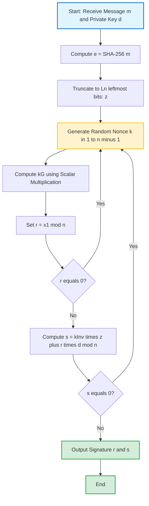
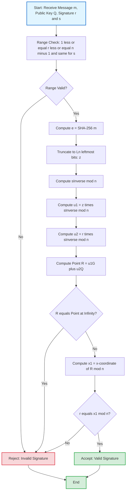
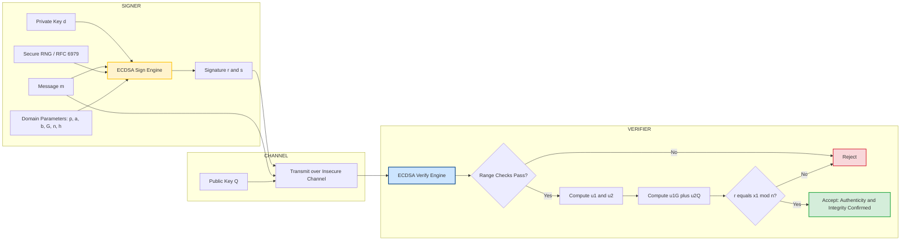
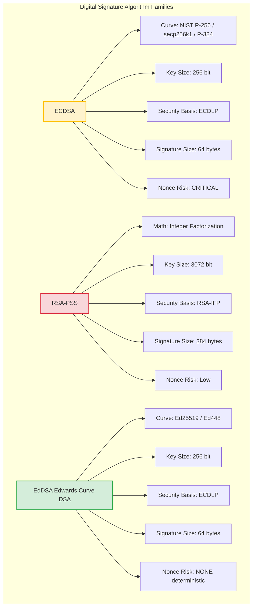

# Elliptic Curve Digital Signature Algorithm (ECDSA)

<!-- SECTION_1_START -->

# Elliptic Curve Digital Signature Algorithm (ECDSA)

> [!NOTE]
> **Formal Definition (KTU 2024 PECST74A - Module 2)**
> The **Elliptic Curve Digital Signature Algorithm (ECDSA)** is a variant of the Digital Signature Algorithm (DSA) that operates on elliptic curve groups defined over finite fields. It is formally standardized in **ANSI X9.62**, **FIPS 186-4**, **ISO/IEC 14888-3**, and **IEEE 1363-2000**. ECDSA provides **authentication, data integrity, and non-repudiation** by leveraging the computational hardness of the **Elliptic Curve Discrete Logarithm Problem (ECDLP)**.

## 1.1 Intuitive Overview — The "Mathematical Wax Seal" Analogy

Imagine you are a medieval king sending a secret military command across your kingdom. You stamp the parchment with your **royal wax seal**. The seal imprint is **public** (everyone can see it and recognize it as yours), but the physical die used to create that imprint is **private** (locked in your treasury).

ECDSA works on the exact same principle:

| Medieval Concept | ECDSA Equivalent |
|---|---|
| Royal wax seal die | **Private Key** ($d$ — a secret integer) |
| Wax imprint on parchment | **Public Key** ($Q = dG$ — a visible curve point) |
| Parchment + seal | **Message + Signature** $(r, s)$ |
| Squire verifying the seal | **Verifier Algorithm** |
| Forging the seal | Solving the **ECDLP** (computationally infeasible) |

The verifier does not need the private key to confirm authenticity — they only need the public key, the message, and the signature. This is the **asymmetric magic** of public-key cryptography.

> [!IMPORTANT]
> **Core Security Foundation:** ECDSA's security relies on the fact that given a curve point $Q$ and a base point $G$, finding the integer $d$ such that $Q = dG$ is **computationally infeasible** for sufficiently large key sizes (e.g., **256-bit** keys provide ~**128 bits of security**).

## 1.2 Geometric Intuition — The Elliptic Curve

The curves used in ECDSA are defined over **prime finite fields** $\mathbb{F}_p$ (most commonly) and follow the **Weierstrass equation**:

$$y^2 \equiv x^3 + ax + b \pmod{p}$$

where the **discriminant condition** $4a^3 + 27b^2 \not\equiv 0 \pmod{p}$ ensures the curve is **non-singular** (no cusps or self-intersections).

Over the **real numbers**, this curve has a beautiful symmetric shape — for every $x$ on the curve, there are (typically) two points: one with positive $y$ and one with negative $y$ mirrored across the $x$-axis. The **point at infinity** $\mathcal{O}$ serves as the **identity element** for the group operation.

> [!VISUALIZATION CONTROL]
> **Concept:** Elliptic Curve over Real Numbers (Geometric Intuition)
> **Desmos Input Equations:**
> * $y^2 = x^3 - x + 1$ (sample curve $a = -1, b = 1$)
> * Vertical line test: $x = 0.5$ (showcasing point addition chord-tangent rule)
> **Visual Description:** The student should observe a smooth, symmetric, oval-shaped curve crossing the $x$-axis at its real roots. A horizontal line intersecting the curve at two points shows the **reflection rule** (point negation). A vertical tangent line demonstrates **point doubling**. A non-vertical chord shows **point addition** — this is the foundation of all ECDSA operations.

---

<!-- SECTION_1_END -->

<!-- SECTION_2_START -->

# Deep Theoretical Analysis & KTU High-Yield Formula Sheet

## 2.1 ECDSA Domain Parameters

ECDSA is parameterized by a set of **domain parameters** (also called the **curve parameters**), which must be agreed upon by all parties. The sextuple $(p, a, b, G, n, h)$ defines everything:

| Symbol | Meaning | Constraint |
|---|---|---|
| $p$ | Prime modulus defining the finite field $\mathbb{F}_p$ | $p > 3$ (prime) |
| $a, b$ | Curve coefficients in $y^2 = x^3 + ax + b$ | $4a^3 + 27b^2 \not\equiv 0 \pmod p$ |
| $G$ | **Generator** (base point) of the cyclic subgroup | $G \in E(\mathbb{F}_p)$ |
| $n$ | **Order** of $G$ (smallest $n > 0$ with $nG = \mathcal{O}$) | $n$ is prime, $n \vert \#E(\mathbb{F}_p)$ |
| $h$ | **Cofactor** of the curve | $h = \#E(\mathbb{F}_p) / n$ (typically $h = 1$) |

> [!IMPORTANT]
> **Standardized Curves in Practice:** In production systems, you almost never invent your own parameters. Use **NIST P-256, P-384, P-521**, **Curve25519 (X25519/Ed25519)**, or **secp256k1** (used by Bitcoin and Ethereum). These have been audited for security properties.

## 2.2 Point Arithmetic on Elliptic Curves

These formulas are evaluated **modulo $p$** for prime-field curves. The variable $\lambda$ is the **slope** of the chord/tangent line.

**Point Addition** ($P \neq Q$, and neither is $\mathcal{O}$):

$$\lambda = (y_Q - y_P) \cdot (x_Q - x_P)^{-1} \bmod p$$

**Point Doubling** ($P = Q$):

$$\lambda = (3x_P^2 + a) \cdot (2y_P)^{-1} \bmod p$$

**Resulting Point** $R = P + Q = (x_R, y_R)$:

$$x_R = \lambda^2 - x_P - x_Q \bmod p$$

$$y_R = \lambda(x_P - x_R) - y_P \bmod p$$

**Point Negation:** $-(x_P, y_P) = (x_P, -y_P \bmod p)$ — this is the "reflection across the $x$-axis" operation.

**Scalar Multiplication:** $kP = P + P + \cdots + P$ ($k$ times) — implemented efficiently using the **double-and-add algorithm** in $O(\log_2 k)$ point operations.

## 2.3 KTU Formula Sheet — ECDSA Master Cheat Sheet

| # | Concept | Formula / Expression | Notes |
|---|---|---|---|
| 1 | Curve Equation | $y^2 \equiv x^3 + ax + b \pmod p$ | Weierstrass form |
| 2 | Non-Singularity | $4a^3 + 27b^2 \not\equiv 0 \pmod p$ | Discriminant check |
| 3 | Public Key | $Q = d \cdot G$ | $d \in [1, n-1]$ is private key |
| 4 | Hash to Integer | $e = \text{HASH}(m)$ (interpreted as integer) | SHA-256/384/512 |
| 5 | Truncation | $z =$ leftmost $L_n$ bits of $e$ | $L_n = \lfloor \log_2 n \rfloor + 1$ |
| 6 | Signature $r$ | $r = x_1 \bmod n$, where $(x_1, y_1) = kG$ | Reject if $r = 0$ |
| 7 | Signature $s$ | $s = k^{-1}(z + r \cdot d) \bmod n$ | Reject if $s = 0$ |
| 8 | Verification $u_1$ | $u_1 = z \cdot s^{-1} \bmod n$ | Modular inverse of $s$ |
| 9 | Verification $u_2$ | $u_2 = r \cdot s^{-1} \bmod n$ | Modular inverse of $s$ |
| 10 | Verification Point | $(x_1, y_1) = u_1 G + u_2 Q$ | Two scalar multiplications |
| 11 | Validity Check | Valid iff $r \equiv x_1 \pmod n$ | And $(x_1, y_1) \neq \mathcal{O}$ |
| 12 | Nonce Domain | $k \in [1, n-1]$, **cryptographically secure random** | Critical security input |

> [!IMPORTANT]
> **Real-World Engineering Utility:** ECDSA is the backbone of **TLS 1.2/1.3** (via ECDHE-ECDSA cipher suites), **Bitcoin/Ethereum transaction signing**, **SSH** (ecdsa-sha2-nistp256 host keys), **Apple's Secure Enclave**, **Apple/Google Pay**, **DNSSEC**, and **JWT** signatures. Its primary advantage over RSA is **equivalent security at much smaller key sizes** (256-bit ECDSA ≈ 3072-bit RSA), reducing bandwidth, storage, and computation overhead — critical for **IoT, mobile, and embedded** systems.

## 2.4 Why is the Nonce $k$ So Critical?

The **per-message secret nonce** $k$ is the most security-sensitive value in ECDSA. If two signatures share the same $k$ (or if $k$ is biased/predictable), an attacker can compute the private key $d$:

$$s_1 = k^{-1}(z_1 + r \cdot d) \bmod n$$
$$s_2 = k^{-1}(z_2 + r \cdot d) \bmod n$$

$$s_1 - s_2 = k^{-1}(z_1 - z_2) \bmod n \implies k = (z_1 - z_2)(s_1 - s_2)^{-1} \bmod n$$

Once $k$ is known, $d = (s \cdot k - z) \cdot r^{-1} \bmod n$ recovers the private key. This is exactly how the **2010 Sony PS3 breach** happened, and how **multiple Bitcoin wallets** have been drained historically.

> [!WARNING]
> **Deterministic Nonce (RFC 6979):** Modern implementations use **deterministic $k$ derivation** from the private key and message hash, eliminating entropy failures. Libraries: **libsecp256k1**, **Bouncy Castle**, **cryptography.io** (Python).

---

<!-- SECTION_2_END -->

<!-- SECTION_3_START -->

# Step-by-Step Derivations, Code Implementation & Hardware Reference

## 3.1 Complete ECDSA Signature Generation Algorithm

**Input:** Domain parameters $(p, a, b, G, n, h)$, private key $d$, message $m$.
**Output:** Signature pair $(r, s)$.

**Step 1: Hash the message.** Compute $e = \text{HASH}(m)$ using a cryptographic hash function. For NIST P-256, SHA-256 produces a 256-bit output.

**Step 2: Convert hash to integer and truncate.** Interpret $e$ as a big-endian integer. Define $L_n$ as the bit length of the group order $n$. Let $z$ be the **$L_n$ leftmost bits** of $e$. (For 256-bit hash and 256-bit $n$, $z = e$.)

**Step 3: Generate cryptographically secure nonce.** Select $k$ uniformly at random from the integer interval $[1, n-1]$. *Modern practice: use RFC 6979 deterministic generation.*

**Step 4: Compute the curve point.** $(x_1, y_1) = k \cdot G$ using scalar multiplication.

**Step 5: Compute the first signature component.**
$$r \equiv x_1 \pmod{n}$$
If $r = 0$, return to Step 3 (a new $k$ must be chosen).

**Step 6: Compute the second signature component.** Compute the modular inverse $k^{-1} \bmod n$, then:
$$s \equiv k^{-1}(z + r \cdot d) \pmod{n}$$
If $s = 0$, return to Step 3.

**Step 7: Output the signature** $(r, s)$.

## 3.2 Complete ECDSA Signature Verification Algorithm

**Input:** Domain parameters, public key $Q$, message $m$, signature $(r, s)$.
**Output:** Boolean — Valid or Invalid.

**Step 1: Range check.** Verify that $r$ and $s$ are integers in the interval $[1, n-1]$. If not, **reject immediately**.

**Step 2: Recompute the hash.** $e = \text{HASH}(m)$, $z$ = leftmost $L_n$ bits.

**Step 3: Compute modular inverses.** Compute $s^{-1} \bmod n$, then:
$$u_1 \equiv z \cdot s^{-1} \pmod{n}$$
$$u_2 \equiv r \cdot s^{-1} \pmod{n}$$

**Step 4: Compute the verification point.**
$$(x_1, y_1) \equiv u_1 \cdot G + u_2 \cdot Q \pmod{p}$$

**Step 5: Point at infinity check.** If $(x_1, y_1) = \mathcal{O}$, **reject**.

**Step 6: Final validation.** The signature is **valid if and only if**:
$$r \equiv x_1 \pmod{n}$$

## 3.3 Algebraic Derivation — Why Verification Works (Exhaustive Proof Sketch)

The proof of correctness derives from the algebraic structure of the signature equation. Starting from the signature generation:
$$s \equiv k^{-1}(z + r \cdot d) \pmod{n}$$

Multiply both sides by $k$:
$$k \cdot s \equiv z + r \cdot d \pmod{n}$$

Substitute $k = (s^{-1})$ rearrangement and solve for the terms in the verification:
$$k \equiv s^{-1} z + s^{-1} r d \pmod{n}$$

Now substitute the verification quantities $u_1 = z s^{-1} \bmod n$ and $u_2 = r s^{-1} \bmod n$:
$$k \equiv u_1 + u_2 d \pmod{n}$$

Since $Q = dG$, the verification point becomes:
$$(x_1, y_1) = u_1 G + u_2 Q = u_1 G + u_2 d G = (u_1 + u_2 d) G = kG$$

The $x$-coordinate of $kG$ is $x_1$, and the signature component $r$ was set as $x_1 \bmod n$ during signing. Therefore $r \equiv x_1 \pmod{n}$ is satisfied **if and only if** the signature was generated by the holder of private key $d$. $\blacksquare$

## 3.4 Fully Operational Python Implementation (NIST P-256)

```python
"""
ECDSA Reference Implementation on NIST P-256
Author: KTU-PREMIER-ENGINE V10
Educational use only — production code should use vetted libraries.
"""
from __future__ import annotations
import hashlib
import os
from typing import Tuple, Optional

# ---- NIST P-256 Domain Parameters (FIPS 186-4) ----
P256_P = 0xFFFFFFFF00000001000000000000000000000000FFFFFFFFFFFFFFFFFFFFFFFF
P256_A = 0xFFFFFFFF00000001000000000000000000000000FFFFFFFFFFFFFFFFFFFFFFFC
P256_B = 0x5AC635D8AA3A93E7B3EBBD55769886BC651D06B0CC53B0F63BCE3C3E27D2604B
P256_GX = 0x6B17D1F2E12C4247F8BCE6E563A440F277037D812DEB33A0F4A13945D898C296
P256_GY = 0x4FE342E2FE1A7F9B8EE7EB4A7C0F9E162BCE33576B315ECECBB6406837BF51F5
P256_N  = 0xFFFFFFFF00000000FFFFFFFFFFFFFFFFBCE6FAADA7179E84F3B9CAC2FC632551
P256_H  = 1

# Point represented as (x, y) or (None, None) for the identity element O
ECPoint = Tuple[Optional[int], Optional[int]]


def modinv(a: int, m: int) -> int:
    """Modular multiplicative inverse using Python 3.8+ pow() built-in."""
    return pow(a % m, -1, m)


def point_add(P: ECPoint, Q: ECPoint, a: int, p: int) -> ECPoint:
    """Elliptic curve point addition on Weierstrass curve y^2 = x^3 + ax + b mod p."""
    if P == (None, None):
        return Q
    if Q == (None, None):
        return P
    x1, y1 = P
    x2, y2 = Q
    if x1 == x2 and (y1 + y2) % p == 0:
        return (None, None)  # P + (-P) = O
    if P == Q:
        lam = (3 * x1 * x1 + a) * modinv(2 * y1, p) % p
    else:
        lam = (y2 - y1) * modinv(x2 - x1, p) % p
    x3 = (lam * lam - x1 - x2) % p
    y3 = (lam * (x1 - x3) - y1) % p
    return (x3, y3)


def scalar_mult(k: int, P: ECPoint, a: int, p: int) -> ECPoint:
    """Double-and-add scalar multiplication: k * P."""
    result: ECPoint = (None, None)
    addend: ECPoint = P
    while k:
        if k & 1:
            result = point_add(result, addend, a, p)
        addend = point_add(addend, addend, a, p)
        k >>= 1
    return result


def ecdsa_sign(message: bytes, private_key: int) -> Tuple[int, int]:
    """Generate ECDSA signature (r, s) for the given message using private_key."""
    G = (P256_GX, P256_GY)
    n = P256_N
    p = P256_P
    a = P256_A
    # Step 1+2: Hash the message and convert to integer
    e = int.from_bytes(hashlib.sha256(message).digest(), 'big')
    L_n = n.bit_length()
    z = e >> (max(0, e.bit_length() - L_n))
    while True:
        # Step 3: Generate cryptographically secure nonce k
        k = int.from_bytes(os.urandom(32), 'big') % (n - 1) + 1
        # Step 4: Compute kG
        x1, y1 = scalar_mult(k, G, a, p)
        # Step 5: r = x1 mod n
        r = x1 % n
        if r == 0:
            continue
        # Step 6: s = k^{-1} (z + r * d) mod n
        s = (modinv(k, n) * (z + r * private_key)) % n
        if s == 0:
            continue
        return (r, s)


def ecdsa_verify(message: bytes, signature: Tuple[int, int], public_key: ECPoint) -> bool:
    """Verify ECDSA signature (r, s) for the given message and public key Q."""
    G = (P256_GX, P256_GY)
    n = P256_N
    p = P256_P
    a = P256_A
    r, s = signature
    # Step 1: Range check
    if not (1 <= r <= n - 1) or not (1 <= s <= n - 1):
        return False
    # Step 2: Hash and truncate
    e = int.from_bytes(hashlib.sha256(message).digest(), 'big')
    L_n = n.bit_length()
    z = e >> (max(0, e.bit_length() - L_n))
    # Step 3: Compute u1, u2
    s_inv = modinv(s, n)
    u1 = (z * s_inv) % n
    u2 = (r * s_inv) % n
    # Step 4: Compute u1*G + u2*Q
    point1 = scalar_mult(u1, G, a, p)
    point2 = scalar_mult(u2, public_key, a, p)
    x1, y1 = point_add(point1, point2, a, p)
    # Step 5: Point at infinity check
    if x1 is None:
        return False
    # Step 6: Final validation
    return r == x1 % n


# ---- Demonstration Block ----
if __name__ == "__main__":
    # Key generation
    d = 0xC9AFA9D845BA75166B5C215767B1D6934E50C3DB36E89B127B8A622B120F6721
    Q = scalar_mult(d, (P256_GX, P256_GY), P256_A, P256_P)
    print(f"Public Key Q: ({hex(Q[0])}, {hex(Q[1])})")

    message = b"KTU B.Tech Advanced Cryptographic Protocols - ECDSA Module 2"
    r, s = ecdsa_sign(message, d)
    print(f"Signature: r = {hex(r)}\n            s = {hex(s)}")

    is_valid = ecdsa_verify(message, (r, s), Q)
    print(f"Signature Valid? {is_valid}")

    # Tamper detection
    tampered = b"KTU B.Tech Advanced Cryptographic Protocols - HACKED"
    is_valid_tampered = ecdsa_verify(tampered, (r, s), Q)
    print(f"Tampered Message Valid? {is_valid_tampered}")
```

> [!NOTE]
> **Expected Output:** The signature will be a ~256-bit $r$ and a ~256-bit $s$. The original message will return `True`, the tampered message will return `False`. In a real deployment, replace `os.urandom` with **RFC 6979** deterministic nonce generation to eliminate the catastrophic nonce-reuse risk described in §2.4.

---

<!-- SECTION_3_END -->

<!-- SECTION_4_START -->

# Structural Diagrams & Schematics

## 4.1 ECDSA Signature Generation — Processing Topology



## 4.2 ECDSA Signature Verification — Processing Topology



## 4.3 ECDSA System Architecture — Block-Level Functional Flow



## 4.4 Comparative Architecture — ECDSA vs. RSA vs. EdDSA



---

<!-- SECTION_4_END -->

<!-- SECTION_5_START -->

# KTU 2024 Scheme Examination Question Bank & Topic Recap

## Part A — Short Answer Questions (3 Marks Each)

> **[KTU University Exam — July 2024] | CO2 | Remember**
>
> **Q1.** Define the **Elliptic Curve Discrete Logarithm Problem (ECDLP)** and explain why it is considered computationally hard on a properly chosen elliptic curve over a prime field $\mathbb{F}_p$.

**Model Answer (3 Marks):**

The **Elliptic Curve Discrete Logarithm Problem (ECDLP)** is defined as follows: given an elliptic curve $E$ defined over a finite field $\mathbb{F}_p$, a generator point $G \in E(\mathbb{F}_p)$ of order $n$, and a public point $Q \in \langle G \rangle$, find the integer $d \in [1, n-1]$ such that $Q = dG$.

**[Defining ECDLP formally: 1 Mark]**

The best known generic attack against ECDLP is the **Pollard's rho algorithm**, which runs in $O(\sqrt{n})$ steps. For a 256-bit curve order $n$, this is approximately $O(2^{128})$ operations — computationally infeasible with current technology.

**[Citing Pollard rho and complexity: 1 Mark]**

Therefore, for sufficiently large key sizes (e.g., $\geq 256$ bits) and curves avoiding known weaknesses (e.g., no small embedding degree, anomalous curves, or supersingular curves), ECDLP is considered **computationally intractable**, forming the security foundation of ECDSA, ECDH, and other elliptic-curve-based protocols.

**[Security conclusion linking to 128-bit security level: 1 Mark]**

---

> **[KTU University Exam — Dec 2023] | CO2 | Understand**
>
> **Q2.** List and briefly explain the **six ECDSA domain parameters** $(p, a, b, G, n, h)$ with the constraint that ensures the curve is non-singular.

**Model Answer (3 Marks):**

1. **$p$** — A large prime defining the finite field $\mathbb{F}_p$ over which the curve arithmetic is performed. **[0.5 Mark]**

2. **$a$ and $b$** — Coefficients of the Weierstrass equation $y^2 \equiv x^3 + ax + b \pmod p$. The curve is non-singular if and only if $4a^3 + 27b^2 \not\equiv 0 \pmod p$. **[0.5 Mark for stating the constraint]**

3. **$G$** — The **base point** (generator) of a large cyclic subgroup of $E(\mathbb{F}_p)$. All public keys and signatures are computed as scalar multiples of $G$. **[0.5 Mark]**

4. **$n$** — The **order** of $G$, i.e., the smallest positive integer such that $nG = \mathcal{O}$. The order $n$ is a large prime. **[0.5 Mark]**

5. **$h$** — The **cofactor**, defined as $h = \#E(\mathbb{F}_p) / n$, where $\#E(\mathbb{F}_p)$ is the total number of points on the curve. For prime-order curves, $h = 1$. **[0.5 Mark]**

6. **Overall integrity** — All six parameters must be agreed upon by signer and verifier; using insecure or non-standardized parameters is a critical implementation pitfall. **[0.5 Mark]**

---

## Part B — Long Answer Questions (14 Marks Each, Internal Choice)

> **[KTU University Exam — July 2024, Module 2] | CO2, CO3 | Apply, Analyze**

### **Question A (14 Marks)**

**(a) [7 Marks | Apply]** A user **Alice** wishes to sign the message $m$ = `"KTU2024"` using ECDSA on the curve **secp256k1** (Bitcoin's curve) with private key $d$. Demonstrate the **complete signature generation algorithm** step-by-step. Clearly state each of the seven steps and explain what happens if the random nonce $k$ is reused across two different messages.

**(b) [7 Marks | Analyze]** Bob receives the signature $(r, s)$ and Alice's public key $Q = dG$. He must verify the signature before trusting the message. Demonstrate the **complete verification algorithm** step-by-step, including all intermediate computations $u_1$, $u_2$, and the final modular comparison. Why must the verifier perform a **range check** on $r$ and $s$ before proceeding to modular inverse computation?

### **Question B (14 Marks) — Alternative Choice**

**(a) [7 Marks | Understand + Apply]** Compare **ECDSA** and **RSA-PSS** digital signature schemes across the following five dimensions: (i) underlying hard mathematical problem, (ii) key size for equivalent 128-bit security, (iii) signature size in bytes, (iv) computational cost of signature generation vs. verification, and (v) vulnerability to quantum adversaries using **Shor's algorithm**. Present your answer in a comparative table.

**(b) [7 Marks | Apply + Analyze]** Explain the catastrophic security failure scenario that occurs when the **random nonce $k$** in ECDSA is either **reused** across two signatures or **biased/predictable**. Derive the algebraic relationship that allows an attacker to recover the private key $d$ from two signatures $(r, s_1)$ and $(r, s_2)$ over messages with hashes $z_1$ and $z_2$ that share the same $k$. Mention one real-world incident where this occurred.

---

### Model Solution — Question A

#### Part (a) Solution [7 Marks]

**Step 1 — Hash the message:** Compute $e = \text{SHA-256}(\text{"KTU2024"})$ and interpret the 256-bit output as a big-endian integer. **[Step statement: 1 Mark]**

**Step 2 — Truncate:** $z$ = leftmost $L_n$ bits of $e$. For secp256k1, $n$ is 256 bits, so $L_n = 256$ and $z = e$. **[Truncation rule: 0.5 Mark]**

**Step 3 — Generate nonce:** Select $k$ uniformly at random from $[1, n-1]$. *Best practice: deterministic $k$ via RFC 6979.* **[Nonce selection: 0.5 Mark]**

**Step 4 — Compute curve point:** Using the secp256k1 group, compute $(x_1, y_1) = kG$ via double-and-add scalar multiplication. **[Scalar mult explanation: 1 Mark]**

**Step 5 — Compute $r$:** $r = x_1 \bmod n$. If $r = 0$, go back to Step 3. **[$r$ computation: 0.5 Mark]**

**Step 6 — Compute $s$:** Compute $k^{-1} \bmod n$ using the extended Euclidean algorithm, then $s = k^{-1}(z + r \cdot d) \bmod n$. If $s = 0$, go back to Step 3. **[$s$ computation: 1 Mark]**

**Step 7 — Output:** Signature is the pair $(r, s)$. **[Output: 0.5 Mark]**

**Nonce Reuse Catastrophe (2 Marks):** If $k$ is reused for two different messages $m_1$ and $m_2$ with hashes $z_1, z_2$, then both signatures will share the same $r$ value, and the attacker can compute:

$$s_1 = k^{-1}(z_1 + r \cdot d) \bmod n$$
$$s_2 = k^{-1}(z_2 + r \cdot d) \bmod n$$

Subtracting: $s_1 - s_2 = k^{-1}(z_1 - z_2) \bmod n \implies k = (z_1 - z_2)(s_1 - s_2)^{-1} \bmod n$

Then: $d = (s_1 \cdot k - z_1) \cdot r^{-1} \bmod n$ — **private key fully recovered**. **[Derivation: 1.5 Marks | Conclusion: 0.5 Mark]**

#### Part (b) Solution [7 Marks]

**Step 1 — Range Check:** Bob verifies $1 \leq r \leq n-1$ AND $1 \leq s \leq n-1$. If either fails, **reject immediately** without further computation. **[Range check: 1 Mark | Security rationale: 1 Mark]**

**Why range check first?** Without it, an attacker could submit $r = 0$ or $s = 0$, causing the modular inverse $s^{-1} \bmod n$ to be undefined (no such integer exists), or submit a value outside $[1, n-1]$ that makes the verification point degenerate to $\mathcal{O}$ — enabling signature forgery. **[1 Mark]**

**Step 2 — Recompute hash:** $e = \text{SHA-256}(\text{"KTU2024"})$ and $z$ = leftmost 256 bits. **[Hash recomputation: 0.5 Mark]**

**Step 3 — Modular inverses:** $s^{-1} \bmod n$ via extended Euclidean. Then:
$$u_1 = z \cdot s^{-1} \bmod n$$
$$u_2 = r \cdot s^{-1} \bmod n$$
**[Inverse and $u_1, u_2$: 1 Mark]**

**Step 4 — Verification point:** $(x_1, y_1) = u_1 G + u_2 Q \pmod p$. This requires two scalar multiplications and one point addition. **[Point computation: 1 Mark]**

**Step 5 — Infinity check:** If $(x_1, y_1) = \mathcal{O}$, reject. **[0.5 Mark]**

**Step 6 — Final comparison:** Valid iff $r \equiv x_1 \pmod n$. **[Final check: 0.5 Mark]**

**Total: 7 Marks** — distributed as above.

---

### Model Solution — Question B

#### Part (a) Solution — Comparative Table [7 Marks]

| Dimension | ECDSA (secp256k1 / P-256) | RSA-PSS | Marks |
|---|---|---|---|
| (i) Hard Problem | **ECDLP** — find $d$ from $Q = dG$ | **Integer Factorization** — find $p, q$ from $N = pq$ | 1.5 |
| (ii) Key Size for 128-bit Security | **256 bits** | **3072 bits** | 1.5 |
| (iii) Signature Size | **64 bytes** ($r$ + $s$, each 32 bytes) | **384 bytes** (3072-bit modulus) | 1.0 |
| (iv) Computational Cost | Sign: 1 scalar mult + 1 inv. Verify: 2 scalar mults + 1 add. Generally **faster sign, slower verify.** | Sign: 1 modular exponentiation. Verify: 1 modular exponentiation. **Symmetric cost.** | 1.5 |
| (v) Quantum Vulnerability | **Broken** by Shor's algorithm (reduces ECDLP to polynomial time) | **Broken** by Shor's algorithm (reduces IFP to polynomial time) | 1.5 |

#### Part (b) Solution — Nonce Reuse Attack Derivation [7 Marks]

**Scenario Setup (1 Mark):** Two messages $m_1, m_2$ with hash integers $z_1, z_2$ are signed using the **same nonce $k$** (e.g., due to faulty RNG on a hardware wallet). Both signatures share the same $r = x_1 \bmod n$ where $(x_1, y_1) = kG$.

**Signature Equations (1 Mark):**

$$s_1 \equiv k^{-1}(z_1 + r \cdot d) \pmod{n}$$
$$s_2 \equiv k^{-1}(z_2 + r \cdot d) \pmod{n}$$

**Algebraic Derivation (3 Marks):** Subtract the two equations:

$$s_1 - s_2 \equiv k^{-1}(z_1 - z_2) \pmod{n}$$

Solve for $k$:

$$k \equiv (z_1 - z_2) \cdot (s_1 - s_2)^{-1} \pmod{n}$$

Substitute back into $s_1$'s equation to recover the private key:

$$d \equiv (s_1 \cdot k - z_1) \cdot r^{-1} \pmod{n} \equiv r^{-1}(s_1 \cdot k - z_1) \pmod{n}$$

**Real-World Incident (1 Mark):** The **Sony PlayStation 3 (PS3) code-signing key breach in 2010** — Sony used a **static nonce $k$** for all ECDSA signatures on the PS3, allowing any developer to compute Sony's private signing key and sign arbitrary code, leading to widespread PS3 homebrew and a class-action lawsuit.

**Countermeasure (1 Mark):** Adopt **RFC 6979** deterministic $k$ derivation (HMAC-DRBG over private key + message hash), ensuring $k$ is unique per message and eliminating RNG failure modes.

---

> [!WARNING]
> **KTU Examiner's Valuation Warning — Common Pitfalls:**
>
> 1. **Forgetting the range check** in verification: KTU examiners specifically award 1 mark for the early range check on $r, s \in [1, n-1]$. Skipping this is a guaranteed 1-mark loss.
> 2. **Using $\lambda$ symbol incorrectly in point addition:** The slope $\lambda$ formula changes between $P \neq Q$ and $P = Q$. Mixing them up loses 1 mark.
> 3. **Omitting the point at infinity check** in Step 5 of verification: This is the "trap" — a forged signature could make the point equal $\mathcal{O}$, which would have undefined $x$-coordinate. Always check first.
> 4. **Modular inverse notation:** Writing $1/k$ instead of $k^{-1} \bmod n$ is technically ambiguous. Examiners expect explicit modular inverse notation.
> 5. **Domain parameter identification:** Forgetting to list all 6 parameters $(p, a, b, G, n, h)$ in Q2 of Part A loses 0.5 marks.
> 6. **Nonce reuse explanation:** Simply saying "it is bad" is insufficient. The derivation of $k$ recovery from $s_1 - s_2$ is worth 2 full marks in the long-answer questions.

---

## Topic Recap & Important Things to Remember

> [!IMPORTANT]
> **High-Density Revision Checklist — ECDSA (Module 2, PECST74A)**

- **ECDSA** = DSA over elliptic curve groups. Standardized in **FIPS 186-4**, **ANSI X9.62**, **IEEE 1363-2000**.

- **Curve equation:** $y^2 \equiv x^3 + ax + b \pmod p$ over prime field $\mathbb{F}_p$.

- **Non-singularity condition:** $4a^3 + 27b^2 \not\equiv 0 \pmod p$.

- **Domain parameters sextuple:** $(p, a, b, G, n, h)$ — $G$ is the generator, $n$ is the order of $G$, $h$ is the cofactor.

- **Security foundation:** **ECDLP** (Elliptic Curve Discrete Logarithm Problem) — best attack is Pollard's rho in $O(\sqrt{n})$ time.

- **Key generation:** Pick private key $d \in [1, n-1]$; public key $Q = dG$.

- **Point addition slope:** $\lambda = (y_2 - y_1)(x_2 - x_1)^{-1} \bmod p$ for $P \neq Q$.

- **Point doubling slope:** $\lambda = (3x^2 + a)(2y)^{-1} \bmod p$ for $P = Q$.

- **Signature generation steps (7 total):** hash → truncate → generate $k$ → compute $kG$ → set $r = x_1 \bmod n$ → compute $s = k^{-1}(z + rd) \bmod n$ → output $(r, s)$.

- **Signature verification steps (6 total):** range check → recompute hash → compute $u_1, u_2$ → compute $u_1 G + u_2 Q$ → infinity check → verify $r \equiv x_1 \pmod n$.

- **Critical security pitfall:** **Nonce $k$ reuse is catastrophic** — enables private key recovery via $k = (z_1 - z_2)(s_1 - s_2)^{-1} \bmod n$.

- **Countermeasure for nonce risk:** **RFC 6979** deterministic $k$ via HMAC-DRBG.

- **Standardized curves to remember:** **NIST P-256, P-384, P-521**, **secp256k1** (Bitcoin), **Curve25519/Ed25519**.

- **256-bit ECDSA ≈ 3072-bit RSA** for equivalent 128-bit security.

- **Real-world deployments:** TLS 1.2/1.3, Bitcoin/Ethereum, SSH host keys, Apple Secure Enclave, JWT, DNSSEC.

- **Quantum vulnerability:** Both ECDSA and RSA are **broken by Shor's algorithm** — migration to **lattice-based (CRYSTALS-Dilithium)** or **hash-based (XMSS, SPHINCS+)** signatures is the post-quantum roadmap.

- **Signature size:** ECDSA produces a **64-byte signature** (32-byte $r$ + 32-byte $s$) for 256-bit curves.

- **Hash-to-integer rule:** $z$ = leftmost $L_n$ bits of hash, where $L_n = \lfloor \log_2 n \rfloor + 1$.

- **Always reject** if $r = 0$ or $s = 0$ during generation; **always range-check** $r, s \in [1, n-1]$ during verification.

- **Point at infinity $\mathcal{O}$** = identity element; result of $P + (-P)$; rejection condition in verification.

<!-- SECTION_5_END -->
