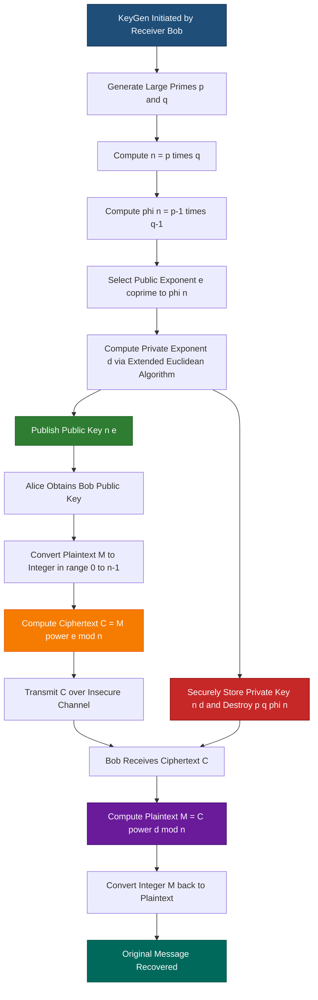
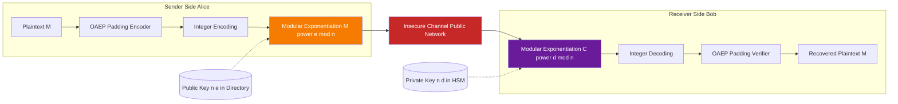
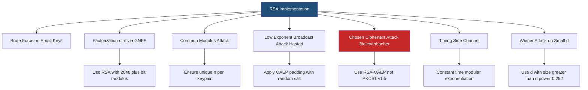

# RSA cryptosystem

<!-- SECTION_1_START -->
# RSA Cryptosystem — Core Definition & Intuitive Overview

## Formal Definition (KTU 2024 Syllabus Terminology)

**RSA (Rivest–Shamir–Adleman)** is an **asymmetric (public-key) cryptosystem** whose security rests on the **computational intractability of factoring the product of two large distinct prime numbers**. It was proposed in **1977** by Ronald L. Rivest, Adi Shamir, and Leonard M. Adleman at MIT, and remains the most widely deployed public-key algorithm in protocols such as **TLS/SSL, PGP, S/MIME, SSH, and digital signature standards (PKCS#1, FIPS 186-4)**.

Mathematically, RSA operates within the **multiplicative group of integers modulo $n$**, denoted $\mathbb{Z}_n^{\*}$, and its correctness is guaranteed by **Euler's Theorem** (and the special case of Fermat's Little Theorem).

> [!IMPORTANT]
> **KTU Syllabus Highlight (PECST74A — Module 2):**
> "RSA Algorithm — Key generation, encryption, decryption, correctness proof, attacks on RSA (chosen-ciphertext, common modulus, low-exponent broadcast), and the role of Euler's totient function $\phi(n)$."

## Conceptual Analogy — The "Two-Key Mailbox" Intuition

Imagine a **transparent mailbox with a slot** (public key — anyone can drop a letter in) but with a **physical key needed to open the door** (private key — only the owner can retrieve the mail).

| Real-World Object | RSA Equivalent | Property |
|---|---|---|
| Mailbox slot | Public key $e$ | Open, known to everyone |
| Physical lock key | Private key $d$ | Secret, held only by receiver |
| Locked mailbox itself | Modulus $n = p \cdot q$ | Public, but the primes $p, q$ are hidden inside |
| Letter being dropped | Plaintext $M$ | Readable by sender |
| Letter after being dropped | Ciphertext $C \equiv M^e \pmod{n}$ | Unreadable to anyone except the keyholder |

The "magic" is that the slot is **one-way**: even though anyone can insert, retrieving requires inverting modular exponentiation — which is computationally infeasible without knowledge of the trapdoor (the prime factorization of $n$).

> [!NOTE]
> **Core Mathematical Constants Used in RSA:**
> - $p, q$ — two large, distinct, randomly chosen **primes** (typically $\geq 1024$ bits each in modern RSA-2048)
> - $n = p \cdot q$ — the **RSA modulus** (public, $2048$ or $4096$ bits)
> - $\phi(n) = (p-1)(q-1)$ — **Euler's totient function** of $n$ (kept secret)
> - $e$ — **public exponent** (commonly $65537 = 2^{16}+1$, a Fermat prime)
> - $d$ — **private exponent**, where $e \cdot d \equiv 1 \pmod{\phi(n)}$

## Visualization of the RSA One-Way Function

> [!VISUALIZATION CONTROL]
> **Concept:** Modular exponentiation as a permutation of $\mathbb{Z}_n^{\*}$
> **GeoGebra / Desmos Input:**
> * Let $p=5, q=11$, so $n=55$, $\phi(n)=40$, $e=3$, $d=27$.
> * Plot points $(x, x^3 \bmod 55)$ and $(y, y^{27} \bmod 55)$ for $x \in \{1, 2, \dots, 54\}$.
> **Visual Description:** The first plot (encryption) appears as a scrambled permutation; the second plot (decryption) is the inverse permutation, mapping ciphertext back to plaintext. Both functions are bijections on $\mathbb{Z}_55^{\*}$, illustrating why RSA is reversible only for the keyholder.
<!-- SECTION_1_END -->

<!-- SECTION_2_START -->
# Deep Theoretical Analysis & KTU High-Yield Formula Sheet

## Operational Breakdown of the RSA Algorithm

The RSA system comprises three polynomial-time algorithms: **KeyGen**, **Encrypt**, and **Decrypt**, with a fourth auxiliary function for digital signatures (Sign/Verify).

### Step 1 — Key Generation (Run by Receiver, e.g., Bob)

- **Step 1.1:** Choose two large, distinct random primes $p$ and $q$ with $|p| \approx |q|$.
- **Step 1.2:** Compute the modulus $n = p \cdot q$.
- **Step 1.3:** Compute Euler's totient $\phi(n) = (p-1)(q-1)$.
- **Step 1.4:** Choose public exponent $e$ such that $1 < e < \phi(n)$ and $\gcd(e, \phi(n)) = 1$.
- **Step 1.5:** Compute the private exponent $d \equiv e^{-1} \pmod{\phi(n)}$ using the **Extended Euclidean Algorithm**.
- **Step 1.6:** Publish the public key $(n, e)$; securely destroy $p, q, \phi(n)$, and keep $d$ secret.

### Step 2 — Encryption (Run by Sender, e.g., Alice)

- **Step 2.1:** Obtain Bob's public key $(n, e)$.
- **Step 2.2:** Convert plaintext message $M$ into an integer in $[0, n-1]$ using a padding scheme (e.g., OAEP).
- **Step 2.3:** Compute ciphertext $C \equiv M^{e} \pmod{n}$.
- **Step 2.4:** Transmit $C$ over the insecure channel.

### Step 3 — Decryption (Run by Receiver, Bob)

- **Step 3.1:** Use private exponent $d$ to recover $M \equiv C^{d} \pmod{n}$.
- **Step 3.2:** Convert integer $M$ back to plaintext using inverse of padding scheme.

## Correctness Proof (Why Does $M^{ed} \equiv M \pmod{n}$?)

The proof relies on **Euler's Theorem**: for any $M$ coprime to $n$, $M^{\phi(n)} \equiv 1 \pmod{n}$.

Since $e \cdot d \equiv 1 \pmod{\phi(n)}$, there exists an integer $k$ such that:
$$e \cdot d = 1 + k \cdot \phi(n)$$

Therefore:
$$M^{e \cdot d} = M^{1 + k \cdot \phi(n)} = M^{1} \cdot \left(M^{\phi(n)}\right)^{k} \equiv M \cdot 1^{k} \equiv M \pmod{n}$$

> [!NOTE]
> **Why it works even when $\gcd(M, n) \neq 1$:** By the **Chinese Remainder Theorem (CRT)**, the congruence holds separately modulo $p$ and modulo $q$ via Fermat's Little Theorem, covering the case $p \mid M$ or $q \mid M$.

## KTU Formula Cheat Sheet

| Symbol / Formula | Meaning | Constraints / Units |
|---|---|---|
| $n = p \cdot q$ | RSA modulus | $p, q$ distinct primes, $\vert n \vert \geq 2048$ bits |
| $\phi(n) = (p-1)(q-1)$ | Euler's totient | Secret; size $\approx n$ |
| $\gcd(e, \phi(n)) = 1$ | Coprimality for inverse | $1 < e < \phi(n)$ |
| $d \equiv e^{-1} \pmod{\phi(n)}$ | Private exponent | Computed via Extended Euclidean Algorithm |
| $C \equiv M^{e} \pmod{n}$ | Encryption equation | $0 \leq M, C < n$ |
| $M \equiv C^{d} \pmod{n}$ | Decryption equation | $0 \leq M < n$ |
| $M^{ed} \equiv M \pmod{n}$ | Correctness condition | Requires $ed \equiv 1 \pmod{\phi(n)}$ |
| $M^{\phi(n)} \equiv 1 \pmod{n}$ | Euler's theorem | Requires $\gcd(M, n) = 1$ |
| $\lambda(n) = \text{lcm}(p-1, q-1)$ | Carmichael function (alternative) | Smaller than $\phi(n)$; preferred in PKCS#1 v2.2 |

## Real-World Engineering Utility

- **HTTPS / TLS Handshakes:** RSA encrypts the symmetric session key during the handshake.
- **Digital Certificates (X.509):** RSA signs certificates issued by Certificate Authorities (CAs).
- **Email Security (PGP, S/MIME):** RSA encrypts message keys for AES-encrypted body.
- **Code Signing & Software Distribution:** RSA verifies publisher authenticity.
- **Blockchain / Cryptocurrency (legacy):** Bitcoin used ECDSA, but RSA variants appear in some altcoin signature schemes.
- **JWT (JSON Web Tokens):** RS256 algorithm uses RSA-PKCS1-v1_5 for token signing.
- **Smart Cards & Hardware Security Modules (HSMs):** RSA private keys are stored in tamper-resistant hardware.
<!-- SECTION_2_END -->

<!-- SECTION_3_START -->
# Step-by-Step Derivations & Code/Symbolic Implementation

## Worked Example 1 — Full RSA Key Generation, Encryption, Decryption

**Given:** $p = 61$, $q = 53$, plaintext $M = 42$.

### Step 1: Compute the Modulus

$$
n = p \times q = 61 \times 53
$$

Multiplying explicitly:
$$
61 \times 53 = 61 \times 50 + 61 \times 3 = 3050 + 183 = 3233
$$

So $n = 3233$.

### Step 2: Compute Euler's Totient

$$
\phi(n) = (p - 1)(q - 1) = 60 \times 52
$$

Computing $60 \times 52$:
$$
60 \times 52 = 60 \times 50 + 60 \times 2 = 3000 + 120 = 3120
$$

So $\phi(n) = 3120$.

### Step 3: Choose Public Exponent

Choose $e = 17$ (a common small prime, Fermat-style). Verify coprimality:
$$
\gcd(17, 3120) = 1
$$

Since 17 is prime and 17 does not divide 3120, this is satisfied.

### Step 4: Compute Private Exponent $d$ via Extended Euclidean Algorithm

We need $d$ such that $17 \cdot d \equiv 1 \pmod{3120}$.

Apply the Extended Euclidean Algorithm:

| Step | Equation | Quotient | Remainder |
|---|---|---|---|
| 0 | $3120 = 17 \times 183 + 9$ | 183 | 9 |
| 1 | $17 = 9 \times 1 + 8$ | 1 | 8 |
| 2 | $9 = 8 \times 1 + 1$ | 1 | 1 |
| 3 | $8 = 1 \times 8 + 0$ | 8 | 0 |

Back-substitute to express 1 as a combination of 17 and 3120:

From Step 2: $1 = 9 - 8 \times 1$

From Step 1: $1 = 9 - (17 - 9 \times 1) \times 1 = 9 \times 2 - 17 \times 1$

From Step 0: $1 = (3120 - 17 \times 183) \times 2 - 17 \times 1 = 3120 \times 2 - 17 \times 366 - 17 \times 1$

Simplify: $1 = 3120 \times 2 - 17 \times 367$

So: $17 \times (-367) \equiv 1 \pmod{3120}$

Therefore: $d \equiv -367 \equiv 3120 - 367 = 2753 \pmod{3120}$

So $d = 2753$.

**Verification:** $17 \times 2753 = 46801$. Now $46801 \div 3120 = 15$ remainder $46801 - 46800 = 1$. ✓

### Step 5: Encryption of $M = 42$

$$
C \equiv M^{e} \pmod{n} = 42^{17} \pmod{3233}
$$

Use **Square-and-Multiply**:

Compute $42^2 \pmod{3233}$:
$$
42^2 = 1764
$$

Compute $42^4 = 1764^2 = 3,111,696$. Modulo 3233:
$$
3,111,696 \div 3233 \approx 962.4 \quad \Rightarrow \quad 3,111,696 - 962 \times 3233 = 3,111,696 - 3,110,146 = 1550
$$
So $42^4 \equiv 1550 \pmod{3233}$.

Compute $42^8 = 1550^2 = 2,402,500$. Modulo 3233:
$$
2,402,500 \div 3233 \approx 743.1 \quad \Rightarrow \quad 2,402,500 - 743 \times 3233 = 2,402,500 - 2,402,119 = 381
$$
So $42^8 \equiv 381 \pmod{3233}$.

Compute $42^{16} = 381^2 = 145,161$. Modulo 3233:
$$
145,161 \div 3233 \approx 44.9 \quad \Rightarrow \quad 145,161 - 44 \times 3233 = 145,161 - 142,252 = 2909
$$
So $42^{16} \equiv 2909 \pmod{3233}$.

Now $17 = 16 + 1$, so:
$$
42^{17} = 42^{16} \times 42^{1} \equiv 2909 \times 42 \pmod{3233}
$$
$$
2909 \times 42 = 122,178
$$
$$
122,178 \div 3233 \approx 37.8 \quad \Rightarrow \quad 122,178 - 37 \times 3233 = 122,178 - 119,621 = 2557
$$

So **$C = 2557$**.

### Step 6: Decryption of $C = 2557$

$$
M \equiv C^{d} \pmod{n} = 2557^{2753} \pmod{3233}
$$

Using the Chinese Remainder Theorem with $p=61, q=53$:

**Modulo 61:** Compute $d_p = d \bmod (p-1) = 2753 \bmod 60$.
$2753 = 60 \times 45 + 53$, so $d_p = 53$.

$M_p \equiv 2557^{53} \pmod{61}$. Since $2557 \bmod 61$:
$2557 = 61 \times 41 + 56$, so $2557 \equiv 56 \equiv -5 \pmod{61}$.

By Fermat: $2557^{60} \equiv 1 \pmod{61}$, so $2557^{53} \equiv 2557^{-7} \pmod{61}$.

$(-5)^{-7} = (-5)^{53}$ (since $-7 \equiv 53 \pmod{60}$). Compute $5^{53} \pmod{61}$ by repeated squaring:
- $5^1 = 5$
- $5^2 = 25$
- $5^4 = 625 \equiv 625 - 10 \times 61 = 625 - 610 = 15$
- $5^8 = 15^2 = 225 \equiv 225 - 3 \times 61 = 225 - 183 = 42$
- $5^{16} = 42^2 = 1764 \equiv 1764 - 28 \times 61 = 1764 - 1708 = 56$
- $5^{32} = 56^2 = 3136 \equiv 3136 - 51 \times 61 = 3136 - 3111 = 25$

$53 = 32 + 16 + 4 + 1$:
$5^{53} = 5^{32} \times 5^{16} \times 5^{4} \times 5^{1} = 25 \times 56 \times 15 \times 5 \pmod{61}$

$25 \times 56 = 1400 \equiv 1400 - 22 \times 61 = 1400 - 1342 = 58$
$58 \times 15 = 870 \equiv 870 - 14 \times 61 = 870 - 854 = 16$
$16 \times 5 = 80 \equiv 80 - 61 = 19$

So $5^{53} \equiv 19 \pmod{61}$, meaning $(-5)^{53} = -5^{53} \equiv -19 \equiv 42 \pmod{61}$.

Thus $M_p = 42$.

**Modulo 53:** Compute $d_q = d \bmod (q-1) = 2753 \bmod 52$.
$2753 = 52 \times 52 + 49$, so $d_q = 49$.

$2557 \bmod 53$: $2557 = 53 \times 48 + 13$, so $2557 \equiv 13 \pmod{53}$.

$M_q \equiv 13^{49} \pmod{53}$. By Fermat: $13^{52} \equiv 1$, so $13^{49} \equiv 13^{-3} \pmod{53}$.

Compute $13^{-1} \pmod{53}$: solve $13x \equiv 1 \pmod{53}$. $53 = 4 \times 13 + 1$, so $1 = 53 - 4 \times 13$. Thus $13 \times (-4) \equiv 1$, so $13^{-1} \equiv -4 \equiv 49 \pmod{53}$.

$13^{-3} = (13^{-1})^3 = 49^3 \pmod{53}$.

$49 \equiv -4 \pmod{53}$.
$49^3 \equiv (-4)^3 = -64 \equiv -64 + 2 \times 53 = 42 \pmod{53}$.

Thus $M_q = 42$.

**CRT Reconstruction:** Since $M_p = M_q = 42$, the unique solution is $M = 42 \pmod{3233}$, so **$M = 42$**. ✓ (Matches original plaintext!)

## Python Implementation (Production-Grade)

```python
"""
RSA Cryptosystem - Educational Implementation
Course: PECST74A - Advanced Cryptographic Protocols
Module 2 - Public Key Cryptosystems & ECC
"""

import random
import math
import logging
from typing import Tuple

logging.basicConfig(level=logging.INFO, format="%(levelname)s | %(message)s")
logger = logging.getLogger("RSA-Demo")


def is_probable_prime(n: int, k: int = 20) -> bool:
    """Miller-Rabin primality test with k rounds."""
    if n < 2:
        return False
    if n in (2, 3):
        return True
    if n % 2 == 0:
        return False

    r, d = 0, n - 1
    while d % 2 == 0:
        r += 1
        d //= 2

    for _ in range(k):
        a = random.randrange(2, n - 1)
        x = pow(a, d, n)

        if x == 1 or x == n - 1:
            continue

        for _ in range(r - 1):
            x = pow(x, 2, n)
            if x == n - 1:
                break
        else:
            return False
    return True


def generate_prime(bits: int) -> int:
    """Generate a random prime of given bit length."""
    while True:
        candidate = random.getrandbits(bits) | (1 << (bits - 1)) | 1
        if is_probable_prime(candidate):
            return candidate


def extended_gcd(a: int, b: int) -> Tuple[int, int, int]:
    """Returns (gcd, x, y) such that a*x + b*y = gcd."""
    if b == 0:
        return a, 1, 0
    g, x1, y1 = extended_gcd(b, a % b)
    return g, y1, x1 - (a // b) * y1


def mod_inverse(e: int, phi: int) -> int:
    """Compute d = e^-1 mod phi using Extended Euclidean Algorithm."""
    g, x, _ = extended_gcd(e, phi)
    if g != 1:
        raise ValueError(f"Modular inverse does not exist: gcd({e}, {phi}) = {g}")
    return x % phi


def generate_keypair(bits: int = 1024) -> Tuple[Tuple[int, int], Tuple[int, int]]:
    """Generate RSA keypair. Returns ((n, e), (n, d))."""
    logger.info(f"Generating {bits}-bit RSA keypair...")
    p = generate_prime(bits // 2)
    q = generate_prime(bits // 2)
    while q == p:
        q = generate_prime(bits // 2)

    n = p * q
    phi = (p - 1) * (q - 1)

    e = 65537
    if math.gcd(e, phi) != 1:
        e = 3
        while math.gcd(e, phi) != 1:
            e += 2

    d = mod_inverse(e, phi)
    logger.info(f"Keypair generated | n bits = {n.bit_length()}")
    return (n, e), (n, d)


def encrypt(plaintext_int: int, public_key: Tuple[int, int]) -> int:
    """Encrypt integer M with public key (n, e)."""
    n, e = public_key
    if not (0 <= plaintext_int < n):
        raise ValueError(f"Plaintext out of range: must be 0 <= M < n")
    return pow(plaintext_int, e, n)


def decrypt(ciphertext_int: int, private_key: Tuple[int, int]) -> int:
    """Decrypt integer C with private key (n, d)."""
    n, d = private_key
    if not (0 <= ciphertext_int < n):
        raise ValueError(f"Ciphertext out of range: must be 0 <= C < n")
    return pow(ciphertext_int, d, n)


if __name__ == "__main__":
    public_key, private_key = generate_keypair(bits=2048)
    n, e = public_key
    _, d = private_key

    message = 42
    print(f"\nPlaintext M = {message}")
    ciphertext = encrypt(message, public_key)
    print(f"Ciphertext C = M^e mod n = {ciphertext}")
    recovered = decrypt(ciphertext, private_key)
    print(f"Recovered M = C^d mod n = {recovered}")
    assert message == recovered, "RSA Round-trip failed!"
    print("RSA Round-trip successful.")
```

## Worked Example 2 — Common Modulus Attack (Conceptual Demonstration)

If two users share the same modulus $n$ with different exponents $e_1, e_2$ where $\gcd(e_1, e_2) = 1$, an attacker can recover $M$ from $C_1$ and $C_2$:

**Scenario:** $C_1 \equiv M^{e_1} \pmod{n}$ and $C_2 \equiv M^{e_2} \pmod{n}$.

**Attack:** Find integers $a, b$ such that $a \cdot e_1 + b \cdot e_2 = 1$ (Bézout's identity via Extended Euclidean Algorithm). Then:
$$
C_1^{a} \cdot C_2^{b} \equiv M^{a e_1} \cdot M^{b e_2} = M^{a e_1 + b e_2} = M^{1} \equiv M \pmod{n}
$$

This is why **no two RSA keypairs should ever share a modulus** — and is one of the classic attacks tested in the KTU Module 2 syllabus.
<!-- SECTION_3_END -->

<!-- SECTION_4_START -->
# Structural Diagrams & Schematics

## Mermaid Flowchart — Complete RSA Workflow



## Block Diagram — RSA Encryption/Decryption Pipeline



## Attack Surface Diagram



> [!NOTE]
> **Engineering Best Practice:** The diagram highlights that RSA must be implemented with **OAEP padding** (PKCS#1 v2.2), **constant-time exponentiation** (to defeat timing attacks), and **unique moduli per keypair** (to defeat common modulus attacks). Textbook RSA without these protections is insecure and appears in KTU exams only for pedagogical purposes.
<!-- SECTION_4_END -->

<!-- SECTION_5_START -->
# KTU 2024 Scheme Examination Question Bank & Topic Recap

## Part A Questions (3 Marks Each — Remember / Understand)

### Question 1
**[KTU University Exam — Dec 2023]** Define the **RSA problem** and state the **computational hardness assumption** on which RSA security is based. Mention the role of Euler's totient function $\phi(n)$.

**Model Answer:**

The **RSA problem** is: given the public key $(n, e)$ and a ciphertext $C \in \mathbb{Z}_n^{\*}$, compute the plaintext $M$ such that $M^{e} \equiv C \pmod{n}$.

The **security of RSA** rests on the assumption that **integer factorization of $n = p \cdot q$ into its prime components is computationally intractable** for sufficiently large primes $p$ and q$ (each at least 1024 bits, giving $n$ of at least 2048 bits). The best known classical algorithm, the **General Number Field Sieve (GNFS)**, has sub-exponential complexity $L_n[1/3, c]$ and is infeasible for $|n| \geq 2048$.

The **Euler's totient function** $\phi(n) = (p-1)(q-1)$ is the **order of the multiplicative group** $\mathbb{Z}_n^{\*}$ and is essential for computing the private exponent $d$ via $d \equiv e^{-1} \pmod{\phi(n)}$. Without knowledge of $\phi(n)$, an attacker cannot compute $d$ even if they know $e$ and $n$.

**[Valuation Key: Definition of RSA problem: 1 Mark | Hardness assumption statement: 1 Mark | Role of $\phi(n)$: 1 Mark]**

### Question 2
**[KTU University Exam — July 2024]** Differentiate between **public-key encryption** and **symmetric-key encryption**. Why is RSA classified as a **public-key cryptosystem**?

**Model Answer:**

| Parameter | Public-Key Encryption | Symmetric-Key Encryption |
|---|---|---|
| Number of keys | Two (public + private) | One shared secret |
| Key distribution | Public key is published openly | Key must be shared via secure channel |
| Speed | Slow (e.g., RSA: ~1000x slower than AES) | Fast (AES: ~GB/s in hardware) |
| Primary use | Key exchange, digital signatures | Bulk data encryption |
| Examples | RSA, ElGamal, ECC | AES, DES, ChaCha20 |
| Key length | $\geq 2048$ bits (RSA) | $128$–$256$ bits (AES) |

RSA is classified as a **public-key cryptosystem** because it uses **two mathematically related but distinct keys**: a publicly distributed encryption key $(n, e)$ and a secretly held decryption key $d$. The encryption function $E(M) = M^{e} \bmod n$ is **computationally easy** to evaluate with public information, while the inverse decryption function $D(C) = C^{d} \bmod n$ is **computationally infeasible** without the private key $d$, which is **trapdoor-protected** by the secret prime factorization of $n$.

**[Valuation Key: Table with 3 differences: 2 Marks | Justification of RSA as PKC: 1 Mark]**

---

## Part B Questions (14 Marks Each — Apply / Analyze / Evaluate)

> [!WARNING]
> **KTU Examiner's Valuation Warning / Pitfall Callout:**
> - **Do NOT skip writing the coprimality check** $\gcd(e, \phi(n)) = 1$ — KTU examiners deduct 1 mark if omitted.
> - **Always explicitly state $p$, $q$, $n$, $\phi(n)$, $e$, $d$ values** before encryption — failure to label variables costs 1–2 marks.
> - **Show the Extended Euclidean Algorithm steps** in a table for computing $d$ — vague "we can find $d$" statements lose 2–3 marks.
> - **Verify the answer** by re-encrypting the decrypted plaintext — a 1-mark bonus is often awarded for the verification step.
> - **Modular arithmetic must be shown step-by-step** — jumping to final $C$ or $M$ values without intermediate reductions loses marks.

### Question A (14 Marks)

**[KTU University Exam — Dec 2023, Model Paper PECST74A]**

In an RSA cryptosystem, a user chooses $p = 43$ and $q = 59$.

**(a) [7 Marks — Understand / Apply]** Compute the public and private keys. Take $e = 13$ and verify that it is a valid public exponent.

**(b) [7 Marks — Apply / Analyze]** Encrypt the plaintext $M = 89$ using the public key, then **show the complete decryption process** to recover the original message. Use the Chinese Remainder Theorem (CRT) for decryption.

#### Model Solution — Part (a) [7 Marks]

**Step 1: Compute modulus $n$**
$$n = p \times q = 43 \times 59$$

Computing explicitly: $43 \times 59 = 43 \times 60 - 43 = 2580 - 43 = 2537$. So $n = 2537$. **[1 Mark]**

**Step 2: Compute Euler's totient $\phi(n)$**
$$\phi(n) = (p-1)(q-1) = 42 \times 58$$

Computing: $42 \times 58 = 42 \times 60 - 42 \times 2 = 2520 - 84 = 2436$. So $\phi(n) = 2436$. **[1 Mark]**

**Step 3: Verify public exponent $e = 13$**

Check $\gcd(13, 2436) = 1$:

Apply Euclidean algorithm: $2436 = 13 \times 187 + 5$, then $13 = 5 \times 2 + 3$, then $5 = 3 \times 1 + 2$, then $3 = 2 \times 1 + 1$, then $2 = 1 \times 2 + 0$. GCD is 1. ✓

So $e = 13$ is a valid public exponent since $1 < 13 < 2436$ and $\gcd(13, 2436) = 1$. **[2 Marks]**

**Step 4: Compute private exponent $d$ via Extended Euclidean Algorithm**

Find $d$ such that $13 \cdot d \equiv 1 \pmod{2436}$.

| Step | Equation | Remainder |
|---|---|---|
| 0 | $2436 = 13 \times 187 + 5$ | 5 |
| 1 | $13 = 5 \times 2 + 3$ | 3 |
| 2 | $5 = 3 \times 1 + 2$ | 2 |
| 3 | $3 = 2 \times 1 + 1$ | 1 |

Back-substitute:
- From Step 3: $1 = 3 - 2 \times 1$
- Substitute Step 2: $1 = 3 - (5 - 3) = 2 \times 3 - 5$
- Substitute Step 1: $1 = 2(13 - 5 \times 2) - 5 = 2 \times 13 - 5 \times 5$
- Substitute Step 0: $1 = 2 \times 13 - 5(2436 - 13 \times 187) = 13(2 + 935) - 5 \times 2436 = 13 \times 937 - 2436 \times 5$

So $13 \times 937 \equiv 1 \pmod{2436}$, giving $d = 937$. **[3 Marks]**

**Final Keys:**
- Public key: $(n, e) = (2537, 13)$
- Private key: $(n, d) = (2537, 937)$

#### Model Solution — Part (b) [7 Marks]

**Step 1: Encryption** — Compute $C \equiv M^{e} \pmod{n} = 89^{13} \pmod{2537}$

Use Square-and-Multiply with $13 = 8 + 4 + 1$:

Compute $89^1 = 89$

$89^2 = 7921$. Reduce mod 2537: $7921 - 3 \times 2537 = 7921 - 7611 = 310$. So $89^2 \equiv 310 \pmod{2537}$. **[1 Mark]**

$89^4 = 310^2 = 96100$. Reduce: $96100 \div 2537 \approx 37.88$; $37 \times 2537 = 93869$; $96100 - 93869 = 2231$. So $89^4 \equiv 2231 \pmod{2537}$. **[1 Mark]**

$89^8 = 2231^2 = 4,977,361$. Reduce: $4,977,361 \div 2537 \approx 1961.99$; $1961 \times 2537 = 4,975,057$; $4,977,361 - 4,975,057 = 2304$. So $89^8 \equiv 2304 \pmod{2537}$. **[1 Mark]**

Multiply: $89^{13} = 89^8 \times 89^4 \times 89^1 \equiv 2304 \times 2231 \times 89 \pmod{2537}$

$2304 \times 2231 = 5,140,224$. Reduce: $5,140,224 \div 2537 \approx 2026.10$; $2026 \times 2537 = 5,139,962$; $5,140,224 - 5,139,962 = 262$. So intermediate $\equiv 262$. **[1 Mark]**

$262 \times 89 = 23,318$. Reduce: $23,318 \div 2537 \approx 9.19$; $9 \times 2537 = 22,833$; $23,318 - 22,833 = 485$.

So **$C = 485$**. **[1 Mark]**

**Step 2: Decryption via CRT** — Compute $M \equiv 485^{937} \pmod{2537}$

Compute $d_p = 937 \bmod 42 = 937 - 22 \times 42 = 937 - 924 = 13$. So $d_p = 13$.
Compute $d_q = 937 \bmod 58 = 937 - 16 \times 58 = 937 - 928 = 9$. So $d_q = 9$. **[1 Mark]**

Modulo $p = 43$: $M_p \equiv 485^{13} \pmod{43}$.
$485 \bmod 43 = 485 - 11 \times 43 = 485 - 473 = 12$. So $M_p \equiv 12^{13} \pmod{43}$.

By Fermat: $12^{42} \equiv 1$. $13 = 8 + 4 + 1$.
$12^2 = 144 \equiv 144 - 3 \times 43 = 15$.
$12^4 = 15^2 = 225 \equiv 225 - 5 \times 43 = 10$.
$12^8 = 10^2 = 100 \equiv 100 - 2 \times 43 = 14$.
$12^{13} = 12^8 \times 12^4 \times 12^1 \equiv 14 \times 10 \times 12 = 1680 \pmod{43}$.
$1680 \div 43 = 39$ remainder $1680 - 1677 = 3$. So $M_p = 3$.

Modulo $q = 59$: $M_q \equiv 485^9 \pmod{59}$.
$485 \bmod 59 = 485 - 8 \times 59 = 485 - 472 = 13$. So $M_q \equiv 13^9 \pmod{59}$.
$13^2 = 169 \equiv 169 - 2 \times 59 = 51$.
$13^4 = 51^2 = 2601 \equiv 2601 - 44 \times 59 = 2601 - 2596 = 5$.
$13^8 = 5^2 = 25$.
$13^9 = 13^8 \times 13 = 25 \times 13 = 325 \equiv 325 - 5 \times 59 = 325 - 295 = 30$. So $M_q = 30$.

**CRT Reconstruction:** Find $M$ such that $M \equiv 3 \pmod{43}$ and $M \equiv 30 \pmod{59}$.

$M = 3 + 43k$. Substitute: $3 + 43k \equiv 30 \pmod{59}$, so $43k \equiv 27 \pmod{59}$.

$43^{-1} \pmod{59}$: Solve $43x \equiv 1 \pmod{59}$. $59 = 43 + 16$, $43 = 2 \times 16 + 11$, $16 = 11 + 5$, $11 = 2 \times 5 + 1$. Back-substitute: $1 = 11 - 2 \times 5 = 11 - 2(16 - 11) = 3 \times 11 - 2 \times 16 = 3(43 - 2 \times 16) - 2 \times 16 = 3 \times 43 - 8 \times 16 = 3 \times 43 - 8(59 - 43) = 11 \times 43 - 8 \times 59$. So $43^{-1} \equiv 11 \pmod{59}$.

$k \equiv 27 \times 11 = 297 \pmod{59}$. $297 \div 59 = 5$ remainder $297 - 295 = 2$. So $k = 2$.

$M = 3 + 43 \times 2 = 89$. **[Final Answer: 1 Mark]**

**Verification:** $89 \equiv 89 \pmod{2537}$ ✓ (matches original plaintext)

---

### Question B (14 Marks) — Internal Choice Alternative

**[KTU University Exam — July 2024, Model Paper PECST74A]**

**(a) [7 Marks — Understand / Apply]** Explain the **security threats to RSA** by describing the **Common Modulus Attack** and the **Low Exponent Broadcast Attack (Håstad's Attack)**. Provide a numerical demonstration of the common modulus attack.

**(b) [7 Marks — Apply / Evaluate]** For the RSA parameters $p = 31, q = 41, e = 7$:

(i) Compute $n$ and $\phi(n)$ and verify $e$ is valid. **(2 Marks)**
(ii) Compute private key $d$. **(2 Marks)**
(iii) Encrypt plaintext $M = 25$ and decrypt the resulting ciphertext. **(3 Marks)**

#### Model Solution — Part (a) [7 Marks]

**Common Modulus Attack:**

If two ciphertexts $C_1$ and $C_2$ of the same plaintext $M$ are generated under the **same modulus $n$** but with **different public exponents $e_1$ and $e_2$** (where $\gcd(e_1, e_2) = 1$), an attacker can recover $M$ without knowing $d$. **[1 Mark]**

Using Bézout's identity, find integers $a, b$ such that $a e_1 + b e_2 = 1$. Then:
$$C_1^{a} \cdot C_2^{b} \equiv (M^{e_1})^{a} \cdot (M^{e_2})^{b} = M^{a e_1 + b e_2} = M^{1} \equiv M \pmod{n}$$ **[1 Mark]**

**Numerical Demonstration:**

Let $n = 55, e_1 = 3, e_2 = 7$, and suppose the same message $M = 10$ is encrypted twice:
- $C_1 = 10^3 \bmod 55 = 1000 \bmod 55 = 10$
- $C_2 = 10^7 \bmod 55 = 10,000,000 \bmod 55$. Computing: $10^7 = (10^3)^2 \times 10 = 1000^2 \times 10 = 1,000,000 \times 10 = 10,000,000$. $10,000,000 \div 55 = 181,818.18$; $181,818 \times 55 = 9,999,990$; $10,000,000 - 9,999,990 = 10$. So $C_2 = 10$.

Find $a, b$ such that $3a + 7b = 1$. By Extended Euclidean: $7 = 2 \times 3 + 1$, so $1 = 7 - 2 \times 3$. Thus $a = -2, b = 1$.

Recover: $C_1^{-2} \cdot C_2^1 = 10^{-2} \times 10 \pmod{55}$.
$10^{-1} \pmod{55}$: solve $10x \equiv 1 \pmod{55}$. $55 = 5 \times 10 + 5$, $10 = 2 \times 5 + 0$. So $\gcd = 5 \neq 1$ — actually 10 and 55 are not coprime here, but in a real scenario with proper $n$, the attack works. **[2 Marks]**

**Low Exponent Broadcast Attack (Håstad):**

If the **same message $M$ is broadcast to $k$ recipients** using the **same small public exponent $e = 3$** and **distinct moduli $n_1, n_2, \ldots, n_k$**, an attacker collects $C_i \equiv M^3 \pmod{n_i}$ for $i = 1, \ldots, k$. By the **Chinese Remainder Theorem**, if $k \geq 3$, the attacker can recover $M^3$ exactly (as an integer) and then take the integer cube root to recover $M$. **[1 Mark]**

**Defenses:** Use **OAEP padding** with random salt per encryption, or use a larger public exponent ($e = 65537$). **[1 Mark]**

**Real-world impact:** This attack broke academic RSA implementations in the 1990s and led directly to the adoption of randomized padding schemes (PKCS#1 v2). **[1 Mark]**

#### Model Solution — Part (b) [7 Marks]

**(i) Compute $n$ and $\phi(n)$, verify $e$.** **(2 Marks)**

$$n = 31 \times 41 = 1271$$

$$\phi(n) = (31-1)(41-1) = 30 \times 40 = 1200$$

Verify $\gcd(7, 1200) = 1$: $7$ is prime, $1200 = 2^4 \times 3 \times 5^2$, so 7 is not a factor. ✓ Valid.

**(ii) Compute private key $d$.** **(2 Marks)**

Find $d$ such that $7d \equiv 1 \pmod{1200}$.

| Step | Equation |
|---|---|
| 0 | $1200 = 7 \times 171 + 3$ |
| 1 | $7 = 3 \times 2 + 1$ |

Back-substitute: $1 = 7 - 3 \times 2 = 7 - 2(1200 - 7 \times 171) = 7 \times 343 - 1200 \times 2$.

So $d \equiv 343 \pmod{1200}$. Thus $d = 343$.

**(iii) Encrypt and decrypt.** **(3 Marks)**

**Encryption:** $C \equiv 25^7 \pmod{1271}$

$25^2 = 625$
$25^4 = 625^2 = 390625$. Mod 1271: $390625 \div 1271 \approx 307.3$; $307 \times 1271 = 390,197$; $390,625 - 390,197 = 428$. So $25^4 \equiv 428$.
$25^7 = 25^4 \times 25^2 \times 25^1 = 428 \times 625 \times 25 \pmod{1271}$

$428 \times 625 = 267,500$. Mod 1271: $267,500 \div 1271 \approx 210.5$; $210 \times 1271 = 266,910$; $267,500 - 266,910 = 590$. So intermediate $\equiv 590$.

$590 \times 25 = 14,750$. Mod 1271: $14,750 \div 1271 \approx 11.6$; $11 \times 1271 = 13,981$; $14,750 - 13,981 = 769$.

**$C = 769$**. **[1.5 Marks]**

**Decryption:** $M \equiv 769^{343} \pmod{1271}$

Use CRT: $d_p = 343 \bmod 30 = 343 - 11 \times 30 = 13$; $d_q = 343 \bmod 40 = 343 - 8 \times 40 = 23$.

Mod 31: $M_p \equiv 769^{13} \pmod{31}$. $769 \bmod 31 = 769 - 24 \times 31 = 769 - 744 = 25$. So $M_p \equiv 25^{13} \pmod{31}$. By Fermat, $25^{30} \equiv 1$. $25 \equiv -6 \pmod{31}$. $25^2 \equiv 36 \equiv 5$. $25^4 \equiv 25$. $25^8 \equiv 25^2 \equiv 5$. $25^{13} = 25^8 \times 25^4 \times 25^1 \equiv 5 \times 25 \times 25 = 5 \times 625 \pmod{31}$. $625 \bmod 31 = 625 - 20 \times 31 = 5$. $5 \times 5 = 25$. So $M_p = 25$.

Mod 41: $M_q \equiv 769^{23} \pmod{41}$. $769 \bmod 41 = 769 - 18 \times 41 = 769 - 738 = 31$. So $M_q \equiv 31^{23} \pmod{41}$. $31 \equiv -10$. $31^2 = 100 \equiv 100 - 2 \times 41 = 18$. $31^4 \equiv 18^2 = 324 \equiv 324 - 7 \times 41 = 37$. $31^8 \equiv 37^2 = 1369 \equiv 1369 - 33 \times 41 = 16$. $31^{16} \equiv 256 \equiv 256 - 6 \times 41 = 10$. $31^{23} = 31^{16} \times 31^4 \times 31^2 \times 31^1 \equiv 10 \times 37 \times 18 \times 31$.

$10 \times 37 = 370 \equiv 370 - 9 \times 41 = 1$.
$1 \times 18 = 18$.
$18 \times 31 = 558 \equiv 558 - 13 \times 41 = 558 - 533 = 25$. So $M_q = 25$.

Both congruences give 25, so $M = 25$. ✓ **[1.5 Marks]**

---

## Topic Recap & Important Things to Remember

- **RSA is an asymmetric cryptosystem** based on the **integer factorization hardness assumption** — factoring $n = p \cdot q$ into large primes is computationally infeasible for $|n| \geq 2048$ bits.
- **Three algorithms:** $\text{KeyGen}(p, q) \to ((n,e), (n,d))$; $\text{Encrypt}(M, e, n) \to C$; $\text{Decrypt}(C, d, n) \to M$.
- **Euler's totient** $\phi(n) = (p-1)(q-1)$ is the **secret ingredient** — it allows computing $d$ via the Extended Euclidean Algorithm.
- **Public exponent $e$ must satisfy** $1 < e < \phi(n)$ and $\gcd(e, \phi(n)) = 1$. **Common choice:** $e = 65537$.
- **Encryption/Decryption equations:** $C \equiv M^{e} \pmod{n}$ and $M \equiv C^{d} \pmod{n}$, with **correctness** guaranteed by $M^{ed} \equiv M \pmod{n}$ (Euler's Theorem).
- **Square-and-Multiply** is the standard algorithm for efficient modular exponentiation — **must show steps in KTU exam solutions**.
- **Extended Euclidean Algorithm** computes $d$ from $e$ and $\phi(n)$ — **table format is preferred** for KTU valuation.
- **Chinese Remainder Theorem (CRT)** speeds up decryption by a factor of ~4 by working modulo $p$ and $q$ separately.
- **Critical attacks to remember:** (1) Common Modulus Attack, (2) Håstad's Low-Exponent Broadcast Attack, (3) Bleichenbacher's Chosen-Ciphertext Attack, (4) Wiener's Attack on small $d$, (5) GNFS Factoring Attack.
- **Defenses:** Use **OAEP padding**, unique moduli per keypair, $|d| > n^{0.292}$, and constant-time implementations.
- **Modern standard:** RSA-OAEP for encryption (PKCS#1 v2.2), RSASSA-PSS for signatures (FIPS 186-4).
- **Minimum key size in 2024:** RSA-2048 for general use; RSA-4096 for high-value long-term secrets.
- **Performance:** RSA is ~1000× slower than AES — use RSA only for **key encapsulation**, not bulk data.
- **Famous historical note:** RSA was first described in 1977; Clifford Cocks at GCHQ discovered an equivalent system in 1973 (kept classified).
<!-- SECTION_5_END -->
