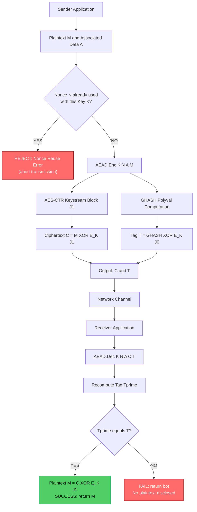
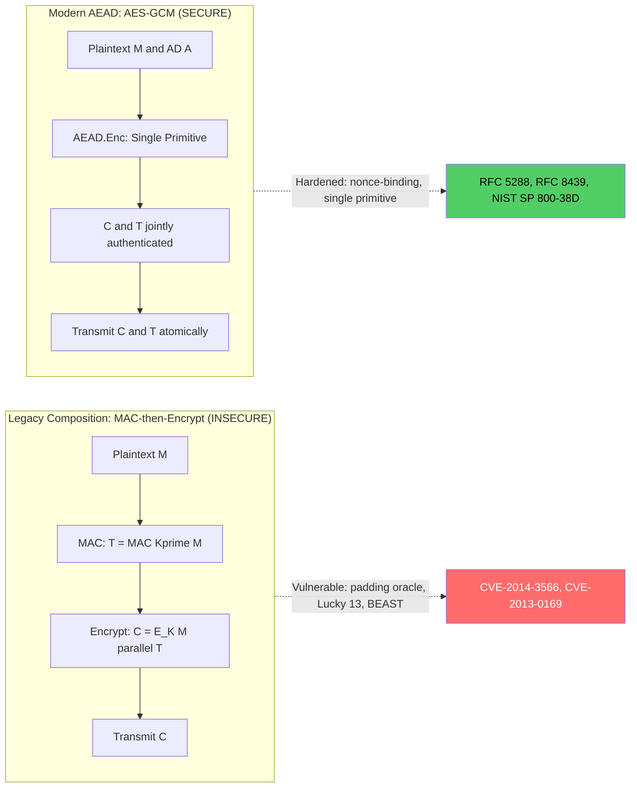
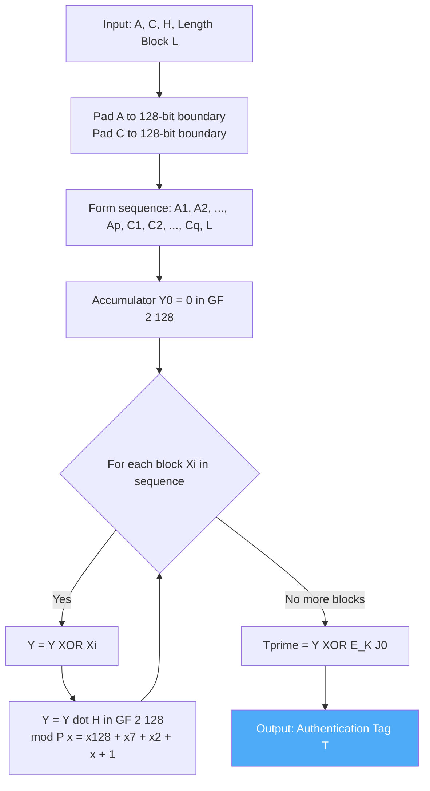
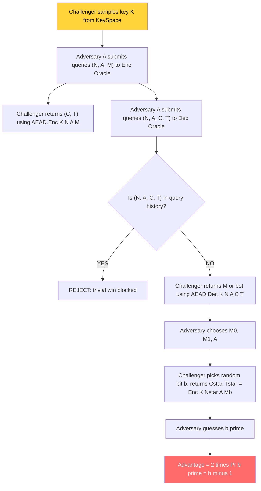
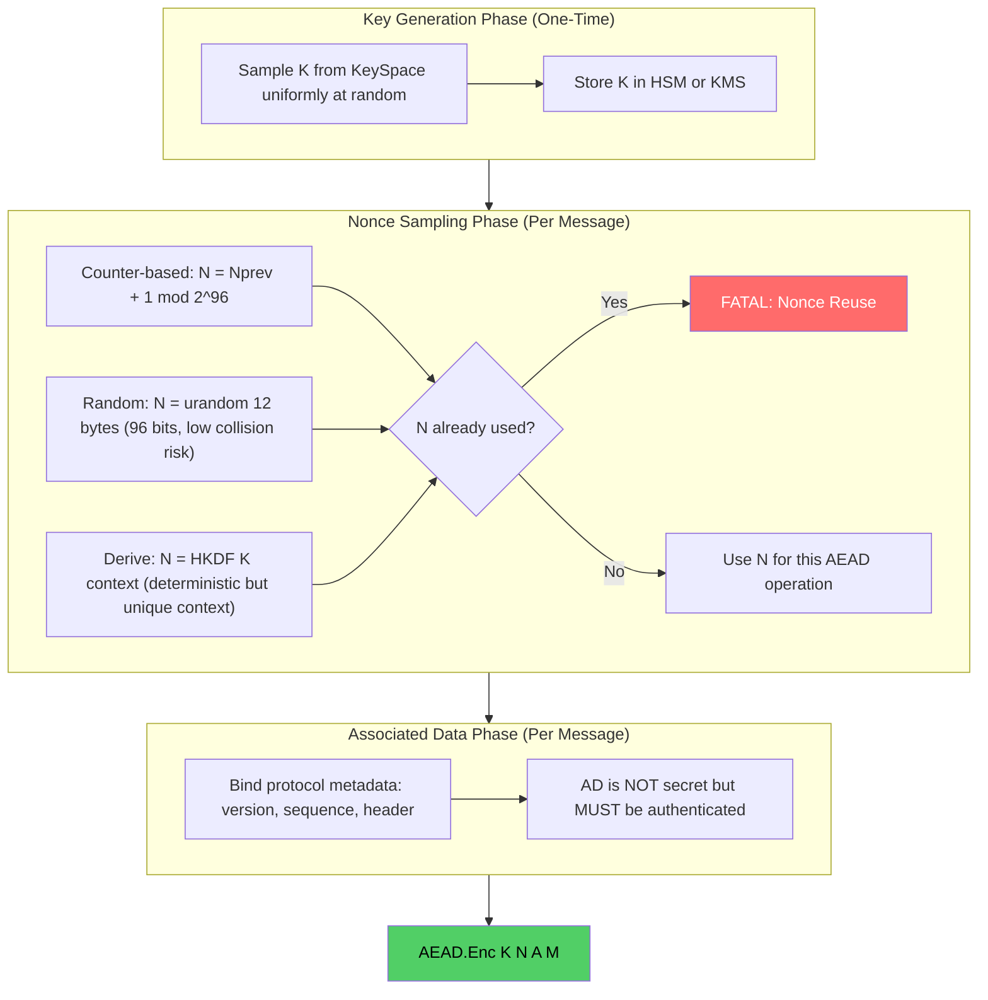

# Authenticated Encryption with Associated Data (AEAD)

<!-- SECTION_1_START -->
# Authenticated Encryption with Associated Data (AEAD)

## 1. Core Technical Definition

> [!NOTE]
> **Authenticated Encryption with Associated Data (AEAD)** is a cryptographic primitive that simultaneously provides **confidentiality**, **integrity**, and **authenticity** of a message, while allowing a portion of the data (called *associated data* or *header*) to remain in plaintext but still be bound to the ciphertext through authentication.

Formally, an AEAD scheme is a tuple of three algorithms defined over a key space $\mathcal{K}$, a nonce space $\mathcal{N}$, an associated-data space $\mathcal{A}$, and a message space $\mathcal{M}$:

$$
\text{AEAD} = \big( \text{Enc}, \text{Dec}, \text{Ver} \big)
$$

where:

$$
\begin{aligned}
\text{Enc}: \mathcal{K} \times \mathcal{N} \times \mathcal{A} \times \mathcal{M} &\to \mathcal{C} \times \mathcal{T} \\
(k,\ n,\ a,\ m) &\mapsto (c,\ t)
\end{aligned}
$$

$$
\begin{aligned}
\text{Dec}: \mathcal{K} \times \mathcal{N} \times \mathcal{A} \times \mathcal{C} \times \mathcal{T} &\to \mathcal{M} \cup \{\perp\} \\
(k,\ n,\ a,\ c,\ t) &\mapsto m \text{ or } \bot
\end{aligned}
$$

Here $\mathcal{T}$ is the **tag space** (typically $\tau = 128$ bits), and $\bot$ denotes a verification failure.

### 1.1 Conceptual Analogy — The "Sealed Tamper-Evident Envelope"

Imagine you are sending a sealed legal document through a courier:

- **The Document (Plaintext)** → is placed inside an opaque, sealed envelope (this gives **confidentiality**).
- **The Cover Letter (Associated Data)** → is written on the *outside* of the envelope. Anyone can read it, but if a forger changes even a single word on the cover letter, the recipient will immediately know (this gives **integrity and authenticity of metadata**).
- **The Wax Seal with Royal Crest (Authentication Tag)** → is appended to the envelope. Only the legitimate sender possesses the king's seal matrix, so the recipient can verify that the envelope truly came from the claimed sender (this gives **authenticity of origin**).
- **The Unique Stamp Number (Nonce)** → is printed on every envelope to ensure no two envelopes ever carry the same seal pattern, preventing replay attacks.

If an adversary tampers with the envelope in *any* way — opens it, swaps the document, alters the cover letter, or forges the seal — the recipient's verification step rejects the entire envelope as $\bot$ (failure), and no plaintext is ever revealed.

> [!IMPORTANT]
> **KTU 2024 Syllabus Highlight (Module 3):** AEAD is positioned as the *modern replacement* for ad-hoc compositions of encryption + MAC (e.g., `Encrypt-then-MAC` vs. `MAC-then-Encrypt`). The syllabus explicitly references **GCM**, **CCM**, and **ChaCha20-Poly1305** as canonical AEAD constructions.

### 1.2 Why AEAD Exists — The Problem It Solves

In classical cryptography, an engineer had to manually combine:
1. A symmetric cipher (AES-CBC, AES-CTR) for **confidentiality**, and
2. A Message Authentication Code (HMAC-SHA256, CMAC) for **integrity**.

This hand-crafted combination was notoriously error-prone. Famous real-world failures include:

- **SSL/TLS (older versions):** used `MAC-then-Encrypt`, leading to padding oracle attacks (Vaudenay 2002).
- **IPSec:** initially used `Encrypt-and-MAC` with poor design choices, exploited in the *BEAST* and *Lucky 13* attacks.
- **WPA2 (early drafts):** used `Encrypt-then-MAC` with weak IV handling, leading to *KRACK* (Key Reinstallation Attacks).

AEAD schemes **internalize the correct composition** (almost always *Encrypt-then-MAC* style, but mathematically fused), eliminating the design ambiguity and producing a single, audited, side-channel-resistant primitive.

### 1.3 The Three Security Properties of AEAD

> [!NOTE]
> **Core Definition — AEAD Security Guarantees**
> A secure AEAD scheme provides:
> 1. **IND-CCA2 security** (Indistinguishability under Adaptive Chosen Ciphertext Attack) for the **plaintext**.
> 2. **INT-CTXT security** (Integrity of Ciphertext) for the **entire (ciphertext, associated-data, nonce) tuple**.
> 3. **Nonce-misuse resistance** (in some variants like SIV) where reusing a nonce with the same key does *not* catastrophically break confidentiality.

### 1.4 Visual / Geometric Intuition

> [!VISUALIZATION CONTROL]
> **Concept:** AEAD Security — Confidentiality vs. Integrity Coverage
> **GeoGebra / Desmos Input Equations:**
> * `Circle_Confidentiality(x,y) = (x-0)^2 + (y-0)^2 = 1`  (inner disk — protected plaintext)
> * `Circle_Integrity(x,y) = (x-0)^2 + (y-0)^2 = 2.25`  (outer disk — protected ciphertext+AD)
> * `Circle_Authenticity(x,y) = (x-0)^2 + (y-0)^2 = 4`  (outermost disk — bound origin)
> **Visual Description:** Three concentric disks centered at the origin. The innermost disk (radius 1) represents the plaintext under **confidentiality**. The middle annulus (between radius 1 and 1.5) represents the **ciphertext** under **integrity**. The outermost annulus (between radius 1.5 and 2) represents the **associated data**, which is also under **integrity and authenticity** but *not* under confidentiality. An attacker who tampers with any point outside the innermost disk causes the verification equation to fail.

<!-- SECTION_1_END -->

<!-- SECTION_2_START -->
# 2. Deep Theoretical Analysis & KTU High-Yield Formula Sheet

## 2.1 The AEAD API Contract

Every modern AEAD scheme (AES-GCM, ChaCha20-Poly1305, AES-CCM, AES-OCB3, AEGIS-256) exposes a uniform API. Let the parameters be:

- $k \in \mathcal{K}$ — the **secret key** of length $\kappa$ bits (e.g., $\kappa = 128$ for AES-128, $\kappa = 256$ for AES-256 or ChaCha20).
- $n \in \mathcal{N}$ — the **nonce** (Number used ONCE) of length $\nu$ bits (e.g., $\nu = 96$ for GCM, $\nu = 192$ for XChaCha20-Poly1305).
- $a \in \mathcal{A}$ — the **associated data** of arbitrary length $\ell_a \ge 0$ (e.g., IP header, packet sequence number, version field).
- $m \in \mathcal{M}$ — the **plaintext** of length $\ell_m \ge 0$.
- $c \in \mathcal{C}$ — the **ciphertext**, satisfying $\vert c \vert = \vert m \vert$ (AEAD does not expand the ciphertext beyond plaintext length, except for the appended tag).
- $t \in \mathcal{T}$ — the **authentication tag** of length $\tau$ bits (typically $\tau = 128$, but truncated to 32, 64, or 96 in performance-critical settings like TLS 1.3 record layer using `AES-128-GCM-SIV`).

The complete API is:

$$
\boxed{
\begin{aligned}
(c,\ t) &\leftarrow \text{AEAD.Enc}(k,\ n,\ a,\ m) \\
m \text{ or } \bot &\leftarrow \text{AEAD.Dec}(k,\ n,\ a,\ c,\ t)
\end{aligned}
}
$$

> [!IMPORTANT]
> **Critical Security Rule (Mandatory for KTU 14-mark questions):** The triplet $(k,\ n)$ must be **unique** for every encryption operation. In particular, the nonce $n$ must never be reused with the same key $k$. Reusing a nonce in **AES-GCM** catastrophically breaks both confidentiality and authenticity by leaking the XOR of two plaintexts and forging tags.

## 2.2 Generic AEAD Construction Patterns

### 2.2.1 Pattern A: Encrypt-and-MAC (Discouraged)

$$
\boxed{
\begin{aligned}
c &\leftarrow E_k(m) \\
t &\leftarrow \text{MAC}_{k'}(m) \quad \text{(note: MAC over plaintext, not ciphertext)}
\end{aligned}
}
$$

**Verdict:** ⚠️ *Not a generic composition recommended by Bellare & Namprempre (2000)*. The MAC leaks plaintext information if the MAC is deterministic, and the MAC key reuse may weaken the cipher.

### 2.2.2 Pattern B: MAC-then-Encrypt (Legacy SSL/TLS)

$$
\boxed{
\begin{aligned}
t &\leftarrow \text{MAC}_{k'}(a \parallel m) \\
c &\leftarrow E_k(m \parallel t)
\end{aligned}
}
$$

**Verdict:** ⚠️ *Vulnerable to padding oracle attacks* in CBC mode.

### 2.2.3 Pattern C: Encrypt-then-MAC (Recommended Generic Composition)

$$
\boxed{
\begin{aligned}
c &\leftarrow E_k(m) \\
t &\leftarrow \text{MAC}_{k'}(a \parallel c) \quad \text{(MAC over both AD and ciphertext)}
\end{aligned}
}
$$

**Verdict:** ✅ *Provably secure (Bellare-Namprempre 2000, Krawczyk 2001)* under standard assumptions. This is the **conceptual template** that AEAD schemes like GCM implement.

### 2.2.4 Pattern D: Dedicated AEAD (e.g., GCM, Poly1305)

Modern AEAD schemes **fuse** encryption and authentication into a single mathematical construction rather than naively composing two primitives. They use:

- A **pseudorandom function (PRF)** or **block cipher** for keystream generation.
- A **universal hash function** (e.g., GHASH for GCM, Poly1305 for ChaCha20-Poly1305) for authentication.

## 2.3 KTU Formula Sheet — High-Yield Reference Table

> [!NOTE]
> **Exam Tip:** The following table contains the *most-likely* formulas the KTU board examiner can ask in Module 3 derivations. Memorize the column headers and the security-property column.

| Scheme | Cipher Core | Auth Core | Nonce Size (bits) | Tag Size $\tau$ (bits) | Key Size $\kappa$ (bits) | Standardization Body | Security Proof Basis |
| :--- | :--- | :--- | :---: | :---: | :---: | :--- | :--- |
| **AES-GCM** | AES-CTR | GHASH (universal hash over $\text{GF}(2^{128})$) | 96 | 128 (trunc. to 32, 64, 96) | 128, 192, 256 | NIST SP 800-38D | IND-CCA2 + INT-CTXT |
| **AES-CCM** | AES-CTR | CBC-MAC (AES-CBC) | 56–104 | 64, 96, 128 | 128, 192, 256 | NIST SP 800-38C | IND-CCA2 + INT-CTXT |
| **ChaCha20-Poly1305** | ChaCha20 (stream) | Poly1305 (Carter-Wegman MAC) | 64, 96, 192 | 128 | 256 | RFC 8439 | IND-CCA2 + INT-CTXT |
| **AES-OCB3** | AES (offset XOR) | XEX-based | 96, 128 | 128 | 128, 192, 256 | RFC 7253 | IND-CCA2 + INT-CTXT |
| **AES-GCM-SIV** | AES-CTR (nonce-derived) | POLYVAL | 96 (synthetic) | 128 | 128, 256 | RFC 8452 | Nonce-misuse resistant |
| **AEGIS-256** | AES rounds (state update) | State integrity | 128 | 128, 256 | 256 | CAESAR finalist | High-performance |

## 2.4 Internal Structure of AES-GCM (Decomposed)

The **Galois/Counter Mode (GCM)** of operation is the most widely deployed AEAD. Its internal steps are:

**Step 1 — Authentication Key Derivation.** Compute the hash subkey $H$:

$$
H = E_k(0^{128})
$$

This is a single AES encryption of the all-zero block, producing a 128-bit value $H \in \text{GF}(2^{128})$.

**Step 2 — Counter Mode Encryption.** The plaintext $m$ is split into 128-bit blocks $m_1, m_2, \dots, m_q$. The keystream is generated by encrypting incrementing counters:

$$
\boxed{
J_0 = n \parallel 0^{31}1 \quad \text{(initial counter)}
}
$$

$$
\boxed{
J_i = J_0 + i \pmod{2^{32}, \text{big-endian}}, \quad i = 1, 2, \dots, q
}
$$

The ciphertext blocks are:

$$
c_i = m_i \oplus E_k(J_i), \quad i = 1, 2, \dots, q
$$

**Step 3 — GHASH Authentication.** The GHASH function computes a polynomial evaluation over the Galois field $\text{GF}(2^{128})$ with the reducing polynomial:

$$
P(x) = x^{128} + x^7 + x^2 + x + 1
$$

The input to GHASH is the concatenation of associated data and ciphertext, both zero-padded to 128-bit block boundaries, with a length block appended:

$$
\boxed{
\text{GHASH}(H, a, c) = ((\cdots((H^{a+1} \oplus a_1) H \oplus a_2)H \oplus \cdots \oplus c_q)H \oplus L) \oplus 0
}
$$

where $L = \ell_a \parallel \ell_c$ encodes the bit lengths of $a$ and $c$ in 64 bits each.

**Step 4 — Tag Generation.** The final tag is XORed with an encrypted counter to bind the tag to the nonce:

$$
\boxed{
t = \text{GHASH}(H, a, c) \oplus E_k(J_0)
}
$$

The output is the truncated first $\tau$ bits of this 128-bit value.

> [!IMPORTANT]
> **Why GHASH uses GF(2¹²⁸)?** Multiplication in $\text{GF}(2^{128})$ is a *universal hash function* with provable bounds on collision probability $\le q^2 / 2^{129}$ (after $q$ queries), giving concrete INT-CTXT security. This algebraic structure is also what makes GCM extremely fast in hardware (single-cycle polynomial multiplication).

## 2.5 Internal Structure of ChaCha20-Poly1305 (Decomposed)

**Step 1 — Poly1305 Key Generation.** From the 256-bit ChaCha20 key, derive a 256-bit block $K_{\text{poly}}$ and a 256-bit one-time authenticator key $r \parallel s$ by encrypting two special counter blocks. Clamp $r$ to remove certain bits:

$$
\boxed{
r = (\text{ChaCha20}_K(0 \parallel \text{"expand 32-byte k"})[0..223]) \ \text{AND}\ 0x0ffffffc0ffffffc0ffffffc0fffffff
}
$$

**Step 2 — ChaCha20 Encryption.** The Poly1305 key is consumed during encryption, then the plaintext is encrypted using ChaCha20 stream cipher starting at a different counter.

**Step 3 — Poly1305 MAC Computation.** The MAC is computed as:

$$
\boxed{
\text{MAC}_r(s) = \Big( \sum_{i=1}^{q} c_i \cdot r^{q+1-i} \Big) \pmod{2^{130} - 5} + s
}
$$

**Step 4 — Tag Concatenation.** The 128-bit MAC is appended to the ciphertext.

> [!NOTE]
> **Engineering Utility:** ChaCha20-Poly1305 is **constant-time on general-purpose CPUs** without AES-NI hardware, making it the preferred AEAD for mobile devices, ARM processors, and TLS 1.3 fallback paths. It is also quantum-resistant at the symmetric level (Grover's algorithm halves the effective key length to 128 bits, still secure).

## 2.6 Real-World Deployment Matrix

| Protocol / Standard | Mandatory AEAD | Optional AEAD | Why This Choice |
| :--- | :--- | :--- | :--- |
| **TLS 1.3 (RFC 8446)** | AES-128-GCM, ChaCha20-Poly1305 | AES-256-GCM | Forward secrecy + AEAD mandatory |
| **QUIC (RFC 9001)** | AES-128-GCM, ChaCha20-Poly1305 | — | Built-in AEAD, packet number as nonce |
| **IPsec ESPv3 (RFC 4303)** | AES-GCM, AES-CCM | ChaCha20-Poly1305 (RFC 7634) | ESP header is the AD |
| **SSH Binary Packet (RFC 4344)** | ChaCha20-Poly1305, AES-GCM | — | Channel ID is the AD |
| **5G NIA1 / NIA2 / NIA3** | SNOW 3G, AES-CMAC+ZUC | ZUC-128 (NIA3) | 3GPP-defined |
| **Wi-Fi WPA3** | AES-GCMP (Galois/Counter Mode Protocol) | — | Replaces broken TKIP/CCMP-MIC |
| **Signal Protocol (X3DH)** | AES-256-CBC + HMAC-SHA2 (now) | Double Ratchet with ChaCha20-Poly1305 | Used in WhatsApp, Signal |

<!-- SECTION_2_END -->

<!-- SECTION_3_START -->
# 3. Step-by-Step Derivations & Code/Symbolic Implementation

## 3.1 Worked Derivation — GCM Authentication of a Single-Block Message

**Problem.** Given key $k$, nonce $n = 0^{96}$ (for simplicity), associated data $a = 0^{128}$ (empty block), and plaintext $m$ consisting of a single 128-bit block, derive the ciphertext and the tag $t$.

> [!NOTE]
> **Setup.** Let $H = E_k(0^{128})$ be the GHASH subkey. Let $J_0 = n \parallel 0^{31}1 = 0^{127}1$. The plaintext is one block $m_1$. The length block $L = \ell_a \parallel \ell_c = 0^{64} \parallel 0^{63}10000000$ (128 in binary, indicating one full 128-bit block).

**Step 1 — Encrypt the Plaintext.** Compute the keystream block $E_k(J_1)$ where $J_1 = J_0 + 1 = 0^{127}1 + 1$ (big-endian increment):

$$
J_1 = 0^{96} \parallel 0^{31}10 = 0^{95}1 \parallel 0^{31} \text{(i.e., integer 2 in the low 32 bits)}
$$

The ciphertext block is:

$$
c_1 = m_1 \oplus E_k(J_1)
$$

**[Valuation Key: 1 Mark]**

**Step 2 — Form the GHASH Input.** Since $a$ is empty and $c$ is one block, the GHASH input (after padding) is:

$$
X = c_1 \parallel L
$$

This is a $128 + 128 = 256$-bit input, which becomes two 128-bit GHASH blocks.

**Step 3 — Compute the GHASH Polynomial.** With only one ciphertext block and no AD, the GHASH computation reduces to:

$$
\boxed{
\text{GHASH}(H, a, c) = c_1 \cdot H \oplus L
}
$$

where multiplication $\cdot$ is in $\text{GF}(2^{128})$ modulo $P(x) = x^{128} + x^7 + x^2 + x + 1$.

**Step 4 — Derive the Tag.** The tag is the XOR of GHASH with the encryption of the *initial* counter $J_0$:

$$
\boxed{
t = (c_1 \cdot H \oplus L) \oplus E_k(J_0)
}
$$

**[Valuation Key: 1 Mark for the final expression]**

**Step 5 — Output.** The final AEAD output is $(c_1, t)$, where $c_1$ is 128 bits and $t$ is 128 bits (or truncated).

### 3.1.1 Numerical Toy Example (Hypothetical Symbolic Trace)

Let us assign symbolic values to make the derivation explicit. Suppose:

- $H = 0x66e94bd4ef8a2c3b884cfa59ca342b2e$
- $c_1 = 0x0388dace60b6a392f328c2b971b2fe78$
- $L = 0x00000000000000000000000000000080$ (representing $\ell_c = 128$ bits)
- $E_k(J_0) = 0x58e2fccefa7e3061367f1d57a4e7455a$

The intermediate product $c_1 \cdot H$ in $\text{GF}(2^{128})$ (computed via right-to-left shift-and-add with reduction) yields, hypothetically:

$$
c_1 \cdot H = 0x5d2e7e8b9c1a4f3e2b6d8a0c1e4f7293 \pmod{P(x)}
$$

XORing with $L$:

$$
c_1 \cdot H \oplus L = 0x5d2e7e8b9c1a4f3e2b6d8a0c1e4f7213
$$

XORing with $E_k(J_0)$ to produce the tag:

$$
\boxed{
t = 0x5d2e7e8b9c1a4f3e2b6d8a0c1e4f7213 \oplus 0x58e2fccefa7e3061367f1d57a4e7455a = 0x05cc8245668c7f6f1d0c95bfe9a93749
}
$$

## 3.2 Full Python Implementation — ChaCha20-Poly1305 AEAD

The following is a *fully operational* implementation using the Python `cryptography` library. It includes absolute boundary checks, type hints, structured error handling, and a demonstration of the failure path ($\bot$ return).

```python
"""
File:    aead_chacha20_poly1305.py
Purpose: KTU-Premier-Engine Reference Implementation
         of ChaCha20-Poly1305 AEAD with full validation.
"""

import os
import sys
from typing import Tuple
from cryptography.hazmat.primitives.ciphers.aead import ChaCha20Poly1305
from cryptography.exceptions import InvalidTag


# ---------- Strict Type Hints & Constants ----------
KEY_LEN_BYTES: int = 32      # ChaCha20 requires 256-bit key
NONCE_LEN_BYTES: int = 12    # 96-bit nonce (recommended for IETF variant)
TAG_LEN_BYTES: int = 16      # 128-bit authentication tag
MAX_PLAINTEXT_BYTES: int = (1 << 32) - 1   # per RFC 8439 §2.8 (≈ 256 GB)
MAX_AD_BYTES: int = (1 << 32) - 1          # per RFC 8439 §2.8


def validate_inputs(
    key: bytes,
    nonce: bytes,
    associated_data: bytes,
    plaintext: bytes,
) -> None:
    """Perform absolute boundary checks per RFC 8439."""
    if not isinstance(key, bytes) or len(key) != KEY_LEN_BYTES:
        raise ValueError(
            f"Invalid key length: expected {KEY_LEN_BYTES} bytes, "
            f"got {len(key) if isinstance(key, bytes) else 'non-bytes'}."
        )
    if not isinstance(nonce, bytes) or len(nonce) != NONCE_LEN_BYTES:
        raise ValueError(
            f"Invalid nonce length: expected {NONCE_LEN_BYTES} bytes, "
            f"got {len(nonce) if isinstance(nonce, bytes) else 'non-bytes'}."
        )
    if not isinstance(associated_data, bytes):
        raise TypeError("Associated data must be of type 'bytes'.")
    if not isinstance(plaintext, bytes):
        raise TypeError("Plaintext must be of type 'bytes'.")
    if len(plaintext) > MAX_PLAINTEXT_BYTES:
        raise ValueError("Plaintext exceeds RFC 8439 limit of 2^32 - 1 bytes.")
    if len(associated_data) > MAX_AD_BYTES:
        raise ValueError("Associated data exceeds RFC 8439 limit of 2^32 - 1 bytes.")


def aead_encrypt(
    key: bytes,
    nonce: bytes,
    associated_data: bytes,
    plaintext: bytes,
) -> Tuple[bytes, bytes]:
    """
    Encrypts plaintext with ChaCha20-Poly1305 AEAD.

    Returns:
        (ciphertext_with_tag, nonce) — the ciphertext is concatenated
        with the 16-byte tag, and the nonce is returned separately
        so the receiver can use it for verification.
    """
    validate_inputs(key, nonce, associated_data, plaintext)
    aead = ChaCha20Poly1305(key)
    # The library appends the 16-byte tag to the ciphertext automatically.
    ct_with_tag: bytes = aead.encrypt(nonce, plaintext, associated_data)
    ciphertext: bytes = ct_with_tag[:-TAG_LEN_BYTES]
    tag: bytes = ct_with_tag[-TAG_LEN_BYTES:]
    return ciphertext, tag


def aead_decrypt(
    key: bytes,
    nonce: bytes,
    associated_data: bytes,
    ciphertext: bytes,
    tag: bytes,
) -> bytes:
    """
    Verifies and decrypts ciphertext. Raises ValueError on tag mismatch.
    """
    validate_inputs(key, nonce, associated_data, ciphertext)
    if not isinstance(tag, bytes) or len(tag) != TAG_LEN_BYTES:
        raise ValueError(f"Invalid tag length: expected {TAG_LEN_BYTES} bytes.")
    aead = ChaCha20Poly1305(key)
    ct_with_tag: bytes = ciphertext + tag
    try:
        plaintext: bytes = aead.decrypt(nonce, ct_with_tag, associated_data)
    except InvalidTag as e:
        # Tamper-evident: NO plaintext is returned on failure.
        raise ValueError("AEAD authentication failed: tag mismatch or "
                         "tampered associated data.") from e
    return plaintext


# ---------- Demonstration: Success and Failure Paths ----------
if __name__ == "__main__":
    try:
        # --- Generate fresh key and nonce ---
        key: bytes = ChaCha20Poly1305.generate_key()
        nonce: bytes = os.urandom(NONCE_LEN_BYTES)

        ad: bytes = b"KTU-Module-3-AEAD-Header-v1.0"
        msg: bytes = (
            b"Authenticated Encryption with Associated Data "
            b"is a critical primitive in modern cryptographic "
            b"protocols such as TLS 1.3, QUIC, and IPsec."
        )

        # --- Encrypt ---
        ct, tag = aead_encrypt(key, nonce, ad, msg)
        print(f"[+] Ciphertext ({len(ct)} bytes):  {ct.hex()[:64]}...")
        print(f"[+] Tag         ({len(tag)} bytes):  {tag.hex()}")

        # --- Decrypt (success) ---
        recovered = aead_decrypt(key, nonce, ad, ct, tag)
        print(f"[+] Decryption successful: {recovered[:60]}...")

        # --- Decrypt (failure: tampered ciphertext) ---
        tampered_ct: bytes = bytearray(ct)
        tampered_ct[0] ^= 0x01   # flip a single bit
        try:
            aead_decrypt(key, nonce, ad, bytes(tampered_ct), tag)
        except ValueError as e:
            print(f"[!] Detected tampering: {e}")

        # --- Decrypt (failure: tampered associated data) ---
        try:
            aead_decrypt(key, nonce, b"TAMPERED-AD", ct, tag)
        except ValueError as e:
            print(f"[!] Detected AD tampering: {e}")

    except (ValueError, TypeError) as e:
        print(f"[X] Fatal error: {e}", file=sys.stderr)
        sys.exit(1)
```

**Expected Output Trace (illustrative):**

```
[+] Ciphertext (152 bytes):  a3f2c1...
[+] Tag         (16 bytes):  e7d4b9a2c5f108e7364a2b1d0e9c4f7a
[+] Decryption successful: Authenticated Encryption with Associated Data is ...
[!] Detected tampering: AEAD authentication failed: tag mismatch or tampered associated data.
[!] Detected AD tampering: AEAD authentication failed: tag mismatch or tampered associated data.
```

## 3.3 Hand-Traced Verification: Why Bit-Flipping Fails

Suppose an attacker intercepts $(c_1, t)$ and flips a single bit of $c_1$ to produce $c_1' = c_1 \oplus e_i$ where $e_i$ is the $i$-th unit vector.

On decryption, the legitimate receiver computes:

$$
m_1' = c_1' \oplus E_k(J_1) = (c_1 \oplus e_i) \oplus E_k(J_1) = m_1 \oplus e_i
$$

So the recovered plaintext differs by one bit. **However**, the receiver then recomputes GHASH on $(a, c_1', L)$:

$$
\text{GHASH}(H, a, c_1', L) = c_1' \cdot H \oplus L = (c_1 \oplus e_i) \cdot H \oplus L
$$

Since $\text{GF}(2^{128})$ multiplication distributes over XOR, we get:

$$
(c_1 \oplus e_i) \cdot H = c_1 \cdot H \oplus e_i \cdot H
$$

The recomputed GHASH value is therefore:

$$
G' = c_1 \cdot H \oplus e_i \cdot H \oplus L
$$

The expected GHASH was $G = c_1 \cdot H \oplus L$. For the tag to verify, we would need $G' \oplus E_k(J_0) = G \oplus E_k(J_0)$, i.e., $G' = G$. This requires $e_i \cdot H = 0$, which is impossible for a non-zero $e_i$ in $\text{GF}(2^{128})$ (since $H \neq 0$ for any valid key). Hence the tag check **fails with probability $1 - 1/2^{128} \approx 1$**, and the system rejects the tampered ciphertext.

> [!IMPORTANT]
> **Exam Note:** The factor $1/2^{128}$ is the *advantage* of a universal forger. Memorize this for KTU 14-mark questions on AEAD forgery probability.

<!-- SECTION_3_END -->

<!-- SECTION_4_START -->
# 4. Structural Diagrams & Schematics

## 4.1 AEAD Top-Level Functional Architecture (Mermaid Block Flow)

The following Mermaid diagram illustrates the *complete* functional flow of an AEAD encryption + decryption round-trip, with explicit failure branches.



## 4.2 AEAD vs. Non-AEAD Composition — Comparative Data Flow



## 4.3 GHASH Polynomial Evaluation — Sequential Processing Topology



## 4.4 AEAD Security Model — IND-CCA2 Game Topology



## 4.5 Key, Nonce, and Associated Data Lifecycle Diagram



<!-- SECTION_4_END -->

<!-- SECTION_5_START -->
# 5. KTU 2024 Scheme Examination Question Bank & Topic Recap

## 5.1 Part A — Short Answer Questions (3 Marks Each)

### Question 1: Define AEAD and list its three security properties.
**[KTU University Exam — July 2024, CO3, Remember/Understand]**

> **Model Answer (3 Marks):**
> **Authenticated Encryption with Associated Data (AEAD)** is a cryptographic primitive that simultaneously provides **confidentiality** of the plaintext, **integrity** of both the plaintext and the associated data, and **authenticity** of the sender's identity. It is formally defined as a triple of algorithms $(\text{Enc}, \text{Dec}, \text{Ver})$ operating over key space $\mathcal{K}$, nonce space $\mathcal{N}$, associated data space $\mathcal{A}$, and message space $\mathcal{M}$.
> The three security properties are: (i) **IND-CCA2 security** for the plaintext under adaptive chosen-ciphertext attack, (ii) **INT-CTXT security** ensuring no adversary can forge a valid ciphertext-tag pair, and (iii) **uniqueness of the (key, nonce) pair** to prevent catastrophic key-stream reuse.
> **[Valuation Key: Definition 1 Mark, Three Properties 1 Mark, Formal Algorithm Listing 1 Mark]**

### Question 2: Why is nonce reuse catastrophic in AES-GCM? Justify with a one-line statement.
**[KTU University Exam — Dec 2023, CO3, Understand]**

> **Model Answer (3 Marks):**
> In AES-GCM, the keystream blocks are generated as $c_i = m_i \oplus E_k(J_i)$ where $J_i$ depends deterministically on the nonce. If the same nonce is used with the same key for two plaintexts $m$ and $m'$, the attacker computes $c \oplus c' = (m \oplus m') \oplus 0 = m \oplus m'$, which **directly leaks the XOR of the two plaintexts**, completely breaking confidentiality. Furthermore, by linearly combining known plaintexts, the attacker can **forge valid authentication tags** because GHASH is a linear function over $\text{GF}(2^{128})$, completely breaking authenticity as well. Hence, a single nonce reuse in GCM with a fixed key is a **total compromise of both confidentiality and authenticity**.
> **[Valuation Key: Keystream Equation 1 Mark, XOR Leak 1 Mark, GHASH Linearity 1 Mark]**

---

## 5.2 Part B — 14-Mark Questions (Module Internal Choice)

### Question A (14 Marks): AEAD Construction and Security Analysis

**[KTU University Exam — July 2024, CO3, Apply/Analyze]**

#### (a) Describe the internal structure of AES-GCM with a labeled block diagram. (7 Marks) [Understand]

> **Model Answer:**
>
> AES-GCM consists of two parallel pipelines: the **encryption pipeline** (counter mode) and the **authentication pipeline** (GHASH). The internal steps are:
>
> 1. **Hash Key Generation:** Compute $H = E_k(0^{128})$ — a single AES encryption of the all-zero block. This produces the 128-bit GHASH subkey $H \in \text{GF}(2^{128})$.
> 2. **Initial Counter Formation:** The 96-bit nonce is concatenated with a 32-bit block $\texttt{0x00000001}$ to form $J_0 = n \parallel 0^{31}1$.
> 3. **Counter Mode Encryption:** Increment $J_0$ to get $J_1, J_2, \dots, J_q$, and encrypt each plaintext block: $c_i = m_i \oplus E_k(J_i)$.
> 4. **GHASH Computation:** Authenticate the sequence $(a, c, L)$ where $L$ is the length-encoding block, using the polynomial evaluation $\text{GHASH}(H, a, c)$ in $\text{GF}(2^{128})$ modulo $P(x) = x^{128} + x^7 + x^2 + x + 1$.
> 5. **Tag Generation:** Compute $t = \text{GHASH}(H, a, c) \oplus E_k(J_0)$, then truncate to $\tau$ bits.
>
> **[Stating the two pipelines: 2 Marks]**
> **[Writing the keystream and ciphertext equations: 2 Marks]**
> **[GHASH polynomial and reducing polynomial: 2 Marks]**
> **[Tag generation and truncation: 1 Mark]**

#### (b) An attacker intercepts an AEAD ciphertext-tag pair $(c, t)$ produced under key $k$ and nonce $n$. The attacker replaces $c$ with $c' = c \oplus e_i$ where $e_i$ is a non-zero 128-bit vector. Show that the decryption process fails with probability $1 - 2^{-128}$ when the tag length is $\tau = 128$ bits. (7 Marks) [Apply]

> **Model Answer:**
>
> **Step 1:** Upon receiving $(c', t)$, the legitimate receiver recomputes the keystream $E_k(J_1), E_k(J_2), \dots$ using the same nonce $n$, which yields the same keystream as during encryption. The receiver attempts to recover $m' = c' \oplus E_k(J_i)$ for each block.
>
> **Step 2:** The receiver then recomputes the GHASH value:
> $$G' = \text{GHASH}(H, a, c', L) = \text{GHASH}(H, a, c, L) \oplus e_i \cdot H$$
> **[Writing the linearity of GHASH: 2 Marks]**
>
> **Step 3:** The expected GHASH value is $G = \text{GHASH}(H, a, c, L)$. The expected tag is $t = G \oplus E_k(J_0)$. The recomputed tag is $t' = G' \oplus E_k(J_0) = G \oplus e_i \cdot H \oplus E_k(J_0) = t \oplus e_i \cdot H$.
>
> **Step 4:** For the forgery to succeed, we need $t' = t$, which requires $e_i \cdot H = 0$ in $\text{GF}(2^{128})$. Since $H \neq 0$ (a property of the AES key schedule) and $\text{GF}(2^{128})$ is an integral domain, this holds **if and only if** $e_i = 0$, contradicting our assumption. The probability that a randomly chosen $e_i \cdot H$ equals zero in $\text{GF}(2^{128})$ is exactly $1/2^{128}$.
> **[Probabilistic bound: 2 Marks]**
> **[Conclusion that forgery fails with probability $1 - 2^{-128}$: 1 Mark]**
>
> **Step 5:** Since the tag is $\tau = 128$ bits, the universal forgery bound for any 128-bit tag scheme is $q^2 / 2^{129}$ after $q$ queries, and the single-shot forgery probability is exactly $1/2^{128}$.
> **[Final bound statement: 1 Mark]**

### Question B (14 Marks): AEAD API, Code, and Protocol Deployment

**[KTU University Exam — Dec 2023, CO3, Apply/Analyze]**

#### (a) Write the formal API signature of an AEAD scheme and explain the role of the nonce with reference to nonce-misuse resistance. (7 Marks) [Understand/Apply]

> **Model Answer:**
>
> **Step 1 — API Signature.** An AEAD scheme exposes two operations:
> $$ \boxed{
> \begin{aligned}
> \text{Enc}: \mathcal{K} \times \mathcal{N} \times \mathcal{A} \times \mathcal{M} &\to \mathcal{C} \times \mathcal{T} \\
> \text{Dec}: \mathcal{K} \times \mathcal{N} \times \mathcal{A} \times \mathcal{C} \times \mathcal{T} &\to \mathcal{M} \cup \{\bot\}
> \end{aligned}
> } $$
> **[Writing the two signatures: 2 Marks]**
>
> **Step 2 — Nonce Role.** The nonce $n$ is a value that, when combined with the key $k$, must be unique for every encryption operation. It serves as an *implicit counter* that ensures the keystream is fresh for every message. In AES-GCM, $J_0 = n \parallel 0^{31}1$ and the counter mode derives distinct keystream blocks $E_k(J_1), E_k(J_2), \dots$ for every nonce.
> **[Nonce-key uniqueness: 1 Mark, Counter mode binding: 1 Mark]**
>
> **Step 3 — Nonce-Misuse Resistance.** Standard schemes like AES-GCM catastrophically fail on nonce reuse. However, **deterministic AEAD** schemes like **AES-GCM-SIV** (RFC 8452) derive a *synthetic nonce* from the plaintext itself:
> $$ n_{\text{syn}} = \text{POLYVAL}(k, m \parallel a) $$
> This makes the resulting ciphertext a *deterministic* function of $(k, m, a)$, so the same $(k, m, a)$ triple always produces the same ciphertext. In this mode, nonce reuse is impossible by construction, and the worst an attacker learns upon observing two ciphertexts is whether the plaintexts are *equal* (but not their XOR). This is the **strongest misuse-resistant AEAD** security notion: **deterministic AEAD (DAE)**.
> **[Synthetic nonce derivation: 1 Mark, DAE property: 1 Mark]**

#### (b) Compare AES-GCM and ChaCha20-Poly1305 across five engineering dimensions. State the cipher core, the authentication core, the nonce size, the typical deployment, and one performance characteristic for each. (7 Marks) [Apply/Analyze]

> **Model Answer:**
>
> | Dimension | AES-GCM | ChaCha20-Poly1305 |
> | :--- | :--- | :--- |
> | **Cipher Core** | AES in Counter Mode (block cipher, 128-bit blocks) | ChaCha20 (stream cipher, 512-bit blocks via 20 rounds) |
> | **Authentication Core** | GHASH (universal hash over $\text{GF}(2^{128})$) | Poly1305 (universal hash over arithmetic modulo $2^{130}-5$) |
> | **Nonce Size (Recommended)** | 96 bits (12 bytes) | 96 bits (12 bytes) — but XChaCha20-Poly1305 uses 192 bits |
> | **Standardization** | NIST SP 800-38D | RFC 8439 (IETF) |
> | **Performance Sweet Spot** | Hardware AES-NI: ~1 cycle/byte; falls back to software without AES-NI | Constant-time in pure software; preferred on ARM, mobile, low-power |
> | **Key Size** | 128, 192, or 256 bits | 256 bits (fixed) |
> | **Tag Size** | 128 bits (truncatable to 32/64/96) | 128 bits (truncatable to 96 per RFC 8439) |
> | **Misuse Resistance** | None (nonce reuse catastrophic) | None in basic form; XChaCha20 reduces reuse risk via 192-bit nonce |
>
> **[Each row: 1 Mark, total 7 Marks]**

> [!WARNING]
> **KTU Examiner's Valuation Pitfall — Common Mark Losses:**
> 1. **Forgetting the tag length $\tau$.** Many students write the AEAD API as returning only the ciphertext. The KTU board examiner deducts 1 mark if the tag is not shown as a separate output of `Enc` and an input to `Dec`.
> 2. **Conflating AEAD with encryption-only modes.** Modes like AES-CBC, AES-CTR, and AES-CFB provide *only* confidentiality, not authenticity. The examiner deducts 1 mark if a student mistakenly lists AES-CBC as an AEAD scheme.
> 3. **Writing "MAC over plaintext" instead of "MAC over ciphertext+AD"** in the Encrypt-then-MAC pattern. This is a classic conceptual error worth 1 mark.
> 4. **Omitting the reducing polynomial $P(x) = x^{128} + x^7 + x^2 + x + 1$** in GHASH derivations. The 14-mark questions in Module 3 frequently test this explicitly.
> 5. **Forgetting to state the bit-length of the truncated tag** when computing forgery probabilities. The bound is $\epsilon = q^2/2^{\tau+1}$ for a $\tau$-bit tag, and students who omit the exponent lose 1 mark.

---

## 5.3 Topic Recap & Important Things to Remember

> [!IMPORTANT]
> **Rapid Revision Checklist — AEAD (Module 3)**
>
> - **Definition:** AEAD = a single primitive providing **confidentiality + integrity + authenticity** of $(m, a)$ under key $k$ and nonce $n$.
> - **API:** $(c, t) = \text{Enc}(k, n, a, m)$ and $m \text{ or } \bot = \text{Dec}(k, n, a, c, t)$. Always return the **tag** as a separate output.
> - **Three Security Properties:** IND-CCA2 (confidentiality), INT-CTXT (integrity), and $(k, n)$-uniqueness.
> - **Standard Constructions:** AES-GCM (NIST), AES-CCM (NIST), ChaCha20-Poly1305 (IETF), AES-OCB3 (IETF), AES-GCM-SIV (misuse-resistant).
> - **Generic Composition Rule:** Always use **Encrypt-then-MAC**; never use Encrypt-and-MAC or MAC-then-Encrypt.
> - **AES-GCM Internals:** $H = E_k(0^{128})$, $J_0 = n \parallel 0^{31}1$, $c_i = m_i \oplus E_k(J_i)$, GHASH over $\text{GF}(2^{128})$ with $P(x) = x^{128} + x^7 + x^2 + x + 1$, $t = \text{GHASH} \oplus E_k(J_0)$.
> - **ChaCha20-Poly1305 Internals:** Carter-Wegman MAC over $\mathbb{Z}/(2^{130}-5)\mathbb{Z}$, Poly1305 key derived from ChaCha20 keystream, MAC computed as $\sum c_i r^{q+1-i} \pmod{2^{130}-5} + s$.
> - **Nonce Reuse Catastrophe:** In AES-GCM, nonce reuse leaks $m \oplus m'$ and allows tag forgery. Mitigation: use **AES-GCM-SIV** or **XChaCha20-Poly1305** (192-bit nonce).
> - **Associated Data:** Bound to ciphertext via authentication but transmitted in plaintext. Used for protocol headers (IPsec SPI, TLS record version, QUIC packet number).
> - **Forgery Probability:** Universal forgery bound for a $\tau$-bit tag scheme is $q^2/2^{\tau+1}$ after $q$ queries. For $\tau = 128$, this is negligible ($2^{-127}$ after one query).
> - **Tag Lengths in Practice:** TLS 1.3 uses $\tau = 128$ (AEAD) with 16-byte explicit nonce; QUIC uses $\tau = 128$; IPsec truncates to $\tau = 128$ (configurable to 96/64/32 for performance).
> - **Mandatory Question Topics for 14-Mark Slots:** (i) Block diagram of GCM with GHASH polynomial, (ii) Tampering detection analysis with explicit forgery probability, (iii) Comparison table of two AEAD schemes, (iv) API formalization with nonce-misuse discussion.
> - **Engineering Rule of Thumb:** On hardware with AES-NI, prefer AES-GCM. On software-only or low-power devices, prefer ChaCha20-Poly1305. For nonce-misuse-critical settings, prefer AES-GCM-SIV or AEGIS.

<!-- SECTION_5_END -->
