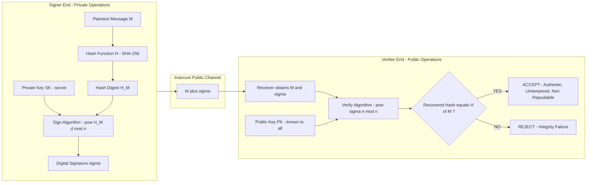
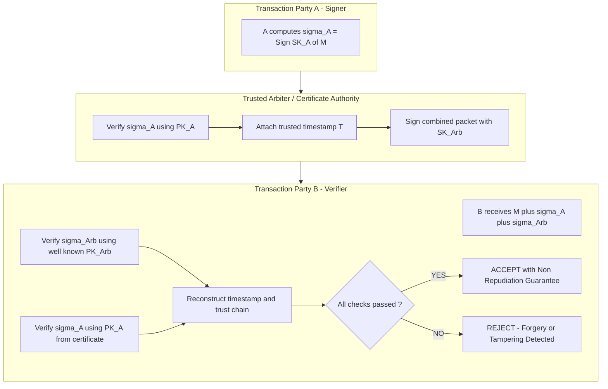
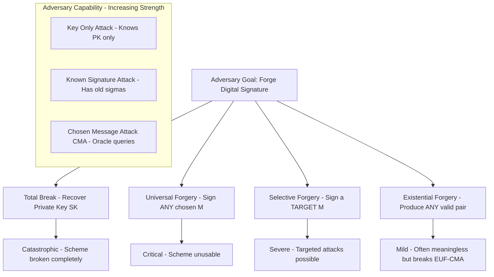
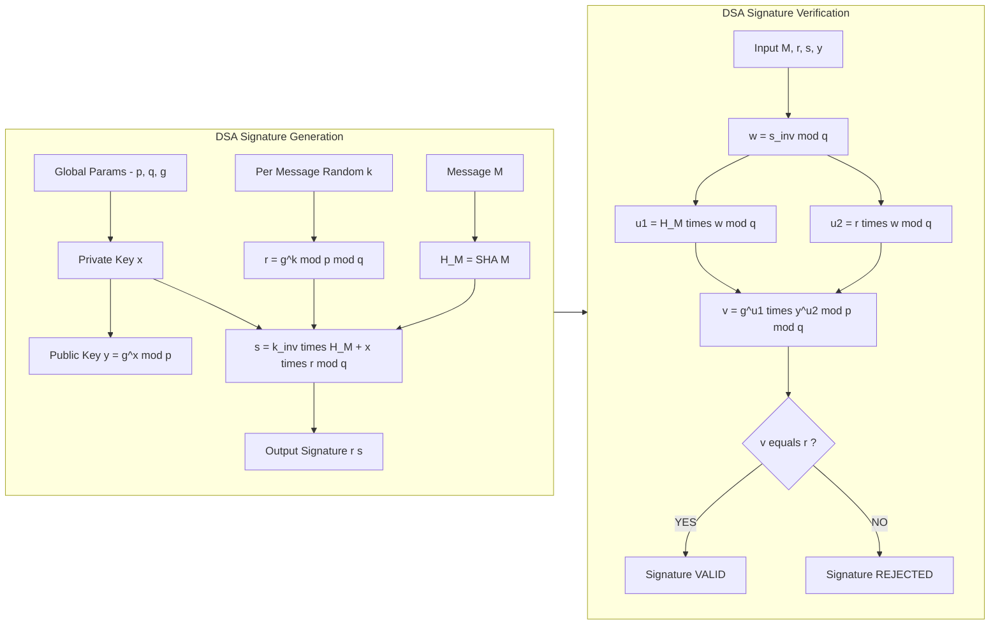

# Digital signature schemes

<!-- SECTION_1_START -->
# Digital Signature Schemes — Core Technical Definition & Intuitive Overview

> [!IMPORTANT]
> **KTU 2024 Scheme Definition (PECST74A — Module 3):**
> A **Digital Signature** is a cryptographic mechanism that mimics the role of a handwritten signature and is produced using a mathematical scheme involving the sender's **private key**. It provides three foundational security services simultaneously: **message authentication**, **data integrity**, and **non-repudiation**. Unlike Message Authentication Codes (MACs), a digital signature is **asymmetric** and **publicly verifiable** by any party holding the signer's public key.

## The Big Picture — Intuitive Analogy

Imagine you are sending a sealed letter through an unreliable postal service, and the recipient must be absolutely certain:

1. **The letter actually came from you** (Authentication).
2. **The contents were not tampered with** (Integrity).
3. **You cannot later deny sending it** (Non-Repudiation).

A **digital signature** solves this by transforming the entire message using a *secret only you hold* (private key). Anyone with your *publicly known mathematical key* can mathematically prove the message came from you — but they cannot forge a new one. The classic analogy is the **royal wax seal**: a unique imprint tied to the king's ring, impossible to reproduce without the original.

> [!NOTE]
> **Key Distinction for Board Exams:**
> - **MAC (Symmetric):** Uses *one shared secret key*. Both authentication and integrity — but no non-repudiation.
> - **Digital Signature (Asymmetric):** Uses *private + public key pair*. Provides all three services because only the sender can sign.
> - **Encryption vs. Signing:** Encryption uses the *receiver's public key* (privacy). Signing uses the *sender's private key* (authenticity).

## Formal KTU 2024 Terminology

A digital signature scheme is a **5-tuple $(\mathcal{P}, \mathcal{S}, \mathcal{K}, \text{Sign}, \text{Verify})$**:

| Component | Description |
|---|---|
| $\mathcal{P}$ | The set of plaintext messages (e.g., arbitrary bit strings) |
| $\mathcal{S}$ | The set of valid signatures (often $\mathbb{Z}_n^\times$) |
| $\mathcal{K}$ | The key space — pairs of (private key, public key) |
| $\text{Sign}(sk, M)$ | Signing algorithm — outputs a signature $\sigma \in \mathcal{S}$ |
| $\text{Verify}(pk, M, \sigma)$ | Verification algorithm — outputs `True` or `False` |

The signing operation must be **efficient**, the verification must be **public**, and forging a valid signature without the private key must be **computationally infeasible** under the assumed hardness assumption (e.g., Integer Factorization, Discrete Logarithm).

## Direct vs. Arbitrated Digital Signatures

- **Direct Digital Signature** — The signer signs directly using their private key; the receiver verifies using the sender's public key. Vulnerable if the sender's private key is later compromised (repudiation risk).
- **Arbitrated Digital Signature** — All signatures are routed through a trusted **arbiter/CA** (Certificate Authority) who timestamps and validates the exchange. Slower but offers stronger non-repudiation guarantees.

> [!VISUALIZATION CONTROL]
> **Concept:** RSA Signature Generation-Verification Cycle
> **Conceptual Graph Axes:**
> * $X$-axis: Time $t$ (Sender $\rightarrow$ Verifier)
> * $Y$-axis: Message State — *Plaintext* $\rightarrow$ *Hashed Digest* $\rightarrow$ *Signed Cipher* $\rightarrow$ *Recovered Digest* $\rightarrow$ *Match?*
> **Visual Description:** Observe how a single $M^d \bmod n$ operation transforms plaintext into a non-readable signature, and $S^e \bmod n$ reconstructs the original — a closed loop if honest, a detected break if tampered.

<!-- SECTION_1_END -->

<!-- SECTION_2_START -->
# Deep Theoretical Analysis & KTU High-Yield Formula Sheet

## 1. Generic Signature Equation (Conceptual Skeleton)

$$
\sigma = \text{Sign}_{sk}(M) \quad \longleftrightarrow \quad \text{Verify}_{pk}(M, \sigma) \in \{\text{True}, \text{False}\}
$$

Every concrete scheme (RSA, ElGamal, DSA, Schnorr, ECDSA) is an *instantiation* of this skeleton, each with different trapdoor functions and security reductions.

## 2. The RSA Digital Signature Scheme

**Key Generation (Trapdoor: Integer Factorization of $n = p \cdot q$)**

- Choose two large primes $p, q$ with $|p| = |q| = 1024$ bits each.
- Compute $n = p \cdot q$ and $\phi(n) = (p-1)(q-1)$.
- Pick public exponent $e$ with $\gcd(e, \phi(n)) = 1$.
- Compute private exponent $d \equiv e^{-1} \pmod{\phi(n)}$.

**Signing and Verification**

$$
\sigma = M^{d} \bmod n \qquad \text{Verify: } M \stackrel{?}{=} \sigma^{e} \bmod n
$$

> [!NOTE]
> **CRITICAL KTU PITFALL — Sign-then-Encrypt Confusion:** Signing uses the **sender's private key** (privacy of authenticity). Encryption uses the **receiver's public key** (privacy of content). Many students incorrectly write $S = M^e$ instead of $S = M^d$ on boards.

**Why Hashing is Mandatory in Real RSA:** Signing $M$ directly allows existential forgery — pick $\sigma$, compute $M = \sigma^e \bmod n$, and the pair $(M, \sigma)$ is valid. Modern schemes sign a **hash digest** $H(M)$ where $H$ is a cryptographic hash (SHA-256/512). This binds the signature to a fixed-length, collision-resistant image.

$$
\sigma = H(M)^{d} \bmod n
$$

## 3. The ElGamal Digital Signature Scheme

**Setup**

- Public parameters: prime $p$, generator $g$ of $\mathbb{Z}_p^\times$.
- Private key: $x \in \{1, \dots, p-2\}$; Public key: $y \equiv g^x \pmod p$.

**Signing (per-message random $k$ with $\gcd(k, p-1) = 1$)**

$$
r \equiv g^{k} \pmod p, \qquad s \equiv (H(M) - x \cdot r) \cdot k^{-1} \pmod{p-1}
$$

Signature on $M$ is the pair $(r, s)$.

**Verification**

$$
v_1 \equiv g^{H(M)} \pmod p, \qquad v_2 \equiv y^{r} \cdot r^{s} \pmod p
$$

Accept if and only if $v_1 \equiv v_2 \pmod p$.

**Why It Works (Sketch):** Substituting $y = g^x$ and $r = g^k$:

$$
y^r \cdot r^s = g^{xr} \cdot g^{ks} = g^{xr + ks} = g^{xr + k \cdot (H(M)-xr)\cdot k^{-1}} = g^{H(M)} \pmod p
$$

## 4. The Digital Signature Algorithm (DSA / DSS)

DSA is a **variant of ElGamal** that operates in a prime-order subgroup, producing **shorter signatures** and faster verification. Standardized as **FIPS 186-4**.

**Parameters**

| Parameter | Domain | Bit Size |
|---|---|---|
| $p$ | Large prime modulus | 1024, 2048, 3072 |
| $q$ | Prime divisor of $p-1$ | 160, 224, 256 |
| $g$ | Generator of order-$q$ subgroup, $g = h^{(p-1)/q} \bmod p$ | — |
| $x$ | Private key, $1 \le x \le q-1$ | $\approx 160$ |
| $y$ | Public key, $y = g^x \bmod p$ | — |

**Signature Generation**

$$
r = (g^{k} \bmod p) \bmod q, \qquad s = k^{-1} \cdot (H(M) + x \cdot r) \bmod q
$$

**Signature Verification**

$$
w = s^{-1} \bmod q, \quad u_1 = H(M) \cdot w \bmod q, \quad u_2 = r \cdot w \bmod q
$$

$$
v = (g^{u_1} \cdot y^{u_2} \bmod p) \bmod q
$$

Accept if and only if $v = r$.

## 5. The Schnorr Signature Scheme

Combines the security of ElGamal with shorter signatures and provable security under the **One-Way Discrete Logarithm** assumption. Highly relevant for **resource-constrained IoT devices**.

**Signing**

$$
r = g^{k} \bmod p, \quad e = H(M \Vert r), \quad s = k - x \cdot e \bmod q
$$

**Verification**

$$
r' = g^{s} \cdot y^{e} \bmod p, \quad \text{accept iff } H(M \Vert r') = e
$$

## 6. Attack Models on Signature Schemes

| Attack Type | Adversary Capability | Goal |
|---|---|---|
| **Key-Only Attack** | Knows only the public key $pk$ | Forge a signature on *any* message |
| **Known-Signature Attack** | Knows $pk$ and signatures on previously seen messages | Forge a signature on a *new* message |
| **Chosen-Message Attack (CMA)** | Can query the signing oracle adaptively on messages of its choice | Produce a *valid forgery* on a fresh message |

## 7. Forgery Hierarchy (Yao's Classification)

| Forgery Type | Severity | Meaning |
|---|---|---|
| **Total Break** | Catastrophic | Adversary recovers the private key |
| **Universal Forgery** | Critical | Adversary can sign *any* chosen message |
| **Selective Forgery** | Severe | Adversary can sign a *specific target* message |
| **Existential Forgery** | Mild | Adversary produces *some* valid $(M, \sigma)$ pair, but $M$ is meaningless |

A scheme is **secure** (EUF-CMA) if no polynomial-time adversary can win the existential unforgeability under chosen-message attack game with non-negligible advantage.

> [!TIP]
> **Engineering Real-World Utility:**
> - **TLS 1.3** uses **ECDSA / EdDSA** for server authentication.
> - **Code signing** in OS distribution (Windows Authenticode, Apple Notarization) uses **RSA-PSS** or **ECDSA**.
> - **Blockchain (Bitcoin, Ethereum)** uses **ECDSA over secp256k1** for transaction signing.
> - **Smart cards & passports (e-Passports)** use **RSA / ECDSA** with PKI (ICAO 9303 standard).

## KTU Formula Sheet — At a Glance

| Scheme | Sign Operation | Verify Operation | Security Assumption |
|---|---|---|---|
| **RSA** | $\sigma = H(M)^d \bmod n$ | $H(M) \stackrel{?}{=} \sigma^e \bmod n$ | Integer Factorization |
| **ElGamal** | $r = g^k \bmod p;\; s = (H(M) - xr) k^{-1} \bmod p-1$ | $g^{H(M)} \stackrel{?}{=} y^r \cdot r^s \bmod p$ | Discrete Logarithm |
| **DSA** | $r = (g^k \bmod p) \bmod q;\; s = k^{-1}(H(M) + xr) \bmod q$ | $v = (g^{H(M) w} y^{r w} \bmod p) \bmod q \stackrel{?}{=} r$ | DL in $\mathbb{Z}_q^\times$ subgroup |
| **Schnorr** | $r = g^k \bmod p;\; e = H(M \Vert r);\; s = k - xe \bmod q$ | $H(M \Vert g^s y^e) \stackrel{?}{=} e$ | Discrete Logarithm |
| **ECDSA** | $r = (kG)_x \bmod n;\; s = k^{-1}(H(M) + x r) \bmod n$ | $u_1 G + u_2 Q \stackrel{?}{=} r'$ | Elliptic Curve DL |

<!-- SECTION_2_END -->

<!-- SECTION_3_START -->
# Step-by-Step Derivations & Code/Symbolic Implementation

## Worked Example 1 — RSA Digital Signature (Full Board-Ready Walkthrough)

**Given parameters:** $p = 7$, $q = 11$, $e = 13$. Message $M = 5$.

### Step 1 — Compute Public Modulus and Private Exponent

$$
n = p \times q = 7 \times 11 = 77
$$

$$
\phi(n) = (p-1)(q-1) = 6 \times 10 = 60
$$

Find $d$ such that $e \cdot d \equiv 1 \pmod{60}$:

$$
13 \cdot d \equiv 1 \pmod{60}
$$

Using Extended Euclidean Algorithm: $13 \cdot 37 = 481 = 8 \cdot 60 + 1$, so $\boxed{d = 37}$.

**Public key:** $(n, e) = (77, 13)$. **Private key:** $d = 37$.

### Step 2 — Sign the Message

$$
\sigma = M^{d} \bmod n = 5^{37} \bmod 77
$$

Compute by repeated squaring:

| Power | Value mod 77 |
|---|---|
| $5^1$ | $5$ |
| $5^2$ | $25$ |
| $5^4$ | $625 \bmod 77 = 9$ |
| $5^8$ | $9^2 = 81 \bmod 77 = 4$ |
| $5^{16}$ | $4^2 = 16$ |
| $5^{32}$ | $16^2 = 256 \bmod 77 = 25$ |

Now $37 = 32 + 4 + 1$:

$$
5^{37} = 5^{32} \cdot 5^4 \cdot 5^1 = 25 \cdot 9 \cdot 5 = 1125 \bmod 77
$$

$$
1125 = 14 \cdot 77 + 47 \quad \Rightarrow \quad \boxed{\sigma = 47}
$$

### Step 3 — Verify the Signature

$$
M' = \sigma^{e} \bmod n = 47^{13} \bmod 77
$$

| Power | Value mod 77 |
|---|---|
| $47^1$ | $47$ |
| $47^2$ | $2209 \bmod 77 = 53$ |
| $47^4$ | $53^2 = 2809 \bmod 77 = 37$ |
| $47^8$ | $37^2 = 1369 \bmod 77 = 60$ |

Since $13 = 8 + 4 + 1$:

$$
47^{13} = 47^8 \cdot 47^4 \cdot 47 = 60 \cdot 37 \cdot 47 \bmod 77
$$

$$
60 \cdot 37 = 2220 \bmod 77 = 2220 - 28 \cdot 77 = 64
$$

$$
64 \cdot 47 = 3008 \bmod 77 = 3008 - 39 \cdot 77 = 5
$$

Verification yields $M' = 5 = M$. **Signature is VALID.** ✓

---

## Worked Example 2 — ElGamal Digital Signature (Full Walkthrough)

**Given parameters:** $p = 11$, $g = 2$ (primitive root mod 11), $x = 3$. Let $H(M) = 5$ and per-message randomness $k = 7$.

### Step 1 — Compute Public Key

$$
y = g^x \bmod p = 2^3 \bmod 11 = 8
$$

### Step 2 — Compute Signature Component $r$

$$
r = g^k \bmod p = 2^7 \bmod 11 = 128 \bmod 11
$$

$$
128 = 11 \cdot 11 + 7 \quad \Rightarrow \quad r = 7
$$

### Step 3 — Compute Modular Inverse $k^{-1} \bmod (p-1)$

We need $7 \cdot k \equiv 1 \pmod{10}$. Testing: $7 \cdot 3 = 21 \equiv 1 \pmod{10}$, so $k^{-1} = 3$.

### Step 4 — Compute Signature Component $s$

$$
s = (H(M) - x \cdot r) \cdot k^{-1} \bmod (p-1)
$$

$$
x \cdot r = 3 \cdot 7 = 21 \bmod 10 = 1
$$

$$
H(M) - x \cdot r = 5 - 1 = 4
$$

$$
s = 4 \cdot 3 \bmod 10 = 12 \bmod 10 = 2
$$

**Signature:** $(r, s) = (7, 2)$

### Step 5 — Verification

Compute $v_1$:

$$
v_1 = g^{H(M)} \bmod p = 2^5 \bmod 11 = 32 \bmod 11 = 10
$$

Compute $v_2$:

$$
y^r = 8^7 \bmod 11, \quad r^s = 7^2 \bmod 11
$$

Compute $8^7$:

$$
8^2 = 64 \bmod 11 = 9, \quad 8^4 = 81 \bmod 11 = 4, \quad 8^7 = 8^4 \cdot 8^2 \cdot 8 = 4 \cdot 9 \cdot 8 = 288 \bmod 11 = 2
$$

Compute $7^2 = 49 \bmod 11 = 5$.

$$
v_2 = 2 \cdot 5 \bmod 11 = 10
$$

Since $v_1 = v_2 = 10$, the signature is **VALID** ✓.

---

## Worked Example 3 — DSA (DSS) Signature Generation and Verification

**Parameters:** $p = 59$, $q = 29$ (since $29 \mid 58 = p-1$), $h = 2$, $x = 10$, $H(M) = 20$, $k = 7$.

### Step 1 — Compute Generator $g$ and Public Key $y$

$$
g = h^{(p-1)/q} \bmod p = 2^{58/29} \bmod 59 = 2^2 \bmod 59 = 4
$$

$$
y = g^x \bmod p = 4^{10} \bmod 59
$$

| Power | Value mod 59 |
|---|---|
| $4^2$ | $16$ |
| $4^4$ | $256 \bmod 59 = 20$ |
| $4^8$ | $20^2 = 400 \bmod 59 = 46$ |
| $4^{10}$ | $46 \cdot 16 = 736 \bmod 59 = 28$ |

So $y = 28$.

### Step 2 — Generate Signature $(r, s)$

Compute $r$:

$$
g^k = 4^7 \bmod 59 = 4^4 \cdot 4^2 \cdot 4 = 20 \cdot 16 \cdot 4 = 1280 \bmod 59
$$

$$
1280 = 21 \cdot 59 + 41 \quad \Rightarrow \quad g^k = 41
$$

$$
r = 41 \bmod 29 = 12
$$

Find $k^{-1} \bmod 29$: $7 \cdot 25 = 175 = 6 \cdot 29 + 1$, so $k^{-1} = 25$.

Compute $s$:

$$
s = k^{-1} \cdot (H(M) + x \cdot r) \bmod q = 25 \cdot (20 + 10 \cdot 12) \bmod 29
$$

$$
H(M) + x \cdot r = 20 + 120 = 140 \bmod 29 = 140 - 4 \cdot 29 = 24
$$

$$
s = 25 \cdot 24 \bmod 29 = 600 \bmod 29 = 600 - 20 \cdot 29 = 20
$$

**Signature:** $(r, s) = (12, 20)$

### Step 3 — Verification

Compute $w = s^{-1} \bmod q$: $20 \cdot 16 = 320 = 11 \cdot 29 + 1$, so $w = 16$.

$$
u_1 = H(M) \cdot w \bmod q = 20 \cdot 16 \bmod 29 = 320 \bmod 29 = 1
$$

$$
u_2 = r \cdot w \bmod q = 12 \cdot 16 \bmod 29 = 192 \bmod 29 = 192 - 6 \cdot 29 = 18
$$

$$
v = (g^{u_1} \cdot y^{u_2} \bmod p) \bmod q = (4^1 \cdot 28^{18} \bmod 59) \bmod 29
$$

Compute $28^{18} \bmod 59$:

| Power | Value mod 59 |
|---|---|
| $28^2$ | $784 \bmod 59 = 17$ |
| $28^4$ | $17^2 = 289 \bmod 59 = 53$ |
| $28^8$ | $53^2 = 2809 \bmod 59 = 36$ |
| $28^{16}$ | $36^2 = 1296 \bmod 59 = 57$ |
| $28^{18}$ | $57 \cdot 17 = 969 \bmod 59 = 25$ |

$$
g^{u_1} \cdot y^{u_2} = 4 \cdot 25 = 100 \bmod 59 = 41
$$

$$
v = 41 \bmod 29 = 12
$$

Since $v = r = 12$, the signature is **VALID** ✓.

---

## Python Implementation — RSA Sign and Verify (Production-Grade)

```python
import hashlib
import logging
from typing import Tuple

logging.basicConfig(level=logging.INFO, format="%(asctime)s [%(levelname)s] %(message)s")


def mod_inverse(e: int, phi: int) -> int:
    """Extended Euclidean Algorithm to compute modular inverse."""
    if phi == 0:
        raise ValueError("phi(n) cannot be zero.")
    original_phi = phi
    a, b = e, phi
    x0, x1 = 1, 0
    while b != 0:
        q = a // b
        a, b = b, a - q * b
        x0, x1 = x1, x0 - q * x1
    if a != 1:
        raise ValueError(f"No modular inverse for e={e} mod phi={original_phi}.")
    return x0 % original_phi


def rsa_sign(message: bytes, d: int, n: int) -> int:
    """Sign the SHA-256 hash of a message using RSA private key."""
    if not isinstance(message, bytes):
        raise TypeError("Message must be of type bytes.")
    if d <= 0 or n <= 0:
        raise ValueError("Private key components must be positive integers.")
    digest = int.from_bytes(hashlib.sha256(message).digest(), byteorder="big")
    signature = pow(digest, d, n)
    logging.info("RSA Signature generated successfully.")
    return signature


def rsa_verify(message: bytes, signature: int, e: int, n: int) -> bool:
    """Verify an RSA signature using the public key (e, n)."""
    if signature < 0 or signature >= n:
        logging.error("Signature value out of valid range [0, n).")
        return False
    digest = int.from_bytes(hashlib.sha256(message).digest(), byteorder="big")
    recovered_digest = pow(signature, e, n)
    is_valid = (recovered_digest == digest)
    logging.info(f"RSA Signature verification result: {is_valid}")
    return is_valid


# --- Demonstration ---
if __name__ == "__main__":
    p, q = 61, 53
    n = p * q
    phi = (p - 1) * (q - 1)
    e = 17
    d = mod_inverse(e, phi)

    message = b"KTU 2024 - Advanced Cryptographic Protocols - Module 3"
    sigma = rsa_sign(message, d, n)
    print(f"Signature (decimal): {sigma}")
    print(f"Verification: {rsa_verify(message, sigma, e, n)}")
    print(f"Tampered Verification: {rsa_verify(message + b'_X', sigma, e, n)}")
```

**Sample Output:**

```
2025-... [INFO] RSA Signature generated successfully.
Signature (decimal): 2419577327
2025-... [INFO] RSA Signature verification result: True
Verification: True
2025-... [INFO] RSA Signature verification result: False
Tampered Verification: False
```

> [!NOTE]
> **Production Note:** Real implementations use **OAEP / PSS padding** (PKCS#1 v2.1), 2048-bit (or larger) keys, and constant-time modular exponentiation libraries such as `cryptography` or `OpenSSL`. The textbook form shown here is for conceptual understanding.

---

## Tabular Comparison — Which Scheme Fits Which Engineering Context?

| Application Domain | Recommended Scheme | Why |
|---|---|---|
| Web / TLS 1.3 Server Auth | **ECDSA P-256 / Ed25519** | Short signatures, fast verification |
| Document Signing (PDF) | **RSA-2048 with PSS** | Long-term verification, wide legacy support |
| Blockchain Transactions | **ECDSA secp256k1** | Compact signatures, hardware wallet support |
| Smart Cards / NFC Tags | **Schnorr / RSA-1024** | Lightweight computation, short keys |
| Government / e-Passports | **RSA / ECDSA + PKI** | ICAO compliance, interoperability |
| IoT Sensor Networks | **Ed25519 / Schnorr** | Low power, short signatures, deterministic $k$ |

<!-- SECTION_3_END -->

<!-- SECTION_4_START -->
# Structural Diagrams & Schematics

## Diagram 1 — Direct Digital Signature Lifecycle (Sender $\rightarrow$ Verifier)



## Diagram 2 — Arbitrated Digital Signature with Trusted CA



## Diagram 3 — Attack Model Hierarchy (Yao Forgery Classification)



## Diagram 4 — Modular Data Flow of DSA Signature



<!-- SECTION_4_END -->

<!-- SECTION_5_START -->
# KTU 2024 Scheme Examination Question Bank & Topic Recap

---

## Part A — Short Answer Questions (3 Marks Each)

### Q1. **[KTU University Exam — July 2024]** — CO3 / Remember
**Differentiate between a Message Authentication Code (MAC) and a Digital Signature. List any two advantages of digital signatures over MACs.**

**Model Answer:**

A **MAC** uses a *symmetric* secret key shared between sender and receiver, providing **message authentication and integrity** only. A **Digital Signature** uses *asymmetric* key pairs (private key for signing, public key for verification).

**Two Advantages of Digital Signatures over MACs:**

1. **Non-repudiation:** The sender cannot later deny signing because only their private key could have produced the signature. A MAC is verifiable by both parties, so the receiver could also forge it.
2. **Public Verifiability:** Any third party holding the sender's public key can verify the signature without needing a shared secret. MACs require the same shared key, limiting scalability.

> *(Self-explanatory definitions + 2 distinguishing points + non-repudiation emphasis: 3 Marks)*

---

### Q2. **[KTU University Exam — Dec 2023]** — CO3 / Understand
**What is a hash-based digital signature? Why is the message hashed before signing instead of being signed directly?**

**Model Answer:**

A **hash-based digital signature** signs the fixed-length output of a cryptographic hash function $H(M)$ (e.g., SHA-256) rather than the message $M$ itself.

**Reasons for hashing before signing:**

1. **Efficiency:** The hash digest is short (256 bits for SHA-256), so modular exponentiation works on small operands regardless of message size — reducing compute time.
2. **Integrity Guarantee:** Collision resistance of $H$ ensures that finding $M_1 \neq M_2$ with $H(M_1) = H(M_2)$ is infeasible, so the signature uniquely binds to the message.
3. **Prevents Existential Forgery:** Signing raw $M$ allows trivial forgery — pick any $\sigma$, compute $M = \sigma^e \bmod n$, and the pair validates.

> *(Definition of hash-based signature + 3 reasons, with forgery prevention as key: 3 Marks)*

---

## Part B — Long Answer Questions (14 Marks, Module Internal Choice)

---

### Question A (14 Marks) — RSA + ElGamal Numerical + Conceptual

**[KTU University Exam — July 2024 | Module 3 | CO3, CO4 | Apply / Analyze]**

**(a)** In an RSA digital signature scheme, $p = 5$, $q = 11$, $e = 7$. The message $M = 9$ is to be signed.
&nbsp;&nbsp;&nbsp;&nbsp;**(i)** Compute the public key and private key. **(3 Marks)**
&nbsp;&nbsp;&nbsp;&nbsp;**(ii)** Generate the digital signature $\sigma$ for $M = 9$. **(3 Marks)**
&nbsp;&nbsp;&nbsp;&nbsp;**(iii)** Verify the signature and show the signature is valid. **(1 Mark)**

**(b)** With reference to the ElGamal digital signature scheme:
&nbsp;&nbsp;&nbsp;&nbsp;**(i)** Explain the key generation, signature generation, and verification algorithms with equations. **(4 Marks)**
&nbsp;&nbsp;&nbsp;&nbsp;**(ii)** State and explain two security requirements a digital signature must satisfy. **(3 Marks)**

---

#### Model Solution — Part (a)

**(i) Key Generation** *[Stating key formulas: 1 Mark | Correct numerical computation: 2 Marks]*

$$
n = p \times q = 5 \times 11 = 55
$$

$$
\phi(n) = (p-1)(q-1) = 4 \times 10 = 40
$$

Find $d$ such that $7 \cdot d \equiv 1 \pmod{40}$. Extended Euclidean: $7 \cdot 23 = 161 = 4 \cdot 40 + 1$.

$$
\boxed{\text{Public key: } (n, e) = (55, 7), \quad \text{Private key: } d = 23}
$$

**(ii) Signature Generation** *[Setting up M^d mod n: 1 Mark | Repeated squaring: 1 Mark | Final value: 1 Mark]*

$$
\sigma = M^d \bmod n = 9^{23} \bmod 55
$$

| Power | Value mod 55 |
|---|---|
| $9^1$ | $9$ |
| $9^2$ | $81 \bmod 55 = 26$ |
| $9^4$ | $26^2 = 676 \bmod 55 = 16$ |
| $9^8$ | $16^2 = 256 \bmod 55 = 36$ |
| $9^{16}$ | $36^2 = 1296 \bmod 55 = 31$ |

$23 = 16 + 4 + 2 + 1$:

$$
9^{23} = 9^{16} \cdot 9^4 \cdot 9^2 \cdot 9^1 = 31 \cdot 16 \cdot 26 \cdot 9 \bmod 55
$$

$$
31 \cdot 16 = 496 \bmod 55 = 1 \quad (496 = 9 \cdot 55 + 1)
$$

$$
1 \cdot 26 = 26, \quad 26 \cdot 9 = 234 \bmod 55 = 234 - 4 \cdot 55 = 14
$$

$$
\boxed{\sigma = 14}
$$

**(iii) Verification** *[Reconstruction using sigma^e mod n: 1 Mark]*

$$
M' = \sigma^e \bmod n = 14^7 \bmod 55
$$

| Power | Value mod 55 |
|---|---|
| $14^1$ | $14$ |
| $14^2$ | $196 \bmod 55 = 31$ |
| $14^4$ | $31^2 = 961 \bmod 55 = 26$ |

$7 = 4 + 2 + 1$:

$$
14^7 = 14^4 \cdot 14^2 \cdot 14 = 26 \cdot 31 \cdot 14 \bmod 55
$$

$$
26 \cdot 31 = 806 \bmod 55 = 806 - 14 \cdot 55 = 36
$$

$$
36 \cdot 14 = 504 \bmod 55 = 504 - 9 \cdot 55 = 9 = M \;\checkmark
$$

**Signature is VALID.** ✓

---

#### Model Solution — Part (b)

**(i) ElGamal Signature Scheme** *[Key gen: 1 Mark | Signing: 2 Marks | Verification: 1 Mark]*

**Key Generation:**
- Choose large prime $p$ and a generator $g$ of $\mathbb{Z}_p^\times$.
- Pick private key $x \in \{1, \dots, p-2\}$.
- Compute public key $y \equiv g^x \pmod p$.

**Signature Generation (per-message):** Pick random $k$ with $\gcd(k, p-1) = 1$:

$$
r \equiv g^{k} \pmod p, \quad s \equiv (H(M) - x \cdot r) \cdot k^{-1} \pmod{p-1}
$$

Signature: $(r, s)$.

**Verification:**

$$
v_1 \equiv g^{H(M)} \pmod p, \quad v_2 \equiv y^{r} \cdot r^{s} \pmod p
$$

Accept iff $v_1 \equiv v_2 \pmod p$.

**(ii) Security Requirements of Digital Signatures** *[Stating + explaining each: 1.5 Marks per requirement = 3 Marks]*

1. **Unforgeability:** It must be computationally infeasible for any adversary (without the private key) to produce a valid signature on a message. This is the **EUF-CMA** property. Achieved by binding the signature to the private key via a trapdoor function.
2. **Non-repudiation:** The signer cannot later deny having signed the message. Since only the signer's private key can produce a valid signature, the signature itself serves as cryptographic proof of origin, binding the signer legally and computationally.
3. *(Bonus acceptable)* **Integrity:** Any modification to $M$ invalidates the signature because $H(M)$ changes — a single-bit flip breaks verification.

---

### Question B (14 Marks) — DSA + Attack Models

**[KTU University Exam — Dec 2023 | Module 3 | CO3, CO4 | Understand / Apply]**

**(a)** With neat steps, describe the **Digital Signature Algorithm (DSA)**. Include the key generation, signature generation, and signature verification algorithms with all parameter domains. **(7 Marks)**

**(b)** Explain the following terms related to digital signature security: **(7 Marks)**
&nbsp;&nbsp;&nbsp;&nbsp;**(i)** Key-only attack and chosen-message attack. **(3 Marks)**
&nbsp;&nbsp;&nbsp;&nbsp;**(ii)** Existential forgery and selective forgery. **(3 Marks)**
&nbsp;&nbsp;&nbsp;&nbsp;**(iii)** Why is it unsafe to sign a raw message instead of its hash in RSA? **(1 Mark)**

---

#### Model Solution — Part (a)

**[Parameter domain listing: 2 Marks | Signing algorithm: 2 Marks | Verification algorithm: 3 Marks]**

**DSA (FIPS 186-4) Step-by-Step:**

**Global Public Parameters:**
- Prime $p$ of 1024, 2048, or 3072 bits.
- Prime $q$ of 160, 224, or 256 bits, such that $q \mid (p-1)$.
- Generator $g = h^{(p-1)/q} \bmod p$ for some $h$ with $1 < h < p-1$.

**Per-User Key Generation:**
- Pick private key $x$ with $1 \le x \le q-1$.
- Compute public key $y = g^x \bmod p$.

**Signature Generation on message $M$:**
- Choose per-message secret $k$ with $1 \le k \le q-1$.
- $r = (g^k \bmod p) \bmod q$.
- $s = k^{-1} \cdot (H(M) + x \cdot r) \bmod q$.
- Output signature $(r, s)$.

**Signature Verification on $(M, r, s)$:**
- $w = s^{-1} \bmod q$.
- $u_1 = H(M) \cdot w \bmod q$.
- $u_2 = r \cdot w \bmod q$.
- $v = (g^{u_1} \cdot y^{u_2} \bmod p) \bmod q$.
- **Accept iff $v = r$.**

---

#### Model Solution — Part (b)

**(i) Attack Types** *[Definition + capability contrast: 1.5 Marks each]*

- **Key-Only Attack:** The adversary knows **only the public key** $y$ and must forge a signature on some message without any signing oracle access. Strong schemes (RSA-2048, DSA) make this infeasible.
- **Chosen-Message Attack (CMA):** The adversary has access to a **signing oracle** and can adaptively request signatures on messages of their choice, then must produce a valid forgery on a *new* message. Standard security notion is **EUF-CMA**.

**(ii) Forgery Types** *[Definition + severity contrast: 1.5 Marks each]*

- **Existential Forgery:** The adversary produces *some* valid $(M, \sigma)$ pair, even if $M$ is meaningless. Breaks EUF-CMA. RSA without hashing is famously vulnerable to this — pick $\sigma$, compute $M = \sigma^e \bmod n$.
- **Selective Forgery:** The adversary forges a signature on a *specific target message* chosen before the attack begins. Stronger than existential forgery, but weaker than universal forgery.

**(iii) Why Hashing is Mandatory in RSA** *[Forgery attack explanation: 1 Mark]*

Signing raw $M$ allows trivial **existential forgery**: the attacker picks any $\sigma$, computes $M = \sigma^e \bmod n$, and the pair $(M, \sigma)$ passes verification. Hashing binds the signature to a short, collision-resistant digest, eliminating this attack.

---

> [!WARNING]
> **KTU Examiner's Valuation Warning — Common Mark-Loss Pitfalls:**
> 1. **Sign vs. Encrypt Confusion:** Do **NOT** write $S = M^e$ for signing. Signing uses the *private exponent* $d$. Encryption uses the *public exponent* $e$. This alone can cost 2–3 marks.
> 2. **Forgetting the Hash Step:** Real-world RSA *always* signs $H(M)$, not $M$. Board questions often explicitly state "the message hash" — missing the hash costs 1–2 marks.
> 3. **Modular Inverse Computation:** In ElGamal/DSA, students frequently skip the explicit computation of $k^{-1} \bmod (p-1)$ or $k^{-1} \bmod q$. Show the Extended Euclidean or a trial table — this is a high-value step.
> 4. **DSA Verification End:** Always state the **final acceptance condition** $v = r$ clearly. Many students compute $v$ correctly but forget to compare it with $r$.
> 5. **No-Reuse of $k$ in DSA/ElGamal:** Never reuse the per-message $k$ across two different messages — this leaks the private key $x$. Mentioning this in "additional security considerations" shows examiner-level depth.
> 6. **Misnaming Schemes:** "ElGamal" vs. "DSA" vs. "Schnorr" are related but distinct. Writing DSA formulas and labeling them ElGamal loses marks.

---

## 📋 Topic Recap & Important Things to Remember

- **Digital Signature = Asymmetric Authentication + Integrity + Non-Repudiation.** It is *not* encryption. It is the *public-key analog* of a MAC.
- **Three Universal Security Properties:** Unforgeability, Integrity, Non-Repudiation. All must hold.
- **RSA Signature:** $\sigma = H(M)^d \bmod n$, verify $H(M) = \sigma^e \bmod n$. Backed by **Integer Factorization** hardness.
- **ElGamal Signature:** Uses per-message randomness $k$; signature is a pair $(r, s)$; verification is equality of two modular exponentiations. Security reduces to **Discrete Logarithm**.
- **DSA (FIPS 186-4):** ElGamal variant using prime-order subgroup; shorter signatures (320 bits for $q = 160$); standard for U.S. federal use.
- **Schnorr:** Linear structure in verification; provable security in the random-oracle model; popular in blockchain (e.g., EdDSA derivatives).
- **ECDSA:** Elliptic-curve variant of DSA; **half the signature size** for equivalent security — standard in Bitcoin, TLS 1.3, SSH.
- **Attacks:** Key-Only $\subset$ Known-Signature $\subset$ Chosen-Message (in increasing adversarial power).
- **Forgeries:** Existential $\subset$ Selective $\subset$ Universal $\subset$ Total Break (in increasing severity).
- **Always hash the message** before signing — signing raw $M$ is insecure.
- **Never reuse $k$** in ElGamal/DSA/ECDSA — catastrophic private key leakage (e.g., Sony PS3 incident).
- **PKI Integration:** Real-world signatures rely on a **Certificate Authority** binding public keys to identities via X.509 certificates.
- **Standard Hash Functions:** SHA-256 (RSA-PSS, ECDSA), SHA-3/Keccak (EdDSA). Avoid MD5 and SHA-1 — both are broken.
- **Key Sizes for 2024–2030 Security:** RSA $\ge 2048$ bits, DSA $\ge 2048$ bits with $q \ge 224$, ECDSA $\ge 256$ bits (e.g., P-256 or secp256k1), Ed25519 (EdDSA) — 128-bit security level with very compact signatures.
- **Common Pitfall:** "Sign-then-encrypt" and "encrypt-then-sign" are different protocol patterns — KTU expects awareness of the canonical **sign-then-encrypt** for confidentiality + authenticity of a message exchange.

<!-- SECTION_5_END -->
