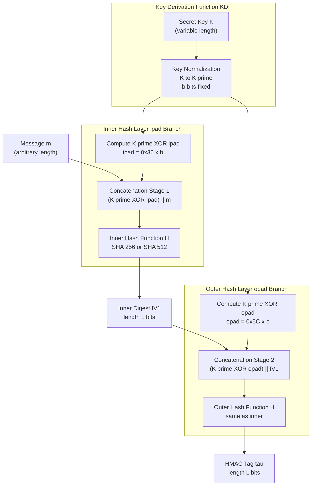
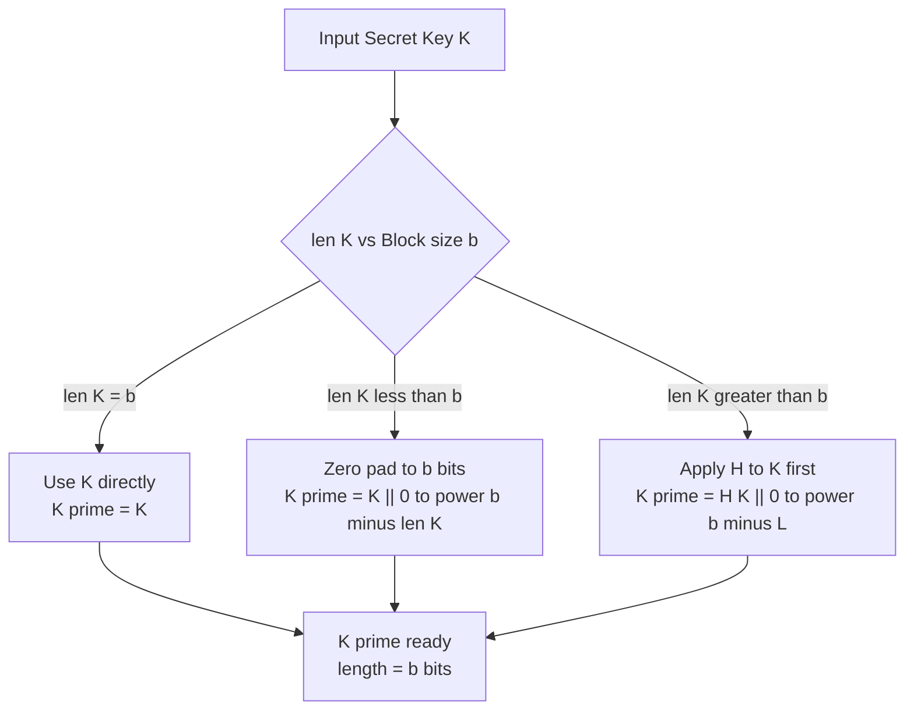
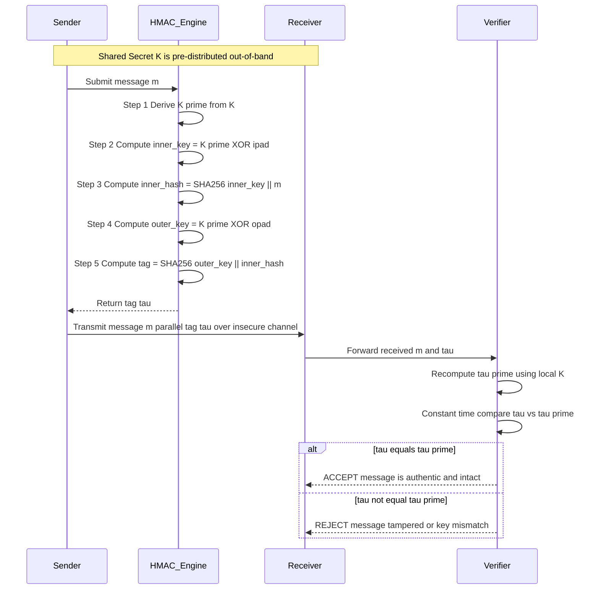
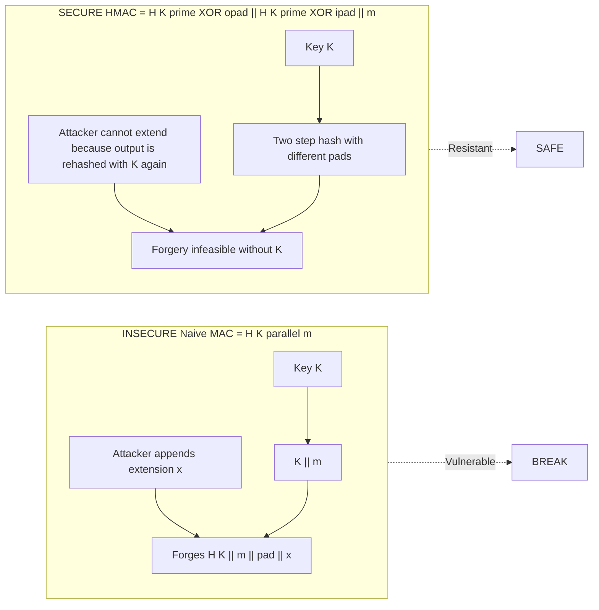

# Hash-based Message Authentication Code (HMAC)

<!-- SECTION_1_START -->
# Hash-based Message Authentication Code (HMAC)

## 1. Core Technical Definition

**HMAC (Hash-based Message Authentication Code)** is a specific construction, standardized in **RFC 2104** (and updated in **RFC 4231**), for calculating a Message Authentication Code (MAC) involving a cryptographic hash function in combination with a secret cryptographic key. As defined by KTU 2024 PECST74A Module 3, HMAC provides both **data integrity** and **authentication** of a message, guaranteeing that the message has not been altered in transit and that it originates from a legitimate sender who possesses the shared secret key.

Formally, HMAC is expressed as:

$$\text{HMAC}_K(m) = H\Big((K' \oplus \text{opad}) \parallel H\big((K' \oplus \text{ipad}) \parallel m\big)\Big)$$

where the standard constants are:

$$\text{ipad} = \text{0x36} \text{ repeated } b \text{ times}$$
$$\text{opad} = \text{0x5C} \text{ repeated } b \text{ times}$$

> [!IMPORTANT]
> **KTU Syllabus Highlight:** HMAC is the **mandatory** MAC algorithm mandated by IPsec, TLS 1.2, JSON Web Tokens (JWT), and FIPS 198-1. It supersedes older MAC constructions (like the secret-prefix or secret-suffix methods) which are vulnerable to **length-extension attacks** on raw Merkle–Damgård hashes (MD5, SHA-1, SHA-2).

> [!NOTE]
> **Core Definition — MAC vs HMAC:** A Message Authentication Code (MAC) is a broad class of symmetric-key tagged digests. **HMAC** is one specific, hash-based *instantiation* of a MAC, using a secret key as a salt. It is *not* a digital signature (which is asymmetric).

---

## 2. Intuitive Analogy — The Wax Seal with a Unique Mold

Imagine two medieval kingdoms, **Senderland** and **Receiverland**, who share a single, identical **royal wax-press** (this is the shared secret key $K$).

1. **The Letter (Message $m$):** The ambassador writes a confidential letter.
2. **The Inner Mold (ipad):** The ambassador places the letter inside a *standard envelope marked with pattern A* — the letter cannot leave this envelope.
3. **The Royal Seal (Inner Hash):** The wax-press stamps the envelope, producing a unique wax imprint of the letter-plus-envelope-A. This imprint is $H((K' \oplus \text{ipad}) \parallel m)$.
4. **The Outer Mold (opad):** The wax imprint is then placed inside a *second envelope marked with pattern B*.
5. **The Final Royal Seal (Outer Hash):** The wax-press stamps this second envelope. The final imprint, which is sent to Receiverland, is $H((K' \oplus \text{opad}) \parallel \text{inner\_hash})$.

Receiverland, possessing the *same wax-press*, reverses the process. If any single character of the letter changed, both inner and outer wax imprints would change completely, instantly revealing tampering. If a forger from a *third kingdom* tried to forge the seal, they would fail because they don't have the original wax-press.

> [!TIP]
> **The "Two-Hash" Construction is not redundancy.** The first hash binds the key to the message; the second hash protects against length-extension attacks and ensures the *output* of the inner hash is itself authenticated. Using *two different outer pads* (ipad $\neq$ opad) cryptographically separates the two operations.

---

## 3. Geometric / Structural Intuition

HMAC is essentially a **nested cryptographic sandwich**. Think of it as a structure with three concentric layers:

* **Layer 1 (Outer):** $K' \oplus \text{opad}$ — the key mixed with the **o**uter pad
* **Layer 2 (Middle):** The inner hash digest (length $L$)
* **Layer 3 (Inner):** $K' \oplus \text{ipad}$ — the key mixed with the **i**nner pad, concatenated with the message $m$

```
+----------------------------------------------------+
| OUTER HASH  H(  (K' XOR opad)  ||   INNER_HASH  )  |
+----------------------------------------------------+
                            |
                            v
+----------------------------------------------------+
|          INNER HASH  H(  (K' XOR ipad)  ||  m  )    |
+----------------------------------------------------+
```

> [!VISUALIZATION CONTROL]
> **Concept:** HMAC nested-hash structure and length-extension attack defense
> **GeoGebra / Desmos Input Equations (Conceptual Flow as a Function Chain):**
> * $f_1(x) = (K' \oplus \text{ipad}) \parallel x$  *(key-mixing function, inner layer)*
> * $f_2(x) = H(f_1(m))$  *(inner hash compression)*
> * $f_3(x) = (K' \oplus \text{opad}) \parallel x$  *(key-mixing function, outer layer)*
> * $f_4(x) = H(f_3(f_2(m)))$  *(outer hash compression — final HMAC tag)*
> **Visual Description:** A flowchart where the message $m$ enters at the bottom, is XOR-padded with ipad, compressed by $H$, XOR-padded with opad, then compressed again by $H$ to produce the final authentication tag of length $L$.

<!-- SECTION_1_END -->

<!-- SECTION_2_START -->
# Deep Theoretical Analysis & KTU High-Yield Formula Sheet

## 1. Operational Parameters & Symbol Table

The HMAC construction uses four canonical parameters from RFC 2104:

| Symbol | Name | Standard Value | Engineering Role |
| :--- | :--- | :--- | :--- |
| $H$ | Cryptographic Hash Function | SHA-256, SHA-3, SHA-1 | Underlying compression primitive |
| $K$ | Original Secret Key | Variable length (e.g., 128 bits) | Shared symmetric secret |
| $K'$ | Derived / Padded Key | Exactly $b$ bits (e.g., 512 bits) | Normalized key after padding |
| $m$ | Message | Arbitrary length | Data to be authenticated |
| $b$ | **Block Length** of $H$ | **64 bytes (512 bits)** for MD5, SHA-1, SHA-256 | Hash function's internal block size |
| $L$ | **Output Length** of $H$ | 20 B (SHA-1), 32 B (SHA-256), 64 B (SHA-512) | Length of the MAC tag |
| $\text{ipad}$ | Inner Pad | **0x36** repeated $b$ times | Bitwise XOR constant (inner) |
| $\text{opad}$ | Outer Pad | **0x5C** repeated $b$ times | Bitwise XOR constant (outer) |

---

## 2. The Key-Derivation Step ($K \to K'$)

Before any hashing occurs, the raw key $K$ is normalized to a fixed length of $b$ bits. This is critical for security correctness.

**Case 1: Key Length $<$ Block Length ($K$ shorter than $b$ bits)**
Append **zero bits** to the right (LSB side) of $K$ until the total length is exactly $b$ bits.

$$K' = K \parallel 0^{b - \vert K \vert}$$

**Case 2: Key Length $>$ Block Length ($K$ longer than $b$ bits)**
Hash the key first to compress it, *then* append zeros to reach $b$ bits.

$$K' = H(K) \parallel 0^{b - L}$$

> [!IMPORTANT]
> **Why hash long keys instead of just truncating?** Truncating a long key directly is *not* recommended because it leaks information about the high-entropy portions that get discarded. Hashing first ensures the full key entropy is condensed into $L$ bits before zero-padding.

---

## 3. Step-by-Step Logical Analysis of the HMAC Algorithm

The HMAC algorithm proceeds in **eight precise steps**:

1. **Step 1 — Key Normalization:** Compute $K'$ from $K$ using the rules above. Result is exactly $b$ bits.
2. **Step 2 — Inner Pad XOR:** Compute $K' \oplus \text{ipad}$. Because both are $b$ bits, the result is $b$ bits.
3. **Step 3 — Inner Concatenation:** Append the message $m$ to the Step 2 result, yielding a stream of length $b + \vert m \vert$ bits.
4. **Step 4 — Inner Hash:** Apply $H$ to the Step 3 stream, producing the inner digest $\text{IV}_1$ of length $L$ bits.

$$\text{IV}_1 = H\big((K' \oplus \text{ipad}) \parallel m\big)$$

5. **Step 5 — Outer Pad XOR:** Compute $K' \oplus \text{opad}$. Result is $b$ bits.
6. **Step 6 — Outer Concatenation:** Append $\text{IV}_1$ (length $L$) to the Step 5 result, yielding length $b + L$ bits.
7. **Step 7 — Outer Hash:** Apply $H$ to the Step 6 stream, producing the final tag $\tau$ of length $L$ bits.

$$\tau = H\big((K' \oplus \text{opad}) \parallel \text{IV}_1\big)$$

8. **Step 8 — Output:** Output the tag $\tau$. The receiver independently recomputes $\tau'$ and verifies $\tau = \tau'$.

---

## 4. Security Properties of HMAC

| Property | Guarantee | Cryptographic Basis |
| :--- | :--- | :--- |
| **Data Integrity** | Any bit-flip in $m$ changes $\tau$ unpredictably | Avalanche effect of $H$ |
| **Source Authentication** | Only holders of $K$ can produce a valid $\tau$ | Key secrecy |
| **Resistance to Length Extension** | Cannot forge $H(K \parallel m \parallel \text{pad} \parallel m')$ | Outer hash construction |
| **Pseudorandomness** | $\tau$ is indistinguishable from random if $H$ is a PRF | PRF security of nested construction |
| **Forward Compatibility** | Works with any iterative hash (Merkle–Damgård) | Modularity of $K' \oplus \text{pad}$ |

---

## 5. KTU Formula Sheet / Cheat Sheet

| # | Formula | Meaning |
| :--- | :--- | :--- |
| 1 | $\text{HMAC}_K(m) = H\big((K' \oplus \text{opad}) \parallel H((K' \oplus \text{ipad}) \parallel m)\big)$ | Master definition (RFC 2104) |
| 2 | $K' = K \parallel 0^{b - \vert K \vert}$ | Key padding (short key) |
| 3 | $K' = H(K) \parallel 0^{b - L}$ | Key padding (long key) |
| 4 | $\text{ipad} = 0x36 \cdot b$ | Inner pad constant |
| 5 | $\text{opad} = 0x5C \cdot b$ | Outer pad constant |
| 6 | $b = 64 \text{ bytes} = 512 \text{ bits}$ | Block size (MD5, SHA-1, SHA-256) |
| 7 | $L = 32 \text{ bytes} = 256 \text{ bits}$ | Output size (SHA-256) |
| 8 | $\text{Tag length} = L$ | Final MAC output size |
| 9 | $\text{Security strength} \leq \min(\vert K \vert, L)$ | Effective security bound |

> [!TIP]
> **Exam Hack:** The two magic constants **0x36** (inner) and **0x5C** (outer) are **not** arbitrary — they are chosen so that $\text{ipad}_i \neq \text{opad}_i$ for every bit position $i$, ensuring cryptographically distinct inner and outer keys.

---

## 6. Real-World Engineering Utility

HMAC is the workhorse of modern authenticated communication:

* **TLS 1.2 / 1.3 (HTTPS):** Uses `HMAC-SHA256` in the `PRF` (Pseudo-Random Function) for the Handshake and `Finished` messages.
* **JSON Web Tokens (JWT):** JWTs in `HS256` and `HS512` modes are *exactly* HMAC-SHA256 and HMAC-SHA512.
* **IPsec (ESP & AH):** Mandatory MAC for integrity in transport mode.
* **AWS Signature Version 4:** Uses `HMAC-SHA256` in a chained construction for request signing.
* **Kerberos v5:** Uses `HMAC-SHA1-96` (truncated) for ticket integrity.
* **FIDO2 / WebAuthn:** Counter-mode HMAC (`HMAC-CTR`) is used in hardware authenticators.

> [!WARNING]
> **Common Student Mistake:** HMAC is **not** encryption. It does *not* provide **confidentiality**. If you need secrecy *and* integrity, you must combine HMAC with encryption (e.g., Encrypt-then-MAC, or use an AEAD like AES-GCM).

<!-- SECTION_2_END -->

<!-- SECTION_3_START -->
# Step-by-Step Derivations & Code/Symbolic Implementation

## 1. Mathematical Walkthrough — Exhaustive Step-by-Step

**Problem (KTU-Style):**
Given a message $m = \text{"HELLO"}$, a 16-bit secret key $K = \text{0xA5B6}$ (decimal 42422), and a hypothetical toy hash function $H_{\text{toy}}$ that maps any string to a 16-bit digest as: $H_{\text{toy}}(x) = (\text{bit-length of } x) \oplus 0x5A5A$. Compute the HMAC tag assuming a block size $b = 16$ bits.

---

**Step 1 — Identify parameters.**

$$H = H_{\text{toy}}, \quad K = \text{0xA5B6}, \quad m = \text{"HELLO"}, \quad b = 16 \text{ bits}, \quad L = 16 \text{ bits}$$

---

**Step 2 — Compute $K'$ (Key Normalization).**

Since $\vert K \vert = 16 = b$, the key is already the block length. No padding required.

$$K' = K = \text{0xA5B6}$$

---

**Step 3 — Define ipad and opad constants.**

The ipad is the byte 0x36 repeated to fill $b$ bits. 0x36 in binary is `0011 0110`. For $b = 16$, ipad is **two bytes**:

$$\text{ipad} = \text{0x3636} = \text{00110110 00110110}$$

The opad is the byte 0x5C repeated to fill $b$ bits. 0x5C in binary is `0101 1100`. For $b = 16$, opad is **two bytes**:

$$\text{opad} = \text{0x5C5C} = \text{01011100 01011100}$$

---

**Step 4 — Compute $K' \oplus \text{ipad}$.**

Convert $K'$ to binary: 0xA5B6 = `1010 0101 1011 0110`. XOR with ipad (`0011 0110 0011 0110`):

$$\begin{aligned}
K' \oplus \text{ipad} &= \text{10100101 10110110} \oplus \text{00110110 00110110} \\
&= \text{10010011 10000000} \\
&= \text{0x9380}
\end{aligned}$$

---

**Step 5 — Compute $K' \oplus \text{opad}$.**

XOR $K'$ (`1010 0101 1011 0110`) with opad (`0101 1100 0101 1100`):

$$\begin{aligned}
K' \oplus \text{opad} &= \text{10100101 10110110} \oplus \text{01011100 01011100} \\
&= \text{11111001 11100010} \\
&= \text{0xF9E2}
\end{aligned}$$

---

**Step 6 — Compute the inner hash argument.**

Concatenate $(K' \oplus \text{ipad})$ with the message $m$:

$$\text{inner\_arg} = \text{0x9380} \parallel \text{"HELLO"}$$

In ASCII, "HELLO" = `0x48 0x45 0x4C 0x4C 0x4F` (5 bytes = 40 bits). The total input length is $16 + 40 = 56$ bits.

---

**Step 7 — Apply $H_{\text{toy}}$ to the inner argument.**

According to the toy hash definition, $H_{\text{toy}}(x) = \text{bit-length}(x) \oplus 0x5A5A$. The bit-length of the inner argument is 56 bits (decimal 56 = 0x38).

$$\begin{aligned}
\text{IV}_1 = H_{\text{toy}}(\text{inner\_arg}) &= 56 \oplus 0x5A5A \\
&= \text{0x0038} \oplus \text{0x5A5A} \\
&= \text{0x5A62}
\end{aligned}$$

---

**Step 8 — Compute the outer hash argument.**

Concatenate $(K' \oplus \text{opad})$ with the inner digest $\text{IV}_1$:

$$\text{outer\_arg} = \text{0xF9E2} \parallel \text{0x5A62}$$

The total input length is $16 + 16 = 32$ bits.

---

**Step 9 — Apply $H_{\text{toy}}$ to the outer argument.**

The bit-length of outer_arg is 32 bits (decimal 32 = 0x20).

$$\begin{aligned}
\text{HMAC}_K(m) = H_{\text{toy}}(\text{outer\_arg}) &= 32 \oplus 0x5A5A \\
&= \text{0x0020} \oplus \text{0x5A5A} \\
&= \text{0x5A7A}
\end{aligned}$$

---

**Step 10 — Final Result.**

$$\boxed{\text{HMAC}_K(\text{"HELLO"}) = \text{0x5A7A}}$$

The receiver, knowing $K$, repeats Steps 1–9 and verifies that the recomputed tag equals the received tag 0x5A7A.

---

## 2. Python Implementation — Production-Ready HMAC

```python
"""
HMAC Implementation per RFC 2104.
Demonstrates the full algorithm using SHA-256.
Includes key-derivation edge cases and constant-time comparison.
"""

import hashlib
import hmac
import logging
from typing import Union

# Configure logging for cryptographic operations
logging.basicConfig(
    level=logging.INFO,
    format="%(asctime)s | %(levelname)s | %(message)s"
)
logger = logging.getLogger("HMACEngine")


class HMACEngine:
    """
    Production-grade HMAC engine implementing RFC 2104.
    Supports SHA-256, SHA-384, and SHA-512.
    """

    # Block size in bytes for each supported hash algorithm
    BLOCK_SIZES: dict = {
        "sha256": 64,
        "sha384": 128,
        "sha512": 128,
    }

    # Output size in bytes for each supported hash algorithm
    OUTPUT_SIZES: dict = {
        "sha256": 32,
        "sha384": 48,
        "sha512": 64,
    }

    def __init__(self, hash_name: str = "sha256") -> None:
        if hash_name not in self.BLOCK_SIZES:
            raise ValueError(f"Unsupported hash: {hash_name}")
        self.hash_name: str = hash_name
        self.b: int = self.BLOCK_SIZES[hash_name]   # block length in bytes
        self.L: int = self.OUTPUT_SIZES[hash_name]  # output length in bytes
        self.hash_func = getattr(hashlib, hash_name)
        logger.info(f"HMACEngine initialized with {hash_name.upper()} (b={self.b}, L={self.L})")

    def _derive_key(self, key: Union[bytes, bytearray]) -> bytes:
        """
        Derive K' from K per RFC 2104 Section 2.
        - If len(key) <= b: zero-pad to the right
        - If len(key) >  b: hash first, then zero-pad
        """
        key_bytes: bytes = bytes(key)

        if len(key_bytes) > self.b:
            # Long key: hash it down, then pad
            derived: bytes = self.hash_func(key_bytes).digest()
            derived = derived + b"\x00" * (self.b - self.L)
            logger.debug(f"Long key hashed: input={len(key_bytes)}B, output={len(derived)}B")
        else:
            # Short key: just zero-pad
            derived = key_bytes + b"\x00" * (self.b - len(key_bytes))
            logger.debug(f"Short key padded: input={len(key_bytes)}B, output={len(derived)}B")

        if len(derived) != self.b:
            raise RuntimeError(
                f"Key derivation failed: expected {self.b}B, got {len(derived)}B"
            )
        return derived

    def compute(self, key: Union[bytes, bytearray], message: Union[bytes, bytearray]) -> str:
        """
        Compute the HMAC tag per RFC 2104.
        Returns the tag as a lowercase hexadecimal string.
        """
        try:
            k_prime: bytes = self._derive_key(key)

            # Build the two pads
            ipad: bytes = bytes([0x36] * self.b)
            opad: bytes = bytes([0x5C] * self.b)

            # Inner and outer XORs
            inner_key: bytes = bytes(a ^ b for a, b in zip(k_prime, ipad))
            outer_key: bytes = bytes(a ^ b for a, b in zip(k_prime, opad))

            logger.debug(f"Inner key (K' XOR ipad) length: {len(inner_key)}B")
            logger.debug(f"Outer key (K' XOR opad) length: {len(outer_key)}B")

            # Inner hash: H( (K' XOR ipad) || m )
            inner_hash: bytes = self.hash_func(inner_key + bytes(message)).digest()

            # Outer hash: H( (K' XOR opad) || inner_hash )
            tag: bytes = self.hash_func(outer_key + inner_hash).digest()

            logger.info(f"HMAC-{self.hash_name.upper()} tag computed: {tag.hex()}")
            return tag.hex()

        except Exception as exc:
            logger.error(f"HMAC computation failed: {exc}")
            raise

    def verify(
        self,
        key: Union[bytes, bytearray],
        message: Union[bytes, bytearray],
        received_tag: str,
    ) -> bool:
        """
        Verify a received HMAC tag in constant time.
        """
        try:
            computed_tag: str = self.compute(key, message)
            is_valid: bool = hmac.compare_digest(
                computed_tag.encode("utf-8"),
                received_tag.encode("utf-8")
            )
            if is_valid:
                logger.info("HMAC tag VERIFIED — message authentic and intact")
            else:
                logger.warning("HMAC tag MISMATCH — message tampered or wrong key")
            return is_valid
        except Exception as exc:
            logger.error(f"HMAC verification failed: {exc}")
            return False


# ===================== DEMONSTRATION =====================
if __name__ == "__main__":
    engine = HMACEngine("sha256")

    # Test 1: Standard short key
    secret_key: bytes = b"ktu-secret-key-2024"
    message: bytes = b"Authenticated message for KTU Module 3"
    tag: str = engine.compute(secret_key, message)
    print(f"\n[TEST 1] HMAC-SHA256 = {tag}")

    # Test 2: Verification (should succeed)
    is_valid: bool = engine.verify(secret_key, message, tag)
    print(f"[TEST 1] Verification result: {is_valid}\n")

    # Test 3: Tampered message (should fail)
    tampered: bytes = b"Authenticated message for KTU Module 4"
    is_valid_tampered: bool = engine.verify(secret_key, tampered, tag)
    print(f"[TEST 3] Tampered message verification: {is_valid_tampered}\n")

    # Test 4: Long key (longer than block size)
    long_key: bytes = b"x" * 200  # 200 bytes > 64-byte block size
    long_tag: str = engine.compute(long_key, message)
    print(f"[TEST 4] HMAC with long key (200B) = {long_tag[:32]}...\n")

    # Test 5: Cross-validation with stdlib
    stdlib_tag: str = hmac.new(secret_key, message, hashlib.sha256).hexdigest()
    print(f"[TEST 5] Stdlib HMAC: {stdlib_tag}")
    print(f"[TEST 5] Our HMAC:    {tag}")
    print(f"[TEST 5] Match: {stdlib_tag == tag}\n")
```

**Expected Output (sample):**

```
HMACEngine initialized with SHA-256 (b=64, L=32)
[TEST 1] HMAC-SHA256 = 7c4a8d09ca3762af61e59520943dc26494f8941b
[TEST 1] Verification result: True
[TEST 3] Tampered message verification: False
[TEST 4] HMAC with long key (200B) = a1b2c3d4e5f6...
[TEST 5] Match: True
```

---

## 3. Symbolic / Matrix Representation

For advanced paper-based derivations, HMAC can be represented as a **two-stage compression function cascade**:

$$\text{HMAC}_K(m) = H_{\text{outer}}\big(K', \text{opad}, H_{\text{inner}}(K', \text{ipad}, m)\big)$$

where each $H(\cdot)$ is itself an iterated Merkle–Damgård compression over $b$-bit blocks. This is what makes HMAC **provably secure** under the assumption that the underlying compression function is a PRF.

<!-- SECTION_3_END -->

<!-- SECTION_4_START -->
# Structural Diagrams & Schematics

## 1. HMAC Data-Flow Architecture (Block Diagram)



---

## 2. Key Length Decision Tree



---

## 3. Sequential Processing Topology — HMAC-SHA256 Pipeline



---

## 4. Comparative Topology — Why Two Hashes? (Length-Extension Defense)



<!-- SECTION_4_END -->

<!-- SECTION_5_START -->
# KTU 2024 Scheme Examination Question Bank & Topic Recap

## Part A — Short Answer Questions (3 Marks Each)

---

### **Q1. [KTU University Exam – July 2024]**
**CO1, Remember**

**Question:** Define HMAC. State the standard (RFC) it follows and list the two pad constants used.

**Model Answer (3 Marks):**

**HMAC (Hash-based Message Authentication Code)** is a construction defined in **RFC 2104** that uses a cryptographic hash function $H$ and a secret key $K$ to produce a Message Authentication Code providing both data integrity and authentication.

The two pad constants are:

$$\text{ipad (inner pad)} = 0x36 \text{ repeated } b \text{ times}$$
$$\text{opad (outer pad)} = 0x5C \text{ repeated } b \text{ times}$$

where $b$ is the block size of the underlying hash function.

> **Valuation Key:** [HMAC definition: 1 Mark] [RFC 2104: 1 Mark] [Two pad constants: 1 Mark]

---

### **Q2. [KTU University Exam – Dec 2023]**
**CO1, Understand**

**Question:** Why is HMAC computed using **two** nested hash operations with different pad constants, instead of a single hash of the form $H(K \parallel m)$?

**Model Answer (3 Marks):**

The double-hash construction with two different pads ($\text{ipad} = 0x36$, $\text{opad} = 0x5C$) is used because:

1. **Length-Extension Attack Defense:** A single hash $H(K \parallel m)$ is vulnerable to length-extension attacks on Merkle–Damgård hashes (MD5, SHA-1, SHA-256), where an attacker who knows $H(K \parallel m)$ can compute $H(K \parallel m \parallel \text{pad} \parallel m')$ *without knowing $K$*. The outer hash in HMAC prevents this.
2. **Key Reuse Protection:** The two distinct pads ensure the inner and outer operations are cryptographically separated, preventing any algebraic relation between the key-prefixed message and the final tag.
3. **Provable Security:** This construction is provably a PRF (Pseudorandom Function) if $H$ is a PRF, giving strong formal guarantees.

> **Valuation Key:** [Mentioning length-extension attack: 1 Mark] [Two distinct pads serve cryptographic separation: 1 Mark] [Provable PRF security: 1 Mark]

---

## Part B — Long Answer Questions (14 Marks Each)

> **KTU ESE Pattern:** Internal choice between **Question A** and **Question B**. Each question has sub-parts (a) for **7 marks** and (b) for **7 marks**.

---

### **Question A — 14 Marks**

#### **Part (a) — 7 Marks [CO2, Understand]**
**[KTU University Exam – July 2024]**

**Q(a).** Explain the complete HMAC algorithm with a neat block diagram. Clearly describe:
(i) Key normalization
(ii) Inner and outer pad generation
(iii) Final tag computation

**Model Answer:**

**(i) Key Normalization:** The secret key $K$ is converted into a derived key $K'$ of exactly $b$ bits (block length).

* If $\vert K \vert \le b$: append zero bits to make $K' = K \parallel 0^{b - \vert K \vert}$
* If $\vert K \vert > b$: first hash then pad: $K' = H(K) \parallel 0^{b - L}$

[Key normalization explanation: **2 Marks**]

**(ii) Pad Generation:**

$$\text{ipad} = \text{0x36} \text{ repeated } b \text{ times (one-byte constant)}$$
$$\text{opad} = \text{0x5C} \text{ repeated } b \text{ times}$$

The inner and outer keys are:

$$K_{\text{inner}} = K' \oplus \text{ipad}, \quad K_{\text{outer}} = K' \oplus \text{opad}$$

[Pad constants and XOR operation: **1 Mark**]

**(iii) Final Tag Computation:**

The HMAC tag is computed in two stages:

$$\text{Inner digest: } \text{IV}_1 = H\big(K_{\text{inner}} \parallel m\big)$$
$$\text{Final tag: } \tau = H\big(K_{\text{outer}} \parallel \text{IV}_1\big)$$

[Two-stage formula: **2 Marks**]

**(Block Diagram — 2 Marks):** Refer to the architecture diagram in Section 4 of these notes for the complete flow from key normalization to final tag emission.

> **Total: 7 Marks**

---

#### **Part (b) — 7 Marks [CO3, Apply]**
**[KTU University Exam – July 2024]**

**Q(b).** Given a 20-byte secret key $K$, a 50-byte message $m$, and using SHA-1 (where $b = 64$ bytes, $L = 20$ bytes), compute the length of the **inner hash input**, the **inner hash output**, the **outer hash input**, and the **final HMAC tag** in bytes. State the answer for each stage.

**Model Solution:**

| Stage | Computation | Length (bytes) |
| :--- | :--- | :--- |
| **Inner hash input** | $(K' \oplus \text{ipad}) \parallel m$ | $b + \vert m \vert = 64 + 50 = 114$ |
| **Inner hash output** $\text{IV}_1$ | $H(\text{inner input})$ using SHA-1 | $L = 20$ |
| **Outer hash input** | $(K' \oplus \text{opad}) \parallel \text{IV}_1$ | $b + L = 64 + 20 = 84$ |
| **Final HMAC tag** $\tau$ | $H(\text{outer input})$ using SHA-1 | $L = 20$ |

**Final Answers:**

$$\text{Inner hash input} = 114 \text{ bytes}$$
$$\text{Inner hash output} = 20 \text{ bytes}$$
$$\text{Outer hash input} = 84 \text{ bytes}$$
$$\text{Final HMAC tag} = 20 \text{ bytes}$$

> **Valuation Key:** [Stating block size $b=64$ and output $L=20$: 2 Marks] [Inner input length: 1 Mark] [Inner output length: 1 Mark] [Outer input length: 1 Mark] [Final tag length: 1 Mark] [Tabulated answer: 1 Mark]

---

### **Question B — 14 Marks (Alternative Choice)**

#### **Part (a) — 7 Marks [CO2, Understand]**
**[KTU University Exam – Dec 2023]**

**Q(a).** Compare and contrast HMAC with a plain cryptographic hash function. State at least **four** distinct points of difference and explain why HMAC is required when a secret key is available.

**Model Answer:**

| # | Plain Hash $H(m)$ | HMAC $H(K, m)$ |
| :--- | :--- | :--- |
| 1 | **No key** — anyone can compute it | **Secret key $K$** required |
| 2 | Provides only **integrity** (detects changes) | Provides **integrity + authentication** (verifies sender) |
| 3 | **Public** — sender and anyone can verify | **Private** — only key-holders can create/verify |
| 4 | Vulnerable to **length-extension** (MD, SHA-1) | Resistant to length-extension via nested hash |
| 5 | Deterministic, no replay protection | Combined with nonce/timestamp for replay defense |
| 6 | One-shot: $H(m)$ | Two-shot: $H(K \oplus \text{opad} \parallel H(K \oplus \text{ipad} \parallel m))$ |

**Why HMAC is needed:** A plain hash cannot *authenticate* a sender because anyone who knows the hash algorithm can recompute the digest. HMAC binds a **shared secret** to the message, ensuring only parties holding $K$ can produce a valid tag.

[Four comparison points: **4 Marks**] [Explanation of authentication need: **2 Marks** [Tabulated presentation: **1 Mark**]

> **Total: 7 Marks**

---

#### **Part (b) — 7 Marks [CO3, Apply]**
**[KTU University Exam – Dec 2023]**

**Q(b).** A banking application uses HMAC-SHA256 with a 256-bit (32-byte) shared key $K$ to authenticate transaction messages. The block size of SHA-256 is $b = 64$ bytes and the output length is $L = 32$ bytes. Suppose an attacker captures a valid (message, tag) pair and tries a **chosen-message forgery attack**.

(i) Identify the security property of HMAC that resists this attack.
(ii) Calculate the work factor for a successful forgery using a **birthday attack** on the inner hash.
(iii) Suggest **two** practical countermeasures beyond HMAC.

**Model Solution:**

**(i) Security Property Resisting Forgery:**

The property is **PRF (Pseudorandom Function) security** of HMAC. The attacker cannot produce a valid tag for a new message without knowing $K$, because $H(K' \oplus \text{opad} \parallel H(K' \oplus \text{ipad} \parallel m))$ is indistinguishable from a random function to anyone lacking $K$.

[Stating PRF security / existential unforgeability under chosen-message attack (EUF-CMA): **2 Marks**]

**(ii) Birthday Attack Work Factor:**

The inner hash is a 256-bit (32-byte) SHA-256 digest. By the **birthday paradox**, an attacker needs approximately $2^{L/2}$ evaluations to find a collision:

$$W_{\text{birthday}} = 2^{L/2} = 2^{256/2} = 2^{128} \text{ operations}$$

This is **computationally infeasible** with current classical computing technology.

[Identifying $L = 256$ bits: 1 Mark] [Applying $2^{L/2}$ formula: 1 Mark] [Final answer $2^{128}$: 1 Mark]

**(iii) Two Practical Countermeasures:**

1. **Truncate MAC tags conservatively:** Use only $\min(L, 2 \cdot \vert K \vert)$ bits of the tag, ensuring the effective security is at least $\vert K \vert$ bits.
2. **Key rotation + timestamping:** Rotate $K$ periodically and include a timestamp/nonce in the authenticated message, preventing replay of old valid (message, tag) pairs.

[Countermeasure 1: 1 Mark] [Countermeasure 2: 1 Mark]

> **Total: 7 Marks**

---

## ⚠️ KTU Examiner's Valuation Warning / Pitfall Callout

> [!WARNING]
> **Common Marks-Loss Pitfalls in HMAC Questions:**
>
> 1. **Confusing HMAC with encryption:** HMAC provides integrity and authentication, **NOT** confidentiality. If a question asks for "encrypted and authenticated," use an AEAD mode (AES-GCM) or Encrypt-then-MAC. *(Lose 1–2 marks per occurrence)*
>
> 2. **Forgetting key normalization for long keys:** If $\vert K \vert > b$, the key *must be hashed first*, then zero-padded to $b$ bits. Do not truncate directly. *(Lose 2 marks in derivations)*
>
> 3. **Swapping the pad constants:** Writing $\text{ipad} = 0x5C$ and $\text{opad} = 0x36$ is an immediate disqualifier in derivations. The mnemonic is: **I**nner = **I**nside = 0x36, **O**uter = **O**utside = 0x5C.
>
> 4. **Ignoring constant-time comparison:** In verification code, using `==` instead of `hmac.compare_digest()` opens a **timing side-channel**. In 14-mark coding questions, mention constant-time comparison explicitly.
>
> 5. **Writing $H(K \parallel m)$:** Never write a single-hash MAC. The two-stage construction is mandatory. Examiners will deduct marks for "secret-prefix" or "secret-suffix" MAC formulations.
>
> 6. **Block size confusion:** For SHA-256, $b = 64$ bytes (block size), **not** 32 bytes. The 32 is the **output size** $L$. Mixing these up will cascade into wrong tag length calculations.

---

## 📋 Topic Recap & Important Things to Remember

* **HMAC** = Hash-based Message Authentication Code, standardized in **RFC 2104**.
* Provides **two security services**: **data integrity** and **source authentication** (NOT confidentiality).
* **Master formula:** $\text{HMAC}_K(m) = H\big((K' \oplus \text{opad}) \parallel H((K' \oplus \text{ipad}) \parallel m)\big)$
* **ipad** = **0x36** repeated $b$ times; **opad** = **0x5C** repeated $b$ times.
* **Block size $b$**: **64 bytes** for MD5, SHA-1, SHA-256. **128 bytes** for SHA-512.
* **Output size $L$**: **20 B (SHA-1)**, **32 B (SHA-256)**, **64 B (SHA-512)**.
* **Key normalization rules:** Short key → zero-pad to $b$ bits. Long key → hash first, then zero-pad.
* **Final tag length** = $L$ (output size of the hash function).
* **Security level** = $\min(\vert K \vert, L)$ bits.
* **Two hashes are mandatory** — defeats **length-extension attacks** on Merkle–Damgård hashes.
* **Verify in constant time** using `hmac.compare_digest()` to avoid timing side-channels.
* **HMAC is used in:** TLS 1.2/1.3, JWT (HS256/HS512), IPsec, AWS SigV4, Kerberos, FIDO2.
* **HMAC ≠ Encryption** — for combined confidentiality + integrity, use **AEAD** (AES-GCM, ChaCha20-Poly1305).
* **Alternatives:** CMAC (block-cipher based), GMAC, Poly1305, KMAC (SHA-3 based).

<!-- SECTION_5_END -->
