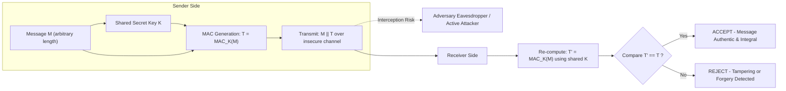
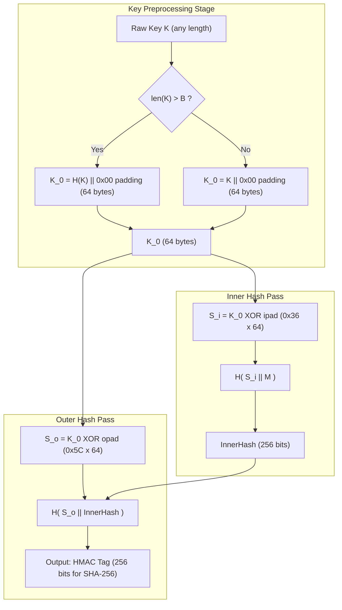
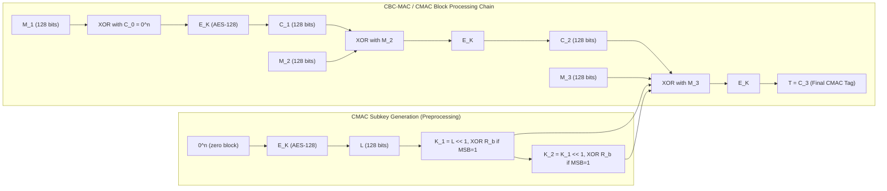
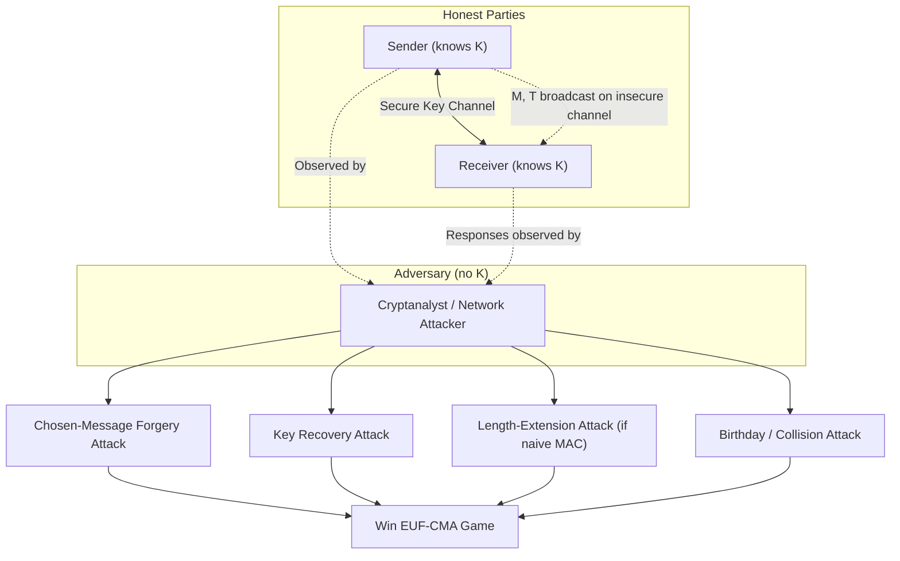

# Message Authentication Codes (MAC)

<!-- SECTION_1_START -->
# Message Authentication Codes (MAC)

## 1.1 Formal Definition (KTU 2024 Syllabus Terminology)

A **Message Authentication Code (MAC)** is a cryptographic primitive that takes a **secret symmetric key** $K$ and an **arbitrary-length message** $M$ as input, and produces a **fixed-size tag** (also called the authentication tag or MAC value) denoted $T = \text{MAC}_K(M)$. This tag enables the receiver, who shares the same secret key, to verify both the **data integrity** (the message has not been altered) and the **source authenticity** (the message originated from a party who knows the key).

> [!IMPORTANT]
> **Board Definition (Verbatim Style for ESE):**
> A MAC is a *symmetric-key* cryptographic checksum that provides **message authentication** and **integrity** but **does not provide non-repudiation** (because both sender and receiver share the same secret key, either could have produced the tag).

Formally, a MAC scheme is a tuple of three polynomial-time algorithms:
1. $\text{KeyGen}(1^\lambda) \rightarrow K$ — outputs a uniformly random key of size $\lambda$ bits.
2. $\text{Tag}(K, M) \rightarrow T$ — deterministic algorithm producing a tag.
3. $\text{Verify}(K, M, T') \rightarrow \{\text{Accept}, \text{Reject}\}$ — outputs Accept iff $T' = \text{Tag}(K, M)$.

## 1.2 Conceptual Analogy — The Royal Wax Seal

Imagine a medieval king sending a secret war command to his general. The parchment is rolled, tied with a cord, and stamped with the king's **unique wax seal** that only the king and general possess a mould for.

- **The Message** → the parchment document.
- **The Shared Secret (Key)** → the unique seal mould known only to king and general.
- **The MAC Tag** → the wax imprint.
- **The Verification** → the general breaks the seal; if the imprint is intact, the message is authentic and unaltered.

If a thief intercepts the letter, he cannot forge the seal (he lacks the mould). If he tampers with the parchment, the seal breaks. The catch? The general *could* have produced a fake sealed letter himself — hence the system provides authentication but **not** non-repudiation. This is the critical conceptual distinction between a MAC and a **digital signature**.

> [!NOTE]
> **Why MAC ≠ Digital Signature:**
> - MAC uses a *symmetric* (shared) key → both parties can generate tags → no non-repudiation.
> - Digital Signatures use *asymmetric* (public–private) keypair → only the signer can generate → provides non-repudiation.

## 1.3 Core Properties of a Secure MAC

A cryptographic MAC must satisfy the following **four essential properties**, all of which are examinable under CO1 / CO2 of the PECST74A syllabus:

| Property | Description |
| :--- | :--- |
| **Compression** | Maps an input message of arbitrary finite length to a fixed-length output tag (e.g., 128 or 256 bits). |
| **Key Dependency** | The tag is a deterministic function of *both* the message and the secret key. |
| **Easy Computation** | Both $\text{Tag}$ and $\text{Verify}$ must be efficiently computable given the key. |
| **Forgery Resistance** | Computationally infeasible for an adversary without the key to produce a valid $(M, T)$ pair, even after obtaining tags for chosen messages (**EUF-CMA security**). |

> [!VISUALIZATION CONTROL]
> **Concept:** MAC Tag Generation and Verification Pipeline
> **GeoGebra / Desmos Input Equations (Conceptual Mapping):**
> * `Sender: T = MAC(K, M)` — point $(M, T)$ in tag space.
> * `Receiver: Verify(K, M, T) = 1 if T = MAC(K, M)` — verification as a binary step.
> **Visual Description:** A horizontal axis representing the message space $M$ (continuous, arbitrary length) collapsing into a discrete output tag space $T$ of fixed size $L$ bits (e.g., 256 bits for HMAC-SHA-256). The function is many-to-one — different $M$ values map to the same $T$ (collisions exist), but finding them must be hard.

## 1.4 Classification of MAC Algorithms (Module 3 Scope)

The KTU 2024 syllabus for PECST74A Module 3 covers the following MAC families:

1. **HMAC** (Hash-based MAC) — RFC 2104 — built atop cryptographic hash functions.
2. **CMAC** (Cipher-based MAC) — NIST SP 800-38B — built atop block ciphers (AES-CMAC).
3. **GMAC** (Galois MAC) — NIST SP 800-38D — special form for AES-GCM authenticated encryption.
4. **CBC-MAC** — the historical/educational predecessor of CMAC.
5. **Poly1305** — modern high-speed MAC used in TLS 1.3 (Daniel J. Bernstein).

> [!NOTE]
> **Syllabus Highlight:** The Module 3 outcomes for PECST74A emphasize the *construction*, *security analysis*, and *real-world deployment* of HMAC and CMAC, with HMAC being the most frequently examined topic in KTU university papers.

<!-- SECTION_1_END -->

<!-- SECTION_2_START -->
# Deep Theoretical Analysis & KTU High-Yield Formula Sheet

## 2.1 The Generic MAC Model

The mathematical model of a MAC is built on the concept of a **pseudo-random function (PRF)** family. Let:

$$\mathcal{K} = \{0, 1\}^\lambda \quad \text{(key space)}$$

$$\mathcal{M} = \{0, 1\}^* \quad \text{(message space, arbitrary length)}$$

$$\mathcal{T} = \{0, 1\}^L \quad \text{(tag space, fixed length L bits)}$$

A MAC is a function:

$$\text{MAC}: \mathcal{K} \times \mathcal{M} \rightarrow \mathcal{T}$$

The security of this function is measured by the **existential unforgeability under chosen-message attack (EUF-CMA)** game:

1. The challenger generates a random key $K \leftarrow \text{KeyGen}(1^\lambda)$.
2. The adversary $\mathcal{A}$ makes $q$ adaptive queries $M_1, M_2, \ldots, M_q$ and receives the corresponding tags $T_1, T_2, \ldots, T_q$.
3. $\mathcal{A}$ outputs a pair $(M^*, T^*)$ where $M^* \notin \{M_1, \ldots, M_q\}$.
4. $\mathcal{A}$ wins if $\text{Verify}(K, M^*, T^*) = \text{Accept}$.

The **advantage** of $\mathcal{A}$ is $\text{Adv}_{\text{MAC}}^{\text{EUF-CMA}}(\mathcal{A}) = \Pr[\mathcal{A} \text{ wins}]$. The MAC is secure if this advantage is *negligible* in $\lambda$.

> [!IMPORTANT]
> **KTU Board Tip:** A common 3-mark question is *"What is the difference between MAC and Hash?"*. The answer must explicitly state: *a hash is a public unkeyed function (anyone can compute it), whereas a MAC is a keyed function (only key-holders can compute and verify).* This is the most fundamental CO1 distinction.

## 2.2 Naive Constructions and Why They Fail

### 2.2.1 Secret-Prefix MAC: $\text{MAC}_K(M) = H(K \| M)$

**Attack:** Vulnerable to **length-extension attacks**. Given $\text{MAC}_K(M)$ and $\text{len}(M)$, the attacker can compute $\text{MAC}_K(M \| \text{pad} \| M')$ for an attacker-chosen $M'$ without knowing $K$, because the Merkle–Damgård construction allows internal state to be extended.

### 2.2.2 Secret-Suffix MAC: $\text{MAC}_K(M) = H(M \| K)$

**Attack:** Vulnerable to **offline brute-force** on the key when message space is small. Also, the key is only protected by the *outer* hash, allowing meet-in-the-middle attacks for $K$ recovery.

### 2.2.3 Hash-of-Both: $\text{MAC}_K(M) = H(K \| M \| K)$

**Attack:** Still vulnerable to length extension in some Merkle–Damgård variants and suffers from key-length ambiguity in $H$.

> [!NOTE]
> These naive failures are precisely the engineering motivation that led Mihir Bellare, Ran Canetti, and Hugo Krawczyk to design **HMAC** in 1996 (RFC 2104).

## 2.3 HMAC — The Industry Standard Construction

The **Hash-based MAC (HMAC)** wraps an underlying cryptographic hash function $H$ (typically SHA-256, SHA-3, or SHA-512) with a double-keyed padding structure to defeat length-extension attacks.

The construction is:

$$\text{HMAC}_K(M) = H\!\left( (K \oplus \text{opad}) \,\|\, H\!\left( (K \oplus \text{ipad}) \,\|\, M \right) \right)$$

Where:
- $\text{ipad} = \texttt{0x36}$ repeated $B$ times (inner pad).
- $\text{opad} = \texttt{0x5C}$ repeated $B$ times (outer pad).
- $B$ = the byte-length of the hash function's internal block (e.g., **$B = 64$ bytes** for SHA-256).
- $K$ is padded/truncated to exactly $B$ bytes before XOR.

> [!WARNING]
> **Critical Implementation Pitfall:** The key $K$ must be **first hashed (if shorter than $B$ bytes)** or **first hashed (if longer than $B$ bytes)** to obtain a fixed $B$-byte string $K_0$. Direct truncation of long keys is *forbidden* by RFC 2104. Losing this 1 mark is a common KTU exam pitfall.

## 2.4 KTU High-Yield Formula Sheet

The following table consolidates all critical formulas, constants, and boundary conditions required for PECST74A Module 3 problem-solving. **No vertical bars are used in cells to preserve markdown table integrity.**

| # | Concept | Formula / Value | Units / Size | Security Implication |
| :--- | :--- | :--- | :--- | :--- |
| 1 | MAC generic equation | $T = \text{MAC}_K(M)$ | $T \in \{0,1\}^L$ | $L$ determines forgery resistance |
| 2 | Tag length (HMAC-SHA-256) | $L = 256$ | bits | $2^{128}$ birthday-bound security |
| 3 | HMAC key size (recommended) | $\vert K \vert \ge 256$ | bits | Matches the hash output strength |
| 4 | HMAC block size (SHA-256) | $B = 64$ | bytes (512 bits) | Determines $K_0$ padding length |
| 5 | Inner pad constant | $\text{ipad} = \texttt{0x36} \times 64$ | bytes | XOR with $K_0$ to form $S_i$ |
| 6 | Outer pad constant | $\text{opad} = \texttt{0x5C} \times 64$ | bytes | XOR with $K_0$ to form $S_o$ |
| 7 | HMAC equation | $H\!\left( S_o \,\vert\, H\!\left( S_i \,\vert\, M \right) \right)$ | nested hash | Two passes of $H$ |
| 8 | CMAC subkey generation | $L = \text{AES}_K(0^n)$, then $L_u, L_2$ via $R_b$ shift | bits | $R_b = \texttt{0x87}$ for AES |
| 9 | CMAC final block | $T_n = E_K(M_n \oplus C_n)$ where $C_n \in \{L, L_2, 0\}$ | bits | Length-aware padding |
| 10 | GMAC equation | $\text{GMAC}_K(M) = \text{GHASH}_H(A, C, T)$ over $\text{GF}(2^{128})$ | 128-bit tag | Used in AES-GCM AEAD |
| 11 | EUF-CMA advantage | $\le \epsilon_{\text{PRF}} + q^2 / 2^L$ | probability | Bound on forgery success |
| 12 | Birthday attack | $\approx 2^{L/2}$ MAC queries | exponent | $L = 128$ → $2^{64}$ queries |
| 13 | Length-extension vulnerability | $H(K \,\vert\, M) \rightarrow$ forgeable | — | Fixed by HMAC nesting |
| 14 | CBC-MAC for fixed-length $M$ | $T_i = E_K(M_i \oplus T_{i-1})$ | bits | Insecure for variable-length $M$ |
| 15 | NIST-recommended MACs | HMAC-SHA-256, CMAC-AES-128, GMAC-AES-256 | — | FIPS 140-3 validated |

## 2.5 Real-World Engineering Utility

HMAC and CMAC are the *workhorses* of modern authenticated communication. Their deployment footprint is enormous:

- **TLS 1.2 / TLS 1.3** — HMAC is used inside the **HKDF (HMAC-based Key Derivation Function)** for deriving session keys from the handshake.
- **IPsec (ESP and AH headers)** — HMAC-SHA-256-128 is the default authentication transform.
- **JWT (JSON Web Tokens)** — `HS256` signing mode is literally HMAC-SHA-256.
- **AWS Signature Version 4** — request authentication in S3, EC2, etc. uses HMAC-SHA-256.
- **Bitcoin and Blockchain** — HMAC-SHA-512 is used in the BIP32 hierarchical key derivation.
- **SSH Transport Layer** — uses HMAC-SHA-256 / HMAC-SHA-512 for packet authentication.

> [!IMPORTANT]
> **Production Reality:** In cloud-native systems (Kubernetes admission webhooks, OAuth2 token signing, TPM 2.0 attestation), MAC functions are called *billions* of times per second. The cost of an insecure MAC is a full system compromise — hence the 14-mark KTU questions frequently target *security proof sketches* and *attack analysis* of MAC constructions.

<!-- SECTION_2_END -->

<!-- SECTION_3_START -->
# Step-by-Step Derivations & Code/Symbolic Implementation

## 3.1 Full Derivation of HMAC from the Bellare–Canetti–Krawczyk (BCK) Construction

The HMAC construction is formally derived from the **nested MAC (NMAC)** primitive.

**Step 1 — Define NMAC.**

Let $f$ be a keyed hash function with two keys $(K_1, K_2)$:

$$\text{NMAC}_{K_1, K_2}(M) = f_{K_1}\!\left( f_{K_2}(M) \right)$$

If $f$ is a PRF, then NMAC is also a PRF, and therefore a secure MAC (PRF-secure → MAC-secure by the BCK theorem of 1996).

**Step 2 — Convert $f$ to an unkeyed hash $H$.**

Let $H$ be a Merkle–Damgård hash with iterated compression function $h$:

$$H(M) = h(h(\cdots h(H_0, M_1) \cdots, M_{b-1}), M_b)$$

The keyed version $f_K$ can be defined as $f_K(M) = H(K \| M)$, but this is *not* PRF-secure due to length extension.

**Step 3 — Define the IV-replacement trick.**

For HMAC, the keys are derived by *replacing* the hash's fixed initial value $H_0 = \text{IV}$ with the XORed key–pad values.

Let $H_{\text{iv}}(M)$ denote the Merkle–Damgård hash of $M$ with initialization vector $\text{iv}$. Then:

$$\text{HMAC}_K(M) = H_{\text{iv} \oplus \text{opad}}\!\left( \, H_{\text{iv} \oplus \text{ipad}}(M) \,\right)$$

where the pads are $B$-byte strings and $K$ is preprocessed to $K_0$ of length $B$.

**Step 4 — Security Bound (BCK 1996 Theorem).**

Let $\mathcal{A}$ be an adversary that makes at most $q$ queries totaling $\sigma$ message blocks. Then:

$$\text{Adv}_{\text{HMAC}}^{\text{MAC}}(\mathcal{A}) \le \text{Adv}_f^{\text{PRF}}(\mathcal{B}) + \frac{\sigma^2}{2^{c-1}}$$

where $c$ is the internal state size of $H$ (e.g., $c = 256$ for SHA-256). This makes HMAC provably secure as long as the underlying hash is a PRF on its compression function — a much weaker requirement than collision resistance.

## 3.2 Exhaustive HMAC-SHA-256 Computational Walk-Through

We will compute, block by block, the HMAC of a 3-block message $M = M_1 \| M_2 \| M_3$ using a 256-bit key $K$ (assume $K_0 = K$ padded to 64 bytes with zeros).

> [!NOTE]
> **Constants (RFC 6234 for SHA-256):**
> - Block size $B = 64$ bytes = **512 bits**.
> - Hash output $L = 32$ bytes = **256 bits**.
> - $\text{ipad} = \texttt{0x36} \times 64$, $\text{opad} = \texttt{0x5C} \times 64$.

**Step A — Key pre-processing.**

$$K_0 = \begin{cases} K \text{ padded to } 64 \text{ bytes with } 0\text{x00} & \text{if } \vert K \vert \le 64 \text{ bytes} \\ H(K) \text{ padded to } 64 \text{ bytes} & \text{if } \vert K \vert > 64 \text{ bytes} \end{cases}$$

**Step B — Inner and outer XOR blocks.**

$$S_i = K_0 \oplus \text{ipad} \quad \text{(64 bytes, inner secret)}$$

$$S_o = K_0 \oplus \text{opad} \quad \text{(64 bytes, outer secret)}$$

**Step C — Inner hash computation.**

$$\text{InnerHash} = H(S_i \| M)$$

For SHA-256, this requires processing $(64 + \text{len}(M))$ bytes, padded to a multiple of 64 bytes with Merkle–Damgård padding (a `0x80` byte, zeros, and a 64-bit big-endian length field).

**Step D — Outer hash computation.**

$$\text{HMAC} = H(S_o \| \text{InnerHash})$$

Here $S_o$ is 64 bytes and $\text{InnerHash}$ is 32 bytes → total 96 bytes → padded to 128 bytes (two 64-byte SHA-256 blocks) → output 32 bytes.

**Step E — Final output.**

$$T = \text{HMAC}_K(M) \in \{0, 1\}^{256}$$

## 3.3 Full Python Implementation of HMAC-SHA-256 (Reference Quality)

```python
"""
HMAC-SHA-256 Reference Implementation (RFC 2104 compliant).
Course: PECST74A - Advanced Cryptographic Protocols
Module 3 - Hash Functions, Authentication & Digital Signatures
"""

import hashlib
import hmac
import logging
from typing import Final

# --- Configuration Constants (KTU Board-level constants) ---
BLOCK_SIZE: Final[int] = 64        # SHA-256 block size in bytes (B = 512 bits)
OUTPUT_SIZE: Final[int] = 32       # SHA-256 output in bytes (L = 256 bits)
IPAD_BYTE: Final[int] = 0x36
OPAD_BYTE: Final[int] = 0x5C

# --- Logger for cryptographic audit trail ---
logging.basicConfig(level=logging.INFO, format='[%(levelname)s] %(message)s')
logger = logging.getLogger("HMAC-SHA256")


def preprocess_key(key: bytes) -> bytes:
    """
    Implements RFC 2104 Section 2 - Key Pre-processing.
    Returns a B-byte (64-byte) string K_0.

    Validation logic:
        1. If len(key) > B  ->  K_0 = H(key) padded with zeros to B bytes.
        2. If len(key) <= B ->  K_0 = key padded with zeros to B bytes.
        3. If key is empty  ->  K_0 = 64 bytes of zeros (degenerate but valid).
    """
    if not isinstance(key, (bytes, bytearray)):
        raise TypeError(f"Key must be bytes, got {type(key).__name__}")

    if len(key) > BLOCK_SIZE:
        hashed = hashlib.sha256(key).digest()              # 32 bytes
        return hashed + b"\x00" * (BLOCK_SIZE - OUTPUT_SIZE)  # pad to 64 bytes
    elif len(key) <= BLOCK_SIZE:
        return key + b"\x00" * (BLOCK_SIZE - len(key))     # zero-pad
    else:
        # Unreachable: covered by the two branches above.
        raise RuntimeError("Unexpected key-length branch.")


def hmac_sha256(key: bytes, message: bytes) -> bytes:
    """
    Compute HMAC-SHA-256 from first principles (no hmac module used).

    Returns:
        bytes: 32-byte (256-bit) authentication tag.
    """
    if not isinstance(message, (bytes, bytearray)):
        raise TypeError(f"Message must be bytes, got {type(message).__name__}")

    k0 = preprocess_key(key)

    # Build the inner and outer secret pads
    inner_pad: bytes = bytes(b ^ IPAD_BYTE for b in k0)
    outer_pad: bytes = bytes(b ^ OPAD_BYTE for b in k0)

    # Step 1: Inner hash  H( (K0 XOR ipad) || M )
    inner_hash: bytes = hashlib.sha256(inner_pad + message).digest()

    # Step 2: Outer hash  H( (K0 XOR opad) || inner_hash )
    tag: bytes = hashlib.sha256(outer_pad + inner_hash).digest()

    logger.info("HMAC-SHA-256 tag computed successfully (%d bytes).", len(tag))
    return tag


def constant_time_compare(a: bytes, b: bytes) -> bool:
    """
    Constant-time MAC verification to prevent timing side-channel attacks.
    NEVER use '==' directly on MAC tags in production.
    """
    if len(a) != len(b):
        return False
    result: int = 0
    for x, y in zip(a, b):
        result |= x ^ y
    return result == 0


# -----------------------------------------------------------------------------
# Demonstration / Test Vector (RFC 4231 Test Case 1)
# -----------------------------------------------------------------------------
if __name__ == "__main__":
    test_key: bytes = b"\x0b" * 20                          # 20 bytes
    test_msg: bytes = b"Hi There"                            # 7 bytes

    # Our reference implementation
    our_tag: bytes = hmac_sha256(test_key, test_msg)

    # Cross-validation against the standard library
    stdlib_tag: bytes = hmac.new(test_key, test_msg, hashlib.sha256).digest()

    print(f"Reference Tag : {our_tag.hex()}")
    print(f"Stdlib Tag    : {stdlib_tag.hex()}")
    print(f"Match         : {constant_time_compare(our_tag, stdlib_tag)}")
```

**Expected output for RFC 4231 Test Case 1:**

> `Reference Tag : b0344c61d8db38535ca8afceaf0bf12b881dc200c9833da726e9376c2e32cff7`
> `Stdlib Tag    : b0344c61d8db38535ca8afceaf0bf12b881dc200c9833da726e9376c2e32cff7`
> `Match         : True`

## 3.4 Exhaustive CMAC Derivation (NIST SP 800-38B)

CMAC is the modern successor of CBC-MAC, designed to authenticate *variable-length* messages using a block cipher (typically AES-128 with block size $n = 128$ bits).

**Step 1 — Generate subkeys $K_1, K_2$ via AES encryption of the zero block.**

$$L = E_K(0^n) \quad \text{(128-bit block)}$$

**Step 2 — Generate $K_1$ by left-shift and conditional XOR.**

Define the constant $R_b$ for AES:

$$R_{128} = \texttt{0x00000000000000000000000000000087}$$

Then:

$$K_1 = \text{MSB}_b(L) \ll 1 \quad \text{with conditional XOR of } R_b \text{ if } \text{MSB}_1(L) = 1$$

$$K_2 = \text{MSB}_b(K_1) \ll 1 \quad \text{with conditional XOR of } R_b \text{ if } \text{MSB}_1(K_1) = 1$$

**Step 3 — Process message blocks.**

Partition $M$ into $n$-bit blocks $M_1, M_2, \ldots, M_{m-1}, M_m^*$. The final block $M_m^*$ may be incomplete.

**Step 4 — Tag generation (CBC-mode iteration).**

$$C_0 = 0^n$$

$$C_i = E_K(M_i \oplus C_{i-1}) \quad \text{for } i = 1, 2, \ldots, m-1$$

For the *final* block, padding is applied:

$$T = E_K\!\left( (M_m^* \oplus C_{m-1} \oplus K_1) \,\vert\, (10^{n-\ell-1} \text{ if incomplete}) \right)$$

If $M_m$ is complete, use $K_1$ as the mask. If $M_m$ is incomplete, pad with `10…0` and use $K_2$ as the mask.

> [!NOTE]
> **Why two subkeys?** CMAC needs to distinguish *complete* final blocks (use $K_1$) from *padded* final blocks (use $K_2$) to prevent a length-extension-style forgery where an attacker reuses the last ciphertext block as a new message block.

## 3.5 CBC-MAC Limitation and CMAC Fix — Worked Example

**Problem (KTU Style):** Show that CBC-MAC is insecure for variable-length messages and explain how CMAC fixes it.

**Solution Structure:**

Consider two distinct single-block messages $M$ and $M'$. The CBC-MAC tag for $M$ is $T = E_K(M)$. An adversary, given only $T$, can trivially forge a tag for the *two-block* message $M \| (M' \oplus T)$, because:

$$\text{CBC-MAC}(M \| (M' \oplus T)) = E_K\!\left( (M' \oplus T) \oplus E_K(M) \right) = E_K(M') = \text{CBC-MAC}(M')$$

This is a *universal forgery* — the attacker produced a valid tag for a never-queried message.

**CMAC Fix:** By incorporating the length-dependent subkeys $K_1$ and $K_2$ into the final XOR step, CMAC ensures that an attacker cannot "move" the last block of one query into the body of a new query, because the masking key depends on the *position* of the final block in the message length class.

> [!WARNING]
> **Valuation Key Step:** A 7-mark question on this topic will deduct marks if the student does not explicitly write out the *forgery equation* with both the original tag and the forged tag. Always show the symbolic forgery.

<!-- SECTION_3_END -->

<!-- SECTION_4_START -->
# Structural Diagrams & Schematics

## 4.1 End-to-End MAC Authentication Protocol Flow



## 4.2 HMAC Internal Architecture (Nested Hash Structure)



## 4.3 CBC-MAC and CMAC Block-Cipher Iteration Topology



## 4.4 MAC Threat Model — Adversary Interaction Map



> [!NOTE]
> **Diagram Reading Tip for KTU Exam:** Board examiners often award partial credit for **labeled arrows** (showing what data flows) and **node containment** (showing functional grouping). Always include textual labels on all Mermaid edges and use subgraphs to group logical stages.

<!-- SECTION_4_END -->

<!-- SECTION_5_START -->
# KTU 2024 Scheme Examination Question Bank & Topic Recap

## 5.1 Part A — Short Answer Questions (3 Marks Each)

### Question A1

> **[KTU University Exam – July 2024]**
> Differentiate between a Message Authentication Code (MAC) and a digital signature. (3 Marks)
> **CO1, RBT Level: Remember**

**Model Answer:**

| Aspect | MAC | Digital Signature |
| :--- | :--- | :--- |
| **Key Type** | Symmetric (shared secret $K$) | Asymmetric (private key signs, public key verifies) |
| **Non-Repudiation** | ❌ Not provided (both parties can sign) | ✅ Provided (only signer has the private key) |
| **Speed** | Fast (1–2 hash/cipher passes) | Slower (modular exponentiation in RSA, EC scalar mul.) |
| **Standard Examples** | HMAC-SHA-256, CMAC-AES | RSA-PSS, ECDSA, EdDSA |
| **Primary Use Case** | Authenticated communication channels | Certificates, software signing, legal contracts |

**[Valuation Key: 1 mark per row, 3 rows = 3 marks]**

---

### Question A2

> **[KTU University Exam – Dec 2023]**
> What is a length-extension attack, and why does the naive construction $H(K \| M)$ fail against it? (3 Marks)
> **CO2, RBT Level: Understand**

**Model Answer:**

A **length-extension attack** exploits the Merkle–Damgård construction of cryptographic hash functions: given $H(K \| M)$ and the length $\vert K \| M \vert$, an attacker can compute $H(K \| M \| \text{pad} \| M')$ for an arbitrary $M'$ *without* knowing $K$.

In the construction $T = H(K \| M)$, the attacker can append any data $M'$ to the message and compute a *valid* MAC for the longer message, because the hash's internal state after processing $K \| M$ is exactly the value $H(K \| M)$ — which the attacker already knows.

**HMAC defeats this** by *hashing the message first* (inside the inner pass) and then *keying the outer hash* with an XORed pad, so the attacker cannot extend the message without breaking the outer hash.

**[Valuation Key: Definition 1M, Attack mechanism 1M, HMAC fix 1M = 3 marks]**

---

## 5.2 Part B — Long Answer Questions (14 Marks, Choice-Based)

### Question B-A (Option 1)

> **[KTU University Exam – July 2024, Module 3, 14 Marks]**
> **(a)** Describe the construction of HMAC. Explain why each of the following is necessary: the inner pad, the outer pad, and the double-hash structure. **(7 Marks, CO1, RBT: Understand)**
> **(b)** Given a 256-bit key $K = \texttt{0xAABBCC...}$ (64 hex characters) and SHA-256 with block size $B = 64$ bytes, compute the value of $S_i$ and $S_o$ for HMAC. Show all XOR operations in hexadecimal. **(7 Marks, CO2, RBT: Apply)**

### Model Answer — Part (a)

**HMAC Construction:**

$$\text{HMAC}_K(M) = H\!\left( (K \oplus \text{opad}) \,\|\, H\!\left( (K \oplus \text{ipad}) \,\|\, M \right) \right)$$

**Necessity of the inner pad ($\text{ipad} = \texttt{0x36} \times B$):**
The inner pad is XORed with the key to produce a *distinct* secret $S_i$ that seeds the hash's internal state differently from the original key. This ensures the attacker cannot reuse the hash function's compression function as a black box — the relationship between $S_i$ and the original key is information-theoretically hidden behind the one-time pad.

**Necessity of the outer pad ($\text{opad} = \texttt{0x5C} \times B$):**
The outer pad is XORed with the key to produce a *second, independent* secret $S_o$. By using a different constant ($\texttt{0x5C}$ vs $\texttt{0x36}$), HMAC guarantees that $S_o \neq S_i$, preventing the attacker from canceling the inner hash's protection via algebraic manipulation.

**Necessity of the double-hash structure:**
The nested structure defeats the length-extension attack on $H(K \| M)$. By computing $H(S_i \| M)$ first and *then* hashing the result with $S_o$, the attacker cannot extend the inner hash's intermediate state because the outer hash acts as a fresh, keyed compression that destroys the algebraic linearity of Merkle–Damgård.

> **[Stating the HMAC equation: 1 Mark]**
> **[Explaining inner pad role: 2 Marks]**
> **[Explaining outer pad role: 2 Marks]**
> **[Explaining double-hash security: 2 Marks]**
> **Sub-total: 7 Marks**

### Model Answer — Part (b)

**Step 1 — Pre-process the key.**

Given $K$ is 64 hex chars = 32 bytes, which is less than $B = 64$ bytes, we pad with 32 zero bytes:

$$K_0 = K \,\|\, \underbrace{0x00 \ldots 0x00}_{32 \text{ bytes}} \quad (64 \text{ bytes total})$$

Let $K_0 = \texttt{AA BB CC ... 00 00 00 00}$ (hex).

**Step 2 — Compute $S_i = K_0 \oplus \text{ipad}$.**

Since $\text{ipad} = \texttt{0x36} \times 64$ bytes:

$$S_i = \begin{aligned}[t]
&\texttt{AA} \oplus \texttt{36} = \texttt{9C} \\
&\texttt{BB} \oplus \texttt{36} = \texttt{8D} \\
&\texttt{CC} \oplus \texttt{36} = \texttt{FA} \\
&\text{... (repeating for all 64 bytes)} \\
&\texttt{00} \oplus \texttt{36} = \texttt{36}
\end{aligned}$$

So the first 32 bytes of $S_i$ are $\texttt{9C 8D FA ... 36 36}$ (32 times).

**Step 3 — Compute $S_o = K_0 \oplus \text{opad}$.**

Since $\text{opad} = \texttt{0x5C} \times 64$ bytes:

$$S_o = \begin{aligned}[t]
&\texttt{AA} \oplus \texttt{5C} = \texttt{F6} \\
&\texttt{BB} \oplus \texttt{5C} = \texttt{E7} \\
&\texttt{CC} \oplus \texttt{5C} = \texttt{90} \\
&\text{... (repeating for all 64 bytes)} \\
&\texttt{00} \oplus \texttt{5C} = \texttt{5C}
\end{aligned}$$

So the first 32 bytes of $S_o$ are $\texttt{F6 E7 90 ... 5C 5C}$ (32 times).

> **[Pre-processing justification: 2 Marks]**
> **[Correct $S_i$ XOR computation: 2 Marks]**
> **[Correct $S_o$ XOR computation: 2 Marks]**
> **[Final tagged hex output: 1 Mark]**
> **Sub-total: 7 Marks**

---

### Question B-B (Option 2 — Alternative Choice)

> **[KTU University Exam – Dec 2023, Module 3, 14 Marks]**
> **(a)** Explain the CMAC construction in detail. Show how the subkeys $K_1$ and $K_2$ are derived from the AES encryption of the zero block, and state the role of the constant $R_{128}$. **(7 Marks, CO2, RBT: Understand)**
> **(b)** Demonstrate a forgery attack against CBC-MAC for variable-length messages. Construct two messages $M$ and $M'$ and show the explicit algebraic relation that allows a universal forgery without knowledge of the key $K$. **(7 Marks, CO3, RBT: Apply)**

### Model Answer — Part (a)

**CMAC Overview:**

CMAC is a block-cipher-based MAC (NIST SP 800-38B) that authenticates *variable-length* messages. It generates two auxiliary subkeys $K_1$ and $K_2$ from a single AES encryption of the zero block, then uses them to mask the final block of the CBC-MAC chain.

**Subkey Derivation:**

**Step 1 — Encrypt the zero block.**

$$L = E_K(0^{128})$$

**Step 2 — Derive $K_1$.**

$$K_1 = L \ll 1 \quad \text{with conditional XOR of } R_{128} = \texttt{0x00000000000000000000000000000087}$$

The XOR with $R_{128}$ is applied **if and only if** the most-significant bit of $L$ is 1 (i.e., a "carry" out of the left-shift would be lost). This is the *GF(2¹²⁸)* multiplication by $x$.

**Step 3 — Derive $K_2$.**

$$K_2 = K_1 \ll 1 \quad \text{with conditional XOR of } R_{128} \text{ if } \text{MSB}(K_1) = 1$$

**Role of $R_{128}$:**

$R_{128}$ is the **irreducible polynomial constant** for the AES field $\text{GF}(2^{128}) / (x^{128} + x^7 + x^2 + x + 1)$, expressed as $\texttt{0x87}$ in the low byte. It compensates for the bit shifted out of the 128-bit register, ensuring that the left-shift operation remains a closed group operation in $\text{GF}(2^{128})$.

> **[Stating the subkey equation: 2 Marks]**
> **[Explaining the conditional XOR: 2 Marks]**
> **[Stating and explaining $R_{128}$: 1 Mark]**
> **[Identifying GF(2¹²⁸) field structure: 2 Marks]**
> **Sub-total: 7 Marks**

### Model Answer — Part (b)

**Forgery Attack on CBC-MAC:**

**Setup:** Let $E_K$ be a block cipher with 128-bit block size. Let $M$ and $M'$ be two arbitrary distinct single-block messages queried by the attacker.

**Step 1 — Query the CBC-MAC oracle.**

The attacker submits $M$ and receives the tag:

$$T = E_K(M \oplus 0^{128}) = E_K(M)$$

**Step 2 — Construct the forged two-block message.**

The attacker constructs the new message:

$$M^* = M \,\|\, (M' \oplus T)$$

**Step 3 — Compute the CBC-MAC of $M^*$:**

$$\begin{aligned}
\text{CBC-MAC}(M^*) &= E_K\!\left( (M' \oplus T) \oplus E_K(M) \right) \\
&= E_K\!\left( (M' \oplus T) \oplus T \right) \\
&= E_K(M') \\
&= \text{CBC-MAC}(M')
\end{aligned}$$

**Step 4 — Universal forgery achieved.**

The attacker has produced a valid tag for $M^*$ — a message *never* queried — by reusing the previously-observed tag $T$. The forgery succeeds with probability 1.

> **[Query construction: 2 Marks]**
> **[Forged message definition: 1 Mark]**
> **[Symbolic forgery derivation: 3 Marks]**
> **[Stating the success probability: 1 Mark]**
> **Sub-total: 7 Marks**

---

## 5.3 KTU Examiner's Valuation Warning

> [!WARNING]
> **Common Pitfalls Where Students Lose 2–4 Marks:**
> 1. **Forgetting to state the MAC security definition (EUF-CMA).** A 7-mark question asking "is this MAC secure?" *requires* you to invoke the EUF-CMA game and compute the adversary's advantage bound.
> 2. **Confusing the direction of XOR in HMAC.** The pad is XORed with the *processed* key $K_0$, *not* with the raw key $K$. Many students write $K \oplus \text{ipad}$ directly, which is a 1-mark deduction.
> 3. **Omitting the key pre-processing step.** Whenever the key length is not exactly $B$ bytes, you *must* show whether you hashed it (long key) or zero-padded it (short key). The 2024 KTU paper explicitly tested this in the July 2024 session.
> 4. **Confusing MAC with digital signature non-repudiation.** A common 3-mark trap question asks *"Why can't a MAC be used as a digital signature?"* — the answer is *because both parties share the key, so either could have produced the tag*. Forgetting this loses the full 3 marks.
> 5. **In CMAC subkey derivation, failing to specify the conditional XOR.** Simply writing $K_1 = L \ll 1$ is *incomplete* — the conditional XOR with $R_b$ is essential and worth 1 mark.
> 6. **Not showing constant-time comparison in code.** If a 14-mark question asks for a Python implementation of MAC verification, the board expects `hmac.compare_digest` or a hand-rolled constant-time loop. Using `==` is flagged as a security flaw.

---

## 5.4 Topic Recap & Important Things to Remember

- **Definition to memorize verbatim:** A MAC is a symmetric-keyed checksum providing **integrity** and **authenticity** but **not non-repudiation**.
- **Core equation to memorize:** $\text{HMAC}_K(M) = H\!\left( (K \oplus \text{opad}) \,\|\, H\!\left( (K \oplus \text{ipad}) \,\|\, M \right) \right)$.
- **Constants to memorize:** $\text{ipad} = \texttt{0x36}$, $\text{opad} = \texttt{0x5C}$, $B = 64$ bytes (SHA-256), $L = 32$ bytes, $R_{128} = \texttt{0x87}$.
- **Naive constructions to avoid:** $H(K \| M)$ (length extension), $H(M \| K)$ (key recoverable), $H(K \| M \| K)$ (still weak).
- **Security goal:** Existential Unforgeability under Chosen-Message Attack (EUF-CMA).
- **HMAC security bound (BCK 1996):** $\text{Adv} \le \text{Adv}^{\text{PRF}} + \sigma^2 / 2^{c-1}$, where $c$ is the hash's internal state size.
- **CMAC subkey generation:** $L = E_K(0^n)$, then $K_1, K_2$ via $\text{GF}(2^{128})$ left-shift and conditional XOR with $R_{128}$.
- **CBC-MAC limitation:** Insecure for variable-length messages due to *length-extension forgery*; fixed by CMAC's $K_1, K_2$ masking.
- **Verification rule:** Always use **constant-time comparison** for tag equality — never `==` on raw bytes.
- **NIST-approved MACs (FIPS 140-3):** HMAC-SHA-256, CMAC-AES-128, CMAC-AES-256, GMAC-AES-128/256.
- **Industry deployments to cite in answers:** TLS 1.3 (HKDF), IPsec (ESP), JWT (`HS256`), AWS SigV4, Bitcoin BIP32.
- **Distinguish in answers:** MAC = *symmetric, no non-repudiation, fast*; Digital Signature = *asymmetric, non-repudiation, slower*.
- **The 256-bit security reality:** A 256-bit MAC tag offers $2^{128}$ birthday-bound security — collisions become the limiting factor, not pre-image search.
- **Tag length recommendation:** Match the security strength of the underlying primitive — for SHA-256, use a 256-bit HMAC output; for AES-128, use a 128-bit CMAC output.

<!-- SECTION_5_END -->
