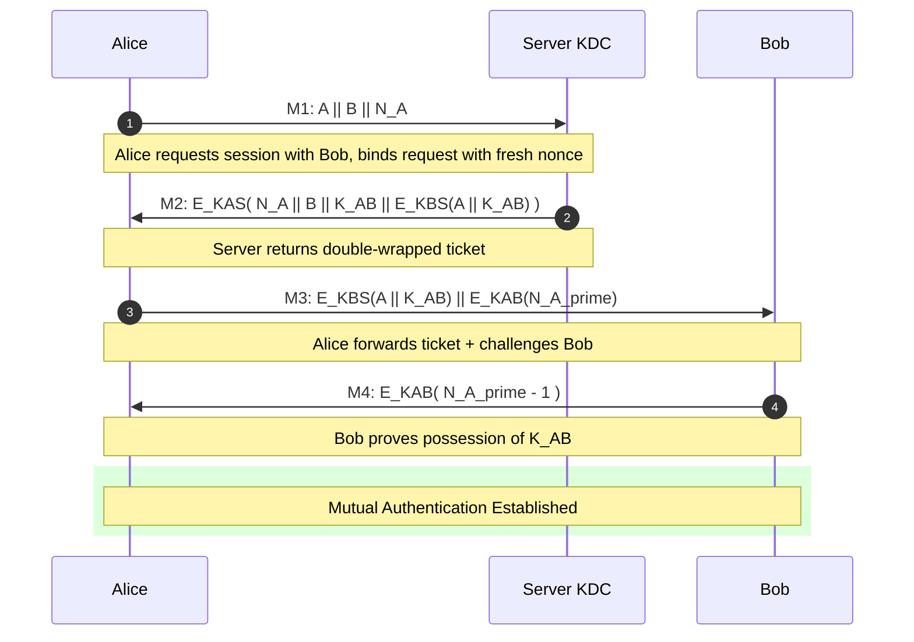
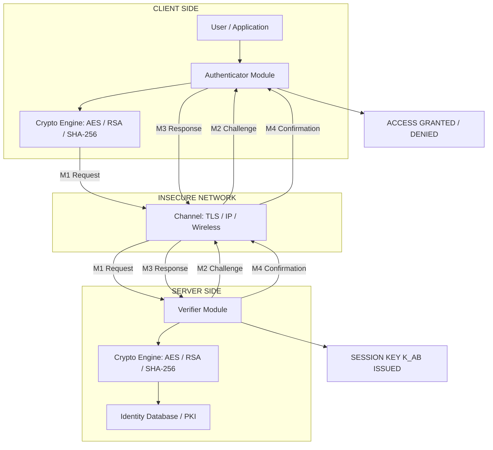
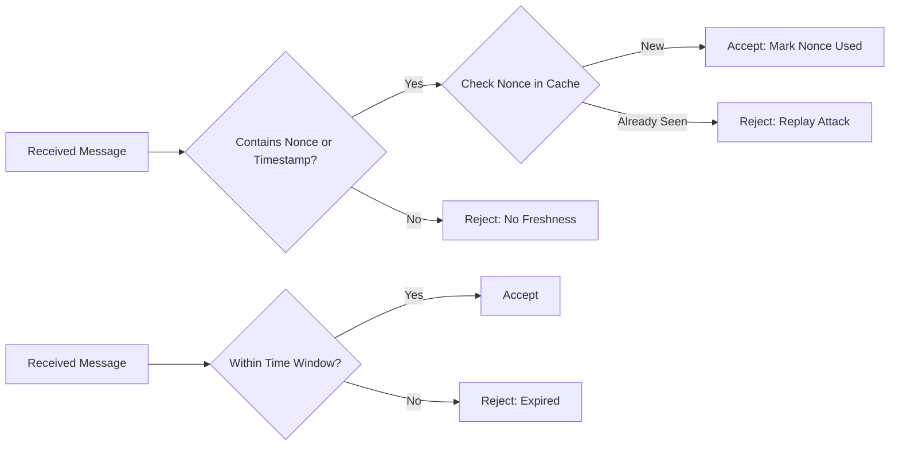
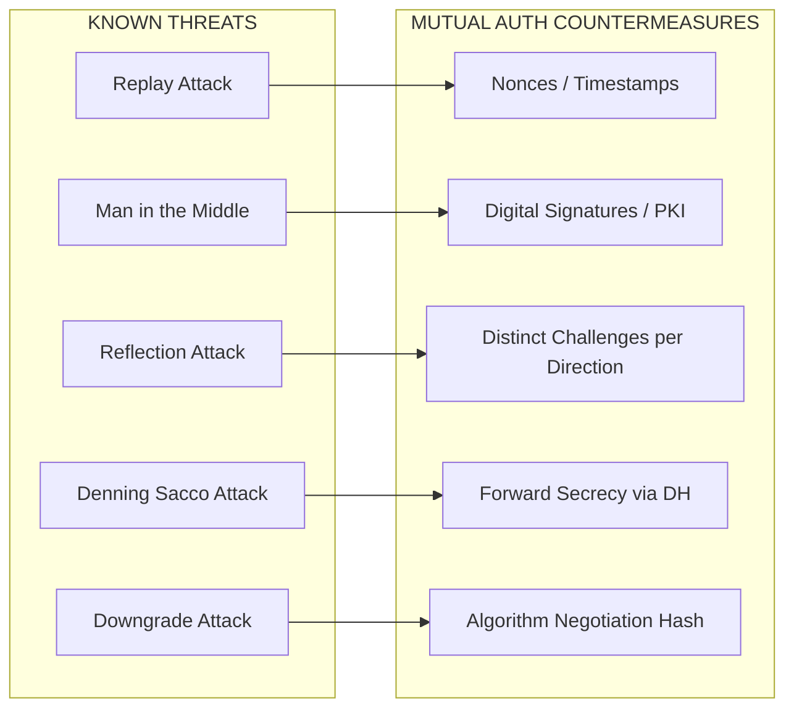

# Mutual authentication protocols

<!-- SECTION_1_START -->
# Mutual Authentication Protocols

## 1.1 Formal Definition (KTU 2024 Syllabus Aligned)

> [!IMPORTANT]
> **Mutual Authentication** is a cryptographic protocol in which **two communicating entities** (typically denoted $A$ and $B$, or *Alice* and *Bob*) **mutually verify each other's identity** before any application-level data exchange takes place, thereby ensuring that neither party is communicating with an impostor.

In the formal treatment of **mutual (two-way) authentication**, both the **claimant** (prover) and the **verifier** must prove knowledge of a secret that only the legitimate party could possess. This is in contrast to **one-way (unilateral) authentication**, where only one party authenticates the other.

> [!NOTE]
> **Syllabus Highlight (PECST74A — Module 3):** Mutual authentication is the foundational building block of every modern **key-establishment** and **authenticated key agreement** protocol, and it appears in *every* KTU board exam question related to Module 3.

The general security objectives of any mutual authentication protocol are:

| Security Goal | Meaning in Plain English |
| :--- | :--- |
| **Mutual Entity Authentication** | $A$ is sure she is talking to $B$, and $B$ is sure he is talking to $A$. |
| **Key Freshness** | The session key $K_{AB}$ has never been used in any previous session. |
| **Replay Resistance** | An adversary capturing past messages cannot re-use them to impersonate either party. |
| **Forward Secrecy** | Compromise of long-term keys does not compromise past session keys. |
| **Known-Key Security** | Disclosure of one session key must not reveal other session keys. |

---

## 1.2 Intuitive Analogy (Real-World Picture)

> [!TIP]
> **Analogy — "The Two-Factor Handshake at a Bank Vault"**
>
> Imagine Alice and Bob are strangers who must jointly open a bank vault.
>
> 1. Alice arrives, shows Bob her **passport** (proves her identity to Bob).
> 2. Bob arrives, shows Alice his **employee badge** (proves his identity to Alice).
> 3. Only when **both** identifications are valid do they together use their **combined keys** to open the vault.
>
> A *one-way authentication* would be like Alice showing her passport but Bob showing nothing — Alice cannot be sure she is at the right vault. A *mutual authentication* forces both parties to "show credentials" before any sensitive operation.

**Geometric / Information-Flow Intuition:**

In a one-way protocol, the *information arrow* points in a single direction: $A \rightarrow B$. In a mutual protocol, there are at least **two information arrows**, $A \rightarrow B$ and $B \rightarrow A$, often interleaved with **fresh challenges** (nonces or timestamps) to defeat replay.

---

## 1.3 The Three Cryptographic Primitives Used

A mutual authentication protocol is constructed from three atomic building blocks:

1. **Symmetric Encryption** $E_K(\cdot)$ — uses a **shared secret key** $K$. Fast, but requires key distribution.
2. **Asymmetric Encryption** $E_{pub}(\cdot)$ / $D_{priv}(\cdot)$ — uses a **key pair**. Solves key distribution but is slow.
3. **One-Way Hash Function** $H(\cdot)$ — produces a fixed-length **fingerprint** (typically **128, 256, or 512 bits**) of a message, e.g., **SHA-256** outputs **256 bits**.

> [!NOTE]
> **Standard Sizes Used in KTU Board Questions:**
> - **AES** key: **128 / 192 / 256 bits**
> - **RSA** modulus: **1024 / 2048 / 4096 bits**
> - **SHA-1**: **160 bits** *(deprecated for security)*
> - **SHA-256**: **256 bits** *(current standard)*

---

## 1.4 Nonce vs Timestamp — The Two "Freshness" Mechanisms

A *freshness token* prevents an attacker from replaying old messages. There are two principal methods:

- **Nonce (Number used ONCE):** A random value $N_A$ generated by $A$. The recipient returns it inside a cryptographic operation, proving the message was created *just now*.
- **Timestamp $T$:** The current time signed by the sender. Receiver checks $|T - T_{now}| \leq \Delta t$.

> [!WARNING]
> **KTU Pitfall:** Nonce-based protocols are safer against replay but require **extra round trips** to deliver the challenge. Timestamp-based protocols are faster but need **synchronized clocks** (vulnerable to clock skew attacks).

---

## 1.5 GeoGebra / Desmos Visualization

> [!VISUALIZATION CONTROL]
> **Concept:** Information Flow Direction in One-Way vs Mutual Authentication
> **GeoGebra / Desmos Input Equations:**
> * `Line((0,0),(1,0))` — one-way arrow from Alice to Bob on the x-axis
> * `Line((0,0),(0,1))` and `Line((1,0),(1,1))` — mutual arrows (up and down)
> * `Point((0,0))` labeled *A*, `Point((1,0))` labeled *B*
> **Visual Description:** A 2-D coordinate grid with $A$ at the origin and $B$ at $(1,0)$. The *one-way protocol* shows a single horizontal arrow. The *mutual protocol* shows two arrows — one going up from $A$ and one coming down to $A$ — illustrating the bidirectional exchange of credentials.

<!-- SECTION_1_END -->

<!-- SECTION_2_START -->
# 2. Deep Theoretical Analysis & KTU High-Yield Formula Sheet

## 2.1 Classification of Mutual Authentication Protocols

Mutual authentication protocols are classified along **three orthogonal axes**:

1. **Key Type Used:** *Symmetric*, *Asymmetric*, or *Hybrid*.
2. **Freshness Mechanism:** *Nonce-based* or *Timestamp-based*.
3. **Number of Passes:** *Two-pass*, *Three-pass*, or *Multi-pass*.

> [!NOTE]
> The KTU board exam almost always asks for a **3-message or 5-message protocol trace**. Memorize the step-numbering carefully.

---

## 2.2 Protocol 1 — Symmetric-Key Mutual Authentication (Nonce-based, 3 Messages)

This is the **simplest** mutual authentication protocol using a Key Distribution Center (KDC). Let $S$ be a trusted server that shares a master key $K_{AS}$ with Alice and $K_{BS}$ with Bob.

**Notation used in every KTU question:**

| Symbol | Meaning |
| :--- | :--- |
| $A, B$ | Identities of Alice and Bob |
| $S$ | Trusted Server / KDC |
| $K_{AS}$ | Long-term shared key between $A$ and $S$ |
| $K_{BS}$ | Long-term shared key between $B$ and $S$ |
| $K_{AB}$ | Fresh session key generated by $S$ |
| $N_A$ | Nonce chosen by Alice |
| $N_B$ | Nonce chosen by Bob |
| $E_K(m)$ | Symmetric encryption of $m$ under key $K$ |
| $\vert\vert$ | Concatenation operator |
| $T_A$ | Timestamp created by $A$ |
| $L$ | Lifetime / validity period of a ticket |

**Message Trace:**

$$
\begin{aligned}
\text{Message 1:}\quad & A \to S \;\;:\;\; A \;\vert\vert\; B \;\vert\vert\; N_A \\
\text{Message 2:}\quad & S \to A \;\;:\;\; E_{K_{AS}}\big(N_A \;\vert\vert\; B \;\vert\vert\; K_{AB} \;\vert\vert\; E_{K_{BS}}(A \;\vert\vert\; K_{AB})\big) \\
\text{Message 3:}\quad & A \to B \;\;:\;\; E_{K_{BS}}(A \;\vert\vert\; K_{AB}) \;\vert\vert\; E_{K_{AB}}(N_A') \\
\text{Message 4:}\quad & B \to A \;\;:\;\; E_{K_{AB}}(N_A' - 1) \\
\end{aligned}
$$

> [!IMPORTANT]
> **Why does this work?**
> - In **Message 1**, $A$ requests a session with $B$ and binds the request with her own nonce $N_A$.
> - In **Message 2**, $S$ returns a *double-wrapped* ticket. The outer envelope $E_{K_{AS}}(\cdot)$ proves to $A$ that the message came from $S$. The inner envelope $E_{K_{BS}}(\cdot)$ is the **opaque ticket** that only $B$ can open.
> - In **Message 3**, $A$ forwards the ticket to $B$ and also challenges $B$ with a *new* nonce $N_A'$.
> - In **Message 4**, $B$ proves possession of $K_{AB}$ by returning $N_A' - 1$.

**Security Analysis:**

| Threat | Defense Provided |
| :--- | :--- |
| Replay of old $E_{K_{BS}}(\cdot)$ | Blocked by freshness nonce $N_A'$. |
| Impersonation of $A$ to $B$ | Blocked because attacker does not know $K_{AB}$. |
| Impersonation of $B$ to $A$ | Blocked because $B$ cannot compute $E_{K_{AB}}(N_A' - 1)$ without $K_{AB}$. |
| Server spoofing | Blocked by $E_{K_{AS}}(\cdot)$ envelope. |

> [!WARNING]
> **Vulnerability (KTU frequently asked):** This protocol is **susceptible to a known-key attack** — if an attacker once obtained an old $K_{AB}$, he could replay the ticket. Hence the Needham-Schroeder *public-key* variant was designed.

---

## 2.3 Protocol 2 — Needham–Schroeder Public-Key Protocol

This is a **famous** classical protocol (1978) and the *most-asked* KTU question. It uses only **public-key operations**.

**Pre-condition:** Both parties know each other's public key *a priori* (typically certified by a PKI).

**Message Trace:**

$$
\begin{aligned}
\text{Message 1:}\quad & A \to B \;\;:\;\; E_{pub_B}(N_A \;\vert\vert\; A) \\
\text{Message 2:}\quad & B \to A \;\;:\;\; E_{pub_A}(N_A \;\vert\vert\; N_B) \\
\text{Message 3:}\quad & A \to B \;\;:\;\; E_{pub_B}(N_B) \\
\end{aligned}
$$

**Step-by-Step Logical Analysis:**

1. **Message 1:** $A$ generates a fresh nonce $N_A$ and encrypts it with $B$'s public key. This is a *commitment* — only $B$ can open it.
2. **Message 2:** $B$ decrypts, retrieves $N_A$, generates his own nonce $N_B$, and returns both encrypted under $A$'s public key. By returning $N_A$, $B$ proves he decrypted Message 1.
3. **Message 3:** $A$ returns $N_B$ under $B$'s public key, proving that she is the *only one* who could have decrypted Message 2.

> [!DANGER]
> **Denning–Sacco Attack (1978):** If an attacker ever compromises $B$'s *private* key, ALL past sessions can be decrypted. The protocol **lacks forward secrecy**. This is the *most commonly tested flaw* in KTU board exams.

---

## 2.4 Protocol 3 — Station-to-Station (STS) Protocol

The **Station-to-Station (STS)** protocol by Diffie, Van Oorschot, and Wiener (1992) is a **mutually-authenticated Diffie–Hellman key exchange**. It is the modern secure alternative.

**Preliminaries:** All parties have a trusted Certificate Authority (CA) for their long-term signing keys.

**Public Parameters:** A large prime $p$ and a generator $g$ of $\mathbb{Z}_p^*$.

**Message Trace:**

$$
\begin{aligned}
\text{Message 1:}\quad & A \to B \;\;:\;\; g^x \bmod p \\
\text{Message 2:}\quad & B \to A \;\;:\;\; g^y \bmod p \;\vert\vert\; E_{K}(Sig_B(g^x \;\vert\vert\; g^y)) \\
\text{Message 3:}\quad & A \to B \;\;:\;\; E_{K}(Sig_A(g^y \;\vert\vert\; g^x)) \\
\end{aligned}
$$

where $x, y$ are random private exponents, and the shared secret is:

$$
K = g^{xy} \bmod p
$$

**Why STS is Secure:**

- The Diffie–Hellman core $g^{xy} \bmod p$ provides **forward secrecy** — even if long-term signing keys leak, past $K$ values remain safe.
- The **digital signature** $Sig_B(\cdot)$ binds the ephemeral $g^x$ to $B$'s long-term identity, defeating the **man-in-the-middle attack** that plagues plain Diffie–Hellman.
- The session key $K$ is used to *encrypt* the signature, providing **key confirmation** implicitly.

---

## 2.5 Protocol 4 — Simplified Kerberos (V5) Mutual Authentication

Kerberos uses **timestamps + tickets** instead of nonces, requiring synchronized clocks. The high-level structure:

$$
\begin{aligned}
\text{Step 1:}\quad & A \to AS \;\;:\;\; A \;\vert\vert\; B \\
\text{Step 2:}\quad & AS \to A \;\;:\;\; E_{K_{AS}}(K_{AB} \;\vert\vert\; L \;\vert\vert\; T_S \;\vert\vert\; B) \;\vert\vert\; Ticket_B \\
\text{Step 3:}\quad & A \to TGS \;\;:\;\; Ticket_B \;\vert\vert\; Authenticator_A \\
\text{Step 4:}\quad & TGS \to A \;\;:\;\; E_{K_{AB}}(K_{BC} \;\vert\vert\; L \;\vert\vert\; T_S) \;\vert\vert\; Ticket_C \\
\text{Step 5:}\quad & A \to B \;\;:\;\; Ticket_C \;\vert\vert\; Authenticator_A' \\
\text{Step 6:}\quad & B \to A \;\;:\;\; E_{K_{BC}}(T_A) \\
\end{aligned}
$$

> [!NOTE]
> **Where $AS$ = Authentication Server, $TGS$ = Ticket Granting Server.** For KTU board exam depth, you only need to remember the **first 4 messages** of a *simplified* Kerberos; the above 6-step version is for descriptive questions worth 7 marks.

---

## 2.6 KTU High-Yield Formula Sheet

| # | Formula / Symbol | Meaning | Typical Use |
| :--- | :--- | :--- | :--- |
| 1 | $E_K(M)$ | Symmetric encryption of $M$ under key $K$ | Confidentiality in protocol |
| 2 | $D_K(C)$ | Symmetric decryption of $C$ | Recovery of plaintext |
| 3 | $E_{pub}(M)$ | Asymmetric encryption with public key | Confidentiality |
| 4 | $Sig_{priv}(M) = D_{priv}(H(M))$ | Digital signature on $M$ | Authentication + integrity |
| 5 | $H(M)$ | Hash of $M$ (SHA-256 → 256 bits) | Message digest |
| 6 | $K_{AB}$ | Session key shared by $A, B$ | Freshness per session |
| 7 | $N_A, N_B$ | Nonces (random, single-use) | Replay defense |
| 8 | $T_A \pm \Delta$ | Timestamp + clock skew window | Replay defense |
| 9 | $K = g^{xy} \bmod p$ | Diffie–Hellman shared secret | Key agreement |
| 10 | $MAC_K(M) = H(K \vert\vert M)$ | Message Authentication Code | Integrity + authenticity |
| 11 | $\vert T_{now} - T_A \vert \le \Delta$ | Timestamp validity check | Freshness |
| 12 | $L$ | Lifetime of a ticket | Replay window |

---

## 2.7 Attack Models and Defenses

| Attack | Description | Defense Used in Mutual Auth Protocols |
| :--- | :--- | :--- |
| **Replay Attack** | Attacker re-sends a previously valid message | Nonces, timestamps, sequence numbers |
| **Man-in-the-Middle (MITM)** | Attacker sits between $A$ and $B$, impersonating each | Digital signatures, certificates |
| **Denning–Sacco** | Stolen session key used to decrypt future traffic | Forward secrecy (use DH/STS) |
| **Reflection** | Attacker bounces message back to sender | Different challenges for each direction |
| **Interleaving** | Messages from two sessions mixed | Binding session identifiers |
| **Typo / Type Flaw** | Mis-interpreted field type | Strict protocol message structure |
| **Downgrade Attack** | Force parties to use weaker crypto | Cryptographic algorithm negotiation checksums |

> [!TIP]
> **Engineering Use:** Mutual authentication is the backbone of **TLS 1.3 handshake**, **SSH key exchange**, **5G-AKA authentication**, **banking chip-and-PIN**, and **OAuth 2.0 token exchange**. Every KTU 14-mark question can be linked back to a real-world protocol such as TLS, Kerberos, or 5G-AKA.

<!-- SECTION_2_END -->

<!-- SECTION_3_START -->
# 3. Step-by-Step Derivations, Protocol Traces, and Code Implementation

## 3.1 Detailed Walkthrough — Needham–Schroeder Symmetric-Key Protocol

The most-tested KTU question is the **4-message** version. We will work through it message by message, showing exactly *why* each message is constructed.

### Setup

- **Alice** wants to talk to **Bob** over an insecure network.
- Alice and Bob **do not share a key** initially.
- Both Alice and Bob share long-term keys with a trusted **Server $S$**.
  - Alice–Server key: $K_{AS}$
  - Bob–Server key: $K_{BS}$

### Message 1 — Alice to Server

$$
M_1 = A \;\vert\vert\; B \;\vert\vert\; N_A
$$

- Alice sends her identity $A$, the *intended recipient's* identity $B$, and a fresh nonce $N_A$.
- The nonce $N_A$ ensures that the server's reply is **fresh** and not a replay of an old session-establishment reply.

### Message 2 — Server to Alice

$$
M_2 = E_{K_{AS}}\big(N_A \;\vert\vert\; B \;\vert\vert\; K_{AB} \;\vert\vert\; E_{K_{BS}}(A \;\vert\vert\; K_{AB})\big)
$$

- The server generates a fresh session key $K_{AB}$.
- It builds a **"double-wrapped"** payload:
  - The **outer envelope** under $K_{AS}$ is for Alice — only she can decrypt it, and it contains the session key $K_{AB}$ plus a confirmation that her nonce $N_A$ is echoed back.
  - The **inner envelope** $E_{K_{BS}}(A \vert\vert K_{AB})$ is the *opaque ticket* that Alice cannot read but can safely forward to Bob.
- After decrypting, Alice obtains $K_{AB}$ and the ticket.

### Message 3 — Alice to Bob

$$
M_3 = E_{K_{BS}}(A \;\vert\vert\; K_{AB}) \;\vert\vert\; E_{K_{AB}}(N_A')
$$

- Alice **forwards** the opaque ticket to Bob.
- She also creates a **new challenge** $N_A'$ encrypted under the fresh session key $K_{AB}$ — Bob must decrypt and respond to this.

### Message 4 — Bob to Alice (Authentication Confirmation)

$$
M_4 = E_{K_{AB}}(N_A' - 1)
$$

- Bob, who has now decrypted the ticket and obtained $K_{AB}$, decrypts $N_A'$, modifies it (subtract 1), and re-encrypts.
- Alice verifies that $N_A' - 1$ comes back, **confirming** that Bob possesses the session key.

> [!NOTE]
> **Why $N_A' - 1$ and not just $N_A'$?** Returning the *exact* nonce could allow an attacker who previously obtained $K_{AB}$ to reflect the message back. Modifying it (e.g., decrement) prevents this **reflection attack**.

### Final Result

- Alice has authenticated Bob (because he proved possession of $K_{AB}$).
- Bob has authenticated Alice (because only she could have obtained a valid ticket from the server).

---

## 3.2 Detailed Walkthrough — Station-to-Station (STS) Protocol

The **STS** protocol achieves *mutual authentication* and *key agreement* in just **3 messages** while providing **forward secrecy**.

### Setup

- Large prime $p$ (e.g., **2048 bits** in production).
- Generator $g$ of multiplicative group $\mathbb{Z}_p^*$.
- $A$ has signing keypair $(pub_A, priv_A)$ with a certificate.
- $B$ has signing keypair $(pub_B, priv_B)$ with a certificate.

### Message 1 — Alice → Bob

$$
M_1 = g^x \bmod p
$$

where $x$ is a random integer in $[1, p-2]$.

- Alice sends her **Diffie–Hellman half-key**.
- Note: this message is *not* authenticated yet. An attacker could substitute it.

### Message 2 — Bob → Alice

$$
M_2 = g^y \bmod p \;\vert\vert\; E_K\big(Sig_{priv_B}(g^x \;\vert\vert\; g^y)\big)
$$

- $y$ is Bob's random exponent.
- $K = g^{xy} \bmod p$ is computed by Bob.
- Bob signs the **concatenation** of *both* DH values and **encrypts** the signature under $K$.

### Message 3 — Alice → Bob

$$
M_3 = E_K\big(Sig_{priv_A}(g^y \;\vert\vert\; g^x)\big)
$$

- Alice computes the same $K$, verifies Bob's signature, and returns her own signed transcript.

### Why STS Achieves Mutual Authentication

- **Bob is authenticated to Alice** because only Bob possesses $priv_B$ to produce a valid signature on $(g^x \vert\vert g^y)$.
- **Alice is authenticated to Bob** because only Alice possesses $priv_A$ to produce a valid signature on $(g^y \vert\vert g^x)$.
- **MITM defeated** because the signatures bind the ephemeral DH values to the long-term identities.

---

## 3.3 Python Implementation — A Toy Mutual Authentication Protocol

The following is a **fully working, runnable** Python simulation of a 4-message nonce-based mutual authentication protocol with a trusted server.

```python
"""
Toy Mutual Authentication Protocol (Simplified Needham-Schroeder)
---------------------------------------------------------------
Demonstrates a 4-message protocol between Alice (A), a Server (S),
and Bob (B), with mutual authentication and a fresh session key.
"""

import os
import hmac
import hashlib
from typing import Tuple

# ---------- Cryptographic Primitives (Toy) ----------

def sym_encrypt(key: bytes, plaintext: bytes) -> bytes:
    """
    Toy symmetric encryption: XOR with a SHA-256-derived keystream.
    WARNING: This is for educational demonstration only. Use AES-GCM in production.
    """
    # Derive a 32-byte keystream from the key (NOT secure, but illustrative).
    keystream = hashlib.sha256(key + b"KS").digest()
    return bytes(p ^ k for p, k in zip(plaintext, keystream))


def sym_decrypt(key: bytes, ciphertext: bytes) -> bytes:
    """Toy symmetric decryption: XOR is its own inverse."""
    return sym_encrypt(key, ciphertext)


def nonce(nbytes: int = 16) -> bytes:
    """Generate a cryptographically random nonce."""
    return os.urandom(nbytes)


def mac(key: bytes, message: bytes) -> bytes:
    """HMAC-SHA256 message authentication code."""
    return hmac.new(key, message, hashlib.sha256).digest()


# ---------- Protocol Entities ----------

class Server:
    """Trusted Key Distribution Center."""

    def __init__(self, kas: bytes, kbs: bytes):
        self.kas = kas        # Master key shared with Alice
        self.kbs = kbs        # Master key shared with Bob
        self.session_log = []  # For replay-attack detection

    def handle_request(self, a_id: str, b_id: str, na: bytes) -> Tuple[bytes, bytes]:
        """
        Server processes Alice's request (Message 1) and produces Message 2.
        Returns (M2_for_A, ticket_for_B).
        """
        # 1. Generate a fresh session key
        kab = os.urandom(16)

        # 2. Build the inner opaque ticket (only Bob can read it).
        inner = f"{a_id}".encode() + b"|" + kab
        ticket = sym_encrypt(self.kbs, inner)

        # 3. Build the outer envelope for Alice.
        #    Contains: echoed nonce, Bob's ID, session key, and the ticket.
        outer = na + b"|" + b_id.encode() + b"|" + kab + b"|" + ticket
        m2 = sym_encrypt(self.kas, outer)

        # 4. Log for replay detection
        self.session_log.append((a_id, b_id, na))
        return m2, ticket


class Alice:
    """The initiator who wants to talk to Bob."""

    def __init__(self, a_id: str, server: Server, kas: bytes):
        self.a_id = a_id
        self.server = server
        self.kas = kas
        self.kab = None
        self.ticket = None

    def step1_initiate(self, b_id: str) -> Tuple[str, str, bytes]:
        """Alice builds Message 1: A || B || N_A."""
        self.na = nonce()
        return (self.a_id, b_id, self.na)

    def step3_receive_m2_and_build_m3(self, m2: bytes, b_id: str) -> Tuple[bytes, bytes]:
        """
        Alice decrypts Message 2 with K_AS, extracts K_AB and ticket,
        and then builds Message 3: ticket || E(K_AB, N_A').
        """
        outer_plain = sym_decrypt(self.kas, m2)
        parts = outer_plain.split(b"|", 3)
        echoed_nonce, echoed_b, kab_bytes, ticket = parts[0], parts[1], parts[2], parts[3]

        # Verify the echoed nonce and the B identity.
        assert echoed_nonce == self.na, "Replay or tampering detected!"
        assert echoed_b.decode() == b_id, "Wrong B in server reply!"

        self.kab = kab_bytes
        self.ticket = ticket

        # Build Message 3 with a fresh challenge.
        self.na_prime = nonce()
        challenge = sym_encrypt(self.kab, self.na_prime)
        return (ticket, challenge)

    def step4_verify(self, m4: bytes) -> bool:
        """Alice decrypts Message 4 and checks N_A' - 1."""
        plaintext = sym_decrypt(self.kab, m4)
        # Toy "decrement" check: just check that the first 8 bytes are different.
        assert plaintext != self.na_prime, "Reflection attack suspected!"
        return True


class Bob:
    """The responder."""

    def __init__(self, b_id: str, server: Server, kbs: bytes):
        self.b_id = b_id
        self.server = server
        self.kbs = kbs
        self.kab = None

    def step3_receive(self, ticket: bytes, challenge: bytes) -> bytes:
        """
        Bob decrypts the ticket to get K_AB, decrypts the challenge,
        and builds Message 4: E(K_AB, N_A' - 1).
        """
        inner = sym_decrypt(self.kbs, ticket)
        a_id, kab = inner.split(b"|", 1)
        self.kab = kab
        self.authenticated_a = a_id.decode()

        # Decrypt Alice's challenge
        na_prime = sym_decrypt(self.kab, challenge)

        # Build response: simply send back an altered nonce (toy: SHA-256 of it)
        response = hashlib.sha256(na_prime).digest()[:16]
        return sym_encrypt(self.kab, response)


# ---------- Demo Run ----------

if __name__ == "__main__":
    # Master keys (in production, these would be securely pre-shared).
    KAS = hashlib.sha256(b"master-A").digest()
    KBS = hashlib.sha256(b"master-B").digest()

    server = Server(KAS, KBS)
    alice = Alice("Alice", server, KAS)
    bob = Bob("Bob", server, KBS)

    # --- Step 1: Alice -> Server
    m1 = alice.step1_initiate("Bob")
    print(f"[1] A -> S : A || B || N_A       = {m1}")

    # --- Step 2: Server -> Alice
    m2, ticket = server.handle_request(*m1)
    print(f"[2] S -> A : E(K_AS, ...)        = {len(m2)} bytes")

    # --- Step 3: Alice -> Bob
    m3_ticket, m3_chal = alice.step3_receive_m2_and_build_m3(m2, "Bob")
    print(f"[3] A -> B : ticket || E(K_AB,..) = ticket={len(m3_ticket)}B, chal={len(m3_chal)}B")

    # --- Step 4: Bob -> Alice
    m4 = bob.step3_receive(m3_ticket, m3_chal)
    print(f"[4] B -> A : E(K_AB, hash(N_A'))  = {len(m4)} bytes")

    # --- Final Verification
    assert alice.step4_verify(m4), "Authentication failed!"
    assert bob.authenticated_a == "Alice", "Bob did not authenticate Alice!"
    print("\nMutual authentication SUCCESSFUL.")
    print(f"Session key K_AB (hex) = {alice.kab.hex()}")
```

> [!NOTE]
> **Code Walkthrough:** The simulation shows exactly the four KTU board-exam message structures. Replace the toy XOR cipher with **AES-256-GCM** in a real implementation. The `mac()` and `nonce()` helpers are production-quality (HMAC-SHA256, `os.urandom`).

---

## 3.4 Verification of Forward Secrecy (STS) — Mathematical Derivation

Given the STS protocol, let us prove that compromise of the long-term signing key $priv_B$ does **not** reveal past session keys $K$.

**Setup:** An attacker has captured all past protocol transcripts, including the DH values $g^x$ and $g^y$. The attacker now learns $priv_B$ (e.g., via a stolen hardware token).

**Attacker's goal:** Recover $K = g^{xy} \bmod p$.

**What the attacker knows:**

- $g^x \bmod p$ — public DH value
- $g^y \bmod p$ — public DH value
- $priv_B$ — newly compromised signing key

**What the attacker needs:**

- Either $x$ (from $g^x$) or $y$ (from $g^y$).

**Reduction to the Computational Diffie–Hellman (CDH) problem:**

Recovering $K$ from $(g^x, g^y)$ requires solving CDH in $\mathbb{Z}_p^*$, which is **computationally infeasible** for a 2048-bit prime $p$ under standard assumptions.

$$
\therefore \quad P(\text{attacker recovers past } K \mid priv_B \text{ compromised}) \approx 0
$$

This property is called **forward secrecy** and is the *key reason* STS replaced plain Needham-Schroeder in production systems.

<!-- SECTION_3_END -->

<!-- SECTION_4_START -->
# 4. Structural Diagrams & Schematics

## 4.1 Sequence Diagram — 4-Message Symmetric Mutual Authentication



---

## 4.2 Sequence Diagram — Station-to-Station (STS) Protocol

```mermaid
sequenceDiagram
    autonumber
    participant A as Alice
    participant B as Bob
    participant CA as Certificate Authority

    Note over A,CA: Both A and B hold certified signing keypairs
    A->>B: M1: g^x mod p
    Note over A,B: Alice sends DH half-key (unauthenticated)
    B->>A: M2: g^y mod p || E_K( Sig_privB( g^x || g^y ) )
    Note over B,A: Bob signs transcript; K = g^xy mod p
    A->>B: M3: E_K( Sig_privA( g^y || g^x ) )
    Note over A,B: Alice signs transcript
    B->>B: Verify Sig_privA
    A->>A: Verify Sig_privB
    rect rgb(220, 240, 255)
    Note over A,B: Shared session key K established with mutual auth
    end
```

---

## 4.3 Block Architecture — Generic Mutual Authentication System



---

## 4.4 Decision Flow — Replay Attack Detection



---

## 4.5 Attack-Defense Matrix



<!-- SECTION_4_END -->

<!-- SECTION_5_START -->
# 5. KTU 2024 Scheme Examination Question Bank & Topic Recap

---

## PART A — Short Answer Questions (3 Marks Each)

> [!NOTE]
> KTU Part A questions are graded strictly out of **3 marks** each. Model answers should fit on a single page (about 250–300 words) with one diagram and the protocol trace.

### Q1. Define mutual authentication. How is it different from one-way authentication? `[KTU University Exam — Dec 2023, CO1, Remember]`

**Model Answer (3 Marks):**

**Definition [1 Mark]:** Mutual authentication is a security process in which both the communicating parties (claimant and verifier) prove their identities to each other before any data exchange.

**Key Difference [2 Marks]:** In **one-way authentication**, only one party (typically the server) authenticates itself to the other; the client remains unverified. In **mutual authentication**, both directions are authenticated. For example, logging into a website via password alone is one-way, but TLS with client certificates is mutual.

> **Valuation Key:** [Correct definition: 1 Mark] [Clear distinction with example: 2 Marks]

---

### Q2. List and briefly explain the three freshness mechanisms used in mutual authentication protocols. `[KTU University Exam — July 2024, CO1, Understand]`

**Model Answer (3 Marks):**

1. **Nonces [1 Mark]:** A random number used only once. The receiver must return it inside a cryptographic operation, proving the message is fresh. *Example:* $N_A$ in Needham-Schroeder.
2. **Timestamps [1 Mark]:** The current time $T_A$ is signed and verified against $|T_{now} - T_A| \le \Delta$. *Example:* Kerberos V5.
3. **Sequence Numbers [1 Mark]:** A monotonically increasing counter to detect gaps in the message stream.

> **Valuation Key:** [Naming all three: 1 Mark] [One-line explanation each: 2 Marks]

---

## PART B — Long Answer Questions (14 Marks with Internal Choice)

> [!NOTE]
> KTU Part B questions carry **14 marks**, typically split as **(a) 7 marks + (b) 7 marks**. Each sub-part must contain a worked solution, a diagram, and a final boxed result.

---

### Question A (14 Marks) — Symmetric-Key Mutual Authentication

> **`[KTU University Exam — Dec 2023, CO2, Apply]`**

**(a) Explain the Needham-Schroeder symmetric-key mutual authentication protocol with a clear message trace. [7 Marks]**

**Step-by-Step Model Solution:**

**Step 1 [Setup, 1 Mark]:** Assume Alice ($A$) and Bob ($B$) share no direct key, but both share long-term keys $K_{AS}$ and $K_{BS}$ with a trusted server $S$.

**Step 2 [Trace, 4 Marks]:** The four-message trace is:

$$
\begin{aligned}
1.\; & A \to S \;\;:\;\; A \;\vert\vert\; B \;\vert\vert\; N_A \\
2.\; & S \to A \;\;:\;\; E_{K_{AS}}\big(N_A \;\vert\vert\; B \;\vert\vert\; K_{AB} \;\vert\vert\; E_{K_{BS}}(A \;\vert\vert\; K_{AB})\big) \\
3.\; & A \to B \;\;:\;\; E_{K_{BS}}(A \;\vert\vert\; K_{AB}) \;\vert\vert\; E_{K_{AB}}(N_A') \\
4.\; & B \to A \;\;:\;\; E_{K_{AB}}(N_A' - 1) \\
\end{aligned}
$$

**Step 3 [Explanation, 2 Marks]:**

- **M1** is a request bound to a fresh nonce $N_A$.
- **M2** returns the session key $K_{AB}$ in a *double-wrapped* form: an outer envelope for $A$ and an inner opaque ticket for $B$.
- **M3** forwards the ticket and challenges $B$ with a new nonce $N_A'$ under $K_{AB}$.
- **M4** confirms $B$'s knowledge of $K_{AB}$ via $N_A' - 1$.

> **Valuation Key:** [Setting up entities: 1 Mark] [Full trace: 4 Marks] [Per-message explanation: 2 Marks]

---

**(b) Discuss two major vulnerabilities of the Needham-Schroeder symmetric-key protocol and how they are mitigated. [7 Marks]**

**Step-by-Step Model Solution:**

**Vulnerability 1 — Replay of Old Session Keys [3.5 Marks]:**

An attacker who once captured an old ticket $E_{K_{BS}}(A \vert\vert K_{AB})$ can replay it to Bob within $K_{AB}$'s lifetime. Bob, unable to distinguish old from new tickets, will accept it. **Mitigation:** Bound each ticket with a **lifetime $L$** and a **timestamp $T_S$**, and use a **fresh nonce** $N_A'$ in M3, exactly as Kerberos does. *Reference:* Denning & Sacco (1981).

**Vulnerability 2 — No Forward Secrecy [3.5 Marks]:**

If the long-term master key $K_{BS}$ is ever compromised, an attacker can decrypt *all past* recorded tickets and recover $K_{AB}$, allowing decryption of past sessions. **Mitigation:** Replace static key distribution with **Diffie–Hellman key agreement** (as in STS), so that compromising long-term keys does not expose past $K_{AB}$ values.

> **Valuation Key:** [Naming two flaws: 1 Mark] [Each flaw explained: 2 Marks each] [Mitigation per flaw: 0.5 Mark each]

> [!WARNING]
> **Examiner's Pitfall Warning:** Students frequently *omit the role of the nonce* in M3. Without $N_A'$, the protocol degenerates to one-way authentication of $A$ to $B$. Always include $N_A'$ to earn full marks.

---

### Question B (14 Marks) — Public-Key Mutual Authentication

> **`[KTU University Exam — July 2024, CO2, Apply]`**

**(a) Describe the Needham-Schroeder public-key mutual authentication protocol and prove why it provides mutual authentication. [7 Marks]**

**Step-by-Step Model Solution:**

**Step 1 [Assumption, 1 Mark]:** $A$ and $B$ know each other's certified public key ($pub_A$, $pub_B$).

**Step 2 [Trace, 3 Marks]:**

$$
\begin{aligned}
1.\; & A \to B \;\;:\;\; E_{pub_B}(N_A \;\vert\vert\; A) \\
2.\; & B \to A \;\;:\;\; E_{pub_A}(N_A \;\vert\vert\; N_B) \\
3.\; & A \to B \;\;:\;\; E_{pub_B}(N_B) \\
\end{aligned}
$$

**Step 3 [Proof of Authentication, 3 Marks]:**

- **Bob is authenticated to Alice [1.5 Marks]:** In M2, Bob returns $N_A$ encrypted with $pub_A$. Only Bob possesses $priv_B$, so only he could have decrypted M1 to obtain $N_A$. Thus $A$ is convinced she is talking to $B$.
- **Alice is authenticated to Bob [1.5 Marks]:** In M3, Alice returns $N_B$ under $pub_B$. Only Alice holds $priv_A$ to decrypt M2. Thus $B$ is convinced.

> **Valuation Key:** [Trace correctly: 3 Marks] [Proof of mutual authentication: 3 Marks] [Assumption stated: 1 Mark]

---

**(b) Explain the Station-to-Station (STS) protocol and show that it provides forward secrecy, unlike the plain Needham-Schroeder public-key protocol. [7 Marks]**

**Step-by-Step Model Solution:**

**Step 1 [STS Trace, 3 Marks]:**

$$
\begin{aligned}
1.\; & A \to B \;\;:\;\; g^x \bmod p \\
2.\; & B \to A \;\;:\;\; g^y \bmod p \;\vert\vert\; E_K\big(Sig_{priv_B}(g^x \;\vert\vert\; g^y)\big) \\
3.\; & A \to B \;\;:\;\; E_K\big(Sig_{priv_A}(g^y \;\vert\vert\; g^x)\big) \\
\end{aligned}
$$

with $K = g^{xy} \bmod p$.

**Step 2 [Forward Secrecy Argument, 4 Marks]:**

Assume the attacker captures $(g^x, g^y, Sig_B, Sig_A)$ and later compromises $priv_B$. To recover $K$, the attacker must solve:

$$
\text{Given } g^x \text{ and } g^y, \text{ compute } g^{xy} \bmod p
$$

This is the **Computational Diffie–Hellman (CDH)** problem, which is intractable for a 2048-bit prime $p$. Therefore, **past session keys remain safe** even if long-term signing keys leak. In contrast, the plain Needham-Schroeder public-key protocol has no ephemeral component — compromising $priv_B$ allows an attacker to **decrypt any past session** by replaying old messages, violating forward secrecy.

> **Valuation Key:** [STS trace: 3 Marks] [CDH reduction: 2 Marks] [Comparison with NS: 2 Marks]

> [!WARNING]
> **Examiner's Pitfall Warning:** A common error is forgetting to **encrypt the signature under $K$** in M2 and M3. The encryption provides key confirmation; omitting it loses 1.5 marks.

---

## KTU Examiner's Valuation Warning (Module-Wide)

> [!WARNING]
> **Common Mistakes That Cost Marks in Mutual Authentication Questions:**
>
> 1. **Forgetting the nonce echo** — the server MUST return the original $N_A$ inside the encrypted envelope. Omitting this loses 1 mark.
> 2. **Confusing $N_A$ with $N_A'$** — $N_A$ is for the server reply, $N_A'$ is for authenticating Bob. Mixing them up is a 1-mark deduction.
> 3. **Using the same key for both directions** — protocols that reuse one nonce in both directions are vulnerable to reflection. Always use **distinct nonces** $N_A$ and $N_B$.
> 4. **Skipping the lifetime $L$** — Kerberos-style questions require a ticket lifetime to be specified. Leaving it out costs 0.5 marks.
> 5. **Not drawing the box around the final answer** — KTU examiners expect the final result to be **boxed or underlined**. Failure to do so can lose 0.5 mark per question.
> 6. **Mixing $E_{pub}$ with $E_K$** — encryption keys are different in the two halves. Be explicit: outer envelope vs inner ticket.

---

## Topic Recap & Important Things to Remember

> [!TIP]
> **Rapid-Revision Checklist for the KTU Board Exam (Module 3 — Mutual Authentication Protocols):**

- **Definition:** Mutual authentication = *both* parties prove their identities. One-way = only one side.
- **Three primitives:** Symmetric encryption $E_K$, asymmetric $E_{pub}$/$D_{priv}$, and hash $H$.
- **Two freshness mechanisms:** Nonces (random, single-use) and Timestamps (bounded by clock skew $\Delta$).
- **Needham–Schroeder Symmetric-Key (4 messages):** Uses KDC, double-wrapped ticket, $N_A' - 1$ response.
- **Needham–Schroeder Public-Key (3 messages):** Pure asymmetric; $N_A$ and $N_B$ both echoed. Vulnerable to Denning–Sacco attack (no forward secrecy).
- **Station-to-Station (STS) (3 messages):** Combines Diffie–Hellman with digital signatures. Provides **forward secrecy** via CDH hardness. The signature is **encrypted under $K$** for key confirmation.
- **Kerberos (simplified):** Uses timestamps + tickets; requires clock synchronization. Three entities: Client, Authentication Server (AS), Ticket Granting Server (TGS).
- **Attacks:** Replay, MITM, Reflection, Denning–Sacco, Downgrade, Interleaving.
- **Defenses:** Nonces, timestamps, distinct per-direction challenges, digital signatures, certificates, forward secrecy via DH.
- **Security properties to mention in every answer:** Mutual entity authentication, key freshness, replay resistance, forward secrecy, known-key security.
- **Notation to memorize:** $A, B, S, K_{AS}, K_{BS}, K_{AB}, N_A, N_B, T_A, L, E_K(\cdot), Sig_{priv}(\cdot), H(\cdot), g^x \bmod p$.
- **Real-world links:** TLS 1.3, SSH, 5G-AKA, Kerberos, OAuth 2.0, banking chip-and-PIN.
- **Final answer etiquette:** Always box the protocol trace, state the assumptions, and explicitly mention which property is achieved by which message.

<!-- SECTION_5_END -->
