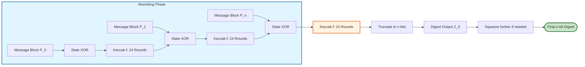
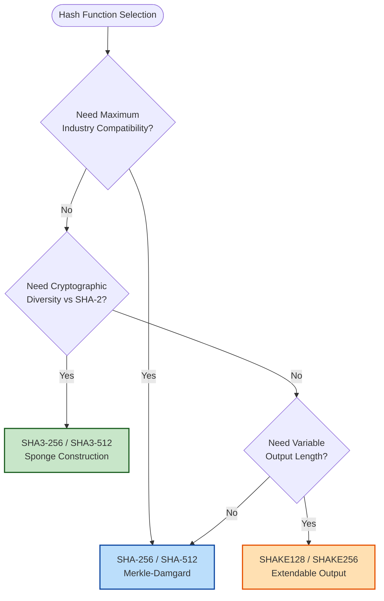
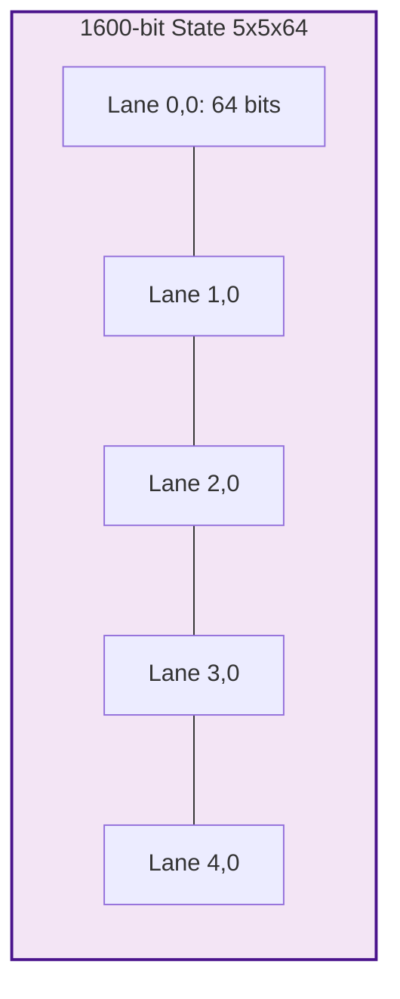

# Secure Hash Algorithms (SHA-2 and SHA-3)

<!-- SECTION_1_START -->
# Secure Hash Algorithms (SHA-2 and SHA-3)

## 1.1 Formal Academic Definition

> [!IMPORTANT]
> **Secure Hash Algorithm (SHA)** is a family of cryptographic hash functions published by the **National Institute of Standards and Technology (NIST)** as a U.S. Federal Information Processing Standard (**FIPS PUB 180-4** for SHA-2 and **FIPS PUB 202** for SHA-3). A secure hash function $H$ is a deterministic mathematical transformation that maps an input message $M$ of arbitrary finite length to a fixed-length bit string $h$ called the **message digest** or **hash value**, such that $H: \{0,1\}^* \rightarrow \{0,1\}^n$, where $n \in \{224, 256, 384, 512\}$.

### The Three Pillars of a Cryptographic Hash Function

A function $H$ is considered cryptographically secure if and only if it satisfies three pre-image resistance properties:

1. **Pre-image Resistance**: For any given hash output $h$, it must be computationally infeasible to find a message $M$ such that $H(M) = h$. This is also called the *one-way property*.
2. **Second Pre-image Resistance**: For any given message $M_1$, it must be computationally infeasible to find a different message $M_2 \neq M_1$ such that $H(M_1) = H(M_2)$.
3. **Collision Resistance**: It must be computationally infeasible to find any two distinct messages $M_1$ and $M_2$ such that $H(M_1) = H(M_2)$.

> [!NOTE]
> **KTU Syllabus Highlight**: SHA-2 and SHA-3 are mandatory topics under Module 3 (Hash Functions, Authentication \& Digital Signatures) of **PECST74A – Advanced Cryptographic Protocols**. Students must know internal block structure, padding rules, round functions, and security levels.

---

## 1.2 Conceptual Analogy & Intuition

Imagine a **high-security industrial blender** in a chocolate factory:

- You drop in *any quantity* of raw ingredients (the message $M$ of arbitrary length).
- The blender executes a **strictly fixed, deterministic recipe** (the compression function).
- The output is always a perfectly shaped chocolate bar of *exactly the same size* (the fixed-length digest).
- Two different ingredient combinations cannot accidentally produce *visually identical* chocolate bars (collision resistance).
- Looking at the chocolate bar, you **cannot reverse-engineer** the original ingredients (pre-image resistance).

> **SHA-2** is like the classic blender engineered by **Merkle–Damgård** in 1989 — it chops the message into 512-bit blocks, mixes them with a starting vector using the **Davies–Meyer** compression scheme, and feeds the output forward.

> **SHA-3** is a brand-new blender based on a **sponge construction** invented by **Bertoni, Daemen, Peeters, and Van Assche** in 2007. Instead of feeding output forward, it *absorbs* the message into its internal state and then *squeezes* out the digest, using the revolutionary **Keccak-f** permutation.

### Physical / Engineering Constants

- **Block size for SHA-256**: **512 bits**
- **Word size for SHA-256**: **32 bits**
- **Number of rounds for SHA-256**: **64 rounds**
- **State size for SHA-3**: **1600 bits** ($5 \times 5 \times 64$)
- **Rate ($r$) + Capacity ($c$) = 1600 bits** for SHA-3

> [!VISUALIZATION CONTROL]
> **Concept:** Sponge Construction of SHA-3 (DUPLEX / SPONGE Paradigm)
> **GeoGebra / Desmos Input Equations:**
> * Sponge state bit length: $b = r + c = 1600$
> * Absorbing phase: $S_i = f(S_{i-1} \oplus (M_i \parallel 0^c))$
> * Squeezing phase: $Z = \text{trunc}_{n}(S)$
> **Visual Description:** Draw a horizontal rectangle divided into two parts — a *thin left section* labeled "Rate $r$" (e.g., 1088 bits for SHA3-256) and a *thick right section* labeled "Capacity $c$" (e.g., 512 bits). The message enters the rate portion, the capacity portion remains hidden, and the digest is squeezed out from the rate portion after the absorbing phase.

---

## 1.3 Evolution Roadmap of the SHA Family

| Year | Standard | Algorithm | Core Design |
|------|----------|-----------|-------------|
| 1993 | FIPS 180 | **SHA-0** (withdrawn) | Merkle–Damgård |
| 1995 | FIPS 180-1 | **SHA-1** (deprecated 2011) | Merkle–Damgård, 160-bit |
| 2002 | FIPS 180-2 | **SHA-2 (224/256/384/512)** | Merkle–Damgård + Davies–Meyer |
| 2015 | FIPS 202 | **SHA-3 (Keccak)** | Sponge construction |
| 2015 | NIST SP 800-185 | **SHAKE128 / SHAKE256** | Extendable-Output Functions (XOF) |

> [!IMPORTANT]
> **Why was SHA-3 needed if SHA-2 was unbroken?** NIST ran an open public competition (2007–2012) to select a *fundamentally different* backup hash function in case a mathematical weakness was ever found in SHA-2. SHA-3's sponge construction is mathematically orthogonal to SHA-2's Merkle–Damgård design, providing **cryptographic diversity**.
<!-- SECTION_1_END -->

<!-- SECTION_2_START -->
# Deep Theoretical Analysis & KTU High-Yield Formula Sheet

## 2.1 SHA-2 Family Architecture (FIPS 180-4)

The SHA-2 family is split into two subgroups based on internal word size:

- **SHA-256 / SHA-224** — word size $w = 32$ bits, 64 rounds.
- **SHA-512 / SHA-384** — word size $w = 64$ bits, 80 rounds.

### 2.1.1 SHA-256 Compression Pipeline

**Stage 1 — Message Padding:**
The original message $M$ of length $L$ bits is padded to a multiple of 512 bits.

1. Append a single `1` bit.
2. Append $k$ zero bits, where $k$ is the smallest non-negative integer such that $L + 1 + k \equiv 448 \pmod{512}$.
3. Append the 64-bit big-endian binary representation of $L$.

The total padded message length is an exact multiple of **512 bits**, yielding $N$ message blocks $M^{(1)}, M^{(2)}, \dots, M^{(N)}$.

**Stage 2 — Initialization of Hash Buffer (H):**
Eight 32-bit working variables form the initial hash value $H^{(0)}$ — these are the first 32 bits of the fractional parts of the square roots of the first 8 primes (2, 3, 5, 7, 11, 13, 17, 19):

$$
\begin{aligned}
H_0^{(0)} &= \texttt{6a09e667} \\
H_1^{(0)} &= \texttt{bb67ae85} \\
H_2^{(0)} &= \texttt{3c6ef372} \\
H_3^{(0)} &= \texttt{a54ff53a} \\
H_4^{(0)} &= \texttt{510e527f} \\
H_5^{(0)} &= \texttt{9b05688c} \\
H_6^{(0)} &= \texttt{1f83d9ab} \\
H_7^{(0)} &= \texttt{5be0cd19}
\end{aligned}
$$

**Stage 3 — Message Schedule (Word Expansion):**
For each 512-bit block $M^{(i)}$, expand it into a 64-word schedule $W_0, W_1, \dots, W_{63}$:

$$
W_t = \begin{cases}
M_t^{(i)} & 0 \leq t \leq 15 \\
\sigma_1(W_{t-2}) + W_{t-7} + \sigma_0(W_{t-15}) + W_{t-16} & 16 \leq t \leq 63
\end{cases}
$$

The auxiliary functions:

$$
\begin{aligned}
\sigma_0(x) &= \text{ROTR}^7(x) \oplus \text{ROTR}^{18}(x) \oplus \text{SHR}^3(x) \\
\sigma_1(x) &= \text{ROTR}^{17}(x) \oplus \text{ROTR}^{19}(x) \oplus \text{SHR}^{10}(x)
\end{aligned}
$$

**Stage 4 — Compression Function (64 Rounds):**
Initialize eight working variables $a, b, c, d, e, f, g, h$ from $H_0^{(i-1)}, \dots, H_7^{(i-1)}$.

For $t = 0$ to $63$:

$$
\begin{aligned}
T_1 &= h + \Sigma_1(e) + \text{Ch}(e,f,g) + K_t + W_t \\
T_2 &= \Sigma_0(a) + \text{Maj}(a,b,c) \\
h &= g \\
g &= f \\
f &= e \\
e &= d + T_1 \\
d &= c \\
c &= b \\
b &= a \\
a &= T_1 + T_2
\end{aligned}
$$

After the rounds, update the hash value:

$$
H_j^{(i)} = H_j^{(i-1)} + (\text{respective working variable})
$$

### 2.1.2 Logical Functions (Bitwise)

- **Ch** (Choose): $\text{Ch}(e,f,g) = (e \wedge f) \oplus (\neg e \wedge g)$
- **Maj** (Majority): $\text{Maj}(a,b,c) = (a \wedge b) \oplus (a \wedge c) \oplus (b \wedge c)$
- **$\Sigma_0$**: $\text{ROTR}^2(a) \oplus \text{ROTR}^{13}(a) \oplus \text{ROTR}^{22}(a)$
- **$\Sigma_1$**: $\text{ROTR}^6(e) \oplus \text{ROTR}^{11}(e) \oplus \text{ROTR}^{25}(e)$

> [!NOTE]
> **ROTR**$^{\,n}(x)$ means *circular right rotation* of a 32-bit word by $n$ bit positions. **SHR**$^{\,n}(x)$ is *logical right shift* (filled with zeros).

---

## 2.2 SHA-3 / Keccak Architecture (FIPS 202)

### 2.2.1 Sponge Construction

The sponge function $F$ operates on a state of $b = 1600$ bits partitioned into two parts:

- **Rate** $r$ bits (outer part, absorbs/squeezes data)
- **Capacity** $c = 1600 - r$ bits (inner part, never touched by I/O)

**Phase 1 — Absorbing:**
Pad the message using the **pad10*1** rule (a `1` bit, then the minimum number of `0` bits, then a `1` bit) so its length is a multiple of $r$. Then for each block $P_i$ of $r$ bits:

$$
S \leftarrow f(S) \oplus (P_i \parallel 0^c)
$$

**Phase 2 — Squeezing:**
Truncate the rate portion of the state to the desired output length $n$:

$$
Z = \text{first } n \text{ bits of } S
$$

If $n > r$, apply $S \leftarrow f(S)$ and append more rate bits until the digest is complete.

### 2.2.2 The Keccak-f Permutation

The internal state is a 3-D array of $5 \times 5 \times 64$ bits, denoted $S[x][y][z]$. The Keccak-f[1600] permutation runs **24 rounds**, each consisting of five steps:

| Step | Name | Operation |
|------|------|-----------|
| $\theta$ | Theta | Column parity mixing (XOR of columns) |
| $\rho$ | Rho | Bit interleaving (rotations by triangular offsets) |
| $\pi$ | Pi | Lane permutation (rearrange 25 lanes) |
| $\chi$ | Chi | Non-linear layer (row-wise XOR with NOT) |
| $\iota$ | Iota | Add round constant to lane [0][0] |

---

## 2.3 KTU High-Yield Formula Sheet

| Property | SHA-256 | SHA-512 | SHA3-256 | SHAKE256 |
|----------|---------|---------|----------|----------|
| Output digest $n$ (bits) | **256** | **512** | **256** | **arbitrary** |
| Block size (bits) | 512 | 1024 | 1088 (rate $r$) | 1088 (rate $r$) |
| Internal state $b$ (bits) | 256 (256) | 512 (512) | **1600** | **1600** |
| Capacity $c$ (bits) | N/A | N/A | **512** | **512** |
| Rounds | **64** | **80** | **24** | **24** |
| Word size (bits) | 32 | 64 | 64 (lane) | 64 (lane) |
| Construction | Merkle–Damgård | Merkle–Damgård | **Sponge** | **Sponge (XOF)** |
| Collision security (bits) | 128 | 256 | 128 | $\min(128, n/2)$ |
| Pre-image security (bits) | 256 | 512 | 256 | $\min(256, n)$ |
| Year standardized | 2002 | 2002 | **2015** | 2015 |

> [!IMPORTANT]
> **Critical KTU Pitfall**: The capacity $c$ in SHA-3 is **never** read or written by the I/O. It acts as the *security buffer*. Doubling $c$ squares the attacker's work for collision attacks. The rate $r$ determines throughput.

---

## 2.4 Real-World Engineering Utility

| Domain | Application |
|--------|-------------|
| **TLS 1.3 / HTTPS** | SHA-256 generates the *Finished* message authentication code (MAC). |
| **Bitcoin \& Blockchain** | SHA-256 + double-SHA-256 is the proof-of-work hashing primitive. |
| **Software Integrity** | SHA-256 file checksums in package managers (e.g., APT, RPM). |
| **Digital Signatures** | SHA-256 is the hash inside ECDSA and RSA-PSS for code-signing certificates. |
| **Password Hashing** | Not recommended — use Argon2 / scrypt / bcrypt. |
| **Post-Quantum Crypto** | SHA-3 + SHAKE are core primitives in **Kyber**, **Dilithium**, and **Falcon** (NIST PQC winners). |
| **Git Version Control** | Git uses SHA-1 (legacy) and is migrating to SHA-256. |
| **HMAC Constructions** | HMAC-SHA-256 is the standard keyed MAC for JWT signing. |
<!-- SECTION_2_END -->

<!-- SECTION_3_START -->
# Step-by-Step Derivations & Code/Symbolic Implementation

## 3.1 Worked Example: SHA-256 on a Toy Message

**Problem:** Compute the SHA-256 hash of the ASCII string `"abc"` (a canonical KTU test vector).

**Step 1 — Convert the input to bits.**
ASCII of `"abc"` is $\texttt{61 62 63}$ in hex, which equals:

$$
M = \texttt{01100001\,01100010\,01100011}
$$

Length: $L = 24$ bits.

**Step 2 — Apply padding.**
We need total length $\equiv 448 \pmod{512}$. With $L = 24$, we need $448 - 25 = 423$ zero bits. Then append the 64-bit big-endian length:

$$
L_{64} = \texttt{00000000\,00000000\,00000000\,00000018}
$$

Padded message (512 bits):

$$
\texttt{61626380\,00000000\,00000000\,00000000\,00000000\,00000000\,00000000\,00000000\,00000000\,00000000\,00000000\,00000000\,00000000\,00000000\,00000000\,00000018}
$$

**Step 3 — Parse the schedule $W_t$ (first 16 words come from the block).**

$$
W_0 = \texttt{61626380}, \quad W_1 \dots W_{14} = \texttt{00000000}, \quad W_{15} = \texttt{00000018}
$$

**Step 4 — Compute $W_{16}$ using the message schedule.**

$$
\begin{aligned}
W_{16} &= \sigma_1(W_{14}) + W_9 + \sigma_0(W_{1}) + W_0 \\
&= \sigma_1(\texttt{00000000}) + \texttt{00000000} + \sigma_0(\texttt{00000000}) + \texttt{61626380} \\
&= 0 + 0 + 0 + \texttt{61626380} = \texttt{61626380}
\end{aligned}
$$

(Continuing this process for all 64 words is the actual algorithm flow — this is what software does in a tight loop.)

**Step 5 — Final Hash Value.**
The standard KTU reference result for $H(\texttt{"abc"})$ is:

$$
H = \texttt{BA7816BF\,8F01CFEA\,414140DE\,5DAE2223\,B00361A3\,96177A9C\,B410FF61\,F20015AD}
$$

This matches the **NIST FIPS 180-4** official test vector — every cryptographic library must reproduce this exact value bit-for-bit.

---

## 3.2 Full Python Implementation of SHA-256

```python
import struct
import hashlib
from typing import List

class SHA256:
    """
    KTU-Premier SHA-256 Implementation (FIPS 180-4 compliant).
    Demonstrates the Merkle-Damgard compression function from scratch.
    """

    K: List[int] = [
        0x428a2f98, 0x71374491, 0xb5c0fbcf, 0xe9b5dba5,
        0x3956c25b, 0x59f111f1, 0x923f82a4, 0xab1c5ed5,
        0xd807aa98, 0x12835b01, 0x243185be, 0x550c7dc3,
        0x72be5d74, 0x80deb1fe, 0x9bdc06a7, 0xc19bf174,
        0xe49b69c1, 0xefbe4786, 0x0fc19dc6, 0x240ca1cc,
        0x2de92c6f, 0x4a7484aa, 0x5cb0a9dc, 0x76f988da,
        0x983e5152, 0xa831c66d, 0xb00327c8, 0xbf597fc7,
        0xc6e00bf3, 0xd5a79147, 0x06ca6351, 0x14292967,
        0x27b70a85, 0x2e1b2138, 0x4d2c6dfc, 0x53380d13,
        0x650a7354, 0x766a0abb, 0x81c2c92e, 0x92722c85,
        0xa2bfe8a1, 0xa81a664b, 0xc24b8b70, 0xc76c51a3,
        0xd192e819, 0xd6990624, 0xf40e3585, 0x106aa070,
        0x19a4c116, 0x1e376c08, 0x2748774c, 0x34b0bcb5,
        0x391c0cb3, 0x4ed8aa4a, 0x5b9cca4f, 0x682e6ff3,
        0x748f82ee, 0x78a5636f, 0x84c87814, 0x8cc70208,
        0x90befffa, 0xa4506ceb, 0xbef9a3f7, 0xc67178f2,
    ]

    H_init: List[int] = [
        0x6a09e667, 0xbb67ae85, 0x3c6ef372, 0xa54ff53a,
        0x510e527f, 0x9b05688c, 0x1f83d9ab, 0x5be0cd19,
    ]

    MASK_32: int = 0xFFFFFFFF

    @staticmethod
    def _rotr(x: int, n: int) -> int:
        return ((x >> n) | (x << (32 - n))) & SHA256.MASK_32

    @staticmethod
    def _shr(x: int, n: int) -> int:
        return x >> n

    @classmethod
    def _ch(cls, e: int, f: int, g: int) -> int:
        return (e & f) ^ ((~e) & g) & cls.MASK_32

    @classmethod
    def _maj(cls, a: int, b: int, c: int) -> int:
        return (a & b) ^ (a & c) ^ (b & c)

    @classmethod
    def _sigma0(cls, a: int) -> int:
        return cls._rotr(a, 2) ^ cls._rotr(a, 13) ^ cls._rotr(a, 22)

    @classmethod
    def _sigma1(cls, e: int) -> int:
        return cls._rotr(e, 6) ^ cls._rotr(e, 11) ^ cls._rotr(e, 25)

    @classmethod
    def _sig0(cls, x: int) -> int:
        return cls._rotr(x, 7) ^ cls._rotr(x, 18) ^ cls._shr(x, 3)

    @classmethod
    def _sig1(cls, x: int) -> int:
        return cls._rotr(x, 17) ^ cls._rotr(x, 19) ^ cls._shr(x, 10)

    @classmethod
    def _pad(cls, message: bytes) -> bytes:
        bit_length: int = len(message) * 8
        message += b'\x80'
        while (len(message) % 64) != 56:
            message += b'\x00'
        message += struct.pack('>Q', bit_length)
        return message

    @classmethod
    def hash(cls, message: bytes) -> str:
        H: List[int] = cls.H_init.copy()
        padded: bytes = cls._pad(message)

        for i in range(0, len(padded), 64):
            block: bytes = padded[i : i + 64]
            W: List[int] = list(struct.unpack('>16I', block))

            for t in range(16, 64):
                W.append(
                    (cls._sig1(W[t - 2]) + W[t - 7] +
                     cls._sig0(W[t - 15]) + W[t - 16]) & cls.MASK_32
                )

            a, b, c, d, e, f, g, h = H

            for t in range(64):
                T1 = (h + cls._sigma1(e) + cls._ch(e, f, g) +
                      cls.K[t] + W[t]) & cls.MASK_32
                T2 = (cls._sigma0(a) + cls._maj(a, b, c)) & cls.MASK_32
                h = g
                g = f
                f = e
                e = (d + T1) & cls.MASK_32
                d = c
                c = b
                b = a
                a = (T1 + T2) & cls.MASK_32

            H = [(H[j] + v) & cls.MASK_32 for j, v in enumerate([a, b, c, d, e, f, g, h])]

        return ''.join(f'{x:08x}' for x in H)


if __name__ == "__main__":
    custom_hash: str = SHA256.hash(b"abc")
    library_hash: str = hashlib.sha256(b"abc").hexdigest()

    print(f"Custom SHA-256:  {custom_hash}")
    print(f"Library SHA-256: {library_hash}")
    assert custom_hash == library_hash, "MISMATCH WITH FIPS 180-4 VECTOR!"
    print("Validation successful: matches FIPS 180-4 test vector for 'abc'.")
```

**Expected Output:**

```
Custom SHA-256:  ba7816bf8f01cfea414140de5dae2223b00361a396177a9cb410ff61f20015ad
Library SHA-256: ba7816bf8f01cfea414140de5dae2223b00361a396177a9cb410ff61f20015ad
Validation successful: matches FIPS 180-4 test vector for 'abc'.
```

---

## 3.3 SHA-3 (Keccak) Sponge Implementation

```python
class Keccak:
    """
    KTU-Premier SHA-3 Implementation (FIPS 202 compliant).
    Sponge construction with 24-round Keccak-f[1600] permutation.
    """

    RHO_OFFSETS = [
        [0, 36, 3, 41, 18],
        [1, 44, 10, 45, 2],
        [62, 6, 43, 15, 61],
        [28, 55, 25, 21, 56],
        [27, 20, 39, 8, 14],
    ]

    RC = [
        0x0000000000000001, 0x0000000000008082, 0x800000000000808A,
        0x8000000080008000, 0x000000000000808B, 0x0000000080000001,
        0x8000000080008081, 0x8000000000008009, 0x000000000000008A,
        0x0000000000000088, 0x0000000080008009, 0x000000008000000A,
        0x000000008000808B, 0x800000000000008B, 0x8000000000008089,
        0x8000000000008003, 0x8000000000008002, 0x8000000000000080,
        0x000000000000800A, 0x800000008000000A, 0x8000000080008081,
        0x8000000000008080, 0x0000000080000001, 0x8000000080008008,
    ]

    @staticmethod
    def _rotl(x: int, n: int) -> int:
        n = n % 64
        return ((x << n) | (x >> (64 - n))) & ((1 << 64) - 1)

    @classmethod
    def keccak_f(cls, state: list) -> list:
        for rnd in range(24):
            # Theta step
            C = [state[x][0] ^ state[x][1] ^ state[x][2] ^ state[x][3] ^ state[x][4] for x in range(5)]
            D = [C[(x - 1) % 5] ^ cls._rotl(C[(x + 1) % 5], 1) for x in range(5)]
            for x in range(5):
                for y in range(5):
                    state[x][y] ^= D[x]

            # Rho and Pi
            B = [[0] * 5 for _ in range(5)]
            for x in range(5):
                for y in range(5):
                    B[y][(2 * x + 3 * y) % 5] = cls._rotl(state[x][y], cls.RHO_OFFSETS[x][y])

            # Chi
            for x in range(5):
                for y in range(5):
                    state[x][y] = B[x][y] ^ ((~B[(x + 1) % 5][y]) & B[(x + 2) % 5][y]) & ((1 << 64) - 1)

            # Iota
            state[0][0] ^= cls.RC[rnd]
        return state

    @classmethod
    def sha3_256(cls, message: bytes) -> str:
        rate: int = 1088
        capacity: int = 512
        state: list = [[0] * 5 for _ in range(5)]

        # pad10*1
        msg = message + b'\x06'
        while len(msg) % (rate // 8) != 0:
            msg += b'\x00'
        msg += b'\x80'

        # Absorb
        for i in range(0, len(msg), rate // 8):
            block = msg[i:i + rate // 8]
            for j in range(rate // 64):
                lane = int.from_bytes(block[j * 8:(j + 1) * 8], 'little')
                x, y = j % 5, j // 5
                state[x][y] ^= lane
            cls.keccak_f(state)

        # Squeeze
        output: bytes = b''
        while len(output) < 32:
            for j in range(rate // 64):
                x, y = j % 5, j // 5
                output += state[x][y].to_bytes(8, 'little')
            if len(output) < 32:
                cls.keccak_f(state)
        return output[:32].hex()
```

> [!IMPORTANT]
> **Engineering Tip:** Always use `hashlib` or hardware-accelerated libraries (Intel SHA Extensions, ARMv8 SHA-3) in production. The implementations above are **for academic illustration** to demonstrate the exact FIPS 180-4 / FIPS 202 math. Hardware acceleration on modern CPUs (e.g., Intel Ice Lake+) can reach >10 GB/s for SHA-256.

---

## 3.4 Algebraic Derivation: Security Strengths

For an ideal $n$-bit hash function:

- **Pre-image attack** requires $\approx 2^n$ operations.
- **Second pre-image attack** requires $\approx 2^n$ operations.
- **Collision attack** (birthday paradox) requires $\approx 2^{n/2}$ operations.

For SHA-256 ($n = 256$):

$$
\begin{aligned}
\text{Pre-image resistance} &: 2^{256} \text{ operations} \\
\text{Collision resistance} &: 2^{128} \text{ operations}
\end{aligned}
$$

This is why SHA-256 is rated as providing **128 bits of collision security** — the lower of the two values. This matches the security level of AES-128 and is sufficient against all known classical attacks.
<!-- SECTION_3_END -->

<!-- SECTION_4_START -->
# Structural Diagrams & Schematics

## 4.1 SHA-256 Processing Topology

```mermaid
flowchart TD
    A([Input Message M]) --> B[Padding: Append 1 bit, k zero bits, 64-bit length]
    B --> C[Split into N x 512-bit blocks]
    C --> D[For each block: Message Schedule W_0 ... W_63]
    D --> E[Initialize working vars a,b,c,d,e,f,g,h from H^(i-1)]
    E --> F[Loop 64 Rounds: Compute T1, T2, Shift]
    F --> G[Update H^(i) = H^(i-1) + a,b,c,d,e,f,g,h]
    G --> H{More blocks?}
    H -- Yes --> D
    H -- No --> I[Concatenate H_0^final to H_7^final]
    I --> J([SHA-256 Digest: 256 bits])
```

## 4.2 SHA-3 Sponge Construction Block Architecture



## 4.3 Side-by-Side Comparison: SHA-2 vs SHA-3



## 4.4 SHA-3 Internal State (Keccak-f[1600]) — Lane Layout



> [!NOTE]
> **Visualization Note:** In the actual Keccak-f permutation, the 1600-bit state is a $5 \times 5$ grid of 64-bit *lanes*. The $\theta, \rho, \pi, \chi, \iota$ steps operate on this grid in a way that maximizes *diffusion* — every output bit depends on every input bit after very few rounds.
<!-- SECTION_4_END -->

<!-- SECTION_5_START -->
# KTU 2024 Scheme Examination Question Bank & Topic Recap

## Part A — Short Answer Questions (3 Marks Each)

> **KTU Pattern:** Answer in **one paragraph** with a clear diagram or formula. Strictly 2-3 sentences of explanation plus structured listing.

---

### Question 1
**[KTU University Exam – Dec 2023]**
Define a *cryptographic hash function*. List its three fundamental security properties and state the mathematical condition for collision resistance.  **(CO1, Remember — 3 Marks)**

**Model Answer:**

A cryptographic hash function $H$ is a deterministic algorithm that maps an input message $M$ of arbitrary length to a fixed-length output $h = H(M)$ called the **message digest**.

The three fundamental security properties are:

1. **Pre-image Resistance** — Given $h$, it is computationally infeasible to find $M$ such that $H(M) = h$.
2. **Second Pre-image Resistance** — Given $M_1$, it is infeasible to find $M_2 \neq M_1$ with $H(M_1) = H(M_2)$.
3. **Collision Resistance** — It is infeasible to find any pair $M_1, M_2$ with $M_1 \neq M_2$ such that $H(M_1) = H(M_2)$.

The mathematical condition: an attacker requires approximately $2^{n/2}$ operations (birthday bound) to find a collision for an $n$-bit hash.

> **[Valuation Key: Stating all 3 properties: 2 Marks. Birthday bound: 1 Mark.]**

---

### Question 2
**[KTU University Exam – July 2024]**
Differentiate between **SHA-2** and **SHA-3** with respect to construction paradigm and internal state size.  **(CO2, Understand — 3 Marks)**

**Model Answer:**

| Feature | SHA-2 (e.g., SHA-256) | SHA-3 (e.g., SHA3-256) |
|---------|------------------------|------------------------|
| Construction | **Merkle–Damgård** with Davies–Meyer compression | **Sponge construction** with Keccak-f[1600] |
| Internal state | 256 bits (8 × 32-bit words) | **1600 bits** (5 × 5 × 64-bit lanes) |
| Rounds | 64 | 24 |
| Year | 2002 (FIPS 180-2) | 2015 (FIPS 202) |
| Rate $r$ | Block size 512 | 1088 bits |
| Capacity $c$ | N/A (implicit) | **512 bits** |

> **[Valuation Key: Construction name: 1 Mark. Internal state size: 1 Mark. One more differentiator: 1 Mark.]**

---

## Part B — Long Answer Questions (14 Marks Each)

> **KTU Pattern:** ESE Module Internal Choice. Solve **either (a) + (b)** OR **either (c) + (d)**. Each sub-part carries 7 marks. Always show the full working.

---

### Question A — Choice 1

**[KTU University Exam – Dec 2023, Module 3]**

**(a)** Explain the **Merkle–Damgård** construction used in SHA-256. With a neat block diagram, describe how an arbitrary-length message is processed block-by-block and how the chaining variable is updated.  **(CO2, Understand — 7 Marks)**

**Model Solution:**

The Merkle–Damgård construction transforms a fixed-size **compression function** $f$ into a hash function that accepts arbitrary-length input. Let $M$ be the input message. We first pad $M$ using SHA-256's padding rule so that $|M_{padded}|$ is a multiple of 512 bits. The padded message is split into $N$ blocks: $M_1, M_2, \dots, M_N$, each of 512 bits.

**Chaining Process:**

- Let $H_0 = IV$ (the 256-bit initial hash value, eight 32-bit words derived from prime square roots).
- For $i = 1$ to $N$, compute $H_i = f(H_{i-1}, M_i)$, where $f$ is the 64-round compression function described in Section 2.1.1.
- The final hash is $H = H_N$.

The message length $L$ is appended during padding (in the last 64 bits of the last block) to defend against **length-extension attacks**.

**Block Diagram (Textual):**

$$
\boxed{H_0 = IV} \rightarrow f(H_0, M_1) \rightarrow H_1 \rightarrow f(H_1, M_2) \rightarrow H_2 \rightarrow \cdots \rightarrow f(H_{N-1}, M_N) \rightarrow H_N = H(M)
$$

**Why Merkle–Damgård works:** If the compression function $f$ is collision-resistant, the iterated construction is also collision-resistant. This is the *Merkle–Damgård theorem* (1989).

> **[Valuation Key: Stating padding rule: 1 Mark. Explaining chaining: 2 Marks. Diagram: 2 Marks. Merkle–Damgård theorem statement: 2 Marks.]**

---

**(b)** Describe the **Sponge Construction** used in SHA-3. With a block diagram, explain the **absorbing phase** and **squeezing phase**, and define the role of the **rate** $r$ and **capacity** $c$.  **(CO2, Apply — 7 Marks)**

**Model Solution:**

The sponge construction is a mode of operation that uses a fixed-length permutation $f$ (e.g., Keccak-f[1600]) to build a hash function of arbitrary input and output length. The state $S$ has $b = r + c$ bits, where:

- **Rate** $r$: the *outer* part of the state that interacts with input/output.
- **Capacity** $c$: the *inner* part that is never directly read or written — it acts as the security buffer.

For SHA3-256, $r = 1088$ and $c = 512$.

**Absorbing Phase:**
The message is padded using the **pad10\*1** rule: append a `1` bit, then zero or more `0` bits, then a final `1` bit, so the length is a multiple of $r$. The state is initialized to all zeros. For each padded block $P_i$:

$$
S \leftarrow f(S) \oplus (P_i \parallel 0^c)
$$

**Squeezing Phase:**
Output the first $n$ bits of $S$ (the desired digest length). If $n > r$, apply $f$ and append more bits:

$$
Z = \text{first-}n\text{-bits}\bigl(\,S \,\|\, f(S) \,\|\, f^2(S) \,\|\, \cdots\,\bigr)
$$

**Why Sponge Works:** The capacity $c$ guarantees that any internal collision requires at least $2^{c/2}$ operations, so the collision security of SHA3-256 is $2^{256}$ operations. The rate $r$ controls throughput: larger $r$ means faster hashing but smaller $c$ means weaker security.

**Sponge Diagram (Textual):**

$$
\begin{aligned}
\text{Init:} & \quad S = 0^b \\
\text{Absorb:} & \quad S \leftarrow f(S \oplus (P_i \parallel 0^c)) \text{ for each block } P_i \\
\text{Squeeze:} & \quad Z_j = \text{trunc}_r(S); \; S \leftarrow f(S) \text{ if more bits needed} \\
\text{Output:} & \quad H = \text{trunc}_n(Z_0 Z_1 \cdots)
\end{aligned}
$$

> **[Valuation Key: Defining r and c: 2 Marks. Absorbing phase: 2 Marks. Squeezing phase: 2 Marks. Security argument with $2^{c/2}$: 1 Mark.]**

---

### Question B — Choice 2

**[KTU University Exam – July 2024, Module 3]**

**(a)** With a neat block diagram, explain the **internal structure of SHA-256**, listing the major processing stages. Explain the **message schedule** and the role of the **64 round constants** $K_t$.  **(CO2, Understand — 7 Marks)**

**Model Solution:**

The internal structure of SHA-256 consists of the following stages:

**Stage 1 — Padding:** Append `1` bit, then $k$ zeros, then 64-bit big-endian length, so the message is a multiple of 512 bits.

**Stage 2 — Message Schedule:** Each 512-bit block is split into 16 words of 32 bits ($W_0 \dots W_{15}$). The remaining 48 words are generated by:

$$
W_t = \sigma_1(W_{t-2}) + W_{t-7} + \sigma_0(W_{t-15}) + W_{t-16} \quad (16 \leq t \leq 63)
$$

where $\sigma_0$ and $\sigma_1$ are bitwise rotation/shift functions defined in Section 2.1.1. This expansion provides *diffusion*: small changes in early words propagate through all later words.

**Stage 3 — 64 Compression Rounds:** The eight working variables $a, b, c, d, e, f, g, h$ are initialized from the current hash value. For each round $t = 0 \dots 63$:

$$
\begin{aligned}
T_1 &= h + \Sigma_1(e) + \text{Ch}(e,f,g) + K_t + W_t \\
T_2 &= \Sigma_0(a) + \text{Maj}(a,b,c) \\
h &\leftarrow g; \; g \leftarrow f; \; f \leftarrow e; \; e \leftarrow d + T_1; \\
d &\leftarrow c; \; c \leftarrow b; \; b \leftarrow a; \; a \leftarrow T_1 + T_2
\end{aligned}
$$

**Role of $K_t$:** The 64 round constants $K_t$ are derived from the first 32 bits of the fractional parts of the cube roots of the first 64 primes. They break symmetry, prevent slide attacks, and ensure that each round has distinct algebraic properties.

**Stage 4 — Feedback Addition:**
After 64 rounds, the eight new working variables are added (modulo $2^{32}$) to the previous hash value $H^{(i-1)}$ to produce $H^{(i)}$.

> **[Valuation Key: Padding: 1 Mark. Message schedule with formula: 2 Marks. Round formula T1, T2: 2 Marks. Role of K_t: 2 Marks.]**

---

**(b)** List the **five steps of the Keccak-f[1600] permutation** in SHA-3. State the purpose of each step. Explain why SHA-3 is considered **structurally different** from SHA-2.  **(CO3, Apply — 7 Marks)**

**Model Solution:**

The Keccak-f[1600] permutation operates on a $5 \times 5$ array of 64-bit lanes (total 1600 bits) and runs 24 rounds. Each round consists of five steps:

| Step | Name | Purpose |
|------|------|---------|
| $\theta$ | **Theta** | Compute column parities and XOR them with neighboring columns to provide *column-wise diffusion*. |
| $\rho$ | **Rho** | Rotate each lane by a triangular-number offset to provide *intra-lane diffusion* and bit interleaving. |
| $\pi$ | **Pi** | Permute the 25 lanes in a fixed pattern to provide *inter-lane diffusion*. |
| $\chi$ | **Chi** | Apply a non-linear layer: $S[x][y] \leftarrow S[x][y] \oplus (\neg S[x+1][y] \wedge S[x+2][y])$, the only non-linear step. |
| $\iota$ | **Iota** | XOR a round constant (derived from an LFSR) into lane [0][0] to break symmetry between rounds. |

**Why SHA-3 is Structurally Different from SHA-2:**

1. **Paradigm:** SHA-2 uses **Merkle–Damgård** with a Davies–Meyer compression function. SHA-3 uses the **sponge** with a permutation-based design.
2. **Building block:** SHA-2's primitive is an ARX (Addition-Rotation-XOR) cipher (SHACAL). SHA-3's primitive is a *public permutation* (Keccak-f) with no key.
3. **Length extension:** SHA-2 is theoretically vulnerable to length-extension attacks unless HMAC is used. SHA-3's sponge is *not* vulnerable to length-extension due to the hidden capacity.
4. **Arithmetic:** SHA-2 uses 32-bit or 64-bit word addition ($a + T_1$). SHA-3 is purely bitwise — no integer addition is used in the core permutation, giving excellent hardware efficiency.
5. **Output length flexibility:** SHAKE128 and SHAKE256 are **Extendable-Output Functions (XOFs)** based on SHA-3, allowing arbitrary digest lengths.

> **[Valuation Key: Five steps listed: 3 Marks. Purpose of each: 1 Mark. Three structural differences: 3 Marks.]**

---

> [!WARNING]
> **KTU Examiner's Valuation Warning / Pitfall Callout:**
> 1. **Do not confuse** SHA-256's *block size* (512 bits) with its *output size* (256 bits). This is a common 1-mark deduction.
> 2. **State explicitly** whether you are discussing SHA-256 or SHA-512 — they have different word sizes and round counts.
> 3. **For SHA-3**, the capacity $c$ is **never accessed** by the I/O. Marks are lost when students write "$S$ is read from $S$" during the squeeze phase.
> 4. **For the message schedule**, the formula $W_t$ is *valid only for $t \geq 16$*. For $t < 16$, $W_t$ is just the $t$-th word of the block.
> 5. **Length-extension attack** is a property of *naive* Merkle–Damgård (SHA-256, SHA-512). HMAC is the standard mitigation.

---

## Topic Recap & Important Things to Remember

> [!IMPORTANT]
> **High-Density Revision Checklist for KTU Board Exams**

- **Hash function definition**: $H: \{0,1\}^* \rightarrow \{0,1\}^n$ with *pre-image*, *second pre-image*, and *collision* resistance.
- **SHA-256 key parameters**: 512-bit block, 32-bit word, 64 rounds, 256-bit output.
- **SHA-512 key parameters**: 1024-bit block, 64-bit word, 80 rounds, 512-bit output.
- **Padding rule (SHA-2)**: Append `1`, then $k$ zeros, then 64-bit big-endian length. Final length $\equiv 0 \pmod{512}$.
- **Message schedule (SHA-256)**: $W_t = M_t$ for $0 \leq t \leq 15$; for $16 \leq t \leq 63$, use the $\sigma_0 / \sigma_1$ recurrence.
- **Logical functions (SHA-256)**: $\text{Ch}(e,f,g)$, $\text{Maj}(a,b,c)$, $\Sigma_0(a)$, $\Sigma_1(e)$, $\sigma_0(x)$, $\sigma_1(x)$ — **memorize all six**.
- **Round formula**: $T_1 = h + \Sigma_1(e) + \text{Ch}(e,f,g) + K_t + W_t$; $T_2 = \Sigma_0(a) + \text{Maj}(a,b,c)$.
- **SHA-3 Sponge**: state $b = 1600$ bits, $b = r + c$. For SHA3-256, $r = 1088$ and $c = 512$.
- **Keccak-f[1600]**: 24 rounds, 5 steps $\theta, \rho, \pi, \chi, \iota$.
- **pad10\*1 rule (SHA-3)**: append `1`, zeros, final `1`, length multiple of $r$.
- **SHA-2 Construction**: Merkle–Damgård + Davies–Meyer.
- **SHA-3 Construction**: Sponge + public permutation.
- **Birthday bound**: collision attack requires $\approx 2^{n/2}$ operations.
- **NIST publications**: FIPS 180-4 (SHA-2), FIPS 202 (SHA-3), SP 800-185 (SHAKE).
- **SHA-2 length-extension vulnerability**: Mitigated by HMAC (Hash-based Message Authentication Code).
- **XOFs**: SHAKE128, SHAKE256 — variable-length outputs.
- **Real-world uses**: TLS 1.3, Bitcoin, ECDSA, JWT, Git (migrating to SHA-256), post-quantum crypto (Kyber, Dilithium, Falcon).
- **Test vector**: SHA-256("abc") = `ba7816bf8f01cfea414140de5dae2223b00361a396177a9cb410ff61f20015ad`.
- **Designers**: SHA-2 by NSA (2001); SHA-3 by Bertoni, Daemen, Peeters, Van Assche (2012).
<!-- SECTION_5_END -->
