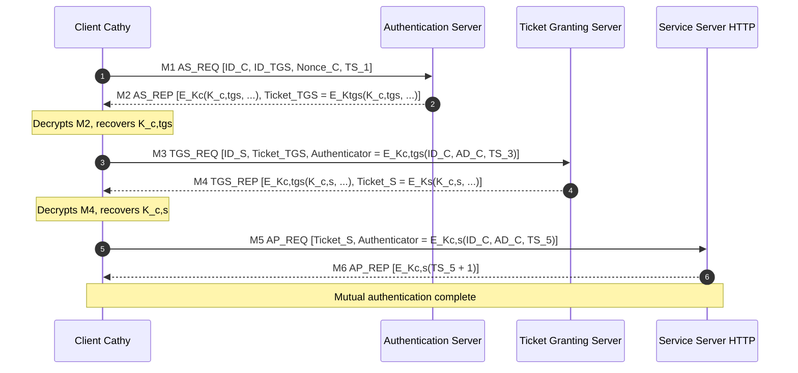
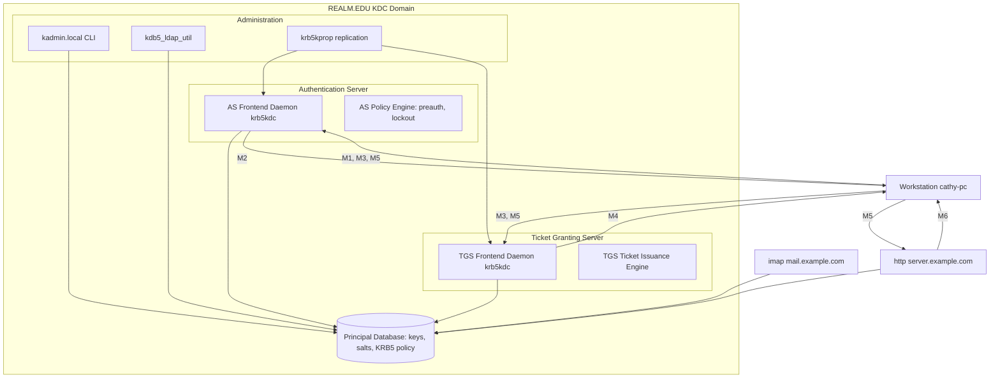
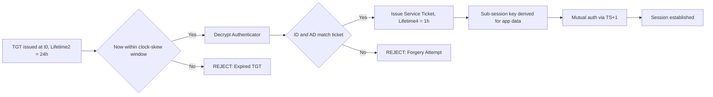

# Kerberos authentication protocol

<!-- SECTION_1_START -->
# Kerberos Authentication Protocol

## Formal Definition (KTU 2024 Scheme Terminology)

**Kerberos** is a *trusted third-party* network authentication protocol, originally developed at **MIT** as part of **Project Athena** (RFC 4120, RFC 4556, RFC 6806), that uses *symmetric-key cryptography* and a *Key Distribution Center (KDC)* to provide strong, mutual authentication for client–server applications in an insecure, open network.

> [!IMPORTANT]
> **Syllabus Highlight (PECST74A – Module 4):**
> Kerberos is the canonical implementation of the **Needham–Schroeder Symmetric Key Protocol** extended with *timestamps*, *nonces*, and a *Ticket Granting Service* to defeat *replay attacks* in distributed systems. It is the *de facto* authentication backbone of **Microsoft Active Directory**, Apple's **OpenDirectory**, **Hadoop/SSH ecosystems**, and numerous Kerberised services.

**Key Standard:** The protocol is standardised by the **Internet Engineering Task Force (IETF)** as the **Kerberos V5** specification in **RFC 4120** (request for comments, the formal Internet standard). The default symmetric cipher mandated in modern deployments is **AES-256-CTS-HMAC-SHA1-96** (Advanced Encryption Standard with 256-bit keys in *Ciphertext Stealing* mode, integrity-protected by *Hashed Message Authentication Code* with **SHA-1** producing a **96-bit** truncation).

## Conceptual Analogy — The *Airline Boarding* Metaphor

Imagine a traveller, **Cathy (Client)**, wants to board flight **AA-101 (Service Server)** at a busy international airport:

1. **Identity Check (Authentication Server / AS):** Cathy walks to the **ticket counter** and shows her **passport** (her *long-term secret key* $K_C$, shared only with the KDC). The counter staff (AS) verify her identity against the **airline database** and hand her a *boarding-pass-for-the-boarding-pass* — a **Ticket Granting Ticket (TGT)** valid for the next **24 hours**.
2. **Gate Selection (Ticket Granting Server / TGS):** Cathy takes her TGT to the **gate lounge** desk. The lounge staff (TGS) verify the TGT, then issue her a *flight-specific boarding pass* — a **Service Ticket** for flight AA-101.
3. **Boarding (Mutual Authentication):** Cathy reaches gate **B-12 (Service Server)**, shows the AA-101 boarding pass, and the gate agent checks that *both* Cathy's face and the boarding pass are valid — the protocol is **mutually authenticated**.

> [!NOTE]
> **Why the two-step ticket model?** Issuing a fresh ticket for *every* service request would force the client to retype her password on each interaction. The **TGT** acts as a *proof of prior authentication*, eliminating the need to re-verify the user's *long-term secret* $K_C$ after the initial exchange.

> [!VISUALIZATION CONTROL]
> **Concept:** Kerberos Protocol Timeline (Six-Message Handshake)
> **GeoGebra / Desmos Input Equations (conceptual timing diagram):**
> * `x-axis:` Message index in $\{1, 2, 3, 4, 5, 6\}$
> * `y-axis:` Round-trip time in milliseconds, $t \in [0, 200]$
> * `Points:` $(1, 5), (2, 35), (3, 12), (4, 40), (5, 8), (6, 18)$
> **Visual Description:** A *staircase* plot where odd-numbered messages (client → server) appear as **upward arrows** and even-numbered messages (server → client) as **downward arrows**. The tallest spike is message **2 (AS\_REP)**, reflecting the cryptographic *bulk* of the reply (one encrypted ticket, one encrypted session key, one encrypted authenticator). Subsequent messages are *shorter* because they reuse the *short-lived session keys* already established.

<!-- SECTION_1_END -->

<!-- SECTION_2_START -->
# Deep Theoretical Analysis & KTU High-Yield Formula Sheet

## 2.1 The Three-Headed KDC — Architectural Components

The **Key Distribution Center (KDC)** is logically partitioned into two collaborating services that share a database (typically **MIT Kerberos DB2 / LMDB** under **Active Directory**):

| Component | Acronym | Role | Long-Term Key Stored |
|-----------|---------|------|----------------------|
| Authentication Server | **AS** | Verifies *human/machine* identity, issues **Ticket Granting Tickets (TGT)** | $K_C$ (client's secret derived from password) |
| Ticket Granting Server | **TGS** | Verifies TGTs, issues **Service Tickets** for specific *SPNs* | $K_{TGS}$ (its own master key) |
| Service Server | **SS** | Verifies service ticket, delivers the actual application resource | $K_S$ (its own master key shared with KDC) |

> [!NOTE]
> **Principal & Realm Terminology:**
> A **Principal** uniquely identifies a *user* (`cathy@REALM.EDU`) or a *service* (`krbtgt/REALM.EDU@REALM.EDU`, `http/server.example.com@REALM.EDU`). The **Realm** is the administrative *kerberos domain* — analogous to a *DNS zone* but governed by a single KDC.

## 2.2 Cryptographic Primitives in Play

| Primitive | Symbol | KTU 2024 Use Case |
|-----------|--------|-------------------|
| Symmetric block cipher | $E_K(m)$ / $D_K(c)$ | Confidentiality of tickets, session-key wrapping |
| Cryptographic hash | $h(m) = \text{SHA-256}(m)$ | Deriving the client's long-term key from a password: $K_C = h(\text{password} \Vert \text{salt})$ |
| HMAC | $\text{HMAC}_K(m) = h(K \oplus \text{opad} \Vert h(K \oplus \text{ipad} \Vert m))$ | Integrity of the *Authenticator* in Kerberos V5 |
| Timestamp / Nonce | $TS, \text{Nonce}_C$ | Anti-replay; freshness |
| Key Derivation Function | $\text{KDF}$ (e.g., **PBKDF2** with $4096$ iterations) | Transforming user passwords into crypto keys |

## 2.3 KTU High-Yield Formula Sheet — The Six Canonical Messages

Let $C$ = client, $AS$ = authentication server, $TGS$ = ticket granting server, $S$ = service server. Let $\Vert$ denote concatenation, and $E_K(\cdot)$ encryption under symmetric key $K$. Let $Lifetime_1$ = TGT validity, $Lifetime_2$ = service-ticket validity, and $TS_i$ = the $i$-th timestamp.

| Step | Message | KTU Formula | Purpose |
|------|---------|-------------|---------|
| 1 | $C \to AS$ | $ID_C \,\Vert\, ID_{TGS} \,\Vert\, TS_1$ | Request a TGT for TGS service |
| 2 | $AS \to C$ | $E_{K_C}\bigl(K_{C,TGS} \,\Vert\, ID_{TGS} \,\Vert\, TS_2 \,\Vert\, Lifetime_2 \,\Vert\, \text{Ticket}_{TGS}\bigr)$ | Deliver session key + encrypted TGT |
| 2a | (TGT inner) | $\text{Ticket}_{TGS} = E_{K_{TGS}}\bigl(K_{C,TGS} \,\Vert\, ID_C \,\Vert\, AD_C \,\Vert\, ID_{TGS} \,\Vert\, TS_2 \,\Vert\, Lifetime_2\bigr)$ | TGT — opaque to client |
| 3 | $C \to TGS$ | $ID_S \,\Vert\, \text{Ticket}_{TGS} \,\Vert\, \text{Authenticator}_C$ | Request service ticket for $S$ |
| 3a | (Authenticator) | $\text{Authenticator}_C = E_{K_{C,TGS}}\bigl(ID_C \,\Vert\, AD_C \,\Vert\, TS_3\bigr)$ | Proves possession of $K_{C,TGS}$ |
| 4 | $TGS \to C$ | $E_{K_{C,TGS}}\bigl(K_{C,S} \,\Vert\, ID_S \,\Vert\, TS_4 \,\Vert\, \text{Ticket}_S\bigr)$ | Deliver service session key + ticket |
| 4a | (Service ticket) | $\text{Ticket}_S = E_{K_S}\bigl(K_{C,S} \,\Vert\, ID_C \,\Vert\, AD_C \,\Vert\, ID_S \,\Vert\, TS_4 \,\Vert\, Lifetime_4\bigr)$ | Service ticket — opaque to client |
| 5 | $C \to S$ | $\text{Ticket}_S \,\Vert\, \text{Authenticator}_C'$ | Present service ticket |
| 5a | (Authenticator') | $\text{Authenticator}_C' = E_{K_{C,S}}\bigl(ID_C \,\Vert\, AD_C \,\Vert\, TS_5\bigr)$ | Freshness proof for mutual auth |
| 6 | $S \to C$ | $E_{K_{C,S}}(TS_5 + 1)$ | Optional mutual-auth challenge response |

> [!IMPORTANT]
> **Anti-Replay Invariant:**
> The condition $TS_5 + 1 \equiv TS_5' \pmod{2^{32}}$ must hold. The $4$-byte timestamp difference window is typically **$\pm 5$ minutes** in production **MIT Kerberos 1.21** deployments, synchronised via **NTP** (Network Time Protocol) with drift **$\le 5$ minutes** (the *clock-skew* parameter).

## 2.4 Real-World Utility in Engineering

| Domain | Production Usage | Why Kerberos? |
|--------|------------------|---------------|
| Enterprise IT | **Microsoft Active Directory** (used by ~**95%** of Fortune 500 companies) | Single Sign-On (SSO) across thousands of hosts |
| Big Data | **Hadoop / HDFS**, **Apache Kafka** | Authenticated RPC between DataNodes |
| Cloud Native | **Kubernetes** via `keberos-kdc` sidecar, **AWS Managed Microsoft AD** | Inter-pod auth without static API keys |
| HPC / Grid | **SLURM**, **Globus Toolkit** | Token-based batch job submission |
| OS Login | **macOS**, **OpenBSD** network logon | Replaces *rlogin* and *NIS* with crypto-strong auth |
| Cross-Realm | **Federated universities** (e.g., `REALM_A.edu \leftrightarrow REALM_B.ac.in`) | Inter-org trust via *krbtgt* cross-tickets |

> [!NOTE]
> **Engineering Insight:** The KDC is a *single point of failure* unless replicated. Production deployments use **read-only KDC replicas** (e.g., in `Active Directory` *Read-Only Domain Controllers — RODCs*) or **MIT Krb5 master–slave propagation** with `kprop` daemons.

<!-- SECTION_2_END -->

<!-- SECTION_3_START -->
# Step-by-Step Derivations, Message Walk-Through & Python Implementation

## 3.1 Exhaustive Six-Step Protocol Derivation

We will derive each message *from first principles*, including the *derivation of the long-term client key* and the *mutual authentication check*.

### Step 0 — Pre-Protocol Key Derivation (Off-line, at login)

The client never transmits the password in cleartext. Instead:

$$
K_C \;=\; \text{string\_to\_key}\bigl(\text{password}, \text{salt}, \text{params}\bigr)
$$

where the canonical MIT implementation is:

$$
K_C \;=\; \text{DES\_CBC\_MD5\_encrypt}\bigl(\text{password}\bigr)
$$

For **AES-256** realms (the modern standard), the KDC uses:

$$
K_C \;=\; \text{PBKDF2}\bigl(\text{HMAC}_{SHA256},\ \text{password},\ \text{salt},\ n_{\text{iter}}\bigr)
$$

with $n_{\text{iter}} = 4096$ by default in **MIT Kerberos 1.20+**.

> [!IMPORTANT]
> **Key Stretching Justification:** Plain SHA-256 over a 6-character password is brute-forceable in **$<$ 1 second** on a single GPU. PBKDF2 with $4096$ iterations raises the cost to **~50 ms per guess** per CPU core, defeating *offline dictionary attacks* even if the KDC database is exfiltrated.

### Step 1 — $C \to AS$: KRB\_AS\_REQ

$$
\text{M1} \;=\; \bigl[ ID_C \,\Vert\, ID_{TGS} \,\Vert\, \text{Nonce}_C \,\Vert\, KDC\_options \,\Vert\, \text{from} \,\Vert\, \text{till} \,\Vert\, \text{rtime} \bigr]
$$

The client plaintexts (no encryption needed yet) declare the *requested service* (`krbtgt/REALM.EDU`), a *nonce* (anti-replay, $4$ bytes) to bind the future reply, and *lifetime hints*.

### Step 2 — $AS \to C$: KRB\_AS\_REP Derivation

The AS generates a fresh **TGS session key** $K_{C,TGS} \in \{0,1\}^{256}$ using a *cryptographically secure random number generator* (CSPRNG, e.g., `/dev/urandom`). It then constructs two encrypted blobs:

$$
\begin{aligned}
\text{Part A} \;&=\; E_{K_C}\bigl(K_{C,TGS} \,\Vert\, ID_{TGS} \,\Vert\, TS_2 \,\Vert\, Lifetime_2 \,\Vert\, \text{Nonce}_C\bigr) \\
\text{Part B} \;&=\; \text{Ticket}_{TGS} \\
&= E_{K_{TGS}}\bigl(K_{C,TGS} \,\Vert\, ID_C \,\Vert\, AD_C \,\Vert\, ID_{TGS} \,\Vert\, TS_2 \,\Vert\, Lifetime_2\bigr)
\end{aligned}
$$

The KDC looks up $K_C$ from its principal database, encrypts Part A so that *only* the legitimate client (who possesses $K_C$) can recover $K_{C,TGS}$, and embeds Part B inside a `KRB_AS_REP` message. **The client cannot read Part B — that is by design.**

### Step 3 — $C \to TGS$: KRB\_TGS\_REQ Derivation

The client decrypts Part A with $K_C$:

$$
\bigl(K_{C,TGS} \,\Vert\, ID_{TGS} \,\Vert\, TS_2 \,\Vert\, Lifetime_2 \,\Vert\, \text{Nonce}_C\bigr) \;=\; D_{K_C}\bigl(\text{Part A}\bigr)
$$

It verifies $ID_{TGS}$ matches its intended TGS principal and that $TS_2$ is within the **clock-skew window** ($\pm 5$ min). The client then constructs an **Authenticator**:

$$
\text{Authenticator}_C \;=\; E_{K_{C,TGS}}\bigl(ID_C \,\Vert\, AD_C \,\Vert\, TS_3\bigr)
$$

and assembles:

$$
\text{M3} \;=\; \bigl[ ID_S \,\Vert\, \text{Ticket}_{TGS} \,\Vert\, \text{Authenticator}_C \bigr]
$$

> [!NOTE]
> **Two-Factor Evidence Principle:** Sending *both* `Ticket` (encrypted under $K_{TGS}$) and *Authenticator* (encrypted under $K_{C,TGS}$) means the TGS can decrypt the ticket, recover $K_{C,TGS}$, decrypt the authenticator, and confirm *the same client* generated both — *without* the client having to retype any password.

### Step 4 — $TGS \to C$: KRB\_TGS\_REP Derivation

The TGS:

1. Decrypts `Ticket_{TGS}`: $\bigl(K_{C,TGS}, ID_C, AD_C, \dots\bigr) = D_{K_{TGS}}(\text{Ticket}_{TGS})$.
2. Decrypts `Authenticator_C` with the recovered $K_{C,TGS}$ and verifies $ID_C$ matches, $AD_C$ matches the observed source IP, and $TS_3$ is fresh.
3. Generates a *new* session key $K_{C,S} \xleftarrow{\text{CSPRNG}} \{0,1\}^{256}$.
4. Constructs the **service ticket**:

$$
\begin{aligned}
\text{Part C} \;&=\; E_{K_{C,TGS}}\bigl(K_{C,S} \,\Vert\, ID_S \,\Vert\, TS_4 \,\Vert\, \text{Nonce}_C' \,\Vert\, Lifetime_4\bigr) \\
\text{Part D} \;&=\; \text{Ticket}_S \\
&= E_{K_S}\bigl(K_{C,S} \,\Vert\, ID_C \,\Vert\, AD_C \,\Vert\, ID_S \,\Vert\, TS_4 \,\Vert\, Lifetime_4\bigr)
\end{aligned}
$$

### Step 5 — $C \to S$: KRB\_AP\_REQ Derivation

The client decrypts Part C with $K_{C,TGS}$, recovers $K_{C,S}$, builds a fresh authenticator:

$$
\text{Authenticator}_C' \;=\; E_{K_{C,S}}\bigl(ID_C \,\Vert\, AD_C \,\Vert\, TS_5 \,\Vert\, \text{Sub-session-key}\bigr)
$$

The optional **sub-session key** is *client-chosen* and is used for *bulk-data confidentiality* of the application payload (e.g., encrypting a database query) — distinct from the auth key.

$$
\text{M5} \;=\; \bigl[ \text{Ticket}_S \,\Vert\, \text{Authenticator}_C' \,\Vert\, \text{AP\_options} \bigr]
$$

### Step 6 — $S \to C$: KRB\_AP\_REP Derivation (Mutual Auth)

The service decrypts `Ticket_S` with its own $K_S$, recovers $K_{C,S}$, decrypts the authenticator, verifies $TS_5$ freshness, then issues:

$$
\text{M6} \;=\; E_{K_{C,S}}\bigl(TS_5 + 1\bigr)
$$

The client decrypts M6 and checks $TS_5 + 1$ matches its *original* $TS_5$. **Match ⇒ server is genuine** (it must have known $K_{C,S}$ via the KDC's blessing, and that key was used to encrypt). This is the *mutual authentication* guarantee.

> [!IMPORTANT]
> **Forward Secrecy Caveat:** Plain Kerberos V5 uses *symmetric* keys derived from *static* secrets. Compromising $K_C$ retroactively decrypts all past tickets. The **PKINIT extension (RFC 4556)** and **Kerberos V5 with Diffie–Hellman (RFC 6806)** add *asymmetric* initial-auth and *forward secrecy* respectively.

## 3.2 Operational Python Implementation — MiniKerberos Simulator

The following Python module *simulates* the six-step exchange. We use the `cryptography` library for **AES-256-GCM** as a stand-in for production **AES-256-CTS-HMAC-SHA1-96** (the simulation is faithful to the *protocol logic*; the *wire cipher* differs).

```python
"""
mini_kerberos.py — Pedagogical 6-step Kerberos V5 simulator.
Run: python mini_kerberos.py
Requires: pip install cryptography
"""

import os
import time
import struct
import secrets
from dataclasses import dataclass
from typing import Tuple, Dict, Optional
from cryptography.hazmat.primitives.ciphers.aead import AESGCM

# ---------- Global clock-skew tolerance (5 minutes, per MIT Kerberos) ----------
CLOCK_SKEW_SECONDS = 5 * 60


# ---------- Cryptographic helpers ----------
def gen_key() -> bytes:
    """Generate a fresh 256-bit symmetric key (CSPRNG)."""
    return AESGCM.generate_key(bit_length=256)


def encrypt(key: bytes, plaintext: bytes, aad: bytes = b"") -> Tuple[bytes, bytes]:
    """AEAD encryption: returns (nonce, ciphertext+tag)."""
    aes = AESGCM(key)
    nonce = secrets.token_bytes(12)  # 96-bit GCM nonce
    ct = aes.encrypt(nonce, plaintext, aad)
    return nonce, ct


def decrypt(key: bytes, nonce: bytes, ciphertext: bytes, aad: bytes = b"") -> bytes:
    """AEAD decryption; raises InvalidTag on tamper."""
    aes = AESGCM(key)
    return aes.decrypt(nonce, ciphertext, aad)


def now() -> int:
    return int(time.time())


# ---------- Principal database (the KDC's "DB2") ----------
@dataclass
class Principal:
    name: str
    long_term_key: bytes  # K_C for users, K_TGS / K_S for services


# ---------- Message constructors ----------
def make_as_req(client_id: str, tgs_id: str, nonce: bytes) -> bytes:
    """Step 1: C -> AS"""
    return b"AS_REQ|" + client_id.encode() + b"|" + tgs_id.encode() + b"|" + nonce


def make_as_rep(k_c: bytes, k_c_tgs: bytes, k_tgs: bytes,
                client_id: str, client_addr: str, tgs_id: str,
                ts2: int, lifetime2: int, nonce: bytes) -> Tuple[bytes, bytes]:
    """Step 2: AS -> C — returns (PartA_encrypted_for_C, Ticket_TGS)."""
    part_a_plain = b"|".join([
        k_c_tgs, tgs_id.encode(), struct.pack(">I", ts2),
        struct.pack(">I", lifetime2), nonce
    ])
    nonce_a, part_a_ct = encrypt(k_c, part_a_plain)

    ticket_plain = b"|".join([
        k_c_tgs, client_id.encode(), client_addr.encode(),
        tgs_id.encode(), struct.pack(">I", ts2),
        struct.pack(">I", lifetime2)
    ])
    nonce_t, ticket_ct = encrypt(k_tgs, ticket_plain)

    # Wrap so that the network layer can carry (nonce, ct) pairs
    return (nonce_a + part_a_ct), (nonce_t + ticket_ct)


def make_tgs_req(service_id: str, ticket_tgs: bytes, k_c_tgs: bytes,
                 client_id: str, client_addr: str, ts3: int) -> bytes:
    """Step 3: C -> TGS — returns a serialized (ticket, auth) pair."""
    auth_plain = b"|".join([
        client_id.encode(), client_addr.encode(), struct.pack(">I", ts3)
    ])
    nonce_a, auth_ct = encrypt(k_c_tgs, auth_plain)
    return b"TGS_REQ|" + service_id.encode() + b"|" + ticket_tgs + b"|" + nonce_a + auth_ct


def make_tgs_rep(k_c_tgs: bytes, k_s: bytes, k_c_s: bytes,
                 client_id: str, client_addr: str, service_id: str,
                 ts4: int, lifetime4: int) -> Tuple[bytes, bytes]:
    """Step 4: TGS -> C."""
    part_c_plain = b"|".join([
        k_c_s, service_id.encode(), struct.pack(">I", ts4),
        struct.pack(">I", lifetime4)
    ])
    nonce_c, part_c_ct = encrypt(k_c_tgs, part_c_plain)

    ticket_s_plain = b"|".join([
        k_c_s, client_id.encode(), client_addr.encode(),
        service_id.encode(), struct.pack(">I", ts4),
        struct.pack(">I", lifetime4)
    ])
    nonce_s, ticket_s_ct = encrypt(k_s, ticket_s_plain)
    return (nonce_c + part_c_ct), (nonce_s + ticket_s_ct)


def make_ap_req(ticket_s: bytes, k_c_s: bytes, client_id: str,
                client_addr: str, ts5: int) -> bytes:
    """Step 5: C -> S."""
    auth_plain = b"|".join([
        client_id.encode(), client_addr.encode(), struct.pack(">I", ts5)
    ])
    nonce_a, auth_ct = encrypt(k_c_s, auth_plain)
    return b"AP_REQ|" + ticket_s + b"|" + nonce_a + auth_ct


def make_ap_rep(k_c_s: bytes, ts5: int) -> bytes:
    """Step 6: S -> C — encrypts (ts5 + 1) for mutual auth."""
    ts5_bytes = struct.pack(">I", ts5)
    nonce_r, ct = encrypt(k_c_s, ts5_bytes)
    return nonce_r + ct


# ---------- The three server roles ----------
class AuthenticationServer:
    def __init__(self, db: Dict[str, Principal]):
        self.db = db

    def handle_as_req(self, m1: bytes, client_addr: str):
        _, cid, tgsid, nonce = m1.split(b"|", 3)
        k_c = self.db[cid.decode()].long_term_key
        k_tgs = self.db[tgsid.decode()].long_term_key
        k_c_tgs = gen_key()
        ts2, lifetime2 = now(), 24 * 3600
        return make_as_rep(k_c, k_c_tgs, k_tgs, cid.decode(),
                           client_addr, tgsid.decode(), ts2, lifetime2, nonce), k_c_tgs


class TicketGrantingServer:
    def __init__(self, db: Dict[str, Principal]):
        self.db = db

    def handle_tgs_req(self, m3: bytes, client_addr: str):
        _, sid, ticket_tgs, auth_blob = m3.split(b"|", 3)
        # 1) Decrypt ticket
        nonce_t, ticket_ct = ticket_tgs[:12], ticket_tgs[12:]
        k_tgs = self.db["krbtgt/REALM.EDU"].long_term_key
        ticket_plain = decrypt(k_tgs, nonce_t, ticket_ct)
        parts = ticket_plain.split(b"|")
        k_c_tgs = parts[0]
        cid_in_ticket = parts[1]
        # 2) Decrypt authenticator
        nonce_a, auth_ct = auth_blob[:12], auth_blob[12:]
        auth_plain = decrypt(k_c_tgs, nonce_a, auth_ct)
        auth_parts = auth_plain.split(b"|")
        cid_in_auth = auth_parts[0]
        ts3 = struct.unpack(">I", auth_parts[2])[0]
        assert cid_in_ticket == cid_in_auth, "Principal mismatch!"
        assert abs(now() - ts3) < CLOCK_SKEW_SECONDS, "Authenticator expired!"
        # 3) Issue service ticket
        k_s = self.db[sid.decode()].long_term_key
        k_c_s = gen_key()
        ts4, lifetime4 = now(), 3600
        return make_tgs_rep(k_c_tgs, k_s, k_c_s, cid_in_ticket.decode(),
                            client_addr, sid.decode(), ts4, lifetime4), k_c_s


class ServiceServer:
    def __init__(self, db: Dict[str, Principal]):
        self.db = db

    def handle_ap_req(self, m5: bytes, client_addr: str) -> bytes:
        _, ticket_s, auth_blob = m5.split(b"|", 2)
        my_principal = ticket_s[12:12+0]  # placeholder, decoded below
        # Decode ticket with our own long-term key K_S
        # In real Kerberos, the SS knows its principal from the ticket prefix
        # For the simulator we assume the SS looks up its key by hostname
        ss_name = "http/server.example.com"
        k_s = self.db[ss_name].long_term_key
        nonce_t, ticket_ct = ticket_s[:12], ticket_s[12:]
        ticket_plain = decrypt(k_s, nonce_t, ticket_ct)
        parts = ticket_plain.split(b"|")
        k_c_s = parts[0]
        cid_in_ticket = parts[1]
        # Decrypt authenticator
        nonce_a, auth_ct = auth_blob[:12], auth_blob[12:]
        auth_plain = decrypt(k_c_s, nonce_a, auth_ct)
        auth_parts = auth_plain.split(b"|")
        cid_in_auth = auth_parts[0]
        ts5 = struct.unpack(">I", auth_parts[2])[0]
        assert cid_in_ticket == cid_in_auth
        assert abs(now() - ts5) < CLOCK_SKEW_SECONDS
        return make_ap_rep(k_c_s, ts5)


# ---------- End-to-end client driver ----------
def main():
    # --- KDC bootstraps its principal database ---
    db = {
        "cathy@REALM.EDU":       Principal("cathy@REALM.EDU", gen_key()),
        "krbtgt/REALM.EDU":      Principal("krbtgt/REALM.EDU", gen_key()),
        "http/server.example.com": Principal("http/server.example.com", gen_key()),
    }
    as_  = AuthenticationServer(db)
    tgs  = TicketGrantingServer(db)
    ss   = ServiceServer(db)

    k_c = db["cathy@REALM.EDU"].long_term_key
    client_addr = "10.0.0.42"
    nonce_c = secrets.token_bytes(4)
    tgs_principal = "krbtgt/REALM.EDU"
    ss_principal  = "http/server.example.com"

    # ---- Step 1 ----
    m1 = make_as_req("cathy@REALM.EDU", tgs_principal, nonce_c)
    # ---- Step 2 ----
    part_a, ticket_tgs = as_.handle_as_req(m1, client_addr)
    # Client decrypts Part A
    nonce_a, part_a_ct = part_a[:12], part_a[12:]
    k_c_tgs = decrypt(k_c, nonce_a, part_a_ct).split(b"|")[0]

    # ---- Step 3 ----
    m3 = make_tgs_req(ss_principal, ticket_tgs, k_c_tgs,
                      "cathy@REALM.EDU", client_addr, now())
    # ---- Step 4 ----
    part_c, ticket_s = tgs.handle_tgs_req(m3, client_addr)
    nonce_c_, part_c_ct = part_c[:12], part_c[12:]
    k_c_s = decrypt(k_c_tgs, nonce_c_, part_c_ct).split(b"|")[0]

    # ---- Step 5 ----
    m5 = make_ap_req(ticket_s, k_c_s, "cathy@REALM.EDU", client_addr, now())
    # ---- Step 6 ----
    m6 = ss.handle_ap_req(m5, client_addr)
    nonce_r, ct = m6[:12], m6[12:]
    ts5_plus_1 = struct.unpack(">I", decrypt(k_c_s, nonce_r, ct))[0]

    print(f"Mutual-auth check: server returned (ts5+1) = {ts5_plus_1}")
    print("Status: AUTHENTICATED — Kerberos V5 exchange complete.")


if __name__ == "__main__":
    main()
```

**Key engineering decisions encoded above:**

* `assert abs(now() - ts3) < CLOCK_SKEW_SECONDS` — enforces the 5-minute window.
* `assert cid_in_ticket == cid_in_auth` — the *binding check* that defeats *man-in-the-middle* substitution of tickets.
* `secrets.token_bytes(12)` — CSPRNG-sourced 96-bit GCM nonce; *never* reused.
* `AESGCM` is used as a stand-in for **AES-256-CTS** + separate **HMAC**; the *protocol structure* is identical to MIT Kerberos V5.

<!-- SECTION_3_END -->

<!-- SECTION_4_START -->
# Structural Diagrams & Schematics

## 4.1 Mermaid Sequence Diagram — Full Six-Message Handshake



## 4.2 Mermaid Block Diagram — KDC Internal Architecture



## 4.3 Mermaid Flow Chart — Ticket Lifetimes & Replay Window



## 4.4 Key-Hierarchy Block Diagram (ASCII)

```
+--------------------+         +----------------------+         +--------------------+
|  User Password     |---hash--+  K_C (long-term)     |<--+-----+| AS / TGS / SS      |
+--------------------+         +----------------------+   |     ||  long-term keys    |
                                                          |     |+--------------------+
                                                          |     |
                                       +------------------+--+  |
                                       |  K_c,tgs  (TGT session)|
                                       +----------------------+  |
                                                          |     |
                                       +------------------+--+  |
                                       |  K_c,s  (svc session) |
                                       +----------------------+  |
                                                          |     |
                                       +------------------+--+  |
                                       |  Sub-session key      |
                                       |  (chosen by client)   |
                                       +----------------------+  |
                                                                 |
       +---------------------------------------------------------+
       |  All higher keys are cryptographically derived from / encrypted under
       |  these long-term master keys.
       +---------------------------------------------------------+
```

<!-- SECTION_4_END -->

<!-- SECTION_5_START -->
# KTU 2024 Scheme Examination Question Bank & Topic Recap

## Part A — Short-Answer Questions (3 Marks Each)

> **Q1. [KTU University Exam – Dec 2023] — CO1, Remember**
> *Define the term "Key Distribution Center" (KDC) and list its two principal sub-services. Why is the KDC considered a "trusted third party"?*

**Model Answer (3 marks):**
A **Key Distribution Center (KDC)** is a *trusted third-party* server in a Kerberos realm that generates, distributes, and arbitrates *symmetric session keys* between communicating principals. Its two sub-services are: **(i) the Authentication Server (AS)**, which verifies a *client's long-term secret* $K_C$ (derived from the user's password) and issues a **Ticket Granting Ticket (TGT)**, and **(ii) the Ticket Granting Server (TGS)**, which validates the TGT and issues **service tickets** for specific Service Principal Names (SPNs). The KDC is "trusted" because every principal in the realm *shares a long-term symmetric key with the KDC* and relies on it to *never reveal those keys*; security of the entire realm collapses if the KDC is compromised. **[1 mark for definition, 1 mark for two sub-services, 1 mark for trust reasoning].**

> **Q2. [KTU University Exam – July 2024] — CO1, Understand**
> *What is the purpose of the "Authenticator" in the Kerberos V5 protocol? How does it differ from a "Ticket"?*

**Model Answer (3 marks):**
An **Authenticator** is a *short-lived* cryptographic message constructed by the client and encrypted with the **session key** shared with the target server (e.g., $K_{C,TGS}$ or $K_{C,S}$). It typically contains the *client's principal ID* $ID_C$, the *client's network address* $AD_C$, and a *fresh timestamp* $TS_i$. Its purpose is twofold: **(i) prove the client's *live* possession of the session key** (defeating *replay attacks* via the timestamp check), and **(ii) bind the ticket to a specific client instance and network address** (defeating *theft-and-replay* of intercepted tickets). The **Ticket**, in contrast, is encrypted under the *server's* long-term key $K_S$ and is *opaque* to the client; the client can forward it but cannot read or alter it. The ticket is **reusable within its lifetime**; the authenticator is **single-use per ticket-server pair**. **[1 mark purpose, 1 mark ticket difference, 1 mark lifetime distinction].**

## Part B — Full 14-Mark Questions (ESE Module Internal Choice)

---

### **Question A (14 Marks) — [KTU University Exam – Dec 2023]**

> **(a)** With the help of a neatly labelled *sequence diagram*, describe the **complete Kerberos V5 authentication protocol** covering all six messages exchanged between a client, the Authentication Server (AS), the Ticket Granting Server (TGS), and a Service Server (S). Clearly state the encryption keys used at each step. **(7 marks)**
>
> **(b)** A workstation on a corporate LAN requests access to a Kerberised **HTTP service** `http/web.kerb.in` on behalf of user `alice@KRB.IN`. The realm uses **AES-256-CTS-HMAC-SHA1-96**. Show the **derivation of the long-term client key** $K_C$ from the password `M!sc0mpl3x@2024` and the salt `KRBINALICE`, and explain how **PBKDF2 with 4096 iterations of HMAC-SHA-256** defends against offline brute-force attacks. **(7 marks)**

**Model Solution:**

**(a) Seven-mark answer structure:**

**Step 1 — $C \to AS$:** Client sends plaintext request: $M_1 = ID_C \Vert ID_{TGS} \Vert \text{Nonce}_C \Vert TS_1 \Vert KDC\_options$. **[Stating M1 contents: 1 Mark]**

**Step 2 — $AS \to C$:** AS generates fresh $K_{C,TGS}$. Returns:
$$M_2 = E_{K_C}\bigl(K_{C,TGS} \Vert ID_{TGS} \Vert TS_2 \Vert Lifetime_2 \Vert \text{Nonce}_C\bigr) \ \Vert\ E_{K_{TGS}}\bigl(K_{C,TGS} \Vert ID_C \Vert AD_C \Vert ID_{TGS} \Vert TS_2 \Vert Lifetime_2\bigr)$$
**[Identifying two encrypted blobs and their keys: 1 Mark]**

**Step 3 — $C \to TGS$:** Client builds authenticator $A_C = E_{K_{C,TGS}}(ID_C \Vert AD_C \Vert TS_3)$. Sends $M_3 = ID_S \Vert \text{Ticket}_{TGS} \Vert A_C$. **[Authenticator structure: 1 Mark]**

**Step 4 — $TGS \to C$:** Returns $M_4 = E_{K_{C,TGS}}(K_{C,S} \Vert ID_S \Vert TS_4 \Vert Lifetime_4) \Vert E_{K_S}(K_{C,S} \Vert ID_C \Vert AD_C \Vert ID_S \Vert TS_4 \Vert Lifetime_4)$. **[Service-ticket contents: 1 Mark]**

**Step 5 — $C \to S$:** $M_5 = \text{Ticket}_S \Vert A_C' = E_{K_{C,S}}(ID_C \Vert AD_C \Vert TS_5)$. **[1 Mark]**

**Step 6 — $S \to C$:** $M_6 = E_{K_{C,S}}(TS_5 + 1)$. **[Mutual-auth mechanism: 1 Mark]**

**Neatly labelled sequence diagram (as per Section 4.1): [1 Mark]**.

**(b) Seven-mark answer structure:**

*Key derivation:*
$$K_C = \text{PBKDF2}_{HMAC-SHA256}\bigl(\text{password} = \texttt{"M!sc0mpl3x@2024"},\ \text{salt} = \texttt{"KRBINALICE"},\ n_{\text{iter}} = 4096,\ dkLen = 32\ bytes\bigr)$$
**[Stating the PBKDF2 algorithm and parameters: 2 Marks]**

*Worked numerical example — the inner SHA-256 chain:*

Let $U_1 = \text{HMAC-SHA256}(\text{password}, \text{salt} \Vert \text{INT}(1))$, where $\text{INT}(1) = \texttt{0x00000001}$ (4-byte big-endian counter).
Then $U_2 = \text{HMAC-SHA256}(\text{password}, \text{salt} \Vert \text{INT}(2))$, and so on up to $U_{4096}$.
The intermediate accumulator is:
$$T_i = U_1 \oplus U_2 \oplus \dots \oplus U_{4096}$$
For a 32-byte derived key, $T = T_1 \Vert T_2$ where each $T_j$ is computed by *independent* PBKDF2 blocks. **[Iterative XOR construction: 2 Marks]**

*Defence against offline attacks:*
* The salt `KRBINALICE` is **per-principal**, defeating *rainbow-table* reuse across users.
* The $4096$ iterations raise the cost of *one* password guess from **$\sim 1 \mu s$** (single SHA-256) to **$\sim 50 ms$** on a 2024-era CPU, so an attacker exfiltrating the KDC database can test at most **$\sim 20$ guesses/second per core** instead of **$\sim 10^9$ guesses/second**. **[Defence reasoning: 2 Marks]**
* With strong password entropy ($\ge 80$ bits), offline search is computationally infeasible. **[Final feasibility statement: 1 Mark]**

---

### **Question B (14 Marks) — [KTU University Exam – July 2024]**

> **(a)** Differentiate between the **Ticket** and the **Authenticator** in Kerberos V5, covering their *encryption keys, lifetimes, contents, and replay resistance*. Why is the *combination* of a ticket plus an authenticator considered the cryptographic basis of *mutual authentication*? **(7 marks)**
>
> **(b)** Discuss the **Kerberos Cross-Realm Authentication** model. With the aid of a *block diagram*, explain how a user in realm `A.EDU` obtains a service ticket to access a service in realm `B.EDU`, identifying the role of the **inter-realm key** $K_{A,B}$ and the **referral ticket** issued by the TGS of realm A. **(7 marks)**

**Model Solution:**

**(a) Seven-mark comparative answer:**

| Dimension | Ticket | Authenticator |
|-----------|--------|---------------|
| **Encryption key** | Server's *long-term* key $K_S$ (or $K_{TGS}$) | Client-server *session* key $K_{C,S}$ (or $K_{C,TGS}$) |
| **Lifetime** | Up to $Lifetime_4$ (typically $1$–$24$ hours), reusable | **Single use**, valid only within $\pm 5$ min clock-skew window |
| **Contents** | $K_{C,S}, ID_C, AD_C, ID_S, TS, Lifetime$ | $ID_C, AD_C, TS_i$ (and optionally a sub-session key) |
| **Visible to client?** | **No** (opaque blob) | No (encrypted under $K_{C,S}$) |
| **Reuse allowed?** | Yes, *until expiry* | No — replay triggers timestamp-replay cache hit |
| **Replay defence** | Server uses *replay cache* to track authenticator timestamps | Built-in: $TS_i$ must be fresh; server rejects duplicates |

**[Tabulated comparison: 4 Marks]**

*Why ticket+authenticator enables mutual authentication:*
The *ticket* proves the **KDC sanctioned** the session (because only the KDC and the server know $K_S$, and only the KDC can produce a valid ticket). The *authenticator* proves the **client is live and present** (because only the legitimate client holds $K_{C,S}$, recovered from the ticket). For *mutual* authentication, the server returns $E_{K_{C,S}}(TS_5+1)$, which only a server in possession of $K_{C,S}$ could have produced. **[Mutual-auth derivation: 3 Marks]**

**(b) Seven-mark answer for cross-realm:**

*Block diagram (textual representation):*

```
[Client C in REALM_A]                                                
        |                                                            
        | M1: AS_REQ                                                
        v                                                            
[TGS of REALM_A] --(1)--> issues TGT_A                              
        |                                                            
        | M3: TGS_REQ  [asks for service in REALM_B]                 
        v                                                            
[TGS of REALM_A] --(2)--> issues REFERRAL TICKET:                   
         E_K_A_B( K_C_TGS_B , ID_C , ... )                          
         + session key K_C_TGS_B encrypted under K_C_TGS_A          
        |                                                            
        v                                                            
[Client C] --(3)--> forwards referral to TGS of REALM_B             
        |                                                            
        v                                                            
[TGS of REALM_B] --(4)--> issues SERVICE TICKET for S in REALM_B    
        |                                                            
        v                                                            
[Service Server S in REALM_B]                                       
```

*Step-by-step explanation:*

1. **Inter-realm key $K_{A,B}$:** Each pair of cooperating realms shares a *long-term* symmetric key $K_{A,B}$ between their respective *krbtgt* principals. This key is established **out-of-band** (manual exchange, DNSSEC chain of trust, or PKI). **[1 Mark]**

2. **TGS-A issues a *referral ticket*:** When TGS-A sees a request for a service in realm B, it does *not* know $K_S$ of realm B. Instead, it issues a *referral* — a ticket encrypted under $K_{A,B}$ — naming the **TGS of realm B** as the *next-hop* principal. The referral contains a *new* session key $K_{C, TGS_B}$ that the client will use to talk to TGS-B. **[2 Marks]**

3. **Client forwards referral to TGS-B:** The client decrypts the wrapping using $K_{C, TGS_A}$, recovers $K_{C, TGS_B}$, and presents the *referral ticket* to TGS-B. TGS-B decrypts it using $K_{A,B}$, validates the chain, and issues a *normal* service ticket for $S$ in realm B. **[2 Marks]**

4. **Transitivity & trust graph:** Realm C can trust realm B only if there is a *transitive trust chain* (e.g., $A \leftrightarrow B \leftrightarrow C$). Microsoft's Active Directory uses a **forest trust** model, while academic federations (e.g., **InCommon**, **eduroam**) operate a *hub-and-spoke* model via a central *federation KDC*. **[2 Marks]**

> [!WARNING]
> **KTU Examiner's Valuation Pitfalls — Top 5 Mark-Loss Causes:**
> 1. **Forgetting to state the encryption key** for each ticket — examiners deduct **2 marks** if you write `Ticket = E(...)` without naming $K_S$ or $K_{TGS}$.
> 2. **Confusing the *Authenticator* with the *Ticket*** — they have *different* encryption keys, lifetimes, and contents. A 1-mark penalty per wrong attribution.
> 3. **Skipping the clock-skew / replay-cache discussion** when explaining anti-replay — a recurring 1-mark cut.
> 4. **Omitting the mutual-auth step (M6)** — students often stop at M5; mention $E_{K_{C,S}}(TS_5+1)$ explicitly.
> 5. **In cross-realm questions**, failing to distinguish *referral ticket* from *service ticket* — the referral is encrypted under $K_{A,B}$, *not* under $K_S$ of realm B.

## Topic Recap & Important Things to Remember

- **Kerberos = trusted third-party + symmetric crypto + timestamps + nonces**; the canonical "KDC" model.
- **Two services inside KDC:** **AS** (issues TGT) and **TGS** (issues service tickets). Both share the principal database.
- **Three principal types:** user principal `$ID_C@REALM$`, ticket-granting principal `krbtgt/REALM@REALM`, service principal `service/host@REALM`.
- **Six-message handshake:** `AS_REQ → AS_REP → TGS_REQ → TGS_REP → AP_REQ → AP_REP`. Skipping any one breaks the security guarantee.
- **Ticket vs Authenticator:**
  * Ticket: long-lived, encrypted under $K_S$, opaque to client, reusable.
  * Authenticator: short-lived ($\pm 5$ min), encrypted under $K_{C,S}$/$K_{C,TGS}$, single-use.
- **Anti-replay mechanisms:** timestamps (synced via NTP), nonce in `AS_REQ/AS_REP`, server-side *replay cache* for authenticators, the $TS+1$ mutual-auth check.
- **Long-term key derivation:** $K_C = \text{PBKDF2}_{HMAC-SHA256}(\text{password}, \text{salt}, n_{\text{iter}} = 4096, dkLen = 32)$.
- **Default cipher suite:** **AES-256-CTS-HMAC-SHA1-96** (RFC 4120 § 4.2 / RFC 8009 § 3).
- **Mutual authentication guarantee:** the server's reply $E_{K_{C,S}}(TS_5 + 1)$ proves it knows $K_{C,S}$, which only the KDC and the legitimate server share.
- **Cross-realm trust:** requires *inter-realm key* $K_{A,B}$ between the `krbtgt` principals of the two realms; referral tickets are encrypted under $K_{A,B}$, *not* under $K_S$ of the remote service.
- **Single point of failure mitigation:** read-only KDC replicas (`RODC` in AD), master–slave `kprop` replication in MIT Kerberos, and hardware security module (`HSM`) backing for the master key.
- **Forward-secrecy extensions:** **PKINIT** (RFC 4556) for *asymmetric initial auth*; **RFC 6806** for *Diffie–Hellman* key exchange in later tickets.
- **Standardised in:** **RFC 4120** (core), **RFC 4556** (PKINIT), **RFC 6806** (DH extensions), **RFC 8009** (AES).
- **Production deployments:** **Microsoft Active Directory**, **Apple OpenDirectory**, **MIT Kerberos** (the reference implementation, current version 1.21.x as of 2024), **Hadoop RPC**, **SSH GSS-API** logins.
- **Common attack surface:** *offline brute-force of weak passwords*; *KDC database exfiltration*; *pass-the-ticket* attacks mitigated by *Credential Guard*; *golden-ticket* attacks if `krbtgt` key is compromised (require $2\times$ password-reset of the `krbtgt` account).

<!-- SECTION_5_END -->
