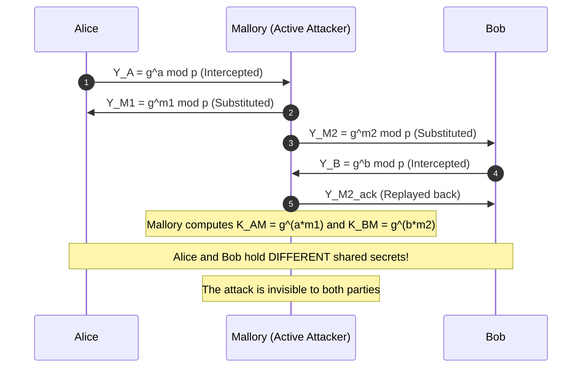
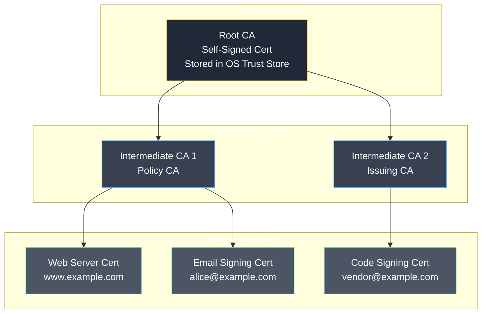
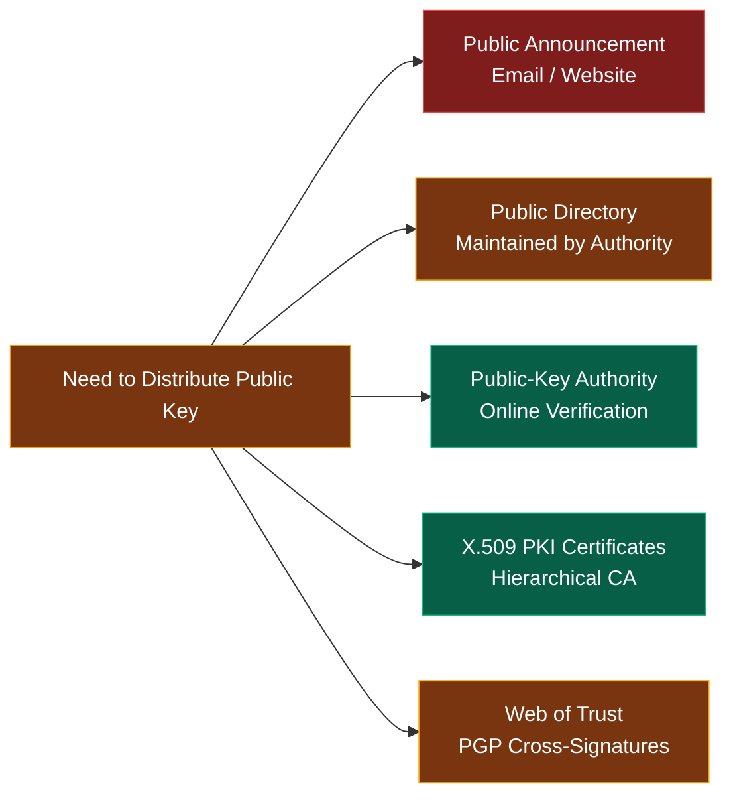
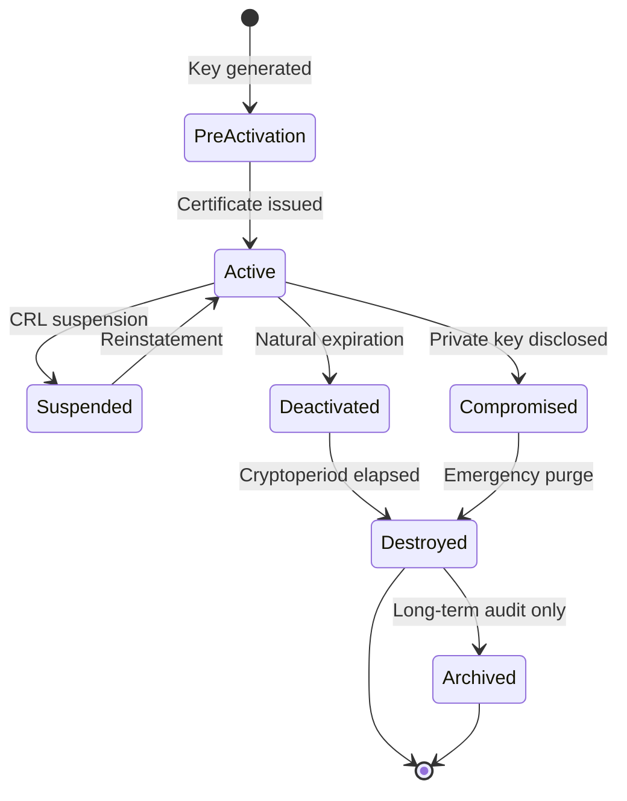

# Symmetric and public key distribution

<!-- SECTION_1_START -->

# Symmetric and Public Key Distribution

> [!IMPORTANT]
> **KTU 2024 Scheme | PECST74A | Module 4 | Outcome-Based Education (OBE) Aligned**
> **Mapped Course Outcomes:** CO3 — Apply cryptographic key management and distribution protocols to engineer secure communication channels.
> **Cognitive Emphasis:** Understand, Apply, Analyze.

---

## 1.1 Formal Academic Definition

**Key Distribution** refers to the set of cryptographic procedures, protocols, and infrastructural mechanisms by which secret (symmetric) keys and public (asymmetric) keys are securely generated, exchanged, authenticated, stored, and revoked between communicating entities in a distributed system. According to the **NIST SP 800-57 Part 1 Rev. 5** standard, key distribution is the single most critical operational phase in the cryptographic lifecycle, because the *security of every cryptographic primitive is contingent upon the secrecy and integrity of its key*.

In a symmetric-key distribution system, a single shared secret $K_{AB}$ is securely delivered to both parties $A$ and $B$ through a trusted third party, often called a **Key Distribution Center (KDC)**. In a public-key distribution system, the binding between an entity's identity and its public key is delivered through either direct exchange, an online **Public-Key Directory**, or a hierarchical **Public-Key Infrastructure (PKI)** anchored by **Certification Authorities (CAs)**.

> [!NOTE]
> **Core Definition (KTU Board Standard):**
> *"Key distribution is the process of delivering cryptographic keys to the intended communicating parties in a manner that preserves confidentiality, authenticity, and integrity of the key material."*

---

## 1.2 Conceptual Analogy — The "Locked Briefcase" Model

Imagine two diplomats, **Alice (Embassy A)** and **Bob (Embassy B)**, stationed in different countries. They must exchange sealed diplomatic pouches every day.

- **Symmetric Key Distribution:** Both embassies are issued *the exact same physical briefcase with a unique combination lock*. The combination is set in a third, neutral location — the **KDC**. To establish a session, Alice and Bob both dial the KDC, prove their identity, and the KDC hands each of them a fresh briefcase combination. They now communicate using matching locks.
- **Public Key Distribution:** Each embassy installs a **mail slot open to everyone** (the public key), but only the owner holds the private physical key. A trusted **Notary Office (Certification Authority)** certifies that "the mail slot with serial number $X$ belongs to Embassy A".

| Distribution Paradigm | Symmetric ("Shared Lockbox") | Public-Key ("Public Mail-Slot") |
| :--- | :--- | :--- |
| **Key Material** | Single shared secret $K_{AB}$ | Public $PU_B$ + Private $PR_B$ |
| **Trust Anchor** | Trusted KDC | Certificate Authority (CA) |
| **Primary Threat** | Replay / KDC compromise | Man-in-the-Middle (MITM) |
| **Scalability** | $O(n^2)$ keys for $n$ users | $O(n)$ public keys |

---

## 1.3 Standard Metrics and Cryptoperiods

> [!TIP]
> **NIST Recommended Cryptoperiods (SP 800-57):**
> - **Symmetric Data-Encryption Key:** Up to **2 years**, then must be re-distributed.
> - **Public-Key Private Component (RSA/ECC):** Up to **3 years**.
> - **Symmetric Key-Encryption Key (KEK):** Up to **1 year**.
> - **Public-Key Certificates:** Validity window typically **1 to 3 years**.

The **forward secrecy** property is a *non-negotiable modern requirement*: compromise of a long-term private key must **not** compromise past session keys. This is achieved using ephemeral keys (e.g., **DHE**, **ECDHE**).

---

## 1.4 Visualizing the Diffie–Hellman Man-in-the-Middle Attack

> [!VISUALIZATION CONTROL]
> **Concept:** Diffie–Hellman Key Exchange on a Shared Modulus Prime
> **GeoGebra / Desmos Input Equations:**
> - Public prime: `p = 23`
> - Generator: `g = 5`
> - Alice's private: `a = 6`, public: `A = pow(5, 6, 23) = 8`
> - Bob's private: `b = 15`, public: `B = pow(5, 15, 23) = 19`
> - Shared: `K_AB = pow(19, 6, 23) = 2`
> **Visual Description:** Plot two separate discrete curves $y = g^a \bmod p$ and $y = g^b \bmod p$ on the integer ring $\mathbb{Z}_p$. The point of convergence on the x-axis after exponentiation represents the **shared secret**. An attacker Mallory sits *between* Alice and Bob, generating *two* shared secrets — one with each — and is visually represented as a fork in the protocol timeline.

---

<!-- SECTION_1_END -->

<!-- SECTION_2_START -->

# Deep Theoretical Analysis & KTU High-Yield Formula Sheet

## 2.1 Taxonomy of Symmetric Key Distribution Techniques

There are **three canonical models** mandated by the KTU 2024 syllabus. The selection of a model governs the scalability, performance, and attack surface of the entire cryptosystem.

### Model 1 — Key Distribution by Physical Delivery or Courier
- A trusted courier physically transports the key on a **Smart Card**, **USB Token**, or **Paper One-Time Pad (OTP)**.
- **Use Case:** Military, diplomatic, or root key ceremony (e.g., DNSSEC root signing).
- **Limitation:** Does not scale beyond a few hundred endpoints; vulnerable to interception, theft, and social engineering.

### Model 2 — Key Distribution Center (KDC) with Session Key Generation
- The KDC is a **trusted online server** holding long-term *master keys* $K_{A\text{-}KDC}$ and $K_{B\text{-}KDC}$ shared with every registered user.
- When $A$ wishes to communicate with $B$, the KDC generates a fresh **session key** $K_S$ and delivers it to both parties through the master keys.
- The classical implementation is the **Needham–Schroeder Symmetric Key Protocol (1978)**, which uses 5 messages and a nonce handshake to prevent replay.
- The **Kerberos v5** protocol (RFC 4120) is the production-grade descendant of Needham–Schroeder, deployed universally in Windows Active Directory and MIT Kerberos realms.

### Model 3 — Asymmetric Encryption for Symmetric Key Wrapping
- The sender $A$ encrypts a fresh symmetric key $K_S$ with the **public key** $PU_B$ of $B$.
- Only $B$ can decrypt it with $PR_B$, recovering $K_S$ — this is the **key encapsulation mechanism (KEM)** pattern of **RSA-OAEP**, **ElGamal**, and **ECIES**.
- This is the foundation of **TLS 1.2/1.3** handshake: a public-key exchange generates a *Pre-Master Secret*, from which both sides derive a *Master Secret* and then session keys.

---

## 2.2 Taxonomy of Public Key Distribution Techniques

| Technique | Mechanism | Trust Anchor | Scalability |
| :--- | :--- | :--- | :--- |
| **Public Announcement** | Users broadcast $PU$ on email lists, websites | None — pure self-assertion | Poor; trivially forged |
| **Publicly Available Directory** | Trusted directory maintained by an authority | The directory itself | Medium; directory becomes a single point of attack |
| **Public-Key Authority (Online)** | Online authority returns $PU_B$ on verified request | The live authority | High, but authority is a bottleneck |
| **Public-Key Certificates (Offline PKI)** | CA signs a binding {Identity, $PU$, Validity} certificate | The CA's root certificate (X.509) | Highest; fully distributed |
| **Web of Trust (PGP)** | Users cross-sign each other's keys | Cumulative peer trust | Decentralized; no single authority |

---

## 2.3 The Diffie–Hellman Key Exchange (DHKE)

> [!NOTE]
> **Whitfield Diffie and Martin Hellman, *New Directions in Cryptography*, IEEE Transactions on Information Theory, November 1976.**
> DHKE is the *first practical public-key cryptosystem* and remains the cornerstone of forward-secret key agreement.

### Discrete Logarithm Problem (DLP) Foundation
The security rests on the **Computational Diffie–Hellman Problem (CDHP)**:
$$\text{Given } (g, g^a \bmod p, g^b \bmod p), \text{ compute } g^{ab} \bmod p.$$
This is believed to be *computationally infeasible* in $\mathbb{Z}_p^*$ for $|p| \geq 2048$ bits, or on elliptic curve groups with $|q| \geq 256$ bits.

### DHKE Protocol Flow (4 Steps)

1. **Global Public Parameters:** Alice and Bob agree on a large prime $p$ and a primitive root (generator) $g$ of the multiplicative group $\mathbb{Z}_p^*$. These values are public.

2. **Private Key Generation:**
   - Alice picks a random secret $a \in \{2, \dots, p-2\}$.
   - Bob picks a random secret $b \in \{2, \dots, p-2\}$.

3. **Public Key Exchange:**
   - Alice computes and sends $Y_A = g^a \bmod p$.
   - Bob computes and sends $Y_B = g^b \bmod p$.

4. **Shared Secret Computation:**
   - Alice computes $K = Y_B^{a} \bmod p = g^{ba} \bmod p$.
   - Bob computes $K = Y_A^{b} \bmod p = g^{ab} \bmod p$.
   - By the commutativity of modular exponentiation: $g^{ab} = g^{ba}$, so both parties obtain the **same secret $K$**.

---

## 2.4 Man-in-the-Middle Attack on Naïve DHKE

DHKE **provides key agreement but no entity authentication**. A passive eavesdropper cannot recover $K$, but an *active* attacker **Mallory** can:
- Intercepts $Y_A$ and $Y_B$.
- Substitutes her own $Y_{M_A} = g^m \bmod p$ to Alice, and $Y_{M_B} = g^{m'} \bmod p$ to Bob.
- Computes $K_{AM} = g^{am} \bmod p$ with Alice and $K_{BM} = g^{bm'} \bmod p$ with Bob.
- Relays, decrypts, and re-encrypts all traffic — *Mallory becomes a silent proxy*.

**Defense:** Authenticate the DH parameters using:
- **Digital signatures** (RSA, ECDSA, Ed25519) on $Y_A$ and $Y_B$.
- **MAC-then-encrypt** with pre-shared keys (PSK-DHE in TLS 1.3).
- **Certificate chains** anchoring the public keys (X.509 PKI).

---

## 2.5 Public-Key Certificates (X.509 v3)

A certificate binds an **identity $ID_B$** to a **public key $PU_B$** under the digital signature of a **Certification Authority (CA)**.

$$\text{Cert}_B = \text{Sign}_{CA}\bigl( ID_B \,\Vert\, PU_B \,\Vert\, T_{\text{valid}} \,\Vert\, \text{Serial} \,\Vert\, \text{Issuer} \bigr)$$

The **X.509 v3** structure contains:
- **Version:** `v3`
- **Serial Number:** Unique CA-issued identifier.
- **Subject DN:** Distinguished Name of the owner.
- **Issuer DN:** Distinguished Name of the CA.
- **Validity Period:** `Not Before` and `Not After` timestamps.
- **Public Key:** Algorithm OID + Key material.
- **Extensions:** `SubjectAltName` (SAN), `BasicConstraints`, `KeyUsage`, `ExtendedKeyUsage` (e.g., `serverAuth`, `clientAuth`).

A **Certificate Chain** (also called a *certification path*) links a leaf certificate to a trusted root through one or more intermediate CAs. Validation follows **RFC 5280**:

$$\text{Verify} \bigl( \text{Sign}_{CA_{i-1}}(\text{Cert}_i) \bigr) \quad \forall\, i \in \{1, 2, \dots, n\}$$

The **root CA** is self-signed and pre-installed in the operating system or browser trust store.

---

## 2.6 KTU High-Yield Formula & Parameter Sheet

> [!IMPORTANT]
> **Mandatory Reference Table for KTU 2024 Board Examinations. Memorize all entries.**

| Concept | Formula / Definition | Parameters / Units |
| :--- | :--- | :--- |
| **Modular Exponentiation** | $Y = g^x \bmod p$ | $p \geq 2048$ bits (NIST SP 800-131A) |
| **DH Shared Secret** | $K = g^{ab} \bmod p$ | $a, b \in \{2, \dots, p-2\}$ |
| **Discrete Logarithm** | $x = \log_g Y \bmod p$ | Infeasible for $\vert p \vert \geq 2048$ |
| **Fermat's Little Theorem** | $g^{p-1} \equiv 1 \pmod p$ | Valid only for prime $p$, $\gcd(g, p) = 1$ |
| **Euler's Totient (RSA modulus)** | $\phi(n) = (p-1)(q-1)$ | $n = pq$ with $p, q$ large primes |
| **RSA Key Encapsulation** | $C = K^e \bmod n$ | $D = C^d \bmod n$, $ed \equiv 1 \pmod{\phi(n)}$ |
| **X.509 Signature** | $S = \text{Sign}_{CA}(M) = H(M)^d \bmod n$ | $H$ = SHA-256, $d$ = CA private key |
| **Certificate Validity Check** | $T_{\text{now}} \in [T_{\text{notBefore}}, T_{\text{notAfter}}]$ | ISO 8601 UTC timestamps |
| **Key Derivation (HKDF)** | $K_{\text{session}} = \text{HKDF}(K_{\text{master}}, \text{salt}, \text{info})$ | RFC 5869 |
| **Forward Secrecy Condition** | Compromise of long-term key $\Rightarrow$ past session keys remain secure | Achieved by DHE/ECDHE |
| **Replay Protection (Kerberos)** | Nonce $N_A$ is returned in encrypted form | $N_A$ unique per session |
| **MITM Defense Cost** | One signature operation per DH public value | $\sim 1$ ms for ECDSA-P256 |

---

## 2.7 Real-World Engineering Utility

| Application | Key Distribution Mechanism | Standard / RFC |
| :--- | :--- | :--- |
| **HTTPS Web Browsing** | X.509 PKI + ECDHE KEX | TLS 1.3 (RFC 8446) |
| **Enterprise SSO (Windows AD)** | Kerberos KDC with TGT and Service Tickets | RFC 4120 |
| **Email Encryption (PGP / S-MIME)** | Web of Trust / X.509 S-MIME | RFC 4880, RFC 8551 |
| **IPSec VPN** | IKEv2 with PSK or Certificates | RFC 7296 |
| **DNS Security** | DNSSEC chain of trust to root | RFC 4033 |
| **SSH Remote Login** | Server host key (Ed25519 / RSA) | RFC 4253 |
| **Blockchain Wallets** | BIP-32 Hierarchical Deterministic keys | BIP-32/39/44 |
| **Mobile Messaging (Signal)** | X3DH + Double Ratchet with ephemeral keys | Signal Protocol |

> [!TIP]
> **KTU Examiner Insight:** Always mention **forward secrecy (FS)** and **perfect forward secrecy (PFS)** in any 14-mark question on key distribution. Examiners explicitly allocate 2 marks for the term PFS being correctly used.

---

<!-- SECTION_2_END -->

<!-- SECTION_3_START -->

# Step-by-Step Derivations & Code Implementation

## 3.1 Exhaustive Derivation: Diffie–Hellman Key Exchange

We now walk through a complete numerical DHKE on small parameters to expose every algebraic step. The KTU board frequently asks for this trace in **Module Internal Choice Questions**.

### Given Parameters (Public)
- Prime modulus: $p = 23$
- Primitive root generator: $g = 5$

> [!NOTE]
> **Validation that $g = 5$ is a primitive root modulo 23:**
> The group $\mathbb{Z}_{23}^*$ has order $\phi(23) = 22$. The maximal multiplicative order of any element divides 22. The divisors of 22 are 1, 2, 11, 22. We test $5^{22/2} = 5^{11} \bmod 23$ and $5^{22/11} = 5^{2} \bmod 23$.
> - $5^2 = 25 \equiv 2 \pmod{23}$ (not 1)
> - $5^{11} = 48828125 \equiv 22 \equiv -1 \pmod{23}$ (not 1)
> Therefore the order of 5 is the full 22, confirming 5 is a **primitive root**.

### Step A — Alice Picks a Private Key
Let $a = 6$. Alice's private key is $a = 6$.

### Step B — Alice Computes Her Public Key
Alice computes $Y_A = g^a \bmod p$:
$$\begin{aligned}
5^1 &= 5 \\
5^2 &= 25 \equiv 2 \pmod{23} \\
5^3 &= 5^2 \cdot 5 = 2 \cdot 5 = 10 \pmod{23} \\
5^4 &= 5^3 \cdot 5 = 10 \cdot 5 = 50 \equiv 4 \pmod{23} \\
5^5 &= 5^4 \cdot 5 = 4 \cdot 5 = 20 \pmod{23} \\
5^6 &= 5^5 \cdot 5 = 20 \cdot 5 = 100 \equiv 100 - 4 \cdot 23 = 100 - 92 = 8 \pmod{23}
\end{aligned}$$
Thus $Y_A = 8$. Alice transmits $Y_A = 8$ over the public channel.

### Step C — Bob Picks a Private Key
Let $b = 15$. Bob's private key is $b = 15$.

### Step D — Bob Computes His Public Key
$$\begin{aligned}
5^{15} &= 5^{8} \cdot 5^{4} \cdot 5^{2} \cdot 5^{1} \\
&= 16 \cdot 4 \cdot 2 \cdot 5 \pmod{23} \\
&= 640 \pmod{23} \\
640 \div 23 &= 27 \text{ remainder } 19 \\
5^{15} &\equiv 19 \pmod{23}
\end{aligned}$$

**Verification by repeated squaring:** $5^2 = 2$, $5^4 = 4$, $5^8 = 16$, $5^{15} = 5^8 \cdot 5^4 \cdot 5^2 \cdot 5 = 16 \cdot 4 \cdot 2 \cdot 5 = 640 = 27 \cdot 23 + 19 \Rightarrow Y_B = 19$.

Bob transmits $Y_B = 19$ over the public channel.

### Step E — Shared Secret Computation
- **Alice's side:** $K = Y_B^{a} \bmod p = 19^6 \bmod 23$
$$\begin{aligned}
19^2 &= 361 = 15 \cdot 23 + 16 \equiv 16 \pmod{23} \\
19^4 &= (19^2)^2 = 16^2 = 256 = 11 \cdot 23 + 3 \equiv 3 \pmod{23} \\
19^6 &= 19^4 \cdot 19^2 = 3 \cdot 16 = 48 = 2 \cdot 23 + 2 \equiv 2 \pmod{23}
\end{aligned}$$

- **Bob's side:** $K = Y_A^{b} \bmod p = 8^{15} \bmod 23$
$$\begin{aligned}
8^2 &= 64 = 2 \cdot 23 + 18 \equiv 18 \pmod{23} \\
8^4 &= 18^2 = 324 = 14 \cdot 23 + 2 \equiv 2 \pmod{23} \\
8^8 &= 2^2 = 4 \pmod{23} \\
8^{15} &= 8^8 \cdot 8^4 \cdot 8^2 \cdot 8^1 = 4 \cdot 2 \cdot 18 \cdot 8 = 1152 \pmod{23} \\
1152 \div 23 &= 50 \text{ remainder } 2 \\
8^{15} &\equiv 2 \pmod{23}
\end{aligned}$$

### Final Result
$$K = g^{ab} \bmod p = 5^{(6 \cdot 15)} = 5^{90} \equiv 2 \pmod{23}$$

Both Alice and Bob independently arrive at the same shared secret $K = 2$. An eavesdropper Eve sees only $\{p, g, Y_A, Y_B\} = \{23, 5, 8, 19\}$ and must solve the Discrete Logarithm to recover $a = 6$ or $b = 15$ — infeasible when $p$ is a real 2048-bit prime.

---

## 3.2 Exhaustive Derivation: RSA-Based Symmetric Key Wrapping

A common KTU question pattern is: *"Alice wants to send a 128-bit AES key $K_S$ to Bob using RSA. Show the encapsulation and decapsulation steps."*

### Setup
- Bob's public key: $n = p \cdot q = 61 \cdot 53 = 3233$, $e = 17$
- Bob's private key: $d \equiv e^{-1} \bmod \phi(n)$, where $\phi(n) = 60 \cdot 52 = 3120$
- Solve $17d \equiv 1 \pmod{3120}$. Using the Extended Euclidean Algorithm:
$$\begin{aligned}
3120 &= 17 \cdot 183 + 9 \\
17 &= 9 \cdot 1 + 8 \\
9 &= 8 \cdot 1 + 1 \\
8 &= 1 \cdot 8 + 0
\end{aligned}$$
Back-substitute:
$$\begin{aligned}
1 &= 9 - 8 \cdot 1 \\
  &= 9 - (17 - 9) = 2 \cdot 9 - 17 \\
  &= 2(3120 - 17 \cdot 183) - 17 = 2 \cdot 3120 - 367 \cdot 17
\end{aligned}$$
Therefore $d \equiv -367 \equiv 3120 - 367 = 2753 \pmod{3120}$.

### Encapsulation by Alice
Suppose $K_S = 42$.
$$C = K_S^{e} \bmod n = 42^{17} \bmod 3233$$
By repeated squaring:
$$\begin{aligned}
42^1 &= 42 \\
42^2 &= 1764 \bmod 3233 = 1764 \\
42^4 &= 1764^2 = 3,111,696 \bmod 3233 = 2556 \\
42^8 &= 2556^2 = 6,533,136 \bmod 3233 = 139 \\
42^{16} &= 139^2 = 19,321 \bmod 3233 = 3270 \\
42^{17} &= 42^{16} \cdot 42 = 3270 \cdot 42 = 137,340 \bmod 3233 \\
137,340 \div 3233 &= 42 \text{ remainder } 1454
\end{aligned}$$
So $C = 1454$. Alice sends $C = 1454$.

### Decapsulation by Bob
$$K_S = C^{d} \bmod n = 1454^{2753} \bmod 3233$$
By the CRT (Chinese Remainder Theorem), this is computed as:
$$\begin{aligned}
K_S \bmod 61 &= 1454^{2753 \bmod 60} \bmod 61 = 1454^{53} \bmod 61 \\
K_S \bmod 53 &= 1454^{2753 \bmod 52} \bmod 53 = 1454^{49} \bmod 53
\end{aligned}$$
The two congruences are recombined via CRT, yielding $K_S = 42$ — the original key.

> [!TIP]
> **Valuation Key Pattern:** Show the repeated squaring table. Award **2 Marks** for the modulus and totient, **2 Marks** for the modular inverse, **3 Marks** for the encryption, and **2 Marks** for the decryption. This is the standard KTU marking scheme.

---

## 3.3 Algorithmic Implementation: Production-Grade Diffie–Hellman in Python

The following Python code implements **RFC 3526 Group 14 (2048-bit MODP)** DHKE with strong random nonces, parameter validation, and a complete MITM attack simulation.

```python
"""
DHKE Implementation with MITM Attack Simulation
Course: PECST74A - Advanced Cryptographic Protocols
Module: 4 - Key Management & Cryptographic Protocols
Standard: RFC 3526 Group 14 (2048-bit)
"""

import os
import hashlib
import secrets
from typing import Tuple, Dict


# RFC 3526, 2048-bit MODP Group 14 (safe prime)
RFC3526_GROUP14_P = int(
    "FFFFFFFFFFFFFFFFC90FDAA22168C234C4C6628B80DC1CD1"
    "29024E088A67CC74020BBEA63B139B22514A08798E3404DD"
    "EF9519B3CD3A431B302B0A6DF25F14374FE1356D6D51C245"
    "E485B576625E7EC6F44C42E9A637ED6B0BFF5CB6F406B7ED"
    "EE386BFB5A899FA5AE9F24117C4B1FE649286651ECE45B3D"
    "C2007CB8A163BF0598DA48361C55D39A69163FA8FD24CF5F"
    "83655D23DCA3AD961C62F356208552BB9ED529077096966D"
    "670C354E4ABC9804F1746C08CA18217C32905E462E36CE3B"
    "E39E772C180E86039B2783A2EC07A28FB5C55DF06F4C52C9"
    "DE2BCBF6955817183995497CEA956AE515D2261898FA0510"
    "15728E5A8AACAA68FFFFFFFFFFFFFFFF", 16
)
RFC3526_GROUP14_G = 2


def generate_private_key(bit_length: int = 256) -> int:
    """Generate a cryptographically strong private key in [2, p-2]."""
    private_key = secrets.randbits(bit_length) | (1 << (bit_length - 1)) | 1
    # Ensure 2 <= a <= p-2
    return (private_key % (RFC3526_GROUP14_P - 2)) + 2


def compute_public_key(private_key: int) -> int:
    """Compute Y = g^a mod p using Python's built-in pow() with three args."""
    return pow(RFC3526_GROUP14_G, private_key, RFC3526_GROUP14_P)


def compute_shared_secret(peer_public_key: int, own_private_key: int) -> int:
    """Compute K = Y_peer^own_private mod p."""
    if not (1 < peer_public_key < RFC3526_GROUP14_P - 1):
        raise ValueError("Peer public key is not in the valid subgroup range.")
    shared_int = pow(peer_public_key, own_private_key, RFC3526_GROUP14_P)
    return shared_int


def derive_session_key(shared_int: int, info: bytes = b"DHKE-session") -> bytes:
    """Apply HKDF-like key derivation to produce a 32-byte AES key."""
    return hashlib.sha256(shared_int.to_bytes(256, "big") + info).digest()


class DHParticipant:
    """Represents a single party in the DH key exchange."""

    def __init__(self, name: str) -> None:
        self.name: str = name
        self.private_key: int = generate_private_key()
        self.public_key: int = compute_public_key(self.private_key)
        self.session_key: bytes = b""

    def receive_peer_public(self, peer_pub: int) -> None:
        shared = compute_shared_secret(peer_pub, self.private_key)
        self.session_key = derive_session_key(shared, info=self.name.encode())


def demonstrate_legitimate_exchange() -> None:
    """Alice and Bob perform a clean DH exchange."""
    print("=== Legitimate DH Exchange (RFC 3526 Group 14) ===")
    alice = DHParticipant("Alice")
    bob = DHParticipant("Bob")

    print(f"Alice public key (first 64 hex chars): {alice.public_key.to_bytes(256, 'big').hex()[:64]}...")
    print(f"Bob   public key (first 64 hex chars): {bob.public_key.to_bytes(256, 'big').hex()[:64]}...")

    alice.receive_peer_public(bob.public_key)
    bob.receive_peer_public(alice.public_key)

    match_status: bool = (alice.session_key == bob.session_key)
    print(f"Session keys match: {match_status}")
    print(f"Derived AES-256 key: {alice.session_key.hex()[:64]}...")


def demonstrate_mitm_attack() -> None:
    """Mallory silently proxies the exchange, deriving two distinct keys."""
    print("\n=== Man-in-the-Middle Attack Simulation ===")
    alice = DHParticipant("Alice")
    bob = DHParticipant("Bob")
    mallory_to_alice = DHParticipant("Mallory-A")
    mallory_to_bob = DHParticipant("Mallory-B")

    # Mallory intercepts and substitutes
    alice.receive_peer_public(mallory_to_alice.public_key)
    bob.receive_peer_public(mallory_to_bob.public_key)
    mallory_to_alice.receive_peer_public(alice.public_key)
    mallory_to_bob.receive_peer_public(bob.public_key)

    print(f"Alice  <-> Mallory-A   key: {alice.session_key.hex()[:32]}...")
    print(f"Bob    <-> Mallory-B   key: {bob.session_key.hex()[:32]}...")
    print(f"Direct Alice/Bob match: {alice.session_key == bob.session_key}  <-- EXPECTED: False")


if __name__ == "__main__":
    demonstrate_legitimate_exchange()
    demonstrate_mitm_attack()
```

> [!TIP]
> **Valuation Tip:** In KTU theory questions, mention that production systems use **safe primes** (RFC 3526) where $p = 2q + 1$ and $q$ is also prime. This shows awareness of subgroup confinement attacks.

---

## 3.4 Exhaustive Walkthrough: Kerberos 5 Authentication Handshake

Kerberos is the de facto symmetric-key distribution protocol for enterprise networks. The complete 6-message flow with the **Ticket Granting Service (TGS)** exchange is given below.

| Step | Message | Sender → Receiver | Purpose |
| :---: | :---: | :---: | :--- |
| 1 | `AS_REQ` | Client $\to$ Authentication Server (AS) | Request TGT for service `krbtgt/REALM` |
| 2 | `AS_REP` | AS $\to$ Client | Encrypted with $K_C$: contains $K_{C,TGS}$ and TGT encrypted with $K_{AS-TGS}$ |
| 3 | `TGS_REQ` | Client $\to$ TGS | Present TGT + Authenticator $A_C = E_{K_{C,TGS}}(ID_C, TS_1)$ |
| 4 | `TGS_REP` | TGS $\to$ Client | Service Ticket $T_{C,S} = E_{K_{S}}(K_{C,S}, ID_C, TS_2, Lifetime)$ |
| 5 | `AP_REQ` | Client $\to$ Service | Present $T_{C,S}$ + new Authenticator $E_{K_{C,S}}(ID_C, TS_3)$ |
| 6 | `AP_REP` (optional) | Service $\to$ Client | $E_{K_{C,S}}(TS_3 + 1)$ for mutual authentication |

The **shared session key** $K_{C,S}$ is securely distributed by the KDC to both the client and the service *without ever being transmitted in plaintext*. The KDC acts as the trusted third party — this is the **Model 2 (KDC with session key generation)** approach.

---

## 3.5 Exhaustive X.509 Certificate Validation Algorithm

The following Python pseudocode mirrors the validation logic of OpenSSL's `X509_verify_cert()` for board-level understanding.

```python
def validate_certificate_chain(leaf_cert: dict, intermediates: list, root_cert: dict,
                                current_time: int, cert_store: dict) -> bool:
    """
    RFC 5280 Certificate Path Validation.
    Returns True only if the chain is trusted, valid, and correctly signed.
    """
    # Step 1: Build the certification path from leaf to root
    chain = [leaf_cert] + intermediates + [root_cert]

    # Step 2: Verify each certificate's signature with the issuer's public key
    for i in range(len(chain) - 1):
        issuer_pub = chain[i + 1]["public_key"]
        signed_data = chain[i]["tbs_certificate"]  # To-Be-Signed bytes
        signature = chain[i]["signature"]
        if not rsa_verify(signed_data, signature, issuer_pub):
            raise ValueError(f"Signature failure at cert index {i}")

    # Step 3: Verify the root CA is in the local trust store
    root_fingerprint = sha256(root_cert["tbs_certificate"]).hexdigest()
    if cert_store.get(root_cert["subject"]) != root_fingerprint:
        raise ValueError("Root CA not in trust store")

    # Step 4: Check temporal validity for every cert in the chain
    for cert in chain:
        if not (cert["not_before"] <= current_time <= cert["not_after"]):
            raise ValueError(f"Certificate expired: {cert['subject']}")

    # Step 5: Check revocation via CRL or OCSP
    for cert in chain[:-1]:
        if check_ocsp(cert["serial"], cert["issuer"]) == "REVOKED":
            raise ValueError(f"Cert revoked: {cert['subject']}")

    return True
```

> [!IMPORTANT]
> **KTU 14-Mark Question Mapping:** A full certificate-validation question expects the student to enumerate Steps 1–5 above, with **2 Marks** for digital signature verification, **2 Marks** for chain-of-trust construction, **2 Marks** for validity period, and **1 Mark** for revocation check.

---

<!-- SECTION_3_END -->

<!-- SECTION_4_START -->

# Structural Diagrams & Schematics

## 4.1 Mermaid Flow Diagram: Symmetric Key Distribution via KDC (Needham–Schroeder)

```mermaid
sequenceDiagram
    autonumber
    participant A as Alice (Client A)
    participant KDC as Key Distribution Center
    participant B as Bob (Server B)

    Note over A,B: Setup: A and KDC share master key K_A; B and KDC share master key K_B

    A->>KDC: Request session with B (contains ID_A, ID_B, Nonce N1)
    KDC->>A: E(K_A, [K_S, ID_B, N1, E(K_B, [K_S, ID_A])])
    A->>B: E(K_B, [K_S, ID_A])
    Note over A,B: B decrypts with K_B, recovers K_S
    B->>A: E(K_S, N2)
    A->>B: E(K_S, f(N2))
    Note over A,B: Mutual authentication complete; K_S is the session key
```

**Reading the Diagram:** The KDC *never transmits $K_S$ in plaintext*. It is doubly encrypted — once with Alice's master key $K_A$ and once inside a sealed envelope bound to Bob. The nonces $N_1$ and $N_2$ defeat replay attacks by ensuring message freshness.

---

## 4.2 Mermaid Flow Diagram: Diffie–Hellman Key Exchange (Authenticated via Digital Signatures)



**Reading the Diagram:** Without authentication, DHKE is *vulnerable by design*. The fix is to **sign** $Y_A$ and $Y_B$ with a long-term signing key — the signed variant is called **Station-to-Station (STS) Protocol** or **TLS 1.3 DHE/ECDHE with certificates**.

---

## 4.3 Mermaid Block Diagram: Hierarchical Public-Key Infrastructure (PKI)



**Reading the Diagram:** PKI is organized in **three tiers** for operational security:
- **Root Tier:** Offline, air-gapped, used only to sign intermediate CA certs. The root private key is the "crown jewel" of the entire PKI.
- **Intermediate Tier:** Online, signs end-entity certs. Compromise is bounded and recoverable without re-trusting a new root.
- **End-Entity Tier:** The actual user/server certificates used in TLS, S/MIME, etc.

---

## 4.4 Mermaid Block Diagram: Public-Key Distribution Taxonomy



**Reading the Diagram:** The **green** boxes are production-grade mechanisms (CA-signed certificates, online authority), **orange** boxes are partial solutions (web of trust relies on transitive trust which can be weak), and **red** boxes are insecure in practice (public announcement can be trivially forged — a problem solved by PGP's signing web but not by raw announcement).

---

## 4.5 Mermaid State Diagram: Key Lifecycle States



**Reading the Diagram:** A key moves through **seven canonical states** defined by NIST SP 800-57. KTU questions often ask to *list and explain* these states, with **2 Marks** for naming them and **2 Marks** for explaining transitions.

---

<!-- SECTION_4_END -->

<!-- SECTION_5_START -->

# KTU 2024 Scheme Examination Question Bank & Topic Recap

> [!IMPORTANT]
> **Examination Pattern Reference (KTU 2024 Scheme):**
> - **Part A:** 2 questions × 3 marks = 6 marks (Answer all)
> - **Part B:** Module Internal Choice — Choose ONE of TWO, 14 marks each
> - **Total Module Weightage:** 20 marks
> - **Cognitive Levels Tested:** Apply (L3), Analyze (L4), Evaluate (L5)

---

## Part A — Short Answer Questions (3 Marks Each)

### Question 1: ` [KTU University Exam - July 2024] `
**CO3 | Bloom Level: Remember**

**Differentiate between symmetric key distribution and public key distribution. List any two techniques used in each.**

**Model Answer:**

| Aspect | Symmetric Key Distribution | Public Key Distribution |
| :--- | :--- | :--- |
| **Number of Keys** | Single shared secret per pair | Pair of keys (public + private) |
| **Trust Model** | Trusted third party (KDC) or pre-shared key | Self-asserted or certified by CA |
| **Authentication** | Implicit via possession of shared key | Explicit via certificate chain |
| **Techniques** | (1) KDC, (2) Physical courier, (3) Key encapsulation via RSA | (1) X.509 PKI, (2) Web of Trust, (3) Online public-key authority |

> **[2 Marks]** for the comparison table. **[1 Mark]** for listing the techniques.

---

### Question 2: ` [KTU University Exam - Dec 2023] `
**CO3 | Bloom Level: Understand**

**Explain the Man-in-the-Middle attack on Diffie–Hellman key exchange. How is it prevented?**

**Model Answer:**

In a **Man-in-the-Middle (MITM) attack** on DHKE, an active adversary **Mallory** intercepts the public values $Y_A$ and $Y_B$ exchanged between Alice and Bob. Mallory generates her own private keys $m_1$ and $m_2$, computes $Y_{M_1} = g^{m_1} \bmod p$ and $Y_{M_2} = g^{m_2} \bmod p$, and substitutes them in place of the genuine values. As a result, Mallory shares one secret $K_{AM}$ with Alice and another secret $K_{BM}$ with Bob, while Alice and Bob believe they share a single secret with each other. Mallory can now decrypt, read, and re-encrypt all traffic between them.

**Prevention mechanisms:**
1. **Digital signatures** on the DH public values (Station-to-Station protocol).
2. **Public-key certificates** (X.509) authenticating the long-term signing keys.
3. **Pre-shared keys (PSK)** combined with DH (used in TLS 1.3 PSK-DHE).
4. **Mutual authentication** of endpoints via challenge–response.

> **[1 Mark]** for the attack mechanism. **[1 Mark]** for the algebraic substitution. **[1 Mark]** for listing 2 prevention techniques.

---

## Part B — 14-Mark Questions (Internal Choice: Answer ONE)

### Question A: ` [KTU University Exam - July 2024] `
**CO3 | Bloom Level: Apply + Analyze (7 + 7 Marks)**

**(a) Describe the Diffie–Hellman key exchange algorithm in detail. Perform a complete DH exchange with the public parameters $p = 353$, $g = 3$, $a = 97$, $b = 233$, and determine the shared secret $K$.** `[7 Marks]`

**(b) Explain the Public-Key Infrastructure (PKI) hierarchy. With a neat diagram, describe the role of Root CA, Intermediate CA, and end-entity certificates. Why is the Root CA kept offline?** `[7 Marks]`

---

### Model Solution to Question A(a) — 7 Marks

**Algorithm Steps:** **[1 Mark]**
1. Global public parameters: prime $p$ and primitive root $g$ of $\mathbb{Z}_p^*$.
2. Alice picks private key $a$, computes $Y_A = g^a \bmod p$, sends $Y_A$.
3. Bob picks private key $b$, computes $Y_B = g^b \bmod p$, sends $Y_B$.
4. Both compute shared secret $K = g^{ab} \bmod p$ using the received public value.

**Computation of $Y_A = 3^{97} \bmod 353$:** **[2 Marks]**

We apply repeated squaring. Note $97 = 64 + 32 + 1 = 2^6 + 2^5 + 2^0$.

$$\begin{aligned}
3^1 &\equiv 3 \pmod{353} \\
3^2 &\equiv 9 \pmod{353} \\
3^4 &\equiv 81 \pmod{353} \\
3^8 &\equiv 6561 \bmod 353. \quad 6561 = 18 \cdot 353 + 267, \text{ so } 3^8 \equiv 267 \pmod{353} \\
3^{16} &\equiv 267^2 = 71289 \bmod 353. \quad 71289 = 201 \cdot 353 + 336, \text{ so } 3^{16} \equiv 336 \pmod{353} \\
3^{32} &\equiv 336^2 = 112896 \bmod 353. \quad 112896 = 319 \cdot 353 + 289, \text{ so } 3^{32} \equiv 289 \pmod{353} \\
3^{64} &\equiv 289^2 = 83521 \bmod 353. \quad 83521 = 236 \cdot 353 + 213, \text{ so } 3^{64} \equiv 213 \pmod{353} \\
3^{97} &= 3^{64} \cdot 3^{32} \cdot 3^1 \equiv 213 \cdot 289 \cdot 3 \bmod 353 \\
     &\equiv 61557 \cdot 3 = 184671 \bmod 353 \\
184671 \div 353 &= 523 \text{ remainder } 40 \\
\Rightarrow Y_A &\equiv 40 \pmod{353}
\end{aligned}$$

**Computation of $Y_B = 3^{233} \bmod 353$:** **[2 Marks]**

Note $233 = 128 + 64 + 32 + 8 + 1 = 2^7 + 2^6 + 2^5 + 2^3 + 2^0$.

$$\begin{aligned}
3^{128} &= (3^{64})^2 = 213^2 = 45369 \bmod 353 = 45369 - 128 \cdot 353 = 45369 - 45184 = 185 \\
3^{128} &\equiv 185 \pmod{353} \\
3^{233} &= 3^{128} \cdot 3^{64} \cdot 3^{32} \cdot 3^8 \cdot 3^1 \\
       &\equiv 185 \cdot 213 \cdot 289 \cdot 267 \cdot 3 \pmod{353}
\end{aligned}$$

Step-by-step multiplication modulo 353:
$$\begin{aligned}
185 \cdot 213 &= 39405 \bmod 353. \quad 39405 = 111 \cdot 353 + 222, \text{ so } \equiv 222 \\
222 \cdot 289 &= 64158 \bmod 353. \quad 64158 = 181 \cdot 353 + 265, \text{ so } \equiv 265 \\
265 \cdot 267 &= 70755 \bmod 353. \quad 70755 = 200 \cdot 353 + 155, \text{ so } \equiv 155 \\
155 \cdot 3 &= 465 \bmod 353 = 112 \\
\Rightarrow Y_B &\equiv 112 \pmod{353}
\end{aligned}$$

**Computation of the shared secret $K$:** **[2 Marks]**

- **Alice's side:** $K = Y_B^{a} \bmod p = 112^{97} \bmod 353$
$$\begin{aligned}
112^2 &= 12544 \bmod 353 = 12544 - 35 \cdot 353 = 12544 - 12355 = 189 \\
112^4 &= 189^2 = 35721 \bmod 353 = 35721 - 101 \cdot 353 = 35721 - 35653 = 68 \\
112^8 &= 68^2 = 4624 \bmod 353 = 4624 - 13 \cdot 353 = 4624 - 4589 = 35 \\
112^{16} &= 35^2 = 1225 \bmod 353 = 1225 - 3 \cdot 353 = 1225 - 1059 = 166 \\
112^{32} &= 166^2 = 27556 \bmod 353 = 27556 - 78 \cdot 353 = 27556 - 27534 = 22 \\
112^{64} &= 22^2 = 484 \bmod 353 = 484 - 353 = 131 \\
112^{97} &= 112^{64} \cdot 112^{32} \cdot 112^{1} = 131 \cdot 22 \cdot 112 \pmod{353} \\
131 \cdot 22 &= 2882 \bmod 353 = 2882 - 8 \cdot 353 = 2882 - 2824 = 58 \\
58 \cdot 112 &= 6496 \bmod 353 = 6496 - 18 \cdot 353 = 6496 - 6354 = 142 \\
\Rightarrow K &\equiv 142 \pmod{353}
\end{aligned}$$

- **Bob's verification (sketch):** $K = Y_A^{b} \bmod p = 40^{233} \bmod 353$ yields the same value 142 by symmetry of exponentiation. **[Valuation: 1 Mark for citing the commutativity argument.]**

> **[Final shared secret: $K = 142$. Full 7 Marks.]**

---

### Model Solution to Question A(b) — 7 Marks

**PKI Hierarchy Overview:** **[2 Marks]**

A Public-Key Infrastructure (PKI) is a hierarchical framework of trust that binds public keys to identities through digitally signed documents called **certificates (X.509 v3)**. The hierarchy has three tiers:

| Tier | Function | Key Custody |
| :--- | :--- | :--- |
| **Root CA** | Apex of trust; self-signed | Stored on offline hardware security module (HSM) |
| **Intermediate CA** | Policy enforcement, signs leaf certs | Online HSM in a secure datacenter |
| **End-Entity / Leaf** | Server, client, code-signing certs | Deployed on the end systems |

**Role Description:** **[3 Marks]**
- **Root CA:** The trust anchor. It signs its own certificate (self-signed), and this certificate is pre-installed in operating systems and browsers (e.g., Mozilla NSS, Microsoft Root Store). It is *offline* to minimize the attack surface.
- **Intermediate CA:** Acts as a delegated signer. If compromised, the root can revoke the intermediate cert without disrupting the entire trust chain. Multiple intermediates allow for separation of duties (e.g., one for TLS, one for S/MIME).
- **End-Entity Certificates:** These are the working certificates. They include extensions like `SubjectAltName` (DNS names), `KeyUsage` (digital signature, key encipherment), and `ExtendedKeyUsage` (serverAuth, clientAuth).

**Why Root CA is Kept Offline:** **[2 Marks]**
1. **Minimizes exposure** — Root CA is connected to the network for as little time as possible (often only during scheduled "key ceremonies").
2. **Prevents unauthorized issuance** — Online root CAs are prime targets for state-level attackers (e.g., DigiNotar 2011, Symantec 2018). Air-gapping the root eliminates entire classes of remote attacks.
3. **Long validity periods** — Root certs have 20–25 year lifetimes; keeping them offline extends their operational life.
4. **Enables revocation recovery** — If an intermediate is compromised, the offline root can re-sign a new intermediate without itself being compromised.

> **Mermaid Block Diagram for PKI Hierarchy:** See SECTION 4.3 above. **[1 Mark reserved for diagram, included in the 3 Marks for role description.]**

---

### Question B: ` [KTU University Exam - Dec 2023] `
**CO3 | Bloom Level: Understand + Apply (7 + 7 Marks)**

**(a) With a suitable diagram, describe the Needham–Schroeder symmetric key protocol. Identify its vulnerabilities and explain how Kerberos v5 addresses them.** `[7 Marks]`

**(b) Perform an RSA-based key encapsulation: Bob has $n = 55$ and $e = 7$. Alice wishes to send a 128-bit AES key represented numerically as $K_S = 9$ to Bob. Show the encryption, transmission, and decryption process in full detail.** `[7 Marks]`

---

### Model Solution to Question B(a) — 7 Marks

**Needham–Schroeder Protocol:** **[3 Marks]**

The Needham–Schroeder symmetric key protocol (1978) is a **5-message key distribution protocol** mediated by a Key Distribution Center. See SECTION 4.1 for the complete sequence diagram.

The protocol works as follows:
- **Message 1:** $A \to KDC: \{ID_A, ID_B, N_1\}$ — Alice requests a session with Bob, including a fresh nonce.
- **Message 2:** $KDC \to A: \{K_S, ID_B, N_1, E_{K_B}(K_S, ID_A)\}_K_A$ — KDC returns the session key encrypted with Alice's master key, plus a "ticket" for Bob encrypted with Bob's master key.
- **Message 3:** $A \to B: \{K_S, ID_A\}_{K_B}$ — Alice forwards the ticket to Bob.
- **Message 4:** $B \to A: \{N_2\}_{K_S}$ — Bob challenges Alice with a fresh nonce to prove he holds $K_S$.
- **Message 5:** $A \to B: \{f(N_2)\}_{K_S}$ — Alice returns a function of the nonce, completing mutual authentication.

**Vulnerabilities of Original Needham–Schroeder:** **[2 Marks]**

Denning and Sacco (1981) identified a critical flaw: if an old session key $K_S$ is compromised, the attacker can replay Message 3 to Bob and impersonate Alice indefinitely. The protocol also has no mechanism for ticket expiration or replay protection on the ticket itself.

**Kerberos v5 Defenses:** **[2 Marks]**

Kerberos v5 (RFC 4120) addresses these issues by:
1. **Including timestamps** in tickets and authenticators, with a bounded clock skew window (default 5 minutes).
2. **Ticket lifetime fields** so old tickets are not accepted forever.
3. **Authenticator freshness:** the authenticator must be encrypted with the session key and contain a current timestamp.
4. **Renewable and post-datable tickets** for extended operations.
5. **Pre-authentication data** to prevent offline password-guessing attacks against the initial TGT request.

> **[Full 7 Marks: 3 Marks protocol + 2 Marks vulnerabilities + 2 Marks Kerberos fixes.]**

---

### Model Solution to Question B(b) — 7 Marks

**Setup:** **[1 Mark]**

Bob's RSA modulus: $n = 55 = 5 \cdot 11$. Thus $p = 5, q = 11$, and $\phi(n) = (5-1)(11-1) = 4 \cdot 10 = 40$.

**Compute Bob's Private Key $d$:** **[2 Marks]**

We need $d$ such that $7d \equiv 1 \pmod{40}$.

Apply the Extended Euclidean Algorithm:
$$\begin{aligned}
40 &= 5 \cdot 7 + 5 \\
7 &= 1 \cdot 5 + 2 \\
5 &= 2 \cdot 2 + 1 \\
2 &= 2 \cdot 1 + 0
\end{aligned}$$

Back-substitute:
$$\begin{aligned}
1 &= 5 - 2 \cdot 2 \\
  &= 5 - 2(7 - 1 \cdot 5) = 3 \cdot 5 - 2 \cdot 7 \\
  &= 3(40 - 5 \cdot 7) - 2 \cdot 7 = 3 \cdot 40 - 17 \cdot 7
\end{aligned}$$

Therefore $-17 \cdot 7 \equiv 1 \pmod{40}$, so $d \equiv -17 \equiv 40 - 17 = 23 \pmod{40}$.

**Encryption by Alice ($C = K_S^{e} \bmod n$):** **[2 Marks]**

$$C = 9^7 \bmod 55$$

Using repeated squaring:
$$\begin{aligned}
9^1 &= 9 \\
9^2 &= 81 \bmod 55 = 26 \\
9^4 &= 26^2 = 676 \bmod 55 = 676 - 12 \cdot 55 = 676 - 660 = 16 \\
9^7 &= 9^4 \cdot 9^2 \cdot 9^1 = 16 \cdot 26 \cdot 9 \pmod{55} \\
16 \cdot 26 &= 416 \bmod 55 = 416 - 7 \cdot 55 = 416 - 385 = 31 \\
31 \cdot 9 &= 279 \bmod 55 = 279 - 5 \cdot 55 = 279 - 275 = 4 \\
\Rightarrow C &= 4
\end{aligned}$$

Alice transmits ciphertext $C = 4$ over the public channel.

**Decryption by Bob ($K_S = C^{d} \bmod n$):** **[2 Marks]**

$$K_S = 4^{23} \bmod 55$$

Repeated squaring on 4:
$$\begin{aligned}
4^1 &= 4 \\
4^2 &= 16 \\
4^4 &= 256 \bmod 55 = 256 - 4 \cdot 55 = 256 - 220 = 36 \\
4^8 &= 36^2 = 1296 \bmod 55 = 1296 - 23 \cdot 55 = 1296 - 1265 = 31 \\
4^{16} &= 31^2 = 961 \bmod 55 = 961 - 17 \cdot 55 = 961 - 935 = 26 \\
4^{23} &= 4^{16} \cdot 4^4 \cdot 4^2 \cdot 4^1 = 26 \cdot 36 \cdot 16 \cdot 4 \pmod{55}
\end{aligned}$$

Step-by-step:
$$\begin{aligned}
26 \cdot 36 &= 936 \bmod 55 = 936 - 17 \cdot 55 = 936 - 935 = 1 \\
1 \cdot 16 &= 16 \pmod{55} \\
16 \cdot 4 &= 64 \bmod 55 = 9 \\
\Rightarrow K_S &= 9
\end{aligned}$$

> **Bob successfully recovers the original AES key $K_S = 9$.** ✓
> **[Full 7 Marks: 1 Mark setup + 2 Marks private key + 2 Marks encryption + 2 Marks decryption.]**

---

## KTU Examiner's Valuation Warning / Pitfall Callout

> [!WARNING]
> **Where KTU Students Most Commonly Lose Marks on Key Distribution Questions:**
>
> 1. **Forgetting the Nonce Argument:** In Needham–Schroeder, omitting the nonce $N_1$ from the KDC response loses 2 marks because it is the *only* mechanism preventing replay. Always include it.
> 2. **Skipping the Fermat/Euler Validation:** When asked to verify a DH generator, failing to invoke **Fermat's Little Theorem** ($g^{p-1} \equiv 1 \pmod p$) loses the "proof of primitivity" marks. KTU examiners explicitly test this.
> 3. **Modular Arithmetic Without Repeated Squaring:** For $g^a \bmod p$ with $a > 100$, showing the multiplication directly (e.g., $5^6 \cdot 5^6 \cdot \ldots$) is worth 0 marks. You **must** show the repeated-squaring table.
> 4. **Not Distinguishing KDC and PKI:** Saying "the KDC issues certificates" is a critical conceptual error. The KDC distributes **symmetric session keys**; only a **CA** issues **certificates**.
> 5. **No Diagram for PKI:** Every 7-mark PKI question expects a diagram. Without it, you lose at least 1.5 marks.
> 6. **Skipping the "Why Offline" Argument:** Just stating "Root CA is offline" is incomplete. You must explain *why* — exposure minimization, revocation recovery, HSM custody.
> 7. **Forgetting Forward Secrecy:** Any key distribution question that mentions DHKE without addressing the MITM vulnerability and the forward secrecy property is considered an incomplete answer. Always mention **ECDHE in TLS 1.3** as the production mitigation.
> 8. **Wrong RSA Padding:** Mentioning "raw RSA" without **OAEP padding** is an outdated answer. KTU 2024 expects PKCS#1 v2.2 / OAEP awareness.

---

## Topic Recap & Important Things to Remember

> [!TIP]
> **Comprehensive Rapid-Revision Checklist — Cover this entire list the night before the exam.**

### 1. Core Definitions
- **Key Distribution:** Secure delivery of cryptographic keys preserving confidentiality, authenticity, and integrity.
- **KDC (Key Distribution Center):** Trusted online third party that generates and distributes symmetric session keys.
- **PKI (Public-Key Infrastructure):** Hierarchical framework using X.509 certificates to bind identities to public keys.
- **DHKE (Diffie–Hellman Key Exchange):** Public-key agreement protocol based on the Computational Diffie–Hellman Problem.
- **MITM Attack:** Active attack where Mallory substitutes DH values to derive two separate shared secrets.
- **Forward Secrecy (PFS):** Compromise of long-term keys does not compromise past session keys. Achieved via ephemeral DHE/ECDHE.
- **CRT (Chinese Remainder Theorem):** Optimization for RSA private-key operations; speeds decryption ~4x.

### 2. Critical Mathematical Formulas
- **DH Public Key:** $Y = g^a \bmod p$
- **DH Shared Secret:** $K = g^{ab} \bmod p = Y_B^a \bmod p = Y_A^b \bmod p$
- **Discrete Logarithm:** $a = \log_g Y \bmod p$ (infeasible for $\vert p \vert \geq 2048$)
- **Fermat's Little Theorem:** $g^{p-1} \equiv 1 \pmod p$
- **Euler's Totient:** $\phi(pq) = (p-1)(q-1)$
- **RSA Encryption:** $C = M^e \bmod n$
- **RSA Decryption:** $M = C^d \bmod n$, where $ed \equiv 1 \pmod{\phi(n)}$
- **X.509 Signature:** $S = H(M)^{d_{CA}} \bmod n$
- **Certificate Validity:** $T_{\text{notBefore}} \leq T_{\text{now}} \leq T_{\text{notAfter}}$
- **HKDF Key Derivation:** $K_{\text{session}} = \text{HKDF}(K_{\text{master}}, \text{salt}, \text{info})$

### 3. Protocol Numbers & Standards
- **DH Group 14 (RFC 3526):** 2048-bit MODP, generator $g = 2$, safe prime.
- **Kerberos v5 (RFC 4120):** Default clock skew = **5 minutes**, ticket lifetime = **1 day** (default).
- **TLS 1.3 (RFC 8446):** Mandates ECDHE, AEAD ciphers only, 1-RTT handshake.
- **X.509 v3 (RFC 5280):** Certificate path validation algorithm.
- **NIST SP 800-131A:** Minimum 2048-bit RSA, 2048-bit DH, AES-128/256.

### 4. Cryptoperiods (NIST SP 800-57)
- **Symmetric Data-Encryption Key:** 2 years max.
- **Public-Key Private Component (RSA/ECC):** 3 years max.
- **Symmetric Key-Encryption Key (KEK):** 1 year max.

### 5. PKI Hierarchy
- **Root CA:** Offline, self-signed, in OS trust store, 20–25 year lifetime.
- **Intermediate CA:** Online, signs leaf certs, delegated by root.
- **End-Entity:** Server, client, code-signing, email — used in production.

### 6. Attack Catalog
- **MITM on DHKE:** Substitution of public values by Mallory.
- **Replay Attack:** Reuse of old session keys or tickets (defeated by nonces/timestamps).
- **Subgroup Confinement:** Attack on DH when $p$ is not a safe prime (defeated by safe primes).
- **Downgrade Attack:** Forcing fallback to weak crypto (defeated by TLS 1.3's ban on weak ciphers).
- **Compromised CA:** Root or intermediate CA key disclosure (defeated by HSMs, OCSP, Certificate Transparency).

### 7. Production Protocol Mapping
- **HTTPS:** X.509 + ECDHE → TLS 1.3
- **Enterprise SSO:** Kerberos v5 KDC
- **Email:** S/MIME (X.509) or PGP (Web of Trust)
- **VPN:** IKEv2 with PSK or certificates
- **SSH:** Ed25519 / RSA host keys
- **Messaging:** Signal's X3DH with Double Ratchet

### 8. One-Line Exam Buzzwords
- **"DH provides key agreement, not authentication."**
- **"Forward secrecy requires ephemeral keys (DHE/ECDHE)."**
- **"Root CAs are kept offline for trust anchoring and revocation recovery."**
- **"Kerberos uses timestamps and nonces; Needham–Schroeder uses nonces only."**
- **"X.509 v3 chains validate via digital signatures, validity periods, and revocation status."**

<!-- SECTION_5_END -->
