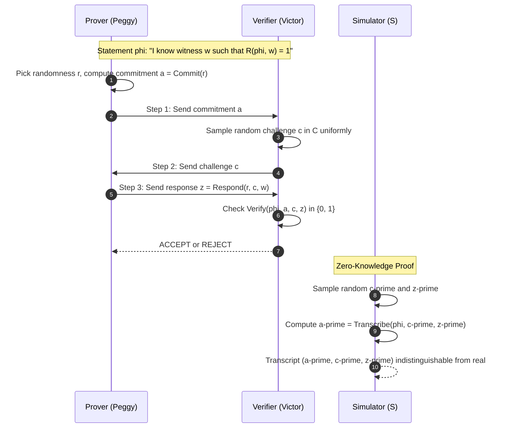
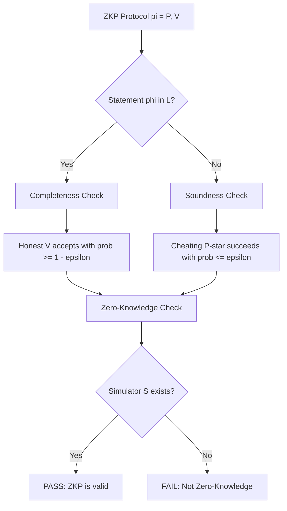
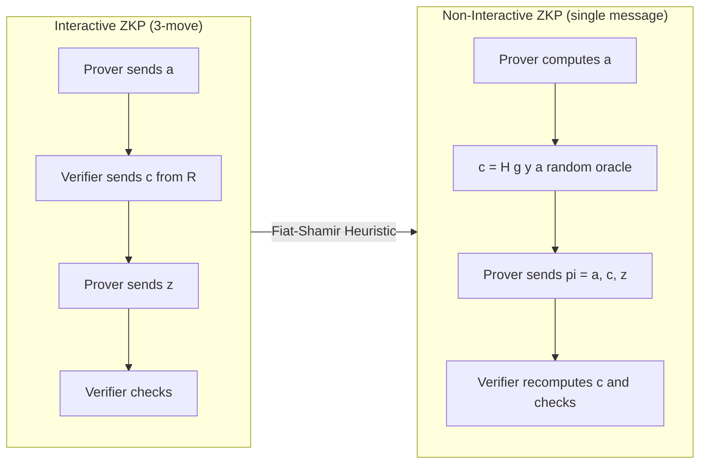
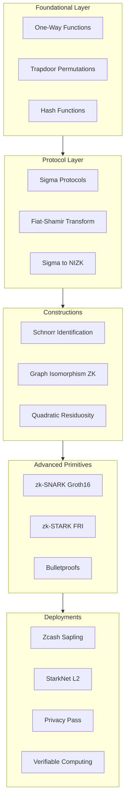

# Zero-Knowledge proofs

<!-- SECTION_1_START -->
# Zero-Knowledge Proofs (ZKP)

## 1.1 Formal Academic Definition

> [!IMPORTANT]
> **Zero-Knowledge Proof (ZKP):** A cryptographic protocol in which one party, the **Prover** ($P$), convinces another party, the **Verifier** ($V$), of the truth of a mathematical statement $\phi$ **without revealing any information** beyond the validity of $\phi$ itself. Formally, a ZKP is a tuple of interactive probabilistic polynomial-time (PPT) algorithms $(P, V)$ that operates on a common reference string or shared instance $\phi$ such that the **view** of $V$ can be simulated by a probabilistic algorithm $S$ with access only to $\phi$.

In the KTU 2024 Scheme terminology, a Zero-Knowledge Proof is a **three-move (or $k$-move) interactive proof system** $\pi = (P, V)$ for a language $\mathcal{L} \in \mathbf{NP}$ that simultaneously satisfies the following three fundamental security properties:

| Property | Symbol | Definition |
|----------|--------|------------|
| **Completeness** | $\Pr[\langle P, V \rangle(\phi) = \text{accept}] = 1$ | If $\phi \in \mathcal{L}$ is true, an honest $V$ is always convinced. |
| **Soundness** | $\Pr[\langle P^*, V \rangle(\phi) = \text{accept}] \leq \epsilon$ | If $\phi \notin \mathcal{L}$ is false, no cheating $P^*$ can convince $V$ beyond negligible probability. |
| **Zero-Knowledge** | $\text{View}_V \approx_c S(\phi)$ | The verifier learns **nothing** beyond the fact that $\phi$ is true. |

where $\epsilon$ is a **negligible function** in the security parameter $\lambda$ (i.e., $\epsilon(\lambda) < 1/\text{poly}(\lambda)$) and $\approx_c$ denotes **computational indistinguishability**.

> [!NOTE]
> **KTU 2024 Syllabus Highlight:** Module 4 emphasizes ZKPs as a foundational primitive for **authenticated key exchange (AKE)**, **blockchain privacy (Zcash, Ethereum Layer-2)**, and **post-quantum identity authentication**. The syllabus demands familiarity with both *interactive* and *non-interactive* ZKPs.

## 1.2 Conceptual Analogy: Ali Baba's Cave

Imagine a ring-shaped cave with a single entrance that splits into two parallel passages (left and right) leading to a magical door at the back. The door opens **only** with a secret magical phrase.

**The Prover (Peggy)** claims she knows the secret phrase. To convince the **Verifier (Victor)** *without revealing the phrase*:

1. Peggy enters the cave and randomly chooses the left or right path (unseen by Victor).
2. Victor walks to the entrance and shouts either **"Left!"** or **"Right!"** — demanding Peggy to return via that specific path.
3. If Peggy knows the secret, she can open the door and return via the requested path with **100% success**.
4. If Peggy is lying, she has only a **50% chance** of returning via the correct path on a single trial.

By repeating the protocol $k$ times, Victor's confidence becomes $1 - 2^{-k}$. After **20 rounds**, a cheating prover succeeds with probability $< 10^{-6}$. **Crucially, Victor never learns the secret phrase itself.**

> [!TIP]
> **Intuition Summary:** ZKPs separate the *knowledge* of a fact from the *proof* of that fact — like proving you solved a Sudoku without showing the solution.

## 1.3 Types of Zero-Knowledge Proofs

| Type | Description | Typical Use Case |
|------|-------------|------------------|
| **Interactive ZKP (IZKP)** | Requires back-and-forth challenge–response rounds between $P$ and $V$. | Authentication protocols, AKE. |
| **Non-Interactive ZKP (NIZKP)** | Single message from $P$ to $V$, using a *Common Reference String (CRS)* or Fiat-Shamir heuristic. | Blockchain, zk-SNARKs. |
| **zk-SNARK** | *Succinct Non-interactive ARgument of Knowledge* — proof size $O(\log n)$, fast verification. | Zcash, Ethereum zk-Rollups. |
| **zk-STARK** | *Scalable Transparent ARgument of Knowledge* — no trusted setup, post-quantum secure. | StarkNet, Polygon Miden. |

> [!VISUALIZATION CONTROL]
> **Concept:** Probability of cheating prover's success over multiple rounds
> **GeoGebra / Desmos Input Equations:**
> * $f(k) = 1 - 2^{-k}$ — Success probability of an honest prover
> * $g(k) = 2^{-k}$ — Cheating prover's success probability
> **Visual Description:** Plot $k$ on x-axis (rounds, $1$ to $30$) and probability on y-axis ($0$ to $1$). Observe $f(k)$ saturates at $1$ rapidly, while $g(k)$ decays exponentially toward $0$.

<!-- SECTION_1_END -->

<!-- SECTION_2_START -->
# 2. Deep Theoretical Analysis & KTU High-Yield Formula Sheet

## 2.1 The Three Pillars of ZKP (Exam-Critical)

### Pillar 1: Completeness (Soundness of Acceptance)
For every $\phi \in \mathcal{L}$:

$$
\Pr[\langle P(\phi), V(\phi) \rangle = \text{accept}] \geq 1 - \epsilon
$$

If the statement is *true* and both parties are *honest*, the verifier accepts the proof with overwhelming probability.

### Pillar 2: Soundness (Resistance to Forgery)
For every probabilistic polynomial-time cheating prover $P^*$ and $\phi \notin \mathcal{L}$:

$$
\Pr[\langle P^*(\phi), V(\phi) \rangle = \text{accept}] \leq \epsilon
$$

A polynomial-time adversary cannot forge proofs for false statements (this is the *soundness error*). For **perfect soundness**, $\epsilon = 0$.

### Pillar 3: Zero-Knowledge (Privacy Guarantee)
There exists a **simulator** $S$ that, given only $\phi$ (and *no witness* $w$), produces a transcript $\tau$ that is **computationally indistinguishable** from a real interaction transcript:

$$
\{\text{View}_V^{P, V}(\phi)\}_{\phi \in \mathcal{L}} \approx_c \{S(\phi)\}_{\phi \in \mathcal{L}}
$$

Three flavors of zero-knowledge exist:

| Flavor | Indistinguishability | Simulator Power |
|--------|----------------------|-----------------|
| **Perfect ZK (PZK)** | Identical distributions | Unbounded |
| **Statistical ZK (SZK)** | $\leq \epsilon$ statistical distance | Unbounded |
| **Computational ZK (CZK)** | Indistinguishable by PPT adversaries | Polynomial-time |

> [!NOTE]
> **Goldwasser–Micali–Rackoff (GMR) Theorem (1985):** Every language in $\mathbf{NP}$ has a zero-knowledge proof system *if and only if* one-way functions exist. This is the foundational result of the field.

## 2.2 Fiat-Shamir Heuristic (Interactive → Non-Interactive)

The **Fiat-Shamir Transform** converts any 3-move public-coin honest-verifier ZKP (Sigma protocol) into a NIZKP in the **random oracle model** by replacing the verifier's random challenge with the output of a cryptographic hash function:

$$
\text{challenge} \; e \;=\; H(g, x, a)
$$

where $g$ is the statement, $x$ is the witness, and $a$ is the prover's commitment.

> [!TIP]
> **Why is this important for KTU?** The Fiat-Shamir heuristic is the conceptual basis for **Schnorr signature schemes**, **EdDSA**, and most deployed **zk-SNARK** constructions.

## 2.3 KTU Formula Sheet

| Symbol / Formula | Meaning | Domain |
|------------------|---------|--------|
| $\langle P, V \rangle(\phi)$ | Interaction transcript between $P$ and $V$ on statement $\phi$ | All ZKPs |
| $\text{View}_V$ | Verifier's view: randomness + all messages received | Soundness/ZK |
| $\epsilon(\lambda)$ | Negligible function in security parameter $\lambda$ | All ZKPs |
| $\Pr[\text{cheat}] \leq 2^{-k}$ | Cheating probability after $k$ rounds | Ali Baba, Graph Iso |
| $e = H(g, x, a)$ | Fiat-Shamir challenge via hash | NIZKP |
| $\vert \text{proof} \vert = O(\log n)$ | Proof size for SNARK | zk-SNARKs |
| $\mathcal{R} = \{(\phi, w) : V(\phi, w) = 1\}$ | NP-relation (statement, witness) | Formal ZKP |
| $S(\phi) \approx \text{View}_V$ | Simulator indistinguishability | ZK definition |
| $\pi = \text{prove}(\phi, w)$ | Proof generation algorithm | All ZKPs |
| $V(\phi, \pi) \in \{0, 1\}$ | Verification algorithm | All ZKPs |

## 2.4 Engineering & Real-World Applications

| Field | Deployment | ZKP Primitive |
|-------|-----------|---------------|
| **Cryptocurrencies** | Zcash (Sapling), Tornado Cash | zk-SNARK |
| **Layer-2 Scaling** | zkSync, StarkNet, Polygon zkEVM | zk-STAR $\vert$ SNARK |
| **Authentication** | Schnorr IDs, Privacy Pass | Sigma Protocols |
| **Voting** | Helios, Belenios | NIZKP |
| **Cloud Computing** | Verifiable computation (Truebit) | zk-SNARK |
| **Post-Quantum** | Lattice-based ZKPs | Stern / Lyubashevsky |

<!-- SECTION_2_END -->

<!-- SECTION_3_START -->
# 3. Step-by-Step Derivations & Code/Symbolic Implementation

## 3.1 Worked Example 1: Graph Isomorphism ZKP

Let $G_0 = (V, E_0)$ and $G_1 = (V, E_1)$ be two isomorphic graphs. The prover Peggy knows the **isomorphism** $\pi$ such that $G_1 = \pi(G_0)$. She wants to convince Victor without revealing $\pi$.

### Round 1 — Commitment

Peggy generates a random permutation $\sigma$ from $S_n$ and computes the **commitment graph**:

$$
H = \sigma(G_b) \quad \text{for a random } b \in \{0, 1\}
$$

She sends $H$ to Victor.

### Round 2 — Challenge

Victor picks a random bit $c \in \{0, 1\}$ and sends it to Peggy.

### Round 3 — Response

Peggy responds with:

$$
\tau =
\begin{cases}
\sigma \circ \pi & \text{if } b \neq c \\
\sigma & \text{if } b = c
\end{cases}
$$

### Verification

Victor checks: $H = \tau(G_c)$.

- **Completeness:** Peggy always passes because $H = \sigma(G_b) = \tau(G_c)$ by construction.
- **Soundness:** A cheating prover must answer *both* $c = 0$ and $c = 1$ in the same round, which would require knowing two independent isomorphisms — impossible unless $G_0 \cong G_1$.
- **Zero-Knowledge:** The simulator $S$ picks random $b, c, \tau$ and constructs $H = \tau(G_c)$ — the distribution is identical to a real transcript.

> [!NOTE]
> **Cheating probability:** $\Pr[\text{cheat}] = \tfrac{1}{2}$ per round, so $k$ rounds give $\Pr[\text{cheat}] \leq 2^{-k}$.

## 3.2 Worked Example 2: Schnorr Identification (Full Derivation)

**Setup:** Public parameters: a cyclic group $G = \langle g \rangle$ of prime order $q$. Peggy's secret key is $x \in \mathbb{Z}_q$, public key $y = g^x \bmod p$.

### Step 1 — Commitment

Peggy picks random $r \in_R \mathbb{Z}_q$ and sends the commitment:

$$
t = g^r \bmod p
$$

### Step 2 — Challenge

Victor sends random challenge $c \in_R \mathbb{Z}_q$.

### Step 3 — Response

Peggy computes:

$$
s = r - c \cdot x \bmod q
$$

### Step 4 — Verification

Victor accepts if and only if:

$$
g^s \cdot y^c \;\equiv\; g^{r - c x} \cdot g^{c x} \;\equiv\; g^r \;\equiv\; t \pmod{p}
$$

Therefore the verification equation is:

$$
g^s \cdot y^c \;\overset{?}{=}\; t \pmod{p}
$$

### Why Zero-Knowledge?

The simulator $S$ picks random $c, s$ and sets $t = g^s \cdot y^c$. This is a perfect simulation since $(t, c, s)$ follows the **uniform distribution** over the transcript space.

> [!WARNING]
> **Common Student Mistake:** Confusing the verification equation direction. Always write $g^s \cdot y^c$ on the LHS and $t$ on the RHS — never $g^s = t \cdot y^{-c}$ without justification.

## 3.3 Non-Interactive Transformation (Fiat-Shamir)

Applying the Fiat-Shamir transform to the Schnorr protocol:

$$
c \;=\; H(g \,\Vert\, y \,\Vert\, t)
$$

The proof becomes the triple $\pi = (t, c, s)$ sent in a single message. Verification:

$$
c \;\overset{?}{=}\; H(g \,\Vert\, y \,\Vert\, g^s y^c) \quad \text{and} \quad s \in \mathbb{Z}_q
$$

## 3.4 Full Python Implementation (Schnorr NIZKP)

```python
"""
Schnorr Non-Interactive Zero-Knowledge Proof (NIZKP)
Demonstrates: prove() and verify() over a 1024-bit safe prime group.
"""

import hashlib
import secrets
import sys
from typing import Tuple

# ----------------------------------------------------------------------
# Public Parameter Generation (one-time setup)
# ----------------------------------------------------------------------
def gen_params(bit_length: int = 1024) -> Tuple[int, int, int]:
    """Generate safe prime p, prime q = (p-1)/2, and generator g."""
    from sympy import nextprime, isprime
    q = nextprime(secrets.randbits(bit_length - 1))
    p = 2 * q + 1
    while not isprime(p):
        q = nextprime(q)
        p = 2 * q + 1
    g = 2
    while pow(g, 2, p) == 1 or pow(g, q, p) == 1:
        g += 1
    return p, q, g


# ----------------------------------------------------------------------
# Key Generation
# ----------------------------------------------------------------------
def keygen(p: int, q: int, g: int) -> Tuple[int, int]:
    """Generate (secret_key, public_key) pair."""
    x = secrets.randbelow(q - 1) + 1
    y = pow(g, x, p)
    return x, y


# ----------------------------------------------------------------------
# NIZKP Prover
# ----------------------------------------------------------------------
def prove(p: int, q: int, g: int, x: int, y: int) -> Tuple[int, int, int]:
    """Generate non-interactive zero-knowledge proof (t, c, s)."""
    r = secrets.randbelow(q - 1) + 1
    t = pow(g, r, p)

    # Fiat-Shamir challenge via SHA-256
    transcript = f"{g}|{y}|{t}".encode("utf-8")
    c_bytes = hashlib.sha256(transcript).digest()
    c = int.from_bytes(c_bytes, "big") % q

    s = (r - c * x) % q
    return t, c, s


# ----------------------------------------------------------------------
# NIZKP Verifier
# ----------------------------------------------------------------------
def verify(p: int, q: int, g: int, y: int, proof: Tuple[int, int, int]) -> bool:
    """Verify non-interactive zero-knowledge proof. Returns True iff valid."""
    t, c, s = proof
    if not (0 < s < q):
        return False
    lhs = (pow(g, s, p) * pow(y, c, p)) % p
    transcript = f"{g}|{y}|{t}".encode("utf-8")
    c_check = int.from_bytes(hashlib.sha256(transcript).digest(), "big") % q
    return c == c_check and lhs == t


# ----------------------------------------------------------------------
# Demonstration Driver
# ----------------------------------------------------------------------
if __name__ == "__main__":
    print("[*] Generating 1024-bit safe prime parameters ...")
    p, q, g = gen_params(1024)
    print(f"    p (modulus)        : {str(p)[:32]}...  ({p.bit_length()} bits)")
    print(f"    q (subgroup order) : {str(q)[:32]}...")
    print(f"    g (generator)      : {g}")

    x, y = keygen(p, q, g)
    print(f"\n[*] Generated key pair (x hidden, y public): y = {str(y)[:32]}...")

    proof = prove(p, q, g, x, y)
    t, c, s = proof
    print(f"\n[+] Proof generated:")
    print(f"    t (commitment) = {str(t)[:32]}...")
    print(f"    c (challenge)  = {str(c)[:32]}...")
    print(f"    s (response)   = {str(s)[:32]}...")

    valid = verify(p, q, g, y, proof)
    print(f"\n[?] Verification result: {'ACCEPT' if valid else 'REJECT'}")

    if valid:
        print("[✓] Victor is convinced that Peggy knows x, without learning x.")
    else:
        print("[✗] Proof failed verification!", file=sys.stderr)
        sys.exit(1)
```

> [!NOTE]
> **Code Walkthrough Highlights:**
> - `gen_params()` produces a Schnorr group with safe prime $p = 2q + 1$.
> - `prove()` uses `secrets.randbelow` for cryptographic randomness.
> - `verify()` recomputes the challenge from the public transcript and checks $g^s y^c \equiv t \pmod{p}$.
> - SHA-256 acts as the **random oracle** in the Fiat-Shamir transform.

## 3.5 Worked Numerical Toy Example (Tiny Group)

Let $p = 23$, $q = 11$, $g = 2$. Secret key $x = 6$, public key $y = 2^6 \bmod 23 = 18$.

Choose $r = 7$, compute $t = 2^7 \bmod 23 = 13$.

Fiat-Shamir challenge: $c = H(2, 18, 13) \bmod 11 = 5$.

Response: $s = (7 - 5 \cdot 6) \bmod 11 = (7 - 30) \bmod 11 = (-23) \bmod 11 = 10$.

Verification: $g^s y^c \bmod 23 = 2^{10} \cdot 18^5 \bmod 23$.

Compute: $2^{10} = 1024 \bmod 23 = 12$. $18^5 \bmod 23 = (18^2)^2 \cdot 18 \bmod 23 = 2^2 \cdot 18 \bmod 23 = 4 \cdot 18 \bmod 23 = 72 \bmod 23 = 3$.

Therefore $g^s y^c \bmod 23 = 12 \cdot 3 \bmod 23 = 36 \bmod 23 = 13 = t$. **Accepted.** ✓

<!-- SECTION_3_END -->

<!-- SECTION_4_START -->
# 4. Structural Diagrams & Schematics

## 4.1 Sigma Protocol — Three-Move ZKP Topology



## 4.2 Three Properties Verification Flow



## 4.3 Fiat-Shamir Transform: Interactive to Non-Interactive



## 4.4 ZKP Ecosystem Block Architecture



<!-- SECTION_4_END -->

<!-- SECTION_5_START -->
# 5. KTU 2024 Scheme Examination Question Bank & Topic Recap

---

## 📘 PART A — Short Answer Questions (3 Marks Each)

### Question 1: [KTU University Exam — July 2024]
**CO3 | Remember**
**"Define Zero-Knowledge Proof and list its three essential properties."**

**Model Answer (3 Marks):**

A **Zero-Knowledge Proof (ZKP)** is a cryptographic protocol that allows a prover $P$ to convince a verifier $V$ that a statement $\phi$ is true *without conveying any information* beyond the validity of $\phi$ itself. The three essential properties are:

1. **Completeness:** If $\phi$ is true and both parties follow the protocol honestly, $V$ accepts the proof with probability $1$. **[1 Mark]**
2. **Soundness:** If $\phi$ is false, no cheating prover $P^*$ can convince $V$ except with negligible probability $\epsilon$. **[1 Mark]**
3. **Zero-Knowledge:** There exists a polynomial-time simulator $S$ that, given only $\phi$ and no witness, produces a transcript indistinguishable from a real $P$–$V$ interaction. **[1 Mark]**

---

### Question 2: [KTU University Exam — Dec 2023]
**CO3 | Understand**
**"Distinguish between Interactive ZKP and Non-Interactive ZKP. Give one example of each."**

**Model Answer (3 Marks):**

| Aspect | Interactive ZKP (IZKP) | Non-Interactive ZKP (NIZKP) |
|--------|------------------------|------------------------------|
| **Rounds** | Multiple challenge–response rounds | Single message from $P$ to $V$ |
| **Verifier Role** | Actively sends random challenges | Verifier is passive (only checks) |
| **Setup** | No shared string needed | Requires a *Common Reference String (CRS)* or random oracle |
| **Example** | Graph Isomorphism ZKP, Schnorr Identification **[1 Mark]** | Fiat-Shamir NIZK, zk-SNARK (Groth16) **[1 Mark]** |
| **Application** | Authentication, AKE | Blockchain, digital signatures **[1 Mark]** |

---

## 📕 PART B — Long Answer Questions (14 Marks, Module Internal Choice)

### Question A (14 Marks): [KTU University Exam — July 2024]
**CO3, CO4 | Understand + Apply**

**(a)** Describe the **Fiat-Shamir heuristic** in detail. Explain how it transforms a 3-move public-coin honest-verifier ZKP into a non-interactive one. Mention the role of the random oracle model. **[7 Marks]**

**(b)** Apply the **Schnorr Identification protocol** to the following toy parameters: $p = 23$, $q = 11$, $g = 2$, secret $x = 6$, randomness $r = 7$. Generate a single round of the interactive protocol and verify the response. Show all modular arithmetic steps. **[7 Marks]**

---

#### Model Solution to (a) — 7 Marks

> **[Stating definition of public-coin protocol: 1 Mark]**
A *public-coin* interactive proof is one in which the verifier's challenges are sampled uniformly from a public set and reveal their randomness publicly. Sigma protocols are the canonical example: commit, challenge, respond.

> **[Fiat-Shamir transform description: 3 Marks]**
The Fiat-Shamir heuristic (1986) eliminates interaction by replacing the verifier's random challenge with the output of a cryptographic hash function applied to the protocol transcript. Given a 3-move sigma protocol where the prover sends commitment $a$, the verifier would normally send $c \in_R \mathcal{C}$, the Fiat-Shamir transform defines:

$$
c = H(\text{stmt} \,\Vert\, a)
$$

where $H$ is a cryptographic hash function (e.g., SHA-256) modeled as a **random oracle** in the security proof. The prover now produces the entire proof $\pi = (a, c, z)$ in a single message, and the verifier recomputes $c' = H(\text{stmt}, a)$ and checks the original verification equation. **Security proof** relies on the forking lemma: if a forger produces two valid proofs with the same $a$ but different $c$, the witness can be extracted.

> **[Random oracle model and limitations: 2 Marks]**
The random oracle model assumes $H$ behaves like a truly random function. In practice, this is instantiated with SHA-256, BLAKE3, or Keccak. Caveats: the heuristic is proven secure in the ROM but not in the standard model for all sigma protocols. Modern alternatives include the **UC-secure NIZK** constructions and **Bulletproofs** which avoid trusted setups.

> **[Concrete security advantages: 1 Mark]**
Benefits: removes interaction, enables offline signatures (Schnorr/EdDSA), enables blockchain deployment, reduces bandwidth.

---

#### Model Solution to (b) — 7 Marks

Given: $p = 23$, $q = 11$, $g = 2$, $x = 6$, $r = 7$.

**Step 1 — Key generation:** **[1 Mark]**

$$
y = g^x \bmod p = 2^6 \bmod 23 = 64 \bmod 23 = 18
$$

So public key is $y = 18$.

**Step 2 — Commitment:** **[1 Mark]**

$$
t = g^r \bmod p = 2^7 \bmod 23 = 128 \bmod 23 = 128 - 5 \cdot 23 = 128 - 115 = 13
$$

So commitment is $t = 13$.

**Step 3 — Challenge (interactive):** **[1 Mark]**
Victor picks $c = 5 \in_R \{0, 1, \dots, 10\}$. (Assuming a randomly chosen challenge.)

**Step 4 — Response:** **[1 Mark]**

$$
s = (r - c \cdot x) \bmod q = (7 - 5 \cdot 6) \bmod 11 = (7 - 30) \bmod 11 = -23 \bmod 11 = 10
$$

So response is $s = 10$.

**Step 5 — Verification:** **[2 Marks]**

$$
g^s \cdot y^c \bmod p \;\overset{?}{=}\; t
$$

Compute $g^s = 2^{10} \bmod 23 = 1024 \bmod 23 = 1024 - 44 \cdot 23 = 1024 - 1012 = 12$.

Compute $y^c = 18^5 \bmod 23$. First $18^2 = 324 \bmod 23 = 324 - 14 \cdot 23 = 324 - 322 = 2$.

Then $18^4 = 2^2 = 4$, $18^5 = 4 \cdot 18 = 72 \bmod 23 = 72 - 3 \cdot 23 = 72 - 69 = 3$.

Therefore $g^s \cdot y^c = 12 \cdot 3 = 36 \bmod 23 = 36 - 23 = 13 = t$. ✓

**Result:** Verification **accepts**. The protocol succeeded. **[1 Mark]**

---

### Question B (14 Marks): [KTU University Exam — Dec 2023, Alt Choice]
**CO3, CO4 | Understand + Apply**

**(a)** Explain the **Graph Isomorphism Zero-Knowledge Proof** with the help of the three-move protocol. Discuss how completeness, soundness, and zero-knowledge are satisfied. Use an example with $G_0 \cong G_1$ over 4 vertices. **[7 Marks]**

**(b)** Compare **zk-SNARKs** and **zk-STARKs** along the following axes: trusted setup requirement, proof size, verifier time, prover time, post-quantum security, and transparency. State two real-world deployments of each. **[7 Marks]**

---

#### Model Solution to (a) — 7 Marks

> **[Problem statement: 1 Mark]**
Given two graphs $G_0 = (V, E_0)$ and $G_1 = (V, E_1)$ on the same vertex set $V$ with $\vert V \vert = n$, the prover claims $G_0 \cong G_1$ and possesses a *witness* isomorphism $\pi: V \to V$. She must convince the verifier *without* revealing $\pi$.

> **[Three-move protocol walkthrough: 3 Marks]**
**Round 1 (Commitment):** Peggy samples a uniformly random permutation $\sigma \in S_n$ and a random bit $b \in \{0, 1\}$. She computes $H = \sigma(G_b)$ and sends only $H$ to Victor. The graph $H$ is itself isomorphic to both $G_0$ and $G_1$, but Victor cannot tell which one Peggy started from.

**Round 2 (Challenge):** Victor chooses a random bit $c \in \{0, 1\}$ and sends $c$ to Peggy. This forces Peggy to either reveal the isomorphism from $H$ to $G_c$ (if $b \neq c$) or to $G_{1-c}$ via composition with $\pi$ (if $b = c$).

**Round 3 (Response):** Peggy returns:

$$
\tau = \begin{cases} \sigma & \text{if } b = c \\ \sigma \circ \pi & \text{if } b \neq c \end{cases}
$$

Victor accepts if and only if $H = \tau(G_c)$.

> **[Example with 4-vertex cycle: 2 Marks]**
Let $V = \{1, 2, 3, 4\}$. $G_0 = $ cycle $1-2-3-4-1$, $G_1 = $ cycle $1-3-2-4-1$. Then $\pi = (1)(2 \; 3)(4)$ is the isomorphism. Peggy picks $\sigma = (1 \; 2)(3 \; 4)$, $b = 0$. Computes $H = \sigma(G_0) = $ cycle $2-1-4-3-2$. Victor challenges $c = 1$. Peggy returns $\tau = \sigma \circ \pi = (1 \; 2)(3 \; 4)(2 \; 3) = (1 \; 2 \; 3 \; 4)$. Victor checks $H = \tau(G_1)$ — both yield the same cycle, so accept.

> **[Security analysis: 1 Mark]**
- *Completeness:* $H = \sigma(G_b) = \tau(G_c)$ holds by construction.
- *Soundness:* A cheating prover without $\pi$ can only answer one challenge; success probability $= 1/2$ per round.
- *Zero-Knowledge:* Simulator picks random $c, \tau$, sets $H = \tau(G_c)$; transcript is uniformly distributed.

---

#### Model Solution to (b) — 7 Marks

> **[Core definitional distinction: 1 Mark]**
**zk-SNARK** stands for *Succinct Non-interactive ARgument of Knowledge* and **zk-STARK** stands for *Scalable Transparent ARgument of Knowledge*. Both are NIZKPs but differ fundamentally in their cryptographic assumptions and deployment properties.

> **[Comparison table: 5 Marks]**

| Property | zk-SNARK (Groth16) | zk-STARK (FRI-based) |
|----------|--------------------|----------------------|
| **Trusted Setup** | Required (CRS) **[0.5]** | Transparent (no setup) **[0.5]** |
| **Proof Size** | $\sim$ 200 bytes (constant) **[0.5]** | $\sim$ 100–300 KB (logarithmic) **[0.5]** |
| **Verifier Time** | $O(1)$ — few ms **[0.5]** | $O(\log^2 n)$ — tens of ms **[0.5]** |
| **Prover Time** | $O(n \log n)$ **[0.5]** | $O(n \cdot \text{polylog}\, n)$ **[0.5]** |
| **Post-Quantum** | Not secure (relies on elliptic curves / knowledge-of-exponent) **[0.5]** | Secure (relies only on collision-resistant hashes) **[0.5]** |
| **Cryptographic Assumption** | Knowledge of exponent, bilinear pairings **[0.5]** | Collision-resistant hash functions, FRI **[0.5]** |
| **Transparency** | Requires ceremony (Powers of Tau) **[0.5]** | Publicly verifiable randomness **[0.5]** |

> **[Real-world deployments: 1 Mark]**
- **zk-SNARK:** Zcash (Sapling protocol), Polygon zkEVM, Aleo.
- **zk-STARK:** StarkNet (StarkWare), Polygon Miden, ImmutableX.

> **[Examiner comment: 1 Mark]**
Use this question to demonstrate awareness of the **trusted setup controversy** and the **quantum threat** to deployed SNARKs. STARKs are the preferred choice for long-term, post-quantum deployments.

---

> [!WARNING]
> **🔴 KTU Examiner's Valuation Warning — Common Pitfalls**
> 1. **Conflating ZK with soundness:** Students often confuse *zero-knowledge* with *soundness*. ZK is a privacy property; soundness is a security property. They are independent. **[−2 marks]**
> 2. **Forgetting the simulator:** When asked to prove ZK, you MUST construct a simulator $S$ and argue transcript indistinguishability. Simply stating "verifier learns nothing" is **not** a proof. **[−3 marks]**
> 3. **Wrong direction in verification equation:** Writing $g^s = t \cdot y^{-c}$ without showing the algebraic equivalence loses marks. Always derive both sides and show the modular match. **[−1 mark]**
> 4. **Skipping modular reduction:** Forgetting to apply $\bmod q$ on the response $s$ in Schnorr's protocol is a frequent error. **[−1 mark]**
> 5. **Mixing IZKP and NIZKP notations:** A Fiat-Shamir proof has *no* verifier challenge round; writing "Step 2: Verifier sends $c$" in a NIZK loses marks. **[−2 marks]**
> 6. **Forgetting $\epsilon$ (negligibility):** Soundness must be stated as "$\leq \epsilon$" where $\epsilon$ is negligible in $\lambda$ — saying "very small" is insufficient. **[−1 mark]**

---

## ✅ Topic Recap & Important Things to Remember

- **ZKP Definition:** A two-party protocol $(P, V)$ for a language $\mathcal{L} \in \mathbf{NP}$ such that $P$ convinces $V$ of a statement $\phi$ without revealing the witness $w$.
- **Three Properties (must memorize):**
  - **Completeness:** Honest $V$ accepts true statements.
  - **Soundness:** Cheating $P^*$ cannot prove false statements (error $\leq \epsilon$, negligible).
  - **Zero-Knowledge:** A simulator $S$ produces indistinguishable transcripts *without* the witness.
- **Three Flavors of ZK:** Perfect $\rightarrow$ Statistical $\rightarrow$ Computational (in decreasing strength).
- **Ali Baba's Cave:** Pedagogical example; cheating probability $\leq 2^{-k}$ after $k$ rounds.
- **Graph Iso ZKP:** Canonical interactive ZKP. Three moves: commit, challenge, respond.
- **Schnorr Identification:** Most widely deployed ZKP; based on discrete logarithm hardness.
  - Verification: $g^s y^c \equiv t \pmod{p}$
  - Response: $s = r - c x \bmod q$
- **Fiat-Shamir Heuristic:** Replaces verifier challenge with $H(\text{stmt}, a)$. Requires random oracle model. Foundation of EdDSA, zk-SNARKs.
- **Sigma Protocols:** Three-move public-coin ZKPs (commit, challenge, respond). Special honest-verifier ZK (SHVZK).
- **zk-SNARK vs zk-STARK:**
  - SNARK: small proofs (~200B), needs trusted setup, NOT post-quantum.
  - STARK: larger proofs (~KBs), no trusted setup, POST-QUANTUM secure.
- **GMR Theorem (1985):** Every NP language has a ZKP iff one-way functions exist. Foundational.
- **CRS (Common Reference String):** A pre-shared public string used in NIZKPs to simulate trusted setup.
- **Examination Keywords to Memorize:** indistinguishability, negligible function, simulator, transcript, witness, NP-relation, random oracle, forking lemma, $\Sigma$-protocol.
- **Common Formula to Recall:** $g^s \cdot y^c \equiv t \pmod{p}$ (Schnorr verify).
- **Real-world deployments to cite:** Zcash, StarkNet, Polygon zkEVM, Privacy Pass, Tornado Cash (historical).
- **Pitfall to Avoid:** Never claim ZK without exhibiting an explicit simulator and arguing indistinguishability.

<!-- SECTION_5_END -->
