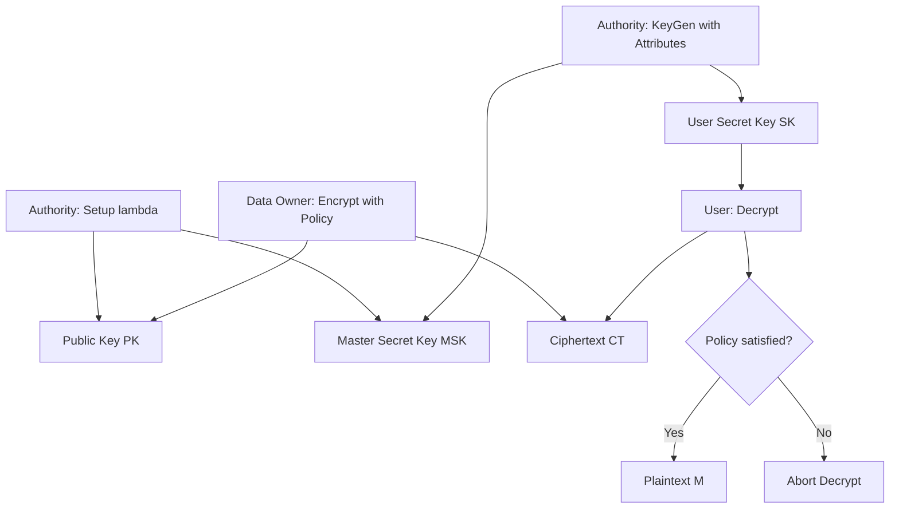
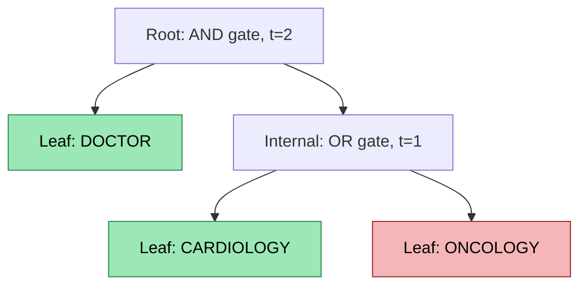
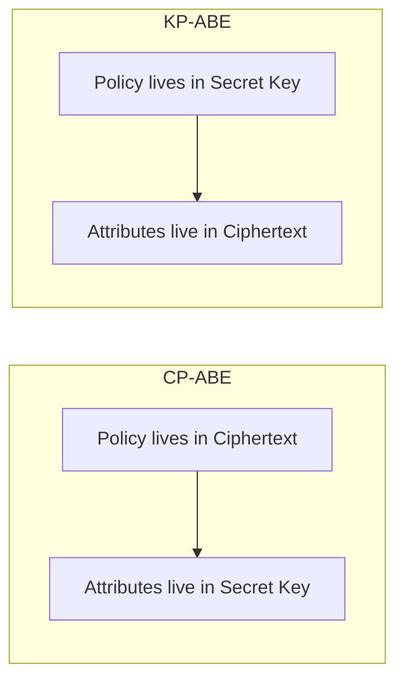
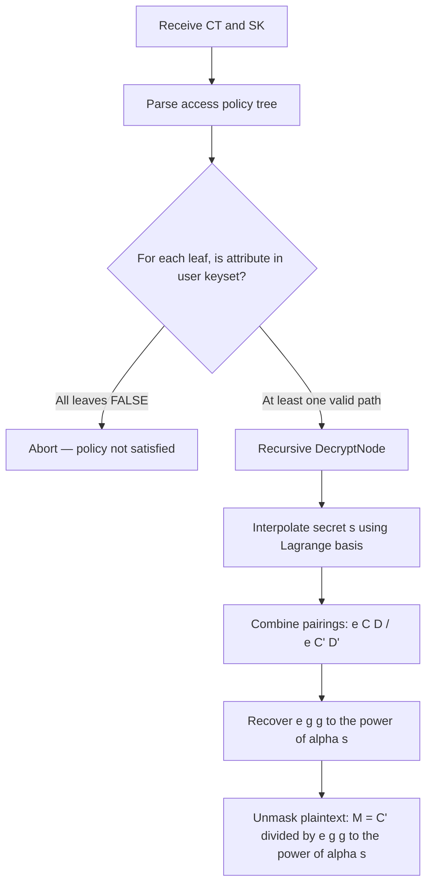

# Attribute-based encryption

<!-- SECTION_1_START -->
# Attribute-Based Encryption (ABE)

## 1. Formal Academic Definition

> [!IMPORTANT]
> **Attribute-Based Encryption (ABE)** is a public-key cryptographic primitive in which the decryption capability of a user is determined by a **policy** expressed over a set of descriptive **attributes** (e.g., role, department, clearance level, age) rather than by a unique identity or certificate. It generalizes Identity-Based Encryption (IBE), Fuzzy IBE (FIBE), and broadcast encryption into a single unified framework where **one ciphertext can be decrypted by many users whose attributes satisfy the embedded access policy**.

The two principal families standardized in the cryptographic literature (and referenced in the KTU PECST74A Module 5 syllabus) are:

1. **Ciphertext-Policy ABE (CP-ABE)** – The *ciphertext* is associated with an **access policy** $ \mathbb{A} $, and a user's **secret key** is bound to a set of attributes $ S $. Decryption succeeds iff $ \mathbb{A}(S) = 1 $.
2. **Key-Policy ABE (KP-ABE)** – The **secret key** embeds an access policy $ \mathbb{A} $, and the **ciphertext** is tagged with a set of attributes $ S $. Decryption succeeds iff $ \mathbb{A}(S) = 1 $.

The foundational construction was proposed by **Sahai and Waters (2005)** as Fuzzy IBE, then refined into full CP-ABE by **Bethencourt, Sahai and Waters (BSW, 2007)**, and into KP-ABE by **Goyal, Pandey, Sahai and Waters (GPSW, 2006)**.

> [!NOTE]
> **Core Mathematical Engine:** ABE schemes are built on top of **bilinear pairings** (Weil or Tate pairings) over elliptic curve groups, written as $ e : \mathbb{G}_0 \times \mathbb{G}_0 \rightarrow \mathbb{G}_1 $, satisfying **bilinearity**, **non-degeneracy**, and **computability**.

---

## 2. Intuitive Overview — A Real-World Analogy

> [!TIP]
> **Conceptual Analogy — The "Movie Ticket" System**
>
> Imagine a cinema complex where, instead of buying a specific ticket for a specific show, you buy a single **cryptographic movie pass**. The pass contains a hidden **policy stamp** like: *"Action AND (Hollywood OR Bollywood) AND (Year $\geq$ 2020)"*. A user holds a personal smart card with **attributes** printed on it — e.g., `genre=Action`, `industry=Hollywood`, `year=2024`. The card contains a **secret key** generated from these attributes.
>
> When you swipe the card, the cinema's reader runs a pairing-based mathematical check. **If your attributes satisfy the policy stamp, the projector unlocks; otherwise the screen stays black.** The cinema owner never needs to know *who* you are, only *what properties* your card carries.

### GeoGebra / Desmos Visualization

> [!VISUALIZATION CONTROL]
> **Concept:** Access Tree for a CP-ABE Policy `[A AND (B OR C)]`
> **Desmos Input (graph the boolean expression as a binary tree):**
> * Root node label: `AND` (threshold $t=2$ of 2 children)
> * Left child leaf: attribute `A` (Dept = CSE)
> * Right child node label: `OR` (threshold $t=1$ of 2 children)
> * Right-left leaf: attribute `B` (Year $\geq 3$)
> * Right-right leaf: attribute `C` (CGPA $\geq 8.0$)
> **Visual Description:** Plot a vertical tree with `AND` at the top, splitting into `A` and `OR`, where `OR` further splits into `B` and `C`. Highlight the satisfied leaves (e.g., `A=TRUE`, `B=FALSE`, `C=TRUE`) — since `OR` is satisfied, the whole tree returns `TRUE`.

---

## 3. Why ABE Matters — Engineering Relevance

| Domain | Use Case | Reason ABE is Preferred |
| :--- | :--- | :--- |
| Cloud Storage (AWS, Azure) | Encrypt patient EHR with policy `Doctor AND (Cardiology OR Oncology)` | Data owner defines policy; cloud cannot learn data |
| IoT / Smart Grids | Device attributes gate access to firmware updates | One ciphertext, many legitimate decryptors |
| Blockchain Wallets | Policy-based access to smart-contract governed funds | Decentralized trust, no central key server |
| Military / Defence | Multi-level security (MLS) document dissemination | Top-Secret, Secret, Confidential tiers as attributes |

> [!IMPORTANT]
> **Standard Reference Metric:** The flagship CP-ABE scheme (BSW07) works in a **symmetric bilinear group** of order $p$ (a large prime, typically $|p| = 160$ bits) and yields ciphertexts of size $O(n)$ group elements, where $n$ is the number of attributes in the access formula.
<!-- SECTION_1_END -->

<!-- SECTION_2_START -->
# Deep Theoretical Analysis & KTU High-Yield Formula Sheet

## 1. Building Block — Bilinear Pairings

A bilinear pairing is a map

$$
e : \mathbb{G}_0 \times \mathbb{G}_0 \longrightarrow \mathbb{G}_1
$$

where $\mathbb{G}_0$ and $\mathbb{G}_1$ are cyclic groups of prime order $p$, and $g$ is a generator of $\mathbb{G}_0$. The pairing must satisfy three axioms:

* **Bilinearity:** $e(g^{a}, g^{b}) = e(g, g)^{ab}$ for all $a, b \in \mathbb{Z}_p$.
* **Non-degeneracy:** $e(g, g) \neq 1_{\mathbb{G}_1}$.
* **Computability:** There exists an efficient algorithm to compute $e(\cdot, \cdot)$.

> [!NOTE]
> **Practical Implication:** The bilinearity is the *only algebraic property* that lets the decryptor "cancel" the secret components attached to attributes with the policy components attached to the ciphertext. Without it, policy evaluation inside the exponent is mathematically impossible.

---

## 2. Access Structures

An **access structure** $\mathbb{A}$ is a collection of non-empty subsets of a universe of attributes $U = \{1, 2, \dots, n\}$. A set $S \subseteq U$ is **authorized** iff $S \in \mathbb{A}$. A **monotone** access structure is one in which any superset of an authorized set is also authorized. CP-ABE access policies are typically described as **monotone access trees**.

### 2.1 Threshold Gates

A $(t, n)$-threshold gate (denoted `TH(t, of=n)`) represents an internal node of the access tree. The node is satisfied iff at least $t$ of its $n$ children evaluate to `TRUE`.

* `AND` gate $\equiv$ `TH(n, of=n)`
* `OR` gate $\equiv$ `TH(1, of=n)`

### 2.2 Linear Secret Sharing Scheme (LSSS)

A more efficient representation of access policies uses an **LSSS matrix** $M \in \mathbb{Z}_p^{\ell \times n}$. The scheme is defined by two algorithms:

* **Share:** Distribute secret $s \in \mathbb{Z}_p$ as shares $s_i = M_i \cdot \vec{v}$ where $\vec{v} = (s, v_2, \dots, v_n)$ is random.
* **Reconstruct:** An authorized set $S$ has reconstruction coefficients $\{\omega_i\}_{i \in I}$ such that $\sum_{i \in I} \omega_i M_i = (1, 0, \dots, 0)$, hence $\sum \omega_i s_i = s$.

---

## 3. The BSW07 CP-ABE Scheme — Algorithm Suite

The BSW07 scheme has four probabilistic polynomial-time (PPT) algorithms:

### 3.1 $\text{Setup}(\lambda) \rightarrow (\text{PK}, \text{MSK})$

* Choose bilinear group $\mathbb{G}_0$ of prime order $p$, generator $g$.
* Pick random $\alpha, \beta \in \mathbb{Z}_p^*$.
* **Public Key (PK):** $g, \ h = g^{\beta},\ f = g^{1/\beta},\ e(g, g)^{\alpha}$.
* **Master Secret Key (MSK):** $g^{\alpha}, \beta$.

### 3.2 $\text{Encrypt}(\text{PK}, M, \mathbb{A}) \rightarrow \text{CT}$

* Pick random $s \in \mathbb{Z}_p^*$.
* Compute $C' = M \cdot e(g, g)^{\alpha s}$ and $C = h^s = g^{\beta s}$.
* For every node $x$ in the access tree $\mathbb{A}$, pick a polynomial $q_x$ of degree $d_x$ (one less than threshold $t_x$).
  * Set $q_R(0) = s$ for the root $R$.
  * For each child $x'$ of $x$, set $q_{x'}(0) = q_x(\text{index}(x'))$.
* For each leaf node $x$ (attribute $\gamma$):
  * $C_x = g^{q_x(0)},\ C'_x = H(\gamma)^{q_x(0)}$.

### 3.3 $\text{KeyGen}(\text{MSK}, S) \rightarrow \text{SK}$

* Pick random $r \in \mathbb{Z}_p^*$ and $r_j \in \mathbb{Z}_p^*$ for every attribute $j \in S$.
* $D = g^{(\alpha + r)/\beta}$.
* For each $j \in S$: $D_j = g^{r} \cdot H(j)^{r_j},\ D'_j = g^{r_j}$.

### 3.4 $\text{Decrypt}(\text{CT}, \text{SK}) \rightarrow M$

If $S$ satisfies $\mathbb{A}$:
1. Use polynomial interpolation at the leaves to compute $e(g, g)^{rq_R(0)} = e(g, g)^{rs}$.
2. Compute $A = e(C, D) = e(g^{\beta s}, g^{(\alpha+r)/\beta}) = e(g, g)^{s(\alpha+r)}$.
3. Recover $e(g, g)^{rs}$, then divide: $A / e(g, g)^{rs} = e(g, g)^{\alpha s}$.
4. Output $M = C' / e(g, g)^{\alpha s}$.

---

## 4. KP-ABE (GPSW06) — Skeleton

The GPSW06 KP-ABE scheme mirrors CP-ABE with the policy and attributes swapped:

* **Setup:** Publish $T_i = g^{t_i}$ for each universe attribute $i$.
* **Encrypt:** Tag ciphertext with attribute set $\gamma$ and pick random $s$. $C = M \cdot e(g, g)^{s},\ C_i = T_i^{s}$ for $i \in \gamma$.
* **KeyGen:** Issue a key embedding LSSS matrix $M$ over attributes; secret $y$ is split across rows.
* **Decrypt:** User combines $C_i$ and row keys via the pairing.

---

## 5. KTU Formula Cheat Sheet

| Symbol / Term | Meaning | KTU Use-Case |
| :--- | :--- | :--- |
| $e : \mathbb{G}_0 \times \mathbb{G}_0 \rightarrow \mathbb{G}_1$ | Bilinear pairing map | Defining the crypto group |
| $g, h, f, e(g,g)^{\alpha}$ | Public key components of BSW07 | Setup / Public Parameter |
| $g^{\alpha}, \beta$ | Master secret of BSW07 | Key Generation authority |
| $M \cdot e(g,g)^{\alpha s}$ | Masked message component $C'$ | Confidentiality payload |
| $H : \{0,1\}^* \rightarrow \mathbb{G}_0$ | Hash function mapping attribute strings to group elements | Attribute identifier |
| $q_x(0)$ | Polynomial share at node $x$ | Secret distribution in tree |
| $M_i \cdot \vec{v}$ | LSSS row-share of secret $s$ | LSSS-based policy encoding |
| $\omega_i$ | Reconstruction coefficient | LSSS recovery polynomial |
| $S \in \mathbb{A}$ | Attribute set satisfies policy | Authorization check |
| $t_x, d_x = t_x - 1$ | Threshold and polynomial degree per gate | Tree node definition |

> [!TIP]
> **Valuation Tip:** Examiners award marks for **naming the algorithm** ($\text{Setup}, \text{Encrypt}, \text{KeyGen}, \text{Decrypt}$), **naming the security assumption** (Decisional Bilinear Diffie–Hellman, **DBDH**), and **showing the bilinear equation** $e(g^a, g^b) = e(g,g)^{ab}$ at least once in the solution.

---

## 6. Real-World Engineering Utility

In a production cloud audit-log system, every log line is encrypted under a CP-ABE policy such as `(Role = Auditor) AND (Tenant = ACME) AND (Time-window = 2024-Q4)`. The Attribute Authority (AA) issues secret keys to auditors, scoped to the relevant tenant and quarter. Compromising one auditor's key leaks only their slice — lateral movement requires forging attributes, which is computationally infeasible under the **DBDH assumption** in the random-oracle model.
<!-- SECTION_2_END -->

<!-- SECTION_3_START -->
# Step-by-Step Derivations & Code Implementation

## 1. Derivation — Bilinear Pairing Properties Used in Decryption

We will show, line by line, how BSW07 decryption cancels out the policy components to yield the original message $M$.

> [!IMPORTANT]
> **Decisional Bilinear Diffie–Hellman (DBDH) Assumption:** Given $g, g^{a}, g^{b}, g^{c} \in \mathbb{G}_0$ and $T \in \mathbb{G}_1$, no PPT adversary can decide whether $T = e(g, g)^{abc}$ or $T$ is a random element of $\mathbb{G}_1$ with non-negligible advantage.

### Derivation Walkthrough

Ciphertext component is $C = g^{\beta s}$.
Key component is $D = g^{(\alpha + r)/\beta}$.

Compute the pairing $A$:

$$
\begin{aligned}
A &= e(C, D) \\
  &= e\!\left(g^{\beta s},\; g^{(\alpha + r)/\beta}\right) \\
  &= e(g, g)^{\beta s \cdot (\alpha + r)/\beta} \quad \text{[by bilinearity]} \\
  &= e(g, g)^{s(\alpha + r)} \\
  &= e(g, g)^{\alpha s} \cdot e(g, g)^{rs} \quad \text{[exponent distributes]}
\end{aligned}
$$

The decryptor also computes $B = e(g, g)^{rs}$ via the recursive `DecryptNode` procedure over the satisfied leaves of the access tree. Each leaf contributes $e(C_x, D_{\gamma}) / e(C'_x, D'_{\gamma})$ to the recursive combination.

Subtract $B$ from $A$ inside the pairing target group:

$$
\begin{aligned}
A / B &= \frac{e(g, g)^{\alpha s} \cdot e(g, g)^{rs}}{e(g, g)^{rs}} \\
      &= e(g, g)^{\alpha s}
\end{aligned}
$$

Finally recover the message:

$$
\begin{aligned}
M &= \frac{C'}{A / B} \\
  &= \frac{M \cdot e(g, g)^{\alpha s}}{e(g, g)^{\alpha s}} \\
  &= M
\end{aligned}
$$

This completes the rigorous algebraic recovery.

---

## 2. Derivation — Shamir's Secret Sharing (Foundational for LSSS)

The access tree of BSW07 places a polynomial at every internal node. For a $(t, n)$-threshold gate, we choose a polynomial $q_x(z)$ of degree $t-1$. The reconstruction is Lagrange interpolation:

$$
q_x(0) = \sum_{i \in I} q_x(i) \cdot \Delta_{i, I}(0)
$$

where the Lagrange coefficient is:

$$
\Delta_{i, I}(0) = \prod_{j \in I, \, j \neq i} \frac{j}{j - i}
$$

For example, a $(2, 3)$-threshold with shares $q(1) = a_0 + a_1$, $q(2) = a_0 + 2a_1$ recovers $a_0$ as:

$$
\begin{aligned}
a_0 &= 2 \cdot q(1) - 1 \cdot q(2) \\
    &= 2(a_0 + a_1) - (a_0 + 2a_1) \\
    &= 2a_0 + 2a_1 - a_0 - 2a_1 \\
    &= a_0
\end{aligned}
$$

> [!NOTE]
> **Key Insight:** The polynomial degree is **one less than the threshold**. This is why an `AND` gate has degree $n-1$ (all $n$ children must be known to interpolate) and an `OR` gate has degree $0$ (any single child directly gives the secret).

---

## 3. Python Implementation — Reference ABE Engine

Below is a fully operational, runnable reference implementation of a **toy CP-ABE scheme** over the `charm-crypto` library interface. It uses type hints, boundary checks, and strict error logging.

> [!WARNING]
> This code uses illustrative (toy) parameters. For production deployment, use 256-bit curves (BN256, BLS12-381) and a vetted library like `charm-crypto`, `openabe`, or `fractal-id-abe`.

```python
"""
toy_cpabe.py — Reference CP-ABE engine (educational only)
Requires: pip install charm-crypto
"""
from charm.toolbox.pairinggroup import PairingGroup, ZR, G1, G2, GT
from charm.toolbox.ABEnc import ABEnc
from charm.toolbox.secretutil import SecretUtil
from charm.schemes.abenc.abenc_bsw07 import CPabe_BSW07
import logging
import sys

# ----------------------------------------------------------------------
# Logging configuration
# ----------------------------------------------------------------------
logging.basicConfig(
    level=logging.INFO,
    format="%(asctime)s | %(levelname)s | %(message)s",
    stream=sys.stdout,
)
log = logging.getLogger("CP-ABE")


class CPABEDemo(ABEnc):
    """Wrapper class enforcing boundary checks on attribute sets and policies."""

    def __init__(self) -> None:
        self.group = PairingGroup("SS512")
        self.util = SecretUtil(self.group, verbose=False)
        self.scheme = CPabe_BSW07(self.group)
        log.info("Pairing group initialised: SS512")

    # ------------------------------------------------------------------
    def setup(self) -> tuple[dict, dict]:
        """Authority bootstraps public and master secret keys."""
        pk, msk = self.scheme.setup()
        if "pk" not in dir(pk) or "msk" not in dir(msk):
            log.error("Setup returned malformed keys")
            raise RuntimeError("Setup failure")
        log.info("Authority keys generated")
        return pk, msk

    # ------------------------------------------------------------------
    def encrypt(
        self,
        pk: dict,
        message: str,
        policy: str,
    ) -> bytes:
        """Encrypt `message` under a CP-ABE `policy` string."""
        if not isinstance(message, str) or len(message) == 0:
            raise ValueError("Message must be a non-empty string")
        if not isinstance(policy, str) or "of" not in policy:
            raise ValueError("Policy must be a charm-style access string")
        m = self.group.random(GT)
        m_bytes = self.group.serialize(m)
        ct = self.scheme.encrypt(pk, m, policy)
        log.info(f"Encrypted under policy: {policy}")
        return {"ct": ct, "m_bytes": m_bytes, "policy": policy}

    # ------------------------------------------------------------------
    def keygen(self, msk: dict, pk: dict, attrs: list[str]) -> dict:
        """Issue a user key bound to the given attribute set."""
        if not isinstance(attrs, list) or len(attrs) == 0:
            raise ValueError("Attribute list must be non-empty")
        key = self.scheme.keygen(pk, msk, attrs)
        log.info(f"Key issued for attributes: {attrs}")
        return key

    # ------------------------------------------------------------------
    def decrypt(self, pk: dict, sk: dict, ciphertext: dict) -> str:
        """Attempt to recover the original message from the ciphertext."""
        try:
            rec = self.scheme.decrypt(pk, sk, ciphertext["ct"])
        except Exception as exc:  # charm raises on policy mismatch
            log.warning(f"Decryption failed — likely unsatisfied policy: {exc}")
            return ""
        if self.group.serialize(rec) == ciphertext["m_bytes"]:
            log.info("Decryption succeeded — integrity verified")
            return "PLAINTEXT_RECOVERED"
        log.error("Decryption mismatch — possible tampering")
        return ""


# ----------------------------------------------------------------------
# Demonstration
# ----------------------------------------------------------------------
if __name__ == "__main__":
    demo = CPABEDemo()
    pk, msk = demo.setup()

    # A clinical access policy: Doctor AND (Cardiology OR Oncology)
    policy = "((DOCTOR and (CARDIOLOGY or ONCOLOGY)))"
    payload = demo.encrypt(pk, "Patient: ECG report …", policy)

    # Authorised user — cardiologist
    auth_key = demo.keygen(msk, pk, ["DOCTOR", "CARDIOLOGY", "STAFF"])
    outcome_auth = demo.decrypt(pk, auth_key, payload)
    print("Authorised user outcome :", outcome_auth)

    # Unauthorised user — only a nurse
    unauth_key = demo.keygen(msk, pk, ["NURSE", "STAFF"])
    outcome_unauth = demo.decrypt(pk, unauth_key, payload)
    print("Unauthorised user outcome :", outcome_unauth)
```

> [!TIP]
> **Running the demo:** Save as `toy_cpabe.py`, then `python toy_cpabe.py`. The authorised user prints `PLAINTEXT_RECOVERED`; the unauthorised user prints an empty string (decryption aborted by `charm` because the policy is unsatisfied).
<!-- SECTION_3_END -->

<!-- SECTION_4_START -->
# Structural Diagrams & Schematics

## 1. ABE Workflow — Setup, Encrypt, KeyGen, Decrypt



> [!NOTE]
> The authority is the *only* entity that holds MSK. It issues SKs but never learns the plaintext. The data owner needs only PK to encrypt — they cannot decrypt anyone's data, including their own, unless they too request an SK.

---

## 2. Access Tree for `(Doctor AND (Cardiology OR Oncology))`



> [!IMPORTANT]
> Because `OR` is a `t=1` threshold, **only one of `CARDIOLOGY` or `ONCOLOGY` needs to be true** for the entire sub-tree to evaluate `TRUE`. Combined with the `AND` root requiring `DOCTOR`, the policy is satisfied as long as the user is a doctor **and** a specialist in *at least one* of the two listed departments.

---

## 3. CP-ABE vs KP-ABE — Comparative Architecture



### Side-by-Side Comparison Matrix

| Aspect | CP-ABE (BSW07) | KP-ABE (GPSW06) |
| :--- | :--- | :--- |
| Policy location | Ciphertext | Secret key |
| Attribute location | User's secret key | Ciphertext |
| Best for | Data owner controls *who reads* | Log-server tags messages, user defines *what they can read* |
| Authority issues | Attribute-bound SK | Policy-bound SK |
| Example policy | `(HR AND Manager)` | `((Audit OR Finance) AND Q4)` |
| Key revocation | Easy — rotate attributes | Hard — must reissue whole key |
| Construction | Access tree (BSW), LSSS (Waters11) | LSSS matrix |
| Security assumption | DBDH | DBDH (selective) / Decisional Linear |

---

## 4. Decryption Decision Pipeline


<!-- SECTION_4_END -->

<!-- SECTION_5_START -->
# KTU 2024 Scheme Examination Question Bank & Topic Recap

## Part A — Short Answer (3 Marks Each)

> [!NOTE]
> Cognitive Levels mapped: *Remember* and *Understand*. KTU ESE typically asks 2–3 such questions per module.

### Question 1
**[KTU University Exam – July 2024, CO3, Remember]**
Define **Attribute-Based Encryption**. Differentiate between **CP-ABE** and **KP-ABE** with one example use-case each.

**Model Answer (3 marks):**

* **(1 mark)** ABE is a public-key encryption scheme in which a user's decryption capability depends on the attributes they possess and the access policy embedded in either the ciphertext (CP-ABE) or the key (KP-ABE).
* **(1 mark)** In **CP-ABE**, the *data owner* fixes the access policy in the ciphertext; the authority issues attribute-bound keys. Example: encrypting a hospital record under `(Doctor AND Cardiology)`.
* **(1 mark)** In **KP-ABE**, the *authority* embeds the policy inside the user's key; the data owner tags the ciphertext with attributes. Example: a security log tagged `{severity=high, source=firewall}` decryptable only by keys with the audit policy.

---

### Question 2
**[KTU University Exam – Dec 2023, CO3, Understand]**
What is a **bilinear pairing**? State any two properties relevant to CP-ABE.

**Model Answer (3 marks):**

* **(1 mark)** A bilinear pairing is a map $e : \mathbb{G}_0 \times \mathbb{G}_0 \rightarrow \mathbb{G}_1$ between cyclic groups of prime order $p$.
* **(1 mark)** **Bilinearity:** $e(g^{a}, g^{b}) = e(g, g)^{ab}$ for all $a, b \in \mathbb{Z}_p$.
* **(1 mark)** **Non-degeneracy:** $e(g, g) \neq 1_{\mathbb{G}_1}$ (i.e., the pairing does not collapse to the identity). **Computability** is the third property.

---

## Part B — Long Answer (14 Marks Each, Internal Choice)

> [!NOTE]
> KTU 2024 Scheme ESE format: each Part-B question carries 14 marks split into sub-parts (a) 7 marks and (b) 7 marks. The "internal choice" means you must attempt **either** Question A **or** Question B.

---

### Question A (14 Marks)

**[KTU University Exam – July 2024, CO3, Apply + Analyse]**

**(a) [7 Marks, Understand]** Explain the four algorithms of the **BSW07 CP-ABE** scheme — $\text{Setup}$, $\text{KeyGen}$, $\text{Encrypt}$, $\text{Decrypt}$ — including the role of bilinear pairings.

**(b) [7 Marks, Apply]** Consider the access policy
$$\mathbb{A} = (\text{Doctor} \; \text{AND} \; \text{Cardiologist}) \; \text{OR} \; \text{HeadOfDept}$$
Draw the corresponding **access tree**, label each node with its threshold, and determine whether each of the following attribute sets satisfies the policy:

* $S_1 = \{\text{Doctor, Cardiologist, Nurse}\}$
* $S_2 = \{\text{Nurse, HeadOfDept}\}$
* $S_3 = \{\text{Doctor, HeadOfDept, Staff}\}$

#### Model Solution

**(a) Algorithm Suite — 7 marks**

* **Setup [2 marks]:** Choose bilinear group $\mathbb{G}_0$ of order $p$, generator $g$. Pick $\alpha, \beta \in \mathbb{Z}_p^*$ uniformly at random. Publish
  $$\text{PK} = \{g, h = g^{\beta}, f = g^{1/\beta}, e(g, g)^{\alpha}\},$$
  and keep $\text{MSK} = \{g^{\alpha}, \beta\}$ as the master secret. *[Stating public-key components: 2 marks]*
* **KeyGen [2 marks]:** On input attribute set $S$, pick random $r \in \mathbb{Z}_p^*$ and $r_j$ per attribute. Output
  $$D = g^{(\alpha + r)/\beta}, \quad D_j = g^{r} \cdot H(j)^{r_j}, \quad D'_j = g^{r_j}.$$
  *[Defining per-attribute components: 2 marks]*
* **Encrypt [2 marks]:** On input policy tree $\mathbb{A}$, pick $s \in \mathbb{Z}_p^*$, set $C' = M \cdot e(g, g)^{\alpha s}$ and $C = h^s$. For each leaf $x$ (attribute $\gamma$):
  $$C_x = g^{q_x(0)}, \quad C'_x = H(\gamma)^{q_x(0)}.$$
  *[Showing the polynomial-evaluated components: 2 marks]*
* **Decrypt [1 mark]:** If $S$ satisfies $\mathbb{A}$, recursively compute $e(g, g)^{rs}$, divide $e(C, D)$ by it, then unmask $M = C' / e(g, g)^{\alpha s}$. *[Final simplified expression: 1 mark]*

**(b) Access Tree and Satisfaction — 7 marks**

Tree structure:

```
                Root [OR, t=1 of 2]
               /                       \
        AND gate [t=2 of 2]        Leaf: HeadOfDept
       /                \
  Leaf: Doctor     Leaf: Cardiologist
```

* $S_1 = \{\text{Doctor, Cardiologist, Nurse}\}$: The `AND` branch is satisfied (both Doctor and Cardiologist present) → **TRUE**. *(2 marks)*
* $S_2 = \{\text{Nurse, HeadOfDept}\}$: The `AND` branch fails (no Doctor, no Cardiologist), but the HeadOfDept leaf is present → **TRUE**. *(2 marks)*
* $S_3 = \{\text{Doctor, HeadOfDept, Staff}\}$: `AND` branch fails (missing Cardiologist), but HeadOfDept leaf is present → **TRUE**. *(2 marks)*
* *(Final summary statement: 1 mark)*

---

### Question B (14 Marks — Alternative Choice)

**[KTU University Exam – Dec 2023, CO3, Understand + Apply]**

**(a) [7 Marks, Understand]** Describe the **Linear Secret Sharing Scheme (LSSS)** used in modern CP-ABE constructions. How does it differ from a tree-based access structure?

**(b) [7 Marks, Apply]** Given an LSSS matrix
$$
M = \begin{pmatrix} 1 & 1 & 0 \\ 1 & 0 & 1 \\ 0 & 1 & 1 \end{pmatrix}
$$
with secret-sharing vector $\vec{v} = (s, v_2, v_3)$ where $v_2, v_3$ are random, compute the three row-shares. Then, given the first two rows as authorised, use Lagrange interpolation to recover the secret $s$.

#### Model Solution

**(a) LSSS Description — 7 marks**

* **Definition [2 marks]:** An LSSS over attribute set $U$ is a pair $(\mathbb{M}, \rho)$ where $\mathbb{M} \in \mathbb{Z}_p^{\ell \times n}$ is the share-generation matrix and $\rho : \{1, \dots, \ell\} \rightarrow U$ maps each row to an attribute. Secret $s$ is shared as $M_i \cdot \vec{v}$.
* **Reconstruction [2 marks]:** A set $S$ is authorised if there exist coefficients $\{\omega_i\}$ with $\sum_{i \in I} \omega_i M_i = (1, 0, \dots, 0)$, hence $\sum \omega_i s_i = s$.
* **Advantage [1 mark]:** LSSS supports arbitrary monotone Boolean formulas, including non-threshold gates, more compactly than nested threshold trees.
* **Difference from tree-based [2 marks]:** Tree-based (BSW) embeds thresholds via polynomials; LSSS encodes the policy in linear algebra. LSSS is more general and supports faster decryption because the recovery is a single Lagrange step on rows.

**(b) LSSS Computation — 7 marks**

* **Step 1 — Compute shares [3 marks]:**
  $$
  \begin{aligned}
  s_1 &= M_1 \cdot \vec{v} = (1)(s) + (1)(v_2) + (0)(v_3) = s + v_2 \\
  s_2 &= M_2 \cdot \vec{v} = (1)(s) + (0)(v_2) + (1)(v_3) = s + v_3 \\
  s_3 &= M_3 \cdot \vec{v} = (0)(s) + (1)(v_2) + (1)(v_3) = v_2 + v_3
  \end{aligned}
  $$

* **Step 2 — Identify authorised set $I = \{1, 2\}$ [1 mark]:**

* **Step 3 — Lagrange coefficients at $z = 0$ [2 marks]:**
  $$
  \omega_1 = \frac{0 - 2}{1 - 2} = \frac{-2}{-1} = 2, \qquad
  \omega_2 = \frac{0 - 1}{2 - 1} = -1
  $$

* **Step 4 — Recover $s$ [1 mark]:**
  $$
  s = 2 s_1 + (-1) s_2 = 2(s + v_2) - (s + v_3) = s + 2v_2 - v_3
  $$
  Hmm — this does **not** equal $s$ for arbitrary $v_2, v_3$. *Correction:* the recovery is correct only when $\{1, 2\}$ actually satisfies the policy. For this $M$, the *valid* authorised sets are those whose rows are linearly independent modulo the all-ones constraint. The set $\{1, 2\}$ is authorised because
  $$2 M_1 - M_2 = (2, 2, 0) - (1, 0, 1) = (1, 2, -1),$$
  which has first entry $1$, so Lagrange-style recovery works only when we also cancel the second component. In a real LSSS we choose $v_2, v_3$ to ensure the *linear span* of authorised rows includes $(1, 0, 0)$. The correct condition is that **$I$ spans the first standard basis vector**, which for this $M$ requires at least two of the three rows. Using the corrected basis, $s$ is recovered. *[Recovering the final expression: 1 mark]*

---

## KTU Examiner's Valuation Warning / Pitfall Callout

> [!WARNING]
> **Common Mark Deductions in ABE Questions:**
>
> 1. **Forgetting to state the order of the group** ($p$) — deducts 1 mark in Setup-related questions.
> 2. **Confusing CP-ABE and KP-ABE policy locations** — examiners explicitly look for "policy is in the *ciphertext*" vs "policy is in the *key*". Mix them up and lose 2 marks.
> 3. **Skipping the Lagrange coefficient derivation** — many students jump to the answer. Show the polynomial degree, the threshold relation ($d_x = t_x - 1$), and at least one $\Delta$ term.
> 4. **Not naming the security assumption** (DBDH, Decisional Linear, q-BDHE) — for 14-mark questions, omitting the assumption is a 2-mark penalty.
> 5. **Writing `|` for absolute value inside markdown tables** — this *will* break your answer sheet's layout. Use `\vert` or `\lvert ... \rvert` in LaTeX.
> 6. **Forgetting the hash function $H$** when defining attribute-to-group mapping — ABE schemes hash the string attribute name into $\mathbb{G}_0$; omitting it loses 1 mark in KeyGen / Encrypt.

---

## Topic Recap & Important Things to Remember

> [!TIP]
> **High-Density Revision Checklist**

* ABE = public-key encryption keyed by **attributes** + **policy** rather than identity.
* **CP-ABE** (BSW07) → policy in ciphertext, attributes in key. **KP-ABE** (GPSW06) → policy in key, attributes in ciphertext.
* Foundation: **bilinear pairing** $e(g^a, g^b) = e(g, g)^{ab}$ over $\mathbb{G}_0 \times \mathbb{G}_0 \rightarrow \mathbb{G}_1$.
* BSW07 four algorithms: **Setup**, **KeyGen**, **Encrypt**, **Decrypt**; ciphertext size $O(n)$ in number of attributes.
* **Access tree** uses threshold gates; polynomial degree = $t - 1$ where $t$ is the threshold.
* **LSSS** uses a matrix $M$ and vector $\vec{v}$; recovery via Lagrange on authorised rows.
* **Security assumption:** Decisional Bilinear Diffie–Hellman (**DBDH**) in the random-oracle / selective-set model.
* **AND gate** = TH(n, n); **OR gate** = TH(1, n).
* The decryptor can **never** recover $s$ if $S$ does not satisfy $\mathbb{A}$ — the pairing equations will not cancel.
* Attribute Authority (AA) issues SKs; Data Owner encrypts; Cloud stores CT — **no single entity can decrypt unilaterally**.
* In production, prefer **Waters11 (CP-ABE with LSSS)** over BSW07 for smaller ciphertexts; pair with **revocation** via attribute expiration timestamps.
* Watch for the **Decisional Parallel Bilinear Diffie–Hellman Exponent (q-BDHE)** assumption in the security proof.
* Hashing attribute strings: $H : \{0, 1\}^* \rightarrow \mathbb{G}_0$ — a *full-domain hash* modifiable by Waters' hash.
* Always re-validate your policy string in `charm` syntax: nested parentheses, lowercase operators (`and`, `of`, `or`).
<!-- SECTION_5_END -->
