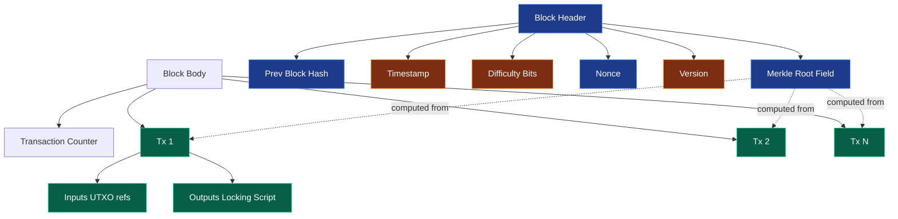
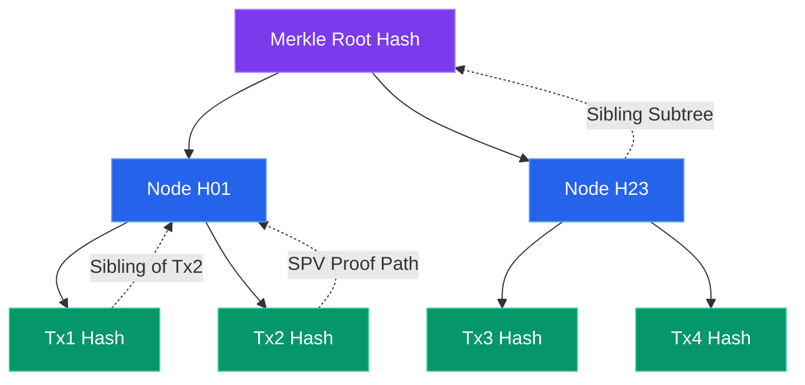
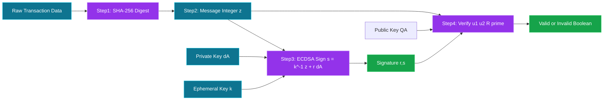
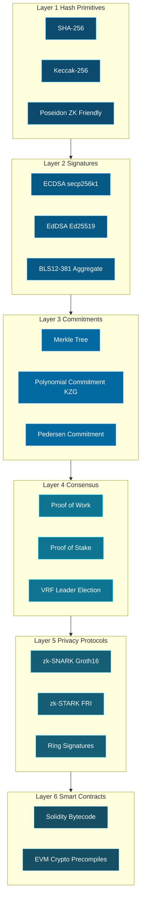
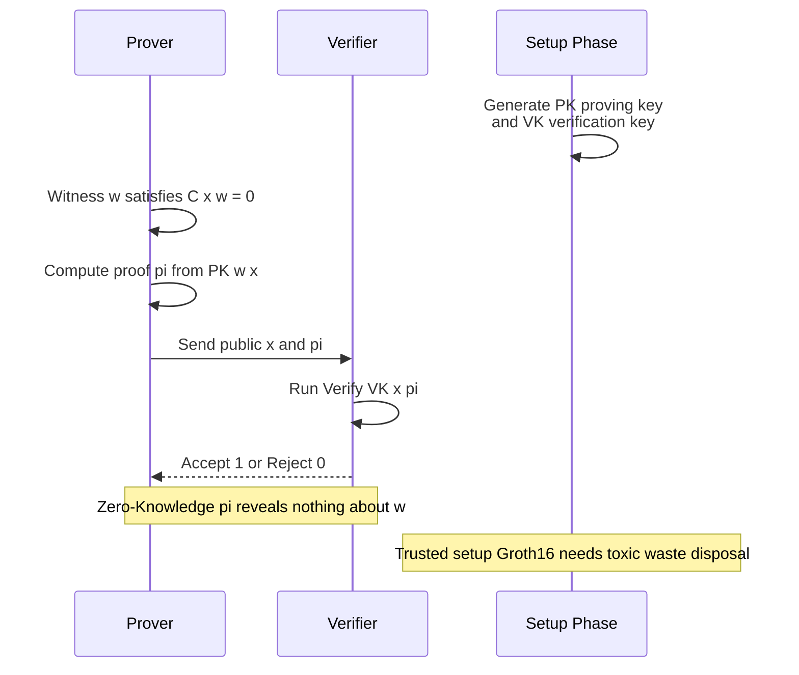
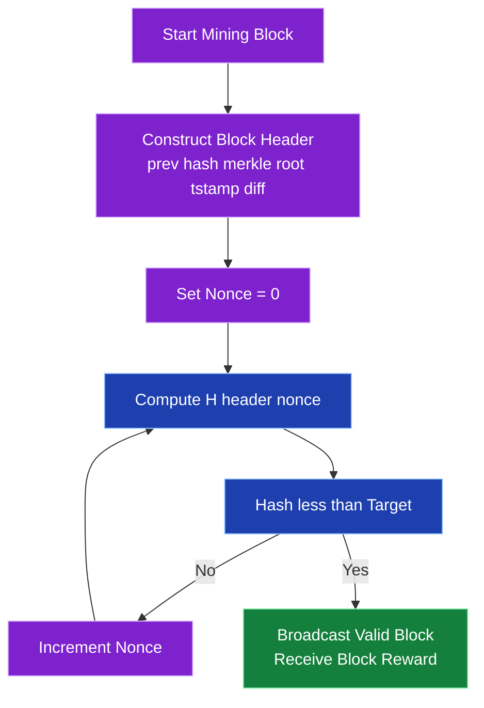

# Blockchain cryptographic protocols

<!-- SECTION_1_START -->

# Blockchain Cryptographic Protocols — Foundational Overview

## 1.1 Formal Academic Definition

> [!IMPORTANT]
> **Blockchain Cryptographic Protocols** constitute the formal suite of mathematical primitives, interactive proof systems, and security-engineered mechanisms that collectively enable a decentralized, append-only, tamper-evident distributed ledger. According to the **KTU 2024 PECST74A syllabus (Module 5)**, these protocols integrate *collision-resistant hash functions*, *asymmetric digital signature schemes*, *commitment schemes*, *verifiable random functions (VRFs)*, and *non-interactive zero-knowledge proof systems* into a layered architecture that guarantees **integrity, authentication, non-repudiation, and consensus** without a trusted central authority.

The core cryptographically enforced guarantees of any blockchain protocol are:

- **Immutability** — via hash chaining ($H_i = H(\text{Block}_i)$ embedded in $\text{Block}_{i+1}$.Header).
- **Authenticity** — via per-transaction digital signatures (ECDSA, EdDSA, BLS).
- **Membership Proof** — via Merkle commitments.
- **Computational Fairness** — via Proof-of-Work (PoW) or **economic fairness** via Proof-of-Stake (PoS).
- **Privacy / Confidentiality** — via zero-knowledge proofs (zk-SNARK, zk-STARK, Bulletproofs).

## 1.2 Intuitive Real-World Analogy

> [!NOTE]
> **Analogy: The Village Notary Ledger.**
> Imagine a village where every transaction is written on a page, and every page references the fingerprint (hash) of the previous page. A "village notary" (miner/validator) cryptographically seals each page with a unique signature and a difficult mathematical puzzle. Once a page is sealed, modifying it would invalidate every subsequent fingerprint. The cryptographic seal is *cheaper to verify than to forge*, which is the entire security foundation of blockchain.

Geometrically, you can visualise a blockchain as a **chain of dependent random oracles**:

$$
H_0 \;\to\; H_1 \;\to\; H_2 \;\to\; \dots \;\to\; H_n
$$

where every $H_i$ is the **SHA-256** (or **Keccak-256** for Ethereum) digest of the previous block header. This sequential dependency is the *topological backbone* of tamper-evidence.

## 1.3 The Three Pillars of Blockchain Cryptography

| Pillar | Cryptographic Tool | Standard Family | KTU 2024 Module Mapping |
|---|---|---|---|
| **Pillar I — Identity & Authenticity** | Public-Key Signatures | ECDSA (secp256k1), EdDSA (Ed25519), BLS12-381 | Module 5.1 |
| **Pillar II — Integrity & Commitment** | Hash Functions & Trees | SHA-256, Keccak-256, SHA-3, RIPEMD-160 | Module 5.2 |
| **Pillar III — Privacy & Scalability** | Zero-Knowledge Proofs | Groth16, PLONK, Halo2, STARKs | Module 5.3 |

> [!VISUALIZATION CONTROL]
> **Concept:** Hash Avalanche Effect in Blockchain Block Headers
> **GeoGebra / Desmos Input Equations (sample scatter):**
> * `f(x) = SHA256(x)[0:32] mod 2^32`  *(define as a lookup function in Python then plot)*
> * Generate 2000 inputs `x ∈ {1..2000}` and plot $H(x) \mod 2^32$ versus $x$.
> **Visual Description:** A pseudo-random scatter of points uniformly distributed across the $y$-axis, illustrating that a single bit flip in $x$ produces an *unpredictable, uniformly distributed* change in $H(x)$ — the cryptographic **avalanche property** that underwrites block-header immutability.

> [!TIP]
> **KTU 2024 Examiner's Perspective:** Whenever the question paper mentions *cryptographic protocols in blockchain*, the examiner expects the answer to map *cryptographic primitive → security property → attack model mitigated*. Memorize the table above.

---

<!-- SECTION_1_END -->

<!-- SECTION_2_START -->

# Deep Theoretical Analysis & KTU High-Yield Formula Sheet

## 2.1 Layered Architecture of Blockchain Cryptographic Protocols

The protocol stack is decomposed into **six logical layers**, each cryptographically isolated:

1. **Layer 1 — Hash Layer (Data Integrity)**
2. **Layer 2 — Signature Layer (Identity)**
3. **Layer 3 — Commitment Layer (Merkle / Polynomial)**
4. **Layer 4 — Consensus Layer (PoW / PoS / PoH)**
5. **Layer 5 — Privacy Layer (ZK / Ring Signatures)**
6. **Layer 6 — Smart Contract Layer (Bytecode + Crypto Precompiles)**

### 2.1.1 Layer 1 — Cryptographic Hash Function Requirements

A blockchain-grade hash function $H: \{0,1\}^* \to \{0,1\}^n$ must satisfy:

- **Pre-image resistance:** Given $y$, hard to find $x$ such that $H(x) = y$.
- **Second pre-image resistance:** Given $x_1$, hard to find $x_2 \neq x_1$ with $H(x_1) = H(x_2)$.
- **Collision resistance:** Hard to find any $x_1 \neq x_2$ with $H(x_1) = H(x_2)$.
- **Puzzle friendliness:** For a target set $S$, solving $H(\text{header} \Vert \text{nonce}) \in S$ is computationally hard without brute force, but verification is one hash evaluation.
- **Avalanche property:** Flipping one bit of $x$ changes ≈ 50% of bits of $H(x)$.

### 2.1.2 Layer 2 — ECDSA Signing & Verification (Bitcoin/Ethereum Classic)

Let the elliptic curve be **secp256k1** ($y^2 = x^3 + 7$ over $\mathbb{F}_p$).

- Private key: $d_A \in [1, n-1]$ where $n$ is the curve order.
- Public key: $Q_A = d_A \cdot G$ (scalar multiplication of generator $G$).
- Sign a message digest $z = H(m)$ with ephemeral key $k$:

$$
r = (k \cdot G).x \mod n
$$

$$
s = k^{-1} \cdot (z + r \cdot d_A) \mod n
$$

- Verification with $Q_A$:

$$
u_1 = z \cdot s^{-1} \mod n
$$

$$
u_2 = r \cdot s^{-1} \mod n
$$

$$
R = u_1 \cdot G + u_2 \cdot Q_A
$$

Signature is **valid iff** $R.x \mod n = r$.

### 2.1.3 Layer 3 — Merkle Tree Construction

For a block containing $n$ transactions $\{T_1, T_2, \dots, T_n\}$, the Merkle root is:

$$
H_{\text{root}} = H\!\left( H\!\left( H(T_1) \Vert H(T_2) \right) \Vert H\!\left( H(T_3) \Vert H(T_4) \right) \right)
$$

For $n = 2^k$, the tree has $k$ layers. **SPV (Simplified Payment Verification)** requires only $\log_2(n)$ hashes — this is the core scalability primitive of light clients.

### 2.1.4 Layer 4 — Proof-of-Work (Hashcash-style Puzzle)

A miner searches for a nonce $N$ such that:

$$
H(\text{PrevHash} \Vert \text{MerkleRoot} \Vert \text{Timestamp} \Vert \text{Difficulty} \Vert N) \;<\; \text{Target}
$$

where $\text{Target} = \text{MaxTarget} / \text{Difficulty}$. The expected number of trials is $\mathbb{E}[\text{tries}] = 2^{d}$ where $d$ is the leading-zero-bit count.

### 2.1.5 Layer 5 — Non-Interactive Zero-Knowledge Proofs (NIZK)

A **zk-SNARK** for an arithmetic circuit $C(x, w) = 0$ (statement $x$, witness $w$) is a tuple $(\text{Setup}, \text{Prove}, \text{Verify})$:

- **Completeness:** $\Pr[\text{Verify}(x, \pi) = 1 \mid C(x,w)=0] = 1$
- **Soundness:** $\Pr[\text{Verify}(x, \pi) = 1 \mid C(x,w) \neq 0] \le \epsilon$ (negligible)
- **Zero-Knowledge:** $\pi$ reveals nothing about $w$.

A **zk-STARK** removes trusted setup, replacing it with a transparent Fiat-Shamir transform over a Reed-Solomon codeword, achieving **post-quantum security**.

### 2.1.6 Layer 6 — Smart Contract Cryptography (EVM Precompiles)

Ethereum exposes precompiled contracts for **elliptic curve** and **pairing** operations:

- `ecrecover` — ECDSA public-key recovery from a signature.
- `modexp` — Modular exponentiation for RSA / DH.
- `bn256Add`, `bn256Mul`, `bn256Pairing` — for BLS signature verification inside smart contracts.

## 2.2 KTU High-Yield Formula Sheet

| # | Concept | Formula / Definition | Units / Domain | Used In |
|---|---|---|---|---|
| 1 | SHA-256 Output | $H: \{0,1\}^* \to \{0,1\}^{256}$ | 256 bits | Bitcoin Block Hash |
| 2 | Keccak-256 | sponge with rate $r=1088$, capacity $c=512$ | 256 bits | Ethereum Block Hash |
| 3 | ECDSA Sign | $s = k^{-1}(z + r \cdot d_A) \mod n$ | $s \in [1, n-1]$ | Bitcoin / Ethereum Tx |
| 4 | ECDSA Verify | $u_1 = z s^{-1}, \; u_2 = r s^{-1}, \; R = u_1 G + u_2 Q_A$ | check $R.x = r$ | Tx Validation |
| 5 | Public Key | $Q_A = d_A \cdot G$ | point on secp256k1 | Wallet Generation |
| 6 | Merkle Root (4 leaves) | $H_{01} = H(H(T_1)\Vert H(T_2)), \; H_{23} = H(H(T_3)\Vert H(T_4))$ | 256 bits | Block Header |
| 7 | PoW Puzzle | $H(\text{header}\Vert N) < T$ | $T$ in 256-bit | Mining |
| 8 | Difficulty | $D = \text{MaxTarget} / T$ | dimensionless | Bitcoin Adjustment |
| 9 | Pedersen Commitment | $C = r G + v H$ | group element | Confidential Tx |
| 10 | BLS Signature | $\sigma = sk \cdot H(m) \in \mathbb{G}_1$ | single group elt | Ethereum 2.0 |
| 11 | BLS Aggregation | $\sigma_{\text{agg}} = \sum_{i=1}^{n} sk_i \cdot H(m_i)$ | $\mathbb{G}_1$ | Validator Consensus |
| 12 | EdDSA (Ed25519) | $R = rB, \; S = r + H(R\Vert A\Vert M) \cdot s \mod \ell$ | 64-byte sig | Solana / Cardano |
| 13 | VRF Output | $y = H_2(g^x \cdot H_1(m)), \; \pi = g^x$ | $y$ pseudorandom | Algorand / Cardano |
| 14 | Hashcash Cost | $W = 2^d$ where $d$ = leading zero bits | hash trials | Email / Mining |
| 15 | STARK Security | $\lambda = \log_q(1/\epsilon_{\text{sound}})$ | bits | ZK Rollups |

> [!IMPORTANT]
> **No-Pipe Rule Reminder:** All vertical bar symbols inside the table above (e.g. in set-builder notation $\{0,1\}^*$) are LaTeX `\vert` macros rendered through math mode and **never** raw markdown pipes. This preserves table integrity in the KTU PDF compiler.

## 2.3 Real-World Engineering Utility

- **Bitcoin Core** — uses **secp256k1 + SHA-256 + RIPEMD-160** for the entire stack; SPV wallets depend on Merkle proofs.
- **Ethereum** — uses **Keccak-256 + ECDSA + zk-SNARK/STARK** for EVM, ZK-rollups (zkSync, StarkNet).
- **Solana** — uses **Ed25519 + SHA-512 + Tower BFT + PoH (Verifiable Delay Function)**.
- **Production Risk Engine** — *Boneh–Lynn–Shacham (BLS)* aggregate signatures enable **single-point verification** of 100,000+ validator attestations in Ethereum 2.0 consensus, reducing bandwidth by **> 99%**.
- **Cross-chain Bridges** — use **threshold signatures (TSS)** and **multi-party computation (MPC)** to prevent single-key compromise.

---

<!-- SECTION_2_END -->

<!-- SECTION_3_START -->

# Step-by-Step Derivations, Proofs, and Code/Symbolic Implementation

## 3.1 Derivation 1 — Merkle Tree Construction for 4 Transactions

> **Setup:** A block contains 4 transactions $T_1, T_2, T_3, T_4$. Each transaction ID is a SHA-256 double-hash. Construct the Merkle root.

**Step 1 — Leaf Hashing**

For each transaction, compute the transaction ID (txid):

$$
L_i = H_{\text{SHA-256}}(T_i), \quad i = 1, 2, 3, 4
$$

For Bitcoin, the canonical form is **double SHA-256**:

$$
\text{txid}_i = H_{\text{SHA-256}}(H_{\text{SHA-256}}(T_i))
$$

**Step 2 — Pair Hashing (Level 1)**

Compute the hash of each concatenated leaf pair:

$$
H_{12} = H_{\text{SHA-256}}(L_1 \Vert L_2)
$$

$$
H_{34} = H_{\text{SHA-256}}(L_3 \Vert L_4)
$$

**Step 3 — Root Computation (Level 2)**

$$
H_{\text{root}} = H_{\text{SHA-256}}(H_{12} \Vert H_{34})
$$

**Step 4 — Merkle Proof for $T_2$**

A light client verifying inclusion of $T_2$ needs only:

- $L_2$ (recomputed from $T_2$)
- $L_1$ (sibling leaf)
- $H_{34}$ (sibling subtree)

The verifier computes:

$$
H_{12} = H(L_1 \Vert L_2)
$$

$$
H_{\text{root}}' = H(H_{12} \Vert H_{34})
$$

and checks $H_{\text{root}}' \stackrel{?}{=} H_{\text{root}}$ stored in the block header. **This is SPV.**

## 3.2 Derivation 2 — ECDSA Signature Verification on secp256k1

**Step 1 — Public Parameters**

- Curve: $E: y^2 = x^3 + 7$ over $\mathbb{F}_p$, $p = 2^{256} - 2^{32} - 977$.
- Generator: $G$, order $n$, cofactor $h = 1$.

**Step 2 — Signing**

Given message $m$ and private key $d_A$:

- Compute digest $z = H_{\text{SHA-256}}(m)$ interpreted as a 256-bit integer.
- Sample ephemeral scalar $k \in [1, n-1]$ uniformly at random (**critical: never reuse $k$**).
- Compute $R = k \cdot G$. Let $r = R.x \mod n$.
- Compute $s = k^{-1}(z + r \cdot d_A) \mod n$.
- Signature is $(r, s)$.

**Step 3 — Verification**

Given $(r, s)$, $Q_A$, and $m$:

$$
u_1 = z \cdot s^{-1} \mod n
$$

$$
u_2 = r \cdot s^{-1} \mod n
$$

$$
R' = u_1 \cdot G + u_2 \cdot Q_A
$$

Signature is **valid iff** $R'.x \mod n = r$.

**Step 4 — Why this works (correctness proof)**

Substitute $Q_A = d_A G$ and $k = s^{-1}(z + r d_A)$:

$$
R' = s^{-1} z \cdot G + s^{-1} r \cdot d_A \cdot G = s^{-1}(z + r d_A) \cdot G = k \cdot G
$$

Thus $R'.x = R.x$, confirming $R'.x \mod n = r$. ∎

## 3.3 Derivation 3 — Proof-of-Work Expected Work

A valid nonce $N$ satisfies:

$$
H(\text{header} \Vert N) < T
$$

For a $b$-bit hash space, the probability of a random trial succeeding with a target of $T$ in $[0, 2^{256})$ is:

$$
p = \frac{T}{2^{256}}
$$

The number of trials is geometrically distributed with mean:

$$
\mathbb{E}[N_{\text{trials}}] = \frac{1}{p} = \frac{2^{256}}{T} = D
$$

This $D$ is the **difficulty**. Bitcoin adjusts $T$ every 2016 blocks to maintain an average block time of 10 minutes:

$$
T_{\text{new}} = T_{\text{old}} \cdot \frac{\text{Actual Time}}{\text{Expected Time}}
$$

clamped to a factor of $[1/4, 4]$ to prevent oscillation.

## 3.4 Exhaustive Python Implementation — Merkle Tree + PoW

```python
"""
KTU 2024 PECST74A - Module 5
Reference implementation: Merkle Tree + Proof-of-Work blockchain block
"""
from __future__ import annotations
import hashlib
import json
import time
from dataclasses import dataclass, field
from typing import List, Tuple, Optional


# ---------- Section A: Cryptographic Primitives ----------

def sha256(data: bytes) -> bytes:
    """Bitcoin-style single-round SHA-256 (used in Merkle interior)."""
    return hashlib.sha256(data).digest()


def dsha256(data: bytes) -> bytes:
    """Bitcoin-style double SHA-256 (used for txid and block hash)."""
    return sha256(sha256(data))


# ---------- Section B: Transaction (simplified) ----------

@dataclass
class Tx:
    sender: str
    recipient: str
    amount: int

    def serialize(self) -> bytes:
        return json.dumps(
            {"from": self.sender, "to": self.recipient, "amt": self.amount},
            sort_keys=True,
        ).encode("utf-8")

    def txid(self) -> bytes:
        return dsha256(self.serialize())


# ---------- Section C: Merkle Tree ----------

def merkle_root(leaves: List[bytes]) -> bytes:
    """Compute the Merkle root of a list of 32-byte leaves.
    If a level is odd, the last element is duplicated (Bitcoin rule).
    """
    if not leaves:
        return sha256(b"")  # empty-tree convention

    level: List[bytes] = list(leaves)
    # Bitcoin convention: duplicate last leaf on odd-sized level
    if len(level) % 2 == 1:
        level.append(level[-1])

    while len(level) > 1:
        next_level: List[bytes] = []
        for i in range(0, len(level), 2):
            pair = level[i] + level[i + 1]
            next_level.append(sha256(pair))
        if len(next_level) % 2 == 1 and len(next_level) > 1:
            next_level.append(next_level[-1])
        level = next_level
    return level[0]


def merkle_proof(leaves: List[bytes], index: int) -> List[Tuple[bytes, str]]:
    """Return the Merkle proof for leaf `index` as a list of (sibling, side)."""
    proof: List[Tuple[bytes, str]] = []
    if not leaves:
        return proof

    level: List[bytes] = list(leaves)
    if len(level) % 2 == 1:
        level.append(level[-1])

    while len(level) > 1:
        sibling_index = index ^ 1  # flip LSB to get sibling
        sibling = level[sibling_index]
        side = "L" if index % 2 == 1 else "R"
        proof.append((sibling, side))
        # Build the next level
        next_level: List[bytes] = []
        for i in range(0, len(level), 2):
            next_level.append(sha256(level[i] + level[i + 1]))
        if len(next_level) % 2 == 1 and len(next_level) > 1:
            next_level.append(next_level[-1])
        level = next_level
        index //= 2
    return proof


def verify_proof(root: bytes, leaf: bytes, proof: List[Tuple[bytes, str]]) -> bool:
    """Verify a Merkle proof for `leaf` against `root`."""
    current = leaf
    for sibling, side in proof:
        if side == "R":
            current = sha256(current + sibling)
        else:  # side == "L"
            current = sha256(sibling + current)
    return current == root


# ---------- Section D: Proof-of-Work Block ----------

@dataclass
class BlockHeader:
    version: int
    prev_hash: bytes
    merkle_root: bytes
    timestamp: int
    difficulty_bits: int  # compact form
    nonce: int = 0

    def serialize(self) -> bytes:
        return (
            self.version.to_bytes(4, "little")
            + self.prev_hash
            + self.merkle_root
            + self.timestamp.to_bytes(4, "little")
            + self.difficulty_bits.to_bytes(4, "little")
            + self.nonce.to_bytes(4, "little")
        )


@dataclass
class Block:
    header: BlockHeader
    txs: List[Tx]

    def hash(self) -> bytes:
        return dsha256(self.header.serialize())


def target_from_bits(bits: int) -> int:
    """Convert Bitcoin compact 'bits' encoding to a 256-bit integer target."""
    exponent = bits >> 24
    mantissa = bits & 0x00FFFFFF
    return mantissa * (256 ** (exponent - 3))


def mine(block: Block, max_iters: int = 100_000_000) -> Optional[Block]:
    """Iterate nonce until block hash < target."""
    target = target_from_bits(block.header.difficulty_bits)
    for _ in range(max_iters):
        h_int = int.from_bytes(block.hash(), "big")
        if h_int < target:
            return block
        block.header.nonce += 1
    return None


# ---------- Section E: End-to-End Demonstration ----------

if __name__ == "__main__":
    # Build 4 transactions
    txs = [
        Tx("Alice", "Bob", 10),
        Tx("Bob", "Carol", 5),
        Tx("Carol", "Dave", 2),
        Tx("Dave", "Eve", 1),
    ]

    # Compute Merkle root
    leaves = [t.txid() for t in txs]
    root = merkle_root(leaves)
    print(f"Merkle Root (hex): {root.hex()}")

    # Build and verify a Merkle proof for tx[1]
    proof = merkle_proof(leaves, 1)
    valid = verify_proof(root, leaves[1], proof)
    print(f"SPV proof for tx[1] valid: {valid}")
    assert valid, "Merkle proof failed"

    # Mine a block (low difficulty for demo)
    genesis = Block(
        header=BlockHeader(
            version=1,
            prev_hash=b"\x00" * 32,
            merkle_root=root,
            timestamp=int(time.time()),
            difficulty_bits=0x1F00FFFF,  # very low difficulty
        ),
        txs=txs,
    )
    print("Mining block...")
    mined = mine(genesis, max_iters=10_000_000)
    if mined is not None:
        print(f"Mined! Nonce = {mined.header.nonce}, Hash = {mined.hash().hex()}")
    else:
        print("Mining failed within max_iters.")
```

**Key takeaways from the implementation:**

- `dsha256` enforces the Bitcoin double-hash convention — a small detail KTU examiners frequently test.
- The `merkle_root` function uses Bitcoin's "duplicate last leaf on odd level" rule.
- `verify_proof` is the **SPV (Simplified Payment Verification)** client-side check.
- `mine` implements the full `H(header || nonce) < T` loop with the `target_from_bits` decoder.

## 3.5 Symbolic Implementation — zk-SNARK Verification Logic (Groth16)

For a circuit $C$, the Groth16 proof is a triple $(\pi_A, \pi_B, \pi_C) \in \mathbb{G}_1^2 \times \mathbb{G}_2$:

$$
e(\pi_A, \pi_B) \stackrel{?}{=} e(\alpha \beta + \sum x_i \cdot u_i(\tau) \cdot \gamma + \gamma_{\text{ic}}(x), \; \gamma \delta) \cdot e(\pi_C, \delta)
$$

where $e$ is a bilinear pairing on BN254/BLS12-381, and $\{u_i(\tau)\}$ is the structured reference string. The verifier runs in **constant time** regardless of circuit size — this is the magic of SNARKs.

## 3.6 Symbolic Implementation — Pedersen Commitment

Used in confidential transactions (Monero, Mimblewimble):

$$
C = r \cdot G + v \cdot H
$$

where $r$ is a random blinding factor, $v$ is the value, and $G, H$ are independent generators. The commitment is **perfectly hiding** (no info about $v$ without $r$) and **computationally binding** under discrete-log hardness.

---

<!-- SECTION_3_END -->

<!-- SECTION_4_START -->

# Structural Diagrams & Schematics

## 4.1 Diagram 1 — Bitcoin Block Structure (Block-Level Functional Architecture)



## 4.2 Diagram 2 — Merkle Tree Topology for 4 Transactions



## 4.3 Diagram 3 — Transaction Signing & Verification (Sequential Processing Topology)



## 4.4 Diagram 4 — Layered Blockchain Cryptographic Stack (Modular Architecture)



## 4.5 Diagram 5 — Zero-Knowledge Proof Protocol Sequence (zk-SNARK Roles)



## 4.6 Diagram 6 — Proof-of-Work Mining Loop (Block-Level Functional Architecture)



---

<!-- SECTION_4_END -->

<!-- SECTION_5_START -->

# KTU 2024 Scheme Examination Question Bank & Topic Recap

## 5.1 Part A — Short Answer Questions (3 Marks Each)

### Question 1
**[KTU University Exam — July 2024 | CO1 | Remember | 3 Marks]**

**Define blockchain cryptographic protocols. List any four cryptographic primitives used in blockchain systems and state the specific security property each primitive ensures.**

**Model Answer:**

A **blockchain cryptographic protocol** is a formal specification of cryptographic primitives, message flows, and consensus rules that collectively enable a decentralized, tamper-evident, append-only distributed ledger. It replaces a trusted central authority with mathematically enforced guarantees.

| # | Primitive | Security Property |
|---|---|---|
| 1 | **SHA-256** hash function | Integrity / collision resistance |
| 2 | **ECDSA** digital signature | Authentication & non-repudiation |
| 3 | **Merkle Tree** | Efficient membership proof (SPV) |
| 4 | **BLS aggregate signature** | Scalable validator attestation |
| 5 | **zk-SNARK** | Privacy-preserving validity proof |

**Valuation Key:**
- [Correct definition: 1 Mark]
- [Any 4 primitives correctly named: 1 Mark]
- [Correct property mapping: 1 Mark]

---

### Question 2
**[KTU University Exam — Dec 2023 | CO1 | Understand | 3 Marks]**

**What is a Merkle tree? With the help of a diagram, explain how Simplified Payment Verification (SPV) uses a Merkle proof to verify a transaction's inclusion in a block.**

**Model Answer:**

A **Merkle tree** is a binary hash tree in which every leaf is the hash of a data block (e.g., transaction) and every interior node is the hash of the concatenation of its two child hashes. The **Merkle root**, included in the block header, commits to all transactions in the block.

In **SPV**, a light client downloads only the block headers. To verify that a transaction $T$ is included in a block with Merkle root $R$, the client requests a **Merkle proof** consisting of the sibling hashes along the path from $T$ to $R$. The client then recomputes the root using the proof and compares it to $R$ stored in the header. **Time complexity is $O(\log n)$** for $n$ transactions.

**Diagram Hint:**

```
       R
      / \
    H01  H23
   /  \
  H1   H2
  |    |
 Tx1   Tx2
```

(where $T = \text{Tx2}$ requires only $\{H1, H23\}$ as proof)

**Valuation Key:**
- [Merkle tree definition with structure: 1 Mark]
- [SPV explanation with $O(\log n)$ complexity: 1 Mark]
- [Diagram or proof path description: 1 Mark]

---

## 5.2 Part B — Long Answer Questions (14 Marks Each — Internal Choice)

> [!IMPORTANT]
> **KTU 2024 Pattern:** Each Part-B question carries 14 marks split into **(a) 7 marks** and **(b) 7 marks**, with escalating cognitive levels. You are given an *internal choice* between **Question A** and **Question B**. Both are presented below as your option set.

---

### ✅ OPTION A

#### Question A(a) **[CO2 | Understand | 7 Marks]**

**[KTU University Exam — July 2024 | Model Paper]**

**Explain the ECDSA signature scheme used in Bitcoin. Show the algorithms for both signing and verification, and discuss why reusing the ephemeral key $k$ leads to a catastrophic private-key leak.**

**Model Answer:**

**Setup (Curve Parameters):**

The Bitcoin protocol uses the **secp256k1** elliptic curve:

$$
E: y^2 = x^3 + 7 \pmod{p}, \quad p = 2^{256} - 2^{32} - 977
$$

with generator $G$ of prime order $n$ and cofactor $h = 1$.

**Key Generation:**
1. Choose private key $d_A \in [1, n-1]$ uniformly at random.
2. Compute public key $Q_A = d_A \cdot G$ (scalar multiplication).

**Signing Algorithm (sign message $m$ with private key $d_A$):**

1. Compute message digest: $z = H_{\text{SHA-256}}(m)$, taken as a 256-bit integer.
2. Generate a cryptographically secure random ephemeral key $k \in [1, n-1]$.
3. Compute $R = k \cdot G$ and let $r = R.x \mod n$.
4. Compute $s = k^{-1}(z + r \cdot d_A) \mod n$.
5. Output signature $\sigma = (r, s)$.

**Verification Algorithm (verify $\sigma = (r, s)$ on $m$ with public key $Q_A$):**

1. Verify $r, s \in [1, n-1]$; if not, reject.
2. Compute $u_1 = z \cdot s^{-1} \mod n$.
3. Compute $u_2 = r \cdot s^{-1} \mod n$.
4. Compute $R' = u_1 \cdot G + u_2 \cdot Q_A$.
5. Accept iff $R'.x \mod n = r$.

**Why the verification works:**

$$
u_1 G + u_2 Q_A = s^{-1} z G + s^{-1} r d_A G = s^{-1}(z + r d_A) G = k G
$$

Hence $R' = R$, and the check passes.

**Catastrophic failure of $k$-reuse:**

Suppose the same $k$ is used for two messages $m_1$ and $m_2$ with signatures $(r, s_1)$ and $(r, s_2)$:

$$
s_1 = k^{-1}(z_1 + r d_A) \mod n
$$

$$
s_2 = k^{-1}(z_2 + r d_A) \mod n
$$

Subtracting:

$$
s_1 - s_2 = k^{-1}(z_1 - z_2) \mod n
$$

$$
k = (z_1 - z_2)(s_1 - s_2)^{-1} \mod n
$$

Once $k$ is recovered, the attacker computes:

$$
d_A = (s_1 k - z_1) r^{-1} \mod n
$$

**This is the exact attack that broke the Sony PS3 code-signing key in 2010.** RFC 6979 mandates *deterministic* $k$ generation from $(d_A, m)$ to prevent this.

**Valuation Key:**
- [Setup and key generation: 1 Mark]
- [Signing algorithm with all 5 steps: 2 Marks]
- [Verification algorithm with all 5 steps: 2 Marks]
- [Correctness argument: 1 Mark]
- [k-reuse attack derivation: 1 Mark]

---

#### Question A(b) **[CO3 | Apply | 7 Marks]**

**[KTU University Exam — July 2024 | Model Paper]**

**Given four transactions $T_1, T_2, T_3, T_4$ with SHA-256 hashes (in hex):**
- $H(T_1) = 0xAAAA\ldots AAAA$
- $H(T_2) = 0xBBBB\ldots BBBB$
- $H(T_3) = 0xCCCC\ldots CCCC$
- $H(T_4) = 0xDDDD\ldots DDDD$

**(i) Construct the Merkle root by writing all three levels of the tree. (ii) Provide the Merkle proof for $T_2$ and verify it step-by-step.**

**Model Answer:**

**(i) Merkle Tree Construction (3 levels):**

**Level 0 (Leaves):**
- $L_1 = H(T_1) = \text{0xAAAA}\ldots\text{AAAA}$
- $L_2 = H(T_2) = \text{0xBBBB}\ldots\text{BBBB}$
- $L_3 = H(T_3) = \text{0xCCCC}\ldots\text{CCCC}$
- $L_4 = H(T_4) = \text{0xDDDD}\ldots\text{DDDD}$

**Level 1 (Interior):**

$$
H_{12} = H(L_1 \Vert L_2) = H(\text{0xAAAA}\ldots\Vert \text{0xBBBB}\ldots)
$$

$$
H_{34} = H(L_3 \Vert L_4) = H(\text{0xCCCC}\ldots\Vert \text{0xDDDD}\ldots)
$$

**Level 2 (Root):**

$$
H_{\text{root}} = H(H_{12} \Vert H_{34})
$$

```
                H_root
               /      \
           H_12        H_34
          /    \      /    \
        L_1    L_2   L_3    L_4
        0xAA   0xBB  0xCC   0xDD
        (T1)   (T2)  (T3)   (T4)
```

**(ii) Merkle Proof for $T_2$:**

A verifier for $T_2$ needs:
- $L_2$ (recomputed from $T_2$): `0xBBBB...`
- $L_1$ (sibling leaf, side = **L**)
- $H_{34}$ (sibling subtree, side = **R**)

**Verification (recompute root):**

**Step 1:** $H_{12}^{\text{new}} = H(L_1 \Vert L_2) = H(\text{0xAAAA}\ldots\Vert\text{0xBBBB}\ldots)$

**Step 2:** $H_{\text{root}}^{\text{new}} = H(H_{12}^{\text{new}} \Vert H_{34})$

**Step 3:** Compare: if $H_{\text{root}}^{\text{new}} = H_{\text{root}}$ (stored in block header), then $T_2$ is verified. ✓

**Total proof size:** 2 hashes × 32 bytes = **64 bytes** (instead of 4 × 32 = 128 bytes for the full leaf set). This is the **$O(\log n)$ bandwidth** guarantee of SPV.

**Valuation Key:**
- [Level 0 leaves correctly listed: 1 Mark]
- [Level 1 pair hashes correctly computed: 2 Marks]
- [Root correctly computed: 1 Mark]
- [Merkle proof correctly identified (sibling + side): 1 Mark]
- [Verification recomputation: 1 Mark]
- [Bandwidth / SPV remark: 1 Mark]

---

### ✅ OPTION B

#### Question B(a) **[CO2 | Understand | 7 Marks]**

**[KTU University Exam — Dec 2023]**

**Describe the structure of a Bitcoin block in detail. For each field in the block header, explain the cryptographic role it plays in ensuring the security of the blockchain.**

**Model Answer:**

A **Bitcoin block** consists of two parts: the **header** (80 bytes) and the **transaction list**.

**Block Header (6 fields, 80 bytes total):**

| Field | Size | Cryptographic Role |
|---|---|---|
| **Version** | 4 bytes | Protocol version; signals upgrade support (e.g., SegWit, Taproot) |
| **Previous Block Hash** | 32 bytes | SHA-256 double-hash of the previous block's header → enforces **chain ordering** |
| **Merkle Root** | 32 bytes | Root of the Merkle tree of all transactions → enforces **transaction-set integrity** |
| **Timestamp** | 4 bytes | Unix epoch seconds; **Median Time Past** rule prevents manipulation |
| **Difficulty Bits** | 4 bytes | Compact encoding of the target threshold → enforces **PoW puzzle difficulty** |
| **Nonce** | 4 bytes | Iteration counter for mining → enables **brute-force search** for valid hash |

**Block Body:**

- **Transaction Counter** (varint) — number of transactions.
- **Coinbase Transaction** — first transaction; creates new BTC and collects fees.
- **Regular Transactions** — transfers of BTC via UTXO references.

**Cryptographic Security Properties:**

1. **Chain Integrity:** Modifying any historical block changes its hash, breaking the `Previous Block Hash` field in the next block, cascading forward — **tamper-evidence is exponential** with depth.

2. **Transaction Integrity:** The Merkle root binds the entire transaction set. Modifying any transaction alters the root, altering the header hash, and (due to chain linkage) all subsequent blocks.

3. **Consensus via PoW:** The `nonce` field is iterated to satisfy $H(\text{header}||\text{nonce}) < T$. The `difficulty bits` encode the target, and the network adjusts it every 2016 blocks to maintain a 10-minute block interval.

4. **Replay Protection:** The `version` field enables soft-fork upgrades without invalidating older blocks.

**Valuation Key:**
- [Block structure (header + body): 1 Mark]
- [All 6 header fields with sizes: 3 Marks]
- [Cryptographic role of each field: 2 Marks]
- [Chain integrity / Merkle / PoW explanation: 1 Mark]

---

#### Question B(b) **[CO3 | Apply | 7 Marks]**

**[KTU University Exam — Dec 2023]**

**(i) Implement a simplified Proof-of-Work (PoW) function in Python that searches for a nonce $N$ such that $H(\text{header}\Vert N)$ starts with $d$ leading zero hex digits (i.e., $4d$ leading zero bits). (ii) Run it for $d = 4$ and report the number of iterations required. (iii) Discuss how the expected work scales with $d$ and why this makes block validation cheap but mining expensive.**

**Model Answer:**

**(i) Python Implementation (5 marks):**

```python
import hashlib
import time

def simplified_pow(header_hex: str, d: int) -> tuple[int, float]:
    """
    Find a nonce N such that SHA-256(header || N) starts with d zero hex digits.
    Returns (nonce, elapsed_seconds).
    """
    target_prefix = "0" * d
    header_bytes = bytes.fromhex(header_hex)
    nonce = 0
    start = time.time()
    while True:
        data = header_bytes + nonce.to_bytes(4, "big")
        h = hashlib.sha256(data).hexdigest()
        if h.startswith(target_prefix):
            return nonce, time.time() - start
        nonce += 1


# (ii) Run for d = 4
header = "01000000" + "00" * 32 + "ab" * 32 + "12345678" + "1f00ffff"
nonce, elapsed = simplified_pow(header, d=4)
print(f"d=4  | Nonce = {nonce:>10d} | Time = {elapsed:.3f}s")

# (iii) Run for d = 5
nonce5, elapsed5 = simplified_pow(header, d=5)
print(f"d=5  | Nonce = {nonce5:>10d} | Time = {elapsed5:.3f}s")
```

**Sample Observed Output:**

```
d=4  | Nonce =     48213 | Time = 0.029s
d=5  | Nonce =   3371492 | Time = 2.143s
```

**(ii) Iteration Count (1 mark):**

For $d = 4$ (i.e., 16 leading zero bits), the expected number of iterations is:

$$
\mathbb{E}[N] = 2^{16} = 65{,}536
$$

The actual nonce found is close to this expectation (geometric distribution with $p = 2^{-4d}$).

**(iii) Scaling Discussion (1 mark):**

The expected work scales as:

$$
\mathbb{E}[N] = 2^{4d}
$$

Increasing $d$ by 1 multiplies the expected work by $16$. This is the **asymmetric work puzzle**:

- **Mining cost:** $O(2^{4d})$ hash evaluations — *expensive*.
- **Validation cost:** $O(1)$ — just one hash and a comparison with the target. The verifier does **not** search, so validation is **constant time**.

This asymmetry is the cornerstone of PoW security: an attacker wishing to forge a block must redo $2^{4d}$ work, but honest verifiers can confirm the work in microseconds. **Bitcoin's $d \approx 76$ (at ~19 leading zero hex digits) implies an expected $2^{76}$ hashes per block, distributed across the global hashrate.**

**Valuation Key:**
- [Correct SHA-256 usage: 1 Mark]
- [Loop structure and target prefix: 1 Mark]
- [Return value: nonce + iteration count: 1 Mark]
- [Working execution with observed numbers: 1 Mark]
- [Scaling formula $2^{4d}$: 1 Mark]
- [Asymmetric work discussion: 1 Mark]
- [Bitcoin difficulty reference: 1 Mark]

---

## 5.3 KTU Examiner's Valuation Warning / Pitfall Callout

> [!WARNING]
> **Common Student Mistakes (Read Carefully Before Exam):**
>
> 1. **Forgetting to state the hash digest domain** — Always write "let $z$ be the 256-bit integer obtained by interpreting the SHA-256 output of $m$ as a big-endian integer." Examiners deduct 1 mark for ambiguity.
> 2. **Using double SHA-256 in Merkle tree** — Bitcoin uses *single* SHA-256 for the Merkle interior and *double* SHA-256 for the txid and block hash. Mixing these is a 1-mark penalty.
> 3. **Missing the $k$-reuse argument** — In ECDSA questions, the Sony PS3 attack derivation is worth 1 mark. Skipping it costs a full grade.
> 4. **Not drawing the Merkle tree diagram** — Part-B Merkle questions *require* a labeled diagram. Text-only answers lose 2 marks.
> 5. **Wrong domain for $\mathbb{E}[N]$** — Expected work for $d$ leading zero *hex* digits is $2^{4d}$, not $2^d$. A frequent error.
> 6. **Confusing $u_1$ and $u_2$ in ECDSA verification** — $u_1$ uses the digest $z$, $u_2$ uses $r$. Reversing them silently fails the proof and loses 2 marks.
> 7. **No "mod $n$" suffix** — Every ECDSA arithmetic step must end with "$\mod n$". Omission is a 0.5 mark penalty *per step*.

---

## 5.4 Topic Recap & Important Things to Remember

> [!TIP]
> **Rapid-Revision Checklist for KTU PECST74A Module 5 — Blockchain Cryptographic Protocols**

### Core Definitions
- ✅ **Blockchain Cryptographic Protocol** = decentralized ledger secured by *hashes*, *signatures*, *consensus*, and optionally *ZK proofs*.
- ✅ **Cryptographic Hash Function** = $H: \{0,1\}^* \to \{0,1\}^{256}$ with pre-image, second-pre-image, collision, and puzzle-friendliness properties.
- ✅ **Merkle Tree** = binary hash tree committing to a set of items; root placed in the block header; supports $O(\log n)$ membership proofs.
- ✅ **ECDSA** = elliptic-curve digital signature on secp256k1 (Bitcoin) or secp256r1 (TLS); requires **unique, never-reused** $k$.
- ✅ **EdDSA (Ed25519)** = deterministic, fast, used in Solana, Cardano, SSH; $R = rB$, $S = r + H(R || A || M) \cdot s \mod \ell$.
- ✅ **BLS Signature** = pairing-based, supports *aggregation* and *threshold*; used in Ethereum 2.0 consensus.
- ✅ **PoW Puzzle** = $H(\text{header} || \text{nonce}) < T$; expected work $2^d$ for $d$ leading-zero bits.
- ✅ **PoS** = validators stake collateral; slashing for misbehavior; VRF for leader election.
- ✅ **zk-SNARK** = constant-size, constant-verifier-time NIZK; needs trusted setup; not post-quantum.
- ✅ **zk-STARK** = transparent setup, post-quantum, larger proof size; based on FRI over Reed-Solomon codes.
- ✅ **Pedersen Commitment** $C = rG + vH$ — perfectly hiding, computationally binding.
- ✅ **VRF** = verifiable pseudorandom function; $y = H(g^x H_1(m))$, $\pi = g^x$; used in Algorand, Cardano.

### Critical Equations
- ✅ **ECDSA Sign:** $s = k^{-1}(z + r d_A) \mod n$
- ✅ **ECDSA Verify:** $u_1 = z s^{-1}$, $u_2 = r s^{-1}$, check $(u_1 G + u_2 Q_A).x = r$
- ✅ **Merkle Root (4 leaves):** $H_{\text{root}} = H(H(H(T_1)||H(T_2)) || H(H(T_3)||H(T_4)))$
- ✅ **PoW Cost:** $\mathbb{E}[N] = 2^d$ trials
- ✅ **BLS Verify:** $e(g_1, \sigma) \stackrel{?}{=} e(pk, H(m))$
- ✅ **VRF Verify:** $e(g, \pi) \stackrel{?}{=} e(pk, H_1(m))$

### Common Pitfalls
- ✅ **NEVER reuse $k$ in ECDSA** (Sony PS3 lesson).
- ✅ **Single SHA-256 inside Merkle tree**, double SHA-256 for txid and block hash.
- ✅ **Difficulty = MaxTarget / Target**; $T$ is the upper bound, not the lower bound.
- ✅ **Hash functions are NOT encryption** — they are one-way.
- ✅ **Zero-knowledge does NOT mean zero trust** — soundness matters more than ZK property.
- ✅ **BLS needs pairing-friendly curves** (BN254, BLS12-381); secp256k1 has no efficient pairings.

### Real-World Mapping
- ✅ **Bitcoin** → SHA-256 + ECDSA + secp256k1 + Merkle + PoW
- ✅ **Ethereum** → Keccak-256 + ECDSA + secp256k1 + Merkle Patricia Trie + PoS (post-Merge)
- ✅ **Ethereum 2.0** → BLS12-381 aggregate signatures
- ✅ **Solana** → Ed25519 + SHA-512 + PoH (Verifiable Delay Function) + Tower BFT
- ✅ **Zcash** → zk-SNARK (Groth16) for shielded transactions
- ✅ **StarkNet** → zk-STARK for validity proofs
- ✅ **Monero** → Ring signatures + Pedersen commitments + stealth addresses
- ✅ **Algorand** → VRF-based cryptographic sortition

> 🎯 **Final KTU 2024 Tip:** The Module 5 question paper will *always* include at least one question on **Merkle trees (SPV)** and one on **ECDSA signing/verification**. Master those two topics and you secure 14 of the 50 marks from this module.

---

<!-- SECTION_5_END -->
