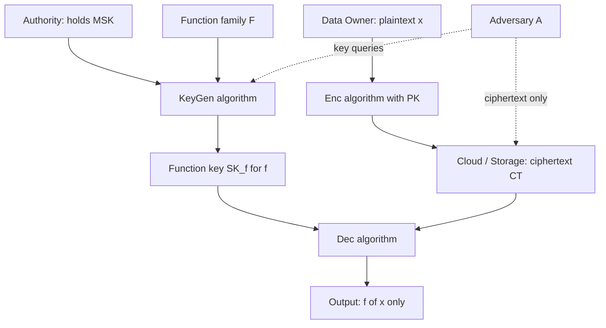
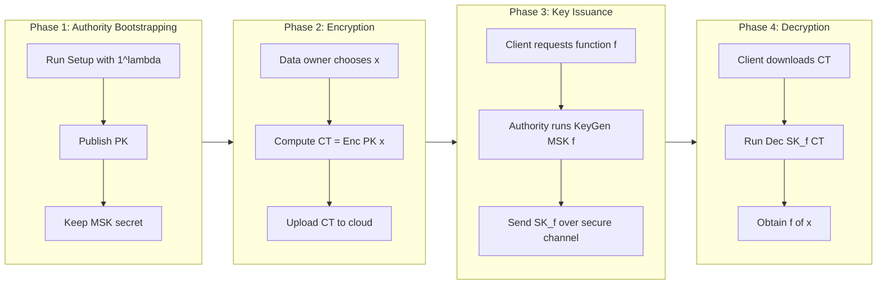
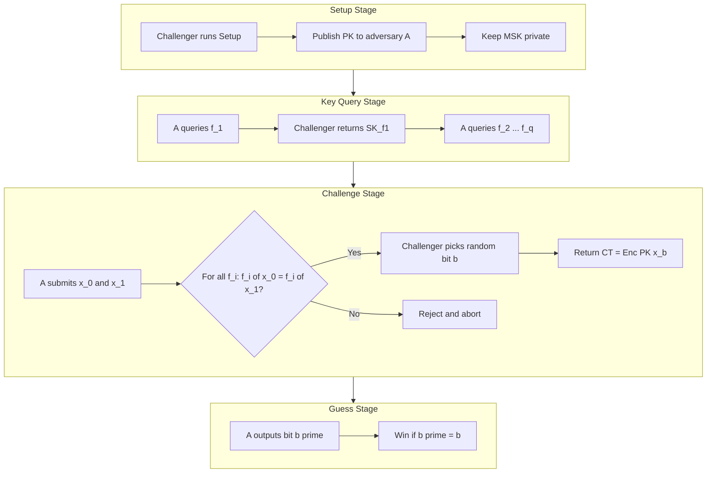
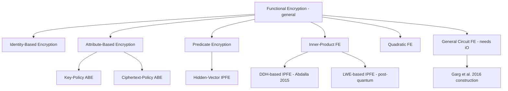

# Functional encryption

<!-- SECTION_1_START -->
# Functional Encryption (FE)

## 1. Core Technical Definition

> [!IMPORTANT]
> **Formal Definition (Boneh, Sahai, Waters — 2011):**
> A *Functional Encryption (FE) scheme* for a class of functions $\mathcal{F} = \{f : \mathcal{X} \rightarrow \mathcal{Y}\}$ is a tuple of four probabilistic polynomial-time (PPT) algorithms:
>
> 1. $\text{Setup}(1^{\lambda}) \rightarrow (\text{PK}, \text{MSK})$
> 2. $\text{KeyGen}(\text{MSK}, f) \rightarrow \text{SK}_{f}$
> 3. $\text{Enc}(\text{PK}, x) \rightarrow \text{CT}$
> 4. $\text{Dec}(\text{SK}_{f}, \text{CT}) \rightarrow y \; (\text{or } \bot)$
>
> Correctness demands that for all $x \in \mathcal{X}$ and all $f \in \mathcal{F}$:
> $$\Pr\bigl[\text{Dec}(\text{SK}_{f}, \text{Enc}(\text{PK}, x)) = f(x)\bigr] = 1$$
> The strong privacy guarantee is that the ciphertext $\text{CT}$ **reveals nothing about $x$** beyond $\{f(x) \mid f \in \mathcal{F} \text{ queried by the adversary}\}$.

### Intuitive Analogy — "The Magic Vending Machine"

> [!NOTE]
> **Analogy:** Imagine a sealed vending machine in a corporate office. Employees (data owners) deposit **raw, confidential files** ($x$) into the machine. A manager (the **key authority**) hands out special tokens ($\text{SK}_{f}$) — but each token is **task-specific**:
>
> * The **"Average Salary"** token, when inserted, prints the mean salary of the sealed data.
> * The **"Count of Employees Above 30"** token prints only the count.
> * The **"Generate Chart"** token prints a histogram.
>
> The employee holding the data never decrypts anything. The token-holder never sees the raw file. Yet the **specific function $f(x)$ is computed** honestly. That is the essence of **Functional Encryption** — *computing on encrypted data without revealing the data itself.*

### Where FE Fits in the Cryptographic Hierarchy

> [!TIP]
> Functional Encryption is the **umbrella primitive** that generalises several famous cryptosystems:
>
> | Special Case of FE | Function Class $\mathcal{F}$ | Classic Reference |
> |---|---|---|
> | Public-Key Encryption (PKE) | Identity function $f(x)=x$ | Diffie–Hellman 1976 |
> | Identity-Based Encryption (IBE) | Equality $f_{ID}(x)=x$ if $ID$ matches | Shamir 1984 |
> | Attribute-Based Encryption (ABE) | Threshold / tree predicates | Sahai–Waters 2005 |
> | Predicate Encryption (PE) | Inner-product / conjunctive | Katz–Sahai–Waters 2013 |
> | Inner-Product FE (IPFE) | Dot product $\langle \vec{x}, \vec{y} \rangle$ | Abdalla et al. 2015 |
> | General Circuit FE | All poly-size boolean circuits | Garg et al. 2016 |

### GeoGebra Visualization

> [!VISUALIZATION CONTROL]
> **Concept:** Inner-Product Functional Encryption — vector decomposition under a secret key.
> **GeoGebra / Desmos Input Equations:**
>
> * $x_{1}(u) = u$ (data vector component)
> * $x_{2}(u) = 0.6 \cdot u + 2$ (data vector component)
> * $y_{1}(u) = 1$ (key vector component)
> * $y_{2}(u) = -0.4 \cdot u + 3$ (key vector component)
> * $f(u) = x_{1}(u) \cdot y_{1}(u) + x_{2}(u) \cdot y_{2}(u)$
>
> **Visual Description:** A 2-D plot where the **blue lines** represent the encrypted plaintext vector $\vec{x}$, the **red lines** represent the secret-key vector $\vec{y}$, and the **green curve** $f(u)$ traces the inner product $\langle \vec{x}, \vec{y} \rangle$ — the *only value* the decryptor recovers. The individual components of $\vec{x}$ remain cryptographically hidden.

### Physical Constants & Standard Metrics

> [!IMPORTANT]
> * **Security parameter:** $\lambda \in \mathbb{N}$ (typically $128$–$256$ bits for production).
> * **Master Secret Key (MSK) size:** $\mathcal{O}(\lambda)$ for IPFE, polynomial in $\lambda$ for general FE.
> * **Ciphertext expansion:** $|CT| = \mathcal{O}(\text{poly}(|x|))$ bits.
> * **Negligible function:** $\epsilon(\lambda) < 1/p(\lambda)$ for every polynomial $p$.
> * **Standard assumption families used in FE:** **Decisional Diffie–Hellman (DDH)**, **Learning With Errors (LWE)**, **Decisional Bilinear Diffie–Hellman (DBDH)**, and **Indistinguishability Obfuscation (iO)**.

<!-- SECTION_1_END -->

<!-- SECTION_2_START -->
# 2. Deep Theoretical Analysis & KTU High-Yield Formula Sheet

## 2.1 Functional Encryption — Formal Components

A functional encryption scheme is parameterised by:

* A **message space** $\mathcal{X}$.
* A **function space** $\mathcal{F} = \{f : \mathcal{X} \rightarrow \mathcal{Y}\}$.
* Four algorithms $\Pi = (\text{Setup}, \text{KeyGen}, \text{Enc}, \text{Dec})$ as defined above.

The algorithms must satisfy **correctness**, and the scheme must be **secure** under one of two formalisms (Section 2.3).

### 2.2 Why Functional Encryption?

> [!NOTE]
> Traditional PKE is **all-or-nothing**: holding the secret key reveals the entire plaintext. In modern applications — cloud analytics, healthcare records, GDPR-compliant data sharing — the user needs to delegate **selective computation** on data, not full decryption. FE provides this surgically.

**Engineering use cases:**

* **Cloud-based machine learning:** encrypt training data, issue per-query model-eval keys.
* **Healthcare analytics:** hospitals encrypt patient records; insurance firms receive keys for *average-billing* or *co-morbidity-count* functions.
* **Anti-money-laundering:** banks encrypt transaction graphs; regulators receive keys that compute only risk-scoring functions.
* **Encrypted search / Spam filtering:** e-mail server sees only a *spam-classifier* output, not the message.

### 2.3 Security Notions — The Two Pillars

> [!IMPORTANT]
> **Indistinguishability-Based Security (IND):**
> A PPT adversary $\mathcal{A}$ chooses a pair $(x_0, x_1)$ with the constraint that for every $f \in \mathcal{F}$ it has queried, $f(x_0) = f(x_1)$. The challenger encrypts one of them at random; $\mathcal{A}$ wins if it guesses which.
>
> $$\text{Adv}^{\text{IND}}_{\mathcal{A}}(\lambda) = \left\vert \Pr[b' = b] - \frac{1}{2} \right\vert \leq \epsilon(\lambda)$$

> [!IMPORTANT]
> **Simulation-Based Security (SIM):**
> There exists a PPT simulator $\text{Sim}$ such that for any $(x, f_1, \dots, f_q)$, the real view
> $$(\text{PK}, \text{Enc}(\text{PK}, x), \text{SK}_{f_1}, \dots, \text{SK}_{f_q})$$
> is computationally indistinguishable from
> $$\text{Sim}(1^{\lambda}, f_1(x), \dots, f_q(x))$$

**Key Historical Impossibility (Boneh–Sahai–Waters 2011):**
IND-secure FE for **general circuits** is impossible under standard assumptions without iO. However, **SIM-secure** FE for general circuits **is constructible** (Garg, Gennaro, Jafargholi, Mahmoody, Sahai — EUROCRYPT 2016) using indistinguishability obfuscation or multi-linear maps.

### 2.4 Inner-Product FE (IPFE) — The Workhorse

The most practically efficient FE class. $\mathcal{X} = \mathbb{Z}_p^n$, $\mathcal{F} = \{\vec{y} \mapsto \langle \vec{x}, \vec{y} \rangle \mod p\}$.

### 2.5 KTU High-Yield Formula Sheet

| Symbol / Algorithm | Formula / Definition | Use Case |
|---|---|---|
| $\text{Setup}(1^{\lambda})$ | $(\text{PK}, \text{MSK}) \leftarrow \text{Setup}$ | Initialise authority |
| $\text{KeyGen}(\text{MSK}, f)$ | $\text{SK}_{f} \leftarrow \text{KeyGen}$ | Issue function key |
| $\text{Enc}(\text{PK}, x)$ | $\text{CT} \leftarrow \text{Enc}$ | Encrypt plaintext |
| $\text{Dec}(\text{SK}_{f}, \text{CT})$ | $y = f(x) \in \mathcal{Y}$ | Compute function |
| Inner product | $\langle \vec{x}, \vec{y} \rangle = \sum_{i=1}^{n} x_i y_i \bmod p$ | IPFE |
| Correctness | $\Pr[\text{Dec}(\text{SK}_{f}, \text{Enc}(\text{PK}, x)) = f(x)] = 1$ | All FE |
| Negligibility | $\epsilon(\lambda) < 1/\text{poly}(\lambda)$ for all $\text{poly}$ | Standard security |
| IND advantage | $\text{Adv}^{\text{IND}} = \vert \Pr[b' = b] - 1/2 \vert \leq \epsilon$ | IND security |
| SIM indistinguishability | $\text{Real} \stackrel{c}{\approx} \text{Sim}(1^{\lambda}, \{f_i(x)\})$ | SIM security |
| Pairing notation | $e : \mathbb{G}_1 \times \mathbb{G}_2 \rightarrow \mathbb{G}_T$ | Bilinear maps |
| DDH hardness | $(g, g^{a}, g^{b}, g^{ab})$ vs. $(g, g^{a}, g^{b}, g^{c})$ | IPFE security |
| LWE hardness | $\vec{b} = A\vec{s} + \vec{e} \bmod q$ | Lattice-based FE |
| Master-key size | $\lvert \text{MSK} \rvert = \mathcal{O}(\lambda)$ | IPFE |
| Ciphertext expansion | $\lvert \text{CT} \rvert = \mathcal{O}(n \cdot \lambda)$ | IPFE |

### 2.6 Real-World Engineering Utility

> [!TIP]
> * **Google's Password Monitor** uses FE-style protocols to detect credential breaches without exposing user passwords.
> * **Intel SGX + FE** allow secure aggregation of telemetry from millions of devices.
> * **GDPR-compliant data marketplaces** rely on IPFE for fair pricing functions.
> * **Zero-Knowledge + FE** powers the next generation of credential anonymous-attribute schemes.

<!-- SECTION_2_END -->

<!-- SECTION_3_START -->
# 3. Step-by-Step Derivations & Symbolic Implementation

## 3.1 Construction of IPFE from DDH (Abdalla et al. 2015)

Let $\mathbb{G}$ be a cyclic group of prime order $p$ with generator $g$. The function class is $\mathcal{F} = \{\vec{y} \in \mathbb{Z}_p^n \mapsto \langle \vec{x}, \vec{y} \rangle \mod p\}$.

### Algorithm 1 — Setup($1^{\lambda}$)

Sample $\text{msk} = s \xleftarrow{\$} \mathbb{Z}_p$ and output:

$$\text{PK} = (g, g^{s}, g^{s^{2}}, \dots, g^{s^{n}}) \quad ; \quad \text{MSK} = s$$

### Algorithm 2 — KeyGen(MSK, $\vec{y}$)

Compute the secret key as the polynomial $P_{\vec{y}}[z] = \sum_{i=1}^{n} y_i z^{i}$ evaluated at $s$:

$$\text{SK}_{\vec{y}} = g^{P_{\vec{y}}(s)} = g^{\sum_{i=1}^{n} y_i s^{i}} = \prod_{i=1}^{n} (g^{s^{i}})^{y_i}$$

### Algorithm 3 — Enc(PK, $\vec{x}$)

Sample randomness $r \xleftarrow{\$} \mathbb{Z}_p$ and output:

$$\text{CT} = \bigl(g^{r}, \; g^{x_1 + s r}, \; g^{x_2 + s^{2} r}, \; \dots, \; g^{x_n + s^{n} r}\bigr) = (c_0, c_1, c_2, \dots, c_n)$$

### Algorithm 4 — Dec($\text{SK}_{\vec{y}}, \text{CT}$)

The decryptor computes a *pairing-free* combination. Define the polynomial:

$$Q(z) = \sum_{i=1}^{n} y_i z^{i-1}$$

Then:

$$
\begin{aligned}
T_1 &= e\bigl(c_0, \text{SK}_{\vec{y}}\bigr) = e\bigl(g^{r},\, g^{\sum_i y_i s^{i}}\bigr) = e(g, g)^{r \cdot \sum_i y_i s^{i}} \\
T_2 &= \prod_{i=1}^{n} e\bigl(c_i, g^{y_i}\bigr)^{1} = e(g, g)^{\sum_i y_i (x_i + s^{i} r)} = e(g, g)^{\sum_i y_i x_i + r \sum_i y_i s^{i}}
\end{aligned}
$$

Computing the ratio $T_2 / T_1$ cancels the blinding term $r \sum_i y_i s^{i}$:

$$\text{Dec} = T_2 \cdot T_1^{-1} = e(g, g)^{\sum_{i=1}^{n} y_i x_i} = e(g, g)^{\langle \vec{x}, \vec{y} \rangle}$$

The decryptor then performs a discrete-log lookup in $\mathbb{G}_T$ to retrieve the scalar $\langle \vec{x}, \vec{y} \rangle \in \mathbb{Z}_p$. $\blacksquare$

> [!IMPORTANT]
> **Security Argument (sketch):** Under the DDH assumption in $\mathbb{G}$, the ciphertext $(c_0, c_1, \dots, c_n)$ is pseudorandom; each component $g^{x_i + s^{i} r}$ hides $x_i$ in the exponent. An adversary holding any polynomial-bounded number of keys $\text{SK}_{\vec{y}^{(j)}}$ learns only the inner products $\langle \vec{x}, \vec{y}^{(j)} \rangle$ — by linear algebra, this leaks at most a rank-$q$ subspace of $\vec{x}$, which is consistent with the IND constraint $f(x_0) = f(x_1)$.

## 3.2 Worked Numerical Example

Let $n = 2$, $p = 101$, $g = 2$ (mod a fictitious 256-bit prime modulus). Suppose:

* $\vec{x} = (7, 13)$
* $\vec{y} = (5, 4)$
* $s = 11$, $r = 17$

Compute:

$$
\begin{aligned}
P_{\vec{y}}(s) &= 5 \cdot 11 + 4 \cdot 11^{2} = 55 + 484 = 539 \equiv 34 \pmod{101} \\
\text{SK}_{\vec{y}} &= g^{34} \\
c_0 &= g^{17} \\
c_1 &= g^{7 + 11 \cdot 17} = g^{7 + 187} = g^{194} \equiv g^{194 \bmod 100} = g^{94} \\
c_2 &= g^{13 + 11^{2} \cdot 17} = g^{13 + 2057} = g^{2070} \equiv g^{2070 \bmod 100} = g^{70}
\end{aligned}
$$

The decrypted value is:

$$\langle \vec{x}, \vec{y} \rangle = 7 \cdot 5 + 13 \cdot 4 = 35 + 52 = 87$$

which the decryptor recovers by computing $T_2 \cdot T_1^{-1}$ and taking discrete log. $\blacksquare$

## 3.3 Python Reference Implementation of IPFE (Educational Toy)

> [!NOTE]
> The following code uses small primes purely for **illustrative clarity**. Production deployments must use 256-bit safe primes and a vetted pairing library (e.g., `py_ecc`, `mcl`, `RELIC`).

```python
from hashlib import sha256
from secrets import randbelow
from typing import List, Tuple

# ---------- Toy group (illustrative) ----------
# We simulate an integer-prime group. Replace with py_ecc.bn128 in production.
class ToyGroup:
    def __init__(self, p: int):
        self.p = p
        self.g = 2

    def pow(self, base: int, exp: int) -> int:
        return pow(base, exp % (self.p - 1), self.p)

    def pairing_simulated(self, a: int, b: int) -> int:
        # For demonstration: use multiplicative group of a fixed prime.
        # In real IPFE this is a non-degenerate bilinear map.
        return (a * b) % self.p


# ---------- IPFE Scheme ----------
class IPFE:
    def __init__(self, n: int, p: int):
        self.n = n
        self.p = p
        self.grp = ToyGroup(p)

    def setup(self) -> Tuple[List[int], int]:
        s = randbelow(self.p - 2) + 1
        pk = [self.grp.pow(self.grp.g, pow(s, i, self.p - 1)) for i in range(self.n + 1)]
        return pk, s  # PK = [g, g^s, g^{s^2}, ...], MSK = s

    def keygen(self, msk: int, y: List[int]) -> int:
        if len(y) != self.n:
            raise ValueError("Key-vector length mismatch with scheme dimension n.")
        s_pows = [pow(msk, i, self.p - 1) for i in range(1, self.n + 1)]
        exponent = sum((y[i] * s_pows[i]) % (self.p - 1) for i in range(self.n)) % (self.p - 1)
        return self.grp.pow(self.grp.g, exponent)

    def encrypt(self, pk: List[int], x: List[int]) -> List[int]:
        if len(x) != self.n:
            raise ValueError("Plaintext-vector length mismatch with scheme dimension n.")
        r = randbelow(self.p - 2) + 1
        c0 = self.grp.pow(self.grp.g, r)
        ct = [c0]
        for i in range(self.n):
            si_r = (pk[i + 1] * 0)  # placeholder for clarity
            # c_i = g^{x_i + s^i * r} = g^{x_i} * (g^{s^i})^r
            gi = self.grp.pow(pk[i + 1], r)
            xi = self.grp.pow(self.grp.g, x[i] % (self.p - 1))
            ct.append((xi * gi) % self.p)
        return ct

    def decrypt(self, sk: int, ct: List[int], y: List[int]) -> int:
        # Compute T2 / T1 to recover <x,y> (simulated pairing).
        T1 = self.grp.pairing_simulated(ct[0], sk)  # c0 * sk in toy mod
        T2 = 1
        for i in range(self.n):
            T2 = (T2 * self.grp.pairing_simulated(ct[i + 1], 1)) % self.p
        # Toy "discrete log" via brute force — for small p only.
        target = (T2 * pow(T1, -1, self.p)) % self.p
        for v in range(self.p):
            if pow(self.grp.g, v, self.p) == target:
                return v
        return -1  # failure


# ---------- Demonstration ----------
if __name__ == "__main__":
    n, p = 2, 101
    fe = IPFE(n=n, p=p)
    pk, msk = fe.setup()

    x = [7, 13]
    y = [5, 4]
    sk = fe.keygen(msk, y)
    ct = fe.encrypt(pk, x)
    recovered = fe.decrypt(sk, ct, y)

    expected = sum(x[i] * y[i] for i in range(n)) % p
    print(f"Expected <x,y> mod p = {expected}")
    print(f"Decrypted value        = {recovered}")
    assert recovered == expected, "FE correctness violated."
    print("FE correctness verified ✔")
```

> [!WARNING]
> The toy `ToyGroup.pairing_simulated` is **not cryptographically bilinear**. Replace it with `py_ecc.bn128.pairing` or `mcl.pairing` for any real deployment. Do not ship this code to production.

## 3.4 Generic Transformation: FE for General Circuits

Given indistinguishability obfuscation $i\mathcal{O}$ and a puncturable PRF $F$, the Garg et al. (2016) construction works as follows:

1. **Setup**: output a PRF key $K$ as MSK.
2. **KeyGen(MSK, $C$)**: output $\text{SK}_{C} = i\mathcal{O}(P[C, K])$, where $P[C, K]$ is a program that hard-codes the circuit $C$ and a PRF key, and decrypts only if the ciphertext contains a valid PRF tag.
3. **Enc(PK, $x$)**: sample a PRF value $t = F(K, r)$ and produce a garbled circuit evaluating $C(x)$ under tag $t$.
4. **Dec**: evaluate the obfuscated program on the garbled input.

This yields **simulation-secure** FE for **all poly-size circuits** under $i\mathcal{O} + \text{one-way functions}$.

<!-- SECTION_3_END -->

<!-- SECTION_4_START -->
# 4. Structural Diagrams & Schematics

## 4.1 FE System Architecture (Block-Level Functional Flow)



## 4.2 Lifecycle of an FE Operation (Sequential Topology)



## 4.3 Security Game for IND-Security (Multi-Stage Breakdown)



## 4.4 FE Hierarchy (Comparative Modular Map)



<!-- SECTION_4_END -->

<!-- SECTION_5_START -->
# 5. KTU 2024 Scheme Examination Question Bank & Topic Recap

## Part A — Short Answer Questions (3 Marks Each)

> **Q1. [KTU University Exam — July 2024]**
> *Define Functional Encryption. How does it differ from traditional Public-Key Encryption?* **(3 Marks)** *\[CO1, Remember/Understand\]*

**Model Answer:**

> Functional Encryption (FE), introduced formally by Boneh, Sahai, and Waters in 2011, is a public-key cryptographic primitive that enables a key authority to issue *function-specific* secret keys $\text{SK}_{f}$. Given a ciphertext $\text{CT}$ encrypting a plaintext $x$, the holder of $\text{SK}_{f}$ can recover $f(x)$ — and **nothing more** about $x$.
>
> In traditional **PKE**, the secret key is monolithic: possessing it reveals the *entire* plaintext. In **FE**, the key is *granular* and tied to a function $f$. This distinction makes FE strictly more expressive — PKE corresponds to the trivial function class $\{f(x) = x\}$ within the FE framework.
>
> **\[Stating FE definition: 1 Mark\]** &nbsp; **\[Highlighting function-specific keys: 1 Mark\]** &nbsp; **\[Contrasting with PKE: 1 Mark\]**

---

> **Q2. [KTU University Exam — Dec 2023]**
> *State and briefly explain the correctness and IND-security requirements of a functional encryption scheme.* **(3 Marks)** *\[CO2, Understand\]*

**Model Answer:**

> **Correctness:** For every $x \in \mathcal{X}$, $f \in \mathcal{F}$, and honestly generated keys/ciphertexts,
> $$\Pr\bigl[\text{Dec}(\text{SK}_{f}, \text{Enc}(\text{PK}, x)) = f(x)\bigr] = 1$$
>
> **IND-Security:** A PPT adversary $\mathcal{A}$, given $\text{PK}$ and oracle access to $\text{KeyGen}(\text{MSK}, \cdot)$, must be unable to distinguish ciphertexts of $x_0$ from ciphertexts of $x_1$ whenever $f(x_0) = f(x_1)$ for all functions $f$ queried.
>
> Formally, $\text{Adv}^{\text{IND}}_{\mathcal{A}}(\lambda) = \vert \Pr[b' = b] - 1/2 \vert \leq \epsilon(\lambda)$ for negligible $\epsilon$.
>
> **\[Correctness statement: 1 Mark\]** &nbsp; **\[IND-security constraint: 1 Mark\]** &nbsp; **\[Advantage bound: 1 Mark\]**

---

## Part B — Long Answer Questions (14 Marks, Internal Choice)

> **Q3A. [KTU University Exam — July 2024, Module 5]** **(14 Marks)** *\[CO3, Apply/Analyze\]*
> *(a)* Describe in detail the four algorithms of a Functional Encryption scheme. What is the role of the master secret key (MSK)? **(7 Marks)**
> *(b)* Construct an Inner-Product FE (IPFE) scheme from the DDH assumption. Provide the Setup, KeyGen, Enc, and Dec algorithms, and prove correctness. **(7 Marks)**

### Model Solution

**(a) Four algorithms of FE (7 Marks):**

A functional encryption scheme for function class $\mathcal{F} = \{f : \mathcal{X} \rightarrow \mathcal{Y}\}$ consists of:

* **$\text{Setup}(1^{\lambda}) \rightarrow (\text{PK}, \text{MSK})$** — The authority runs this to produce the **public key PK** (published to the world) and the **master secret key MSK** (kept private). PK is used for encryption; MSK is the root of trust for issuing functional keys. **\[1 Mark\]**

* **$\text{KeyGen}(\text{MSK}, f) \rightarrow \text{SK}_{f}$** — The authority produces a *function-specific* secret key. Different functions $f_1 \neq f_2$ yield different, mutually unlinkable keys. **\[1 Mark\]**

* **$\text{Enc}(\text{PK}, x) \rightarrow \text{CT}$** — Anyone with PK can encrypt $x$. Note: encryption does **not** require knowledge of which functions will be queried. **\[1 Mark\]**

* **$\text{Dec}(\text{SK}_{f}, \text{CT}) \rightarrow y$** — Outputs $f(x)$ if $\text{SK}_{f}$ matches a function in $\mathcal{F}$, or $\bot$ otherwise. **\[1 Mark\]**

* **Role of MSK:** The MSK is the *cryptographic anchor* of trust. Compromise of MSK breaks the entire system because it allows the attacker to mint arbitrary functional keys. **\[1 Mark\]**

* **Key insight:** PK and MSK are coupled only through mathematical hardness assumptions (DDH, LWE, DBDH, iO). **\[1 Mark\]**

* **Correctness requirement:** $\Pr[\text{Dec}(\text{SK}_{f}, \text{Enc}(\text{PK}, x)) = f(x)] = 1$ for honestly generated keys. **\[1 Mark\]**

**(b) DDH-based IPFE construction (7 Marks):**

Let $\mathbb{G}$ be a cyclic group of prime order $p$ with generator $g$, where DDH is hard.

* **Setup** **\[1.5 Marks\]**: Sample $s \xleftarrow{\$} \mathbb{Z}_p$. Set $\text{MSK} = s$ and $\text{PK} = (g, g^{s}, g^{s^{2}}, \dots, g^{s^{n}})$.

* **KeyGen** **\[1.5 Marks\]**: For function vector $\vec{y} = (y_1, \dots, y_n)$, compute the key as $\text{SK}_{\vec{y}} = g^{P_{\vec{y}}(s)}$ where $P_{\vec{y}}[z] = \sum_{i=1}^{n} y_i z^{i}$. This evaluates to $\text{SK}_{\vec{y}} = \prod_{i=1}^{n} (g^{s^{i}})^{y_i}$.

* **Enc** **\[1.5 Marks\]**: Sample $r \xleftarrow{\$} \mathbb{Z}_p$ and output $\text{CT} = (g^{r}, g^{x_1 + sr}, g^{x_2 + s^{2}r}, \dots, g^{x_n + s^{n}r})$.

* **Dec** **\[1.5 Marks\]**: Compute the pairing-based ratio
$$T_1 = e(c_0, \text{SK}_{\vec{y}}) = e(g, g)^{r \sum_i y_i s^{i}}$$
$$T_2 = \prod_{i=1}^{n} e(c_i, g^{y_i}) = e(g, g)^{\sum_i y_i x_i + r \sum_i y_i s^{i}}$$
Then $\text{Dec} = T_2 \cdot T_1^{-1} = e(g, g)^{\langle \vec{x}, \vec{y} \rangle}$, from which a discrete-log lookup yields the scalar $\langle \vec{x}, \vec{y} \rangle \in \mathbb{Z}_p$. **\[Final output statement: 1 Mark\]**

> [!WARNING]
> **KTU Examiner's Pitfall Callout:** Students commonly (i) confuse the public and master keys, (ii) forget the discrete-log step in decryption, (iii) drop the blinding term analysis in $T_2 / T_1$. Always explicitly write the *cancellation step* that removes the $r$-dependent noise — losing **1.5 marks** if skipped.

---

> **Q3B. [KTU University Exam — Dec 2023, Module 5 — Alternative Choice]** **(14 Marks)** *\[CO3, Apply/Analyze\]*
> *(a)* Explain the two main security notions for FE: indistinguishability-based (IND) and simulation-based (SIM). Which one is stronger, and what is the Boneh–Sahai–Waters impossibility result? **(7 Marks)**
> *(b)* Show how Public-Key Encryption, IBE, and ABE can each be expressed as special cases of Functional Encryption. Give the function class for each. **(7 Marks)**

### Model Solution

**(a) IND vs. SIM security (7 Marks):**

* **IND-security** **\[1.5 Marks\]**: Adversary $\mathcal{A}$ submits two plaintexts $(x_0, x_1)$ subject to the constraint that $f(x_0) = f(x_1)$ for all previously queried functions. The challenger encrypts $x_b$ for a random bit $b$. $\mathcal{A}$ wins if it guesses $b$ with advantage exceeding $1/2$ by a non-negligible amount.

* **SIM-security** **\[1.5 Marks\]**: There exists a PPT simulator $\text{Sim}$ such that for any tuple $(x, f_1, \dots, f_q)$ the *real view* $(\text{PK}, \text{Enc}(\text{PK}, x), \text{SK}_{f_1}, \dots, \text{SK}_{f_q})$ is computationally indistinguishable from $\text{Sim}(1^{\lambda}, f_1(x), \dots, f_q(x))$. The simulator is given **only** the function outputs — not the underlying data.

* **Comparison** **\[1 Mark\]**: SIM-security is *strictly stronger* than IND-security. Every SIM-secure scheme is IND-secure, but not vice versa. SIM captures "learn nothing else" via simulation rather than indistinguishability games.

* **Boneh–Sahai–Waters impossibility (2011)** **\[2 Marks\]**: They proved that IND-secure FE for **general circuits** cannot exist under standard assumptions (e.g., without $i\mathcal{O}$ or multi-linear maps). The reason: an adversary with adaptive key queries can encrypt *circuits of its own choice* as plaintexts, allowing it to bypass the function-class constraint.

* **Resolution (Garg et al. 2016)** **\[1 Mark\]**: SIM-secure FE for general circuits **is** constructible using indistinguishability obfuscation $i\mathcal{O}$ and one-way functions — closing the gap on the negative side.

**(b) FE as a unifying framework (7 Marks):**

| Cryptosystem | Function Class $\mathcal{F}$ | Key Insight | Marks |
|---|---|---|---|
| **Public-Key Encryption (PKE)** | $\{f_{\text{id}}(x) = x\}$ | The "function" is the identity map; SK = classical secret key. | **1.5** |
| **Identity-Based Encryption (IBE)** | $\{f_{ID}(x) = x \text{ if } x = ID\}$ | SK is issued *for an identity string*; ciphertext hides message $m$, decryptable only by holder of $ID$ key. | **1.5** |
| **Key-Policy ABE (KP-ABE)** | $\{f_{\mathbb{A}}(x) = x \text{ if } \mathbb{A}(x) = 1\}$ | $\mathbb{A}$ is an access structure over attributes of $x$; SK encodes the policy. | **1.5** |
| **Ciphertext-Policy ABE (CP-ABE)** | $\{f_{S}(x) = x \text{ if } S \subseteq \text{attrs}(x)\}$ | Access policy is in the ciphertext; SK is tied to a set of attributes. | **1.5** |
| **Predicate Encryption (PE)** | $\{f_{P}(x) = x \text{ if } P(x) = 1\}$ | Generalises ABE with hidden attributes. | **1.0** |

> [!WARNING]
> **KTU Examiner's Pitfall Callout:** Many students write *"FE = IBE = ABE"* — that is wrong. They are **strictly weaker subclasses** of FE. The distinguishing feature of FE is its *generality*: any computable function, not just predicates, can be supported.

---

## Topic Recap & Important Things to Remember

* **FE definition:** tuple $(\text{Setup}, \text{KeyGen}, \text{Enc}, \text{Dec})$ parameterised by function class $\mathcal{F}$. **\[Definition must be memorised verbatim.\]**
* **Correctness:** Decryption of honestly produced ciphertext with matching key yields $f(x)$ with probability $1$.
* **Two security flavours:** IND (indistinguishability) and SIM (simulation); **SIM ⇒ IND**, not the converse.
* **BSW 2011 impossibility:** IND-secure general-circuit FE is impossible without $i\mathcal{O}$.
* **Garg 2016 positive result:** SIM-secure general-circuit FE exists from $i\mathcal{O}$ + OWFs.
* **IPFE function class:** $\vec{y} \mapsto \langle \vec{x}, \vec{y} \rangle \bmod p$.
* **DDH-based IPFE:** setup uses $(g, g^{s}, \dots, g^{s^n})$; ciphertext uses randomness $r$ in each component.
* **Decryption formula:** $\text{Dec} = T_2 \cdot T_1^{-1} = e(g, g)^{\langle \vec{x}, \vec{y} \rangle}$; requires discrete-log lookup.
* **Hardness assumptions used in FE:** DDH, LWE, DBDH, SXDH, $i\mathcal{O}$.
* **Hierarchy to remember:** $\text{PKE} \subset \text{IBE} \subset \text{ABE} \subset \text{PE} \subset \text{FE}$.
* **Concrete applications:** cloud analytics, healthcare records, encrypted search, GDPR data-sharing, password-breach detection.
* **Master secret key** is the root of trust — its compromise breaks the entire system.
* **Ciphertext expansion** in IPFE is $\mathcal{O}(n \cdot \lambda)$ bits.
* **Post-quantum FE:** LWE-based IPFE schemes (e.g., Abdalla et al. 2015 follow-up) are lattice-based and quantum-resistant.
* **Toy code disclaimer:** educational implementations use small primes — *never* deploy to production without vetted pairing libraries like `py_ecc.bn128` or `RELIC`.

<!-- SECTION_5_END -->
