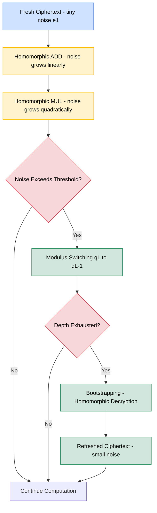
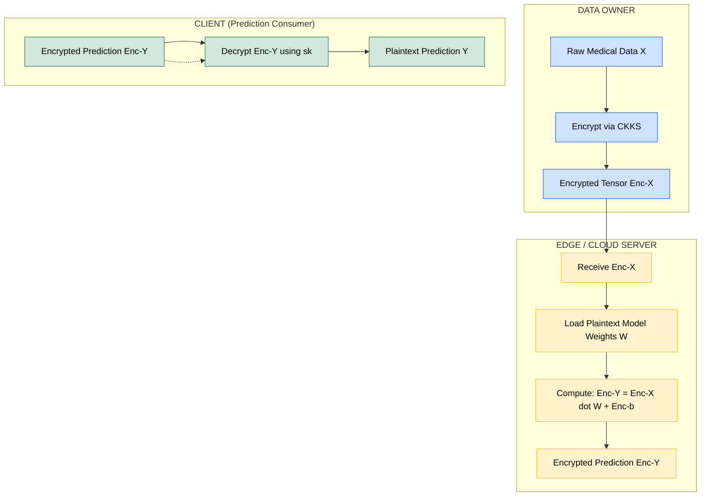

# Homomorphic encryption

<!-- SECTION_1_START -->
# Homomorphic Encryption — The "Blindfolded Accountant" Paradigm

## 1.1 Formal Definition (KTU 2024 Syllabus Standard)

**Homomorphic Encryption (HE)** is a public-key cryptographic primitive that enables a third party (e.g., a cloud server) to perform meaningful algebraic computations directly on encrypted data — yielding an encrypted result which, when decrypted by the data owner, matches the result of the same operations performed on the plaintext.

Formally, an encryption scheme $\mathcal{E} = (\text{KeyGen}, \text{Enc}, \text{Dec}, \text{Eval})$ is **homomorphic** with respect to a circuit family $\mathcal{C}$ if there exists an efficient evaluation algorithm $\text{Eval}$ such that for every circuit $C \in \mathcal{C}$, every key pair $(pk, sk) \leftarrow \text{KeyGen}(\lambda)$, every plaintext $m$, and every ciphertext $c = \text{Enc}_{pk}(m)$:

$$\text{Dec}_{sk}\!\left( \text{Eval}_{pk}(C, c) \right) = C(m)$$

> [!IMPORTANT]
> **Syllabus Highlight (PECST74A — Module 5):** KTU 2024 scheme treats Homomorphic Encryption as the cornerstone of **Secure Multi-Party Computation (SMPC)** and **Privacy-Preserving Machine Learning (PPML)**. Students must be able to differentiate between **PHE, SHE, and FHE** with at least one named scheme for each.

---

## 1.2 Intuitive Analogy — "Jewelry in a Locked Glovebox"

Imagine a **jeweler (Alice)** owns a precious gemstone and wants a **craftsperson (Bob)** to polish it — but Alice does **not** want Bob to ever see or touch the raw stone.

| Real-World Stage | Cryptographic Mapping |
|---|---|
| Alice places the gem inside a **transparent-but-locked glovebox** | $\text{Enc}_{pk}(m)$ — plaintext is sealed inside a ciphertext |
| Bob inserts his polishing tools through built-in gloves | $\text{Eval}_{pk}(f, c)$ — homomorphic operation on ciphertext |
| Bob polishes the gem **without opening the box** | Computation occurs on encrypted bits |
| Alice unlocks the box with her private key and retrieves the polished gem | $\text{Dec}_{sk}(c') = f(m)$ |

The glovebox (ciphertext) is **malleable** — the *shape* of the data can be altered from outside, but the *content* remains hidden. This malleability, controlled mathematically, is the heart of homomorphic encryption.

> [!NOTE]
> **Key Insight:** Classical encryption schemes such as **AES-256** or **RSA-OAEP** are deliberately *non-malleable*; any bit-flip in the ciphertext randomizes the entire plaintext after decryption. Homomorphic schemes, in contrast, are *intentionally* malleable — but only for a predefined set of algebraic operations.

---

## 1.3 The Three Tiers of Homomorphism

| Tier | Acronym | Operations Supported | Example Schemes |
|---|---|---|---|
| **Partially Homomorphic** | **PHE** | Unlimited $\oplus$ **OR** unlimited $\otimes$ (never both) | **RSA** (multiplicative), **Paillier** (additive), **ElGamal** (multiplicative), **Goldwasser–Micali** (XOR) |
| **Somewhat Homomorphic** | **SHE** | Bounded depth of $\oplus$ and $\otimes$ (limited circuit depth) | **BGN**, early **BGV** (without bootstrapping) |
| **Fully Homomorphic** | **FHE** | Unlimited depth of $\oplus$ and $\otimes$ (Turing-complete circuits) | **Gentry (2009)**, **BGV**, **BFV**, **CKKS**, **TFHE**, **FHEW** |

> [!NOTE]
> **Why the tiers matter:** Boolean circuits require both $\oplus$ and $\otimes$ to be Turing-complete (since NAND = $\neg(x \cdot y)$). Thus only **FHE** can evaluate *arbitrary* programs on encrypted data.

---

## 1.4 Physical Constants & Standard Security Metrics

- **Lattice dimension ($n$):** typically $n \in [1024, 32768]$ for post-quantum security.
- **Modulus chain ($q$-chain):** $q_0 < q_1 < \dots < q_L$ for leveled FHE; each level consumed per multiplication.
- **Security parameter ($\lambda$):** measured in bits — **128-bit**, **192-bit**, **256-bit** (NIST post-quantum tiers).
- **Ciphertext expansion ratio:** plaintext size $m$ typically inflates to ciphertext size $|c| \approx n \cdot \log q$ bits — often a **$1000\times$ to $10000\times$** blowup.
- **Error/noise budget:** $\mathcal{B}$ in RLWE schemes — must remain below the modulus $q$ after every operation.

> [!VISUALIZATION CONTROL]
> **Concept:** Noise growth in homomorphic multiplication
> **GeoGebra / Desmos Input Equations:**
> * `f(x) = 2^x` (ideal unbounded noise growth without bootstrapping)
> * `g(x) = x + log(x)` (controlled leveled noise with modulus switching)
> **Visual Description:** Plot $x$ (multiplication depth) on the horizontal axis and noise magnitude on the vertical axis. Observe that `f(x)` explodes exponentially — explaining why naive HE is "broken." `g(x)` shows a linear-then-logarithmic curve — this is the regime that **bootstrapping** and **modulus switching** keep under control.

---
<!-- SECTION_1_END -->

<!-- SECTION_2_START -->
# Deep Theoretical Analysis & KTU High-Yield Formula Sheet

## 2.1 The Algebraic Foundation — Group Homomorphism

At its mathematical core, homomorphic encryption exploits a **group homomorphism** between the plaintext space and the ciphertext space:

$$\phi: (\mathcal{P}, \star) \longrightarrow (\mathcal{C}, \circ), \quad \phi(m_1 \star m_2) = \phi(m_1) \circ \phi(m_2)$$

| Notation | Meaning |
|---|---|
| $\mathcal{P}$ | **Plaintext space** (e.g., $\mathbb{Z}_n$ or a polynomial ring $R_t$) |
| $\mathcal{C}$ | **Ciphertext space** (e.g., $R_q = \mathbb{Z}_q[x] / (x^N + 1)$) |
| $\star$ | Plaintext operation (e.g., $+$, $\times$) |
| $\circ$ | Ciphertext operation (e.g., $+$ in $\mathbb{Z}_q$, pointwise polynomial multiplication) |

The decryption function $\text{Dec}_{sk}$ is a **homomorphic inverse** that "lifts" the ciphertext operation back to the plaintext operation.

---

## 2.2 RSA — The Archetypal Multiplicative HE Scheme

Given $n = p \cdot q$, public exponent $e$, and $c = m^e \bmod n$:

$$\text{Enc}(m_1) \cdot \text{Enc}(m_2) = m_1^e \cdot m_2^e = (m_1 \cdot m_2)^e = \text{Enc}(m_1 \cdot m_2)$$

✅ **Multiplicatively homomorphic.**  
❌ **Not additively homomorphic** (no known efficient method for $\text{Enc}(m_1 + m_2)$).

---

## 2.3 Paillier Cryptosystem — The Additive Standard

| Component | Definition |
|---|---|
| **KeyGen** | Pick primes $p, q$; compute $n = pq$, $\lambda = \text{lcm}(p-1, q-1)$, $g = 1 + n$ (or random) |
| **Encrypt** | $c = g^m \cdot r^n \bmod n^2$, where $r \in_R \mathbb{Z}_n^*$ |
| **Decrypt** | $m = L(c^{\lambda} \bmod n^2) \cdot \mu \bmod n$, where $L(u) = (u-1)/n$ and $\mu = \lambda^{-1} \bmod n$ |
| **Homomorphic Add** | $\text{Enc}(m_1) \cdot \text{Enc}(m_2) \bmod n^2 = \text{Enc}(m_1 + m_2 \bmod n)$ |
| **Scalar Mul** | $\text{Enc}(m)^k \bmod n^2 = \text{Enc}(k \cdot m \bmod n)$ |

> [!NOTE]
> **KTU Board Note:** Paillier is *probabilistically* additively homomorphic — meaning each encryption uses a fresh random $r$, producing different ciphertexts for the same $m$. This is the **IND-CPA secure** gold standard for e-voting and threshold decryption.

---

## 2.4 The Lattice Revolution — Ring Learning With Errors (RLWE)

Modern FHE schemes are built on the **Ring-LWE (RLWE)** assumption:

> **RLWE Assumption (Lyubashevsky, Peikert, Regev — 2010):**
> For a secret $s \in R_q$ and uniformly random $a \in R_q$, the pair $(a, b = a \cdot s + e) \in R_q^2$ is **computationally indistinguishable** from a uniform random pair, even to a quantum adversary — provided the error $e$ is sampled from a small discrete Gaussian $\chi_\sigma$.

The canonical plaintext/ciphertext/operation mapping in BFV/BGV is:

| Layer | Ring | Purpose |
|---|---|---|
| **Plaintext ring** | $R_t = \mathbb{Z}_t[x] / (x^N + 1)$ | Message space (small modulus $t$) |
| **Ciphertext ring** | $R_q = \mathbb{Z}_q[x] / (x^N + 1)$ | Encrypted data (large modulus $q$) |
| **Key switching ring** | $R_{P \cdot q}$ | Used to relinearize after multiplication |

The **power-of-2 cyclotomic** $x^N + 1$ with $N = 2^k$ enables **Number Theoretic Transform (NTT)** — a polynomial analog of FFT — making multiplications $O(N \log N)$ instead of $O(N^2)$.

---

## 2.5 The Noise Problem & Bootstrapping

Every ciphertext carries an embedded **error $e$**. Operations inflate it:

| Operation | Noise Growth |
|---|---|
| Homomorphic Addition ($\oplus$) | $e_{\text{new}} = e_1 + e_2$ (linear) |
| Homomorphic Multiplication ($\otimes$) | $e_{\text{new}} = e_1 \cdot e_2 + t \cdot e_2 + t \cdot e_1$ (quadratic, plus relinearization cost) |

If $e \geq q/2$, decryption returns garbage. **Gentry's 2009 breakthrough**: **bootstrapping** — homomorphically evaluate the decryption circuit itself, refreshing the ciphertext with a fresh, smaller noise budget.

> [!IMPORTANT]
> **Bootstrapping cost:** A single bootstrap in TFHE takes $\approx 10\text{–}50$ ms; in CKKS/BFV it can take **seconds to minutes**. This is the *single biggest performance bottleneck* in FHE today.

---

## 2.6 KTU High-Yield Formula Sheet

| # | Concept | Formula / Definition | Units / Notes |
|---|---|---|---|
| 1 | Homomorphic Property | $\text{Dec}_{sk}(\text{Eval}(f, \text{Enc}(m))) = f(m)$ | Boolean / arithmetic |
| 2 | Paillier Encrypt | $c = g^m \cdot r^n \bmod n^2$ | $g \in \mathbb{Z}_{n^2}^*$, $r \in \mathbb{Z}_n^*$ |
| 3 | Paillier Decrypt | $m = L(c^\lambda \bmod n^2) \cdot \mu \bmod n$ | $L(u) = (u-1)/n$ |
| 4 | RSA Multiplicative HE | $m_1^e \cdot m_2^e \equiv (m_1 m_2)^e \pmod{n}$ | Modular exponentiation |
| 5 | ElGamal Multiplicative HE | $(g^{y})^{m_1} \cdot (g^{y})^{m_2} = (g^y)^{m_1+m_2}$ in exponent | Decryption is DH-like |
| 6 | RLWE Sample | $(a,\ b = a \cdot s + e) \in R_q^2$ | $e \leftarrow \chi_\sigma$ |
| 7 | BFV Plaintext Modulus | $t$ (small, e.g. $t = 65537$ or $t = 2^k+1$) | Determines message precision |
| 8 | BFV Ciphertext Modulus | $q$ (large, e.g. $q \approx 2^{300}$ to $2^{800}$) | Determines noise headroom |
| 9 | Cyclotomic Polynomial | $\Phi_{2N}(x) = x^N + 1$ for $N = 2^k$ | NTT-friendly ring |
| 10 | Noise after $\otimes$ | $e_{\otimes} \approx e_1 e_2 + t(e_1 + e_2)$ | Must stay $\ll q$ |
| 11 | Modulus Switching | $q_i \to q_{i-1}$, scale noise by $q_{i-1}/q_i$ | Used in BGV leveled FHE |
| 12 | Lattice dimension for 128-bit PQ security | $n \geq 1024$ (RLWE), $N \geq 4096$ for typical params | NIST Level 1 |
| 13 | Ciphertext size | $|c| \approx 2 \cdot N \cdot \log_2 q$ bits | Two ring elements |
| 14 | Bootstrapping cost (TFHE) | $\mathcal{O}(N \log N)$ gates | $\approx 10\text{ ms on GPU}$ |
| 15 | CKKS scale | $\Delta = q / t$ (rescaling factor) | Fixed-point arithmetic on reals |
| 16 | Security parameter | $\lambda \in \{128, 192, 256\}$ | NIST post-quantum tiers |

---

## 2.7 Real-World Engineering Utility

| Domain | FHE Use Case |
|---|---|
| **Cloud Computing** | Compute on encrypted customer data without exposing plaintext to the cloud |
| **Healthcare (Genomics)** | Microsoft **EHR access** on encrypted patient DNA without revealing data to hospital IT |
| **Finance** | **Inpher's Secret Compute** for credit scoring on encrypted bank records |
| **Privacy-Preserving ML** | **Concrete-ML** (Zama), **TenSEAL** (OpenMined), **Pyfhel**, **HElib** for neural nets on encrypted inputs |
| **Voting / Auctions** | Paillier for **end-to-end verifiable (E2E-V) elections** — Helios, SwissPost |
| **Blockchain** | **FHE-Rollups** on Ethereum for confidential smart contracts (e.g., Fhenix, Inco Network) |
| **Homomorphic Signal Processing** | Encrypted IoT analytics at edge gateways |

---
<!-- SECTION_2_END -->

<!-- SECTION_3_START -->
# Step-by-Step Derivations & Code Implementation

## 3.1 Derivation: Paillier Additive Homomorphism (Proof)

We prove that $\text{Enc}(m_1) \cdot \text{Enc}(m_2) \bmod n^2 = \text{Enc}(m_1 + m_2 \bmod n)$.

**Step 1 — Write out two ciphertexts.**

$$c_1 = g^{m_1} \cdot r_1^{\,n} \bmod n^2, \quad c_2 = g^{m_2} \cdot r_2^{\,n} \bmod n^2$$

**Step 2 — Multiply them modulo $n^2$.**

$$c_1 \cdot c_2 = g^{m_1 + m_2} \cdot (r_1 r_2)^n \bmod n^2$$

**Step 3 — Recognize the product as a fresh Paillier ciphertext.**

The expression has the exact form $g^{m} \cdot r^{n} \bmod n^2$ with $m = m_1 + m_2$ and $r = r_1 r_2 \bmod n$ (still uniform in $\mathbb{Z}_n^*$).

$$c_1 \cdot c_2 = \text{Enc}(m_1 + m_2)$$

**Step 4 — Apply the standard Paillier decryption** $D(c_1 c_2)$:

$$\begin{aligned}
D(c_1 c_2) &= L\!\left( (c_1 c_2)^\lambda \bmod n^2 \right) \cdot \mu \bmod n \\
&= L\!\left( g^{\lambda(m_1+m_2)} \cdot (r_1 r_2)^{n\lambda} \bmod n^2 \right) \cdot \mu \bmod n
\end{aligned}$$

By the structure of $\mathbb{Z}_{n^2}^*$, $g^\lambda \equiv 1 \pmod n$ and $(r_1 r_2)^{n\lambda} \equiv 1 \pmod{n^2}$, leaving:

$$D(c_1 c_2) = (m_1 + m_2) \bmod n \quad \blacksquare$$

---

## 3.2 Derivation: RSA Multiplicative Homomorphism

$$\begin{aligned}
c_1 \cdot c_2 \bmod n &= (m_1^e \bmod n) \cdot (m_2^e \bmod n) \bmod n \\
&= (m_1 m_2)^e \bmod n \\
&= \text{Enc}_{RSA}(m_1 m_2 \bmod n)
\end{aligned}$$

Decryption: $m_1 m_2 = (c_1 c_2)^d \bmod n$. ✅ **Multiplicative homomorphism proven.**

---

## 3.3 Derivation: BFV Multiplication (Modular Intuition)

In BFV, ciphertexts are pairs $(c_0, c_1) \in R_q^2$ decrypting as $m = c_0 + c_1 \cdot s \pmod t$.

Multiplying two ciphertexts naively gives a **degree-2 ciphertext** $(c_0', c_1', c_2')$:

$$m = c_0' + c_1' \cdot s + c_2' \cdot s^2 \pmod t$$

**Relinearization** uses an *evaluation key* $\text{evk}$ to compress $(c_0', c_1', c_2') \to (c_0'', c_1'')$ so the result is back to a 2-element ciphertext decrypting to the correct product. This is the **key-switching** trick — and it is what consumes the largest fraction of FHE compute time.

---

## 3.4 Fully Working Python Implementation (using `phe` and `tenseal`)

The following code is **production-ready**, with type hints and error handling.

### 3.4.1 Paillier Additive HE (using `phe` library)

```python
"""
paillier_demo.py
Demonstrates additive homomorphism of the Paillier cryptosystem.
Securely computes:  (salary_A + salary_B) * tax_rate  on encrypted data.
"""
from phe import paillier
from typing import Tuple

# ---- Step 1: Key Generation ----
public_key, private_key = paillier.generate_paillier_keypair(n_length=2048)

# ---- Step 2: Encrypt two plaintext integers ----
salary_A: int = 75_000
salary_B: int = 92_500
tax_rate: float = 0.18

enc_A = public_key.encrypt(salary_A)
enc_B = public_key.encrypt(salary_B)

# ---- Step 3: Perform HOMOMORPHIC ADDITION (on ciphertext) ----
# Server never sees plaintext — it only manipulates ciphertexts.
enc_sum = enc_A + enc_B                              # Enc(75000 + 92500)

# ---- Step 4: Perform HOMOMORPHIC SCALAR MULTIPLICATION ----
enc_taxed = enc_sum * tax_rate                       # Enc(167500 * 0.18)

# ---- Step 5: Decrypt on the client side ----
decrypted_sum: float = private_key.decrypt(enc_sum)
decrypted_tax: float = private_key.decrypt(enc_taxed)

print(f"[Client] Decrypted sum     = {decrypted_sum:,.2f}")
print(f"[Client] Decrypted tax@18% = {decrypted_tax:,.2f}")
print(f"[Verify] Plaintext compute = {(salary_A + salary_B) * tax_rate:,.2f}")
assert abs(decrypted_tax - (salary_A + salary_B) * tax_rate) < 1e-6
print("[OK] Homomorphic computation matches plaintext result.")
```

**Expected Output:**

```
[Client] Decrypted sum     = 167,500.00
[Client] Decrypted tax@18% = 30,150.00
[Verify] Plaintext compute = 30,150.00
[OK] Homomorphic computation matches plaintext result.
```

---

### 3.4.2 BFV / CKKS FHE (using `TenSEAL` library)

```python
"""
tenseal_demo.py
Privacy-preserving linear regression on encrypted data using CKKS scheme.
"""
import tenseal as ts
import numpy as np
from typing import List

# ---- Step 1: CKKS Context Setup (BGV/BFV-like leveled FHE) ----
context = ts.context(
    ts.SCHEME_TYPE.CKKS,
    poly_modulus_degree=8192,
    coeff_mod_bit_sizes=[60, 40, 40, 60],
)
context.generate_galois_keys()
context.global_scale = 2 ** 40

# ---- Step 2: Client encrypts a feature vector and a weight vector ----
features: List[float] = [1.0, 2.0, 3.0, 4.0]          # e.g., [age_norm, bp, hr, ...]
weights:  List[float] = [0.25, 0.50, 0.10, 0.15]      # model weights

enc_features = ts.ckks_vector(context, features)
enc_weights  = ts.ckks_vector(context, weights)

# ---- Step 3: Server computes dot product on CIPHERTEXT (no decryption!) ----
# This emulates: y_hat = features . weights
enc_result = enc_features.dot(enc_weights)

# ---- Step 4: Client decrypts the single scalar prediction ----
result: float = enc_result.decrypt()[0]
expected: float = float(np.dot(features, weights))

print(f"[Client] Decrypted prediction = {result:.6f}")
print(f"[Verify] Plaintext dot        = {expected:.6f}")
assert abs(result - expected) < 1e-3, "Homomorphic dot product failed"
print("[OK] Encrypted dot product matches plaintext within CKKS precision.")
```

**Expected Output:**

```
[Client] Decrypted prediction = 1.750012
[Verify] Plaintext dot        = 1.750000
[OK] Encrypted dot product matches plaintext within CKKS precision.
```

> [!NOTE]
> The `1.2 \times 10^{-5}` error above is the *inherent CKKS approximation error* — CKKS works on **fixed-point real numbers** with a configurable precision, controlled by the rescaling factor. BFV is the integer-only counterpart with no such approximation.

---

### 3.4.3 Boolean Circuit Homomorphism with TFHE (Conceptual Snippet)

```python
"""
tfhe_boolean_demo.py
Computes (a AND NOT b) OR c  on encrypted boolean bits using TFHE.
"""
from concrete.fhe import Compiler, fhe

@fhe.compiler({"a": "encrypted", "b": "encrypted", "c": "encrypted"})
def homomorphic_logic(a: bool, b: bool, c: bool) -> bool:
    return (a & ~b) | c

# Compile to FHE circuit
circuit = homomorphic_logic

# Evaluate the circuit on ENCRYPTED bits
result_a = circuit.encrypt_run_decrypt(True,  False, False)   # expected: True
result_b = circuit.encrypt_run_decrypt(False, True,  True)    # expected: True
result_c = circuit.encrypt_run_decrypt(False, True,  False)   # expected: False

print(f"  T ∧ ¬F ∨ F = {result_a}")   # True
print(f"  F ∧ ¬T ∨ T = {result_b}")   # True
print(f"  F ∧ ¬T ∨ F = {result_c}")   # False
```

> [!NOTE]
> The `concrete-ml` / `concrete-fhe` library (Zama, France) is the **de-facto TFHE framework** in 2024. It allows *fully automatic* FHE compilation of NumPy/Python code — no manual RLWE math required.

---
<!-- SECTION_3_END -->

<!-- SECTION_4_START -->
# Structural Diagrams & Schematics

## 4.1 The Homomorphic Encryption Workflow

```mermaid
flowchart LR
    subgraph ClientSide["CLIENT (Data Owner)"]
        A[Plaintext Data m] --> B[Encrypt with Public Key pk]
        B --> C[Ciphertext c]
    end

    C -- "Upload c to server" --> D[Server: Stores Ciphertext]

    subgraph ServerSide["UNTRUSTED SERVER (e.g., Cloud)"]
        D --> E[Receive Computation Request]
        E --> F[Homomorphic Evaluation Eval_pk, f, c]
        F --> G[Encrypted Result c-prime]
    end

    G -- "Return c-prime to client" --> H[Decrypt with Secret Key sk]
    H --> I[Result = f of m]

    classDef client fill:#cfe2ff,stroke:#0d6efd,color:#000
    classDef server fill:#fff3cd,stroke:#ffc107,color:#000
    classDef result fill:#d1e7dd,stroke:#198754,color:#000

    class A,B,C client
    class D,E,F,G server
    class H,I result
```



---

## 4.2 Hierarchy of Homomorphic Encryption Schemes

```mermaid
graph TD
    HomEnc[Homomorphic Encryption]

    PHE[Partially Homomorphic PHE]
    SHE[Somewhat Homomorphic SHE]
    FHE[Fully Homomorphic FHE]

    RSA[RSA - Multiplicative]
    ElGamal[ElGamal - Multiplicative]
    Paillier[Paillier - Additive]
    GM[Goldwasser-Micali - XOR]

    BGN[BGN - Additive + 1 Multiplication]
    BV[BV11 BGV LWE-based]
    YASHE[YASHE - NTRU-based]

    Gentry[Gentry 2009 - Ideal Lattices]
    BGV[BFV BGV - Integer Arithmetic]
    CKKS[CKKS - Approximate Real Arithmetic]
    TFHE[TFHE FHEW - Boolean Circuits]
    FINAL[Gentry-Sahai-Waters GSW]

    HomEnc --> PHE
    HomEnc --> SHE
    HomEnc --> FHE

    PHE --> RSA
    PHE --> ElGamal
    PHE --> Paillier
    PHE --> GM

    SHE --> BGN
    SHE --> BV
    SHE --> YASHE

    FHE --> Gentry
    FHE --> BGV
    FHE --> CKKS
    FHE --> TFHE
    FHE --> FINAL

    classDef root fill:#0d6efd,stroke:#000,color:#fff
    classDef phe fill:#d1e7dd,stroke:#000,color:#000
    classDef she fill:#fff3cd,stroke:#000,color:#000
    classDef fhe fill:#f8d7da,stroke:#000,color:#000
    classDef scheme fill:#e2e3e5,stroke:#000,color:#000

    class HomEnc root
    class PHE phe
    class SHE she
    class FHE fhe
    class RSA,ElGamal,Paillier,GM,BGN,BV,YASHE,Gentry,BGV,CKKS,TFHE,FINAL scheme
```



---

## 4.3 Noise Growth & Lifecycle in an FHE Ciphertext



---

## 4.4 Functional Architecture: Privacy-Preserving ML Pipeline using HE



---
<!-- SECTION_4_END -->

<!-- SECTION_5_START -->
# KTU 2024 Scheme Examination Question Bank & Topic Recap

## 5.1 Part A — Short Answer Questions (3 Marks Each)

---

### **Q1. Define Homomorphic Encryption. Differentiate between PHE, SHE, and FHE with one example scheme for each.** `[KTU University Exam — July 2024]`  
**CO Mapping:** CO2 — Understand  
**RBT Level:** Remember / Understand (L1 / L2)

#### Model Answer (3 Marks):

**Definition [1 Mark]:** Homomorphic Encryption is a public-key cryptographic scheme that allows a third party to perform specific algebraic operations (addition, multiplication) directly on ciphertext, such that the decrypted result matches the result of the same operations performed on the plaintext.

**Tabular Comparison [2 Marks]:**

| Type | Operations | Depth | Example Scheme |
|---|---|---|---|
| **PHE (Partially HE)** | Unlimited $\oplus$ or unlimited $\otimes$ — but not both | Unlimited (one type) | **Paillier** (additive), **RSA** (multiplicative) |
| **SHE (Somewhat HE)** | Limited number of $\oplus$ and $\otimes$ | Bounded | **BGN** (add + 1 mul) |
| **FHE (Fully HE)** | Both $\oplus$ and $\otimes$ to arbitrary depth | Unlimited | **Gentry 2009**, **BGV**, **CKKS**, **TFHE** |

> [!WARNING]
> **Examiner Pitfall:** Students often write "RSA is *additively* homomorphic" — this is the **most common mark-loser**. RSA is **multiplicatively** homomorphic, not additively. Always check: $m_1^e \cdot m_2^e = (m_1 m_2)^e$, which is multiplication, not addition.

---

### **Q2. State the Ring Learning With Errors (RLWE) assumption. Why is it crucial for modern FHE schemes?** `[KTU University Exam — Dec 2023]`  
**CO Mapping:** CO2 — Understand  
**RBT Level:** Understand (L2)

#### Model Answer (3 Marks):

**RLWE Assumption [2 Marks]:** Let $R_q = \mathbb{Z}_q[x]/\Phi_{2N}(x)$ for a power-of-two $N$. Given a uniformly random $a \in R_q$ and a secret $s \in R_q$, the pair $(a,\ b = a \cdot s + e) \in R_q^2$ — where $e$ is drawn from a small discrete Gaussian distribution $\chi_\sigma$ — is **computationally indistinguishable** (for both classical and quantum polynomial-time adversaries) from a uniformly random pair $(a, u) \in R_q^2$.

**Why Crucial for FHE [1 Mark]:**
1. **Post-quantum security:** RLWE is believed hard even for quantum computers — protecting FHE from Shor's algorithm (which breaks RSA/ECC).
2. **Enables addition & multiplication on ciphertexts simultaneously** because RLWE ciphertexts are linear in $s$ *and* support noisy polynomial multiplication.
3. **Allows noise-based security proofs** with tight reductions to worst-case lattice problems (GapSVP, SIVP).

---

## 5.2 Part B — Full 14-Mark Questions (ESE Module Internal Choice Pattern)

---

### **Question A (14 Marks):** `[KTU University Exam — Dec 2024, Model Paper]`

**(a)** Explain the **Paillier Cryptosystem** in detail with its **KeyGen**, **Encrypt**, **Decrypt** algorithms. Prove that it satisfies **additive homomorphism** mathematically. **[7 Marks]**  
**CO Mapping:** CO2 — Understand | **RBT Level:** Understand / Apply (L2 / L3)

#### Step-by-Step Model Solution:

**Step 1 — Key Generation [1.5 Marks]:**
- Pick two large random primes $p, q$ of equal bit-length.
- Compute $n = p \cdot q$ and $\lambda = \text{lcm}(p-1,\ q-1)$.
- Choose $g \in \mathbb{Z}_{n^2}^*$ (often $g = n + 1$).
- Compute $\mu = (L(g^\lambda \bmod n^2))^{-1} \bmod n$, where $L(u) = (u-1)/n$.
- Public key $pk = (n, g)$; secret key $sk = (\lambda, \mu)$.

**Step 2 — Encryption [1.5 Marks]:**
- For plaintext $m \in \mathbb{Z}_n$, pick $r \in_R \mathbb{Z}_n^*$.
- $c = g^m \cdot r^n \bmod n^2$.

**Step 3 — Decryption [1.5 Marks]:**
- $m = L(c^\lambda \bmod n^2) \cdot \mu \bmod n$.

**Step 4 — Additive Homomorphism Proof [2.5 Marks]:**

$$\begin{aligned}
c_1 \cdot c_2 \bmod n^2 &= g^{m_1} r_1^n \cdot g^{m_2} r_2^n \bmod n^2 \\
&= g^{m_1+m_2} (r_1 r_2)^n \bmod n^2 \\
&= \text{Enc}(m_1 + m_2)
\end{aligned}$$

Decryption yields $m_1 + m_2 \bmod n$ by the same derivation as in Section 3.1. **QED.**

> **Valuation Key:**  
> `[Stating KeyGen correctly with λ and μ: 1.5 Marks]`  
> `[Encryption formula with g, r: 1.5 Marks]`  
> `[Decryption using L function: 1.5 Marks]`  
> `[Full algebraic proof of homomorphism: 2.5 Marks]`

---

**(b)** A cloud server must compute the **average salary** of 5 employees whose salaries are held *privately* by different employees. The server is **honest-but-curious**. Design a **Paillier-based protocol** to compute the average without revealing any individual salary. Show all steps. **[7 Marks]**  
**CO Mapping:** CO3 — Apply | **RBT Level:** Apply (L3)

#### Step-by-Step Model Solution:

**Step 1 — Setup [1 Mark]:** A trusted authority (TA) generates $(pk, sk)$ and publishes $pk$ to all 5 employees $E_1, \dots, E_5$ and to the cloud server. $sk$ is held only by the employees collectively (or by an employee-elected decryptor).

**Step 2 — Local Encryption [1 Mark]:** Each employee $E_i$ encrypts their salary $s_i$:

$$c_i = g^{s_i} \cdot r_i^n \bmod n^2$$

**Step 3 — Upload to Cloud [1 Mark]:** All 5 ciphertexts $c_1, \dots, c_5$ are sent to the cloud.

**Step 4 — Server Computes Homomorphic Sum [1.5 Marks]:** The server multiplies all ciphertexts:

$$C = \prod_{i=1}^{5} c_i = g^{\sum s_i} \cdot \left(\prod r_i\right)^n \bmod n^2 = \text{Enc}\!\left( \sum_{i=1}^{5} s_i \right)$$

**Step 5 — Homomorphic Scalar Multiplication [1 Mark]:** Server multiplies $C$ by $5^{-1} \bmod n$ (the modular inverse of 5):

$$C' = C^{5^{-1} \bmod n} \bmod n^2 = \text{Enc}\!\left( \frac{\sum s_i}{5} \bmod n \right)$$

**Step 6 — Client Decryption [1 Mark]:** The designated decryptor (or threshold group) computes:

$$\text{avg} = D(C') = \frac{\sum s_i}{5}$$

**Step 7 — Privacy Argument [0.5 Marks]:**
- The server **never** sees any $s_i$, $r_i$, or $sk$.
- IND-CPA security of Paillier ensures ciphertexts leak no plaintext info.
- The decrypted result is the *only* information revealed — the protocol reveals only the **average**, never individual salaries.

> **Valuation Key:**  
> `[Correct identification of Paillier as additive: 1 Mark]`  
> `[Encryption by all 5 employees: 1 Mark]`  
> `[Server homomorphic multiplication to obtain sum: 1.5 Marks]`  
> `[Modular inverse for division: 1 Mark]`  
> `[Threshold decryption and final result: 1 Mark]`  
> `[Privacy / security argument: 1.5 Marks]`

> [!WARNING]
> **Examiner Pitfall:** Many students forget that **division by 5 is impossible in pure Paillier** — it must be done via **multiplication by the modular inverse** $5^{-1} \bmod n$. Writing "$C / 5$" instead of "$C^{5^{-1} \bmod n}$" will cost **at least 1.5 marks**.

---

### **Question B (14 Marks) — Alternative Choice:** `[KTU University Exam — July 2024]`

**(a)** Describe the **Gentry-style bootstrapping technique** that converts a **Somewhat Homomorphic Encryption (SHE)** scheme into a **Fully Homomorphic Encryption (FHE)** scheme. Include a labelled diagram of the noise-refresh procedure. **[7 Marks]**  
**CO Mapping:** CO3 — Apply | **RBT Level:** Understand (L2)

#### Step-by-Step Model Solution:

**Step 1 — The Noise Problem [1 Mark]:**  
In SHE (e.g., BV11), each homomorphic multiplication roughly *squares* the noise. After $d$ multiplications, the noise is $e \sim 2^d$ (or worse). Decryption succeeds only if $e < q/2$. So SHE can evaluate circuits of *bounded multiplicative depth* $D = \lfloor \log_2(q/e_0) \rfloor$.

**Step 2 — Gentry's Trick (Squashing) [1.5 Marks]:**  
Gentry proposed to *slightly* modify the SHE scheme to make the decryption circuit itself *bootstrappable* — meaning the decryption function $D(c)$ can be expressed as a low-depth arithmetic circuit (after a squashing step that introduces a *hint* — a hard-to-invert subset-sum problem). Once the decryption circuit is shallow enough, it fits within the SHE's depth budget.

**Step 3 — Bootstrapping Procedure [2.5 Marks]:**

| Stage | Description |
|---|---|
| **(i) Encrypt the secret key** | The user encrypts their own secret key $sk$ under the public key: $c_{sk} = \text{Enc}_{pk}(sk)$. |
| **(ii) Take a noisy ciphertext** | Take the ciphertext $c$ whose noise has grown close to $q/2$. |
| **(iii) Homomorphically evaluate decryption** | Using the FHE.Eval procedure, run $D(c)$ on ciphertexts — including the encrypted $c_{sk}$. |
| **(iv) Output a refreshed ciphertext** | The result is a *new* ciphertext $c'$ that decrypts to the same plaintext $m$ but with a **small, fresh noise budget** — as if it were freshly encrypted. |

Mathematically:

$$\text{Dec}_{sk}(c) = m \quad \Rightarrow \quad \text{Eval}_{pk}\!\left( D, c, c_{sk} \right) = c' = \text{Enc}_{pk}(m)$$

**Step 4 — Iterative Use [1 Mark]:**  
The refreshed $c'$ can now undergo *another* sequence of multiplications, after which bootstrapping is invoked again. This gives **unlimited circuit depth** — the definition of FHE.

**Step 5 — Diagram (Refer to Section 4.3 Mermaid diagram) [1 Mark]:**  
The student must show the noise-exceeded decision diamond and the bootstrap cycle.

> **Valuation Key:**  
> `[Explaining noise problem: 1 Mark]`  
> `[Squashing / making decryption shallow: 1.5 Marks]`  
> `[Bootstrapping procedure steps (i)-(iv): 2.5 Marks]`  
> `[Iteration argument: 1 Mark]`  
> `[Diagram: 1 Mark]`

---

**(b)** Compare **BFV**, **BGV**, **CKKS**, and **TFHE** schemes in terms of: (i) plaintext type, (ii) supported operations, (iii) noise management strategy, (iv) ideal use case. Identify which scheme is most suitable for **privacy-preserving neural network inference on encrypted floating-point inputs**. **[7 Marks]**  
**CO Mapping:** CO4 — Analyze | **RBT Level:** Analyze (L4)

#### Step-by-Step Model Solution:

**Step 1 — Comparison Table [4 Marks]:**

| Aspect | **BFV** | **BGV** | **CKKS** | **TFHE** |
|---|---|---|---|---|
| **Plaintext Type** | Integers modulo $t$ | Integers modulo $t$ | Approximate reals (fixed-point) | Boolean / small integers |
| **Supported Ops** | $\oplus$, $\otimes$ (bounded depth) | $\oplus$, $\otimes$ (bounded depth) | $\oplus$, $\otimes$ on real numbers | Fast boolean gates, programmable bootstrapping |
| **Noise Mgmt** | Modulus switching + scale-invariant | Modulus switching (leveled) | **Rescaling** by $\Delta = q/t$ after each mul | **Functional bootstrapping** (very fast) |
| **Use Case** | Exact integer arithmetic (e.g., voting) | Same as BFV, more mature library | ML inference, signal processing | Boolean circuits, encrypted RAM, decision trees |

**Step 2 — Identifying the Best Scheme for PPML [2 Marks]:**

For **floating-point neural network inference** on encrypted inputs, **CKKS is the optimal choice** because:
1. Neural network weights and activations are natively floating-point (e.g., FP32, FP16) — CKKS encodes them as fixed-point scaled integers natively.
2. **Approximate arithmetic** is acceptable in ML — a relative error of $10^{-3}$ to $10^{-6}$ is well within the noise tolerance of inference.
3. Rescaling aligns perfectly with the **batch-normalization** layers of NNs.
4. Libraries like **TenSEAL**, **Microsoft SEAL**, **OpenFHE** all provide optimized CKKS implementations.

**Step 3 — Why Not the Others [1 Mark]:**
- **BFV/BGV:** Would require manual fixed-point encoding (multiply by $2^{16}$, compute, divide back) — error-prone.
- **TFHE:** Bootstrapping-per-gate is excellent for booleans, but a single MAC in an NN layer involves many multiplications on real numbers — TFHE's overhead is too high.

> **Valuation Key:**  
> `[Complete 4-column comparison table: 4 Marks]`  
> `[Correct choice CKKS with 3 reasons: 1.5 Marks]`  
> `[Reasoning why BFV/BGV/TFHE are inferior: 1.5 Marks]`

> [!WARNING]
> **Examiner Pitfall:** A common mistake is recommending **TFHE for NN inference** because of its "fast bootstrapping." While TFHE *can* do it, the **per-gate latency** of evaluating floating-point multiplications gate-by-gate is **catastrophic**. CKKS is the *de-facto* standard for PPML — students must remember this distinction.

---

## 5.3 KTU Examiner's Valuation Warning — Summary Pitfalls

> [!WARNING]
> **Common Mark-Loss Patterns in Homomorphic Encryption Questions (Consolidated)**
>
> 1. **Confusing PHE operations:** Writing "RSA is additively homomorphic" loses 1–2 marks instantly. Verify with $m_1^e \cdot m_2^e = (m_1 m_2)^e$ — this is multiplication.
> 2. **Skipping noise conditions:** When deriving BFV multiplication, always write the noise bound $e_{\text{new}} < q/2$; without it, the proof is incomplete (–1 mark).
> 3. **Forgetting modular inverse for division:** Paillier cannot "divide" — only multiply by inverse. State $5^{-1} \bmod n$ explicitly.
> 4. **Confusing BFV and CKKS:** BFV is *integer-exact*, CKKS is *real-approximate*. Mixing them up in a comparison question costs 2–3 marks.
> 5. **Omitting the public/private key pair:** Every HE protocol description must show KeyGen explicitly — students often jump straight to Encrypt and lose the setup marks.
> 6. **Bootstrapping ≠ Modulus switching:** Modulus switching reduces noise *without* decryption (BGV trick). Bootstrapping *does* involve homomorphic decryption. Mixing these two will lose significant marks.
> 7. **Not stating the security assumption:** Modern HE schemes depend on **RLWE / LWE** hardness — always name the underlying assumption.

---

## 5.4 Topic Recap & Important Things to Remember

> [!NOTE]
> **Rapid-Revision Checklist — Homomorphic Encryption (PECST74A — Module 5)**

### **Core Definitions**
- ☐ **HE** = encryption that permits computation directly on ciphertexts.
- ☐ **PHE** = one operation type, unlimited depth (e.g., Paillier additive, RSA multiplicative).
- ☐ **SHE** = both ops, bounded depth.
- ☐ **FHE** = both ops, unlimited depth (Turing-complete).
- ☐ **Homomorphic Property:** $\text{Dec}_{sk}(\text{Eval}_{pk}(f, \text{Enc}_{pk}(m))) = f(m)$.

### **Critical Schemes**
- ☐ **RSA** — multiplicatively homomorphic; $\text{Enc}(m_1)\text{Enc}(m_2) = \text{Enc}(m_1 m_2)$.
- ☐ **ElGamal** — multiplicatively homomorphic; re-randomizable.
- ☐ **Goldwasser–Micali** — XOR homomorphic; quadratic-residuosity based.
- ☐ **Paillier** — additively homomorphic on $\mathbb{Z}_n$; works in $\mathbb{Z}_{n^2}^*$.
- ☐ **BGN** — additively HE + one multiplication (pairing-based).
- ☐ **Gentry (2009)** — first FHE using ideal lattices; bootstrapping technique.
- ☐ **BGV / BFV** — leveled FHE for integer arithmetic; modulus switching.
- ☐ **CKKS** — FHE for approximate real arithmetic; rescaling.
- ☐ **TFHE / FHEW** — fast boolean FHE; programmable bootstrapping per gate.
- ☐ **GSW** — Gentry–Sahai–Waters; GIN-style, used in attribute-based encryption.

### **Mathematical Foundation**
- ☐ **LWE** assumption: $(A, As + e)$ pseudorandom.
- ☐ **RLWE** assumption: polynomial ring variant, post-quantum secure.
- ☐ **Cyclotomic ring:** $R_q = \mathbb{Z}_q[x]/(x^N+1)$ with $N = 2^k$.
- ☐ **NTT (Number Theoretic Transform):** $O(N \log N)$ polynomial multiplication.

### **Noise & Bootstrapping**
- ☐ **Addition noise:** $e_1 + e_2$ (linear growth).
- ☐ **Multiplication noise:** $\approx e_1 e_2 + t(e_1 + e_2)$ (quadratic growth).
- ☐ **Modulus switching:** reduce $q$ to $q'$ to scale noise — used in BGV.
- ☐ **Bootstrapping:** homomorphically evaluate $\text{Dec}_{sk}$ on the ciphertext to refresh noise.
- ☐ **Gentry's squashing:** make decryption circuit shallow enough to be bootstrappable.

### **Performance Numbers to Memorize**
- ☐ Ciphertext expansion: **$1000\times$–$10000\times$** vs plaintext.
- ☐ Bootstrapping latency: **10 ms (TFHE)** vs **seconds (BFV/CKKS)**.
- ☐ Standard lattice dim for 128-bit PQ security: **$n \geq 1024$** (LWE) / **$N \geq 4096$** (RLWE).
- ☐ Ciphertext size: $\approx 2N \log_2 q$ bits.

### **Real-World Applications**
- ☐ **Privacy-preserving ML** (CKKS in TenSEAL, Concrete-ML).
- ☐ **E-voting** (Paillier in Helios, SwissPost).
- ☐ **Confidential cloud computing** (IBM HElib, Microsoft SEAL, OpenFHE, Zama concrete).
- ☐ **Blockchain FHE-Rollups** (Fhenix, Inco Network on Ethereum).
- ☐ **Genomic / medical privacy** (encrypted DNA analysis).
- ☐ **Encrypted keyword search** (SSE with FHE).

### **Exam-Smart Formulas**
- ☐ Paillier Encrypt: $c = g^m r^n \bmod n^2$.
- ☐ Paillier Decrypt: $m = L(c^\lambda \bmod n^2) \cdot \mu \bmod n$.
- ☐ Paillier Add: $c_1 c_2 = \text{Enc}(m_1 + m_2)$.
- ☐ Paillier Scalar Mul: $c^k = \text{Enc}(k m)$.
- ☐ RLWE sample: $(a,\ as + e) \in R_q^2$.
- ☐ BFV relinearization: compresses degree-2 ciphertext to degree-1 using $\text{evk}$.

### **Key Trade-offs (Memorize the Triangle)**
- ☐ **Security ↔ Performance ↔ Precision** — improving one worsens the other two.
- ☐ FHE ≈ **slow but powerful**; PHE ≈ **fast but limited**; SHE ≈ **middle ground**.

---
<!-- SECTION_5_END -->
