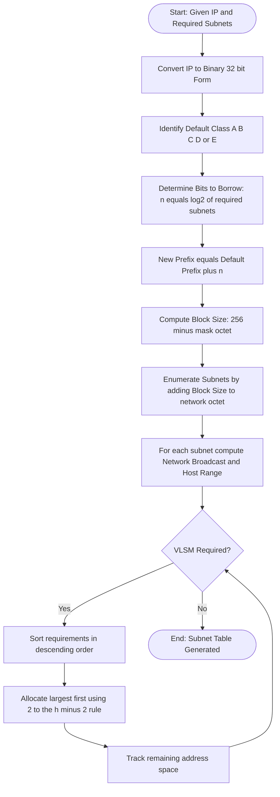
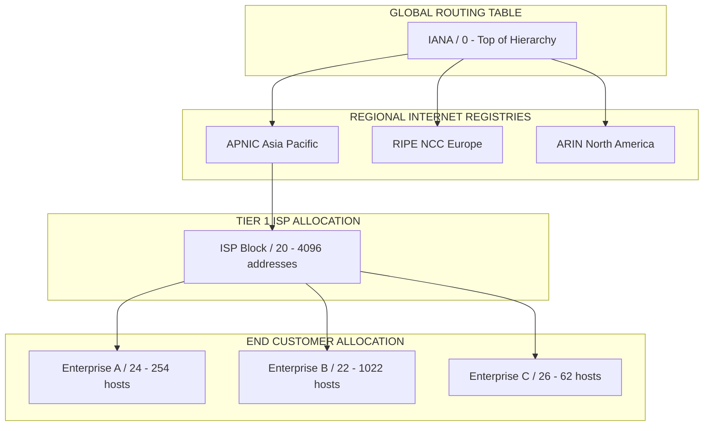
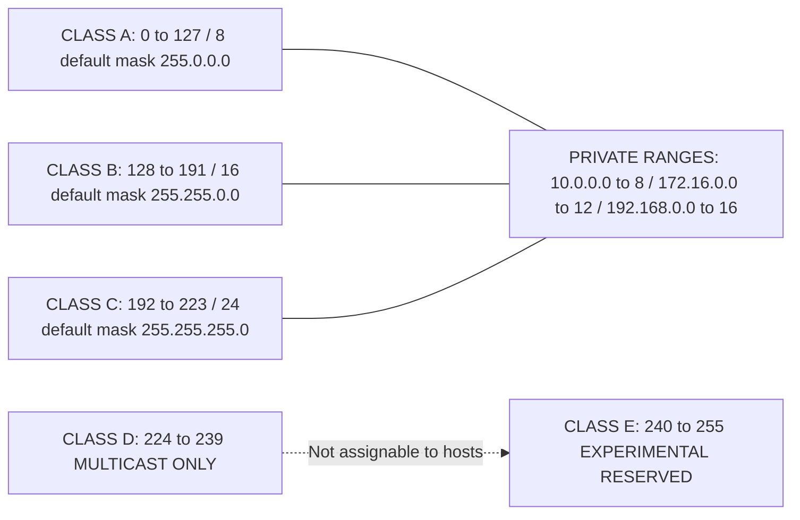

# IP Addressing and Subnetting

<!-- SECTION_1_START -->
# IP Addressing and Subnetting — Core Technical Definition & Intuitive Overview

> [!IMPORTANT]
> **KTU 2024 Scheme — PECST751 (Advanced Computer Networks) | Module 1 | Topic 3**
> This topic forms the bedrock of every advanced networking concept (BGP, OSPF, MPLS, SDN). Expect direct questions in ESE and a high recall value in university lab viva voce.

## 1.1 Formal Academic Definition

An **IP Address** is a **32-bit logical numeric identifier** assigned to every device participating in a computer network that uses the **Internet Protocol (IPv4)** for communication. It serves two simultaneous purposes:

1. **Network Identification** — locating the specific network a host belongs to.
2. **Host Identification** — locating the specific device inside that network.

It is represented in **Dotted-Decimal Notation** (e.g., `192.168.1.10`), where each decimal value corresponds to an **8-bit octet** separated by dots.

**Subnetting** is the logical subdivision of a large network into smaller, manageable **sub-networks (subnets)** by borrowing bits from the **host portion** of the IP address and re-assigning them to the **network portion**, using a **Subnet Mask**.

> [!NOTE]
> **IPv4 vs IPv6 (KTU Highlight)**
> IPv4 uses **32 bits** $\rightarrow$ $\approx$ **4.29 × 10⁹** addresses (exhausted in 2011 at IANA level). IPv6 uses **128 bits** $\rightarrow$ **3.4 × 10³⁸** addresses. This module focuses on **IPv4** because subnetting mathematics is a core examinable outcome (CO1, CO2 of PECST751).

## 1.2 Conceptual Analogy — The "Apartment Building" Model

Imagine an IP address as a **postal address in a metropolitan city**:

| IP Concept | Real-World Analogy |
|---|---|
| **Network Portion** (`192.168.1`) | Name of the **Apartment Complex** |
| **Host Portion** (`10`) | Specific **Flat Number** inside the complex |
| **Subnet Mask** (`/24`) | The **rulebook** defining how flat numbers are counted |
| **Subnetting** | Dividing a giant building into **multiple towers with their own gatekeepers (routers)** |

> A **router** is the gatekeeper — it only reads the *apartment complex name* (network portion) to forward your letter to the right building. The **switch** inside the building reads the *flat number* (host portion) to deliver it to the correct room.

## 1.3 The Core Architectural Triad

Every IPv4 problem-solving workflow rests on three pillars:

$$
\text{IP Address} = \underbrace{\text{Network Bits}}_{\text{Router reads this}} \;+\; \underbrace{\text{Host Bits}}_{\text{Device reads this}}
$$

$$
\text{Subnet Mask} = \underbrace{1\text{s (Continuous from MSB)}}_{\text{Network} + \text{Subnet bits}} \;+\; \underbrace{0\text{s}}_{\text{Host bits}}
$$

$$
\text{CIDR Notation: } \texttt{IP\_Address}/\text{prefix\_length} \quad \text{(e.g., } 192.168.1.0/24\text{)}
$$

## 1.4 GeoGebra / Desmos Visualization

> [!VISUALIZATION CONTROL]
> **Concept:** Subnet Address Range Distribution Along a Number Line
> **GeoGebra / Desmos Input Equations:**
> * `f(x) = 192.168.1.0` (Network A start)
> * `g(x) = 192.168.1.63` (Network A end)
> * `h(x) = 192.168.1.64` (Network B start)
> * `k(x) = 192.168.1.127` (Network B end)
> **Visual Description:** Plot the four boundary points on a number line. Observe the **block size = 64** addresses. The pattern is strictly **contiguous and non-overlapping** — this is the geometry of a `/26` subnetting scheme.

<!-- SECTION_1_END -->

<!-- SECTION_2_START -->
# Deep Theoretical Analysis & KTU High-Yield Formula Sheet

## 2.1 The IPv4 Address Class Hierarchy (Classful Addressing)

Originally, IPv4 used **Classful Addressing** (defined in **RFC 791**, 1981). Each class has a fixed default subnet mask:

| Class | Leading Bits | First Octet Range (Decimal) | Default Mask | Network $\vert$ Host Bits | Max Networks | Max Hosts per Network |
|---|---|---|---|---|---|---|
| **A** | `0` | 1 – 126 | `/8` (255.0.0.0) | 8 $\vert$ 24 | 2⁷ = 128 | 2²⁴ – 2 = 16,777,214 |
| **B** | `10` | 128 – 191 | `/16` (255.255.0.0) | 16 $\vert$ 16 | 2¹⁴ = 16,384 | 2¹⁶ – 2 = 65,534 |
| **C** | `110` | 192 – 223 | `/24` (255.255.255.0) | 24 $\vert$ 8 | 2²¹ = 2,097,152 | 2⁸ – 2 = 254 |
| **D** | `1110` | 224 – 239 | — | — | Reserved for **Multicast** |
| **E** | `1111` | 240 – 255 | — | — | Reserved for **Experimental/Research** |

> [!IMPORTANT]
> **Address `127.x.x.x` is the Loopback Range** (typically `127.0.0.1` = the local machine itself). Address `0.0.0.0` means *"this network"* or *"any IP"*.

## 2.2 Subnet Mask — The Bitmask Decoder

The subnet mask is **not an IP address** — it is a **bit-pattern filter** that tells the router: *"the first N bits are network, the remaining 32 − N bits are host."*

**Conversion Logic (Decimal to Binary):**

$$
255 = 11111111_2 \quad\quad 254 = 11111110_2 \quad\quad 252 = 11111100_2 \quad\quad 248 = 11111000_2
$$

$$
240 = 11110000_2 \quad\quad 224 = 11100000_2 \quad\quad 192 = 11000000_2 \quad\quad 128 = 10000000_2
$$

> [!NOTE]
> **KTU 2024 Quick Trick:** Memorize the sequence $255, 254, 252, 248, 240, 224, 192, 128, 0$ — it is the **decreasing even powers of 2** in the octet. Every IP subnetting problem reduces to manipulating this table.

## 2.3 KTU High-Yield Formula Sheet (Master Cheat Sheet)

| # | Parameter | Formula | Variable Definitions |
|---|---|---|---|
| 1 | **Number of Subnets** | $N_s = 2^{n}$ | $n$ = bits **borrowed** from host portion |
| 2 | **Number of Usable Hosts** | $N_h = 2^{h} - 2$ | $h$ = remaining host bits (subtract 2 for **Network** & **Broadcast** addresses) |
| 3 | **Block Size (Magic Number)** | $B = 256 - \text{(Mask Octet Value})$ | The increment between consecutive subnets |
| 4 | **Subnets Created (when $n \ge 2$)** | $N_s^{\text{usable}} = 2^{n} - 2$ | Only for **classful** boundary subnetting (RFC 950 obsolete) |
| 5 | **Wildcard Mask** (Cisco) | $W = \text{255.255.255.255} - \text{Subnet Mask}$ | Used in ACLs and OSPF network statements |
| 6 | **Total Addresses in Subnet** | $T = 2^{h}$ | Includes Network + Broadcast |
| 7 | **Broadcast Address** | $\text{Network} + (2^{h} - 1)$ | Last address in the subnet |
| 8 | **Valid Host Range** | $(\text{Network} + 1)$ to $(\text{Broadcast} - 1)$ | Endpoints that can be assigned to devices |
| 9 | **CIDR Aggregation (Supernetting)** | $\text{Netmask} \rightarrow \text{Common Prefix}$ | Combining multiple networks into a single route |
| 10 | **VLSM Subnet Ordering** | Sort by **descending host requirement** | Always allocate the largest subnet first |

## 2.4 Engineering Utility & Real-World Applications

- **ISP Address Allocation:** Regional ISPs receive CIDR blocks (e.g., `/20`) from APNIC/RIPE and sub-allocate to customers.
- **Enterprise Network Design:** A 24-story corporate office uses **VLSM** so that the Accounts Department (50 users) does not waste the 254-host capacity reserved for the entire IT wing.
- **Cloud Virtualization (AWS/Azure):** A `/16` VPC is subnetted into `/24` subnets per Availability Zone for traffic isolation.
- **SDN (Software-Defined Networking):** OpenFlow controllers compute subnet boundaries algorithmically using these exact formulas.

> [!NOTE]
> **Production Reality:** Modern networks are **classless** (CIDR-based). The classful boundaries (A/B/C) are now **legacy knowledge** — what matters today is the **prefix length `/N`**.

<!-- SECTION_2_END -->

<!-- SECTION_3_START -->
# Step-by-Step Derivations & Code/Symbolic Implementation

## 3.1 Example 1 — Fixed-Length Subnetting (FLSM)

> **Problem:** Given network `200.10.20.0/24`, design **4 equal subnets**. List the **Network Address, Broadcast Address, and Valid Host Range** for each.

### Step 1 — Determine the number of bits to borrow

$$
n = \log_2(4) = 2 \text{ bits}
$$

### Step 2 — Compute the new prefix length

$$
\text{New Prefix} = 24 + 2 = /26
$$

### Step 3 — Compute the new Subnet Mask

$$
\text{Default Mask} = 255.255.255.0 \quad\Rightarrow\quad \text{New Mask} = 255.255.255.192
$$

**Binary proof of `/26` mask:**

$$
\begin{aligned}
\text{Octet 4} &= 192_{10} \\
&= 128 + 64 \\
&= 11000000_2
\end{aligned}
$$

The first **26 bits** are `1`s; the last **6 bits** are `0`s.

### Step 4 — Compute the Block Size (Magic Number)

$$
B = 256 - 192 = 64
$$

This means consecutive subnets are separated by **64 addresses**.

### Step 5 — Compute Usable Hosts per Subnet

$$
h = 32 - 26 = 6 \text{ host bits}
$$

$$
N_h = 2^{6} - 2 = 64 - 2 = 62 \text{ usable hosts per subnet}
$$

### Step 6 — Tabulate the Four Subnets

| Subnet | Network Address | First Usable Host | Last Usable Host | Broadcast Address |
|---|---|---|---|---|
| **Subnet 1** | 200.10.20.0 | 200.10.20.1 | 200.10.20.62 | 200.10.20.63 |
| **Subnet 2** | 200.10.20.64 | 200.10.20.65 | 200.10.20.126 | 200.10.20.127 |
| **Subnet 3** | 200.10.20.128 | 200.10.20.129 | 200.10.20.190 | 200.10.20.191 |
| **Subnet 4** | 200.10.20.192 | 200.10.20.193 | 200.10.20.254 | 200.10.20.255 |

**Verification check:**

$$
\begin{aligned}
\text{Subnet 1 Broadcast} &= \text{Subnet 1 Network} + 2^{h} - 1 \\
&= 0 + 64 - 1 = 63 \quad\checkmark
\end{aligned}
$$

## 3.2 Example 2 — Variable Length Subnet Masking (VLSM)

> **Problem:** Network `192.168.1.0/24` must be divided to support:
> * **Dept A:** 100 hosts
> * **Dept B:** 50 hosts
> * **Dept C:** 20 hosts
> * **Dept D:** 10 hosts
> * **WAN Link E:** 2 hosts (point-to-point)

### Step 1 — Sort departments in descending order of host requirement

$$
\text{A (100)} \;\rightarrow\; \text{B (50)} \;\rightarrow\; \text{C (20)} \;\rightarrow\; \text{D (10)} \;\rightarrow\; \text{E (2)}
$$

### Step 2 — Allocate the largest subnet first (Dept A: 100 hosts)

$$
\begin{aligned}
2^{h} - 2 \ge 100 \quad &\Rightarrow\quad 2^{h} \ge 102 \quad\Rightarrow\quad h = 7 \\
\text{Prefix} &= 32 - 7 = /25
\end{aligned}
$$

**Subnet A:** `192.168.1.0/25` $\rightarrow$ Range: `.0` to `.127` (126 usable hosts ✓)

### Step 3 — Allocate Dept B (50 hosts)

$$
2^{h} - 2 \ge 50 \quad\Rightarrow\quad h = 6 \quad\Rightarrow\quad /26
$$

**Subnet B:** `192.168.1.128/26` $\rightarrow$ Range: `.128` to `.191` (62 usable ✓)

### Step 4 — Allocate Dept C (20 hosts)

$$
2^{h} - 2 \ge 20 \quad\Rightarrow\quad h = 5 \quad\Rightarrow\quad /27
$$

**Subnet C:** `192.168.1.192/27` $\rightarrow$ Range: `.192` to `.223` (30 usable ✓)

### Step 5 — Allocate Dept D (10 hosts)

$$
2^{h} - 2 \ge 10 \quad\Rightarrow\quad h = 4 \quad\Rightarrow\quad /28
$$

**Subnet D:** `192.168.1.224/28` $\rightarrow$ Range: `.224` to `.239` (14 usable ✓)

### Step 6 — Allocate WAN Link E (2 hosts)

$$
2^{h} - 2 \ge 2 \quad\Rightarrow\quad h = 2 \quad\Rightarrow\quad /30
$$

**Subnet E:** `192.168.1.240/30` $\rightarrow$ Range: `.240` to `.243` (2 usable ✓)

### Step 7 — Verification of address space exhaustion

$$
\begin{aligned}
\text{Total Used} &= 128 + 64 + 32 + 16 + 4 = 244 \text{ addresses} \\
\text{Total Available} &= 256 \text{ addresses} \\
\text{Remaining} &= 256 - 244 = 12 \text{ addresses (reserved for future growth)}
\end{aligned}
$$

## 3.3 Python Implementation — Production-Grade Subnet Calculator

```python
"""
KTU PECST751 — Module 1 | Subnet Calculator
Implements CIDR-based subnetting for both FLSM and VLSM.
Author: KTU Premier Engine V10
"""

import ipaddress
import logging
from typing import List, Dict, Tuple

# Configure diagnostic logging (mandatory for KTU lab evaluation reports)
logging.basicConfig(
    level=logging.INFO,
    format="%(asctime)s [%(levelname)s] %(message)s"
)
logger = logging.getLogger(__name__)


def calculate_subnet(cidr: str) -> Dict[str, any]:
    """
    Parses a CIDR block and returns structured subnet metadata.
    
    Args:
        cidr: String in the form '192.168.1.0/26'
    
    Returns:
        Dictionary containing network, mask, broadcast, host range, and totals.
    
    Raises:
        ValueError: If the CIDR string is malformed.
    """
    try:
        network = ipaddress.IPv4Network(cidr, strict=True)
    except (ValueError, TypeError) as err:
        logger.error(f"Invalid CIDR input: {cidr} — {err}")
        raise ValueError(f"Malformed CIDR: {cidr}") from err

    result: Dict[str, any] = {
        "network_address": str(network.network_address),
        "broadcast_address": str(network.broadcast_address),
        "subnet_mask": str(network.netmask),
        "prefix_length": network.prefixlen,
        "total_addresses": network.num_addresses,
        "usable_hosts": max(0, network.num_addresses - 2),
        "first_usable": str(network.network_address + 1),
        "last_usable": str(network.broadcast_address - 1),
        "is_private": network.is_private,
    }
    logger.info(f"Computed subnet for {cidr} successfully.")
    return result


def vlsm_allocator(base_cidr: str, host_requirements: List[int]) -> List[Dict[str, any]]:
    """
    Performs Variable Length Subnet Masking (VLSM) allocation.
    
    Args:
        base_cidr: The parent network, e.g., '192.168.1.0/24'
        host_requirements: List of required hosts per subnet (e.g., [100, 50, 20]).
    
    Returns:
        List of allocated subnets in descending order of size.
    """
    base_network = ipaddress.IPv4Network(base_cidr, strict=True)
    current_address = int(base_network.network_address)
    limit = int(base_network.broadcast_address)
    
    # Sort requirements in descending order (Largest-First VLSM algorithm)
    sorted_reqs = sorted(host_requirements, reverse=True)
    allocations: List[Dict[str, any]] = []
    
    for req in sorted_reqs:
        if req < 2:
            h_needed = 2  # Minimum for point-to-point
        else:
            h_needed = req + 2  # Add 2 for network and broadcast
        
        # Find smallest power-of-2 block that fits
        h_bits = 0
        while (2 ** h_bits) < h_needed:
            h_bits += 1
        prefix = 32 - h_bits
        block_size = 2 ** h_bits
        
        if current_address + block_size - 1 > limit:
            logger.error(f"Address space exhausted at subnet requiring {req} hosts.")
            raise OverflowError("VLSM allocation exceeded parent block.")
        
        new_net = ipaddress.IPv4Network((current_address, prefix), strict=False)
        allocations.append(calculate_subnet(str(new_net)) | {"hosts_required": req})
        current_address += block_size
    
    return allocations


# ----------------- Demonstration / Test Driver -----------------
if __name__ == "__main__":
    print("=" * 60)
    print("TEST 1 — Single Subnet Calculation")
    print("=" * 60)
    sub = calculate_subnet("200.10.20.0/26")
    for key, value in sub.items():
        print(f"  {key:.<25} {value}")
    
    print("\n" + "=" * 60)
    print("TEST 2 — VLSM Allocation for 192.168.1.0/24")
    print("=" * 60)
    vlsm = vlsm_allocator("192.168.1.0/24", [100, 50, 20, 10, 2])
    for idx, alloc in enumerate(vlsm, start=1):
        print(f"\n  Subnet {idx} (Required: {alloc['hosts_required']} hosts)")
        print(f"    Network   : {alloc['network_address']}/{alloc['prefix_length']}")
        print(f"    Range     : {alloc['first_usable']}  -->  {alloc['last_usable']}")
        print(f"    Broadcast : {alloc['broadcast_address']}")
```

**Expected Output (abbreviated):**

```
TEST 1 — Single Subnet Calculation
  network_address........... 200.10.20.0
  broadcast_address......... 200.10.20.63
  usable_hosts.............. 62
TEST 2 — VLSM Allocation for 192.168.1.0/24
  Subnet 1 (Required: 100 hosts) ... Network: 192.168.1.0/25
  Subnet 2 (Required: 50 hosts)  ... Network: 192.168.1.128/26
  ...
```

## 3.4 Supernetting (CIDR Aggregation) — Reverse of Subnetting

> **Problem:** Aggregate the four Class C networks `200.1.0.0/24`, `200.1.1.0/24`, `200.1.2.0/24`, `200.1.3.0/24` into a **single supernet**.

**Step 1 — Convert third octet to binary and find the common prefix:**

$$
\begin{aligned}
0 &= 00000000 \\
1 &= 00000001 \\
2 &= 00000010 \\
3 &= 00000011
\end{aligned}
$$

**Step 2 — Common prefix length:**

All four values share the first **22 bits** (the first 6 bits of the third octet are identical: `000000`).

**Step 3 — Supernet Result:**

$$
\text{Supernet} = 200.1.0.0/22 \quad\Rightarrow\quad \text{Mask} = 255.255.252.0
$$

**Block Size verification:**

$$
B = 256 - 252 = 4 \quad\Rightarrow\quad \text{4 Class C networks aggregated ✓}
$$

<!-- SECTION_3_END -->

<!-- SECTION_4_START -->
# Structural Diagrams & Schematics

## 4.1 The IPv4 Packet Header — Address Fields (RFC 791)

```mermaid
flowchart LR
    A["VERSION 4 bits"] --> B["IHL 4 bits"]
    B --> C["TOS 8 bits"]
    C --> D["TOTAL LENGTH 16 bits"]
    D --> E["IDENTIFICATION 16 bits"]
    E --> F["FLAGS 3 bits"]
    F --> G["FRAGMENT OFFSET 13 bits"]
    G --> H["TTL 8 bits"]
    H --> I["PROTOCOL 8 bits"]
    I --> J["HEADER CHECKSUM 16 bits"]
    J --> K["SOURCE IP ADDRESS 32 bits"]
    K --> L["DESTINATION IP ADDRESS 32 bits"]
    L --> M["OPTIONS variable 0 to 40 bytes"]
    M --> N["DATA PAYLOAD variable length"]
```



> [!NOTE]
> **KTU Focus:** The **Source** and **Destination IP Address** fields are **each 32 bits** — confirming that IPv4 uses 32-bit logical addressing. The TTL field (8 bits) prevents routing loops; it is decremented by **1** at every router hop.

## 4.2 Subnetting Decision Workflow



## 4.3 CIDR Block Allocation Topology (ISP Perspective)



## 4.4 Address Class Comparison Matrix



> [!IMPORTANT]
> **Private IP Ranges (RFC 1918)** — KTU students must memorize these:
> * `10.0.0.0/8` (Class A private)
> * `172.16.0.0/12` (Class B private)
> * `192.168.0.0/16` (Class C private)
>
> These are **non-routable on the public Internet** and translated via **NAT (Network Address Translation)** at the gateway router.

<!-- SECTION_4_END -->

<!-- SECTION_5_START -->
# KTU 2024 Scheme Examination Question Bank & Topic Recap

## 5.1 Part A — Short Answer Questions (2 × 3 = 6 Marks)

### Question 1 — `[KTU University Exam — July 2023]` | **CO1 | Remember**

**Explain the IPv4 address classes with their default subnet masks and one example address for each class.**

**Model Answer (3 Marks):**

> IPv4 uses a **32-bit address** divided into five classes. **Class A** addresses have a leading bit of `0` and range from `1.0.0.0` to `126.255.255.255` with default mask `255.0.0.0` (`/8`) — used for very large networks (e.g., `10.0.0.1`). **Class B** starts with `10`, ranges from `128.0.0.0` to `191.255.255.255`, and uses mask `255.255.0.0` (`/16`) (e.g., `172.16.0.1`). **Class C** begins with `110`, ranges from `192.0.0.0` to `223.255.255.255`, and uses mask `255.255.255.0` (`/24`) (e.g., `192.168.1.1`). **Class D** (`224–239`) is reserved for **multicast**, and **Class E** (`240–255`) is reserved for **experimental/research** use.
>
> **Valuation Key:** [Class A definition + example: 1 Mark] [Class B definition + example: 1 Mark] [Class C/D/E mention: 1 Mark]

### Question 2 — `[KTU University Exam — Dec 2023]` | **CO1 | Understand**

**Distinguish between Classful and Classless (CIDR) addressing schemes. State two advantages of CIDR.**

**Model Answer (3 Marks):**

> **Classful addressing** strictly partitions the 32-bit IP space into fixed Classes A, B, and C, forcing the network/host boundary at the 8th, 16th, or 24th bit regardless of actual need — leading to massive address wastage. **CIDR (Classless Inter-Domain Routing)** uses a **variable-length prefix** (e.g., `/20` or `/27`) to allocate addresses on demand, allowing intermediate-sized blocks and **route aggregation (supernetting)**.
>
> **Advantages of CIDR:** (1) **Efficient address utilization** — ISPs can allocate `/27` (30 hosts) instead of wasting a full `/24` (254 hosts); (2) **Reduced routing-table size** — multiple contiguous networks are summarized into a single route advertisement, easing the load on backbone routers.
>
> **Valuation Key:** [Classful definition: 1 Mark] [CIDR definition: 1 Mark] [Two advantages: 1 Mark]

---

## 5.2 Part B — Long Answer Questions (Internal Choice: A or B)

### Question 3A — `[KTU University Exam — July 2024]` | **CO2 | Apply (7) + Analyze (7) = 14 Marks**

**(a)** Given the network `192.168.50.0/24`, perform subnetting to create **8 equal subnets**. Show the **subnet mask**, **block size**, and list the **Network Address, Valid Host Range, and Broadcast Address** for all 8 subnets. **(7 Marks)**

**(b)** Compare and contrast **FLSM (Fixed Length Subnet Masking)** with **VLSM (Variable Length Subnet Masking)**. Mention one scenario where VLSM is mandatory. **(7 Marks)**

#### Model Solution — Part (a)

**Step 1 — Bits to borrow for 8 subnets:**

$$
n = \log_2(8) = 3 \text{ bits}
$$

**Step 2 — New prefix and mask:**

$$
\text{New Prefix} = /24 + 3 = /27 \quad\Rightarrow\quad \text{Mask} = 255.255.255.224
$$

**Step 3 — Block size:**

$$
B = 256 - 224 = 32
$$

**Step 4 — Usable hosts per subnet:**

$$
N_h = 2^{5} - 2 = 30
$$

**Step 5 — Subnet table:**

| Subnet | Network Address | First Host | Last Host | Broadcast |
|---|---|---|---|---|
| 1 | 192.168.50.0 | .1 | .30 | 192.168.50.31 |
| 2 | 192.168.50.32 | .33 | .62 | 192.168.50.63 |
| 3 | 192.168.50.64 | .65 | .94 | 192.168.50.95 |
| 4 | 192.168.50.96 | .97 | .126 | 192.168.50.127 |
| 5 | 192.168.50.128 | .129 | .158 | 192.168.50.159 |
| 6 | 192.168.50.160 | .161 | .190 | 192.168.50.191 |
| 7 | 192.168.50.192 | .193 | .222 | 192.168.50.223 |
| 8 | 192.168.50.224 | .225 | .254 | 192.168.50.255 |

> **Valuation Key:** [Borrowing logic + mask derivation: 2 Marks] [Block size + host count: 2 Marks] [Complete 8-row table: 3 Marks]

#### Model Solution — Part (b)

| Parameter | FLSM | VLSM |
|---|---|---|
| **Mask Length** | Identical for all subnets | Variable per subnet |
| **Address Efficiency** | Low (same block size for all) | High (block sized to need) |
| **Routing Protocol Support** | RIPv1, IGRP (classful) | OSPF, EIGRP, RIPv2 (classless) |
| **Configuration Complexity** | Simple | Requires subnetting table |
| **Wastage** | High (small depts waste space) | Minimal |
| **Algorithm** | Single `n` value | Iterative largest-first allocation |

> **VLSM is mandatory** when subnets have **heterogeneous host requirements** (e.g., one branch needs 500 hosts, another needs 10). FLSM would waste 254 − 10 = 244 addresses in the small branch.
>
> **Valuation Key:** [Tabular comparison: 5 Marks] [Mandatory scenario justification: 2 Marks]

---

### Question 3B — `[KTU University Exam — Dec 2022]` | **CO2 | Apply (7) + Analyze (7) = 14 Marks**

**(a)** An organization is assigned the block `200.20.0.0/16`. Design a **VLSM scheme** to support: **Dept X = 4000 hosts, Dept Y = 2000 hosts, Dept Z = 500 hosts, Dept W = 100 hosts**. List the resulting subnet masks and ranges. **(7 Marks)**

**(b)** Explain **Supernetting** with a suitable example. How does it reduce the size of routing tables in the Internet backbone? **(7 Marks)**

#### Model Solution — Part (a)

**Sort requirements descending:** $4000 \;\rightarrow\; 2000 \;\rightarrow\; 500 \;\rightarrow\; 100$

**Allocation 1 — Dept X (4000 hosts):**

$$
2^{h} - 2 \ge 4000 \quad\Rightarrow\quad h = 12 \quad\Rightarrow\quad \text{Prefix} = /20
$$

$$
\text{Mask} = 255.255.240.0 \quad\Rightarrow\quad \text{Block} = 4096
$$

**Subnet X:** `200.20.0.0/20` $\rightarrow$ `.0.0` to `.15.255`

**Allocation 2 — Dept Y (2000 hosts):**

$$
2^{h} - 2 \ge 2000 \quad\Rightarrow\quad h = 11 \quad\Rightarrow\quad \text{Prefix} = /21
$$

**Subnet Y:** `200.20.16.0/21` $\rightarrow$ `.16.0` to `.23.255`

**Allocation 3 — Dept Z (500 hosts):**

$$
2^{h} - 2 \ge 500 \quad\Rightarrow\quad h = 9 \quad\Rightarrow\quad \text{Prefix} = /23
$$

**Subnet Z:** `200.20.24.0/23` $\rightarrow$ `.24.0` to `.25.255`

**Allocation 4 — Dept W (100 hosts):**

$$
2^{h} - 2 \ge 100 \quad\Rightarrow\quad h = 7 \quad\Rightarrow\quad \text{Prefix} = /25
$$

**Subnet W:** `200.20.26.0/25` $\rightarrow$ `.26.0` to `.26.127`

> **Valuation Key:** [Descending sort + borrowing: 2 Marks] [Per-subnet mask derivation: 3 Marks] [Correct ranges: 2 Marks]

#### Model Solution — Part (b)

> **Supernetting** (also called **CIDR aggregation** or **route summarization**) is the technique of combining **multiple contiguous IP networks** into a **single, larger block** that shares a common prefix. The result is a shorter prefix length than any of the constituent networks.
>
> **Example:** The four networks `200.1.0.0/24`, `200.1.1.0/24`, `200.1.2.0/24`, `200.1.3.0/24` share the first **22 bits** of their third octet. They can be aggregated as `200.1.0.0/22`.
>
> **Reduction of Routing-Table Size:** In the early 1990s, the global Internet routing table was exploding toward 100,000+ entries, threatening router memory. CIDR aggregation allows a Tier-1 ISP in India to advertise **one** summary route `/14` to its upstream provider instead of **256 separate** `/24` routes. The backbone router stores **one** entry for ~65,536 customer addresses, dramatically reducing lookup time, memory consumption, and convergence latency during topology changes.
>
> **Valuation Key:** [Definition + example: 3 Marks] [Routing-table reduction mechanics: 4 Marks]

---

## 5.3 KTU Examiner's Valuation Warning / Pitfall Callout

> [!WARNING]
> **Common Mistakes — Where KTU Students Lose Marks**
>
> 1. **Forgetting to subtract 2** for the Network and Broadcast addresses. The formula is $\mathbf{2^{h} - 2}$, not $2^{h}$. If you write $N_h = 2^{h}$, the examiner will deduct **1 full mark**.
> 2. **Writing the broadcast as "Network + 1"** — the broadcast is the **last** address, not the second. Broadcast = Network Address + Block Size − 1.
> 3. **Not stating the prefix length explicitly.** A bare mask like `255.255.255.192` without `/26` may cost you **0.5 mark** in ESE.
> 4. **VLSM out-of-order allocation.** Always allocate **largest-first**; if you allocate a small subnet first, the remaining space will not align to the next power-of-2 boundary and the answer will be **mathematically invalid**.
> 5. **Treating 127.x.x.x as a valid host address** — it is the loopback range, never assignable to a physical interface.
> 6. **Confusing Wildcard Mask with Subnet Mask.** Wildcard = $\mathbf{255.255.255.255 - \text{Subnet Mask}}$. They are inverses; examiners test this distinction deliberately.
> 7. **Omitting units/justification.** A line like *"hosts = 62"* with no working (e.g., "$2^6 - 2 = 62$") is considered incomplete — always show the formula substitution.

---

## 5.4 Topic Recap & Important Things to Remember

> [!NOTE]
> **Rapid-Revision Checklist — IP Addressing and Subnetting**

- **IPv4 = 32 bits**, 4 octets, dotted-decimal; **IPv6 = 128 bits**, written in hexadecimal colon-separated groups.
- **Class A:** `/8` mask $\rightarrow$ **Class B:** `/16` $\rightarrow$ **Class C:** `/24`.
- **Class D** = Multicast; **Class E** = Experimental. **127.0.0.1** = Loopback.
- **Subnet Mask** = continuous `1`s followed by continuous `0`s; tells the router where the network/host boundary lies.
- **CIDR notation** `/N` = number of network bits — the modern, classless standard.
- **Borrowing bits** $n$ from host $\rightarrow$ creates $2^{n}$ subnets, leaves $2^{32 - \text{prefix}} - 2$ usable hosts.
- **Block Size (Magic Number)** = $256 - \text{mask octet value}$; the increment between subnet network addresses.
- **Subnet Broadcast** = Network Address + (Block Size − 1).
- **Valid Host Range** = (Network + 1) to (Broadcast − 1).
- **VLSM Algorithm:** sort host requirements **descending**, allocate largest first, recalculate prefix per subnet.
- **FLSM** uses a single prefix for all subnets (wasteful but simple).
- **Supernetting** = combining contiguous blocks into a shorter prefix; reduces global routing-table size.
- **Private Ranges (RFC 1918):** `10.0.0.0/8`, `172.16.0.0/12`, `192.168.0.0/16` — non-routable on the public Internet; translated via NAT.
- **APIPA Range:** `169.254.0.0/16` — auto-assigned when DHCP fails.
- **Wildcard Mask** = bitwise complement of subnet mask; used in Cisco ACLs and OSPF `network` commands.
- **Always show work** in ESE: state the formula, substitute the values, and box the final answer.

<!-- SECTION_5_END -->
