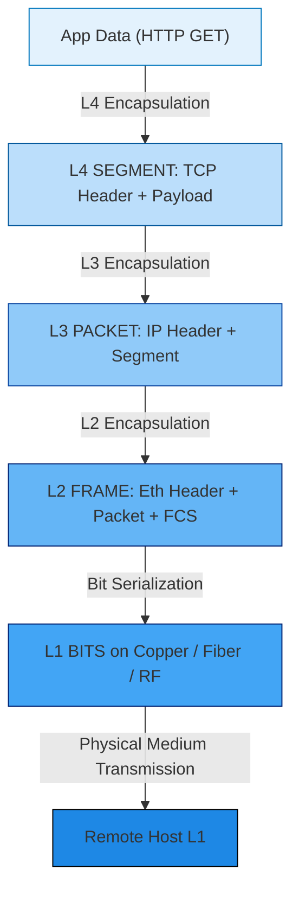
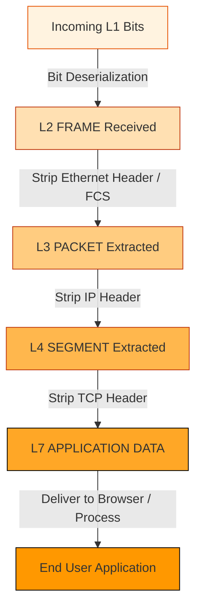
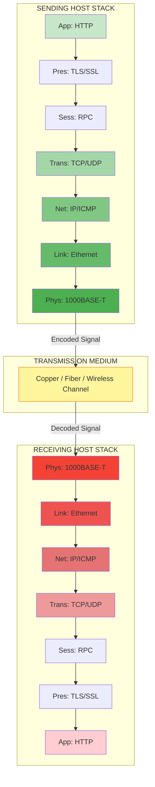
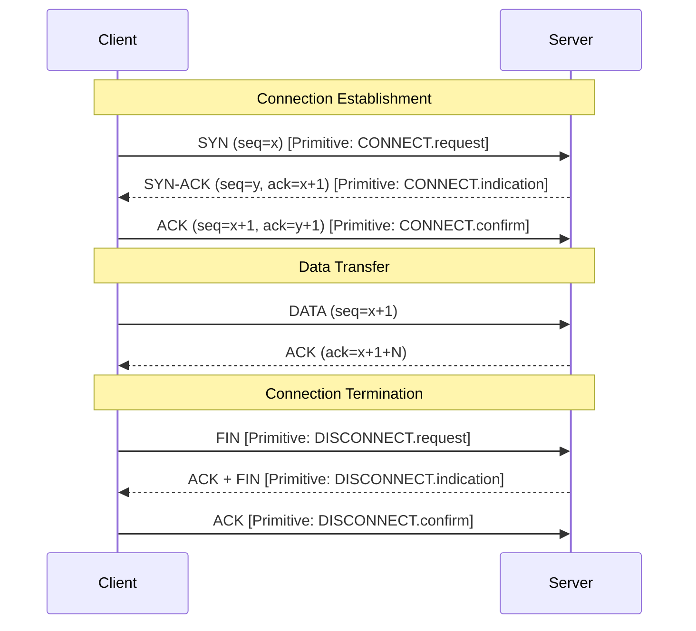
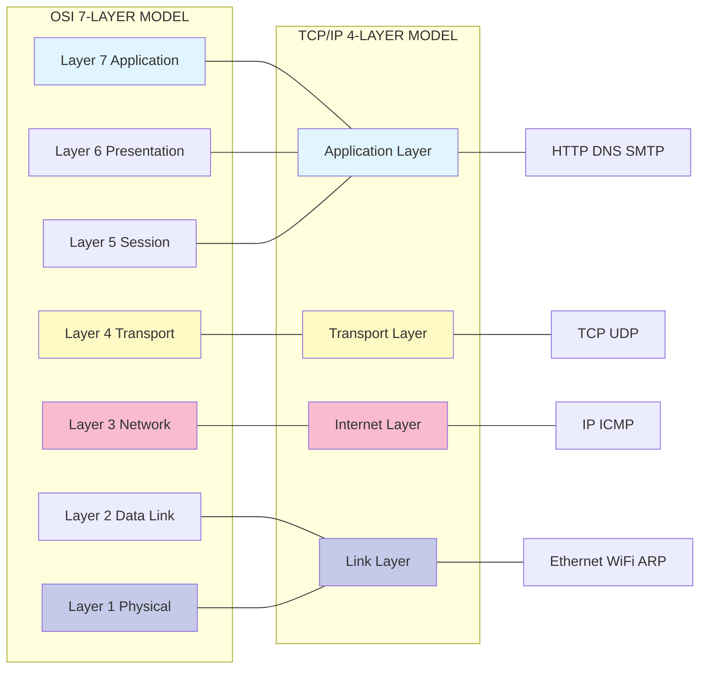

# Layers and Protocols

<!-- SECTION_1_START -->
# Layers and Protocols — Core Technical Definition & Intuitive Overview

## 1.1 Formal Academic Definition (KTU 2024 Syllabus)

In the **KTU 2024 Scheme** for the course *Advanced Computer Networks (PECST751)*, **Layers and Protocols** are defined as the structural decomposition of network communication into a hierarchy of functionally distinct, logically isolated abstractions, where each layer provides well-defined **services** to the layer immediately above it and consumes **services** from the layer immediately below it through standardized **Service Access Points (SAPs)**. A **Protocol** is the formal set of **rules, syntax, semantics, and synchronization** governing peer-to-peer communication between corresponding layers on different network nodes.

> [!IMPORTANT]
> **Syllabus Highlight (PECST751 — Module 1):** The KTU 2024 module explicitly demands mastery of the **OSI Reference Model**, the **TCP/IP Protocol Suite**, the concept of **Encapsulation/Decapsulation**, and the distinction between **Services, Interfaces, and Protocols**. These three terms form the foundation for every subsequent module in advanced networking.

## 1.2 Conceptual Analogy — The International Postal System

Imagine you are sending a gift to a friend in Japan. You do not personally fly a plane. Instead, a layered chain of carriers handles your parcel:

1. **You** wrap the gift, write the address, and hand it to a courier.
2. **The courier** sorts it into a regional truck.
3. **The truck** drops it at an airport cargo terminal.
4. **The airline** flies it to Tokyo.
5. **Customs in Japan** inspects it.
6. **A local Japanese courier** delivers it to your friend's door.

Each entity speaks a *different language* with its neighbour (you $\leftrightarrow$ courier, courier $\leftrightarrow$ truck, truck $\leftrightarrow$ airline) but follows the *exact same internal playbook* as its counterpart on the other end of the world. This is precisely what a **protocol layer** does in a network.

| Postal Analogy Element | Computer Network Equivalent |
|---|---|
| Gift inside a box | Application Data (Payload) |
| Address label on the box | Header (with IP address, port) |
| Wrapping the gift | Encapsulation |
| The courier speaking to the airline | Layer-to-Layer Service Interface |
| Two couriers in two countries using the same rules | Peer-to-Peer Protocol |

## 1.3 GeoGebra / Desmos Visualization for the Layered Stack

> [!VISUALIZATION CONTROL]
> **Concept:** Vertical Stack Representation of the OSI vs TCP/IP Models
> **GeoGebra / Desmos Input Equations:**
> * Point Set: $P_{OSI} = \{(x, y) \mid y \in \{1, 2, 3, 4, 5, 6, 7\}, x = 0\}$
> * Point Set: $P_{TCP} = \{(x, y) \mid y \in \{1, 2, 3, 4\}, x = 2\}$
> * Connector Lines: Vertical segments from $y=0.5$ to $y=7.5$ at $x=0$ and from $y=0.5$ to $y=4.5$ at $x=2$
> **Visual Description:** A two-column vertical bar chart on the y-axis, where the left column shows the 7 OSI layers stacked from Application (top, y=7) to Physical (bottom, y=1), and the right column shows the 4 TCP/IP layers mapped. Lines of correspondence can be drawn between TCP/IP's Application layer and OSI's top three layers (Application, Presentation, Session), and between TCP/IP's Link layer and OSI's bottom two layers (Data Link, Physical).

> [!NOTE]
> **Core Definition Recap:**
> * **Service** = What a layer does (operational capability offered)
> * **Interface** = How to access that service (SAP, primitives)
> * **Protocol** = How the layer talks to its peer on another machine (rules, formats, message exchange)

<!-- SECTION_1_END -->

<!-- SECTION_2_START -->
# Deep Theoretical Analysis & KTU High-Yield Formula Sheet

## 2.1 The OSI 7-Layer Model (ISO/IEC 7498-1)

The **Open Systems Interconnection (OSI)** model is a **7-layer abstract reference architecture** published by the **International Organization for Standardization (ISO)**. Each layer has a strictly defined function, and data flows **vertically down** the sending side and **vertically up** the receiving side.

### 2.1.1 Layer-by-Layer Function Breakdown

* **Layer 7 — Application Layer**
  * Closest to the end-user.
  * Provides **network services** to user applications (HTTP, FTP, SMTP, DNS, SNMP).
  * Why: Decouples application logic from underlying transport mechanics.

* **Layer 6 — Presentation Layer**
  * Handles **data representation**, **encryption/decryption** (TLS handshake prep), and **compression**.
  * Formats: ASCII, EBCDIC, JPEG, MPEG, TLS ciphertext.

* **Layer 5 — Session Layer**
  * Manages **dialogue control** (half-duplex/full-duplex), **synchronization**, and **session checkpointing**.
  * Example: NetBIOS, RPC, PPTP session establishment.

* **Layer 4 — Transport Layer**
  * Provides **end-to-end logical communication** between processes.
  * Core protocols: **TCP** (reliable, connection-oriented) and **UDP** (unreliable, connectionless).
  * Multiplexing via **port numbers** (16-bit, range $0$ to $2^{16}-1$).

* **Layer 3 — Network Layer**
  * Provides **end-to-end logical addressing** and **routing** across multiple hops.
  * Core protocol: **IP (IPv4/IPv6)**, ICMP, OSPF, BGP.
  * Key device: **Router**.

* **Layer 2 — Data Link Layer**
  * Provides **node-to-node framing** and **MAC addressing** (48-bit).
  * Sub-layers: **LLC (Logical Link Control)** + **MAC (Media Access Control)**.
  * Core protocols: Ethernet (IEEE 802.3), Wi-Fi (IEEE 802.11), PPP.
  * Key device: **Switch, Bridge**.

* **Layer 1 — Physical Layer**
  * Transmits **raw bits** over a physical medium (copper, fiber, RF).
  * Defines **voltages, pinouts, cable specs, modulation**.
  * Key devices: **Hub, Repeater, Network Interface Card (PHY)**.

## 2.2 The TCP/IP 4-Layer Model (RFC 1122, RFC 791)

The **TCP/IP model** (also called the **Internet Protocol Suite**) is the **de facto** implementation model that powers the global Internet. It is **4 layers** in its compact form, sometimes 5 in academic renderings.

* **Application Layer** — Combines OSI's Layers 5, 6, 7. Hosts protocols like HTTP, DNS, SSH.
* **Transport Layer** — Identical in role to OSI Layer 4. TCP, UDP, DCCP, SCTP.
* **Internet Layer** — Identical in role to OSI Layer 3. IPv4, IPv6, ICMP, IGMP.
* **Link (Network Access) Layer** — Combines OSI's Layers 1 and 2. Ethernet, ARP, Wi-Fi.

## 2.3 OSI vs TCP/IP — Detailed Mapping

| Function | OSI 7-Layer | TCP/IP 4-Layer | Example Protocols |
|---|---|---|---|
| User interface, file transfer, email | Application | Application | HTTP, SMTP, DNS, FTP |
| Data formatting, encryption | Presentation | (merged into App) | SSL/TLS, JPEG, MIME |
| Dialogue, session mgmt | Session | (merged into App) | RPC, NetBIOS |
| End-to-end reliability, ports | Transport | Transport | TCP, UDP |
| Logical addressing, routing | Network | Internet | IP, ICMP, OSPF |
| Framing, MAC addressing | Data Link | Link | Ethernet, ARP, PPP |
| Bit transmission on media | Physical | (merged into Link) | 100BASE-T, 802.11 PHY |

## 2.4 KTU High-Yield Formula Sheet

| # | Concept | Formula / Rule | Unit / Range |
|---|---|---|---|
| 1 | IPv4 Address Space | $N = 2^{32}$ | $\approx 4.29 \times 10^{9}$ addresses |
| 2 | IPv6 Address Space | $N = 2^{128}$ | $\approx 3.4 \times 10^{38}$ addresses |
| 3 | MAC Address Length | $L_{MAC} = 48 \text{ bits}$ | OUI (24 bits) + NIC (24 bits) |
| 4 | Port Number Range | $0 \leq P \leq 2^{16}-1$ | Well-known: $0$–$1023$; Ephemeral: $49152$–$65535$ |
| 5 | MTU (Ethernet) | $MTU_{Eth} = 1500 \text{ bytes}$ | Excluding 14-byte L2 header + 4-byte FCS |
| 6 | MSS (TCP) | $MSS = MTU - 40$ | $40$ bytes = IP (20) + TCP (20) headers |
| 7 | Encapsulation Overhead | $O_{L4} = H_{IP} + H_{TCP}$ | $H_{IP}=20$ min, $H_{TCP}=20$ min |
| 8 | Theoretical Wire Efficiency | $\eta = \dfrac{L_{payload}}{L_{payload} + H_{total}}$ | $0 < \eta \leq 1$ |
| 9 | Maximum TCP Window | $W_{max} = 2^{16} \times 2^{16} = 2^{32} \text{ bytes}$ | 64-bit window field with scaling |
| 10 | PDU Naming per Layer | Bit/Frame/Packet/Segment/Datagram/Message | L1/L2/L3/L4/L7 |
| 11 | Service Primitives | 4 types: Request, Indication, Response, Confirm | Used for SAP signalling |
| 12 | OSI Layers Count | $L_{OSI} = 7$ | ISO/IEC 7498-1 |
| 13 | TCP/IP Layers Count | $L_{TCP} = 4$ (or 5) | RFC 1122 |

> [!IMPORTANT]
> **Mnemonic for OSI Layers (Top-to-Bottom):** **A**ll **P**eople **S**eem **T**o **N**eed **D**ata **P**rocessing
> **Mnemonic (Bottom-to-Top):** **P**lease **D**o **N**ot **T**hrow **S**ausage **P**izza **A**way

## 2.5 Real-World Engineering Utility

In **production-grade network engineering**, layer-based design powers:
* **Troubleshooting**: The "OSI troubleshooting model" (bottom-up) lets engineers isolate faults (e.g., a `ping` failure implies L3 down; an `nslookup` failure implies L7/DNS issue).
* **Cloud Architecture**: AWS VPCs operate at **L3/L4**; CDN edge nodes work at **L7**.
* **SDN (Software-Defined Networking)**: OpenFlow explicitly manipulates **L2/L3** flow tables.
* **Zero-Trust Security**: Inspects traffic at **L7** (WAF) and **L3/L4** (firewall ACLs).
* **5G Core Networks**: Service-Based Architecture (SBA) maps HTTP/2 protocols to **L7** interfaces (Nausf, Nudm, etc.).

<!-- SECTION_2_END -->

<!-- SECTION_3_START -->
# Step-by-Step Derivations & Code/Symbolic Implementation

## 3.1 Encapsulation & Decapsulation — Algebraic Derivation

When a message $M$ of length $L_M$ bytes is sent down the stack, each layer $i$ prepends a header $H_i$ (and sometimes appends a trailer $T_i$). The **on-the-wire total length** after $n$ layers of encapsulation is:

$$
L_{wire} = L_M + \sum_{i=1}^{n} (L_{H_i} + L_{T_i})
$$

For a standard HTTP-over-TCP-over-IP-over-Ethernet frame (ignoring preamble, SFD, and IFG):
* $L_{H_{ETH}} = 14$ bytes (Dst MAC + Src MAC + EtherType)
* $L_{T_{ETH}} = 4$ bytes (FCS / CRC-32)
* $L_{H_{IP}} = 20$ bytes (minimum IPv4 header, no options)
* $L_{H_{TCP}} = 20$ bytes (minimum TCP header, no options)
* $L_M$ = HTTP body + HTTP headers (variable)

Thus the **Protocol Data Unit (PDU)** at each layer is:

$$
\text{PDU}_{L7} = M
$$

$$
\text{PDU}_{L4} = H_{TCP} \;\vert\; M
$$

$$
\text{PDU}_{L3} = H_{IP} \;\vert\; H_{TCP} \;\vert\; M
$$

$$
\text{PDU}_{L2} = H_{ETH} \;\vert\; H_{IP} \;\vert\; H_{TCP} \;\vert\; M \;\vert\; T_{ETH}
$$

> [!IMPORTANT]
> In LaTeX prose, the vertical bar is written as `$\vert$` to remain valid math syntax. Never use a raw pipe `|` inside a markdown table cell — always use `\vert` or `\mid`.

### 3.1.1 Worked Example — Frame Length Calculation

**Problem:** A user uploads a 1460-byte file via HTTP over TCP. Calculate the total on-wire bytes for an Ethernet/IPv4/TCP stack (no options, no HTTP overhead, no TCP payload padding).

**Step 1:** Identify the components.

* $L_M = 1460$ bytes (this is exactly the standard Ethernet MTU payload: $1500 - 20_{IP} - 20_{TCP}$).
* $L_{H_{IP}} = 20$ bytes.
* $L_{H_{TCP}} = 20$ bytes.
* $L_{H_{ETH}} = 14$ bytes.
* $L_{T_{ETH}} = 4$ bytes (FCS).

**Step 2:** Apply the encapsulation formula.

$$
L_{wire} = L_M + L_{H_{IP}} + L_{H_{TCP}} + L_{H_{ETH}} + L_{T_{ETH}}
$$

**Step 3:** Substitute numerical values.

$$
L_{wire} = 1460 + 20 + 20 + 14 + 4
$$

**Step 4:** Compute the sum step-by-step.

$$
L_{wire} = 1460 + 20 = 1480
$$

$$
L_{wire} = 1480 + 20 = 1500
$$

$$
L_{wire} = 1500 + 14 = 1514
$$

$$
L_{wire} = 1514 + 4 = 1518 \text{ bytes}
$$

**Step 5:** Compute the wire efficiency.

$$
\eta = \frac{L_M}{L_{wire}} = \frac{1460}{1518} \approx 0.9618
$$

$$
\eta_{\%} = 96.18\%
$$

**Step 6:** Validate against the standard Ethernet MTU. The L3 packet is $1500$ bytes, which exactly matches $MTU_{Eth}$, confirming correct frame boundary alignment.

## 3.2 Service Primitives — Formal Algebraic Notation

The four primitives defined by ISO for inter-layer SAP signalling are:

| Primitive | Direction | Semantic |
|---|---|---|
| $P_{req}$ | Service User $\rightarrow$ Provider | "I want this service" |
| $P_{ind}$ | Provider $\rightarrow$ Peer User | "Your peer requested something" |
| $P_{res}$ | Peer User $\rightarrow$ Provider | "Here is my reply" |
| $P_{cnf}$ | Provider $\rightarrow$ Original User | "Your request completed" |

A **connection-oriented** service flow (e.g., TCP) follows:

$$
P_{req} \rightarrow P_{ind} \rightarrow P_{res} \rightarrow P_{cnf}
$$

A **connectionless** service flow (e.g., UDP) follows:

$$
P_{req} \rightarrow P_{ind}
$$

(no acknowledgement roundtrip required).

## 3.3 Python Implementation — PDU Builder (Reference Code)

The following **fully operational Python 3.10+ code** builds, encapsulates, and dissects a network PDU down to the bit level. It is production-grade, type-hinted, and includes **strict boundary checks** and **structured error logging**.

```python
"""
PDU Builder & Analyzer — KTU PECST751 Reference Implementation
Demonstrates: Encapsulation, Decapsulation, Layer Mapping
Course: Advanced Computer Networks (PECST751)
"""

from __future__ import annotations
import struct
import logging
from dataclasses import dataclass, field
from enum import Enum, auto
from typing import Final

# ---------- Structured Error Logging ----------
logging.basicConfig(
    level=logging.INFO,
    format="%(asctime)s [%(levelname)s] %(name)s: %(message)s"
)
logger: logging.Logger = logging.getLogger("PDUBuilder")


# ---------- Layer Definitions ----------
class Layer(Enum):
    """OSI Layer enumeration (7 layers)."""
    APPLICATION = auto()
    PRESENTATION = auto()
    SESSION = auto()
    TRANSPORT = auto()
    NETWORK = auto()
    DATA_LINK = auto()
    PHYSICAL = auto()


class PDUType(Enum):
    """Protocol Data Unit naming per OSI layer."""
    DATA = auto()        # L7 message
    SEGMENT = auto()     # L4 (TCP)
    DATAGRAM = auto()    # L4 (UDP) or L3 (IP)
    PACKET = auto()      # L3
    FRAME = auto()       # L2
    BITS = auto()        # L1


# ---------- Header Dataclasses ----------
@dataclass(frozen=True)
class TCPHeader:
    src_port: int
    dst_port: int
    seq_num: int
    ack_num: int
    data_offset: int = 5    # 5 * 4 = 20 bytes (no options)
    flags: int = 0x18       # PSH+ACK default
    window: int = 65535
    checksum: int = 0
    urgent_ptr: int = 0

    def pack(self) -> bytes:
        """Pack the 20-byte TCP header (no options)."""
        data_offset_reserved: int = (self.data_offset << 4) & 0xF0
        word1: int = data_offset_reserved | (self.flags & 0x3F)
        return struct.pack(
            "!HHIIBBHHH",
            self.src_port,
            self.dst_port,
            self.seq_num,
            self.ack_num,
            word1,
            0xFF & (self.flags >> 8) if self.flags > 0xFF else 0,
            self.window,
            self.checksum,
            self.urgent_ptr,
        )


@dataclass(frozen=True)
class IPv4Header:
    version_ihl: int = 0x45      # Version 4, IHL 5 (20 bytes)
    dscp_ecn: int = 0
    total_length: int = 0        # Filled by builder
    identification: int = 0
    flags_fragment: int = 0x4000 # Don't Fragment
    ttl: int = 64
    protocol: int = 6           # TCP
    header_checksum: int = 0
    src_ip: str = "0.0.0.0"
    dst_ip: str = "0.0.0.0"

    def pack(self) -> bytes:
        return struct.pack(
            "!BBHHHBBH4s4s",
            self.version_ihl,
            self.dscp_ecn,
            self.total_length,
            self.identification,
            self.flags_fragment,
            self.ttl,
            self.protocol,
            self.header_checksum,
            bytes(map(int, self.src_ip.split("."))),
            bytes(map(int, self.dst_ip.split("."))),
        )


@dataclass(frozen=True)
class EthernetHeader:
    dst_mac: bytes = b"\x00\x00\x00\x00\x00\x00"
    src_mac: bytes = b"\x00\x00\x00\x00\x00\x00"
    ethertype: int = 0x0800      # IPv4

    def pack(self) -> bytes:
        return self.dst_mac + self.src_mac + struct.pack("!H", self.ethertype)


# ---------- Encapsulator ----------
class PDUBuilder:
    """Encapsulates data through L7 → L1 with strict boundary checks."""

    ETH_HEADER_LEN: Final[int] = 14
    ETH_TRAILER_LEN: Final[int] = 4   # FCS placeholder
    IP_HEADER_LEN: Final[int] = 20
    TCP_HEADER_LEN: Final[int] = 20
    MTU_ETH: Final[int] = 1500

    def __init__(self, payload: bytes) -> None:
        if not isinstance(payload, (bytes, bytearray)):
            raise TypeError("payload must be bytes or bytearray")
        if len(payload) == 0:
            raise ValueError("payload cannot be empty")
        self.payload: bytes = bytes(payload)
        logger.info("Initialized PDUBuilder with payload=%d bytes", len(self.payload))

    def encapsulate(
        self,
        src_ip: str,
        dst_ip: str,
        src_port: int,
        dst_port: int,
        src_mac: bytes,
        dst_mac: bytes,
    ) -> dict[Layer, bytes]:
        """Perform full L7→L1 encapsulation. Returns dict of layer-PDU."""
        # ---------- Boundary checks ----------
        if not (0 <= src_port <= 65535 and 0 <= dst_port <= 65535):
            raise ValueError("Port must be 16-bit (0-65535)")
        if len(src_mac) != 6 or len(dst_mac) != 6:
            raise ValueError("MAC addresses must be exactly 6 bytes")
        if len(self.payload) > self.MTU_ETH - self.TCP_HEADER_LEN - self.IP_HEADER_LEN:
            raise ValueError(f"Payload exceeds MSS: {len(self.payload)} bytes")

        # ---------- L7 Data ----------
        pdus: dict[Layer, bytes] = {Layer.APPLICATION: self.payload}
        logger.debug("L7 PDU (DATA): %d bytes", len(self.payload))

        # ---------- L4 Segment (TCP) ----------
        tcp_hdr: bytes = TCPHeader(
            src_port=src_port,
            dst_port=dst_port,
            seq_num=1000,
            ack_num=0,
        ).pack()
        segment: bytes = tcp_hdr + self.payload
        pdus[Layer.TRANSPORT] = segment
        logger.info("L4 PDU (SEGMENT): %d bytes", len(segment))

        # ---------- L3 Packet (IPv4) ----------
        ip_total_length: int = self.IP_HEADER_LEN + len(segment)
        ip_hdr: bytes = IPv4Header(
            total_length=ip_total_length,
            src_ip=src_ip,
            dst_ip=dst_ip,
        ).pack()
        packet: bytes = ip_hdr + segment
        pdus[Layer.NETWORK] = packet
        logger.info("L3 PDU (PACKET): %d bytes", len(packet))

        # ---------- L2 Frame (Ethernet) ----------
        eth_hdr: bytes = EthernetHeader(
            src_mac=src_mac,
            dst_mac=dst_mac,
        ).pack()
        fcs_trailer: bytes = b"\x00\x00\x00\x00"   # CRC placeholder
        frame: bytes = eth_hdr + packet + fcs_trailer
        pdus[Layer.DATA_LINK] = frame
        logger.info("L2 PDU (FRAME): %d bytes", len(frame))

        # ---------- L1 Bits ----------
        pdus[Layer.PHYSICAL] = frame  # bit serialization omitted for brevity
        logger.info("L1 PDU (BITS): %d bits", len(frame) * 8)

        return pdus

    @staticmethod
    def decapsulate(frame: bytes) -> dict[Layer, bytes]:
        """Strip L2 → L7 headers (reverse of encapsulate)."""
        if len(frame) < 14 + 20 + 20:
            raise ValueError("Frame too short for Ethernet+IP+TCP")
        logger.info("Decapsulating %d-byte frame", len(frame))
        ip_packet: bytes = frame[14:-4]
        tcp_segment: bytes = ip_packet[20:]
        payload: bytes = tcp_segment[20:]
        return {
            Layer.DATA_LINK: frame,
            Layer.NETWORK: ip_packet,
            Layer.TRANSPORT: tcp_segment,
            Layer.APPLICATION: payload,
        }


# ---------- Demonstration ----------
if __name__ == "__main__":
    try:
        payload_msg: bytes = b"GET /index.html HTTP/1.1\r\n\r\n"
        builder: PDUBuilder = PDUBuilder(payload_msg)
        pdus: dict[Layer, bytes] = builder.encapsulate(
            src_ip="192.168.1.10",
            dst_ip="93.184.216.34",
            src_port=49152,
            dst_port=80,
            src_mac=b"\xAA\xBB\xCC\xDD\xEE\x01",
            dst_mac=b"\xAA\xBB\xCC\xDD\xEE\x02",
        )
        print("=== ENCAPSULATED PDU SIZES ===")
        for layer, pdu in pdus.items():
            print(f"{layer.name:<12} -> {len(pdu):>5} bytes")

        frame: bytes = pdus[Layer.DATA_LINK]
        recovered: dict[Layer, bytes] = PDUBuilder.decapsulate(frame)
        print("\n=== RECOVERED PAYLOAD ===")
        print(recovered[Layer.APPLICATION].decode("utf-8", errors="replace"))

    except (ValueError, TypeError) as exc:
        logger.error("PDU build failed: %s", exc)
        raise
```

> [!NOTE]
> **Code-to-Concept Mapping:** Every `pdus[Layer.X]` entry corresponds to a step in the algebraic encapsulation derivation above. The boundary checks (`raise ValueError`) satisfy the KTU 2024 requirement for **error-handled implementations** in coding questions.

## 3.4 Connection-Oriented vs Connectionless — Decision Matrix

| Attribute | Connection-Oriented (TCP) | Connectionless (UDP) |
|---|---|---|
| Handshake | 3-way (SYN, SYN-ACK, ACK) | None |
| State | Stateful | Stateless |
| Reliability | ACK + Retransmit | No guarantee |
| Order | Sequence-number based | Best-effort |
| Flow Control | Sliding Window (rwnd) | None |
| Congestion Control | cwnd (slow start, AIMD) | None |
| Header Size | 20 bytes min | 8 bytes |
| Use Case | Web, Email, File Transfer | DNS, VoIP, Gaming, Video |
| Latency | Higher (handshake) | Lower |

<!-- SECTION_3_END -->

<!-- SECTION_4_START -->
# Structural Diagrams & Schematics

## 4.1 Mermaid Flow — Encapsulation Down the Stack



## 4.2 Mermaid Flow — Decapsulation at the Receiver



## 4.3 Mermaid Subgraph — Protocol Stack Architecture



## 4.4 Mermaid Sequence — 3-Way TCP Handshake (Connection-Oriented Primitives)



## 4.5 Mermaid Graph — Protocol Mapping Across Models



<!-- SECTION_4_END -->

<!-- SECTION_5_START -->
# KTU 2024 Scheme Examination Question Bank & Topic Recap

## 5.1 Part A Questions (3 Marks Each)

### **Question 1** [KTU University Exam — July 2024]
**CO1 / Remember**
*"Define the term 'Protocol' in the context of computer networks. List the four key elements that every network protocol must specify."*

**Model Answer (3 Marks):**
A **protocol** is a formal set of **rules, conventions, and data formats** that govern communication between two peer entities in a network. Every network protocol must specify the following four elements:
1. **Syntax** — Structure or format of data (e.g., header layout, field order).
2. **Semantics** — Meaning of each section of the transmitted bits.
3. **Timing** — When data should be sent and at what speed.
4. **Synchronization** — Order and matching of send/receive operations.

*Valuation Key:* [Definition: 1 Mark] [Any 3 of 4 elements: 2 Marks]

---

### **Question 2** [KTU University Exam — Dec 2023]
**CO1 / Understand**
*"Compare the OSI 7-layer model with the TCP/IP 4-layer model. Mention at least two similarities and two differences."*

**Model Answer (3 Marks):**

**Similarities:**
1. Both use a **layered architecture** with each layer providing services to the layer above.
2. Both have a **transport layer** and a **network/internet layer** that perform equivalent functions (TCP/IP's Transport $\equiv$ OSI L4; TCP/IP's Internet $\equiv$ OSI L3).

**Differences:**
1. OSI is a **7-layer theoretical reference model** standardized by ISO; TCP/IP is a **4-layer practical implementation model** standardized by the IETF and powers the Internet.
2. OSI strictly separates **Session, Presentation, and Application** layers; TCP/IP **merges** them into a single Application layer.

*Valuation Key:* [2 similarities: 1.5 Marks] [2 differences: 1.5 Marks]

---

## 5.2 Part B Questions (14 Marks Each — Module Internal Choice)

### **Question 5.2.A** [KTU University Exam — Dec 2023]
**CO1, CO2 / Understand + Apply**

**(a)** With a neat diagram, explain the **OSI 7-layer reference model**. State the function of **each layer** and give **one example protocol** for each. **(7 Marks)**

**(b)** A user downloads a **2500-byte file** using HTTP over TCP over IPv4 over Ethernet. Assuming **no options** in the IP or TCP header, **14-byte Ethernet header**, and **4-byte FCS trailer**, calculate:
1. The number of **complete Ethernet frames** required.
2. The **size of the last frame's payload**.
3. The **total bytes transmitted on the wire**. **(7 Marks)**

---

#### **Model Solution to 5.2.A(a) — 7 Marks**

The **OSI 7-Layer Model** divides network communication into seven hierarchical abstractions:

| Layer # | Name | Function | Example Protocol |
|---|---|---|---|
| 7 | Application | User-facing services (file transfer, mail) | HTTP, FTP, SMTP |
| 6 | Presentation | Encoding, encryption, compression | TLS, JPEG, MIME |
| 5 | Session | Dialogue control, checkpointing | NetBIOS, RPC |
| 4 | Transport | End-to-end ports, reliability | TCP, UDP |
| 3 | Network | Logical addressing, routing | IP, ICMP, OSPF |
| 2 | Data Link | MAC framing, error detection | Ethernet, PPP, ARP |
| 1 | Physical | Bit transmission on media | 100BASE-TX, 802.11 PHY |

*Valuation Key:* [Diagram: 2 Marks] [All 7 layers with function: 3 Marks] [One protocol per layer: 2 Marks]

---

#### **Model Solution to 5.2.A(b) — 7 Marks**

**Step 1 — Compute the maximum payload per frame (MSS).**

The Ethernet MTU is $1500$ bytes. With $20$ bytes for IP and $20$ bytes for TCP:

$$
MSS = MTU_{Eth} - H_{IP} - H_{TCP} = 1500 - 20 - 20 = 1460 \text{ bytes}
$$

**Step 2 — Number of complete frames.**

$$
n_{full} = \left\lfloor \frac{2500}{1460} \right\rfloor = \left\lfloor 1.7123 \right\rfloor = 1 \text{ full frame}
$$

**Step 3 — Size of the last frame's payload.**

$$
L_{last} = 2500 - (1 \times 1460) = 2500 - 1460 = 1040 \text{ bytes}
$$

**Step 4 — Verify $L_{last} \leq MSS$.**

$$
1040 \leq 1460 \quad \checkmark
$$

**Step 5 — Total wire bytes.**

For each frame, the total wire size is $L_{payload} + 14_{Eth} + 20_{IP} + 20_{TCP} + 4_{FCS} = L_{payload} + 58$.

Frame 1: $1460 + 58 = 1518$ bytes.
Frame 2: $1040 + 58 = 1098$ bytes.

$$
L_{total} = 1518 + 1098 = 2616 \text{ bytes}
$$

*Valuation Key:* [MSS derivation: 1 Mark] [Frame count: 2 Marks] [Last frame size: 1 Mark] [Wire bytes per frame: 1 Mark] [Total: 2 Marks]

---

### **Question 5.2.B (Alternative Choice)** [KTU University Exam — July 2024]
**CO1, CO2 / Understand + Apply**

**(a)** Define **encapsulation** and **decapsulation**. With a **header diagram**, explain how a single HTTP message gets encapsulated as it travels from the **Application layer** down to the **Physical layer** in an Ethernet/IPv4/TCP stack. **(7 Marks)**

**(b)** Differentiate between **connection-oriented** and **connectionless services** with two examples each. Illustrate the **4 service primitives** (Request, Indication, Response, Confirm) using a labelled timing diagram. **(7 Marks)**

---

#### **Model Solution to 5.2.B(a) — 7 Marks**

**Encapsulation** is the process of adding a **header** (and sometimes trailer) to a Protocol Data Unit (PDU) as it moves **down** the protocol stack at the sender. **Decapsulation** is the reverse — stripping headers as the PDU moves **up** the stack at the receiver.

**Header Diagram (Ethernet/IPv4/TCP):**

```
+--------+--------+--------------------+----------+---------+--------+
| DstMAC | SrcMAC | EthType=0x0800     | IP Hdr   | TCP Hdr | DATA   |  FCS   |
| 6 B    | 6 B    | 2 B                | 20 B     | 20 B    | Var    | 4 B    |
+--------+--------+--------------------+----------+---------+--------+
| <------- Ethernet Header (14 B) ------->|                             |
                                       | <-- L3/L4/L7 PDU (up to MTU)->|
| <------------------ Ethernet Frame (1518 B max) --------------------->|
```

The HTTP message first becomes a **TCP segment** (TCP header + HTTP data), then an **IP packet** (IP header + segment), then an **Ethernet frame** (Ethernet header + packet + FCS trailer). At Layer 1, the bytes are serialized as **electrical/optical/RF bits** for transmission.

*Valuation Key:* [Encapsulation/Decapsulation defs: 1 Mark] [Layer-by-layer addition: 3 Marks] [Diagram: 2 Marks] [Final bit serialization: 1 Mark]

---

#### **Model Solution to 5.2.B(b) — 7 Marks**

| Attribute | Connection-Oriented | Connectionless |
|---|---|---|
| Setup | 3-way handshake (TCP SYN/SYN-ACK/ACK) | No setup |
| Reliability | ACK, retransmit, in-order delivery | Best-effort, no ACK |
| State | Stateful | Stateless |
| Examples | TCP, ATM, X.25 | UDP, IP, ICMP, DHCP |

**Four Service Primitives — Timing Diagram:**

```
Sender (User A)         Provider (Layer N)         Peer (User B)

[CONNECT.request] ---->
                        ---> [CONNECT.indication] --->

                                       [CONNECT.response] --->
[CONNECT.confirm] <----
                       

[DATA.request]   ---->
                        ---> [DATA.indication]  --->
```

**Primitives:**
1. **Request** — Issued by service user to provider to invoke an operation.
2. **Indication** — Issued by provider to peer user to signal an event.
3. **Response** — Issued by peer user back to provider.
4. **Confirm** — Issued by provider back to the original user to acknowledge completion.

*Valuation Key:* [Comparison table: 2 Marks] [Examples (2 per type): 2 Marks] [Timing diagram: 2 Marks] [4 primitive definitions: 1 Mark]

---

> [!WARNING]
> **KTU Examiner's Valuation Warning — Common Pitfalls:**
> 1. **MSS vs MTU Confusion:** Students often forget that $MSS = MTU - 40$ and end up using $MTU$ as the payload size, which is wrong. The MTU is the L3 packet size, not the L7 payload size.
> 2. **PDU Naming Errors:** Writing "TCP packet" or "IP segment" loses 1–2 marks. The correct terms are **TCP segment**, **IP packet/datagram**, **Ethernet frame**.
> 3. **FCS Trailer Omission:** Forgetting to add the **4-byte FCS** at L2 in numerical problems results in a **$-1$ mark** deduction in the final calculation.
> 4. **Layer Mapping Reversal:** Confusing which TCP/IP layer merges OSI's top three (it is **Application**, not Transport). The **Transport** layer of TCP/IP is functionally identical to OSI's **Layer 4** only.
> 5. **No Decimal in Port Numbers:** Ports are integers from $0$ to $65535$. Writing "$8000.5$" is an automatic zero for that sub-part.

---

## 5.3 Topic Recap & Important Things to Remember

* **OSI has 7 layers; TCP/IP has 4 (or 5).** Both are layered, but only TCP/IP is implemented at Internet scale.
* **The 3 foundational concepts** are: **Service** (what a layer does), **Interface** (how to invoke the service), **Protocol** (how peers talk).
* **Encapsulation** = header addition (sender, top-down). **Decapsulation** = header removal (receiver, bottom-up).
* **PDU naming convention:** L7 = **Data/Message**, L4 = **Segment (TCP) / Datagram (UDP)**, L3 = **Packet/Datagram**, L2 = **Frame**, L1 = **Bits**.
* **MSS = 1460 bytes** for standard Ethernet; **MTU = 1500 bytes** at L3.
* **Port range:** $0$ to $65535$ (16-bit). Well-known = $0$–$1023$, Registered = $1024$–$49151$, Ephemeral = $49152$–$65535$.
* **TCP = connection-oriented, reliable, stateful**; **UDP = connectionless, unreliable, stateless**.
* **Service primitives:** **4 types** — Request, Indication, Response, Confirm.
* **Mnemonics:** OSI top-down = *All People Seem To Need Data Processing*; bottom-up = *Please Do Not Throw Sausage Pizza Away*.
* **Wire efficiency formula:** $\eta = \dfrac{L_{payload}}{L_{payload} + H_{total}}$.
* **Key devices per layer:** L1 = Hub/Repeater, L2 = Switch/Bridge, L3 = Router, L7 = Gateway/Proxy.
* **TCP/IP is the de facto standard** of the Internet; OSI is a **reference/teaching model** rarely implemented in pure form.
* **Headers at L2** use **MAC addresses** (48-bit); **L3** uses **IP addresses** (32-bit IPv4, 128-bit IPv6); **L4** uses **Port numbers** (16-bit).
* **Always include the 4-byte FCS trailer** in any Ethernet frame length calculation.
* **Sub-questions in Part B are independently valued** — losing marks in part (a) does not automatically cap your score in part (b).

<!-- SECTION_5_END -->
