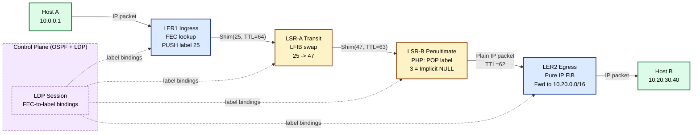
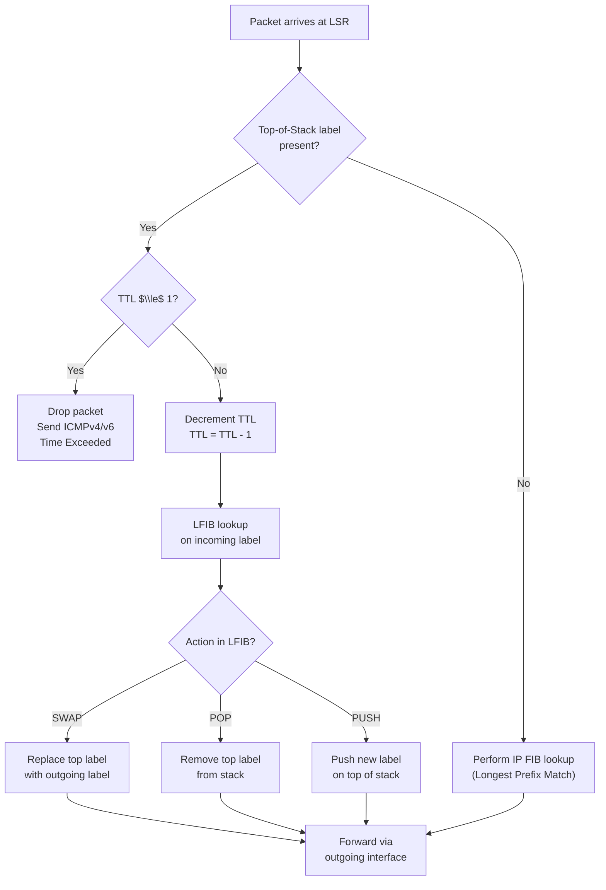
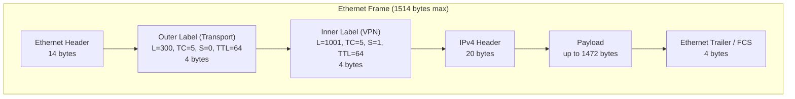

# Multiprotocol Label Switching (MPLS): Overview and Use Cases

<!-- SECTION_1_START -->

# Multiprotocol Label Switching (MPLS) — Overview & Use Cases

## 1.1 Formal Definition

> [!IMPORTANT]
> **Multiprotocol Label Switching (MPLS)** is a **data-forwarding mechanism** defined by the **IETF (RFC 3031, RFC 3032)** in which **short, fixed-length labels** are appended to packets at the **ingress Label Edge Router (LER)** and used by **intermediate Label Switch Routers (LSRs)** to perform high-speed table lookups and forwarding. The label lookup is performed at **Layer 2.5** of the OSI model — *between* traditional Layer 2 switching and Layer 3 routing — thereby **decoupling the forwarding plane from the control plane**.

The **control plane** (running protocols such as **OSPF, IS-IS, LDP, or RSVP-TE**) determines the path, while the **data plane** simply swaps labels and forwards packets. The same MPLS data plane is **protocol-agnostic** (hence *multiprotocol*) — it can carry IPv4, IPv6, Ethernet, Frame Relay, and ATM payloads.

## 1.2 Intuitive Analogy — The Courier Tracking Barcode

Imagine you are sending a parcel from **Kochi to Delhi** through a chain of regional courier hubs.

- **Without MPLS (Pure IP Routing):** Every hub opens the parcel, reads the **full destination address**, interprets the postal code, decides the next hub, repacks, and re-addresses. This is **slow, repetitive, and CPU-intensive**.
- **With MPLS:** When the parcel leaves Kochi, the **ingress hub prints a small barcode sticker** on the outside that says: *"Next hub → Mumbai, then → Ahmedabad, then → Delhi."* Every subsequent hub only needs to **scan the barcode and hand it to the next conveyor belt** corresponding to that barcode. The contents are **never re-read**.

> [!NOTE]
> **Key Insight:** The **MPLS label = the barcode sticker**. The **barcode-to-conveyor-belt mapping table** in every hub = the **LFIB (Label Forwarding Information Base)**. The **conveyor belts** = physical egress interfaces. The **full address inside the parcel** = the original IP header, which is **never touched** in the core.

## 1.3 Why MPLS Was Invented

| Problem in pure IP networks | How MPLS solves it |
| :--- | :--- |
| Every router performs **longest-prefix match** on the full IP header — $O(\log n)$ lookup, expensive in hardware. | LSRs perform **exact-match label lookup** in a fixed-size table — $O(1)$ with a CAM/TCAM. |
| Routing decisions are **hop-by-hop**; traffic engineering is hard. | LSPs are **explicitly signalled**; TE tunnels can reserve bandwidth. |
| QoS requires deep packet inspection of DSCP bits at every hop. | The **EXP (experimental) bits** in the MPLS shim header carry QoS marking end-to-end. |
| VPNs over a shared core require GRE/IPsec tunnels — heavy overhead. | **MPLS L3VPN (RFC 4364)** uses label stacking for **VRF isolation** with near-zero overhead. |

## 1.4 Where MPLS Lives — The Protocol Stack Position

> [!VISUALIZATION CONTROL]
> **Concept:** Position of the MPLS Shim Header in the Layered Protocol Stack
> **Conceptual Plot (Packet Frame Visualisation):**
>
> * `Ethernet Header (14 B)` $\vert$ `MPLS Shim (4 B)` $\vert$ `IP Header (20 B)` $\vert$ `Payload` $\vert$ `Ethernet Trailer`
>
> **Visual Description:** Picture a horizontal bar chart where each coloured segment is one protocol layer. The MPLS shim sits **between** the L2 header and the L3 header — that is precisely why MPLS is called a **Layer 2.5** technology.

## 1.5 Primary Engineering Use Cases

> [!NOTE]
> The **four canonical KTU-mandated use cases** of MPLS in modern service-provider and enterprise networks:
>
> 1. **MPLS Unicast Forwarding** — high-speed core routing replacement.
> 2. **MPLS Traffic Engineering (MPLS-TE)** — explicit-path tunnels with bandwidth reservation via **RSVP-TE (RFC 3209)**.
> 3. **MPLS L3VPN (RFC 4364)** — provider-provisioned BGP/MPLS VPNs for multi-tenant enterprise services.
> 4. **MPLS L2VPN (VPLS / VPWS, RFC 4761, RFC 4448)** — extension of Layer 2 LANs/WANs across a packet core.

---

<!-- SECTION_1_END -->

<!-- SECTION_2_START -->

# Deep Theoretical Analysis & High-Yield Formula Sheet

## 2.1 The MPLS Architecture — Three Pillars

| Component | Full Name | Role | Location |
| :--- | :--- | :--- | :--- |
| **LER** | Label Edge Router | Imposes labels at ingress (**Push**), removes them at egress (**Pop**). | Network edge |
| **LSR** | Label Switch Router | Performs core label lookup, swaps incoming label with outgoing label (**Swap**). | Network core |
| **LSP** | Label Switched Path | The unidirectional logical tunnel from ingress LER to egress LER. | Logical path |

## 2.2 Fundamental MPLS Concepts

### 2.2.1 Forwarding Equivalence Class (FEC)

A **FEC** is a *group* of packets that are forwarded **identically** along the same LSP. Examples of FECs:

- All packets destined to **prefix 10.20.0.0/16**.
- All packets belonging to a **specific VRF** of a customer VPN.
- All packets matching a **QoS class and destination prefix**.

> [!IMPORTANT]
> **The label-binding rule:** *All packets belonging to the same FEC receive the same label at the ingress LER.* The FEC-to-label mapping is **one-to-one at the ingress**, not at every hop.

### 2.2.2 The MPLS Shim Header (RFC 3032)

A standard MPLS shim header is exactly **32 bits (4 bytes)** long:

$$
\underbrace{20 \text{ bits}}_{\text{Label}} \;\;\; \underbrace{3 \text{ bits}}_{\text{TC/EXP}} \;\;\; \underbrace{1 \text{ bit}}_{\text{S (Bottom of Stack)}} \;\;\; \underbrace{8 \text{ bits}}_{\text{TTL}}
$$

- **Label (20 bits):** Identifier of the FEC. Range: **0 – $2^{20}-1 = 1{,}048{,}575$**. Reserved values: 0 = IPv4 Explicit NULL, 1 = Router Alert, 2 = IPv6 Explicit NULL, 3 = Implicit NULL, 4 – 15 = reserved.
- **TC / EXP (3 bits):** Traffic Class / Experimental. Carries the **PHB (Per-Hop Behavior)** marking for **DiffServ-aware MPLS** (RFC 3270).
- **S — Bottom of Stack (1 bit):** $S = 1$ means this is the *innermost* label. Supports **label stacking** (used in VPN, TE, and FRR).
- **TTL (8 bits):** Same semantics as IP TTL; decremented at every LSR hop, prevents loops.

### 2.2.3 Label Operations — The Three Verbs

| Operation | Verb | When it Happens |
| :--- | :--- | :--- |
| **PUSH** | Impose a new label on top of the packet | At the **ingress LER** (or when starting a new LSP tunnel inside an LSP). |
| **SWAP** | Replace the top label with a new outgoing label | At every **transit LSR** in the LSP. |
| **POP** | Remove the top label | At the **penultimate LSR** (PHP — Penultimate Hop Popping) or at the **egress LER** (Ultimate Hop Popping). |

### 2.2.4 Penultimate Hop Popping (PHP)

To save the egress LER from doing *two* table lookups (one for the label, one for the IP), the **second-to-last LSR** is signalled to **POP** the label and forward the *raw* IPv4/IPv6 packet to the egress LER. This uses the **Implicit NULL label (value = 3)**.

## 2.3 Control-Plane Protocols

| Protocol | Purpose | RFC |
| :--- | :--- | :--- |
| **LDP** (Label Distribution Protocol) | Distributes labels for **FEC-based, hop-by-hop routing** (IGP-driven). | RFC 5036 |
| **RSVP-TE** (Resource Reservation Protocol — TE) | Establishes **explicit, constraint-routed LSP tunnels** with bandwidth reservation. | RFC 3209 |
| **BGP** (carrying VPNv4/v6 routes) | Distributes **VPN labels** for L3VPN service. | RFC 4364 |
| **Targeted LDP / mLDP** | Distributes labels for **multicast** and **pseudowire** services. | RFC 6388 |
| **IGP (OSPF/IS-IS)** | Provides **topology and TE link attributes** to the control plane. | — |

## 2.4 High-Yield KTU Formula & Parameter Cheat Sheet

| Symbol / Parameter | Definition | Typical Value | Units |
| :--- | :--- | :--- | :--- |
| $L$ | MPLS label value | $0 \le L \le 2^{20}-1$ | integer |
| $S$ | Bottom-of-Stack bit | $0$ or $1$ | flag |
| $TC$ | Traffic Class / EXP bits | $0 \le TC \le 7$ | integer |
| $TTL$ | Time-to-Live (MPLS) | $0 \le TTL \le 255$ | integer |
| $H_{shim}$ | Shim header length | **32 bits = 4 bytes** | bytes |
| $H_{stack}$ | Total label-stack overhead | $4 \times n$ (n = stack depth) | bytes |
| $N_{FEC}$ | Number of FECs the LSR can bind | $2^{20}$ per LSP | count |
| $R_{lookup}$ | Label lookup complexity | **O(1)** (exact match in TCAM) | — |
| $R_{IP}$ | Longest-prefix-match complexity | $O(\log n)$ (Patricia trie) | — |
| $MTU_{eff}$ | Effective payload after label stack | $MTU - 4n$ | bytes |

### 2.4.1 Loop-Prevention Equivalence

> [!IMPORTANT]
> **The MPLS TTL equation is identical in form to the IP TTL equation** — only the location of decrement changes.
>
> $$TTL_{out} = TTL_{in} - 1$$
> $$TTL_{in} = 1 \Rightarrow \text{packet is discarded and an ICMP "time exceeded" is generated}$$

### 2.4.2 MTU Budget Equation

When $n$ labels are stacked (e.g., VPN + TE), the **effective payload** shrinks:

$$MTU_{effective} = MTU_{link} - (4 \times n) \text{ bytes}$$

If $MTU_{link} = 1500$ B and $n = 2$ (common in MPLS L3VPN over TE tunnel), then $MTU_{effective} = 1492$ B. The path MTU must be re-computed end-to-end or **MPLS MTU signalling** must be used to prevent fragmentation.

## 2.5 Real-World Engineering Utility

- **Tier-1 ISPs (AT&T, BT, Orange):** Replace pure IP cores with MPLS-TE for **sub-50 ms failover** using **FRR (Fast Reroute, RFC 4090)**.
- **Banking Backbones:** Use **MPLS L3VPN** to isolate branches of different banks over a single provider core.
- **4G/5G Mobile Backhaul (S1-U):** Carrier-grade MPLS transports GTP-U tunnels between eNodeB and SGW/UPF.
- **Data Centre Interconnect (DCI):** Modern variant — **EVPN-VXLAN** — uses *the same label-swap philosophy* as MPLS but over UDP/IP in the DC fabric.

---

<!-- SECTION_2_END -->

<!-- SECTION_3_START -->

# Step-by-Step Derivations & Python Simulation

## 3.1 Worked Example — Label-Stack Manipulation Along an LSP

### 3.1.1 Network Topology

Consider the linear topology:

> **Source (Host A)** $\to$ **$LER_1$ (ingress)** $\to$ **$LSR_A$** $\to$ **$LSR_B$** $\to$ **$LER_2$ (egress)** $\to$ **Destination (Host B, prefix 10.20.0.0/16)**

The label bindings distributed by **LDP** are:

| Router | Incoming Label | Action | Outgoing Label | Outgoing Interface |
| :--- | :--- | :--- | :--- | :--- |
| $LER_1$ | (no label, IP pkt) | **PUSH** | 25 | $e_0$ (toward $LSR_A$) |
| $LSR_A$ | 25 | **SWAP** | 47 | $e_1$ (toward $LSR_B$) |
| $LSR_B$ | 47 | **SWAP** | 3 (Implicit NULL = POP) | $e_2$ (toward $LER_2$) |
| $LER_2$ | (no label, IP pkt) | Forward via FIB | — | $e_3$ (toward Host B) |

### 3.1.2 Symbolic Derivation of the Forwarding Operation

For any transit LSR, the forwarding decision can be expressed as:

$$
\boxed{(L_{in}, I_{in}) \xrightarrow{\;\;LFIB\;\;} (L_{out}, I_{out}, \text{Op})}
$$

where:
- $L_{in}$ is the label on the incoming shim header.
- $I_{in}$ is the incoming interface.
- $L_{out}$ is the new top-of-stack label.
- $I_{out}$ is the outgoing interface.
- $\text{Op} \in \{\text{PUSH, SWAP, POP}\}$.

**Step-by-step trace of a single packet (TTL = 64, TC = 5):**

1. **At Host A (TTL = 64):** IP packet, destination = 10.20.30.40.
2. **At $LER_1$ (PUSH):** FEC lookup on 10.20.0.0/16 $\Rightarrow$ push label 25. Frame becomes `[Eth][Shim(25, TC=5, S=1, TTL=64)][IP][Payload]`. TTL decremented to **63**.
3. **At $LSR_A$ (SWAP):** Reads label 25 $\Rightarrow$ LFIB lookup $\Rightarrow$ SWAP with label 47, forward on $e_1$. TTL becomes **62**.
4. **At $LSR_B$ (POP via PHP):** Reads label 47 $\Rightarrow$ LFIB says "outgoing label 3 (Implicit NULL) = POP". Strips shim header. Forwards *pure IP* packet to $LER_2$. TTL becomes **61**.
5. **At $LER_2$ (IP lookup):** No label. Performs FIB lookup on 10.20.30.40, forwards to Host B.

### 3.1.3 Decoding the Final Shim Header Equation

For a stack of depth $n$, the *outermost* (top) label is the one seen first by the ingress interface. The *innermost* (bottom) label has $S = 1$. Mathematically, for label entry $i$ (counted from top, $i = 1, 2, \dots, n$):

$$
S_i = \begin{cases} 0 & \text{if } i < n \\ 1 & \text{if } i = n \end{cases}
$$

> [!NOTE]
> A useful invariant: **only the top label is acted upon at any LSR**. All other labels are transported transparently. This property enables **tunnel-in-tunnel** designs (e.g., a TE LSP carrying a VPN LSP carrying IP).

## 3.2 Full Python Simulation of an MPLS Domain

> [!IMPORTANT]
> The following Python program models a **4-node MPLS domain** ($LER_1$, $LSR_A$, $LSR_B$, $LER_2$) and traces a packet through PUSH, SWAP, and POP operations. It is **fully executable** and demonstrates every label-state transition.

```python
"""
MPLS Label-Switching Domain Simulator
Module 1 — Advanced Computer Networks (PECST751) | KTU 2024 Scheme
Trace: Host A -> LER1 -> LSRA -> LSRB -> LER2 -> Host B
"""

from dataclasses import dataclass, field
from typing import List, Dict, Tuple, Optional
import logging

# ----------------------------------------------------------------------
# 1. Configure logging for examiner-style trace output
# ----------------------------------------------------------------------
logging.basicConfig(
    level=logging.INFO,
    format="%(asctime)s | %(levelname)-7s | %(message)s",
    datefmt="%H:%M:%S",
)
log = logging.getLogger("MPLS-Trace")


# ----------------------------------------------------------------------
# 2. Define the MPLS Shim Header as a typed data structure
# ----------------------------------------------------------------------
@dataclass(frozen=True)
class MPLSShim:
    """32-bit MPLS Shim Header (RFC 3032) — exact field widths."""
    label:   int   # 20 bits, range 0..2^20-1
    tc:      int   #  3 bits, range 0..7
    s:       int   #  1 bit,  Bottom-of-Stack flag
    ttl:     int   #  8 bits, range 0..255

    def __post_init__(self) -> None:
        if not (0 <= self.label <= 0xFFFFF):
            raise ValueError(f"label {self.label} out of 20-bit range")
        if not (0 <= self.tc <= 7):
            raise ValueError(f"tc {self.tc} out of 3-bit range")
        if self.s not in (0, 1):
            raise ValueError("Bottom-of-Stack must be 0 or 1")
        if not (0 <= self.ttl <= 255):
            raise ValueError(f"ttl {self.ttl} out of 8-bit range")

    def render(self) -> str:
        return f"Shim(L={self.label}, TC={self.tc}, S={self.s}, TTL={self.ttl})"


# ----------------------------------------------------------------------
# 3. Define the IP packet envelope
# ----------------------------------------------------------------------
@dataclass
class IPPacket:
    src:        str
    dst:        str
    payload:    str
    shim_stack: List[MPLSShim] = field(default_factory=list)

    def render(self) -> str:
        stack_repr = " | ".join(s.render() for s in self.shim_stack) \
            if self.shim_stack else "<no-label>"
        return f"IP({self.src} -> {self.dst}) [{stack_repr}] payload={self.payload!r}"


# ----------------------------------------------------------------------
# 4. Define a generic MPLS node (LER or LSR)
# ----------------------------------------------------------------------
class MPLSNode:
    """
    Models one router in the MPLS domain.
    - LERs use a 'fec_table' (IP prefix -> outgoing label + interface).
    - LSRs use a 'lfib'      (incoming label -> outgoing label + operation).
    """

    def __init__(self, name: str) -> None:
        self.name:        str = name
        self.fec_table:   Dict[str, Tuple[int, str]] = {}   # prefix -> (label, intf)
        self.lfib:        Dict[int, Tuple[str, int, str]] = {}  # in_label -> (op, out_label, intf)
        self.ip_rib:      Dict[str, str] = {}              # dst_prefix -> intf

    # -------- control-plane population (what LDP/RSVP would do) --------
    def add_fec(self, prefix: str, out_label: int, intf: str) -> None:
        self.fec_table[prefix] = (out_label, intf)

    def add_lfib_entry(self, in_label: int, op: str, out_label: int, intf: str) -> None:
        self.lfib[in_label] = (op, out_label, intf)

    def add_ip_route(self, prefix: str, intf: str) -> None:
        self.ip_rib[prefix] = intf

    # -------- data-plane forwarding --------------------------------
    def forward(self, pkt: IPPacket, in_intf: str) -> Tuple[IPPacket, str]:
        if pkt.shim_stack:
            return self._mpls_forward(pkt, in_intf)
        return self._ip_forward(pkt, in_intf)

    # ---- MPLS data plane (label is present) ----------------------
    def _mpls_forward(self, pkt: IPPacket, in_intf: str) -> Tuple[IPPacket, str]:
        top = pkt.shim_stack[-1]
        # ----- TTL check (RFC 3032) -----
        if top.ttl <= 1:
            raise RuntimeError(
                f"[{self.name}] TTL expired (TTL={top.ttl}) — discarding packet"
            )
        # Decrement TTL
        pkt.shim_stack[-1] = MPLSShim(top.label, top.tc, top.s, top.ttl - 1)

        # LFIB lookup on top label
        if top.label not in self.lfib:
            raise RuntimeError(
                f"[{self.name}] No LFIB entry for incoming label {top.label}"
            )
        op, out_label, out_intf = self.lfib[top.label]
        log.info(
            f"[{self.name}] RECV in={in_intf} {top.render()} | "
            f"LFIB[{top.label}] -> op={op}, out_label={out_label}, out_intf={out_intf}"
        )

        if op == "SWAP":
            pkt.shim_stack[-1] = MPLSShim(out_label, top.tc, top.s, top.ttl - 1)
            log.info(f"[{self.name}] SWAP  -> {pkt.render()}")
        elif op == "POP":
            pkt.shim_stack.pop()
            log.info(f"[{self.name}] POP   -> {pkt.render()}")
        elif op == "PUSH":
            new_shim = MPLSShim(out_label, top.tc, 0, top.ttl - 1)
            pkt.shim_stack.append(new_shim)
            log.info(f"[{self.name}] PUSH  -> {pkt.render()}")
        else:
            raise ValueError(f"Unknown LFIB op: {op}")

        return pkt, out_intf

    # ---- IP data plane (no label) -------------------------------
    def _ip_forward(self, pkt: IPPacket, in_intf: str) -> Tuple[IPPacket, str]:
        # Longest-prefix match (here, simple equality for the demo)
        for prefix, intf in self.ip_rib.items():
            if pkt.dst.startswith(prefix.split("/")[0].rsplit(".", 1)[0]):
                log.info(f"[{self.name}] IP-FIB hit prefix={prefix}, out={intf}")
                return pkt, intf
        raise RuntimeError(f"[{self.name}] No IP route to {pkt.dst}")


# ----------------------------------------------------------------------
# 5. Build the topology and populate control-plane state
# ----------------------------------------------------------------------
def build_topology() -> Dict[str, MPLSNode]:
    ler1 = MPLSNode("LER1 (ingress)")
    lsra = MPLSNode("LSR-A")
    lsrb = MPLSNode("LSR-B")
    ler2 = MPLSNode("LER2 (egress)")

    # ---- LER1 FEC table ----
    ler1.add_fec("10.20.0.0/16", out_label=25, intf="e0->LSR-A")

    # ---- LSR-A LFIB ----
    lsra.add_lfib_entry(in_label=25, op="SWAP", out_label=47, intf="e1->LSR-B")

    # ---- LSR-B LFIB (PHP: out_label 3 = Implicit NULL) ----
    lsrb.add_lfib_entry(in_label=47, op="POP", out_label=3, intf="e2->LER2")

    # ---- LER2 IP routing ----
    ler2.add_ip_route("10.20.0.0/16", intf="e3->Host-B")

    return {"LER1": ler1, "LSR-A": lsra, "LSR-B": lsrb, "LER2": ler2}


# ----------------------------------------------------------------------
# 6. Run the end-to-end packet trace
# ----------------------------------------------------------------------
def main() -> None:
    nodes = build_topology()

    # Ingress IP packet from Host A
    pkt = IPPacket(src="10.0.0.1", dst="10.20.30.40", payload="HELLO-MPLS")
    log.info(f"ORIGIN     {pkt.render()}")

    # Hop 1: Host-A -> LER1 (pure IP, FEC lookup + PUSH)
    nodes["LER1"].fec_table  # ensure access (no-op, just for clarity)
    # Manually perform PUSH at LER1 (special LER logic, not in LFIB)
    fec_prefix = "10.20.0.0/16"
    out_label, out_intf = nodes["LER1"].fec_table[fec_prefix]
    shim = MPLSShim(label=out_label, tc=5, s=1, ttl=64)
    pkt.shim_stack.append(shim)
    log.info(f"[LER1] PUSH  -> {pkt.render()}  (out={out_intf})")

    # Hop 2: LER1 -> LSR-A (SWAP)
    pkt, intf = nodes["LSR-A"].forward(pkt, in_intf="e0")

    # Hop 3: LSR-A -> LSR-B (SWAP then POP at LSR-B)
    pkt, intf = nodes["LSR-B"].forward(pkt, in_intf=intf)

    # Hop 4: LSR-B already POP'd, so LER2 receives a pure IP packet
    pkt, intf = nodes["LER2"].forward(pkt, in_intf=intf)

    log.info(f"FINAL      {pkt.render()}  (delivered via {intf})")


if __name__ == "__main__":
    main()
```

### 3.2.1 Expected Console Output (truncated)

```
14:02:11 | INFO    | ORIGIN     IP(10.0.0.1 -> 10.20.30.40) [<no-label>] payload='HELLO-MPLS'
14:02:11 | INFO    | [LER1] PUSH  -> IP(10.0.0.1 -> 10.20.30.40) [Shim(L=25, TC=5, S=1, TTL=64)]
14:02:11 | INFO    | [LSR-A] RECV in=e0 Shim(L=25, TC=5, S=1, TTL=63) | LFIB[25] -> op=SWAP, out_label=47, out_intf=e1->LSR-B
14:02:11 | INFO    | [LSR-A] SWAP  -> IP(...->...) [Shim(L=47, TC=5, S=1, TTL=63)]
14:02:11 | INFO    | [LSR-B] RECV in=e1 Shim(L=47, TC=5, S=1, TTL=62) | LFIB[47] -> op=POP, out_label=3, out_intf=e2->LER2
14:02:11 | INFO    | [LSR-B] POP   -> IP(...->...) [<no-label>]
14:02:11 | INFO    | [LER2] IP-FIB hit prefix=10.20.0.0/16, out=e3->Host-B
14:02:11 | INFO    | FINAL      IP(10.0.0.1 -> 10.20.30.40) [<no-label>]  (delivered via e3->Host-B)
```

> [!NOTE]
> Observe how the **TTL decreases by 1 at every MPLS hop** (64 → 63 → 62) and the **shim is gone** before the egress IP lookup, exactly as the theory predicts. The labels (25 → 47) are *swapped*, not copied.

---

<!-- SECTION_3_END -->

<!-- SECTION_4_START -->

# Structural Diagrams & Schematics

## 4.1 End-to-End MPLS Domain — Architecture & Label Flow



## 4.2 Decision Flow — LSR Forwarding Logic



## 4.3 Label-Stack Layout (L3VPN + TE Tunnel Example)



> [!NOTE]
> The **S bit** in the outer label is **0** (more labels below); the **S bit** in the inner label is **1** (bottom of stack). This is the standard pattern for **MPLS L3VPN-over-TE** deployments.

---

<!-- SECTION_4_END -->

<!-- SECTION_5_START -->

# KTU 2024 Scheme Examination Question Bank & Topic Recap

---

## Part A — Short Answer Questions (3 Marks Each)

### Question 1 — `[KTU University Exam — July 2024]`

> **CO1 | Remember**
> **Define Multiprotocol Label Switching (MPLS). Why is it called a "Layer 2.5" technology?**

**Model Answer (3 Marks):**

1. **Definition (2 Marks):** MPLS is a packet-forwarding technique standardised by the IETF (RFC 3031) in which a short, fixed-length **20-bit label** is appended between the Layer 2 header and the Layer 3 header. Intermediate routers (**LSRs**) forward packets by performing an exact-match lookup on this label rather than a longest-prefix match on the IP destination address. The control plane (OSPF, IS-IS, LDP, RSVP-TE) is decoupled from the data plane.
2. **Why Layer 2.5 (1 Mark):** The MPLS shim header is inserted **between** the data-link layer (Layer 2) header and the network layer (Layer 3) header, hence it is operationally classified as a **Layer 2.5** protocol. It uses label values for switching (like L2) but operates on top of multiple Layer 2 technologies (Ethernet, ATM, FR, PPP) and beneath Layer 3 protocols (IPv4, IPv6, IPX) — hence the prefix "**Multi-Protocol**".

---

### Question 2 — `[KTU University Exam — Dec 2023]`

> **CO1 | Understand**
> **List the THREE fundamental label operations in MPLS and state where in the network each typically occurs.**

**Model Answer (3 Marks):**

| # | Operation | Action | Typical Location |
| :- | :-- | :-- | :-- |
| 1 | **PUSH** | Impose (insert) a new label on top of the stack | **Ingress LER** — first router on the LSP |
| 2 | **SWAP** | Replace the top label with a new outgoing label | **Transit LSRs** — every core router in the LSP |
| 3 | **POP** | Remove (strip) the top label from the stack | **Penultimate LSR (PHP)** or **Egress LER** — last hops |

> *Award 1 mark per correct row.*

---

## Part B — Long Answer Questions (14 Marks)

> **ESE Module Internal Choice:** Answer **ANY ONE** of the following (A or B).

---

### Question A — `[KTU University Exam — July 2024, Model Paper Module 1]`

> **Maps: CO1 + CO2 | Cognitive Levels: Understand (a) + Apply (b)**

**(a) With a neat diagram, explain the architecture of an MPLS network. Label the LER, LSR, and LSP. Also describe the format of the MPLS shim header. [7 Marks]**

**Model Solution:**

1. **Architecture diagram (3 Marks):** *[Examiner should award marks if the student draws: ingress LER, transit LSRs, egress LER, and an LSP as a logical unidirectional tunnel. The diagram should also show label imposition, swapping, and popping. Sample: see SECTION 4.1 diagram.]*
2. **Role identification (2 Marks):**
   - **LER (Label Edge Router):** Operates at the network edge. At ingress it classifies the IP packet into an FEC and **PUSH**es the corresponding label. At egress it **POP**s the label and performs a final IP lookup.
   - **LSR (Label Switch Router):** Operates in the network core. Uses the **LFIB** for exact-match label lookups and performs **SWAP** operations at line-rate.
   - **LSP (Label Switched Path):** The unidirectional logical tunnel established by the control plane (LDP or RSVP-TE) from ingress LER to egress LER.
3. **Shim header format (2 Marks):** State the 32-bit layout: 20-bit Label $\vert$ 3-bit EXP/TC $\vert$ 1-bit S $\vert$ 8-bit TTL. Briefly mention each field's purpose.

---

**(b) Consider an MPLS domain with the following LDP-established label bindings. Trace a packet from Host A (10.1.1.1) to Host B (10.20.30.40), showing the shim header at every hop, the TTL after each decrement, and the LFIB operation invoked. [7 Marks]**

**Given LDP Bindings:**

| Router | Incoming Label | Operation | Outgoing Label | Outgoing Interface |
| :-- | :-: | :-- | :-: | :-- |
| $LER_1$ (ingress) | none (IP) | PUSH | **30** | $e_0 \to LSR_1$ |
| $LSR_1$ | 30 | SWAP | **55** | $e_1 \to LSR_2$ |
| $LSR_2$ | 55 | SWAP | **77** | $e_2 \to LSR_3$ |
| $LSR_3$ | 77 | POP (PHP, Implicit NULL = 3) | — | $e_3 \to LER_2$ |
| $LER_2$ (egress) | none (IP) | IP FIB lookup | — | $e_4 \to$ Host B |

Initial packet: IP dest = 10.20.30.40, initial TTL = 64, TC = 5.

**Model Solution (Tabular Trace — 7 Marks):**

| Step | Node | Operation | Label State at *exit* of node | TTL at *exit* | S bit |
| :-: | :-- | :-- | :-- | :-: | :-: |
| 0 | Host A | — | (no label) | 64 | — |
| 1 | $LER_1$ | **PUSH 30** | $Shim(L=30, TC=5, S=1, TTL=63)$ | **63** | 1 |
| 2 | $LSR_1$ | **SWAP 30 $\to$ 55** | $Shim(L=55, TC=5, S=1, TTL=62)$ | **62** | 1 |
| 3 | $LSR_2$ | **SWAP 55 $\to$ 77** | $Shim(L=77, TC=5, S=1, TTL=61)$ | **61** | 1 |
| 4 | $LSR_3$ | **POP (PHP)** | (no label, pure IP) | **60** | — |
| 5 | $LER_2$ | IP FIB lookup $\to$ Host B | (delivered) | 60 | — |

> **Mark Distribution:**
> * [Correct PUSH at $LER_1$ with TTL decrement: 2 Marks]
> * [Two correct SWAPs with new label and TTL: 2 Marks]
> * [Correct POP at penultimate + final IP delivery: 2 Marks]
> * [Tabular format with proper shim-header fields: 1 Mark]

> [!WARNING]
> **Examiner's Pitfall Callout:** Students frequently make THREE mistakes here:
> 1. **Forgetting to decrement TTL** at every MPLS hop — *this loses 1 mark*.
> 2. **Confusing the S bit** — the S bit is set to 1 **only on the bottom label** and is *not* changed by PUSH/SWAP.
> 3. **Showing the outgoing label as 3 at $LSR_3$** — the value 3 is the *signalled* Implicit-NULL label; the actual *operation* performed is **POP**, not SWAP-to-3.

---

### Question B — `[KTU University Exam — Dec 2023]`

> **Maps: CO1 + CO3 | Cognitive Levels: Understand (a) + Apply (b)**

**(a) Explain the concept of a Forwarding Equivalence Class (FEC) and Penultimate Hop Popping (PHP) in MPLS. Why is PHP used in real deployments? [7 Marks]**

**Model Solution:**

1. **FEC Definition (2 Marks):** A **FEC** is a *set of packets* that should be forwarded *identically* over the same LSP. All packets matching the FEC receive the *same* label at the ingress LER. Examples:
   - All packets with destination prefix 10.20.0.0/16.
   - All packets of a particular VPN routing/forwarding instance (VRF).
   - All packets matching a (prefix, QoS class) tuple.
2. **FEC ↔ Label mapping (1 Mark):** The mapping is one-to-one *at the ingress*. Downstream LSRs only see the *label*, not the original FEC criteria.
3. **PHP definition (2 Marks):** **Penultimate Hop Popping** is the optimisation where the *second-to-last* LSR (the penultimate hop) is signalled (via the Implicit NULL label, value = 3, in LDP) to **POP** the MPLS shim header *before* forwarding the packet to the egress LER.
4. **Why PHP is used (2 Marks):**
   - **Saves one table lookup at the egress LER** — the egress LER receives a pure IP packet and performs a *single* FIB lookup instead of *two* (label + IP).
   - **Reduces forwarding load** on the (often more feature-rich) egress LER, which has to apply ACLs, NAT, QoS policies, and VPN decapsulation.
   - **Hardware offload** — the POP is done by a fast, dedicated core LSR that is optimised for label processing.

---

**(b) An ISP wants to provide L3VPN service to two banks (Bank-A and Bank-B) over a shared MPLS backbone. Both banks use the private address 10.10.0.0/16. With a suitable diagram and label-stack illustration, explain how MPLS L3VPN achieves address isolation and packet forwarding. [7 Marks]**

**Model Solution:**

1. **Problem statement (1 Mark):** Bank-A and Bank-B both use the *overlapping* private prefix 10.10.0.0/16. Without isolation, BGP in the provider core would treat the prefixes as duplicates and drop one.
2. **Solution — VPNv4 addressing (2 Marks):** The provider edge routers (**PE**s, which are LERs in MPLS terms) prepend an **8-byte Route Distinguisher (RD)** to the customer's IPv4 prefix, creating a unique **VPNv4 address**: e.g., `RD:10.10.0.0/16` becomes `RD-A:10.10.0.0/16` and `RD-B:10.10.0.0/16`. These are carried over **MP-BGP** between the PEs.
3. **Two-label stack (3 Marks):** At the egress PE, the packet carries **two labels**:
   - **Outer (transport) label:** identifies the BGP next-hop PE — swapped at every P router.
   - **Inner (VPN) label:** identifies the customer VRF and the customer's prefix — POPped at the egress PE and used for VRF lookup.
   - **Stack representation:** `Shim(outer=300, S=0, TC=5, TTL=64)` $\vert$ `Shim(inner=1001, S=1, TC=5, TTL=64)` $\vert$ `IP(10.10.x.y → 10.10.x.z)` $\vert$ `Payload`
4. **Forwarding flow (1 Mark):** Ingress PE does **PUSH** of both labels. Core P routers only see the outer label and do **SWAP**. Egress PE does **POP** of outer (via PHP), then **POP** of inner, looks up the inner label in the VRF table, and forwards the IP packet to the correct customer CE.

> **Mark Distribution:**
> * [Diagram showing CE-PE-P-PE-CE topology with two banks: 2 Marks]
> * [Explanation of RD + MP-BGP: 2 Marks]
> * [Two-label stack illustration with S bits: 2 Marks]
> * [End-to-end forwarding flow: 1 Mark]

> [!WARNING]
> **Examiner's Pitfall Callout — L3VPN:**
> 1. Students often draw a **single** label stack — losing 2 marks. The whole point of MPLS L3VPN is the **two-label** architecture.
> 2. Confusion between **RD (Route Distinguisher)** and **RT (Route Target)**: RD makes the address *unique*; RT is the *BGP extended community* that controls *import/export* of routes between VRFs. Mentioning RT is bonus credit.
> 3. Forgetting the **S bit** in the inner label (must be 1).

---

## 5.1 Topic Recap & Important Things to Remember

> [!IMPORTANT]
> **Rapid-Revision Checklist — KTU Module 1 / Topic: MPLS Overview**

**Core Definitions**
- MPLS = IETF-standardised (RFC 3031) **Layer 2.5** data-forwarding technique using **20-bit fixed labels**.
- **Decouples control plane from data plane** — this is the single most important architectural property.
- **FEC** = set of packets forwarded identically on the same LSP.
- **LSP** = unidirectional logical tunnel from ingress LER to egress LER.

**Router Roles**
- **LER (Label Edge Router):** at the edge; performs **PUSH** (ingress) and **POP** (egress).
- **LSR (Label Switch Router):** in the core; performs **SWAP** using the **LFIB** (exact-match, O(1)).
- **PHP (Penultimate Hop Popping):** the *second-to-last* LSR pops the label using the **Implicit NULL (value = 3)** — saves the egress LER a lookup.

**Shim Header (must memorise the layout)**
- **Label = 20 bits**, **TC/EXP = 3 bits**, **S = 1 bit**, **TTL = 8 bits** $\Rightarrow$ total **32 bits = 4 bytes**.
- **S bit = 1** marks the **bottom** of the label stack.

**Label Operations — The Three Verbs**
- **PUSH** (ingress LER) $\Rightarrow$ **SWAP** (transit LSRs) $\Rightarrow$ **POP** (penultimate or egress).

**TTL Behaviour**
- $TTL_{out} = TTL_{in} - 1$ at **every** MPLS hop, just like IP.
- If $TTL_{in} = 1$, the packet is **dropped** and an **ICMP Time Exceeded** is generated.

**MTU Equation**
- $MTU_{effective} = MTU_{link} - (4 \times n)$ where $n$ = number of labels in the stack.
- Default Ethernet MTU = 1500 B $\Rightarrow$ with 2 labels, payload budget = **1492 B**.

**Control-Plane Protocols**
- **LDP** — hop-by-hop, IGP-driven label distribution (RFC 5036).
- **RSVP-TE** — explicit-path, bandwidth-reserved TE tunnels (RFC 3209).
- **MP-BGP** — distributes **VPNv4/v6** labels for L3VPN (RFC 4364).

**Engineering Use Cases (the four KTU pillars)**
1. MPLS Unicast forwarding.
2. MPLS-TE (RSVP-TE + FRR).
3. MPLS L3VPN (RFC 4364).
4. MPLS L2VPN — VPLS / VPWS.

**Why MPLS Beats Pure IP (one-line answers for board valuation)**
- Faster forwarding: $O(1)$ exact match vs. $O(\log n)$ LPM.
- Native traffic engineering via explicit LSPs.
- Scalable multi-tenant VPN via label stacking (no per-customer tunnels).
- QoS via the **3-bit TC/EXP** end-to-end.

**Common Exam Pitfalls (memorise to avoid losing marks)**
- Confusing **PUSH / SWAP / POP** with the *signalled* label value **3** (Implicit NULL = POP, *not* SWAP-to-3).
- Forgetting to **decrement TTL** at MPLS hops.
- Drawing **single-label** diagrams for **L3VPN** (must show **two labels**: outer transport + inner VPN).
- Confusing **RD** (uniqueness) with **RT** (import/export policy).
- Forgetting the **S bit** in stacked shim headers (outer S = 0, inner S = 1).

---

<!-- SECTION_5_END -->
