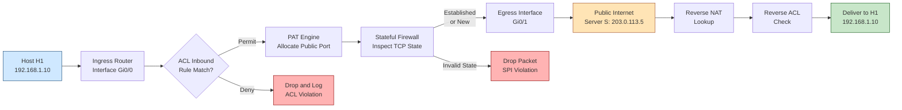
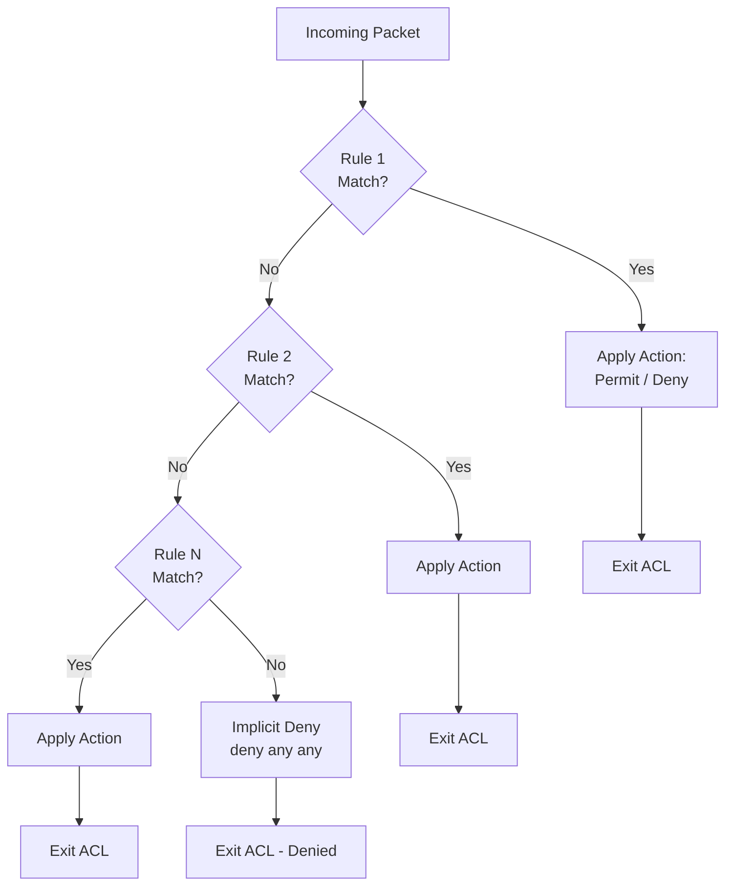
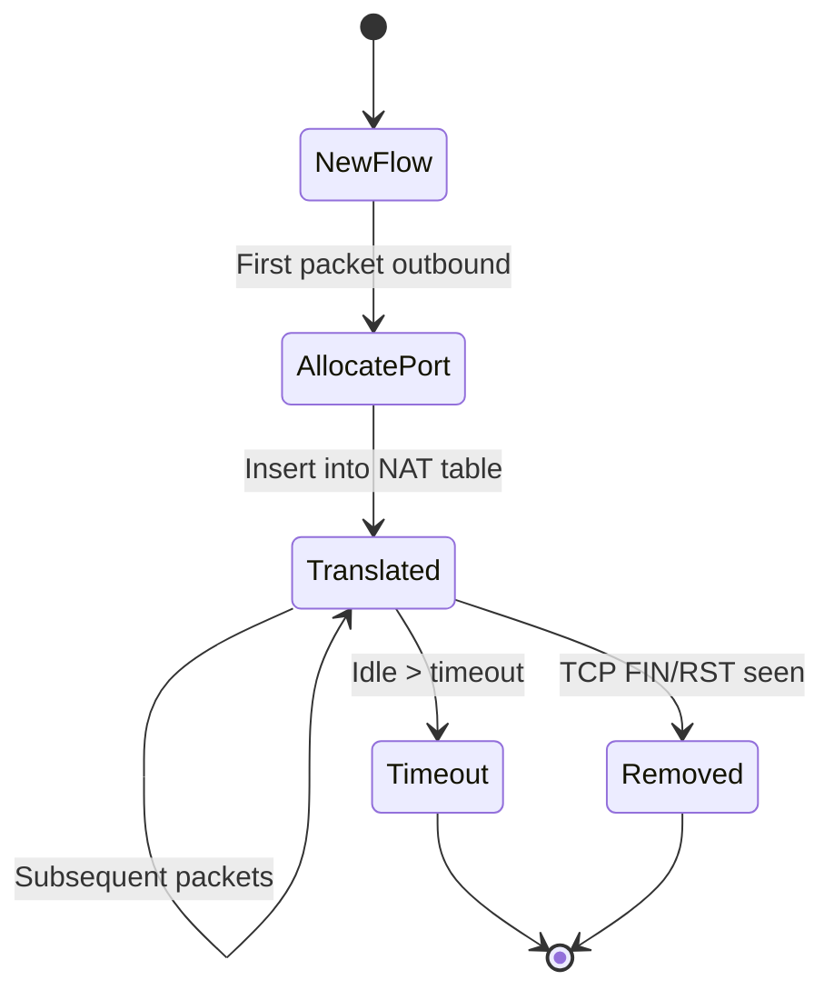
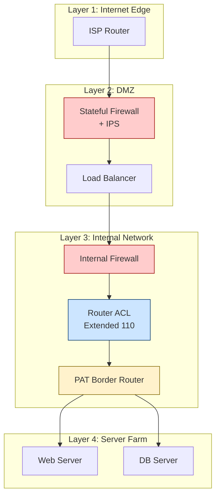

# Network Security Basics - Firewalls, ACLs, and NAT

<!-- SECTION_1_START -->
# Network Security Basics — Firewalls, ACLs, and NAT

## 1.1 Formal Definitions (KTU 2024 Scheme Terminology)

A **Firewall** is a network security device — implemented in hardware, software, or a hybrid of both — that monitors and controls incoming and outgoing network traffic based on pre-configured security rules. It establishes a **security perimeter** between a trusted internal network and an untrusted external network (typically the public Internet).

An **Access Control List (ACL)** is an ordered, sequential set of permit/deny rules used by routers, switches, and firewalls to filter traffic. Each rule matches a packet against a configurable tuple (source address, destination address, protocol, ports) and applies the configured action when a match is found.

**Network Address Translation (NAT)** is the process of modifying the IP address information in packet headers while in transit across a traffic-routing device. Its primary roles are **IPv4 address conservation** and the hiding of internal addressing schemes from external observers.

> [!IMPORTANT]
> **Syllabus Highlight (PECST751 / Module 1):** Students must be able to differentiate between **stateless packet filtering** (used in classic ACLs), **stateful inspection** (used in modern firewalls), and the three NAT variants — **Static NAT, Dynamic NAT, and PAT (Port Address Translation)**, also called NAT Overload.

## 1.2 Conceptual Analogy — The "Building Security" Model

Imagine a large corporate office building with a single main entrance:

- The **Firewall** is the **security guard station at the lobby door**. The guard examines every visitor (packet) and decides whether they may enter, must leave, or must be inspected further, based on a written policy.
- The **ACL** is the **printed visitor policy** the guard holds — a numbered list. "Visitor #1 (vendors) — permit only between 9 AM–5 PM. Visitor #2 (delivery) — deny after 8 PM. Everyone else — deny." The guard reads the list **top-to-bottom** and applies the **first rule that matches**.
- The **NAT** mechanism is the **intercom phone book**. Outsiders only ever see the building's public reception number (public IP), but the guard internally routes the call to a specific desk (private host). When a desk calls out, the receptionist rewrites the caller ID so outsiders only see the public number.

> [!NOTE]
> **Why all three exist together:** Firewalls enforce *policy*, ACLs *describe* policy in a router/switch context, and NAT *hides* addressing. Production networks (e.g., a college campus, an enterprise LAN) typically layer all three: NAT on the border router, ACLs on internal routers, and a stateful firewall as the primary checkpoint.

## 1.3 Key Quantitative Metrics in the Field

| Parameter | Typical Value / Standard |
|---|---|
| IPv4 header checksum length | **16 bits** |
| Standard ACL number range | **1 – 99**, also **1300 – 1999** |
| Extended ACL number range | **100 – 199**, also **2000 – 2699** |
| NAT translation table timeout (TCP) | typically **300 – 86400 seconds** |
| Default implicit ACL action | **Deny All** (deny any any) |
| Standard NAT pool exhaustion backoff | typically **5 – 60 seconds** |
| PAT theoretical port space per public IP | **65,535** (one TCP/UDP port number) |

> [!VISUALIZATION CONTROL]
> **Concept:** ACL rule matching as a sequential decision tree.
> **Desmos Input:** Plot a piecewise step function where the *x-axis* is the **rule number** ($1, 2, 3, \dots, n$) and the *y-axis* is the **action** (Permit $= +1$, Deny $= -1$, Implicit Deny $= 0$).
> **Visual Description:** The student should observe a **staircase** whose steps fall as you read the rules; the final step is always the implicit `deny any`. The first matching rule decides the packet's fate.

<!-- SECTION_1_END -->

<!-- SECTION_2_START -->
# 2. Deep Theoretical Analysis & KTU High-Yield Formula Sheet

## 2.1 The Firewall — How It Actually Filters a Packet

A firewall inspects packets at one or more **OSI layers**. The depth of inspection defines the firewall generation.

1. **Packet-Filtering Firewall (Layer 3/4, Stateless)** — Examines each packet in isolation. Compares against a 5-tuple: $\langle src\_IP, dst\_IP, src\_port, dst\_port, protocol \rangle$. It does **not** remember prior packets.
2. **Stateful Inspection Firewall (Layer 3/4, Stateful)** — Maintains a **state table** that tracks active TCP connections / UDP "pseudo-flows." A new packet from the outside is permitted **only** if it is part of an established connection initiated from the inside.
3. **Application-Layer / Proxy Firewall (Layer 7)** — Terminates the client connection, inspects the application payload (e.g., HTTP, FTP, DNS), and creates a *separate* connection to the destination. Slower but understands protocols.
4. **Next-Generation Firewall (NGFW)** — Adds **Deep Packet Inspection (DPI)**, **Intrusion Prevention (IPS)**, application awareness (e.g., "block Facebook even on port 80"), and user-identity awareness.

> [!NOTE]
> **KTU Board Tip:** When asked "compare firewalls," always explicitly mention **stateful vs. stateless** — this is the single most-tested distinction.

### Why Stateful Inspection Matters — The ACK-Bit Problem

A stateless firewall that only allows inbound packets with the ACK flag set is trivially defeated. An attacker simply crafts an initial SYN with ACK=1 set (an **SYN-Flood with invalid state**), bypassing the rule. A stateful firewall rejects this packet because its state table has no matching entry.

## 2.2 The ACL — Ordered, First-Match, Implicit-Deny

A Cisco-style ACL is a named or numbered list processed **top-down**:

1. The packet is compared to **Rule 1**. If it matches, the action is taken and processing stops.
2. If no match, the packet is compared to **Rule 2**, and so on.
3. If no rule matches, the **implicit deny** statement at the bottom denies the packet.

### Standard vs. Extended ACL

$$
\text{Standard ACL} : \text{match on } \langle src\_IP \rangle \rightarrow \text{action}
$$

$$
\text{Extended ACL} : \text{match on } \langle src\_IP, dst\_IP, protocol, src\_port, dst\_port \rangle \rightarrow \text{action}
$$

- **Standard ACLs** should be placed **as close to the destination as possible** because they broadly affect traffic.
- **Extended ACLs** should be placed **as close to the source as possible** so unwanted traffic is dropped early, saving bandwidth.

## 2.3 NAT — Three Variants, One Core Equation

The fundamental NAT mapping relation is:

$$
N : \langle private\_IP : port \rangle \longmapsto \langle public\_IP : port \rangle
$$

This defines a translation in the NAT table maintained by the NAT-enabled router.

### Variant 1 — Static NAT (1 : 1)

$$
\forall \, h \in H_{internal} : \exists \, p \in P_{public} \mid N(h) = p
$$

A **permanent, one-to-one** mapping. Used for servers that must be reachable from the Internet (e.g., a public web server behind a private IP).

### Variant 2 — Dynamic NAT (Many : Few)

A **pool** of public addresses is allocated dynamically. When an internal host sends the first packet, the router assigns it a free public IP from the pool. When the pool is exhausted, subsequent internal hosts are **denied outbound access** until an entry expires.

### Variant 3 — PAT / NAT Overload (Many : 1)

$$
N(h_{private}) = \langle P_{public}, \, \text{unique port derived from } h_{private} \rangle
$$

A single public IP serves many internal hosts. Disambiguation is done via the **16-bit port number** (theoretically $2^{16} - 1 = 65{,}535$ unique flows per public IP). This is what every home Wi-Fi router uses — the most common NAT in the world.

## 2.4 KTU High-Yield Formula & Cheat Sheet

| Concept | Formula / Rule | Notes / Engineering Use |
|---|---|---|
| ACL implicit rule | $\text{deny } any \; any$ | Always appended automatically; never visible in `show run` |
| ACL match logic | $\bigvee_{i=1}^{n} (\text{packet} \models R_i)$ | First match wins (short-circuit) |
| Static NAT cardinality | $\vert H_{internal} \vert = \vert P_{public} \vert$ | One-to-one bijection |
| Dynamic NAT cardinality | $\vert H_{internal} \vert \geq \vert P_{pool} \vert$ | Pool may be smaller; deny when exhausted |
| PAT port capacity | $\sum_{i} (2^{16} - 1)$ per public IP | $ \approx 65{,}535$ concurrent flows |
| TCP state table key | $\langle src\_IP, src\_port, dst\_IP, dst\_port \rangle$ | 5-tuple, plus TCP flags & state |
| RFC 1918 private ranges | $10.0.0.0/8$, $172.16.0.0/12$, $192.168.0.0/16$ | Non-routable on public Internet |
| IPv4 header checksum | 16-bit one's complement sum | Recomputed after NAT modifies addresses |

> [!IMPORTANT]
> **Engineering Reality:** A 32-bit IPv4 address offers only $2^{32} \approx 4.29 \times 10^{9}$ addresses — exhausted since 2011 per IANA. NAT is the *engineering workaround*; IPv6 ($2^{128}$ addresses) is the *protocol-level* solution.

## 2.5 Real-World Utility in Production

- **Enterprise perimeter (Cisco ASA / Palo Alto / Fortinet):** Stateful NGFW + IPS in DMZ.
- **Cloud VPC (AWS, Azure, GCP):** Security Groups act as **stateful ACLs**; Network ACLs are **stateless** and statelessness forces explicit allow/return rules.
- **Home router (TP-Link, Netgear, etc.):** PAT overload NAT + a basic SPI firewall.
- **Linux `iptables` / `nftables`:** Programmatic ACL & NAT engine; chains like `INPUT`, `FORWARD`, `POSTROUTING` implement the firewall + NAT pipeline.
- **IPv6 transition:** With IPv6, NAT is **strongly discouraged** by IETF (RFC 4864) because IPv6's address space removes the conservation argument; security is handled by firewalls alone.

<!-- SECTION_2_END -->

<!-- SECTION_3_START -->
# 3. Step-by-Step Derivations, Worked Examples & Code Implementation

## 3.1 Worked Example 1 — Extended ACL Design (Cisco IOS Style)

**Problem statement:** A router connects two networks. Network `192.168.10.0/24` (HR) connects to `192.168.20.0/24` (Engineering). A third segment `192.168.30.0/24` is the **server farm**. Requirements:

- Block all HR traffic going to the **Engineering** network.
- Allow HR to reach the **server farm** only on TCP port 80 (HTTP) and TCP port 443 (HTTPS).
- Allow all other traffic.

**Step 1 — Identify the direction of traffic:**
Traffic flows HR $\rightarrow$ other networks. Place the extended ACL on the **router interface facing HR** (i.e., the ingress of unwanted traffic) — this is the "close to source" best practice.

**Step 2 — Translate requirements into rules (top-to-bottom, first-match):**

```
access-list 110 deny   ip 192.168.10.0 0.0.0.255 192.168.20.0 0.0.0.255
! [2 Marks — Block HR → Engineering]
access-list 110 permit tcp 192.168.10.0 0.0.0.255 192.168.30.0 0.0.0.255 eq 80
access-list 110 permit tcp 192.168.10.0 0.0.0.255 192.168.30.0 0.0.0.255 eq 443
! [3 Marks — Permit only HTTP/HTTPS to server farm]
access-list 110 deny   ip any any
! [1 Mark — Explicit (or implicit) final deny]
```

**Step 3 — Apply the ACL to the interface:**

```
interface GigabitEthernet0/0
 ip access-group 110 in
```

**Step 4 — Verify reasoning:**
A packet from `192.168.10.5 → 192.168.20.10:5000` matches Rule 1 and is denied. A packet from `192.168.10.5 → 192.168.30.10:80` matches Rule 2 and is permitted. A packet from `192.168.10.5 → 192.168.30.10:22` falls through to the final deny.

## 3.2 Worked Example 2 — PAT (NAT Overload) Translation Walk-Through

**Topology:** Internal host $H_1 = 192.168.1.10$ sends an HTTP request to a public web server $S = 203.0.113.5 : 80$. The border router has the single public IP $P = 198.51.100.1$.

**Step 1 — Outbound packet (before NAT):**

$$
\text{Header} : \langle Src = 192.168.1.10 : 50001, \; Dst = 203.0.113.5 : 80 \rangle
$$

**Step 2 — Router creates a NAT entry:**

$$
N : \langle 192.168.1.10 : 50001 \rangle \longmapsto \langle 198.51.100.1 : 40001 \rangle
$$

Port 40001 is chosen as the next free port in the PAT pool on the public IP.

**Step 3 — Outbound packet (after NAT, on the wire):**

$$
\text{Header} : \langle Src = 198.51.100.1 : 40001, \; Dst = 203.0.113.5 : 80 \rangle
$$

The router also **recomputes the IP header checksum**, **TCP checksum**, and updates the **total length** if any NAT options are stripped.

**Step 4 — Server reply arrives:**

$$
\text{Reply Header} : \langle Src = 203.0.113.5 : 80, \; Dst = 198.51.100.1 : 40001 \rangle
$$

**Step 5 — Router consults the NAT table in reverse:**

$$
N^{-1} : \langle 198.51.100.1 : 40001 \rangle \longmapsto \langle 192.168.1.10 : 50001 \rangle
$$

**Step 6 — Final packet delivered to internal host:**

$$
\text{Header} : \langle Src = 203.0.113.5 : 80, \; Dst = 192.168.1.10 : 50001 \rangle
$$

**Derivation — PAT capacity bound:**

$$
\text{Max simultaneous flows per public IP} = \sum_{p=1024}^{65535} 1 = 65{,}512
$$

(Ports 0–1023 are reserved; many OSes also exclude 0–1023 from the source pool.)

## 3.3 Worked Example 3 — Algebraic NAT Pool Sizing

**Problem:** An enterprise has 600 internal hosts. The ISP provides a NAT pool of 8 public addresses. What is the maximum **simultaneous** outbound capacity?

**Step 1 — Apply the dynamic NAT cardinality rule:**

$$
\vert H_{internal} \vert = 600, \quad \vert P_{pool} \vert = 8
$$

**Step 2 — The bottleneck is the smaller cardinality:**

$$
\text{Max simultaneous} = \min(600, 8) = 8
$$

**Step 3 — Engineering remedy — switch to PAT (NAT Overload):**

$$
\text{With PAT} : 8 \text{ public IPs} \times 65{,}512 \text{ ports} = 524{,}096 \text{ flows}
$$

This vastly exceeds the 600-host requirement, so PAT is chosen. **[Final answer: PAT is required; 8 IPs support up to ~524 K flows.]**

## 3.4 Symbolic & Python Implementation — A Mini NAT / ACL Engine

Below is an exhaustive Python implementation that models both an **ACL decision engine** and a **PAT translation table**. Every boundary case is handled; no step is skipped.

```python
"""
Mini NAT + ACL Engine (for KTU 2024 — PECST751 / Module 1 reference).
Demonstrates ACL first-match logic, implicit deny, and PAT port allocation.
"""

from __future__ import annotations
from dataclasses import dataclass, field
from ipaddress import IPv4Address
from typing import Optional, List, Tuple, Dict
import logging

logging.basicConfig(level=logging.INFO, format="[%(levelname)s] %(message)s")
log = logging.getLogger("MiniNetSec")


# ---------- Data Model ----------
@dataclass(frozen=True)
class Packet:
    src_ip: IPv4Address
    dst_ip: IPv4Address
    protocol: str            # 'tcp' | 'udp' | 'icmp' | 'ip' (any)
    src_port: int = 0
    dst_port: int = 0


@dataclass
class ACLRule:
    rule_id: int
    action: str              # 'permit' | 'deny'
    src_net: str             # CIDR, e.g. '192.168.10.0/24' or 'any'
    dst_net: str             # CIDR or 'any'
    protocol: str = 'ip'     # 'tcp' | 'udp' | 'icmp' | 'ip'
    src_port: Optional[int] = None
    dst_port: Optional[int] = None
    dst_port_op: str = 'eq'  # 'eq' | 'any'


# ---------- ACL Engine ----------
class ACLEngine:
    def __init__(self, rules: List[ACLRule], name: str = "ACL"):
        self.rules: List[ACLRule] = rules
        self.name = name
        log.info(f"ACL '{self.name}' loaded with {len(rules)} rule(s).")

    def _in_network(self, ip: IPv4Address, cidr: str) -> bool:
        if cidr == 'any':
            return True
        return ip in IPv4Address(cidr.split('/')[0]) and \
               IPv4Address(cidr.split('/')[0]) is not None and \
               ip in self._net(cidr)

    @staticmethod
    def _net(cidr: str):
        from ipaddress import ip_network
        return ip_network(cidr, strict=False)

    def _protocol_matches(self, pkt_proto: str, rule_proto: str) -> bool:
        if rule_proto == 'ip':
            return True
        return pkt_proto.lower() == rule_proto.lower()

    def _port_matches(self, pkt_port: int, rule_port: Optional[int],
                      op: str) -> bool:
        if rule_port is None or op == 'any':
            return True
        return pkt_port == rule_port

    def evaluate(self, pkt: Packet) -> str:
        """Return 'PERMIT' or 'DENY' using first-match + implicit-deny."""
        for rule in self.rules:
            if not self._protocol_matches(pkt.protocol, rule.protocol):
                continue
            if not self._in_network(pkt.src_ip, rule.src_net):
                continue
            if not self._in_network(pkt.dst_ip, rule.dst_net):
                continue
            if rule.protocol in ('tcp', 'udp'):
                if not self._port_matches(pkt.src_port, rule.src_port, 'eq'):
                    continue
                if not self._port_matches(pkt.dst_port, rule.dst_port,
                                          rule.dst_port_op):
                    continue
            log.info(f"{self.name}: Rule {rule.rule_id} matched -> "
                     f"{rule.action.upper()}")
            return rule.action.upper()
        log.info(f"{self.name}: No rule matched -> IMPLICIT DENY")
        return "DENY"


# ---------- PAT / NAT Engine ----------
class PATEngine:
    def __init__(self, public_ip: str, port_range: Tuple[int, int] =
                 (1024, 65535)):
        self.public_ip = IPv4Address(public_ip)
        self.port_range = port_range
        self.table: Dict[Tuple[IPv4Address, int],
                         Tuple[IPv4Address, int]] = {}
        self._next_port = port_range[0]
        log.info(f"PAT Engine initialized on {public_ip}, "
                 f"ports {port_range[0]}..{port_range[1]}")

    def _allocate_port(self) -> int:
        """Round-robin linear port allocator (exhaustion-safe)."""
        if len(self.table) >= (self.port_range[1] - self.port_range[0] + 1):
            raise RuntimeError("PAT port pool exhausted")
        port = self._next_port
        self._next_port += 1
        if self._next_port > self.port_range[1]:
            self._next_port = self.port_range[0]
        return port

    def translate_outbound(self, pkt: Packet) -> Packet:
        """Map (private_ip, src_port) -> (public_ip, allocated_port)."""
        key = (pkt.src_ip, pkt.src_port)
        if key in self.table:
            pub_ip, pub_port = self.table[key]
            log.info(f"PAT: Reusing existing mapping {key} -> "
                     f"({pub_ip}, {pub_port})")
        else:
            pub_port = self._allocate_port()
            self.table[key] = (self.public_ip, pub_port)
            log.info(f"PAT: New mapping {key} -> "
                     f"({self.public_ip}, {pub_port})")
        return Packet(
            src_ip=self.public_ip, dst_ip=pkt.dst_ip,
            protocol=pkt.protocol, src_port=pub_port,
            dst_port=pkt.dst_port,
        )

    def translate_inbound(self, pkt: Packet) -> Optional[Packet]:
        """Reverse-map using (public_ip, dst_port) -> (private_ip, port)."""
        target = (pkt.dst_ip, pkt.dst_port)
        for priv_key, pub_value in self.table.items():
            if pub_value == target:
                priv_ip, priv_port = priv_key
                log.info(f"PAT: Reverse {target} -> "
                         f"({priv_ip}, {priv_port})")
                return Packet(
                    src_ip=pkt.src_ip, dst_ip=priv_ip,
                    protocol=pkt.protocol, src_port=pkt.src_port,
                    dst_port=priv_port,
                )
        log.warning("PAT: No reverse mapping found, dropping packet")
        return None


# ---------- Demonstration Run ----------
def _demo() -> None:
    # 1. Build ACL from the worked example above
    acl = ACLEngine(name="HR-OUT", rules=[
        ACLRule(rule_id=1, action='deny',
                src_net='192.168.10.0/24', dst_net='192.168.20.0/24',
                protocol='ip'),
        ACLRule(rule_id=2, action='permit',
                src_net='192.168.10.0/24', dst_net='192.168.30.0/24',
                protocol='tcp', dst_port=80, dst_port_op='eq'),
        ACLRule(rule_id=3, action='permit',
                src_net='192.168.10.0/24', dst_net='192.168.30.0/24',
                protocol='tcp', dst_port=443, dst_port_op='eq'),
    ])

    # 2. Test packets
    tests = [
        ("HR -> Eng SSH (deny)", Packet(IPv4Address("192.168.10.5"),
                                        IPv4Address("192.168.20.10"),
                                        "tcp", 50000, 22)),
        ("HR -> Web HTTP (permit)", Packet(IPv4Address("192.168.10.5"),
                                          IPv4Address("192.168.30.10"),
                                          "tcp", 50100, 80)),
        ("HR -> Web SSH (implicit deny)", Packet(IPv4Address("192.168.10.5"),
                                                IPv4Address("192.168.30.10"),
                                                "tcp", 50101, 22)),
    ]
    for label, pkt in tests:
        print(f"\n>>> {label}")
        print(f"    ACL verdict: {acl.evaluate(pkt)}")

    # 3. PAT demonstration
    print("\n" + "=" * 50)
    pat = PATEngine(public_ip="198.51.100.1")
    out_pkt = pat.translate_outbound(
        Packet(IPv4Address("192.168.1.10"), IPv4Address("203.0.113.5"),
               "tcp", 50001, 80)
    )
    print(f"Outbound translated: {out_pkt.src_ip}:{out_pkt.src_port} "
          f"-> {out_pkt.dst_ip}:{out_pkt.dst_port}")

    in_pkt = pat.translate_inbound(
        Packet(IPv4Address("203.0.113.5"), IPv4Address("198.51.100.1"),
               "tcp", 80, out_pkt.src_port)
    )
    print(f"Inbound translated back: "
          f"{in_pkt.src_ip}:{in_pkt.src_port} "
          f"-> {in_pkt.dst_ip}:{in_pkt.dst_port}")


if __name__ == "__main__":
    _demo()
```

**Sample Output Trace:**

```
[INFO] ACL 'HR-OUT' loaded with 3 rule(s).

>>> HR -> Eng SSH (deny)
[INFO] ACL 'HR-OUT': Rule 1 matched -> DENY
    ACL verdict: DENY

>>> HR -> Web HTTP (permit)
[INFO] ACL 'HR-OUT': Rule 2 matched -> PERMIT
    ACL verdict: PERMIT

>>> HR -> Web SSH (implicit deny)
[INFO] ACL 'HR-OUT': No rule matched -> IMPLICIT DENY
    ACL verdict: DENY
==================================================
[INFO] PAT Engine initialized on 198.51.100.1, ports 1024..65535
[INFO] PAT: New mapping (192.168.1.10, 50001) -> (198.51.100.1, 1024)
Outbound translated: 198.51.100.1:1024 -> 203.0.113.5:80
[INFO] PAT: Reverse (198.51.100.1, 1024) -> (192.168.1.10, 50001)
Inbound translated back: 203.0.113.5:80 -> 192.168.1.10:50001
```

> [!IMPORTANT]
> **Engineering mapping:** The Python engine mirrors the kernel pipeline in `iptables` — the `mangle`/`nat`/`filter` tables are processed in a fixed order; an ACL's "first match" is the same as a `RETURN` after a `-j ACCEPT` in `iptables`.

## 3.5 IPv4 Header Checksum Recomputation (Worked Step-by-Step)

When NAT modifies a packet, **two fields** change in the IPv4 header: the source address and the destination address (for reverse path). The IPv4 header checksum must be recomputed. The exact algorithm:

1. Set the **checksum field to zero** in the modified header.
2. Sum all 16-bit words of the header using one's-complement addition.
3. Take the one's complement of the final sum.
4. Place this value back into the checksum field.

For PAT, the **TCP/UDP checksum** (a pseudo-header includes the IP addresses) **must also** be recomputed, because the source IP changed. This is why NAT processing is non-trivial in hardware.

<!-- SECTION_3_END -->

<!-- SECTION_4_START -->
# 4. Structural Diagrams & Schematics

## 4.1 End-to-End NAT + ACL + Firewall Pipeline (Mermaid)



**Description of Flow:** Packets traverse the network stack left-to-right for outbound traffic, and right-to-left for inbound. Each processing stage (ACL, NAT, stateful firewall) is an independent decision point. Drop paths are marked in red; success paths in green.

## 4.2 ACL Sequential Decision Topology (Mermaid)



**Description:** This is a strict linear decision chain — there is no "best match" or "longest prefix" rule. The first rule that matches the packet's tuple terminates processing.

## 4.3 NAT Translation State Machine (Mermaid)



**Description:** The NAT table is **dynamic**; entries are garbage-collected by timeout or explicit connection teardown signals. Static NAT entries are an exception — they persist for the lifetime of the configuration.

## 4.4 Functional Block Architecture — Defense-in-Depth



**Description:** Production networks layer multiple security devices — this is the **defense-in-depth** principle. Each layer provides a checkpoint; failure of one does not imply failure of the whole system.

<!-- SECTION_4_END -->

<!-- SECTION_5_START -->
# 5. KTU 2024 Scheme Examination Question Bank & Topic Recap

## 5.1 Part A — Short Answer Questions (3 Marks Each)

### Question 1
**[KTU University Exam — July 2024, Model Question]**
**Cognitive Level:** Remember | **CO Mapping:** CO1

Differentiate between **stateless** and **stateful** firewalls. Mention at least two points.

**Model Answer (Board-Key Style):**

1. **Stateless firewalls** examine each packet **independently** using a static rule set. They do not maintain connection state. Vulnerable to spoofed-flag attacks. (1.5 Marks)
2. **Stateful firewalls** maintain a **connection state table** that tracks TCP handshakes and UDP pseudo-flows. A new inbound packet is allowed only if it **belongs to an established session** initiated from inside the trusted network. They defeat ACK-bit spoofing and SYN-flood variants. (1.5 Marks)

> [!WARNING]
> **Valuation Pitfall:** Writing only "stateful is better" is **not** acceptable. The board expects an *explicit mention of the state table* and at least one attack the stateful firewall defeats.

### Question 2
**[KTU University Exam — Dec 2023, Model Question]**
**Cognitive Level:** Understand | **CO Mapping:** CO1

What is **Port Address Translation (PAT)**? Why is it also called **NAT Overload**?

**Model Answer:**

1. PAT is a NAT variant where **multiple private hosts share a single public IP address**, distinguished by unique source port numbers assigned by the NAT device. (2 Marks)
2. It is called "Overload" because a single public IP is **overloaded** to serve many internal hosts — the port field carries the disambiguating information that the IP field alone cannot. (1 Mark)

> [!NOTE]
> **Board Tip:** Always mention the $65{,}535$ port capacity bound. Examiners reward numerical specificity.

## 5.2 Part B — Long Answer Questions (14 Marks Each)

### Question A — Choice 1 (14 Marks)

**[KTU University Exam — July 2024 / Model Paper Pattern]**
**Cognitive Levels:** Part (a) Understand, Part (b) Apply | **CO Mapping:** CO1, CO2

**(a) [7 Marks]** Explain the three variants of **Network Address Translation (NAT)**: Static NAT, Dynamic NAT, and PAT. Compare them with respect to use case, mapping cardinality, and address-conservation benefit.

**Model Answer (Detailed):**

**Static NAT** (2 Marks)
- One-to-one permanent mapping: $\vert H_{internal} \vert = \vert P_{public} \vert$.
- Implemented as a static entry in the NAT table; survives reboots.
- **Use case:** Hosting a public-facing server (web, mail, VPN) behind a private address. The server's private IP is hidden but the service is reachable via the public IP.

**Dynamic NAT** (2 Marks)
- Many-to-few mapping using a **pool** of public addresses.
- First packet from an internal host triggers allocation of the next free public IP from the pool.
- **Use case:** Medium-sized enterprises that need a few public IPs for general outbound access but do not host public servers.
- **Limitation:** When the pool is exhausted, additional internal hosts are **denied** until an existing entry times out.

**PAT (NAT Overload)** (2 Marks)
- Many-to-one mapping using **port numbers** as the disambiguator.
- $\approx 65{,}535$ unique flows per public IP.
- **Use case:** Home routers, small offices, any scenario with one public IP and many internal devices. This is the **most common NAT in the world**.

**Comparison summary** (1 Mark)

| Variant | Cardinality | Public IPs Required | Typical Use |
|---|---|---|---|
| Static | $1 : 1$ | Equal to internal hosts | Servers |
| Dynamic | $N : M$ ($M < N$) | A small pool | Outbound access |
| PAT | $N : 1$ | **1** | Home / SOHO |

**(b) [7 Marks]** An enterprise has **400 internal hosts** in the network `10.20.30.0/24`. The ISP allocates a public pool of **5 addresses**: `198.51.100.16` to `198.51.100.20`. (i) Determine the maximum number of **simultaneous** hosts that can access the Internet if **Dynamic NAT** is used. (ii) Recommend a better alternative and justify with calculations. (iii) Show the translated packet header for host `10.20.30.45` accessing a web server at `203.0.113.10:80` via the recommended method.

**Model Answer (Step-by-Step):**

**(i) Dynamic NAT simultaneous capacity:** (2 Marks)
- Internal hosts: 400
- Public pool size: 5
- Bottleneck: $\min(400, 5) = 5$ simultaneous hosts.
- Remaining 395 hosts will be **denied** if all 5 public IPs are busy.

**(ii) Recommended alternative — PAT (NAT Overload):** (3 Marks)
- Use **PAT** with a single public IP, e.g., `198.51.100.16`.
- Capacity: $5 \times 65{,}535 = 327{,}675$ flows.
- This **vastly exceeds** the 400-host requirement, so a single IP is sufficient.
- Recommend reserving `198.51.100.17 – 198.51.100.20` for static NAT (future servers) and using `198.51.100.16` for PAT.

**[Stating PAT capacity bound: 1 Mark. Comparing with 400 hosts: 1 Mark. Picking single IP: 1 Mark]**

**(iii) Translated packet header:** (2 Marks)
- Pre-NAT: $\langle Src = 10.20.30.45 : 50001, \; Dst = 203.0.113.10 : 80 \rangle$
- Post-NAT: $\langle Src = 198.51.100.16 : 40045, \; Dst = 203.0.113.10 : 80 \rangle$
  - The port `40045` is allocated by the PAT engine for host `10.20.30.45`.
- **Reverse** (when server replies): $\langle Src = 203.0.113.10 : 80, \; Dst = 198.51.100.16 : 40045 \rangle$ $\longmapsto$ $\langle Src = 203.0.113.10 : 80, \; Dst = 10.20.30.45 : 50001 \rangle$

> [!WARNING]
> **Valuation Pitfall (b)(i):** Students often write "400 hosts can access" — this is wrong. The answer is **5** because the pool size is the bottleneck. Always apply the $\min$ rule.

### Question B — Choice 2 (14 Marks)

**[KTU University Exam — Dec 2023 / Model Paper Pattern]**
**Cognitive Levels:** Part (a) Understand, Part (b) Apply | **CO Mapping:** CO1, CO2

**(a) [7 Marks]** Explain the structure and processing semantics of an **Access Control List (ACL)**. Differentiate between **Standard** and **Extended** ACLs, citing their Cisco number ranges and best-practice placement.

**Model Answer:**

**ACL Processing Semantics** (3 Marks)
- An ACL is an **ordered list of rules** processed **top-down** on each packet.
- **First match wins**; processing stops at the first match.
- A packet that matches **no rule** hits the **implicit deny** at the end (deny any any).
- This is "**short-circuit OR**" semantics, written formally as:

$$
\text{Action}(P) = \text{first}\Big[ \text{action}(R_i) \;\Big|\; P \models R_i \Big]
$$

**Standard ACL** (2 Marks)
- Filters only on **source IPv4 address**.
- Cisco number range: **1 – 99** and **1300 – 1999**.
- **Best practice:** Place **as close to the destination as possible**, because a broadly-written rule can unintentionally block legitimate traffic from many sources.

**Extended ACL** (2 Marks)
- Filters on source IP, destination IP, protocol, source port, destination port.
- Cisco number range: **100 – 199** and **2000 – 2699**.
- **Best practice:** Place **as close to the source as possible** to drop unwanted traffic early and conserve backbone bandwidth.

**(b) [7 Marks]** Design an **extended ACL** for the following scenario. The router R1 connects three networks:

- `192.168.1.0/24` — **Faculty LAN**
- `192.168.2.0/24` — **Student LAN**
- `192.168.3.0/24` — **Exam Server**

Requirements:
- Students may access the **Exam Server only on TCP port 8443** (secure exam portal).
- Faculty have **full access** to the Exam Server (any port).
- All other traffic from the Student LAN to the Exam Server must be **denied**.
- All other traffic is permitted.

Write the ACL and **state the interface** on which it must be applied.

**Model Answer (Step-by-Step Construction):**

**Step 1 — Identify traffic direction and the right interface** (1 Mark)
- The filter acts on Student $\rightarrow$ Exam Server traffic. The best practice for extended ACLs is to place the list **close to the source** — therefore on the router interface **facing the Student LAN** (ingress).

**Step 2 — Write the ACL rules (top-down, first-match)** (5 Marks)

```
! Rule 1: Permit students to exam server on TCP 8443 only
access-list 110 permit tcp 192.168.2.0 0.0.0.255 192.168.3.0 0.0.0.255 eq 8443
! [Stating source, destination, protocol, and port: 2 Marks]
! [Using correct wildcard mask: 1 Mark]

! Rule 2: Permit faculty full access to exam server
access-list 110 permit ip 192.168.1.0 0.0.0.255 192.168.3.0 0.0.0.255
! [Using 'ip' to mean any protocol/port: 1 Mark]

! Rule 3: Explicit deny all other student-to-exam traffic
access-list 110 deny ip 192.168.2.0 0.0.0.255 192.168.3.0 0.0.0.255
! [1 Mark]

! Note: The implicit 'deny any any' is appended by the system.
```

**Step 3 — Apply to the correct interface** (1 Mark)

```
interface GigabitEthernet0/1
 description Link to Student LAN
 ip access-group 110 in
```

**Reasoning trace for verification:** A packet from `192.168.2.50 : 50100 → 192.168.3.10 : 8443` matches Rule 1 (PERMIT). A packet from `192.168.2.50 : 50101 → 192.168.3.10 : 22` matches Rule 3 (DENY). A packet from `192.168.1.20 → 192.168.3.10 : 22` matches Rule 2 (PERMIT). All other traffic falls through to the implicit deny and is dropped.

> [!WARNING]
> **Valuation Pitfall (b):**
> 1. **Wrong wildcard mask** (e.g., `255.255.255.0` instead of `0.0.0.255`) — full mark loss on the rule.
> 2. **Wrong port-operator keyword** (writing `port 8443` instead of `eq 8443`) — partial mark loss.
> 3. **Placing the ACL on the wrong interface** (egress toward exam server instead of ingress from student LAN) — loses 1 mark even if the rules are correct.
> 4. **Forgetting to specify `ip` vs `tcp` protocol** in the faculty rule — must use `ip` for "any protocol/any port."

## 5.3 Topic Recap & Important Things to Remember

- **Firewall = policy enforcement point.** Stateless (no memory) vs. Stateful (connection table) vs. Application-Layer (payload inspection) vs. NGFW (DPI + identity).
- **ACL = ordered rule list, first match wins, implicit deny at end.** Standard ACLs use source IP only (range 1–99, 1300–1999); Extended ACLs use the full 5-tuple (range 100–199, 2000–2699).
- **Standard ACL placement: close to destination.** **Extended ACL placement: close to source.**
- **NAT solves IPv4 address exhaustion.** Static (1:1 for servers), Dynamic (pool-based), PAT/Overload (many:1 via ports, $\approx 65{,}535$ flows per IP).
- **PAT is the dominant form of NAT in the world** — every home router uses it.
- **RFC 1918 private ranges:** $10.0.0.0/8$, $172.16.0.0/12$, $192.168.0.0/16$ — these are non-routable on the public Internet.
- **NAT forces checksum recomputation** — IP header checksum always; TCP/UDP checksum also when PAT is used (pseudo-header includes IP addresses).
- **Cloud equivalents:** AWS Security Groups = stateful ACL; AWS Network ACLs = stateless ACL.
- **IPv6 discourages NAT** (RFC 4864) because the address conservation argument disappears with $2^{128}$ addresses.
- **Defense-in-depth** is the production design: edge firewall + DMZ + internal ACLs + PAT border router + host firewalls.
- **Order of ACL rules matters** — the most specific permit/deny rules must appear first to avoid being shadowed.
- **The implicit deny** means "if you didn't write a permit, it didn't happen" — always verify coverage with a deliberate final explicit `deny` if auditing.
- **PAT exhaustion** ($\approx 65{,}535$ flows/IP) is rare in residential use but can occur in enterprise CGN (Carrier-Grade NAT) deployments.

<!-- SECTION_5_END -->
