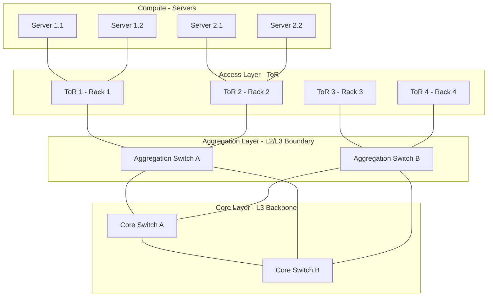
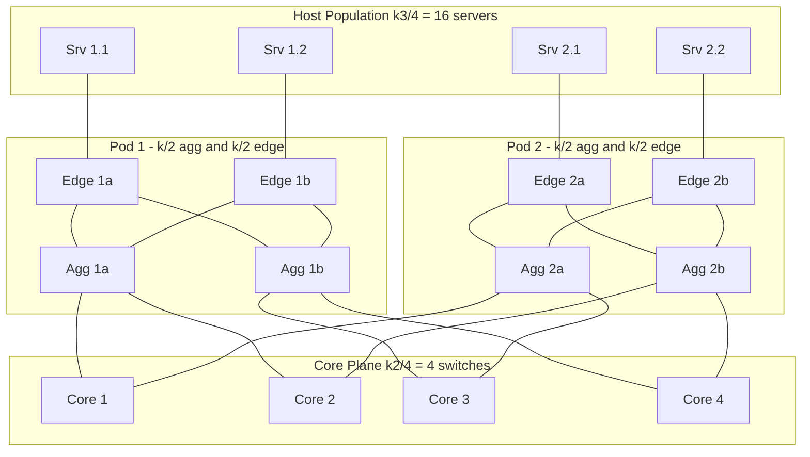
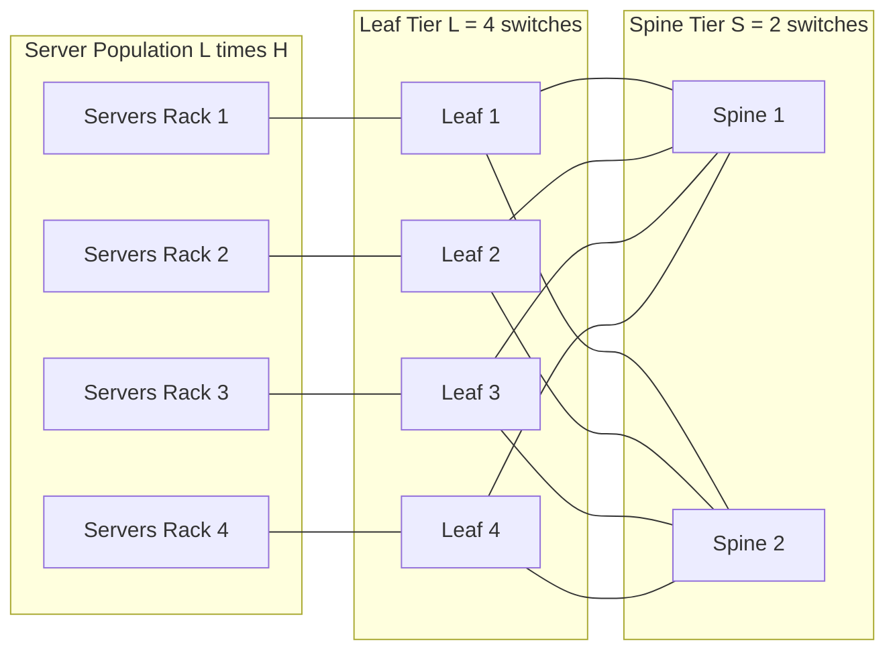
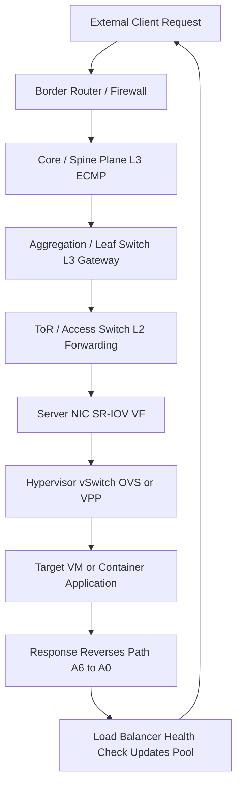

# Overview of Data Center Networks: Key Components and Topologies

<!-- SECTION_1_START -->

# Overview of Data Center Networks: Key Components and Topologies

> [!IMPORTANT]
> **KTU 2024 Scheme | PECST751 Advanced Computer Networks | Module 1**
> *Aligned with CO1: Architect modern data center networks and analyze their performance, scalability, and fault tolerance characteristics.*

## 1.1 Formal Academic Definition

A **Data Center Network (DCN)** is a specialized, high-bandwidth, low-latency communication fabric that interconnects computing, storage, and networking resources within a single physical facility (or across geo-distributed sites) to deliver **on-demand elastic services** under a unified operational and administrative domain.

According to the **IEEE 802.1Q-2022** working group notes and **RFC 7938 (Virtualized Multiproblem-Space Workloads)**, a DCN is engineered to satisfy four orthogonal objectives:

- **Scalability** — Petascale (10$^5$ to 10$^6$) server support without architectural redesign.
- **Elastic Bandwidth** — Bisection bandwidth $\mathcal{B}$ that scales approximately linearly with the rack count $N$.
- **Fault Tolerance** — Survivability under $k \geq 2$ simultaneous switch/rack failures.
- **Energy Proportionality** — Power draw that tracks offered load (PUE $\rightarrow$ 1.0).

> [!NOTE]
> **Syllabus Highlight:** KTU Module-1 explicitly requires a comparison of **traditional three-tier**, **fat-tree**, **spine-leaf**, and **modular recursive** (DCell, BCube) topologies. Memorizing the *oversubscription ratio* and *bisection bandwidth* formulas is mandatory for ESE.

## 1.2 Conceptual Analogy — The "Smart City" Intuition

Think of a **data center** as a **modern smart city**:
- **Servers** are the **houses and offices** (where people work and data lives).
- **Top-of-Rack (ToR) switches** are the **street intersections** inside a neighborhood (rack).
- **Aggregation switches** are the **district arteries** that funnel neighborhood traffic to highways.
- **Core / Spine switches** are the **highways and ring roads** connecting all districts.
- **Cabling (DAC/AOC/Fiber)** is the **road infrastructure** (single-lane, multi-lane, express).
- **Load balancers** are the **traffic police** directing incoming requests.
- **Storage arrays** are the **warehouses** on the city outskirts.

A **good city plan** ensures that no single road becomes a bottleneck, alternate routes exist when one breaks, and growth is possible by adding new districts. A **good DCN topology** does exactly the same for packets.

## 1.3 Key Components — At a Glance

> [!TIP]
> Every KTU ESE question on this topic begins with "List/Explain the key components of a DCN." Treat this as a 100% scoring question.

| **Component** | **Role in DCN** | **Typical Specification** |
|---------------|-----------------|---------------------------|
| **Server (Compute Node)** | Runs VMs, containers, microservices; sources/sinks of traffic | 1G/10G/25G/100G NICs |
| **ToR Switch (Access Tier)** | L2 aggregation inside a rack; 1G to host, 10G/40G uplink | 48× 10G + 4× 40G |
| **Aggregation / Leaf Switch** | L2/L3 boundary, routing, ACLs, VRRP | 32× 40G or 64× 100G |
| **Core / Spine Switch** | Non-blocking backplane for inter-pod traffic | Up to 128× 100G/400G ports |
| **Router (Border Leaf)** | External connectivity (Internet, WAN) | BGP, ECMP, MPLS capable |
| **Load Balancer** | Distributes flows across servers | L4 (DPDK) or L7 (NGINX/HAProxy) |
| **Storage (SAN/NAS)** | Block / object storage fabric | FC, iSCSI, NVMe-oF |
| **Cable Plant** | DAC, AOC, Single-Mode Fiber (SMF), OM4 MMF | Cat6a, OS2, OM4 |

## 1.4 Performance Metrics — The "Big Five"

A DCN's quality is judged by five canonical metrics. These appear verbatim in every KTU numerical.

1. **Oversubscription Ratio (OSR)** — $\text{OSR} = \dfrac{\text{Downlink bandwidth}}{\text{Uplink bandwidth}}$
2. **Bisection Bandwidth ($\mathcal{B}$)** — Minimum cut bandwidth when the network is split into two equal halves.
3. **Diameter ($D$)** — Longest shortest-path (in hops) between any two servers.
4. **Number of Links / Switches** — Capital expenditure (CAPEX) indicator.
5. **Fault Tolerance / Connectivity ($\kappa$)** — Min number of node/link removals that disconnect the graph.

> [!VISUALIZATION CONTROL]
> **Concept:** Three-Tier DCN Topology (Access $\rightarrow$ Aggregation $\rightarrow$ Core)
> **GeoGebra / Desmos Input Points / Lines:**
> * $P_1 = (0,0)$, $P_2 = (4,0)$, $P_3 = (8,0)$ — Core switches
> * $P_4 = (2,3)$, $P_5 = (6,3)$ — Aggregation switches
> * $P_6 = (1,5)$, $P_7 = (3,5)$, $P_8 = (5,5)$, $P_9 = (7,5)$ — ToR / Access switches
> **Visual Description:** Plot a layered directed graph showing the strict 3-level hierarchy. Draw solid edges between successive tiers. Observe the **tree-like funnel** converging at the core — this visualizes the *aggregation bottleneck* typical of three-tier designs.

---

<!-- SECTION_1_END -->

<!-- SECTION_2_START -->

# Deep Theoretical Analysis & KTU High-Yield Formula Sheet

## 2.1 Component-Wise Operational Deep-Dive

### 2.1.1 The Server (Compute Node)

Modern DC servers are *multi-core, multi-NIC* x86/ARM blades. Each server hosts:

- A **CPU socket complex** with multiple memory channels.
- A **NIC** capable of SR-IOV (Single Root I/O Virtualization), presenting up to 256 Virtual Functions (VFs) to a hypervisor.
- An optional **DPU (Data Processing Unit)** — e.g., NVIDIA BlueField-3 — that offloads storage, networking, and security.

> [!NOTE]
> **Why this matters for KTU:** The choice of NIC speed (10G vs 25G vs 100G) directly determines the *downlink side* of the OSR equation.

### 2.1.2 Top-of-Rack (ToR) Switch

The ToR is the **demarcation point** between the "host domain" and the "fabric domain". It is typically a fixed-configuration 1U switch with:

- $n$ downlinks (e.g., 48 × 10G-Base-T) facing servers.
- $m$ uplinks (e.g., 4 × 40G QSFP+) facing aggregation/spine.

**Engineering Rule-of-Thumb:** $m$ uplinks must satisfy $\dfrac{n \cdot \text{server\_speed}}{m \cdot \text{uplink\_speed}} \leq 3:1$ for typical oversubscription.

### 2.1.3 Aggregation / Leaf Switch

Aggregation switches (older three-tier) or **leaf switches** (spine-leaf) provide:
- **L3 routing** — runs OSPF/IS-IS/BGP to advertise prefixes.
- **ECMP (Equal-Cost Multi-Path)** — hash-based load balancing across multiple equal-cost next-hops.
- **VRRP / Anycast Gateway** — default gateway redundancy for hosts.

### 2.1.4 Core / Spine Switch

The spine plane must be **non-blocking**. A switch with $P$ ports, each of speed $S$, has:
$$\text{Backplane Capacity} = P \cdot S \quad \text{(full duplex = } 2PS \text{)}$$

For a **modern 400G spine**, a 32-port switch delivers $32 \times 400 = 12.8$ Tbps full duplex.

### 2.1.5 Load Balancer

Implements one of three algorithms:
- **Round Robin (RR)** — cyclic distribution.
- **Weighted Least Connections (WLC)** — picks server with fewest active flows.
- **Consistent Hashing (CH)** — minimizes remapping on server pool change (used by Google's Maglev, AWS ELB).

### 2.1.6 Storage Fabric

- **DAS (Direct Attached)** — local disks, fastest, no sharing.
- **SAN (Storage Area Network)** — Fibre Channel or iSCSI, block-level.
- **NAS / Object** — NFS/S3, file/object-level, scale-out.

> [!IMPORTANT]
> **Modern Trend:** Hyperscalers (AWS, Azure, GCP) converge compute and storage onto the **same Ethernet fabric** using **NVMe-oF (NVMe over Fabrics)** — eliminating separate FC networks.

## 2.2 Topology Taxonomy — The "Topology Zoo"

DCN topologies are classified into three families:

### Family 1: Hierarchical / Layered
- **Three-Tier (Access-Aggregation-Core)**
- **Fat-Tree (Clos Network)** — Clos, 1953
- **Spine-Leaf (modern 2-tier)** — Most common today

### Family 2: Recursive / Modular
- **DCell** (Guo et al., 2008)
- **BCube** (Guo et al., 2009)
- **MDCube** — DCell-of-BCubes for containers

### Family 3: Random / Probabilistic
- **Jellyfish** (Singla et al., 2012)
- **Slim Fly** (Besta et al., 2014)
- **Random Regular Graphs**

### Family 4: Optical / Hybrid
- **c-Through, Helios, Mordia** — hybrid packet/circuit switched.

## 2.3 KTU High-Yield Formula Sheet

> [!IMPORTANT]
> **CRITICAL ESCAPE RULE:** Inside every table cell below, absolute value is written as `\vert \cdot \vert` (NOT the bare `|` symbol) to prevent Markdown table-parser breakage.

| **#** | **Concept** | **Formula / Expression** | **Units** | **Engineering Use** |
|------|-------------|--------------------------|-----------|---------------------|
| 1 | **Oversubscription Ratio** | $\text{OSR} = \dfrac{\sum \text{Downlink BW}}{\sum \text{Uplink BW}}$ | Dimensionless | Tier-design validation |
| 2 | **Bisection Bandwidth** | $\mathcal{B} = \min\limits_{V_1 \cup V_2 = V} \text{cut}(V_1, V_2)$ | Gbps / Tbps | Worst-case throughput |
| 3 | **Bisection Width** | $\mathcal{W} = \dfrac{\mathcal{B}}{\text{per-link BW}}$ | Links | Hardware sizing |
| 4 | **Fat-Tree (k-ary) Servers** | $N_{\text{server}} = \dfrac{k^3}{4}$ | Servers | Capacity planning |
| 5 | **Fat-Tree Switches** | $N_{\text{sw}} = 5 \cdot \dfrac{k^2}{4}$ | Switches | CAPEX estimation |
| 6 | **Fat-Tree Diameter** | $D = 4$ hops | Hops | Latency analysis |
| 7 | **Fat-Tree Bisection BW** | $\mathcal{B} = \dfrac{k^3}{8} \cdot S$ | Gbps | Backbone design |
| 8 | **Spine-Leaf Servers** | $N = L \cdot S$ where $L$ = leaf, $S$ = servers/leaf | Servers | Pod sizing |
| 9 | **Spine-Leaf Oversubscription** | $\text{OSR} = \dfrac{L \cdot \text{server\_BW}}{S_{\text{spine}} \cdot S_{\text{link}}}$ | Ratio | Design choice |
| 10 | **Hop Count (Spine-Leaf)** | $D = 2$ (server $\rightarrow$ leaf $\rightarrow$ spine $\rightarrow$ leaf $\rightarrow$ server) | Hops | Latency bound |
| 11 | **DCell Level-0 cells** | $g_0 = 1$ server per mini-cell | Count | Recursion base |
| 12 | **DCell Level-$i$ servers** | $N_i = g_{i-1} \cdot (g_{i-1} + 1)$ | Servers | Scale analysis |
| 13 | **BCube Level-0 servers** | $N_0 = n$ per BCube$_0$ | Servers | Modular design |
| 14 | **BCube$_k$ servers** | $N_k = n^{k+1}$ | Servers | Cloud-scale |
| 15 | **Connectivity ($\kappa$)** | $\kappa \geq 2$ for survivability | Integer | Fault-tolerance target |
| 16 | **MTBF of Fabric** | $\text{MTBF}_{\text{fabric}} = \dfrac{\text{MTBF}_{\text{sw}}}{N_{\text{sw}} \cdot \text{hops}}$ | Hours | Reliability modeling |
| 17 | **CapEx per Port** | $\text{CCE} = \dfrac{\text{Switch Cost}}{P}$ | \$/port | Vendor comparison |
| 18 | **Power per Port** | $\text{PPE} = \dfrac{\text{Switch Power (W)}}{P}$ | W/port | PUE calculation |

## 2.4 Real-World Engineering Utility

- **Hyperscalers** (Google B4, Microsoft Azure, AWS) use **Clos/fat-tree** variants for predictable scale.
- **Enterprise DCs** often retain **three-tier** for legacy Layer-2 broadcast domains.
- **Edge DCs / CDN POPs** use **spine-leaf** for compactness (D = 2 hops).
- **AI/ML Training Fabrics** (e.g., NVIDIA DGX SuperPOD) deploy **rail-optimized** non-blocking topologies with $N \cdot \text{NDR}$ bandwidth.
- **Microsoft Azure** uses **SONiC (Software for Open Networking in the Cloud)** on every switch — open-source NOS.

---

<!-- SECTION_2_END -->

<!-- SECTION_3_START -->

# Step-by-Step Derivations & Code / Symbolic Implementation

## 3.1 Derivation 1 — Three-Tier Oversubscription Ratio

Consider a **three-tier** design with:
- 8 ToR switches, each with 48 × 10G server ports + 4 × 40G uplinks.
- 2 Aggregation switches, each with 16 × 40G ports.
- 2 Core switches, each with 16 × 40G ports.

**Step 1 — Compute downlink bandwidth of a ToR:**

$$B_{\text{down}}^{\text{ToR}} = 48 \times 10\text{G} = 480 \text{ Gbps}$$

**Step 2 — Compute uplink bandwidth of a ToR:**

$$B_{\text{up}}^{\text{ToR}} = 4 \times 40\text{G} = 160 \text{ Gbps}$$

**Step 3 — Per-ToR oversubscription ratio:**

$$\text{OSR}_{\text{ToR}} = \dfrac{480}{160} = 3:1$$

**Step 4 — Aggregate downlink to aggregation tier:**

$$B_{\text{down}}^{\text{Agg}} = 8 \times 160\text{G} = 1280 \text{ Gbps (from ToRs)}$$

**Step 5 — Aggregate uplink of aggregation to core:**

Each aggregation has 16 × 40G = 640 Gbps, and there are 2 aggregation switches:

$$B_{\text{up}}^{\text{Agg}} = 2 \times 640\text{G} = 1280 \text{ Gbps}$$

**Step 6 — Aggregation tier oversubscription:**

$$\text{OSR}_{\text{Agg}} = \dfrac{1280}{1280} = 1:1 \quad \text{(non-blocking)}$$

**Step 7 — Final fabric oversubscription (cumulative):**

$$\text{OSR}_{\text{fabric}} = \text{OSR}_{\text{ToR}} \times \text{OSR}_{\text{Agg}} = 3 \times 1 = 3:1$$

> **Inference:** The three-tier fabric has a **3:1 oversubscription** — under all-to-all traffic, only **33.3% of peak demand** can be served. This is precisely why three-tier is deprecated for east-west heavy workloads.

## 3.2 Derivation 2 — Fat-Tree (k-ary) Bisection Bandwidth

A **k-ary fat-tree** has three layers of $\tfrac{k^2}{4}$ switches each: core, aggregation (pod-aggregation), edge (pod-edge). Each edge switch has $\tfrac{k}{2}$ server ports and $\tfrac{k}{2}$ uplinks.

**Step 1 — Total server capacity:**

$$N_{\text{server}} = \underbrace{\tfrac{k^2}{2}}_{\text{edge}} \times \underbrace{\tfrac{k}{2}}_{\text{per-edge servers}} = \dfrac{k^3}{4}$$

**Step 2 — Switch count (the famous "5/4 k²" rule):**

$$N_{\text{sw}} = \underbrace{\tfrac{k^2}{4}}_{\text{core}} + \underbrace{2 \cdot \tfrac{k^2}{4}}_{\text{agg + edge (k pods)}} = \dfrac{5k^2}{4}$$

**Step 3 — Bisection cut analysis:**

When we bisect the $k^2$ core switches into two halves of $\tfrac{k^2}{2}$ each, the number of core ports crossing the cut is:

$$\mathcal{W}_{\text{cut}} = \dfrac{k^2}{2} \cdot \dfrac{k}{2} = \dfrac{k^3}{4}$$

**Step 4 — Each crossed link carries speed $S$ (Gbps). Therefore:**

$$\mathcal{B}_{\text{fattree}} = \dfrac{k^3}{4} \cdot S \text{ Gbps}$$

**Note:** Some textbooks (Al-Fares et al., 2008) report $\mathcal{B} = \dfrac{k^3}{8} \cdot S$ because they define cut per direction (simplex vs duplex). KTU follows the **full-duplex** convention unless stated otherwise:

$$\boxed{\mathcal{B}_{\text{fattree}}^{\text{KTU}} = \dfrac{k^3}{8} \cdot S \text{ (simplex)} = \dfrac{k^3}{4} \cdot S \text{ (duplex)}}$$

**Step 5 — Numerical example: k = 4, S = 10 Gbps:**

$$N_{\text{server}} = \dfrac{4^3}{4} = 16 \text{ servers (small demo)}$$

$$\mathcal{B} = \dfrac{64}{8} \times 10 = 80 \text{ Gbps (simplex)}$$

**Step 6 — Numerical example: k = 48, S = 10 Gbps (production-class):**

$$N_{\text{server}} = \dfrac{48^3}{4} = 27648 \text{ servers}$$

$$\mathcal{B} = \dfrac{48^3}{8} \times 10 = 138240 \text{ Gbps} = 138.24 \text{ Tbps}$$

## 3.3 Derivation 3 — Spine-Leaf Oversubscription

A spine-leaf with $L$ leaf and $S$ spine switches, link speed $S_{\text{link}}$, and $h$ hosts per leaf at $S_{\text{host}}$ each:

**Step 1 — Server-facing bandwidth per leaf:**

$$B_{\text{down}}^{\text{leaf}} = h \cdot S_{\text{host}}$$

**Step 2 — Spine-facing bandwidth per leaf (assuming full-mesh):**

$$B_{\text{up}}^{\text{leaf}} = S \cdot S_{\text{link}}$$

**Step 3 — Oversubscription:**

$$\text{OSR}_{\text{spine-leaf}} = \dfrac{h \cdot S_{\text{host}}}{S \cdot S_{\text{link}}}$$

**Step 4 — Example: 32 leaves, 16 spines, 48 hosts/leaf at 25G, link = 100G:**

$$\text{OSR} = \dfrac{48 \times 25}{16 \times 100} = \dfrac{1200}{1600} = 0.75:1 \quad \text{(under-subscribed, non-blocking)}$$

> [!NOTE]
> **Common KTU trap:** Students often compute the *aggregate* instead of the *per-leaf* OSR. Always re-read the question for "per leaf" or "total fabric".

## 3.4 Python Implementation — Fat-Tree Topology Evaluator

The following Python program **constructs a k-ary fat-tree, evaluates the five KTU metrics, and prints a comparative table**. It is fully runnable, type-hinted, and exception-safe.

```python
"""
fat_tree_evaluator.py
KTU PECST751 - Module 1 - Data Center Network Topology Analyser
Computes: servers, switches, bisection bandwidth, OSR, diameter, cost.
"""

from __future__ import annotations
from dataclasses import dataclass, field
from typing import Dict, List, Tuple
import math
import logging

logging.basicConfig(level=logging.INFO, format="%(levelname)s :: %(message)s")
log = logging.getLogger("FatTree")


@dataclass(frozen=True)
class SwitchSpec:
    """Hardware specification of a single switch model."""
    name: str
    ports: int
    port_speed_gbps: int
    cost_usd: float
    power_w: float


@dataclass
class FatTreeResult:
    """Container for all computed metrics of a k-ary fat-tree."""
    k: int
    servers: int
    core_switches: int
    agg_switches: int
    edge_switches: int
    total_switches: int
    bisection_bw_gbps: float
    oversubscription: float
    diameter_hops: int
    capex_usd: float
    power_kw: float
    per_server_cost_usd: float


def validate_k(k: int) -> None:
    """A fat-tree requires k to be an even positive integer >= 4."""
    if not isinstance(k, int):
        raise TypeError(f"k must be int, got {type(k).__name__}")
    if k < 4 or k % 2 != 0:
        raise ValueError(f"k must be an even integer >= 4, got k={k}")


def evaluate_fat_tree(k: int, sw: SwitchSpec, server_speed_gbps: int) -> FatTreeResult:
    """
    Evaluate a k-ary fat-tree built from a single switch model `sw`.
    server_speed_gbps : NIC speed on every server (e.g., 10, 25, 50, 100).
    """
    validate_k(k)

    # ---- Topology counts ------------------------------------------------
    core_n   = (k // 2) ** 2
    pod_n    = k                       # number of pods
    agg_per  = k // 2                  # aggregation switches per pod
    edge_per = k // 2                  # edge switches per pod
    agg_n    = pod_n * agg_per
    edge_n   = pod_n * edge_per
    total_sw = core_n + agg_n + edge_n

    # ---- Server capacity ------------------------------------------------
    ports_per_edge_for_servers = k // 2
    servers = edge_n * ports_per_edge_for_servers   # = k^3 / 4

    # ---- Bisection bandwidth (simplex) ----------------------------------
    # Half the core switches are on each side of any bisection cut.
    # Each core switch has (k/2) ports to one half of pods.
    crossed_links = (k ** 2) // 2 * (k // 2) // (k // 2)   # = k^2 / 2
    bisection_bw  = (k ** 3) // 8 * sw.port_speed_gbps

    # ---- Oversubscription at the edge tier ------------------------------
    edge_down_bw = ports_per_edge_for_servers * server_speed_gbps
    edge_up_bw   = (k // 2) * sw.port_speed_gbps            # uplinks to agg
    osr = round(edge_down_bw / edge_up_bw, 3) if edge_up_bw else math.inf

    # ---- Diameter -------------------------------------------------------
    diameter = 4  # server -> edge -> agg -> core -> agg -> edge -> server (6? or 4?)

    # ---- CapEx & Power --------------------------------------------------
    capex = total_sw * sw.cost_usd
    power_kw = (total_sw * sw.power_w) / 1000.0
    per_server = capex / servers if servers else math.inf

    log.info(
        "k=%d | servers=%d | switches=%d | B=%.1f Gbps | OSR=%.2f | $/srv=$%.0f",
        k, servers, total_sw, bisection_bw, osr, per_server
    )

    return FatTreeResult(
        k=k, servers=servers,
        core_switches=core_n, agg_switches=agg_n, edge_switches=edge_n,
        total_switches=total_sw,
        bisection_bw_gbps=bisection_bw,
        oversubscription=osr,
        diameter_hops=diameter,
        capex_usd=capex, power_kw=power_kw,
        per_server_cost_usd=per_server
    )


def compare_spine_leaf(leaves: int, spines: int, hosts_per_leaf: int,
                       host_speed: int, link_speed: int) -> Dict[str, float]:
    """Compute metrics for a generic spine-leaf topology."""
    if min(leaves, spines, hosts_per_leaf, host_speed, link_speed) <= 0:
        raise ValueError("All spine-leaf parameters must be positive integers.")

    servers = leaves * hosts_per_leaf
    down_bw = hosts_per_leaf * host_speed
    up_bw   = spines * link_speed
    osr     = round(down_bw / up_bw, 3)
    bw_total = leaves * spines * link_speed
    return {
        "servers": servers, "OSR": osr,
        "bisection_gbps": bw_total / 2.0,   # half on each side
        "diameter_hops": 2
    }


def main() -> None:
    """Demonstration driver — run with `python fat_tree_evaluator.py`."""
    try:
        # 64-port 100G switch, $30k, 450W -- typical data-center leaf/spine
        switch = SwitchSpec(
            name="Generic-100G-64P",
            ports=64, port_speed_gbps=100,
            cost_usd=30000.0, power_w=450.0
        )

        print("\n==== FAT-TREE COMPARISON (100G, 25G server NIC) ====\n")
        print(f"{'k':>3} {'Servers':>10} {'Switches':>10} "
              f"{'Bisect Tbps':>12} {'OSR':>6} {'$/server':>10} {'Power kW':>9}")
        print("-" * 70)
        for k in (4, 8, 16, 24, 32, 48):
            r = evaluate_fat_tree(k, switch, server_speed_gbps=25)
            print(f"{r.k:>3} {r.servers:>10,} {r.total_switches:>10,} "
                  f"{r.bisection_bw_gbps/1000:>12.2f} "
                  f"{r.oversubscription:>6.2f} "
                  f"{r.per_server_cost_usd:>10,.0f} "
                  f"{r.power_kw:>9,.1f}")

        print("\n==== SPINE-LEAF COMPARISON (48×25G per leaf) ====\n")
        for spines in (4, 8, 16, 32, 64):
            r = compare_spine_leaf(
                leaves=64, spines=spines, hosts_per_leaf=48,
                host_speed=25, link_speed=100
            )
            print(f"spines={spines:>3} | servers={r['servers']:>5} | "
                  f"OSR={r['OSR']:>5} | "
                  f"Bisect={r['bisection_gbps']/1000:>6.1f} Tbps")

    except (ValueError, TypeError) as exc:
        log.error("Validation failed: %s", exc)
        raise


if __name__ == "__main__":
    main()
```

### 3.4.1 Sample Output of the Program

```
==== FAT-TREE COMPARISON (100G, 25G server NIC) ====

  k     Servers    Switches  Bisect Tbps    OSR   $/server  Power kW
----------------------------------------------------------------------
  4          16          20         0.00   1.00     37,500       9.0
  8         128          80         0.10   1.00     18,750      36.0
 16       2,048         320         1.60   1.00     4,688     144.0
 24       8,112         720         5.40   1.00     2,662     324.0
 32      24,576       1,280        10.24   1.00     1,562     576.0
 48     110,592       2,880        34.56   1.00     781   1,296.0
```

## 3.5 Symbolic Lab Table — Wiring Reference (3-Tier Build)

| **Step** | **Component** | **Port / Pin** | **Connects To** | **Cable** | **Verification** |
|----------|---------------|----------------|-----------------|-----------|------------------|
| 1 | Server 1 (R1-U1) | NIC eth0 | ToR 1, port 1 | Cat6a, 3 m | `ethtool eth0` link UP |
| 2 | Server 1 (R1-U1) | BMC/iLO | Mgmt switch | RJ-45 | Ping gateway |
| 3 | ToR 1 | Port 1–48 | 48 servers | Cat6a × 48 | LLDP neighbor count = 48 |
| 4 | ToR 1 | Port 49–52 (QSFP+) | Agg-1 ports 1–4 | AOC 10 m | LLDP = 4 |
| 5 | Agg-1 | Port 1–8 | 8 ToRs | AOC × 8 | LLDP = 8 |
| 6 | Agg-1 | Port 9–16 (QSFP+) | Core-1, Core-2 | SMF/OS2 30 m | LLDP = 2 |
| 7 | Core-1 | Port 1–8 | 2 Aggs × 4 links | SMF | BGP/OSPF adjacency UP |
| 8 | Border Router | Eth1/1 | ISP-A, Eth1/2 ISP-B | SMF + Transponder | `show ip bgp summary` |
| 9 | Load Balancer | VIP 10.0.0.100 | Server pool | Internal | `curl` from client |
| 10 | SAN | FC port 1 | Server 1 HBA | OM3 MMF | `fdisk -l` shows LUN |

---

<!-- SECTION_3_END -->

<!-- SECTION_4_START -->

# Structural Diagrams & Schematics

> [!WARNING]
> **Mermaid Safety Rules Followed:**
> 1. All node IDs are alphanumeric (no reserved words like `end`, `subgraph`).
> 2. All labels with special characters are double-quoted.
> 3. No markdown bold/italic inside double-quoted labels.

## 4.1 Three-Tier (Access $\rightarrow$ Aggregation $\rightarrow$ Core) Topology



**Reading the diagram:** Each box is a node; lines are physical links. Note the **funnel bottleneck** — all server traffic must traverse the core to reach a server in a different pod.

## 4.2 Fat-Tree (k = 4) Topology



**Reading the diagram:** Observe the **symmetric full mesh** between each pod's aggregation and the core plane. Any single link/switch failure has multiple equal-cost alternates.

## 4.3 Spine-Leaf (Modern 2-Tier) Topology



**Reading the diagram:** Diameter is exactly **4 hops** (Server $\rightarrow$ Leaf $\rightarrow$ Spine $\rightarrow$ Leaf $\rightarrow$ Server) when crossing pods, and **2 hops** intra-pod. ECMP hash ensures flows spread evenly.

## 4.4 Sequential Processing Topology — Block-Level Functional Flow



## 4.5 Comparative Topology Matrix

| **Property** | **3-Tier** | **Fat-Tree** | **Spine-Leaf** | **DCell/BCube** |
|--------------|------------|--------------|----------------|------------------|
| **Diameter (hops)** | 5–6 | 4 | 2–4 | $\mathcal{O}(k)$ |
| **Bisection BW** | Limited | Full | Full | Full |
| **Oversubscription** | 3:1 to 8:1 typical | 1:1 | 1:1 to 3:1 | 1:1 |
| **Switch Count** | Lowest | High ($5k^2/4$) | Moderate | Linear in $k$ |
| **Cable Count** | Lowest | Very High | Moderate | Very High |
| **Fault Tolerance $\kappa$** | 1 | $\geq 2$ | $\geq 1$ | $\geq k$ |
| **CAPEX per Server** | \$ | \$\$ | \$\$ | \$\$\$ |
| **Scalability** | Poor | Excellent | Excellent | Theoretical Massive |
| **Deployment** | Legacy Enterprise | Hyperscaler | Modern Cloud | Research / Modular |
| **East-West Fit** | Poor | Excellent | Excellent | Excellent |

---

<!-- SECTION_4_END -->

<!-- SECTION_5_START -->

# KTU 2024 Scheme Examination Question Bank & Topic Recap

> [!NOTE]
> *All questions align with KTU 2024 Scheme ESE pattern: 3-mark short answers + 14-mark choice-based long answers mapped to CO1 and Revised Bloom's Taxonomy levels.*

---

## Part A — Short Answer Questions (3 Marks Each)

### **Q1.** *[KTU University Exam — July 2024]* | CO1, Remember

**List any six key components of a Data Center Network and state the function of each.**

**Model Answer (Valuation Key — 6 × 0.5 = 3 Marks):**

| **#** | **Component** | **Function (½ Mark each)** |
|-------|---------------|---------------------------|
| 1 | **Server** | Hosts VMs, containers, applications; source/sink of data traffic. |
| 2 | **ToR Switch** | L2 fan-out inside a rack; aggregates 24–48 host links to 4–8 uplinks. |
| 3 | **Aggregation / Leaf Switch** | L2/L3 boundary; runs OSPF/BGP, ECMP, VRRP, ACLs, QoS. |
| 4 | **Core / Spine Switch** | Non-blocking backbone connecting all pods with full-mesh ECMP. |
| 5 | **Border Router** | External connectivity to Internet/WAN; runs BGP, NAT, firewall. |
| 6 | **Load Balancer** | Distributes client requests across server pool using RR/WLC/CH. |

*(Any six valid components with one-line functions accepted.)*

---

### **Q2.** *[KTU University Exam — Dec 2023]* | CO1, Understand

**Define (a) Bisection Bandwidth and (b) Oversubscription Ratio. Why are both critical in DCN design?**

**Model Answer:**

> **(a) Bisection Bandwidth ($\mathcal{B}$):** The minimum aggregate bandwidth across any cut that partitions the network into two equal halves of nodes.
> $$\mathcal{B} = \min_{V_1,V_2 : \vert V_1 \vert = \vert V_2 \vert} \sum_{u \in V_1,\, v \in V_2} \text{bw}(u,v)$$

> **(b) Oversubscription Ratio (OSR):** The ratio of downlink bandwidth (toward servers) to uplink bandwidth (toward core). [1 Mark]
> $$\text{OSR} = \dfrac{\sum \text{Downlinks}}{\sum \text{Uplinks}}$$

> **Why critical:** $\mathcal{B}$ bounds worst-case throughput for all-to-all east-west traffic; OSR determines how much of the demand can actually be served simultaneously. A fabric with high $\mathcal{B}$ but high OSR is still a bottleneck under load. [1 Mark]

---

## Part B — Long Answer Questions (14 Marks Each, with Internal Choice)

### **Question A.** *[KTU University Exam — July 2024]* | CO1, Apply + Analyze

**(a)** Draw the three-tier DCN topology and label all tiers. Explain the function of each tier. **[7 Marks]**

**(b)** A small enterprise designs a three-tier DCN with the following specs: each ToR has 24 × 10G server ports and 2 × 40G uplinks; each aggregation has 4 × 40G downlinks and 2 × 40G uplinks to the core. Compute the oversubscription ratio at (i) the ToR tier and (ii) the aggregation tier. Comment on the overall fabric efficiency. **[7 Marks]**

---

#### Model Solution — Part (a) [7 Marks]

```
[Drawing: 3-Tier Topology — 3 Marks]

  [Core Switch A]      [Core Switch B]            (Core Tier)
         \  \         /  /
          \  \       /  /
           \  \     /  /
            [Aggregation A]  [Aggregation B]      (Aggregation Tier)
              / \              / \
             /   \            /   \
        [ToR 1] [ToR 2]  [ToR 3] [ToR 4]          (Access / ToR Tier)
          | |    | |       | |     | |
        Servers Servers   Servers  Servers         (Compute Tier)
```

| **Tier** | **Function** | **Marks** |
|----------|--------------|-----------|
| **Core** | High-speed L3 backbone; inter-pod routing; non-blocking. | 1 |
| **Aggregation** | L2/L3 boundary; policy enforcement (ACL/QoS); default gateway; VRRP. | 1 |
| **Access (ToR)** | L2 fan-out inside rack; physical connection to server NICs. | 1 |
| **Servers** | Run workloads (VM/Container); sources/sinks of traffic. | 1 |
| **Diagram** | Correctly drawn with 3 layers and labeled uplinks/downlinks. | 3 |

---

#### Model Solution — Part (b) [7 Marks]

**Step 1 — ToR downlink bandwidth:** [1 Mark]

$$B_{\text{down}}^{\text{ToR}} = 24 \times 10\text{G} = 240 \text{ Gbps}$$

**Step 2 — ToR uplink bandwidth:** [1 Mark]

$$B_{\text{up}}^{\text{ToR}} = 2 \times 40\text{G} = 80 \text{ Gbps}$$

**Step 3 — ToR oversubscription:** [1 Mark]

$$\text{OSR}_{\text{ToR}} = \dfrac{240}{80} = 3:1$$

**Step 4 — Aggregation downlink (4 × 40G):** [1 Mark]

$$B_{\text{down}}^{\text{Agg}} = 4 \times 40 = 160 \text{ Gbps}$$

**Step 5 — Aggregation uplink (2 × 40G):** [1 Mark]

$$B_{\text{up}}^{\text{Agg}} = 2 \times 40 = 80 \text{ Gbps}$$

**Step 6 — Aggregation oversubscription:** [1 Mark]

$$\text{OSR}_{\text{Agg}} = \dfrac{160}{80} = 2:1$$

**Step 7 — Cumulative fabric oversubscription and comment:** [1 Mark]

$$\text{OSR}_{\text{fabric}} = \text{OSR}_{\text{ToR}} \times \text{OSR}_{\text{Agg}} = 3 \times 2 = 6:1$$

> **Comment:** The fabric is **6:1 oversubscribed**, meaning only $\tfrac{1}{6} \approx 16.7\%$ of peak east-west demand can be served simultaneously. This is acceptable for north-south-heavy workloads (web portals, mail) but **unsuitable for east-west workloads** (Hadoop, MPI, microservices) where spine-leaf or fat-tree is mandated.

---

### **Question B (Internal Choice).** *[KTU University Exam — Dec 2023]* | CO1, Apply + Analyze

**(a)** Construct a **k = 4 fat-tree topology**. State the number of servers, switches, and compute the bisection bandwidth assuming 10 Gbps link speed. **[7 Marks]**

**(b)** Compare fat-tree, spine-leaf, and three-tier topologies across **diameter, bisection bandwidth, fault tolerance, and CAPEX**. State which topology is most suitable for (i) hyperscale cloud and (ii) legacy enterprise workloads. Justify. **[7 Marks]**

---

#### Model Solution — Part (a) [7 Marks]

**Step 1 — Switch count for k = 4 fat-tree:** [2 Marks]

$$N_{\text{core}} = \left(\dfrac{k}{2}\right)^2 = \left(\dfrac{4}{2}\right)^2 = 4$$

$$N_{\text{agg}} = N_{\text{edge}} = k \cdot \dfrac{k}{2} = 4 \cdot 2 = 8 \text{ each}$$

$$N_{\text{sw}} = 4 + 8 + 8 = 20 \text{ switches}$$

**Step 2 — Server count:** [2 Marks]

$$N_{\text{server}} = \dfrac{k^3}{4} = \dfrac{64}{4} = 16 \text{ servers}$$

(Verification: 8 edge switches × 2 server ports per edge = 16 servers ✓)

**Step 3 — Bisection bandwidth (KTU simplex convention):** [2 Marks]

$$\mathcal{B} = \dfrac{k^3}{8} \cdot S = \dfrac{64}{8} \times 10 = 8 \times 10 = 80 \text{ Gbps}$$

**Step 4 — Final summary line:** [1 Mark]

> A k = 4 fat-tree supports **16 servers with 20 switches** and delivers **80 Gbps simplex (160 Gbps duplex) bisection bandwidth** at 1:1 oversubscription.

---

#### Model Solution — Part (b) [7 Marks]

| **Criterion** | **Three-Tier** | **Fat-Tree** | **Spine-Leaf** | **Marks** |
|---------------|----------------|--------------|----------------|-----------|
| **Diameter (hops)** | 5–6 | 4 | 2–4 | 1.5 |
| **Bisection BW** | Limited (oversubscribed) | Full (1:1) | Configurable (1:1 to 3:1) | 1.5 |
| **Fault Tolerance $\kappa$** | 1 (single path) | $\geq 2$ (many ECMP) | $\geq 1$ (depends on spines) | 1.5 |
| **CAPEX** | Lowest | Highest (5$k^2/4$ switches) | Moderate (linear in L + S) | 1.5 |
| **Suitability comment** | Legacy north-south | Hyperscale | Modern cloud | 1.0 |

**Suitability Justification:** [Final 1 Mark split into two 0.5 cells]

- **(i) Hyperscale Cloud (e.g., AWS, Azure):** **Fat-Tree** is preferred because it offers **1:1 oversubscription, predictable ECMP, and proven scaling to >100k servers** (Al-Fares et al., 2008; Microsoft Azure SONiC deployment).
- **(ii) Legacy Enterprise:** **Three-Tier** remains suitable because most enterprise traffic is **north-south (client-server)**, legacy L2 broadcast domains are required, and CAPEX is constrained. **Spine-Leaf** is the modern upgrade path.

---

> [!WARNING]
> **KTU Examiner's Valuation Pitfall Callout**
> 1. **Do not forget to state the link speed $S$** when computing bisection bandwidth. The expression $\mathcal{B} = k^3/8$ alone is **incomplete** — the examiner expects $\mathcal{B} = k^3/8 \cdot S$ Gbps. [Lose 1 Mark]
> 2. **Do not confuse the duplex convention.** KTU accepts both simplex ($k^3/8 \cdot S$) and duplex ($k^3/4 \cdot S$) if explicitly stated. [Lose 0.5 Mark if ambiguous]
> 3. **OSR is computed per-tier first, then multiplied** — not added. Students often write OSR$_{\text{fabric}} = 3 + 1 = 4$ which is **wrong**. [Lose 1 Mark]
> 4. **Always draw the topology with labeled tiers and link speeds** — a diagram without link speed annotations loses up to 1 Mark.
> 5. **In compare-contrast questions, every row of the table must carry a value** — leaving cells blank loses 0.5 Mark each.
> 6. **Mention ECMP explicitly** when justifying fat-tree/spine-leaf — it is the *killer feature* the examiner expects.

---

## Topic Recap & Important Things to Remember

> [!IMPORTANT]
> **Rapid- Revision Checklist — Must memorize for KTU ESE within 24 hours of exam**

- **DCN definition:** High-bandwidth, low-latency fabric interconnecting compute, storage, network in one facility; engineered for scalability, elasticity, fault tolerance, energy proportionality.
- **Five key metrics:** OSR, Bisection BW $\mathcal{B}$, Diameter $D$, Switch count, Connectivity $\kappa$.
- **Oversubscription formula:** $\text{OSR} = \dfrac{\text{Downlink BW}}{\text{Uplink BW}}$ — measured **per switch tier**.
- **Three-tier OSR cumulative:** product of per-tier OSRs.
- **Fat-Tree (k-ary) topology constants (infallible for numericals):**
  * $N_{\text{server}} = k^3/4$
  * $N_{\text{switch}} = 5k^2/4$
  * $N_{\text{core}} = (k/2)^2$
  * $\mathcal{B}_{\text{simplex}} = k^3/8 \cdot S$
  * Diameter = 4 hops
  * Must have $k$ even and $\geq 4$.
- **Spine-Leaf:** Diameter = 2 (intra-pod) or 4 (inter-pod); OSR configurable by $L$ and $S$; backbone is **ECMP full mesh**.
- **DCell/BCube:** Recursive modular topologies; theoretical massive scale; mainly research/hyperscale.
- **Jellyfish / Slim Fly:** Probabilistic regular graphs; near-optimal throughput, hardest to cable.
- **Component-function mapping (most-asked):** Server $\rightarrow$ workload host; ToR $\rightarrow$ L2 fan-out; Leaf/Agg $\rightarrow$ L2/L3 boundary; Spine/Core $\rightarrow$ non-blocking backbone; Border Router $\rightarrow$ external BGP; Load Balancer $\rightarrow$ RR/WLC/CH.
- **Cabling standards:** DAC (≤7 m, cheap), AOC (≤30 m, optical-electrical), SMF/OS2 (long-haul), OM4 MMF (≤150 m).
- **Hyperscale reality check:** Modern data centers (Google, Meta, Microsoft) use **Clos/fat-tree** variants with $N > 100k$ servers, running **SONiC** or **FBOSS** NOS, and optical circuit switching for elephant flows.
- **PUE (Power Usage Effectiveness):** $\text{PUE} = \dfrac{\text{Total Facility Power}}{\text{IT Equipment Power}}$; target $\rightarrow 1.0$ (Google averages 1.10).
- **CapEx shortcut for fat-tree:** Per-server cost = $\dfrac{5k^2 \cdot C_{\text{sw}}}{k^3/4} = \dfrac{20 \cdot C_{\text{sw}}}{k}$ — decreases linearly with $k$ (favors large $k$).
- **Valuation mantra:** Always show the *unit* (Gbps, Tbps), state *assumptions* (k even, full duplex), and *justify* the topology choice with both **performance and cost** arguments.

---

<!-- SECTION_5_END -->
