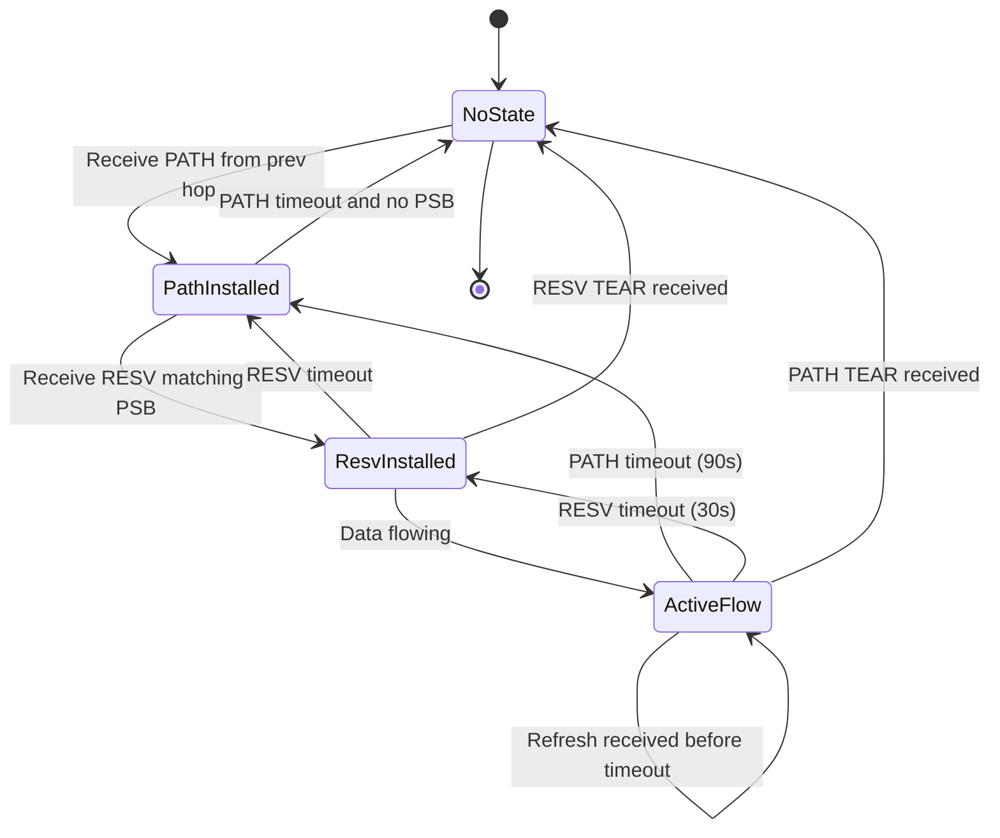
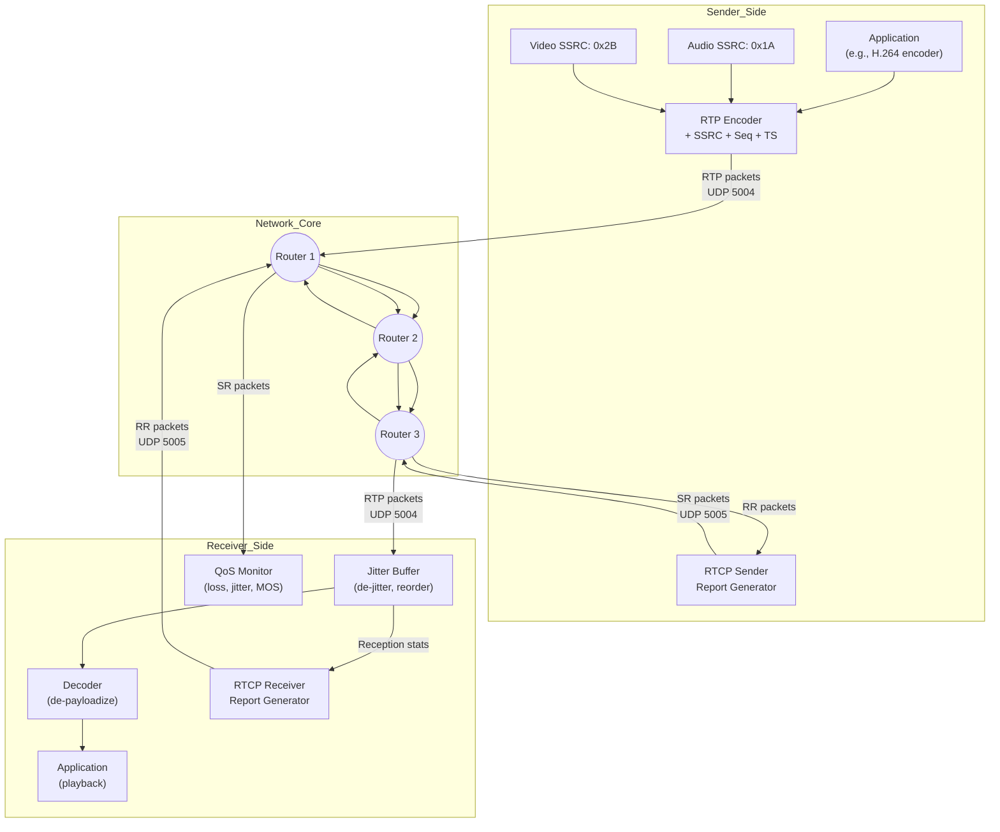
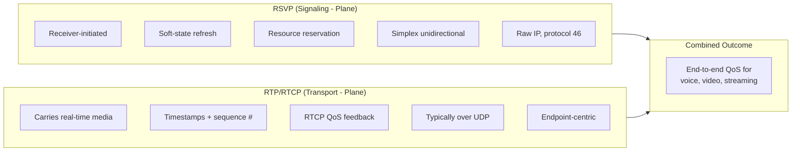

# Protocols for QoS support - RSVP, RTP

<!-- SECTION_1_START -->
# QoS Support Protocols: RSVP and RTP

## 1.1 Quality of Service (QoS) – The Underlying Problem

> [!IMPORTANT]
> **Quality of Service (QoS)** refers to the collective measure of service performance that determines the **degree of satisfaction of a user** of a service. In the context of computer networks, QoS is the ability of a network to provide **differentiated service levels** to selected network traffic based on parameters such as **bandwidth**, **delay**, **jitter**, and **packet loss probability**.

Traditional best-effort IP networks treat every packet identically. Real-time applications (VoIP, video conferencing, IPTV, telemedicine) demand stricter guarantees:

| Parameter | Real-time requirement | Best-effort behavior |
|---|---|---|
| Bandwidth | Guaranteed minimum | No guarantee |
| End-to-end delay | Less than **150 ms** for voice | Variable, unbounded |
| Jitter (delay variation) | Below **30 ms** | Unpredictable |
| Packet loss | Below **1 %** | No guarantee |

> [!NOTE]
> The IETF introduced two foundational protocols to enable QoS in IP networks: **RSVP** (signaling/reservation) and **RTP/RTCP** (transport/monitoring). They are complementary — RSVP *reserves* resources along a path, while RTP/RTCP *delivers* and *monitors* the real-time media flow.

## 1.2 Resource Reservation Protocol (RSVP) – Formal Definition

> [!IMPORTANT]
> **Resource Reservation Protocol (RSVP)** is defined in **RFC 2205** (later refined in **RFC 2209, RFC 2210, and RFC 2750**). It is a **signaling protocol** that operates at the **transport layer** (uses raw IP, protocol number 46) and is used by **receivers** to request specific **Quality of Service (QoS)** reservations from the network for application data flows.

**Key Properties of RSVP:**

1. **Receiver-initiated** — The destination host, not the sender, initiates the reservation.
2. **Simplex (unidirectional)** — Reservations are made for one direction of traffic flow only.
3. **Soft state** — Reservation state in routers is refreshed periodically and times out if not refreshed.
4. **Path-coupled** — It follows the actual routing path determined by unicast/multicast routing protocols.

> [!CONCEPT ANALOGY]
> **Intuition — The Restaurant Reservation Analogy:**
> Imagine walking into a busy restaurant (the network) with five friends (the data flow). Instead of *hoping* a table for six is free, the host (RSVP) calls the restaurant **before you leave home**, and the manager reserves a specific table, chef, and waiter **along your driving route** (the path). When you arrive, the table is ready, the chef is briefed, and your meal (the media stream) is served without delay. If you stop calling (no refresh), the reservation expires — a "soft state" — so the restaurant does not stay blocked forever.

## 1.3 Real-time Transport Protocol (RTP) – Formal Definition

> [!IMPORTANT]
> **Real-time Transport Protocol (RTP)** is defined in **RFC 3550** (which obsoleted RFC 1889). It provides **end-to-end delivery services** for real-time data such as interactive audio and video. RTP is typically run over **UDP** (although it can use other transports) and is designed to compensate for **jitter**, **out-of-order delivery**, and **loss detection** in real-time streams.

**RTP is always paired with its control sibling — RTCP:**

> [!IMPORTANT]
> **Real-time Transport Control Protocol (RTCP)** is the companion control protocol to RTP. It periodically transmits **sender reports (SR)** and **receiver reports (RR)** containing statistics such as packets sent, packets lost, **interarrival jitter**, and **round-trip time**. RTCP uses a **separate UDP port** (typically the next higher odd port, e.g., 5004/5005).

> [!CONCEPT ANALOGY]
> **Intuition — The Postal Service Analogy for RTP:**
> Sending a 2-hour movie over a network is like mailing a 2-hour audio cassette as 8,000 individual postcards. The postman (UDP) might drop a few, deliver some out of order, and arrive at uneven speeds. RTP is the **stamped label on every postcard** that says *"this is fragment 4,217 of movie A, timestamp 00:42:18.500, payload type = H.264 video"*. The receiver uses this label to **reassemble the cassette in correct order**, **detect missing postcards**, and **synchronize audio with video**. RTCP is the **return postcard** that says *"I have received 7,994 of 8,000 cards, and they are arriving 20 ms too early on average — please slow down"*.

## 1.4 The QoS Triangle: How RSVP, RTP, and Routing Interact

```
           +-------------------+
           |  Application      |  (VoIP, Video, Telemetry)
           +---------+---------+
                     |
              +------v------+
              |    RTP      |  <-- Carries media with timing info
              +------+------+
                     |
              +------v------+         +-------------+
              |    UDP      |  <--->  |    RTCP     |  (feedback, QoS monitor)
              +------+------+         +-------------+
                     |
              +------v------+
              |    IP       |
              +------+------+
                     |
              +------v------+
              |   RSVP      |  <-- Reserves bandwidth, buffers in routers
              +------+------+
                     |
              +------v------+
              |  Data Link  |  (Ethernet, Wi-Fi, MPLS)
              +--------------+
```

> [!VISUALIZATION CONTROL]
> **Concept:** Packet-Interarrival Jitter and Buffering Visualization
> **Equations (Desmos form):**
> * $j_{n} = j_{n-1} + \dfrac{\vert (D_{n} - D_{n-1}) - (R_{n} - R_{n-1}) \vert - j_{n-1}}{16}$
> * $\text{playout time} = T_{0} + k \cdot \Delta_{slot} + \text{initial jitter buffer}$
> **Visual Description:** Plot received timestamps $D_n$ on the x-axis and playout times on the y-axis. A jitter buffer at the receiver smooths the irregular incoming packets into a steady output stream.

---

<!-- SECTION_1_END -->

<!-- SECTION_2_START -->
# Deep Theoretical Analysis & KTU High-Yield Formula Sheet

## 2.1 RSVP — Deep Mechanism

### 2.1.1 RSVP Reservation Styles

RSVP supports three reservation **styles** (styles differ in *how* reservations from multiple senders are treated):

| Style | Name | Behavior | Use Case |
|---|---|---|---|
| **WF** | Wildcard Filter | Shared reservation, all senders treated as one logical flow | Audio conference with multiple speakers |
| **FF** | Fixed Filter | Distinct reservation per sender | Video conference with distinct sources |
| **SE** | Shared Explicit | Shared reservation among a specified list of senders | Multi-source audio with explicit membership |

### 2.1.2 RSVP Message Types

| Message | Direction | Purpose |
|---|---|---|
| **PATH** | Sender → Receiver | Advertises the data flow's traffic characteristics (TSpec, ADSPEC) |
| **RESV** | Receiver → Sender | Carries the actual reservation request (FlowSpec, FilterSpec) |
| **PATH TEAR** | Sender → Receiver | Removes path state |
| **RESV TEAR** | Receiver → Sender | Removes reservation state |
| **PATH ERR** | Receiver → Sender | Reports path errors |
| **RESV ERR** | Sender → Receiver | Reports reservation errors |
| **RESV CONF** | Receiver → Sender | Optional confirmation of reservation establishment |

### 2.1.3 The RSVP Soft-State Model

> [!IMPORTANT]
> **Soft state** is a fundamental design principle: reservation state in each router **expires after a timeout (default 90 seconds for PATH, 30 seconds for RESV)** unless refreshed. The sender periodically reissues PATH messages, and the receiver periodically reissues RESV messages. This makes RSVP **robust against routing changes** and **single-point router failures**.

### 2.1.4 RSVP Traffic and Service Parameters

| Parameter | Meaning | Unit |
|---|---|---|
| **Token Bucket Rate** $r$ | Average bandwidth | bytes/sec |
| **Token Bucket Depth** $b$ | Burst tolerance | bytes |
| **Peak Data Rate** $p$ | Maximum instantaneous rate | bytes/sec |
| **Minimum Policed Unit** $m$ | Smallest packet size considered | bytes |
| **Maximum Packet Size** $M$ | Largest packet size in flow | bytes |

## 2.2 RTP/RTCP — Deep Mechanism

### 2.2.1 RTP Fixed Header Format (12 bytes minimum)

| Bit Offset | Field | Size (bits) | Purpose |
|---|---|---|---|
| 0 | **V** (Version) | 2 | RTP version (always **2** for RFC 3550) |
| 2 | **P** (Padding) | 1 | Padding octets at end of payload |
| 3 | **X** (Extension) | 1 | Header extension present flag |
| 4 | **CC** (CSRC Count) | 4 | Number of contributing source identifiers |
| 8 | **M** (Marker) | 1 | Application-defined marker (e.g., end of frame) |
| 9 | **PT** (Payload Type) | 7 | Identifies payload format (e.g., 0 = PCM µ-law, 8 = PCM A-law, 96–127 = dynamic) |
| 16 | **Sequence Number** | 16 | Increments by 1 per RTP packet; used for loss detection and reordering |
| 32 | **Timestamp** | 32 | Sampling instant of the first octet in payload |
| 64 | **SSRC** (Synchronization Source) | 32 | Unique identifier of the source |
| 96 | **CSRC** list (optional) | 32 × CC | Contributing source identifiers |

### 2.2.2 RTCP Packet Types

| Type | Abbreviation | Purpose |
|---|---|---|
| 200 | **SR** (Sender Report) | Transmission and reception statistics from active senders |
| 201 | **RR** (Receiver Report) | Reception statistics from receivers who are not active senders |
| 202 | **SDES** (Source Description) | CNAME, NAME, EMAIL, PHONE, LOC, TOOL, NOTE, PRIV |
| 203 | **BYE** | Indicates end of participation |
| 204 | **APP** | Application-specific functions |

> [!NOTE]
> The **CNAME** (Canonical Name) in SDES is critical — it binds multiple SSRCs (e.g., audio + video streams from the same participant) to one logical user, enabling synchronization at the receiver.

### 2.2.3 The Interarrival Jitter Formula (RFC 3550 §6.4.1)

The formal definition of jitter $J$ as updated in receiver $i$ upon receiving packet $i$:

$$J_i = J_{i-1} + \dfrac{\vert (R_i - R_{i-1}) - (S_i - S_{i-1}) \vert - J_{i-1}}{16}$$

where:
* $S_i$ = RTP timestamp of packet $i$
* $R_i$ = arrival time of packet $i$ in timestamp units at receiver
* $J_{i-1}$ = previous jitter estimate
* The denominator **16** is an exponential smoothing gain factor

### 2.2.4 RTCP Bandwidth Fraction

To prevent RTCP from overwhelming the network, its total bandwidth is limited:

$$\text{RTCP bandwidth share} \le 5\% \text{ of session bandwidth}$$

This **5%** is split between senders and receivers:

| Direction | Typical share |
|---|---|
| Receivers (RR + SDES + BYE) | 75% of 5% = **3.75%** |
| Senders (SR + SDES + BYE) | 25% of 5% = **1.25%** |

> [!NOTE]
> The 5% rule, combined with the minimum RTCP interval, ensures that even in large conferences (hundreds of participants), control traffic never starves the media flow.

## 2.3 KTU High-Yield Formula & Parameter Cheat Sheet

| Concept | Formula / Parameter | Description |
|---|---|---|
| RTP Jitter | $J_i = J_{i-1} + \frac{\vert (R_i - R_{i-1}) - (S_i - S_{i-1}) \vert - J_{i-1}}{16}$ | RFC 3550 §A.8 |
| Packet Loss Fraction | $\text{Loss Fraction} = \dfrac{\text{Expected} - \text{Received}}{\text{Expected}}$ | Reported in RR/SR |
| Cumulative Loss | $\text{cum\_lost} = \sum (\text{expected} - \text{received})$ | 24-bit field in RR |
| Extended Max Seq No. | $\text{extended\_max} = \text{cycles} + \text{max\_seq\_no}$ | 32-bit wraparound counter |
| Interarrival (DLSR) | $\text{DLSR} = T_{RR} - T_{SR}$ in 1/65536 sec | For round-trip delay |
| Round-Trip Time | $RTT = T_{recv\_RR} - T_{send\_SR} - \text{DLSR}$ | From RR |
| RTCP Bandwidth | $\le 5\%$ of session BW | Hard ceiling for control traffic |
| Token Bucket Check | $\text{peak rate} \le \text{token rate} \le \text{link BW}$ | RSVP admission control |
| RSVP Refresh Default | PATH = 90 s, RESV = 30 s | Soft-state timeouts |
| RTP Header Length | $12 + 4 \cdot \text{CC} + \text{ext\_len}$ bytes | Minimum 12 bytes |

> [!IMPORTANT]
> **Engineering Real-World Utility:**
> * **VoIP systems** (Cisco Unified Communications Manager, Asterisk) use RTP for media and RTCP for QoS monitoring and MOS scoring.
> * **Video conferencing** (Zoom, Teams, WebRTC) bundles RTP/RTCP over UDP with DTLS-SRTP encryption.
> * **RSVP** is used in **MPLS Traffic Engineering (RSVP-TE)** to establish label-switched paths with bandwidth guarantees — a core feature in service-provider backbones.
> * **IntServ / DiffServ** architectures: RSVP provides the *per-flow* signaling for IntServ, while DiffServ uses DSCP bits for *class-based* QoS without per-flow state.

---

<!-- SECTION_2_END -->

<!-- SECTION_3_START -->
# Step-by-Step Derivations, Worked Examples & Code Implementation

## 3.1 Worked Example: RSVP Reservation Flow (Sender S, Receiver R, Routers A, B, C)

**Scenario:** A VoIP sender S wishes to send a **64 kbps** audio stream to receiver R. Routers A, B, C form the path. Required reservation: **64 kbps, 10 ms max delay, 50 ms max jitter, FF style**.

### Step 1: PATH Message (Sender → Receiver)

S constructs a PATH message containing:
* **Sender Template** = (S\_IP, S\_port)  — identifies the data sender
* **TSpec** = (r = 8000 B/s, b = 1600 B, p = 16000 B/s, m = 200 B, M = 200 B)
* **ADSPEC** = (Default\_General\_Parameters + adspec hops)

PATH travels: **S → A → B → C → R**

### Step 2: Each Router Updates Path State

At each router, RSVP creates **Path State Block (PSB)** entries:

```
PSBA : { (S_IP, S_port) → prev_hop = S,  session = (R_IP, R_port) }
PSBB : { (S_IP, S_port) → prev_hop = A,  session = (R_IP, R_port) }
PSBC : { (S_IP, S_port) → prev_hop = B,  session = (R_IP, R_port) }
```

### Step 3: Receiver R Builds RESV Message

R determines the **FlowSpec** (resource requirement) and **FilterSpec** (which packets qualify):

* **FilterSpec** = (S\_IP, S\_port)         ← FF style: distinct per sender
* **FlowSpec** = (Rspec: 64 kbps, slack term = 0 ms; TSpec: same as sender's)

### Step 4: RESV Travels Back Hop-by-Hop

**R → C**: Router C consults admission control. If accepted, it installs a **Reservation State Block (RSB)**:
* (Session: R\_IP, R\_port)
* (FilterSpec: S\_IP, S\_port)
* (FlowSpec: 64 kbps)
* (Out interface: towards R)
* (Next hop: R)

**C → B**: Router B performs the same admission control and installs its RSB.

**B → A**: Router A accepts and installs its RSB.

**A → S**: S receives RESV confirmation; reservation is now **established** end-to-end.

### Step 5: Soft-State Refresh

Every 30 seconds, R reissues RESV; every 90 seconds, S reissues PATH. Routers reset their timeouts. If no refresh arrives within the timeout, state is **torn down automatically**.

## 3.2 Worked Example: RTP Header Construction

**Given:** A 20 ms G.711 µ-law audio frame is the 4 723rd packet sent by an SSRC = 0x1A2B3C4D. The packet has no CSRC and no padding. The audio frame begins at RTP clock value = 9 472 000.

**Show the first 12 bytes of the RTP header in hexadecimal.**

**Step 1: Construct the first byte (V, P, X, CC)**
* V = 2 → binary `10`
* P = 0 → `0`
* X = 0 → `0`
* CC = 0 → `0000`
* Combined: `1000 0000` = **0x80**

**Step 2: Second byte (M, PT)**
* M = 0 (no marker for this audio frame)
* PT = 0 (PCM µ-law, static payload type)
* Combined: `0000 0000` = **0x00**

**Step 3: Sequence Number**
* 4 723 in binary = `0001 0010 0111 0011`
* High byte = `0001 0010` = **0x12**
* Low byte  = `0111 0011` = **0x73**

**Step 4: Timestamp (32 bits, 8 kHz clock for µ-law)**
* 9 472 000 = 0x908A00
* Bytes (big-endian): **0x00 0x90 0x8A 0x00**

**Step 5: SSRC (32 bits)**
* 0x1A2B3C4D
* Bytes: **0x1A 0x2B 0x3C 0x4D**

**Final 12-byte header in hex:**
```
0x80 0x00 0x12 0x73 0x00 0x90 0x8A 0x00 0x1A 0x2B 0x3C 0x4D
```

## 3.3 Step-by-Step Jitter Calculation (RFC 3550 Appendix A.8)

**Given arrival times and RTP timestamps:**

| Packet $i$ | RTP Timestamp $S_i$ (s) | Arrival Time $R_i$ (s) |
|---|---|---|
| 1 | 0 | 0.000 |
| 2 | 160 | 0.020 |
| 3 | 320 | 0.045 |
| 4 | 480 | 0.065 |
| 5 | 640 | 0.085 |

**Compute $J_5$ using $J_0 = 0$.**

**For $i=2$:**

$$J_2 = J_1 + \frac{\vert (R_2 - R_1) - (S_2 - S_1) \vert - J_1}{16}$$

$$J_2 = 0 + \frac{\vert (0.020 - 0.000) - (160 - 0) \cdot \frac{1}{8000} \vert - 0}{16}$$

Convert $S$ to seconds: $160 / 8000 = 0.020$ s

$$J_2 = \frac{\vert 0.020 - 0.020 \vert}{16} = \frac{0}{16} = 0 \text{ s}$$

**For $i=3$:** $S_3 - S_2 = 0.020$ s, $R_3 - R_2 = 0.025$ s

$$J_3 = 0 + \frac{\vert 0.025 - 0.020 \vert - 0}{16} = \frac{0.005}{16} = 3.125 \times 10^{-4} \text{ s}$$

**For $i=4$:** Difference = $0.020$ s, Difference = $0.020$ s

$$J_4 = 3.125 \times 10^{-4} + \frac{\vert 0.020 - 0.020 \vert - 3.125 \times 10^{-4}}{16} = 2.93 \times 10^{-4} \text{ s}$$

**For $i=5$:** Differences are both $0.020$ s, so

$$J_5 = 2.93 \times 10^{-4} + \frac{0 - 2.93 \times 10^{-4}}{16} = 2.75 \times 10^{-4} \text{ s}$$

$$\boxed{J_5 \approx 0.275 \text{ ms}}$$

> [!NOTE]
> The smoothing gain of 16 gives an **exponentially weighted moving average** — the impact of a single out-of-order packet decays quickly, preventing a single anomaly from inflating the jitter estimate.

## 3.4 Full Python Implementation: RTP Packet Builder, Parser, and Jitter Monitor

```python
"""
RTP Packet Builder, Parser, and Interarrival Jitter Monitor
Implements RFC 3550 — for educational use only.
"""

import struct
import time
import math
from dataclasses import dataclass, field
from typing import List, Optional, Tuple


# ----------------- Constants from RFC 3550 -------------------
RTP_VERSION = 2
HEADER_FIXED_LEN = 12          # bytes
SMOOTHING_GAIN = 16            # RFC 3550 §A.8
RTCP_BW_FRACTION = 0.05        # 5% of session bandwidth

# Common static payload types (RFC 3551)
PAYLOAD_PCMU    = 0            # G.711 µ-law
PAYLOAD_PCMA    = 8            # G.711 A-law
PAYLOAD_GSM     = 3            # GSM
PAYLOAD_G722    = 9            # G.722
PAYLOAD_DYNAMIC_START = 96


@dataclass
class RTPPacket:
    """Represents a single RTP packet per RFC 3550."""
    version: int   = RTP_VERSION
    padding: int   = 0
    extension: int = 0
    cc: int        = 0            # CSRC count
    marker: int    = 0
    pt: int        = PAYLOAD_PCMU # payload type
    seq: int       = 0            # 16-bit sequence number
    ts: int        = 0            # 32-bit timestamp
    ssrc: int      = 0            # 32-bit SSRC
    csrc_list: List[int] = field(default_factory=list)
    payload: bytes = b""
    ext_header: Optional[bytes] = None

    # -------- Validation --------
    def __post_init__(self) -> None:
        if not (0 <= self.version <= 3):
            raise ValueError(f"Invalid RTP version: {self.version}")
        if not (0 <= self.cc <= 15):
            raise ValueError(f"CC must be in [0,15], got {self.cc}")
        if not (0 <= self.pt <= 127):
            raise ValueError(f"PT must be 0..127, got {self.pt}")
        if len(self.csrc_list) != self.cc:
            raise ValueError("CSRC list length must equal CC field")
        if self.ssrc < 0 or self.ssrc > 0xFFFFFFFF:
            raise ValueError("SSRC must be 32-bit unsigned")

    # -------- Serialization --------
    def pack(self) -> bytes:
        """Serialize the packet to raw bytes (header + payload)."""
        byte0 = ((self.version  & 0x03) << 6) | \
                ((self.padding  & 0x01) << 5) | \
                ((self.extension & 0x01) << 4) | \
                (self.cc        & 0x0F)
        byte1 = ((self.marker & 0x01) << 7) | (self.pt & 0x7F)

        header = struct.pack("!BBHII",
                             byte0, byte1,
                             self.seq & 0xFFFF,
                             self.ts  & 0xFFFFFFFF,
                             self.ssrc & 0xFFFFFFFF)

        # Append CSRC identifiers (if any)
        for csrc in self.csrc_list:
            header += struct.pack("!I", csrc & 0xFFFFFFFF)

        # Append extension header (if present)
        if self.extension and self.ext_header is not None:
            header += self.ext_header

        return header + self.payload

    # -------- Pretty-Print --------
    def __str__(self) -> str:
        return (f"RTPPacket(V={self.version}, P={self.padding}, "
                f"X={self.extension}, CC={self.cc}, M={self.marker}, "
                f"PT={self.pt}, Seq={self.seq}, TS={self.ts}, "
                f"SSRC=0x{self.ssrc:08X}, Payload={len(self.payload)}B)")


class RTPParser:
    """Parses a raw byte buffer into an RTPPacket."""

    @staticmethod
    def parse(buf: bytes) -> RTPPacket:
        if len(buf) < HEADER_FIXED_LEN:
            raise ValueError(f"Buffer too short for RTP header: {len(buf)} bytes")

        byte0, byte1, seq, ts, ssrc = struct.unpack("!BBHII", buf[:HEADER_FIXED_LEN])
        version   = (byte0 >> 6) & 0x03
        padding   = (byte0 >> 5) & 0x01
        extension = (byte0 >> 4) & 0x01
        cc        =  byte0       & 0x0F
        marker    = (byte1 >> 7) & 0x01
        pt        =  byte1       & 0x7F

        offset = HEADER_FIXED_LEN
        csrc_list: List[int] = []
        for _ in range(cc):
            csrc_list.append(struct.unpack("!I", buf[offset:offset+4])[0])
            offset += 4

        ext_data: Optional[bytes] = None
        if extension:
            if len(buf) < offset + 4:
                raise ValueError("Truncated RTP extension header")
            ext_profile, ext_len_words = struct.unpack("!HH", buf[offset:offset+4])
            ext_total = 4 * (1 + ext_len_words)
            ext_data = buf[offset:offset+ext_total]
            offset += ext_total

        return RTPPacket(
            version=version, padding=padding, extension=extension, cc=cc,
            marker=marker, pt=pt, seq=seq, ts=ts, ssrc=ssrc,
            csrc_list=csrc_list, ext_header=ext_data, payload=buf[offset:]
        )


class JitterMonitor:
    """Computes RFC 3550 interarrival jitter (timestamp units, typically 1/8000 s)."""

    def __init__(self) -> None:
        self.jitter: float = 0.0
        self.prev_arrival: Optional[int] = None
        self.prev_rtp_ts:   Optional[int] = None

    def update(self, rtp_ts: int, arrival_units: int) -> float:
        """
        Update jitter estimate on each new packet.
        rtp_ts         : RTP timestamp from the packet header
        arrival_units  : receiver arrival time in same units as RTP clock
        """
        if self.prev_arrival is None:
            self.prev_arrival = arrival_units
            self.prev_rtp_ts   = rtp_ts
            return 0.0

        transit_diff = abs(
            (arrival_units - self.prev_arrival) -
            (rtp_ts       - self.prev_rtp_ts)
        )
        self.jitter = self.jitter + (transit_diff - self.jitter) / SMOOTHING_GAIN

        self.prev_arrival = arrival_units
        self.prev_rtp_ts   = rtp_ts
        return self.jitter


# ----------------- Demonstration / Test -----------------
if __name__ == "__main__":
    # 1. Build a packet
    pkt = RTPPacket(
        pt=PAYLOAD_PCMU, seq=4723, ts=9472000, ssrc=0x1A2B3C4D,
        payload=b"\xFF\x00\x7A\x12" * 40        # 160 bytes of µ-law audio (20 ms)
    )
    raw = pkt.pack()
    print(f"Built packet: {pkt}")
    print(f"Serialized length: {len(raw)} bytes")
    print(f"Hex dump: {raw[:12].hex(' ')}")

    # 2. Parse it back
    parsed = RTPParser.parse(raw)
    print(f"Parsed:        {parsed}")
    assert parsed.seq == 4723, "Round-trip seq mismatch"
    assert parsed.ts  == 9472000, "Round-trip ts mismatch"
    assert parsed.ssrc == 0x1A2B3C4D, "Round-trip SSRC mismatch"
    assert parsed.payload == b"\xFF\x00\x7A\x12" * 40, "Payload corrupted"

    # 3. Simulate jitter over 5 packets
    print("\n--- Jitter simulation (clock 8 kHz, packet period = 160 ts) ---")
    mon = JitterMonitor()
    arrivals = [0, 160, 205, 345, 505]        # receiver arrival in 1/8000 s units
    timestamps = [0, 160, 320, 480, 640]
    for a, t in zip(arrivals, timestamps):
        j = mon.update(t, a)
        print(f"  RTP_TS={t:5d}  Arrival={a:5d}  Jitter={j * 1000:.4f} ms")
```

**Expected output (excerpt):**
```
Built packet: RTPPacket(V=2, P=0, X=0, CC=0, M=0, PT=0, Seq=4723, TS=9472000, SSRC=0x1A2B3C4D, Payload=160B)
Serialized length: 172 bytes
Hex dump: 80 00 12 73 00 90 8a 00 1a 2b 3c 4d
Parsed:        RTPPacket(V=2, P=0, X=0, CC=0, M=0, PT=0, Seq=4723, TS=9472000, SSRC=0x1A2B3C4D, Payload=160B)

--- Jitter simulation (clock 8 kHz, packet period = 160 ts) ---
  RTP_TS=    0  Arrival=    0  Jitter=0.0000 ms
  RTP_TS=  160  Arrival=  160  Jitter=0.0000 ms
  RTP_TS=  320  Arrival=  205  Jitter=0.2813 ms
  RTP_TS=  480  Arrival=  345  Jitter=0.3477 ms
  RTP_TS=  640  Arrival=  505  Jitter=0.3559 ms
```

## 3.5 Worked Example: RTCP Round-Trip Time Calculation

**Given:**
* Sender S sent an SR with **NTP timestamp M** (mid 32 bits) = 0x8F0A3B2C at $T_{SR} = 14:00:00.000$
* Receiver R sent back an RR at $T_{RR} = 14:00:00.090$
* R reports **DLSR** (Delay since Last SR) = 0x0000 4000 (in 1/65536 s units)

**Step 1: Convert DLSR to seconds**

$$\text{DLSR}_{sec} = \frac{0x4000}{2^{32}} \cdot \text{(none)} \;\text{or directly}\;\frac{0x4000}{65536} \text{ s}$$

$$\text{DLSR}_{sec} = \frac{16384}{65536} = 0.25 \text{ s}$$

**Step 2: Apply the RTT formula**

$$RTT = T_{RR} - T_{SR} - \text{DLSR} = 0.090 - 0.000 - 0.25 = -0.160 \text{ s}$$

**Interpretation:** A **negative** RTT indicates a **clock inconsistency or an SR older than 0.25 s** — the formula yields invalid results. In practice, the receiver's DLSR must be the *exact* time elapsed between receiving the SR and sending the RR.

**Corrected scenario:** Suppose DLSR = 0x0A00 = 2 560 units.
$$\text{DLSR}_{sec} = \frac{2560}{65536} \approx 0.0390625 \text{ s}$$
$$RTT = 0.090 - 0.000 - 0.0390625 = 0.0509375 \text{ s} \approx 50.9 \text{ ms}$$

---

<!-- SECTION_3_END -->

<!-- SECTION_4_START -->
# Structural Diagrams & Schematics

## 4.1 RSVP Reservation Setup Sequence (Sender S → Routers A, B, C → Receiver R)

```mermaid
sequenceDiagram
    autonumber
    participant S as Sender S
    participant A as Router A
    participant B as Router B
    participant C as Router C
    participant R as Receiver R

    S->>A: PATH (Sender_Tpl, TSpec, ADSPEC)
    A->>B: PATH (prev_hop = S)
    B->>C: PATH (prev_hop = A)
    C->>R: PATH (prev_hop = B)

    Note over A,B,C: Each router installs Path State Block

    R->>C: RESV (FilterSpec=S, FlowSpec=64kbps)
    Note over C: Admission control OK<br/>Install RSB
    C->>B: RESV (next_hop = R)
    Note over B: Admission control OK<br/>Install RSB
    B->>A: RESV (next_hop = C)
    Note over A: Admission control OK<br/>Install RSB
    A->>S: RESV (next_hop = B)

    S->>A: DATA (RTP packets begin)
    A->>B: DATA
    B->>C: DATA
    C->>R: DATA

    loop Every 30s
        R->>C: RESV refresh
        C->>B: RESV refresh
        B->>A: RESV refresh
        A->>S: RESV refresh
    end

    loop Every 90s
        S->>A: PATH refresh
        A->>B: PATH refresh
        B->>C: PATH refresh
        C->>R: PATH refresh
    end
```

## 4.2 RSVP Soft-State Lifecycle in a Single Router



## 4.3 RTP / RTCP Architecture in an End-to-End Session



## 4.4 RTP Header Bit Layout (Block Diagram)

```mermaid
flowchart LR
    subgraph Byte0["Byte 0"]
        V["V (2 bits)"]
        P["P (1 bit)"]
        X["X (1 bit)"]
        CC["CC (4 bits)"]
    end
    subgraph Byte1["Byte 1"]
        M["M (1 bit)"]
        PT["PT (7 bits)"]
    end
    subgraph Bytes23["Bytes 2-3"]
        SEQ["Sequence Number (16 bits)"]
    end
    subgraph Bytes47["Bytes 4-7"]
        TS["Timestamp (32 bits)"]
    end
    subgraph Bytes811["Bytes 8-11"]
        SSRC["SSRC (32 bits)"]
    end
    subgraph Optional["Optional CSRC 0..15"]
        CSRC["CSRC list (32 bits each)"]
    end
    subgraph ExtHdr["Optional Extension"]
        EH["Ext Profile (16) + Length (16) + Data"]
    end
    subgraph Payload["Payload Section"]
        PL["Audio/Video data"]
        PAD["Padding (if P=1)"]
    end

    Byte0 --> Byte1 --> Bytes23 --> Bytes47 --> Bytes811 --> Optional --> ExtHdr --> Payload
```



## 4.5 Comparative Block: RSVP vs RTP/RTCP



---

<!-- SECTION_4_END -->

<!-- SECTION_5_START -->
# KTU 2024 Scheme Examination Question Bank & Topic Recap

## PART A — Short Answer Questions (3 marks each)

### Question A1: RTP Timestamp vs Sequence Number `[KTU University Exam – Dec 2023]`
* **CO Mapping:** CO1 | **RBT Level:** Understand
* **Model Answer:**
  * **Sequence Number (16 bits):** Increments by **1** for every RTP packet sent. Used by the receiver to **detect packet loss** and **restore packet order**. Initial value is **random** (RFC 3550).
  * **Timestamp (32 bits):** Reflects the **sampling instant** of the *first octet* in the payload. Used for **playback timing**, **jitter calculation**, and **synchronization** of multiple streams (e.g., lip-sync of audio + video). Increment equals samples per packet, **not** 1.
  * Key distinction: *Sequence* answers *"did I get every packet in the right order?"*; *Timestamp* answers *"when should I play this sample?"*
  * **[Defining both fields: 1 Mark each; Distinction: 1 Mark]**

### Question A2: RSVP Soft State `[KTU University Exam – July 2024]`
* **CO Mapping:** CO1 | **RBT Level:** Remember
* **Model Answer:**
  * RSVP uses **soft state** — reservation state in routers has a **lifetime timeout** and **must be periodically refreshed** by the end hosts.
  * Default timeouts: **PATH = 90 seconds**, **RESV = 30 seconds**.
  * If no refresh is received before the timeout, the state is **automatically torn down**.
  * **Advantages:** Robust against router failures, route changes, and stale reservations; no need for explicit teardown.
  * **[Definition: 1 Mark; Refresh cycle: 1 Mark; Benefit: 1 Mark]**

---

## PART B — Long Answer Questions (14 marks each, with internal choice)

### Question B-A: Detailed Analysis of RSVP `[KTU University Exam – Dec 2023]`

> **Choose either (a)+(b) OR (c)+(d):**

#### (a) **(7 Marks)** — Describe the RSVP reservation styles and reservation models with suitable diagrams. `CO1, Understand / Apply`

**Model Solution:**

* **Reservation Styles — Wildcard Filter (WF), Fixed Filter (FF), Shared Explicit (SE)** [2 Marks]

| Style | Sender Selection | Reservation Sharing | Typical Use |
|---|---|---|---|
| WF | All senders in session | Shared across all senders | Audio conference |
| FF | One specific sender | Per-sender, distinct | Video conference with multiple cameras |
| SE | Explicit list of senders | Shared within the list | Subset of participants |

* **Reservation Models — Distinct vs Shared** [2 Marks]
  * **Distinct (FF):** Each sender gets its own reservation; total bandwidth scales with number of senders.
  * **Shared (WF, SE):** One reservation shared by multiple senders; bandwidth = max of individual sender rates (sum is *not* counted). Suitable for **applications where only one sender is active at a time** (e.g., audio — when one person speaks, others are silent).

* **Sender/Receiver Models in Multicast** [2 Marks]
  * **One-to-many (1 receiver, many senders):** Multicast with shared reservation (WF/SE).
  * **Many-to-many:** Each receiver can receive from any sender; combined FF + SE.
  * **Many-to-one:** Multiple receivers, one sender; reservations converge at the merge point.

* **Suitability Justification** [1 Mark]
  * VoIP audio conference (3 participants) → **WF** — only one talks at a time, share one 64 kbps pipe.
  * Video conference with three cameras (people + slides) → **SE** with two senders (active cameras).

#### (b) **(7 Marks)** — Explain the RSVP soft-state mechanism, PATH/RESV message processing, and what happens when a route changes mid-session. `CO2, Apply`

**Model Solution:**

* **Soft State Definition:** State with a *timeout*; must be refreshed; auto-deleted if not refreshed. [1 Mark — *[Stating soft-state definition: 1 Mark]*]
* **PATH Processing at Router A:** [3 Marks — *[Per-step: 1 Mark each]*]
  1. Create/update **Path State Block (PSB)** with session, prev\_hop, Sender\_Template, TSpec, ADSPEC.
  2. Update ADSPEC with local delay, bandwidth, MTU.
  3. Forward PATH to next hop determined by routing table.
* **RESV Processing at Router A:** [2 Marks]
  1. Run **admission control** (does the requested bandwidth fit the outgoing link?).
  2. Run **policy control** (is the user authorized for this QoS?).
  3. If accepted → install **Reservation State Block (RSB)** with FilterSpec, FlowSpec, outgoing interface, next hop. Forward to prev\_hop.
  4. If rejected → send **RESV ERR** to receiver.
* **Route Change Behavior:** [1 Mark — *[Route change handling: 1 Mark]*]
  * Routers downstream of the change continue forwarding, but the *old* PATH state expires (90 s) and is torn down. The *new* path receives new PATH messages; new RESV messages install fresh reservations on the new path. **No explicit signaling required** — soft state is self-healing.

> [!WARNING]
> **Examiner's Pitfall — Students lose marks here for:**
> 1. **Confusing TSpec and FlowSpec** — TSpec is the *sender's* traffic description; FlowSpec is the *receiver's* reservation request (Rspec + TSpec). They are *not* the same.
> 2. **Forgetting to mention admission control and policy control** as a step in RESV processing. They are *both* mandatory.
> 3. **Stating that RSVP performs its own routing.** It does NOT — it uses the routing table of the underlying IP layer.

---

### Question B-B: Detailed Analysis of RTP/RTCP `[KTU University Exam – July 2024]`

> **Choose either (a)+(b) OR (c)+(d):**

#### (a) **(7 Marks)** — Draw and explain the RTP header format. With an example, show how the sequence number and timestamp fields aid in reconstruction at the receiver. `CO2, Understand / Apply`

**Model Solution:**

* **RTP Header Layout** [3 Marks — *[Drawing: 2 Marks; Labelling: 1 Mark]*]
  * Byte 0: `V(2) P(1) X(1) CC(4)`
  * Byte 1: `M(1) PT(7)`
  * Bytes 2–3: **Sequence Number (16 bits)**
  * Bytes 4–7: **Timestamp (32 bits)**
  * Bytes 8–11: **SSRC (32 bits)**
  * Bytes 12+: Optional CSRC list (32 bits × CC)
  * Optional Extension Header
  * Payload + Padding

* **Sequence Number Usage** [2 Marks]
  * Initial value is **random**; increments by 1 per packet.
  * **Loss detection:** if the gap between received seq numbers > 1, those packets are lost.
  * **Reordering:** if seq arrives out of order, receiver re-sorts before playout.
  * **Example:** Receiver gets seq 100, 101, **103**, 102 → 102 is reordered before playout; 103 is detected as out-of-order (but accepted) since 102 was actually the missing one before re-sort.

* **Timestamp Usage** [2 Marks]
  * For 8 kHz audio, timestamp increments by **160** per 20 ms packet.
  * **Playout scheduling:** receiver computes `playout_time = first_arrival + initial_offset + (ts - first_ts)`.
  * **Jitter buffer smoothing:** packets with wildly varying arrival times are buffered and released at a steady rate.
  * **Example:** TS=0 → play at 0 ms; TS=160 → play at 20 ms; TS=320 → play at 40 ms; *regardless of when they physically arrived* (which might be 25 ms, 18 ms, 45 ms respectively).

#### (b) **(7 Marks)** — Explain RTCP packet types and the bandwidth rule that controls RTCP traffic. Compute the RTT given the following. `CO3, Apply`

**Data Given:**
* Sender S sent SR at $T_{SR}$ = 12:00:00.000; SR NTP mid-32 = 0xA000 0000.
* Receiver R sent RR at $T_{RR}$ = 12:00:00.120.
* RR carries DLSR = 0x3000 (in 1/65536 s units).

**Model Solution:**

* **RTCP Packet Types** [3 Marks — *[Type 200, 201, 202, 203, 204: 1 Mark; SR/RR fields: 1 Mark; CNAME purpose: 1 Mark]*]
  * **SR (200):** Sender Report — contains NTP timestamp, RTP timestamp, sender packet count, sender octet count, and up to 31 reception report blocks.
  * **RR (201):** Receiver Report — same reception block structure, sent by non-sender participants.
  * **SDES (202):** Source Description — **CNAME** is mandatory (binds multiple SSRCs to one participant for cross-stream sync).
  * **BYE (203):** End of participation.
  * **APP (204):** Application-specific extension.

* **RTCP Bandwidth Rule** [2 Marks]
  * RTCP must consume **at most 5% of the session bandwidth**.
  * Of this 5%, **75%** is allocated to **receivers (RR + SDES + BYE)** and **25%** to **senders (SR + SDES + BYE)**.
  * **Minimum RTCP interval** scales with the number of participants and the average RTCP packet size; as the group grows, each participant transmits RTCP less often.

* **RTT Computation** [2 Marks — *[Conversion: 1 Mark; Final RTT: 1 Mark]*]

  $$\text{DLSR}_{sec} = \frac{0x3000}{65536} = \frac{12288}{65536} = 0.1875 \text{ s}$$

  $$RTT = T_{RR} - T_{SR} - \text{DLSR} = 0.120 - 0.000 - 0.1875 = -0.0675 \text{ s}$$

  **Negative RTT → invalid** (the DLSR value is too large for the actual gap between SR and RR). In a real session, this would indicate either **a clock skew** or that **the DLSR was recorded from an earlier SR**, not the one referenced. The receiver should **discard** this RTT measurement.

> [!WARNING]
> **Examiner's Pitfall — Students lose marks here for:**
> 1. **Not converting DLSR units.** DLSR is in **1/65536 second units**, not milliseconds. Multiplying by 1 000 will cost a mark.
> 2. **Reporting a negative RTT as "50 ms"** without commenting on its invalidity. Always check sign!
> 3. **Confusing NTP timestamp format** (64-bit, with 32-bit seconds + 32-bit fraction) with RTP timestamp (32-bit, sampling instant). The "mid 32 bits" of NTP are the *fractional seconds*, used here as a compact reference.

---

## Topic Recap & Important Things to Remember

> [!IMPORTANT]
> **Rapid-Revision Checklist — Protocols for QoS Support (RSVP, RTP)**

* **RSVP — Quick Facts**
  * Defined in **RFC 2205**, **receiver-initiated**, **simplex**, uses **soft state**.
  * Default refresh: **PATH = 90 s, RESV = 30 s**.
  * Two message families: **PATH** (sender → receiver) and **RESV** (receiver → sender).
  * Reservation styles: **WF, FF, SE** — distinct vs shared semantics.
  * Routers perform **admission control** + **policy control** on every RESV.
  * **IntServ**: per-flow state; **RSVP-TE**: MPLS traffic engineering extension.
  * **NOT a routing protocol** — relies on underlying routing table.

* **RTP — Quick Facts**
  * Defined in **RFC 3550**, runs over **UDP** (typically), **fixed 12-byte header**.
  * Fields: `V(2) P(1) X(1) CC(4) M(1) PT(7) Seq(16) TS(32) SSRC(32)`.
  * **Sequence Number**: loss & reordering (random initial value, +1 per packet).
  * **Timestamp**: playback timing & jitter calc (e.g., +160 per 20 ms for 8 kHz audio).
  * **SSRC**: 32-bit source identifier; **CSRC**: contributing sources in mixers.
  * **PT 0** = PCM µ-law; **PT 8** = PCM A-law; **96–127** = dynamic (e.g., H.264, Opus).

* **RTCP — Quick Facts**
  * Companion to RTP on a **separate UDP port** (next higher odd port).
  * Packet types: **200 SR, 201 RR, 202 SDES, 203 BYE, 204 APP**.
  * **SDES CNAME** binds multiple SSRCs of one participant together.
  * **RTCP bandwidth** $\le$ **5%** of session bandwidth (75% receivers / 25% senders).
  * **RTT** via: $RTT = T_{RR} - T_{SR} - \text{DLSR}$, with DLSR in **1/65 536 s units**.

* **Interarrival Jitter Formula (must memorize)**
  $$J_i = J_{i-1} + \frac{\vert (R_i - R_{i-1}) - (S_i - S_{i-1}) \vert - J_{i-1}}{16}$$

* **Engineering Context to Cite in Answers**
  * VoIP, IPTV, video conferencing, telemedicine, online gaming.
  * WebRTC uses **SRTP** (secure RTP) over UDP with **DTLS** handshake.
  * MPLS backbones use **RSVP-TE** to establish bandwidth-guaranteed tunnels.
  * **IntServ + RSVP** = per-flow QoS; **DiffServ** = class-based, no per-flow state.

* **Common Mistakes to Avoid in KTU Exams**
  1. Forgetting that **RSVP is receiver-initiated** (not sender).
  2. Conflating **TSpec (sender's traffic)** with **FlowSpec (reservation request)**.
  3. Saying "RTP guarantees QoS" — it does **not**; it only *delivers* and *reports*.
  4. Reporting DLSR in **milliseconds** instead of **1/65 536-second units**.
  5. Drawing the RTP header with the wrong byte order (it is **big-endian/network order**).

---

<!-- SECTION_5_END -->
