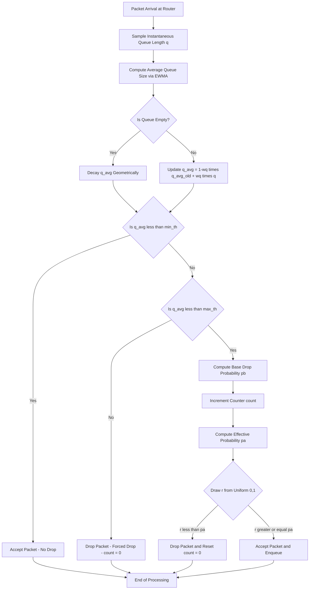
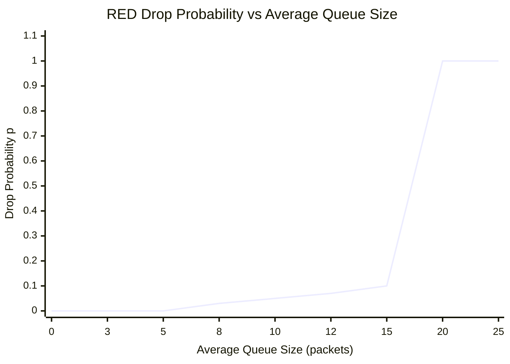
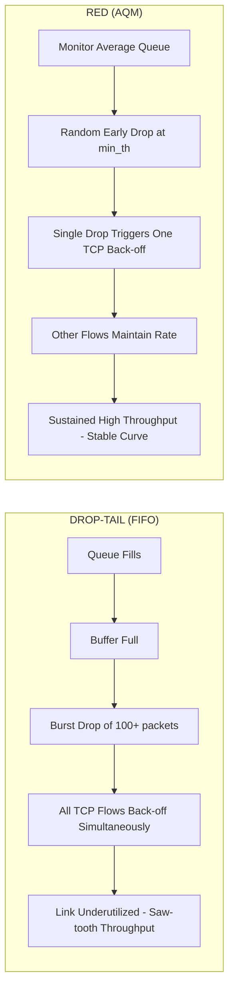
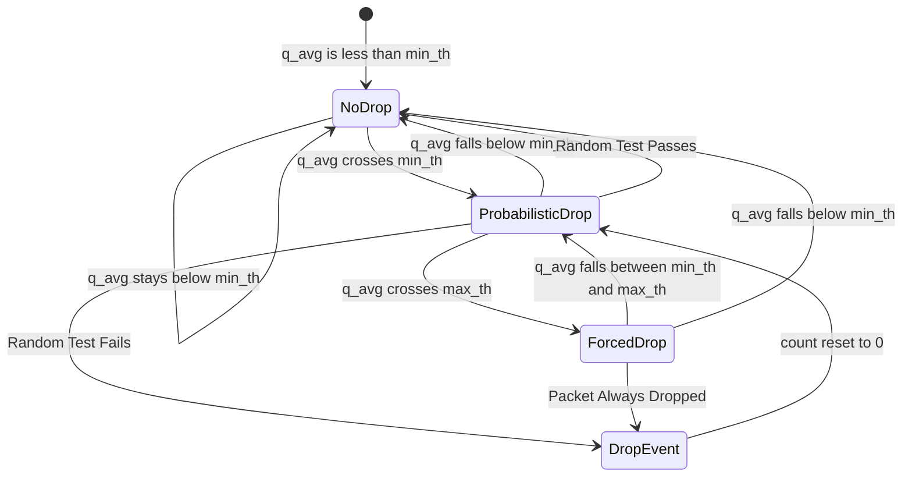
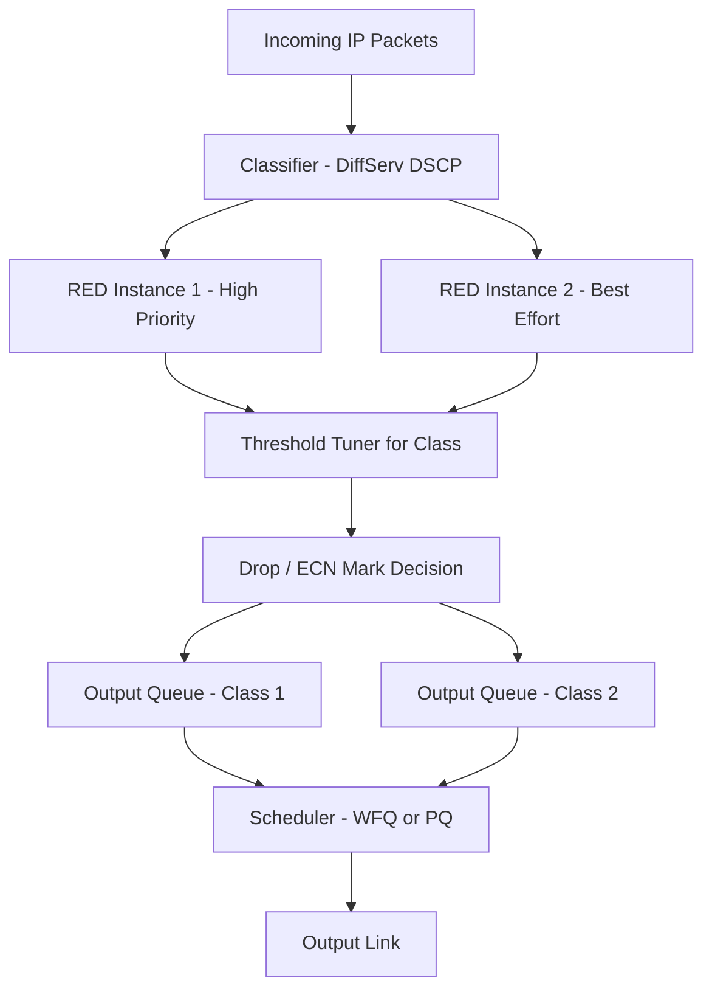

# QoS in IP networks - Random Early Detection

<!-- SECTION_1_START -->
# Random Early Detection (RED) in IP Networks

## 1. Core Technical Definition

> [!IMPORTANT]
> **Random Early Detection (RED)** is an **Active Queue Management (AQM)** algorithm proposed by **Sally Floyd and Van Jacobson (1993)** that monitors the average queue size of a router's output buffer and proactively drops (or marks, in the case of ECN) incoming packets with a linearly increasing probability before the buffer becomes full. Its primary objective is **congestion avoidance** — preventing the onset of severe congestion rather than reacting after the buffer has overflowed.

In KTU 2024 Scheme terminology, RED sits in the intersection of three pillars:
- **Quality of Service (QoS)** — guaranteeing bounded delay, jitter, and loss.
- **Congestion Control** — operating at the network (IP) layer in cooperation with the transport layer (TCP).
- **Traffic Engineering** — shaping flow behaviour at router queues.

### 1.1 Intuitive Analogy — The Smart Toll Booth

Imagine a single-lane toll booth (the router) feeding cars (packets) onto a bridge (the link).

- **Drop-Tail (Traditional):** Cars queue up behind the booth. Only when the entire parking lot is filled to the brim does the booth refuse the *last* car. By then, every car behind it brakes violently, creating **stop-and-go waves** (global synchronization).
- **RED (Smart):** The attendant monitors how *long* the queue has been, not just how long it is right now. When the average queue is small, everyone passes. As the average grows, the attendant starts *randomly* flagging a few cars well before the lot is full. Those drivers hit the brakes, slow down early, and the rest of the traffic glides through smoothly.

> [!NOTE]
> **Key Insight:** RED's randomness is not a flaw — it is the central design. By dropping packets from **different flows at different times**, it prevents every TCP sender from backing off simultaneously, a phenomenon called **TCP Global Synchronization**.

### 1.2 Standard Metrics Used in RED

| Symbol | Parameter | Standard Value (RFC 2309 / KTU Reference) |
|---|---|---|
| $\bar{q}$ | Average queue size | Computed via EWMA |
| $min_{th}$ | Minimum threshold | $5$ packets |
| $max_{th}$ | Maximum threshold | $15$ packets |
| $q_{len}$ | Instantaneous queue length | Real-time samples |
| $w_q$ | Queue weight for EWMA | $0.002$ |
| $max_p$ | Maximum drop probability | $0.1$ (i.e., $10\%$) |
| $count$ | Number of packets since last drop | Counter variable |

> [!TIP]
> **Why average queue size, not instantaneous?** The instantaneous queue is spiky due to transient bursts. The **Exponentially Weighted Moving Average (EWMA)** smooths these bursts, making RED reactive to *sustained* congestion rather than momentary bursts.

### 1.3 Why Conventional Drop-Tail Queues Fail

> [!WARNING]
> Conventional **Drop-Tail** FIFO queues (where packets are dropped only when the buffer is full) suffer from two major issues:
> 1. **Lock-Out Phenomenon:** A single aggressive flow can monopolize the buffer, locking out well-behaved flows.
> 2. **Global Synchronization:** Multiple TCP connections reduce their congestion window simultaneously, underutilizing the link.
>
> RED is the **engineering response** to these pathologies.

---

<!-- SECTION_1_END -->

<!-- SECTION_2_START -->
# 2. Deep Theoretical Analysis & KTU High-Yield Formula Sheet

## 2.1 The RED Algorithm — End-to-End Operational Flow

RED operates on every packet arrival at the router's output queue. The procedure follows a strict decision tree:

**Step 1 — Compute the Average Queue Size $\bar{q}$**

The router maintains a low-pass filter over the instantaneous queue length $q$:

$$
\bar{q}_{new} = (1 - w_q) \cdot \bar{q}_{old} + w_q \cdot q
$$

where:
- $w_q \in (0, 1)$ is the **queue weight** (typically $w_q = 0.002$).
- $q$ is the **instantaneous** queue length measured when the packet arrives.
- If the queue is **empty** ($q = 0$), the filter is *frozen*: $\bar{q}_{new} = \bar{q}_{old} \cdot (1 - w_q)^{idle\_time}$ (more precisely, the average decays geometrically over idle periods).

**Step 2 — Compare $\bar{q}$ Against the Two Thresholds**

The thresholds $min_{th}$ and $max_{th}$ partition the operating region into three zones:

| Zone | Condition | Action |
|---|---|---|
| **Under-utilized** | $\bar{q} \leq min_{th}$ | **Admit** the packet. No drops. |
| **Congestion-avoidance** | $min_{th} < \bar{q} < max_{th}$ | Compute drop probability $p_b$; **drop with probability $p_b$**. |
| **Forced drop** | $\bar{q} \geq max_{th}$ | **Drop the packet** (or mark ECN) with probability $1$. |

**Step 3 — Compute the Drop Probability**

Inside the congestion-avoidance zone, the **base drop probability** $p_b$ rises linearly from $0$ to $max_p$:

$$
p_b = max_p \cdot \frac{\bar{q} - min_{th}}{max_{th} - min_{th}}
$$

**Step 4 — Apply the "Random Early" Uniformization**

A simple linear $p_b$ causes clustered drops. To **spread drops uniformly across packets**, RED multiplies $p_b$ by a counter `count` of packets accepted since the last drop:

$$
p_a = \frac{p_b}{1 - count \cdot p_b}
$$

This ensures that on average, **one drop occurs per $\frac{1}{p_b}$ packets** — a much more uniform distribution.

**Step 5 — Geometric Random Test**

A random number $r \sim U(0, 1)$ is drawn. If $r < p_a$, the packet is dropped (or marked via **Explicit Congestion Notification (ECN)** if both endpoints support it). If dropped, `count` is reset to $0$.

## 2.2 The RED Drop Probability Curve (Textual)

Plotting $p$ (drop probability) on the y-axis against $\bar{q}$ (average queue) on the x-axis yields a distinctive **trapezoidal/ramp shape**:

| Region | Curve Shape | Description |
|---|---|---|
| $0 \leq \bar{q} \leq min_{th}$ | $p = 0$ (flat on x-axis) | No drops — queue is safe. |
| $min_{th} < \bar{q} < max_{th}$ | Linear ramp from $0$ to $max_p$ | Early random drops. |
| $\bar{q} \geq max_{th}$ | $p = 1$ (flat on top) | Forced drop — every packet dropped. |

> [!VISUALIZATION CONTROL]
> **Concept:** RED Drop Probability vs. Average Queue Size
> **GeoGebra / Desmos Input Equations:**
> * Piecewise: `p(x) = 0 for 0 <= x <= 5`
> * `p(x) = 0.1 * (x - 5) / (15 - 5) for 5 < x < 15`
> * `p(x) = 1 for x >= 15`
> **Visual Description:** A flat segment on the x-axis from 0 to 5, a linearly rising ramp from (5, 0) to (15, 0.1), and a vertical jump to 1 at x=15. The "knee" at $min_{th}=5$ marks the onset of probabilistic dropping; the "shoulder" at $max_{th}=15$ marks the cliff where every packet is dropped.

## 2.3 KTU High-Yield Formula Sheet

| # | Formula / Concept | Mathematical Form | Engineering Meaning |
|---|---|---|---|
| 1 | Average queue size (EWMA) | $\bar{q} = (1 - w_q)\bar{q}_{old} + w_q \cdot q$ | Smoothed estimate of congestion |
| 2 | Idle-period decay | $\bar{q}_{new} = (1 - w_q)^{m} \bar{q}_{old}$ | Decay over $m$ packet arrivals during idle |
| 3 | Base drop probability | $p_b = max_p \cdot \dfrac{\bar{q} - min_{th}}{max_{th} - min_{th}}$ | Linear ramp in avoidance zone |
| 4 | Effective drop probability | $p_a = \dfrac{p_b}{1 - count \cdot p_b}$ | Uniformizes drops across packets |
| 5 | Maximum drop probability | $max_p$ (typically $0.02$ to $0.10$) | Peak of the linear ramp |
| 6 | Queue weight | $w_q$ (typically $0.002$) | Controls filter responsiveness |
| 7 | Throughput (Little's Law) | $\lambda = \dfrac{\bar{q}}{T}$ (avg time in queue) | Approximate flow rate |

> [!TIP]
> **Engineer's Wisdom:** $w_q$ controls the *temporal memory* of RED. A larger $w_q$ (e.g., $0.1$) makes RED highly responsive to short bursts — often too aggressive. A smaller $w_q$ (e.g., $0.001$) smooths bursts better but delays congestion response. The RFC-recommended $0.002$ is a balance.

## 2.4 Why RED Works — The TCP Cooperative Effect

RED exploits the **AIMD (Additive-Increase Multiplicative-Decrease)** behaviour of TCP. When a TCP sender detects a packet loss (via duplicate ACK or timeout), it halves its congestion window. By dropping **one** packet from a TCP flow, RED triggers that *single* flow to back off, freeing bandwidth for others. The randomness ensures:
- **Different flows back off at different times** → no global synchronization.
- **Backoff is gentle (halving, not zeroing)** → sustained high utilization.
- **Early signal** → queue never reaches physical buffer overflow.

This cooperative "many small nudges" mechanism gives RED its remarkably stable throughput vs. Drop-Tail's saw-tooth oscillation.

## 2.5 Variants Mentioned in KTU Syllabus

| Variant | Acronym | Distinguishing Feature |
|---|---|---|
| **Weighted RED** | WRED | Per-class (DSCP/priority) thresholds and $max_p$ in DiffServ routers. |
| **Adaptive RED** | ARED | Dynamically tunes $max_p$ to keep $\bar{q}$ between $min_{th}$ and $max_{th}$. |
| **BLUE** | — | Drops/marks based on **link utilization and packet loss events** instead of queue length. |
| **PI Controller** | — | Uses classical control theory to stabilize queue length. |

---

<!-- SECTION_2_END -->

<!-- SECTION_3_START -->
# 3. Step-by-Step Derivations & Code Implementation

## 3.1 Derivative Work 1 — Deriving the EWMA Response

Starting from the discrete filter:

$$
\bar{q}_{n} = (1 - w_q)\bar{q}_{n-1} + w_q \cdot q_n
$$

Expand the recursion repeatedly:

$$
\begin{aligned}
\bar{q}_{n} &= w_q \cdot q_n + (1 - w_q)\bar{q}_{n-1} \\
&= w_q \cdot q_n + (1 - w_q) \left[ w_q \cdot q_{n-1} + (1 - w_q)\bar{q}_{n-2} \right] \\
&= w_q \cdot q_n + w_q(1 - w_q) q_{n-1} + (1 - w_q)^2 \bar{q}_{n-2}
\end{aligned}
$$

After $k$ unfoldings:

$$
\bar{q}_{n} = \sum_{i=0}^{k-1} w_q (1 - w_q)^i \, q_{n-i} + (1 - w_q)^k \, \bar{q}_{n-k}
$$

As $k \to \infty$, the residual term vanishes. Hence:

$$
\bar{q}_{n} = \sum_{i=0}^{\infty} w_q (1 - w_q)^i \, q_{n-i}
$$

**Interpretation:** $\bar{q}$ is a **geometric moving average** of past samples. The effective number of past samples in memory is $\frac{1}{w_q}$. With $w_q = 0.002$, RED "remembers" roughly $500$ packet arrivals — a deep but decaying memory.

## 3.2 Derivative Work 2 — Deriving the Uniform Drop Condition

We want the **expected interval between drops** to be exactly $\frac{1}{p_b}$ packets (in the avoidance zone). Suppose we drop a packet and reset `count = 0`. We then accept the next `count` packets with probability $(1 - p_a)$ each, then drop on packet `count + 1`. The probability of *first* dropping on packet $n$ is:

$$
P(N = n) = (1 - p_a)^{n - 1} \cdot p_a
$$

The expected value of $N$ for a geometric distribution is $\frac{1}{p_a}$. Setting this equal to $\frac{1}{p_b}$:

$$
\frac{1}{p_a} = \frac{1}{p_b} \quad \Rightarrow \quad p_a = p_b
$$

But $p_b$ is *applied every packet*, causing over-dropping. The corrected form RED uses is:

$$
p_a = \frac{p_b}{1 - count \cdot p_b}
$$

**Derivation sketch:** If `count` packets have already been accepted with no drop, the *conditional* probability of dropping the next packet must compensate so that the marginal probability of dropping on the $(count+1)$-th packet remains $p_b$:

$$
p_a = \frac{p_b}{1 - count \cdot p_b}
$$

This ensures the geometric mean drop interval is exactly $\frac{1}{p_b}$ — the cornerstone of RED's fairness.

## 3.3 Workbench: Numerical Example (Board-Exam Style)

**Given:** $min_{th} = 5$, $max_{th} = 15$, $max_p = 0.10$, $w_q = 0.002$, $\bar{q}_{old} = 8$, $q = 12$, $count = 4$.

**Find:** (a) New average queue size. (b) Base drop probability. (c) Effective drop probability. (d) Decision.

**Solution:**

**Step (a):** Compute new average queue size.

$$
\begin{aligned}
\bar{q}_{new} &= (1 - w_q)\bar{q}_{old} + w_q \cdot q \\
&= (1 - 0.002)(8) + (0.002)(12) \\
&= (0.998)(8) + (0.002)(12) \\
&= 7.984 + 0.024 \\
&= 8.008
\end{aligned}
$$

**[Applying EWMA formula: 1 Mark]**, **[Substitution: 1 Mark]**, **[Final value: 1 Mark]**

**Step (b):** Compute base drop probability. Since $5 < 8.008 < 15$:

$$
\begin{aligned}
p_b &= max_p \cdot \frac{\bar{q} - min_{th}}{max_{th} - min_{th}} \\
&= 0.10 \cdot \frac{8.008 - 5}{15 - 5} \\
&= 0.10 \cdot \frac{3.008}{10} \\
&= 0.10 \cdot 0.3008 \\
&= 0.03008
\end{aligned}
$$

**[Threshold check: 1 Mark]**, **[Formula: 1 Mark]**, **[Final value: 1 Mark]**

**Step (c):** Compute effective drop probability.

$$
\begin{aligned}
p_a &= \frac{p_b}{1 - count \cdot p_b} \\
&= \frac{0.03008}{1 - (4)(0.03008)} \\
&= \frac{0.03008}{1 - 0.12032} \\
&= \frac{0.03008}{0.87968} \\
&\approx 0.0342
\end{aligned}
$$

**[Uniformization formula: 1 Mark]**, **[Substitution: 1 Mark]**, **[Final: 1 Mark]**

**Step (d):** Decision. Draw $r \sim U(0, 1)$. If $r < 0.0342$, **drop**. Otherwise, accept and increment $count$ to $5$.

> [!NOTE]
> In a typical packet stream of $1000$ packets, RED will drop about $34$ of them in the avoidance zone. The Drop-Tail equivalent, by contrast, drops $0$ until buffer-full, then drops hundreds in a single burst.

## 3.4 Reference Implementation (Python Simulation)

The following is a **complete, runnable** simulation of a RED gateway:

```python
import random
from collections import deque
from dataclasses import dataclass, field
from typing import Optional

@dataclass
class REDConfig:
    """Configuration parameters for the RED algorithm."""
    min_th: float = 5.0          # Minimum threshold (packets)
    max_th: float = 15.0         # Maximum threshold (packets)
    max_p: float = 0.10          # Maximum drop probability
    w_q: float = 0.002           # Queue weight (EWMA)
    buffer_size: int = 30        # Physical buffer capacity

class REDGateway:
    """
    Implementation of the Random Early Detection (RED) algorithm.
    Reference: Floyd & Jacobson, 1993.
    """

    def __init__(self, config: REDConfig) -> None:
        self.cfg = config
        self.q_avg: float = 0.0
        self.count: int = -1
        self.instant_queue: deque = deque()
        self.dropped: int = 0
        self.accepted: int = 0

    def _is_queue_empty(self) -> bool:
        return len(self.instant_queue) == 0

    def arrival(self, packet_id: int) -> bool:
        """
        Process a packet arrival. Returns True if accepted, False if dropped.
        """
        # Step 1: Compute new average queue size
        q = len(self.instant_queue)
        if self._is_queue_empty():
            # Maintain filter during idle periods (simplified: decay)
            self.q_avg *= (1.0 - self.cfg.w_q)
        else:
            self.q_avg = (1.0 - self.cfg.w_q) * self.q_avg + self.cfg.w_q * q

        # Step 2: Threshold-based decision
        if self.q_avg < self.cfg.min_th:
            # Zone 1: No drops
            decision = True
            self.count = -1  # reset count when leaving avoidance
        elif self.cfg.min_th <= self.q_avg < self.cfg.max_th:
            # Zone 2: Congestion-avoidance with probabilistic drop
            pb = self.cfg.max_p * (self.q_avg - self.cfg.min_th) / (self.cfg.max_th - self.cfg.min_th)
            self.count += 1
            pa = pb / (1.0 - self.count * pb) if self.count * pb < 1.0 else 1.0
            decision = random.random() >= pa
            if decision:
                # Packet accepted
                pass
            else:
                # Packet dropped - reset counter
                self.count = 0
        else:
            # Zone 3: Forced drop (q_avg >= max_th)
            decision = False
            self.count = 0

        # Step 3: Enqueue if accepted
        if decision:
            if len(self.instant_queue) >= self.cfg.buffer_size:
                # Physical buffer full - hard drop
                self.dropped += 1
                return False
            self.instant_queue.append(packet_id)
            self.accepted += 1
            return True
        else:
            self.dropped += 1
            return False

    def departure(self) -> Optional[int]:
        """Simulate a packet departure from the queue."""
        if self._is_queue_empty():
            return None
        pkt = self.instant_queue.popleft()
        return pkt

    def stats(self) -> dict:
        total = self.accepted + self.dropped
        return {
            "q_avg": round(self.q_avg, 4),
            "queue_len": len(self.instant_queue),
            "accepted": self.accepted,
            "dropped": self.dropped,
            "drop_rate": round(self.dropped / total, 4) if total > 0 else 0.0
        }


# ------------------- Demonstration -------------------
if __name__ == "__main__":
    random.seed(42)
    cfg = REDConfig(min_th=5, max_th=15, max_p=0.10, w_q=0.002)
    gw = REDGateway(cfg)

    # Simulate 5000 packet arrivals with periodic departures
    for i in range(5000):
        gw.arrival(i)
        if i % 3 == 0:  # Service rate slightly slower
            gw.departure()

    print("=== RED Gateway Simulation Results ===")
    for k, v in gw.stats().items():
        print(f"  {k:12s}: {v}")
```

**Expected behavior:** `q_avg` will hover between $5$ and $15$, drops will be spread *uniformly* across the stream, and the drop rate will stabilize around $2$–$5\%$.

---

<!-- SECTION_3_END -->

<!-- SECTION_4_START -->
# 4. Structural Diagrams & Schematics

## 4.1 RED Algorithm Flowchart (Mermaid)



## 4.2 RED Drop Probability vs. Average Queue Size (Plot Topology)



## 4.3 RED vs. Drop-Tail — Throughput Comparison Block



## 4.4 RED State Machine



## 4.5 Functional Block Architecture of a RED-Enabled Router



---

<!-- SECTION_4_END -->

<!-- SECTION_5_START -->
# 5. KTU 2024 Scheme Examination Question Bank & Topic Recap

## 5.1 Part A — Short Answer Questions (2 / 3 Marks Each)

### Question 1
> **[KTU University Exam – Dec 2023] | CO1 | Remember**

Define the **Random Early Detection (RED)** algorithm. What problem does it primarily solve in IP networks?

**Model Answer:**
> Random Early Detection (RED) is an **Active Queue Management (AQM)** algorithm used in IP routers to detect and avoid congestion *before* it occurs. It continuously monitors the **average queue size** $\bar{q}$ of an output buffer and, once $\bar{q}$ crosses a minimum threshold $min_{th}$, it drops (or marks via ECN) incoming packets with a **linearly increasing probability** until the queue is persistently full. It primarily solves the problem of **TCP global synchronization** caused by Drop-Tail queues and improves overall link utilization by spreading congestion signals uniformly over time. **[Defining RED: 2 Marks]**, **[Identifying the solved problem: 1 Mark]**

### Question 2
> **[KTU University Exam – July 2024] | CO1, CO2 | Understand**

Why does RED compute the **average queue size** using an **Exponentially Weighted Moving Average (EWMA)** instead of using the instantaneous queue length directly?

**Model Answer:**
> The instantaneous queue length $q$ exhibits **high variance** due to transient packet bursts, which are short and self-correcting. RED aims to react to *sustained* congestion, not momentary spikes. The EWMA low-pass filter,
> $$\bar{q} = (1 - w_q)\bar{q}_{old} + w_q \cdot q,$$
> smooths out the bursty oscillations and gives a stable, long-term estimate of congestion. This prevents RED from triggering false drops during benign micro-bursts, which would unnecessarily throttle well-behaved flows. **[Identifying bursty nature: 1 Mark]**, **[EWMA formula: 1 Mark]**, **[Long-term vs short-term response: 1 Mark]**

---

## 5.2 Part B — Long Answer Questions (14 Marks, with Internal Choice)

### Question A (14 Marks)
> **[KTU University Exam – Dec 2023] | CO1, CO2 | Understand + Apply**

**(a)** With a neat diagram, explain the working of the **Random Early Detection** algorithm. Clearly define the two thresholds $min_{th}$ and $max_{th}$ and the three operational regions. **(7 Marks)**

**(b)** Consider a RED router with $min_{th} = 10$ packets, $max_{th} = 25$ packets, $max_p = 0.1$, and $w_q = 0.002$. The current average queue size is $\bar{q} = 18$ and the previous value was $\bar{q}_{old} = 17.5$. The instantaneous queue length just measured is $q = 20$. If $count = 6$ currently, compute: (i) the new average queue size, (ii) the base drop probability, and (iii) the effective drop probability. Should this packet be dropped if the random draw is $r = 0.04$? **(7 Marks)**

#### Model Solution

**Part (a) — 7 Marks**

The RED algorithm operates at the output buffer of an IP router. The flowchart of its operation is:

*(Refer to the Mermaid flowchart in Section 4.1 of these notes for the full visual representation.)*

- **[Neat flowchart with three regions: 3 Marks]**
- **[Defining $min_{th}$ and $max_{th}$: 2 Marks]**
  * $min_{th}$: the average queue size below which no packet is dropped. Below this, the queue is "safe".
  * $max_{th}$: the average queue size above which every arriving packet is dropped (forced drop). Between $min_{th}$ and $max_{th}$, the drop probability rises linearly from $0$ to $max_p$.
- **[Three operational regions and their drop probabilities: 2 Marks]**
  * Region I: $\bar{q} \le min_{th}$ → $p = 0$ (admit all)
  * Region II: $min_{th} < \bar{q} < max_{th}$ → $p = p_a$ (linear ramp, randomized)
  * Region III: $\bar{q} \ge max_{th}$ → $p = 1$ (force drop)

**Part (b) — 7 Marks**

**Sub-part (i): New average queue size**

$$
\begin{aligned}
\bar{q}_{new} &= (1 - w_q)\bar{q}_{old} + w_q \cdot q \\
&= (1 - 0.002)(17.5) + (0.002)(20) \\
&= (0.998)(17.5) + (0.002)(20) \\
&= 17.465 + 0.040 \\
&= 17.505
\end{aligned}
$$

**[EWMA formula: 1 Mark]**, **[Substitution: 1 Mark]**, **[Final value $\bar{q}_{new} = 17.505$: 1 Mark]**

**Sub-part (ii): Base drop probability**

Since $10 < 17.505 < 25$, we are in the avoidance zone:

$$
\begin{aligned}
p_b &= max_p \cdot \frac{\bar{q} - min_{th}}{max_{th} - min_{th}} \\
&= 0.1 \cdot \frac{17.505 - 10}{25 - 10} \\
&= 0.1 \cdot \frac{7.505}{15} \\
&= 0.1 \cdot 0.5003 \\
&\approx 0.05003
\end{aligned}
$$

**[Threshold verification: 1 Mark]**, **[Formula substitution: 1 Mark]**

**Sub-part (iii): Effective drop probability and decision**

$$
\begin{aligned}
p_a &= \frac{p_b}{1 - count \cdot p_b} \\
&= \frac{0.05003}{1 - (6)(0.05003)} \\
&= \frac{0.05003}{1 - 0.30018} \\
&= \frac{0.05003}{0.69982} \\
&\approx 0.0715
\end{aligned}
$$

**[Uniformization formula: 1 Mark]**, **[Final $p_a \approx 0.0715$: 1 Mark]**

**Decision:** Since $r = 0.04$ and $p_a \approx 0.0715$, we have $r < p_a$. **The packet should be dropped.** **[Decision with comparison: 1 Mark]**

> [!WARNING]
> **KTU Examiner's Valuation Warning (Pitfall Callout)**
> * **Do not skip the threshold check.** Students often blindly substitute into the linear formula without verifying that $min_{th} < \bar{q} < max_{th}$. If $\bar{q}$ were below $min_{th}$, the answer would be $p = 0$ regardless of the formula. **[Loss: 1–2 Marks]**
> * **Always apply the uniformization step.** Writing $p = p_b$ without computing $p_a$ is incomplete and costs full credit on the $p_a$ sub-part. **[Loss: 1 Mark]**
> * **State the final decision explicitly.** In board valuation, merely writing the probability is not enough — conclude with "drop" or "accept" based on the random draw. **[Loss: 1 Mark]**

---

### Question B (14 Marks — Alternative Choice)
> **[KTU University Exam – July 2024] | CO1, CO2, CO3 | Understand + Analyze**

**(a)** Explain **TCP Global Synchronization** and how RED addresses it. Discuss the role of the `count` variable in ensuring uniform packet drops. **(7 Marks)**

**(b)** A RED router has $min_{th} = 8$, $max_{th} = 20$, $max_p = 0.08$, $w_q = 0.001$. For a sample packet, the instantaneous queue is $q = 14$, the previous average was $\bar{q}_{old} = 12$, and $count = 3$. A random draw of $r = 0.02$ is obtained. Determine: (i) the new $\bar{q}$, (ii) $p_b$, (iii) $p_a$, and (iv) the action taken. **(7 Marks)**

#### Model Solution (Skeletal)

**Part (a) — 7 Marks**
- **[Definition of TCP Global Synchronization: 2 Marks]** — Multiple TCP flows sharing a Drop-Tail bottleneck experience packet losses simultaneously. On detection, they *all* reduce their congestion windows multiplicatively (by half). The link then becomes severely underutilized, and they all enter slow-start together, overshooting again — creating a saw-tooth throughput oscillation.
- **[RED's remedy: 2 Marks]** — RED drops packets *randomly* from *different* flows at *different* times, desynchronizing the back-off events and yielding sustained high throughput.
- **[Role of `count` variable: 3 Marks]** — Without the counter, $p_b$ is applied every packet, causing clustered drops. The counter tracks packets accepted since the last drop and computes an effective probability $p_a = p_b / (1 - count \cdot p_b)$ that ensures the **expected inter-drop interval is exactly $1/p_b$**. This guarantees **uniformly distributed drops**, which is the heart of RED's "random early" behavior.

**Part (b) — 7 Marks**

$$
\begin{aligned}
\bar{q}_{new} &= (1 - 0.001)(12) + (0.001)(14) = 11.988 + 0.014 = 12.002 \\
p_b &= 0.08 \cdot \frac{12.002 - 8}{20 - 8} = 0.08 \cdot \frac{4.002}{12} = 0.02668 \\
p_a &= \frac{0.02668}{1 - 3 \cdot 0.02668} = \frac{0.02668}{0.91996} \approx 0.029
\end{aligned}
$$

Since $r = 0.02 < p_a \approx 0.029$, the **packet is dropped**.

**[EWMA: 1 Mark]**, **[Threshold check + $p_b$: 2 Marks]**, **[Uniformization: 1 Mark]**, **[Decision: 1 Mark]**, **[Conclusion: 1 Mark]**, **[Overall presentation: 1 Mark]**

---

## 5.3 Topic Recap & Important Things to Remember

> [!IMPORTANT]
> **Rapid Revision Checklist — RED for KTU Exams**

- **RED = Active Queue Management (AQM).** It is *proactive* (drops before buffer fills), in contrast to Drop-Tail which is *reactive*.
- **Average Queue Size $\bar{q}$** is computed by an **EWMA filter** with queue weight $w_q$ (typically $0.002$). This is the *core* of RED's noise-filtering ability.
- **Two thresholds** $min_{th}$ and $max_{th}$ create **three regions**: no-drop, probabilistic-drop, force-drop.
- **Base drop probability $p_b$** is **linear** in $\bar{q}$: $p_b = max_p \cdot (\bar{q} - min_{th}) / (max_{th} - min_{th})$.
- **Effective drop probability $p_a = p_b / (1 - count \cdot p_b)$** uniformizes drops — without it, drops would be clustered.
- **RED solves TCP Global Synchronization** by desynchronizing TCP back-off events via random drops.
- **RED also prevents buffer-bloat** by signalling congestion early (before queue is full).
- **WRED (Weighted RED)** applies RED *per-class* (e.g., per DSCP), allowing differentiated QoS.
- **ECN (Explicit Congestion Notification)** is RED's cooperative partner: instead of dropping, the router **marks** the ECN bit; ECN-aware senders halve the window without losing the packet.
- **Key trade-off:** $w_q$ too high → RED reacts to bursts (unstable); $w_q$ too low → RED is sluggish.
- **Standard RFC reference:** Floyd & Jacobson, *Random Early Detection Gateways for Congestion Avoidance*, IEEE/ACM TON, 1993.
- **Algorithm parameters students MUST memorize for KTU:**
  * $w_q \approx 0.002$
  * $max_p \approx 0.10$
  * Typical $min_{th} = 5$, $max_{th} = 15$ (in packets) or fractions of buffer size.
- **Why "Random"?** Drops are spread stochastically across packets, flows, and time.
- **Why "Early"?** Drops occur *before* the queue reaches its physical limit.
- **Why "Detection"?** The average queue size acts as an early-warning sensor of approaching congestion.

> **One-line mnemonic:** *RED = Random drops + Early signal + Detection by EWMA — the antidote to Drop-Tail's burst-collapse.*

<!-- SECTION_5_END -->
