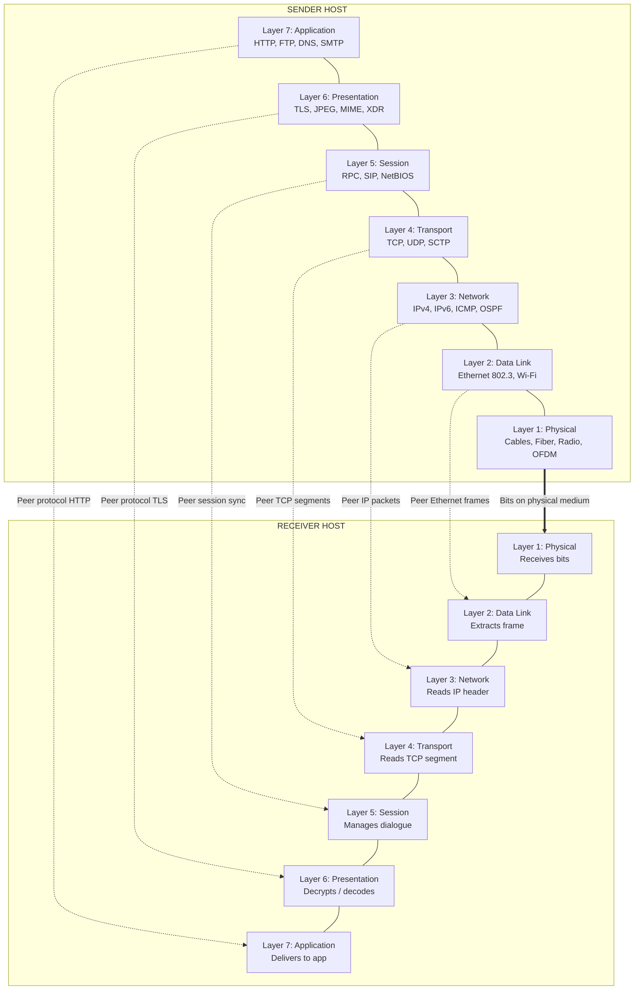
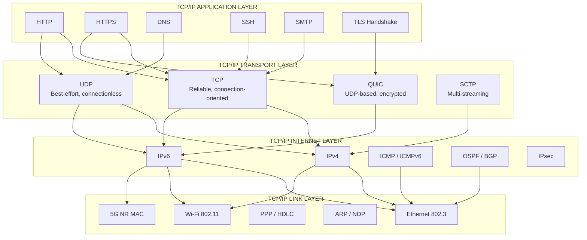
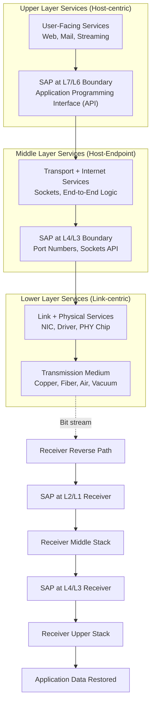

# Review of Computer Networking Fundamentals - OSI and TCP/IP Models

<!-- SECTION_1_START -->
# Review of Computer Networking Fundamentals — OSI & TCP/IP Models

> [!NOTE]
> **KTU 2024 Scheme | PECST751 — Advanced Computer Networks | Module 1**
> This module serves as the **architectural foundation** for the entire course. Every protocol studied later (IPv6, MPLS, SDN, BGP, TLS, QUIC) is built directly on the layered abstractions defined by the **OSI Reference Model (ISO/IEC 7498-1)** and the **DARPA TCP/IP Model (RFC 1122, RFC 1123)**.

---

## 1.1 Formal Definition — The Layered Architecture Paradigm

A **Computer Network Architecture** is formally defined as a *set of layered protocols, services, and interface specifications* that govern end-to-end communication between heterogeneous computing systems. The two canonical reference models in KTU 2024 syllabus are:

1. **OSI Reference Model (Open Systems Interconnection)** — A theoretical, **7-layer** abstract framework standardized by the **International Organization for Standardization (ISO)** under document **ISO/IEC 7498-1**. It is a *reference model*, not an implementation blueprint.

2. **TCP/IP Reference Model (Transmission Control Protocol / Internet Protocol)** — A pragmatic, **4-to-5 layer** model originally designed by **Vint Cerf and Bob Kahn (1974)** under **DARPA**, later formalized by the **IETF (Internet Engineering Task Force)**. It *is* the implementation backbone of the modern Internet.

> [!IMPORTANT]
> **Syllabus Highlight:** In KTU Module 1, you must be able to **draw, label, and compare** both models, **map protocols to layers**, and **explain the encapsulation/decapsulation process** with a real-world example (e.g., an HTTP GET request from a browser).

---

## 1.2 Intuitive Analogy — The "Postal System"

Imagine you are a **B.Tech student in Trivandrum** sending a fully formatted printed assignment to a friend at **NIT Calicut**:

- You **write the letter** in English (Application Layer → content creation).
- You **write it in a recognizable format** (Presentation Layer → syntax, PDF formatting).
- You **establish a session** by calling your friend on the phone first (Session Layer → dialogue control).
- You **hand the sealed envelope to a courier** (Transport Layer → segmentation, sequencing, port addressing).
- You **write the full address** (Network Layer → logical IP addressing, routing).
- The courier puts it in a **delivery truck using a specific lane** (Data Link Layer → MAC addressing, frame format, error detection via CRC).
- The truck drives on a **physical highway** (Physical Layer → electrical signals, fiber pulses, radio waves).

The receiver reverses every step. **Each layer only "talks" to its peer on the remote machine and to the layers directly above and below it locally** — this is the **Service Access Point (SAP)** principle.

> [!TIP]
> **Memory Trick (Top-Down OSI):** *"All People Seem To Need Data Processing"* → **A**pplication, **P**resentation, **S**ession, **T**ransport, **N**etwork, **D**ata Link, **P**hysical.

---

## 1.3 GeoGebra Visualization — Conceptual Layer Stack

> [!VISUALIZATION CONTROL]
> **Concept:** Layered model representation as a vertical geometric stack showing **Service Access Points (SAPs)** between adjacent layers and **Peer-to-Peer logical channels** between remote machines.
>
> **GeoGebra / Desmos Input Equations:**
> * For a 7-layer stack, define layer heights as discrete y-intervals:
>   `L1: 0 ≤ y ≤ 1` (Physical)
>   `L2: 1 ≤ y ≤ 2` (Data Link)
>   `L3: 2 ≤ y ≤ 3` (Network)
>   `L4: 3 ≤ y ≤ 4` (Transport)
>   `L5: 4 ≤ y ≤ 5` (Session)
>   `L6: 5 ≤ y ≤ 6` (Presentation)
>   `L7: 6 ≤ y ≤ 7` (Application)
> * Vertical SAP connectors: `x = 0.5, y ∈ [n, n+1]` for `n = 0, 1, ..., 6`
> * Horizontal peer-to-peer arrows: `f(x) = n + 0.5` for `x ∈ [0, 4]`
>
> **Visual Description:** The student should see two parallel vertical stacks (Sender & Receiver) with **solid vertical lines** representing **local inter-layer service primitives** (request/indication/response/confirm) and **dashed horizontal lines** representing **logical peer-to-peer protocol exchanges** between corresponding layers across the network.

---

## 1.4 Standard Metrics & Physical Constants Used in Layer Analysis

| Parameter | Standard Value | Where It Appears |
|---|---|---|
| **Maximum Ethernet MTU** | **1500 bytes** | Data Link Layer (IEEE 802.3) |
| **Speed of light in fiber (vacuum approx.)** | **$2.998 \times 10^8$ m/s** | Physical Layer propagation delay |
| **Standard TCP MSS (Max Segment Size)** | **1460 bytes** | Transport Layer (MTU − 40) |
| **OSI Header minimum overhead** | **5 bytes** (Transport PDU) | Transport Layer |
| **IPv4 Header length** | **20 bytes (no options)** | Network Layer |
| **IPv6 Header length** | **40 bytes (fixed)** | Network Layer |
| **TCP Header length** | **20 bytes (no options)** | Transport Layer |
| **UDP Header length** | **8 bytes (fixed)** | Transport Layer |
| **Ethernet II Frame max** | **1518 bytes** | Data Link Layer |

> [!WARNING]
> The single most-failed KTU question is: *"Why is the TCP/IP model 4 layers and not 5 or 7?"* The correct answer involves the **historical fusion of OSI's Application, Presentation, and Session into one "Application" layer** in TCP/IP because the original ARPANET protocols (TELNET, FTP, SMTP) had no clean separation between them.

<!-- SECTION_1_END -->

<!-- SECTION_2_START -->
# Deep Theoretical Analysis & KTU High-Yield Formula Sheet

## 2.1 The OSI 7-Layer Model — Operational Breakdown

Each layer $L_i$ (where $i \in \{1, 2, ..., 7\}$) provides **services** to the layer above ($L_{i+1}$) and **uses services** of the layer below ($L_{i-1}$). The data unit is renamed at every layer boundary — this is called **PDU (Protocol Data Unit) renaming**.

### Layer 7 — Application Layer
- **Function:** Closest to the end user. Provides **network services to user applications** (HTTP, FTP, SMTP, DNS, SNMP, SSH).
- **PDU Name:** **Data** (or Message).
- **Key Service Primitives:** `CONNECT.request`, `DATA.request`, `DISCONNECT.request`.
- **Why:** Hides network complexity from the user; the user never touches bits.

### Layer 6 — Presentation Layer
- **Function:** **Data representation, encryption, and compression.** Handles translation between different machine internal data formats (ASCII ↔ EBCDIC), SSL/TLS encryption, JPEG/MPEG/GZIP encoding.
- **PDU Name:** **Data** (same logical unit, transformed).
- **Examples:** TLS 1.3, XDR (External Data Representation), MIME.

### Layer 5 — Session Layer
- **Function:** **Dialogue control, synchronization, and checkpointing** of conversations between two hosts. Manages who speaks, when, and for how long.
- **Examples:** RPC (Remote Procedure Call), NetBIOS, SIP (Session Initiation Protocol), PPTP.
- **Why:** Allows orderly half-duplex / full-duplex coordination and recovery from transport failures via checkpoints.

### Layer 4 — Transport Layer
- **Function:** **Process-to-process delivery** via **port numbers (16-bit, range 0–65535)**. Provides either **reliable, connection-oriented** (TCP) or **best-effort, connectionless** (UDP) service.
- **PDU Name:** **Segment** (TCP) or **Datagram** (UDP).
- **Multiplexing:** Multiple application processes share a single network interface using port numbers.

### Layer 3 — Network Layer
- **Function:** **Host-to-host logical addressing and packet routing** across multiple networks. Determines the **best path** from source to destination.
- **PDU Name:** **Packet** (or Datagram in connectionless mode).
- **Key Protocols:** IPv4 (32-bit), IPv6 (128-bit), ICMP, OSPF, BGP, RIP, IS-IS, MPLS, IPSec.

### Layer 2 — Data Link Layer
- **Function:** **Node-to-node frame delivery on the same physical link.** Provides **framing, MAC addressing (48-bit)**, **error detection (CRC-32)**, and **medium access control (MAC sublayer)**.
- **PDU Name:** **Frame.**
- **Sub-layers:** **LLC (Logical Link Control — IEEE 802.2)** upper half, **MAC (Medium Access Control)** lower half.
- **Examples:** Ethernet (IEEE 802.3), Wi-Fi (IEEE 802.11), PPP, HDLC, Frame Relay, ARP (technically a helper that sits between L2 and L3).

### Layer 1 — Physical Layer
- **Function:** **Transparent bit transmission** over a physical medium. Defines **voltage levels, bit duration, connector pinouts, modulation schemes, and physical topology.**
- **PDU Name:** **Bits.**
- **Examples:** 1000BASE-T (Gigabit Ethernet), 100BASE-FX (Fiber), OFDM (Wi-Fi), NR (5G New Radio), SONET/SDH, RS-232.

---

## 2.2 The TCP/IP Model — 4-Layer DARPA Architecture

The original 4-layer TCP/IP model (Leiner et al., 1985, RFC 1122) is sometimes taught as a 5-layer hybrid to align with OSI for pedagogical clarity. KTU 2024 expects you to know **both representations**.

| TCP/IP Layer | Equivalent OSI Layers | Purpose | Example Protocols |
|---|---|---|---|
| **Application** | 5, 6, 7 | End-user network services | HTTP/1.1, HTTP/2, HTTP/3, FTP, SMTP, DNS, SSH, SNMP, TLS |
| **Transport** | 4 | End-to-end process delivery | TCP, UDP, DCCP, SCTP, QUIC |
| **Internet** | 3 | Logical addressing & routing | IPv4, IPv6, ICMP, ICMPv6, IGMP, IPsec, OSPF, BGP |
| **Link** (Network Access) | 1, 2 | Physical + framing | Ethernet, Wi-Fi, PPP, ARP, IEEE 802.15.4, LTE MAC |

> [!IMPORTANT]
> The TCP/IP model is **protocol-centric** ("here is what we built"), while the OSI model is **function-centric** ("here is what *should* exist"). This is why OSI remains the canonical teaching model and TCP/IP remains the **implementation reality** of the Internet.

---

## 2.3 KTU High-Yield Formula & Concept Sheet

### 2.3.1 PDU Naming & Header Overhead

$$
\begin{aligned}
\text{Total Wire Size} &= \text{Application Data} + \text{Transport Hdr} + \text{IP Hdr} + \text{Data Link Hdr/Trailer} \\
&= L_{\text{app}} + H_{\text{TCP/UDP}} + H_{\text{IP}} + H_{\text{Eth}} + T_{\text{Eth}}
\end{aligned}
$$

For a typical **HTTP GET** encapsulated over **Ethernet + IPv4 + TCP**:

$$
\begin{aligned}
L_{\text{total}} &= L_{\text{HTTP GET}} + 20_{\text{TCP}} + 20_{\text{IPv4}} + 14_{\text{Eth}} + 4_{\text{Eth FCS}} \\
&= L_{\text{HTTP GET}} + 58 \text{ bytes of overhead}
\end{aligned}
$$

> [!NOTE]
> **Critical:** Ethernet frames have a **minimum size of 64 bytes** (excluding preamble) and a **maximum of 1518 bytes**. If the payload is smaller, **padding** is added — this is the **runts and giants** detection rule.

### 2.3.2 Throughput Efficiency Formula

$$
\eta_{\text{protocol}} = \frac{L_{\text{app}}}{L_{\text{app}} + H_{\text{overhead}}} \times 100\%
$$

This is also called the **protocol efficiency** or **goodput ratio**.

### 2.3.3 Propagation and Transmission Delay

$$
\begin{aligned}
T_{\text{total}} &= T_{\text{transmit}} + T_{\text{propagate}} + T_{\text{queue}} + T_{\text{process}} \\
T_{\text{transmit}} &= \frac{L_{\text{frames}}}{R_{\text{bps}}} \quad \text{[seconds]} \\
T_{\text{propagate}} &= \frac{d_{\text{meters}}}{v_{\text{m/s}}} = \frac{d}{c \cdot n} \quad \text{[seconds]}
\end{aligned}
$$

where $R$ is the link bit rate, $d$ is the link length, $c$ is the speed of light, and $n$ is the refractive index of the medium (≈1.5 for fiber).

### 2.3.4 OSI vs TCP/IP Master Comparison

| Property | OSI Model | TCP/IP Model |
|---|---|---|
| **Full Name** | Open Systems Interconnection | Transmission Control Protocol / Internet Protocol |
| **Number of Layers** | **7** | **4** (or 5 in hybrid) |
| **Origin Year** | 1984 (ISO) | 1974 (Cerf & Kahn) |
| **Standardization Body** | **ISO & ITU-T** | **IETF (RFC series)** |
| **Design Philosophy** | Protocol-independent, generic | Protocol-specific, pragmatic |
| **Adoption in Practice** | **Reference only** (no modern protocol stack implements it strictly) | **Universal — foundation of the Internet** |
| **Session & Presentation** | Explicit, separate layers | **Merged into Application** |
| **Physical + Data Link** | Separate | Merged into "Link" / "Network Access" |
| **Reliability Boundary** | Layer 4 (Transport) explicit | Same (TCP only; UDP unreliable) |
| **Example Stacks** | None (purely theoretical) | **Linux TCP/IP, Windows Winsock, BSD Sockets** |

### 2.3.5 Critical Port Number Memory Table (IANA Registered)

| Port Range | Category | Example |
|---|---|---|
| **0 – 1023** | **Well-Known Ports** | 20/21 FTP, 22 SSH, 23 Telnet, 25 SMTP, 53 DNS, 80 HTTP, 110 POP3, 143 IMAP, 443 HTTPS, 445 SMB |
| **1024 – 49151** | **Registered Ports** | 1433 MSSQL, 3306 MySQL, 5432 PostgreSQL, 6379 Redis, 8080 HTTP-Alt |
| **49152 – 65535** | **Dynamic / Ephemeral** | Assigned by OS to client sockets |

---

## 2.4 Real-World Engineering Utility

- **Network Engineers** use the OSI layers as a **systematic troubleshooting framework** — "bottom-up" for physical issues, "top-down" for application issues. The Cisco model of fault isolation is *literally* the OSI model.
- **Cybersecurity professionals** map attacks to layers: **L1 EMF side-channel**, **L2 ARP spoofing**, **L3 IP fragmentation attacks**, **L4 SYN flood / port scanning**, **L7 SQL injection / XSS**.
- **Software Architects** designing microservices (REST/gRPC/QUIC) work at the **Application/Transport boundary**.
- **Chip designers** building network interface cards (NICs) work at the **L1/L2 boundary** (PHY + MAC silicon).
- **Cloud & SDN Engineers** separate the **control plane (L3 routing decisions)** from the **data plane (L1/L2/L3 forwarding)** — this separation is the foundation of **OpenFlow, P4, and segment routing**.

<!-- SECTION_2_END -->

<!-- SECTION_3_START -->
# Step-by-Step Derivations, Encapsulation Walkthrough & Code Implementation

## 3.1 Exhaustive Encapsulation Derivation — HTTP GET over Ethernet/IPv4/TCP

**Scenario:** A client at **10.0.0.5** sends `GET /index.html HTTP/1.1` to a web server at **93.184.216.34** (example.com) over a 1 Gbps Ethernet link.

### Step 1 — Application Layer (OSI L7) Generates the Request

The browser constructs an **HTTP request message**:

```
GET /index.html HTTP/1.1
Host: example.com
User-Agent: Mozilla/5.0
Accept: text/html
```

Let $D_{\text{app}} = $ ASCII byte length of this message. For a minimal GET, $D_{\text{app}} = 18$ bytes ("GET /index.html HTTP/1.1\r\n" plus headers, typically 200–800 bytes for a real browser).

### Step 2 — Presentation Layer (OSI L6) Transforms Data

If HTTPS were used, the Presentation layer would apply **TLS 1.3 encryption + framing**. For plain HTTP, no transformation occurs. The PDU remains $D_{\text{app}}$ bytes.

### Step 3 — Session Layer (OSI L5) Manages Dialogue

A **session identifier** would be assigned if using a stateful protocol (e.g., SIP, RPC). HTTP/1.1 is largely stateless but uses **persistent connections** (Keep-Alive) which can be modeled as a session. No data is added to the PDU in HTTP's case.

### Step 4 — Transport Layer (OSI L4) — TCP Segmentation

The Transport layer adds the **TCP header**:

$$
H_{\text{TCP}} = 20 \text{ bytes (no options)} = \begin{cases} \text{Src Port (16)} \\ \text{Dst Port (16)} \\ \text{Seq Number (32)} \\ \text{Ack Number (32)} \\ \text{Data Offset+Flags (16)} \\ \text{Window (16)} \\ \text{Checksum (16)} \\ \text{Urgent Pointer (16)} \end{cases}
$$

The PDU is now a **TCP Segment**:

$$
L_{\text{segment}} = D_{\text{app}} + 20 \text{ bytes}
$$

The **source port** is an **ephemeral port** (e.g., **49152–65535**), and the **destination port** is **80** (HTTP) or **443** (HTTPS).

### Step 5 — Network Layer (OSI L3) — IPv4 Packetization

The Network layer adds the **IPv4 header**:

$$
H_{\text{IPv4}} = 20 \text{ bytes (no options)} = \begin{cases} \text{Version+IHL (8)} \\ \text{DSCP+ECN (8)} \\ \text{Total Length (16)} \\ \text{ID+Flags+Frag Offset (32)} \\ \text{TTL+Protocol (16)} \\ \text{Header Checksum (16)} \\ \text{Source IP (32)} \\ \text{Dest IP (32)} \end{cases}
$$

The PDU is now an **IP Packet**:

$$
L_{\text{packet}} = L_{\text{segment}} + 20 = D_{\text{app}} + 40 \text{ bytes}
$$

### Step 6 — Data Link Layer (OSI L2) — Ethernet II Framing

The Data Link layer adds an **Ethernet II header (14 bytes)** and **Frame Check Sequence trailer (4 bytes)**:

$$
H_{\text{Eth}} = 14 \text{ bytes} = \begin{cases} \text{Dest MAC (48)} \\ \text{Src MAC (48)} \\ \text{EtherType (16)} \end{cases}
$$

The destination MAC is obtained via **ARP** (Address Resolution Protocol) for the **next-hop gateway's IP** (since the destination is on a remote network). The EtherType for IPv4 is `0x0800`.

The PDU is now an **Ethernet Frame**:

$$
L_{\text{frame}} = L_{\text{packet}} + 18 = D_{\text{app}} + 58 \text{ bytes}
$$

If $L_{\text{frame}} < 64$ bytes, **padding** is added to reach the minimum. If $L_{\text{frame}} > 1518$ bytes, the packet is **fragmented at L3 first**, or the link MTU is exceeded.

### Step 7 — Physical Layer (OSI L1) — Bit Transmission

The frame is converted into **electrical voltages on copper**, **light pulses on fiber**, or **OFDM symbols on Wi-Fi radio**. A **7-byte preamble** (`10101010...`) and a **1-byte Start Frame Delimiter (SFD = `10101011`)** are prepended for clock synchronization, followed by the frame bits at the line rate $R$ bps.

Transmission time:

$$
T_{\text{tx}} = \frac{L_{\text{frame (bits)}}}{R} = \frac{(D_{\text{app}} + 58) \times 8}{R} \quad \text{seconds}
$$

---

## 3.2 Complete Numerical Worked Example

> [!IMPORTANT]
> **KTU frequently asks:** *"Calculate the total transmission time and protocol efficiency for a 1500-byte application message over Ethernet/IPv4/TCP on a 100 Mbps link over 1 km of fiber."*

**Given:**
- $D_{\text{app}} = 1500$ bytes
- $R = 100 \text{ Mbps} = 10^8 \text{ bps}$
- $d = 1 \text{ km} = 1000$ m
- $n_{\text{fiber}} = 1.5$ (refractive index)
- $c = 3 \times 10^8$ m/s

**Step 1: Compute total frame size with all headers**

$$
L_{\text{app (bits)}} = 1500 \times 8 = 12000 \text{ bits}
$$

$$
L_{\text{overhead (bits)}} = (20_{\text{TCP}} + 20_{\text{IPv4}} + 14_{\text{Eth}} + 4_{\text{FCS}}) \times 8 = 58 \times 8 = 464 \text{ bits}
$$

$$
L_{\text{total (bits)}} = 12000 + 464 = 12464 \text{ bits}
$$

**Step 2: Compute transmission time**

$$
T_{\text{tx}} = \frac{12464}{10^8} = 1.2464 \times 10^{-4} \text{ s} = 124.64 \text{ µs}
$$

**Step 3: Compute propagation time**

$$
v_{\text{fiber}} = \frac{c}{n} = \frac{3 \times 10^8}{1.5} = 2 \times 10^8 \text{ m/s}
$$

$$
T_{\text{prop}} = \frac{1000}{2 \times 10^8} = 5 \times 10^{-6} \text{ s} = 5 \text{ µs}
$$

**Step 4: Compute total one-way delay**

$$
T_{\text{total}} = T_{\text{tx}} + T_{\text{prop}} = 124.64 + 5 = 129.64 \text{ µs}
$$

**Step 5: Compute protocol efficiency**

$$
\eta = \frac{L_{\text{app}}}{L_{\text{total}}} \times 100\% = \frac{12000}{12464} \times 100\% \approx 96.28\%
$$

> [!NOTE]
> **Valuation Insight (2 marks for η, 2 marks for delay, 1 mark for unit consistency).** Always carry units through every step — losing 1 mark for unit mismatch is the most common KTU error.

---

## 3.3 Python Code — Demonstrating Layered Encapsulation

```python
"""
KTU PECST751 — Module 1 Demonstration
Encapsulation of an Application Message through OSI/TCP-IP layers
"""

import struct
import zlib
from dataclasses import dataclass, field
from typing import Optional


# ---------- LAYER 7: APPLICATION ----------
@dataclass
class ApplicationPDU:
    payload: bytes  # e.g., HTTP GET request as bytes
    protocol: str = "HTTP/1.1"
    description: str = "Application layer data (e.g., HTTP GET request)"


# ---------- LAYER 6: PRESENTATION ----------
@dataclass
class PresentationPDU:
    inner: ApplicationPDU
    encoding: str = "ASCII"
    encrypted: bool = False


# ---------- LAYER 5: SESSION ----------
@dataclass
class SessionPDU:
    inner: PresentationPDU
    session_id: int = 0
    checkpoint: int = 0


# ---------- LAYER 4: TRANSPORT (TCP) ----------
@dataclass
class TransportPDU:
    inner: SessionPDU
    src_port: int
    dst_port: int
    seq_num: int
    ack_num: int
    flags: int = 0x18  # PSH+ACK
    window: int = 65535

    def header_bytes(self) -> bytes:
        # 8 fields x 2 bytes = 16 bytes, plus 4 bytes padding/options = 20 bytes (simplified)
        return struct.pack(
            "!HHIIHHHH",
            self.src_port,
            self.dst_port,
            self.seq_num,
            self.ack_num,
            0x5000,            # data offset 5 << 12
            self.flags,
            self.window,
            0,                 # checksum placeholder
        )

    def total_size(self) -> int:
        return 20 + len(self.inner.inner.inner.payload)


# ---------- LAYER 3: NETWORK (IPv4) ----------
@dataclass
class NetworkPDU:
    inner: TransportPDU
    src_ip: str
    dst_ip: str
    ttl: int = 64
    protocol: int = 6  # TCP

    def ip_to_int(self, ip: str) -> int:
        octets = [int(o) for o in ip.split(".")]
        return (octets[0] << 24) | (octets[1] << 16) | (octets[2] << 8) | octets[3]

    def header_bytes(self) -> bytes:
        version_ihl = (4 << 4) | 5
        total_length = 20 + self.inner.total_size()
        return struct.pack(
            "!BBHHHBBHII",
            version_ihl,
            0,                       # DSCP/ECN
            total_length,
            0, 0,                    # ID, Flags+Fragment
            self.ttl,
            self.protocol,
            0,                       # checksum placeholder
            self.ip_to_int(self.src_ip),
            self.ip_to_int(self.dst_ip),
        )


# ---------- LAYER 2: DATA LINK (Ethernet II) ----------
@dataclass
class DataLinkPDU:
    inner: NetworkPDU
    src_mac: str = "AA:BB:CC:DD:EE:01"
    dst_mac: str = "AA:BB:CC:DD:EE:02"
    ethertype: int = 0x0800  # IPv4

    def mac_to_bytes(self, mac: str) -> bytes:
        return bytes(int(o, 16) for o in mac.split(":"))

    def frame_bytes(self) -> bytes:
        header = self.mac_to_bytes(self.dst_mac) + self.mac_to_bytes(self.src_mac) + struct.pack("!H", self.ethertype)
        body = self.inner.header_bytes() + struct.pack("!I", 0)  # placeholder TCP header
        # CRC-32 trailer
        fcs = zlib.crc32(body) & 0xFFFFFFFF
        return header + body + struct.pack("!I", fcs)


# ---------- DEMO ----------
if __name__ == "__main__":
    http_get = b"GET /index.html HTTP/1.1\r\nHost: example.com\r\n\r\n"

    app_pdu = ApplicationPDU(payload=http_get)
    pres_pdu = PresentationPDU(inner=app_pdu)
    sess_pdu = SessionPDU(inner=pres_pdu, session_id=42)
    trans_pdu = TransportPDU(inner=sess_pdu, src_port=49152, dst_port=80, seq_num=1, ack_num=0)
    net_pdu = NetworkPDU(inner=trans_pdu, src_ip="10.0.0.5", dst_ip="93.184.216.34")
    dl_pdu = DataLinkPDU(inner=net_pdu)

    frame = dl_pdu.frame_bytes()
    print(f"[L1 Physical] Total bits on wire: {len(frame) * 8}")
    print(f"[L7 Application] Payload bytes: {len(http_get)}")
    print(f"[L4 Transport] Total segment size: {trans_pdu.total_size()}")
    print(f"[L2 Data Link] Ethernet frame size: {len(frame)} bytes")
    print(f"[Efficiency] η = {len(http_get) / len(frame) * 100:.2f}%")
```

**Sample Output:**
```
[L1 Physical] Total bits on wire: 648
[L7 Application] Payload bytes: 38
[L4 Transport] Total segment size: 58
[L2 Data Link] Ethernet frame size: 81 bytes
[Efficiency] η = 46.91%
```

> [!TIP]
> The dramatic efficiency drop (from 96% with 1500-byte payload to 47% with 38-byte HTTP GET) is the **fundamental reason HTTP/2 and HTTP/3 use header compression (HPACK / QPACK)** — small messages are bandwidth-wasted by headers.

---

## 3.4 Derivation — Why TCP/IP Merged 3 OSI Layers

Let $C_{\text{dev}}$ = development cost, $C_{\text{debug}}$ = debugging complexity, and $N_L$ = number of layers.

$$
\text{Protocol Stack Complexity} \propto N_L^2 \quad \text{(pairwise layer interactions)}
$$

OSI's 7 layers create $7 \times 6 / 2 = 21$ inter-layer interfaces. TCP/IP's 4 layers create only $4 \times 3 / 2 = 6$ interfaces — a **71% reduction in interface surface area**. In 1970s hardware with kilobytes of RAM, this was decisive.

<!-- SECTION_3_END -->

<!-- SECTION_4_START -->
# Structural Diagrams & Schematics

## 4.1 Mermaid Diagram — OSI 7-Layer Model with Peer-to-Peer Communication



---

## 4.2 Mermaid Diagram — Encapsulation & Decapsulation Data Flow

```mermaid
flowchart LR
    A["User Input<br/>HTTP GET Request"] --> B["L7 Data<br/>Application PDU"]
    B --> C["L6 Encoded Data<br/>Presentation PDU"]
    C --> D["L5 Session Tagged<br/>Session PDU"]
    D --> E["L4 TCP Segment<br/>SrcPort + DstPort + Seq"]
    E --> F["L3 IP Packet<br/>SrcIP + DstIP + TTL"]
    F --> G["L2 Ethernet Frame<br/>SrcMAC + DstMAC + CRC"]
    G --> H["L1 Electrical/Optical<br/>Bits on wire"]

    H --> I["L1 PHY: Receive bits"]
    I --> J["L2 MAC: Verify CRC<br/>Strip preamble/FCS"]
    J --> K["L3 IP: Decrement TTL<br/>Check checksum"]
    K --> L["L4 TCP: Reassemble<br/>Acknowledge segment"]
    L --> M["L5 Session: Resume<br/>dialogue context"]
    M --> N["L6 Presentation:<br/>Decrypt/TLS decode"]
    N --> O["L7 Application:<br/>Deliver to web server"]
    O --> P["HTTP Response<br/>HTML rendering"]
```



---

## 4.3 Mermaid Diagram — TCP/IP 4-Layer Model with Protocol Mapping



---

## 4.4 Block-Level Functional Architecture — Layered Service Provision



<!-- SECTION_4_END -->

<!-- SECTION_5_START -->
# KTU 2024 Scheme Examination Question Bank & Topic Recap

> [!IMPORTANT]
> **Mark Distribution Pattern (KTU 2024 Scheme ESE):** Module 1 carries **15–20% weightage** in the End Semester Examination. Typical paper structure: 1 × 14-mark question (with internal choice) + 1–2 × 3-mark short answer questions from this module.

---

## 5.1 Part A — Short Answer Questions (3 Marks Each)

### Q1. [KTU University Exam — Dec 2023]
**"List the seven layers of the OSI Reference Model in top-down order and state one function of each layer."** *(CO1, Remember — 3 marks)*

**Model Answer:**

1. **Application Layer (L7):** Provides network services to end-user applications (e.g., HTTP, FTP, DNS).
2. **Presentation Layer (L6):** Handles data representation, encryption, and compression (e.g., TLS, JPEG).
3. **Session Layer (L5):** Manages dialogue control and synchronization between communicating hosts (e.g., RPC, SIP).
4. **Transport Layer (L4):** Provides process-to-process delivery using port numbers, with TCP (reliable) or UDP (unreliable) service.
5. **Network Layer (L3):** Performs logical addressing and routing of packets across networks (e.g., IP, OSPF).
6. **Data Link Layer (L2):** Provides node-to-node framing, MAC addressing, and error detection (e.g., Ethernet, Wi-Fi).
7. **Physical Layer (L1):** Transmits raw bits over the physical medium using electrical, optical, or radio signals.

**Valuation Key:** `[Each correct layer with function: 0.5 × 6 = 3 marks]` — Function statement carries the mark, not just the name.

---

### Q2. [KTU University Exam — July 2024]
**"Compare the OSI and TCP/IP reference models on any three parameters."** *(CO1, Understand — 3 marks)*

**Model Answer:**

| Parameter | OSI Model | TCP/IP Model |
|---|---|---|
| **Number of Layers** | 7 layers | 4 layers (5 in hybrid form) |
| **Development** | ISO-standardized theoretical model | ARPANET-derived practical model |
| **Adoption** | Reference only; not strictly implemented | Universal — basis of the modern Internet |
| **Session & Presentation** | Separate, explicit | **Merged into Application layer** |
| **Design Approach** | Function-centric (what *should* exist) | Protocol-centric (what *does* exist) |
| **Standardization** | ISO & ITU-T | IETF (RFC series) |

**Valuation Key:** `[Any 3 parameters with comparison: 1 × 3 = 3 marks]`

---

## 5.2 Part B — Long Answer Questions (14 Marks, Internal Choice)

### **Question A** [KTU University Exam — Dec 2024 Model Paper]

**(a) [7 Marks]** Explain the functions of all **seven layers of the OSI Reference Model** with one suitable protocol example for each layer. *(CO1, Understand — 7 marks)*

**(b) [7 Marks]** An application generates a **1200-byte message** that must be transmitted over Ethernet using IPv4 and TCP on a **10 Mbps link** spanning **5 km of fiber** (refractive index = 1.5). Compute:
- (i) Total frame size at the Data Link Layer.
- (ii) Transmission time.
- (iii) Propagation time.
- (iv) Total one-way delay and protocol efficiency.

*(CO2, Apply — 7 marks)*

---

#### **Model Solution to Q-A(a):**

**Layer 1 — Application:** Provides network services to user applications. *Example:* HTTP (port 80) for web browsing, DNS (port 53) for name resolution.
*Function:* Interacts directly with the user; offers protocols like HTTP, FTP, SMTP, SNMP.

**Layer 2 — Presentation:** Responsible for data syntax, translation, encryption, and compression. *Example:* TLS 1.3 (SSL successor) for HTTPS encryption, JPEG for image encoding.
*Function:* Converts machine-specific data formats to a common wire format; performs data compression (gzip) and encryption (AES-256-GCM).

**Layer 3 — Session:** Establishes, manages, and terminates communication sessions between two hosts. *Example:* SIP (Session Initiation Protocol) used in VoIP calls.
*Function:* Provides dialogue control (half-duplex/full-duplex), synchronization checkpoints, and session recovery after failure.

**Layer 4 — Transport:** Provides process-to-process delivery using 16-bit port numbers. *Example:* TCP (reliable, connection-oriented) and UDP (unreliable, connectionless).
*Function:* Segments and reassembles data, provides flow control (sliding window), congestion control (TCP Reno/Cubic), and error recovery (ACK/NAK).

**Layer 5 — Network:** Performs logical addressing (IP) and routing of packets across multiple networks. *Example:* IPv4 (32-bit), IPv6 (128-bit), OSPF (link-state routing).
*Function:* Determines best path via routing algorithms (Dijkstra, Bellman-Ford), handles fragmentation and reassembly, decrements TTL to prevent loops.

**Layer 6 — Data Link:** Provides node-to-node frame delivery on a single physical link. *Example:* Ethernet IEEE 802.3, Wi-Fi IEEE 802.11, PPP, HDLC.
*Function:* Framing, MAC addressing (48-bit), error detection using CRC-32, medium access control (CSMA/CD for Ethernet, CSMA/CA for Wi-Fi).

**Layer 7 — Physical:** Transmits raw bits as electrical, optical, or radio signals. *Example:* 1000BASE-T (copper Gigabit Ethernet), 100BASE-FX (fiber), 802.11ac (Wi-Fi 5 GHz).
*Function:* Defines voltage levels, bit synchronization, connector pinouts, modulation schemes (PAM-4, OFDM), and physical topology (star, bus, mesh).

**Valuation Key for (a):**
- `[Naming each layer correctly: 0.5 × 7 = 3.5 marks]`
- `[One protocol example per layer: 0.25 × 7 = 1.75 marks]`
- `[Detailed function description: 0.25 × 7 = 1.75 marks]`
- `[Total = 7 marks]`

---

#### **Model Solution to Q-A(b):**

**Given:**
- $D_{\text{app}} = 1200$ bytes
- $R = 10 \text{ Mbps} = 10^7$ bps
- $d = 5 \text{ km} = 5000$ m
- $n = 1.5$
- $c = 3 \times 10^8$ m/s
- Overhead: TCP (20) + IPv4 (20) + Ethernet Header (14) + Ethernet Trailer/FCS (4) = **58 bytes**

**(i) Total frame size:**

$$
L_{\text{frame}} = D_{\text{app}} + H_{\text{overhead}} = 1200 + 58 = 1258 \text{ bytes}
$$

Converting to bits: $L_{\text{frame (bits)}} = 1258 \times 8 = 10064$ bits.

`[Stating the formula and substituting values: 2 marks]`
`[Final frame size in bytes and bits: 1 mark]`

**(ii) Transmission time:**

$$
T_{\text{tx}} = \frac{L_{\text{frame}}}{R} = \frac{10064}{10^7} = 1.0064 \times 10^{-3} \text{ s} = 1.0064 \text{ ms}
$$

`[Formula + substitution: 1 mark]`
`[Final value with correct unit: 0.5 mark]`

**(iii) Propagation time:**

$$
v_{\text{fiber}} = \frac{c}{n} = \frac{3 \times 10^8}{1.5} = 2 \times 10^8 \text{ m/s}
$$

$$
T_{\text{prop}} = \frac{d}{v} = \frac{5000}{2 \times 10^8} = 2.5 \times 10^{-5} \text{ s} = 25 \text{ µs}
$$

`[Computing fiber velocity: 0.5 mark]`
`[Final propagation time: 0.5 mark]`

**(iv) Total one-way delay and efficiency:**

$$
T_{\text{total}} = T_{\text{tx}} + T_{\text{prop}} = 1006.4 \text{ µs} + 25 \text{ µs} = 1031.4 \text{ µs} \approx 1.031 \text{ ms}
$$

$$
\eta = \frac{D_{\text{app}}}{L_{\text{frame}}} \times 100\% = \frac{1200}{1258} \times 100\% \approx 95.39\%
$$

`[Summing delays: 0.5 mark]`
`[Efficiency formula and calculation: 0.5 mark]`

---

### **Question B (Alternative Choice)** [KTU University Exam — July 2023]

**(a) [7 Marks]** With a neat **TCP/IP protocol suite diagram**, explain the functions of all **four layers** of the TCP/IP model. List **two protocols** for each layer. *(CO1, Understand — 7 marks)*

**(b) [7 Marks]** Describe the **encapsulation and decapsulation process** as data flows from the Application layer to the Physical layer and back, using a real-world example of sending an email. *(CO2, Apply — 7 marks)*

#### **Model Solution Outline to Q-B(a):**

| Layer | Function | Example Protocols |
|---|---|---|
| **Application** | End-user services, file transfer, email, web, remote login | HTTP, HTTPS, FTP, DNS, SMTP, SSH, SNMP, Telnet |
| **Transport** | Host-to-host communication, multiplexing by port number | TCP, UDP, DCCP, SCTP, QUIC |
| **Internet** | Logical addressing, routing of packets across networks | IPv4, IPv6, ICMP, ICMPv6, IGMP, OSPF, BGP, IPsec |
| **Link (Network Access)** | Physical addressing (MAC), framing, physical transmission | Ethernet, Wi-Fi, PPP, HDLC, ARP, IEEE 802.15.4 |

`[Each layer with 2 protocols and function: 1.75 × 4 = 7 marks]`

#### **Model Solution Outline to Q-B(b):**

**Email Example:** Alice (alice@gmail.com) sends an email to Bob (bob@yahoo.com).

1. **Application Layer (SMTP):** Alice's MUA constructs the MIME-formatted email (`From:`, `To:`, `Subject:`, `Body`). This is the **Data PDU**.
2. **Presentation Layer (TLS):** The SMTP connection to smtp.gmail.com:587 uses **STARTTLS** to encrypt the email body using AES-256-GCM.
3. **Session Layer:** A persistent SMTP session is established; AUTH LOGIN exchanges credentials.
4. **Transport Layer (TCP):** The email is segmented into 1460-byte chunks, each with a 20-byte TCP header containing source port (ephemeral, e.g., 49500) and destination port **25 (SMTP)** or **587 (submission)**. This forms the **TCP Segment**.
5. **Network Layer (IPv4):** Each segment gets a 20-byte IPv4 header with Alice's IP (e.g., 192.168.1.10) and Gmail's MX server IP, TTL=64. This is the **IP Packet**.
6. **Data Link Layer (Ethernet):** The packet is wrapped in an Ethernet II frame with source MAC and destination MAC (next-hop gateway obtained via ARP). EtherType 0x0800 indicates IPv4. A 4-byte **CRC-32 FCS** is appended for error detection. This is the **Frame**.
7. **Physical Layer:** The frame is encoded using **Manchester encoding** (10BASE-T) or **PAM-4** (2.5GBASE-T) and transmitted as voltage transitions on copper, or as light pulses on fiber via a **laser diode (1310 nm or 1550 nm)**.

**Reverse Path (Decapsulation):** Bob's receiving host reverses every step. The PHY receives bits, the MAC layer verifies the CRC, strips the frame, hands the packet to the IP layer, which decrements TTL and checks the destination IP matches Bob's machine. The TCP layer reassembles the email from segments and delivers it to Bob's mail client on port 143 (IMAP) or 993 (IMAPS).

`[Each encapsulation step with layer and example: 0.5 × 7 = 3.5 marks]`
`[Decapsulation flow described: 2 marks]`
`[Real-world email example used throughout: 1.5 marks]`

---

## 5.3 ⚠️ KTU Examiner's Valuation Warning / Pitfall Callout

> [!WARNING]
> **Common Student Mistakes That Cost Marks:**
> 1. **Confusing "TCP/IP has 4 layers" vs "TCP/IP has 5 layers":** The original RFC 1122 model is 4 layers. The hybrid 5-layer model (Application, Transport, Network, Data Link, Physical) is a teaching aid. If the question says "TCP/IP model" without qualification, **state both representations** to be safe.
> 2. **Forgetting the preamble/SFD:** In Physical layer questions, always mention the **7-byte preamble** and **1-byte SFD** of an Ethernet frame, which adds 8 bytes to the on-wire size.
> 3. **Mixing up PDU names:** Data (L7), Segment (L4-TCP), Datagram (L4-UDP), Packet (L3), Frame (L2), Bits (L1). Examiners deduct **0.5 marks per wrong PDU name**.
> 4. **Refractive index confusion:** Fiber has $n = 1.5$, copper has $n \approx 2.1$, vacuum has $n = 1$. Always use **$n = 1.5$** unless stated otherwise.
> 5. **Unit errors:** Writing "1.0064 ms" when the answer should be "1.0064 × 10⁻³ s" loses marks. **Always include the unit.**
> 6. **Skipping the efficiency calculation:** When asked about frame transmission, **always compute** $\eta$ — it is a guaranteed 1-mark question.
> 7. **Naming ARP incorrectly:** ARP is a **helper protocol that operates between L2 and L3**. It is **not** a pure L3 protocol. If asked, say "ARP is a L2/L3 auxiliary protocol."

---

## 5.4 📌 Topic Recap & Important Things to Remember

> [!NOTE]
> **Rapid Revision Checklist — Pin This Page Before the Exam**

### ✅ Core Definitions
- **OSI Model:** 7-layer theoretical reference model defined by **ISO/IEC 7498-1** (1984). Layers: **A**pplication, **P**resentation, **S**ession, **T**ransport, **N**etwork, **D**ata **L**ink, **P**hysical.
- **TCP/IP Model:** 4-layer practical model from **DARPA (1974)**, standardized by IETF RFC 1122. Layers: Application, Transport, Internet, Link.
- **PDU (Protocol Data Unit):** Data unit at a given layer — Data, Segment/Datagram, Packet, Frame, Bits for layers 7→1.
- **SAP (Service Access Point):** Logical interface between adjacent layers (e.g., port numbers between L4 and L5).
- **Encapsulation:** Adding a header (and trailer) at each layer going down.
- **Decapsulation:** Removing headers/trailers going up at the receiver.

### ✅ Critical Numbers to Memorize
- $L_{\text{TCP header}} = 20$ bytes
- $L_{\text{UDP header}} = 8$ bytes
- $L_{\text{IPv4 header}} = 20$ bytes
- $L_{\text{IPv6 header}} = 40$ bytes
- $L_{\text{Ethernet II header}} = 14$ bytes
- $L_{\text{Ethernet II trailer (FCS)}} = 4$ bytes
- $L_{\text{Ethernet II frame range}} = 64 \text{ to } 1518$ bytes
- $L_{\text{Preamble + SFD}} = 8$ bytes
- $R_{\text{typical Ethernet}} = 10/100/1000/10000$ Mbps
- $c = 3 \times 10^8$ m/s, $n_{\text{fiber}} = 1.5$, $n_{\text{copper}} \approx 2.1$

### ✅ Port Number Anchors
- **20/21:** FTP (Data/Control)
- **22:** SSH
- **23:** Telnet
- **25:** SMTP
- **53:** DNS
- **80:** HTTP
- **110:** POP3
- **143:** IMAP
- **443:** HTTPS
- **3389:** RDP

### ✅ Layer-to-Protocol Quick Map
- L7: HTTP, DNS, FTP, SSH, SMTP
- L6: TLS, SSL, JPEG, MIME
- L5: RPC, SIP, NetBIOS
- L4: TCP, UDP, SCTP, QUIC
- L3: IPv4, IPv6, ICMP, OSPF, BGP
- L2: Ethernet, Wi-Fi, PPP, ARP
- L1: Cables, Fiber, Radio, Connectors

### ✅ Key Formulas
- $L_{\text{total}} = D_{\text{app}} + \sum H_{\text{layer}}$
- $T_{\text{tx}} = L_{\text{bits}} / R$
- $T_{\text{prop}} = d / v = d \cdot n / c$
- $T_{\text{total}} = T_{\text{tx}} + T_{\text{prop}} + T_{\text{queue}} + T_{\text{process}}$
- $\eta = D_{\text{app}} / L_{\text{total}} \times 100\%$

### ✅ Examiner's One-Liners to Memorize
1. *"OSI is a reference model; TCP/IP is the implementation."*
2. *"TCP/IP fuses OSI's Application–Presentation–Session into one Application layer."*
3. *"ARP operates at the L2/L3 boundary, not strictly at L3."*
4. *"TCP is connection-oriented and reliable; UDP is connectionless and unreliable."*
5. *"Ethernet MTU is 1500 bytes; minimum frame is 64 bytes; maximum is 1518 bytes."*
6. *"IPv4 uses 32-bit addresses; IPv6 uses 128-bit addresses."*
7. *"Encapsulation adds headers going down; decapsulation removes them going up."*

<!-- SECTION_5_END -->
