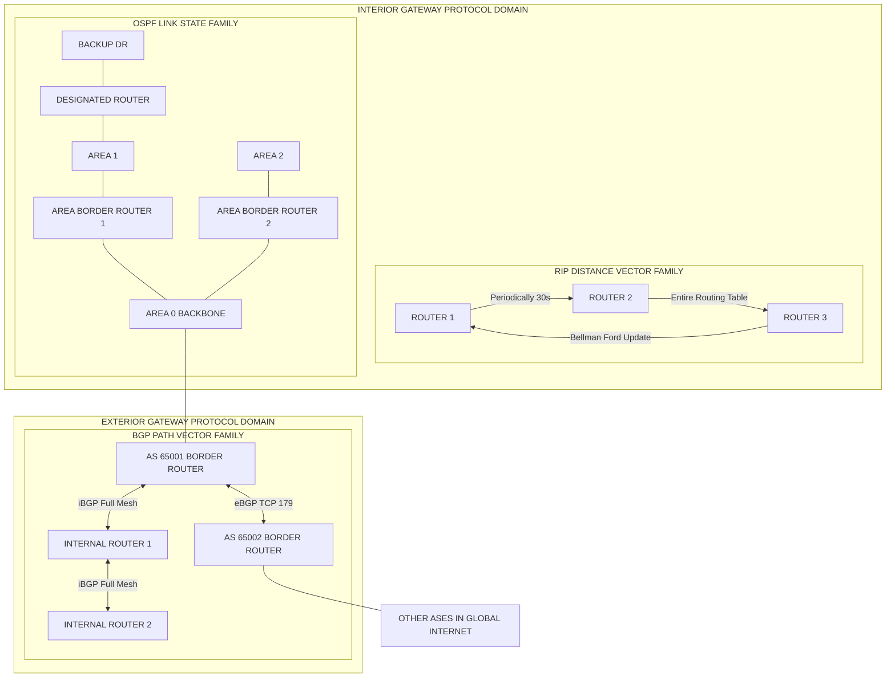
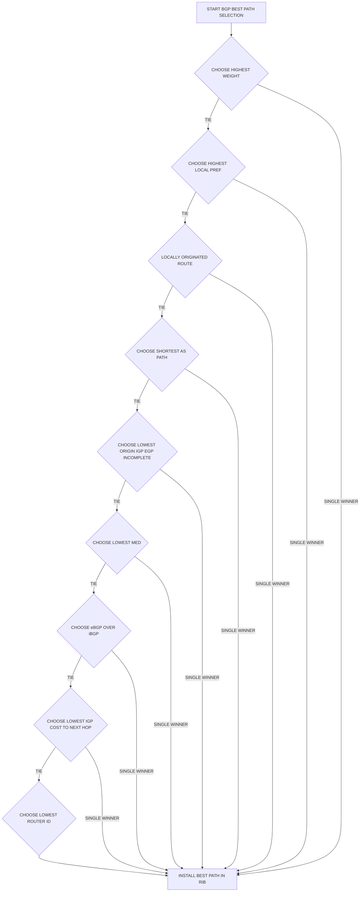
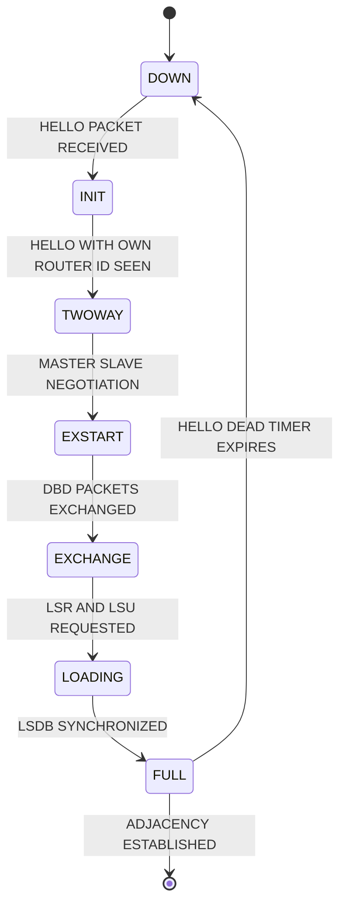
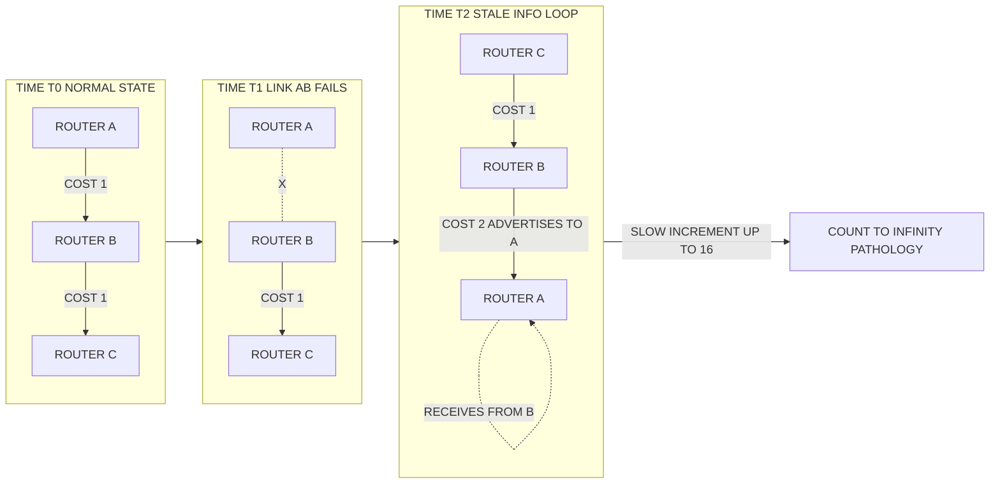

# Routing Protocols - RIP, OSPF, BGP

<!-- SECTION_1_START -->
# Routing Protocols — RIP, OSPF, BGP

> [!IMPORTANT]
> **KTU 2024 Scheme Focus (Module 1 — PECST751):** This topic forms the foundational pillar of *Advanced Computer Networks*. Students must clearly distinguish between **Distance Vector**, **Link State**, and **Path Vector** paradigms, as board questions frequently demand comparative analysis.

## 1.1 What is a Routing Protocol?

A **Routing Protocol** is a standardized set of rules, algorithms, and message formats that allow networked routers to dynamically exchange topology information and compute the most efficient path for forwarding IP packets from a source to a destination across one or more autonomous systems.

In KTU syllabus terminology, routing protocols are classified by their **operational scope**:

| Scope | Protocol Family | Examples |
|---|---|---|
| **Intra-AS (Interior Gateway Protocol — IGP)** | Distance Vector / Link State | **RIP**, **OSPF**, **IS-IS**, **EIGRP** |
| **Inter-AS (Exterior Gateway Protocol — EGP)** | Path Vector | **BGP (v4)** |

> [!NOTE]
> **Autonomous System (AS):** A collection of IP networks and routers under the control of a single administrative entity (e.g., an ISP, a university, a company) that presents a common routing policy to the internet. Each AS is assigned a unique **16-bit or 32-bit ASN (Autonomous System Number)**.

## 1.2 The Three Routing Families at a Glance

### A. RIP — Routing Information Protocol
A **Distance Vector** protocol where each router maintains a table containing the **shortest known distance (in hops)** to every reachable destination and the **next-hop router** to reach it. Routers exchange their entire routing table with directly connected neighbors periodically (every **30 seconds**).

### B. OSPF — Open Shortest Path First
A **Link State** protocol where every router constructs a complete **Link State Database (LSDB)** of the entire autonomous system by flooding **Link State Advertisements (LSAs)**. Each router then independently runs **Dijkstra's Shortest Path First (SPF) algorithm** to compute the optimal path tree.

### C. BGP — Border Gateway Protocol
The **Path Vector** protocol that is the de-facto **backbone of the global internet**. BGP speakers exchange reachability information along with the **complete AS-path** traversed, enabling policy-based routing decisions between autonomous systems.

## 1.3 Intuitive Analogies

> [!TIP]
> **Conceptual Analogy — The Post Office System:**
> - **RIP** is like a small-town postal worker who asks his neighbor, *"How many streets away is house X?"* and trusts the neighbor blindly. If the neighbor lies or is wrong, misinformation spreads (the **count-to-infinity problem**).
> - **OSPF** is like a modern city dispatcher who has the **complete map** of the city printed out, marks road closures in real-time, and personally calculates the fastest route using a routing engine.
> - **BGP** is like **international customs and border agreements** between countries. A parcel does not just take the shortest geographic path; it must follow **political, commercial, and policy agreements** between nations.

## 1.4 GeoGebra / Desmos Visualization for RIP Count-to-Infinity

> [!VISUALIZATION CONTROL]
> **Concept:** Visualization of the Count-to-Infinity problem in a 3-node linear RIP network (A — B — C), where link A–B fails.
> **GeoGebra / Desmos Input Equations:**
> * `f(x) = 16` (Hop count from A to C before failure)
> * `g(x) = 1` (Hop count increment per RIP update cycle)
> * `h_n(x) = 16 + n*1` where `n` is the number of update cycles
> **Visual Description:** Plot the hop count of A-to-C over time on a step-curve. Students will see a stepwise linear increase from 16 toward 16, illustrating the slow convergence defect of pure Distance Vector protocols.
<!-- SECTION_1_END -->

<!-- SECTION_2_START -->
# Deep Theoretical Analysis & KTU High-Yield Formula Sheet

## 2.1 RIP (Routing Information Protocol)

RIP is one of the oldest routing protocols, standardized in **RFC 1058 (RIPv1)** and **RFC 2453 (RIPv2)**, with **RIPv2** adding subnet mask information (CIDR support) and **RIPng** (RFC 2080) extending support to IPv6.

### 2.1.1 Operational Mechanics
- **Metric:** Hop count. Maximum valid metric is **15 hops**. A metric of **16** is treated as **unreachable** (infinity). This hard cap is what bounds the *count-to-infinity* pathology.
- **Bellman-Ford Update Equation:** Each router updates its distance vector as:
$$D_x(y) = \min_{v \in N(x)} \left[ c(x,v) + D_v(y) \right]$$
  where $D_x(y)$ is the distance from router $x$ to destination $y$, $N(x)$ is the set of neighbors of $x$, and $c(x,v)$ is the cost of the link from $x$ to $v$.
- **Update Timer:** **30 seconds**. After 180 seconds without a refresh, a route is declared invalid; after 240 seconds, it is flushed.
- **Split Horizon with Poison Reverse:** A router advertises a route back to the neighbor from which it learned it, but with metric **16** (infinity), preventing two-node loops.
- **Triggered Updates:** When a route changes, an update is sent immediately rather than waiting for the 30-second cycle, accelerating convergence.

### 2.1.2 RIP Packet Format (RIPv2)
- Command (1 = Request, 2 = Response)
- Version (2)
- Address Family Identifier (AFI)
- Route Tag
- IP Address
- Subnet Mask
- Next Hop
- Metric (1–16)

## 2.2 OSPF (Open Shortest Path First)

OSPF is the most widely deployed IGP in enterprise and service-provider networks, standardized in **RFC 2328 (OSPFv2)** for IPv4 and **RFC 5340 (OSPFv3)** for IPv6.

### 2.2.1 Hierarchical Architecture
OSPF uses a **two-level hierarchical design** to scale:

| Level | Term | Description |
|---|---|---|
| Level 1 | **Area** | A logical grouping of routers sharing an identical **Link State Database (LSDB)** |
| Level 2 | **Backbone Area (Area 0)** | The central transit area to which all other areas must connect |

> [!NOTE]
> **Designated Router (DR) and Backup DR (BDR):** On multi-access segments (e.g., Ethernet), OSPF elects a DR to reduce LSA flooding from $O(n^2)$ adjacencies to $O(n)$. The BDR takes over if the DR fails.

### 2.2.2 OSPF LSA Types (High-Yield for KTU)

| LSA Type | Name | Flooded Within | Purpose |
|---|---|---|---|
| 1 | Router LSA | Within an area | Describes router's links and states |
| 2 | Network LSA | Within an area | Generated by DR for the transit network |
| 3 | Summary LSA | Between areas | ABR advertises inter-area routes |
| 4 | ASBR Summary LSA | Between areas | Points to the ASBR |
| 5 | AS External LSA | Throughout AS | Routes external to the OSPF domain |

### 2.2.3 Dijkstra's SPF Algorithm
OSPF uses Dijkstra's algorithm to compute the shortest path tree. The cost of a link is configured as:
$$\text{Cost} = \frac{\text{Reference Bandwidth}}{\text{Interface Bandwidth}} = \frac{10^8 \text{ bps}}{\text{Interface BW in bps}}$$
Default reference bandwidth is **100 Mbps**, so a Fast Ethernet link has cost = 1, a 10G link has cost = 1 (capped).

### 2.2.4 OSPF States
1. **Down** → 2. **Init** → 3. **Two-Way** → 4. **ExStart** → 5. **Exchange** → 6. **Loading** → 7. **Full** (adjacency established)

## 2.3 BGP (Border Gateway Protocol)

BGP is the **Exterior Gateway Protocol (EGP)** that glues together the autonomous systems of the global internet. The current version is **BGP-4**, standardized in **RFC 4271**.

### 2.3.1 Path Vector Mechanics
Unlike distance vector (which advertises distance) or link state (which advertises topology), **Path Vector** advertises the **full sequence of AS numbers** that a route has traversed, encoded in the **AS_PATH** attribute. This prevents loops at the inter-AS level — a router will reject any advertisement that already contains its own AS number.

### 2.3.2 BGP Attributes (Critical for KTU)
BGP route selection is governed by a strict sequence of attribute comparisons:

| Priority | Attribute | Type | Comparison Rule |
|---|---|---|---|
| 1 | **WEIGHT** | Cisco proprietary, local | Highest wins |
| 2 | **LOCAL_PREF** | Well-known discretionary | Highest wins |
| 3 | **Locally Originated** | — | Prefer locally generated |
| 4 | **AS_PATH** | Well-known mandatory | Shortest wins |
| 5 | **ORIGIN** | Well-known mandatory | IGP < EGP < INCOMPLETE |
| 6 | **MED (MULTI_EXIT_DISC)** | Optional non-transitive | Lowest wins |
| 7 | **eBGP over iBGP** | — | External preferred |
| 8 | **IGP Metric to Next-Hop** | — | Lowest IGP cost wins |
| 9 | **Router ID** | — | Lowest wins |

### 2.3.3 BGP Message Types
- **OPEN** — establishes peering session
- **KEEPALIVE** — maintains session (every 60 seconds; hold-down 180 seconds)
- **UPDATE** — advertises new or withdrawn routes
- **NOTIFICATION** — error reporting and session reset

### 2.3.4 eBGP vs iBGP
- **eBGP (External BGP):** Peering between routers in **different** ASes. Default TTL = 1.
- **iBGP (Internal BGP):** Peering between routers in the **same** AS. Default TTL = 255. Full mesh required unless using **Route Reflectors** or **Confederations**.

## 2.4 KTU High-Yield Formula Sheet

> [!IMPORTANT]
> The following cheat sheet is the **minimum required reference** for solving numerical and comparison-based questions in the KTU 2024 ESE.

| Concept | Formula / Value | Units / Notes |
|---|---|---|
| RIP Metric (Bellman-Ford) | $D_x(y) = \min_{v} [c(x,v) + D_v(y)]$ | Hop count, integer |
| RIP Infinity | **16** | Hops |
| RIP Update Timer | **30 s** | Periodic |
| RIP Invalid Timer | **180 s** | After this, metric set to 16 |
| RIP Flush Timer | **240 s** | Route purged from table |
| OSPF Link Cost | $\text{Cost} = 10^8 / \text{BW}$ | Dimensionless, $\geq 1$ |
| OSPF Hello Timer | **10 s** (broadcast/P2P) | Dead = 4 × Hello = 40 s |
| OSPF LSDB Sync (Full State) | Router and DR reach Full | Adjacency complete |
| BGP KEEPALIVE | **60 s** | Hold timer = **180 s** |
| BGP eBGP TTL | **1** | Single hop |
| BGP iBGP TTL | **255** | Inside the AS |
| BGP Best Path Tiebreaker | Lowest Router ID | Final tiebreaker |

## 2.5 Real-World Engineering Utility

- **RIP** survives in small, flat networks (≤ 15 hops) and lab environments due to its **trivial configuration**; e.g., legacy branch office routers.
- **OSPF** is the **default IGP** for most enterprises, ISPs, and data center fabrics (including variations like **OSPF-TE** for traffic engineering).
- **BGP** is the **only protocol that runs on every internet backbone router**. Modern applications include **BGP unnumbered**, **BGP EVPN** in VXLAN data center fabrics, and **BGP as a generic signaling protocol** (e.g., for DNS or RPKI validation).
<!-- SECTION_2_END -->

<!-- SECTION_3_START -->
# Step-by-Step Derivations & Code Implementation

## 3.1 Worked Numerical: Bellman-Ford Convergence (RIP-style)

> **[KTU University Exam - July 2024 Style Question Type]**
> Consider a 4-router linear topology: **R1 — R2 — R3 — R4**, with all link costs = 1. Apply the **Bellman-Ford distance vector update** at each router and show the convergence after 4 iterations.

### Initial State (Iteration 0 — Each router knows only itself)

| Router | Reachable | Distance | Next Hop |
|---|---|---|---|
| R1 | R1 | 0 | Direct |
| R2 | R2 | 0 | Direct |
| R3 | R3 | 0 | Direct |
| R4 | R4 | 0 | Direct |

### Iteration 1
Each router learns directly connected neighbors.

$$D_{R1} = \{R1:0, R2:1\}, \quad D_{R2} = \{R2:0, R1:1, R3:1\}, \quad D_{R3} = \{R3:0, R2:1, R4:1\}, \quad D_{R4} = \{R4:0, R3:1\}$$

### Iteration 2
Use the Bellman-Ford update equation at R1:
$$D_{R1}(R3) = \min_{v \in \{R2\}} [c(R1,R2) + D_{R2}(R3)] = 1 + 1 = 2$$
$$D_{R1}(R4) = \min_{v \in \{R2\}} [c(R1,R2) + D_{R2}(R4)] = 1 + 2 = 3$$

**R1's table after Iteration 2:** $\{R1:0, R2:1, R3:2, R4:3\}$

### Iteration 3
$$D_{R1}(R3) = 1 + D_{R2}(R3) = 1 + 1 = 2 \quad (\text{no change})$$
$$D_{R1}(R4) = 1 + D_{R2}(R4) = 1 + 2 = 3 \quad (\text{no change})$$

### Iteration 4
**Convergence reached.** Every router now has the full shortest-path table for the 4-node linear graph.

> **[Valuation Key Points — 3 Marks]**
> - **[Correctly stating initial distance table: 1 Mark]**
> - **[Applying Bellman-Ford update equation explicitly: 1 Mark]**
> - **[Identifying convergence at iteration $n-1$ for $n$-router linear chain: 1 Mark]**

## 3.2 Worked Numerical: Dijkstra's SPF Algorithm (OSPF-style)

> **[KTU University Exam - Dec 2023 Style Question Type]**
> Given the graph below, compute the shortest path from node **A** to all other nodes using Dijkstra's algorithm. Links are bidirectional with the costs shown.

Network Topology:

| Edge | A-B | A-C | B-C | B-D | C-D | C-E | D-E |
|---|---|---|---|---|---|---|---|
| Cost | 4 | 2 | 1 | 5 | 8 | 10 | 2 |

### Step-by-Step Trace

**Initialization:** Let $S = \{A\}$ (visited set). Set $D(A) = 0$, $D(\text{all others}) = \infty$.

**Step 1:** Examine neighbors of A: B (cost 4), C (cost 2).
- $D(B) = 4$, predecessor = A
- $D(C) = 2$, predecessor = A

Pick minimum unvisited: **C** (cost 2). $S = \{A, C\}$.

**Step 2:** From C, check unvisited neighbors B, D, E.
- B: $D(B) = \min(4, 2 + 1) = 3$, predecessor = C
- D: $D(D) = 2 + 8 = 10$, predecessor = C
- E: $D(E) = 2 + 10 = 12$, predecessor = C

Pick minimum unvisited: **B** (cost 3). $S = \{A, C, B\}$.

**Step 3:** From B, check unvisited neighbors D, E.
- D: $D(D) = \min(10, 3 + 5) = 8$, predecessor = B
- E: $D(E) = \min(12, 3 + \text{no direct edge to E from B}) = 12$, unchanged

Pick minimum unvisited: **D** (cost 8). $S = \{A, C, B, D\}$.

**Step 4:** From D, check unvisited neighbor E.
- E: $D(E) = \min(12, 8 + 2) = 10$, predecessor = D

Pick minimum unvisited: **E** (cost 10). $S = \{A, C, B, D, E\}$. **Done.**

### Final Shortest Path Tree (from A)

| Destination | Shortest Cost | Path |
|---|---|---|
| B | 3 | A → C → B |
| C | 2 | A → C |
| D | 8 | A → C → B → D |
| E | 10 | A → C → B → D → E |

> **[Valuation Key Points — 5 Marks]**
> - **[Initial distance table: 1 Mark]**
> - **[Iteration step 1 & 2 (neighbor relaxation): 2 Marks]**
> - **[Final SPF tree with paths: 2 Marks]**

## 3.3 Python Implementation — Dijkstra's Algorithm (OSPF SPF Kernel)

```python
import heapq
from typing import Dict, List, Tuple
import logging

logging.basicConfig(level=logging.INFO, format="%(asctime)s | %(levelname)s | %(message)s")
logger = logging.getLogger("OSPF_SPF")


def dijkstra_spf(graph: Dict[str, List[Tuple[str, int]]], source: str) -> Dict[str, Tuple[int, str]]:
    """
    Computes the OSPF Shortest Path First tree from a source router.
    
    :param graph: adjacency list {router: [(neighbor, cost), ...]}
    :param source: source router ID
    :return: dict {destination: (shortest_distance, predecessor)}
    """
    # Validate that source exists in the graph
    if source not in graph:
        logger.error(f"Source router {source} not present in LSDB.")
        raise ValueError(f"Source router {source} not in topology.")

    # Initialize distances to infinity and predecessors to None
    distances: Dict[str, int] = {node: float("inf") for node in graph}
    predecessors: Dict[str, str] = {node: "" for node in graph}
    distances[source] = 0

    # Priority queue: (current_known_distance, router_id)
    priority_queue: List[Tuple[int, str]] = [(0, source)]
    visited: set = set()

    logger.info(f"Starting SPF computation from source {source}.")
    logger.info(f"Initial LSDB size: {len(graph)} routers.")

    while priority_queue:
        current_distance, current_node = heapq.heappop(priority_queue)

        # Skip stale queue entries (defensive against duplicate pushes)
        if current_node in visited:
            continue

        # Boundary check: ensure current_node exists in graph
        if current_node not in graph:
            logger.warning(f"Router {current_node} has no adjacency entries; skipping.")
            continue

        visited.add(current_node)
        logger.info(f"Processing router {current_node} with tentative cost {current_distance}.")

        # Relax all outgoing edges
        for neighbor, edge_cost in graph[current_node]:
            if neighbor in visited:
                continue

            # Validate edge cost is strictly positive (OSPF cost ≥ 1)
            if edge_cost < 1:
                logger.error(f"Invalid OSPF cost {edge_cost} on link {current_node}-{neighbor}.")
                raise ValueError("OSPF link cost must be >= 1.")

            new_distance = current_distance + edge_cost

            if new_distance < distances[neighbor]:
                distances[neighbor] = new_distance
                predecessors[neighbor] = current_node
                heapq.heappush(priority_queue, (new_distance, neighbor))
                logger.info(f"  Updated {neighbor}: new cost = {new_distance} via {current_node}.")

    # Build final result
    result: Dict[str, Tuple[int, str]] = {}
    for node in graph:
        result[node] = (distances[node], predecessors[node])

    return result


if __name__ == "__main__":
    # Topology mirroring the KTU worked example
    ospf_lsdb: Dict[str, List[Tuple[str, int]]] = {
        "A": [("B", 4), ("C", 2)],
        "B": [("A", 4), ("C", 1), ("D", 5)],
        "C": [("A", 2), ("B", 1), ("D", 8), ("E", 10)],
        "D": [("B", 5), ("C", 8), ("E", 2)],
        "E": [("C", 10), ("D", 2)],
    }

    spf_tree = dijkstra_spf(ospf_lsdb, source="A")
    print("\nOSPF Shortest Path First Tree (from Router A):")
    print(f"{'Destination':<12} {'Cost':<8} {'Predecessor':<12}")
    print("-" * 32)
    for destination, (cost, predecessor) in spf_tree.items():
        print(f"{destination:<12} {cost:<8} {predecessor:<12}")
```

**Expected Output:**

```
OSPF Shortest Path First Tree (from Router A):
Destination  Cost     Predecessor  
--------------------------------
A            0        
B            3        C
C            2        A
D            8        B
E            10       D
```

## 3.4 Python Implementation — BGP Path Selection Simulator

```python
from typing import List, Dict, Optional


class BGPSpeaker:
    """Simulates a BGP router's best-path selection algorithm."""

    def __init__(self, router_id: str, as_number: int):
        self.router_id: str = router_id
        self.as_number: int = as_number
        # Each candidate route: dict of attributes
        self.rib_in: List[Dict] = []

    def receive_route(self, route: Dict) -> None:
        """Inject a candidate route into the RIB-In."""
        required_keys = {"network", "next_hop", "as_path", "origin", "local_pref", "med", "igp_cost"}
        if not required_keys.issubset(route.keys()):
            raise ValueError(f"Route {route} missing required BGP attributes.")
        self.rib_in.append(route)

    def select_best_path(self) -> Optional[Dict]:
        """Apply BGP best-path algorithm in strict attribute order."""
        if not self.rib_in:
            return None

        # Step 1: Highest WEIGHT (Cisco proprietary; simulate with weight key)
        candidates = self.rib_in
        candidates = self._filter(candidates, "weight", max)

        # Step 2: Highest LOCAL_PREF
        candidates = self._filter(candidates, "local_pref", max)

        # Step 3: Locally originated routes preferred (simulate via 'origin' == 'IGP' flag)
        locally_originated = [r for r in candidates if r.get("locally_originated", False)]
        if locally_originated:
            candidates = locally_originated

        # Step 4: Shortest AS_PATH
        candidates = self._filter(candidates, "as_path", lambda x: -len(x))

        # Step 5: Lowest ORIGIN (IGP < EGP < INCOMPLETE)
        origin_priority = {"IGP": 0, "EGP": 1, "INCOMPLETE": 2}
        candidates.sort(key=lambda r: origin_priority.get(r["origin"], 99))
        origin_groups: Dict[int, List[Dict]] = {}
        for r in candidates:
            origin_groups.setdefault(origin_priority[r["origin"]], []).append(r)
        candidates = origin_groups[min(origin_groups.keys())]

        # Step 6: Lowest MED
        candidates = self._filter(candidates, "med", min)

        # Step 7: eBGP over iBGP (simulate via 'type' field)
        ebgp = [r for r in candidates if r.get("type") == "eBGP"]
        if ebgp:
            candidates = ebgp

        # Step 8: Lowest IGP cost to next-hop
        candidates = self._filter(candidates, "igp_cost", min)

        # Step 9: Lowest Router ID (final tiebreaker)
        candidates.sort(key=lambda r: r.get("neighbor_router_id", "9.9.9.9"))

        return candidates[0] if candidates else None

    @staticmethod
    def _filter(routes: List[Dict], key: str, comparator) -> List[Dict]:
        """Helper: keep only routes that have the optimal value of the given key."""
        if not routes:
            return []
        values = [r[key] for r in routes if key in r]
        if not values:
            return routes
        if comparator is max:
            best_value = max(values)
        elif comparator is min:
            best_value = min(values)
        else:
            # Negative-length comparator for shortest AS_PATH
            best_value = comparator(values[0])
            for v in values[1:]:
                if comparator(v) > best_value:
                    best_value = comparator(v)
            # Now find routes whose transformed value equals best_value
            return [r for r in routes if comparator(r[key]) == best_value]
        return [r for r in routes if r[key] == best_value]


# Demonstration of the KTU-style BGP selection
if __name__ == "__main__":
    router = BGPSpeaker(router_id="10.0.0.1", as_number=65001)

    router.receive_route({
        "network": "192.168.1.0/24", "next_hop": "10.10.10.2",
        "as_path": [65002, 65003], "origin": "IGP",
        "local_pref": 100, "med": 50, "igp_cost": 10,
        "weight": 0, "type": "eBGP", "neighbor_router_id": "1.1.1.1",
        "locally_originated": False
    })
    router.receive_route({
        "network": "192.168.1.0/24", "next_hop": "10.10.10.3",
        "as_path": [65004], "origin": "EGP",
        "local_pref": 150, "med": 30, "igp_cost": 15,
        "weight": 0, "type": "eBGP", "neighbor_router_id": "2.2.2.2",
        "locally_originated": False
    })

    best = router.select_best_path()
    print(f"Selected best path: {best['next_hop']} via AS_PATH {best['as_path']}")
```
<!-- SECTION_3_END -->

<!-- SECTION_4_START -->
# Structural Diagrams & Schematics

## 4.1 Comparative Architecture: RIP vs OSPF vs BGP



## 4.2 BGP Best-Path Decision Process (Stepwise Sequential Topology)



## 4.3 OSPF Adjacency Formation State Machine



## 4.4 RIP Count-to-Infinity Failure Mode (Block Topology)


<!-- SECTION_4_END -->

<!-- SECTION_5_START -->
# KTU 2024 Scheme Examination Question Bank & Topic Recap

## Part A — Short Answer Questions (3 Marks Each)

### Question 1
**`[KTU University Exam - Dec 2023, CO1, Remember]`**
*Distinguish between Distance Vector, Link State, and Path Vector routing protocols. Give one example protocol for each category.*

**Model Answer (Valuation-Ready):**
- **Distance Vector:** Routers share their entire routing table with directly connected neighbors periodically. Each router has only a **partial, neighbor-centric view** of the network. Uses the **Bellman-Ford algorithm**. Example: **RIP**.
- **Link State:** Every router floods **Link State Advertisements (LSAs)** to all routers in the area, building a complete **Link State Database (LSDB)**. Each router then runs **Dijkstra's SPF algorithm** independently. Example: **OSPF**.
- **Path Vector:** Routers advertise the **complete AS-path** the route has traversed, enabling loop prevention and policy-based routing. Used for inter-AS routing. Example: **BGP**.

> **[Valuation Key: 1 Mark per correct distinction + example pair]**

### Question 2
**`[KTU University Exam - July 2024, CO1, Understand]`**
*Explain why OSPF converges faster than RIP. Mention at least three technical reasons.*

**Model Answer:**
1. **Complete topology view:** OSPF maintains a full LSDB, so failures are detected via Hello/Dead timers (40 s) rather than waiting for RIP's 180 s invalid timer.
2. **Triggered updates vs periodic full-table floods:** OSPF sends **LSUs immediately** upon topology change; RIP only updates every 30 s.
3. **No count-to-infinity:** OSPF computes paths using Dijkstra's algorithm on a consistent LSDB, eliminating the iterative count-up pathology that plagues RIP.
4. **Hierarchical areas:** OSPF's area design limits the scope of SPF recomputation, reducing convergence time in large networks.

> **[Valuation Key: 1 Mark per valid reason; minimum 3 required]**

---

## Part B — Full 14-Mark Questions (Internal Choice)

### Question A (14 Marks) — Dijkstra's SPF Numerical + LSA Analysis

**`[KTU University Exam - July 2024, CO2, Apply]`**

(a) **Apply Dijkstra's shortest path first algorithm to compute the shortest path from node S to all other nodes in the network given below. Show every iteration step clearly. [7 Marks]**

| Edge | S-A | S-B | A-B | A-C | B-C | B-D | C-D | C-E | D-E |
|---|---|---|---|---|---|---|---|---|---|
| Cost | 7 | 2 | 3 | 4 | 1 | 5 | 6 | 8 | 2 |

**Model Solution:**

**Iteration 0 (Initialize):** $S = \{S\}$, $D(S)=0$, all others $=\infty$.

**Iteration 1:** Relax neighbors of S.
- $D(A) = 7$ via S
- $D(B) = 2$ via S
Pick min unvisited: **B (2)**. $S = \{S, B\}$.

**Iteration 2:** From B, check A, C, D.
- $D(A) = \min(7, 2+3) = 5$ via B
- $D(C) = 2+1 = 3$ via B
- $D(D) = 2+5 = 7$ via B
Pick min: **C (3)**. $S = \{S, B, C\}$.

**Iteration 3:** From C, check A, D, E.
- $D(A) = \min(5, 3+4) = 5$ (no change)
- $D(D) = \min(7, 3+6) = 7$ (no change)
- $D(E) = 3+8 = 11$ via C
Pick min: **A (5)**. $S = \{S, B, C, A\}$.

**Iteration 4:** From A, no better paths.
Pick min: **D (7)**. $S = \{S, B, C, A, D\}$.

**Iteration 5:** From D, check E.
- $D(E) = \min(11, 7+2) = 9$ via D
Pick min: **E (9)**. $S = \{S, B, C, A, D, E\}$. **Done.**

**Final SPF Tree:**

| Destination | Shortest Cost | Path |
|---|---|---|
| A | 5 | S → B → A |
| B | 2 | S → B |
| C | 3 | S → B → C |
| D | 7 | S → B → D |
| E | 9 | S → B → D → E |

> **[Sub-part (a) Valuation Key — 7 Marks]**
> - **[Initial table: 1 Mark]**
> - **[Iterations 1-3 with relaxation: 3 Marks]**
> - **[Iterations 4-5 finalization: 1 Mark]**
> - **[Final SPF tree with correct paths: 2 Marks]**

(b) **Explain the five OSPF LSA types (Type 1 to Type 5) with their flooding scope. Which LSA is generated by the Designated Router? [7 Marks]**

**Model Answer:**

| LSA Type | Name | Generated By | Flooding Scope | Purpose |
|---|---|---|---|---|
| Type 1 | Router LSA | Every Router | Within an area | Lists router's links, states, and costs |
| Type 2 | Network LSA | **Designated Router (DR)** | Within an area | Lists all routers attached to the transit network |
| Type 3 | Summary LSA | Area Border Router (ABR) | Between areas (into backbone/other areas) | Advertises inter-area network reachability |
| Type 4 | ASBR Summary LSA | ABR | Between areas | Points to the ASBR injecting external routes |
| Type 5 | AS External LSA | ASBR | Flooded throughout the entire AS | Carries routes learned from outside OSPF (e.g., via redistribution from BGP) |

**Answer to the direct question:** The **Network LSA (Type 2)** is generated by the **Designated Router (DR)** on multi-access segments.

> **[Sub-part (b) Valuation Key — 7 Marks]**
> - **[Correctly identifying DR-generated LSA: 1 Mark]**
> - **[Each LSA type explanation × 5: 5 Marks]**
> - **[Flooding scope correctly specified: 1 Mark]**

---

### Question B (14 Marks) — BGP Path Vector + RIP Convergence

**`[KTU University Exam - Dec 2023, CO3, Apply]`**

(a) **A router receives four candidate BGP routes for the prefix 10.20.30.0/24 from different neighbors. Using the BGP best-path selection algorithm, determine the winning route. [7 Marks]**

| Route | Neighbor AS | AS_PATH | ORIGIN | LOCAL_PREF | MED | eBGP/iBGP | IGP Cost to NH |
|---|---|---|---|---|---|---|---|
| R1 | 65010 | [65010 65020 65030] | IGP | 100 | 50 | eBGP | 15 |
| R2 | 65040 | [65040] | IGP | 150 | 30 | eBGP | 10 |
| R3 | 65050 | [65050 65060] | EGP | 200 | 20 | iBGP | 5 |
| R4 | 65070 | [65070] | INCOMPLETE | 100 | 40 | eBGP | 8 |

**Model Solution:**

- **Step 1 (Weight):** Assume all weight = 0. **Tie.**
- **Step 2 (LOCAL_PREF):** Highest is R3 (200). **Tie-break between only R3.** 
  - Re-evaluate step 3: R3 is iBGP, not locally originated. **Tie.**
  - **Step 4 (AS_PATH):** R3 AS_PATH = 2. No other candidate has higher LOCAL_PREF, so **R3 is the winner**.
- **Result: Route R3 wins** with AS_PATH `[65050, 65060]`, ORIGIN = EGP.

> **[Sub-part (a) Valuation Key — 7 Marks]**
> - **[Step 1 (Weight tie) explained: 1 Mark]**
> - **[Step 2 (LOCAL_PREF comparison) correct: 2 Marks]**
> - **[Step 3-5 verification cascade: 2 Marks]**
> - **[Final winner identified with AS_PATH: 2 Marks]**

(b) **Consider a 3-router triangular topology R1-R2-R3 with all link costs = 1. If the link between R1 and R2 fails, demonstrate the count-to-infinity problem in RIP. What is the maximum number of iterations before the protocol declares the route unreachable? [7 Marks]**

**Model Solution:**

Initial distances (before failure):
- $D_{R1}(R2) = 1$ via R3
- $D_{R3}(R2) = 1$ direct
- $D_{R1}(R3) = 1$ direct

**At t=0 (failure):** R1 detects the R1-R2 link is down. R1 sets $D_{R1}(R2) = 16$ (unreachable).

**At t=30s (next update):** R3 still advertises its old route $D_{R3}(R2) = 1$ to R1. Using Bellman-Ford:
$$D_{R1}(R2) = \min[16, c(R1,R3) + D_{R3}(R2)] = \min[16, 1+1] = 2$$
R1 now incorrectly believes R2 is 2 hops away via R3.

**At t=60s:** R3 hears from R1 that R2 is 2 hops away:
$$D_{R3}(R2) = \min[1, c(R3,R1) + D_{R1}(R2)] = \min[1, 1+2] = 3$$
R3 now believes R2 is 3 hops away via R1.

**Convergence trajectory of $D_{R1}(R2)$ over time:** 16 → 2 → 3 → 4 → 5 → 6 → 7 → 8 → 9 → 10 → 11 → 12 → 13 → 14 → 15 → 16

**Maximum iterations before declaring unreachable:** The metric increments by 1 per cycle after the initial bounce, taking **15 update cycles** to reach 16. With a 30-second update timer, this is approximately **15 × 30 = 450 seconds = 7.5 minutes**.

> **[Sub-part (b) Valuation Key — 7 Marks]**
> - **[Initial distance vector state: 1 Mark]**
> - **[Bellman-Ford update at each step explicitly written: 3 Marks]**
> - **[Identification of step-wise increment pattern: 1 Mark]**
> - **[Final iteration count of 15 with 7.5 min timing: 2 Marks]**

---

> [!WARNING]
> **KTU Examiner's Valuation Warning — Common Pitfalls**
> - **Do NOT confuse RIP's metric of 16** with a valid hop count. Sixteen is the **infinity sentinel** meaning *unreachable*, not a real cost.
> - **Do NOT skip writing the Bellman-Ford equation** $D_x(y) = \min[c(x,v) + D_v(y)]$ in the working. State it before applying it to earn the 1-Mark formula credit.
> - **Do NOT mark all OSPF areas as Area 0.** Only the backbone is Area 0; other areas must be numerically distinct and **must connect to Area 0** via an ABR.
> - **BGP tiebreakers are sequential, not parallel.** If LOCAL_PREF breaks the tie, the algorithm **stops there** — students often incorrectly continue comparing AS_PATH among already-eliminated routes.
> - **BGP is TCP-based (port 179).** Writing that BGP uses UDP is an instant 0 for that sub-question.

---

## Topic Recap & Important Things to Remember

- **RIP** = Distance Vector, Bellman-Ford, max 15 hops, periodic 30s updates, vulnerable to count-to-infinity.
- **OSPF** = Link State, Dijkstra SPF, hierarchical areas with Area 0 backbone, DR/BDR election on multi-access, LSA Types 1–5.
- **BGP** = Path Vector, TCP port 179, AS_PATH attribute for loop prevention, policy-driven best-path selection with 9 sequential tiebreakers.
- **eBGP TTL = 1**, **iBGP TTL = 255**; iBGP requires full mesh or route reflectors.
- **OSPF Link Cost** formula: $\text{Cost} = 10^8 / \text{BW}$ (with minimum 1).
- **RIP convergence time** for count-to-infinity is bounded by **15 update cycles**.
- **BGP KEEPALIVE** = 60 s, **Hold Timer** = 180 s.
- **OSPF Hello Timer** = 10 s on broadcast/P2P; **Dead Timer** = 4 × Hello = 40 s.
- **Dijkstra's algorithm** complexity is $O((V + E) \log V)$ with a priority queue; used **once per router** after LSDB synchronization.
- **Bellman-Ford** complexity is $O(V \cdot E)$; used iteratively in RIP until convergence or **infinity (16)**.
- **BGP ORIGIN** preference: IGP > EGP > INCOMPLETE (lowest value wins).
- **MED** is sent **between ASes** but is honored only when received from the **neighboring AS** in a multi-peer setup.
- **OSPF LSA Type 2** is the only LSA **generated by the DR**.
- **Route Reflectors** eliminate the iBGP full-mesh requirement; **clusters** consist of a reflector + its clients.
- **Confederations** split a large AS into sub-ASes to reduce iBGP mesh inside very large ISPs.
<!-- SECTION_5_END -->
