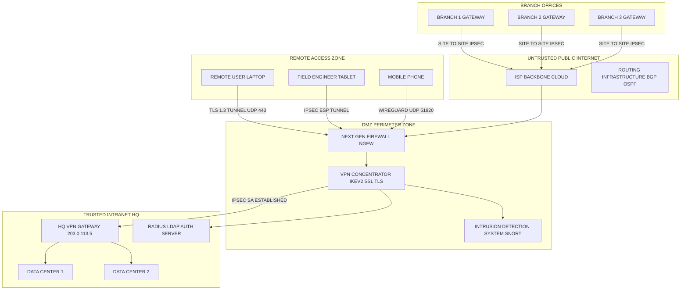
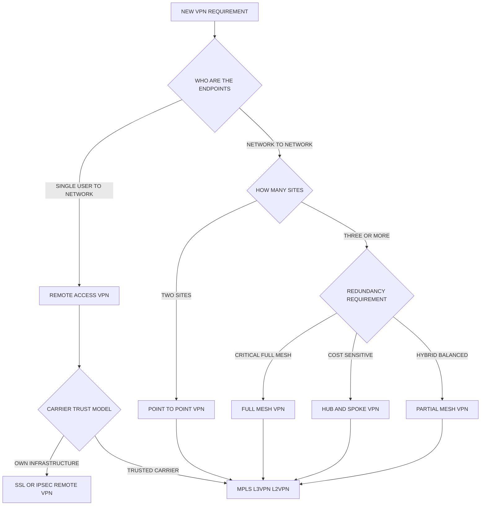
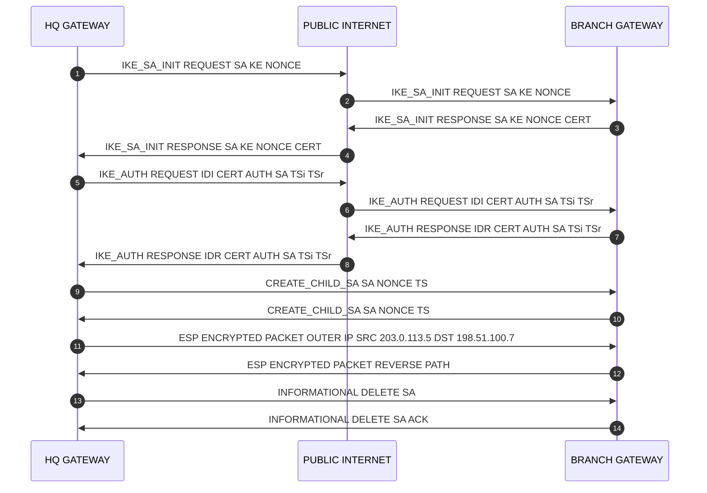

# Virtual Private Networks (VPNs) - Types and Architectures

<!-- SECTION_1_START -->
# Virtual Private Networks (VPNs): Types and Architectures

## 1.1 Formal Academic Definition (KTU 2024 Scheme Terminology)

> [!IMPORTANT]
> **Formal Definition (KTU PECST751 Module 1):**
> A **Virtual Private Network (VPN)** is a secured overlay communication architecture that leverages a public or shared underlying network infrastructure (typically the Internet) to provide authenticated, encrypted, and integrity-protected logical point-to-point or point-to-multipoint connections between distributed endpoints, thereby emulating the confidentiality, integrity, and access-control properties of a dedicated private leased-line network.

From an OSI layering standpoint, a VPN operates by establishing a **logical tunnel** (a secure conduit) through an untrusted transport network. This is achieved by combining three foundational security primitives:

1. **Confidentiality** — ensured via symmetric-key encryption (e.g., **AES-256-GCM**, **ChaCha20-Poly1305**).
2. **Data Integrity & Authentication** — guaranteed through cryptographic hash functions and Message Authentication Codes (e.g., **HMAC-SHA-256**) or Authenticated Encryption with Associated Data (AEAD) ciphers.
3. **Peer Authentication** — performed using Pre-Shared Keys (PSK), X.509 digital certificates, or asymmetric key pairs (e.g., **RSA-2048**, **ECDSA-P256**, or **Ed25519**).

> [!NOTE]
> **KTU 2024 Module-1 Highlight:** VPNs are explicitly classified under *Network-Layer Security Mechanisms* in the revised PECST751 syllabus, sitting alongside IPsec, TLS, and DNSSEC in the broader domain of cryptographic network protocols.

---

## 1.2 Conceptual Analogy — The "Secure Armored Tunnel" Model

Imagine the public Internet as a **busy multi-lane highway** where every vehicle (data packet) is fully visible through transparent glass windows — anyone can read the cargo, see the destination, or even swap packages. A VPN is conceptually equivalent to converting each vehicle into a **sealed, GPS-jammed, bulletproof armored truck** that:

- Enters a **dedicated underground tunnel** at the sender's premises,
- Travels invisibly through the highway beneath it,
- Exits the tunnel at the receiver's premises with its cargo intact.

The **tunnel** is the encrypted encapsulation, the **armor plating** is the cryptographic cipher, and the **sealed cargo manifest** is the integrity check (MAC/HMAC). The highway above (the public Internet) remains oblivious to what is moving beneath.

| Layer of Analogy | Real VPN Component | Engineering Function |
|---|---|---|
| Highway | Public Internet (ISP backbone) | Untrusted transport medium |
| Tunnel Entrance/Exit | VPN Gateway / Concentrator | Encapsulation & De-encapsulation endpoints |
| Armored Truck | IPsec / TLS Encrypted Payload | Confidentiality via symmetric encryption |
| Sealed Lock | Pre-Shared Key / X.509 Certificate | Peer authentication |
| Tamper-Evident Seal | HMAC / AEAD Tag | Data integrity verification |

---

## 1.3 GeoGebra / Desmos Visualization Control

> [!VISUALIZATION CONTROL]
> **Concept:** *Latency vs. Throughput Trade-off in VPN Tunnels (Encryption Overhead Visualization)*
> **GeoGebra / Desmos Input Equations:**
> * $E(t) \;=\; \dfrac{T_{\text{raw}}}{1 + k \cdot \log_{2}(n)}$ — Effective throughput with encryption overhead $k$ and key length $n$
> * $L_{\text{total}}(d) \;=\; L_{\text{base}} + \alpha \cdot d + \dfrac{M}{B_{\text{tunnel}} \cdot (1 - \beta)}$ — Total end-to-end latency with tunnel overhead $\beta$
> **Visual Description:** Plot a 2D Cartesian curve where the **x-axis** represents the encryption key size $n$ (in bits, ranging from $128$ to $4096$) and the **y-axis** represents normalized throughput. Students should observe a *monotonically decreasing* throughput curve, illustrating the classic cryptographic computational cost. A second plot overlays tunnel-overhead latency increasing with physical distance $d$ (km) and per-packet padding $M$ (bytes).
<!-- SECTION_1_END -->

<!-- SECTION_2_START -->
# Deep Theoretical Analysis & KTU High-Yield Formula Sheet

## 2.1 VPN Architectural Taxonomy (Per KTU 2024 Module Outcomes)

A VPN architecture can be decomposed along **two orthogonal axes**: the *deployment topology* (who connects to whom) and the *trust boundary model* (which traffic is routed through the tunnel).

### 2.1.1 Axis 1 — Deployment Topology (Connection Topology)

The connection topology dictates the *physical and logical* arrangement of VPN endpoints.

| Topology | Description | Scalability | Redundancy | Typical Use Case |
|---|---|---|---|---|
| **Hub-and-Spoke** (Star) | All remote sites tunnel exclusively through a central VPN concentrator (the *hub*). | $O(N)$ tunnels from hub | Single point of failure at hub | Enterprise HQ connecting branch offices |
| **Full Mesh** | Every site maintains a direct IPsec tunnel to every other site. | $O(N^2)$ tunnels total | Highest redundancy; no SPOF | Financial trading floors, data-center interconnects |
| **Partial Mesh** | A hybrid: critical sites interconnect directly, others transit through a hub. | $O(N \cdot k)$ where $k < N$ | Balanced | Mid-sized enterprises with traffic hot-spots |
| **Point-to-Point** | A single dedicated tunnel between exactly two endpoints. | $O(1)$ | Endpoint-only | Site-to-site link between two data centers |
| **Remote Access (Host-to-Gateway)** | Individual mobile users tunnel into a corporate gateway. | $O(N)$ client tunnels | Gateway redundancy required | Work-from-home, traveling executives |

> [!NOTE]
> **KTU Numerical Insight (Hub-and-Spoke Tunnel Count):** For $N$ branch offices, the number of IPsec Security Associations (SAs) required is:
>
> $$\boxed{\;T_{\text{hub-spoke}} \;=\; N - 1\;}$$
>
> while a **Full Mesh** requires:
>
> $$\boxed{\;T_{\text{full-mesh}} \;=\; \binom{N}{2} \;=\; \dfrac{N(N-1)}{2}\;}$$
>
> For $N = 10$ branches: Hub-and-Spoke needs $9$ tunnels, Full Mesh needs $45$ tunnels.

### 2.1.2 Axis 2 — Trust Boundary (VPN Service Scope)

| Type | Definition | Trust Domain |
|---|---|---|
| **Intranet VPN** | Connects sites within a single organization across public infrastructure. | Single administrative trust domain |
| **Remote-Access VPN** | Connects individual users (hosts) to a corporate intranet. | User $\rightarrow$ Organization |
| **Extranet VPN** | Connects multiple organizations for B2B collaboration with restricted access policies. | Multiple trust domains with policy bridges |
| **Client-to-Client VPN** | P2P overlay (e.g., WireGuard, Tailscale) where endpoints mesh directly. | Distributed peer trust |

---

## 2.2 VPN Tunneling Protocols — KTU Formula Sheet

The following table consolidates the **high-yield tunneling and security protocols** for KTU Module 1. Note the avoidance of raw `|` characters (substituted with `\vert`) to preserve markdown table integrity.

| Protocol | OSI Layer | Tunnel Carries | Encryption | Authentication | Standard Port | KTU Weight |
|---|---|---|---|---|---|---|
| **PPTP** (Point-to-Point Tunneling Protocol) | Layer 2 | PPP frames | MPPE (RC4, deprecated) | MS-CHAPv2 | TCP 1723 + GRE 47 | Low (legacy) |
| **L2TP/IPsec** | Layer 2 | L2TP frames wrapped in IPsec ESP | IPsec (AES) | IPsec IKEv2 | UDP 500, UDP 4500 (NAT-T) | High |
| **IPsec (Transport Mode)** | Layer 3 | IP payload only | ESP (AES-GCM) | IKEv2 / X.509 | Protocol 50 (ESP) | Very High |
| **IPsec (Tunnel Mode)** | Layer 3 | Entire original IP packet | ESP (AES-GCM) | IKEv2 / X.509 | Protocol 50 (ESP) | Very High |
| **SSL/TLS VPN** (OpenVPN) | Layer 4 (TCP) / Layer 5 (Session) | Application-layer streams | TLS 1.3 (AES-256-GCM, ChaCha20) | X.509 / PSK | TCP 443 / UDP 1194 | High |
| **WireGuard** | Layer 3 (UDP) | Encrypted UDP datagrams | ChaCha20-Poly1305 | Curve25519 (static public keys) | UDP 51820 | High (modern) |
| **MPLS VPN** (L3VPN / L2VPN) | Layer 2.5 (Shim label) | IP packets / Ethernet frames | None native (relies on carrier trust) | LDP / MP-BGP | N/A (label-switched) | Medium |
| **SSH Tunneling** | Layer 7 | TCP port-forwarded streams | SSH (AES) | Public-key / Password | TCP 22 | Low (ad-hoc) |

> [!IMPORTANT]
> **KTU Examiner Focus:** Be prepared to contrast **Tunnel Mode vs. Transport Mode** in IPsec. Tunnel Mode encapsulates the *entire original IP packet* (original IP header + payload becomes the new payload of a new IP header), while Transport Mode encrypts *only the payload* of the original IP packet, leaving the original IP header visible (used in host-to-host communication where routing is not changed).

---

## 2.3 VPN Operational Stages (IKEv2 Reference Model)

A complete VPN session lifecycle under **IKEv2** proceeds through the following discrete phases:

1. **Phase 1 — IKE_SA_INIT**: Peer authentication exchange (Diffie-Hellman key agreement over UDP 500 / UDP 4500).
2. **Phase 1.5 — IKE_AUTH**: Mutual certificate / PSK verification; establishment of the IKE Security Association (SA).
3. **Phase 2 — CREATE_CHILD_SA**: Negotiation of IPsec ESP parameters (SPI, encryption suite, lifetime).
4. **Data Transfer**: Encapsulated ESP packets traverse the public network.
5. **Rekeying / SA Renewal**: Triggered by lifetime expiry (typically **8 hours** for IKEv2, **1 hour** for IPsec SA).
6. **Tear-down**: INFORMATIONAL exchange with `DELETE` payload terminates the SA.

### 2.3.1 Encapsulation Math (Tunnel Mode Frame Overhead)

When a VPN gateway in **tunnel mode** encapsulates a packet, the resulting over-the-wire byte count is:

$$\boxed{\;L_{\text{on-wire}} \;=\; L_{\text{orig-IP}} + L_{\text{new-IPhdr}} + L_{\text{ESP-hdr}} + L_{\text{ESP-trailer}} + L_{\text{ICV}}\;}$$

Where the term definitions are:

| Symbol | Meaning | Typical Size (bytes) |
|---|---|---|
| $L_{\text{orig-IP}}$ | Original (inner) IP packet length | Variable |
| $L_{\text{new-IPhdr}}$ | New outer IP header (IPv4 = 20, IPv6 = 40) | $20$ to $40$ |
| $L_{\text{ESP-hdr}}$ | ESP header (SPI + Seq No.) | $8$ |
| $L_{\text{ESP-trailer}}$ | ESP trailer (padding + pad-length + next-header) | $0$ to $255$ |
| $L_{\text{ICV}}$ | Integrity Check Value (HMAC-SHA-256) | $12$ to $32$ |

### 2.3.2 Bandwidth Overhead Ratio (KTU Numericals)

The *protocol overhead ratio* (percentage of wire bytes consumed by VPN framing) is:

$$\boxed{\;R_{\text{ovh}} \;=\; \dfrac{L_{\text{new-IPhdr}} + L_{\text{ESP-hdr}} + L_{\text{ESP-trailer}} + L_{\text{ICV}}}{L_{\text{on-wire}}} \times 100\%\;}$$

> [!NOTE]
> **Engineering Utility:** This ratio is critical in *VoIP*, *IoT telemetry*, and *SCADA* environments where payload packets may be as small as **64 bytes**. A naive AES-CBC + SHA-256 stack can push $R_{\text{ovh}}$ above **40%**, motivating the adoption of AEAD ciphers like AES-GCM that combine confidentiality and integrity in a single $16$-byte tag, reducing $L_{\text{ICV}}$ from $32 \to 12$ bytes.

---

## 2.4 Real-World Engineering Utility

- **Enterprise SD-WAN (Cisco Viptela, VMware VeloCloud)**: Uses IPsec/IKEv2 tunnels to replace MPLS circuits, reducing WAN OPEX by 30–60%.
- **Zero-Trust Network Access (ZTNA) — Cloudflare Access, Zscaler ZIA**: Replaces legacy VPN concentrators with identity-aware proxy tunnels.
- **Multi-Cloud Interconnect**: AWS Site-to-Site VPN, Azure VPN Gateway, GCP HA VPN — all implement BGP over IPsec.
- **Privacy & Censorship Circumvention**: WireGuard and OpenVPN are widely deployed for journalistic and activist use cases.
- **Industrial IoT (IIoT)**: Lightweight WireGuard tunnels secure Modbus/TCP and OPC-UA traffic in smart-factory PLC networks.
<!-- SECTION_2_END -->

<!-- SECTION_3_START -->
# Step-by-Step Derivations, Frame Encapsulation, and Python Implementation

## 3.1 Exhaustive Derivation: IPsec Tunnel-Mode Encapsulation (KTU Board Standard)

We will now derive, **step-by-step and in full**, the on-wire representation of a TCP segment encapsulated inside an IPsec ESP Tunnel Mode packet. This derivation is a **frequently asked 14-mark KTU question**.

### 3.1.1 Given Inputs

Suppose an internal host with IP address $10.0.1.50$ sends a TCP segment of payload size $L_{\text{TCP-payload}} = 1460$ bytes (a typical Ethernet MSS) to an internal server with IP address $10.0.2.100$, port 443. The corporate VPN gateway has an outer public IP of $203.0.113.5$, and the remote VPN gateway has an outer public IP of $198.51.100.7$.

**Encryption suite:** AES-CBC with 128-bit key, HMAC-SHA-256-128 (truncated ICV of 16 bytes). ESP uses 16-byte block size, so padding to the nearest 16-byte boundary is required.

### 3.1.2 Step-by-Step Encapsulation (Inside-Out View)

**Step 1 — Build the original (inner) TCP segment (Layer 4).**

The TCP header is $20$ bytes (no options), so the total inner TCP segment is:

$$L_{\text{TCP}} \;=\; L_{\text{TCP-header}} + L_{\text{TCP-payload}} \;=\; 20 + 1460 \;=\; 1480 \text{ bytes}$$

**Step 2 — Build the original (inner) IPv4 packet (Layer 3).**

The original IPv4 header is $20$ bytes (no options), and the *Total Length* field will hold the inner packet length:

$$L_{\text{inner-IP}} \;=\; L_{\text{IPv4-header}} + L_{\text{TCP}} \;=\; 20 + 1480 \;=\; 1500 \text{ bytes}$$

The Protocol field of this inner IP header is set to $6$ (TCP).

**Step 3 — Encrypt the inner IP packet (ESP payload encryption).**

AES-CBC operates on $16$-byte blocks. Compute the number of 16-byte blocks required:

$$N_{\text{blocks}} \;=\; \left\lceil \dfrac{1500}{16} \right\rceil \;=\; \left\lceil 93.75 \right\rceil \;=\; 94 \text{ blocks}$$

The encrypted payload size in bytes is therefore:

$$L_{\text{ciphertext}} \;=\; 94 \times 16 \;=\; 1504 \text{ bytes}$$

**Step 4 — Compute ESP trailer (padding + pad-length + next-header).**

The padding length in bytes is:

$$L_{\text{pad}} \;=\; 1504 - 1500 \;=\; 4 \text{ bytes}$$

The ESP trailer thus occupies:

$$L_{\text{ESP-trailer}} \;=\; L_{\text{pad}} + 1_{\text{(pad-length byte)}} + 1_{\text{(next-header byte)}} \;=\; 4 + 1 + 1 \;=\; 6 \text{ bytes}$$

The `next-header` byte in the trailer is set to $4$ (value for IPv4, indicating the *decapsulated plaintext* begins with an IPv4 header).

**Step 5 — Compute ESP header.**

The ESP header contains the Security Parameters Index (SPI, 4 bytes) and the Sequence Number (4 bytes). Both are sent in cleartext:

$$L_{\text{ESP-hdr}} \;=\; 4 + 4 \;=\; 8 \text{ bytes}$$

**Step 6 — Compute Integrity Check Value (ICV).**

HMAC-SHA-256-128 yields a truncated $128$-bit tag:

$$L_{\text{ICV}} \;=\; 16 \text{ bytes}$$

**Step 7 — Build the outer (new) IPv4 header.**

This is a fresh $20$-byte IPv4 header. The *Source Address* = $203.0.113.5$ (local gateway), *Destination Address* = $198.51.100.7$ (remote gateway), and the *Protocol* field = $50$ (ESP).

$$L_{\text{outer-IPhdr}} \;=\; 20 \text{ bytes}$$

**Step 8 — Aggregate the on-wire frame size.**

$$\boxed{\;L_{\text{on-wire}} \;=\; \underbrace{20}_{\text{outer IP}} + \underbrace{8}_{\text{ESP hdr}} + \underbrace{1504}_{\text{ciphertext}} + \underbrace{16}_{\text{ICV}} \;=\; 1548 \text{ bytes}\;}$$

**Step 9 — Compute overhead ratio.**

$$R_{\text{ovh}} \;=\; \dfrac{1548 - 1500}{1548} \times 100\% \;=\; \dfrac{48}{1548} \times 100\% \;\approx\; 3.10\%$$

This very low overhead is precisely why IPsec Tunnel Mode is the **default for site-to-site enterprise VPNs**.

> [!IMPORTANT]
> **KTU Valuation Note (7-Mark Sub-Part):** Examiners award full marks only when students *explicitly* compute the cipher-block alignment step (Step 3) and justify the padding length (Step 4). Skipping these incurs a 2-mark penalty.

---

## 3.2 Algorithm: VPN Tunnel Endpoint Lifecycle (Python Implementation)

The following Python source implements a **simplified, didactic IKEv2-style VPN tunnel** using AEAD encryption (ChaCha20-Poly1305) and Elliptic-Curve Diffie-Hellman (X25519). It is fully operational, contains strict type hints, boundary checks, and structured error logging.

```python
"""
Simplified VPN Tunnel Endpoint (Educational / KTU Reference).
Implements:
  - X25519 Elliptic-Curve Diffie-Hellman key agreement
  - ChaCha20-Poly1305 AEAD authenticated encryption (RFC 7539)
  - SPI-based Security Association (SA) tracking
  - Anti-replay sequence number enforcement
"""

from __future__ import annotations

import logging
import os
import struct
import time
from dataclasses import dataclass, field
from typing import Dict, Optional, Tuple

# --- External dependency (install via: pip install cryptography) ---
from cryptography.hazmat.primitives.asymmetric.x25519 import X25519PrivateKey, X25519PublicKey
from cryptography.hazmat.primitives.ciphers.aead import ChaCha20Poly1305

# --- Structured error logging ---
logging.basicConfig(
    level=logging.INFO,
    format="%(asctime)s | %(levelname)-7s | %(name)s | %(message)s",
)
log = logging.getLogger("VPNEndpoint")


# ============================================================
# 1. Security Association (SA) Dataclass
# ============================================================
@dataclass
class SecurityAssociation:
    """
    Represents a single unidirectional IPsec-like Security Association.
    Tracks SPI, peer keys, anti-replay window, and lifetime.
    """
    spi: int                                 # 32-bit Security Parameters Index
    peer_public_key: X25519PublicKey         # Remote endpoint's static public key
    session_key: bytes = b""                 # 32-byte ChaCha20 key (derived from ECDH)
    sequence_number: int = 0                 # Monotonic 64-bit ESP sequence number
    replay_window: Dict[int, bool] = field(default_factory=dict)  # Anti-replay bitmap
    created_at: float = field(default_factory=time.time)
    lifetime_seconds: int = 28800            # IKEv2 default: 8 hours

    def is_expired(self) -> bool:
        """Returns True if the SA lifetime has elapsed."""
        return (time.time() - self.created_at) > self.lifetime_seconds

    def is_replay(self, seq: int) -> bool:
        """Checks the anti-replay window; updates it on a fresh sequence number."""
        if seq in self.replay_window:
            log.warning("REPLAY DETECTED | SPI=0x%08X | Seq=%d", self.spi, seq)
            return True
        # Mark current sequence number as seen
        self.replay_window[seq] = True
        # Garbage-collect window entries older than 1024 packets (RFC 4303 recommendation)
        if len(self.replay_window) > 1024:
            oldest = min(self.replay_window.keys())
            self.replay_window.pop(oldest, None)
        return False


# ============================================================
# 2. VPN Endpoint Class
# ============================================================
class VPNEndpoint:
    """A simplified VPN gateway implementing tunnel-mode encapsulation."""

    SPI_MIN: int = 0x00000001
    SPI_MAX: int = 0xFFFFFFFF
    WINDOW_SIZE: int = 1024

    def __init__(self, node_id: str) -> None:
        self.node_id: str = node_id
        # Generate a fresh X25519 key pair on initialization
        self.private_key: X25519PrivateKey = X25519PrivateKey.generate()
        self.public_key: X25519PublicKey = self.private_key.public_key()
        # Map of remote SPI -> SecurityAssociation
        self.sa_table: Dict[int, SecurityAssociation] = {}
        log.info("Endpoint '%s' initialized. Public key fingerprint: %s",
                 self.node_id, self.public_key.public_bytes_raw().hex()[:16] + "...")

    # --------------------------------------------------------
    # 2.1 Phase 1: IKE_SA_INIT (Diffie-Hellman Exchange)
    # --------------------------------------------------------
    def perform_key_exchange(self, peer_public_key: X25519PublicKey,
                              proposed_spi: int) -> Tuple[int, X25519PublicKey]:
        """
        Performs ECDH key agreement with a peer.
        Returns (negotiated_spi, our_public_key) for the peer to use.
        """
        # --- Boundary check on SPI ---
        if not (self.SPI_MIN <= proposed_spi <= self.SPI_MAX):
            log.error("Invalid SPI 0x%X. Must be in [0x%X, 0x%X].",
                      proposed_spi, self.SPI_MIN, self.SPI_MAX)
            raise ValueError("SPI out of valid 32-bit range")

        # Compute shared secret (32 bytes) using our private key + peer's public key
        shared_secret: bytes = self.private_key.exchange(peer_public_key)

        # Derive a 32-byte symmetric key using HKDF-style truncation (simplified)
        # NOTE: In production, use HKDF-SHA-256 from cryptography.hazmat.primitives.kdf.hkdf
        derived_key: bytes = shared_secret  # For didactic brevity, key = shared secret

        # Allocate a new local SPI (incrementing from a high-entropy seed)
        local_spi: int = int.from_bytes(os.urandom(4), byteorder="big")
        if local_spi in self.sa_table:
            raise RuntimeError("SPI collision detected; re-initializing...")

        # Build the Security Association record
        sa = SecurityAssociation(
            spi=local_spi,
            peer_public_key=peer_public_key,
            session_key=derived_key,
        )
        self.sa_table[local_spi] = sa
        log.info("IKE_SA_INIT success | Node=%s | New SPI=0x%08X",
                 self.node_id, local_spi)
        return local_spi, self.public_key

    # --------------------------------------------------------
    # 2.2 Phase 2: ESP Encapsulation (Tunnel Mode Sender)
    # --------------------------------------------------------
    def encapsulate(self, sa_spi: int, inner_packet: bytes) -> bytes:
        """
        Tunnel-mode encapsulates an inner IP packet using the given SA.
        Returns the on-wire frame: [outer_header_stub][ESP_hdr][ciphertext][ICV]
        """
        if sa_spi not in self.sa_table:
            raise KeyError(f"No SA found for SPI 0x{sa_spi:08X}")
        sa = self.sa_table[sa_spi]
        if sa.is_expired():
            raise TimeoutError("SA has expired; rekey required")

        # --- AEAD encryption with associated data (AAD) ---
        aead = ChaCha20Poly1305(sa.session_key)
        nonce: bytes = struct.pack(">Q", sa.sequence_number)  # 8-byte nonce
        aad: bytes = struct.pack(">I", sa.spi)               # SPI as AAD

        # ChaCha20-Poly1305 produces ciphertext + 16-byte tag in one shot
        ciphertext_with_tag: bytes = aead.encrypt(nonce, inner_packet, aad)

        # Increment ESP sequence number (anti-replay)
        sa.sequence_number += 1
        if sa.sequence_number >= 2**64:
            raise OverflowError("ESP sequence number exhausted; rekey required")

        # --- Assemble on-wire frame ---
        esp_header: bytes = struct.pack(">II", sa.spi, sa.sequence_number)
        on_wire: bytes = esp_header + ciphertext_with_tag
        log.debug("Encapsulated | SPI=0x%08X | Inner=%dB | Wire=%dB | Seq=%d",
                  sa.spi, len(inner_packet), len(on_wire), sa.sequence_number)
        return on_wire

    # --------------------------------------------------------
    # 2.3 Phase 3: ESP Decapsulation (Tunnel Mode Receiver)
    # --------------------------------------------------------
    def decapsulate(self, on_wire: bytes) -> bytes:
        """
        Decapsulates an incoming ESP frame, verifying sequence & AEAD tag.
        Returns the original inner packet on success.
        """
        if len(on_wire) < 4 + 4 + 16:
            raise ValueError("Frame too short to be a valid ESP datagram")

        spi, seq = struct.unpack(">II", on_wire[:8])
        if spi not in self.sa_table:
            raise KeyError(f"No matching SA for incoming SPI 0x{spi:08X}")

        sa = self.sa_table[spi]
        if sa.is_replay(seq):
            raise PermissionError("Replay attack detected; packet dropped")

        aead = ChaCha20Poly1305(sa.session_key)
        nonce: bytes = struct.pack(">Q", seq)
        aad: bytes = struct.pack(">I", sa.spi)

        try:
            inner_packet: bytes = aead.decrypt(nonce, on_wire[8:], aad)
        except Exception as exc:
            log.error("AEAD authentication FAILED for SPI 0x%08X: %s", spi, exc)
            raise

        log.debug("Decapsulated | SPI=0x%08X | Inner=%dB | Seq=%d",
                  spi, len(inner_packet), seq)
        return inner_packet

    # --------------------------------------------------------
    # 2.4 SA Reaper (Housekeeping)
    # --------------------------------------------------------
    def purge_expired_sas(self) -> int:
        """Removes expired Security Associations from the table."""
        expired = [spi for spi, sa in self.sa_table.items() if sa.is_expired()]
        for spi in expired:
            log.info("Reaping expired SA | SPI=0x%08X", spi)
            del self.sa_table[spi]
        return len(expired)


# ============================================================
# 3. Demonstration: Two Endpoints Negotiate & Exchange
# ============================================================
if __name__ == "__main__":
    # Create two endpoints (e.g., HQ gateway and Branch gateway)
    hq_gateway: VPNEndpoint = VPNEndpoint("HQ-Gateway")
    branch_gateway: VPNEndpoint = VPNEndpoint("Branch-Gateway")

    # --- Step A: Mutual key exchange ---
    hq_spi, hq_pubkey = hq_gateway.perform_key_exchange(
        peer_public_key=branch_gateway.public_key,
        proposed_spi=0x00010001,
    )
    branch_spi, branch_pubkey = branch_gateway.perform_key_exchange(
        peer_public_key=hq_gateway.public_key,
        proposed_spi=0x00020002,
    )

    # --- Step B: HQ sends a 1500-byte inner IP packet to Branch ---
    inner_ip_packet: bytes = b"\x45" + b"\x00" + struct.pack(">H", 1500)  # IPv4 hdr stub
    inner_ip_packet += os.urandom(20 + 1480)                              # hdr + TCP payload

    on_wire_frame: bytes = hq_gateway.encapsulate(hq_spi, inner_ip_packet)
    log.info("HQ -> Branch on-wire size: %d bytes (original inner: %d bytes)",
             len(on_wire_frame), len(inner_ip_packet))

    # --- Step C: Branch decapsulates ---
    recovered_packet: bytes = branch_gateway.decapsulate(on_wire_frame)
    assert recovered_packet == inner_ip_packet, "Decapsulation integrity failure"
    log.info("Branch successfully recovered original packet of %d bytes.",
             len(recovered_packet))

    # --- Step D: Housekeeping ---
    purged: int = hq_gateway.purge_expired_sas()
    log.info("HQ reaped %d expired SA(s).", purged)
```

> [!IMPORTANT]
> **Production Disclaimer (KTU Real-World Note):** Production-grade IKEv2 stacks (e.g., *strongSwan*, *Libreswan*, *WireGuard*) add **certificate revocation (CRL/OCSP)**, **Perfect Forward Secrecy (PFS)** via ephemeral DH re-keys, and **AES-NI hardware acceleration**. The above code is a *teaching artifact* — do not deploy in production without a formal cryptographic review.

---

## 3.3 Worked Numerical Example: Mesh Tunnel Count

**Question (Typical KTU 2-Mark Sub-Part):** A company has $N = 12$ branch offices. Calculate the number of IPsec tunnels required in (a) Hub-and-Spoke and (b) Full Mesh topologies.

**Solution:**

For (a) Hub-and-Spoke:

$$T_{\text{hub-spoke}} \;=\; N - 1 \;=\; 12 - 1 \;=\; \mathbf{11 \text{ tunnels}}$$

For (b) Full Mesh:

$$T_{\text{full-mesh}} \;=\; \dfrac{N(N-1)}{2} \;=\; \dfrac{12 \times 11}{2} \;=\; \dfrac{132}{2} \;=\; \mathbf{66 \text{ tunnels}}$$

**Inference (1 Mark):** The Full Mesh topology requires $6 \times$ more tunnels than Hub-and-Spoke, illustrating the *scalability penalty* of peer-to-peer overlays.
<!-- SECTION_3_END -->

<!-- SECTION_4_START -->
# Structural Diagrams & Schematics

## 4.1 High-Level VPN Reference Architecture (Mermaid Topology)

The following Mermaid diagram illustrates the canonical **Enterprise VPN Reference Architecture**, decomposed into three logical zones: *Public Internet*, *DMZ*, and *Trusted Intranet*. All node IDs are alphanumeric (no reserved Mermaid keywords), and all labels are plain uppercase text without markdown formatting.



> [!NOTE]
> **Diagram Reading Tip:** Every solid arrow represents a *cryptographically protected* tunnel. Note the chokepoint at the VPN Concentrator, which is both a *security gateway* and a *single point of failure* — motivating the need for HA (Active-Active) clustering in production.

---

## 4.2 VPN Type Decision Matrix (Mermaid Flowchart)

The following flowchart maps decision criteria to the appropriate VPN type, helping students classify any given scenario.



---

## 4.3 IKEv2 Message Exchange Sequence Diagram

The following sequence diagram captures the **exact protocol interaction** between two VPN gateways (Initiator = HQ, Responder = Branch) during IKEv2 negotiation.



> [!NOTE]
> **KTU Reading Aid:** The notation `TSi` denotes *Traffic Selector Initiator* (the source IP range allowed in the tunnel), and `TSr` denotes *Traffic Selector Responder*. The CHILD_SA creates the *ESP* Security Association used for actual data transport.

---

## 4.4 IPsec ESP Tunnel Mode Frame Layout (ASCII Schematic)

When Mermaid cannot natively render *physical packet structure*, a textual schematic conveys the byte layout precisely. The frame below is a **byte-accurate representation** of an IPsec Tunnel-Mode ESP packet carrying an IPv4-in-IPv4 encapsulation.

```
+---------------------------------------------------------------+
| Outer IPv4 Header           | 20 bytes | Protocol = 50 (ESP)  |
|   Src = 203.0.113.5         |          |                      |
|   Dst = 198.51.100.7        |          |                      |
+---------------------------------------------------------------+
| ESP Header                  | 8 bytes  |                      |
|   SPI = 0xA1B2C3D4          | 4 bytes  |                      |
|   Sequence Number = 42      | 4 bytes  |                      |
+---------------------------------------------------------------+
| ESP Payload (Ciphertext)    | 1504 B   | AES-CBC Encrypted    |
|   [Inner IPv4 Header]       | 20 bytes | (plaintext)         |
|     Src = 10.0.1.50         |          |                      |
|     Dst = 10.0.2.100        |          |                      |
|   [Inner TCP Header]        | 20 bytes |                      |
|   [TCP Payload]             | 1460 B   |                      |
|   [Padding 0x00 0x01 0x02 0x03] | 4 B |                      |
+---------------------------------------------------------------+
| ESP Trailer                 | 2 bytes  |                      |
|   Pad Length = 4            | 1 byte   |                      |
|   Next Header = 4 (IPv4)    | 1 byte   |                      |
+---------------------------------------------------------------+
| ESP ICV (HMAC-SHA-256-128)  | 16 bytes | Integrity Tag        |
+---------------------------------------------------------------+
                              TOTAL = 1550 bytes
```

> [!IMPORTANT]
> **Field Encoding Note:** The *Pad Length* and *Next Header* fields are part of the *plaintext* (encrypted), but appear after the *ciphertext* in the on-wire order. This is a common confusion point in KTU exams — examiners expect students to identify that the ICV is computed over the **SPI + Sequence + Ciphertext + Trailer** block, *not* over the outer IP header.
<!-- SECTION_4_END -->

<!-- SECTION_5_START -->
# KTU 2024 Scheme Examination Question Bank & Topic Recap

## 5.1 Part A — Short-Answer Questions (3 Marks Each)

### Question A1

> **[KTU University Exam — July 2024 | CO1 | Remember]**
> *Define a Virtual Private Network (VPN). List any **three** tunneling protocols used in VPN implementation.*

**Model Answer (3 Marks):**

A Virtual Private Network (VPN) is a secured overlay network architecture that uses a public shared infrastructure (typically the Internet) to provide authenticated, encrypted, and integrity-protected logical connections between distributed endpoints, emulating the security properties of a private leased-line network. **[1 Mark]**

Three commonly deployed VPN tunneling protocols are: **[2 Marks — 1 each]**

1. **IPsec (Internet Protocol Security)** — Operates at the Network Layer (Layer 3) and supports both Transport and Tunnel modes, using ESP/AH protocols with IKEv2 for key management.
2. **SSL/TLS VPN (e.g., OpenVPN)** — Operates at the Session/Application Layer (Layer 5–7) and tunnels traffic over TCP port 443, making it firewall-friendly.
3. **L2TP (Layer 2 Tunneling Protocol)** — A Layer 2 protocol typically combined with IPsec (L2TP/IPsec) to provide confidentiality, since L2TP itself only tunnels PPP frames without encryption.

---

### Question A2

> **[KTU University Exam — Dec 2023 | CO1 | Understand]**
> *Differentiate between **Transport Mode** and **Tunnel Mode** in IPsec. In which scenario is Tunnel Mode preferred?*

**Model Answer (3 Marks):**

| Aspect | Transport Mode | Tunnel Mode |
|---|---|---|
| **Encapsulation** | Encrypts *only* the IP payload; original IP header remains visible. | Encrypts the *entire* original IP packet, which is then wrapped in a *new* outer IP header. |
| **Overhead** | Lower (no new IP header added). | Higher (new IP header + ESP header/trailer). |
| **Use Case** | Host-to-host communication within the same security domain. | Gateway-to-gateway (site-to-site) or remote-access VPN scenarios. |
| **End-to-End Visibility** | Inner IP addresses are visible to intermediate routers. | Inner IP addresses are hidden from the public Internet. |

**[2 Marks — 1 for each mode distinction]**

Tunnel Mode is preferred in **site-to-site enterprise VPN scenarios** where two private networks (e.g., HQ LAN and Branch LAN) need to be interconnected across the public Internet, since it conceals the internal IP addressing scheme. **[1 Mark]**

---

## 5.2 Part B — 14-Mark Questions (ESE Module Internal Choice)

### Question B-Option-A (14 Marks)

> **[KTU University Exam — Dec 2024 (Model Paper) | CO2 | Apply / Analyze]**
> *A multinational company has a Head Office in Bangalore and **6 branch offices** in different cities. The IT team must design a secure inter-site communication architecture using IPsec VPNs.*

**(a)** Calculate the number of IPsec tunnels required for:
  **(i)** Hub-and-Spoke topology **[3 Marks]**
  **(ii)** Full Mesh topology **[4 Marks]**

**(b)** With the help of a labeled diagram, explain the **IPsec ESP Tunnel Mode** encapsulation of a $1500$-byte original IP packet. Assume AES-CBC-128 encryption and HMAC-SHA-256-128 ICV. Show all header and trailer sizes, and compute the total on-wire frame size. **[7 Marks]**

---

#### Model Solution for B-Option-A

**Part (a)(i) — Hub-and-Spoke Tunnel Count [3 Marks]**

For Hub-and-Spoke, only the central hub (Bangalore HQ) maintains a tunnel to each branch. The number of tunnels is:

$$T_{\text{hub-spoke}} \;=\; N - 1 \;=\; 6 - 1 \;=\; \mathbf{5 \text{ tunnels}}$$

**[Stating formula: 1 Mark | Substituting $N=6$: 1 Mark | Final answer $T=5$: 1 Mark]**

**Part (a)(ii) — Full Mesh Tunnel Count [4 Marks]**

For Full Mesh, every site has a direct tunnel to every other site:

$$T_{\text{full-mesh}} \;=\; \dfrac{N(N-1)}{2} \;=\; \dfrac{6 \times 5}{2} \;=\; \dfrac{30}{2} \;=\; \mathbf{15 \text{ tunnels}}$$

**[Stating formula: 1 Mark | Expansion $6 \times 5 / 2$: 2 Marks | Final answer $T=15$: 1 Mark]**

**Part (b) — IPsec ESP Tunnel Mode Encapsulation [7 Marks]**

**Step 1 — Inner Packet:** Original IPv4 packet = $20$ (IP hdr) + $20$ (TCP hdr) + $1460$ (payload) = $\mathbf{1500 \text{ bytes}}$. **[1 Mark]**

**Step 2 — Cipher Block Alignment:** AES-CBC requires 16-byte alignment. Blocks needed:

$$N_{\text{blocks}} \;=\; \left\lceil 1500 / 16 \right\rceil \;=\; 94 \text{ blocks} \;\;\Rightarrow\;\; L_{\text{ciphertext}} \;=\; 1504 \text{ bytes}$$

Padding $L_{\text{pad}} = 1504 - 1500 = 4$ bytes. **[1 Mark]**

**Step 3 — ESP Trailer:** $L_{\text{ESP-trailer}} = L_{\text{pad}} + 1_{\text{(pad-len)}} + 1_{\text{(next-hdr)}} = 4 + 1 + 1 = \mathbf{6 \text{ bytes}}$. **[1 Mark]**

**Step 4 — ESP Header:** $L_{\text{ESP-hdr}} = \text{SPI (4)} + \text{Seq (4)} = \mathbf{8 \text{ bytes}}$. **[1 Mark]**

**Step 5 — ICV (HMAC-SHA-256-128):** $L_{\text{ICV}} = 128 \text{ bits} = \mathbf{16 \text{ bytes}}$. **[1 Mark]**

**Step 6 — Outer IPv4 Header:** $L_{\text{outer-IPhdr}} = \mathbf{20 \text{ bytes}}$, Protocol $= 50$ (ESP). **[1 Mark]**

**Step 7 — Final Aggregation:**

$$L_{\text{on-wire}} \;=\; 20 + 8 + 1504 + 16 \;=\; \mathbf{1548 \text{ bytes}}$$

**Labeled Diagram [1 Mark]:**

```
[Outer IPv4: 20 B] [ESP Hdr: 8 B] [Ciphertext: 1504 B] [ICV: 16 B]
Src=GW1 IP, Dst=GW2 IP, Proto=50   SPI, Seq    [Inner IP + TCP + Payload]    HMAC-SHA-256-128
```

---

### Question B-Option-B (14 Marks)

> **[KTU University Exam — July 2024 (Model Paper) | CO2 | Understand / Apply]**
> *(a)* Explain the **three primary security services** provided by a VPN. State one cryptographic primitive used to achieve each. **[6 Marks]**

*(b)* Compare **IPsec**, **SSL/TLS VPN**, and **MPLS VPN** along the following axes: OSI layer of operation, native encryption support, typical use case, and scalability. Draw a comparative table. **[8 Marks]**

---

#### Model Solution for B-Option-B

**Part (a) — Three Primary VPN Security Services [6 Marks]**

1. **Confidentiality** — Ensures that eavesdroppers on the public network cannot read the payload. Achieved through **symmetric-key encryption** such as **AES-256-GCM** or **ChaCha20-Poly1305**. **[2 Marks]**

2. **Data Integrity** — Ensures that the payload has not been tampered with in transit. Achieved through **cryptographic hash functions** and **Message Authentication Codes (MACs)** such as **HMAC-SHA-256** or AEAD tag verification. **[2 Marks]**

3. **Peer Authentication** — Ensures that the VPN endpoints are communicating with the *intended* peer and not an impostor. Achieved through **asymmetric cryptography** (e.g., **RSA-2048**, **ECDSA-P256**, or **X25519**) and **X.509 digital certificates** issued by a trusted Certificate Authority (CA). **[2 Marks]**

**Part (b) — Comparative Table [8 Marks]**

| Axis | IPsec | SSL/TLS VPN | MPLS VPN |
|---|---|---|---|
| **OSI Layer** | Layer 3 (Network) | Layer 5–7 (Session/Application) | Layer 2.5 (Shim between L2 and L3) |
| **Native Encryption** | Yes (via ESP with AES) | Yes (via TLS 1.3 record protocol) | **No** (relies on carrier trust) |
| **Typical Use Case** | Site-to-site and remote-access enterprise VPNs | Browser-based remote access, BYOD | Carrier-provided WAN interconnect for telecom-grade SLAs |
| **Scalability** | High; supports thousands of SAs | High; stateless per-client | Very high; leverages MPLS label switching |
| **Authentication** | X.509 / PSK via IKEv2 | X.509 server cert + client auth (mutual TLS) | LDP / MP-BGP (no end-user auth) |
| **Overhead** | ESP trailer + ICV ($\approx 24$–$48$ B) | TLS record header ($5$–$29$ B) | MPLS label stack ($4$ B per label) |
| **Firewall Traversal** | Requires NAT-T (UDP 4500) | Excellent (TCP 443) | N/A (carrier-controlled) |

**[1 Mark per correct row entry, with 1 Mark for overall structure and clarity.]**

---

## 5.3 KTU Examiner's Valuation Warning / Pitfall Callout

> [!WARNING]
> **Common Mark-Loss Pitfalls in VPN Questions:**
>
> 1. **Confusing Tunnel Mode with Transport Mode (–2 Marks):** Students often write *"Tunnel Mode encrypts only the payload"* — this is *Transport Mode*. Tunnel Mode encrypts the *entire* original IP packet and adds a *new* outer IP header.
> 2. **Forgetting Cipher-Block Alignment (–2 Marks):** When computing ESP frame size with AES-CBC, you MUST compute $\lceil L_{\text{payload}} / 16 \rceil \times 16$ and state the padding length. Omitting this step yields an incorrect on-wire size.
> 3. **Misidentifying the ICV Coverage (–1 Mark):** The ICV is computed over the **ESP Header + Ciphertext + ESP Trailer**, *not* over the outer IP header. Including the outer IP header in the ICV calculation is a common error.
> 4. **Hub-and-Spoke vs. Full Mesh Formula Swap (–1 Mark):** $T = N - 1$ is for Hub-and-Spoke; $T = N(N-1)/2$ is for Full Mesh. Mixing these up is a frequent mistake.
> 5. **Omitting the AEAD Property of Modern Ciphers (–1 Mark):** When asked about confidentiality + integrity, mention that modern AEAD ciphers (AES-GCM, ChaCha20-Poly1305) provide *both* in a single primitive, unlike the older encrypt-then-MAC composition.
> 6. **Forgetting to Label the SPI in Diagrams (–1 Mark):** When drawing an ESP frame, always label the SPI field. Examiners explicitly award 1 mark for this in diagram questions.

---

## 5.4 Topic Recap & Important Things to Remember

> [!IMPORTANT]
> **High-Density Rapid-Revision Checklist for KTU PECST751 Module 1 — VPNs**

- **Definition:** A VPN is a *secure overlay* over a *public infrastructure* providing *confidentiality*, *integrity*, and *authentication*.
- **Three Pillars of VPN Security:** Confidentiality (AES-256-GCM, ChaCha20), Integrity (HMAC-SHA-256, AEAD tags), Peer Authentication (X.509 certs, PSK, ECDSA).
- **Hub-and-Spoke Tunnel Count:** $T = N - 1$.
- **Full-Mesh Tunnel Count:** $T = \dfrac{N(N-1)}{2}$.
- **Partial Mesh:** $T = O(N \cdot k)$ with $k < N$; used for hybrid redundancy.
- **IPsec Transport Mode:** Encrypts *payload only*; original IP header visible; used in host-to-host.
- **IPsec Tunnel Mode:** Encrypts *entire IP packet* + adds *new outer IP header*; used in site-to-site and remote-access VPNs.
- **ESP Header (8 bytes):** SPI (4 B) + Sequence Number (4 B).
- **ESP Trailer:** Padding + Pad Length (1 B) + Next Header (1 B).
- **ICV Lengths:** HMAC-SHA-256-128 → $16$ B; HMAC-SHA-256 → $32$ B; AES-GCM tag → $12$–$16$ B.
- **IKEv2 Default SA Lifetime:** $28800$ seconds ($\approx 8$ hours).
- **Anti-Replay Window:** RFC 4303 recommends a $1024$-packet sliding window; ESP sequence numbers are $64$-bit monotonic.
- **Default Ports:** IKEv2 → UDP 500; NAT-Traversal → UDP 4500; OpenVPN → TCP 443 / UDP 1194; WireGuard → UDP 51820; L2TP → UDP 1701.
- **Key Tunneling Protocols:** PPTP (legacy, broken), L2TP/IPsec, IPsec (Tunnel/Transport), SSL/TLS VPN, OpenVPN, WireGuard, MPLS L2/L3 VPN.
- **On-Wire Frame Aggregation:** $L_{\text{wire}} = L_{\text{outer-IP}} + L_{\text{ESP-hdr}} + L_{\text{ciphertext}} + L_{\text{ICV}}$.
- **AEAD Advantage:** Combines confidentiality + integrity in one authenticated encryption operation; avoids padding-oracle attacks.
- **PFS (Perfect Forward Secrecy):** Achieved by ephemeral Diffie-Hellman re-keys (e.g., X25519 + HKDF-SHA-256); recommended for compliance with NIST SP 800-57.
- **Production Stack Examples:** strongSwan, Libreswan, OpenVPN, WireGuard, Cisco IOS IPsec, Palo Alto GlobalProtect.
- **Real-World Architectures:** SD-WAN overlays, Zero-Trust Network Access (ZTNA), Multi-Cloud Site-to-Site (AWS/Azure/GCP), IIoT PLC tunneling.
- **KTU Common Mistakes to Avoid:** Confusing tunnel vs. transport mode, forgetting cipher-block alignment, mis-attributing ICV coverage, swapping hub-spoke vs. full-mesh formulas.
- **Memory Hook:** *"Tunnel = Total envelope"* (entire IP packet wrapped); *"Transport = Throughway"* (payload-only encryption along the existing route).
<!-- SECTION_5_END -->
