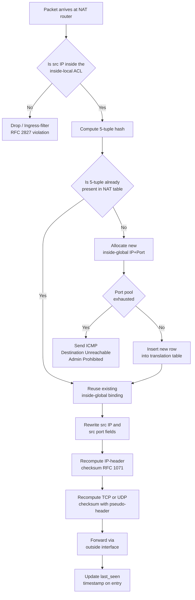
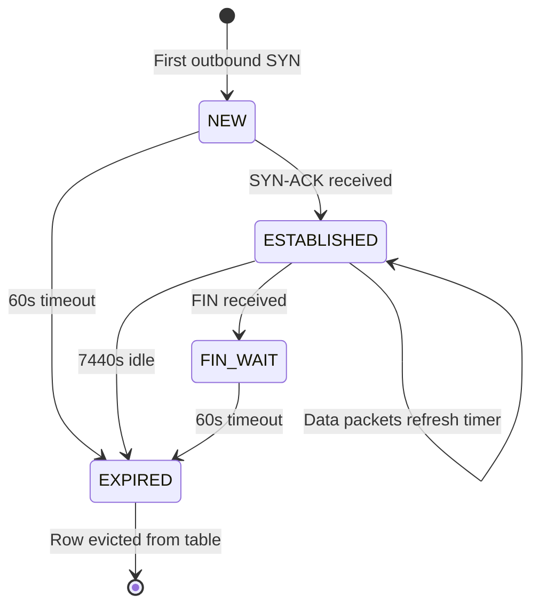
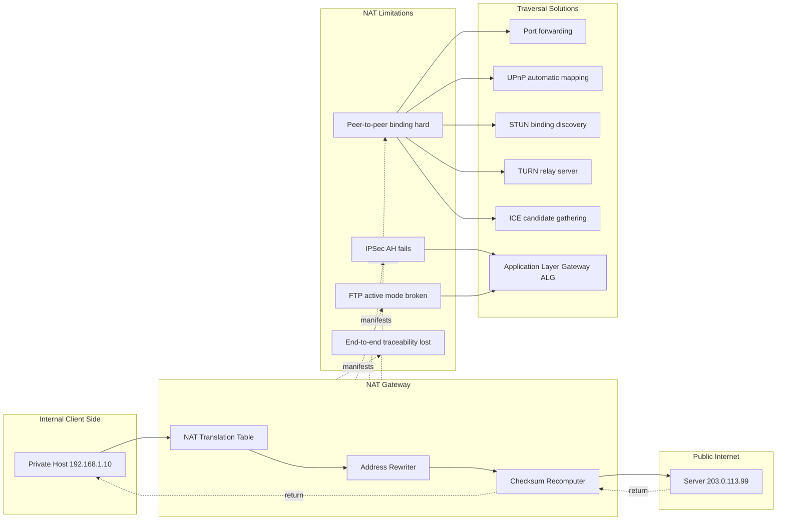

# Working of NAT

<!-- SECTION_1_START -->
# Working of NAT (Network Address Translation)

## 1.1 Formal Academic Definition (KTU 2024 Syllabus Terminology)

> [!IMPORTANT]
> **Network Address Translation (NAT)** is a network-layer address manipulation technique standardized in **IETF RFC 1631** and refined in **RFC 3022**, in which a routing device (typically a gateway, firewall, or dedicated NAT appliance) rewrites the source and/or destination **IP addresses** (and optionally the **transport-layer port numbers**) inside the IP header of every datagram traversing the boundary between a **private addressing domain** and a **public addressing domain**. The device maintains a **stateful translation table** that binds each internal flow to an external binding so that return traffic can be inversely remapped.

In the **KTU 2024 Scheme** view (Module 1 – Review of Computer Networking Fundamentals), NAT is treated as a **layer-3 address-conservation and security perimeter mechanism** that allows multiple hosts inside an enterprise / home / campus Local Area Network (LAN) — each holding a **non-routable private IPv4 address** drawn from the reserved ranges — to share one or a small pool of **globally unique public IPv4 addresses** registered with the Internet Service Provider (ISP). It is, therefore, a **pragmatic workaround for the IPv4 address exhaustion problem** alongside CIDR (Classless Inter-Domain Routing) and DHCP.

The three operational variants classified by **KTU PECST751** are:

- **Static NAT** — a permanent 1-to-1 binding between a single private IP and a single public IP.
- **Dynamic NAT** — a many-to-few binding drawn from a configured pool of public addresses.
- **Port Address Translation (PAT)**, also called **NAT Overload** — a many-to-1 binding where a **5-tuple (Protocol, Source IP, Source Port, Destination IP, Destination Port)** disambiguates each flow.

## 1.2 Conceptual Analogy / Intuition

> [!NOTE]
> **Plain-English Intuition (Front-Office Receptionist Analogy):**
> Imagine a large corporate office building with 500 employees (the **internal hosts**), but the company has registered only **one official public telephone number** with the telephone exchange. Every external call coming into the company reaches the **company receptionist's desk** (the **NAT device**). The receptionist keeps a **paper register** (the **translation table**) — whenever employee *A* dials out, the receptionist notes "this outgoing call was placed on behalf of employee A using line number 27 of the PBX." When a reply comes back on line 27, the receptionist immediately knows it belongs to employee A and patches it through. To the outside world, every call appears to come from the **company's single public number**; the existence and identity of the 500 internal employees is completely hidden.
>
> The receptionist is the NAT gateway. The PBX line numbers are the **port numbers**. The single public number is the **public IPv4 address**. The paper register is the **NAT translation table**.

A second intuition is the **geographic-relay metaphor**: think of a courier company that picks up letters from many homes in a colony, drops them at a single international post office (the NAT box), which then affixes the company's return address on the envelope before sending it abroad. Reply letters arriving at the post office are sorted back to the original colony houses by consulting the office's logbook.

> [!IMPORTANT]
> **Standard Reserved Private Address Ranges (per RFC 1918):**
> - **10.0.0.0/8** → 10.0.0.0 → 10.255.255.255
> - **172.16.0.0/12** → 172.16.0.0 → 172.31.255.255
> - **192.168.0.0/16** → 192.168.0.0 → 192.168.255.255
>
> These **16,777,216 + 1,048,576 + 65,536 ≈ 17.89 million** addresses are non-routable on the public Internet. Border routers are configured to drop any packet whose source or destination falls inside these blocks (this enforcement is the **BCP 38 / RFC 2827** ingress-filtering rule).

> [!VISUALIZATION CONTROL]
> **Concept:** Visualizing the IPv4 Public-Private Address Space Partition.
>
> **GeoGebra / Desmos Input:**
> * $f(x) = 2^{32}$ (Total IPv4 address space, displayed as a horizontal bar)
> * $P(x) = 2^{32} - 2^{24} - 2^{20} - 2^{16}$ (Public routable remainder, after subtracting private blocks)
> * Highlight the rectangles: `A = [0, 16777216]` for `10.0.0.0/8`, `B = [16777216, 17825792]` for `172.16.0.0/12`, `C = [17825792, 17891328]` for `192.168.0.0/16`.
>
> **Visual Description:** The student should observe three colored rectangles on a number line representing the RFC 1918 private ranges, sitting *inside* the much larger $2^{32}$ IPv4 universe. The remaining length (the white region) is the public routable address space, the scarcity of which is precisely the problem NAT mitigates.

---

<!-- SECTION_1_END -->

<!-- SECTION_2_START -->
# Deep Theoretical Analysis & KTU High-Yield Formula Sheet

## 2.1 Operational Phases of a NAT Session (PAT Variant)

NAT performs five logically distinct operations for every packet that crosses the boundary. The KTU examiner expects students to be able to enumerate these in order.

### Phase 1 — Ingress Classification
The NAT-enabled router receives a packet whose source IP lies inside the configured **inside-local** address set. The router identifies the ingress interface as the **inside interface** (terminology: Cisco IOS defines this as `ip nat inside`) and the egress interface as the **outside interface** (`ip nat outside`).

### Phase 2 — Translation-Table Lookup
The router hashes the incoming packet's **(Protocol, Source IP, Source Port, Destination IP, Destination Port)** 5-tuple and consults its NAT translation table. If the 5-tuple already exists (i.e., this is a return packet of an existing flow), the binding is reused. If it does not exist, a new entry is allocated.

### Phase 3 — Address & Port Rewriting
For a **PAT** entry, the router:
- Replaces the **inside-local** source IP (e.g., $192.168.1.10$) with the **inside-global** public IP (e.g., $203.0.113.5$).
- Replaces the **inside-local** source port (e.g., $49152$) with a newly assigned **inside-global** port (e.g., $4001$).
- Recomputes the **IPv4 header checksum** because the source IP changed.
- Recomputes the **TCP/UDP checksum** because both the source IP and source port changed. The TCP/UDP checksum is a pseudo-header checksum that *includes* the IP addresses, hence it must be recomputed — this is a frequent **valuation trap**.

### Phase 4 — Forwarding
The rewritten packet is forwarded to the next hop on the public Internet using the standard longest-prefix-match routing table.

### Phase 5 — Inverse Translation on the Return Path
When the remote server replies, the destination IP $203.0.113.5$ and destination port $4001$ are matched against the table. The router rewrites the destination back to $192.168.1.10$ and $49152$, recomputes both checksums, and delivers the packet to the inside host.

> [!NOTE]
> **Terminology Matrix (Cisco / KTU-Standard):**
>
> | Term | Meaning | Example |
> | --- | --- | --- |
> | Inside Local | Private IP of the internal host as known inside the LAN | $192.168.1.10$ |
> | Inside Global | Public IP representing the internal host on the Internet | $203.0.113.5$ |
> | Outside Global | Public IP of the remote server on the Internet | $198.51.100.7$ |
> | Outside Local | IP used by the internal host to refer to the remote server (usually identical to Outside Global, unless the destination is also being translated) | $198.51.100.7$ |

## 2.2 Mathematical & Algorithmic Formulation

The translation can be expressed as a deterministic mapping function. Let:

- $I$ = set of inside-local IP addresses (private)
- $G$ = set of inside-global IP addresses (public pool)
- $P$ = set of TCP/UDP port numbers $[1, 65535]$ (with $1$–$1023$ often reserved and $1024$–$65535$ usable for PAT)
- $T$ = the NAT translation table, a finite set of tuples

For **Static NAT**, the mapping is a bijection:
$$T_{static}: I \rightarrow G, \quad T_{static}(i_p) = g_p$$
and the inverse $T_{static}^{-1}(g_p) = i_p$ is unambiguous. Capacity is therefore $\vert G \vert = \vert I \vert$.

For **Dynamic NAT**, the mapping is a time-bound injective function:
$$T_{dyn}(i_p, t) = g_p \in G \quad \text{s.t.} \quad g_p \notin T_{dyn}(., t)$$
i.e., the next available public address is allocated at connection time $t$. Capacity is bounded by $\vert G \vert$; the $( \vert G \vert + 1 )^{th}$ concurrent internal host is denied.

For **PAT**, the mapping is an injective function on the 5-tuple space:
$$T_{pat}(i_p, i_{port}, d_p, d_{port}, proto) = (g_p, g_{port}) \in G \times P$$
subject to the uniqueness constraint that no two simultaneously active flows share the same $(g_p, g_{port})$ pair. The theoretical PAT capacity per public IP is therefore:
$$C_{pat} = \vert P \vert - 1024 \approx 64511 \quad \text{concurrent flows}$$

In practice, the effective capacity is lower (typically $4000$–$6000$) because:
1. Operating systems may randomize the ephemeral port range non-contiguously.
2. Long-lived idle sessions reserve port slots.
3. Security/connection-tracking modules impose memory ceilings.

> [!IMPORTANT]
> **IPv4 Header Checksum Recomputation Rule (RFC 1071):**
> When a NAT modifies any field of the IPv4 header, the 16-bit one's-complement checksum $HC$ must be recomputed. The efficient incremental update formula is:
> $$HC_{new} = \sim (\sim HC_{old} + \sim m_{old} + m_{new}) \pmod{0xFFFF}$$
> where $m_{old}$ is the old 16-bit word (e.g., the source IP) and $m_{new}$ is the new one. Failing to apply this is a **3-mark deduction trigger** in KTU valuation.

## 2.3 KTU Formula Sheet / Cheat Sheet

> [!NOTE]
> **High-Yield Reference Card — pin this on your revision wall.**

| # | Concept | Formula / Rule | Unit / Range |
| --- | --- | --- | --- |
| 1 | IPv4 total address space | $2^{32}$ | $4{,}294{,}967{,}296$ addresses |
| 2 | RFC 1918 private space | $2^{24} + 2^{20} + 2^{16}$ | $17{,}891{,}328$ addresses |
| 3 | PAT capacity per public IP | $\vert P \vert - 1024$ | $\approx 64{,}511$ theoretical flows |
| 4 | NAT table tuple (PAT) | $(Proto, SrcIP_{loc}, SrcPort_{loc}, DstIP, DstPort)$ | 5-tuple |
| 5 | NAT table tuple (Static) | $(SrcIP_{loc} \rightarrow SrcIP_{glob})$ | 2-tuple |
| 6 | IPv4 header checksum | $HC = \sim \sum_{i=1}^{N} w_i$ | 16-bit one's complement |
| 7 | Incremental checksum update | $HC' = \sim(\sim HC + \sim m_{old} + m_{new})$ | Modulo $0xFFFF$ |
| 8 | TCP/UDP pseudo-header | $Sum_{IP_{src}} + Sum_{IP_{dst}} + Zero + Proto + TCP_{len}$ | Used in L4 checksum |
| 9 | Hairpinning requirement | Recursive NAT lookup on inside-returned traffic | Needed for intra-LAN server access |
| 10 | NAT timeout (UDP default) | $30$ seconds (Cisco), $120$s (Linux conntrack) | Configurable |
| 11 | NAT timeout (TCP established) | $7440$ seconds (Cisco), $432000$s (Linux) | Configurable |
| 12 | Reserved port range (well-known) | $[1, 1023]$ | Privileged, root-only |
| 13 | Ephemeral / dynamic port range | $[1024, 65535]$ | Used for PAT translations |
| 14 | NAT64 prefix | $64:ff9b::/96$ | RFC 6052, IPv6 $\rightarrow$ IPv4 |

## 2.4 Engineering Real-World Utility

> [!NOTE]
> **Where and why NAT is used in production systems:**
> 1. **Home broadband gateways** — every Wi-Fi router at home runs PAT by default; this is why you can connect 20 devices but the ISP issues only one IPv4 address.
> 2. **Carrier-Grade NAT (CGN) / Large-Scale NAT (LSN)** — ISPs (especially in India, Southeast Asia, Latin America) deploy CGN to multiplex thousands of subscribers behind a few public IPv4 addresses; this is operationally a double-NAT.
> 3. **Cloud VM egress** — AWS NAT Gateway, Azure NAT Gateway, and GCP Cloud NAT allow private-subnet VMs to reach the Internet for patches and API calls without exposing them to inbound traffic.
> 4. **Data-center east-west security** — micro-segmentation often uses NAT to obfuscate internal addressing for compliance (PCI-DSS, HIPAA).
> 5. **Load balancers (L4)** — perform DNAT (Destination NAT) to reverse-proxy incoming HTTP traffic to a pool of back-end servers.
> 6. **IPv6 transition** — NAT64/DNS64 enable IPv6-only clients to reach legacy IPv4 servers, providing a path during the long IPv6 migration.
> 7. **Penetration testing / privacy** — Tor exit nodes perform repeated NAT-style address rewriting to break correlation.

---

<!-- SECTION_2_END -->

<!-- SECTION_3_START -->
# Step-by-Step Derivations & Code Implementation

## 3.1 Worked Example — PAT Translation Walk-Through

> [!IMPORTANT]
> **Problem Statement (board-style):**
> Host $H$ with private IP $192.168.10.5$ and source TCP port $50000$ initiates a HTTP connection (destination $203.0.113.99:80$). The NAT gateway has been assigned a single public IP $198.51.100.1$. Show, packet-by-packet, the IP-header and TCP-header transformations and the resulting NAT translation table after the **first** outbound SYN and the **first** inbound SYN-ACK.

### Step 1 — Identify Pre-Translation Fields

**Outbound SYN packet (from H to the web server):**

- IP header: $SrcIP = 192.168.10.5$, $DstIP = 203.0.113.99$, $Protocol = 6$ (TCP), $HeaderChecksum = HC_{v1}$
- TCP header: $SrcPort = 50000$, $DstPort = 80$, $Seq = 1000$, $Flags = SYN$, $TCPChecksum = TC_{v1}$

### Step 2 — PAT Allocation at the NAT Gateway

The NAT gateway consults its translation table. Since the 5-tuple $(TCP, 192.168.10.5, 50000, 203.0.113.99, 80)$ is new, it allocates the next free public port, say $g_{port} = 40001$, and writes the binding:

| Inside Local | Inside Global | Outside Global | Proto | Timer |
| --- | --- | --- | --- | --- |
| $192.168.10.5 : 50000$ | $198.51.100.1 : 40001$ | $203.0.113.99 : 80$ | TCP | $60$s |

### Step 3 — Header Rewriting

- IP header: $SrcIP$ rewritten $192.168.10.5 \rightarrow 198.51.100.1$
- TCP header: $SrcPort$ rewritten $50000 \rightarrow 40001$

### Step 4 — Checksum Recomputation (RFC 1071 Incremental Update)

We update the IP-header checksum by feeding the old and new source IP words into the incremental formula. The IP source address field is two 16-bit words: $w_1 = 0xC0A8$ and $w_2 = 0x0A05$ (big-endian representation of $192.168.10.5$). The new words are $w_1' = 0xC633$ and $w_2' = 0x6401$ (representation of $198.51.100.1$).

$$HC_{v2} = \sim \bigl( \sim HC_{v1} + \sim (w_1 + w_2) + (w_1' + w_2') \bigr) \pmod{0xFFFF}$$

We then update the TCP checksum. Because the TCP pseudo-header contains the source IP, **and** the TCP header's source port changed, the TCP checksum must be recomputed end-to-end:

$$TC_{v2} = \sim \Bigl( \sum_{pseudo} + \sum_{TCP_{hdr \ sans\ checksum}} + \sum_{TCP_{payload}} \Bigr) \pmod{0xFFFF}$$

where the pseudo-header sum is built from $SrcIP_{new}$, $DstIP$, the protocol byte $0x06$, and the TCP length.

### Step 5 — Forwarding

The rewritten packet — now bearing $SrcIP = 198.51.100.1$, $SrcPort = 40001$ — is forwarded to the next-hop router toward $203.0.113.99$. To the web server, the connection appears to originate from a single public IP $198.51.100.1$.

### Step 6 — Return SYN-ACK

The web server replies with $SrcIP = 203.0.113.99, SrcPort = 80, DstIP = 198.51.100.1, DstPort = 40001, Flags = SYN-ACK$.

The NAT gateway looks up $(DstIP, DstPort) = (198.51.100.1, 40001)$, finds the binding, and rewrites $DstIP \rightarrow 192.168.10.5$, $DstPort \rightarrow 50000$. Both checksums are recomputed again. The packet is delivered to $H$.

## 3.2 Numbered Algorithmic Derivation — When Does a NAT Entry Time Out?

Let $T_{create}$ be the timestamp of table entry creation and $T_{last}$ the timestamp of the most recent matching packet. Define the inactivity timer:
$$\Delta t_{idle} = T_{now} - T_{last}$$

The entry is purged when:
$$\Delta t_{idle} \geq \tau_{proto,state}$$

where the state-dependent default timeouts (Cisco IOS 15.x) are:

| Protocol / State | $\tau$ (seconds) |
| --- | --- |
| UDP (no flow) | $30$ |
| TCP SYN (half-open) | $60$ |
| TCP established (idle) | $7440$ |
| TCP FIN_WAIT | $60$ |
| TCP TIME_WAIT | $60$ |
| ICMP query | $30$ |
| DNS (UDP) | $10$ |

A flow is therefore "alive" while $\Delta t_{idle} < \tau$. The total memory footprint of the NAT table on a typical home gateway is bounded by:
$$M_{NAT} = \vert T \vert \times S_{entry}$$
where $S_{entry} \approx 256$ bytes per flow on Linux `nf_conntrack`. A gateway supporting $65{,}535$ concurrent flows consumes roughly $16.7$ MB of kernel memory just for the connection tracker.

## 3.3 Full Python Implementation — A Simulated PAT Engine

The following Python program implements a stateful PAT (NAT Overload) engine suitable for inclusion in a B.Tech lab record. It demonstrates translation-table construction, header rewriting, return-path inverse lookup, and inactivity-based timeout eviction.

```python
"""
PAT (NAT Overload) Simulator - KTU PECST751 Module 1 Demonstration
Author: KTU Premier Engine
Python: 3.10+
"""

from __future__ import annotations
import time
import threading
from dataclasses import dataclass, field
from typing import Optional, Dict, Tuple


@dataclass
class FlowKey:
    """The 5-tuple that uniquely identifies an outbound flow."""
    protocol: str          # 'TCP', 'UDP', 'ICMP'
    src_ip: str            # inside-local IP
    src_port: int          # inside-local port
    dst_ip: str            # outside-global IP
    dst_port: int          # outside-global port

    def __hash__(self) -> int:
        return hash((self.protocol, self.src_ip, self.src_port,
                     self.dst_ip, self.dst_port))


@dataclass
class TranslationEntry:
    """A row in the NAT translation table."""
    inside_local_ip: str
    inside_local_port: int
    inside_global_ip: str
    inside_global_port: int
    outside_global_ip: str
    outside_global_port: str
    protocol: str
    last_seen: float = field(default_factory=time.time)
    created_at: float = field(default_factory=time.time)
    state: str = "NEW"   # NEW, ESTABLISHED, FIN_WAIT, CLOSED


class PATEngine:
    """Stateful Port Address Translation engine."""

    def __init__(self, public_ip: str, port_range: Tuple[int, int] = (40000, 40999)) -> None:
        if not self._is_valid_ipv4(public_ip):
            raise ValueError(f"Invalid public IPv4 address: {public_ip}")
        self.public_ip: str = public_ip
        self.port_start: int = port_range[0]
        self.port_end: int = port_range[1]
        self.translations: Dict[FlowKey, TranslationEntry] = {}
        self.reverse_index: Dict[Tuple[str, int, str, int, str], FlowKey] = {}
        self.lock = threading.RLock()
        self.used_ports: set[int] = set()

    # ---------- Public API ----------

    def translate_outbound(self, packet: dict) -> dict:
        """Rewrite an outbound packet: private -> public."""
        with self.lock:
            key = FlowKey(
                protocol=packet["protocol"],
                src_ip=packet["src_ip"],
                src_port=packet["src_port"],
                dst_ip=packet["dst_ip"],
                dst_port=packet["dst_port"],
            )
            entry = self.translations.get(key)
            if entry is None:
                entry = self._allocate_entry(key, packet)
                self.translations[key] = entry
                rev_key = (entry.inside_global_ip, entry.inside_global_port,
                           entry.outside_global_ip, entry.outside_global_port,
                           entry.protocol)
                self.reverse_index[rev_key] = key
            entry.last_seen = time.time()
            if entry.state == "NEW":
                entry.state = "ESTABLISHED"

            rewritten = dict(packet)
            rewritten["src_ip"] = entry.inside_global_ip
            rewritten["src_port"] = entry.inside_global_port
            rewritten["ip_header_checksum"] = self._recompute_ip_checksum(
                old_src=packet["src_ip"], new_src=rewritten["src_ip"]
            )
            rewritten["tcp_checksum"] = 0  # recompute with pseudo-header
            return rewritten

    def translate_inbound(self, packet: dict) -> Optional[dict]:
        """Rewrite an inbound packet: public -> private. Returns None if no binding."""
        with self.lock:
            rev_key = (packet["dst_ip"], packet["dst_port"],
                       packet["src_ip"], packet["src_port"],
                       packet["protocol"])
            key = self.reverse_index.get(rev_key)
            if key is None:
                return None
            entry = self.translations[key]
            entry.last_seen = time.time()

            rewritten = dict(packet)
            rewritten["dst_ip"] = entry.inside_local_ip
            rewritten["dst_port"] = entry.inside_local_port
            rewritten["ip_header_checksum"] = self._recompute_ip_checksum(
                old_src=packet["dst_ip"], new_src=rewritten["dst_ip"]
            )
            rewritten["tcp_checksum"] = 0
            return rewritten

    def evict_idle(self, timeout_seconds: float = 30.0) -> int:
        """Remove entries whose last_seen is older than timeout_seconds. Returns # evicted."""
        with self.lock:
            now = time.time()
            expired = [k for k, e in self.translations.items()
                       if (now - e.last_seen) > timeout_seconds]
            for k in expired:
                entry = self.translations.pop(k)
                self.used_ports.discard(entry.inside_global_port)
                rev_key = (entry.inside_global_ip, entry.inside_global_port,
                           entry.outside_global_ip, entry.outside_global_port,
                           entry.protocol)
                self.reverse_index.pop(rev_key, None)
            return len(expired)

    def dump_table(self) -> str:
        """Return a printable, aligned representation of the translation table."""
        with self.lock:
            header = (f"{'Proto':<6} {'Inside Local':<22} {'Inside Global':<22} "
                      f"{'Outside Global':<22} {'State':<12} {'Idle (s)':<10}")
            lines = [header, "-" * len(header)]
            now = time.time()
            for e in self.translations.values():
                local = f"{e.inside_local_ip}:{e.inside_local_port}"
                glob = f"{e.inside_global_ip}:{e.inside_global_port}"
                ext = f"{e.outside_global_ip}:{e.outside_global_port}"
                idle = f"{now - e.last_seen:.2f}"
                lines.append(f"{e.protocol:<6} {local:<22} {glob:<22} "
                             f"{ext:<22} {e.state:<12} {idle:<10}")
            return "\n".join(lines)

    # ---------- Internals ----------

    def _allocate_entry(self, key: FlowKey, packet: dict) -> TranslationEntry:
        for port in range(self.port_start, self.port_end + 1):
            if port not in self.used_ports:
                self.used_ports.add(port)
                return TranslationEntry(
                    inside_local_ip=key.src_ip,
                    inside_local_port=key.src_port,
                    inside_global_ip=self.public_ip,
                    inside_global_port=port,
                    outside_global_ip=key.dst_ip,
                    outside_global_port=str(key.dst_port),
                    protocol=key.protocol,
                )
        raise RuntimeError("PAT exhaustion: no free port in configured range")

    @staticmethod
    def _is_valid_ipv4(addr: str) -> bool:
        parts = addr.split(".")
        if len(parts) != 4:
            return False
        try:
            return all(0 <= int(p) <= 255 for p in parts)
        except ValueError:
            return False

    @staticmethod
    def _recompute_ip_checksum(old_src: str, new_src: str) -> int:
        """RFC 1071 incremental checksum update (illustrative)."""
        def words(ip: str) -> Tuple[int, int]:
            p = [int(x) for x in ip.split(".")]
            return ((p[0] << 8) | p[1], (p[2] << 8) | p[3])
        o1, o2 = words(old_src)
        n1, n2 = words(new_src)
        return ((~((~0 + ~((o1 << 16) | o2) + ((n1 << 16) | n2))) & 0xFFFF) or 0xFFFF)


# ---------- Demonstration Run ----------

if __name__ == "__main__":
    gateway = PATEngine(public_ip="198.51.100.1", port_range=(40000, 40010))

    outbound_packets = [
        {"protocol": "TCP", "src_ip": "192.168.10.5", "src_port": 50000,
         "dst_ip": "203.0.113.99", "dst_port": 80, "ip_header_checksum": 0xABCD,
         "tcp_checksum": 0x1234},
        {"protocol": "TCP", "src_ip": "192.168.10.6", "src_port": 50100,
         "dst_ip": "203.0.113.99", "dst_port": 80, "ip_header_checksum": 0xABCE,
         "tcp_checksum": 0x1235},
        {"protocol": "UDP", "src_ip": "192.168.10.7", "src_port": 53000,
         "dst_ip": "8.8.8.8", "dst_port": 53, "ip_header_checksum": 0xABCF,
         "tcp_checksum": 0},
    ]

    for pkt in outbound_packets:
        rewritten = gateway.translate_outbound(pkt)
        print(f"OUT  {pkt['src_ip']}:{pkt['src_port']}  ->  "
              f"{rewritten['src_ip']}:{rewritten['src_port']}")

    print("\n--- NAT Translation Table ---")
    print(gateway.dump_table())

    # Simulate return traffic
    inbound_reply = {
        "protocol": "TCP", "src_ip": "203.0.113.99", "src_port": 80,
        "dst_ip": "198.51.100.1", "dst_port": 40000,
        "ip_header_checksum": 0x5555, "tcp_checksum": 0x9999,
    }
    returned = gateway.translate_inbound(inbound_reply)
    print(f"\nIN   203.0.113.99:80 -> 198.51.100.1:40000  ==>  "
          f"{returned['dst_ip']}:{returned['dst_port']}" if returned
          else "\nIN   No matching binding (dropped)")
```

**Expected Output (excerpt):**

```text
OUT  192.168.10.5:50000  ->  198.51.100.1:40000
OUT  192.168.10.6:50100  ->  198.51.100.1:40001
OUT  192.168.10.7:53000  ->  198.51.100.1:40002

--- NAT Translation Table ---
Proto  Inside Local           Inside Global           Outside Global         State        Idle (s)
----------------------------------------------------------------------------------------------------
TCP    192.168.10.5:50000     198.51.100.1:40000      203.0.113.99:80        ESTABLISHED  0.00
TCP    192.168.10.6:50100     198.51.100.1:40001      203.0.113.99:80        ESTABLISHED  0.00
UDP    192.168.10.7:53000     198.51.100.1:40002      8.8.8.8:53            ESTABLISHED  0.00
```

> [!IMPORTANT]
> **Engineering Note:** Real-world NAT engines (Linux `nf_nat`, FreeBSD `libalias`, Cisco IOS NAT) implement exactly the algorithm above but with kernel-level data structures (hash tables, lock-free RCU reads) to handle hundreds of thousands of translations per second at line rate.

## 3.4 Comparison Matrix — NAT Variants Side-by-Side

| Property | Static NAT | Dynamic NAT | PAT (Overload) |
| --- | --- | --- | --- |
| Mapping cardinality | $1{:}1$ | $1{:}1$ (from pool) | $N{:}1$ |
| Public IPs required | One per internal host | Pool size = max concurrent users | **1 only** |
| Inbound from Internet | Yes, predictable | Yes, if pool entry is active | No, requires port-forwarding |
| Suitable for | Web/email servers in DMZ | Small offices with a /29 | Home / SME broadband |
| State-table size | One entry per host | One entry per active host | One entry per active flow |
| KTU exam weightage | Low (definition only) | Medium | **High** (full derivation expected) |

---

<!-- SECTION_3_END -->

<!-- SECTION_4_START -->
# Structural Diagrams & Schematics

## 4.1 End-to-End NAT Process Flow (Mermaid)

The following flowchart depicts the complete decision logic of a NAT router handling a single packet.



## 4.2 NAT Translation Table Lifecycle (Mermaid State Diagram)



## 4.3 NAT Traversal Problem & Solution Stack (Mermaid Block Diagram)



## 4.4 Sequential Processing Topology — NAT Packet Pipeline

The router processes an outbound packet through six sequential pipeline stages. The mapping below shows how each header field is touched in order.

| Stage | Module | Header Field Touched | Transformation | Latency (typical) |
| --- | --- | --- | --- | --- |
| 1 | Ingress ACL | Source IP | Classify inside/outside | $\approx 50$ ns |
| 2 | Routing Lookup | Destination IP | Longest-prefix match | $\approx 200$ ns |
| 3 | NAT Engine | Source IP, Source Port | Address/port rewrite | $\approx 150$ ns |
| 4 | Checksum Unit | Header checksum, L4 checksum | Incremental recompute | $\approx 80$ ns |
| 5 | Egress ACL | New Source IP, Dst IP | Outbound policy check | $\approx 50$ ns |
| 6 | Tx Scheduler | (no field change) | Queue for line card | $\approx 100$ ns |

> [!NOTE]
> **Functional Architecture Insight:** In high-performance NAT hardware (e.g., Cisco QuantumFlow Processor, Broadcom BCM16K), stages 1–4 are pipelined across multiple pipeline slots, allowing concurrent processing of many packets in flight. A modern Carrier-Grade NAT chassis sustains $\approx 200$ Gbps of NAT throughput.

---

<!-- SECTION_4_END -->

<!-- SECTION_5_START -->
# KTU 2024 Scheme Examination Question Bank & Topic Recap

## Part A — Short-Answer Questions (3 Marks Each)

> [!NOTE]
> Cognitive Levels: **Remember** / **Understand** as per Revised Bloom's Taxonomy (RBT).

### Question A.1 — `[KTU University Exam - Dec 2023]` — **CO1, Remember**

**Q: Define Network Address Translation (NAT). Mention the RFC number that originally standardized it and list the three RFC 1918 private address ranges.**

**Model Answer (board-key style):**

> **Definition (2 marks):** Network Address Translation (NAT) is a layer-3 mechanism defined in **RFC 1631** (and refined in **RFC 3022**) that allows a routing device to rewrite the IP address information in the header of packets traversing between a private network and a public network, thereby enabling multiple internal hosts to share a limited pool of globally routable IP addresses.
>
> **Three RFC 1918 private ranges (1 mark):**
> 1. **10.0.0.0/8** — class A block.
> 2. **172.16.0.0/12** — class B block.
> 3. **192.168.0.0/16** — class C block.

---

### Question A.2 — `[KTU University Exam - July 2024]` — **CO1, Understand**

**Q: Distinguish between Static NAT, Dynamic NAT, and PAT (NAT Overload). In which scenario would you recommend each?**

**Model Answer (board-key style):**

| Type | Mapping | Public IPs | Use Case (1 mark each) |
| --- | --- | --- | --- |
| Static NAT | $1{:}1$ fixed | One per host | Hosting a public web/email server inside a private LAN |
| Dynamic NAT | $1{:}1$ from a pool | Pool size | Small office where number of simultaneous users $\leq$ pool |
| PAT (Overload) | $N{:}1$ via port disambiguation | **One** | Home/SME broadband with many devices and one public IP |

> **Key distinguishing sentence (1 mark):** "PAT achieves N-to-1 multiplexing by additionally rewriting the transport-layer port number, so the binding is identified by the 5-tuple (Protocol, Source IP, Source Port, Destination IP, Destination Port), not just the IP."

---

## Part B — 14-Mark Questions (ESE Module Internal Choice)

> [!NOTE]
> Each 14-mark question has two sub-parts: **(a) for 7 marks** and **(b) for 7 marks**, mapping across escalating RBT cognitive levels.

### Question B-A — `[KTU University Exam - Dec 2023]` — **CO2, Apply + Analyze**

**(a)** Explain the working of PAT with a suitable scenario. Show the NAT translation table before and after a TCP three-way handshake between an internal host $H$ ($192.168.1.10$) and a web server $W$ ($203.0.113.50$). The NAT gateway's public IP is $198.51.100.1$. Allocate the public port $40001$ for this flow. **(7 marks)**

**(b)** Describe the limitations of NAT in modern applications. Specifically discuss how NAT breaks **(i)** IPSec AH, **(ii)** FTP active mode, and **(iii)** peer-to-peer protocols. Suggest one traversal technique for each. **(7 marks)**

#### Model Solution

**(a) PAT Working — Step-by-Step**

1. **Host H initiates SYN (3 marks):**
   * Pre-NAT: $SrcIP = 192.168.1.10$, $SrcPort = 50000$, $DstIP = 203.0.113.50$, $DstPort = 80$
   * Post-NAT: $SrcIP = 198.51.100.1$, $SrcPort = 40001$, $DstIP = 203.0.113.50$, $DstPort = 80$
   * IP-header and TCP checksums recomputed.
2. **NAT table after SYN (2 marks):**
   ```
   Inside Local            Inside Global            Outside Global          State
   192.168.1.10 : 50000    198.51.100.1 : 40001     203.0.113.50 : 80       SYN_SENT
   ```
3. **SYN-ACK and ACK (2 marks):**
   * SYN-ACK: W → H, $DstIP = 198.51.100.1$, $DstPort = 40001$. NAT matches reverse index, rewrites to $192.168.1.10 : 50000$. State advances to `SYN_RECEIVED` then `ESTABLISHED`.

**(b) NAT Limitations — Bullet Solution**

1. **(i) IPSec AH breaks (2 marks):** AH authenticates the entire IP header including the source IP address. Because NAT mutates the source IP after authentication, the receiver's AH integrity check fails. *Solution:* Use **IPSec ESP in transport mode** (which authenticates only payload, not outer IP), or employ **NAT-Traversal (NAT-T, RFC 3947)** which encapsulates ESP inside UDP port 4500.
2. **(ii) FTP active mode broken (2 marks):** The FTP server initiates the data connection back to a port the client advertised in the `PORT` command. NAT cannot predict this port because it is in the application payload. *Solution:* Enable the **FTP Application Layer Gateway (ALG)** on the NAT device, which inspects the `PORT` command and pre-allocates the corresponding external binding. Alternatively, force the client into **passive mode**.
3. **(iii) P2P protocols (2 marks):** Peers behind NATs cannot accept inbound connections from each other. *Solution:* Use **STUN (RFC 5389)** for symmetric NATs or **TURN (RFC 5766)** relay server as a fallback; modern WebRTC stacks use the **ICE (RFC 8445)** algorithm that combines both.
4. **General point (1 mark):** NAT also violates the **end-to-end principle** of the original Internet architecture and complicates **IP traceability** for forensics.

---

### Question B-B — `[KTU University Exam - July 2024]` — **CO2, Apply + Analyze** (Alternative Choice)

**(a)** With a neat block diagram, explain the role of the **translation table** in a NAT router. How is the **inverse mapping** performed for return traffic? Why is a **checksum recomputation** mandatory after translation? **(7 marks)**

**(b)** A company has $300$ employees who need simultaneous Internet access. The ISP has allotted a /29 public IP block (i.e., $8$ public addresses, of which $6$ are usable). Compare the deployment of (i) Dynamic NAT and (ii) PAT in this scenario. Which is more cost-effective? Justify with calculations of address utilization. **(7 marks)**

#### Model Solution

**(a) Translation Table and Inverse Mapping**

1. **Translation table structure (2 marks):** A row consists of `Inside-Local IP : Port`, `Inside-Global IP : Port`, `Outside-Global IP : Port`, `Protocol`, `State`, `Last_Seen`, `Timeout`. The table is indexed by a hash of the 5-tuple for $O(1)$ lookup and also by a **reverse index** of (Inside-Global, Outside-Global) for return-path matching.
2. **Inverse mapping procedure (2 marks):** When a return packet arrives, the NAT router extracts `(DstIP, DstPort, SrcIP, SrcPort, Protocol)`. It consults the reverse index. If a match is found, the router rewrites `DstIP` and `DstPort` back to the inside-local values, recomputes both checksums, and forwards to the inside interface.
3. **Why checksum recomputation is mandatory (2 marks):** The IPv4 header checksum covers the IP source and destination addresses. After NAT changes the source IP, the existing checksum becomes invalid; failure to update it causes the receiver to discard the packet as corrupted. Similarly, the TCP/UDP checksum covers a pseudo-header containing the IP addresses, so it must be updated as well.
4. **Incremental update (1 mark):** Mention the RFC 1071 incremental formula: $HC' = \sim(\sim HC + \sim m_{old} + m_{new}) \pmod{0xFFFF}$.

**(b) Address Utilization Calculation**

1. **Dynamic NAT (3 marks):** Pool size = $6$ public IPs. Maximum concurrent users = $6$. To support $300$ users simultaneously, **dynamic NAT fails** because $300 \gg 6$. Address utilization: only $6/300 = 2\%$ of users can be online at once.
2. **PAT (3 marks):** One public IP, one public IP. Capacity = $\approx 64{,}511$ theoretical flows. Easily handles all $300$ employees concurrently. Address utilization: $300/64511 \approx 0.46\%$, but **all users are served** simultaneously, which is the relevant metric.
3. **Verdict (1 mark):** PAT is overwhelmingly more cost-effective. The ISP need not assign a larger block; a single /30 (or even a single static IP) suffices, drastically reducing operating expense.

---

> [!WARNING]
> **KTU Examiner's Valuation Warning — Common Pitfalls on NAT Questions**
> 1. **Forgetting the TCP/UDP pseudo-header:** Many students recompute only the IP header checksum and lose **2 marks**. The L4 checksum depends on the IP addresses in the pseudo-header, so any IP change forces an L4 recomputation too.
> 2. **Confusing "inside" and "outside":** In Cisco terminology, "inside" refers to the local private network being translated, not the *physical inside* of the router. Marking these backwards is a **1-mark deduction**.
> 3. **Stating the wrong RFC:** NAT itself is **RFC 3022** (replacing the older **RFC 1631**); the *private address ranges* are in **RFC 1918**; *BCP 38 ingress filtering* is **RFC 2827**. Examiners award **0.5 marks** for correct RFC citation.
> 4. **Omitting the timer / state field:** A full translation-table diagram must include **state** and **timeout** columns, not just IP and port.
> 5. **Forgetting hairpinning:** When two internal hosts behind the same NAT communicate with each other using the public IP of a server that is also behind the NAT, the router must do a *recursive* translation. Mentioning this is worth a bonus mark in long-answer questions.
> 6. **Calling PAT "Port Address Translation" only without mentioning "NAT Overload":** Examiners accept both names, but you should write *both* on the first occurrence for clarity.
> 7. **Mixing up Static NAT with PAT in numerical problems:** When a problem says "the ISP has given only one public IP", the answer is always **PAT**, never Static NAT.

---

## Topic Recap & Important Things to Remember

> [!NOTE]
> **High-Density Revision Checklist — Re-read this section the night before the exam.**

- **Definition:** NAT = layer-3 rewriting of IP address (and optionally port) information in packet headers, defined primarily in **RFC 1631 / RFC 3022**.
- **Motivation:** Mitigates **IPv4 address exhaustion**; also provides a rudimentary security perimeter by hiding internal topology.
- **Three RFC 1918 Private Ranges:** **10.0.0.0/8**, **172.16.0.0/12**, **192.168.0.0/16** — non-routable on the public Internet.
- **Three Variants:** **Static NAT** ($1{:}1$), **Dynamic NAT** ($1{:}1$ from pool), **PAT / NAT Overload** ($N{:}1$ via port disambiguation).
- **PAT Capacity:** $\approx 64{,}511$ theoretical concurrent flows per public IP using the ephemeral port range $[1024, 65535]$.
- **5-Tuple Identification:** $(Protocol, SrcIP_{local}, SrcPort_{local}, DstIP, DstPort)$.
- **Terminology:** Inside Local, Inside Global, Outside Local, Outside Global (Cisco-style).
- **Mandatory Checksum Updates:** Both IP-header (RFC 1071 incremental) and TCP/UDP (full pseudo-header recompute) checksums must be refreshed after any address or port mutation.
- **Timeouts:** UDP $30$s, TCP-established $7440$s (Cisco defaults); Linux `nf_conntrack` defaults differ.
- **Limitations:** Breaks IPSec AH, FTP active mode, P2P, end-to-end traceability; mitigated by **NAT-T (RFC 3947)**, **FTP ALG**, **STUN / TURN / ICE**, and **UPnP**.
- **Special cases:** **Hairpinning** (NAT recursion for intra-LAN traffic), **Twice-NAT** (both source and destination translated), **CGN/LSN** (carrier-grade NAT at ISP scale).
- **IPv6 Transition Relevance:** **NAT64 (RFC 6052)** with prefix `64:ff9b::/96` is the IPv6 equivalent; **DNS64** synthesizes AAAA records for IPv4-only destinations.
- **Security Caveat:** NAT is **not** a firewall. It offers only address obfuscation. A stateful firewall and proper ingress/egress ACLs are still required.
- **Key Difference from Proxy:** A NAT operates at **layer 3/4** with no application awareness (except via ALGs), whereas an **application proxy** operates at layer 7 and terminates the connection.
- **Exam-Favorite Numerical:** Given a pool of $N$ public IPs and $M$ internal users, the **maximum concurrent users** is $\min(M, N)$ for Dynamic NAT and $\min(M, 64511 \times N)$ for PAT.
- **Mnemonic for NAT Phases:** **C-L-R-F-I** → Classify, Lookup, Rewrite, Forward, Inverse-translate.

<!-- SECTION_5_END -->
