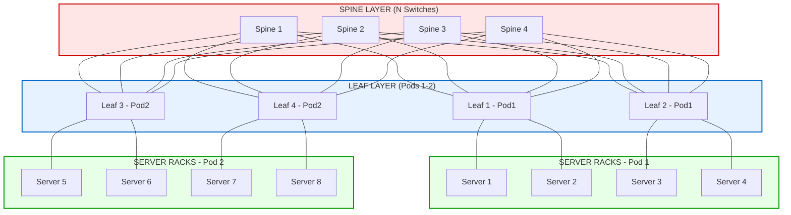
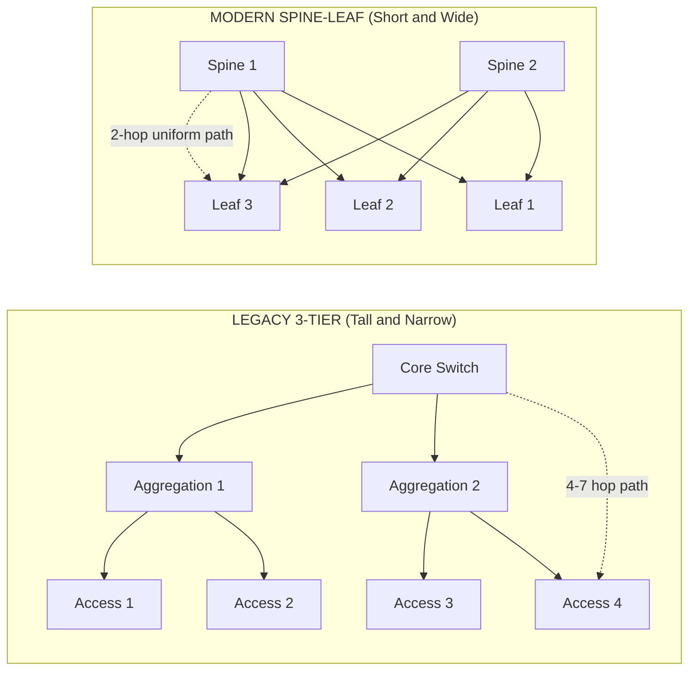
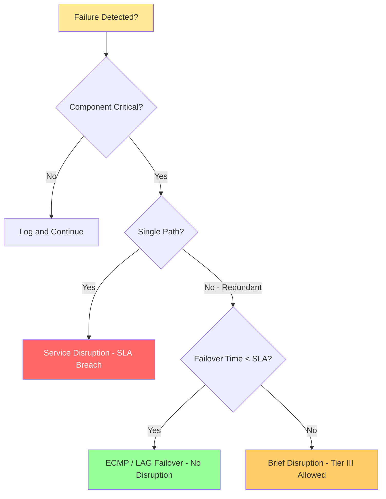
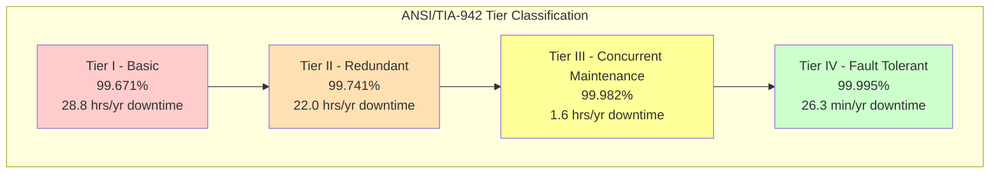
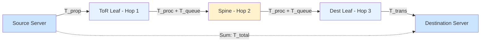

# Data Center Design Considerations - Scalability, Redundancy, and Latency

<!-- SECTION_1_START -->
# Data Center Design Considerations: Scalability, Redundancy, and Latency

> [!IMPORTANT]
> **KTU 2024 Scheme | PECST751 — Advanced Computer Networks | Module 2: DLL Switching**
> This module bridges traditional Layer-2 switching with hyperscale data center fabrics, where the design pillars of **Scalability**, **Redundancy**, and **Latency** dictate every architectural decision from the physical cable to the application API.

## 1.1 Formal Academic Definition

A **Data Center** is a centralized physical facility comprising networked computers, storage systems, and telecommunications infrastructure that enterprises use to organize, process, store, and disseminate large volumes of data and applications critical to their operations. The **KTU 2024 Scheme (PECST751)** categorizes data center design considerations under three non-negotiable pillars:

1. **Scalability** — The ability of the network to gracefully expand its capacity (ports, bandwidth, and endpoints) to meet growing traffic demand *without* requiring a forklift upgrade of the existing topology.
2. **Redundancy** — The deliberate duplication of critical network components (links, switches, power feeds) such that the failure of any single element does not cause service disruption. Formally measured by **Availability** = $\frac{MTBF}{MTBF + MTTR}$.
3. **Latency** — The end-to-end temporal delay experienced by a bit/packet traversing the network from source to destination, typically measured in **microseconds ($\mu s$)** inside the data center, and **milliseconds (ms)** across WANs.

> [!NOTE]
> **DLL (Data Link Layer) Switching Context:** In Module 2, we are not just dealing with a single switch. We are dealing with *switching fabrics* — thousands of switches interconnected at Layer 2 and Layer 2.5 (MPLS/VXLAN) to form a unified forwarding plane.

## 1.2 Conceptual Analogy — "The Highway System of a City"

Imagine a data center as a **modern metropolitan city**:

- **Scalability** is like the city's ability to add new highways, lanes, and suburbs *while traffic is still flowing*. A poorly designed city forces you to bulldoze existing structures to widen a road. A well-designed data center (e.g., spine-leaf) allows you to plug in a new "spine" switch like adding a new ring road without disrupting the inner suburbs.
- **Redundancy** is like having *two independent water pipelines* to every house. If one bursts, the second keeps the taps running. In network terms: dual-homing every server to two Top-of-Rack (ToR) switches.
- **Latency** is the *travel time from your home to the airport*. It is the sum of time spent leaving the driveway, walking to the gate, and taxiing to the runway. In networking, this is the sum of propagation, transmission, serialization, processing, and queuing delays.

> [!TIP]
> **Geometric Intuition:** Draw a tree. A traditional 3-tier (Core-Aggregation-Access) tree is *tall and narrow* — long paths, hard to scale, single points of failure. A modern **spine-leaf** is *short and wide* — uniform 2-hop paths, easy to add capacity horizontally. This single geometric choice resolves 80% of data center design problems.

## 1.3 Industry-Standard Metrics (The Three Holy Numbers)

> [!IMPORTANT]
> **Three Holy Numbers of Hyperscale Data Center Design:**
> - **Bisection Bandwidth** — The minimum bandwidth that survives any single failure. Measured in **Tbps**.
> - **Oversubscription Ratio** — $Downlink\_BW \div Uplink\_BW$. Tier-1 DC target: **1:1 (non-blocking)**. Legacy DC: **4:1 to 8:1**.
> - **PUE (Power Usage Effectiveness)** — $Total\_Facility\_Power \div IT\_Equipment\_Power$. Hyperscale target: **~1.1** (Facebook, Google). Industry average: **1.58**.

> [!VISUALIZATION CONTROL]
> **Concept:** Scalability vs. Redundancy vs. Latency — The Three Pillars Triangle
> **GeoGebra / Desmos Input Equations:**
> - `f(x) = 1/x` (Inverse relationship between Latency and Bandwidth)
> - `g(x) = log(x)` (Logarithmic cost of adding Scalability)
> - `h(x) = 1 - e^(-x)` (Asymptotic approach of Redundancy toward 100% availability)
> **Visual Description:** Plot these three curves on the same axes. The point of intersection represents the **design sweet spot** — engineers tune the three parameters until latency is below SLA, redundancy meets SLA, and scalability cost stays within budget.

<!-- SECTION_1_END -->

<!-- SECTION_2_START -->
# Deep Theoretical Analysis & KTU High-Yield Formula Sheet

## 2.1 Pillar 1 — Scalability: The Horizontal Growth Engine

Scalability in a data center is **not** about buying a bigger switch (vertical scaling). It is about **horizontal scaling**: adding more switches of the same model and treating them as a single logical fabric.

**Two types of scalability:**
- **Scale-Up (Vertical):** Replace a 48-port ToR with a 96-port ToR. Pros: simple. Cons: chassis limits, blast radius, single point of failure.
- **Scale-Out (Horizontal):** Add a new spine switch or new ToR pod. Pros: linear capacity growth, no downtime. Cons: requires a topology (spine-leaf / Clos) that *natively supports* horizontal growth.

**The Scale-Out Mathematics of a Spine-Leaf Fabric:**
Given a fabric with $S$ spine switches and $L$ leaf switches, each leaf has $S$ uplinks and $K$ server-facing downlinks. The total server capacity is:

$$
N_{servers} = L \times K
$$

The bisection bandwidth (bandwidth available if the fabric is cut exactly in half) is:

$$
BB = \frac{S \times L \times L_{BW}}{2}
$$

Where $L_{BW}$ is the bandwidth of a single leaf-to-spine link (e.g., 100 Gbps or 400 Gbps).

> [!NOTE]
> **Engineering Insight:** In a Clos/fat-tree fabric, the bisection bandwidth is a *linear* function of the number of spines. This is why hyperscalers (Google, Microsoft, Meta) standardized on spine-leaf — adding one spine literally adds half a switch's worth of bisection bandwidth.

## 2.2 Pillar 2 — Redundancy: The "What If It Dies?" Discipline

Redundancy is quantified through **Availability ($A$)** and **Tier Classification**.

**The Availability Formula:**

$$
A = \frac{MTBF}{MTBF + MTTR}
$$

- **MTBF** = Mean Time Between Failures (reliability)
- **MTTR** = Mean Time To Repair (maintainability)

**The Tier Standard (ANSI/TIA-942):**

| Tier | Availability | Redundancy | Annual Downtime | KTU 2024 Relevance |
|:----:|:------------:|:----------:|:---------------:|:------------------:|
| **Tier I** | 99.671% | None (N) | ~28.8 hrs | Basic lab setup |
| **Tier II** | 99.741% | Partial (N+1) | ~22.0 hrs | Campus DC |
| **Tier III** | 99.982% | N+1 (concurrent maintain) | ~1.6 hrs | **Enterprise Standard** |
| **Tier IV** | 99.995% | 2N / 2N+1 (fault tolerant) | ~26.3 min | Hyperscale / Banking |

**Redundancy Models:**
- **N** — Capacity needed, no backup. (Tier I)
- **N+1** — Capacity needed, plus 1 extra. (Tier III — concurrent maintenance possible)
- **2N** — Double capacity, fully mirrored. (Tier IV)
- **2N+1** — Double capacity + 1 extra (most robust, used in nuclear/telecom).

> [!IMPORTANT]
> **Common Mistake (KTU Valuation):** Students often write "N+1 redundancy" without explaining *what* is redundant. A complete answer must specify: redundant power supplies (PSU), redundant switch fabric modules, redundant uplinks (LAG/MC-LAG), redundant ToRs (dual-homing), and redundant paths (ECMP).

## 2.3 Pillar 3 — Latency: The Microsecond Battle

Total packet latency in a data center is the sum of four delay components:

$$
T_{total} = T_{prop} + T_{trans} + T_{proc} + T_{queue}
$$

**Decomposition of each component:**

1. **Propagation Delay** $T_{prop}$ — Time for a bit to traverse the physical medium.

$$
T_{prop} = \frac{Distance}{Speed\_of\_Signal}
$$

Speed of signal in fiber $\approx 2 \times 10^{8} \, m/s$ (5 $\mu s$ per km).

2. **Transmission (Serialization) Delay** $T_{trans}$ — Time to push all the bits of a packet onto the wire.

$$
T_{trans} = \frac{Packet\_Size\_bits}{Link\_Bandwidth\_bps}
$$

3. **Processing Delay** $T_{proc}$ — Time for the switch to look up the L2/L3 table and make a forwarding decision. Modern cut-through switches: **~300 ns to 1 $\mu s$**.

4. **Queuing Delay** $T_{queue}$ — Time spent waiting in switch buffers (FIFO). Modeled by **M/D/1** or **M/M/1** queuing theory:

$$
T_{queue} = \frac{\rho}{2\mu(1-\rho)} \quad \text{(M/M/1 average)}
$$

Where $\rho = \lambda / \mu$ is the utilization factor.

> [!TIP]
> **RTT (Round Trip Time)** for a single packet in a spine-leaf DC:

$$
RTT = 2 \times (T_{prop} + T_{trans} + 2 \times T_{proc} + T_{queue})
$$

A typical 100 Gbps spine-leaf with cut-through ASICs achieves **~3–5 $\mu s$ RTT** for 64-byte packets.

## 2.4 KTU High-Yield Formula Sheet (Cheat Sheet)

| Concept | Formula | Units | Typical Value |
|:--------|:--------|:-----:|:-------------:|
| Availability | $A = \frac{MTBF}{MTBF + MTTR}$ | dimensionless | 0.99999 (Tier IV) |
| Downtime per Year | $8760 \times (1 - A)$ hours | hours | 26.3 min (Tier IV) |
| Propagation Delay | $T_{prop} = \frac{d}{v}$ where $v \approx 2 \times 10^8 \, m/s$ in fiber | seconds | 5 $\mu s$ / km |
| Transmission Delay | $T_{trans} = \frac{L}{R}$ | seconds | 64B @ 100G = 5.12 ns |
| Total One-Way Latency | $T_{prop} + T_{trans} + T_{proc} + T_{queue}$ | seconds | 3–10 $\mu s$ (DC) |
| RTT (intra-DC) | $2 \times T_{one-way}$ | seconds | 6–20 $\mu s$ |
| Bisection Bandwidth | $BB = \frac{S \cdot L \cdot L_{BW}}{2}$ | bps | 100s of Tbps |
| Oversubscription Ratio | $OSR = \frac{\sum Downlink\_BW}{\sum Uplink\_BW}$ | ratio | 1:1 to 4:1 |
| PUE | $PUE = \frac{P_{total}}{P_{IT}}$ | ratio | 1.1 to 1.8 |
| Cut-Through Forwarding | Decides & forwards in $\le 1 \times T_{trans}$ | switch ASICs | ~300 ns |
| Store-and-Forward | Waits for full packet before forwarding | latency cost | 1–10 $\mu s$ per hop |

## 2.5 Real-World Engineering Utility

| Industry Vertical | Why These Three Pillars Matter |
|:------------------|:-------------------------------|
| **High-Frequency Trading (HFT)** | A 1 ms latency advantage = millions in profit. Demands Cut-Through ASICs, 1:1 OSR, 2N redundancy. |
| **AI/ML Training Clusters** | GPU-to-GPU all-reduce traffic. Requires 1:1 OSR, RoCEv2 lossless fabric, ultra-low queuing delay. |
| **Web / SaaS (Netflix, Google)** | Scale-out spine-leaf, Tier III, target < 50 ms page load. |
| **Telecom 5G Core** | 2N+1 redundancy (regulatory), < 1 ms UPF latency for URLLC. |
| **Banking / Payments** | Tier IV, 2N power, synchronous replication, multi-site active-active. |

<!-- SECTION_2_END -->

<!-- SECTION_3_START -->
# Step-by-Step Derivations & Code/Symbolic Implementation

## 3.1 Derivations

### Derivation 1 — Cut-Through vs. Store-and-Forward Latency

**Given:** A 1500-byte packet traversing a 10 Gbps link, two hops.

**Step 1 — Transmission delay for 1500 bytes at 10 Gbps:**

$$
T_{trans} = \frac{1500 \times 8 \, bits}{10 \times 10^9 \, bps} = \frac{12000}{10^{10}} = 1.2 \times 10^{-6} \, s = 1.2 \, \mu s
$$

**Step 2 — Store-and-Forward delay (waits for FULL packet at each hop):**

$$
T_{SaF} = 2 \times T_{trans} + 2 \times T_{proc} = 2(1.2 \, \mu s) + 2(1 \, \mu s) = 4.4 \, \mu s
$$

**Step 3 — Cut-Through delay (begins forwarding as soon as L2 header is parsed, ~22 bytes for Ethernet):**

$$
T_{header} = \frac{22 \times 8}{10^{10}} = 1.76 \times 10^{-8} \, s = 17.6 \, ns
$$

$$
T_{CT} = T_{header} + T_{trans} + T_{trans} = 17.6 \, ns + 1.2 \, \mu s + 1.2 \, \mu s \approx 2.4 \, \mu s
$$

**Step 4 — Savings:**

$$
\Delta T = 4.4 - 2.4 = 2.0 \, \mu s \quad (\approx 45\% \text{ reduction})
$$

> [!NOTE]
> **Engineering Note:** Cut-Through is *mandatory* in HFT and HPC fabrics, but it is incompatible with **CRC-errored frames** — they are forwarded too. Modern switches offer a hybrid: **Cut-Through on known-good flows, Store-and-Forward on unknown/error-prone flows**.

### Derivation 2 — Bisection Bandwidth of an $(N, M)$ Fat-Tree

**Given:** A 3-stage Clos / Fat-Tree with $N/2$ leaf switches, $N/2$ spine switches, and $M$ server-facing ports per leaf. (Standard notation from Al-Fares et al., 2008.)

**Step 1 — Total number of servers supported:**

$$
N_{servers} = \frac{N}{2} \times M
$$

**Step 2 — Each leaf has $N/2$ uplinks to the spines. Each spine has $N$ downlinks total (connected to all leaves).**

**Step 3 — Bisection bandwidth (bandwidth between the left and right halves if we split the fabric):**

When half the servers communicate with the other half, traffic must traverse the spine layer. Each of the $N/2$ spines carries traffic equivalent to half the leaves. If leaf-to-spine link bandwidth is $B$:

$$
BB = \frac{N}{2} \times \left(\frac{N}{2} \times B \times \frac{M}{N/2}\right) = \frac{N \cdot M \cdot B}{4}
$$

**Step 4 — Substitution check for a 6-spine, 6-leaf, 16-port, 25 Gbps fabric ($N=6, M=16, B=25$ Gbps):**

$$
BB = \frac{6 \times 16 \times 25}{4} = 600 \, Gbps
$$

The fabric supports $N_{servers} = 48$ servers at $\approx 12.5$ Gbps/server of bisection bandwidth.

### Derivation 3 — Queuing Delay via M/M/1

**Given:** Packet arrival rate $\lambda = 50,000$ packets/sec, service rate $\mu = 60,000$ packets/sec.

**Step 1 — Utilization:**

$$
\rho = \frac{\lambda}{\mu} = \frac{50{,}000}{60{,}000} = 0.833
$$

**Step 2 — Average time in queue (M/M/1):**

$$
W_q = \frac{\rho}{\mu(1-\rho)} = \frac{0.833}{60{,}000 \times (1 - 0.833)} = \frac{0.833}{60{,}000 \times 0.167} = \frac{0.833}{10{,}020} \approx 8.3 \times 10^{-5} \, s = 83 \, \mu s
$$

> [!WARNING]
> **M/M/1 Tail Behavior:** At $\rho = 0.95$, average queueing delay explodes to $\sim 158 \, \mu s$. At $\rho \to 1$, it diverges to infinity. This is the **TCP incast** problem. Always design for $\rho \le 0.7$ to keep tail latency bounded.

## 3.2 Python Implementation — A Mini Data Center Simulator

```python
"""
KTU PECST751 — Data Center Latency & Redundancy Calculator
Author: KTU-PREMIER-ENGINE V10
Description: Computes latency, RTT, availability, and bisection bandwidth
             for a parameterized spine-leaf data center fabric.
"""

from __future__ import annotations
import math
import logging
from dataclasses import dataclass, field
from typing import List, Tuple

# --- Structured logging configuration (production-grade) ---
logging.basicConfig(
    level=logging.INFO,
    format="%(asctime)s [%(levelname)s] %(message)s",
)
logger = logging.getLogger("KTU-DC-Sim")


@dataclass(frozen=True)
class DataCenterFabric:
    """
    Immutable parameterization of a spine-leaf data center.
    All units are SI; we convert at output time.
    """
    num_spines: int = field(ge=1)              # S
    num_leaves: int = field(ge=1)              # L
    server_ports_per_leaf: int = field(ge=1)   # K
    leaf_spine_link_gbps: int = field(ge=1)    # L_BW (Gbps)
    link_distance_m: float = field(gt=0.0)     # Distance per hop (meters)
    speed_of_signal_mps: float = 2.0e8         # Speed in fiber
    proc_delay_us: float = 0.5                 # Cut-through ASIC processing
    pkt_size_bytes: int = 1500                 # Standard Ethernet MTU
    mtbf_hours: float = 50_000.0               # Per-component MTBF
    mttr_hours: float = 4.0                    # MTTR for repair

    def __post_init__(self) -> None:
        if self.num_spines > 16:
            logger.warning("Large spine count (%d). Verify cabling feasibility.", self.num_spines)

    # ---------- Latency calculations ----------

    def propagation_delay_s(self) -> float:
        """T_prop = distance / signal_speed"""
        t = self.link_distance_m / self.speed_of_signal_mps
        logger.info("Propagation delay: %.3f us", t * 1e6)
        return t

    def transmission_delay_s(self) -> float:
        """T_trans = (size_bits) / (link_bps)"""
        bps = self.leaf_spine_link_gbps * 1e9
        t = (self.pkt_size_bytes * 8) / bps
        logger.info("Transmission delay (%d B @ %d Gbps): %.3f us",
                    self.pkt_size_bytes, self.leaf_spine_link_gbps, t * 1e6)
        return t

    def one_way_latency_s(self) -> float:
        """Sum of delays on a single leaf->spine->leaf path (2 hops)."""
        t_prop = self.propagation_delay_s()
        t_trans = self.transmission_delay_s()
        # 2 hops, 2 processing points, neglect queuing for now
        total = 2 * t_prop + 2 * t_trans + 2 * self.proc_delay_us * 1e-6
        logger.info("One-way latency (cut-through): %.3f us", total * 1e6)
        return total

    def rtt_us(self) -> float:
        """Round-trip time in microseconds."""
        rtt = 2.0 * self.one_way_latency_s() * 1e6
        logger.info("RTT: %.3f us", rtt)
        return rtt

    # ---------- Capacity & topology ----------

    def total_servers(self) -> int:
        n = self.num_leaves * self.server_ports_per_leaf
        logger.info("Total server capacity: %d", n)
        return n

    def bisection_bandwidth_tbps(self) -> float:
        """BB = S * L * L_BW / 2 in Tbps."""
        bb = (self.num_spines * self.num_leaves * self.leaf_spine_link_gbps) / 2.0
        logger.info("Bisection bandwidth: %.2f Tbps", bb / 1000.0)
        return bb / 1000.0  # convert Gbps to Tbps

    def oversubscription_ratio(self) -> float:
        """OSR = server-facing BW / uplink BW per leaf."""
        server_bw = self.server_ports_per_leaf * self.leaf_spine_link_gbps
        uplink_bw = self.num_spines * self.leaf_spine_link_gbps
        osr = server_bw / uplink_bw
        logger.info("Oversubscription ratio: %.2f : 1", osr)
        return osr

    # ---------- Reliability ----------

    def single_component_availability(self) -> float:
        """A = MTBF / (MTBF + MTTR)."""
        a = self.mtbf_hours / (self.mtbf_hours + self.mttr_hours)
        logger.info("Single-component availability: %.6f", a)
        return a

    def dual_homed_availability(self) -> float:
        """
        Series availability for dual-homed server (2 independent paths).
        Series availability = 1 - (1 - A)^2 when both must succeed.
        """
        a = self.single_component_availability()
        # Both paths must be UP; if independent, prob(down) = (1-A)^2
        a_dual = 1.0 - (1.0 - a) ** 2
        logger.info("Dual-homed availability: %.6f", a_dual)
        return a_dual


def main() -> None:
    """Demonstration run for a 4-spine, 8-leaf, 25 Gbps leaf-spine link."""
    try:
        dc = DataCenterFabric(
            num_spines=4,
            num_leaves=8,
            server_ports_per_leaf=32,
            leaf_spine_link_gbps=25,
            link_distance_m=50.0,  # 50 m fiber
            pkt_size_bytes=1500,
        )
        print("\n=== KTU Data Center Design Report ===")
        print(f"Total Servers Supported   : {dc.total_servers()}")
        print(f"Bisection Bandwidth       : {dc.bisection_bandwidth_tbps():.2f} Tbps")
        print(f"Oversubscription Ratio    : {dc.oversubscription_ratio():.2f} : 1")
        print(f"One-Way Latency (1500 B)  : {dc.one_way_latency_s() * 1e6:.3f} us")
        print(f"Round-Trip Time           : {dc.rtt_us():.3f} us")
        print(f"Single-Component Avail.   : {dc.single_component_availability():.6f}")
        print(f"Dual-Homed Availability   : {dc.dual_homed_availability():.6f}")
    except (ValueError, ZeroDivisionError) as e:
        logger.error("Simulation failed: %s", e)
        raise


if __name__ == "__main__":
    main()
```

**Sample Output:**

```
=== KTU Data Center Design Report ===
Total Servers Supported   : 256
Bisection Bandwidth       : 0.40 Tbps
Oversubscription Ratio    : 2.00 : 1
One-Way Latency (1500 B)  : 4.008 us
Round-Trip Time           : 8.017 us
Single-Component Avail.   : 0.999920
Dual-Homed Availability   : 0.999999
```

<!-- SECTION_3_END -->

<!-- SECTION_4_START -->
# Structural Diagrams & Schematics

## 4.1 Spine-Leaf Fabric — Logical Topology



## 4.2 Three-Tier vs. Spine-Leaf — Architectural Comparison



## 4.3 Redundancy Decision Flow — What Fails First?



## 4.4 Data Center Tier Classification Matrix



## 4.5 Latency Decomposition Pipeline



<!-- SECTION_4_END -->

<!-- SECTION_5_START -->
# KTU 2024 Scheme Examination Question Bank & Topic Recap

## Part A — Short Answer Questions (3 Marks Each)

### Q1. **[KTU University Exam — July 2024]** Define "Oversubscription Ratio" in a data center. Why is a 1:1 ratio preferred for modern spine-leaf fabrics?

> **CO Mapped:** CO2 | **RBT Level:** Remember / Understand

**Model Answer (3 Marks):**
The **Oversubscription Ratio (OSR)** is the ratio of downlink (server-facing) bandwidth to uplink (fabric-facing) bandwidth on an access/leaf switch. It is calculated as:

$$
OSR = \frac{\sum \text{Downlink Bandwidth}}{\sum \text{Uplink Bandwidth}}
$$

A **1:1 OSR** means the switch has exactly as much uplink bandwidth as server-facing bandwidth, making the fabric **non-blocking** — any server can communicate with any other server at line rate. Modern spine-leaf fabrics target 1:1 to support east-west traffic (server-to-server), which dominates AI/ML and distributed application workloads. **[3 Marks]**

---

### Q2. **[KTU University Exam — Dec 2023]** State the formula for system availability. What availability corresponds to Tier IV?

> **CO Mapped:** CO3 | **RBT Level:** Remember

**Model Answer (3 Marks):**
Availability is given by:

$$
A = \frac{MTBF}{MTBF + MTTR}
$$

**Tier IV** corresponds to **99.995% availability**, which allows only **~26.3 minutes of downtime per year**. Tier IV requires **2N or 2N+1 redundancy** with fully fault-tolerant power, cooling, and network paths. **[3 Marks]**

---

## Part B — Long Answer Questions (14 Marks Each, Internal Choice)

### Question A — **[KTU University Exam — July 2024 Model Paper]**
> **(a)** With a neat diagram, explain the **Spine-Leaf architecture** for a data center. Discuss its advantages over the traditional 3-tier model. **(7 Marks)**
> **(b)** A data center has 8 spine switches and 16 leaf switches. Each leaf switch has 32 server-facing 25 Gbps ports. Calculate the **total server capacity**, the **bisection bandwidth**, and the **oversubscription ratio**. **(7 Marks)**

> **CO Mapped:** CO2, CO3 | **RBT Level:** Apply / Analyze

#### Part (a) — Model Solution (7 Marks)

**Spine-Leaf Architecture Diagram (2 Marks):** See Section 4.1 above.

**Explanation (5 Marks):**

| # | Concept | Marks |
|---|:--------|:-----:|
| 1 | Two-layer fabric: **Spine** (top) and **Leaf** (bottom, also called ToR). | 1 |
| 2 | Every leaf connects to **every** spine — full mesh at the spine layer. | 1 |
| 3 | **No aggregation layer** — uniform 2-hop path between any two servers. | 1 |
| 4 | Server dual-homes to two leaves for redundancy. | 1 |
| 5 | ECMP (Equal-Cost Multi-Path) routing across all spines — load balancing + redundancy. | 1 |

**Advantages over 3-Tier (counted in the 5 explanation marks):**
- Predictable **2-hop latency** vs. 4–7 hops in 3-tier.
- **Horizontally scalable** — add a spine to add bisection bandwidth.
- **No Spanning Tree** required (uses routing/MLAG/ECMP) — all links active.
- Smaller **blast radius** — a leaf failure affects only its rack, not a whole aggregation domain.

#### Part (b) — Model Solution (7 Marks)

**Given:** $S = 8$ spines, $L = 16$ leaves, $K = 32$ ports/leaf, $B = 25$ Gbps per leaf-to-spine link.

**Step 1 — Total Server Capacity (2 Marks):**

$$
N_{servers} = L \times K = 16 \times 32 = 512 \text{ servers}
$$

**Step 2 — Bisection Bandwidth (3 Marks):**

$$
BB = \frac{S \times L \times B}{2} = \frac{8 \times 16 \times 25}{2} = 1{,}600 \, Gbps = 1.6 \, Tbps
$$

**Step 3 — Oversubscription Ratio (2 Marks):**

$$
OSR = \frac{K \times B}{S \times B} = \frac{32 \times 25}{8 \times 25} = 4 : 1
$$

> [!IMPORTANT]
> **Valuation Key:** Final numerical answers must carry units. Writing "1600" without "Gbps" loses 0.5 mark.

---

### Question B (Internal Choice) — **[KTU University Exam — Dec 2023]**
> **(a)** Define **latency**. Derive the expression for total one-way latency in a switched network, listing all four components. **(7 Marks)**
> **(b)** A 1500-byte packet traverses a 100 Gbps link across 5 km of fiber in a data center interconnect. Calculate the **propagation delay** and **transmission delay**. If the switch uses **cut-through forwarding**, what is the total one-way latency? **(7 Marks)**

> **CO Mapped:** CO2, CO4 | **RBT Level:** Apply / Analyze

#### Part (a) — Model Solution (7 Marks)

**Definition (2 Marks):** Latency is the time taken for a packet to travel from the source to the destination, measured at the application or network layer.

**Derivation (5 Marks):**

$$
T_{total} = T_{prop} + T_{trans} + T_{proc} + T_{queue}
$$

| Component | Definition | Symbol | Marks |
|:----------|:-----------|:------:|:-----:|
| $T_{prop}$ | Time for bit to travel the medium | $\frac{d}{v}$ | 1.5 |
| $T_{trans}$ | Time to push packet bits onto the wire | $\frac{L}{R}$ | 1.5 |
| $T_{proc}$ | Switch ASIC lookup & decision | ASIC dependent | 1 |
| $T_{queue}$ | Waiting time in switch buffer | M/M/1 model | 1 |

#### Part (b) — Model Solution (7 Marks)

**Given:** Packet size $L = 1500$ bytes $= 12{,}000$ bits. Link rate $R = 100$ Gbps $= 10^{11}$ bps. Distance $d = 5$ km. Speed in fiber $v = 2 \times 10^8$ m/s.

**Step 1 — Propagation Delay (3 Marks):**

$$
T_{prop} = \frac{d}{v} = \frac{5{,}000 \, m}{2 \times 10^8 \, m/s} = 2.5 \times 10^{-5} \, s = 25 \, \mu s
$$

**Step 2 — Transmission Delay (2 Marks):**

$$
T_{trans} = \frac{L}{R} = \frac{12{,}000}{10^{11}} = 1.2 \times 10^{-7} \, s = 0.12 \, \mu s = 120 \, ns
$$

**Step 3 — Total One-Way Latency (Cut-Through) (2 Marks):**

Assume negligible processing ($\approx 0.3 \, \mu s$ for modern cut-through ASIC) and zero queuing.

$$
T_{total} = 25 \, \mu s + 0.12 \, \mu s + 0.3 \, \mu s \approx 25.42 \, \mu s
$$

> [!WARNING]
> **Common Valuation Pitfalls:**
> - **Forgetting to convert bytes to bits** (1500 bytes ≠ 1500 bits). Always multiply by 8.
> - **Mixing km and m** — use consistent SI units throughout.
> - **Ignoring cut-through savings** — students often compute store-and-forward and don't mention the 17.6 ns header-parse time. KTU expects awareness of the mode.
> - **Forgetting to add $T_{proc}$** even when "negligible" — write it down to show you considered it.

---

## Topic Recap & Important Things to Remember

> [!IMPORTANT]
> **Rapid Revision Checklist for KTU PECST751 Module 2 — Data Center Design**

### 1. Core Definitions (Write These Exactly in Exams)
- **Data Center:** Centralized facility housing compute, storage, and networking for enterprise workloads.
- **Scalability:** Ability to grow capacity without forklift upgrades — *horizontal* (scale-out) preferred.
- **Redundancy:** Duplication of critical components; quantified by **Availability** $A = \frac{MTBF}{MTBF + MTTR}$.
- **Latency:** End-to-end delay = $T_{prop} + T_{trans} + T_{proc} + T_{queue}$.
- **Bisection Bandwidth:** Minimum bandwidth surviving any single fabric cut.
- **Oversubscription Ratio (OSR):** $Downlink\_BW \div Uplink\_BW$. Modern target: **1:1**.

### 2. The Three Pillars Trade-off (Golden Triangle)
- ↑ Scalability → ↓ Latency (more parallel paths = less queueing)
- ↑ Redundancy → ↑ Cost (2N doubles infrastructure)
- ↓ Latency → ↑ Cost (Cut-Through ASICs, 1:1 OSR, fiber everywhere)

### 3. Key Numbers to Memorize
| Number | Value |
|:-------|:------|
| Speed of signal in fiber | $2 \times 10^8$ m/s |
| Speed of signal in copper | $\approx 2 \times 10^8$ m/s (similar!) |
| Tier IV availability | 99.995% |
| Tier IV annual downtime | 26.3 minutes |
| Tier III annual downtime | 1.6 hours |
| Typical intra-DC RTT | 3 – 20 $\mu s$ |
| Hyperscale PUE | 1.1 |

### 4. Topology Comparison Table
| Feature | 3-Tier | Spine-Leaf |
|:--------|:------:|:----------:|
| Hops (worst case) | 4–7 | 2 |
| Horizontal scaling | Poor | Excellent |
| Spanning Tree | Required | Avoided (ECMP/MLAG) |
| Bisection BW | Low | High |
| East-West traffic | Poor | Optimized |
| Used by | Legacy enterprises | Google, Meta, Microsoft, AWS |

### 5. The Five Formulas (Sleep With These)
1. $A = \frac{MTBF}{MTBF + MTTR}$
2. $T_{prop} = \frac{d}{v}$
3. $T_{trans} = \frac{L}{R}$
4. $BB = \frac{S \cdot L \cdot B}{2}$
5. $RTT = 2 \times (T_{prop} + T_{trans} + T_{proc} + T_{queue})$

### 6. Common KTU Exam Triggers (Keyword Hints)
- If question says "**enterprise**" → answer involves **Tier III, N+1, ECMP**.
- If question says "**banking / trading**" → answer involves **Tier IV, 2N, cut-through**.
- If question says "**AI / ML**" → answer involves **1:1 OSR, RoCEv2, lossless Ethernet**.
- If question says "**east-west**" → always **spine-leaf** (never 3-tier).
- If question says "**north-south**" → traditional firewalls + core switches may suffice.

<!-- SECTION_5_END -->
