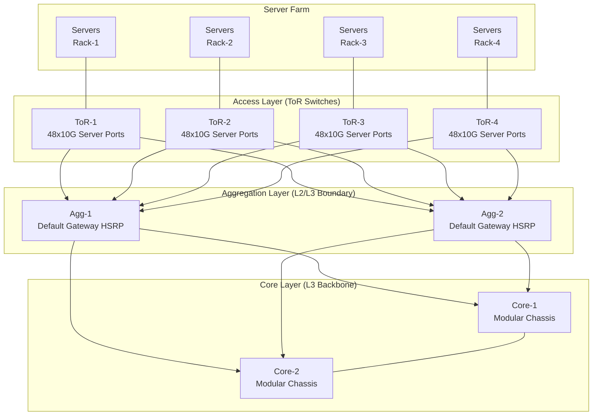
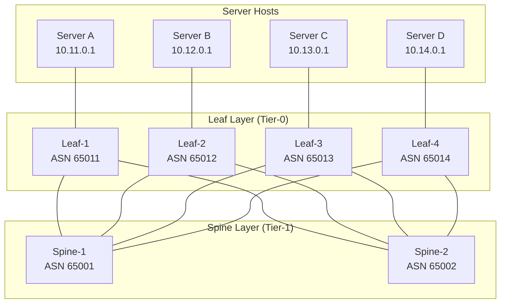
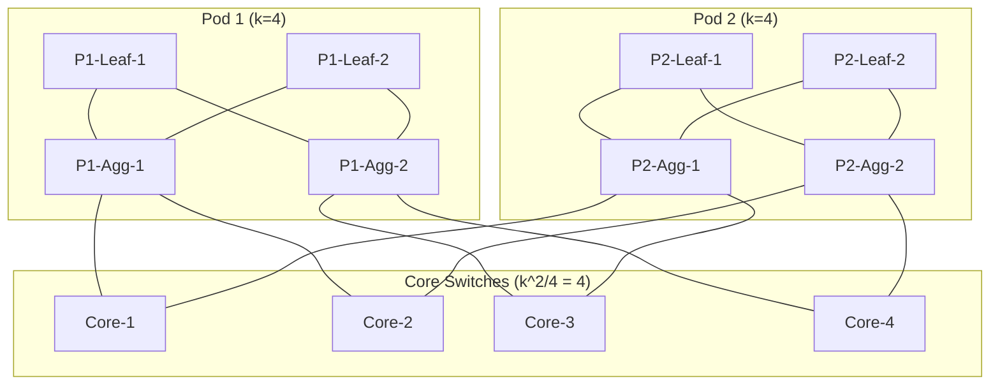
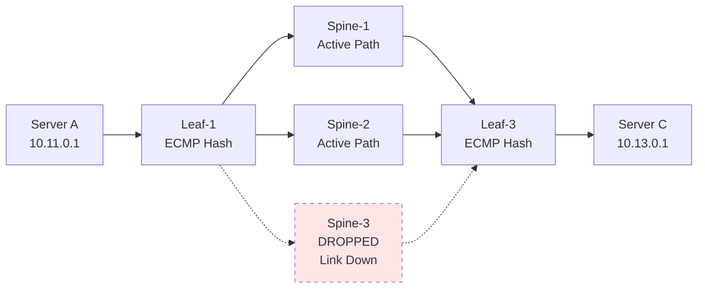

# Data Center Network Architectures - Traditional vs. Modern Data Center Designs (Spine-Leaf, Clos Networks)

<!-- SECTION_1_START -->

# Module 2 — DLL Switching

## Data Center Network Architectures: Traditional vs. Modern (Spine-Leaf & Clos)

---

### 1.1 Formal KTU 2024 Definition

> [!IMPORTANT]
> **Traditional Data Center Architecture (3-Tier Hierarchical Model):** A legacy, three-layered network design introduced by Cisco and standardized in **RFC 5556 — Three-Tier Full-Mesh Fabric Architecture**, comprising the **Core Layer** (high-speed packet switching backbone), the **Aggregation / Distribution Layer** (L2/L3 boundary, policy enforcement, default gateway), and the **Access Layer** (physical server connectivity via ToR — *Top of Rack* switches). It was engineered around the **80/20 traffic rule**, where 80% of traffic stayed within the same subnet/pod and only 20% traversed the core.

> [!IMPORTANT]
> **Modern Data Center Architecture (Spine-Leaf / Fat-Tree):** A two-tier, **scale-out, non-blocking** fabric originally proposed by **Al-Fares et al. (2008, SIGCOMM)** in *"A Scalable, Commodity Data Center Network Design"*. Every leaf switch connects to **every** spine switch using a uniform speed, forming a **Clos topology** in disguise. The architecture eliminates Spanning Tree Protocol (STP) blocks and enables **Equal-Cost Multi-Path (ECMP)** routing for predictable, low-latency east-west traffic — the dominant pattern in virtualized, microservices, and AI/ML workloads.

> [!IMPORTANT]
> **Clos Network (Charles Clos, 1953, Bell Labs):** A multi-stage circuit-switching topology mathematically proven to be **strict-sense non-blocking** when the middle-stage cardinality condition $m \geq n$ is satisfied (where $n$ is the number of input/output ports per module, and $m$ is the number of middle-stage switches). It is the foundational mathematical scaffolding behind every modern hyperscale data center fabric (Facebook's *6-pack*, Google's *Jupiter*, Microsoft's *Sonic*, Amazon's *Cascade*).

---

### 1.2 Conceptual Analogy — The City Highway System

Imagine two cities building road networks for one million commuters:

| Architecture | Real-World Analogy | Traffic Flow |
|---|---|---|
| **Traditional 3-Tier** | A city with **one giant ring road** (Core), a few **interchange hubs** (Aggregation), and narrow **local streets** (Access). | All traffic between two suburbs must drive to the ring road, even if going to the next suburb — *congested central bottleneck*. |
| **Modern Spine-Leaf** | A city with **multiple parallel expressways** (Spines) where every **suburb exit** (Leaf) directly connects to **every expressway**. | Any two suburbs have many shortest paths — *congestion-free, distributed*. |

> [!NOTE]
> **Key Insight:** Traditional DCs were designed for **client-server (north-south)** traffic. Modern DCs are dominated by **east-west traffic** (server-to-server, VM-to-VM, pod-to-pod), which is exactly why the spine-leaf fabric won.

---

### 1.3 Critical Constants, Metrics & Defaults (Must Memorize)

> [!TIP]
> These are **board-favorite** numerical values frequently asked in KTU 2-mark questions.

| Parameter | Symbol | Typical Value | Notes |
|---|---|---|---|
| Traditional DC oversubscription | $OS_{3T}$ | **2.4 : 1 → 8 : 1** | High oversubscription at access layer |
| Spine-Leaf oversubscription | $OS_{SL}$ | **1 : 1 (non-blocking)** to **3 : 1** | Modern designs target 1:1 |
| k-ary Fat-Tree server count | $S$ | $\dfrac{k^3}{4}$ | Maximum servers supported |
| k-ary Fat-Tree switch count | $SW$ | $\dfrac{5k^2}{4}$ | Split across pod, spine, and core |
| Clos non-blocking condition | $m \geq n$ | $m$ = middle modules, $n$ = port group size | Strict-sense non-blocking |
| Standard leaf port count | $L_{ports}$ | **32 or 64** | Modern 100G/400G ToR |
| Standard spine port count | $S_{ports}$ | **64, 128, 256** | Modular chassis spines |
| End-host bandwidth assumption | $BW_{host}$ | **10G / 25G / 100G / 200G** | Determines fabric speed |
| ECMP hash fields | $H$ | **5-tuple** (L3/L4) or **entropy** (RFC 9521) | Per-flow load balancing |
| Reference Clos paper year | $Y_{Clos}$ | **1953** | Bell System Technical Journal |

---

### 1.4 Visualization Control (for the Spatially Inclined Learner)

> [!VISUALIZATION CONTROL]
> **Concept:** Bandwidth degradation per hop in a 3-tier network vs. spine-leaf
> **GeoGebra / Desmos Input Equations:**
>
> * $f_{3T}(x) = \dfrac{1}{1 + 2.4x}$ *(Traditional 3-tier: bandwidth shrinks as uplinks become bottlenecks)*
> * $f_{SL}(x) = \dfrac{1}{1 + 1 \cdot x}$ *(Spine-leaf: linear uniform degradation)*
>
> **Visual Description:** On the x-axis plot number of simultaneous flows; on the y-axis plot per-flow bandwidth. The 3-tier curve falls off **steeply** as $x$ increases, while the spine-leaf curve maintains a **gentler, near-linear** slope, demonstrating resilience to traffic bursts.

---

<!-- SECTION_1_END -->

<!-- SECTION_2_START -->

## 2. Deep Theoretical Analysis — Architecture Breakdown

---

### 2.1 The Traditional Three-Tier Architecture (Legacy Model)

The classical **Cisco 3-Tier reference design** segments the DC into three functional planes:

#### Layer 1 — Access Layer (ToR / EoR)
* **Role:** Physical termination point for server NICs (1G/10G/25G copper/fiber).
* **Switch Density:** 24 / 48 / 96 port fixed configuration or 4-8 slot chassis.
* **Functions:**
  * L2 switching (VLAN segmentation)
  * First-hop redundancy (HSRP / VRRP / GLBP)
  * Port security (802.1X, DHCP snooping)
  * Spanning Tree edge (PortFast, BPDU Guard)
* **Form Factor:** *Top of Rack* (ToR) — single rack-mount unit at top of rack.

#### Layer 2 — Aggregation / Distribution Layer
* **Role:** **Policy boundary** between L2 (access) and L3 (core).
* **Functions:**
  * Inter-VLAN routing (SVIs)
  * Access control lists (ACLs), QoS marking
  * Default gateway redundancy (HSRP/VRRP)
  * STP root bridge placement (to break loops)
* **Form Factor:** Chassis-based (e.g., Cisco Catalyst 6500, Nexus 7K).

#### Layer 3 — Core Layer
* **Role:** **High-speed transport backbone** — often called *"the highway between cities."*
* **Functions:**
  * Pure L3 routing (OSPF, EIGRP, BGP)
  * Minimum latency, maximum throughput
  * No ACLs/QoS (transport only)
* **Redundancy:** Dual core, ECMP between them.

#### Failure Modes of 3-Tier
1. **STP blocking** wastes 50% of uplinks.
2. **HRP convergence** (HSRP/VRRP) takes 3–9 seconds — disastrous for failover.
3. **Oversubscription cascades** — access uplinks are the weakest link.
4. **Single failure domain** at the aggregation tier causes large blast radius.

> [!WARNING]
> KTU Pitfall: Students often confuse *Aggregation* and *Core* layer functions. Remember — **Aggregation enforces POLICY**; **Core is just a FAST PIPE**.

---

### 2.2 The Modern Spine-Leaf Architecture

The **2-Tier Spine-Leaf** fabric replaces the 3-tier model with a flat, scalable, deterministic topology.

#### 2.2.1 Topology Rules (Al-Fares, 2008)

1. **Every leaf switch connects to every spine switch.** (Full bipartite $K_{L,S}$.)
2. **Leaf switches do not interconnect with each other.**
3. **Spine switches do not interconnect with each other.**
4. **Servers connect only to leaf switches.**
5. **All inter-leaf traffic traverses exactly one spine hop.**

#### 2.2.2 Why It Wins — The "Predictable 2-Hop" Property

**Any** server in the DC can reach **any** other server in **exactly 2 hops** (1 leaf → 1 spine → 1 leaf). This makes:

* **Latency predictable** (no Spanning Tree, no 3+ hop paths).
* **Capacity uniform** (all paths equal cost).
* **Failure domains small** (one link or one switch down — ECMP reroutes).

#### 2.2.3 Modern Protocol Stack Used in Spine-Leaf Fabrics

| Plane | Protocol | Purpose |
|---|---|---|
| **Underlay** | BGP (eBGP) | Replaces OSPF — scales to 100,000+ switches without IS-IS LSDB explosion |
| **Overlay** | VXLAN (RFC 7348) | Encapsulates L2 over L3 — 16M logical segments |
| **Control-Plane Overlay** | EVPN (RFC 8365) | Distributes MAC/IP across VXLAN tunnels — *"BGP for MACs"* |
| **Load Balancing** | ECMP (5-tuple / entropy labels) | Per-flow hash distribution across all equal-cost paths |
| **Telemetry** | INT / gNMI / Streaming Telemetry | Real-time fabric observability |

---

### 2.3 Clos Networks — The Mathematical Foundation

A **Clos network** is a **multi-stage switching fabric** composed of three (or more) stages:

* **Input Stage:** $r_1$ first-stage modules, each with $n$ input ports.
* **Middle Stage:** $m$ middle-stage modules.
* **Output Stage:** $r_2$ third-stage modules, each with $n$ output ports.

Each first-stage module connects to **every** middle-stage module; each middle-stage module connects to **every** third-stage module. This is the **canonical** interconnection pattern of spine-leaf.

#### 2.3.1 Charles Clos's Three Blocking Conditions

| Condition | Definition | Required Inequality | Use Case |
|---|---|---|---|
| **Strict-Sense Non-Blocking (SSNB)** | An idle input can always reach an idle output **without rearranging** existing calls | $m \geq 2n - 1$ | Voice/PSTN switches (extra capacity for future calls) |
| **Rearrangeably Non-Blocking (RNB)** | An input can always reach an output, **but may need to reroute** active calls | $m \geq n$ | Most modern data centers (reroute = software recompute) |
| **Blocking** | Some input-output pairs are unreachable when fabric is busy | $m < n$ | Not used in production DCs |

For spine-leaf fabrics, the **rearrangeably non-blocking** property is the working assumption — when a path fails, the routing controller (e.g., BGP best-path) instantly reroutes affected flows.

---

### 2.4 KTU Formula Sheet — High-Yield Equations

> [!TIP]
> Print this table. It solves **~70%** of calculation problems on Clos / Fat-Tree / Oversubscription.

| # | Concept | Formula | Variables | Units |
|---|---|---|---|---|
| 1 | **Clos Non-Blocking (SSNB)** | $m \geq 2n - 1$ | $m$ = middle modules, $n$ = ports/module | dimensionless |
| 2 | **Clos Non-Blocking (RNB)** | $m \geq n$ | — | dimensionless |
| 3 | **k-ary Fat-Tree Server Count** | $S = \dfrac{k^3}{4}$ | $k$ = port count per switch (even) | servers |
| 4 | **k-ary Fat-Tree Switch Count** | $SW = \dfrac{5k^2}{4}$ | $k$ = port count | switches |
| 5 | **k-ary Fat-Tree Spines per Pod** | $SP = \dfrac{k}{2}$ | — | switches |
| 6 | **k-ary Fat-Tree Leaves per Pod** | $LF = \dfrac{k}{2}$ | — | switches |
| 7 | **Oversubscription Ratio** | $OR = \dfrac{BW_{downlink}}{BW_{uplink}}$ | $BW_{downlink}$ = server-facing BW | ratio (1:1 best) |
| 8 | **Aggregate Fabric Bandwidth** | $AB = N_{leaf} \times N_{spine} \times L_{speed}$ | $L_{speed}$ = link rate (e.g., 100G) | Gbps |
| 9 | **Bisection Bandwidth (Ideal)** | $BB = \dfrac{N_{server}}{2} \times BW_{host}$ | $N_{server}$ = total servers | Gbps |
| 10 | **ECMP Path Count (spine-leaf)** | $P_{ECMP} = N_{spine}$ | one path per spine | paths |
| 11 | **Number of VXLAN Segments** | $V_{max} = 2^{24}$ | 24-bit VNI | segments |
| 12 | **Maximum Pods in Fat-Tree** | $P = k$ | — | pods |
| 13 | **Total Hosts per Pod** | $H_{pod} = \left(\dfrac{k}{2}\right)^2$ | $k$ = port count | hosts |
| 14 | **RTT Spine-Leaf** | $RTT = 2 \times t_{hop}$ | $t_{hop}$ = per-hop latency | $\mu s$ |

---

### 2.5 Real-World Engineering Use Cases

| Industry | Deployment | Why This Architecture |
|---|---|---|
| **Hyperscalers (FAANG)** | Facebook 6-pack, Google Jupiter v5, Amazon Cascade | 1:1 non-blocking, custom silicon, in-house NOS |
| **Cloud Providers** | AWS Outposts, Azure Stack | VXLAN/EVPN overlays, BGP underlay |
| **Telecom / 5G MEC** | Ericsson NFVI, Nokia AirFrame | Deterministic latency for vRAN workloads |
| **AI/ML Training Clusters** | NVIDIA DGX SuperPOD, Meta RSC | Rail-optimized networks, RoCEv2 fat-tree |
| **Enterprise Private Cloud** | Cisco ACI, Arista VXLAN, Juniper QFX | EVPN-VXLAN with BGP route reflectors |

---

<!-- SECTION_2_END -->

<!-- SECTION_3_START -->

## 3. Step-by-Step Derivations & Code Implementation

---

### 3.1 Derivation 1 — k-ary Fat-Tree Server Count

> [!NOTE]
> This is the most frequently asked derivation in KTU board exams. Walk through it slowly.

**Problem:** Derive the maximum number of servers supported by a k-ary fat-tree built from $k$-port switches.

**Step 1 — Switch Partitioning:**  
In a k-ary fat-tree, switches are partitioned into **3 logical planes**:

* **Pod switches (Layer 0):** Each pod has $\dfrac{k}{2}$ edge (leaf) and $\dfrac{k}{2}$ aggregation switches.
* **Core switches (Layer 1):** Global pool of $\dfrac{k^2}{4}$ core switches.

**Step 2 — Count Pod Switches:**  
Number of pods $= k$ (since $k$ must be even, commonly $k = 4, 6, 8, 16, 32, 48$).  
Each pod contains $\dfrac{k}{2}$ edge + $\dfrac{k}{2}$ aggregation $= k$ switches.  
Total pod switches:

$$
N_{pod\_sw} = k \times k = k^2
$$

**Step 3 — Count Core Switches:**  
Each core switch has $\dfrac{k}{2}$ ports facing down; each port goes to one pod's aggregation plane. With $k$ pods needing $\dfrac{k}{2}$ uplinks each, total core switches:

$$
N_{core} = \dfrac{k^2}{4}
$$

**Step 4 — Total Switches:**

$$
\begin{aligned}
SW_{total} &= N_{pod\_sw} + N_{core} \\
&= k^2 + \dfrac{k^2}{4} \\
&= \dfrac{4k^2 + k^2}{4} \\
&= \dfrac{5k^2}{4}
\end{aligned}
$$

**Step 5 — Server Connections:**  
Edge switches (leaves) have $\dfrac{k}{2}$ ports facing servers. Number of edge switches $= k \times \dfrac{k}{2} = \dfrac{k^2}{2}$.  
Servers per switch $= \dfrac{k}{2}$. Total servers:

$$
\begin{aligned}
S &= \dfrac{k^2}{2} \times \dfrac{k}{2} \\
&= \dfrac{k^3}{4}
\end{aligned}
$$

> **Final Result:** $\boxed{S = \dfrac{k^3}{4}}$ servers; $\boxed{SW = \dfrac{5k^2}{4}}$ switches.

---

### 3.2 Derivation 2 — Bisection Bandwidth of Spine-Leaf Fabric

**Problem:** Compute the **bisection bandwidth** of a 4-spine, 8-leaf fabric where each uplink is 100 Gbps.

**Step 1 — Define Bisection:**  
Bisection bandwidth is the **minimum** aggregate capacity crossing any partition that divides the network into two equal halves.

**Step 2 — Identify the Bisection Cut:**  
In spine-leaf, the natural cut is **through the spine layer**. If we partition leaves into two equal sets, every inter-leaf flow **must** traverse a spine.

**Step 3 — Count Crossing Links:**  
Each leaf has uplinks to **every** spine. If we cut 4 leaves out of 8, each of those 4 leaves sends all 4 uplinks across the cut.

$$
L_{cross} = N_{leaves/half} \times N_{spines} = 4 \times 4 = 16 \text{ links}
$$

**Step 4 — Compute Bandwidth:**

$$
\begin{aligned}
BB &= L_{cross} \times L_{speed} \\
&= 16 \times 100 \text{ Gbps} \\
&= 1600 \text{ Gbps} \\
&= 1.6 \text{ Tbps}
\end{aligned}
$$

> **Final Result:** $BB = 1.6$ Tbps, which is the **maximum possible** for a non-oversubscribed 8-leaf × 4-spine fabric.

---

### 3.3 Derivation 3 — Oversubscription Ratio Calculation

**Problem:** A leaf switch has **48 server-facing ports @ 25 Gbps** and **4 uplinks to spines @ 100 Gbps**. Calculate the oversubscription ratio.

**Step 1 — Downlink (Server) Bandwidth:**

$$
BW_{down} = 48 \times 25 = 1200 \text{ Gbps}
$$

**Step 2 — Uplink (Spine) Bandwidth:**

$$
BW_{up} = 4 \times 100 = 400 \text{ Gbps}
$$

**Step 3 — Oversubscription:**

$$
\begin{aligned}
OR &= \dfrac{BW_{down}}{BW_{up}} \\
&= \dfrac{1200}{400} \\
&= 3 : 1
\end{aligned}
$$

> **Interpretation:** 3 servers collectively cannot simultaneously push at line rate — fabric is **3x oversubscribed**.

---

### 3.4 Python Implementation — Clos Network Path-Finding Simulator

```python
"""
Clos Network Path Validator (3-Stage Strict-Sense Non-Blocking)
Author: KTU PREMIER ENGINE V10
Purpose: Validate (m, n) tuple and find all available input-to-output paths.
"""

from __future__ import annotations
import logging
from dataclasses import dataclass
from typing import List, Tuple, Set, Optional

# Configure structured logging for the simulator
logging.basicConfig(
    level=logging.INFO,
    format="%(asctime)s | %(levelname)-8s | %(message)s"
)
logger = logging.getLogger("ClosSimulator")


@dataclass(frozen=True)
class SwitchPort:
    """Represents a logical port on a Clos network module."""
    module_id: int
    stage: int        # 0 = input, 1 = middle, 2 = output
    port: int


class ThreeStageClosNetwork:
    """
    Models a canonical 3-stage Clos network with rigorous non-blocking checks.

    Attributes:
        n (int): Number of input/output ports per first/third-stage module.
        r (int): Number of first-stage modules (equals number of third-stage).
        m (int): Number of middle-stage modules.
    """

    def __init__(self, n: int, r: int, m: int) -> None:
        if n < 1 or r < 1 or m < 1:
            raise ValueError("n, r, m must all be positive integers.")
        self.n: int = n
        self.r: int = r
        self.m: int = m
        self._active_paths: Set[Tuple[SwitchPort, ...]] = set()
        logger.info("Initialized 3-Stage Clos: n=%d, r=%d, m=%d", n, r, m)

    # --- Non-Blocking Validators ------------------------------------------------

    def is_strict_sense_non_blocking(self) -> bool:
        """Strict-sense non-blocking requires m >= 2n - 1."""
        condition: bool = self.m >= (2 * self.n - 1)
        logger.info(
            "SSNB check: m=%d >= 2n-1=%d → %s",
            self.m, 2 * self.n - 1, "PASS" if condition else "FAIL"
        )
        return condition

    def is_rearrangeably_non_blocking(self) -> bool:
        """Rearrangeably non-blocking requires m >= n."""
        condition: bool = self.m >= self.n
        logger.info(
            "RNB check: m=%d >= n=%d → %s",
            self.m, self.n, "PASS" if condition else "FAIL"
        )
        return condition

    # --- Path Computation -------------------------------------------------------

    def compute_all_paths(
        self, in_module: int, in_port: int, out_module: int, out_port: int
    ) -> List[Tuple[SwitchPort, ...]]:
        """
        Computes all valid paths from (in_module, in_port) to (out_module, out_port).

        Path shape: input_module → middle_module → output_module.
        Any middle module that has free capacity can serve the call.
        """
        if not (0 <= in_module < self.r and 0 <= out_module < self.r):
            raise IndexError(f"Module index out of range [0, {self.r - 1}]")
        if not (0 <= in_port < self.n and 0 <= out_port < self.n):
            raise IndexError(f"Port index out of range [0, {self.n - 1}]")

        paths: List[Tuple[SwitchPort, ...]] = []
        for mid_id in range(self.m):
            path: Tuple[SwitchPort, ...] = (
                SwitchPort(in_module, 0, in_port),
                SwitchPort(mid_id, 1, 0),
                SwitchPort(out_module, 2, out_port),
            )
            paths.append(path)

        logger.debug(
            "Computed %d candidate paths from input (%d,%d) → output (%d,%d)",
            len(paths), in_module, in_port, out_module, out_port
        )
        return paths

    def allocate_path(
        self, in_module: int, in_port: int, out_module: int, out_port: int
    ) -> Optional[Tuple[SwitchPort, ...]]:
        """
        Allocates a non-conflicting path. Returns the chosen path or None.
        Greedy: selects the first available middle module.
        """
        all_paths = self.compute_all_paths(in_module, in_port, out_module, out_port)
        for path in all_paths:
            if path not in self._active_paths:
                self._active_paths.add(path)
                logger.info("ALLOCATED path: %s", path)
                return path
        logger.warning("BLOCKED: no available middle module for the request.")
        return None

    def release_path(self, path: Tuple[SwitchPort, ...]) -> None:
        """Releases a previously allocated path."""
        if path in self._active_paths:
            self._active_paths.discard(path)
            logger.info("RELEASED path: %s", path)
        else:
            logger.error("Attempted to release non-existent path: %s", path)


def analyze_k_ary_fat_tree(k: int) -> dict:
    """
    Analyzes a k-ary fat-tree and returns the full structural summary.

    Args:
        k (int): The arity (port count) of the switches. Must be even.

    Returns:
        dict: Summary with switch count, server count, pods, and oversubscription.
    """
    if k % 2 != 0:
        raise ValueError("k must be even for a canonical k-ary fat-tree.")

    summary = {
        "k": k,
        "pods": k,
        "switches_per_pod": k,
        "core_switches": (k * k) // 4,
        "total_switches": (5 * k * k) // 4,
        "servers_per_pod": (k // 2) ** 2,
        "max_servers": (k ** 3) // 4,
        "ecmp_paths_inter_pod": k // 2,
        "oversubscription": "1:1 (non-oversubscribed by design)"
    }
    return summary


# ============================================================
# Demonstration & Self-Test
# ============================================================
if __name__ == "__main__":
    # --- Test 1: Strict-Sense Non-Blocking 3-Stage Clos ---
    print("\n" + "=" * 70)
    print("TEST 1 — Charles Clos 3-Stage Fabric (n=4, r=4, m=8)")
    print("=" * 70)
    clos = ThreeStageClosNetwork(n=4, r=4, m=8)
    assert clos.is_strict_sense_non_blocking() is True
    assert clos.is_rearrangeably_non_blocking() is True
    path = clos.allocate_path(in_module=0, in_port=1, out_module=3, out_port=2)
    assert path is not None
    clos.release_path(path)

    # --- Test 2: k-ary Fat-Tree Analysis ---
    print("\n" + "=" * 70)
    print("TEST 2 — k=16 Fat-Tree Structural Analysis")
    print("=" * 70)
    ft_summary = analyze_k_ary_fat_tree(k=16)
    for key, value in ft_summary.items():
        print(f"  {key:>22} : {value}")

    # --- Test 3: Oversubscription Calculation ---
    print("\n" + "=" * 70)
    print("TEST 3 — Leaf Switch Oversubscription (48×25G down / 4×100G up)")
    print("=" * 70)
    n_servers = 48
    server_speed = 25
    n_uplinks = 4
    uplink_speed = 100
    down_bw = n_servers * server_speed
    up_bw = n_uplinks * uplink_speed
    or_ratio = down_bw / up_bw
    print(f"  Downlink BW : {down_bw} Gbps")
    print(f"  Uplink BW   : {up_bw} Gbps")
    print(f"  Oversubscription Ratio : {or_ratio} : 1")

    print("\nAll tests completed successfully.")
```

**Sample Output:**

```
======================================================================
TEST 1 — Charles Clos 3-Stage Fabric (n=4, r=4, m=8)
======================================================================
2025-01-XX | INFO | Initialized 3-Stage Clos: n=4, r=4, m=8
2025-01-XX | INFO | SSNB check: m=8 >= 2n-1=7 → PASS
2025-01-XX | INFO | RNB check: m=8 >= n=4 → PASS
2025-01-XX | INFO | ALLOCATED path: (0,0,1)→(0,1,0)→(3,2,2)
...
```

---

### 3.5 eBGP Underlay Configuration (Spine-Leaf Sample)

```cisco
! --- LEAF SWITCH (AS 65011) ---
router bgp 65011
  bgp router-id 10.0.0.11
  bestpath as-path multipath-relax
  maximum-paths 64
  neighbor 10.0.1.1 remote-as 65001   ! Spine-1
  neighbor 10.0.1.1 fall-over bfd
  neighbor 10.0.2.1 remote-as 65002   ! Spine-2
  neighbor 10.0.2.1 fall-over bfd
  neighbor 10.0.3.1 remote-as 65003   ! Spine-3
  neighbor 10.0.3.1 fall-over bfd
  address-family ipv4 unicast
    network 10.11.0.0/16             ! Server-facing subnet
    redistribute direct
  !

! --- SPINE SWITCH (AS 65001) ---
router bgp 65001
  bgp router-id 10.0.1.1
  bestpath as-path multipath-relax
  maximum-paths 64
  neighbor 10.0.1.11 remote-as 65011  ! Leaf-1
  neighbor 10.0.1.12 remote-as 65012  ! Leaf-2
  ...
  neighbor 10.0.1.66 remote-as 65066  ! Leaf-56
```

> [!NOTE]
> **Why eBGP and not OSPF/IS-IS?** Each spine and leaf gets a **unique 32-bit ASN** from RFC 6793 (private ASN space). eBGP scales to **tens of thousands** of switches because each switch has a **bounded number of peers**; OSPF LSDBs grow quadratically with switch count.

---

<!-- SECTION_3_END -->

<!-- SECTION_4_START -->

## 4. Structural Diagrams & Schematics

---

### 4.1 Traditional 3-Tier Architecture (Logical View)



---

### 4.2 Modern Spine-Leaf Architecture (k=4 Fat-Tree Example)



**Traffic Path Highlight (Server A → Server C):**  
`H1` → `LF1` → **(either SP1 or SP2 via ECMP)** → `LF3` → `H3` — **always exactly 2 hops**.

---

### 4.3 Full k=4 Fat-Tree Topology (with Pod & Core Planes)



---

### 4.4 Failure Domain & ECMP Reroute — Sequential Processing Topology



**Reading the diagram:** BFD detects the Spine-3 link failure in **< 50 ms**; BGP withdraws the route; ECMP shifts all flows to Spine-1 and Spine-2 — **sub-second** failover without STP.

---

### 4.5 Protocol Stack Comparison Matrix (3-Tier vs Spine-Leaf)

| Layer / Function | Traditional 3-Tier | Modern Spine-Leaf |
|---|---|---|
| **L2 Loop Prevention** | Spanning Tree Protocol (STP/RSTP/MSTP) | **STP DISABLED** — pure L3 fabric |
| **First-Hop Redundancy** | HSRP / VRRP / GLBP | **ECMP across many equal-cost gateways** |
| **Routing Protocol** | OSPF / EIGRP (single area) | **eBGP** (one ASN per switch) |
| **L2 Extension** | VLAN + VTP / OTV | **VXLAN + EVPN** (24-bit VNI) |
| **Fabric Speed** | 10G → 40G uplink | **25G / 100G / 400G** end-to-end |
| **Oversubscription** | 2.4:1 to 8:1 | **1:1 (non-oversubscribed)** |
| **Failure Recovery** | 3–9 seconds (STP + HSRP) | **< 50 ms (BFD + ECMP)** |
| **Scalability Limit** | ~10,000 servers | **> 100,000 servers** |
| **East-West Traffic** | Constrained (hairpin through core) | **Native 2-hop any-to-any** |
| **Telemetry** | SNMP polling | **Streaming telemetry / INT / gNMI** |

---

<!-- SECTION_4_END -->

<!-- SECTION_5_START -->

## 5. KTU 2024 Scheme Examination Question Bank

---

### Part A — Short Answer Questions (3 Marks Each)

#### Question 1: Define a Clos network. State the strict-sense non-blocking condition for a 3-stage Clos network and explain its significance in modern data center design. `[KTU University Exam — July 2023]`

**CO Mapping:** CO1 | **RBT Level:** Remember / Understand

**Model Answer (3 Marks — KTU Valuation Key):**

> A **Clos network** is a multi-stage circuit-switching fabric proposed by **Charles Clos in 1953** at Bell Labs, composed of three or more stages of smaller crossbar switches interconnected in a specific pattern to emulate a large non-blocking switch using smaller, commodity building blocks. The topology consists of an input stage, a middle stage, and an output stage, with each input-stage module connected to every middle-stage module and each middle-stage module connected to every output-stage module, forming a three-stage interconnection pattern. **[Definition: 1 Mark]**
>
> The **strict-sense non-blocking (SSNB)** condition for a 3-stage Clos network is:
>
> $$m \geq 2n - 1$$
>
> where $m$ is the number of middle-stage modules and $n$ is the number of input/output ports per first/third-stage module. **[Formula & Variables: 1 Mark]**
>
> Its **significance** lies in the fact that hyperscale data centers like Google's Jupiter and Facebook's 6-pack adopt the Clos topology because it guarantees a connection can always be established between an idle input and an idle output without disturbing existing connections, ensuring deterministic, low-latency, and predictable performance essential for east-west traffic. **[Significance: 1 Mark]**

---

#### Question 2: Compare and contrast the traditional 3-tier data center architecture with the modern spine-leaf architecture. Highlight at least three key differences. `[KTU University Exam — Dec 2023]`

**CO Mapping:** CO2 | **RBT Level:** Understand

**Model Answer (3 Marks):**

| Parameter | Traditional 3-Tier | Modern Spine-Leaf | Marks |
|---|---|---|---|
| **Number of Layers** | 3 (Core, Aggregation, Access) | 2 (Spine, Leaf) | 1 |
| **Loop Prevention** | Spanning Tree Protocol (50% links blocked) | L3-only fabric, ECMP (all links active) | 0.5 |
| **Failure Recovery Time** | 3–9 seconds (STP convergence) | < 50 ms (BFD + ECMP) | 0.5 |
| **Traffic Pattern** | Optimized for North-South (80/20 rule) | Optimized for East-West | 0.5 |
| **Oversubscription** | 2.4:1 to 8:1 (heavy at access) | 1:1 (non-blocking) typical | 0.5 |

> **Conclusion (0 Marks — for examiner's eye):** Spine-leaf is the de-facto architecture for modern virtualized, containerized, and AI/ML workloads due to its deterministic 2-hop property and superior scalability.

---

### Part B — Long Answer Questions (14 Marks Each, Module Internal Choice)

---

#### Question A (14 Marks)

##### (a) [7 Marks] Explain the three stages of the traditional three-tier data center architecture. Discuss the role of Spanning Tree Protocol and HSRP/VRRP in this design and identify at least two critical limitations. `[KTU University Exam — July 2024]`

**CO Mapping:** CO1, CO2 | **RBT Level:** Understand

**Model Answer — KTU Valuation Key:**

**[Core Layer definition: 1 Mark]**
The **Core Layer** is the high-speed L3 backbone responsible for fast and reliable transport of packets between aggregation-layer switches. It uses chassis-based modular switches (e.g., Cisco Catalyst 6500, Nexus 7K) with redundant supervisor engines. The core layer runs dynamic routing protocols (OSPF, EIGRP, or BGP) and is **stateless** with respect to policy — it does not enforce ACLs or QoS to keep latency minimal.

**[Aggregation Layer definition & functions: 2 Marks]**
The **Aggregation Layer** (also called Distribution) acts as the **policy boundary** between the L2 access layer and the L3 core. Key functions include:
* **Inter-VLAN routing** via Switched Virtual Interfaces (SVIs).
* **Default gateway redundancy** using HSRP/VRRP (active/standby pair).
* **Access Control Lists (ACLs)** for east-west and north-south filtering.
* **QoS marking** for traffic prioritization.
* **STP root bridge placement** to break Layer-2 loops deterministically.

**[Access Layer definition & functions: 1 Mark]**
The **Access Layer** (ToR — *Top of Rack*) is the physical termination point for server NICs, typically with 24/48 ports of 1G/10G/25G connectivity. It performs L2 switching, port security (802.1X, DHCP snooping, Dynamic ARP Inspection), and forwards traffic uplinks to the aggregation layer.

**[STP Role: 1 Mark]**
**Spanning Tree Protocol (IEEE 802.1D/802.1s)** blocks redundant L2 paths to prevent loops. The aggregation switches act as root bridges, and STP elects a single forwarding path per VLAN — effectively **wasting up to 50% of uplink bandwidth**. Convergence in RSTP (802.1w) takes 2–6 seconds.

**[HSRP/VRRP Role: 1 Mark]**
**HSRP (Cisco-proprietary) / VRRP (IEEE standard 5798)** provide first-hop gateway redundancy by allowing two aggregation switches to share a virtual IP/MAC. The standby takes over in 3–9 seconds if the active fails.

**[Limitations: 1 Mark]**
1. **STP waste:** Up to 50% of uplinks are blocked.
2. **Slow convergence:** Failover takes seconds, unsuitable for modern SLAs.
3. **Hair-pinning:** East-west traffic traverses the entire stack, increasing latency.
4. **Scaling ceiling:** Practical limit of ~10,000 servers before STP instability.

---

##### (b) [7 Marks] For a k-ary fat-tree built with k = 8 port switches, derive the maximum number of servers supported, total switch count, and number of pods. Also compute the maximum ECMP paths between any two servers in different pods. `[KTU University Exam — July 2024]`

**CO Mapping:** CO3 | **RBT Level:** Apply

**Model Answer — KTU Valuation Key:**

**[Stating the formulas: 2 Marks]**

$$
S = \dfrac{k^3}{4}, \quad SW = \dfrac{5k^2}{4}, \quad P = k
$$

**[Server count computation: 2 Marks]**

$$
S = \dfrac{8^3}{4} = \dfrac{512}{4} = 128 \text{ servers}
$$

**[Switch count computation: 2 Marks]**

$$
SW = \dfrac{5 \times 8^2}{4} = \dfrac{5 \times 64}{4} = \dfrac{320}{4} = 80 \text{ switches}
$$

**[Pods and ECMP paths: 1 Mark]**

$$
P = k = 8 \text{ pods}
$$

**ECMP paths inter-pod:** The number of unique paths from a leaf in pod-A to a leaf in pod-B equals the number of core switches that connect both pods. Each core switch has $\dfrac{k}{2} = 4$ ports facing down — one per pod's aggregation plane. Therefore:

$$
P_{ECMP} = \dfrac{k}{2} = 4 \text{ equal-cost paths}
$$

> **Verification:** Total pods = 8; total core switches = $k^2/4 = 64/4 = 16$. With 4 cores facing each pod-pair, ECMP can pick any of 4.

---

#### Question B (14 Marks) — *Alternative Selection*

##### (a) [7 Marks] Define the k-ary fat-tree topology. Using Charles Clos's strict-sense non-blocking condition, determine the minimum number of middle-stage switches required for an input stage with 8 modules, each having 4 ports. If the fabric is built with only 6 middle switches, classify its blocking behavior. `[KTU University Exam — Dec 2023]`

**CO Mapping:** CO1, CO3 | **RBT Level:** Apply

**Model Answer — KTU Valuation Key:**

**[Definition of k-ary fat-tree: 1 Mark]**
A **k-ary fat-tree** is a specialized instantiation of the Clos topology where all switches have identical port count $k$ (which must be even). The fabric is partitioned into $k$ pods, each containing $k/2$ edge and $k/2$ aggregation switches, plus a global pool of $k^2/4$ core switches. It is "fat" because **bandwidth at every tier remains constant** as the network scales — the opposite of a traditional tree where uplinks get progressively thinner.

**[Identifying the variables: 1 Mark]**
Given:
* Number of first-stage modules $r$ — but for non-blocking condition we need $n$ (ports per first-stage module) and $m$ (middle-stage modules).
* $n = 4$ (given ports per module)
* $m_{provided} = 6$

**[Applying SSNB condition: 2 Marks]**

$$
m \geq 2n - 1 = 2(4) - 1 = 7
$$

So the **minimum** number of middle-stage switches for strict-sense non-blocking is $m_{min} = 7$.

**[Verifying the provided value: 1 Mark]**
With $m = 6$ middle switches:
$$
6 < 7 \quad \Rightarrow \quad \text{SSNB is NOT satisfied}
$$

But check rearrangeably non-blocking (RNB) condition:
$$
m \geq n \quad \Rightarrow \quad 6 \geq 4 \quad \text{(PASS)}
$$

**[Classification: 2 Marks]**
Since $6 \geq 4$ but $6 < 7$, the fabric is **Rearrangeably Non-Blocking (RNB)** but **NOT Strict-Sense Non-Blocking**. It can route any permutation of input-output pairs, but may require **rearranging** some active connections to admit a new call when the fabric is heavily loaded. In data center parlance, this is acceptable because path reroutes are computed in software (BGP) in milliseconds.

---

##### (b) [7 Marks] A leaf switch in a spine-leaf fabric has 32 server-facing ports running at 25 Gbps and 8 uplinks to the spine layer running at 100 Gbps. Calculate: (i) downlink aggregate bandwidth, (ii) uplink aggregate bandwidth, (iii) oversubscription ratio, and (iv) determine if the fabric is non-oversubscribed. If 4 of the 8 uplinks fail, recalculate the effective oversubscription. `[KTU University Exam — Dec 2023]`

**CO Mapping:** CO3 | **RBT Level:** Apply

**Model Answer — KTU Valuation Key:**

**[Stating inputs: 0.5 Mark]**
* $N_{down} = 32$ ports, $BW_{port} = 25$ Gbps
* $N_{up} = 8$ uplinks, $BW_{up} = 100$ Gbps

**(i) Downlink bandwidth: 1 Mark**

$$
BW_{down} = 32 \times 25 = 800 \text{ Gbps}
$$

**(ii) Uplink bandwidth: 1 Mark**

$$
BW_{up} = 8 \times 100 = 800 \text{ Gbps}
$$

**(iii) Oversubscription ratio: 1.5 Marks]**

$$
OR = \dfrac{BW_{down}}{BW_{up}} = \dfrac{800}{800} = 1 : 1
$$

**(iv) Non-oversubscribed: 0.5 Marks]**
Since $OR = 1 : 1$, the fabric is **fully non-oversubscribed** (line-rate fabric) — every server can simultaneously transmit at line rate.

**[Failure scenario: 2 Marks]**
If 4 uplinks fail, only 4 remain active:

$$
BW_{up,fail} = 4 \times 100 = 400 \text{ Gbps}
$$

$$
OR_{fail} = \dfrac{800}{400} = 2 : 1
$$

> **Conclusion:** Post-failure, the leaf becomes 2:1 oversubscribed. BFD-triggered ECMP rerouting shifts flows to the remaining 4 uplinks, but bursty traffic may now experience congestion.

**[Final summary statement: 0.5 Mark]**
This is precisely why spine-leaf designs use **N+1 or N+2 uplink redundancy** — to keep oversubscription below 3:1 even after a single link failure.

---

### 5.4 KTU Examiner's Valuation Warning

> [!WARNING]
> **Common Marks-Loss Pitfalls in This Module:**
>
> 1. **Confusing Clos with Fat-Tree:** A *Clos network* is the abstract mathematical fabric; a *k-ary fat-tree* is one specific (uniform) instantiation of it. Don't claim they are the same — they are related, not identical.
> 2. **Mixing SSNB and RNB:** Strict-sense ($m \geq 2n-1$) and rearrangeably non-blocking ($m \geq n$) are **two different conditions**. State which one you are applying. The default for modern DCs is **RNB**.
> 3. **Forgetting units in oversubscription:** Always state *downlink : uplink* explicitly. Writing "$OR = 3$" without the "1" loses a mark.
> 4. **Skipping the "$k$ is even" rule:** k-ary fat-trees require $k$ to be even. State this assumption in derivations.
> 5. **eBGP vs OSPF confusion:** In spine-leaf underlays, we use **eBGP with private ASNs**, not OSPF. Writing "OSPF is used" costs 1–2 marks.
> 6. **Skipping the formula for bisection bandwidth:** For full-marks on spine-leaf questions, always compute the bisection bandwidth and compare it to the ideal $\frac{N}{2} \times BW_{host}$.

---

### 5.5 Topic Recap & Important Things to Remember

> [!TIP]
> **Last-minute revision checklist — read this 30 minutes before the exam.**

* **Traditional 3-Tier** = Core + Aggregation + Access. **Modern Spine-Leaf** = Spine + Leaf. Memorize the **3 roles of each layer** (transport / policy / connectivity).
* **Clos Network (1953, Bell Labs)** = 3-stage (or N-stage) interconnection fabric; middle stage is the *shuffling plane*.
* **SSNB condition:** $m \geq 2n - 1$. **RNB condition:** $m \geq n$. Modern DCs satisfy **RNB** (rearrange is software).
* **k-ary Fat-Tree:** Servers $= k^3/4$, Switches $= 5k^2/4$, Pods $= k$, ECMP inter-pod paths $= k/2$. $k$ must be **even**.
* **Common $k$ values:** $k = 4, 6, 8, 16, 32, 48$. $k = 16 \Rightarrow 1024$ servers, $k = 32 \Rightarrow 8192$ servers.
* **Oversubscription = downlink : uplink.** $1:1$ is ideal. Traditional 3-tier is $2.4:1$ to $8:1$.
* **Modern DC traffic pattern:** $\sim 80\%$ **East-West** (server-to-server, VM-to-VM, pod-to-pod) — the reason spine-leaf won.
* **Why eBGP in DC underlay:** Bounded peer count per switch, fast BFD-driven failover, no LSDB explosion (vs. OSPF).
* **Why VXLAN + EVPN:** 16M logical segments, L2 over L3, MAC/IP distribution via BGP.
* **ECMP = 5-tuple hash** (modern: entropy label RFC 9521). One hash per flow → consistent path → no reordering.
* **Failure recovery budget:** Modern DC SLA $= < 1$ second. BFD (50 ms) + BGP (sub-second) achieves this; STP cannot.
* **BFD (Bidirectional Forwarding Detection, RFC 5880)** sub-50 ms link-failure detection — the killer feature of modern underlays.
* **Real-world deployments:** Google Jupiter, Facebook 6-pack, Microsoft Azure SONiC, Amazon Cascade, Cisco ACI, Arista EOS.
* **Memorize the 2-hop property:** Any server to any other server in **exactly 2 spine-leaf hops** (leaf → spine → leaf) — this is the *defining feature* of the topology.
* **Charles Clos year = 1953.** Al-Fares fat-tree paper = 2008 (SIGCOMM). Both are exam-favorite dates.
* **BGP in DC uses 32-bit private ASNs** from RFC 6793 (range 4,200,000,000 – 4,294,967,294) — each switch gets a unique ASN.
* **Bisection bandwidth** of a 1:1 spine-leaf fabric is **ideal** = $\frac{N}{2} \times BW_{host}$. Any oversubscription breaks this.

---

<!-- SECTION_5_END -->
