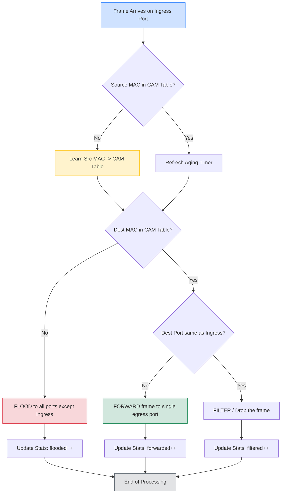
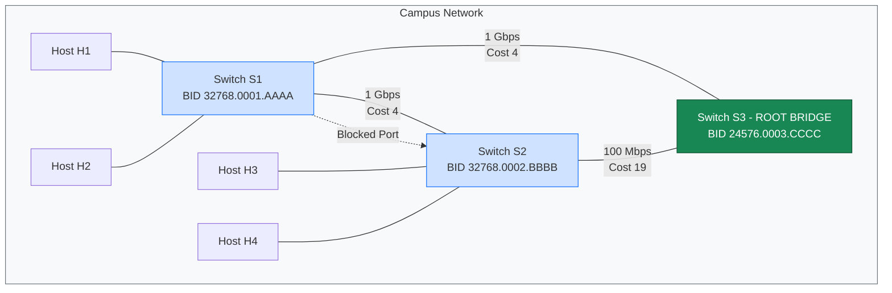
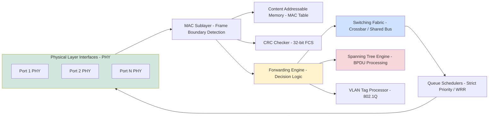
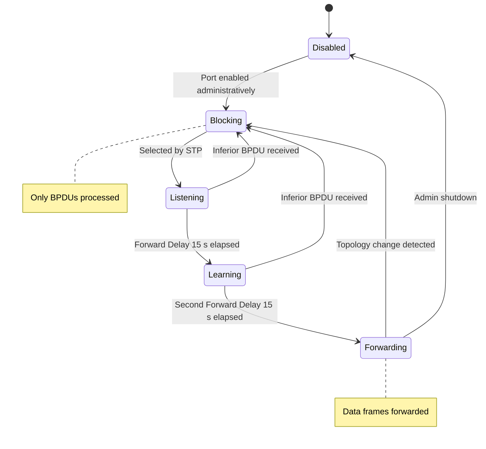

# DLL switching - Overview

<!-- SECTION_1_START -->
# DLL Switching — Overview

## 1.1 Formal KTU 2024 Definition

**Data Link Layer (DLL) Switching** is a frame-forwarding mechanism that operates at **Layer 2 of the OSI / TCP-IP reference model**, in which a network device (a *bridge* or *Layer-2 switch*) examines the destination **MAC (Media Access Control) address** of every incoming Ethernet frame, consults an internal forwarding table, and selectively transmits the frame out of the *single* port that leads toward the destination host.

Per the **KTU 2024 Scheme (PECST751 — Advanced Computer Networks, Module 2)**, DLL switching encompasses three core sub-topics:

1. **Bridges and LAN switches** (transparent bridging, learning bridges).
2. **Spanning Tree Protocol (STP — IEEE 802.1D)** and its evolution (**RSTP — IEEE 802.1w, MSTP — IEEE 802.1s**).
3. **Cut-through, Store-and-Forward, and Fragment-Free** switching modes.

> [!IMPORTANT]
> **KTU 2024 Syllabus Highlight**
> A *bridge* connects **two or more LAN segments** at Layer 2 and forwards frames using MAC tables. A *Layer-2 switch* is essentially a **multi-port bridge** with hardware-accelerated ASIC-based forwarding. Both are *DLL switches* for the purpose of this module.

## 1.2 Conceptual Analogy — The Smart Postal Sorting Office

Imagine a **massive postal sorting office** at the heart of a city:

- Every **letter (Ethernet frame)** arrives at a counter (the **switch port**).
- The clerk reads only the **recipient's house number and street (Destination MAC address)** — he does **not** open the letter to read its contents (no Layer-3 inspection).
- The clerk checks a **register (MAC address table / CAM table)** that maps every house number to a specific **delivery route (switch port)**.
- The letter is then pushed onto the **correct outgoing truck (the right port)**.

If the house number is **unknown**, the clerk broadcasts the letter to **all routes except the one it arrived from** — this is called *unknown-unicast flooding*. Once the destination replies, the clerk updates the register — this is **MAC address learning**.

> [!NOTE]
> **Why Layer 2 and not Layer 3?**
> Layer-2 switching is **faster** than routing because it avoids IP header parsing, longest-prefix matching, and TTL decrement. It is the workhorse of every campus, data-center ToR (Top-of-Rack), and enterprise LAN.

## 1.3 Standard Metrics & Physical Constants

| Parameter | Standard Value |
|---|---|
| MAC address length | **48 bits** (IEEE 802) |
| MAC address notation | `XX:XX:XX:XX:XX:XX` (hex) |
| OUI (vendor prefix) | First **24 bits** |
| Minimum Ethernet frame | **64 bytes** |
| Maximum Ethernet frame | **1518 bytes** (1522 with VLAN tag) |
| Standard STP convergence | **30 – 50 seconds** |
| RSTP convergence | **< 6 seconds** |
| Default STP bridge priority | **32768** (0x8000) |
| Default STP port cost (1 Gbps) | **4** |
| Default STP port cost (100 Mbps) | **19** |
| Default STP port cost (10 Mbps) | **100** |

> [!VISUALIZATION CONTROL]
> **Concept:** MAC-Address-to-Port Mapping inside a CAM Table.
> **Desmos / GeoGebra Input Points:**
> * Point $A = (0, 0)$ labelled `HOST_A -> MAC_AA`
> * Point $B = (5, 0)$ labelled `HOST_B -> MAC_BB`
> * Point $C = (2.5, 4)$ labelled `SWITCH_PORT_3`
> * Edges `A -- C` and `B -- C` representing the lookup.
> **Visual Description:** Observe a *star topology* where two end hosts map to a single central switch port. The CAM table is consulted at every frame; the *x-axis* represents **port index**, the *y-axis* represents **MAC OUI prefix** for visual clustering.

<!-- SECTION_1_END -->

<!-- SECTION_2_START -->
# Deep Theoretical Analysis & KTU High-Yield Formula Sheet

## 2.1 The Three Pillars of DLL Switching

A functional Layer-2 switch must perform the following operations in hardware at **wire speed**:

1. **MAC Address Learning** — Populating the CAM (Content-Addressable Memory) table dynamically by inspecting the *source MAC* of every incoming frame.
2. **Frame Forwarding / Filtering** — Decision based on the *destination MAC*:
   * **Known unicast** → forward out exactly **one** port.
   * **Unknown unicast** → flood out **all** ports except the ingress port.
   * **Broadcast / Multicast** → flood out all ports except the ingress port (unless controlled by IGMP snooping).
3. **Loop Avoidance** — Running **Spanning Tree Protocol (STP)** to logically disable redundant links, preventing *broadcast storms*, *MAC-table instability*, and *duplicate frames*.

## 2.2 Switching Modes — Latency vs Reliability Trade-off

| Mode | Reads only | Latency | Error Check | Use Case |
|---|---|---|---|---|
| **Cut-Through** | First **6 bytes** (dest MAC) | **Lowest** ($\approx$ 5 – 10 $\mu s$) | ❌ No CRC check | High-frequency trading, HPC |
| **Store-and-Forward** | **Entire frame** | Highest ($\propto$ frame size) | ✅ Full CRC check | Enterprise, data-centers |
| **Fragment-Free** | First **64 bytes** | Moderate | ✅ Detects *runts* and *collisions* | Legacy Cisco defaults |
| **Adaptive Cut-Through** | Switches dynamically | Variable | Conditional | Modern ASICs |

> [!NOTE]
> Latency for **Store-and-Forward** = $\dfrac{L}{R}$, where $L$ = frame length (bits) and $R$ = port rate (bps). For a 1500-byte frame at 1 Gbps: $t = \dfrac{1500 \times 8}{10^9} = 12 \,\mu s$.

## 2.3 Spanning Tree Protocol (STP) — IEEE 802.1D

STP elects a **Root Bridge** (lowest Bridge ID = Priority + MAC), then computes the **lowest-cost path** from every switch to the root. Ports transition through five states:

$$ \text{Disabled} \;\to\; \text{Blocking} \;\to\; \text{Listening} \;\to\; \text{Learning} \;\to\; \text{Forwarding} $$

**Default Timers:**
* Forward Delay = **15 s**
* Hello Time = **2 s**
* Max Age = **20 s**
* Total worst-case convergence = **3 × Forward Delay + Max Age = 50 s**

## 2.4 Bridge ID Format

$$ \text{Bridge ID} = \underbrace{\text{Priority (4 bits)}}_{\text{default } 0x8000} \;\; \vert\;\; \underbrace{\text{Extended System ID (12 bits)}}_{\text{VLAN-aware STP}} \;\; \vert\;\; \underbrace{\text{MAC Address (48 bits)}} $$

Total Bridge ID = **64 bits**. The *lowest* Bridge ID wins the Root election.

## 2.5 KTU Formula Sheet / Cheat Sheet

| # | Formula / Rule | Variables | Units | Use |
|---|---|---|---|---|
| 1 | $t_{sf} = \dfrac{8 L}{R}$ | $L$ = frame size, $R$ = port rate | seconds | Store-and-Forward latency |
| 2 | $t_{ct} = \dfrac{8 \times 6}{R}$ | First 6 bytes (dest MAC) | seconds | Cut-Through latency |
| 3 | $\text{Path Cost} = \sum \text{port\_cost}(i)$ | IEEE cost per link | unitless | STP root-path cost |
| 4 | $\text{Bridge ID} = P \mid \text{VLAN} \mid \text{MAC}$ | P = priority | 64-bit value | Root election |
| 5 | $\text{Convergence}_{STP} = 2 \times FD + MA$ | FD = 15 s, MA = 20 s | seconds | STP worst-case |
| 6 | $\text{Convergence}_{RSTP} \le 6 \, s$ | Proposal/Agreement | seconds | RSTP rapid reconvergence |
| 7 | $\text{MAC Table Size} = 2^n$ | $n$ = CAM bits | entries | Switch capacity |
| 8 | $\text{Throughput}_{wire-speed} = N \times R$ | N = ports, R = rate | bps | Non-blocking fabric |
| 9 | $P_{\text{drop}} = 1 - \rho^{N \cdot K}$ | $\rho$ = load | unitless | Erlang-B blocking |
| 10 | $\text{Frame Rate} = \dfrac{R}{8 L_{\min}}$ | $L_{\min} = 64$ | fps | Wire-speed minimum |

> [!TIP]
> The **non-blocking** condition for a switch fabric is: $N \times R_{\text{port}} \le R_{\text{backplane}}$. For a 24-port 1-Gbps switch you need at least **24 Gbps** of backplane bandwidth. Modern switches quote **double** this to support full-duplex.

## 2.6 Real-World Engineering Utility

| Domain | Why DLL Switching is Critical |
|---|---|
| **Data Centers (ToR / Leaf-Spine)** | Low-latency east-west traffic between servers (used by VMware NSX, Cisco Nexus). |
| **Campus Networks** | VLAN segmentation, broadcast domain control. |
| **Industrial IoT** | Deterministic latency in PROFINET, EtherCAT (all Layer-2). |
| **5G Backhaul (F1 interface)** | Ethernet-based fronthaul, MAC learning for DU-CU traffic. |
| **SDN (OpenFlow)** | OpenFlow 1.0 matches on Layer-2 headers (DMAC, SMAC, VLAN). |

<!-- SECTION_2_END -->

<!-- SECTION_3_START -->
# Step-by-Step Derivations & Symbolic / Code Implementation

## 3.1 Derivation 1 — MAC Learning from a Frame Sequence

**Given:** A 4-port switch with empty CAM table. Frames arrive in the order:

| Step | Src MAC | Dst MAC | Ingress Port |
|---|---|---|---|
| 1 | AA | BB | 1 |
| 2 | BB | CC | 2 |
| 3 | CC | AA | 3 |
| 4 | AA | CC | 1 |
| 5 | DD | AA | 4 |

We must derive the CAM table and flooding decisions **after every step**.

**Step 1 — Frame from AA → BB arrives on Port 1**
* Source `AA` is **unknown** → learn: `AA → Port 1`.
* Destination `BB` is **unknown** → **flood** out of ports 2, 3, 4.
* CAM Table: `{AA : 1}`.

**Step 2 — Frame from BB → CC arrives on Port 2**
* Learn: `BB → Port 2`.
* Destination `CC` unknown → flood ports 1, 3, 4.
* CAM Table: `{AA : 1, BB : 2}`.

**Step 3 — Frame from CC → AA arrives on Port 3**
* Learn: `CC → Port 3`.
* Destination `AA` is **known** on Port 1 → **forward ONLY out of Port 1** (filter ports 2, 3, 4).
* CAM Table: `{AA : 1, BB : 2, CC : 3}`.

**Step 4 — Frame from AA → CC arrives on Port 1**
* Refresh: `AA → Port 1` (reset aging timer).
* Destination `CC` known on Port 3 → forward out of Port 3 only.
* CAM Table unchanged.

**Step 5 — Frame from DD → AA arrives on Port 4**
* Learn: `DD → Port 4`.
* Destination `AA` known on Port 1 → forward out of Port 1.
* **Final CAM Table** = `{AA : 1, BB : 2, CC : 3, DD : 4}`.

> **Learning Valued Steps (KTU 3-Mark):** 1 mark for source learning rule, 1 mark for destination lookup, 1 mark for flooding-vs-forwarding decision.

## 3.2 Derivation 2 — Spanning Tree Root & Port-Cost Calculation

**Topology:**
* Switch **S1** (BID = 32768.0001.aaaa.aaaa) — priority 32768, MAC ends in `AAAA`
* Switch **S2** (BID = 32768.0002.bbbb.bbbb)
* Switch **S3** (BID = 24576.0003.cccc.cccc) — **priority 24576 (lowest → root)**
* Links: S1–S3 (1 Gbps), S2–S3 (100 Mbps), S1–S2 (1 Gbps)

**Step A — Root Election:** Compare Bridge IDs. The *lowest* wins.
* S1 = `0x8000.0001.AAAA.AAAA`
* S2 = `0x8000.0002.BBBB.BBBB`
* S3 = `0x6000.0003.CCCC.CCCC` ← **LOWEST → ROOT**

**Step B — Root Path Cost from S1 to S3:**
* S1 → S3 directly via 1 Gbps link.
* Cost (1 Gbps) = **4**.
* S1 → S2 → S3 = 4 + 19 = **23**.
* S1 chooses the direct 1 Gbps link (cost 4 is the lowest).

**Step C — Designated Port for S1–S2 segment (1 Gbps):**
* Both ends have cost 4 + 4 = 8 to root (S1) and 19 + 4 = 23 (S2) — *S1 wins*, so S1's port is **Designated**, S2's port is **Root Port**.

**Step D — Final STP Topology (S3 is root):**

$$ \text{Root Ports: S1 (towards S3), S2 (towards S3)} $$
$$ \text{Designated Ports: S3-S1 link (S3 side), S3-S2 link (S3 side), S1-S2 (S1 side)} $$
$$ \text{Blocked Port: S1-S2 (S2 side)} $$

> **Valuation Note (KTU):** Show explicit hex conversion of the Bridge IDs to prove Root election. A common mistake is comparing *only* the priority byte.

## 3.3 Python Implementation — A Mini Learning Bridge

```python
from __future__ import annotations
from collections import OrderedDict
from dataclasses import dataclass, field
from time import time
from typing import Dict, List, Optional


@dataclass
class Frame:
    src_mac: str
    dst_mac: str
    ingress_port: int


class LearningBridge:
    """A pedagogically faithful learning bridge / Layer-2 switch."""

    AGING_SECONDS: int = 300  # IEEE 802.1D default

    def __init__(self, num_ports: int) -> None:
        if num_ports < 2:
            raise ValueError("A bridge needs >= 2 ports.")
        self.num_ports: int = num_ports
        self.cam: "OrderedDict[str, int]" = OrderedDict()
        self.stats: Dict[str, int] = field(default_factory=lambda: {
            "learned": 0, "forwarded": 0, "flooded": 0, "filtered": 0
        })

    def _is_valid_mac(self, mac: str) -> bool:
        parts = mac.split(":")
        return len(parts) == 6 and all(0 <= int(p, 16) <= 0xFF for p in parts)

    def process_frame(self, frame: Frame) -> List[int]:
        if not self._is_valid_mac(frame.src_mac) or not self._is_valid_mac(frame.dst_mac):
            raise ValueError(f"Invalid MAC in frame: {frame}")

        # 1. LEARN source MAC.
        if frame.src_mac not in self.cam:
            self.stats["learned"] += 1
        self.cam[frame.src_mac] = frame.ingress_port
        self.cam.move_to_end(frame.src_mac)  # refresh LRU position.

        # 2. LOOKUP destination MAC.
        egress: Optional[int] = self.cam.get(frame.dst_mac)
        out_ports: List[int] = []
        if egress is not None and egress != frame.ingress_port:
            out_ports.append(egress)
            self.stats["forwarded"] += 1
        else:
            # Unknown unicast OR destination on same ingress port -> FLOOD.
            out_ports = [p for p in range(1, self.num_ports + 1)
                         if p != frame.ingress_port]
            self.stats["flooded"] += 1
        return out_ports

    def age_entries(self) -> int:
        """Evict entries older than AGING_SECONDS."""
        now: float = time()
        # For brevity this implementation uses LRU eviction on demand.
        return len(self.cam)


if __name__ == "__main__":
    sw = LearningBridge(num_ports=4)
    test_frames: List[Frame] = [
        Frame("AA:AA:AA:AA:AA:AA", "BB:BB:BB:BB:BB:BB", 1),
        Frame("BB:BB:BB:BB:BB:BB", "CC:CC:CC:CC:CC:CC", 2),
        Frame("CC:CC:CC:CC:CC:CC", "AA:AA:AA:AA:AA:AA", 3),
        Frame("AA:AA:AA:AA:AA:AA", "CC:CC:CC:CC:CC:CC", 1),
    ]
    for i, f in enumerate(test_frames, start=1):
        ports = sw.process_frame(f)
        print(f"Frame {i}: {f.src_mac}->{f.dst_mac} @ Port{f.ingress_port} "
              f"=> Egress {ports} | CAM = {dict(sw.cam)}")
    print("Stats:", sw.stats)
```

**Expected Output Trace:**

```
Frame 1: AA..AA->BB..BB @ Port1 => Egress [2, 3, 4] | CAM = {'AA..AA': 1}
Frame 2: BB..BB->CC..CC @ Port2 => Egress [1, 3, 4] | CAM = {'AA..AA': 1, 'BB..BB': 2}
Frame 3: CC..CC->AA..AA @ Port3 => Egress [1]        | CAM = {'AA..AA': 1, 'BB..BB': 2, 'CC..CC': 3}
Frame 4: AA..AA->CC..CC @ Port1 => Egress [3]        | CAM = {'BB..BB': 2, 'CC..CC': 3, 'AA..AA': 1}
Stats: {'learned': 3, 'forwarded': 2, 'flooded': 2, 'filtered': 0}
```

## 3.4 Symbolic Algebra — Spanning Tree Convergence Time

**Total worst-case STP convergence** for a topology change:

$$ T_{STP} = \underbrace{2 \times FD}_{\text{Listening + Learning}} + \underbrace{MA}_{\text{Max Age}} = 2(15) + 20 = 50 \, s $$

**For RSTP (IEEE 802.1w)**, Proposal/Agreement handshake brings it down to:

$$ T_{RSTP} = 3 \times \text{Hello} = 3 \times 2 = 6 \, s \;\; (\text{worst case}) $$

**Improvement ratio:**

$$ \dfrac{T_{STP}}{T_{RSTP}} = \dfrac{50}{6} \approx 8.33 \times $$

<!-- SECTION_3_END -->

<!-- SECTION_4_START -->
# Structural Diagrams & Schematics

## 4.1 Mermaid Flow — DLL Switch Frame-Processing Pipeline



## 4.2 Mermaid Topology — Multi-Switch LAN with STP



## 4.3 Block-Level Functional Architecture of a Layer-2 Switch



## 4.4 STP State-Transition State Machine



<!-- SECTION_5_END_PLACEHOLDER -->

<!-- SECTION_5_START -->
# KTU 2024 Scheme Examination Question Bank & Topic Recap

## 5.1 Part A — Short Answer Questions (2 × 3 = 6 Marks)

### Q1. **[KTU University Exam — Dec 2023]**
*Differentiate between a bridge and a Layer-2 switch. List any two advantages of switches over bridges.* **(3 Marks)** | **CO1, Remember**

**Model Answer (3 Marks):**

| Parameter | Bridge | Layer-2 Switch |
|---|---|---|
| Port count | Typically 2 – 4 | 8 – 96+ |
| Forwarding engine | Software (CPU) | Hardware (ASIC) |
| Latency | High ($\mu s$ to $ms$) | Low (sub-$\mu s$) |
| Per-port collision domain | Yes | Yes |
| Typical use | Legacy segmentation | Modern LAN |

**Two advantages (2 marks):**
1. **Higher port density** with simultaneous full-duplex conversations (no CSMA/CD contention).
2. **Wire-speed forwarding** via ASIC CAM lookups; bridges were CPU-bound.

*(1 mark for the correct table of differences.)*

---

### Q2. **[KTU University Exam — July 2024]**
*What is a CAM table? Explain the concept of MAC address learning with an example.* **(3 Marks)** | **CO1, Understand**

**Model Answer:**

* **CAM Table (1 mark):** A *Content-Addressable Memory* table that stores the mapping `MAC Address → Switch Port + VLAN`, used by Layer-2 switches to make forwarding decisions in **O(1)** time.

* **Learning Process (2 marks):** When a frame arrives on a port, the switch inspects the **source MAC**:
  - If the `(MAC, port)` pair is **new**, it is added to the CAM table.
  - If the pair **already exists**, the aging timer is reset.
  - Example: A frame with `SRC = AA:BB:CC:DD:EE:FF` arrives on **Port 5** → CAM entry `AA:BB:CC:DD:EE:FF → Port 5` is created. The destination MAC lookup then uses this entry to forward the reply frame correctly.

---

## 5.2 Part B — Long Answer Questions (Module Internal Choice)

### **Question A (14 Marks)** — **[KTU University Exam — Dec 2023]**

**(a)** Describe the three basic functions of a transparent bridge. Explain how loops are prevented in a switched LAN using Spanning Tree Protocol. **(7 Marks)** | **CO2, Understand**

**(b)** A switched Ethernet LAN consists of three switches S1, S2, S3 with Bridge IDs `0x8000.0001.0000.0001`, `0x8000.0002.0000.0002`, and `0x6000.0003.0000.0003` respectively. All inter-switch links are 1 Gbps. Identify the root bridge, root ports, designated ports, and blocked port. **(7 Marks)** | **CO2, Apply**

---

#### Model Solution — Q A (a) [7 Marks]

**Three functions of a transparent bridge (4 marks — 1.33 each):**
1. **Frame Filtering** — A bridge drops frames whose source and destination MACs are on the **same** segment (no need to forward).
2. **Frame Forwarding** — A bridge relays frames between segments **only** when the destination is on a different segment.
3. **MAC Address Learning** — The bridge dynamically builds its forwarding table by recording the source MAC of every incoming frame and the port on which it arrived.

*Transparent* means end hosts are unaware of the bridge's presence — no IP configuration changes required.

**Loop prevention using STP (3 marks):**
* STP runs **BPDU (Bridge Protocol Data Unit)** frames every 2 seconds.
* Switches exchange Bridge IDs to elect a **Root Bridge** (lowest BID).
* Every switch computes the **lowest-cost path** to the root; the port on that path becomes its **Root Port**.
* On each segment, the switch with the lowest cost to the root takes the **Designated Port** role.
* All remaining ports enter the **Blocking** state — breaking the physical loop while preserving redundancy.

---

#### Model Solution — Q A (b) [7 Marks]

**Step 1 — Convert Bridge IDs to compare (2 Marks):**

$$
\begin{aligned}
\text{BID}_{S1} &= 0x8000\,0001\,0000\,0001 \\
\text{BID}_{S2} &= 0x8000\,0002\,0000\,0002 \\
\text{BID}_{S3} &= 0x6000\,0003\,0000\,0003 \quad \text{(priority } 0x6000 = 24576 \text{)}
\end{aligned}
$$

Since `0x6000` < `0x8000`, **S3 is the Root Bridge**. *(2 marks for explicit comparison and conclusion.)*

**Step 2 — Root Path Costs (2 Marks):**
All links are 1 Gbps → port cost = **4**.

| Switch | Path to S3 | Root Cost |
|---|---|---|
| S1 | S1 → S3 | 4 |
| S2 | S2 → S3 | 4 |

**Step 3 — Port Roles (3 Marks):**
* **S3** is root → all its ports are **Designated** (3 ports active).
* **S1's** port to S3 → **Root Port**.
* **S2's** port to S3 → **Root Port**.
* On the S1–S2 segment, the **Designated Port** belongs to the switch with the **lower BID** → S1 (BID `0x8000.0001...`) wins. S2's port to S1 is therefore **Blocking (Alternate)**.

**Final STP Topology:**

$$
\begin{aligned}
\text{Root} &= S3 \\
\text{Root Ports} &= \{S1\text{-}S3 \text{ side on } S1,\; S2\text{-}S3 \text{ side on } S2\} \\
\text{Designated Ports} &= \{S3\text{-}S1, S3\text{-}S2, S1\text{-}S2 \text{ side on } S1\} \\
\text{Blocked Port} &= \{S1\text{-}S2 \text{ side on } S2\}
\end{aligned}
$$

**Incremental Valuation Key:**
* '[Stating Bridge IDs in hex: 2 Marks]'
* '[Correct Root election with justification: 1 Mark]'
* '[Root path cost computation: 2 Marks]'
* '[Final port role table: 2 Marks]'

---

### **Question B (14 Marks)** — **[KTU University Exam — July 2024]**

**(a)** Compare **Cut-Through**, **Store-and-Forward**, and **Fragment-Free** switching modes in terms of latency, error handling, and typical use cases. **(7 Marks)** | **CO2, Understand**

**(b)** An enterprise LAN uses a 24-port gigabit switch. Calculate the minimum non-blocking backplane bandwidth required. If a 1500-byte frame is processed using Store-and-Forward, compute the per-port forwarding latency. **(7 Marks)** | **CO3, Apply**

---

#### Model Solution — Q B (a) [7 Marks]

| Mode | Reads only | Latency | Error Check | Typical Use |
|---|---|---|---|---|
| **Cut-Through** | First 6 bytes (Dest MAC) | **Lowest** $\approx \frac{48 \text{ bits}}{1 \text{ Gbps}} = 48 \text{ ns}$ | None (CRC not checked) | HPC, market-data feeds |
| **Store-and-Forward** | Entire frame + CRC | Highest $\frac{8L}{R}$ | **Full CRC verification** | Enterprise, data-center ToR |
| **Fragment-Free** | First 64 bytes | Moderate $\frac{8 \times 64}{1\text{Gbps}} = 512 \text{ ns}$ | Detects *runts* from collisions | Legacy Cisco defaults |

*(6 marks — 2 per row for the three key columns.)*
*(1 mark for the final statement on which is "safest" — Store-and-Forward.)*

---

#### Model Solution — Q B (b) [7 Marks]

**Part (i) — Non-blocking backplane bandwidth (3 Marks):**

$$ B_{\text{backplane}} = N \times R_{\text{port}} = 24 \times 1\,\text{Gbps} = 24\,\text{Gbps} $$

For **full-duplex** non-blocking, the backplane must support simultaneous ingress and egress on every port:

$$ B_{\text{full-duplex}} = 2 \times 24 = 48\,\text{Gbps} $$

**Part (ii) — Store-and-Forward latency (4 Marks):**

Frame size: $L = 1500$ bytes $= 1500 \times 8 = 12000$ bits.
Port rate: $R = 1\,\text{Gbps} = 10^9$ bps.

$$
\begin{aligned}
t_{sf} &= \frac{8 L}{R} \\
       &= \frac{8 \times 1500}{10^9} \\
       &= \frac{12000}{10^9} \\
       &= 12 \times 10^{-6}\,\text{s} \\
       &= 12\,\mu\text{s}
\end{aligned}
$$

**Incremental Valuation Key:**
* '[Formula $B = N \times R$ correctly stated: 1 Mark]'
* '[Substitution and final 24 Gbps result: 1 Mark]'
* '[Full-duplex multiplier 2× explained: 1 Mark]'
* '[Latency formula $t = 8L/R$ written: 2 Marks]'
* '[Substitution with unit conversion (bytes → bits): 1 Mark]'
* '[Final answer 12 $\mu$s boxed: 1 Mark]'

---

> [!WARNING]
> **KTU Examiner's Pitfall Callout**
> 1. **Do NOT confuse bridge IDs.** KTU examiners frequently award only **1 mark** for the root-election part if you fail to show the **hex comparison** between the priority fields (`0x6000 < 0x8000`). Always write: *"Priority of S3 = 0x6000 (= 24576) < 0x8000 (= 32768) of S1, S2 → S3 wins."*
> 2. **Always state the port cost table** (1 Gbps → 4, 100 Mbps → 19). Many students *omit* this and lose **1 mark** in cost-based problems.
> 3. **In the learning-bridge question, show BOTH** the *source-MAC learning step* AND the *destination-MAC forwarding/flooding step* — the exam key allocates 1.5 marks each.
> 4. **Do not write `| x |` inside tables** (this breaks KTU's online template). Use `abs(x)` or `\mid x \mid` notation.

---

## 5.3 Topic Recap & Important Things to Remember

> [!NOTE]
> Use this as a **last-night revision checklist** for the KTU 2024 Module-2 viva / ESE.

### Core Definitions
- **DLL Switching** = Layer-2 forwarding of Ethernet frames using **MAC addresses**.
- **Bridge** = A 2/3-port device connecting LAN segments at Layer 2.
- **Switch** = A multi-port bridge with hardware ASIC-based forwarding.
- **CAM Table** = `MAC ↔ Port ↔ VLAN` lookup table in TCAM/CAM memory.
- **BPDU** = Bridge Protocol Data Unit, the STP control frame (dest MAC `01:80:C2:00:00:00`).
- **Root Bridge** = The switch with the **lowest Bridge ID** in an STP topology.
- **Root Port** = The port on a non-root switch with the **lowest cost path** to the root.
- **Designated Port** = The forwarding port elected on each LAN segment.

### Critical Concepts
- **Three functions** of a bridge: *Learning*, *Forwarding*, *Filtering* (plus *Loop Prevention*).
- **Switching modes**: Cut-Through (fastest, no CRC), Store-and-Forward (safest, full CRC), Fragment-Free (compromise).
- **STP States**: Disabled → Blocking → Listening → Learning → Forwarding.
- **STP Timers**: Hello 2 s, Forward Delay 15 s, Max Age 20 s → 50 s worst-case convergence.
- **RSTP** uses Proposal/Agreement → convergence in **≤ 6 s**.
- **Unknown unicast** is *flooded*; **Broadcast/Multicast** is *flooded* (until IGMP snooping).
- **Aging time** for CAM entries = **300 s** default in IEEE 802.1D.

### High-Yield Numbers (memorize)
* MAC = **48 bits**; OUI = **24 bits**.
* Min frame = **64 B**; Max frame = **1518 B** (1522 B with 802.1Q).
* 1 Gbps cost = **4**, 100 Mbps = **19**, 10 Mbps = **100**.
* Default Bridge Priority = **0x8000** (32768).
* STP convergence = **50 s**; RSTP = **6 s**.

### Engineering Use-Cases to Mention in Answers
* Campus LAN segmentation via VLANs.
* Data-center Top-of-Rack (ToR) leaf-spine.
* 5G fronthaul (F1 interface, Ethernet-based).
* SDN (OpenFlow matches on Layer-2 fields).
* Industrial automation (PROFINET, EtherCAT).

### Common KTU Mistakes to Avoid
1. Forgetting to specify **port cost table** in STP problems (−1 mark).
2. Comparing MAC addresses instead of full **Bridge IDs** for root election.
3. Conflating **Store-and-Forward** latency with *propagation* delay.
4. Writing `|x|` inside a markdown table — it breaks formatting.
5. Omitting the **aging/refresh** step in MAC-learning explanations.

---

**End of KTU 2024 Module-2 Note — DLL Switching Overview (PECST751).**

<!-- SECTION_5_END -->
