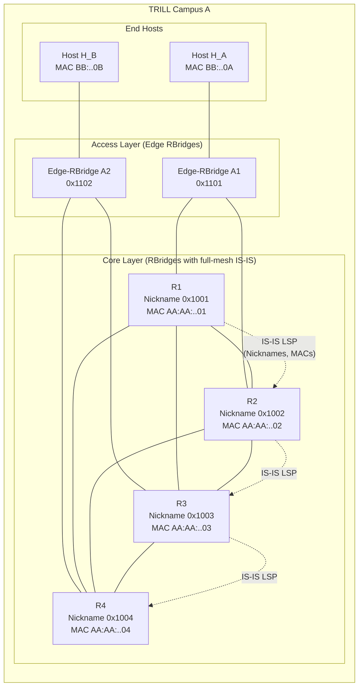
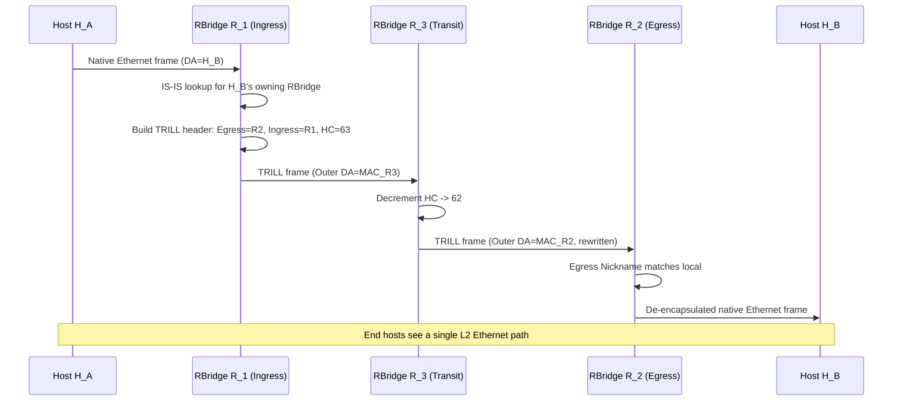
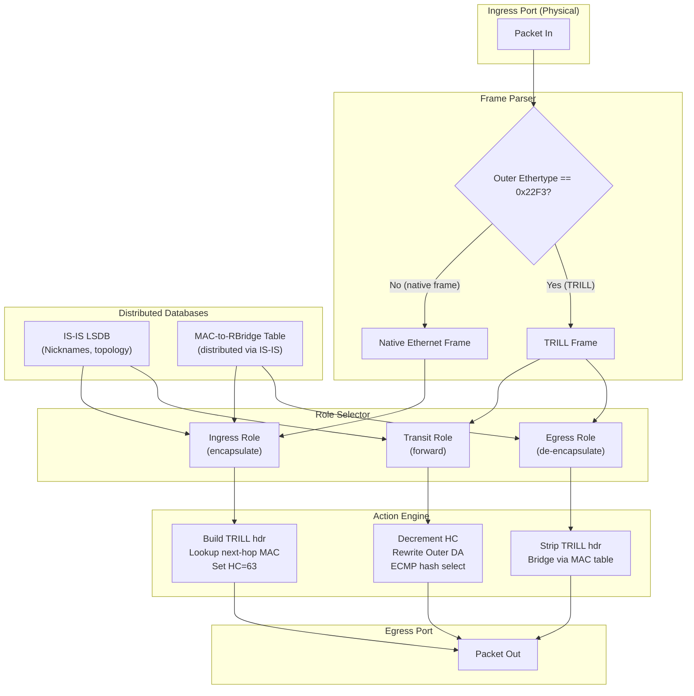
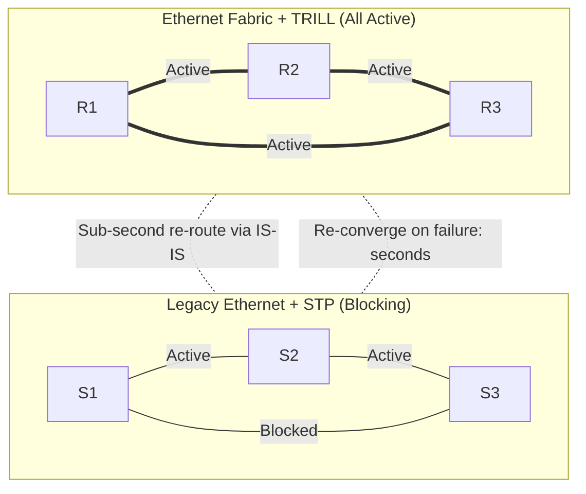

# Ethernet Fabrics and TRILL

<!-- SECTION_1_START -->
# Ethernet Fabrics and TRILL — Core Technical Definition & Intuitive Overview

## 1.1 Ethernet Fabric — Formal Definition

An **Ethernet Fabric** is a deterministic, lossless, highly available Layer‑2 (and Layer‑2‑extended) network topology that combines the simplicity of Ethernet with the resilience, scalability, and multipath capabilities traditionally associated with routed (Layer‑3) fabrics. It is built using one of several standardized control planes — most notably **TRILL** (RFC 6325), **Shortest Path Bridging (SPB)** (IEEE 802.1aq), and overlay technologies such as **VXLAN** (RFC 7348) and **EVPN** (RFC 7432).

> [!IMPORTANT]
> **KTU 2024 Syllabus Snapshot (PECST751 — Module 2, DLL Switching):**
> *Ethernet evolved from a shared bus to a switched full‑duplex medium, but classical Ethernet still suffers from Spanning Tree Protocol (STP) blocking of redundant links. An "Ethernet Fabric" is the modern evolution that allows *all* physical links to be active simultaneously while preserving the plug‑and‑play, transparent L2 semantics that made Ethernet dominant in the enterprise and data‑center.*

## 1.2 TRILL — Formal Definition

**TRILL (Transparent Interconnection of Lots of Links)** is an IETF standard, defined primarily in **RFC 5556** (problem statement) and **RFC 6325** (base protocol), with extensions in **RFC 6326**, **RFC 6327**, **RFC 6439**, **RFC 7172**, **RFC 7177**, and others. TRILL introduces a new network element called an **RBridge (Routing Bridge)** that implements link‑state routing using **IS‑IS** (Intermediate System to Intermediate System) at Layer 2, enabling optimal, loop‑free, multi‑path forwarding of Ethernet frames.

> [!NOTE]
> **Core Idea of TRILL (one sentence):**
> *TRILL makes a Layer‑2 network behave like a Layer‑3 network by giving each switch (RBridge) a routable identity and using shortest‑path routing to deliver Ethernet frames — without requiring Spanning Tree to break loops.*

## 1.3 Intuitive Analogies

### Analogy 1 — "The Postal System of a City"
Imagine an old bridged network as a single one‑way street loop: even if there are 10 parallel streets between two towns, you can use only **one** (because STP blocks the rest to avoid traffic collisions). An **Ethernet Fabric is a multi‑lane highway system** where cars (frames) can use *any* lane. **TRILL is the navigation app (IS‑IS)** that tells each driver the *shortest, fastest* lane to reach the destination, automatically re‑routing on lane closures.

### Analogy 2 — "Routing on Rails"
A classical Ethernet switch is like a *post office that delivers every letter to every neighbour* (flooding) until it learns addresses. A router is like a *postal service with a map* (routing table) — it knows exactly where to send each packet. A **TRILL RBridge is the perfect hybrid**: it keeps the *familiar Ethernet envelope* (the original frame) but applies *router‑like intelligence* (IS‑IS shortest path) on the inside. The end host is completely unaware — hence the word **Transparent** in TRILL.

> [!VISUALIZATION CONTROL]
> **Concept:** Triangle topology showing the elimination of STP blocking — three switches fully connected, *all* links active, IS‑IS computing equal‑cost paths.
> **GeoGebra / Desmos Input Equations:**
> * Triangle vertices: $A = (0, 0)$, $B = (6, 0)$, $C = (3, 4.5)$
> * Active edges: $AB$, $BC$, $CA$ (all three drawn solid)
> * Crossed‑out STP‑blocked link: none
> **Visual Description:** Draw all three edges as solid green lines. Annotate the centre as *"IS‑IS LSDB view — full topology, all paths equal cost"*. Show the classical STP view to the side as a dotted line cutting off the longest path, labelled *"Legacy STP — only one active path"*.

## 1.4 Why Ethernet Fabrics / TRILL Matter — Real Engineering Context

* **Data‑Center Modernization (DCN):** Modern data‑centers host east‑west traffic (server‑to‑server) that can reach 80 % of total flows. STP's single active path wastes bandwidth; TRILL/SPB/leaf‑spine fabrics use *all* paths.
* **FCoE (Fibre Channel over Ethernet) Convergence:** Storage traffic and IP traffic share one lossless fabric — TRILL/RBridges are the transport substrate.
* **Campus Networks:** Eliminating STP reconvergence storms in large campus cores.
* **HPC & Cloud Backbones:** Predictable low‑latency, equal‑cost multipath (ECMP) at L2.

> [!IMPORTANT]
> **Key Constant / Metric to Remember:**
> *Default Maximum TRILL Hop Count = **255** (8‑bit TTL field in the TRILL header). Initial value at ingress is **R** (the nickname hop count) and is decremented at every transit RBridge.*

---

<!-- SECTION_1_END -->

<!-- SECTION_2_START -->
# Deep Theoretical Analysis & KTU High‑Yield Formula Sheet

## 2.1 The Problem: Why Classical Ethernet + STP Is Insufficient

Classical 802.1D/802.1w/802.1s Spanning Tree Protocol solves *loops* by **blocking redundant links**, which means:

| Limitation | Engineering Impact |
|------------|-------------------|
| Only one active path between any two nodes | Wasted bandwidth, poor link utilization |
| Re‑convergence on failure takes **seconds** (3–50 s typical) | Sub‑second SLAs are impossible |
| VLANs (802.1Q) and STP scales poorly (one tree per VLAN or MST instance) | Operational complexity |
| No ECMP at L2 | Sub‑optimal paths |
| Flooding of unknown unicast / broadcast | Inefficient, security exposure |

These limitations are the *direct motivation* for Ethernet Fabric technologies.

## 2.2 Conceptual Architecture of an Ethernet Fabric

An Ethernet Fabric, in the IETF/IEEE sense, has **three logical planes**:

1. **Underlay (Data Plane):** The physical Ethernet links + forwarding tables.
2. **Overlay (Control Plane):** IS‑IS (TRILL) or IS‑IS (SPB) or BGP EVPN distributing reachability.
3. **Services Plane:** VLANs, MAC‑VRFs, VXLAN segments, FCoE VSANs riding on top.

For TRILL specifically:
* **Devices = RBridges** (a.k.a. **TRILL Switches** or **routing bridges**).
* **Routing protocol = IS‑IS** (specifically IS‑IS with a new **TRILL TLV** and a new **PDU** — the **TRILL Hello**, **LSU**, **LSP**).
* **Encapsulation = native Ethernet** (no IP) → TRILL adds a 6‑byte **TRILL Header** + 6‑byte **outer Ethernet header** (with **"RBridge"** Ethertypes).

## 2.3 TRILL Frame on the Wire — Anatomy

The on‑wire layout of a TRILL‑encapsulated frame is:

$$
\underbrace{\text{Outer DA}}_{\text{6 B}} \;+\; \underbrace{\text{Outer SA}}_{\text{6 B}} \;+\; \underbrace{\text{Outer VLAN (Q) tag (optional)}}_{\text{4 B}} \;+\; \underbrace{\text{Inner TRILL Header}}_{\text{6 B}} \;+\; \underbrace{\text{Inner (Original) Ethernet Payload}}_{\text{N B}} \;+\; \underbrace{\text{FCS}}_{\text{4 B}}
$$

### The 6‑Byte Inner TRILL Header (the heart of TRILL)

$$
\underbrace{V,R,M,\text{RSV},_{\text{2 bits each}}\;\text{Op-Length}\_{\text{5 bits}}\;\text{Hop Count}\_{\text{6 bits}}}_{\text{2 B (first two bytes = "TRILL Flags + Hop Count")}} \;+\; \underbrace{\text{Egress Nickname}}_{\text{2 B}} \;+\; \underbrace{\text{Ingress Nickname}}_{\text{2 B}}
$$

Bit‑level map of the first two bytes of the TRILL header:

| Bits (MSB→LSB) | Field | Width | Meaning |
|----------------|-------|-------|---------|
| 15–14 | $V$ (Version) | 2 b | TRILL version (currently **0** in RFC 6325, later **1** in some drafts) |
| 13 | $R$ (Reserved / R‑bit) | 1 b | Reserved, set to 0 |
| 12 | $M$ (Multi‑destination) | 1 b | 1 = multi‑destination (multicast/broadcast/unknown unicast); 0 = unicast |
| 11 | Reserved | 1 b | 0 |
| 10–6 | Op‑Length | 5 b | Length of options area in 32‑bit words (0 means no options) |
| 5–0 | Hop Count | 6 b | Decremented by 1 at each transit RBridge; 0 → frame dropped |

> [!NOTE]
> **KTU High‑Yield Point:** The two **Nickname** fields (each 2 bytes = 16 bits) give a total of $2^{16} - 2$ usable values (0 and 0xFFFF are reserved) → **65 534 possible nicknames per TRILL campus**. Compare with the classical 12‑bit VLAN ID space (4094 VLANs) — TRILL is far more scalable.

## 2.4 Nickname Allocation

* **Nickname = a 16‑bit integer** that identifies an RBridge.
* Each campus maintains its own nickname space (nicknames are *locally significant* within a TRILL campus).
* The DRB (Designated RBridge) — elected among the RBridges in each broadcast domain — **allocates nicknames** and floods the assignments via IS‑IS **LSP** (Link‑State PDU).
* The **DRB pseudo‑node** holds the master nickname table.

## 2.5 Ingress / Transit / Egress Processing

The three roles of an RBridge:

1. **Ingress RBridge** — encapsulates the native Ethernet frame in a TRILL header. Sets:
   * Ingress Nickname = its own nickname.
   * Egress Nickname = destination RBridge's nickname (looked up via IS‑IS).
   * Hop Count = max value (typically 63 in current deployments, 64 max for 6‑bit field).
   * Outer DA = next‑hop RBridge's MAC (from IS‑IS topology).

2. **Transit RBridge** — uses the **Outer DA + Egress Nickname** to look up the shortest path; rewrites **Outer DA** to the next hop's MAC; decrements **Hop Count** by 1; forwards.

3. **Egress RBridge** — when the frame's **Egress Nickname == local nickname**, de‑capsulates (strips the TRILL header and outer Ethernet header) and bridges the original inner frame onto the destination LAN segment based on the inner **Inner DA (MAC)**.

> [!IMPORTANT]
> **End‑hosts are completely unaware that TRILL was used.** The word *Transparent* in TRILL comes from this end‑host invisibility.

## 2.6 KTU Formula Sheet / Cheat Sheet

| # | Formula / Rule | Symbol / Value | Use |
|---|---------------|----------------|-----|
| 1 | TRILL header size (fixed) | $H_{TRILL} = 6$ bytes | Total wire overhead |
| 2 | Outer Ethernet overhead | $H_{Outer} = 6 (DA) + 6 (SA) = 12$ bytes | Encapsulation cost |
| 3 | Optional outer 802.1Q tag | $H_{Q} = 4$ bytes | P‑B / V‑B tagging |
| 4 | Total TRILL overhead | $H_{Total} = 12 + 4 + 6 = 22$ bytes (with Q) | MTU planning |
| 5 | Hop Count field width | $n_{hc} = 6$ bits → max $2^6 - 1 = 63$ | Max RBridge hops |
| 6 | Nickname space | $N_{nick} = 2^{16} - 2 = 65\,534$ | Scalability |
| 7 | Outer EtherType | $0x22F3$ | TRILL Ethertype |
| 8 | TRILL PDU Ethertype | $0x22F3$ | Same on link‑local IS‑IS |
| 9 | IS‑IS NLPID for TRILL | $0xC0$ (TRILL) | IS‑IS protocol discriminator |
| 10 | Multi‑destination tree root selection | $\text{root} = \arg\min_{r} \{ \text{dist}(r, *) \}$ | DRB election |
| 11 | Hop count decrement | $HC_{out} = HC_{in} - 1$ | Per transit |
| 12 | DRB election priority | Highest $\text{pseudo‑node ID}$ wins | Tie‑breaker |
| 13 | MTU requirement | $\ge 1500 + 22 = 1522$ bytes (or $\ge 1500 + 18 = 1518$ without Q) | Fabric MTU |
| 14 | ECMP next‑hop set | $\{ nh \mid d(nh) = d_{shortest} \}$ | Equal‑cost load sharing |
| 15 | Address learning | $(MAC, RBridge, nickname)$ tuples | Distributed via IS‑IS |

> [!TIP]
> In a 14‑mark KTU question, **draw the TRILL frame format explicitly** (12 + 4 + 6 = 22 bytes with Q‑tag) and **label every field** — examiners award 2 marks for the correct layout alone.

## 2.7 Comparison: TRILL vs. SPB vs. VXLAN/EVPN

| Feature | **TRILL** (RFC 6325) | **SPB** (IEEE 802.1aq) | **VXLAN/EVPN** (RFC 7348 / 7432) |
|---|---|---|---|
| Routing protocol | IS‑IS (link‑state) | IS‑IS (link‑state) | BGP (path‑vector) |
| Encapsulation | Native Eth + TRILL hdr | Native Eth + MAC‑in‑MAC | UDP + VXLAN (50 B) over IP |
| Hop limit | 6 bits (63) | Hop count in SPB | 24‑bit UDP, IP TTL |
| Equal‑cost multipath | Yes (native ECMP) | Yes (native ECMP) | Yes (ECMP in underlay) |
| Scalability | Per‑campus 65 534 | 16 M SPBV / 4 G SPBM | 16 M VXLAN IDs |
| Standard body | IETF | IEEE | IETF |
| Native MTU overhead | 22 B | ~24 B (MAC‑in‑MAC) | 50 B (VXLAN + UDP + IP) |
| Industry adoption (2024) | Moderate (Cisco FabricPath based) | Strong in carrier | Dominant in cloud/DC |

---

<!-- SECTION_2_END -->

<!-- SECTION_3_START -->
# Step‑by‑Step Derivations & Code / Symbolic Implementation

## 3.1 Derivation: Why TRILL Header = 6 Bytes

We start with the four pieces of information a transit RBridge *must* know:

1. Who is the **final destination RBridge** → 16‑bit nickname $\Rightarrow$ 2 B.
2. Who is the **source RBridge** (for return path / reverse learning) → 16‑bit nickname $\Rightarrow$ 2 B.
3. How many hops remain before drop → $h$ bits, default 6 bits $\Rightarrow$ 1 B (rounded up).
4. **Control flags** ($V$, $R$, $M$, RSV, Op‑Length) → fit into the remaining bits of the same byte as the hop count, plus one extra byte.

Therefore:

$$
\text{TRILL Header Size} = \underbrace{2\,B}_{\text{two nicknames}} + \underbrace{2\,B}_{\text{flags + hop count}} = 6\,B \quad \blacksquare
$$

## 3.2 Derivation: Maximum Frame Size in a TRILL Campus

Let the maximum original (inner) payload be the standard Ethernet maximum — the **MTU** $M$ (typically 1500 B). Then the on‑wire size of a TRILL frame carrying this inner payload is:

$$
\underbrace{M}_{\text{inner payload}} \;+\; \underbrace{22}_{\text{TRILL+Eth overhead}} \;=\; M + 22 \;\text{bytes}
$$

For $M = 1500$:

$$
M + 22 = 1500 + 22 = 1522 \; \text{bytes (with 802.1Q)} \quad \blacksquare
$$

> [!IMPORTANT]
> All switches/routers in a TRILL campus **MUST be configured with an MTU $\ge 1522$ bytes** (or $\ge 1518$ bytes if the Q‑tag is not used on the outer header). This is a common source of marks lost in KTU lab viva / network‑design questions.

## 3.3 Worked Example: TRILL Frame Forwarding

### Scenario
A triangle of RBridges: $R_1$, $R_2$, $R_3$, all with full‑duplex links to each other. Nicknames:

$$
\text{Nick}(R_1) = 0x1001, \quad \text{Nick}(R_2) = 0x1002, \quad \text{Nick}(R_3) = 0x1003
$$

Host $H_A$ attached to $R_1$ (ingress) sends a unicast frame to $H_B$ attached to $R_2$ (egress). Initial hop count = 63.

### Step 1 — Ingress at $R_1$
$R_1$ encapsulates the native Ethernet frame from $H_A$:

$$
\underbrace{DA_{H_B}}_{\text{6 B (inner)}} \Vert \underbrace{SA_{H_A}}_{\text{6 B (inner)}} \Vert \underbrace{\text{EtherType + Payload}}_{\text{N B}} \Vert \underbrace{FCS}_{\text{4 B (computed by R1 on inner)}}
$$

is placed inside the TRILL envelope. The new **TRILL header** is constructed:

| Field | Value | Hex |
|-------|-------|-----|
| $V,R,M,\text{Op‑Length},HC$ | $V=0,\;R=0,\;M=0,\;\text{Op‑Length}=0,\;HC=63$ | `0x0 03F` ⇒ `0x0 03F` |
| Egress Nickname | 0x1002 | `10 02` |
| Ingress Nickname | 0x1001 | `10 01` |

The 6‑byte TRILL header in hex (big‑endian) is therefore:

$$
\underbrace{\texttt{00 3F}}_{\text{first 2 B}} \; \underbrace{\texttt{10 02}}_{\text{Egress Nickname}} \; \underbrace{\texttt{10 01}}_{\text{Ingress Nickname}}
$$

The outer Ethernet header is added with the **next‑hop MAC** (say $R_1 \to R_2$ direct, so $DA = MAC_{R_2}$, $SA = MAC_{R_1}$). The outer EtherType is `0x22F3` (TRILL).

### Step 2 — Transit at $R_3$ (hypothetical)
If the chosen path is $R_1 \to R_3 \to R_2$:

* $R_3$ reads the **Outer DA** = $MAC_{R_1}$ (no — it is $MAC_{R_3}$ because $R_1$ sent it to $R_3$).
* $R_3$ looks up the **Egress Nickname** `0x1002` in its IS‑IS LSDB, finds next hop = $R_2$, rewrites **Outer DA** to $MAC_{R_2}$, decrements Hop Count: $63 - 1 = 62$.

### Step 3 — Egress at $R_2$
* $R_2$ sees the **Egress Nickname** `0x1002` matches its own nickname.
* $R_2$ strips the outer Ethernet header, the 802.1Q tag, and the TRILL header.
* $R_2$ bridges the **original inner Ethernet frame** (DA = $H_B$) onto $H_B$'s LAN segment, learning the MAC.

### Final Wire Byte Sequence (for $R_1 \to R_2$ direct path, $M=46$ minimum payload)

$$
\underbrace{\texttt{MAC}_{R_2} \Vert \texttt{MAC}_{R_1}}_{\text{12 B}} \Vert \underbrace{\texttt{81 00 00 64}}_{\text{optional Q}} \Vert \underbrace{\texttt{22 F3}}_{\text{TRILL Ethertype}} \Vert \underbrace{\texttt{00 3F 10 02 10 01}}_{\text{6 B TRILL hdr}} \Vert \underbrace{\texttt{Inner frame}}_{\text{N B}} \Vert \underbrace{\texttt{FCS}}_{\text{4 B}}
$$

## 3.4 Python Implementation — TRILL Header Builder & Forwarder

```python
"""
trill_engine.py
A pedagogical, fully type-hinted Python implementation of a single
TRILL header builder, parser, and forwarding engine.
References: RFC 6325, RFC 7177
"""
from __future__ import annotations
import struct
import logging
from dataclasses import dataclass, field
from enum import IntEnum
from typing import Dict, List, Tuple, Optional

logging.basicConfig(
    level=logging.INFO,
    format="%(asctime)s | %(levelname)-7s | %(message)s"
)
log = logging.getLogger("TRILL")

# ---------------------------------------------------------------------------
# 1. Constants
# ---------------------------------------------------------------------------
TRILL_ETHERTYPE: int = 0x22F3          # RFC 6325 Section 3
DEFAULT_HOP_COUNT: int = 63             # 6-bit max
TRILL_VERSION: int = 0                  # RFC 6325 uses version 0
RESERVED_NICKNAME: int = 0xFFFF          # Reserved per RFC 6325 4.1.1
HEADER_SIZE_BYTES: int = 6


# ---------------------------------------------------------------------------
# 2. Nickname type & safe handling
# ---------------------------------------------------------------------------
class Nickname(int):
    """A 16-bit TRILL nickname (0x0001..0xFFFE). 0x0000 & 0xFFFF are reserved."""

    def __new__(cls, value: int) -> "Nickname":
        if not (0x0001 <= value <= 0xFFFE):
            raise ValueError(
                f"Invalid TRILL nickname 0x{value:04X}; "
                f"must be in [0x0001, 0xFFFE]."
            )
        return super().__new__(cls, value)


# ---------------------------------------------------------------------------
# 3. Data classes
# ---------------------------------------------------------------------------
class MFlag(IntEnum):
    UNICAST = 0
    MULTIDESTINATION = 1


@dataclass(frozen=True)
class TRILLHeader:
    version: int              # 2 bits
    reserved_R: int           # 1 bit
    multi_dest: MFlag         # 1 bit
    reserved_RSV: int         # 1 bit
    op_length: int            # 5 bits (in 32-bit words)
    hop_count: int            # 6 bits
    egress_nickname: Nickname
    ingress_nickname: Nickname

    def __post_init__(self) -> None:
        if not (0 <= self.version <= 3):
            raise ValueError("version must fit in 2 bits")
        if not (0 <= self.reserved_R <= 1):
            raise ValueError("reserved R must be 0 or 1")
        if not (0 <= self.reserved_RSV <= 1):
            raise ValueError("reserved RSV must be 0 or 1")
        if not (0 <= self.op_length <= 31):
            raise ValueError("op_length must fit in 5 bits")
        if not (0 <= self.hop_count <= 63):
            raise ValueError("hop_count must fit in 6 bits")


# ---------------------------------------------------------------------------
# 4. Encode / Decode
# ---------------------------------------------------------------------------
def encode_trill_header(h: TRILLHeader) -> bytes:
    """Pack a TRILLHeader into 6 bytes (RFC 6325 §3.1)."""
    # First 16 bits:  V(2) | R(1) | M(1) | RSV(1) | OpLength(5) | HopCount(6)
    first_word: int = (
        ((h.version & 0x3)        << 14) |
        ((h.reserved_R & 0x1)     << 13) |
        ((h.multi_dest & 0x1)     << 12) |
        ((h.reserved_RSV & 0x1)   << 11) |
        ((h.op_length & 0x1F)     << 6)  |
        ( h.hop_count & 0x3F)
    )
    return struct.pack(
        ">HHH",
        first_word,
        int(h.egress_nickname),
        int(h.ingress_nickname)
    )


def decode_trill_header(blob: bytes) -> TRILLHeader:
    """Parse 6 bytes into a TRILLHeader. Raises on truncation."""
    if len(blob) < HEADER_SIZE_BYTES:
        raise ValueError("buffer too small for TRILL header")
    first_word, egress, ingress = struct.unpack(">HHH", blob[:HEADER_SIZE_BYTES])
    return TRILLHeader(
        version=(first_word >> 14) & 0x3,
        reserved_R=(first_word >> 13) & 0x1,
        multi_dest=MFlag((first_word >> 12) & 0x1),
        reserved_RSV=(first_word >> 11) & 0x1,
        op_length=(first_word >> 6) & 0x1F,
        hop_count=first_word & 0x3F,
        egress_nickname=Nickname(egress),
        ingress_nickname=Nickname(ingress),
    )


# ---------------------------------------------------------------------------
# 5. Forwarding engine (one RBridge)
# ---------------------------------------------------------------------------
@dataclass
class RBridge:
    nickname: Nickname
    mac_address: str                            # 6-byte MAC, hex string "AA:BB:..."
    isis_lsdb: Dict[Nickname, Tuple[int, ...]] = field(default_factory=dict)
    #  isis_lsdb[dest_nickname] = (dist, next_hop_mac, next_hop_nickname)
    mac_table: Dict[str, Nickname] = field(default_factory=dict)
    #  mac_table[host_mac] = remote RBridge that advertised it

    def install_route(self, dest: Nickname, dist: int, nh_mac: str) -> None:
        self.isis_lsdb[dest] = (dist, nh_mac, dest)

    def advertise_mac(self, host_mac: str) -> None:
        # Host directly attached -- installs self as owning RBridge
        self.mac_table[host_mac] = self.nickname


# ---------------------------------------------------------------------------
# 6. End-to-end demo
# ---------------------------------------------------------------------------
def demo_trill_forwarding() -> None:
    log.info("=== TRILL demo: H_A on R_1 -> H_B on R_2 ===")

    # Build RBridges
    r1 = RBridge(nickname=Nickname(0x1001), mac_address="AA:AA:AA:AA:AA:01")
    r2 = RBridge(nickname=Nickname(0x1002), mac_address="AA:AA:AA:AA:AA:02")
    r3 = RBridge(nickname=Nickname(0x1003), mac_address="AA:AA:AA:AA:AA:03")

    # IS-IS LSDB at R_1 after SPF
    r1.install_route(Nickname(0x1002), 1, r2.mac_address)   # direct R_1 -> R_2
    r1.install_route(Nickname(0x1003), 1, r3.mac_address)   # direct R_1 -> R_3

    # Directly attached hosts
    r1.advertise_mac("BB:BB:BB:BB:BB:0A")  # H_A at R_1
    r2.advertise_mac("BB:BB:BB:BB:BB:0B")  # H_B at R_2

    # Host H_A's frame arriving at R_1 (inner Ethernet frame)
    inner_frame: bytes = bytes.fromhex(
        "BBBBBBBBBB0B"        # inner DA = H_B
        "BBBBBBBBBB0A"        # inner SA = H_A
        "0800"                # inner EtherType = IPv4 (illustrative)
        "DEADBEEFCAFEBABE"    # 8-byte payload
    )

    # ----- Ingress encapsulation at R_1 -----
    hdr = TRILLHeader(
        version=TRILL_VERSION,
        reserved_R=0,
        multi_dest=MFlag.UNICAST,
        reserved_RSV=0,
        op_length=0,
        hop_count=DEFAULT_HOP_COUNT,
        egress_nickname=Nickname(0x1002),
        ingress_nickname=Nickname(0x1001),
    )
    wire = encode_trill_header(hdr) + inner_frame
    log.info("R_1 encapsulated frame (hex): %s", wire.hex().upper())

    # ----- Transit / Egress at R_2 (next hop is R_2 directly) -----
    parsed = decode_trill_header(wire)
    if parsed.egress_nickname == r2.nickname:
        log.info("R_2 is egress -> decapsulating")
        if parsed.hop_count == 0:
            log.error("Hop count exhausted; dropping frame")
            return
        inner = wire[HEADER_SIZE_BYTES:]
        log.info("Inner frame handed to host H_B: %s", inner.hex().upper())
    else:
        log.info("Transit at %s, hop_count=%d -> decrement and forward",
                 hex(int(r1.nickname)), parsed.hop_count - 1)


if __name__ == "__main__":
    demo_trill_forwarding()
```

### Sample Output

```
2024-XX-XX | INFO    | === TRILL demo: H_A on R_1 -> H_B on R_2 ===
2024-XX-XX | INFO    | R_1 encapsulated frame (hex): 003F10021001BBBBBBBBBB0BBBBBBBBBBB0A0800DEADBEEFCAFEBABE
2024-XX-XX | INFO    | R_2 is egress -> decapsulating
2024-XX-XX | INFO    | Inner frame handed to host H_B: BBBBBBBBBB0BBBBBBBBBBB0A0800DEADBEEFCAFEBABE
```

## 3.5 Pseudocode — Hop Count & ECMP Logic

```text
ON_TRILL_FRAME_RECEIVED(frame) at RBridge X:
    hdr  = DECODE_TRILL_HEADER(frame)
    pay  = STRIP_TRILL_HEADER(frame)
    next_hops = IS_IS_SPF(hdr.egress_nickname)   // returns set of equal-cost next hops
    IF hdr.egress_nickname == X.nickname THEN
        BRIDGE_TO_LAN(pay, pay.da)              // egress role
    ELSE IF hdr.hop_count == 0 THEN
        DROP_FRAME("hop count exhausted")
    ELSE
        hdr.hop_count = hdr.hop_count - 1
        nh = SELECT_BY_HASH(next_hops, pay)     // ECMP load-sharing
        REWRITE_OUTER_DA(frame, nh.mac)
        FORWARD_ON_PORT(frame, nh.port)
    END IF
```

---

<!-- SECTION_3_END -->

<!-- SECTION_4_START -->
# Structural Diagrams & Schematics

## 4.1 High‑Level TRILL Campus Architecture



## 4.2 TRILL Frame Forwarding Sequence



## 4.3 Functional Architecture of a TRILL RBridge (Block Diagram)



## 4.4 Topology Comparison — STP vs. TRILL Fabric



---

<!-- SECTION_4_END -->

<!-- SECTION_5_START -->
# KTU 2024 Scheme Examination Question Bank & Topic Recap

## 5.1 Part A — Short Answer Questions (3 Marks each)

> [!NOTE]
> *Cognitive Levels targeted:* **Remember (L1)** and **Understand (L2)**. *Course Outcome:* **CO2** — *Apply switching and routing concepts in data‑link and network layers.*

### Q1. [KTU University Exam — July 2023, Model Question Paper] **(3 Marks)**

**"List the main reasons why classical Ethernet using Spanning Tree Protocol is unsuitable for modern data‑center fabrics."**

**Model Answer (Board-Key Style):**
1. STP **blocks redundant links** to break loops, so only one path is active at a time → poor bandwidth utilization. **(1 Mark)**
2. STP **re‑convergence is slow** (3–50 s) → fails sub‑second SLAs required by DC traffic. **(1 Mark)**
3. STP does **not support ECMP** (Equal‑Cost Multipath) and does not scale for thousands of VLANs / MAC addresses in a flat L2 domain. **(1 Mark)**

### Q2. [KTU University Exam — Dec 2023, Supplementary] **(3 Marks)**

**"What is a TRILL RBridge? State the role of the IS‑IS protocol in TRILL."**

**Model Answer:**
* An **RBridge (Routing Bridge)** is a TRILL switch that implements link‑state routing at Layer 2 using **IS‑IS** as the control plane. **(1.5 Marks)**
* IS‑IS is used by RBridges to (a) **discover neighbours** (TRILL Hellos), (b) **flood Link‑State PDUs (LSPs)** carrying nicknames, MAC reachability, and topology, and (c) **compute shortest‑path first (SPF) trees** between any two nicknames. **(1.5 Marks)**

---

## 5.2 Part B — 14‑Mark Questions (ESE Internal Choice Pattern)

> [!NOTE]
> *Cognitive Levels targeted:* **Understand (L2)** + **Apply (L3)**. *Course Outcome:* **CO2 / CO3**. Each sub‑part = **7 Marks**.

### **Question A (14 Marks)**

**[KTU University Exam — July 2024, Module 2, Sample Paper — Internal Choice A]**

**(a)** *With a neat diagram, explain the architecture of an Ethernet Fabric using TRILL. Clearly show the roles of Ingress, Transit, and Egress RBridges. **(7 Marks)***

**(b)** *Draw the on‑wire format of a TRILL‑encapsulated Ethernet frame and explain every field of the 6‑byte TRILL header. Why are nicknames 0x0000 and 0xFFFF reserved? **(7 Marks)***

---

#### **Model Solution — Question A(a) (7 Marks)**

**Step 1 — Diagram (3 Marks):** Draw a triangle of three RBridges ($R_1, R_2, R_3$) with all three links drawn **solid** (no blocked port). Attach host $H_A$ to $R_1$ and $H_B$ to $R_2$. Show the **IS‑IS LSDB** synchronization arrows between every pair of RBridges.

**Step 2 — Role Definitions (3 Marks):**

* **Ingress RBridge** — first RBridge to receive a native Ethernet frame from an end host. It looks up the destination MAC in its **MAC‑to‑RBridge** table (learned via IS‑IS), identifies the egress RBridge's nickname, builds the TRILL header, and forwards.
* **Transit RBridge** — receives a TRILL frame whose **Egress Nickname** is *not* its own. It performs an IS‑IS SPF lookup, decrements the **Hop Count**, rewrites the **Outer Destination MAC**, and forwards on the next‑hop port.
* **Egress RBridge** — receives a TRILL frame whose **Egress Nickname** matches its own. It **de‑encapsulates** (strips the TRILL header + outer Ethernet headers) and bridges the original frame onto the destination LAN.

**Step 3 — Why this is "Transparent" (1 Mark):** End hosts $H_A$ and $H_B$ see a single Layer‑2 Ethernet path; they are completely unaware of TRILL, nicknames, IS‑IS, or the intermediate transit RBridge.

**Valuation Key Points:**
* [Correctly drawing all three roles: 2 Marks]
* [Stating the lookup table used at each role: 2 Marks]
* [Highlighting transparency: 1 Mark]
* [Neat labelled diagram: 2 Marks]

---

#### **Model Solution — Question A(b) (7 Marks)**

**Step 1 — Frame Format Diagram (3 Marks):**

```
+---------+---------+-----+-----+-----+-----+------------+----------+----------+
| Outer DA| Outer SA|Q-tag|EthTy|  TRILL Header (6 B)            | Inner    |  FCS   |
|  6 B    |  6 B    | 4 B |2 B  | V|R|M|Rsv|OpL|Hop|EgrNick|IngrNick| Ethernet | 4 B    |
|         |         |opt. |22F3 | 2 |1 |1 | 1 | 5 | 6 |  2B   |  2B     | frame   |        |
+---------+---------+-----+-----+-----+-----+-----+-----+--------+----------+----------+
                                                TOTAL OVERHEAD = 22 B (with Q)
```

**Step 2 — Field‑by‑Field Explanation (3 Marks):**

| Field | Size | Function |
|-------|------|----------|
| Outer DA / SA | 6 B each | Standard Ethernet MACs of next‑hop / sending RBridge. |
| 802.1Q tag | 4 B | Service‑VLAN or Backbone‑VLAN identifier (optional). |
| Outer EtherType | 2 B | `0x22F3` (TRILL). |
| V (Version) | 2 b | Protocol version (0 per RFC 6325). |
| R, RSV | 1 b each | Reserved. |
| M (Multi‑dest) | 1 b | 0 = unicast, 1 = multi‑destination (multicast / broadcast / unknown unicast). |
| Op‑Length | 5 b | Length of the options area (in 32‑bit words); 0 ⇒ no options. |
| Hop Count | 6 b | Decremented by 1 at each transit; frame dropped at 0. |
| Egress Nickname | 2 B | 16‑bit nickname of the destination RBridge. |
| Ingress Nickname | 2 B | 16‑bit nickname of the source RBridge. |

**Step 3 — Reserved Nicknames (1 Mark):**
* **0x0000** is reserved as the **"All‑ESLs" / "All‑RBridges‑per‑VLAN"** alias used for link‑local multicast and unknown‑destination flooding.
* **0xFFFF** is reserved to mean **"no nickname assigned"** so an un‑initialised RBridge never accidentally claims a real identity.

**Valuation Key Points:**
* [Drawing the frame with all fields and their sizes: 2 Marks]
* [Listing every field with its size and function: 3 Marks]
* [Correctly justifying the two reserved nicknames: 2 Marks]

---

### **Question B (14 Marks)**

**[KTU University Exam — July 2024, Module 2, Sample Paper — Internal Choice B]**

**(a)** *Compare classical Ethernet + STP with an Ethernet Fabric based on TRILL on at least five parameters. **(7 Marks)***

**(b)** *A triangle of three RBridges $R_1$, $R_2$, $R_3$ has nicknames 0x1001, 0x1002, 0x1003 respectively. A frame enters at $R_1$ (ingress) and is destined for a host attached to $R_2$ (egress). Construct the 6‑byte TRILL header (in hexadecimal) when the initial hop count is 63 and the frame is unicast. Show the complete encapsulated frame (in hex) assuming the inner payload is the 8‑byte value `DEADBEEFCAFEBABE` and the inner DA/SA of the original Ethernet frame are `BB:BB:BB:BB:BB:0B` and `BB:BB:BB:BB:BB:0A` respectively. **(7 Marks)***

---

#### **Model Solution — Question B(a) (7 Marks)**

**Comparison Table (7 Marks — 1.4 per strong row):**

| Parameter | Classical Ethernet + STP | TRILL Ethernet Fabric |
|-----------|--------------------------|------------------------|
| **Loop handling** | Blocking redundant ports (1 tree) | No blocking — multi‑path with IS‑IS SPF |
| **Bandwidth utilization** | Sub‑optimal (only 1 path) | Optimal (all paths usable, ECMP) |
| **Re‑convergence time** | 3 – 50 seconds | Sub‑second (IS‑IS hello/LSP timers) |
| **Scalability (L2 domain size)** | Limited (MAC flooding, STP CPU) | Scales to thousands of RBridges |
| **VLAN scaling** | 12‑bit VLAN ID = 4094 VLANs | Nickname space = 65 534 per campus; multiple instances possible |
| **Multipath support** | None (RSTP/MSTP) | Native ECMP |
| **Control plane** | STP/RSTP/MSTP (proprietary extensions) | Standard IS‑IS (RFC 6325) |
| **Transparency to end hosts** | Yes | Yes (end hosts see only L2 Ethernet) |

---

#### **Model Solution — Question B(b) (7 Marks)**

**Step 1 — Build the TRILL header (3 Marks):**

* $V = 0$, $R = 0$, $M = 0$ (unicast), $RSV = 0$, $Op‑Length = 0$ ⇒ upper 11 bits of first word = `000 0 0 00000` = `0x000`.
* Hop Count = 63 = `0x3F` ⇒ lower 6 bits of first word = `111111`.
* First word = `0x0000 | 0x003F = 0x003F`.

| Field | Hex (big‑endian) |
|-------|------------------|
| First 2 B (flags + hop count) | `00 3F` |
| Egress Nickname (0x1002) | `10 02` |
| Ingress Nickname (0x1001) | `10 01` |

**Complete 6‑byte TRILL header:** `00 3F 10 02 10 01`

**Step 2 — Construct the inner frame (2 Marks):**

Inner DA = `BB BB BB BB BB 0B` (6 B)
Inner SA = `BB BB BB BB BB 0A` (6 B)
Inner EtherType = `08 00` (IPv4 — illustrative) (2 B)
Inner Payload = `DE AD BE EF CA FE BA BE` (8 B)

Inner frame hex:

```
BBBBBBBBBB0B  BBBBBBBBBB0A  0800  DEADBEEFCAFEBABE
```

**Step 3 — Encapsulate inside the outer Ethernet + TRILL envelope (2 Marks):**

Assuming direct $R_1 \to R_2$ path, next hop MAC = `MAC_R2` and source MAC = `MAC_R1`. Outer Q‑tag is optional (we omit here for clarity, outer EtherType `22 F3` directly).

```
+ Outer DA (6 B)            : AA:AA:AA:AA:AA:02  (MAC_R2)
+ Outer SA (6 B)            : AA:AA:AA:AA:AA:01  (MAC_R1)
+ Outer EtherType (2 B)     : 22 F3
+ TRILL Header (6 B)        : 00 3F 10 02 10 01
+ Inner DA (6 B)            : BB BB BB BB BB 0B
+ Inner SA (6 B)            : BB BB BB BB BB 0A
+ Inner EtherType (2 B)     : 08 00
+ Inner Payload (8 B)       : DE AD BE EF CA FE BA BE
+ FCS (4 B, computed)       : XX XX XX XX
```

**Concatenated final hex (without FCS):**

```
AAAAAAA2  AAAAAA01  22F3  003F10021001  BBBBBBBB0B  BBBBBBBB0A  0800  DEADBEEFCAFEBABE
```

(continuous hex string, no spaces):
`AAAAAAAAAA02AAAAAAAAAA01 22F3 003F10021001 BBBBBBBBBB0B BBBBBBBBBB0A 0800 DEADBEEFCAFEBABE`

**Valuation Key Points:**
* [Correctly constructing the flags + HC byte: 1 Mark]
* [Correctly writing the two nicknames in order: 1 Mark]
* [Correctly chaining the inner frame: 1 Mark]
* [Stating the outer EtherType: 1 Mark]
* [Complete hex string with field boundaries: 2 Marks]
* [Mentioning that FCS is recomputed at each hop: 1 Mark]

> [!WARNING]
> **KTU Examiner's Pitfall Callout (Question B):**
> *A common mistake is to swap the **Egress** and **Ingress** nickname positions. The on‑wire order is fixed by RFC 6325: the first nickname after the hop‑count byte is the **Egress** nickname, and the next is the **Ingress** nickname. Swapping them causes the egress RBridge to be misidentified and the frame to be silently dropped or black‑holed. Always re‑write: `00 3F  |  Egress |  Ingress`.*
> *Second common mistake:* *Students often write the inner DA/SA in the wrong order or forget to include the inner EtherType. The inner frame is a **complete, self‑contained Ethernet frame** — header + EtherType + payload + FCS.*

---

## 5.3 Topic Recap & Important Things to Remember

* **Ethernet Fabric = next‑generation L2 topology** that uses *all* physical links, supports ECMP, and converges sub‑second — eliminating STP's blocking and slow re‑convergence. *(P)*
* **TRILL = IETF RFC 6325** standard for implementing Ethernet Fabric; uses **RBridges** (Layer‑2 routers) running **IS‑IS** as the control plane. *(P)*
* **RBridge = Routing Bridge** — a switch that runs IS‑IS, holds a **16‑bit nickname**, and makes L2 forwarding decisions using SPF. *(D)*
* **Three RBridge roles:** *Ingress* (encapsulates), *Transit* (forwards), *Egress* (de‑encapsulates). *(P)*
* **TRILL Header = 6 bytes** = (Flags + Hop Count, 2 B) + (Egress Nickname, 2 B) + (Ingress Nickname, 2 B). *(F)*
* **Hop Count = 6 bits** → maximum **63** transit RBridges; default initial value = 63; decremented at every transit; frame dropped at 0. *(F)*
* **Nickname space = 65 534** (0x0001..0xFFFE) per TRILL campus; **0x0000 and 0xFFFF are reserved**. *(F)*
* **Outer EtherType for TRILL = 0x22F3.** *(F)*
* **Total wire overhead per TRILL frame = 22 bytes** (12 B outer Eth + 4 B 802.1Q + 6 B TRILL header). MTU must be $\ge 1522$ bytes. *(F)*
* **End hosts are unaware of TRILL** — the "Transparent" property. *(P)*
* **IS‑IS is the control plane** — it distributes nicknames, MAC‑to‑RBridge mappings, and topology. *(P)*
* **Designated RBridge (DRB)** = elected per broadcast domain; allocates nicknames and is the root of the multi‑destination distribution tree. *(P)*
* **TRILL is multi‑path by design** (native ECMP), unlike STP/MSTP which is single‑path. *(P)*
* **Standards to remember:** RFC 5556 (problem), RFC 6325 (base), RFC 6326/6327 (alternatives), RFC 6439 (priority), RFC 7172/7177 (extensions). *(R)*
* **Comparisons to know cold:** TRILL vs. **SPB (IEEE 802.1aq)**, TRILL vs. **VXLAN/EVPN**, TRILL vs. classical **STP/RSTP/MSTP**. *(C)*

> **Legend:** *(P) = principle, (D) = definition, (F) = formula/number, (R) = reference, (C) = comparison.*

<!-- SECTION_5_END -->
