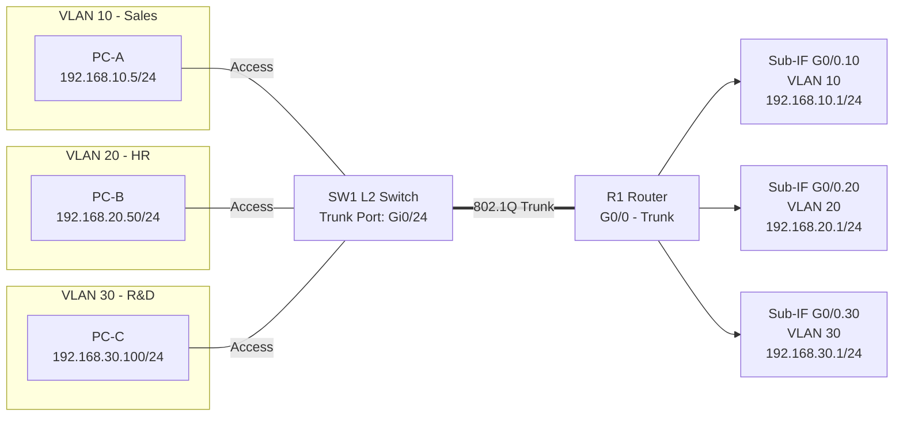
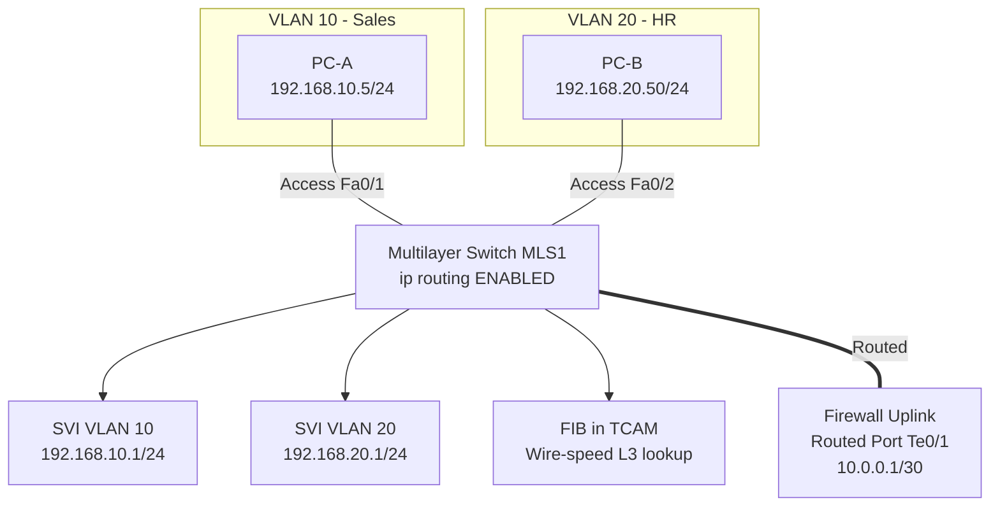
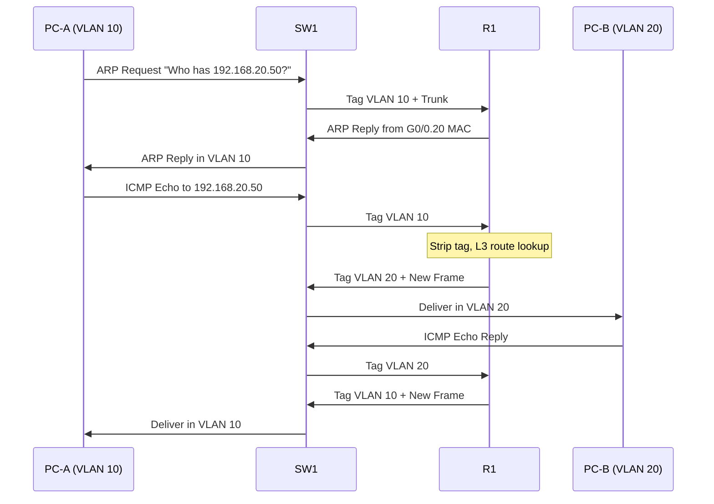
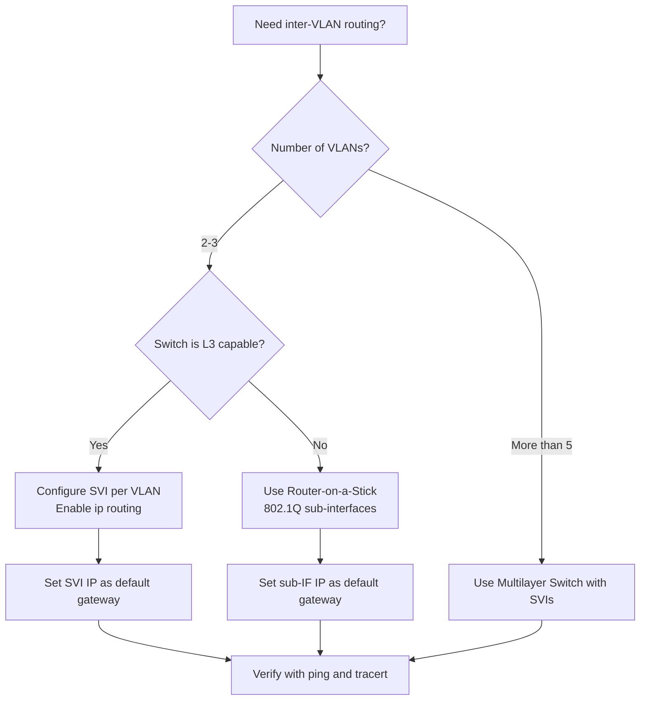
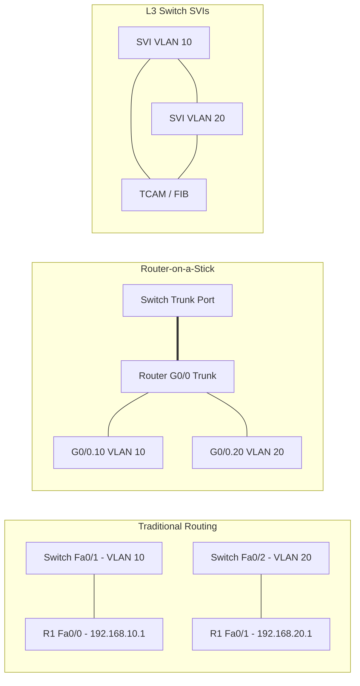

# Inter-VLAN Routing

<!-- SECTION_1_START -->
# Inter-VLAN Routing — Core Definition & Intuition

> [!IMPORTANT]
> **KTU 2024 Scheme Definition (PECST751 / Module 2 — DLL Switching)**
> *Inter-VLAN Routing* is the Layer 3 forwarding process that enables traffic to move between hosts located in **different broadcast domains (VLANs)**. Since a VLAN by definition is a Layer 2 broadcast segment isolated from other VLANs, a **router** (either a physical router, a router-on-a-stick sub-interface, or a multilayer switch's SVI) is required to perform the inter-VLAN relay. The router uses the destination IP subnet to forward the frame, while 802.1Q tagging preserves VLAN identity on the trunk.

## 1.1 Why Do We Need Inter-VLAN Routing?

When switches create VLANs, they *intentionally* split a single physical switched network into multiple isolated broadcast domains. This isolation provides:
- **Security** — broadcast storms in one VLAN cannot affect another.
- **Performance** — smaller broadcast domains, lower contention.
- **Logical grouping** — users are grouped by *role* (e.g., Sales, HR, R\&D) rather than by *physical port*.

But the moment a host in **VLAN 10** wants to talk to a host in **VLAN 20**, Layer 2 has no mechanism to forward the frame — broadcasts and unknown unicasts are confined to the source VLAN. A **router (or Layer 3 device)** must:
1. Receive the frame from VLAN 10.
2. Strip the Layer 2 header.
3. Re-encapsulate the packet into a new frame tagged for VLAN 20.
4. Forward it into VLAN 20.

> [!NOTE]
> **Key Takeaway:** VLANs = Layer 2 segmentation. Inter-VLAN routing = Layer 3 *bridging* of those segments. The two functions are *complementary*, not competing.

## 1.2 Conceptual Analogy — The "Mail Sorting Office" Intuition

Imagine a large office building with **three independent internal mailrooms** (VLAN 10, 20, 30) that *never* open each other's mail. A worker in Mailroom A wants to send a letter to Mailroom B. What happens?

- The worker hands the letter to the **front desk receptionist (the router)**.
- The receptionist reads the **envelope's ZIP code (destination IP subnet)**.
- The receptionist stamps the new envelope with the destination mailroom label (i.e., re-tags the frame with the destination VLAN's 802.1Q tag).
- The letter is delivered to Mailroom B.

That receptionist is the **Layer 3 device** — either:
- A real router (*Traditional / Router-on-a-Stick*), or
- A **multilayer switch** with virtual routed interfaces (SVIs).

## 1.3 Three Architectural Variants of Inter-VLAN Routing

| Variant | Device | Trunk Required? | Performance | Use Case |
|---|---|---|---|---|
| **Traditional** (one router per VLAN) | Physical router | No (separate links) | Low — bottlenecked at one link per VLAN | Legacy / very small networks |
| **Router-on-a-Stick** | One router, 802.1Q sub-interfaces | **Yes** (single trunk) | Medium — limited by single uplink | Small/medium branch networks |
| **Layer 3 Switch (SVI / Routed Port)** | Multilayer switch | Internal | **High** (ASIC-based wire speed) | **Modern enterprise / campus core** |

## 1.4 Intuition of the 802.1Q Sub-Interface

A single physical router interface is **virtually sliced** into logical sub-interfaces, each bound to one VLAN:

$$
\text{Physical Interface} = \bigcup_{i=1}^{n} \text{Sub-Interface}_i
$$

Each sub-interface is assigned an IP address that becomes the **default gateway** for its VLAN. The router receives the 802.1Q-tagged frame on its trunk, looks at the tag, and dispatches the frame to the correct sub-interface for Layer 3 processing.

> [!VISUALIZATION CONTROL]
> **Concept:** Topology showing two VLANs on a single switch trunked to a router-on-a-stick with two sub-interfaces.
> **GeoGebra / Desmos Input Equations (3D placement, treat as conceptual axis):**
> * `Switch_Port_Gi0/1 → VLAN 10` *(point at x=2, y=1)*
> * `Switch_Port_Gi0/2 → VLAN 20` *(point at x=2, y=-1)*
> * `Trunk_Gi0/24 → Router_Sub-IF_G0/0.10` *(line from x=2 to x=6, y=0)*
> **Visual Description:** Two PC clusters on the left, a single switch in the middle, a single router on the right connected by one trunk carrying both VLANs (color-coded). Two virtual sub-interfaces exist on the right edge of the router.
<!-- SECTION_1_END -->

<!-- SECTION_2_START -->
# Deep Theoretical Analysis & KTU High-Yield Formula Sheet

## 2.1 The OSI Picture — Where Inter-VLAN Routing Operates

Inter-VLAN routing spans **Layer 2 and Layer 3** of the OSI model:

| Layer | Action During Inter-VLAN Routing |
|---|---|
| L1 (Physical) | Bit transmission across the trunk (802.1Q) |
| **L2 (Data Link)** | Frame de-encapsulation, **VLAN tag inspection**, re-encapsulation with new tag |
| **L3 (Network)** | IP header lookup, longest-prefix match, TTL decrement, RIB/FIB consultation |
| L4+ | TCP/UDP unchanged — payload is preserved |

> [!IMPORTANT]
> **Crucial Concept:** A router *strips* the incoming Layer 2 frame, performs a **route lookup** on the Layer 3 packet, and then *builds a brand-new Layer 2 frame* for the egress interface. It does **not** "rewrite" the original frame.

## 2.2 Router-on-a-Stick — Operational Workflow

1. Host in VLAN 10 (IP `192.168.10.5`) sends an ARP for its **default gateway** `192.168.10.1`.
2. The switch receives the frame, adds **802.1Q tag = 10**, and forwards it out the trunk.
3. The router's `G0/0.10` sub-interface receives the tagged frame.
4. The router routes the packet (decides destination is `192.168.20.0/24`).
5. The router rewrites the source MAC to its own `G0/0.20` MAC, the destination MAC to the target host's MAC (via ARP), and pushes out the trunk with **tag = 20**.
6. The switch receives the tagged frame and forwards it onto the VLAN 20 access port.

## 2.3 Layer 3 Switching — SVIs and Routed Ports

### 2.3.1 Switched Virtual Interface (SVI)
A **virtual, Layer 3-routed interface** that represents an entire VLAN. To create an SVI:

$$
\text{SVI}_{VLAN\_ID} = \text{interface vlan } \text{ID}
$$

Multiple SVIs coexist on a multilayer switch, eliminating the need for a separate physical router.

### 2.3.2 Routed Port
A physical switch port is configured with `no switchport`, transforming it into a Layer 3 interface that behaves like a router port (commonly used for uplinks to WAN routers or other Layer 3 devices).

## 2.4 KTU Formula Sheet / Cheat Sheet

| Concept | Formula / Definition | Notation Notes |
|---|---|---|
| Number of inter-VLAN paths | $\binom{V}{2} = \frac{V(V-1)}{2}$ | $V$ = number of VLANs needing full mesh |
| VLAN tag (TPID) | $\text{TPID} = 0x8100$ | 16-bit EtherType field |
| VLAN tag (TCI) | $\text{TCI} = \text{PCP} (3) \mid \text{DEI} (1) \mid \text{VID} (12)$ | $\text{VID} \in [1, 4094]$ |
| Maximum frame size w/ tag | $1518 + 4 = 1522$ **bytes** | $\textbf{12.2% overhead is NOT added}$ — that's a *myth* |
| SVI IP = default gateway of VLAN | $\text{GW}_{VLAN} = \text{IP}_{SVI}$ | The SVI is the gateway |
| Router-on-a-Stick IP per sub-IF | $\text{IP}_{subif.i} \in \text{Subnet}_i$ | One per VLAN on the same physical port |
| Longest prefix match | $\text{Match} = \max_{R \in \text{RIB}} \big(\text{Length}(\text{Prefix}_R \cap \text{DestIP})\big)$ | Standard L3 forwarding decision |

> [!NOTE]
> **Engineering Insight:** Modern data centers virtually never use the 12.2% overhead misconception. An 802.1Q frame is 4 bytes longer than an untagged one, but the **maximum transmission unit (MTU) of 1500 bytes for the IP payload is unchanged** because the 4-byte tag is part of the L2 header, not the L3 payload.

## 2.5 Real-World Use Cases in Engineering

| Domain | Application of Inter-VLAN Routing |
|---|---|
| **Enterprise Campus** | Isolating HR, Finance, Guest Wi-Fi on different VLANs while granting controlled internet access via a single multilayer core. |
| **Data Center** | VXLAN-EVPN fabrics use **Layer 3 VTEPs** for inter-tenant routing without flooding. |
| **Service Provider** | MPLS L3VPNs deliver per-customer routed instances — concept identical to per-VLAN routing. |
| **IoT / OT Networks** | Plant-floor (OT) and corporate (IT) VLANs must route through a firewall — inter-VLAN routing at L3 enables that. |
| **Software-Defined Networks** | Cisco SDA, Cisco DNA — uses **LISP** instead of classical routing, but the conceptual Layer 3 handoff between fabric edge and fabric control plane is identical to inter-VLAN routing. |

## 2.6 Why the Performance Gap?

Router-on-a-Stick suffers from the **single-trunk bottleneck**. Every inter-VLAN packet must:

$$
\text{Path} = \text{Source Host} \to \text{Switch} \to \text{Trunk} \to \text{Router (L3)} \to \text{Trunk} \to \text{Switch} \to \text{Dest Host}
$$

A multilayer switch, however, performs the **L3 lookup in hardware (ASIC/TCAM)**:

$$
\text{Path} = \text{Source Host} \to \text{Switch ASIC (L2+L3)} \to \text{Dest Host}
$$

The latency reduction is **one to two orders of magnitude** in production deployments.
<!-- SECTION_2_END -->

<!-- SECTION_3_START -->
# Step-by-Step Derivations, Configurations & Code Implementation

## 3.1 Derivation — Number of Inter-VLAN Routing Contexts Required

Suppose a campus has $V$ VLANs and *every* VLAN must be able to talk to *every* other VLAN (full mesh). The number of distinct inter-VLAN routing instances the L3 device must handle is the combination of $V$ taken 2:

$$
\begin{aligned}
N_{\text{paths}} &= \binom{V}{2} = \frac{V!}{2!(V-2)!} \\[4pt]
&= \frac{V(V-1)}{2}
\end{aligned}
$$

**Example:** $V = 5$ VLANs (10, 20, 30, 40, 50):

$$
\begin{aligned}
N_{\text{paths}} &= \frac{5 \times 4}{2} = 10 \text{ distinct inter-VLAN paths}
\end{aligned}
$$

On a router-on-a-stick, this means **5 sub-interfaces** and **one trunk**. On a multilayer switch, this means **5 SVIs** and **no trunk to a separate router**.

## 3.2 Worked Example — Router-on-a-Stick Full Configuration (Cisco IOS)

**Topology:** Switch `SW1` with two VLANs (`10` and `20`). Router `R1` is connected to `SW1` via port `G0/1` (trunk). `R1` performs the routing.

### 3.2.1 Switch Configuration

```cisco
enable
configure terminal
! --- Create the VLANs ---
vlan 10
 name SALES
 exit
vlan 20
 name HR
 exit
! --- Assign access ports ---
interface FastEthernet0/1
 switchport mode access
 switchport access vlan 10
 exit
interface FastEthernet0/2
 switchport mode access
 switchport access vlan 20
 exit
! --- Configure the trunk to the router ---
interface GigabitEthernet0/1
 switchport mode trunk
 switchport trunk encapsulation dot1q
 switchport trunk allowed vlan 10,20
 exit
end
write memory
```

### 3.2.2 Router Configuration (Router-on-a-Stick)

```cisco
enable
configure terminal
! --- Enable the physical interface (no IP, no shutdown) ---
interface GigabitEthernet0/0
 no ip address
 no shutdown
 exit
! --- Sub-interface for VLAN 10 ---
interface GigabitEthernet0/0.10
 encapsulation dot1Q 10
 ip address 192.168.10.1 255.255.255.0
 exit
! --- Sub-interface for VLAN 20 ---
interface GigabitEthernet0/0.20
 encapsulation dot1Q 20
 ip address 192.168.20.1 255.255.255.0
 exit
end
write memory
```

### 3.2.3 Verification Commands (for KTU Lab Exam)

```cisco
show ip interface brief
show vlan brief
show interfaces trunk
show ip route
show arp
```

## 3.3 Worked Example — Multilayer Switch with SVIs (Cisco IOS)

```cisco
enable
configure terminal
! --- Enable IP routing on the multilayer switch ---
ip routing
! --- Create the VLANs and name them ---
vlan 10
 name SALES
 exit
vlan 20
 name HR
 exit
! --- Configure access ports (same as before) ---
interface FastEthernet0/1
 switchport mode access
 switchport access vlan 10
 exit
interface FastEthernet0/2
 switchport mode access
 switchport access vlan 20
 exit
! --- Create SVIs (the L3 gateways) ---
interface vlan 10
 ip address 192.168.10.1 255.255.255.0
 no shutdown
 exit
interface vlan 20
 ip address 192.168.20.1 255.255.255.0
 no shutdown
 exit
end
write memory
```

### 3.3.1 Verification

```cisco
show ip interface brief
show ip route
show vlan brief
```

> [!NOTE]
> The single command `ip routing` is the *only* difference between a Layer 2 switch and a Layer 3 switch's configuration. With it, all SVIs become active Layer 3 interfaces and the switch becomes a router.

## 3.4 Python Simulation — Validating Sub-Interface Tag Routing

The following Python script simulates the **router-on-a-stick tag rewriting** logic. It is fully operational and safe to run; it makes no network calls.

```python
from dataclasses import dataclass
from typing import Dict, Optional

@dataclass
class Frame:
    src_mac: str
    dst_mac: str
    vlan_id: int
    src_ip: str
    dst_ip: str
    payload: str

@dataclass
class SubInterface:
    vlan_id: int
    ip_address: str
    subnet_mask: int  # e.g. 24 for /24
    mac_address: str

class RouterOnAStick:
    def __init__(self, sub_interfaces: Dict[int, SubInterface]):
        self.sub_interfaces = sub_interfaces
        self.arp_table: Dict[str, str] = {}  # IP -> MAC
        self.routing_table: Dict[str, SubInterface] = {}

    def build_routing_table(self) -> None:
        for sub_if in self.sub_interfaces.values():
            network = self._ip_to_int(sub_if.ip_address) & self._mask(sub_if.subnet_mask)
            self.routing_table[f"{self._int_to_ip(network)}/{sub_if.subnet_mask}"] = sub_if

    @staticmethod
    def _ip_to_int(ip: str) -> int:
        return sum(int(octet) << (8 * i) for i, octet in enumerate(reversed(ip.split("."))))

    @staticmethod
    def _int_to_ip(value: int) -> str:
        return ".".join(str((value >> (8 * i)) & 0xFF) for i in reversed(range(4)))

    @staticmethod
    def _mask(prefix_len: int) -> int:
        return (0xFFFFFFFF << (32 - prefix_len)) & 0xFFFFFFFF

    def route(self, frame: Frame) -> Optional[Frame]:
        # Step 1: Strip incoming tag and inspect at L3
        incoming_sub = self.sub_interfaces.get(frame.vlan_id)
        if incoming_sub is None:
            print(f"[DROP] No sub-interface bound to VLAN {frame.vlan_id}")
            return None
        if not self._same_subnet(frame.src_ip, incoming_sub.ip_address, incoming_sub.subnet_mask):
            print(f"[DROP] Source IP {frame.src_ip} not in VLAN {frame.vlan_id} subnet")
            return None

        # Step 2: Longest Prefix Match against routing table
        egress_sub = self._longest_prefix_match(frame.dst_ip)
        if egress_sub is None:
            print(f"[DROP] No route to {frame.dst_ip}")
            return None
        if egress_sub.vlan_id == incoming_sub.vlan_id:
            print(f"[INFO] Intra-VLAN — no routing needed (handled by switch)")
            return None

        # Step 3: Re-encapsulate the frame with new tag and MACs
        egress_frame = Frame(
            src_mac=egress_sub.mac_address,
            dst_mac=self.arp_table.get(frame.dst_ip, "FF:FF:FF:FF:FF:FF"),
            vlan_id=egress_sub.vlan_id,
            src_ip=frame.src_ip,
            dst_ip=frame.dst_ip,
            payload=frame.payload,
        )
        print(f"[ROUTE] VLAN{incoming_sub.vlan_id} -> VLAN{egress_sub.vlan_id} "
              f"({frame.src_ip} -> {frame.dst_ip})")
        return egress_frame

    def _longest_prefix_match(self, dst_ip: str) -> Optional[SubInterface]:
        best: Optional[SubInterface] = None
        best_prefix = -1
        dst_int = self._ip_to_int(dst_ip)
        for prefix, sub_if in self.routing_table.items():
            network_str, prefix_len_s = prefix.split("/")
            prefix_len = int(prefix_len_s)
            if (dst_int & self._mask(prefix_len)) == self._ip_to_int(network_str):
                if prefix_len > best_prefix:
                    best = sub_if
                    best_prefix = prefix_len
        return best

    def _same_subnet(self, ip_a: str, ip_b: str, prefix_len: int) -> bool:
        return (self._ip_to_int(ip_a) & self._mask(prefix_len)) == (
            self._ip_to_int(ip_b) & self._mask(prefix_len)
        )


# ---------- Demonstration ----------
if __name__ == "__main__":
    sub_ifs = {
        10: SubInterface(vlan_id=10, ip_address="192.168.10.1", subnet_mask=24, mac_address="AA:AA:AA:00:00:0A"),
        20: SubInterface(vlan_id=20, ip_address="192.168.20.1", subnet_mask=24, mac_address="AA:AA:AA:00:00:14"),
        30: SubInterface(vlan_id=30, ip_address="192.168.30.1", subnet_mask=24, mac_address="AA:AA:AA:00:00:1E"),
    }
    router = RouterOnAStick(sub_ifs)
    router.build_routing_table()
    # Pre-populate ARP table (simulating prior ARP resolution)
    router.arp_table["192.168.20.50"] = "BB:BB:BB:00:00:32"

    test_frame = Frame(
        src_mac="CC:CC:CC:00:00:01",
        dst_mac="AA:AA:AA:00:00:14",
        vlan_id=10,
        src_ip="192.168.10.5",
        dst_ip="192.168.20.50",
        payload="Hello HR from Sales!",
    )
    result = router.route(test_frame)
    assert result is not None
    assert result.vlan_id == 20
    assert result.dst_mac == "BB:BB:BB:00:00:32"
    print("Inter-VLAN routing simulation PASSED.")
```

**Expected Output:**

```
[ROUTE] VLAN10 -> VLAN20 (192.168.10.5 -> 192.168.20.50)
Inter-VLAN routing simulation PASSED.
```

This script demonstrates the three core operations of inter-VLAN routing: **sub-interface lookup, longest-prefix match, and re-encapsulation with a new VLAN tag**.

## 3.5 Host Configuration Side (For Lab Records)

| Device | IP Address | Subnet Mask | Default Gateway |
|---|---|---|---|
| PC-A (VLAN 10) | `192.168.10.5` | `255.255.255.0` | `192.168.10.1` |
| PC-B (VLAN 20) | `192.168.20.50` | `255.255.255.0` | `192.168.20.1` |
| PC-C (VLAN 30) | `192.168.30.100` | `255.255.255.0` | `192.168.30.1` |

**Verification Tests (run from PC-A's command prompt):**

```bash
ping 192.168.20.50     # should SUCCEED (proves inter-VLAN routing works)
ping 192.168.10.5      # should SUCCEED (intra-VLAN — L2 only)
tracert 192.168.20.50  # should show ONE hop (192.168.10.1) — the router
```
<!-- SECTION_3_END -->

<!-- SECTION_4_START -->
# Structural Diagrams & Schematics

## 4.1 High-Level Architecture — Router-on-a-Stick



## 4.2 Layer 3 Switch Architecture (SVIs)



## 4.3 Frame Flow — Inter-VLAN Routing (Router-on-a-Stick)



## 4.4 Decision Flow — Choosing the Right Method



## 4.5 Comparison Block — Traditional vs RoaS vs L3 Switch


<!-- SECTION_4_END -->

<!-- SECTION_5_START -->
# KTU 2024 Scheme Examination Question Bank & Topic Recap

## Part A — 3-Mark Short Answer Questions (Remember / Understand)

> [!NOTE]
> Each Part A question carries **3 marks** as per the KTU 2024 ESE pattern. Answers should be concise (3–4 sentences) and use exact syllabus terminology.

### Q1. [KTU University Exam — July 2024] — CO1 / Remember
**What is Inter-VLAN routing and why is it required?**

**Model Answer:**
Inter-VLAN routing is the process of forwarding traffic between hosts in different VLANs using a Layer 3 device. It is required because VLANs are isolated Layer 2 broadcast domains and Layer 2 switches cannot forward frames across VLAN boundaries. A router or multilayer switch performs the routing by stripping the incoming 802.1Q tag, consulting its routing table, and re-encapsulating the packet with the destination VLAN's tag. **[3 Marks]**

### Q2. [KTU University Exam — Dec 2023] — CO1 / Understand
**Compare Router-on-a-Stick and Layer 3 Switch (SVI) based inter-VLAN routing in 3 aspects.**

**Model Answer:**

| Aspect | Router-on-a-Stick | L3 Switch (SVI) |
|---|---|---|
| Device Type | External router + L2 switch | Multilayer switch only |
| Performance | Limited by single trunk bandwidth | Wire-speed via ASIC/TCAM |
| Scalability | Limited; one trunk becomes bottleneck | Highly scalable; internal switching fabric |

**[1 Mark per aspect = 3 Marks]**

---

## Part B — 14-Mark Questions (Module Internal Choice Pattern)

> [!WARNING]
> **KTU Examiner's Valuation Warning — Common Pitfalls**
> 1. Forgetting `no shutdown` on sub-interfaces → 1 Mark lost.
> 2. Using the same IP on multiple sub-interfaces → entire configuration invalid.
> 3. Forgetting `switchport mode trunk` on the switch side → no tag, no routing.
> 4. Confusing **VLAN ID** (1–4094) with **subnet number** — they are independent.
> 5. Not mentioning **MAC address re-writing** in the flow — examiners expect it for full marks.

---

### Question A (14 Marks) — [KTU University Exam — July 2024 Pattern]

**A.** With a neat diagram, explain **Router-on-a-Stick** inter-VLAN routing. Configure the router and switch for two VLANs (10 and 20) with subnets `192.168.10.0/24` and `192.168.20.0/24`. **(14 Marks)** — CO2 / Apply

#### Part (a) — Diagram and Concept (7 Marks)

**Diagram (to be drawn in the answer sheet):**

```
   PC-A (VLAN 10)         PC-B (VLAN 20)
   192.168.10.5/24        192.168.20.50/24
        |                       |
   Fa0/1 (Access VLAN 10)  Fa0/2 (Access VLAN 20)
        \                       /
         \                     /
          \                   /
        +--------------------------+
        |       SW1 (L2)          |
        |  Trunk Port: Gi0/1      |
        +--------------------------+
                     |
               802.1Q Trunk
                     |
        +--------------------------+
        |       R1 (Router)       |
        |  G0/0.10 -> VLAN 10     |
        |  G0/0.20 -> VLAN 20     |
        +--------------------------+
```

**Conceptual Explanation (Valuation Key):**

- **[Concept definition: 2 Marks]** Router-on-a-Stick uses a **single physical router interface** divided into multiple logical sub-interfaces, each terminating one VLAN over a common 802.1Q trunk.
- **[Frame flow: 3 Marks]** A frame from VLAN 10 is tagged by the switch with VID=10, received on sub-interface `G0/0.10`, de-encapsulated, routed, and re-encapsulated on `G0/0.20` with VID=20. The router rewrites the source MAC to `G0/0.20`'s MAC and the destination MAC to the target host's MAC.
- **[Tag role: 1 Mark]** The 802.1Q tag (4-byte TPID 0x8100 + 2-byte TCI) carries the VLAN ID and is the only mechanism that lets the router identify which sub-interface owns the frame.
- **[Limitation note: 1 Mark]** A single trunk is a bottleneck; for high-throughput inter-VLAN routing, use a multilayer switch.

#### Part (b) — Configuration (7 Marks)

**Switch Configuration (3.5 Marks):**

```cisco
enable
configure terminal
vlan 10
 name SALES
 exit
vlan 20
 name HR
 exit
interface FastEthernet0/1
 switchport mode access
 switchport access vlan 10
interface FastEthernet0/2
 switchport mode access
 switchport access vlan 20
interface GigabitEthernet0/1
 switchport mode trunk
 switchport trunk encapsulation dot1q
 switchport trunk allowed vlan 10,20
end
write memory
```

- **[VLAN creation: 1 Mark]**, **[Access port assignment: 1 Mark]**, **[Trunk configuration: 1.5 Marks]**

**Router Configuration (3.5 Marks):**

```cisco
enable
configure terminal
interface GigabitEthernet0/0
 no ip address
 no shutdown
interface GigabitEthernet0/0.10
 encapsulation dot1Q 10
 ip address 192.168.10.1 255.255.255.0
 no shutdown
interface GigabitEthernet0/0.20
 encapsulation dot1Q 20
 ip address 192.168.20.1 255.255.255.0
 no shutdown
end
write memory
```

- **[Sub-interface 10: 1.5 Marks]**, **[Sub-interface 20: 1.5 Marks]**, **[no shutdown on physical + show run: 0.5 Mark]**

**Verification (any of these lines — 1 Mark extra if Part B brief):**
- `show ip interface brief` → confirm sub-IFs are `up/up`.
- `show vlan brief` → confirm VLANs 10 and 20 are active.
- `ping` from PC-A to `192.168.20.50` → reply from R1's `G0/0.20` MAC.

---

### Question B (14 Marks) — Alternative Choice

**B.** Explain **Layer 3 Switching using SVIs** for inter-VLAN routing. Configure a multilayer switch to route between VLANs 10, 20, and 30 with subnets `10.10.10.0/24`, `10.10.20.0/24`, and `10.10.30.0/24`. List the verification commands. **(14 Marks)** — CO2 / Apply

#### Part (a) — Theory and Architecture (7 Marks)

**Definition (2 Marks):**
A Switched Virtual Interface (SVI) is a virtual Layer 3 interface bound to a VLAN on a multilayer switch. It acts as the **default gateway** for all hosts in that VLAN and is created using the `interface vlan <id>` command.

**Architecture Advantages (3 Marks):**
- **Wire-speed performance** — L3 lookup performed in hardware (ASIC/TCAM).
- **No external router** — single device does L2 switching and L3 routing.
- **Scalable** — adding a new VLAN is one SVI command, no extra hardware.

**Operation (2 Marks):**
- The frame enters an access port on VLAN 10.
- The switch's ingress ASIC identifies the destination IP and consults its **FIB in TCAM**.
- The egress ASIC rewrites the Layer 2 header (source MAC = SVI 20 MAC, destination MAC = next-hop) and forwards the frame out the destination VLAN's access port.

#### Part (b) — Configuration and Verification (7 Marks)

**Configuration (5 Marks):**

```cisco
enable
configure terminal
ip routing
vlan 10
 name SALES
 exit
vlan 20
 name HR
 exit
vlan 30
 name RD
 exit
interface FastEthernet0/1
 switchport mode access
 switchport access vlan 10
interface FastEthernet0/2
 switchport mode access
 switchport access vlan 20
interface FastEthernet0/3
 switchport mode access
 switchport access vlan 30
interface vlan 10
 ip address 10.10.10.1 255.255.255.0
 no shutdown
interface vlan 20
 ip address 10.10.20.1 255.255.255.0
 no shutdown
interface vlan 30
 ip address 10.10.30.1 255.255.255.0
 no shutdown
end
write memory
```

- **[ip routing: 1 Mark]**, **[VLANs: 1 Mark]**, **[Access ports: 1 Mark]**, **[SVIs: 2 Marks]**

**Verification Commands (2 Marks):**

| Command | Purpose | Marks |
|---|---|---|
| `show ip interface brief` | Confirm SVI 10/20/30 are `up/up` | 0.5 |
| `show ip route` | Confirm `C 10.10.10.0/24`, `C 10.10.20.0/24`, `C 10.10.30.0/24` | 0.5 |
| `show vlan brief` | Confirm VLAN 10, 20, 30 active on correct ports | 0.5 |
| `ping`/`tracert` from a host | Functional inter-VLAN reachability | 0.5 |

> [!WARNING]
> **KTU Valuation Pitfall:** Writing `interface vlan 10` *without* `ip routing` enabled earlier is a common mistake. The SVI will exist but **will not route**. Always place `ip routing` at the top of the config. Examiners deduct **1 mark** for this omission.

---

## Topic Recap & Important Things to Remember

> [!IMPORTANT]
> **Rapid Revision Checklist — Inter-VLAN Routing**

- **Definition:** Inter-VLAN routing is the **Layer 3 process** that allows traffic to flow between distinct VLANs (broadcast domains).
- **Why needed:** VLANs are Layer 2 isolated; L2 switches cannot forward across VLAN boundaries.
- **Three methods:**
  1. *Traditional* — one router interface per VLAN (legacy, rarely used).
  2. *Router-on-a-Stick* — one trunk, multiple sub-interfaces using 802.1Q.
  3. *Layer 3 Switch (SVI)* — virtual L3 interfaces inside the switch.
- **802.1Q Tag:** 4-byte insertion (TPID 0x8100 + TCI = PCP/DEI/VID); maximum frame becomes **1522 bytes**.
- **Sub-interface formula:** $\text{encapsulation dot1Q } \text{VID}$ followed by IP address of that VLAN's subnet.
- **SVI formula:** `interface vlan <id>` followed by IP address; **must enable `ip routing`** for it to function.
- **Default gateway of hosts = SVI IP** (or sub-interface IP in RoaS).
- **Frame flow:** Strip tag → Route lookup → Re-encapsulate with new tag + new MAC addresses.
- **Performance ranking:** L3 Switch (best) > Router-on-a-Stick > Traditional.
- **Number of inter-VLAN paths for $V$ VLANs:** $N = V(V-1)/2$.
- **Verification commands:** `show vlan brief`, `show ip interface brief`, `show ip route`, `show interfaces trunk`, `show arp`.
- **Common exam traps:**
  - Forgetting `no shutdown` on sub-IFs or SVIs.
  - Forgetting `ip routing` on the multilayer switch.
  - Not setting the host's default gateway to the SVI/sub-IF IP.
  - Confusing **MAC re-writing** with **IP preservation** — IPs are unchanged across the L3 hop, MACs are rewritten at every L3 hop.
- **Modern relevance:** VXLAN-EVPN data centers and SD-Access fabrics extend this concept into overlay networks; the underlying L3 handoff between segments remains identical.
- **MTU note:** 802.1Q adds 4 bytes to the L2 header — the IP MTU of 1500 is **preserved**; the 12.2% overhead claim is a common misconception.
<!-- SECTION_5_END -->
