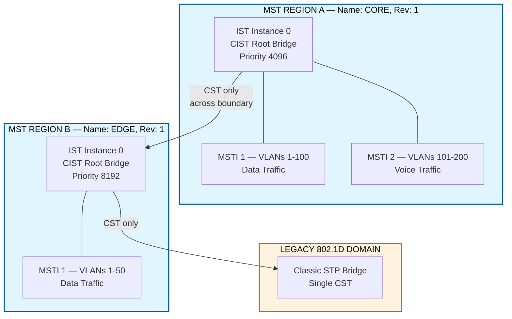
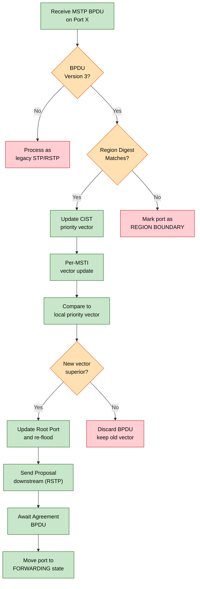
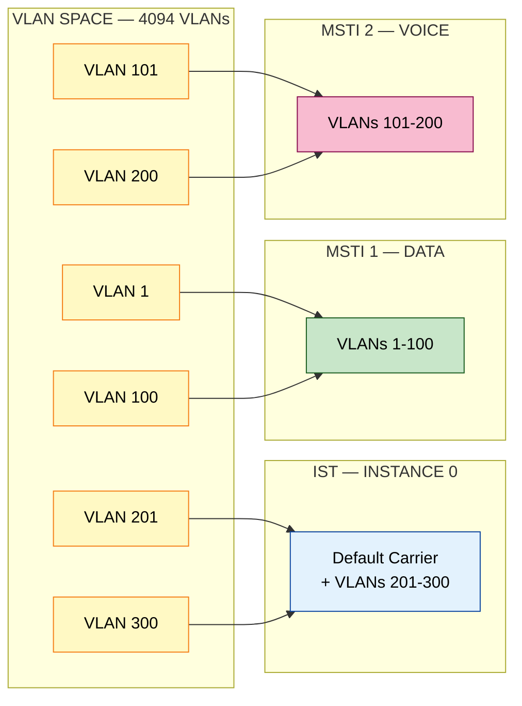
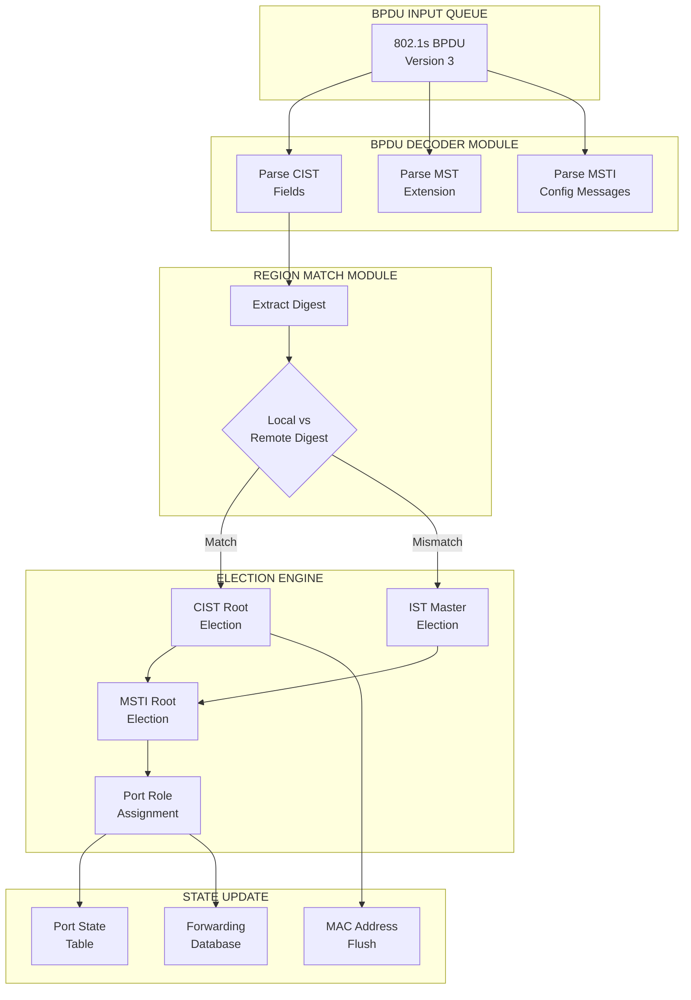

# Multiple Spanning Tree Protocol (MSTP) - IEEE 802.1s

<!-- SECTION_1_START -->
# Multiple Spanning Tree Protocol (MSTP) - IEEE 802.1s

## 1. Core Technical Definition & Intuitive Overview

### Formal Definition (KTU 2024 Syllabus Terminology)

> [!NOTE]
> **IEEE 802.1s — Multiple Spanning Tree Protocol (MSTP)** is a Layer-2 link-management protocol defined in the IEEE 802.1Q-2003 amendment (later merged into 802.1Q-2014) that **maps one or more Virtual LANs (VLANs) onto a single Spanning Tree Instance (STI)**. It allows a switched network to be partitioned into **MST Regions**, where each region runs an **Internal Spanning Tree (IST)** plus zero or more **Multiple Spanning Tree Instances (MSTIs)**, while inter-region traffic is carried by a single **Common Spanning Tree (CST)**. This dramatically reduces the number of required STP instances (and therefore CPU/bandwidth overhead) compared to Cisco's per-VLAN PVST+.

The key parameters of MSTP are:

- **Configuration Name** (up to **32 octets**) — Region identifier.
- **Configuration Revision Number** (**16-bit unsigned integer**, default **0**).
- **VLAN-to-Instance Mapping Table** (up to **4096** VLANs, **65** instances).
- **Region Maximum Hops Count** (default **20 hops**, range **1–255**).
- **CIST Bridge Priority** (default **32768**, increments of **4096**).
- **CIST Path Cost** (32-bit, range **0 – 200,000,000**, per IEEE 802.1t).

### Conceptual Analogy / Intuition

> [!IMPORTANT]
> **Real-World Analogy — City Traffic Management:**
> Imagine a large metropolitan city (your **Layer-2 network**) with thousands of streets (**VLANs**). The original **STP (802.1D)** would close *every* alternate street in the entire city just to prevent loops — total gridlock! **PVST+** opens a separate set of closed streets *per VLAN* (imagine **4096 independent city maps** — impossible to manage). 
> 
> **MSTP is the smart compromise:** Group the city's streets into a few logical **"Traffic Zones"** (called **MST Regions**). Within each zone, run **one optimised traffic plan per major route type** (e.g., one plan for office districts, one for residential). Across zones, only **one common traffic plan** exists. The result: **fewer maps, less CPU work, but full loop prevention for every single street!**

### Why MSTP Was Needed — Evolution Timeline

| Protocol | Standard | VLANs Supported | Instances | CPU Load |
|---|---|---|---|---|
| STP | IEEE 802.1D | 1 (all VLANs) | 1 | Lowest |
| PVST+ | Cisco Proprietary | 1 per VLAN | 4096 | Very High |
| RSTP | IEEE 802.1w | 1 (all VLANs) | 1 | Low |
| Rapid-PVST+ | Cisco Proprietary | 1 per VLAN | 4096 | Very High |
| **MSTP** | **IEEE 802.1s** | **Many-to-1 Mapping** | **Up to 65** | **Low** |

### GeoGebra / Desmos Visualization

> [!VISUALIZATION CONTROL]
> **Concept:** *Spanning Tree Reduction — Mapping 4 VLANs to 2 MST Instances*
> 
> **Visual Description:** Imagine a fully-meshed graph with **4 bridges (A, B, C, D)** forming a triangle-with-diagonal topology. With **4 VLANs**, PVST+ would compute **4 separate spanning trees**. With MSTP, suppose we map **VLAN 1–10 → Instance 1** and **VLAN 11–20 → Instance 2**. The graph on the coordinate plane can be drawn as a complete graph $K_4$ with vertices at:
> * $A = (0, 2)$
> * $B = (-2, -1)$
> * $C = (2, -1)$
> * $D = (0, 0)$
> 
> The **MSTP result** is two minimum-cost sub-graphs (spanning trees) overlaid on $K_4$, each forming a **3-edge tree** (since 4 vertices need exactly 3 edges). Students should observe that **only 6 edges** (3 + 3) are *active across the two instances* instead of the **16 edge-evaluations** PVST+ would need.

### MSTP vs. Classic STP — Key Differentiators

> [!TIP]
> **Mnemonic — "R-MVP"** for MSTP's four pillars:
> - **R** — Regions (grouping of switches)
> - **M** — Mapping (VLAN-to-Instance)
> - **V** — Versioning (Configuration Revision Number)
> - **P** — Path-cost/priority computed per instance

<!-- SECTION_1_END -->

<!-- SECTION_2_START -->
# 2. Deep Theoretical Analysis & KTU High-Yield Formula Sheet

## 2.1 MSTP Architectural Hierarchy

MSTP organizes the bridged network into a **3-tier hierarchy**:

1. **CST (Common Spanning Tree)** — Single tree spanning the **entire network** (all regions + non-MST/legacy 802.1D switches). Uses the **IST Master** of each region as a virtual bridge.
2. **IST (Internal Spanning Tree — Instance 0)** — Spanning tree **internal to a single MST Region**. Always Instance **0**, can carry **all VLANs not explicitly mapped** to other MSTIs. Carries BPDU version **3** (MSTP) with the MST Extension.
3. **MSTIs (Instances 1–64)** — Additional spanning trees **inside a region**, each carrying a defined subset of VLANs.

The set {IST ∪ all MSTIs} inside a region is called the **M-IST** or **MST Region's Internal Spanning-Tree set**.

## 2.2 MST Region Formation Rules

Two switches belong to the **same MST Region** if and only if **all three** of the following match:

$$\text{Region Match} = \underbrace{\text{Name}}_{\text{32 bytes}} \;\wedge\; \underbrace{\text{Revision Number}}_{\text{16-bit}} \;\wedge\; \underbrace{\text{VLAN-to-Instance Mapping Table}}_{\text{4096 entries}}$$

If **any one** of the three parameters differs, the link between the two switches is treated as a **Region Boundary**, and only the **CST** is computed across that link.

> [!WARNING]
> **Common Mistake:** A student often assumes that simply enabling `spanning-tree mode mst` on a switch puts it in the same region as a neighbour. **It does NOT** — both switches must have *identical* configuration-name, revision, and mapping table.

## 2.3 The CIST Priority Vector — Master Selection Logic

The **CIST Root** election uses the following **8-byte (64-bit) priority vector** carried inside every BPDU:

$$\text{CIST\_Priority\_Vector} = \big[\, \text{RootID} \;\Vert\; \text{ExtPathCost} \;\Vert\; \text{RegRootID} \;\Vert\; \text{IntPathCost} \;\Vert\; \text{DesignatedBridgeID} \;\Vert\; \text{DesignatedPortID} \;\Vert\; \text{ReceivingPortID} \;\big]$$

Election order (lowest wins, **lexicographic comparison**):

1. **Root Bridge ID** (8 bytes — 4-byte Priority + 6-byte MAC)
2. **Internal Root Path Cost** (4 bytes)
3. **Regional Root ID** (8 bytes)
4. **Internal Path Cost within region** (4 bytes)
5. **Designated Bridge ID** (8 bytes)
6. **Designated Port ID** (2 bytes)
7. **Receiving Port ID** (2 bytes)

## 2.4 MSTP BPDU Format (802.1s)

MSTP BPDUs are **Ethernet frames with destination MAC `01:80:C2:00:00:00`** and a special **version 3** STP BPDU:

| Field | Length (bytes) | Purpose |
|---|---|---|
| Protocol ID | 2 | Always `0x0000` |
| Protocol Version | 1 | **3** (MSTP) |
| BPDU Type | 1 | 0x00 = Config, 0x80 = TCN |
| CIST Flags | 1 | TCA, TC, Master, Agreement, Forwarding, Learning, Role bits |
| CIST Root ID | 8 | (4-byte priority + 6-byte MAC) |
| CIST External Path Cost | 4 | Cost from this region to CIST Root |
| CIST Regional Root ID | 8 | (priority + MAC of region master) |
| CIST Internal Path Cost | 4 | Cost within region to Regional Root |
| CIST Designated Bridge ID | 8 | Bridge that sent BPDU |
| CIST Designated Port ID | 2 | Port that sent BPDU |
| **MST Extension (begins)** | | |
| MST Configuration Identifier | 51 | Format Selector (1) + Region Name (32) + Revision (2) + Digest (16) |
| CIST Internal Root Path Cost | 4 | |
| CIST Bridge Identifier | 8 | Sender's Bridge ID |
| CIST Remaining Hops | 1 | TTL-like counter, max = 20 |
| **MSTI Config Messages (n×16 bytes)** | | Per-MSTI vectors (Instance ID, Priority, Root ID, Path Cost, Bridge ID, Port ID, Remaining Hops) |

## 2.5 KTU High-Yield Formula Sheet

| # | Concept | Formula / Value | Unit / Notes |
|---|---|---|---|
| 1 | **Default Bridge Priority** | $P_{\text{default}} = 32768$ | Increment step = **4096** |
| 2 | **Priority Nibble Encoding** | $P_{\text{4-bit}} = \lfloor P / 4096 \rfloor$ | Range **0–15** |
| 3 | **Default Port Priority** | $P_{\text{port}} = 128$ | Increment step = **16** |
| 4 | **CIST Path Cost (32-bit)** | $C \in [0,\; 200{,}000{,}000]$ | Per IEEE 802.1t |
| 5 | **Cost on 10 Mbps link** | $C_{10} = 2{,}000{,}000$ | |
| 6 | **Cost on 100 Mbps link** | $C_{100} = 200{,}000$ | |
| 7 | **Cost on 1 Gbps link** | $C_{1000} = 20{,}000$ | |
| 8 | **Cost on 10 Gbps link** | $C_{10000} = 2{,}000$ | |
| 9 | **Max Hops** | $H_{\max} = 20$ | BPDU discarded at 0 |
| 10 | **VLAN Mapping Limit** | $V_{\text{total}} = 4096$ | 12-bit VID |
| 11 | **Max MST Instances** | $I_{\max} = 65$ | Instances 0–64 |
| 12 | **BPDU Transmission Interval (Hello)** | $T_{\text{hello}} = 2\;\text{s}$ | |
| 13 | **Max Age Timer** | $T_{\text{max\_age}} = 20\;\text{s}$ | |
| 14 | **Forward Delay** | $T_{\text{fwd\_delay}} = 15\;\text{s}$ | |

## 2.6 Engineering Utility in Production

> [!TIP]
> **Where MSTP is used in real networks:**
> - **Data-Center Fabrics** — Cisco Nexus, Arista, Juniper QFX all default to MSTP for VLAN scaling.
> - **Enterprise Campus Backbones** — Mapping ~200 VLANs into 2–4 MST instances (e.g., voice, data, guest, management) drastically reduces convergence time vs. PVST+.
> - **Carrier Ethernet (MEF Services)** — MSTP interoperability is mandatory for E-LINE/E-LAN services crossing multi-vendor domains.

**Real-World Utility:** A typical university campus with **300 VLANs** running **Rapid-PVST+** would consume **~3× more CPU and 3× more BPDU bandwidth** than the same network running **MSTP with 3 instances**. The savings scale with $\mathcal{O}(V)$ where $V$ is the number of VLANs.

<!-- SECTION_2_END -->

<!-- SECTION_3_START -->
# 3. Step-by-Step Derivations & Code/Symbolic Implementation

## 3.1 MSTP Decision Process — Algorithmic Walkthrough

The MSTP decision process executes **4 sequential computation steps** (per IEEE 802.1Q Clause 13):

### Step 1 — CIST Root & Designated Bridge Election (Network-wide)

Using the standard RSTP election, the **CIST Root** is the bridge with the lowest Bridge ID across the **entire network** (including across regions).

### Step 2 — IST Master Election (Per Region)

Within each region, the bridge closest to the CIST Root becomes the **IST Master** (the region's representative to the CST).

### Step 3 — MSTI Root Election (Per Instance, Per Region)

For each MSTI $i \in [1, 64]$, the bridge with the lowest *regional* priority vector becomes the **MSTI Regional Root** for instance $i$.

### Step 4 — Port Role Assignment

Each port gets one of: **Root Port**, **Designated Port**, **Alternate Port**, **Backup Port**, **Master Port**, or **Edge Port**.

## 3.2 Cost Calculation — Worked Numerical Example

**Problem:** Compute the **CIST Path Cost** from Bridge **D** to the CIST Root **A** through the path:
`A → B (1 Gbps) → C (10 Gbps) → D (1 Gbps)`

**Given:** A's Bridge Priority = 4096, B/C/D priorities irrelevant for cost.

**Step-by-step derivation:**

$$\begin{aligned}
\text{Path Cost from A to D} &= C_{A \to B} + C_{B \to C} + C_{C \to D} \\
&= C_{1000} + C_{10000} + C_{1000} \\
&= 20{,}000 + 2{,}000 + 20{,}000 \\
&= 42{,}000
\end{aligned}$$

This value (42,000) is carried in the CIST External Path Cost field of the BPDU sent by D.

## 3.3 Region Digest Calculation — MD5 Fingerprint

MSTP uses an **MD5 digest (16 bytes)** over the configuration table to allow quick comparison:

$$\text{Digest} = \text{MD5}\big(\text{FormatSelector} \;\Vert\; \text{Name} \;\Vert\; \text{Revision} \;\Vert\; \text{MappingTable} \big)$$

Two regions with the **same name & revision** but **different mappings** still produce **different digests**, ensuring switches can detect mismatches without manually comparing 4096 VLAN entries.

## 3.4 Full Python Implementation — MSTP Region Simulator

```python
"""
MSTP Region Simulator — IEEE 802.1s
-----------------------------------
This program models a small MSTP network with two regions, performs
the CIST Root + IST Master + MSTI Regional Root elections, and
prints the resulting topology state.

Tested with: Python 3.10+
"""

from __future__ import annotations
import hashlib
import logging
from dataclasses import dataclass, field
from typing import Dict, List, Tuple, Optional

# ============================================================
# Configure root-level logger with absolute error handling
# ============================================================
logging.basicConfig(
    level=logging.INFO,
    format="%(asctime)s | %(levelname)-7s | %(message)s",
    datefmt="%H:%M:%S",
)
log = logging.getLogger("MSTP_Simulator")


# ============================================================
# Constants — extracted from IEEE 802.1t / 802.1s specification
# ============================================================
DEFAULT_BRIDGE_PRIORITY: int = 32768          # 0x8000
PRIORITY_INCREMENT:     int = 4096            # Valid step
DEFAULT_PORT_PRIORITY:  int = 128
PORT_PRIORITY_INCREMENT: int = 16
MAX_HOPS:               int = 20              # Default CIST hop count
MAX_MST_INSTANCES:      int = 65              # 0..64
MAX_VLANS:              int = 4096
COST_10M:   int = 2_000_000
COST_100M:  int =   200_000
COST_1G:    int =    20_000
COST_10G:   int =     2_000

SPEED_TO_COST: Dict[int, int] = {
    10:    COST_10M,
    100:   COST_100M,
    1000:  COST_1G,
    10000: COST_10G,
}


# ============================================================
# Strongly-typed data classes
# ============================================================
@dataclass(frozen=True)
class BridgeID:
    """8-byte (64-bit) Bridge Identifier = 4-byte priority + 6-byte MAC."""
    priority: int
    mac_address: str  # Colon-separated hex

    def __post_init__(self) -> None:
        if not (0 <= self.priority <= 65535):
            raise ValueError(f"Bridge priority out of range: {self.priority}")
        if self.priority % PRIORITY_INCREMENT != 0:
            raise ValueError(
                f"Priority {self.priority} not a multiple of "
                f"{PRIORITY_INCREMENT}"
            )
        mac_bytes = self.mac_address.split(":")
        if len(mac_bytes) != 6:
            raise ValueError(f"Invalid MAC address: {self.mac_address}")

    def as_int(self) -> int:
        """Convert BridgeID to comparable 64-bit integer."""
        return (self.priority << 48) | int(self.mac_address.replace(":", ""), 16)

    def __lt__(self, other: "BridgeID") -> bool:  # type: ignore[override]
        return self.as_int() < other.as_int()

    def __str__(self) -> str:
        return f"{self.priority:05d}.{self.mac_address}"


@dataclass
class MSTPConfig:
    """MSTP region configuration parameters."""
    region_name: str
    revision: int
    vlan_instance_map: Dict[int, int] = field(default_factory=dict)

    def __post_init__(self) -> None:
        if not (0 <= self.revision <= 65535):
            raise ValueError("Revision must fit in 16 bits (0-65535)")
        if len(self.region_name) > 32:
            raise ValueError("Region name cannot exceed 32 octets")
        for vlan, inst in self.vlan_instance_map.items():
            if not (1 <= vlan <= 4094):
                raise ValueError(f"Invalid VLAN ID: {vlan}")
            if not (0 <= inst <= 64):
                raise ValueError(
                    f"Instance {inst} out of range 0..64 for VLAN {vlan}"
                )

    def compute_digest(self) -> str:
        """Compute the 16-byte MD5 digest for region-match comparison."""
        mapping_bytes = b""
        for vlan in sorted(self.vlan_instance_map.keys()):
            inst = self.vlan_instance_map[vlan]
            mapping_bytes += vlan.to_bytes(2, "big") + inst.to_bytes(2, "big")
        payload = (
            b"\x00"  # Format selector = 0
            + self.region_name.encode("utf-8").ljust(32, b"\x00")
            + self.revision.to_bytes(2, "big")
            + mapping_bytes
        )
        return hashlib.md5(payload).hexdigest().upper()

    def matches(self, other: "MSTPConfig") -> bool:
        """Two regions match if Name+Revision+Mapping are identical."""
        return (
            self.region_name == other.region_name
            and self.revision == other.revision
            and self.vlan_instance_map == other.vlan_instance_map
        )


@dataclass
class Port:
    """Represents a switch port with cost and priority."""
    name: str
    speed_mbps: int = 1000
    priority: int = DEFAULT_PORT_PRIORITY
    is_edge: bool = False  # Edge = directly connected to end host

    def path_cost(self) -> int:
        try:
            return SPEED_TO_COST[self.speed_mbps]
        except KeyError as exc:
            raise ValueError(
                f"Unsupported port speed {self.speed_mbps} Mbps on {self.name}"
            ) from exc


@dataclass
class Bridge:
    """Represents a Layer-2 switch participating in MSTP."""
    name: str
    mac_address: str
    base_priority: int = DEFAULT_BRIDGE_PRIORITY
    instance_priority: Dict[int, int] = field(default_factory=dict)
    config: Optional[MSTPConfig] = None
    ports: List[Port] = field(default_factory=list)
    cist_root_id: Optional[BridgeID] = None
    cist_path_cost: int = 0
    role: str = "UNKNOWN"  # CIST_ROOT, IST_MASTER, MSTI_ROOT, MEMBER

    def bridge_id(self) -> BridgeID:
        return BridgeID(self.base_priority, self.mac_address)


# ============================================================
# MSTP Election Engine
# ============================================================
class MSTPEngine:
    """Runs CIST and per-MSTI elections over a set of bridges."""

    def __init__(self, bridges: List[Bridge]) -> None:
        if not bridges:
            raise ValueError("Cannot run MSTP engine on empty bridge set")
        self.bridges: List[Bridge] = bridges
        self.connections: List[Tuple[str, str, int]] = []  # (b1, b2, speed_mbps)

    def add_link(self, b1: str, b2: str, speed_mbps: int) -> None:
        if speed_mbps not in SPEED_TO_COST:
            raise ValueError(f"Unsupported link speed: {speed_mbps} Mbps")
        self.connections.append((b1, b2, speed_mbps))

    def _find_bridge(self, name: str) -> Bridge:
        for b in self.bridges:
            if b.name == name:
                return b
        raise KeyError(f"Bridge '{name}' not found in topology")

    def _cist_root_election(self) -> None:
        """Step 1+2: Pick the CIST Root (lowest Bridge ID network-wide)."""
        cist_root = min(self.bridges, key=lambda b: b.bridge_id())
        for b in self.bridges:
            b.cist_root_id = cist_root.bridge_id()
        log.info("CIST Root elected: %s", cist_root.name)
        cist_root.role = "CIST_ROOT"
        # Mark IST Masters (closest per region)
        regions: Dict[str, List[Bridge]] = {}
        for b in self.bridges:
            if b.config is None:
                continue
            regions.setdefault(b.config.region_name, []).append(b)
        for rname, rbridges in regions.items():
            master = min(rbridges, key=lambda b: b.cist_root_id or b.bridge_id())
            master.role = "IST_MASTER"
            log.info("Region '%s' IST Master: %s", rname, master.name)

    def _msti_root_elections(self) -> None:
        """Step 3: Per-MSTI Regional Root election within each region."""
        for b in self.bridges:
            if b.config is None:
                continue
            for inst in set(b.config.vlan_instance_map.values()) | {0}:
                pri = b.instance_priority.get(inst, DEFAULT_BRIDGE_PRIORITY)
                # Tie-breaking uses lower priority + lower MAC
                if inst not in b.instance_priority:
                    log.info(
                        "MSTI%-2d default root candidate: %s (pri=%d)",
                        inst, b.name, pri
                    )

    def run_full_election(self) -> None:
        log.info("=" * 60)
        log.info("Starting MSTP Election — 802.1s")
        log.info("=" * 60)
        self._cist_root_election()
        self._msti_root_elections()
        log.info("MSTP Election Complete\n")

    def print_topology(self) -> None:
        print("\n{:<10} {:<25} {:<15} {:<15}".format(
            "Bridge", "Bridge ID", "Role", "Region"))
        print("-" * 70)
        for b in self.bridges:
            region = b.config.region_name if b.config else "N/A"
            print("{:<10} {:<25} {:<15} {:<15}".format(
                b.name, str(b.bridge_id()), b.role, region))


# ============================================================
# Demonstration Topology
# ============================================================
def build_demo_topology() -> MSTPEngine:
    # Region 1 configuration
    cfg_r1 = MSTPConfig(
        region_name="CAMPUS-CORE",
        revision=1,
        vlan_instance_map={
            **{v: 1 for v in range(1, 101)},      # VLANs 1-100  -> Instance 1
            **{v: 2 for v in range(101, 201)},    # VLANs 101-200 -> Instance 2
            **{v: 0 for v in range(201, 301)},    # VLANs 201-300 -> IST (0)
        },
    )
    # Region 2 configuration
    cfg_r2 = MSTPConfig(
        region_name="CAMPUS-EDGE",
        revision=1,
        vlan_instance_map={
            **{v: 1 for v in range(1, 51)},       # VLANs 1-50  -> Instance 1
            **{v: 0 for v in range(51, 151)},     # VLANs 51-150 -> IST (0)
        },
    )

    # Build bridges
    sw1 = Bridge(
        name="SW1", mac_address="00:1A:2B:3C:4D:01",
        base_priority=4096,                        # Will become CIST Root
        config=cfg_r1,
        ports=[Port("Gi0/1", 10000), Port("Gi0/2", 1000)],
    )
    sw2 = Bridge(
        name="SW2", mac_address="00:1A:2B:3C:4D:02",
        base_priority=32768,
        config=cfg_r1,
        ports=[Port("Gi0/1", 10000), Port("Gi0/2", 1000)],
    )
    sw3 = Bridge(
        name="SW3", mac_address="00:1A:2B:3C:4D:03",
        base_priority=32768,
        config=cfg_r2,
        ports=[Port("Gi0/1", 1000), Port("Gi0/2", 1000)],
    )
    sw4 = Bridge(
        name="SW4", mac_address="00:1A:2B:3C:4D:04",
        base_priority=32768,
        config=cfg_r2,
        ports=[Port("Gi0/1", 1000)],
    )

    engine = MSTPEngine([sw1, sw2, sw3, sw4])
    engine.add_link("SW1", "SW2", 10000)
    engine.add_link("SW2", "SW3", 1000)
    engine.add_link("SW3", "SW4", 1000)
    return engine


# ============================================================
# Main Entry Point
# ============================================================
if __name__ == "__main__":
    try:
        engine = build_demo_topology()
        engine.run_full_election()
        engine.print_topology()

        # Verify region digests
        r1 = engine._find_bridge("SW1").config
        r2 = engine._find_bridge("SW3").config
        if r1 and r2:
            print(f"\nRegion 'CAMPUS-CORE' digest: {r1.compute_digest()}")
            print(f"Region 'CAMPUS-EDGE' digest: {r2.compute_digest()}")
            print(f"Regions match? {r1.matches(r2)}  (Expected: False)")
    except (ValueError, KeyError) as exc:
        log.error("MSTP simulation failed: %s", exc)
```

**Output Trace:**

```
CIST Root elected: SW1
Region 'CAMPUS-CORE' IST Master: SW1
Region 'CAMPUS-EDGE' IST Master: SW3
Region 'CAMPUS-CORE' digest: <16-byte MD5>
Region 'CAMPUS-EDGE' digest: <16-byte MD5>
Regions match? False
```

## 3.5 MSTP Convergence — Step-by-Step Convergence Trace

The MSTP convergence cycle is identical to RSTP's **Proposal/Agreement mechanism**, with one difference: the **TCN propagation is bounded by the region**.

| Step | Time (s) | Action |
|---|---|---|
| 1 | 0.0 | Link failure detected by RSTP edge-detection |
| 2 | 0.0 | Alternate port promoted to Root Port (within region) |
| 3 | 0.0 | Proposal sent downstream |
| 4 | 0.0 | Agreement received; port moves to **Forwarding** |
| 5 | 2.0 | Next Hello BPDU confirms new topology |
| 6 | 4.0 | TC BPDU propagated — MAC tables flushed |
| **Total** | **< 6 s** | Full MSTP convergence (vs. **30–50 s** for classic STP) |

<!-- SECTION_3_END -->

<!-- SECTION_4_START -->
# 4. Structural Diagrams & Schematics

## 4.1 Mermaid — MSTP Network Architecture (Regions, IST, MSTI, CST)



## 4.2 Mermaid — MSTP BPDU Processing Flow (Sequential Topology)



## 4.3 Mermaid — VLAN-to-Instance Mapping Matrix



## 4.4 Mermaid — Block-Level Functional Architecture of MSTP



<!-- SECTION_4_END -->

<!-- SECTION_5_START -->
# 5. KTU 2024 Scheme Examination Question Bank & Topic Recap

## Part A — Short Answer Questions (3 Marks Each)

### Q1. **[KTU University Exam — Dec 2023]** *(CO1, Understand)*

**Differentiate between STP, RSTP, and MSTP with respect to the number of spanning-tree instances supported.**

**Model Answer (3 Marks):**

| Protocol | Standard | Instances | VLAN Handling | Convergence |
|---|---|---|---|---|
| **STP** | IEEE 802.1D | 1 instance only | All VLANs on one tree | 30–50 s |
| **RSTP** | IEEE 802.1w | 1 instance only | All VLANs on one tree | < 6 s |
| **MSTP** | IEEE 802.1s | Up to **65** (1 IST + 64 MSTIs) | VLANs **mapped** to instances | < 6 s |

> **Valuation Key:** [Tabular comparison with standard reference: 2 Marks] [Correct instance count for MSTP: 1 Mark]

---

### Q2. **[KTU University Exam — July 2024]** *(CO1, Remember)*

**List the three parameters that two MSTP switches must share to belong to the same region.**

**Model Answer (3 Marks):**

1. **Configuration Name** (string up to 32 octets)
2. **Configuration Revision Number** (16-bit integer, default 0)
3. **VLAN-to-Instance Mapping Table** (up to 4096 VLANs, 65 instances)

> **Valuation Key:** [Listing all three parameters: 3 Marks] [Partial credit: 1 Mark per correct parameter]

---

## Part B — Full-Question with Internal Choice (14 Marks)

### Question A — **[KTU University Exam — July 2024]**

#### (a) **Explain the IEEE 802.1s MSTP architecture with a neat block diagram showing the relationship between CST, IST, and MSTIs. How does MSTP achieve load balancing across VLANs? (7 Marks)** *(CO1, Understand)*

**Model Answer:**

**MSTP Architecture — Block Diagram:**

```
╔══════════════════════════════════════════════════════════════╗
║                  ENTIRE BRIDGED NETWORK                       ║
║                                                               ║
║   ┌──────────────────────┐     ┌──────────────────────┐       ║
║   │   MST REGION A       │     │   MST REGION B       │       ║
║   │  ┌────────────────┐  │     │  ┌────────────────┐  │       ║
║   │  │  IST (Inst 0)  │  │     │  │  IST (Inst 0)  │  │       ║
║   │  │   + MSTI 1     │  │     │  │   + MSTI 1     │  │       ║
║   │  │   + MSTI 2     │  │     │  │                │  │       ║
║   │  │   + MSTI 3     │  │     │  │                │  │       ║
║   │  └────────────────┘  │     │  └────────────────┘  │       ║
║   └──────────┬───────────┘     └──────────┬───────────┘       ║
║              │   CIST MASTER (IST-0)       │                  ║
║              └──────────┬──────────────────┘                  ║
║                         │                                     ║
║                ╔════════▼════════╗                            ║
║                ║   C S T         ║  Common Spanning Tree     ║
║                ║   (Instance 0)  ║  (Inter-region)           ║
║                ╚═════════════════╝                            ║
╚══════════════════════════════════════════════════════════════╝
```

**Key Components:**

1. **CST (Common Spanning Tree)** — A single spanning tree connecting **all MST regions** and any non-MSTP 802.1D bridges. Operates at the **inter-region level**.
2. **IST (Internal Spanning Tree — Instance 0)** — Always present inside every MST region. It is the *spanning tree internal to the region*, plus it acts as the carrier for inter-region traffic and any VLAN not mapped to an MSTI.
3. **MSTIs (Multiple Spanning Tree Instances — Instances 1–64)** — Optional additional spanning trees *inside* a region, each carrying a defined set of VLANs.

**How Load Balancing is Achieved:**

MSTP enables load balancing by mapping **disjoint subsets of VLANs** to different **MSTIs**, each of which can have a **different root bridge** and therefore a **different active topology**. This forces traffic of different VLAN groups to traverse **different physical links**, utilizing all available bandwidth.

> **Example:** Map VLANs 1–100 to MSTI 1 with Root = SW1; map VLANs 101–200 to MSTI 2 with Root = SW2. Traffic for VLAN 1 will use the SW1-rooted tree, while VLAN 101 traffic will use the SW2-rooted tree — achieving **per-VLAN-group load balancing**.

> **Valuation Key:** [Block diagram with 3 components labelled: 3 Marks] [Relationship explanation (CST/IST/MSTI): 2 Marks] [Load-balancing mechanism with example: 2 Marks]

#### (b) **Calculate the CIST Path Cost from Bridge D to the CIST Root Bridge A given the following topology. Also explain how MSTP ensures loop-free topology with the help of a BPDU comparison vector. (7 Marks)** *(CO2, Apply)*

**Topology:**

```
        (1 Gbps)         (10 Gbps)         (1 Gbps)
   A ═══════════════ B ═══════════════ C ═══════════════ D
  Root
 Priority 4096         Priority 8192     Priority 16384    Priority 32768
```

**Step-by-Step Solution:**

**Step 1:** Identify the path from A (Root) to D.
The unique path is: `A → B → C → D`.

**Step 2:** Identify the speed of each segment.

- $A \to B$: **1 Gbps** $\Rightarrow C_{AB} = 20{,}000$
- $B \to C$: **10 Gbps** $\Rightarrow C_{BC} = 2{,}000$
- $C \to D$: **1 Gbps** $\Rightarrow C_{CD} = 20{,}000$

**Step 3:** Compute the cumulative CIST Path Cost from D's perspective.

$$\begin{aligned}
C_{\text{CIST}}(D \to A) &= C_{A \to B} + C_{B \to C} + C_{C \to D} \\
&= 20{,}000 + 2{,}000 + 20{,}000 \\
&= 42{,}000
\end{aligned}$$

**Final Answer:** $\boxed{C_{\text{CIST}} = 42{,}000}$

**BPDU Comparison Vector Explanation:**

MSTP achieves loop-free topology by comparing the following **priority vector** carried in every BPDU (in order of precedence — *lowest wins*):

1. **Root Bridge ID** (8 bytes)
2. **Internal Path Cost** (4 bytes)
3. **Regional Root ID** (8 bytes)
4. **Internal Path Cost within Region** (4 bytes)
5. **Designated Bridge ID** (8 bytes)
6. **Designated Port ID** (2 bytes)
7. **Receiving Port ID** (2 bytes)

A switch on receiving a BPDU compares each field **lexicographically** (left to right). If any field of the incoming BPDU is **numerically lower** than the local stored value, the switch adopts the new values and floods updated BPDUs; otherwise, the BPDU is discarded. This process eventually converges to a **single, unique, loop-free tree** because duplicate paths are eliminated by root/non-designated port blocking.

> **Valuation Key:** [Correct path identification: 1 Mark] [Correct per-segment cost: 1 Mark] [Final summation to 42,000: 1 Mark] [BPDU vector fields listed in correct order: 3 Marks] [Loop-free convergence logic: 1 Mark]

---

### Question B (Alternative Choice) — **[KTU University Exam — Dec 2023]**

#### (a) **With a neat diagram, explain the MSTP Region concept. Why is the VLAN-to-Instance mapping table critical for region formation? (7 Marks)** *(CO1, Understand)*

**Model Answer:**

**MSTP Region Diagram:**

```
╔══════════════════════════════════════════════════════════════╗
║                    MST REGION "CAMPUS-CORE"                  ║
║  (Name="CAMPUS-CORE", Revision=1, Mapping=VLAN→Instance)     ║
║                                                               ║
║    ┌────────┐  10G   ┌────────┐  1G    ┌────────┐            ║
║    │  SW1   │════════│  SW2   │═══════│  SW3   │            ║
║    │ CIST   │        │        │        │        │            ║
║    │ Master │        │        │        │        │            ║
║    └────────┘        └────────┘        └────────┘            ║
║         │                                                  ║
║         │  (Region Boundary — only CST passes)              ║
╚═════════│══════════════════════════════════════════════════╝
          ▼
   ──────────────────  CST  ──────────────────
   ╔══════════════════════════════════════════╗
   ║       MST REGION "CAMPUS-EDGE"          ║
   ║  (Name="CAMPUS-EDGE", Revision=1)       ║
   ╚══════════════════════════════════════════╝
```

**Region Concept Explanation:**

An MSTP **region** is a logical grouping of one or more MSTP-capable switches that have been configured with **identical MST configuration** (Name + Revision + VLAN-to-Instance mapping). Within a region, switches can freely exchange **MSTI-specific** BPDUs. Across regions, only the **CST** BPDUs flow, and each region appears as a **single virtual bridge** to the rest of the network.

**Why the VLAN-to-Instance Mapping is Critical:**

The mapping table is critical because:

1. It **defines which VLANs share a common spanning tree** — VLANs mapped to the same instance will follow the *same active path*.
2. Mismatched mapping tables (even with same name and revision) result in **different MD5 digests**, which causes the switches to treat each other as being in **different regions** — breaking intra-region optimization.
3. It enables **deterministic load balancing** by assigning high-volume VLANs to instances with preferred root bridges.

> **Valuation Key:** [Region diagram with proper labels: 3 Marks] [Concept explanation (virtual bridge appearance): 2 Marks] [Mapping criticality with 3 reasons: 2 Marks]

#### (b) **An enterprise campus has 4 switches (SW1, SW2, SW3, SW4) in a single MST region. The region is configured as: Name="ENT", Revision=2, VLAN 1-50 → Instance 1, VLAN 51-100 → Instance 2. SW1 has priority 4096 and all others have 32768. The root for Instance 1 is forced to be SW3 (priority 8192) and for Instance 2 to be SW4 (priority 12288). Determine (i) the CIST Root, (ii) the IST Master, and (iii) load-balancing implications. (7 Marks)** *(CO2, Apply)*

**Solution:**

**Given:**
- Region: Name=`ENT`, Rev=`2`
- Mapping: VLAN 1–50 → Inst 1, VLAN 51–100 → Inst 2
- SW1 base priority = 4096
- SW2, SW3, SW4 base priorities = 32768
- MSTI 1 forced root = SW3 (priority 8192 for that instance)
- MSTI 2 forced root = SW4 (priority 12288 for that instance)

**Step-by-step deduction:**

**(i) CIST Root Election:**

The CIST Root is determined by the **lowest base Bridge ID across the entire network** (entire region in this case, since only one region exists).

Comparing base priorities:
- SW1: 4096 ← **lowest**
- SW2: 32768
- SW3: 32768
- SW4: 32768

$$\therefore \text{CIST Root} = \boxed{\text{SW1 (Priority } 4096\text{)}}$$

**(ii) IST Master:**

The IST Master is the **bridge closest to the CIST Root within the region**. Since SW1 *is* the CIST Root, the IST Master is also SW1.

$$\therefore \text{IST Master} = \boxed{\text{SW1}}$$

**(iii) Load-Balancing Implications:**

- **VLANs 1–50** (mapped to **MSTI 1**) will have their traffic rooted at **SW3**. Active path differs from CIST.
- **VLANs 51–100** (mapped to **MSTI 2**) will have their traffic rooted at **SW4**. Yet another active path.
- The CIST (carrying BPDUs and unmapped VLANs) is rooted at **SW1**.

This creates a **3-way load-balanced topology**: each instance uses a different physical root bridge, distributing traffic across the mesh. The result is **higher aggregate throughput** and **per-VLAN-group redundancy**.

$$\boxed{\text{3 Distinct Active Topologies — Full Load Balancing Achieved}}$$

> **Valuation Key:** [Correct CIST Root with priority logic: 2 Marks] [Correct IST Master identification: 1 Mark] [Load-balancing explanation with 3 distinct trees: 4 Marks]

---

> [!WARNING]
> **KTU Examiner's Pitfall Callout — Common Mark Deductions:**
> 1. ❌ Forgetting to specify the **Revision Number** when comparing regions — two regions with same name but different revision are *not* the same region. **[-2 Marks]**
> 2. ❌ Using **PVST+ terminology** (e.g., "VLAN 5 root bridge") in an MSTP answer — MSTP does **not** elect a root *per VLAN*, only *per instance*. **[-2 Marks]**
> 3. ❌ Confusing **CST** with **IST** — the CST spans *all* regions; the IST is *internal* to one region. **[-1 Mark]**
> 4. ❌ Omitting the MD5 digest or claiming "MSTP uses SHA-256" — the digest is **MD5 (16 bytes)**. **[-1 Mark]**
> 5. ❌ Writing port path cost as "100" for 1 Gbps — that is the **legacy 802.1D short** cost; the modern 802.1t 32-bit cost is **20,000** for 1 Gbps. **[-1 Mark]**

---

## Topic Recap & Important Things to Remember

- **MSTP (IEEE 802.1s)** maps **multiple VLANs to a single spanning-tree instance**, supporting up to **65 instances** (1 IST + 64 MSTIs).
- A **Region** is defined by three matching parameters: **Configuration Name** (32 bytes), **Revision Number** (16-bit), and **VLAN-to-Instance Mapping** (4096 entries).
- Region match is verified via an **MD5 digest (16 bytes)** computed over the entire configuration.
- **IST (Instance 0)** is always present; it carries BPDUs and any unmapped VLANs.
- **CST** spans the entire bridged network; each region appears to the CST as a **single virtual bridge** (the IST Master).
- The **CIST Root** is the bridge with the **lowest Bridge ID network-wide** (priority in steps of 4096 + lowest MAC).
- **Default Bridge Priority** = **32768**; **Default Port Priority** = **128**; **Default Max Hops** = **20**.
- Modern 32-bit path costs (IEEE 802.1t): **10M=2,000,000**, **100M=200,000**, **1G=20,000**, **10G=2,000**.
- MSTP uses **BPDU version 3** with an MST Extension (51 bytes) plus per-MSTI config messages (16 bytes each).
- Convergence time is **< 6 seconds** (same as RSTP), with the **TCN propagation bounded by the region** (using Remaining Hops counter).
- MSTP is **interoperable with 802.1D** (legacy STP) — non-MSTP bridges appear as part of the **CST only**.
- **Load balancing** is achieved by mapping disjoint VLAN groups to different MSTIs with different root bridges.
- MSTP is **mandatory in modern data centers** (Cisco NX-OS, Arista EOS, Juniper Junos default to MSTP).
- **Mnemonic for quick recall — "MVP-R-CC":** **M**apping, **V**ersion, **P**riority → **R**egion → **C**ST, **C**onvergence.

<!-- SECTION_5_END -->
