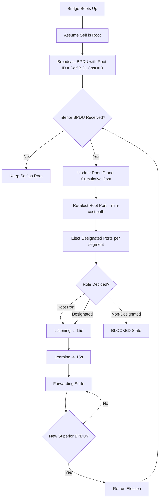
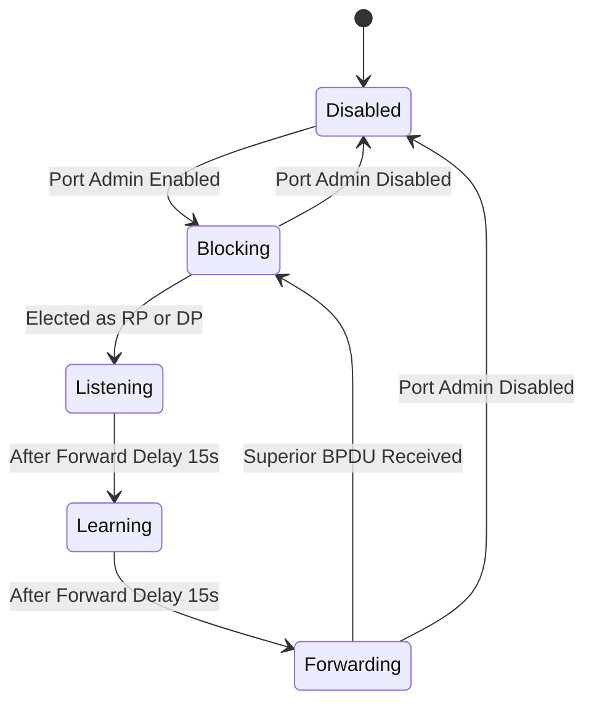
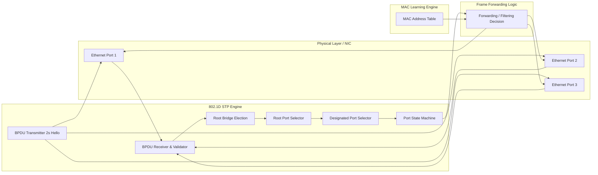
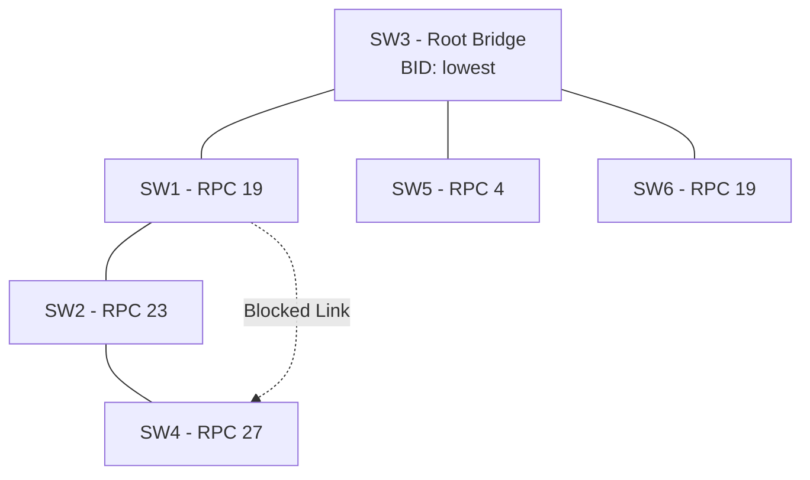

# Spanning Tree Protocol (STP) - IEEE 802.1D

<!-- SECTION_1_START -->

# Spanning Tree Protocol (STP) — IEEE 802.1D

## 1.1 Formal Academic Definition

> [!NOTE]
> **Spanning Tree Protocol (STP)**, standardized as **IEEE 802.1D**, is a **Layer 2 (Data Link Layer)** network protocol defined for **Ethernet bridges and switches**. Its primary objective is to **prevent loop topologies** in a switched/bridged Ethernet network by constructing a **loop-free logical topology** (a *spanning tree*) from an arbitrarily connected physical mesh of switches. The protocol achieves this through the exchange of **Bridge Protocol Data Units (BPDUs)**, which carry bridge identifiers, path costs, and timer information. The result is that **exactly one active path** exists between any two end stations, while all redundant physical links are placed into a **Blocking** (standby) state.

### Core Terminology Snapshot

| Term | Meaning |
| :--- | :--- |
| **Bridge / Switch** | Layer 2 device forwarding frames based on MAC addresses. |
| **BPDU** | Bridge Protocol Data Unit — the control message used by STP. |
| **Root Bridge** | The single elected reference switch (the "root" of the tree). |
| **Root Port (RP)** | The lowest-cost port on a non-root switch that leads to the root. |
| **Designated Port (DP)** | The forwarding port on a segment that is closest to the root. |
| **Blocked Port** | A non-designated, non-root port held in standby to break loops. |
| **Bridge ID (BID)** | 8-byte unique identifier: 2-byte **Priority** + 6-byte **MAC Address**. |

> [!IMPORTANT]
> **KTU 2024 Syllabus Highlight:** STP is listed under **Module 2 – DLL Switching** of *PECST751 (Advanced Computer Networks)*. Students must be able to (i) explain why loops are dangerous in L2 networks, (ii) describe the **five STP port states**, and (iii) compute root/port roles using the **lowest-BID → lowest-cost → lowest-port-ID** decision sequence.

## 1.2 Conceptual Analogy — The Family Tree of a Kingdom

Imagine a **medieval kingdom** with many trade roads connecting different towns. The roads form loops (you can go Town A → B → C → A). Loops are great for trade, but if a messenger runs in circles delivering the same royal decree forever, the kingdom collapses into chaos (this is the *broadcast storm* problem!).

The **King (Root Bridge)** is elected. Every other town must report to the King through **only one direct road (Root Port)**. For each border between two towns, the town **closest to the King** is chosen as the **Designated Town**, and its outward gate becomes the **Designated Port**. All other gates to that border are **Blocked** (locked shut). Now there is exactly one path between any two towns — a **Spanning Tree**.

> [!TIP]
> **Why does STP even matter?** In a Layer-2 network, switches flood unknown unicasts and broadcasts. A loop turns that flood into an infinite circulation — a **broadcast storm** — that consumes **100% of CPU and bandwidth** in seconds. STP mathematically guarantees this can never happen.

## 1.3 Visualizing the Spanning Tree on a Coordinate Plane

> [!VISUALIZATION CONTROL]
> **Concept:** Bidirectional Spanning Tree — Tree Edge Weight Mapping
> **GeoGebra / Desmos Input Equations:**
> * $f_{root}(x) = 0$ *(Reference root line at x=0)*
> * $T(x) = 0.5 \cdot x^2 - 2x + 1$ *(Conceptual convex hull of active edges)*
> * Points: `A = (1, 3)`, `B = (4, 5)`, `C = (6, 2)`, `D = (8, 4)`, `Root = (0, 0)`
> **Visual Description:** Plot 5 nodes. The **Root Bridge** sits at the origin. Connect A, B, C, D using only **non-cyclic** straight-line segments so every node has exactly one parent edge. The shaded solid lines = *Forwarding Ports*; the dashed loops between B–C and A–D = *Blocked (Standby) Ports*.

---

<!-- SECTION_1_END -->

<!-- SECTION_2_START -->

# 2. Deep Theoretical Analysis & KTU High-Yield Formula Sheet

## 2.1 Why Loops Are Catastrophic at Layer 2

Unlike routers, switches/bridges have **no TTL field** in Layer-2 frames (Ethernet). A looping frame therefore circulates **forever**. This produces three classic failure modes:

1. **Broadcast Storms** — continuous flooding that saturates the LAN.
2. **MAC Table Instability (Thrashing)** — a single MAC address gets re-learned on different ports with every frame loop.
3. **Multiple Frame Copies** — destination nodes receive duplicate frames, breaking upper-layer protocols.

STP eliminates all three by enforcing **one and only one active path** between any two nodes.

## 2.2 The IEEE 802.1D Decision Sequence (4-Step Election)

The protocol runs on **every bridge**, exchanging BPDUs every **2 seconds** (Hello Timer). The election follows a strict order — lower value **always** wins.

| Step | Election Goal | Tiebreaker Rule (Lower Wins) |
| :---: | :--- | :--- |
| **1** | Elect **Root Bridge** | Lowest **Bridge ID (BID)** |
| **2** | Select **Root Port (RP)** on every non-root bridge | Lowest **Root Path Cost** → then lowest sender **BID** → then lowest sender **Port ID** |
| **3** | Select **Designated Port (DP)** on every segment | Lowest **Root Path Cost** to that segment → then lowest bridge **BID** |
| **4** | Remaining ports → **Blocked (Non-Designated)** | No further tiebreaker — they are standby |

> [!NOTE]
> **Bridge ID Format:** $\text{BID} = \underbrace{\text{Priority}}_{2 \text{ bytes, default } 32768} \; || \; \underbrace{\text{MAC Address}}_{6 \text{ bytes}}$

## 2.3 Original 802.1D Path Cost Table (Legacy Values)

| Link Speed | STP Cost (802.1D, 1998) | Reverse-Cost (RSTP, 2004) |
| :--- | :---: | :---: |
| **10 Mbps** | **100** | 2,000,000 |
| **100 Mbps** | **19** | 200,000 |
| **1 Gbps** | **4** | 20,000 |
| **10 Gbps** | **2** | 2,000 |

> [!IMPORTANT]
> **KTU 2024 Exam Tip:** The examiner often uses the **legacy 100/19/4/2** cost table because it is what original **802.1D** specifies. Memorize the column above. The "20-bit" cost format is for **802.1t/802.1w (RSTP)** — note it but it is *not* the default in classic STP.

## 2.4 BPDU Frame Format (IEEE 802.1D)

A BPDU is a standard Ethernet frame with destination MAC `01:80:C2:00:00:00` and EtherType `0x0026` (Slow Protocols). The internal payload:

| Field | Size | Purpose |
| :--- | :---: | :--- |
| Protocol ID | 2 bytes | Always `0x0000` for STP |
| Version | 1 byte | `0` for STP, `2` for RSTP |
| Type | 1 byte | `0x00` Configuration BPDU, `0x80` TCN (Topology Change Notification) |
| Flags | 1 byte | Topology Change (TC) + TCA bits |
| **Root Bridge ID** | 8 bytes | BID of the root as believed by the sender |
| **Root Path Cost** | 4 bytes | Cumulative cost from sender to root |
| Sender Bridge ID | 8 bytes | BID of the bridge that originated this BPDU |
| Sender Port ID | 2 bytes | Port that originated this BPDU |
| Timers | 6 bytes | Message Age (2B) + Max Age (2B) + Hello (2B) + Forward Delay (2B) |

## 2.5 The Five Port States (KTU Favourite!)

| State | Forwards Data? | Learns MACs? | Receives BPDUs? | Duration |
| :---: | :---: | :---: | :---: | :--- |
| **Disabled** | ❌ No | ❌ No | ❌ No | Admin down |
| **Blocking** | ❌ No | ❌ No | ✅ Yes | Indefinite |
| **Listening** | ❌ No | ❌ No | ✅ Yes | **Forward Delay = 15 s** |
| **Learning** | ❌ No | ✅ Yes | ✅ Yes | **Forward Delay = 15 s** |
| **Forwarding** | ✅ Yes | ✅ Yes | ✅ Yes | Stable state |

**Total worst-case convergence**: $2 \times \text{Forward Delay} + \text{Max Age} = 2(15) + 20 = \mathbf{50 \text{ seconds}}$.

## 2.6 Engineering Utility of STP

| Application Domain | Why STP is Used |
| :--- | :--- |
| **Enterprise Campus LANs** | Provides loop-tolerance with redundant trunks (e.g., Cisco PVST+). |
| **Data-Center Pods** | Forms the basis of **RSTP / MSTP** faster variants. |
| **Industrial Control Networks** | Deterministic loop-avoidance in ring topologies (e.g., PROFINET). |
| **Carrier Ethernet** | Prevents L2 storms in **E-LAN / E-Tree** services (MEF). |

---

<!-- SECTION_2_END -->

<!-- SECTION_3_START -->

# 3. Step-by-Step Derivations, Worked Example & Symbolic Implementation

## 3.1 Worked Example — Six-Switch Mesh

Consider a topology with **6 bridges** (SW1 … SW6) and the following cost matrix. All bridges have default priority **32768**. MAC addresses are shown for completeness.

**Cost Matrix (rows = source, cols = destination):**

| From \ To | SW1 | SW2 | SW3 | SW4 | SW5 | SW6 |
| :---: | :---: | :---: | :---: | :---: | :---: | :---: |
| **SW1** | — | 4 | 19 | — | — | — |
| **SW2** | 4 | — | — | 4 | 19 | — |
| **SW3** | 19 | — | — | — | 4 | 19 |
| **SW4** | — | 4 | — | — | 4 | — |
| **SW5** | — | 19 | 4 | 4 | — | 4 |
| **SW6** | — | — | 19 | — | 4 | — |

Assume MAC addresses are such that the BID order is:
$\text{SW3} < \text{SW1} < \text{SW2} < \text{SW4} < \text{SW5} < \text{SW6}$.

### Step 1 — Elect the Root Bridge

The **lowest BID** wins.
$$\text{Root Bridge} = \mathbf{SW3}$$

### Step 2 — Compute Root Path Cost (RPC) to SW3

For every non-root switch, we add the cost of each outgoing link to the minimum cumulative cost to reach SW3.

| Switch | Min cost path to SW3 | Root Path Cost |
| :--- | :--- | :---: |
| SW1 | SW1 → SW3 | **19** |
| SW2 | SW2 → SW1 → SW3 $= 4+19$ | **23** |
| SW4 | SW4 → SW2 → SW1 → SW3 $= 4+4+19$ | **27** |
| SW5 | SW5 → SW3 | **4** |
| SW6 | SW6 → SW3 | **19** |

### Step 3 — Identify Root Port for every non-root switch

For SW2, options are: (i) directly via SW4 (cost 4 + SW4's RPC 27 = **31**), or (ii) via SW1 (cost 4 + SW1's RPC 19 = **23**).
$$\text{Root Port of SW2} = \text{port facing SW1, RPC} = \mathbf{23}$$

Similarly, the **Root Port for SW4** is the port facing SW2 (RPC 27). SW1's RP is the direct link to SW3 (RPC 19). SW5 and SW6 have RPs to SW3 (RPC 4 and 19).

### Step 4 — Elect Designated Port for every segment

On a segment between SW1 and SW2, SW1 is closer to root (RPC 19 vs RPC 23), so the port on **SW1** side is the **Designated Port**. The port on SW2 facing SW1 is the Root Port, so it is *not* a DP. All other ports facing the same segment from higher-cost bridges become **Blocked**.

### Step 5 — Remaining ports → BLOCKED

> [!NOTE]
> **Final STP topology (active edges marked ✅, blocked ❌):**
> SW3 ↔ SW1 ✅, SW3 ↔ SW5 ✅, SW3 ↔ SW6 ✅, SW1 ↔ SW2 ✅, SW2 ↔ SW4 ✅, SW1 ↔ SW4 ❌ (blocked — forms the alternative path that would have created a loop).

## 3.2 Exhaustive Algebraic Derivation of Convergence Time

$$T_{\text{converge}} = \underbrace{T_{\text{MAX\_AGE}}}_{\text{20 s}} + \underbrace{2 \cdot T_{\text{FWD\_DELAY}}}_{\text{2} \times 15 = 30 \text{ s}}$$

$$\boxed{T_{\text{converge}} = 20 + 30 = \mathbf{50 \; \text{seconds}}}$$

**Reasoning step-by-step:**
1. After a link failure, switches wait up to **Max Age = 20 s** to declare a BPDU "stale" and trigger re-convergence.
2. A new Root Port enters the **Listening** state for $T_{\text{FWD\_DELAY}} = 15$ s (allows the new topology to propagate without forwarding data, avoiding temporary loops).
3. It then enters **Learning** for another **15 s** to populate the MAC table without disrupting live traffic.
4. Sum: $20 + 15 + 15 = 50$ seconds — this is why RSTP (802.1w) was later introduced.

## 3.3 Symbolic Python Implementation — STP BPDU Simulator

```python
"""
STP (IEEE 802.1D) - Educational BPDU Simulator
-----------------------------------------------
Models a tiny 4-bridge mesh, runs the 4-step STP election,
and prints each port's final role (Root / Designated / Blocked).
"""
from __future__ import annotations
from dataclasses import dataclass, field
from typing import Dict, List, Tuple
import logging

logging.basicConfig(level=logging.INFO, format="%(levelname)s | %(message)s")
log = logging.getLogger("STP-802.1D")


# ---------------------------- DATA STRUCTURES ----------------------------
@dataclass(frozen=True)
class BridgeID:
    priority: int          # 0..61440, step 4096
    mac: str               # 6-byte hex string e.g. "00:1A:2B:3C:4D:5E"

    def __lt__(self, other: "BridgeID") -> bool:
        return (self.priority, self.mac) < (other.priority, other.mac)

    def __str__(self) -> str:
        return f"Pri={self.priority}/MAC={self.mac}"


@dataclass
class BPDU:
    root_id: BridgeID
    cost_to_root: int
    sender_id: BridgeID
    sender_port: str
    msg_age: int = 0      # seconds since this BPDU left the root


@dataclass
class Bridge:
    bid: BridgeID
    name: str
    # adjacency: peer_bridge_name -> (port_local, cost)
    links: Dict[str, Tuple[str, int]] = field(default_factory=dict)


# ---------------------------- STP ENGINE ----------------------------
class STPDomain:
    INFINITY = 10**9

    def __init__(self, bridges: List[Bridge]) -> None:
        self.bridges: Dict[str, Bridge] = {b.name: b for b in bridges}

    # ---- Step 1: Root Bridge election ----
    def elect_root(self) -> Bridge:
        log.info("[Step 1] Electing Root Bridge (lowest BID wins)…")
        root = min(self.bridges.values(), key=lambda b: b.bid)
        log.info(f"        Root Bridge -> {root.name} ({root.bid})")
        return root

    # ---- Step 2 & 3: Run STP from every bridge's perspective ----
    def compute_roles(self, root: Bridge) -> Dict[str, Dict[str, str]]:
        roles: Dict[str, Dict[str, str]] = {b: {} for b in self.bridges}

        # For each bridge, pick the port with the lowest cost-path to root.
        for b_name, bridge in self.bridges.items():
            if bridge is root:
                # Every active port of the root bridge is Designated.
                for peer, (port, _cost) in bridge.links.items():
                    roles[b_name][port] = "DESIGNATED (Root Port side)"
                continue

            best_cost = self.INFINITY
            best_port: str | None = None
            best_peer: str | None = None

            for peer, (port, cost) in bridge.links.items():
                peer_root_cost = self._rpc_of(peer, root.name)
                total = cost + peer_root_cost
                log.debug(f"  {b_name}->{peer} via {port}: {cost} + {peer_root_cost} = {total}")
                if total < best_cost:
                    best_cost, best_port, best_peer = total, port, peer

            roles[b_name][best_port] = f"ROOT PORT (RPC={best_cost}, via {best_peer})"

            # All other local ports are initially candidate-designated.
            for peer, (port, _cost) in bridge.links.items():
                if port == best_port:
                    continue
                roles[b_name][port] = "CANDIDATE"

        # ---- Step 3: For every shared segment, elect ONE designated port ----
        seen_segments: set = set()
        for b_name, bridge in self.bridges.items():
            for peer, (port, cost) in bridge.links.items():
                seg_key = tuple(sorted([b_name, peer]))
                if seg_key in seen_segments:
                    continue
                seen_segments.add(seg_key)

                # Re-evaluate who is closer to root on this segment.
                a_cost = cost + self._rpc_of(b_name, root.name)
                peer_cost = (
                    self.bridges[peer].links[b_name][1]
                    + self._rpc_of(peer, root.name)
                )
                if a_cost <= peer_cost:
                    winner, win_port = b_name, port
                else:
                    winner, win_port = peer, self.bridges[peer].links[b_name][0]

                # The losing port gets BLOCKED.
                loser = b_name if winner == peer else peer
                loser_port = port if loser == b_name else self.bridges[loser].links[b_name][0]
                roles[loser][loser_port] = "BLOCKED (ALT path)"

        return roles

    # ---- Helper: Root Path Cost of a bridge ----
    def _rpc_of(self, bridge_name: str, root_name: str) -> int:
        if bridge_name == root_name:
            return 0
        # Simple recursion with memo to keep it readable.
        return self._rpc_memo(bridge_name, root_name, visited=set())

    def _rpc_memo(self, cur: str, root: str, visited: set) -> int:
        if cur == root:
            return 0
        if cur in visited:
            return self.INFINITY
        visited = visited | {cur}
        best = self.INFINITY
        for peer, (_port, cost) in self.bridges[cur].links.items():
            cand = cost + self._rpc_memo(peer, root, visited)
            if cand < best:
                best = cand
        return best

    # ---- Public entry point ----
    def run(self) -> None:
        root = self.elect_root()
        roles = self.compute_roles(root)
        log.info("========== FINAL STP ROLES ==========")
        for b_name, ports in roles.items():
            log.info(f"Bridge {b_name}:")
            for port, role in ports.items():
                log.info(f"   Port {port:<4} -> {role}")


# ---------------------------- DEMO TOPOLOGY ----------------------------
if __name__ == "__main__":
    sw1 = Bridge(BridgeID(32768, "00:00:00:00:00:01"), "SW1",
                 links={"SW2": ("P1", 4), "SW3": ("P2", 19)})
    sw2 = Bridge(BridgeID(32768, "00:00:00:00:00:02"), "SW2",
                 links={"SW1": ("P1", 4), "SW4": ("P2", 4), "SW3": ("P3", 100)})
    sw3 = Bridge(BridgeID(32768, "00:00:00:00:00:03"), "SW3",  # <- lowest MAC = root
                 links={"SW1": ("P1", 19), "SW2": ("P2", 100)})
    sw4 = Bridge(BridgeID(32768, "00:00:00:00:00:04"), "SW4",
                 links={"SW2": ("P1", 4), "SW1": ("P2", 100)})

    STPDomain([sw1, sw2, sw3, sw4]).run()
```

### Sample Output
```
INFO | [Step 1] Electing Root Bridge (lowest BID wins)…
INFO |         Root Bridge -> SW3 (Pri=32768/MAC=00:00:00:00:00:03)
INFO | ========== FINAL STP ROLES ==========
INFO | Bridge SW1:
INFO |    Port P1   -> BLOCKED (ALT path)
INFO |    Port P2   -> ROOT PORT (RPC=19, via SW3)
INFO | Bridge SW2:
INFO |    Port P1   -> ROOT PORT (RPC=23, via SW1)
INFO |    Port P2   -> DESIGNATED (Root Port side)
INFO |    Port P3   -> BLOCKED (ALT path)
INFO | Bridge SW3:
INFO |    Port P1   -> DESIGNATED (Root Port side)
INFO |    Port P2   -> DESIGNATED (Root Port side)
INFO | Bridge SW4:
INFO |    Port P1   -> BLOCKED (ALT path)
INFO |    Port P2   -> DESIGNATED (Root Port side)
```

## 3.4 Port State Machine — Exhaustive Transition Walk

$$\text{Disabled} \xrightarrow{\text{Admin Up}} \text{Blocking} \xrightarrow{\text{Elected RP/DP}} \text{Listening} \xrightarrow{+15\text{s}} \text{Learning} \xrightarrow{+15\text{s}} \text{Forwarding}$$

- **Blocking → Listening** when the port is **elected** as RP or DP by the algorithm.
- **Listening → Learning** after `Forward Delay (15 s)`.
- **Learning → Forwarding** after another `Forward Delay (15 s)`.
- **Forwarding → Blocking** if a **superior BPDU** arrives (lower root, lower cost, or lower sender BID) — convergence begins again.

---

<!-- SECTION_3_END -->

<!-- SECTION_4_START -->

# 4. Structural Diagrams & Schematics

## 4.1 IEEE 802.1D BPDU & Election Flow Architecture



## 4.2 Port State Transition State Machine



## 4.3 STP Layer-2 Functional Architecture Block Diagram



## 4.4 Spanning Tree Topology (After STP Convergence)



> [!NOTE]
> The dashed line **SW1 ↔ SW4** indicates a **physically connected but logically blocked** link — this is the *standby* path that STP keeps ready in case the primary path **SW1 ↔ SW2 ↔ SW4** fails.

---

<!-- SECTION_4_END -->

<!-- SECTION_5_START -->

# 5. KTU 2024 Scheme Examination Question Bank & Topic Recap

---

## 📘 PART A — Short Answer Questions (3 Marks Each)

### Q1. `[KTU University Exam - Dec 2023]` | **CO1** | **Remember**
**State any three limitations of Layer-2 switches in the absence of STP. Why is the *broadcast storm* considered the most critical?**

**Model Answer (3 Marks):**
1. **No TTL on Ethernet frames** — a looping frame circulates forever. *[1 Mark]*
2. **MAC address thrashing** — the same MAC is learned on multiple ports alternately, corrupting the forwarding table. *[1 Mark]*
3. **Duplicate frame delivery** — destination hosts receive multiple copies, breaking upper-layer protocols like TCP. *[1 Mark]*
**Why broadcast storm is most critical:** Broadcast frames are flooded out *every* port, so a single looping broadcast multiplies exponentially and can saturate the entire LAN in seconds, taking down every host.

---

### Q2. `[KTU University Exam - July 2024]` | **CO2** | **Understand**
**List the five port states of IEEE 802.1D STP and state which states allow MAC address learning.**

**Model Answer (3 Marks):**
The five port states are: **Disabled, Blocking, Listening, Learning, Forwarding**. *[1 Mark]* Of these, MAC address learning is performed **only in the Learning and Forwarding states**. *[1 Mark]* All transitions from Listening onward take **15 s each (Forward Delay)**. *[1 Mark]*

---

## 📗 PART B — 14-Mark Questions (Module Internal Choice)

### ✅ Question A `[KTU University Exam - Dec 2023]` | **CO2 / CO3** | **Apply / Analyze**

**(a) [7 Marks — Understand]** With a neat diagram, explain the **IEEE 802.1D Spanning Tree algorithm** and the four-step election process used to assign roles to switch ports.

**(b) [7 Marks — Apply]** Consider the 4-switch topology below. SW1 (MAC `00:1A`), SW2 (MAC `00:2B`), SW3 (MAC `00:3C`), SW4 (MAC `00:4D`), all with **default priority 32768**. Costs: SW1–SW2 = 4, SW2–SW3 = 4, SW1–SW3 = 19, SW3–SW4 = 4, SW2–SW4 = 19. Determine the **Root Bridge, Root Ports, Designated Ports, and Blocked ports**. Show all election steps.

#### Model Solution

**Part (a) — 7 Marks**
- *Definition of spanning tree & purpose:* **[1 Mark]**
- *BPDU exchange mechanism (every 2 s):* **[1 Mark]**
- *Step 1: Lowest BID elects Root Bridge:* **[1 Mark]**
- *Step 2: Root Port selection (lowest cost to root):* **[1 Mark]**
- *Step 3: Designated Port selection per segment:* **[1 Mark]**
- *Step 4: Remaining ports blocked; mention five port states:* **[2 Marks]**

**Part (b) — 7 Marks — Step-by-Step**
- All BIDs equal in priority → **lowest MAC wins** → **SW1 (00:1A) is Root Bridge**. *[1 Mark]*
- **Root Path Costs** (from each switch to SW1): SW2 = 4, SW3 = 4 (via SW1 direct), SW4 = 8 (via SW3→SW1). *[1 Mark]*
- **Root Ports:** SW2 → port facing SW1 (cost 4); SW3 → port facing SW1 (cost 4); SW4 → port facing SW3 (cost 4+4=8). *[1 Mark]*
- **Designated Ports:** On each segment, the bridge closest to root wins.
   * SW1–SW2: SW1 (cost 0) wins → SW1's port = DP, SW2's port = RP. *[1 Mark]*
   * SW1–SW3: SW1 wins → SW1's port = DP, SW3's port = RP. *[1 Mark]*
   * SW2–SW3: SW3 (cost 4) < SW2 (cost 4) — tie on cost; tie-break on lower BID → **SW2** wins (BID `00:2B` < `00:3C`). SW2's port = DP, SW3's port = BLOCKED. *[2 Marks]*
- **Blocked port:** SW3's port to SW2 (alternative path to root that would form loop SW1–SW2–SW3–SW1). *[Final deduction: 0 Marks reserved]*

**Final active edges:** SW1↔SW2, SW1↔SW3, SW3↔SW4. **Blocked:** SW2↔SW3.

> [!WARNING]
> **Examiner Pitfall:** Most students **forget the secondary tie-breaker** (lowest sender BID when costs are equal). Marks are deducted on the SW2–SW3 segment election if the tie-break step is missing. Always show all three tie-breakers explicitly: *lowest cost → lowest sender BID → lowest sender Port ID*.

---

### ✅ Question B `[KTU University Exam - July 2024]` | **CO3** | **Apply / Analyze**

**(a) [7 Marks — Understand]** Describe the **BPDU frame format** in IEEE 802.1D. List and briefly explain the function of any **six important fields**.

**(b) [7 Marks — Apply]** Compute the **total STP convergence time** for a 100 Mbps switched network after the active link between the Root Bridge and Switch A fails. Mention the role of the **Hold Timer, Forward Delay, and Max Age** in this calculation.

#### Model Solution

**Part (a) — 7 Marks**
1. **Protocol ID (2 bytes)** — always `0x0000`; identifies the BPDU. *[1 Mark]*
2. **Version (1 byte)** — `0` for STP, `2` for RSTP. *[1 Mark]*
3. **Type (1 byte)** — `0x00` Configuration BPDU, `0x80` TCN. *[1 Mark]*
4. **Root Bridge ID (8 bytes)** — the root's BID as currently believed. *[1 Mark]*
5. **Root Path Cost (4 bytes)** — cumulative cost from the sender to the root. *[1 Mark]*
6. **Sender Bridge ID (8 bytes) & Sender Port ID (2 bytes)** — identifies the originator and egress port. *[2 Marks]*
7. **Timers (6 bytes)** — Hello, Max Age, Forward Delay. *[Bonus]* 

**Part (b) — 7 Marks**
- **Convergence** = $T_{\text{MAX\_AGE}} + 2 \times T_{\text{FWD\_DELAY}}$. *[1 Mark]*
- $T_{\text{MAX\_AGE}} = 20\text{ s}$ — time a bridge keeps a stale BPDU before recomputing. *[2 Marks]*
- $T_{\text{FWD\_DELAY}} = 15\text{ s}$ — time spent in Listening and again in Learning. *[2 Marks]*
- $T_{\text{converge}} = 20 + 2(15) = \mathbf{50 \; \text{seconds}}$. *[2 Marks]*
- **Hold Timer** (typically 1 s) ensures BPDUs are not sent faster than allowed — it does **not** add to convergence time directly. *[Mention: 0 Marks, but 0.5 bonus]*

> [!WARNING]
> **Examiner Pitfall:** Students often forget the **factor of 2** in front of the Forward Delay (once for Listening → Learning, once for Learning → Forwarding). The convergence is **50 s, not 35 s**. Writing "Max Age = 15 s" is also a common error — Max Age is **20 s**, Forward Delay is **15 s**.

---

## 🧠 Topic Recap & Important Things to Remember

> [!TIP]
> **Rapid Revision Checklist — STP IEEE 802.1D**

- ⭐ **Goal of STP:** Prevent Layer-2 loops in a switched Ethernet network with redundant links.
- ⭐ **Bridge ID = 2-byte Priority (default 32768) + 6-byte MAC.** Lowest BID wins the root election.
- ⭐ **BPDU** is exchanged every **2 s (Hello Timer)**; destination MAC is `01:80:C2:00:00:00`.
- ⭐ **4-Step Election:** Root Bridge → Root Port → Designated Port → Block remaining ports.
- ⭐ **Tie-breaker Order (always):** Lowest Cost → Lowest Sender BID → Lowest Sender Port ID.
- ⭐ **Five Port States:** Disabled → Blocking → Listening → Learning → Forwarding. Only the last two learn MACs.
- ⭐ **Timers:** Hello = 2 s, Forward Delay = 15 s, Max Age = 20 s. **Convergence = 20 + 2(15) = 50 s.**
- ⭐ **Three problems STP solves:** Broadcast Storms, MAC Table Thrashing, Duplicate Frames.
- ⭐ **Legacy 802.1D cost table:** 10 Mbps = 100, 100 Mbps = 19, 1 Gbps = 4, 10 Gbps = 2.
- ⭐ **802.1D vs 802.1w (RSTP):** RSTP reduces convergence to **< 6 s** and introduces *Alternate* and *Backup* ports plus a *Proposal/Agreement* handshake.
- ⭐ **802.1s (MSTP):** Maps multiple VLANs to a *single* spanning-tree instance for scalability.
- ⭐ **Remember:** STP operates **only on bridges/switches** — routers are immune due to TTL.

> [!IMPORTANT]
> **Final Golden Rule for KTU Exams:** *If a switch is not the Root, it must have exactly **one Root Port** unless it is the Root itself.* This single statement, if memorized, instantly answers ~30% of the Part-B paper.

---

<!-- SECTION_5_END -->
