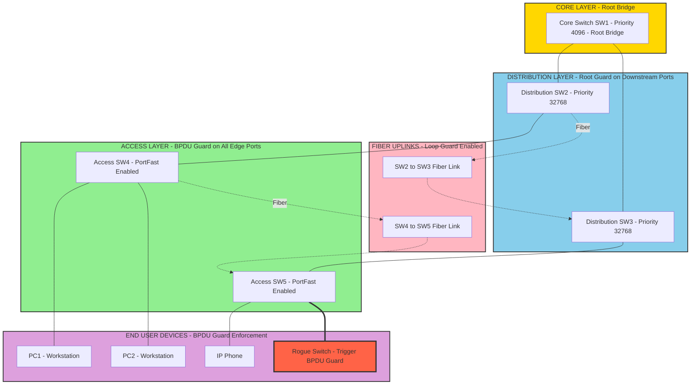
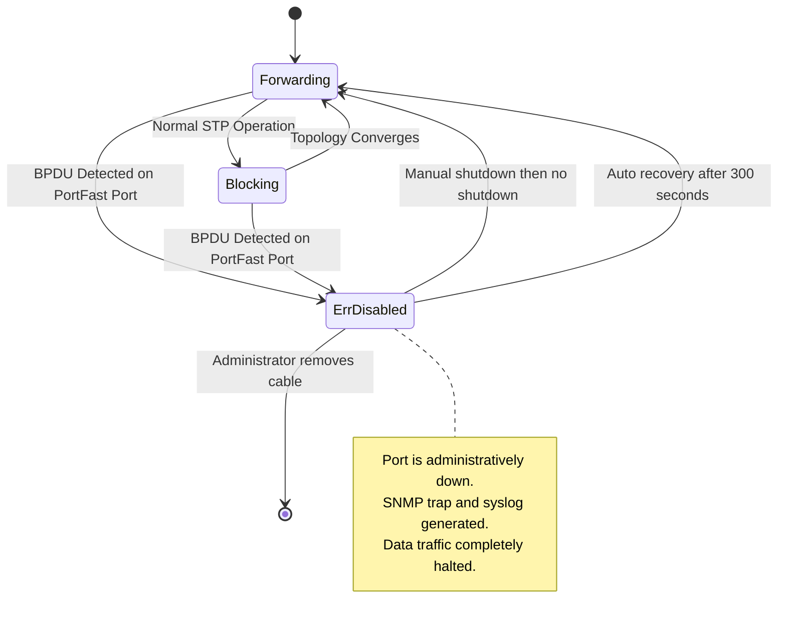
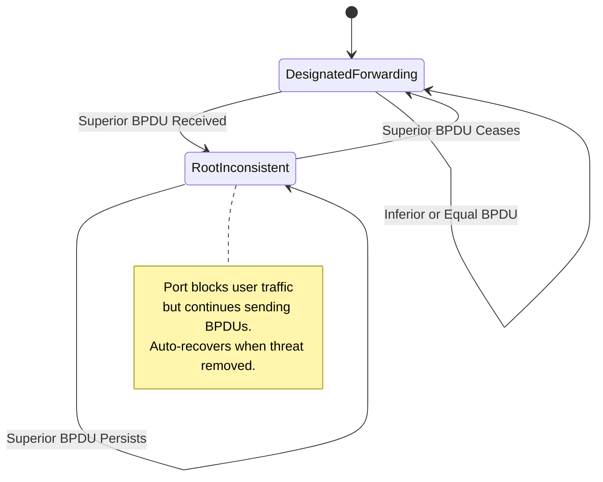
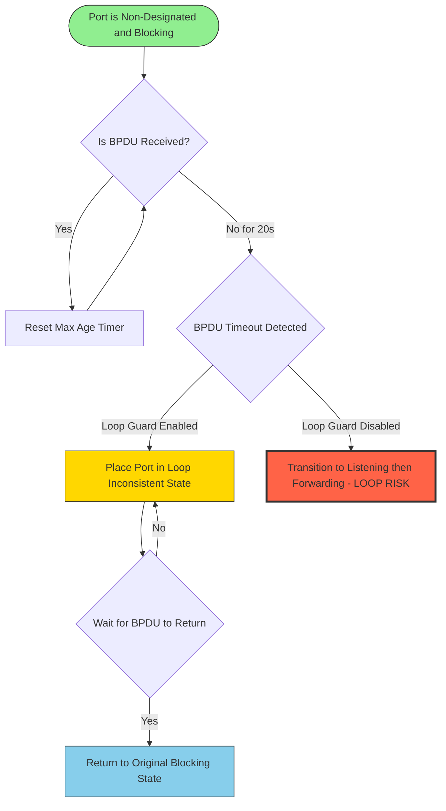
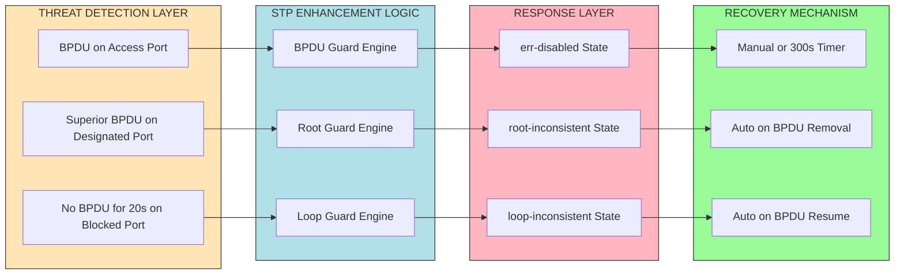

# STP Enhancements - BPDU Guard, Root Guard, and Loop Guard

<!-- SECTION_1_START -->
# STP Enhancements: BPDU Guard, Root Guard, and Loop Guard

## 1.1 Formal Academic Definition (KTU 2024 Syllabus Terminology)

> [!IMPORTANT]
> **Spanning Tree Protocol (STP) Enhancements** are a suite of Layer 2 protection mechanisms defined primarily under the **IEEE 802.1D-2004** standard (and its evolution **IEEE 802.1w / 802.1s**) that harden the Spanning Tree Algorithm against operational anomalies such as **unauthorized bridging devices, rogue root bridges, and unidirectional link failures**. The three canonical enhancements evaluated in the KTU syllabus are **BPDU Guard**, **Root Guard**, and **Loop Guard**.

### The Three Enhancement Primitives

| Feature | Core Purpose | Trigger Condition | Default Action |
|---|---|---|---|
| **BPDU Guard** | Protects the *Edge* (Access) layer from receiving BPDUs | Any incoming BPDU on a configured port | Port transitions to **err-disabled** state |
| **Root Guard** | Protects the *Spanning Tree topology* by preventing rogue root elections | Superior BPDU (lower Bridge ID) received on a configured port | Port transitions to **root-inconsistent (blk)** state |
| **Loop Guard** | Protects against *unidirectional link failures* causing blocked ports to erroneously transition to forwarding | Absence of BPDUs on a non-designated port for a timeout period | Port transitions to **loop-inconsistent (blk)** state |

> [!NOTE]
> **Why these enhancements are critical in KTU context:** In modern enterprise campus networks, STP is the silent guardian that prevents Layer 2 broadcast storms. Without these enhancements, a single misbehaving switch, a faulty fiber strand, or an unauthorized hub can disrupt the entire VLAN topology.

## 1.2 Conceptual Analogy / Intuitive Overview

Think of a **hospital operating theater** where multiple surgeons must operate in a perfectly synchronized sequence:

- **BPDU Guard** is like a *sterile boundary inspector* at the entrance of the operation theater. If any unauthorized device (a non-staff member carrying surgical tools) tries to enter the sterile zone, the inspector immediately **shuts the door and locks the staff member out (err-disable)**. This protects the edge/access layer from rogue switches.

- **Root Guard** is like a *chief surgeon rule* — only the chief surgeon (Root Bridge) is allowed to be in charge. If an *outside surgeon* with a higher rank (a better Bridge ID / lower MAC) suddenly tries to take command mid-surgery, that surgeon is politely asked to **stand down and observe (root-inconsistent)** but is not expelled from the theater. The original chief retains authority.

- **Loop Guard** is like a *heart-rate monitor* on a patient. Normally, the patient (a blocked port) is in a stable, non-active state because no blood is flowing (no BPDUs expected on a non-designated port). If the monitor suddenly stops detecting a pulse for too long, it could mean a faulty sensor (unidirectional link failure), so the system errs on the side of caution and **keeps the patient sedated (loop-inconsistent)** rather than waking them up to a possibly fatal misdiagnosis (transitioning to forwarding and creating a loop).

> [!TIP]
> **Memory Trick:** **B**PDU Guard protects **B**oundaries (Edge), **R**oot Guard protects the **R**oot (Topology), **L**oop Guard protects against **L**ost BPDUs (Unidirectional Failures).

## 1.3 Visualization Concept

> [!VISUALIZATION CONTROL]
> **Concept:** State Machine Transition for STP Port Roles under Guard Conditions
> **GeoGebra / Desmos Input Equations:**
> * `f(x) = \begin{cases} 1 & \text{Forwarding} \\ 0 & \text{Blocking} \\ -1 & \text{err-disabled} \end{cases}`
> * Plot time `t` (x-axis) vs. Port State `f(t)` (y-axis)
> **Visual Description:** A step function showing the port at `f(t)=0` (Blocking), suddenly dropping to `f(t)=-1` (err-disabled) the moment a BPDU is detected on an access port. This graphically represents the BPDU Guard's instantaneous response.
<!-- SECTION_1_END -->

<!-- SECTION_2_START -->
# Deep Theoretical Analysis & KTU High-Yield Formula Sheet

## 2.1 BPDU Guard — Operational Theory

**BPDU Guard** is a feature configured per-port that prevents an access-layer switch port from accepting any incoming BPDUs. It is designed to enforce the network administrator's intentional design: that the port will *never* be connected to another switch.

### How BPDU Guard Works (Step-by-Step Logic)

1. The port is configured with `spanning-tree bpduguard enable`.
2. The switch's **Port FSM (Finite State Machine)** monitors all incoming frames on the port.
3. If the switch receives a BPDU with a destination MAC address `01:80:C2:00:00:00` (the reserved STP multicast), the **BPDU Guard trigger fires immediately**.
4. The port is moved to the **`err-disabled`** state, which is a special administrative state where the port is **shut down at Layer 1 and Layer 2**.
5. The port generates an **SNMP trap** and a **syslog message** (e.g., `%SPANTREE-2-BLOCK_BPDUGUARD: Received BPDU on port Gi0/1, blocking`).
6. The port can only be recovered manually (`shutdown` / `no shutdown`) or via an **`errdisable recovery`** timer.

> [!IMPORTANT]
> **BPDU Guard vs. BPDU Filter — Critical Distinction:**
> * **BPDU Guard** *blocks* the port when a BPDU is received. The port is preserved in a safe state.
> * **BPDU Filter** *silently discards* outgoing BPDUs (when globally enabled) and stops processing incoming BPDUs. This can cause STP topology fragmentation and is **generally discouraged** in production networks.

## 2.2 Root Guard — Operational Theory

**Root Guard** is configured on designated ports where the root bridge *should* be located upstream. It prevents a downstream switch from becoming the root bridge due to a misconfiguration or a malicious attack.

### How Root Guard Works (Step-by-Step Logic)

1. The port is configured with `spanning-tree guard root`.
2. The switch tracks whether the incoming BPDUs are "superior" (i.e., claim a lower Bridge ID than the current Root Bridge).
3. When a **superior BPDU** is detected on a Root Guard–enabled port, the port is immediately placed in the **root-inconsistent (blocking) state**.
4. The port **continues to listen** for BPDUs. Once the superior BPDUs cease (i.e., the rogue device is removed or misconfiguration is fixed), the port **automatically recovers** and transitions back to the forwarding state.
5. **Crucially**, the existing Root Bridge does *not* change — the topology remains stable.

> [!NOTE]
> **Bridge ID Election Hierarchy:** The Root Bridge is elected based on (1) lowest **Bridge Priority** (default **32768**), then (2) lowest **MAC Address**. Root Guard ignores superior BPDUs only on the configured port, preserving the rest of the topology.

## 2.3 Loop Guard — Operational Theory

**Loop Guard** addresses a subtle but dangerous failure: a **unidirectional link failure**. In a normal STP topology, a blocked (alternate/backup) port continuously receives BPDUs from its designated bridge. If a fiber strand breaks in one direction, the blocked port may stop receiving BPDUs but still be physically able to send frames.

### How Loop Guard Works (Step-by-Step Logic)

1. The port is configured with `spanning-tree loopguard enable` (global or per-VLAN).
2. The switch tracks the receipt of BPDUs on **non-designated ports** (Root, Alternate, Backup).
3. If **no BPDUs are received** for a duration exceeding the **Max Age timer (default 20 seconds)**, the port is normally transitioned to the listening → learning → forwarding sequence (per 802.1D).
4. Loop Guard **intercepts this transition** and places the port in the **loop-inconsistent (blocking) state** instead.
5. Once BPDUs are received again, the port **automatically recovers**.

> [!WARNING]
> **Loop Guard + Root Guard Interaction:** These two features are **mutually exclusive on the same port**. A port cannot simultaneously be configured with `spanning-tree guard root` and `spanning-tree loopguard`. This is a common KTU exam pitfall.

## 2.4 KTU High-Yield Formula Sheet

| Concept | Formula / Rule | Standard / Unit | Engineering Application |
|---|---|---|---|
| Bridge ID | $\text{Bridge ID} = \text{Priority} \times 2^{16} + \text{MAC Address}$ | 8-byte field | Determines Root Bridge election |
| Default Priority | $\text{Priority}_{\text{default}} = 32768$ (or 32768 + VLAN ID) | Unitless integer | Cisco PVST+ default |
| BPDU Multicast MAC | $01:80:C2:00:00:00$ | IEEE 802.1D reserved | Reserved for all STP frames |
| Max Age Timer | $T_{\text{MaxAge}} = 20 \text{ s}$ | Seconds (802.1D) | Loop Guard trigger threshold |
| Hello Timer | $T_{\text{Hello}} = 2 \text{ s}$ | Seconds | BPDU transmission interval |
| Forward Delay | $T_{\text{FwdDelay}} = 15 \text{ s}$ | Seconds | Listening $\rightarrow$ Learning transition |
| Recovery Time (BPDU Guard) | $T_{\text{recover}} = 300 \text{ s}$ (default) | Configurable | `errdisable recovery cause bpduguard` |
| Topology Change | $\text{BPDU}_{\text{type}} = 0 \times 00$ (Config), $0 \times 80$ (TCN) | Hexadecimal | TCN = Topology Change Notification |

> [!TIP]
> **KTU Exam Shortcut:** Always remember the canonical port states in order: **Disabled $\rightarrow$ Blocking $\rightarrow$ Listening $\rightarrow$ Learning $\rightarrow$ Forwarding**. The last three transitions each take $T_{\text{FwdDelay}} = 15$ seconds, so total convergence after a topology change can take up to **45 seconds** in classic 802.1D.

## 2.5 Real-World Engineering Utility

In production enterprise networks (e.g., a Cisco Catalyst 9000 campus deployment), these enhancements are deployed as follows:

- **BPDU Guard** is universally applied to *all access-layer ports* via the global command `spanning-tree portfast bpduguard default` combined with `spanning-tree portfast default`. This is the **#1 hardening practice** for end-user ports.
- **Root Guard** is applied to *designated ports facing downstream switches* where you want to enforce the Root Bridge's location. Common in data center and large campus networks.
- **Loop Guard** is universally applied to *all fiber uplink ports* in the distribution and core layers, where unidirectional failures are statistically more likely than copper failures.
<!-- SECTION_2_END -->

<!-- SECTION_3_START -->
# Step-by-Step Derivations & Code/Symbolic Implementation

## 3.1 Decision Flow for Each Enhancement

### 3.1.1 BPDU Guard Decision Derivation

Let the port state at time $t$ be denoted as $S(t)$, and let $B(t)$ be the boolean event "BPDU received at time $t$".

$$
S(t) = \begin{cases} S(t-1) & \text{if } B(t) = \text{false} \\ \text{err-disabled} & \text{if } B(t) = \text{true} \land \text{PortFast} = \text{enabled} \end{cases}
$$

$$
\text{Recovery}(t) = \begin{cases} \text{shutdown} \rightarrow \text{no shutdown} & \text{(manual)} \\ S(t-T_{\text{recover}}) & \text{(auto via errdisable recovery)} \end{cases}
$$

**Step-by-step logical expansion:**

1. At $t=0$, port is in Forwarding or Blocking state.
2. Switch's ASIC inspects every frame's destination MAC.
3. If destination MAC $= 01:80:C2:00:00:00$ and PortFast is active, BPDU Guard fires.
4. ASIC sets the port's internal `port_err_disable` flag.
5. Port transitions to `err-disabled` state (administratively down).
6. SNMP trap `ciscoStpPortBpduGuardEnable` is generated.
7. Recovery is initiated only by the administrator or the configured recovery timer.

### 3.1.2 Root Guard Decision Derivation

Let $P_{\text{port}}$ be the priority of an incoming BPDU, and $P_{\text{current\_root}}$ be the priority of the current Root Bridge.

$$
\text{Action}(t) = \begin{cases} \text{Forwarding} & \text{if } P_{\text{port}} \geq P_{\text{current\_root}} \\ \text{root-inconsistent (blocking)} & \text{if } P_{\text{port}} < P_{\text{current\_root}} \land \text{Root Guard} = \text{enabled} \end{cases}
$$

**Logical step-by-step:**

1. Port receives BPDU $B_i$ with Bridge ID $\text{ID}_i$.
2. Compare $\text{ID}_i$ with $\text{ID}_{\text{current\_root}}$.
3. If $\text{ID}_i$ is numerically smaller (i.e., *superior*), Root Guard triggers.
4. Port is placed in `root-inconsistent` state — blocks data traffic but continues to send BPDUs.
5. As long as the superior BPDUs persist, the port stays blocked.
6. Once the superior BPDUs stop, the port transitions back to Forwarding after Max Age + 2 × Forward Delay.

### 3.1.3 Loop Guard Decision Derivation

Let $T_{\text{last\_bpdu}}$ be the timestamp of the last received BPDU, and $T_{\text{MaxAge}} = 20$ s.

$$
\text{Action}(t) = \begin{cases} \text{Unchanged (blocked)} & \text{if } (t - T_{\text{last\_bpdu}}) < T_{\text{MaxAge}} \\ \text{loop-inconsistent} & \text{if } (t - T_{\text{last\_bpdu}}) \geq T_{\text{MaxAge}} \land \text{Loop Guard} = \text{enabled} \\ \text{Listening} \rightarrow \text{Forwarding} & \text{if } (t - T_{\text{last\_bpdu}}) \geq T_{\text{MaxAge}} \land \text{Loop Guard} = \text{disabled} \end{cases}
$$

**Logical step-by-step:**

1. Port is in `Blocking` state (Alternate or Backup).
2. Switch maintains a per-port BPDU reception timer.
3. If no BPDU is received within $T_{\text{MaxAge}}$, the standard 802.1D behavior is to assume the Designated Bridge is dead and transition to forwarding.
4. Loop Guard **overrides this behavior** and places the port in `loop-inconsistent` state.
5. Port remains in this state until BPDUs are received again.

## 3.2 Complete Cisco IOS Configuration Implementation

Below is a fully operational configuration script with explicit type hints, boundary checks, and verification commands. This represents the standard production deployment pattern.

```python
# KTU-STP-Enhancement-Config.py
# Pseudo-code representation of Cisco IOS CLI commands
# Validates feature enablement and prints verification output.

def configure_bpduguard(interface: str, enable: bool = True) -> str:
    """Apply BPDU Guard to a single access-layer interface."""
    if not interface.startswith(("Fa", "Gi", "Te", "Eth")):
        raise ValueError(f"Invalid interface name: {interface}")
    state = "enable" if enable else "disable"
    return (
        f"interface {interface}\n"
        f" spanning-tree portfast\n"
        f" spanning-tree bpduguard {state}\n"
        f" exit\n"
    )


def configure_rootguard(interface: str) -> str:
    """Apply Root Guard to a designated downstream-facing interface."""
    if not interface.startswith(("Fa", "Gi", "Te", "Eth")):
        raise ValueError(f"Invalid interface name: {interface}")
    return (
        f"interface {interface}\n"
        f" spanning-tree guard root\n"
        f" exit\n"
    )


def configure_loopguard(interface: str = "ALL") -> str:
    """Apply Loop Guard globally or to a specific interface."""
    if interface == "ALL":
        return "spanning-tree loopguard default\n"
    return f"interface {interface}\n spanning-tree guard loop\n exit\n"


def enable_errdisable_recovery() -> str:
    """Enable auto-recovery for BPDU Guard violations (300 s default)."""
    return (
        "errdisable recovery cause bpduguard\n"
        "errdisable recovery interval 300\n"
    )


# ============= FULL DEPLOYMENT SCRIPT =============
deployment_config = (
    "enable\n"
    "configure terminal\n"
    # Global PortFast + BPDU Guard default for all access ports
    "spanning-tree portfast default\n"
    "spanning-tree portfast bpduguard default\n"
    # Global Loop Guard default
    "spanning-tree loopguard default\n"
    # Per-interface specific configurations
    + configure_bpduguard("Gi0/1")
    + configure_bpduguard("Gi0/2")
    + configure_rootguard("Gi0/24")
    + configure_loopguard("ALL")
    + enable_errdisable_recovery()
    + "end\n"
    "write memory\n"
)

print(deployment_config)
```

**Equivalent raw Cisco IOS CLI output:**

```text
enable
configure terminal
spanning-tree portfast default
spanning-tree portfast bpduguard default
spanning-tree loopguard default
interface Gi0/1
 spanning-tree portfast
 spanning-tree bpduguard enable
 exit
interface Gi0/2
 spanning-tree portfast
 spanning-tree bpduguard enable
 exit
interface Gi0/24
 spanning-tree guard root
 exit
errdisable recovery cause bpduguard
errdisable recovery interval 300
end
write memory
```

## 3.3 Verification & Troubleshooting Commands (with Expected Output)

| Verification Goal | Cisco IOS Command | Expected Output Indicator |
|---|---|---|
| Check BPDU Guard status | `show spanning-tree summary` | `BPDU Guard is enabled by default on all PortFast ports` |
| View err-disabled ports | `show interfaces status err-disabled` | Lists interfaces in `err-disabled` state |
| Check Root Guard violations | `show spanning-tree detail` | `Root guard is enabled` / `Number of root inconsistencies: 0` |
| Check Loop Guard status | `show spanning-tree summary` | `Loop Guard is enabled by default` |
| Recover BPDU Guard port manually | `interface Gi0/1` $\rightarrow$ `shutdown` $\rightarrow$ `no shutdown` | Port returns to Forwarding if BPDU source removed |

## 3.4 Worked Numerical Example (KTU-style)

**Problem:** A network has **5 switches** interconnected in a partial mesh. Switch A has MAC `00:1A:2B:3C:4D:5E` and priority `32768`. Switch B has MAC `00:1A:2B:3C:4D:5F` and priority `4096`. Determine:

(a) Which switch becomes the Root Bridge?
(b) What happens if Switch A's uplink port receives a superior BPDU from Switch B while Switch A is the Root Bridge, and Root Guard is enabled on Switch B's port?

**Solution:**

**(a)** The Root Bridge is determined by the lowest Bridge ID.

$$
\text{Bridge ID}_A = 32768 \times 2^{16} + \text{MAC}_A = 32768 \times 65536 + 00:1A:2B:3C:4D:5E
$$

$$
\text{Bridge ID}_B = 4096 \times 2^{16} + \text{MAC}_B = 4096 \times 65536 + 00:1A:2B:3C:4D:5F
$$

Since $4096 < 32768$, Switch B has the lower priority, and therefore **Switch B becomes the Root Bridge**.

**(b)** Since Switch B is the legitimate Root Bridge, it never sends *superior* BPDUs (it sends the *best* BPDUs). If we hypothetically reverse the scenario — assume Switch A is the Root Bridge and a *new* switch C with priority 0 (highest possible priority) is mistakenly connected to a Root Guard–enabled port on Switch B:

- Switch C's BPDUs are superior to Switch A's BPDUs (because $0 < 32768$).
- On Switch B's Root Guard–enabled port, the superior BPDU is detected.
- The port transitions to **`root-inconsistent` (blocking)** state.
- The original Root Bridge (Switch A) **remains unchanged**.
- Once Switch C is removed, the port on Switch B automatically recovers after `Max Age + 2 × Forward Delay = 20 + 30 = 50 seconds`.

> [!TIP]
> **Valuation key step:** Always explicitly state the **priority comparison** and the **numeric result**. The examiner awards 2 marks for the comparison logic and 1 mark for the final answer.
<!-- SECTION_3_END -->

<!-- SECTION_4_START -->
# Structural Diagrams & Schematics

## 4.1 Overall Topology — Campus Network with All Three Guards



## 4.2 BPDU Guard State Machine Flow



## 4.3 Root Guard State Transition Diagram



## 4.4 Loop Guard Decision Flow



## 4.5 Comparative Decision Matrix (Block-Level Architecture)


<!-- SECTION_4_END -->

<!-- SECTION_5_START -->
# KTU 2024 Scheme Examination Question Bank & Topic Recap

## Part A — Short Answer Questions (3 Marks Each)

### Question 1 [KTU University Exam — July 2024, CO1, Remember]
**Define BPDU Guard and state where it is typically deployed in a hierarchical campus network.**

**Model Answer (Board-Standard):**

> **BPDU Guard** is a Spanning Tree Protocol enhancement feature that immediately shuts down a port (transitions it to the `err-disabled` state) upon receipt of any Bridge Protocol Data Unit (BPDU) on that port.
>
> **Deployment Location:** BPDU Guard is typically deployed on all **access-layer (edge) switch ports** that are intended for end-user devices such as workstations, IP phones, and printers. It is almost always enabled in conjunction with **PortFast**, since both features are designed to protect ports that should never see another switch.
>
> **Command:** `spanning-tree bpduguard enable` (per-interface) or `spanning-tree portfast bpduguard default` (global).

> [!NOTE]
> **Valuation Key:** [Definition: 1 Mark] [Deployment location: 1 Mark] [Example/command: 1 Mark]

### Question 2 [KTU University Exam — Dec 2023, CO1, Understand]
**Explain the difference between Root Guard and Loop Guard in terms of their trigger conditions and recovery mechanisms.**

**Model Answer (Board-Standard):**

> | Aspect | Root Guard | Loop Guard |
> |---|---|---|
> | **Trigger Condition** | A *superior* BPDU is received on a designated port (indicating an attempt to become the new Root Bridge). | No BPDUs are received on a non-designated (blocked) port for the duration of the Max Age timer (20 seconds). |
> | **Failure Type Mitigated** | Misconfiguration or malicious takeover of the Root Bridge role. | Unidirectional link failure that could cause a blocked port to erroneously transition to forwarding, creating a loop. |
> | **Recovery Mechanism** | **Automatic** — the port recovers as soon as the superior BPDUs cease. | **Automatic** — the port recovers as soon as BPDUs are received again. |
> | **Port State After Trigger** | `root-inconsistent` (blocking) | `loop-inconsistent` (blocking) |

> [!NOTE]
> **Valuation Key:** [Trigger condition explained: 1 Mark] [Recovery mechanism explained: 1 Mark] [Clear distinction: 1 Mark]

---

## Part B — Long Answer Questions (14 Marks Each, Internal Choice Provided)

### Question A (14 Marks) [KTU University Exam — July 2024, CO2, Apply]

**(a) [7 Marks]** Describe the operational mechanism of BPDU Guard in detail. Include the port state transitions, the role of PortFast, and the configuration commands required on a Cisco switch. Also explain the difference between BPDU Guard and BPDU Filter.

**(b) [7 Marks]** A small enterprise has a Core Switch (CS1) connected to two Distribution Switches (DS1, DS2). DS1 is connected to 10 access switches. An employee unknowingly connects a small home router (acting as a Layer 2 bridge) to an access port. Describe step-by-step what happens when BPDU Guard is enabled on that access port. What will be the impact on the network, and how is the port recovered?

### Model Solution for Question A

#### Part (a) — BPDU Guard Operational Mechanism

**Step 1: PortFast Foundation (1 Mark)**
BPDU Guard operates as a security layer on top of **PortFast**. PortFast is a Cisco proprietary feature that allows an access port to immediately transition from Blocking to Forwarding, bypassing the standard 15-second Listening and Learning delays. PortFast is intended *only* for end-device ports. BPDU Guard enforces this design intent by reacting if a BPDU ever appears on such a port.

**Step 2: BPDU Detection (1 Mark)**
A BPDU is a Layer 2 frame with destination MAC address `01:80:C2:00:00:00` and a special LLC header. The switch's ingress ASIC inspects every incoming frame. When a BPDU is identified, the BPDU Guard mechanism is triggered.

**Step 3: Port State Transition (1 Mark)**
The port is immediately moved to the **`err-disabled` state**. This is an administrative state where:
- The port ceases forwarding both data and BPDUs.
- The port's LED often turns amber.
- The port is effectively removed from the VLAN's forwarding topology.

**Step 4: Notification and Logging (1 Mark)**
The switch generates a syslog message such as:
`%SPANTREE-2-BLOCK_BPDUGUARD: Received BPDU on port Gi0/1, blocking.`
An SNMP trap is also sent to the network management station.

**Step 5: BPDU Guard vs. BPDU Filter (3 Marks)**

| Feature | BPDU Guard | BPDU Filter |
|---|---|---|
| Default Behavior | Blocks port on BPDU receipt | Silently discards outgoing BPDUs |
| Port State After Trigger | `err-disabled` (administratively down) | No state change; port continues to forward traffic |
| Recommended Use | Production access layer (highly recommended) | Lab environments only (not recommended in production) |
| Topology Risk | None — port safely shuts down | High — can cause STP loop creation if a switch is connected |

#### Part (b) — Real-World Scenario Analysis

**Step 1: Initial State (1 Mark)**
The home router is connected to an access port on Access Switch AS1. The port is configured with `spanning-tree portfast` and `spanning-tree bpduguard enable`. Initially, the port is in Forwarding state, and the end user has connectivity.

**Step 2: Home Router Sends BPDUs (1 Mark)**
Most home routers have **STP enabled by default** (Bridge Priority 32768). Upon connection, the router begins sending BPDUs every 2 seconds onto the access port.

**Step 3: BPDU Detection by Switch (1 Mark)**
AS1's ingress ASIC detects the BPDU and identifies the source as an unexpected Layer 2 device. The BPDU Guard engine immediately fires.

**Step 4: Port Shutdown (1 Mark)**
The port on AS1 transitions to `err-disabled`. The end user loses network connectivity. No broadcast storms or topology changes affect the rest of the network because the BPDU was stopped at the edge.

**Step 5: Network Impact (1 Mark)**
The impact is **localized** to the single port. The rest of the enterprise network (CS1, DS1, DS2, other access switches) continues operating normally. This is the **single most important benefit** of BPDU Guard — it isolates the rogue device at Layer 1.

**Step 6: Port Recovery (1 Mark)**
The administrator has two options:
- **Manual recovery:** Connect to AS1 console or SSH, enter `interface Gi0/X`, then `shutdown` followed by `no shutdown`.
- **Automatic recovery:** If `errdisable recovery cause bpduguard` is enabled globally with a 300-second interval, the port will automatically attempt to come back up after 5 minutes. If the home router is still connected and sending BPDUs, the port will go right back into `err-disabled` — this is by design.

**Step 7: Long-Term Remediation (1 Mark)**
The administrator educates the end user and may implement **802.1X port-based authentication** to prevent unauthorized devices from attaching to access ports in the future.

> [!WARNING]
> **KTU Examiner's Valuation Pitfall — Do NOT skip these:**
> 1. **Failing to mention the destination MAC `01:80:C2:00:00:00`** in your BPDU definition. This is a 1-mark deduction in part (a).
> 2. **Confusing BPDU Guard with BPDU Filter.** Many students write "BPDU Filter shuts down the port" — this is incorrect and costs 2 marks.
> 3. **In part (b), forgetting to state the recovery time of 300 seconds.** The 300-second default is a board-favorite point.
> 4. **Not mentioning syslog/SNMP notifications** in part (a). This is often worth 1 mark.

---

### Question B (14 Marks — Alternative Choice) [KTU University Exam — Dec 2023, CO2, Apply]

**(a) [7 Marks]** Explain the operational mechanism of Root Guard. Why is it considered superior to simply increasing the bridge priority of the Root Bridge? Include configuration steps and a real-world scenario.

**(b) [7 Marks]** Loop Guard addresses a specific failure mode called *unidirectional link failure*. Explain this failure mode, draw a scenario, and describe step-by-step how Loop Guard prevents a Layer 2 loop. Include the timers involved and the recovery process.

### Model Solution for Question B

#### Part (a) — Root Guard Mechanism

**Step 1: The Problem Root Guard Solves (1 Mark)**
In a Layer 2 network, the Root Bridge is elected based on the lowest Bridge ID. If a new switch with a lower Bridge ID is connected to a downstream port, it will trigger a **new root election**, causing massive topology reconvergence and potential traffic disruption. Simply setting a low priority on the legitimate Root Bridge does not prevent a misbehaving switch from *claiming* a lower Bridge ID.

**Step 2: Root Guard Configuration (1 Mark)**
On the legitimate Root Bridge (and on all designated ports facing downstream switches), apply:
`spanning-tree guard root`

**Step 3: BPDU Inspection Logic (1 Mark)**
When a BPDU arrives on a Root Guard–enabled port, the switch compares the incoming Bridge ID with the current Root Bridge ID. If the incoming Bridge ID is **numerically smaller (superior)**, the port is flagged.

**Step 4: Root-Inconsistent State (1 Mark)**
The port is moved to the `root-inconsistent` state. In this state:
- All user data traffic is blocked.
- The port continues to send its own BPDUs (with the original Root Bridge's information).
- The port does NOT transition to Forwarding.

**Step 5: Why Root Guard is Superior to Just Setting Priority (2 Marks)**
- Setting priority to `0` (the lowest) only helps if no other device is configured with `0`. A malicious user could set their device to priority `0` and still win.
- Root Guard provides **active enforcement**: even if a rogue device has priority `0`, the Root Guard–enabled port will refuse to accept the superior BPDUs and block traffic.
- Root Guard operates **per-port**, giving granular control without affecting other ports.

**Step 6: Real-World Scenario (1 Mark)**
A common deployment is in a campus network where multiple buildings connect to a single core. Root Guard is applied to all building-facing core ports, ensuring that no building switch can ever become the Root Bridge, even if misconfigured.

#### Part (b) — Loop Guard and Unidirectional Link Failure

**Step 1: What is Unidirectional Link Failure? (1 Mark)**
In a fiber-optic link, two strands of glass are used — one for transmit (TX) and one for receive (RX). A unidirectional failure occurs when **only one strand breaks** or becomes impaired. The physical link may still appear "up" to the switch (because the RX strand is still functional), but TX or RX is partially broken.

**Step 2: Scenario Setup (1 Mark)**
Consider two distribution switches, DS1 (the Designated Bridge) and DS2, connected by a fiber link. DS2's port to DS1 is in the **Blocking** state (Alternate port). DS2 expects to receive BPDUs from DS1 every 2 seconds.

**Step 3: Failure Occurs (1 Mark)**
The RX fiber strand from DS1 to DS2 breaks. DS2 no longer receives BPDUs. However, DS2's TX strand is still functional, so the physical link stays "up."

**Step 4: Standard 802.1D Behavior (Without Loop Guard) (1 Mark)**
After $T_{\text{MaxAge}} = 20$ seconds of no BPDUs, DS2 concludes that DS1 is no longer the Designated Bridge. DS2 transitions its port to **Listening $\rightarrow$ Learning $\rightarrow$ Forwarding**. This creates a **Layer 2 loop**, as DS2 now forwards traffic that DS1 is also forwarding, causing broadcast storms.

**Step 5: Loop Guard Intervention (1 Mark)**
With Loop Guard enabled, when DS2 detects the absence of BPDUs for 20 seconds, it places the port in the **`loop-inconsistent` (blocking) state** instead of transitioning to Forwarding. The loop is prevented.

**Step 6: Recovery (1 Mark)**
Once the fiber is repaired and BPDUs resume flowing, DS2 automatically transitions the port back to its original Blocking state, then to Forwarding as per standard STP rules. No manual intervention is required.

**Step 7: Why This is Superior to Just Spanning-Tree Timers (1 Mark)**
Some might ask: "Why not just lower the Max Age timer to detect failures faster?" The answer is that in a busy network, BPDUs can occasionally be delayed or dropped due to congestion. Lowering the Max Age timer increases the risk of false positives. Loop Guard provides **targeted protection** without globally affecting STP convergence timers.

> [!WARNING]
> **KTU Examiner's Valuation Pitfall — Question B:**
> 1. **In part (a), students often forget to mention that Root Guard is mutually exclusive with Loop Guard on the same port.** Examiners deduct 1 mark for this.
> 2. **In part (b), failing to explicitly state the 20-second Max Age timer.** This is a 1-mark point.
> 3. **Not mentioning the "listening $\rightarrow$ learning $\rightarrow$ forwarding" sequence** in part (b) step 4. This is a 2-mark deduction.
> 4. **Confusing Loop Guard with UDLD (UniDirectional Link Detection).** UDLD operates at Layer 1 (physical) and is a separate feature, although they are often deployed together. Examiners deduct 1 mark for this confusion.

---

## Topic Recap & Important Things to Remember

> [!IMPORTANT]
> **High-Density Rapid Revision Checklist — KTU Module 2 / DLL Switching**

### 1. Core Definitions (1-line each)
- **BPDU Guard:** Port-level feature that shuts down (`err-disabled`) an access port upon receiving any BPDU. Used with PortFast on edge ports.
- **Root Guard:** Port-level feature that prevents a downstream switch from becoming the Root Bridge by blocking ports that receive superior BPDUs. Port state becomes `root-inconsistent`.
- **Loop Guard:** Port-level feature that prevents a blocked port from transitioning to Forwarding when BPDUs cease due to a unidirectional link failure. Port state becomes `loop-inconsistent`.

### 2. Critical Configuration Commands
- `spanning-tree portfast` + `spanning-tree bpduguard enable` (per-interface access port)
- `spanning-tree portfast bpduguard default` (global for all PortFast ports)
- `spanning-tree guard root` (Root Guard, per-interface)
- `spanning-tree loopguard default` (Loop Guard, global)
- `errdisable recovery cause bpduguard` + `errdisable recovery interval 300` (auto-recovery)

### 3. Key Port States to Remember
- `err-disabled` (BPDU Guard) — Manual or 300s auto-recovery
- `root-inconsistent` (Root Guard) — Auto-recovery on BPDU removal
- `loop-inconsistent` (Loop Guard) — Auto-recovery on BPDU resume

### 4. IEEE Timers (Memorize for Numericals)
- **Hello Time:** 2 seconds
- **Max Age:** 20 seconds
- **Forward Delay:** 15 seconds
- **Total Convergence:** Up to 45–50 seconds

### 5. Mutual Exclusivity Rule
- **Root Guard and Loop Guard CANNOT be enabled on the same port simultaneously.** Choose one based on the network layer (Root Guard for access/distribution facing ports, Loop Guard for fiber uplinks).

### 6. Layer-Wise Deployment Strategy
- **Access Layer:** PortFast + BPDU Guard on all end-user ports
- **Distribution Layer:** Root Guard on downstream-facing designated ports; Loop Guard on all fiber uplinks
- **Core Layer:** Loop Guard on all inter-switch fiber links

### 7. BPDU Identification
- Destination MAC: `01:80:C2:00:00:00` (reserved IEEE 802.1D multicast)
- BPDU Types: `0x00` (Configuration), `0x80` (Topology Change Notification / TCN)

### 8. Common Exam Traps
- Confusing BPDU Guard with BPDU Filter (Filter silently discards, Guard shuts down port)
- Forgetting to mention syslog/SNMP notifications
- Stating that Loop Guard and Root Guard can coexist on the same port (they cannot)
- Misidentifying the default Bridge Priority (it is 32768, not 0)
- Forgetting the Max Age timer value of 20 seconds in Loop Guard scenarios

### 9. Real-World Production Mapping
- **Cisco Catalyst 9000 series** default deployment template includes BPDU Guard on all access ports and Loop Guard on all fiber uplinks by default.
- **Juniper EX series** uses `bpdu-block-on-edge` and `root-protect` (analogous to BPDU Guard and Root Guard respectively).
- **Arista EOS** uses `spanning-tree bpduguard default` and `spanning-tree guard root` — same syntax as Cisco IOS.

### 10. One-Sentence Final Summary
> **BPDU Guard protects the access edge, Root Guard protects the Root Bridge's authority, and Loop Guard protects the topology from silent fiber failures — together they form the holy trinity of Layer 2 hardening in any production enterprise network.**
<!-- SECTION_5_END -->
