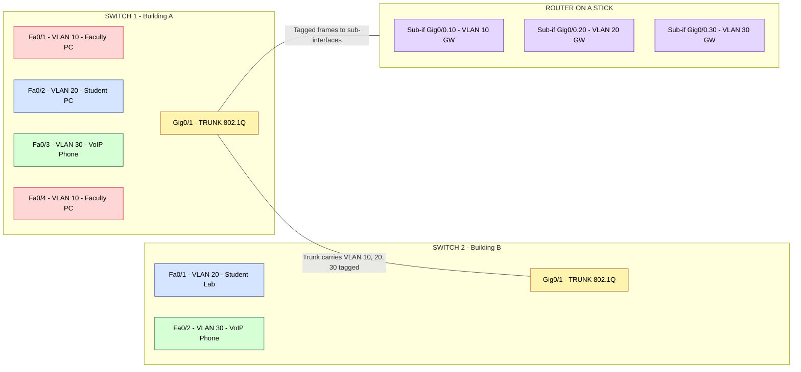
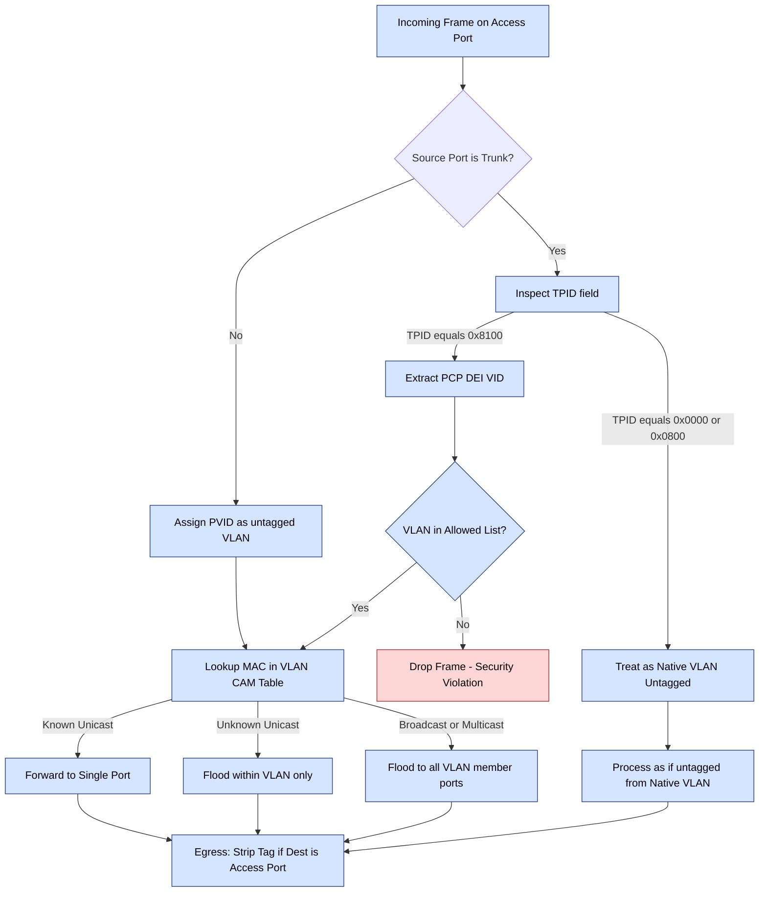
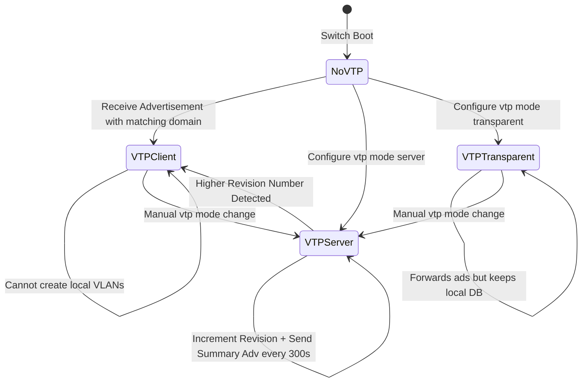
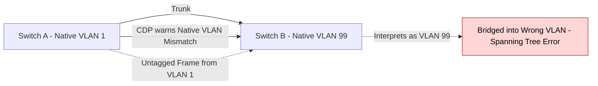

# VLANs

<!-- SECTION_1_START -->
# VLANs (Virtual Local Area Networks)

## 1.1 Formal KTU 2024 Scheme Definition

> [!IMPORTANT]
> **VLAN (Virtual Local Area Network):** A logical grouping of network devices (switches, ports, end-hosts, or MAC addresses) that communicate as if they were attached to the same physical broadcast domain, **regardless of their actual physical location**, by employing IEEE 802.1Q tagging at the Data Link Layer (Layer 2) of the OSI reference model.

In the KTU 2024 *Advanced Computer Networks* syllabus (Module 2 — DLL Switching), a VLAN is classified as a **Layer 2 broadcast domain partitioning technique** that operates by inserting a 4-byte **VLAN Tag** (Tag Protocol Identifier — TPID = **0x8100**) into the standard IEEE 802.3/Ethernet frame.

### 1.2 Conceptual Analogy — The Office Building

Imagine a 10-storey corporate building where every employee is physically scattered across random floors. Without VLANs, shouting in one room (a broadcast) echoes through every room on every floor — a constant "network storm."

> **The VLAN Solution:** The HR Director announces, "From today, all Finance team members are *logically* grouped as Floor 1, even if some of them are physically on Floor 8." Now when the Finance team broadcasts an announcement, only members of that logical group hear it. The walls are invisible (no physical rewiring), but the silence is real.

This is precisely what a VLAN does — it carves a single physical switch (or a chain of switches) into **multiple isolated broadcast islands**, without pulling a single new cable.

### 1.3 Why VLANs? — KTU Syllabus Highlights

> [!NOTE]
> **Three Core Engineering Justifications**
> 1. **Broadcast Storm Suppression** — A Layer 2 broadcast (e.g., ARP request) stays confined within its VLAN, slashing unnecessary CPU cycles on end-hosts.
> 2. **Security & Micro-Segmentation** — A compromised host in the *Guest* VLAN cannot trivially ARP-spoof a host in the *Finance* VLAN.
> 3. **Administrative Mobility** — A user moving to a new cubicle keeps the same IP, same subnet, same VLAN, requiring **zero L3 reconfiguration**.

### 1.4 Key Terminology at a Glance

| Term | Meaning |
|---|---|
| **Access Port** | Switch port assigned to a single VLAN — carries untagged (native) traffic |
| **Trunk Port** | Switch port carrying traffic for **multiple VLANs** using 802.1Q tags |
| **Native VLAN** | The single VLAN whose frames are sent *untagged* over a trunk (default = **VLAN 1**) |
| **VLAN ID (VID)** | 12-bit field → supports **4094 usable VLANs** (1 – 4094) |
| **Management VLAN** | VLAN used for Telnet/SSH/IP management access to the switch itself |

> [!VISUALIZATION CONTROL]
> **Concept:** Physical Switch Partitioned into 3 Logical VLANs with one Trunk Link between two switches.
> **GeoGebra / Desmos Input (Schematic Layout Coordinates):**
> * `Point A = (1, 1)` — Switch-1 (left)
> * `Point B = (8, 1)` — Switch-2 (right)
> * `Line(A, B)` — Trunk carrying tagged frames
> * `Circle(center = A, r = 1.5)` — Broadcast domain of VLAN 10
> * `Circle(center = A, r = 1.5, offset = (0, 2))` — VLAN 20 domain
> * `Circle(center = A, r = 1.5, offset = (0, 4))` — VLAN 30 domain
> **Visual Description:** Observe that even though Host-A1 (in VLAN 10) and Host-A3 (in VLAN 30) are plugged into the *same* Switch-1, their broadcast frames never collide. The trunk between Switch-1 and Switch-2 carries all three VLANs as tagged frames.

<!-- SECTION_1_END -->

<!-- SECTION_2_START -->
# Deep Theoretical Analysis & KTU High-Yield Formula Sheet

## 2.1 Operational Taxonomy of VLANs

The IEEE 802.1Q standard (and its Cisco predecessor ISL) defines VLAN membership using **four primary classification mechanisms**. The KTU examiner expects you to enumerate and contrast them.

### A. Port-Based VLAN (Most Common in Production)
* **Mechanism:** Each switchport is statically or dynamically (via 802.1x/MAB) bound to a single VLAN ID.
* **Hardware Filter:** A Port-VLAN Map table maps `(Port Number → VLAN ID)`.
* **Limitation:** Host mobility forces manual reconfiguration of the access port.

### B. MAC-Address-Based VLAN
* **Mechanism:** Switch maintains a `MAC ↔ VLAN` mapping table (e.g., OUI-prefixed).
* **Advantage:** User mobility is seamless — same MAC gets same VLAN wherever plugged.
* **Drawback:** Initial table population is labor-intensive.

### C. Protocol-Based VLAN
* **Mechanism:** Frames are classified by EtherType (e.g., IP = 0x0800, IPX = 0x8137).
* **Use Case:** Legacy networks mixing IP and IPX/AppleTalk traffic.

### D. Tag-Based VLAN (IEEE 802.1Q)
* **Mechanism:** A 4-byte tag is inserted between Source MAC and EtherType/Length.
* **Use Case:** **Trunk links** carrying multiple VLANs between switches.

## 2.2 The IEEE 802.1Q Frame Format (KTU High-Yield)

The standard Ethernet II frame is **expanded by 4 bytes** (with a 4-byte recalculated FCS, so the on-wire overhead is effectively +4 bytes).

```
┌──────────────┬──────────────┬──────────────┬──────────┬──────────┬──────┐
│ Dest MAC (6) │ Src MAC (6)  │   802.1Q Tag │ EtherType│ Payload  │  FCS │
│              │              │    (4 bytes) │  (2)     │          │ (4)  │
└──────────────┴──────────────┴──────────────┴──────────┴──────────┴──────┘
```

### 2.2.1 Anatomy of the 4-Byte 802.1Q Tag

| Field | Width | Value / Range | Function |
|---|---|---|---|
| **TPID** (Tag Protocol Identifier) | 16 bits | **0x8100** | Marks this frame as VLAN-tagged |
| **PCP** (Priority Code Point) | 3 bits | 0 – 7 | 802.1p Class of Service |
| **DEI** (Drop Eligible Indicator) | 1 bit | 0 or 1 | For congestion discard |
| **VID** (VLAN Identifier) | 12 bits | **1 – 4094** | Actual VLAN membership (0 and 4095 are reserved) |

> [!NOTE]
> **Mathematically:** $2^{12} = 4096$ possible IDs, of which **$4096 - 2 = 4094$** are usable (VID 0 = priority tag only; VID 4095 = reserved).

## 2.3 VLAN Trunking Protocols

### 2.3.1 IEEE 802.1Q (Open Standard)
The **dominant industry standard**. Inserts the 4-byte tag described above. Supports a single **Native VLAN** (untagged) per trunk.

### 2.3.2 ISL — Inter-Switch Link (Cisco Proprietary)
* **Encapsulation:** Wraps the **entire original Ethernet frame** inside a 26-byte ISL header + 4-byte FCS = **30-byte overhead**.
* **Encapsulation Formula:** $\text{ISL Frame Size} = 26 + \text{Original Frame} + 4$
* **Status:** **Deprecated by Cisco since 2012**; remains in KTU syllabus for historical/comparative questions.

### 2.3.3 VTP — VLAN Trunking Protocol (Cisco Proprietary)
A Layer 2 messaging protocol that propagates VLAN database changes across a *VTP Domain*.

| VTP Mode | Can Create VLANs? | Forwards VTP Ads? | Synchronizes? |
|---|---|---|---|
| **Server** | ✅ Yes | ✅ Yes | ✅ Yes |
| **Client** | ❌ No | ✅ Yes | ✅ Yes |
| **Transparent** | ✅ Yes (local only) | ✅ Yes (relays) | ❌ No (ignores) |

### 2.3.4 GVRP / GARP (IEEE 802.1Q-1998)
* **GARP** (Generic Attribute Registration Protocol) — generic framework.
* **GVRP** (GARP VLAN Registration Protocol) — dynamically learns/prunes VLAN membership on a port.

## 2.4 Inter-Switch Communication Across VLANs — The Router-on-a-Stick

A single VLAN = a single broadcast domain = **a single IP subnet**. To route *between* VLANs, you require a **Layer 3 device**. The KTU 2024 syllabus expects the "Router-on-a-Stick" topology:

* One physical router interface.
* Multiple **sub-interfaces** (`GigabitEthernet0/0.10`, `GigabitEthernet0/0.20`, ...).
* Each sub-interface acts as the **default gateway** for its VLAN.
* The link to the switch is a **trunk** carrying 802.1Q tags.

> [!IMPORTANT]
> **Real-World Engineering Utility:** Every enterprise campus, hospital, university, and cloud-provider rack relies on VLANs to segment traffic — e.g., separating *Voice* (VoIP QoS), *Data*, *Management*, *Guest Wi-Fi*, and *DMZ* into isolated broadcast domains. Modern SDN fabrics (e.g., Cisco VXLAN, VMware NSX) extend this concept to Layer 3 overlays.

## 2.5 KTU High-Yield Formula Cheat Sheet

| # | Formula / Parameter | Expression | Notes |
|---|---|---|---|
| 1 | Usable VLAN count | $N = 2^{12} - 2 = 4094$ | VID ∈ [1, 4094] |
| 2 | 802.1Q tag overhead | $\Delta = 4 \text{ bytes}$ | Inserted after Source MAC |
| 3 | Maximum tagged frame size | $M = 1518 + 4 = 1522 \text{ bytes}$ | **Baby Giant Frame** |
| 4 | ISL overhead | $O_{ISL} = 30 \text{ bytes}$ | 26-byte header + 4-byte FCS |
| 5 | ISL total frame | $F_{ISL} = 26 + F_{orig} + 4$ | Encapsulates entire original |
| 6 | Throughput efficiency loss (802.1Q) | $\eta = \dfrac{L_{payload}}{L_{payload} + 38}$ | 38 = 14 HDR + 20 CRC + 4 tag |
| 7 | Broadcast domain count | $D = N_{VLANs}$ | One VLAN = one domain |
| 8 | Native VLAN ID default | $VID_{native} = 1$ | Configurable per trunk |
| 9 | PCP priority levels | $P = 2^3 = 8$ | 0 (best-effort) → 7 (highest) |
| 10 | DEI congestion signaling | $DEI \in \{0, 1\}$ | 1 = drop first under congestion |

<!-- SECTION_2_END -->

<!-- SECTION_3_START -->
# Step-by-Step Derivations & Code Implementation

## 3.1 Derivation 1 — 802.1Q Tag Bit-Packing

A 32-bit 802.1Q tag is constructed as a single little-endian word on the wire. Let us derive the wire-level layout from a configuration of `PCP=5`, `DEI=0`, `VID=100`.

**Step 1 — Combine TCI (Tag Control Information) into 16 bits.**

$$
\text{TCI} = (\text{PCP} \ll 13) \; \vert \; (\text{DEI} \ll 12) \; \vert \; \text{VID}
$$

$$
\text{TCI} = (5 \ll 13) \;\vert\; (0 \ll 12) \;\vert\; 100
$$

$$
\text{TCI} = (5 \times 8192) \;\vert\; 0 \;\vert\; 100 = 40960 + 100 = 41060
$$

**Step 2 — Pack the full 4-byte tag (TPID ‖ TCI).**

$$
\text{Tag}_{32bit} = (\text{TPID} \ll 16) \; \vert \; \text{TCI}
$$

$$
\text{Tag}_{32bit} = (0x8100 \ll 16) \;\vert\; 41060
$$

$$
\text{Tag}_{32bit} = 0x8100A064
$$

**Step 3 — Emit bytes in network order (big-endian) on the wire.**

$$
\text{Wire bytes} = \{0x81,\ 0x00,\ 0xA0,\ 0x64\}
$$

**Step 4 — Sanity check on the VID field.**

$$
\text{VID} = 0xA064 \;\&\; 0x0FFF = 0x064 = 100 \;\; ✅
$$

## 3.2 Derivation 2 — Maximum Tagged Frame Size

A classic IEEE 802.3 frame has the following size budget:

* Header (Dest MAC + Src MAC + EtherType) = **14 bytes**
* Payload (MTU) = **1500 bytes**
* Trailer (FCS / CRC-32) = **4 bytes**

$$
L_{standard} = 14 + 1500 + 4 = 1518 \text{ bytes}
$$

After inserting the 4-byte 802.1Q tag *between* Src MAC and EtherType, the total grows by exactly 4 bytes:

$$
L_{tagged} = L_{standard} + \Delta_{tag} = 1518 + 4 = 1522 \text{ bytes}
$$

This value (1522) is universally cited in KTU answer keys as the **"Baby Giant"** maximum transmission unit. A switch that does not support this larger MTU silently drops such frames — a frequent cause of inter-vendor trunk failures.

## 3.3 Derivation 3 — ISL Frame Total Length

ISL encapsulates the *entire* original Ethernet frame, so we sum the ISL header, original frame, and ISL FCS:

$$
L_{ISL} = 26 + L_{original} + 4
$$

For a maximum-size original frame ($L_{original} = 1518$):

$$
L_{ISL, max} = 26 + 1518 + 4 = 1548 \text{ bytes}
$$

For a minimum-size 64-byte original frame:

$$
L_{ISL, min} = 26 + 64 + 4 = 94 \text{ bytes}
$$

## 3.4 Python Implementation — 802.1Q Tag Builder & Parser

```python
"""
KTU 2024 — Module 2: DLL Switching
Reference Implementation: IEEE 802.1Q VLAN Tag Encoder/Decoder
"""

from dataclasses import dataclass
from typing import Optional


@dataclass(frozen=True)
class VLANTag:
    pcp: int        # 3 bits  (0..7)   - Priority Code Point (802.1p)
    dei: int        # 1 bit   (0..1)   - Drop Eligible Indicator
    vid: int        # 12 bits (1..4094) - VLAN Identifier

    def __post_init__(self) -> None:
        if not 0 <= self.pcp <= 7:
            raise ValueError(f"PCP must be 0..7, got {self.pcp}")
        if self.dei not in (0, 1):
            raise ValueError(f"DEI must be 0 or 1, got {self.dei}")
        if not 1 <= self.vid <= 4094:
            raise ValueError(f"VID must be 1..4094, got {self.vid}")

    # ---------------- ENCODER ----------------
    def to_wire_bytes(self) -> bytes:
        """Pack into the canonical 4-byte 802.1Q tag (network byte order)."""
        tci: int = (self.pcp << 13) | (self.dei << 12) | self.vid
        tag_word: int = (0x8100 << 16) | tci
        return tag_word.to_bytes(length=4, byteorder="big", signed=False)

    # ---------------- DECODER ----------------
    @staticmethod
    def from_wire_bytes(raw: bytes) -> "VLANTag":
        if len(raw) != 4:
            raise ValueError("802.1Q tag must be exactly 4 bytes")
        word: int = int.from_bytes(raw, byteorder="big", signed=False)
        tpid: int = (word >> 16) & 0xFFFF
        if tpid != 0x8100:
            raise ValueError(f"Invalid TPID 0x{tpid:04X}; expected 0x8100")
        tci: int = word & 0xFFFF
        pcp: int = (tci >> 13) & 0x07
        dei: int = (tci >> 12) & 0x01
        vid: int = tci & 0x0FFF
        return VLANTag(pcp=pcp, dei=dei, vid=vid)

    def __repr__(self) -> str:
        return f"VLANTag(PCP={self.pcp}, DEI={self.dei}, VID={self.vid})"


# -------------------- DEMO --------------------
if __name__ == "__main__":
    # KTU sample: PCP=5, DEI=0, VID=100  (matches Section 3.1 derivation)
    tag = VLANTag(pcp=5, dei=0, vid=100)
    wire = tag.to_wire_bytes()
    print(f"Wire bytes : {wire.hex().upper()}")      # Expect: 8100A064
    print(f"Round-trip : {VLANTag.from_wire_bytes(wire)}")
```

**Expected Console Output**

```text
Wire bytes : 8100A064
Round-trip : VLANTag(PCP=5, DEI=0, VID=100)
```

## 3.5 Cisco IOS Configuration — Reference Transcript

```cisco
! ---- 1. Create the VLAN database ----
Switch(config)# vlan 10
Switch(config-vlan)# name FACULTY
Switch(config-vlan)# exit
Switch(config)# vlan 20
Switch(config-vlan)# name STUDENTS
Switch(config-vlan)# exit

! ---- 2. Assign access ports ----
Switch(config)# interface FastEthernet0/1
Switch(config-if)# switchport mode access
Switch(config-if)# switchport access vlan 10
Switch(config-if)# exit

Switch(config)# interface FastEthernet0/2
Switch(config-if)# switchport mode access
Switch(config-if)# switchport access vlan 20
Switch(config-if)# exit

! ---- 3. Configure the uplink as a trunk ----
Switch(config)# interface GigabitEthernet0/1
Switch(config-if)# switchport mode trunk
Switch(config-if)# switchport trunk encapsulation dot1q
Switch(config-if)# switchport trunk allowed vlan 10,20
Switch(config-if)# switchport trunk native vlan 1
Switch(config-if)# exit

! ---- 4. Router-on-a-Stick sub-interfaces ----
Router(config)# interface GigabitEthernet0/0
Router(config-if)# no shutdown
Router(config-if)# exit
Router(config)# interface GigabitEthernet0/0.10
Router(config-subif)# encapsulation dot1Q 10
Router(config-subif)# ip address 192.168.10.1 255.255.255.0
Router(config-subif)# exit
Router(config)# interface GigabitEthernet0/0.20
Router(config-subif)# encapsulation dot1Q 20
Router(config-subif)# ip address 192.168.20.1 255.255.255.0
```

## 3.6 Comparative Analysis Matrix — VLAN vs. Subnet vs. VPN

| Property | VLAN (Layer 2) | IP Subnet (Layer 3) | VPN (Overlay) |
|---|---|---|---|
| OSI Layer | Data Link (L2) | Network (L3) | Application/L3 |
| Isolation Mechanism | 802.1Q tag | IP prefix + netmask | Encapsulation (GRE/IPsec) |
| Broadcast Domain | One per VLAN | One per subnet | Tunnelled across WAN |
| Spans Routers? | ❌ No (trunk only) | ✅ Yes | ✅ Yes (over Internet) |
| Scalability | 4094 IDs | $2^{32}$ (IPv4) | Virtually unlimited |
| Configuration Complexity | Low | Medium | High (crypto + keys) |

<!-- SECTION_3_END -->

<!-- SECTION_4_START -->
# Structural Diagrams & Schematics

## 4.1 End-to-End VLAN Topology — Two Switches, Three VLANs, Router-on-a-Stick



## 4.2 VLAN Frame Processing — Sequential Processing Topology Matrix



## 4.3 VTP Domain Synchronization — State Machine



## 4.4 Native VLAN Mismatch — Failure Topology



<!-- SECTION_4_END -->

<!-- SECTION_5_START -->
# KTU 2024 Scheme Examination Question Bank & Topic Recap

## 5.1 Part A — Short Answer Questions (3 Marks Each)

### Question 1
**[KTU University Exam - July 2024]** Define a VLAN. Mention any two advantages of using VLANs in an enterprise campus network. (3 Marks)
**Mapped CO:** CO1 | **RBT Level:** Remember

**Model Answer:**
A **Virtual Local Area Network (VLAN)** is a logical grouping of switch ports or end-stations that behave as a single broadcast domain, independent of their physical location, by using IEEE 802.1Q tagging.

*Advantages (any two, 1½ marks each):*
1. **Reduces broadcast traffic** — broadcasts are confined to a single VLAN, conserving CPU and bandwidth on non-member hosts.
2. **Enhances security** — inter-VLAN traffic requires a Layer 3 device, allowing ACLs/firewall policies to be enforced at the boundary.
3. **Simplifies administration** — users can be moved logically without physical rewiring of patch panels.

---

### Question 2
**[KTU University Exam - Dec 2023]** What is the significance of the **TPID** field in an IEEE 802.1Q frame? State its standard hexadecimal value. (3 Marks)
**Mapped CO:** CO1 | **RBT Level:** Remember

**Model Answer:**
The **Tag Protocol Identifier (TPID)** is a **16-bit field** occupying the first two bytes of the 4-byte 802.1Q tag. Its purpose is to mark the frame as VLAN-tagged so that the receiving switch knows to look for VLAN information in the subsequent 2 bytes.

* **Standard value:** `0x8100` (in hex)
* When a switch reads a frame with TPID = 0x8100, it parses the next 2 bytes as the **TCI (Tag Control Information)** containing PCP, DEI, and VID.
* Reserved TPID values also exist (e.g., 0x88A8 for Service-VLAN / Provider Bridging in 802.1ad).

---

## 5.2 Part B — Long Answer Questions (14 Marks Each)

### Question A
**[KTU University Exam - Dec 2023 / Internal Choice Pattern]**

**(a)** With a neat diagram, explain the **IEEE 802.1Q frame format**. How is it different from a standard IEEE 802.3 frame? (7 Marks)
**Mapped CO:** CO2 | **RBT Level:** Understand

**(b)** A network engineer needs to segment 600 users into broadcast-isolated groups such that each group is an independent VLAN, with **at least 15 users per VLAN** and **no VLAN crossing the 12-bit VID boundary**. Determine the minimum number of VLANs required and justify your answer using the VID addressing formula. (7 Marks)
**Mapped CO:** CO3 | **RBT Level:** Apply

### Model Solution — Question A

**Part (a) — Frame Format (7 Marks)**

A standard IEEE 802.3 frame looks like:

```
[ Dest MAC (6) ][ Src MAC (6) ][ Length (2) ][ Payload (46-1500) ][ FCS (4) ]
```

The IEEE 802.1Q frame **inserts a 4-byte VLAN tag between the Source MAC and the Length/Type field**, and **recalculates the FCS**:

```
[ Dest MAC (6) ][ Src MAC (6) ][ 802.1Q TAG (4) ][ Length/Type (2) ][ Payload ][ FCS (4) ]
```

**4-Byte 802.1Q Tag Layout:**

```
+-----------------------------------------+--------------+
|              TPID (16 bits)             |  TCI (16 b)  |
|              0x8100                     |  PCP|DEI|VID |
+-----------------------------------------+--------------+
```

| Sub-field | Width | Function |
|---|---|---|
| **TPID** | 16 bits | Marks frame as 802.1Q-tagged. Standard value `0x8100`. [2 Marks] |
| **PCP** | 3 bits | 802.1p Class of Service (0–7). [1 Mark] |
| **DEI** | 1 bit | Drop Eligible Indicator for congestion. [1 Mark] |
| **VID** | 12 bits | VLAN identifier, range **1 to 4094**. [1 Mark] |
| **Differences from 802.3** | — | (i) Extra 4 bytes; (ii) Maximum frame grows from 1518 → **1522 bytes**; (iii) Tag is parsed by the switch before forwarding. [2 Marks] |

---

**Part (b) — VLAN Count Calculation (7 Marks)**

**Given:**
* Total users $U = 600$
* Minimum users per VLAN $u_{min} = 15$
* 12-bit VID space → $N_{max} = 2^{12} - 2 = 4094$ usable VLANs

**Step 1 — Compute lower bound from user count.** [3 Marks]

$$
V_{min} = \left\lceil \frac{U}{u_{min}} \right\rceil = \left\lceil \frac{600}{15} \right\rceil = \left\lceil 40 \right\rceil = 40 \text{ VLANs}
$$

**Step 2 — Confirm the VID boundary constraint is satisfied.** [2 Marks]

$$
V_{min} = 40 \;\le\; N_{max} = 4094 \quad ✅
$$

**Step 3 — Final Answer.** [2 Marks]

> The minimum number of VLANs required is **40**. The 12-bit VID addressing scheme can comfortably support up to 4094 VLANs, so 40 VLANs is well within protocol limits. The engineer should configure VIDs 1 through 40 (or skip VLAN 1 if it is reserved for management) and ensure each access switch port is bound to the correct VID.

---

### Question B
**[Internal Choice Alternative]**

**(a)** Compare and contrast **IEEE 802.1Q** and **Cisco ISL** trunk encapsulation methods. State which one is preferred in modern networks and why. (7 Marks)
**Mapped CO:** CO2 | **RBT Level:** Understand

**(b)** Design a **Router-on-a-Stick** topology to enable inter-VLAN routing between **VLAN 10 (Faculty)**, **VLAN 20 (Students)**, and **VLAN 30 (VoIP)**. Provide the IP addressing plan and Cisco IOS commands for the router sub-interfaces and the switch trunk. (7 Marks)
**Mapped CO:** CO3 | **RBT Level:** Apply

### Model Solution — Question B

**Part (a) — 802.1Q vs ISL Comparison (7 Marks)**

| Parameter | IEEE 802.1Q | Cisco ISL |
|---|---|---|
| **Standardization** | IEEE open standard (802.1Q) | Cisco proprietary |
| **Encapsulation Method** | Tag inserted *inside* the Ethernet frame (between Src MAC and EtherType) | Wraps the *entire* original frame inside an outer header |
| **Overhead** | **+4 bytes** (tag) | **+30 bytes** (26-byte header + 4-byte new FCS) |
| **Max Frame Size** | 1518 + 4 = **1522 bytes** ("Baby Giant") | 1518 + 30 = **1548 bytes** |
| **Native VLAN Support** | ✅ Yes (one untagged VLAN per trunk) | ❌ No — every frame is encapsulated |
| **Max VLANs** | $2^{12} - 2 = 4094$ | $2^{15} = 1024$ (10-bit VID inside ISL) |
| **Current Status** | Industry default, vendor-neutral | Deprecated by Cisco (2012) [Valuation tip: 1 Mark] |
| **Preferred?** | ✅ **Yes** — open standard, multi-vendor, lower overhead | ❌ No — proprietary, higher overhead, no native VLAN |

**[Valuation distribution: 1 Mark per row × 7 rows = 7 Marks]**

---

**Part (b) — Router-on-a-Stick Design (7 Marks)**

**IP Addressing Plan:** [2 Marks]

| VLAN | Name | Subnet | Gateway (Sub-if) |
|---|---|---|---|
| 10 | Faculty | 192.168.10.0/24 | 192.168.10.1 |
| 20 | Students | 192.168.20.0/24 | 192.168.20.1 |
| 30 | VoIP | 192.168.30.0/24 | 192.168.30.1 |

**Router Sub-interface Configuration:** [3 Marks]

```cisco
Router(config)# interface GigabitEthernet0/0
Router(config-if)# no shutdown
Router(config-if)# exit

Router(config)# interface GigabitEthernet0/0.10
Router(config-subif)# encapsulation dot1Q 10
Router(config-subif)# ip address 192.168.10.1 255.255.255.0
Router(config-subif)# exit

Router(config)# interface GigabitEthernet0/0.20
Router(config-subif)# encapsulation dot1Q 20
Router(config-subif)# ip address 192.168.20.1 255.255.255.0
Router(config-subif)# exit

Router(config)# interface GigabitEthernet0/0.30
Router(config-subif)# encapsulation dot1Q 30
Router(config-subif)# ip address 192.168.30.1 255.255.255.0
```

**Switch Trunk Configuration:** [2 Marks]

```cisco
Switch(config)# interface GigabitEthernet0/1
Switch(config-if)# switchport mode trunk
Switch(config-if)# switchport trunk encapsulation dot1q
Switch(config-if)# switchport trunk allowed vlan 10,20,30
Switch(config-if)# switchport trunk native vlan 1
```

> [!WARNING]
> **KTU Examiner's Valuation Warning — Common Pitfalls**
> 1. **Forgetting the `no shutdown`** on the physical router interface — sub-interfaces will not come up. [-1 Mark]
> 2. **Mismatching `encapsulation dot1Q <VID>`** with the sub-interface number — they need not be identical, but must match the VLAN ID. [-1 Mark]
> 3. **Not specifying `switchport trunk encapsulation dot1q`** on older Catalyst switches where ISL is the default. [-1 Mark]
> 4. **Failing to mention the Native VLAN** — KTU examiners often award a separate mark for explicitly stating `switchport trunk native vlan 1`. [-1 Mark]
> 5. **Confusing VLAN ID with subnet mask** — a VLAN is *not* a subnet on its own; it requires a Layer 3 gateway to be routable. [-1 Mark]

---

## 5.3 Topic Recap & Important Things to Remember

> [!NOTE]
> **Rapid Revision Checklist — Module 2 / VLANs**

* **Definition:** A VLAN is a **Layer 2 broadcast domain** created by logically grouping switch ports, regardless of physical topology.
* **Standard:** IEEE **802.1Q** (4-byte tag) — the open industry standard. Cisco **ISL** (30-byte encapsulation) is **deprecated**.
* **Tag Layout (32 bits):** `TPID (16 b, 0x8100)` ‖ `PCP (3 b)` ‖ `DEI (1 b)` ‖ `VID (12 b)`.
* **VID Range:** $1$ to $4094$ → **4094 usable VLANs** (0 = priority tag only, 4095 = reserved).
* **Max Tagged Frame:** 1518 + 4 = **1522 bytes** ("Baby Giant").
* **Trunk Port:** Carries **multiple VLANs** with 802.1Q tags. **Access Port:** Carries **one untagged VLAN**.
* **Native VLAN:** Single VLAN whose frames travel **untagged** on a trunk; default = **VLAN 1**; mismatch = spanning-tree errors.
* **Inter-VLAN Routing:** Requires a **Layer 3 device** — typically a **Router-on-a-Stick** (one physical link, multiple sub-interfaces) or an **L3 switch with SVIs**.
* **VTP Modes:** Server (creates/forwards/syncs), Client (forwards/syncs but cannot create), Transparent (forwards/creates locally, ignores sync).
* **GVRP/GARP:** IEEE-defined dynamic VLAN registration protocol (open-standard equivalent of VTP).
* **Broadcast Isolation:** One VLAN = one broadcast domain. A broadcast from VLAN 10 never reaches VLAN 20 without routing.
* **Security:** Inter-VLAN traffic must traverse a router/firewall → ACLs and IDS/IPS policies can be applied.
* **Mobility:** User moves to a new port — keep same MAC → no IP reconfiguration needed (port remains in same VLAN).
* **Mnemonic for 802.1Q Tag:** **"Two Polite Dogs Visit"** → **T**PID, **P**CP, **D**EI, **V**ID.
* **Sub-interface Rule:** `encapsulation dot1Q <VLAN_ID>` must be issued on every sub-interface for it to be placed in the correct broadcast domain.
* **Real-World Prevalence:** Every enterprise campus, hospital, university, cloud rack, and SDN overlay (e.g., VXLAN) is built on VLAN-based segmentation as a fundamental primitive.
* **Common KTU Exam Keywords to Recognize:** *broadcast domain*, *802.1Q tag*, *trunk*, *access port*, *native VLAN*, *VTP*, *Router-on-a-Stick*, *sub-interface*, *Baby Giant*, *TPID 0x8100*.

<!-- SECTION_5_END -->
