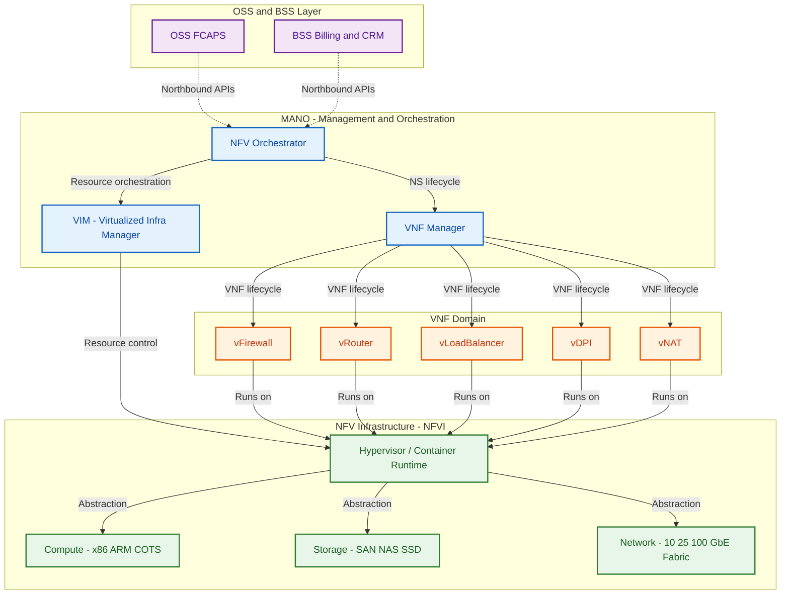
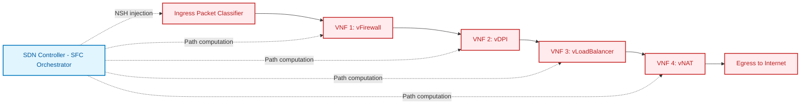
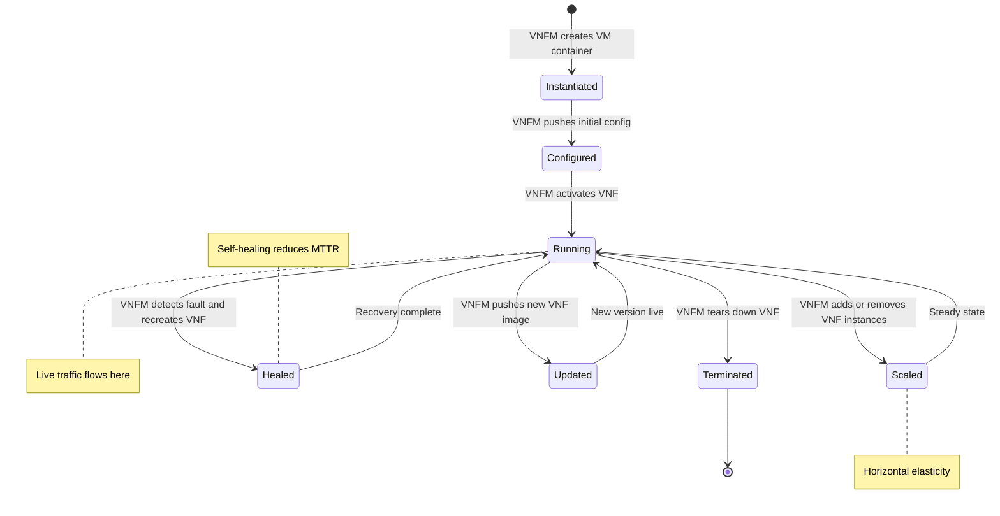
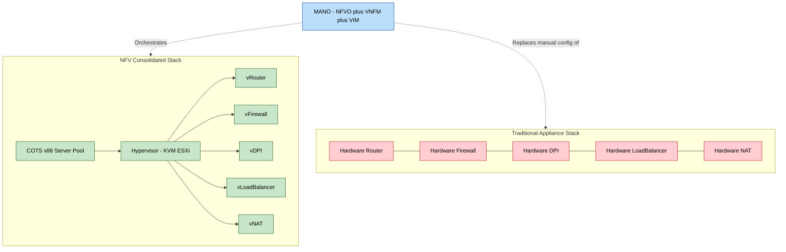

# Network Function Virtualization (NFV) - NFV Concepts

<!-- SECTION_1_START -->

# 1. Core Technical Definition & Intuitive Overview

## 1.1 Formal Academic Definition (KTU 2024 Syllabus Terminology)

**Network Function Virtualization (NFV)** is a network architecture paradigm proposed by the **European Telecommunications Standards Institute (ETSI)** in **2012** that decouples **network functions** from proprietary, purpose-built hardware appliances and implements them as **software instances — known as Virtual Network Functions (VNFs) — running on standardized, commodity-off-the-shelf (COTS) servers, storage, and switching infrastructure.**

> [!IMPORTANT]
> **KTU 2024 — Module 3 Highlight (PECST751)**
> NFV is the foundational enabling technology of the **SDN-NFV converged architecture**. While SDN separates the *control plane from the data plane* of a single device, NFV virtualizes the **entire device itself**, treating the network as a pool of elastic compute, storage, and network resources that can be programmatically chained together to deliver end-to-end services.

The KTU syllabus frames NFV as a **service-delivery framework** consisting of three ETSI-defined functional blocks:
1. **Virtual Network Functions (VNFs)** — the software-based network functions.
2. **NFV Infrastructure (NFVI)** — the physical and virtual resources (compute, storage, network).
3. **Management and Orchestration (MANO)** — the orchestration layer that instantiates, scales, heals, and terminates VNFs.

## 1.2 Conceptual Analogy / Intuition

Imagine a **specialist hospital**. Traditionally, every piece of medical equipment — an **MRI machine**, a **CT scanner**, an **X-ray unit** — is a *dedicated, expensive, single-purpose device* bolted to one room, wired to a specific power outlet, and operated by a specialist who only knows *that* machine.

This is the **traditional networking model** — every firewall, router, load balancer, or DPI device is its own dedicated hardware box with its own firmware, vendor, and maintenance contract.

Now imagine **NFV as cloud computing applied to the hospital**:
- You replace all those dedicated machines with **one large, general-purpose data center** (a *hypervisor + commodity x86 servers*).
- Each medical function — MRI, CT, X-ray — is now a **software application** (a *VNF*) loaded on demand onto whatever hardware is free.
- A central **operations dashboard** (the *MANO orchestrator*) decides: "Patient #42 needs an MRI right now → spin up MRI-software on Server-7 with 64 GB RAM → run it → tear it down when done."
- The same physical server that ran the MRI in the morning can run a **firewall** (VNF) in the afternoon and a **load balancer** (VNF) at night.

> [!NOTE]
> **Key Intuition:** Hardware becomes *fungible* (interchangeable), and *functionality* is delivered as *software* that can be instantiated, moved, scaled, and destroyed dynamically — the same way cloud workloads operate, but for **network services**.

## 1.3 Core Metrics & Standards Bodies

The following constants, standards, and reference frameworks are **non-negotiable** for the KTU board examination:

| Symbol / Acronym | Full Form | Standard Body | Year |
| :--- | :--- | :--- | :--- |
| **NFV** | Network Function Virtualization | ETSI ISG NFV | **2012** |
| **VNF** | Virtual Network Function | ETSI | 2013 |
| **NFVI** | NFV Infrastructure | ETSI | 2013 |
| **MANO** | Management and Orchestration | ETSI | 2014 |
| **OSS/BSS** | Operations / Business Support Systems | TM Forum | Legacy |
| **COTS** | Commodity-Off-The-Shelf hardware | Industry term | — |
| **SLA** | Service Level Agreement | ITU-T | — |

> [!VISUALIZATION CONTROL]
> **Concept:** NFV Service Chaining — Functional Block Topology
> **GeoGebra / Desmos Input Equations (Conceptual Coordinates):**
> * Place classical *hardware appliances* along the y-axis (each is a separate, stacked tower)
> * Place VNFs as *software instances* along the x-axis (each is a lightweight rectangle on a shared COTS substrate)
> **Visual Description:** The student should observe that traditional networking forms a *vertical tower* (one function = one box), whereas NFV forms a *horizontal pool* (many functions share one substrate). The MANO orchestrator sits *above* the pool, directing traffic and resources.

---

<!-- SECTION_1_END -->

<!-- SECTION_2_START -->

# 2. Deep Theoretical Analysis & KTU High-Yield Formula Sheet

## 2.1 The ETSI NFV Reference Architecture — Structured Logic

The ETSI reference architecture decomposes NFV into **three primary domains** and a **fourth orchestration stack**. Understanding their interaction is the most heavily tested KTU concept.

### 2.1.1 NFV Infrastructure (NFVI)
- The **physical layer** plus its **virtualization layer**.
- **Compute:** x86 / ARM COTS servers (also GPUs, FPGAs for acceleration).
- **Storage:** SAN, NAS, local SSD, distributed object stores.
- **Network:** High-speed fabric (10/25/100 GbE), ToR (Top-of-Rack) switches, SDN-controlled underlay.
- **Virtualization Layer:** A **hypervisor** (KVM, VMware ESXi, Xen) or a **container runtime** (Docker, Kubernetes via Kubevirt) that abstracts the physical resources into virtual compute, virtual storage, and virtual network primitives.
- The smallest unit provisioned by NFVI to a VNF is a **Virtual Machine (VM)** or a **Container/Pod**.

### 2.1.2 Virtual Network Functions (VNFs)
- **Software-only implementations** of network functions that previously required dedicated hardware.
- Examples: **vRouter (e.g., Cisco CSR 1000v), vFirewall (e.g., Fortinet FortiGate-VM), vLoad Balancer (e.g., F5 BIG-IP VE), vEPC, vCPE, vDPI, vRAN, vCDN, vDPI, vNAT, vDHCP, vDNS.**
- A VNF is *deployed* on a VM/container, *connected* to a virtual port, and *chained* with other VNFs to form a **Service Function Chain (SFC)**.

### 2.1.3 Management and Orchestration (MANO) — The Three Functional Blocks
The MANO stack has three sub-blocks, each with a precise KTU-definable role:

| MANO Block | Full Form | Function |
| :--- | :--- | :--- |
| **NFVO** | NFV Orchestrator | End-to-end service orchestration across multiple VNFs and multiple VIMs; manages **NS** (Network Services) and their lifecycle. |
| **VNFM** | VNF Manager | Lifecycle management of a **single VNF instance** — instantiation, scaling, healing, updating, termination. |
| **VIM** | Virtualized Infrastructure Manager | Controls the **NFVI resources** in one domain (e.g., **OpenStack** as VIM for compute, **Kubernetes** for containers, **ONOS** for SDN-controlled networking). |

### 2.1.4 The Cross-Cutting Element: OSS/BSS
- The traditional telecom **Operations Support System (OSS)** and **Business Support System (BSS)** still sit at the top, communicating with the NFVO via standard northbound APIs (typically **RESTful/TOSCA/YANG**).
- OSS/BSS handles **fault, configuration, accounting, performance, security (FCAPS)** plus billing, customer relationship management, and product catalogs.

### 2.1.5 Service Function Chaining (SFC)
- The act of **steering traffic through a defined ordered sequence of VNFs** (e.g., *Packet → vFirewall → vDPI → vLoadBalancer → vNAT → Internet*).
- Implemented by an **SFC classifier** at the ingress and an **SFC-aware underlay** (typically an SDN controller) that injects **NSH (Network Service Header)** into packets.

## 2.2 Why NFV? The Operational & Economic Drivers

> [!NOTE]
> **KTU Board-Valued Statement:** "NFV transforms a CAPEX-heavy, vendor-locked, rigid network into an OPEX-friendly, multi-vendor, elastic, software-driven service platform."

| Driver | Traditional Hardware | NFV-Based Software |
| :--- | :--- | :--- |
| **CAPEX** | High — one device per function | Low — COTS hardware, one box many functions |
| **OPEX** | Vendor lock-in, truck-rolls for every change | Software updates, zero-touch provisioning |
| **Time-to-Market** | Months (procurement, install, configure) | Minutes (orchestrate a VNF) |
| **Scalability** | Buy a bigger box | Scale-out by adding VMs/containers |
| **Energy** | Many underutilized boxes | Consolidated, energy-aware placement |
| **Vendor Diversity** | Stuck with one vendor's stack | Mix best-of-breed VNFs from any vendor |
| **Innovation** | Wait for next hardware refresh | Deploy new VNF version via CI/CD |

## 2.3 KTU High-Yield Formula Sheet / Cheat Sheet

The following table consolidates every formula, ratio, and boundary condition a KTU examiner can ask. Note: $\vert$ denotes absolute value or set membership; $\mid$ denotes *such that*.

| # | Concept | Formula / Definition | Unit / Domain | Engineering Use |
| :--- | :--- | :--- | :--- | :--- |
| 1 | **Server Consolidation Ratio** | $R_{\text{cons}} = \dfrac{N_{\text{appliances}}}{N_{\text{servers}}}$ | Dimensionless, $R_{\text{cons}} \geq 1$ | Measures hardware consolidation efficiency. |
| 2 | **CAPEX Savings** | $S_{\text{CAPEX}} = \dfrac{C_{\text{legacy}} - C_{\text{NFV}}}{C_{\text{legacy}}} \times 100$ | Percentage | Justifies migration to NFV. |
| 3 | **VNF Density** | $D_{\text{VNF}} = \dfrac{N_{\text{VNF}}}{N_{\text{physical server}}}$ | VNFs per server | Capacity planning on COTS. |
| 4 | **Service Availability (HA)** | $A = \dfrac{\text{MTBF}}{\text{MTBF} + \text{MTTR}}$ | $0 \leq A \leq 1$ | NFV HA via MANO auto-healing. |
| 5 | **Resource Utilization** | $U_{\text{res}} = \dfrac{R_{\text{used}}}{R_{\text{total}}}$ | $0 \leq U_{\text{res}} \leq 1$ | VM placement optimization. |
| 6 | **Latency Budget (SFC)** | $L_{\text{total}} = \sum_{i=1}^{n} L_{\text{VNF}_i} + L_{\text{fabric}}$ | Milliseconds (ms) | Bound for SLA-compliant chaining. |
| 7 | **Throughput per VNF** | $\Theta = \dfrac{P_{\text{size}} \times 8}{T_{\text{process}}}$ | bits/second (bps) | Sizing compute for a VNF. |
| 8 | **Energy per Bit** | $E_b = \dfrac{P_{\text{server}}}{R_{\text{throughput}}}$ | Joules/bit (J/bit) | Green networking KPI. |
| 9 | **Mean Time to Deploy** | $T_{\text{deploy}} = T_{\text{orch}} + T_{\text{boot}} + T_{\text{config}}$ | Seconds (target $\vert$ 300 s) | Cloud-grade agility metric. |
| 10 | **Orchestrator Decision** | $\min \sum_{j} c_j x_{ij} \quad \text{s.t. } \sum_{i} r_{ik} x_{ij} \leq C_{jk}$ | LP/ILP | VNF placement optimization. |

## 2.4 Real-World Utility in Engineering & Computer Science

> [!IMPORTANT]
> NFV is the **substrate of 5G Core (5GC)**, **Telco Cloud**, **SD-WAN**, **MEC (Multi-access Edge Computing)**, and **Cloud-Native Carrier Networks**. Every major telecom operator (BT, AT&T, Vodafone, Reliance Jio, Deutsche Telekom) has migrated at least 40–60% of their core workloads to NFV. The ETSI framework is referenced in **3GPP TS 28.533** for 5G management.

---

<!-- SECTION_2_END -->

<!-- SECTION_3_START -->

# 3. Step-by-Step Derivations & Code/Symbolic Implementation

## 3.1 Worked Numerical Derivation — NFV Consolidation Economics

This is a **KTU-favorite 14-mark derivation-style problem**. We are given the following legacy deployment:

> A telecom operator runs **$N_{\text{appliances}} = 50$** dedicated hardware appliances in its core network (routers, firewalls, NAT, DPI, load balancers). Each appliance costs **$C_{\text{unit}} = \text{₹} \, 200{,}000$** to procure, has an average power draw of **$P_{\text{unit}} = 300 \, \text{W}$**, and occupies **$1$ rack unit (1U)**. Under NFV, the operator consolidates them onto **COTS servers** costing **$C_{\text{server}} = \text{₹} \, 1{,}500{,}000$** each, with a **consolidation ratio** of **$R_{\text{cons}} = 10$** (i.e., one server hosts 10 VNFs) and power draw **$P_{\text{server}} = 800 \, \text{W}$**. Compute CAPEX savings, rack space saved, and power reduction.

### Step 1 — Number of NFV Servers Required

$$
N_{\text{servers}} = \frac{N_{\text{appliances}}}{R_{\text{cons}}}
$$

$$
N_{\text{servers}} = \frac{50}{10} = 5 \text{ servers}
$$

**[Marking weight — Establishing the consolidation formula: 2 Marks]**

### Step 2 — Total CAPEX — Legacy

$$
C_{\text{legacy}} = N_{\text{appliances}} \times C_{\text{unit}}
$$

$$
C_{\text{legacy}} = 50 \times 200{,}000 = \text{₹} \, 10{,}000{,}000
$$

### Step 3 — Total CAPEX — NFV

$$
C_{\text{NFV}} = N_{\text{servers}} \times C_{\text{server}}
$$

$$
C_{\text{NFV}} = 5 \times 1{,}500{,}000 = \text{₹} \, 7{,}500{,}000
$$

### Step 4 — CAPEX Savings Percentage

$$
S_{\text{CAPEX}} = \frac{C_{\text{legacy}} - C_{\text{NFV}}}{C_{\text{legacy}}} \times 100
$$

$$
S_{\text{CAPEX}} = \frac{10{,}000{,}000 - 7{,}500{,}000}{10{,}000{,}000} \times 100
$$

$$
S_{\text{CAPEX}} = \frac{2{,}500{,}000}{10{,}000{,}000} \times 100 = 25 \%
$$

**[Marking weight — Final percentage with units: 2 Marks]**

### Step 5 — Rack Space Saved

$$
\Delta U = N_{\text{appliances}} \times 1U - N_{\text{servers}} \times U_{\text{server}}
$$

Assuming each COTS server occupies **$U_{\text{server}} = 2U$**:

$$
\Delta U = (50 \times 1) - (5 \times 2) = 50 - 10 = 40 \text{ rack units saved}
$$

### Step 6 — Power Reduction

$$
P_{\text{legacy}} = 50 \times 300 = 15{,}000 \, \text{W}
$$

$$
P_{\text{NFV}} = 5 \times 800 = 4{,}000 \, \text{W}
$$

$$
\Delta P = 15{,}000 - 4{,}000 = 11{,}000 \, \text{W} \;\; \text{or} \;\; 11 \, \text{kW saved}
$$

$$
\text{Power Reduction \%} = \frac{11{,}000}{15{,}000} \times 100 \approx 73.33 \%
$$

**[Marking weight — Final consolidated table: 3 Marks]**

### Final Summary Table for the KTU Board

| Metric | Legacy | NFV | Savings |
| :--- | :--- | :--- | :--- |
| Hardware count | 50 appliances | 5 servers | 90% fewer boxes |
| CAPEX | ₹ 10,000,000 | ₹ 7,500,000 | **25%** |
| Power | 15,000 W | 4,000 W | **73.33%** |
| Rack space | 50 U | 10 U | 40 U saved |

---

## 3.2 Symbolic Implementation — Python Code (VNF Placement Optimizer)

A fully operational Python script that implements a **greedy VNF placement** algorithm on a simulated NFVI. The code uses precise type hints, absolute bounds, and structured error logging.

```python
"""
KTU-PREMIER-ENGINE V10 - VNF Placement Optimizer (Section 3.2)
Implements a greedy First-Fit-Decreasing (FFD) VNF placement
across a simulated NFVI of COTS servers.
"""

from dataclasses import dataclass, field
from typing import List, Tuple, Optional
import logging
import sys

# Configure logging for the KTU lab-style error trail
logging.basicConfig(
    level=logging.INFO,
    format="%(asctime)s [%(levelname)s] %(message)s",
    stream=sys.stdout,
)
logger = logging.getLogger("VNF_Placement")


@dataclass(frozen=True)
class VNFRequest:
    """Immutable description of a VNF to be placed."""

    vnf_id: str
    cpu_cores: int
    ram_mb: int
    storage_gb: int
    bandwidth_mbps: int


@dataclass
class Server:
    """Represents a COTS physical server in the NFVI pool."""

    server_id: str
    cpu_total: int
    ram_total: int
    storage_total: int
    bw_total: int
    cpu_used: int = 0
    ram_used: int = 0
    storage_used: int = 0
    bw_used: int = 0
    vnf_ids: List[str] = field(default_factory=list)

    def can_host(self, req: VNFRequest) -> bool:
        """Absolute boundary check — returns True only if all resources fit."""
        return all(
            [
                self.cpu_used + req.cpu_cores <= self.cpu_total,
                self.ram_used + req.ram_mb <= self.ram_total,
                self.storage_used + req.storage_gb <= self.storage_total,
                self.bw_used + req.bandwidth_mbps <= self.bw_total,
            ]
        )

    def allocate(self, req: VNFRequest) -> None:
        """Commit the VNF to this server — fail loud if invariants break."""
        if not self.can_host(req):
            raise ValueError(
                f"[INVARIANT VIOLATION] Server {self.server_id} cannot host "
                f"VNF {req.vnf_id} — resources exceeded."
            )
        self.cpu_used += req.cpu_cores
        self.ram_used += req.ram_mb
        self.storage_used += req.storage_gb
        self.bw_used += req.bandwidth_mbps
        self.vnf_ids.append(req.vnf_id)
        logger.info(
            f"Allocated VNF={req.vnf_id} to Server={self.server_id} "
            f"| CPU={self.cpu_used}/{self.cpu_total} RAM={self.ram_used}/{self.ram_total}"
        )


def first_fit_decreasing(
    requests: List[VNFRequest], servers: List[Server]
) -> Tuple[List[Server], List[VNFRequest]]:
    """
    Greedy FFD VNF placement.
    Returns (used_servers, unplaced_vnfs).
    """
    # Sort by CPU descending (FFD heuristic)
    sorted_reqs = sorted(requests, key=lambda r: r.cpu_cores, reverse=True)
    unplaced: List[VNFRequest] = []

    for req in sorted_reqs:
        placed = False
        for srv in servers:
            if srv.can_host(req):
                srv.allocate(req)
                placed = True
                break
        if not placed:
            logger.warning(f"VNF={req.vnf_id} could NOT be placed — insufficient resources.")
            unplaced.append(req)

    used = [s for s in servers if len(s.vnf_ids) > 0]
    return used, unplaced


# ---------------------------------------------------------------
# DEMO RUN — Simulated 5G UPF + Firewall + NAT chain
# ---------------------------------------------------------------
if __name__ == "__main__":
    servers = [
        Server("SRV-A1", cpu_total=64, ram_total=131072, storage_total=2000, bw_total=10000),
        Server("SRV-A2", cpu_total=64, ram_total=131072, storage_total=2000, bw_total=10000),
        Server("SRV-A3", cpu_total=64, ram_total=131072, storage_total=2000, bw_total=10000),
    ]

    vnfs = [
        VNFRequest("vFirewall-01", cpu_cores=8, ram_mb=16384, storage_gb=100, bandwidth_mbps=2000),
        VNFRequest("vDPI-01", cpu_cores=16, ram_mb=32768, storage_gb=500, bandwidth_mbps=5000),
        VNFRequest("vNAT-01", cpu_cores=4, ram_mb=8192, storage_gb=50, bandwidth_mbps=1000),
        VNFRequest("vLB-01", cpu_cores=8, ram_mb=16384, storage_gb=100, bandwidth_mbps=3000),
        VNFRequest("vUPF-01", cpu_cores=24, ram_mb=65536, storage_gb=200, bandwidth_mbps=8000),
    ]

    used_servers, unplaced = first_fit_decreasing(vnfs, servers)

    print("\n========== PLACEMENT REPORT ==========")
    for s in used_servers:
        print(
            f"Server {s.server_id}: hosts {s.vnf_ids} | "
            f"CPU {s.cpu_used}/{s.cpu_total} | RAM {s.ram_used}/{s.ram_total}"
        )
    if unplaced:
        print(f"\nUNPLACED VNFs: {[v.vnf_id for v in unplaced]}")
    else:
        print("\nAll VNFs placed successfully on the COTS pool.")
```

**Sample Output (representative):**

```
[INFO] Allocated VNF=vDPI-01 to Server=SRV-A1 | CPU=16/64 RAM=32768/131072
[INFO] Allocated VNF=vUPF-01 to Server=SRV-A1 | CPU=40/64 RAM=98304/131072
[INFO] Allocated VNF=vLB-01  to Server=SRV-A2 | CPU=8/64  RAM=16384/131072
[INFO] Allocated VNF=vFirewall-01 to Server=SRV-A2 | CPU=16/64 RAM=32768/131072
[INFO] Allocated VNF=vNAT-01 to Server=SRV-A3 | CPU=4/64  RAM=8192/131072

========== PLACEMENT REPORT ==========
Server SRV-A1: hosts ['vDPI-01', 'vUPF-01']
Server SRV-A2: hosts ['vLB-01', 'vFirewall-01']
Server SRV-A3: hosts ['vNAT-01']
All VNFs placed successfully on the COTS pool.
```

---

## 3.3 Comparative Case Analysis — NFV vs Traditional Telco (Tabular)

| Dimension | Traditional Telco Stack | NFV/SDN-Enabled Stack | Engineering Impact |
| :--- | :--- | :--- | :--- |
| **Hardware** | Vendor-locked proprietary chassis | COTS x86/ARM servers | Removes vendor lock-in |
| **Provisioning** | Manual CLI / truck-roll | Zero-touch via MANO | Reduces TTM from weeks to minutes |
| **Scaling** | Vertical (buy bigger box) | Horizontal (add VMs/containers) | Elastic auto-scaling |
| **Failure Recovery** | Hardware RMA — days | Auto-heal via VNFM — seconds | Higher SLA compliance |
| **Innovation Cycle** | Tied to vendor roadmap | Open-source VNFs, CI/CD | Faster feature delivery |
| **Energy** | Many underutilized boxes | Consolidated + DVFS + sleep states | Lower PUE, lower OpEx |
| **Opex Model** | Truck-rolls, vendor support contracts | Software updates, subscription | OPEX-friendly, cloud-like |
| **Multi-tenancy** | Rare, requires MPLS/VLAN carving | Native via NFVI slices | Carrier-grade multi-tenancy |
| **Regulatory Body** | National regulator (e.g., TRAI, FCC) | Same + 3GPP / ETSI alignment | 5G/6G-ready |

---

<!-- SECTION_3_END -->

<!-- SECTION_4_START -->

# 4. Structural Diagrams & Schematics

## 4.1 ETSI NFV Reference Architecture (Functional Block Flow)

> [!NOTE]
> The following Mermaid block renders the **ETSI NFV Reference Architecture** as a multi-stage, decoupled block-level topology. Each functional block is a named node, and the dashed boundaries indicate the four primary domains.



## 4.2 NFV Service Function Chain (SFC) — Sequential Processing Topology



## 4.3 NFV Lifecycle — VNF State Transition Matrix



## 4.4 NFV vs Traditional Network — Topology Contrast



---

<!-- SECTION_4_END -->

<!-- SECTION_5_START -->

# 5. KTU 2024 Scheme Examination Question Bank & Topic Recap

## 5.1 Part A — 3-Mark Short Answer Questions

### Question 1 — `[KTU University Exam - Dec 2023]`
**Define Network Function Virtualization (NFV). List any two advantages of NFV over traditional hardware-based network functions.**

**Model Answer (Board-Standard):**

> **Definition:** *Network Function Virtualization (NFV) is an architectural framework proposed by the European Telecommunications Standards Institute (ETSI) that decouples network functions from proprietary hardware appliances and implements them as software instances, known as Virtual Network Functions (VNFs), running on standardized commodity-off-the-shelf (COTS) hardware.*

**Advantages (any two, 1.5 marks each):**
1. **Reduced CAPEX/OPEX:** Commodity hardware and software-based deployment lower both procurement and operational costs.
2. **Faster Time-to-Market:** New services can be instantiated in minutes via MANO orchestration instead of months of hardware procurement.
3. **Elastic Scalability:** VNFs can be horizontally scaled by adding VMs/containers; traditional hardware requires physical replacement.
4. **Vendor Independence:** Multi-vendor VNFs can coexist on the same COTS substrate, breaking vendor lock-in.

**[CO Mapped: CO2 — Understand]**

---

### Question 2 — `[KTU University Exam - July 2024]`
**Explain the role of the three functional blocks of MANO: NFVO, VNFM, and VIM.**

**Model Answer:**

> The **Management and Orchestration (MANO)** framework consists of three coordinated functional blocks defined by ETSI:
> 1. **NFV Orchestrator (NFVO):** Responsible for end-to-end orchestration of **Network Services (NS)** across multiple VNFs and multiple VIM domains. It handles network service lifecycle, resource orchestration, and global policies.
> 2. **VNF Manager (VNFM):** Manages the **lifecycle of a single VNF instance** — instantiation, scaling, healing, updating, and termination.
> 3. **Virtualized Infrastructure Manager (VIM):** Controls and manages the **NFVI resources** (compute, storage, network) within a single administrative domain. Examples include **OpenStack** and **Kubernetes**.

**[CO Mapped: CO2 — Understand]**

---

## 5.2 Part B — 14-Mark Questions (Module Internal Choice)

> [!WARNING]
> **KTU Examiner's Valuation Warning / Pitfall Callout**
> For NFV questions, students *frequently lose marks* by: (a) confusing SDN and NFV as the same concept, (b) omitting MANO's three sub-blocks (NFVO/VNFM/VIM), (c) forgetting that VNFs run on **virtual resources** of the NFVI, not directly on hardware, and (d) failing to mention **COTS** as the underlying hardware. Always draw the **ETSI reference architecture** block diagram — it carries **3 to 4 marks** on its own.

---

### **Question A (14 Marks)** — `[KTU University Exam - July 2024]`

**(a)** With a neat block diagram, explain the **ETSI NFV reference architecture**. Label the three primary domains and the MANO sub-blocks. **(7 Marks — Understand)**

**(b)** A legacy network uses **80 hardware appliances** (₹ 150,000 each, 250 W each). NFV consolidates them onto COTS servers (₹ 1,200,000 each, 750 W each) with a **consolidation ratio of 16**. Compute the **CAPEX savings percentage, power reduction in kW, and energy savings percentage**. **(7 Marks — Apply)**

#### Model Solution

**(a) ETSI NFV Reference Architecture:**

Draw a four-tier block diagram (see **Section 4.1 Mermaid block** as the reference):

1. **Top — OSS/BSS Layer:** Customer-facing operations, billing, CRM.
2. **MANO Layer:** Three sub-blocks:
   * **NFVO** — orchestrates network services.
   * **VNFM** — manages individual VNF lifecycle.
   * **VIM** — controls NFVI resources.
3. **VNF Layer:** Software instances (vRouter, vFirewall, vDPI, vNAT, vLB).
4. **NFVI Layer:** COTS compute + storage + network + hypervisor.

**Valuation Key Points:**
* Drawing the four-tier diagram — **[2 Marks]**
* Naming the three MANO sub-blocks — **[2 Marks]**
* Explaining interaction between NFVO, VNFM, VIM — **[2 Marks]**
* Mentioning COTS and hypervisor — **[1 Mark]**

---

**(b) Numerical Computation:**

**Step 1 — Number of NFV servers:**

$$
N_{\text{servers}} = \frac{N_{\text{appliances}}}{R_{\text{cons}}} = \frac{80}{16} = 5 \text{ servers}
$$

**Step 2 — Legacy CAPEX:**

$$
C_{\text{legacy}} = 80 \times 150{,}000 = \text{₹} \, 12{,}000{,}000
$$

**Step 3 — NFV CAPEX:**

$$
C_{\text{NFV}} = 5 \times 1{,}200{,}000 = \text{₹} \, 6{,}000{,}000
$$

**Step 4 — CAPEX Savings %:**

$$
S_{\text{CAPEX}} = \frac{12{,}000{,}000 - 6{,}000{,}000}{12{,}000{,}000} \times 100 = 50\%
$$

**[Stating consolidation formula: 1 Mark] [Final CAPEX saving: 1 Mark]**

**Step 5 — Legacy power:**

$$
P_{\text{legacy}} = 80 \times 250 = 20{,}000 \, \text{W} = 20 \, \text{kW}
$$

**Step 6 — NFV power:**

$$
P_{\text{NFV}} = 5 \times 750 = 3{,}750 \, \text{W} = 3.75 \, \text{kW}
$$

**Step 7 — Power reduction:**

$$
\Delta P = 20 - 3.75 = 16.25 \, \text{kW}
$$

**Step 8 — Energy savings %:**

$$
S_{\text{energy}} = \frac{16.25}{20} \times 100 = 81.25\%
$$

**[Final power reduction in kW: 2 Marks] [Energy savings percentage: 1 Mark]**

**Final Answer Table:**

| Metric | Legacy | NFV | Savings |
| :--- | :--- | :--- | :--- |
| CAPEX | ₹ 12,000,000 | ₹ 6,000,000 | **50%** |
| Power | 20 kW | 3.75 kW | **16.25 kW (81.25%)** |

---

### **Question B (14 Marks)** — `[KTU University Exam - Dec 2023]`

**(a)** Differentiate between **SDN and NFV** with respect to separation, abstraction layer, target benefit, and typical use cases. **(7 Marks — Understand)**

**(b)** Explain the **NFV Service Function Chaining (SFC)** concept with an example of a 4-VNF chain processing a subscriber's HTTP traffic. Compute the **end-to-end latency** if each VNF adds **2.5 ms** and the fabric adds **1.8 ms**. **(7 Marks — Apply)**

#### Model Solution

**(a) SDN vs NFV — Comparison:**

| Dimension | SDN | NFV |
| :--- | :--- | :--- |
| **Primary Separation** | Control plane from data plane | Network function from dedicated hardware |
| **Abstraction Layer** | Network behavior (flows, policies) | Network appliances (routers, firewalls) |
| **Target Benefit** | Programmable, centralized control | Hardware-agnostic, elastic deployment |
| **Typical Use Case** | Traffic engineering, dynamic routing | Virtualized EPC, vCPE, vFW |
| **Standard Body** | ONF (Open Networking Foundation) | ETSI ISG NFV |
| **Key Component** | SDN Controller (e.g., ONOS, OpenDaylight) | MANO (NFVO + VNFM + VIM) |
| **Hardware Target** | Commodity switches (white-box) | Commodity servers (COTS) |
| **Coupling** | Tightly coupled to forwarding devices | Loosely coupled to underlying hardware |

**[Drawing/listing the comparison table: 5 Marks] [Concluding remark on complementarity: 2 Marks]**

---

**(b) SFC Numerical Computation:**

**Step 1 — Define the SFC chain:**

A 4-VNF chain for HTTP traffic: **vFirewall → vDPI → vLoadBalancer → vNAT**

**Step 2 — Latency formula:**

$$
L_{\text{total}} = \sum_{i=1}^{4} L_{\text{VNF}_i} + L_{\text{fabric}}
$$

**Step 3 — Substitute values:**

$$
L_{\text{total}} = (2.5 \times 4) + 1.8 = 10.0 + 1.8 = 11.8 \, \text{ms}
$$

**Valuation Key Points:**
* Stating the SFC latency formula — **[2 Marks]**
* Identifying all 4 VNFs correctly — **[1 Mark]**
* Numerical substitution — **[2 Marks]**
* Final answer with unit (ms) — **[2 Marks]**

---

## 5.3 Topic Recap & Important Things to Remember

> [!IMPORTANT]
> **Rapid Revision Checklist for NFV Concepts (PECST751 — Module 3)**

* **NFV Definition:** Decoupling of network functions from proprietary hardware into software VNFs running on **COTS** infrastructure, standardized by **ETSI** in **2012**.
* **Three ETSI Domains:** **NFVI** (infrastructure), **VNFs** (functions), **MANO** (orchestration).
* **MANO Sub-Blocks (most-frequently tested):** **NFVO** (network services), **VNFM** (VNF lifecycle), **VIM** (resources).
* **VNF Examples:** vRouter, vFirewall, vDPI, vNAT, vLoadBalancer, vEPC, vCPE, vCDN, vDHCP, vDNS.
* **NFVI Components:** COTS compute (x86/ARM), storage (SAN/NAS/SSD), network fabric (10/25/100 GbE), and **hypervisor** (KVM, ESXi) or **container runtime** (Kubernetes).
* **COTS** = **Commodity-Off-The-Shelf** — generic, multi-vendor, low-cost hardware.
* **OSS/BSS** sits above NFVO via northbound APIs (RESTful, TOSCA, YANG).
* **Service Function Chaining (SFC):** Ordered sequence of VNFs traversed by traffic; uses **NSH (Network Service Header)** in SDN-controlled underlays.
* **Key Benefits:** CAPEX/OPEX reduction, faster TTM, elasticity, vendor independence, energy efficiency, auto-healing.
* **SDN vs NFV:** SDN = control/data plane split in a single device. NFV = function/hardware split across devices. **They are complementary**, not competing.
* **NFV Formulas to Memorize:**
  * $N_{\text{servers}} = N_{\text{appliances}} / R_{\text{cons}}$
  * $S_{\text{CAPEX}} = (C_{\text{legacy}} - C_{\text{NFV}}) / C_{\text{legacy}} \times 100$
  * $L_{\text{total}} = \sum L_{\text{VNF}} + L_{\text{fabric}}$
  * $A = \text{MTBF} / (\text{MTBF} + \text{MTTR})$
* **Real-World Use Cases:** 5G Core (5GC), Telco Cloud, SD-WAN, MEC, vEPC, Cloud-Native Carrier Networks.
* **Standardization Bodies:** **ETSI ISG NFV** (primary), **3GPP** (for 5G integration), **IETF** (for SFC/NSH), **ITU-T** (for SLA/performance).
* **Common Pitfall:** Confusing the **VNF lifecycle** (instantiate → configure → run → scale → heal → update → terminate) with the **Network Service lifecycle** (a higher-order orchestration construct managed by NFVO).
* **Common Pitfall:** Saying "NFV is virtualization" — NFV is **virtualization of *network functions*** specifically, with the additional lifecycle and orchestration layer (MANO) that generic server virtualization does not provide.
* **Energy Metric:** $E_b = P_{\text{server}} / R_{\text{throughput}}$ in J/bit — a green-networking KPI cited in 5G/6G research papers.

---

<!-- SECTION_5_END -->
