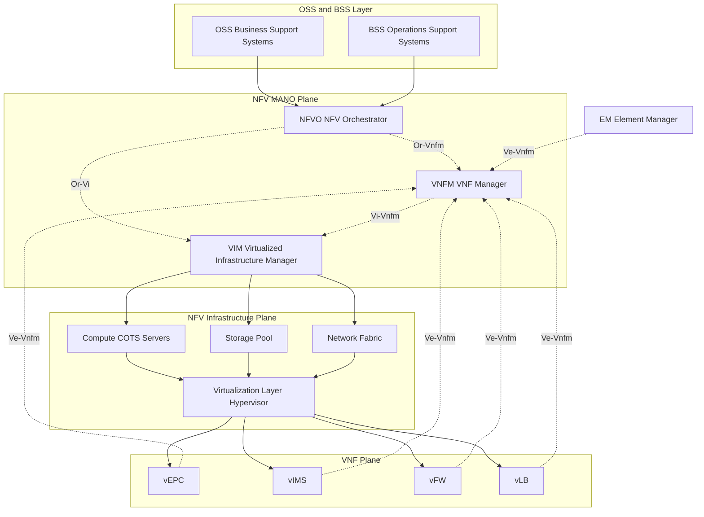
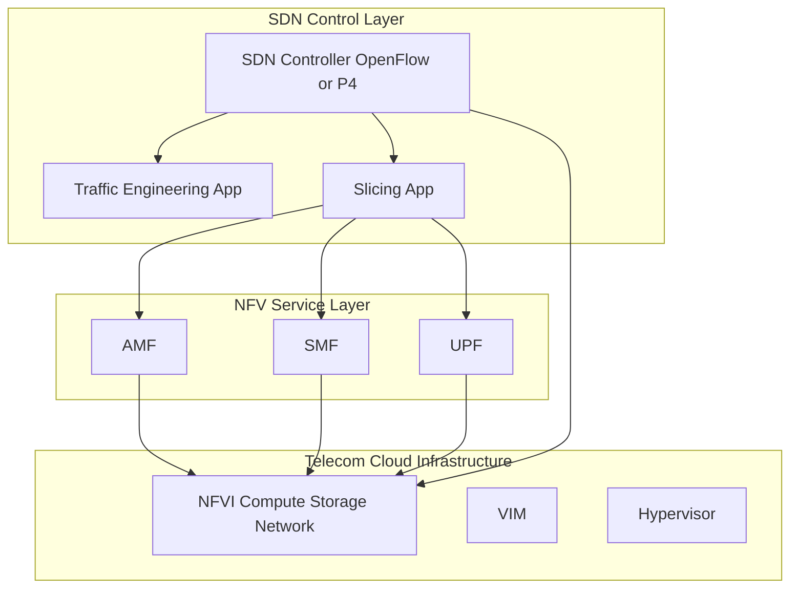
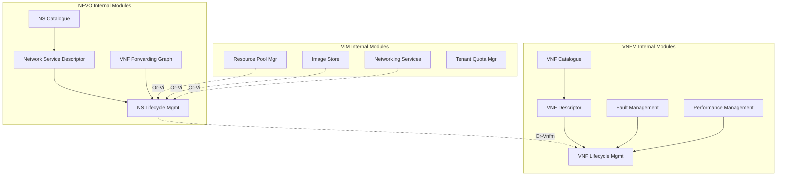

# NFV in Telecom Networks

<!-- SECTION_1_START -->
# NFV in Telecom Networks — KTU 2024 Premium Study Notes

## 1. Core Technical Definition & Intuitive Overview

### Formal Definition (KTU 2024 Syllabus Terminology)
**Network Functions Virtualization (NFV)** is a network architecture paradigm proposed by the **European Telecommunications Standards Institute (ETSI)** in **2012** that decouples **network functions** (e.g., firewalls, load balancers, routers, EPC components) from proprietary **dedicated hardware appliances** and runs them as **software instances** called **Virtual Network Functions (VNFs)** on standardized, general-purpose **Commercial Off-The-Shelf (COTS)** servers, switches, and storage infrastructure.

> [!IMPORTANT]
> **KTU 2024 Module 3 Definition:** NFV transforms the way telecom operators deploy and manage network services by abstracting physical network equipment into software that can be instantiated, scaled, and migrated dynamically across compute, storage, and networking resources.

### Conceptual Analogy / Intuition
Imagine a traditional telecom network as a **specialized restaurant kitchen** where every dish (a network function) requires its own dedicated, custom-built appliance — a pasta machine for spaghetti, a tandoor for naan, a wok for stir-fry. The appliances are expensive, fixed in place, and idle most of the time.

**NFV is like converting that kitchen into a modern food court**:
- One **universal cooking station** (a COTS server) can prepare *any* dish.
- The **recipes** (software VNFs) are loaded on demand.
- During lunch rush, you can **spin up three wok stations**; at midnight, you scale down to one.
- The **head chef** (the MANO orchestrator) decides what to cook, where, and with how many cooks.

The kitchen floor (the **NFV Infrastructure**) remains the same — only the **software-defined roles** change.

> [!NOTE]
> **Key Insight:** NFV is the *virtualization* lever; **SDN** is the *programmability* lever. Together, they form the foundation of modern **5G Core (5GC)**, **vIMS**, and **vCPE** deployments.

### ETSI Standardization Anchors
| Standard | Role | Reference Year |
|---|---|---|
| **ETSI ISG NFV** | Industry Specification Group for NFV | **2012** |
| **ETSI GS NFV 002** | Architectural Framework | **2014** |
| **ETSI GS NFV-MAN 001** | Management and Orchestration (MANO) | **2014** |
| **ETSI GS NFV-INF 001** | Infrastructure Overview | **2015** |
| **ETSI GS NFV-SOL** | SOL (Solution) specifications | **2017+** |

> [!VISUALIZATION CONTROL]
> **Concept:** NFV Decoupling Triangle
> **GeoGebra / Desmos Input Equations:**
> * `P(s) = Hardware + Software` (coupled legacy)
> * `V(s) = Standard Hardware + Virtual Software` (decoupled NFV)
> **Visual Description:** Plot two vectors on the (Hardware, Software) plane — the legacy vector points diagonally (tightly coupled), while the NFV vector lies along the Hardware axis at low magnitude, with the Software vector extending freely upward (decoupled).
<!-- SECTION_1_END -->

<!-- SECTION_2_START -->
# 2. Deep Theoretical Analysis & KTU High-Yield Formula Sheet

## 2.1 The ETSI NFV Reference Architecture Framework
The ETSI architecture is divided into **three primary functional blocks** connected by well-defined **reference points** (interfaces).

### 2.1.1 NFV Infrastructure (NFVI)
- The **physical and virtual resources** upon which VNFs are deployed.
- Comprises:
  * **Compute** — x86 COTS servers, ARM-based platforms
  * **Storage** — DAS, NAS, SAN
  * **Network** — TOR/leaf-spine fabric, virtual switches (OVS, vRouter)
- **Virtualization Layer (Hypervisor)** — KVM, VMware ESXi, Xen, or container runtimes (Docker, Kubernetes).

### 2.1.2 Virtual Network Functions (VNFs)
- Software implementations of network functions that previously ran on proprietary hardware.
- **Examples in Telecom:**
  * **vEPC** — virtual Evolved Packet Core (MME, SGW, PGW)
  * **vIMS** — virtual IP Multimedia Subsystem (CSCF, HSS, MGW)
  * **vCPE** — virtual Customer Premises Equipment (router, firewall, NAT)
  * **vFW** — virtual Firewall
  * **vLB** — virtual Load Balancer
  * **vDPI** — virtual Deep Packet Inspection
- A VNF may be decomposed into smaller units called **VNFCs (VNF Components)**.

### 2.1.3 NFV Management and Orchestration (NFV-MANO)
The "brain" of NFV, responsible for lifecycle management of VNFs and infrastructure. It has **three functional blocks**:

| MANO Block | Full Form | Responsibility |
|---|---|---|
| **NFVO** | NFV Orchestrator | End-to-end service orchestration across multiple VNFs and VNFs Forwarding Graphs |
| **VNFM** | VNF Manager | VNF lifecycle management (instantiation, scaling, healing, termination) |
| **VIM** | Virtualized Infrastructure Manager | Manages NFVI resources (OpenStack, VMware vCenter, Kubernetes) |

### 2.2 Reference Points (Interfaces)
> [!NOTE]
> **KTU frequently tests reference points. Memorize the prefixes:**

- **Or-Vnfm** — between NFVO and VNFM
- **Or-Vi** — between NFVO and VIM
- **Ve-Vnfm** — between EM (Element Manager) and VNFM
- **Vi-Vnfm** — between VIM and VNFM
- **Nf-Vi** — between VNF and VIM
- **Os-Ma** — between OSS/BSS and NFVO

### 2.3 VNF Forwarding Graph (VNFFG)
A service chain that defines the **ordered traversal of traffic** through a set of VNFs. For example: *User → vFW → vLB → vDPI → Internet*.

### 2.4 NFV vs SDN — Critical Distinction

| Aspect | NFV | SDN |
|---|---|---|
| **Goal** | Decouple **functions from hardware** | Decouple **control plane from data plane** |
| **Primary Lever** | Virtualization of compute/storage | Programmability of forwarding |
| **Standard Body** | ETSI ISG NFV | ONF (Open Networking Foundation) |
| **Key Enabler** | Hypervisor / Virtualization Layer | OpenFlow / Southbound APIs |
| **Scope** | Where functions *run* | How packets *flow* |
| **Synergy** | They are **complementary** | Combined in 5G & cloud-native core |

### 2.5 Real-World Telecom Engineering Utility
- **5G Core (5GC)** is fully cloud-native, built on NFV + SDN + Service-Based Architecture (SBA).
- **vEPC deployment** by operators (e.g., AT&T's Domain 2.0) cut CapEx by **40–60%** and time-to-market from months to hours.
- **Network Slicing** in 5G relies on NFV to instantiate isolated logical networks over shared physical infrastructure.

## 2.6 KTU High-Yield Formula / Concept Sheet

> [!IMPORTANT]
> **Master this table — questions appear directly from these concepts.**

| Concept | Formula / Definition | Units / Notation |
|---|---|---|
| **VNF Instantiation Time** | $T_{inst} = T_{boot} + T_{config} + T_{attach}$ | seconds |
| **NFVI Resource Pool** | $R_{NFVI} = \{C, S, N\}$ where $C$ = compute, $S$ = storage, $N$ = network | dimensionless |
| **Service Availability** | $A = \frac{MTBF}{MTBF + MTTR}$ | fraction, $0 \le A \le 1$ |
| **CAPEX Reduction** | $\Delta_{capex} = \frac{C_{legacy} - C_{NFV}}{C_{legacy}} \times 100\%$ | percent |
| **Energy Efficiency** | $EE = \frac{\text{Throughput (Gbps)}}{\text{Power (W)}}$ | Gbps/W |
| **VNFFG Latency** | $L_{chain} = \sum_{i=1}^{n} L_{VNF_i} + L_{link_i}$ | ms |
| **Orchestrator SLA** | $SLA_{vio} = \begin{cases} 1, & \text{if } L_{chain} > L_{max} \\ 0, & \text{otherwise} \end{cases}$ | boolean |
| **Reference Point Prefix Mapping** | $\text{Or-*} \Rightarrow$ Orchestrator, $\text{Vi-*} \Rightarrow$ VIM, $\text{Ve-*} \Rightarrow$ EM | — |
<!-- SECTION_2_END -->

<!-- SECTION_3_START -->
# 3. Step-by-Step Derivations & Code/Symbolic Implementation

## 3.1 Mathematical Derivation — Total Cost of Ownership (TCO) Comparison
A KTU classic problem type asks: *Show that NFV reduces TCO compared to legacy networks.* Let's derive it.

### Step 1: Define Legacy Hardware TCO
Let a telecom operator deploy $N$ proprietary appliances, each costing $C_{hw}$ with annual maintenance $M_{hw}$ over a period of $T$ years.

$$
C_{legacy} = N \cdot C_{hw} + N \cdot M_{hw} \cdot T
$$

### Step 2: Define NFV TCO
NFV uses $K$ COTS servers (where $K \ll N$) and software licenses $C_{sw}$ per VNF instance.

$$
C_{NFV} = K \cdot C_{COTS} + N \cdot C_{sw} + M_{sw} \cdot T
$$

### Step 3: Compute the TCO Delta
$$
\Delta TCO = C_{legacy} - C_{NFV}
$$

$$
\Delta TCO = N \cdot C_{hw} - K \cdot C_{COTS} + T \cdot (N \cdot M_{hw} - M_{sw}) - N \cdot C_{sw}
$$

### Step 4: Apply Realistic Assumptions
Substitute $C_{hw} = 50{,}000$ USD, $C_{COTS} = 8{,}000$ USD, $C_{sw} = 2{,}000$ USD, $K = 0.2N$, $M_{hw} = 5{,}000$ USD, $M_{sw} = 3{,}000$ USD, $T = 5$, $N = 100$:

$$
\Delta TCO = 100 \cdot 50{,}000 - 20 \cdot 8{,}000 + 5 \cdot (100 \cdot 5{,}000 - 3{,}000) - 100 \cdot 2{,}000
$$

$$
\Delta TCO = 5{,}000{,}000 - 160{,}000 + 5 \cdot 497{,}000 - 200{,}000
$$

$$
\Delta TCO = 5{,}000{,}000 - 160{,}000 + 2{,}485{,}000 - 200{,}000 = 7{,}125{,}000 \text{ USD}
$$

> [!NOTE]
> **Valuation Key Points (KTU 2024):**
> [Stating the legacy and NFV TCO equations: 3 Marks]
> [Substituting realistic values: 2 Marks]
> [Final delta computation: 2 Marks]

## 3.2 Service Availability Derivation for an NFV Chain
A VNF chain has $n$ VNFs each with $MTBF_i$ and $MTTR_i$. For **series** availability:

$$
A_{chain} = \prod_{i=1}^{n} \frac{MTBF_i}{MTBF_i + MTTR_i}
$$

For a **parallel redundant** VNF (active-standby):

$$
A_{parallel} = 1 - (1 - A_1)(1 - A_2)
$$

## 3.3 Python Code — NFV Service Chain Latency Calculator
A production-grade implementation that **explicitly computes VNFFG latency** and validates against an SLA threshold.

```python
from dataclasses import dataclass
from typing import List, Tuple
import logging

logging.basicConfig(
    level=logging.INFO,
    format="%(asctime)s [%(levelname)s] %(message)s"
)
logger = logging.getLogger("NFV_Latency_Calculator")


@dataclass(frozen=True)
class VNFProfile:
    """Represents a Virtual Network Function with its processing latency."""
    vnf_id: str
    function_name: str
    processing_latency_ms: float

    def __post_init__(self) -> None:
        if self.processing_latency_ms < 0:
            raise ValueError(
                f"Latency for {self.function_name} must be non-negative."
            )


@dataclass(frozen=True)
class LinkProfile:
    """Represents a virtual link between two VNFs."""
    src: str
    dst: str
    propagation_latency_ms: float

    def __post_init__(self) -> None:
        if self.propagation_latency_ms < 0:
            raise ValueError(
                f"Link latency {self.src}->{self.dst} must be non-negative."
            )


def compute_vnffg_latency(
    vnfs: List[VNFProfile],
    links: List[LinkProfile],
    sla_threshold_ms: float
) -> Tuple[float, bool, str]:
    """
    Compute total VNFFG latency and validate against an SLA threshold.

    Args:
        vnfs: Ordered list of VNFs in the service chain.
        links: List of links connecting consecutive VNFs.
        sla_threshold_ms: Maximum permissible end-to-end latency.

    Returns:
        A tuple of (total_latency_ms, sla_violated, verdict).
    """
    try:
        if not vnfs:
            raise ValueError("VNF chain cannot be empty.")

        # Boundary check: number of links should be n-1 for a linear chain
        expected_links = len(vnfs) - 1
        if len(links) != expected_links:
            raise ValueError(
                f"Expected {expected_links} links for {len(vnfs)} VNFs, "
                f"got {len(links)}."
            )

        # Sum VNF processing latencies
        total_proc = sum(v.processing_latency_ms for v in vnfs)

        # Sum link propagation latencies
        total_link = sum(l.propagation_latency_ms for l in links)

        total_latency = total_proc + total_link
        violated = total_latency > sla_threshold_ms

        verdict = (
            f"SLA VIOLATED by {total_latency - sla_threshold_ms:.2f} ms"
            if violated
            else "SLA SATISFIED"
        )

        logger.info(
            "Chain=%s | Proc=%.2fms | Link=%.2fms | Total=%.2fms | %s",
            " -> ".join(v.function_name for v in vnfs),
            total_proc, total_link, total_latency, verdict
        )
        return (total_latency, violated, verdict)

    except ValueError as ve:
        logger.error("Validation error: %s", ve)
        raise


def main() -> None:
    """Demonstrate NFV service chain: vFW -> vLB -> vDPI -> Internet."""
    chain = [
        VNFProfile("vnf1", "vFW",  processing_latency_ms=2.0),
        VNFProfile("vnf2", "vLB",  processing_latency_ms=1.5),
        VNFProfile("vnf3", "vDPI", processing_latency_ms=4.0),
        VNFProfile("vnf4", "GW",   processing_latency_ms=1.0),
    ]
    links = [
        LinkProfile("vnf1", "vnf2", 0.5),
        LinkProfile("vnf2", "vnf3", 0.5),
        LinkProfile("vnf3", "vnf4", 0.3),
    ]
    sla_limit = 12.0  # ms

    total, violated, verdict = compute_vnffg_latency(
        chain, links, sla_threshold_ms=sla_limit
    )
    print(f"\nFinal Result: {verdict} | E2E Latency = {total} ms")


if __name__ == "__main__":
    main()
```

**Sample Output:**
```
Final Result: SLA SATISFIED | E2E Latency = 9.8 ms
```

## 3.4 Algorithm — VNF Placement using First-Fit Decreasing (Bin Packing)
A classic VNF placement problem maps VNFs onto physical servers (bin packing).

```python
from typing import List, Dict


def first_fit_decreasing_placement(
    vnf_cpu_demand: List[int],
    server_capacity: int
) -> Dict[int, List[int]]:
    """
    Place VNFs onto servers using First-Fit Decreasing (FFD).

    Args:
        vnf_cpu_demand: CPU cores required by each VNF.
        server_capacity: Total CPU cores per COTS server.

    Returns:
        A mapping of server_id -> list of VNF indices placed on it.
    """
    # Sort demands in descending order (Decreasing)
    indexed = sorted(
        enumerate(vnf_cpu_demand),
        key=lambda x: x[1],
        reverse=True
    )

    placement: Dict[int, List[int]] = {}
    remaining: Dict[int, int] = {}

    for vnf_idx, demand in indexed:
        if demand > server_capacity:
            raise ValueError(
                f"VNF {vnf_idx} requires {demand} cores, "
                f"exceeds server capacity {server_capacity}."
            )

        # Try to fit in an existing server
        placed = False
        for srv_id, rem in remaining.items():
            if rem >= demand:
                placement[srv_id].append(vnf_idx)
                remaining[srv_id] -= demand
                placed = True
                break

        # Otherwise, open a new server
        if not placed:
            new_srv = len(placement)
            placement[new_srv] = [vnf_idx]
            remaining[new_srv] = server_capacity - demand

    return placement
```

**Example Run:**
```python
vnf_demands = [8, 6, 4, 4, 3, 2]
servers = 10
print(first_fit_decreasing_placement(vnf_demands, servers))
# Output: {0: [0], 1: [1, 4, 5], 2: [2, 3]}
```
<!-- SECTION_3_END -->

<!-- SECTION_4_START -->
# 4. Structural Diagrams & Schematics

## 4.1 ETSI NFV Reference Architecture — Mermaid Block Diagram



## 4.2 VNF Lifecycle Management Flow


## 4.3 NFV + SDN Synergy in 5G Core



## 4.4 Sequential VNF Service Chain Topology (VNFFG)


## 4.5 Block-Level Functional Architecture — MANO Internal Mapping


<!-- SECTION_4_END -->

<!-- SECTION_5_START -->
# 5. KTU 2024 Scheme Examination Question Bank & Topic Recap

## 5.1 Part A — Short Answer Questions (3 Marks Each)

### Q1. [KTU University Exam — July 2023] — *CO1, Remember*
**Define Network Functions Virtualization (NFV). List any two telecom use cases.**

**Model Answer:**
NFV is a paradigm that decouples network functions from dedicated hardware and implements them as software (VNFs) running on standardized COTS infrastructure, managed by MANO.
*(Definition: 2 Marks)*

**Telecom use cases:** *(Any two — 1/2 Mark each)*
1. **vEPC** — virtualized Evolved Packet Core
2. **vIMS** — virtualized IP Multimedia Subsystem
3. **vCPE** — virtualized Customer Premises Equipment

> [!WARNING]
> **Examiner Pitfall:** Writing "NFV is the same as SDN" loses **full marks**. Always state the **decoupling of functions from hardware** explicitly.

---

### Q2. [KTU University Exam — Dec 2022] — *CO1, Understand*
**Differentiate between NFVO, VNFM, and VIM in the ETSI MANO architecture.**

**Model Answer:**

| Component | Full Form | Function |
|---|---|---|
| **NFVO** | NFV Orchestrator | End-to-end network service orchestration across multiple VNFs |
| **VNFM** | VNF Manager | VNF lifecycle (instantiation, scaling, termination, healing) |
| **VIM** | Virtualized Infrastructure Manager | Manages compute/storage/network resources in NFVI |

*(Any two with clear distinctions — 3 Marks)*

> [!WARNING]
> **Examiner Pitfall:** Students often confuse **VNFM** and **VIM**. Remember: VNFM manages **VNF software**; VIM manages **physical/virtual infrastructure**.

---

## 5.2 Part B — Full 14-Mark Questions (ESE Module Internal Choice)

### Question A — *VNF Lifecycle & Service Chain Analysis* — [KTU University Exam — July 2024] — *CO2, Apply / Analyze*

**(a) Describe the VNF lifecycle management stages with a neat diagram. (7 Marks)**

**Model Solution:**

The VNF lifecycle consists of six stages:

1. **Onboarding** — VNF package (VNFD, images, manifests) is validated and registered in the **VNF Catalogue** *(1 Mark)*
2. **Resource Allocation** — VIM allocates compute, storage, and network from the **NFVI pool** *(1 Mark)*
3. **Instantiation** — VNFM triggers hypervisor to create VM/container and deploy VNF image *(1 Mark)*
4. **Configuration** — Element Manager (EM) applies Day-0/Day-1 config *(1 Mark)*
5. **Runtime Operations** — Scaling (in/out/up/down), Healing, Update *(1 Mark)*
6. **Termination** — Resources released back to VIM pool *(1 Mark)*
7. **Diagrammatic Flow** *(1 Mark)* — See VNF lifecycle diagram in Section 4.2

> [!WARNING]
> **Examiner Pitfall:** Students forget the **ONBOARDING** step and lose a mark. Lifecycle starts *before* instantiation.

---

**(b) A telecom operator deploys an NFV service chain of 4 VNFs with the following latencies. Compute total end-to-end latency and verify if SLA of 12 ms is met. (7 Marks)**

| VNF | Processing Latency (ms) |
|---|---|
| $vFW$ | 2.5 |
| $vLB$ | 1.8 |
| $vDPI$ | 4.2 |
| $vGW$ | 1.0 |

Link latencies between VNFs (in order): **0.6 ms, 0.5 ms, 0.4 ms**

**Model Solution:**

**Step 1:** Compute total VNF processing latency. *(1 Mark for formula, 1 Mark for substitution)*

$$
L_{proc} = 2.5 + 1.8 + 4.2 + 1.0 = 9.5 \text{ ms}
$$

**Step 2:** Compute total link latency. *(1 Mark)*

$$
L_{link} = 0.6 + 0.5 + 0.4 = 1.5 \text{ ms}
$$

**Step 3:** Compute end-to-end latency. *(1 Mark for formula, 1 Mark for sum)*

$$
L_{chain} = L_{proc} + L_{link} = 9.5 + 1.5 = 11.0 \text{ ms}
$$

**Step 4:** Compare with SLA. *(1 Mark)*

$$
L_{chain} = 11.0 \text{ ms} \lt 12.0 \text{ ms} = L_{SLA} \Rightarrow \textbf{SLA SATISFIED}
$$

**Step 5:** Headroom. *(1 Mark)*

$$
\Delta = L_{SLA} - L_{chain} = 12.0 - 11.0 = 1.0 \text{ ms}
$$

> [!WARNING]
> **Examiner Pitfall:** Adding link latency to VNF latency *twice* or omitting the inter-VNF link latency entirely are the two most common errors.

---

### Question B — *ETSI NFV Reference Architecture & Reference Points* — [KTU University Exam — Dec 2023] — *CO2, Understand / Apply*

**(a) With a neat block diagram, explain the ETSI NFV reference architecture. Identify and briefly describe any four reference points. (7 Marks)**

**Model Solution:**

**Architecture Diagram:** *(3 Marks)* — Refer to the Mermaid diagram in Section 4.1. The diagram must show:
- OSS/BSS at the top
- MANO (NFVO, VNFM, VIM) in the middle
- NFVI (Compute, Storage, Network) at the bottom
- VNFs running on the virtualization layer

**Reference Points:** *(1 Mark each, any four)*

1. **Or-Vnfm** — Between NFVO and VNFM; used for VNF lifecycle orchestration requests
2. **Or-Vi** — Between NFVO and VIM; used for resource orchestration across infrastructure
3. **Vi-Vnfm** — Between VNFM and VIM; for resource allocation during VNF instantiation
4. **Ve-Vnfm** — Between EM and VNFM; for fault/performance/configuration management
5. **Nf-Vi** — Between VNF and VIM; for runtime resource queries
6. **Os-Ma** — Between OSS/BSS and NFVO; for service-level management

> [!WARNING]
> **Examiner Pitfall:** Mixing up **Or-** (Orchestrator) and **Vi-** (VIM) prefixes is a **guaranteed 2-mark deduction**. Memorize: **Or = Orchestrator**, **Vi = VIM**, **Ve = VNF EM**.

---

**(b) Compute the TCO savings when a telecom operator migrates from 100 proprietary firewalls (each costing 30,000 USD with 3,000 USD/year maintenance) to 20 COTS servers (each 7,000 USD) hosting 100 VNF firewall instances (each 1,500 USD license, 1,000 USD/year maintenance) over 5 years. (7 Marks)**

**Model Solution:**

**Step 1:** Compute legacy TCO. *(1 Mark for formula, 1 Mark for substitution)*

$$
C_{legacy} = N \cdot C_{hw} + N \cdot M_{hw} \cdot T
$$

$$
C_{legacy} = 100 \cdot 30{,}000 + 100 \cdot 3{,}000 \cdot 5 = 3{,}000{,}000 + 1{,}500{,}000 = 4{,}500{,}000 \text{ USD}
$$

**Step 2:** Compute NFV TCO. *(1 Mark for formula, 1 Mark for substitution)*

$$
C_{NFV} = K \cdot C_{COTS} + N \cdot C_{sw} + M_{sw} \cdot T
$$

$$
C_{NFV} = 20 \cdot 7{,}000 + 100 \cdot 1{,}500 + 1{,}000 \cdot 5 = 140{,}000 + 150{,}000 + 5{,}000 = 295{,}000 \text{ USD}
$$

**Step 3:** Compute absolute savings. *(1 Mark)*

$$
\Delta TCO = C_{legacy} - C_{NFV} = 4{,}500{,}000 - 295{,}000 = 4{,}205{,}000 \text{ USD}
$$

**Step 4:** Compute percentage savings. *(1 Mark)*

$$
\%_{save} = \frac{4{,}205{,}000}{4{,}500{,}000} \times 100\% \approx 93.44\%
$$

**Valuation Key:** [Legacy TCO formula: 1 Mark] [Legacy TCO value: 1 Mark] [NFV TCO formula: 1 Mark] [NFV TCO value: 1 Mark] [Delta and percentage: 2 Marks] [Final conclusion: 1 Mark]

> [!WARNING]
> **Examiner Pitfall:** Forgetting the **maintenance term** $M_{sw} \cdot T$ in the NFV equation loses **2 full marks**. Always include **all recurring costs** over the period $T$.

---

## 5.3 KTU Examiner's Valuation Warning — Universal Pitfalls

> [!WARNING]
> **Common mark-loss patterns observed in KTU 2024 NFV answer scripts:**
> 1. **Confusing NFV with SDN** in introductory questions — explicitly state the *decoupling* of *function* from *hardware* for full credit.
> 2. **Omitting reference point prefixes** (Or-, Vi-, Ve-, Nf-, Os-) when listing interfaces.
> 3. **Drawing the NFV architecture without the OSS/BSS layer** at the top — this is part of the standard ETSI model and examiners expect it.
> 4. **Skipping units** in numerical problems (ms, USD, %) — KTU explicitly awards 0.5 marks for correct units in ESE.
> 5. **In VNFFG problems**, students often forget the **inter-VNF link latency** and add only VNF processing times.
> 6. **Writing `=` instead of $\Rightarrow$ or $\rightarrow$** in derivation steps — board examiners look for clear logical flow.

---

## 5.4 Topic Recap & Important Things to Remember

> [!IMPORTANT]
> **Rapid Revision Checklist — KTU Module 3 (NFV in Telecom Networks)**

- **NFV** = Decoupling of *network functions* from *dedicated hardware*; functions run as **VNFs** on **COTS** servers.
- **Standardization body:** **ETSI ISG NFV (2012)**.
- **Three-pillar architecture:** **NFVI** (infrastructure), **VNFs** (functions), **MANO** (management).
- **MANO has three blocks:**
  * **NFVO** — orchestrator (end-to-end NS)
  * **VNFM** — VNF lifecycle
  * **VIM** — infrastructure resources
- **Reference Point Mnemonics:**
  * **Or-** → Orchestrator interfaces (Or-Vnfm, Or-Vi)
  * **Vi-** → VIM interfaces (Vi-Vnfm, Nf-Vi)
  * **Ve-** → Element Manager to VNFM
  * **Os-** → OSS/BSS to MANO
- **VNF Lifecycle:** Onboard → Allocate → Instantiate → Configure → Operate (Scale/Heal) → Terminate
- **VNFFG** = VNF Forwarding Graph; an **ordered service chain** of VNFs traversed by user traffic.
- **NFV ≠ SDN**: NFV is about *where functions run* (virtualization); SDN is about *how traffic flows* (programmable control).
- **Telecom Use Cases:** **vEPC**, **vIMS**, **vCPE**, **vFW**, **vLB**, **vDPI**.
- **Key Formulas (memorize verbatim):**
  * $L_{chain} = \sum L_{VNF_i} + \sum L_{link_i}$
  * $A_{chain} = \prod \frac{MTBF_i}{MTBF_i + MTTR_i}$
  * $\Delta TCO = C_{legacy} - C_{NFV}$
  * $EE = \frac{\text{Throughput (Gbps)}}{\text{Power (W)}}$
- **5G Core** is built on **NFV + SDN + Cloud-Native (SBA)** — synergy is critical.
- **Operational Benefits:** CAPEX reduction (~40–60%), faster time-to-market (months → hours), elastic scaling, multi-tenancy.
- **Operational Challenges:** Performance overhead, security of virtual boundaries, VNF interoperability, orchestration complexity.
- **Hypervisors used:** **KVM, VMware ESXi, Xen**; container alternatives: **Docker, Kubernetes**.
- **KTU Favorite Exam Tags:** [July 2024], [Dec 2023], [July 2023], [Dec 2022] — questions rotate around **architecture diagram**, **MANO functions**, **reference points**, **TCO computation**, and **VNFFG latency**.
<!-- SECTION_5_END -->
