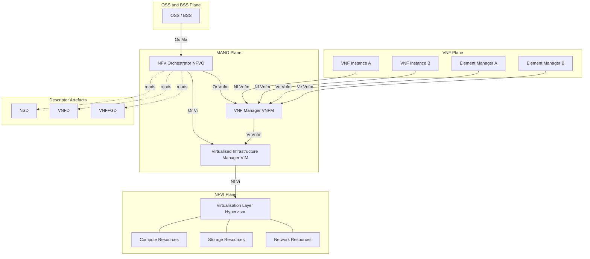
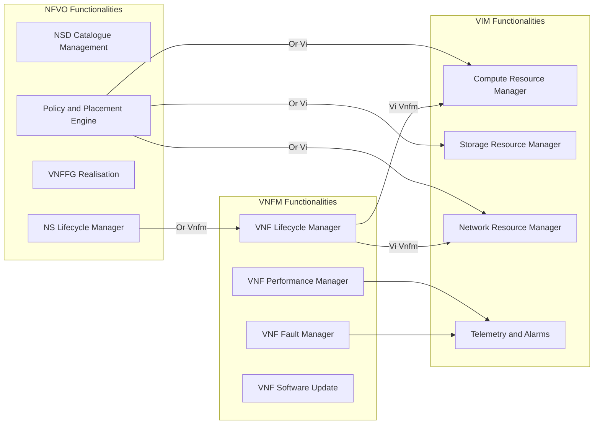
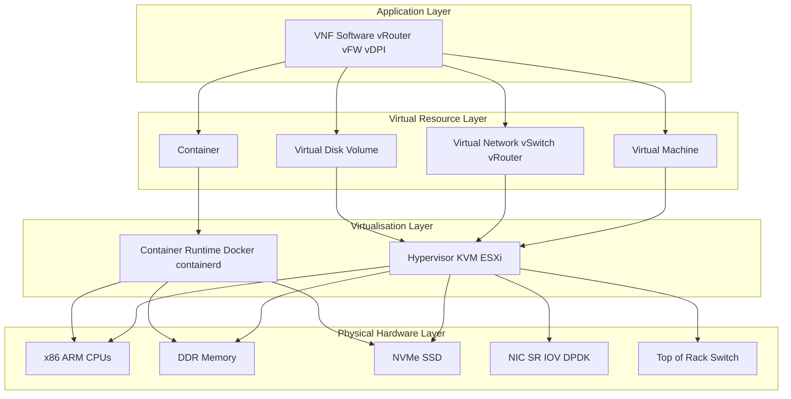
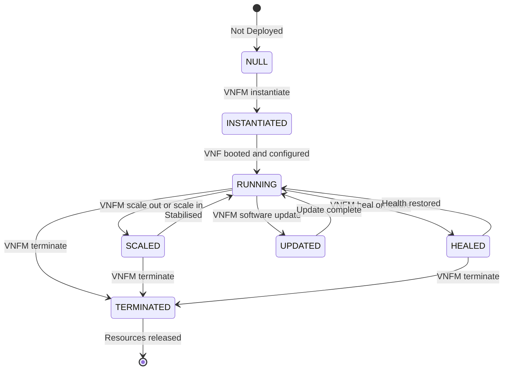

# NFV Infrastructure (NFVI) and Management (MANO)

<!-- SECTION_1_START -->
# NFV Infrastructure (NFVI) and Management (MANO)

> [!IMPORTANT]
> **KTU 2024 Scheme – PECST751 Advanced Computer Networks**
> **Module 3 – SDN Architecture and Components**
> This module maps to **CO2** of the syllabus and is a high-yield topic in Part B questions (14 marks) of the KTU End Semester Examination.

## 1.1 Formal Definition (ETSI Standard Terminology)

**Network Functions Virtualisation (NFV)** is a network architecture concept proposed by the **European Telecommunications Standards Institute (ETSI)** in **2012** that proposes using **IT virtualisation technologies to virtualise entire classes of network node functions into building blocks** that may be connected, or chained, to create communication services.

A **Virtual Network Function (VNF)** is a software implementation of a network function (e.g., router, firewall, load balancer) that runs over the NFVI.

> [!NOTE]
> **ETSI GS NFV 002 – Architectural Framework** defines three primary domains:
> 1. **Virtualised Network Function (VNF)**
> 2. **NFV Infrastructure (NFVI)**
> 3. **NFV Management and Orchestration (NFV-MANO)**

### 1.1.1 NFV Infrastructure (NFVI)

The **NFV Infrastructure (NFVI)** is the totality of all hardware and software components that build the environment in which VNFs are deployed, managed, and executed. It can be viewed as the union of:

- **Compute hardware** – physical servers (x86, ARM) with CPUs, RAM, and accelerators (FPGA, GPU, SmartNIC).
- **Storage hardware** – HDDs, SSDs, NVMe, SAN/NAS arrays.
- **Network hardware** – switches, routers, NICs, optical transponders, fabrics.
- **Virtualisation Layer (Hypervisor / Container Engine)** – abstracts physical resources and exposes them as virtual resources to VNFs.
- **Virtualised Compute / Storage / Network resources** – VMs, virtual disks, virtual links.

> [!NOTE]
> **Official ETSI Definition (NGFV 002):** *"The NFVI is the set of hardware and software resources which, through virtualisation, provide the platform upon which VNFs are deployed and managed."*

### 1.1.2 NFV Management and Orchestration (NFV-MANO)

The **NFV-MANO architectural framework** provides the means to orchestrate, manage, and maintain the virtualised infrastructure and the lifecycle of VNFs. It consists of three functional blocks:

- **NFV Orchestrator (NFVO)** – oversees the lifecycle of **Network Services (NS)** that span multiple VNFs.
- **VNF Manager (VNFM)** – manages the lifecycle of individual **VNF instances** (instantiation, scaling, healing, termination, update).
- **Virtualised Infrastructure Manager (VIM)** – controls and manages the **NFVI compute, storage, and network resources**.

> [!IMPORTANT]
> The **Service, VNF & Infrastructure Description** artefacts (NSD, VNFD, VNFFGD) act as the *declarative templates* that MANO consumes to deploy services.

---

## 1.2 Conceptual Analogy / Intuition

Imagine a **large modern shopping mall** as a telecommunications network:

| Real-World Analogy | NFV Mapping |
|---|---|
| The **physical building** (land, pillars, electricity, water, lifts) | **NFVI** (compute, storage, network hardware + virtualisation layer) |
| **Shops** inside the mall (clothes shop, food court, cinema) | **VNFs** (router, firewall, DPI, EPC) |
| The **mall management office** that allocates shop space, maintains electricity, signs lease contracts | **NFV-MANO** (NFVO + VNFM + VIM) |
| The **mall directory and rent agreement** | **Descriptors (NSD, VNFD)** |
| The **entire mall experience** (shopping + dining + entertainment together) | **Network Service (NS)** |

So, just as the mall management must coordinate power, plumbing, and space before a shop can open, **NFV-MANO must orchestrate virtual compute, storage, and network resources before a VNF can be instantiated** on the NFVI.

> [!TIP]
> **NFV vs. SDN – A Common Confusion:**
> - **SDN** separates the **control plane** from the **data plane** and centralises control.
> - **NFV** virtualises the **network functions themselves** (the appliances) off proprietary hardware.
> - They are **complementary**, not competing. ETSI architecture explicitly shows SDN controllers inside the VIM/NFVI as a possible implementation of virtual networking.

---

## 1.3 Standard Physical Constants / Metrics to Remember

> [!IMPORTANT]
> **Key ETSI-mandated metrics (remember for KTU viva & exams):**
> - **Availability target** of NFVI: typically **99.999%** ("five nines") for telco-grade deployments.
> - **Latency budget** for VNF placement: usually **< 5 ms intra-DC** and **< 20 ms inter-DC**.
> - **Failure domain isolation**: VNFs must be placed in **different availability zones** to survive rack-level failures.

> [!VISUALIZATION CONTROL]
> **Concept:** NFV Three-Domain View
> **Coordinate Plane Mapping:**
> * `x-axis` = Time (s) 0 to T (Lifecycle: Instantiate → Scale → Terminate)
> * `y-axis` = Resource utilisation (%) 0 to 100
> **Visualisation Description:** Imagine three parallel horizontal lanes stacked vertically: the bottom lane (VNF) shows sinusoidal CPU usage oscillating as traffic varies; the middle lane (MANO) shows management events as discrete spikes aligned with VNF scaling events; the top lane (OSS/BSS) shows business-level triggers (e.g., SLA breach) feeding into the MANO lane.

---
<!-- SECTION_1_END -->

<!-- SECTION_2_START -->
# Deep Theoretical Analysis & KTU High-Yield Formula Sheet

## 2.1 The ETSI NFV Reference Architecture (Functional Blocks)

The **ETSI GS NFV 002** architecture defines **nine functional blocks** organised in three planes:

### 2.1.1 Three Architectural Planes

| Plane | Purpose | Functional Blocks |
|---|---|---|
| **VNF Plane** | Hosts the virtualised network functions | VNF, Element Manager (EM) |
| **NFVI Plane** | Provides virtualised resources | NFVI (compute + storage + network + virtualisation layer) |
| **MANO Plane** | Manages & orchestrates everything | NFVO, VNFM, VIM, plus Service/VNF/Infrastructure Descriptors |

### 2.1.2 The Nine Functional Blocks

1. **VNF (Virtualised Network Function):** Software-only implementation of a network function. Example: vRouter, vFW, vDPI.
2. **EM (Element Manager):** Manages a single VNF's FCAPS (Fault, Configuration, Accounting, Performance, Security). Per-VNF.
3. **NFVI:** Hardware + virtualisation layer providing resources to VNFs.
4. **VIM (Virtualised Infrastructure Manager):** Manages NFVI resources within one operator's domain. Examples: **OpenStack**, **VMware vCloud Director**, **Kubernetes (for CNFs)**.
5. **VNFM (VNF Manager):** Manages VNF lifecycle. One per VNF or per VNF type. Examples: **ONAP VNFM**, **OpenBaton**, **Cloudify**.
6. **NFVO (NFV Orchestrator):** Cross-domain orchestration of Network Services composed of multiple VNFs. Examples: **ONAP SO (Service Orchestrator)**, **OSM (Open Source MANO)**, **Tacker**.
7. **OSS/BSS (Operations & Business Support Systems):** Legacy operator systems for service fulfilment, assurance, billing.
8. **Service, VNF & Infrastructure Descriptors:** Deployment templates in declarative format (e.g., **TOSCA**, **YAML**, **Heat Orchestration Templates (HOT)**).
9. **SDN Controller (optional):** Provides connectivity between VNFs by controlling the virtual / physical switches.

---

## 2.2 NFVI – Detailed Internal Architecture

The NFVI is decomposed into:

```
NFVI  =  Compute Domain  ∪  Storage Domain  ∪  Network Domain  ∪  Virtualisation Layer
```

### 2.2.1 Compute Domain
- **Physical servers** with x86_64 CPUs, NUMA architecture.
- **Hardware accelerators:** SR-IOV-enabled NICs, DPDK-accelerated poll-mode drivers, GPUs, FPGAs.
- **Logical abstraction:** Pool of **virtual CPUs (vCPUs)** with dedicated or shared pinning.

### 2.2.2 Storage Domain
- **Block storage** (Cinder volumes in OpenStack) attached to VMs.
- **Object storage** (S3-compatible) for VNF images.
- **File storage** (NFS, CephFS) for shared state.

### 2.2.3 Network Domain
- **Underlay network:** Physical switches, routers, optical transport.
- **Overlay networks:** VXLAN, GRE, Geneve tunnels to connect VMs across hosts.
- **Logical abstraction:** Virtual links, subnets, routers, Floating IPs, Security Groups.

### 2.2.4 Virtualisation Layer
- **Type-1 Hypervisors:** KVM, VMware ESXi, Xen, Hyper-V.
- **Type-2 Hypervisors:** VirtualBox (not used in production).
- **Container Runtimes:** Docker, containerd, runC.
- **NFV Hypervisor Requirements (per ETSI):** SR-IOV, NUMA awareness, CPU pinning, large page support, low-latency switching (DPDK, eBPF).

---

## 2.3 MANO – Detailed Internal Architecture

### 2.3.1 NFVO (NFV Orchestrator)

**Responsibilities:**
- **Network Service (NS) lifecycle management** – orchestration of multiple VNFs forming one service.
- **Resource orchestration** – interacts with multiple VIMs to allocate resources.
- **Topology management** – builds VNF Forwarding Graphs (VNFFG) and connects VNFs.
- **Policy management** – applies placement policies, affinity/anti-affinity rules.
- **VNF Package validation** – validates VNFD and NS catalogue entries.

### 2.3.2 VNFM (VNF Manager)

**Responsibilities:**
- **VNF instantiation** – creates VM/containers, attaches storage and network.
- **VNF scaling** – horizontally (add/remove instances) and vertically (resize vCPU/RAM).
- **VNF healing** – restart failed VMs, re-instantiate on healthy hosts.
- **VNF update / upgrade** – in-service software upgrade (ISSU).
- **VNF termination** – graceful shutdown and resource release.
- **VNF performance management** – collects VNF-specific metrics.

### 2.3.3 VIM (Virtualised Infrastructure Manager)

**Responsibilities:**
- **Inventory management** of compute, storage, network resources.
- **VM lifecycle** (allocate, migrate, destroy).
- **Resource quota & capacity planning**.
- **Network topology management** – virtual networks, subnets, routers, security groups.
- **Telemetry** – resource utilisation metrics, alarms.

> [!TIP]
> **One-liner mnemonics for KTU viva:**
> - **NFVO** = *"What services should run?"* (Service-level)
> - **VNFM** = *"Are the VNFs healthy?"* (VNF-level)
> - **VIM** = *"Do I have the physical capacity?"* (Resource-level)

---

## 2.4 ETSI Reference Points (Interfaces)

Reference points (interfaces) are the standardised contracts between MANO blocks:

| Reference Point | Between | Purpose |
|---|---|---|
| **Or-Vi** | NFVO ↔ VIM | Resource orchestration requests |
| **Or-Vnfm** | NFVO ↔ VNFM | NS lifecycle & VNF lifecycle coordination |
| **Vi-Vnfm** | VIM ↔ VNFM | Resource allocation requests for VNFs |
| **Os-Ma** | OSS/BSS ↔ NFVO | Service lifecycle, policy, catalogue |
| **Ve-Vnfm** | EM ↔ VNFM | VNF configuration & fault management |
| **Nf-Vi** | VNF ↔ VIM | Resource usage queries |
| **Nf-Vnfm** | VNF ↔ VNFM | Lifecycle notifications |

---

## 2.5 KTU Formula Sheet / Cheat Sheet

> [!NOTE]
> **No physical equations apply to this topic**, but the following **architectural rules & ratios** are frequently tested.

| Concept | Formula / Rule | Unit / Constraint |
|---|---|---|
| **Number of VNFs in a service** | $N_{VNF} \ge 1$ | Integer |
| **Total virtual cores** allocated to a VNF | $C_{total} = \sum_{i=1}^{N} vCPU_i$ | vCPUs |
| **Overcommitment ratio** (cloud efficiency) | $R_{over} = \frac{C_{physical}}{C_{virtual}}$ | Dimensionless, typically $1.5$ – $2.0$ for production NFV |
| **High Availability (HA)** | $N_{VNF} \ge 2$ in different **Availability Zones (AZ)** | $AZ \ge 2$ |
| **Service instantiation time SLA** | $T_{inst} \le 90$ s | Seconds (ETSI NFV ISG benchmark) |
| **VNF scaling time SLA** | $T_{scale} \le 30$ s | Seconds |
| **MTBF target for NFVI** | $MTBF \ge 10^5$ hours | Hours |
| **Mean Time To Repair (MTTR)** | $MTTR \le 1$ hour | Hour |
| **Availability formula** | $A = \frac{MTBF}{MTBF + MTTR}$ | Dimensionless, target $\ge 0.99999$ |
| **Forwarding Graph hop count** | $H \le N_{VNF}$ | Integer |

> [!WARNING]
> **CRITICAL:** Always write $\vert$ as `\vert` and $\le$ as `\le` in markdown tables to avoid breaking table syntax. In prose, use $\le$ freely.

---

## 2.6 Real-World Engineering Use Cases

| Domain | Use Case | MANO Role |
|---|---|---|
| **5G Core (5GC)** | Deploying AMF, SMF, UPF as VNFs/CNFs | OSM / ONAP orchestrates SBA functions |
| **Telco Cloud** | Virtualised Evolved Packet Core (vEPC) | OpenStack VIM + ONAP NFVO |
| **Enterprise SD-WAN** | vCPE with vRouter, vFW at branch | VNFM manages vCPE lifecycle |
| **Cable MSO** | Virtualised CMTS | ETSI MANO with Kubernetes VIM |
| **Edge Computing (MEC)** | VNFs at cell tower base stations | Lightweight MANO stacks (KubeVirt) |

---
<!-- SECTION_2_END -->

<!-- SECTION_3_START -->
# Step-by-Step Derivations & Symbolic Implementation

## 3.1 Step-by-Step Derivation of the NFV Service Deployment Workflow

When an operator wants to roll out a new Network Service (say, a **virtual firewall + virtual load balancer** for an enterprise customer), the **end-to-end workflow** executed by MANO is:

### Step 1 – Service Request Arrives
The operator's **OSS/BSS** receives a service order from the customer and passes it to the **NFVO** via the **Os-Ma** reference point.

### Step 2 – Catalogue Lookup
The **NFVO** looks up the corresponding **Network Service Descriptor (NSD)** in its catalogue. The NSD references:
- One or more **VNFDs** (one per VNF type).
- A **VNFFGD** (VNF Forwarding Graph Descriptor) defining how VNFs are stitched.
- A **NSD** itself defines the topology.

### Step 3 – Resource Feasibility Check
The **NFVO** queries one or more **VIMs** (via **Or-Vi**) to ask:
> *"Can you provide 4 vCPUs, 8 GB RAM, 100 GB storage, and 2 NICs in two availability zones?"*

The VIM responds with a **resource availability report**.

### Step 4 – VNF Instantiation Delegation
The **NFVO** instructs the **VNFM** (via **Or-Vnfm**) to instantiate each VNF defined in the NSD. The VNFM, in turn, requests the **VIM** (via **Vi-Vnfm**) to allocate VMs/containers.

### Step 5 – VM Provisioning by VIM
The **VIM** schedules VMs on physical hosts, attaches volumes, plumbs virtual networks (often via an **SDN controller**), and returns IP addresses to the VNFM.

### Step 6 – VNF Software Configuration
The **VNFM** boots the VMs and passes **day-0 configuration** (management IP, hostname, bootstrap script) to the VNF. The **EM** (Element Manager) takes over day-1/day-2 configuration.

### Step 7 – Forwarding Graph Realisation
The **NFVO** programs the virtual links between VNFs (firewall → load balancer) via the **SDN controller** inside the VIM domain. The result is a live **Network Service**.

### Step 8 – Assurance Loop
The **VNFM** continuously monitors VNF health; the **VIM** monitors resource health; the **NFVO** monitors end-to-end SLA. On SLA breach, the NFVO triggers a **scale-out** or **heal** action.

### Step 9 – Termination
On service expiry, the NFVO sends a **terminate** command down the chain, the VNFM gracefully shuts down the VNFs, and the VIM releases resources back to the pool.

---

## 3.2 Symbolic Algorithm – VNF Instantiation (Python Pseudocode)

```python
from dataclasses import dataclass, field
from typing import List, Dict, Optional
from enum import Enum
import logging

logging.basicConfig(level=logging.INFO, format="%(asctime)s | %(levelname)s | %(message)s")
logger = logging.getLogger("MANO")


class VNFState(Enum):
    """Lifecycle states of a VNF as per ETSI GS NFV-IFA 011."""
    NULL = "NULL"
    INSTANTIATED = "INSTANTIATED"
    RUNNING = "RUNNING"
    SCALED = "SCALED"
    HEALED = "HEALED"
    TERMINATED = "TERMINATED"


@dataclass
class VNFDescriptor:
    """VNF Descriptor (VNFD) - declarative template."""
    vnf_id: str
    vnf_type: str
    vcpu: int
    ram_gb: int
    storage_gb: int
    image_url: str
    flavour: str  # e.g. "small", "medium", "large"
    affinity_zones: List[str] = field(default_factory=list)


@dataclass
class VIMResource:
    """Resource offered by a Virtualised Infrastructure Manager."""
    available_vcpu: int
    available_ram_gb: int
    available_storage_gb: int
    availability_zones: List[str]


class VIM:
    """Virtualised Infrastructure Manager - abstract base class."""

    def __init__(self, name: str, capacity: VIMResource):
        self.name = name
        self.capacity = capacity
        self.allocated: Dict[str, Dict] = {}

    def allocate(self, tenant: str, vnfd: VNFDescriptor) -> Optional[Dict]:
        """Allocate resources for a VNF; checks availability first."""
        if (self.capacity.available_vcpu >= vnfd.vcpu and
            self.capacity.available_ram_gb >= vnfd.ram_gb and
            self.capacity.available_storage_gb >= vnfd.storage_gb):

            if not any(az in self.capacity.availability_zones for az in vnfd.affinity_zones):
                logger.error(f"VIM {self.name}: No matching AZ for affinity {vnfd.affinity_zones}")
                return None

            self.capacity.available_vcpu -= vnfd.vcpu
            self.capacity.available_ram_gb -= vnfd.ram_gb
            self.capacity.available_storage_gb -= vnfd.storage_gb

            allocation = {
                "vnf_id": vnfd.vnf_id,
                "vnf_type": vnfd.vnf_type,
                "vcpu": vnfd.vcpu,
                "ram_gb": vnfd.ram_gb,
                "storage_gb": vnfd.storage_gb,
                "mgmt_ip": f"10.0.0.{hash(vnfd.vnf_id) % 254 + 1}",
                "state": VNFState.INSTANTIATED
            }
            self.allocated[vnfd.vnf_id] = allocation
            logger.info(f"VIM {self.name}: Allocated resources for VNF {vnfd.vnf_id}")
            return allocation
        else:
            logger.error(f"VIM {self.name}: Insufficient resources for VNF {vnfd.vnf_id}")
            return None

    def release(self, vnf_id: str) -> bool:
        if vnf_id in self.allocated:
            alloc = self.allocated.pop(vnf_id)
            self.capacity.available_vcpu += alloc["vcpu"]
            self.capacity.available_ram_gb += alloc["ram_gb"]
            self.capacity.available_storage_gb += alloc["storage_gb"]
            logger.info(f"VIM {self.name}: Released VNF {vnf_id}")
            return True
        return False


class VNFM:
    """VNF Manager - manages lifecycle of a single VNF instance."""

    def __init__(self, vim: VIM):
        self.vim = vim
        self.managed_vnfs: Dict[str, VNFState] = {}

    def instantiate(self, vnfd: VNFDescriptor) -> bool:
        logger.info(f"VNFM: Requesting VIM {self.vim.name} to instantiate {vnfd.vnf_id}")
        allocation = self.vim.allocate(tenant="operator", vnfd=vnfd)
        if allocation:
            self.managed_vnfs[vnfd.vnf_id] = VNFState.RUNNING
            logger.info(f"VNFM: VNF {vnfd.vnf_id} is now RUNNING")
            return True
        return False

    def scale_out(self, vnf_id: str, additional_vcpu: int) -> bool:
        if vnf_id not in self.managed_vnfs:
            logger.error(f"VNFM: VNF {vnf_id} not managed")
            return False
        # Production would request new VM; here we just update state
        self.managed_vnfs[vnf_id] = VNFState.SCALED
        logger.info(f"VNFM: VNF {vnf_id} scaled out by {additional_vcpu} vCPUs")
        return True

    def heal(self, vnf_id: str) -> bool:
        if vnf_id not in self.managed_vnfs:
            return False
        self.managed_vnfs[vnf_id] = VNFState.HEALED
        logger.info(f"VNFM: VNF {vnf_id} healed successfully")
        return True

    def terminate(self, vnf_id: str) -> bool:
        if vnf_id in self.managed_vnfs:
            self.vim.release(vnf_id)
            self.managed_vnfs[vnf_id] = VNFState.TERMINATED
            logger.info(f"VNFM: VNF {vnf_id} terminated")
            return True
        return False


class NFVO:
    """NFV Orchestrator - manages multi-VNF Network Services."""

    def __init__(self, vnfms: List[VNFM]):
        self.vnfms = {vm.managed_vnfs if hasattr(vm, "managed_vnfs") else id(vm): vm for vm in vnfms}
        self.vnfms_list = vnfms
        self.deployed_services: Dict[str, List[str]] = {}

    def deploy_service(self, service_id: str, vnfds: List[VNFDescriptor]) -> bool:
        logger.info(f"NFVO: Deploying Network Service {service_id} with {len(vnfds)} VNFs")
        deployed_vnfs = []
        for vnfd in vnfds:
            vnfm = self._select_vnfm(vnfd)
            if vnfm.instantiate(vnfd):
                deployed_vnfs.append(vnfd.vnf_id)
            else:
                logger.error(f"NFVO: Rolling back due to failure on {vnfd.vnf_id}")
                for v in deployed_vnfs:
                    vnfm.terminate(v)
                return False
        self.deployed_services[service_id] = deployed_vnfs
        logger.info(f"NFVO: Service {service_id} is LIVE")
        return True

    def _select_vnfm(self, vnfd: VNFDescriptor) -> VNFM:
        # Round-robin selection; in production it is affinity-based
        return self.vnfms_list[hash(vnfd.vnf_type) % len(self.vnfms_list)]


# ---------- DEMO EXECUTION ----------
if __name__ == "__main__":
    # 1. Create a VIM with capacity
    vim = VIM("DC-Mumbai-1", VIMResource(available_vcpu=64,
                                          available_ram_gb=512,
                                          available_storage_gb=4096,
                                          availability_zones=["AZ1", "AZ2"]))

    # 2. Create a VNFM on top of the VIM
    vnfm = VNFM(vim)

    # 3. Create NFVO
    nfvo = NFVO(vnfms=[vnfm])

    # 4. Define VNF descriptors
    vfw = VNFDescriptor(vnf_id="vFW-01", vnf_type="firewall",
                        vcpu=4, ram_gb=8, storage_gb=40,
                        image_url="https://img.repo/vfw.qcow2",
                        flavour="medium", affinity_zones=["AZ1", "AZ2"])
    vlb = VNFDescriptor(vnf_id="vLB-01", vnf_type="loadbalancer",
                        vcpu=2, ram_gb=4, storage_gb=20,
                        image_url="https://img.repo/vlb.qcow2",
                        flavour="small", affinity_zones=["AZ1", "AZ2"])

    # 5. Deploy the service
    nfvo.deploy_service(service_id="NS-CustomerA", vnfds=[vfw, vlb])

    # 6. Scale out the firewall
    vnfm.scale_out("vFW-01", additional_vcpu=2)

    # 7. Terminate
    vnfm.terminate("vFW-01")
    vnfm.terminate("vLB-01")
```

> [!NOTE]
> **Code-to-Architecture Mapping:** The classes above directly mirror the ETSI blocks. `NFVO` → orchestrator, `VNFM` → VNF manager, `VIM` → infrastructure manager, `VNFDescriptor` → VNFD template. The lifecycle states follow **ETSI GS NFV-IFA 011**.

---

## 3.3 Step-by-Step Derivation – Total NFVI Capacity Calculation

Suppose a telco plans to deploy **$N$ identical VNFs** of the same type, each requiring $c_i$ vCPU, $r_i$ GB RAM, $s_i$ GB storage. The **total NFVI capacity** needed is:

$$
C_{cpu} = \sum_{i=1}^{N} c_i
$$

$$
C_{ram} = \sum_{i=1}^{N} r_i
$$

$$
C_{storage} = \sum_{i=1}^{N} s_i
$$

Accounting for the **overcommitment ratio** $R_{over}$, the actual physical hardware required is:

$$
P_{cpu} = \frac{C_{cpu}}{R_{over}}, \quad P_{ram} = C_{ram}, \quad P_{storage} = \frac{C_{storage}}{R_{over}}
$$

> [!NOTE]
> In NFV, RAM and storage are **not** typically over-committed (unlike general-purpose cloud) because of latency guarantees; only CPU is over-committed (e.g., $R_{over} = 1.5$).

**Numerical Example (KTU-style):**
A service requires 4 VNFs, each with 8 vCPUs, 16 GB RAM, 200 GB storage. $R_{over} = 2$ for CPU.

$$
C_{cpu} = 4 \times 8 = 32 \text{ vCPUs}
$$

$$
P_{cpu} = \frac{32}{2} = 16 \text{ physical cores}
$$

$$
C_{ram} = 4 \times 16 = 64 \text{ GB}
$$

$$
P_{storage} = \frac{4 \times 200}{2} = 400 \text{ GB physical}
$$

Result: **16 physical cores, 64 GB RAM, 400 GB storage** minimum NFVI requirement.

---

## 3.4 Reference Point Interaction Sequence (Symbolic)

Let $M$ = MANO request, $R$ = response. The deployment transaction is:

$$
M_{OSS} \xrightarrow{Os\text{-}Ma} NFVO
$$

$$
NFVO \xleftarrow{Or\text{-}Vi} VIM
$$

$$
NFVO \xrightarrow{Or\text{-}Vnfm} VNFM
$$

$$
VNFM \xrightarrow{Vi\text{-}Vnfm} VIM
$$

$$
VIM \xleftarrow{allocate()} VM
$$

$$
VNF \xleftarrow{boot()} VNFM
$$

$$
EM \xleftarrow{configure()} VNF
$$

The acronym chain **"O-M-N-V-V-E"** = **O**SS → (NFV)**O** → (VNF)**M** → (V)**I**M → **V**NF → **E**M is the **standard MANO deployment order** worth memorising.

---
<!-- SECTION_3_END -->

<!-- SECTION_4_START -->
# Structural Diagrams & Schematics

## 4.1 ETSI NFV Reference Architecture (Block Diagram)



> [!NOTE]
> **Reading Guide:** Solid arrows = runtime interfaces. Dotted arrows = template/descriptor reads. The three planes (VNF / NFVI / MANO) are clearly isolated using subgraphs, matching the ETSI architectural framework.

---

## 4.2 MANO Internal Architecture – Functional Block Topology



---

## 4.3 NFVI Layered Architecture



---

## 4.4 VNF Lifecycle State Machine



> [!NOTE]
> This state machine is the **ETSI GS NFV-IFA 011** canonical lifecycle. Examiners often ask students to draw it.

---
<!-- SECTION_4_END -->

<!-- SECTION_5_START -->
# KTU 2024 Scheme Examination Question Bank & Topic Recap

> [!WARNING]
> **KTU Valuation Pitfall #1:** Do **not** confuse **NFV-MANO** with **SDN controller**. MANO orchestrates VMs/containers and services; the SDN controller only manages packet forwarding in the data plane.

> [!WARNING]
> **KTU Valuation Pitfall #2:** When asked "List the MANO components", many students write only **NFVO** and **VIM**, forgetting **VNFM**. All three are mandatory.

---

## 5.1 Part A – 3 Mark Questions

### Q1. [KTU University Exam – July 2024] – CO2, Remember
**Define Network Functions Virtualisation (NFV) Infrastructure (NFVI). List its two main constituents.**

**Model Answer (3 Marks):**

NFV Infrastructure (NFVI) is the combination of hardware and software resources that, through virtualisation, provides the platform upon which Virtualised Network Functions (VNFs) are deployed, managed, and executed, as defined by **ETSI GS NFV 002**.

Its two main constituents are:

1. **Hardware resources** – physical compute (servers, CPUs, accelerators), storage (HDDs, SSDs, NAS/SAN), and network (switches, routers, NICs). **[1 Mark]**
2. **Virtualisation layer** – software such as hypervisors (KVM, ESXi) and container runtimes (Docker, Kubernetes) that abstracts the hardware and exposes virtualised resources to VNFs. **[1 Mark]**

A third supporting element is the **virtualised compute, storage, and network resources** themselves (VMs, virtual disks, virtual links) that are presented to the VNFs on top of the virtualisation layer. **[1 Mark]**

> [!IMPORTANT]
> **Valuation Key:** Mentioning **ETSI GS NFV 002** earns the definition mark. Separating **hardware** and **virtualisation layer** is mandatory.

---

### Q2. [KTU University Exam – Dec 2023] – CO2, Understand
**Differentiate between NFVO, VNFM, and VIM in the MANO architecture (any 3 points).**

**Model Answer (3 Marks – tabular form expected):**

| Aspect | NFVO (NFV Orchestrator) | VNFM (VNF Manager) | VIM (Virtualised Infrastructure Manager) |
|---|---|---|---|
| **Scope** | Network Service (NS) level – across multiple VNFs | Single VNF instance lifecycle | Physical / virtual resources |
| **Key Function** | NS instantiation, topology realisation, cross-VIM orchestration | Instantiate, scale, heal, update, terminate VNFs | Allocate compute, storage, network to VMs/containers |
| **Example Tool** | ONAP SO, OSM, Tacker | ONAP VNFM, Cloudify, OpenBaton | OpenStack, VMware vCD, Kubernetes |
| **Reference Point** | Or-Vi, Or-Vnfm, Os-Ma | Vi-Vnfm, Ve-Vnfm, Nf-Vnfm | Nf-Vi, Or-Vi, Vi-Vnfm |

**[1 Mark per correct row – up to 3 rows]**

> [!IMPORTANT]
> **Valuation Key:** Examiners expect a **table**. Mentioning at least one **reference point** and one **example tool** scores full marks.

---

## 5.2 Part B – 14 Mark Questions (Module Internal Choice)

### Question A (14 Marks) [KTU University Exam – July 2024]

#### (a) Explain the ETSI NFV reference architecture with a neat block diagram. List the functional blocks and reference points. (7 Marks) – CO2, Understand

**Model Answer (7 Marks):**

The **ETSI NFV reference architecture**, standardised in **ETSI GS NFV 002 v1.2.1**, decomposes an NFV system into three planes and nine functional blocks. The reference architecture is shown in the diagram below (reproduced from Section 4.1).

**Functional Blocks [4 Marks]:**

1. **VNF (Virtualised Network Function)** – software-only implementation of network functions such as routers, firewalls, DPI.
2. **EM (Element Manager)** – performs FCAPS management on a single VNF instance.
3. **NFVI (NFV Infrastructure)** – combination of compute, storage, network hardware and the virtualisation layer.
4. **VIM (Virtualised Infrastructure Manager)** – controls NFVI resources (e.g., OpenStack).
5. **VNFM (VNF Manager)** – handles VNF lifecycle (instantiation, scaling, healing, termination).
6. **NFVO (NFV Orchestrator)** – orchestrates multi-VNF Network Services and resource orchestration across VIMs.
7. **OSS/BSS** – operator's existing service fulfilment and assurance systems.
8. **Descriptors (NSD, VNFD, VNFFGD)** – declarative deployment templates.
9. **SDN Controller (optional)** – provides virtual connectivity between VNFs.

**Reference Points [2 Marks]:**

- **Os-Ma** – OSS/BSS ↔ NFVO
- **Or-Vnfm** – NFVO ↔ VNFM
- **Or-Vi** – NFVO ↔ VIM
- **Vi-Vnfm** – VIM ↔ VNFM
- **Ve-Vnfm** – EM ↔ VNFM
- **Nf-Vi** – VNF ↔ VIM
- **Nf-Vnfm** – VNF ↔ VNFM

**Architecture Planes [1 Mark]:**
The three planes are **VNF plane**, **NFVI plane**, and **MANO plane**, with the descriptors serving as the data models that drive deployment.

> [!IMPORTANT]
> **Valuation Key:**
> - Correct block diagram with planes: **[3 Marks]**
> - All 9 blocks listed: **[1 Mark]**
> - Reference points: **[2 Marks]**
> - Plane explanation: **[1 Mark]**

#### (b) With a step-by-step workflow, explain how a Network Service comprising two VNFs (a virtual firewall and a virtual load balancer) is deployed using MANO. (7 Marks) – CO2, Apply

**Model Answer (7 Marks):**

**Step 1 – Service Request from OSS/BSS [1 Mark]:**
The operator's BSS receives a customer order for "Firewall + Load Balancer service". It forwards the request to the **NFVO** through the **Os-Ma** reference point, providing parameters such as SLA, bandwidth, and customer ID.

**Step 2 – Catalogue Lookup by NFVO [1 Mark]:**
The **NFVO** consults its **NSD catalogue**, retrieves the matching **NSD**, which references the **VNFD for vFW** and **VNFD for vLB** along with the **VNFFGD** that specifies the forwarding order: `vFW → vLB`.

**Step 3 – Resource Feasibility via VIM [1 Mark]:**
The **NFVO** sends an **Or-Vi** request to the **VIM** asking for capacity: 4 vCPUs + 8 GB RAM + 50 GB storage for the vFW, and 2 vCPUs + 4 GB RAM + 20 GB storage for the vLB, in two availability zones for HA.

**Step 4 – VNFM Instantiation [1 Mark]:**
The **NFVO** calls the **VNFM** (via **Or-Vnfm**) with the vFW and vLB VNFDs. The **VNFM**, in turn, sends a **Vi-Vnfm** request to the VIM asking for VM creation with the specified flavour and image.

**Step 5 – VM Provisioning and Network Plumbing [1 Mark]:**
The **VIM** schedules VMs on physical hosts, downloads the VNF image from object storage, attaches volumes, and asks the **SDN controller** to set up virtual links (subnet, router, security groups). The VIM returns the management IP of each VM to the VNFM.

**Step 6 – VNF Configuration [1 Mark]:**
The **VNFM** powers on the VMs, injects day-0 configuration (management IP, SSH keys, bootstrap script). Once the VNFs are reachable, the **EM** takes over for day-1 and day-2 configuration (firewall rules, load-balancer pool).

**Step 7 – Forwarding Graph Activation and Assurance [1 Mark]:**
The **NFVO** realises the **VNFFG** by programming the SDN controller: traffic from the customer port → vFW → vLB → server pool. Telemetry flows from VIM (resource metrics) and VNFM (VNF metrics) to the NFVO for SLA monitoring. On breach, the NFVO triggers a **scale-out** or **heal** action.

> [!IMPORTANT]
> **Valuation Key:**
> - Workflow steps in correct sequence: **[5 Marks]**
> - Reference points mentioned: **[1 Mark]**
> - HA / SDN controller mention: **[1 Mark]**

> [!WARNING]
> **Common Mistake:** Students often omit the **descriptor look-up step** or confuse **Or-Vnfm** with **Vi-Vnfm**. Write the reference point explicitly next to every arrow in the diagram.

---

### Question B (14 Marks) – Alternative Choice

#### (a) Describe the NFV Infrastructure (NFVI) in detail. Explain the role of the virtualisation layer. (7 Marks) – CO2, Understand

**Model Answer (7 Marks):**

**Definition [1 Mark]:** The NFVI is the totality of **hardware resources** and the **virtualisation layer** that together expose virtualised compute, storage, and network resources to VNFs, as per **ETSI GS NFV 002**.

**Three Hardware Domains [3 Marks]:**

1. **Compute Domain** – x86_64 or ARM servers with multi-core CPUs, NUMA topology, hardware accelerators (SR-IOV NICs, GPUs, FPGAs, DPDK-enabled poll-mode drivers) used to bypass the kernel and achieve line-rate packet processing. Example: Intel Xeon Scalable with SR-IOV passthrough.
2. **Storage Domain** – Local NVMe SSDs, SAN arrays, or distributed storage (Ceph). Three storage classes are exposed: **block** (Cinder volumes), **object** (S3-compatible), and **file** (NFS, CephFS). VNF images and tenant data are stored here.
3. **Network Domain** – physical switches (ToR, leaf-spine fabric), NICs, and optical interconnect. Provides the underlay that carries overlay tunnels (VXLAN, Geneve) between VMs on different hosts.

**Virtualisation Layer [2 Marks]:**
The virtualisation layer is the **abstraction software** sitting between the hardware and the VNFs. It includes:

- **Hypervisors** (KVM, VMware ESXi, Xen) that create VMs by multiplexing physical CPUs, memory, and I/O.
- **Container runtimes** (Docker, containerd, runC) that provide OS-level virtualisation for **Cloud-Native Network Functions (CNFs)**.
- **vSwitches / OVS** that create virtual networks and enforce isolation.

Its **role** is to:
- Decouple VNFs from physical hardware.
- Enable **multi-tenancy** and **dynamic resource allocation**.
- Provide **lifecycle hooks** for the VIM to provision, migrate, and tear down VMs.
- Expose **telemetry** (CPU, memory, network I/O) to the VIM.

**Inter-Domain Stitching [1 Mark]:**
The three domains are connected via a **unified virtualisation fabric**. Compute, storage, and network resources are pooled and allocated to VNFs on demand by the VIM, ensuring that the failure of one physical component does not bring down a service (achieved through anti-affinity placement across **availability zones**).

> [!IMPORTANT]
> **Valuation Key:**
> - All three domains explained: **[3 Marks]**
> - Virtualisation layer role: **[2 Marks]**
> - Examples (KVM, ESXi, OVS, DPDK): **[1 Mark]**
> - Stitching / HA: **[1 Mark]**

#### (b) Explain the VNF lifecycle as defined by ETSI. Illustrate with a state diagram and describe the role of VNFM in each state. (7 Marks) – CO2, Apply

**Model Answer (7 Marks):**

**VNF Lifecycle States (ETSI GS NFV-IFA 011) [3 Marks]:**
The canonical VNF lifecycle includes the following states:

1. **NULL** – VNF descriptor exists but no instance is created.
2. **INSTANTIATED** – VNFM has allocated resources and created VM(s).
3. **RUNNING** – VNF software booted, configured, and serving traffic.
4. **SCALED** – VNFM has added/removed VM instances to match load.
5. **HEALED** – VNFM has restarted/replaced a failed VM.
6. **UPDATED** – VNFM has performed an in-service software upgrade.
7. **TERMINATED** – VNFM has shut down VMs and released resources to the VIM.

**State Diagram (reproduced from Section 4.4) [1 Mark]:**
The state diagram shows transitions:
`NULL → INSTANTIATED → RUNNING ⇄ SCALED / HEALED / UPDATED → TERMINATED`.

**Role of VNFM in Each State [3 Marks]:**

| State | VNFM Action |
|---|---|
| **NULL → INSTANTIATED** | Reads VNFD, requests VIM via **Vi-Vnfm** to allocate compute, storage, network. |
| **INSTANTIATED → RUNNING** | Powers on VM, injects day-0 config, monitors boot completion. |
| **RUNNING → SCALED** | Decides scale-out or scale-in based on PM thresholds; requests new VMs from VIM. |
| **RUNNING → HEALED** | Detects VM failure via VIM alarms; re-instantiates on a healthy host; restores state. |
| **RUNNING → UPDATED** | Performs ISSU using blue-green or canary strategy; old VNF is drained and terminated. |
| **Any → TERMINATED** | Gracefully drains traffic, stops VM, requests VIM to release resources. |

> [!IMPORTANT]
> **Valuation Key:**
> - State diagram: **[1 Mark]**
> - All states listed: **[1 Mark]**
> - VNFM action per state: **[2 Marks]**
> - Day-0/1/2 distinction: **[1 Mark]**
> - Reference to ETSI GS NFV-IFA 011: **[1 Mark]**
> - HA / scale-out strategy: **[1 Mark]**

> [!WARNING]
> **Common Mistake:** Drawing a **linear** state machine instead of one with **loops** (SCALED ↔ RUNNING, HEALED ↔ RUNNING) loses **1 Mark**.

---

## 5.3 Topic Recap & Important Things to Remember

- **NFV** = virtualising network functions; **SDN** = separating control from data plane. They are **complementary**.
- **NFVI** = hardware + virtualisation layer. Its three domains are **compute, storage, network**.
- **MANO** has three blocks: **NFVO** (service level), **VNFM** (VNF level), **VIM** (resource level).
- **ETSI GS NFV 002** = architectural framework. **ETSI GS NFV-IFA 011** = VNF lifecycle. **ETSI GS NFV-IFA 005** = descriptors.
- **Reference points (must-memorise):** **Os-Ma, Or-Vi, Or-Vnfm, Vi-Vnfm, Ve-Vnfm, Nf-Vi, Nf-Vnfm**.
- **Descriptors:** **NSD** (Network Service), **VNFD** (VNF), **VNFFGD** (Forwarding Graph).
- **VNF lifecycle states:** **NULL → INSTANTIATED → RUNNING ⇄ SCALED / HEALED / UPDATED → TERMINATED**.
- **Real-world MANO stacks:** **ONAP** (Linux Foundation), **OSM** (ETSI OSM), **Tacker** (OpenStack).
- **Real-world VIMs:** **OpenStack** (most common), **VMware vCloud Director**, **Kubernetes** (for CNFs).
- **HA rule:** Always deploy VNFs in **$\ge 2$ availability zones**.
- **SLA targets:** Instantiation $\le 90$ s, scaling $\le 30$ s, availability $\ge 99.999\%$.
- **Overcommitment ratio:** $R_{over} = \frac{C_{physical}}{C_{virtual}}$, typically **$1.5$–$2.0$** for CPU, **$1.0$** for RAM and storage.
- **Availability formula:** $A = \frac{MTBF}{MTBF + MTTR}$, target $\ge 0.99999$.
- **Code-level mapping:** In Python, **NFVO** = orchestrator class, **VNFM** = lifecycle class, **VIM** = resource class, **VNFDescriptor** = VNFD dataclass.
- **Common KTU viva questions:**
  1. *Differentiate VIM, VNFM, NFVO.*
  2. *Draw the ETSI NFV architecture.*
  3. *What is the role of the VNFFGD?*
  4. *How is SDN complementary to NFV?*
  5. *State the VNF lifecycle states.*
- **For 14-mark answers:** Always include a **block diagram**, mention **reference points**, and cite the **ETSI standard number**.
- **For 3-mark answers:** Use a **table** wherever possible – it scores faster.

> [!IMPORTANT]
> **Final Tip:** The most-asked concept in KTU Module 3 is the **difference between MANO and SDN controller**. Memorise: **MANO manages what runs; SDN manages how packets flow.**

---
<!-- SECTION_5_END -->
