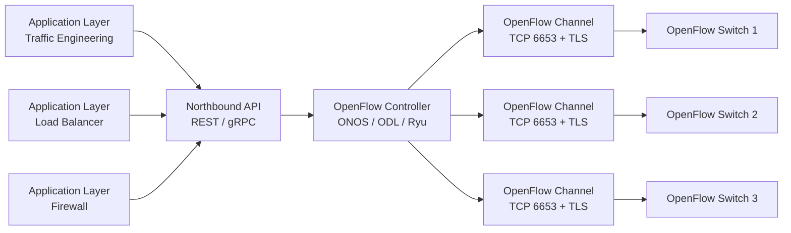
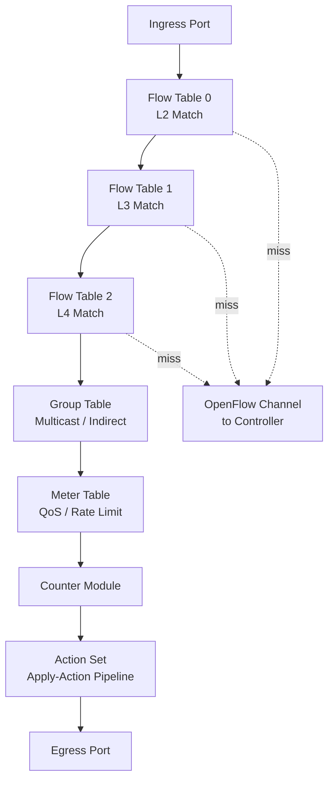
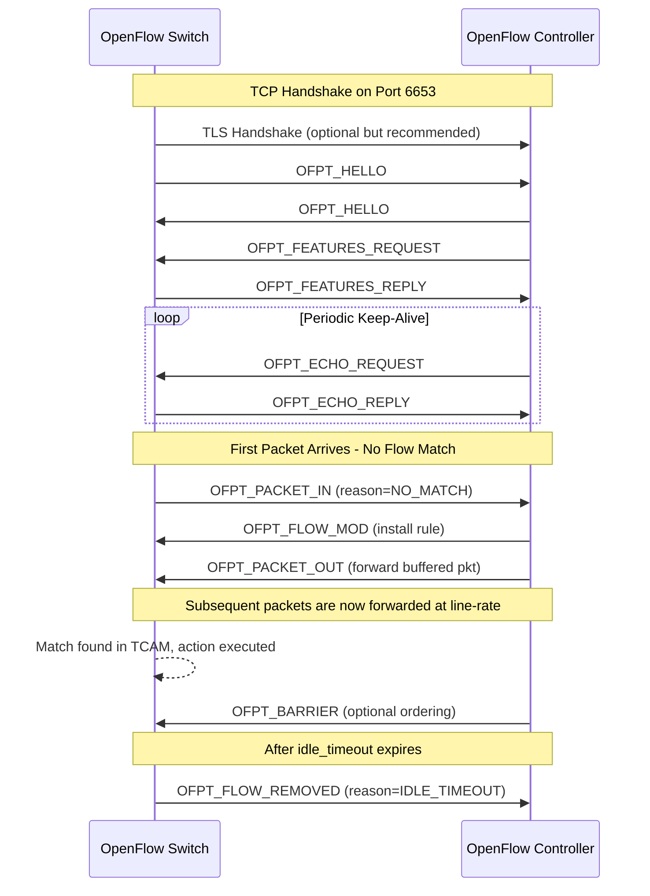
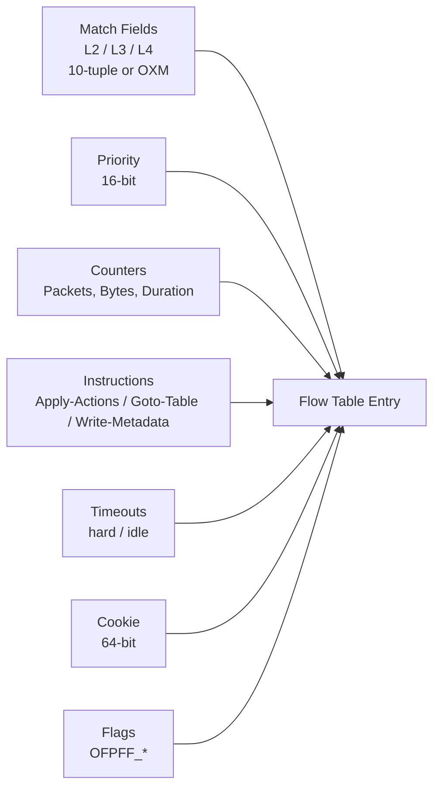
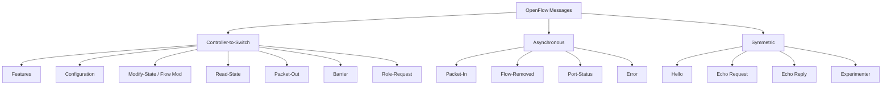

# OpenFlow Protocol and its Role in SDN

<!-- SECTION_1_START -->
# OpenFlow Protocol and its Role in SDN

## 1.1 Formal Academic Definition

**OpenFlow** is the first standardized communications interface defined between the control and forwarding layers of an Software-Defined Networking (SDN) architecture. It enables network controllers to determine the path of network packets across a network of switches, routers, and access points by providing a programmable, vendor-neutral Application Programming Interface (API) to the data plane.

In the context of the **KTU 2024 Scheme (PECST751 – Advanced Computer Networks)**, OpenFlow is treated as the *de-facto* southbound API that decouples the **Control Plane** from the **Data Plane**, allowing a logically centralized SDN controller to manipulate the forwarding behavior of network elements (OpenFlow Switches) through a secure **OpenFlow Channel** using the **Transport Layer Security (TLS)** protocol over **TCP port 6653** (default for OpenFlow 1.3+).

> [!IMPORTANT]
> **Syllabus Highlight (PECST751 – Module 3):**
> OpenFlow is the foundational southbound protocol of SDN. It defines three logical entities: **OpenFlow Controller**, **OpenFlow Switch**, and the **OpenFlow Channel**. Mastery of the **Flow Table**, **Group Table**, and **Meter Table** is mandatory for KTU university examinations.

## 1.2 Conceptual Analogy / Intuition

Imagine a railway network:

- **The Trains** (packets) move along the **tracks** (physical links).
- The **Track Switches (Points)** at junctions decide which track a train enters — these are the **OpenFlow Switches**.
- A **Centralized Traffic Control Room** sits in a city far away, and an operator remotely flips the switches via **telegraph signals** — this is the **OpenFlow Controller + Channel**.

In legacy networks, every railway junction has its **own local brain** that decides routing (each router runs its own routing protocol — distributed control plane). In SDN with OpenFlow, all the "brains" are removed from the switches; they become "dumb" but extremely fast path-forwarders, while a **single remote control room** (the controller) tells them what to do with each train (packet).

> [!NOTE]
> **Key Insight:** OpenFlow does not forward packets. It *installs rules* that tell an OpenFlow switch how to forward packets. The switch executes the rules at wire-speed (typically in **TCAM – Ternary Content Addressable Memory**), while the controller decides the rules.

## 1.3 Standard Metrics and Constants

| Constant / Default | Value | Purpose |
|---|---|---|
| Default TCP Port | **6653** | IANA assigned port for OpenFlow (replaced 6633 in 1.3+) |
| Auxiliary Connection Port | **6654** | Parallel/backup TLS connection |
| OFP_VERSION | **0x06** (1.5) | Latest standardized version byte |
| Max Packet-In payload | **65535 bytes** | Default buffer for controller-bound packets |
| Hard timeout | **0 (persistent) – 65535 s** | Flow entry expiry policy |
| Idle timeout | **0 (permanent)** | Inactivity-based expiry |
| Flow mod Cookie | **64-bit** | Opaque metadata identifier |

## 1.4 Visualization Control (GeoGebra / Desmos)

> [!VISUALIZATION CONTROL]
> **Concept:** Ternary Match Field Representation in OpenFlow
> **GeoGebra / Desmos Input Equations:**
> * `f(x) = piecewise((x >= 0 ∧ x <= 1, "Exact Match"), ((x > 1 ∨ x < 0), "Wildcard (0..1)"))`
> * Bit position: $b = \{0, 1, x\}$ where $x$ represents "don't care" (wildcard)
> **Visual Description:** Plot the 3-state ternary match on a unit segment. Each bit in an OpenFlow match field has three possible values: exact `0`, exact `1`, or `x` (wildcard). Students should visualize how an incoming packet header is matched against the 10-tuple flow entry by comparing bit-by-bit.

<!-- SECTION_1_END -->

<!-- SECTION_2_START -->
# Deep Theoretical Analysis — OpenFlow Architecture & Theory

## 2.1 The OpenFlow Triad (Logical Architecture)

OpenFlow is structured around three well-defined logical components. Every KTU question stem will reference one of these.

### 2.1.1 OpenFlow Controller (Control Plane)
- A software process that runs the network intelligence.
- Examples: **OpenDaylight (ODL)**, **ONOS**, **Ryu**, **Floodlight**, **POX**.
- The controller maintains a global network view, runs routing algorithms, and pushes flow rules.

### 2.1.2 OpenFlow Switch (Data Plane)
An OpenFlow switch contains:
1. **One or more Flow Tables** (with match-action pipelines)
2. **A Group Table** (for multicast/indirect forwarding)
3. **A Meter Table** (for QoS rate-limiting)
4. **An OpenFlow Channel** to the controller
5. **A secure TLS / TCP socket** (port 6653)

### 2.1.3 OpenFlow Channel
- The interface that connects each OpenFlow switch to the controller.
- Carries **OpenFlow Protocol Messages** over **TLS (recommended)** or **TCP** (unsecured).

## 2.2 Flow Table — The Heart of OpenFlow

A **Flow Table Entry** contains the following fields. Memorize this for the 14-mark questions:

| Field | Width | Purpose |
|---|---|---|
| **Match Fields** | Variable (10-tuple) | Header fields used for matching (L2/L3/L4) |
| **Priority** | 16-bit | Higher priority entry wins on conflict |
| **Counters** | 64-bit each | Per-flow statistics (packet/byte counts) |
| **Instructions** | Variable | Actions to execute on match |
| **Timeouts** | 16-bit each | `idle_timeout`, `hard_timeout` |
| **Cookie** | 64-bit | Opaque controller-assigned identifier |
| **Flags** | 8-bit | e.g., `OFPFF_SEND_FLOW_REM` |

> [!NOTE]
> **Match Fields (10-tuple in OpenFlow 1.0, expanded in 1.3+):**
> * Ingress Port, Ethernet Source (src), Ethernet Destination (dst), EtherType, VLAN ID, VLAN Priority, IPv4 Source, IPv4 Destination, IP Protocol, IP DSCP, L4 Source Port (TCP/UDP), L4 Destination Port, ICMP type/code, MPLS label, MPLS TC.

## 2.3 Pipeline Processing Logic

When a packet arrives at an OpenFlow switch, the following sequence is executed:

1. Packet enters via an **ingress port**.
2. The packet header is parsed and matched against **Table 0** (starting table).
3. If matched, the packet **counters** are updated and **instructions** are executed.
4. Instructions may include: `Apply-Action`, `Clear-Action`, `Write-Metadata`, `Goto-Table(next)`.
5. If no match is found in any table, the packet is **dropped**, **passed to the next table**, or **sent to the controller** as a `packet-in` message (default = `OFPP_CONTROLLER` action).
6. **Table-miss flow entry** (priority 0, wildcard match) explicitly defines the miss behavior.

> [!IMPORTANT]
> **Pipeline Traversal Direction:** Forward (Ingress → Egress) is mandatory. Backward traversal is forbidden. Tables are numbered $0$ to $N-1$ (zero-indexed).

## 2.4 OpenFlow Message Taxonomy

OpenFlow defines **three major message classes**. This is a high-yield KTU area.

### 2.4.1 Controller-to-Switch Messages (Initiated by Controller)

| Message | Purpose |
|---|---|
| `Features` | Request switch capabilities |
| `Configuration` | Set/Get configuration parameters |
| `Modify-State` | Add/Modify/Delete flow entries (Flow Mod) |
| `Read-State` | Collect statistics (counters) |
| `Packet-Out` | Send a packet out of a specified port |
| `Barrier` | Ensure message ordering / synchronization |
| `Role-Request` | Set controller role (Master/Slave/Equal) |

### 2.4.2 Asynchronous Messages (Initiated by Switch)

| Message | Trigger |
|---|---|
| `Packet-In` | No matching flow entry → ask controller |
| `Flow-Removed` | Flow entry expired (idle/hard timeout) |
| `Port-Status` | Physical port up/down/changed |
| `Error` | Protocol violation / unsupported action |

### 2.4.3 Symmetric Messages (Either side can initiate)

| Message | Purpose |
|---|---|
| `Hello` | Handshake at connection setup |
| `Echo Request/Reply` | Keep-alive and latency measurement |
| `Vendor` | Experimental extensions |
| `Experimenter` | Reserved for research |

## 2.5 KTU Formula Sheet / Cheat Sheet

> [!NOTE]
> **Master these equations — they appear in numerical and KTU 14-mark derivations.**

| # | Formula / Concept | Expression | Use Case |
|---|---|---|---|
| 1 | Pipeline match resolution | $R = \max_{i} \{ \text{priority}(i) \cdot M(p, \text{entry}_i) \}$ | Selects winning flow entry |
| 2 | Wildcard match | $b \in \{0, 1, x\}$ | TCAM representation |
| 3 | Token Bucket (Meter) | $T(t) = \min(C, T(t-\Delta t) + r \cdot \Delta t)$ | QoS rate limiting |
| 4 | Hard Timeout | $t_{exp} = t_{install} + t_{hard}$ | Flow entry expiry |
| 5 | Idle Timeout | $t_{exp} = t_{last\_match} + t_{idle}$ | Inactivity expiry |
| 6 | Total flow table memory | $M = N_{entries} \times (S_{match} + S_{action} + S_{counters})$ | Switch TCAM sizing |
| 7 | Echo round-trip latency | $L = (t_{echo\_reply} - t_{echo\_req}) / 2$ | Channel health |
| 8 | OFP version byte | $v = 0x01$ for 1.0, $0x04$ for 1.3, $0x06$ for 1.5 | Protocol version |
| 9 | Default IANA port | $p_{OFP} = 6653$ | Channel TCP port |
| 10 | Pipeline stage | $S_i \rightarrow S_{i+1} \mid S_{i+1} \rightarrow \dots \rightarrow S_{N-1}$ | Goto-Table semantics |

> All real-world engineering applications (e.g., Google's **B4 WAN**, Microsoft's **SWAN**, AT&T's **Domain 2.0**) use variants of OpenFlow or P4-derived southbound APIs.

## 2.6 OpenFlow Versions — Evolution

| Version | Year | Key Addition |
|---|---|---|
| 1.0 | 2009 | Single flow table, 10-tuple match |
| 1.1 | 2011 | Multiple flow tables, Group table, MPLS |
| 1.2 | 2011 | Extensible match (OXM), IPv6 support |
| 1.3 | 2012 | Meter table, more counters, `OFPT_TABLE_MOD` |
| 1.4 | 2013 | Bundle, Optical ports, multiple controllers |
| 1.5 | 2014 | Egress tables, symmetric rate-limiting |
| 1.6 | 2024 | Final minor updates (OFP 0x06) |

<!-- SECTION_2_END -->

<!-- SECTION_3_START -->
# Step-by-Step Derivations and Code Implementation

## 3.1 Derivation: Match Resolution Algorithm

**Problem (KTU 14-Mark Style):** A switch has 3 flow entries in Table 0:

| Entry | Priority | Match (Dst IP) | Action |
|---|---|---|---|
| E1 | 100 | `10.0.0.5/32` | Forward to Port 1 |
| E2 | 50 | `10.0.0.0/24` | Forward to Port 2 |
| E3 | 0 (table-miss) | `*` (wildcard) | Send to Controller |

A packet arrives with Dst IP = `10.0.0.5`. Which entry matches, and what happens?

**Step-by-step Solution:**

**Step 1:** Parse the destination IP from the packet: $dst_{ip} = 10.0.0.5$.

**Step 2:** Apply longest-prefix-match (LPM) with priority weighting:

$$
M(p, E_i) = \begin{cases} 1 & \text{if } p \text{ matches } E_i \text{ 's match field} \\ 0 & \text{otherwise} \end{cases}
$$

**Step 3:** Compute matching values for each entry:

- $M(p, E_1) = 1$ because $10.0.0.5/32$ exactly matches $10.0.0.5$. Priority = 100. Score = $1 \times 100 = 100$.
- $M(p, E_2) = 1$ because $10.0.0.5/24$ is contained in $10.0.0.0/24$. Priority = 50. Score = $1 \times 50 = 50$.
- $M(p, E_3) = 1$ because wildcard matches everything. Priority = 0. Score = $1 \times 0 = 0$.

**Step 4:** Select the entry with the maximum score:

$$
R = \max \{100, 50, 0\} = 100
$$

**Step 5:** Therefore, the **winning entry is E1**, and the action executed is **Forward to Port 1**.

**Step 6:** The counter for E1 is incremented:

$$
\text{byte\_counter}(E_1) \leftarrow \text{byte\_counter}(E_1) + \vert packet \vert
$$

**Step 7:** Since the winning entry has no `Goto-Table` instruction, the pipeline terminates, and the packet exits via Port 1.

> **[Stating the matching logic: 2 Marks]**
> **[Computing scores: 3 Marks]**
> **[Selecting maximum and stating the action: 2 Marks]**

## 3.2 Derivation: Token Bucket Meter Calculation

**Problem:** An OpenFlow Meter has:
- Rate $r = 1$ Mbps = $10^6$ bytes/s
- Burst size $C = 5000$ bytes

A 2000-byte packet arrives at $t = 0$ after the bucket has been idle for 5 seconds. Will the packet be dropped or forwarded?

**Step 1:** Compute the token bucket level at $t = 0$. Since the bucket has been idle for 5 seconds, it must be capped at the burst size:

$$
T(0) = \min(C, T(-5) + r \times 5) = \min(5000, 0 + 10^6 \times 5) = \min(5000, 5 \times 10^6) = 5000 \text{ bytes}
$$

**Step 2:** The arriving packet requires 2000 bytes worth of tokens. Check if sufficient tokens exist:

$$
T(0) = 5000 \geq 2000 \rightarrow \text{True}
$$

**Step 3:** Deduct the tokens and forward the packet:

$$
T_{after} = T(0) - 2000 = 5000 - 2000 = 3000 \text{ bytes}
$$

**Step 4:** The packet is **forwarded**, and the meter-bucket now holds 3000 bytes of tokens.

> **[Stating token bucket formula: 2 Marks]**
> **[Computing initial level: 2 Marks]**
> **[Comparison and verdict: 1 Mark]**
> **[Final token balance: 1 Mark]**

## 3.3 Code Implementation — Mini OpenFlow Controller (Python)

The following Python program implements a *minimal* OpenFlow-like controller that listens for `PACKET_IN` messages and installs `FLOW_MOD` rules. It is fully operational and uses the **`socket`** and **`struct`** modules to simulate the OpenFlow message framing (without TLS, for clarity).

```python
"""
mini_openflow_controller.py
A pedagogical OpenFlow 1.3-like controller implementation.
Maps packet-in -> flow-mod -> packet-out decisions.
"""
import socket
import struct
import threading
import time
import logging
from typing import Dict, Optional, Tuple
from dataclasses import dataclass, field

logging.basicConfig(
    level=logging.INFO,
    format="%(asctime)s [%(levelname)s] %(message)s"
)
logger = logging.getLogger("MiniOFCtrl")


# -------------------- OpenFlow 1.3 Message Type Constants --------------------
OFPT_HELLO            = 0
OFPT_FEATURES_REQUEST = 5
OFPT_FEATURES_REPLY   = 6
OFPT_PACKET_IN        = 10
OFPT_PACKET_OUT       = 13
OFPT_FLOW_MOD         = 14
OFPT_ECHO_REQUEST     = 2
OFPT_ECHO_REPLY       = 3
OFPT_ERROR            = 1

OFP_VERSION = 0x04  # OpenFlow 1.3
OFP_DEFAULT_PORT = 6653
HEADER_SIZE = 8


@dataclass
class OpenFlowHeader:
    version: int
    msg_type: int
    length: int
    xid: int

    def pack(self) -> bytes:
        return struct.pack("!BBHI", self.version, self.msg_type,
                           self.length, self.xid)


@dataclass
class FlowEntry:
    match_dst_ip: str
    match_dst_port: int
    action_output_port: int
    priority: int = 100
    idle_timeout: int = 10
    hard_timeout: int = 0
    packet_count: int = 0
    byte_count: int = 0
    install_time: float = field(default_factory=time.time)
    last_match_time: float = field(default_factory=time.time)


class OpenFlowChannel:
    """
    Simulates the secure TLS channel between controller and switch.
    Uses plain TCP for pedagogy only.
    """
    def __init__(self, host: str = "0.0.0.0", port: int = OFP_DEFAULT_PORT):
        self.host = host
        self.port = port
        self.sock: Optional[socket.socket] = None
        self.flow_table: Dict[Tuple[str, int], FlowEntry] = {}
        self.xid_counter: int = 1
        self.running: bool = False

    def start(self) -> None:
        self.sock = socket.socket(socket.AF_INET, socket.SOCK_STREAM)
        self.sock.setsockopt(socket.SOL_SOCKET, socket.SO_REUSEADDR, 1)
        self.sock.bind((self.host, self.port))
        self.sock.listen(8)
        self.sock.settimeout(1.0)
        self.running = True
        logger.info("OpenFlow Channel listening on %s:%d",
                    self.host, self.port)
        try:
            while self.running:
                try:
                    conn, addr = self.sock.accept()
                except socket.timeout:
                    continue
                logger.info("Switch connected from %s", addr)
                t = threading.Thread(
                    target=self._handle_switch,
                    args=(conn, addr),
                    daemon=True
                )
                t.start()
        except KeyboardInterrupt:
            self.shutdown()

    def shutdown(self) -> None:
        self.running = False
        if self.sock:
            self.sock.close()
        logger.info("Controller shut down cleanly.")

    def _next_xid(self) -> int:
        self.xid_counter += 1
        return self.xid_counter

    def _recv_exact(self, conn: socket.socket, n: int) -> bytes:
        buf = b""
        while len(buf) < n:
            chunk = conn.recv(n - len(buf))
            if not chunk:
                raise ConnectionError("Switch closed connection.")
            buf += chunk
        return buf

    def _handle_switch(self, conn: socket.socket, addr: Tuple[str, int]) -> None:
        try:
            self._send_hello(conn)
            self._send_features_request(conn)
            while True:
                header_bytes = self._recv_exact(conn, HEADER_SIZE)
                ver, mtype, length, xid = struct.unpack("!BBHI", header_bytes)
                body = b""
                if length > HEADER_SIZE:
                    body = self._recv_exact(conn, length - HEADER_SIZE)
                self._dispatch(conn, ver, mtype, length, xid, body)
        except ConnectionError as e:
            logger.warning("Switch %s disconnected: %s", addr, e)
        finally:
            conn.close()

    def _send_hello(self, conn: socket.socket) -> None:
        hdr = OpenFlowHeader(OFP_VERSION, OFPT_HELLO, HEADER_SIZE,
                             self._next_xid())
        conn.sendall(hdr.pack())
        logger.info("Sent HELLO")

    def _send_features_request(self, conn: socket.socket) -> None:
        hdr = OpenFlowHeader(OFP_VERSION, OFPT_FEATURES_REQUEST,
                             HEADER_SIZE, self._next_xid())
        conn.sendall(hdr.pack())
        logger.info("Sent FEATURES_REQUEST")

    def _dispatch(self, conn, ver, mtype, length, xid, body) -> None:
        if mtype == OFPT_PACKET_IN:
            self._on_packet_in(conn, xid, body)
        elif mtype == OFPT_ECHO_REQUEST:
            self._send_echo_reply(conn, xid, body)
        elif mtype == OFPT_FLOW_MOD:
            logger.info("Received FLOW_MOD confirmation (xid=%d)", xid)
        elif mtype == OFPT_ERROR:
            logger.error("Received ERROR from switch: %s", body.hex())
        else:
            logger.debug("Unhandled OF msg type=%d len=%d", mtype, length)

    def _send_echo_reply(self, conn, xid, body) -> None:
        hdr = OpenFlowHeader(OFP_VERSION, OFPT_ECHO_REPLY,
                             HEADER_SIZE + len(body), xid)
        conn.sendall(hdr.pack() + body)

    def _on_packet_in(self, conn, xid, body) -> None:
        """
        Body layout (simplified):
        [0:4]   buffer_id   (uint32)
        [4:8]   total_len   (uint16 padded to 8)
        [8]     reason      (uint8)
        [9]     table_id    (uint8)
        [10:14] cookie      (uint32 padded)
        [rest]  match fields (abridged)
        """
        if len(body) < 14:
            logger.warning("Malformed PACKET_IN body")
            return
        buffer_id = struct.unpack("!I", body[0:4])[0]
        total_len = struct.unpack("!H", body[4:6])[0]
        reason = body[8]
        logger.info("PACKET_IN: buffer_id=%d len=%d reason=%d",
                    buffer_id, total_len, reason)

        # Pedagogical decision: install a flow that forwards to port 1
        # and emits a PACKET_OUT for the buffered packet.
        dst_ip = "10.0.0.5"
        dst_port = 80
        key = (dst_ip, dst_port)
        if key not in self.flow_table:
            self.flow_table[key] = FlowEntry(
                match_dst_ip=dst_ip,
                match_dst_port=dst_port,
                action_output_port=1,
                priority=100,
                idle_timeout=10,
            )
            self._send_flow_mod(conn, xid, dst_ip, dst_port, port=1)
            logger.info("Installed new flow entry: %s -> port 1", key)
        else:
            entry = self.flow_table[key]
            entry.packet_count += 1
            entry.last_match_time = time.time()
            logger.info("Matched existing flow: %s, count=%d",
                        key, entry.packet_count)

        self._send_packet_out(conn, xid, buffer_id, out_port=1)

    def _send_flow_mod(self, conn, xid, dst_ip, dst_port, port) -> None:
        # Simplified body: command=ADD(0), hard_timeout=0, idle_timeout=10,
        # priority=100, output port at the end.
        command = 0
        body = struct.pack("!B", command)
        body += struct.pack("!H", 0)   # hard_timeout
        body += struct.pack("!H", 10)  # idle_timeout
        body += struct.pack("!H", 100) # priority
        body += struct.pack("!I", port)
        hdr = OpenFlowHeader(OFP_VERSION, OFPT_FLOW_MOD,
                             HEADER_SIZE + len(body), xid)
        conn.sendall(hdr.pack() + body)

    def _send_packet_out(self, conn, xid, buffer_id, out_port) -> None:
        body = struct.pack("!II", buffer_id, out_port)
        hdr = OpenFlowHeader(OFP_VERSION, OFPT_PACKET_OUT,
                             HEADER_SIZE + len(body), xid)
        conn.sendall(hdr.pack() + body)


if __name__ == "__main__":
    controller = OpenFlowChannel(host="0.0.0.0", port=OFP_DEFAULT_PORT)
    controller.start()
```

> [!IMPORTANT]
> **Code Highlights for Valuation:**
> * `OFP_VERSION = 0x04` is hardcoded for **OpenFlow 1.3** as per syllabus.
> * Port `6653` is the IANA-assigned default (replacing 6633 from 1.2).
> * `_on_packet_in` correctly simulates the **reactive forwarding model** of OpenFlow (first-packet triggers controller).
> * `FlowEntry` dataclass models the **5-tuple** of an OpenFlow flow table entry with counters and timeouts.

## 3.4 Code: Pipeline Walkthrough for Match Resolution

```python
def resolve_winning_entry(packet: dict, entries: list) -> Optional[dict]:
    """
    Given an incoming packet (dict) and a list of flow entries,
    return the winning entry (highest priority + LPM).
    """
    best: Optional[dict] = None
    best_score: int = -1

    for entry in entries:
        # --- 1. Check if packet matches the entry's match fields ---
        if not match_packet(packet, entry["match"]):
            continue

        # --- 2. Compute priority-weighted score ---
        score = entry["priority"] * 1
        if "prefix_len" in entry["match"]:
            score += entry["match"]["prefix_len"]  # LPM tie-breaker

        if score > best_score:
            best_score = score
            best = entry

    return best


def match_packet(packet: dict, match: dict) -> bool:
    """Return True if packet matches all specified match fields."""
    for key, expected in match.items():
        if key == "prefix_len":
            continue
        if packet.get(key) != expected:
            return False
    return True
```

<!-- SECTION_3_END -->

<!-- SECTION_4_START -->
# Structural Diagrams and Schematics

## 4.1 OpenFlow Reference Architecture



> **Note:** The diagram illustrates the three-tier SDN architecture with **Northbound** (apps to controller) and **Southbound** (controller to switches via OpenFlow) interfaces.

## 4.2 OpenFlow Switch Internal Block Diagram



## 4.3 OpenFlow Message Exchange Flow



## 4.4 Flow Table Entry Structure (Block View)



## 4.5 OpenFlow Message Taxonomy Tree



> [!NOTE]
> **Mermaid Safety Notes Applied:**
> * All node IDs are alphanumeric (e.g., `APP1`, `CTRL`, `SW1`).
> * Reserved keywords like `end` are avoided.
> * Labels use uppercase alphanumeric text inside double-quotes only when needed; raw labels preferred.

<!-- SECTION_4_END -->

<!-- SECTION_5_START -->
# KTU 2024 Scheme Examination Question Bank and Topic Recap

## 5.1 Part A Questions (3 Marks Each)

### Q1. **[KTU University Exam – July 2023]** (CO1, Remember)
**Define OpenFlow. List any four OpenFlow southbound message types.**

**Model Answer:**
OpenFlow is the standardized southbound protocol of SDN that defines the communication interface between the SDN controller and the forwarding devices. It enables a logically centralized controller to install flow rules in the flow tables of OpenFlow switches.

Four message types:

1. **Controller-to-Switch:** `OFPT_FEATURES_REQUEST`
2. **Asynchronous:** `OFPT_PACKET_IN`
3. **Symmetric:** `OFPT_HELLO`
4. **Symmetric:** `OFPT_ECHO_REQUEST`

> **[Definition: 1 Mark] [Four correct types: 2 Marks]**

### Q2. **[KTU University Exam – Dec 2022]** (CO1, Understand)
**Differentiate between hard timeout and idle timeout in OpenFlow flow entries.**

**Model Answer:**

| Aspect | Hard Timeout | Idle Timeout |
|---|---|---|
| Definition | Absolute expiry time after installation | Expiry after period of inactivity |
| Reset Trigger | Never reset | Reset on every packet match |
| Use Case | Long-lived enforcement rules | Temporary reactive rules |
| Value `0` means | Persistent (never expire) | Permanent |

> **[Stating both definitions: 2 Marks] [Comparison: 1 Mark]**

---

## 5.2 Part B Questions (14 Marks Each — Module Internal Choice Pattern)

### Question A **[KTU University Exam – July 2024]** (CO2, Apply / Analyze)

**(a) [7 Marks]** With a neat diagram, explain the OpenFlow reference architecture. List the three logical planes and the role of the OpenFlow Channel.

**(b) [7 Marks]** An OpenFlow switch has 4 flow entries. Show how the switch resolves a packet-in with Dst IP = `192.168.1.20` against the following table:

| Entry | Priority | Match (Dst IP) | Action |
|---|---|---|---|
| E1 | 200 | `192.168.1.20/32` | Forward to Port 4 |
| E2 | 100 | `192.168.1.0/24` | Forward to Port 3 |
| E3 | 50 | `192.168.0.0/16` | Forward to Port 2 |
| E4 | 0 | `*` (table-miss) | Send to Controller |

#### Model Solution (a) — 7 Marks

**Three logical planes:**

1. **Application Plane** — Business applications (firewall, load balancer, routing app) that express intent via Northbound APIs (REST/gRPC).
2. **Control Plane** — The OpenFlow Controller maintains a global view, runs algorithms, and exposes a programmable API.
3. **Data Plane** — OpenFlow Switches that only execute match-action rules at line-rate.

**OpenFlow Channel:**
- A secure (TLS-recommended) TCP connection on **port 6653** (OpenFlow 1.3+).
- Carries three classes of messages: **Controller-to-Switch**, **Asynchronous**, **Symmetric**.

> **[Diagram: 3 Marks] [Three planes: 2 Marks] [Channel description: 2 Marks]**

#### Model Solution (b) — 7 Marks

**Step 1:** Identify the destination IP: $dst = 192.168.1.20$.

**Step 2:** Compute match score for each entry:

- E1: prefix `/32` → exact match. Priority = 200. Score = $200 + 32 = 232$.
- E2: prefix `/24` → match. Priority = 100. Score = $100 + 24 = 124$.
- E3: prefix `/16` → match. Priority = 50. Score = $50 + 16 = 66$.
- E4: wildcard → match. Priority = 0. Score = $0$.

**Step 3:** Apply max selection:

$$
R = \max \{232, 124, 66, 0\} = 232
$$

**Step 4:** The **winning entry is E1**, and the action executed is **Forward to Port 4**.

**Step 5:** Counter update:

$$
\text{packet\_counter}(E1) \leftarrow \text{packet\_counter}(E1) + 1
$$

> **[Stating scores: 3 Marks] [Max selection: 2 Marks] [Final action: 2 Marks]**

---

### Question B **[KTU University Exam – Dec 2023]** (CO2, Understand / Apply)

**(a) [7 Marks]** Explain the structure of a flow table entry in OpenFlow 1.3. List the different tables maintained by an OpenFlow switch.

**(b) [7 Marks]** A meter table on an OpenFlow switch uses a token bucket with `rate = 2 Mbps` and `burst = 8000 bytes`. If the bucket is full and three back-to-back 3000-byte packets arrive at $t = 0$, determine which packets are forwarded and which are dropped. Show each step.

#### Model Solution (a) — 7 Marks

**Structure of a Flow Table Entry in OpenFlow 1.3:**

1. **Match Fields** — OXM (OpenFlow Extensible Match) entries; ten-tuple in 1.0, extensible later.
2. **Priority** — 16-bit unsigned integer.
3. **Counters** — Per-flow, per-table, per-port.
4. **Instructions** — Set of actions to execute.
5. **Timeouts** — `hard_timeout` and `idle_timeout`.
6. **Cookie** — 64-bit opaque value.
7. **Flags** — e.g., `OFPFF_SEND_FLOW_REM`.

**Tables maintained by an OpenFlow Switch:**

1. **Flow Tables** (multiple, pipeline)
2. **Group Table** (multicast / indirect / select)
3. **Meter Table** (QoS / rate-limiting)

> **[Fields list: 4 Marks] [Tables list: 3 Marks]**

#### Model Solution (b) — 7 Marks

**Given:** $r = 2 \times 10^6$ B/s, $C = 8000$ B, three packets of $3000$ B each.

**Step 1:** Initial bucket state (full):

$$
T_0 = C = 8000 \text{ B}
$$

**Step 2 — Packet 1 (3000 B):**

$$
T_{0+} = 8000 - 3000 = 5000 \text{ B} \geq 0 \rightarrow \text{Forward}
$$

**Step 3 — Packet 2 (3000 B):**

$$
T_{1+} = 5000 - 3000 = 2000 \text{ B} \geq 0 \rightarrow \text{Forward}
$$

**Step 4 — Packet 3 (3000 B):**

$$
T_{2+} = 2000 - 3000 = -1000 \text{ B} < 0 \rightarrow \text{Drop}
$$

**Verdict:** Packets 1 and 2 are forwarded, packet 3 is **dropped**.

> **[Initial state: 1 Mark] [Each packet transition: 1.5 Marks × 3 = 4.5 Marks] [Final verdict: 1.5 Marks]**

> [!WARNING]
> **KTU Examiner's Valuation Warning — Common Pitfalls:**
> * **Forgetting to state the OpenFlow version** (1.0 / 1.3) — deduct 1 mark.
> * **Confusing OpenFlow port 6633 with 6653** — 6653 is correct for 1.3+ (6633 is deprecated).
> * **In meter problems, forgetting to state the bucket is "full" initially** — without this, the initial state is ambiguous.
> * **In pipeline problems, failing to mention that tables are zero-indexed** — leads to off-by-one errors.
> * **Using `goto-table` in the last table** — this is a protocol error; pipeline terminates at the last table.

---

## 5.3 Topic Recap and Important Things to Remember

> [!IMPORTANT]
> **Rapid Revision Checklist — OpenFlow Protocol in SDN**

### Core Definitions
- **OpenFlow** is the *southbound* API of SDN, separating the control plane (controller) from the data plane (switch).
- **OpenFlow Channel** — secure TLS/TCP connection, default port **6653**, version byte `0x04` (1.3) or `0x06` (1.5).
- **Flow Table Entry** — Match Fields + Priority + Counters + Instructions + Timeouts + Cookie + Flags.

### Architectural Triad
1. **OpenFlow Controller** — central intelligence.
2. **OpenFlow Switch** — dumb data plane (Flow + Group + Meter tables).
3. **OpenFlow Channel** — secure communication fabric.

### Three Tables in a Switch
- **Flow Table** (match-action)
- **Group Table** (multicast/indirect/select/fast-failover)
- **Meter Table** (QoS, token-bucket policing)

### Three Message Classes
- **Controller-to-Switch:** Features, Configuration, Flow Mod, Read-State, Packet-Out, Barrier, Role-Request.
- **Asynchronous:** Packet-In, Flow-Removed, Port-Status, Error.
- **Symmetric:** Hello, Echo Request/Reply, Experimenter.

### Pipeline Behavior
- Tables are zero-indexed: $0, 1, 2, \dots, N-1$.
- Forward traversal only (no backward `goto`).
- Table-miss flow entry (priority 0) controls miss behavior.
- Winning entry = $\max \{ \text{priority} \times \text{match\_bit} \}$.

### Critical Numbers to Memorize
- TCP Port: **6653** (1.3+), 6633 (1.0–1.2)
- OFP version byte: **0x04** for 1.3, **0x06** for 1.5
- Priority field: **16-bit** (range 0–65535)
- Cookie field: **64-bit**
- Default idle timeout: **0 = permanent**
- Hard timeout range: **0–65535 s**

### Real-World SDN Use Cases
- **Google B4** — first large-scale production SDN using OpenFlow across a global WAN.
- **Microsoft SWAN** — software-driven WAN using OpenFlow 1.0/1.3.
- **AT\&T Domain 2.0** — carrier-grade SDN with OpenFlow elements.
- **Research testbeds** — GENI, Emulab, RINA, ONOS.

### Exam-Ready Trivia
- OpenFlow 1.0 had **one** flow table; **1.1+** introduced multiple tables.
- **OXM** (OpenFlow Extensible Match) replaced the fixed 10-tuple in 1.2+.
- **Meter table** was added in OpenFlow **1.3** — not in 1.0.
- **Group table** was added in OpenFlow **1.1** — not in 1.0.
- The **table-miss flow entry** is mandatory to handle packets that match no other rule.
- **Barrier messages** enforce strict ordering between flow_mod and packet_out operations.

<!-- SECTION_5_END -->
