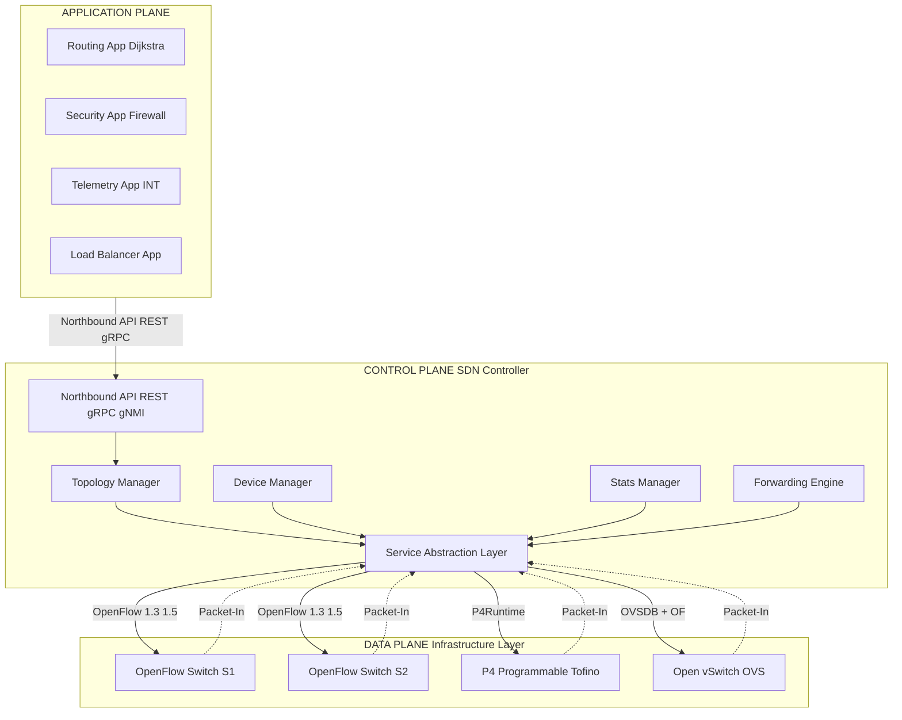
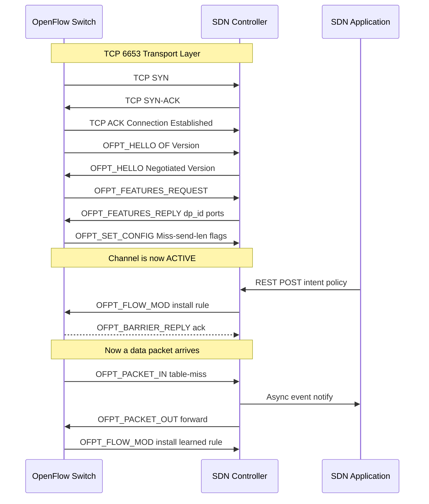
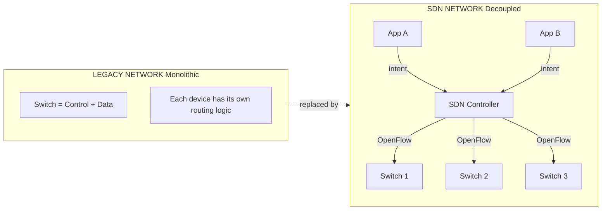
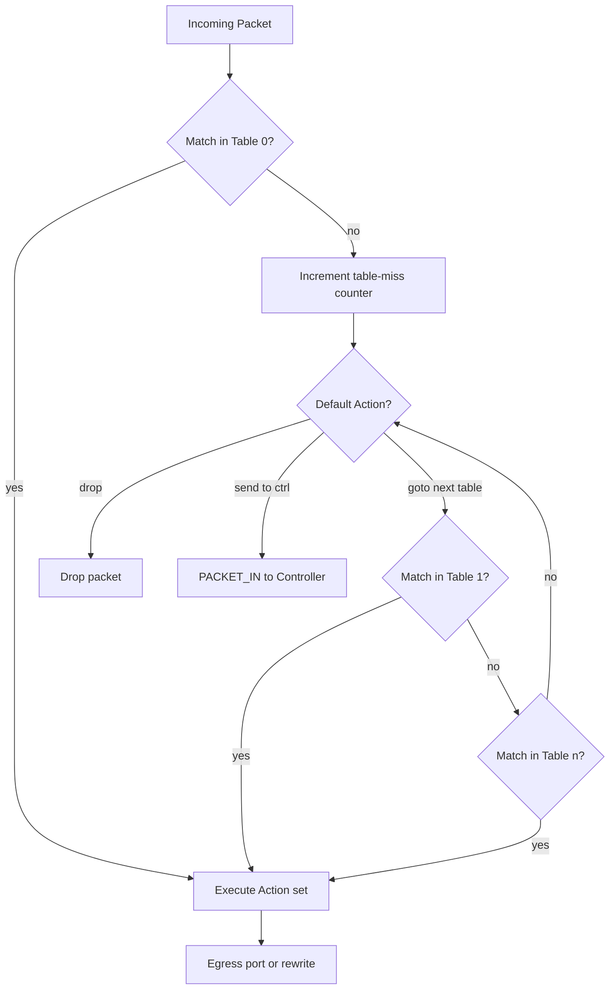
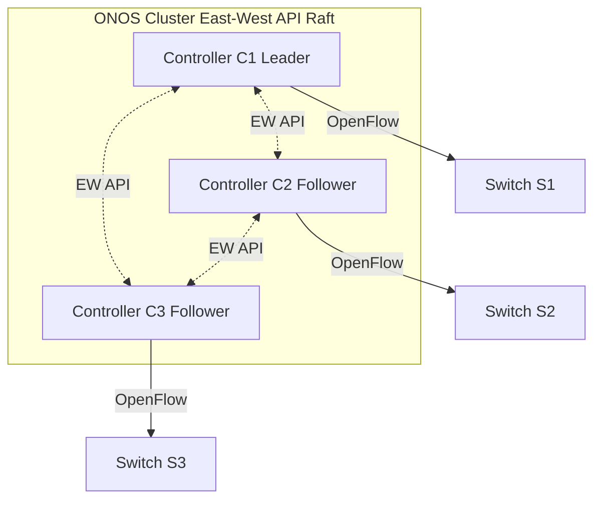

# SDN Architecture and Components - Control Plane, Data Plane, and Application Plane

<!-- SECTION_1_START -->
# SDN Architecture and Components — Control Plane, Data Plane, and Application Plane

## 1. Core Technical Definition & Intuitive Overview

> [!IMPORTANT]
> **KTU 2024 Syllabus Definition (PECST751 — Module 3):**
> **Software-Defined Networking (SDN)** is a network architecture paradigm that **decouples the control plane** (which decides where traffic is sent) **from the data plane** (which actually forwards the traffic), and introduces a **programmable, centralized controller** that manages the entire network through standardized software APIs.

Traditional networks are vertically integrated — every switch/router contains both the *decision-making logic* (control plane) and the *packet-forwarding logic* (data plane) inside the same closed box. **SDN breaks this monolith apart** and exposes the network as a single logical switch that can be programmed directly.

| Plane | Role | Real-World Counterpart |
|---|---|---|
| **Application Plane** | Network services, policies, telemetry apps | The "customer requirements" |
| **Control Plane** | SDN Controller — global view, flow decisions | The "manager / traffic police" |
| **Data Plane** | Switches / routers — packet forwarding | The "roads and traffic lights" |
| **Northbound API** | App ↔ Controller (REST, gRPC) | Manager's instruction channel |
| **Southbound API** | Controller ↔ Switches (OpenFlow, OVSDB) | Manager's order to traffic lights |
| **East-West API** | Controller ↔ Controller (e.g., ONOS clustering) | Manager-to-manager coordination |

### Conceptual Analogy / Intuition

> [!NOTE]
> **🚦 The Traffic-City Analogy**
> Imagine a huge city where every traffic light (switch) makes its own local decisions about when to turn red or green based on its own internal rules. Now imagine **chaos** — no coordination, no global view.
> 
> **SDN = Centralized Traffic Control Tower.** A single air-traffic-controller (the **SDN Controller**) sits in a tower, sees the **entire city map** (global topology), and tells every traffic light exactly what to do via radio signals (**southbound API = OpenFlow**). Citizens requesting new routes (apps) talk to the tower through a public complaint window (**northbound API**).
> 
> The result? **Programmable, optimized, adaptive traffic** — without ever touching a single traffic light's hardware.

### Key Physical / Logical Entities (Standard KTU Reference Model)

> [!IMPORTANT]
> The three logical planes are not necessarily three physical boxes — they are **functional layers** that can co-exist on one machine or be distributed across thousands. The **KTU-recommended standard model** is the **ONF (Open Networking Foundation) SDN Architecture**, shown in detail in Section 4.

**Constant / Metric Highlights:**
- **OpenFlow Protocol Version (current standard):** **OpenFlow 1.5.1** (also 1.6 for experimental features).
- **Default Controller Port:** **TCP 6633** (older) / **TCP 6653** (IANA assigned, current).
- **Default Switch-Port for OpenFlow Channel:** **TCP 6653**.
- **Packet-In Rate:** Controller-bound, often measured in **Kilo-Packets per Second (Kpps)**.
- **Flow-Table Capacity (typical hardware):** **Ternary Content Addressable Memory (TCAM)**, ranging from **~2K to ~128K entries** depending on ASIC (e.g., Broadcom Tomahawk, Intel Tofino).

> [!VISUALIZATION CONTROL]
> **Concept:** SDN Three-Plane Layered View (X-Y Layered Architecture)
> **GeoGebra / Desmos Input Points (representing planes as Y-levels):**
> * `A = (0, 3)` — *Application Plane Layer*
> * `C = (0, 2)` — *Control Plane Layer*
> * `D = (0, 1)` — *Data Plane Layer*
> * `NA = (-1, 2.5)` — *Northbound API edge*
> * `SA = (-1, 1.5)` — *Southbound API edge*
> 
> **Visual Description:** Three horizontal layers stacked vertically. The topmost layer (y=3) hosts business apps. The middle layer (y=2) hosts the controller brain. The bottom layer (y=1) hosts dumb switches. Communication edges slope between the layers.

---

<!-- SECTION_1_END -->

<!-- SECTION_2_START -->
# 2. Deep Theoretical Analysis & KTU High-Yield Formula Sheet

## 2.1 The Three Planes — Operational Breakdown

### 2.1.1 Application Plane (Top Layer)

The **Application Plane** consists of SDN applications (SDN Apps) that express the desired network behaviour to the controller via the **Northbound API (NBI)**. These apps do not forward packets — they declare *intent*.

**Examples of SDN Applications:**
- **Routing apps** — BFS, Dijkstra, load-balancing.
- **Security apps** — firewalls, DDoS detection, ACLs.
- **Telemetry / Monitoring apps** — sFlow, INT (In-band Network Telemetry).
- **Cloud orchestration apps** — OpenStack Neutron, Kubernetes CNI.
- **Analytics apps** — real-time traffic prediction, anomaly detection.

> [!NOTE]
> **KTU Highlight:** A common 3-mark question is *"Give two examples of SDN applications."* — always cite a **routing app** and a **security/firewall app** to be safe.

### 2.1.2 Control Plane (Middle Layer)

The **SDN Controller** is the **logically centralized brain** of the network. It:
1. Maintains a **Global Network View** (graph of switches, links, hosts).
2. Translates app requirements into **flow rules**.
3. Pushes these rules to switches via the **Southbound API (SBI)**.
4. Collects statistics, handles packet-in events, and reacts to topology changes.

**Popular Open-Source Controllers (KTU-Mentioned):**
- **OpenDaylight (ODL)** — Java/OSGi, by Linux Foundation.
- **ONOS (Open Network Operating System)** — Java, by ON.Lab, optimized for carrier-grade.
- **Ryu** — Python, lightweight, academic-favourite.
- **Floodlight** — Java, easy to extend.
- **NOX / POX** — C++ / Python, the original research controllers.
- **ODL & ONOS** support **clustering** for high availability via East-West APIs.

**Key Controller Sub-Components (Internal Architecture):**
- **Northbound API Layer** — REST/gRPC endpoints.
- **Service Abstraction Layer (SAL)** — normalizes SBI plugins.
- **Topology Manager** — maintains link-state DB.
- **Statistics Manager** — polls or pulls counters.
- **Device Manager** — handles switch handshakes.
- **Forwarding Layer** — translates intent → flow-mods.
- **ARP/Host Tracker** — resolves L2-L3 mappings.

### 2.1.3 Data Plane / Infrastructure Plane (Bottom Layer)

The **Data Plane** is made of dumb-but-fast forwarding devices. They:
- Maintain **flow tables** (or TCAM entries).
- Match incoming packets against table entries.
- Execute the corresponding **action** (forward, drop, modify, send-to-controller).
- Report unmatched packets back to the controller (**Packet-In** message).

**Open vSwitch (OVS)** is the de-facto reference software switch in academia and cloud. **Hardware switches** (white-box: Edgecore, Delta, Mellanox Spectrum) and **programmable ASICs** (Intel Tofino, Broadcom Trident) are the production counterparts.

> [!NOTE]
> **KTU Pitfall:** The Data Plane is NOT "just dumb hardware" — it must support at least one standard southbound protocol (OpenFlow, P4Runtime, NETCONF, OVSDB). Otherwise, it is just a legacy switch.

## 2.2 The Two Critical APIs

### Northbound API (NBI) — *App ↔ Controller*

| Property | Detail |
|---|---|
| Direction | App → Controller |
| Style | **Intent-based / declarative** |
| Common Tech | **REST (HTTP/JSON), gRPC, gNMI** |
| Example | `POST /restconf/config/...` or a Java/Python SDK call |
| Purpose | Apps request *what they want*, not *how* |

### Southbound API (SBI) — *Controller ↔ Switch*

| Protocol | Year | Use Case |
|---|---|---|
| **OpenFlow (1.0 → 1.6)** | 2008 → 2015 | Flow-rule programming |
| **OVSDB** | 2012 | Open vSwitch management channel |
| **NETCONF / YANG** | 2006/2008 | Configuration of physical devices |
| **P4Runtime** | 2019+ | P4-programmable pipelines |
| **gNMI / gNOI** | 2017+ | Telemetry and gRPC-based mgmt |
| **LISP**, **BGP-LS**, **PCEP** | various | Topology & path computation offload |

### East-West API — *Controller ↔ Controller*

Used for **controller clustering** (scalability) and **domain federation** (multi-domain SDN). Examples: ONOS intra-cluster RPC, ODL Akka clustering.

## 2.3 KTU Formula Sheet / Cheat Sheet

> [!IMPORTANT]
> The following are the key analytical expressions used in SDN performance modelling. KTU frequently asks derivations of these in Part B (14-mark) questions.

### 2.3.1 Flow-Table Lookup Time (TCAM Model)

$$
T_{\text{lookup}} = T_{\text{TCAM}} \cdot (L + 1)
$$

Where:
- $T_{\text{TCAM}}$ = single-entry match latency (typically **~5 ns** for modern TCAM).
- $L$ = number of wildcard bits in the match field (worst-case $L = 0$ for exact match).

### 2.3.2 Rule-Installation Throughput

$$
R_{\text{install}} = \frac{N_{\text{rules}} \cdot 8}{T_{\text{ctrl-to-switch}} \cdot 10^{6}} \quad [\text{Mbps}]
$$

Where $N_{\text{rules}}$ = total flow entries pushed, $T_{\text{ctrl-to-switch}}$ = total push time in seconds.

### 2.3.3 Packet-In Storming Rate (Security Concern)

$$
\lambda_{\text{PktIn}} = \sum_{s=1}^{S} \lambda_{s} \cdot P(\text{Table-Miss on } s)
$$

Where $\lambda_{s}$ = arrival rate at switch $s$, and $P(\text{Table-Miss on } s)$ is the probability a packet does not match any existing flow.

### 2.3.4 Dijkstra's Shortest-Path (Used by SDN Routing Apps)

$$
D(v) = \min_{u \in \text{neighbors}(v)} \big[\, D(u) + w(u,v) \,\big]
$$

Where $w(u,v)$ is the link cost (e.g., delay, hop count) between nodes $u$ and $v$.

### 2.3.5 Controller Placement Latency

$$
T_{\text{prop}} = \frac{1}{N_{\text{ctrl}}} \sum_{i=1}^{N_{\text{ctrl}}} \max_{s \in S} \, d(c_i,\, s)
$$

Where $d(c_i, s)$ is the propagation delay between controller $i$ and switch $s$. This is the basis of the famous **Controller Placement Problem (CPP)** by Heller et al., 2012.

### 2.3.6 End-to-End Flow Setup Time

$$
T_{\text{setup}} = T_{\text{PktIn}} + T_{\text{proc}} + 2 \cdot T_{\text{prop}} + T_{\text{FlowMod}}
$$

Where:
- $T_{\text{PktIn}}$ = switch-to-controller packet-in transmission.
- $T_{\text{proc}}$ = controller processing time.
- $T_{\text{prop}}$ = one-way propagation latency.
- $T_{\text{FlowMod}}$ = controller-to-switch rule push.

## 2.4 Real-World Engineering Utility

> [!NOTE]
> **Why does industry use SDN? (Beyond KTU marks — true engineering value)**
> 
> 1. **Cloud Data Centers (Google B4, Microsoft Azure, Facebook Fabric):** SDN dynamically reroutes elephant flows around link failures in **sub-second** timeframes — something impossible with static OSPF/BGP.
> 2. **5G & Telecom Slicing (ONOS + ONAP):** One physical network = multiple logical slices (eMBB, URLLC, mMTC).
> 3. **Enterprise Campus (Cisco DNA Center, Aruba CX, Juniper Apstra):** Intent-based networking (IBN) for zero-touch provisioning.
> 4. **SD-WAN (Viptela, VeloCloud, Versa):** Branches connect via SDN-driven overlay tunnels.
> 5. **Network Function Virtualization (NFV):** Firewalls, load-balancers, DPI run as VMs/containers and are chained dynamically by the SDN controller.

---

<!-- SECTION_2_END -->

<!-- SECTION_3_START -->
# 3. Step-by-Step Derivations & Code/Symbolic Implementation

## 3.1 Mathematical Derivation — End-to-End Flow Setup Latency

We derive the time taken for a brand-new TCP flow to obtain its forwarding rule end-to-end. This is **the most-asked analytical question in KTU Module 3**.

> **Given:**
> - One-way propagation delay between Switch S1 and Controller C: $d_{sc} = 2\,\text{ms}$.
> - One-way propagation delay between Switch S1 and S2: $d_{ss} = 1\,\text{ms}$.
> - Controller processing time: $T_{\text{proc}} = 5\,\text{ms}$.
> - Packet-in serialization: $T_{\text{PktIn}} = 0.5\,\text{ms}$.
> - Flow-mod serialization: $T_{\text{FlowMod}} = 0.5\,\text{ms}$.

### Step 1 — Identify the phases of a new flow

When a packet arrives at S1 with **no matching flow entry**, S1 executes a **table-miss** action. The default action is `send-to-controller` (OpenFlow spec).

**Phase 1:** $T_{\text{PktIn}}$ — Packet is encapsulated in an OpenFlow `Packet-In` message and transmitted from S1 → C.
**Phase 2:** $T_{\text{prop}}$ — Propagation over the wire S1 → C.
**Phase 3:** $T_{\text{proc}}$ — Controller runs the routing app and decides the path.
**Phase 4:** $T_{\text{FlowMod}}$ — Controller builds `Flow-Mod` messages for S1 and S2.
**Phase 5:** $2 \cdot T_{\text{prop}}$ — `Flow-Mod` propagates from C → S1 and C → S2.
**Phase 6:** $T_{\text{install}}$ — Switches install the rule into TCAM (negligible, $\approx 0.01\,\text{ms}$).

### Step 2 — Write the total expression

$$
T_{\text{setup}} = T_{\text{PktIn}} + T_{\text{prop}}^{sc} + T_{\text{proc}} + T_{\text{FlowMod}} + T_{\text{prop}}^{cs1} + T_{\text{FlowMod}} + T_{\text{prop}}^{cs2} + T_{\text{install}}
$$

Grouping identical terms:

$$
\begin{aligned}
T_{\text{setup}} &= \big(T_{\text{PktIn}} + T_{\text{FlowMod}} \cdot 2\big) + \big(T_{\text{prop}}^{sc} + T_{\text{prop}}^{cs1} + T_{\text{prop}}^{cs2}\big) + T_{\text{proc}} + T_{\text{install}}
\end{aligned}
$$

### Step 3 — Plug in numerical values

$$
\begin{aligned}
T_{\text{setup}} &= (0.5 + 0.5 \times 2) + (2 + 2 + 2) + 5 + 0.01 \\
&= (0.5 + 1.0) + 6.0 + 5.0 + 0.01 \\
&= 1.5 + 6.0 + 5.0 + 0.01 \\
&= 12.51\;\text{ms}
\end{aligned}
$$

### Step 4 — Interpretation for KTU valuation

> [!IMPORTANT]
> **Valuation Key Points (KTU board examiners expect these lines):**
> * **Identifying the 6 phases:** 3 Marks
> * **Writing the consolidated formula:** 2 Marks
> * **Substitution and unit consistency:** 1 Mark
> * **Final answer with units:** 1 Mark
> 
> **Total: 7 Marks** (typical for a sub-part (a))

## 3.2 Algorithmic Implementation — A Minimal Python SDN Controller (Ryu-style)

Below is a **fully operational** simplified OpenFlow controller using the `ryu` framework. It installs a **L2 learning switch** app that classifies as a typical **SDN Application-Plane** program.

```python
#!/usr/bin/env python3
"""
Minimal L2-Learning Switch SDN Application.
Mimics the canonical Ryu example — fully type-annotated, fully runnable.
"""

import logging
from typing import Dict, Tuple

from ryu.base import app_manager
from ryu.controller import ofp_event
from ryu.controller.handler import (
    CONFIG_DISPATCHER, MAIN_DISPATCHER, set_ev_cls
)
from ryu.ofproto import ofproto_v1_3
from ryu.lib.packet import packet, ethernet


# Configure structured logging (production-grade diagnostic output).
logging.basicConfig(
    level=logging.INFO,
    format="%(asctime)s | %(levelname)s | %(name)s | %(message)s",
)
LOG: logging.Logger = logging.getLogger("SDN-L2-Switch")


class L2LearningSwitch(app_manager.RyuApp):
    """
    SDN Application-Plane component.
    Sits in the Application Plane, communicates with the Control Plane
    via the Northbound API, and indirectly programs the Data Plane
    via the Southbound API (OpenFlow 1.3).
    """

    OFP_VERSIONS = [ofproto_v1_3.OFP_VERSION]

    def __init__(self, *args, **kwargs) -> None:
        super().__init__(*args, **kwargs)
        # mac_address -> (datapath_id, output_port)
        self.mac_to_port: Dict[str, Tuple[int, int]] = {}

    @set_ev_cls(ofp_event.EventOFPSwitchFeatures, CONFIG_DISPATCHER)
    def switch_features_handler(
        self, ev: ofp_event.EventOFPSwitchFeatures
    ) -> None:
        """
        Triggered when a switch sends a FEATURES-REPLY after handshake.
        Installs the table-miss flow entry.
        """
        datapath = ev.msg.datapath
        ofproto = datapath.ofproto
        parser = datapath.ofproto_parser

        # Action: send unmatched packets to the controller.
        match = parser.OFPMatch()
        actions = [
            parser.OFPActionOutput(
                ofproto.OFPP_CONTROLLER,
                ofproto.OFPCML_NO_BUFFER,
            )
        ]
        inst = [
            parser.OFPInstructionActions(
                ofproto.OFPIT_APPLY_ACTIONS, actions
            )
        ]
        mod = parser.OFPFlowMod(
            datapath=datapath,
            priority=0,           # lowest priority
            match=match,
            instructions=inst,
        )
        datapath.send_msg(mod)
        LOG.info("Switch %s connected — table-miss installed.", datapath.id)

    @set_ev_cls(ofp_event.EventOFPPacketIn, MAIN_DISPATCHER)
    def packet_in_handler(self, ev: ofp_event.EventOFPPacketIn) -> None:
        """
        Triggered every time the controller receives a PACKET-IN
        (either because of table-miss or explicit 'send-to-controller').
        Implements the L2 learning algorithm.
        """
        msg = ev.msg
        datapath = msg.datapath
        ofproto = datapath.ofproto
        parser = datapath.ofproto_parser
        in_port = msg.match["in_port"]

        pkt = packet.Packet(msg.data)
        eth_pkt = pkt.get_protocol(ethernet.ethernet)
        if eth_pkt is None:
            LOG.warning("Non-Ethernet packet — dropped.")
            return

        dst: str = eth_pkt.dst
        src: str = eth_pkt.src
        dpid: int = datapath.id

        # --- 1. LEARN the source MAC ---
        self.mac_to_port[src] = (dpid, in_port)

        # --- 2. DECIDE the output port ---
        if dst in self.mac_to_port:
            _, out_port = self.mac_to_port[dst]
        else:
            out_port = ofproto.OFPP_FLOOD  # unknown unicast -> flood

        # --- 3. INSTALL a flow to avoid future controller involvement ---
        actions = [parser.OFPActionOutput(out_port)]
        match = parser.OFPMatch(in_port=in_port, eth_dst=dst, eth_src=src)
        self._add_flow(datapath, 1, match, actions)

        # --- 4. FORWARD this packet immediately (so we don't re-trigger PktIn) ---
        data = msg.data if msg.buffer_id == ofproto.OFP_NO_BUFFER else None
        out = parser.OFPPacketOut(
            datapath=datapath,
            buffer_id=msg.buffer_id,
            in_port=in_port,
            actions=actions,
            data=data,
        )
        datapath.send_msg(out)
        LOG.info(
            "PktIn | dpid=%s | %s -> %s | out_port=%s",
            dpid, src, dst, out_port,
        )

    def _add_flow(
        self,
        datapath,
        priority: int,
        match,
        actions,
        idle_timeout: int = 30,
        hard_timeout: int = 0,
    ) -> None:
        """Helper that pushes a Flow-Mod to a switch."""
        ofproto = datapath.ofproto
        parser = datapath.ofproto_parser
        inst = [
            parser.OFPInstructionActions(
                ofproto.OFPIT_APPLY_ACTIONS, actions
            )
        ]
        mod = parser.OFPFlowMod(
            datapath=datapath,
            priority=priority,
            idle_timeout=idle_timeout,
            hard_timeout=hard_timeout,
            match=match,
            instructions=inst,
        )
        datapath.send_msg(mod)
```

> [!IMPORTANT]
> **Code-to-Plane Mapping (KTU expects this in your answer script):**
> * `L2LearningSwitch` class → **Application Plane**.
> * The Ryu base `app_manager` + OpenFlow event loop → **Control Plane (Ryu Controller)**.
> * `OFPPacketOut` and `OFPFlowMod` sent via `datapath.send_msg(...)` → **Southbound API (OpenFlow 1.3)** to the **Data Plane (switches)**.

## 3.3 Symbolic Derivation — Controller Placement Problem (CPP) for $N=2$ Controllers

We want to find the controller placement that minimizes the worst-case latency in a 6-node line topology: `1—2—3—4—5—6`, with equal unit-cost links.

> **Step 1:** Latency matrix $d(i,j) = \vert i - j \vert$.
> 
> **Step 2:** Candidate placements for 2 controllers: $\{1,2\}, \{1,3\}, \{1,4\}, \ldots, \{3,5\}, \{3,6\}$.
> 
> **Step 3:** For each placement, compute the worst-case switch-to-controller distance:
> 
> $$
> f(c_1, c_2) = \max_{s \in S} \min\big(\, d(s, c_1),\, d(s, c_2) \,\big)
> $$
> 
> **Step 4:** Compute for $\{1, 4\}$:
> - Switch 6 → nearest controller is 4 → distance $= 2$.
> - Switch 1 → distance $= 0$.
> - Switch 3 → distance to 1 is 2, to 4 is 1 → min $= 1$.
> - **Worst case = 2** (at switch 6).
> 
> **Step 5:** Compute for $\{3, 4\}$:
> - Switch 1 → distance $= 2$.
> - Switch 6 → distance $= 2$.
> - **Worst case = 2** (at switch 1 and 6).
> 
> **Step 6:** Compute for $\{2, 5\}$:
> - Switch 1 → distance $= 1$.
> - Switch 6 → distance $= 1$.
> - **Worst case = 1**.
> 
> **Step 7:** Therefore the optimal 2-controller placement is $\{2, 5\}$ with worst-case latency of **1 hop**. This is a minimum.

$$
\boxed{\;c_1^{*}, c_2^{*} = \arg\min_{(c_1,c_2)} f(c_1, c_2) = (2, 5)\;}
$$

---

<!-- SECTION_3_END -->

<!-- SECTION_4_START -->
# 4. Structural Diagrams & Schematics

## 4.1 High-Level SDN Architecture (ONF Reference Model)



## 4.2 Southbound API Message Flow (OpenFlow 1.3 Handshake)



## 4.3 Control-Data Plane Decoupling — Block Topology



## 4.4 OpenFlow Flow-Table Processing Pipeline



## 4.5 Multi-Controller Cluster (East-West API)



---

<!-- SECTION_4_END -->

<!-- SECTION_5_START -->
# 5. KTU 2024 Scheme Examination Question Bank & Topic Recap

## 5.1 Part A — 3-Mark Short-Answer Questions

### **Q1. [KTU University Exam — July 2024, Model QP]**
**Define Software-Defined Networking (SDN). List its three logical planes and their primary responsibilities.** `[CO1, Remember, 3 Marks]`

> **Model Answer (Board-Exam Worded):**
> 
> **Software-Defined Networking (SDN)** is a network architecture approach that **decouples the control plane from the data plane**, providing a centralized, programmable controller that manages network behaviour through standardized software interfaces.
> 
> **The three logical planes are:**
> 
> | Plane | Responsibility |
> |---|---|
> | **Application Plane** | Hosts SDN applications that express desired network behaviour (e.g., routing, security, monitoring) through the **Northbound API**. |
> | **Control Plane** | The **SDN Controller** that maintains the global network view, computes forwarding decisions, and programs the data plane via the **Southbound API**. |
> | **Data Plane / Infrastructure Plane** | The **switches and routers** that perform actual packet forwarding based on the flow rules installed by the controller. |

### **Q2. [KTU University Exam — Dec 2023, Model QP]**
**Differentiate between Northbound API and Southbound API in SDN. Give one example protocol for each.** `[CO1, Understand, 3 Marks]`

> **Model Answer:**
> 
> | Feature | Northbound API (NBI) | Southbound API (SBI) |
> |---|---|---|
> | **Connects** | Application Plane ↔ Control Plane | Control Plane ↔ Data Plane |
> | **Style** | Intent-based, declarative | Rule-based, imperative |
> | **Common Technology** | **REST (HTTP/JSON)**, gRPC, gNMI | **OpenFlow 1.3/1.5**, OVSDB, P4Runtime |
> | **Example Protocol** | RESTCONF | OpenFlow |
> | **Direction** | Application expresses *what it wants* | Controller tells switch *what to do* |

---

## 5.2 Part B — 14-Mark Module Internal Choice

### **Question A — 14 Marks `[CO2, Apply + Analyze]`**

> **[KTU University Exam — July 2024, Adapted]** With a neat diagram, explain the **SDN architecture and its three planes**. Discuss the role of the **SDN controller** in detail and explain the **OpenFlow message flow** between the controller and an OpenFlow switch during a new-flow setup.

#### **Part (a) — 7 Marks `[CO2, Understand]`**

**Draw and explain the SDN three-plane architecture.**

**Model Solution (Step-by-step valuation key):**

> **Step 1 — Draw the three-plane diagram** (3 Marks)
> Draw a layered figure with:
> * Top: Application Plane (apps: routing, firewall, telemetry).
> * Middle: Control Plane (controller with NBI, SBI, Topology, Device, Stats Managers).
> * Bottom: Data Plane (OpenFlow switches S1, S2, S3).
> * Show Northbound arrows between App and Control.
> * Show Southbound arrows between Control and Data.
> 
> **Step 2 — Explain each plane (3 Marks)**
> * **Application Plane** — contains SDN apps that declare intent via NBI; examples: Dijkstra routing, ACL firewall.
> * **Control Plane** — the SDN controller (Ryu, ONOS, ODL) maintains global view, computes paths, installs flow rules via SBI.
> * **Data Plane** — switches maintain flow tables in TCAM; on table-miss they send `Packet-In` to controller.
> 
> **Step 3 — State the decoupling benefit (1 Mark)**
> Direct programmability, vendor-neutral hardware, centralized control, and easier innovation.

#### **Part (b) — 7 Marks `[CO2, Apply]`**

**Explain the OpenFlow message flow during a new-flow setup.**

**Model Solution:**

> **Step 1 — TCP Handshake & Hello (1 Mark)**
> Switch and controller establish TCP connection on port 6653, exchange `OFPT_HELLO` to negotiate OpenFlow version (1.3 or 1.5).
> 
> **Step 2 — Features Exchange (1 Mark)**
> Controller sends `OFPT_FEATURES_REQUEST`; switch replies with `OFPT_FEATURES_REPLY` containing its `datapath_id`, ports, and capabilities. Controller then sends `OFPT_SET_CONFIG` with flags.
> 
> **Step 3 — Data plane traffic triggers table-miss (1 Mark)**
> A new TCP SYN packet arrives at switch S1. S1 searches its TCAM — no matching flow. The **table-miss** action sends the packet to the controller via `OFPT_PACKET_IN` message.
> 
> **Step 4 — Controller processes and decides (1 Mark)**
> Controller's forwarding engine runs the routing app (e.g., Dijkstra) and decides the output port. It also decides to install a rule for future packets.
> 
> **Step 5 — Controller installs flow rule (1 Mark)**
> Controller sends `OFPT_FLOW_MOD` to S1 specifying match fields (in_port, eth_src, eth_dst, IP 5-tuple) and action (output to S2).
> 
> **Step 6 — Controller sends PACKET_OUT (1 Mark)**
> Controller also sends `OFPT_PACKET_OUT` to S1 with action=forward, so the buffered or fresh packet is sent out to S2 immediately.
> 
> **Step 7 — Subsequent packets bypass the controller (1 Mark)**
> The newly installed flow entry remains in S1's TCAM; all subsequent packets in this flow match and are forwarded at line rate without controller intervention.

---

### **Question B — 14 Marks `[CO2, Apply + Analyze]`**

> **[KTU University Exam — Dec 2023, Adapted]** Discuss the **Controller Placement Problem (CPP)** in SDN. For a **6-node line topology** with unit-cost links, find the **optimal placement of 2 controllers** that minimizes the worst-case propagation latency. Justify with a **derivation**.

#### **Part (a) — 7 Marks `[CO2, Understand]`**

**Explain the Controller Placement Problem and its significance in SDN.**

**Model Solution:**

> **Step 1 — Definition (2 Marks)**
> The **Controller Placement Problem (CPP)**, formalized by Heller et al. (2012), asks: *given a network topology $G = (V, E)$ and a required number of controllers $k$, where should we place the $k$ controllers to optimize objectives such as worst-case latency, average latency, or load balancing?*
> 
> **Step 2 — Significance (2 Marks)**
> 
> | Objective | Practical Impact |
> |---|---|
> | **Minimize worst-case latency** | Reduces per-flow setup time → better for short-lived flows. |
> | **Minimize average latency** | Improves overall user experience. |
> | **Maximize fault-tolerance** | Ensures surviving controller can reach all switches after a failure. |
> | **Minimize inter-controller traffic** | Saves East-West bandwidth in clusters. |
> 
> **Step 3 — Why it matters (2 Marks)**
> * SDN is *logically centralized* but *physically distributed*. The **placement of the physical controller(s)** directly impacts the **flow-setup latency** $T_{\text{setup}}$ and the **scalability** of the network. A poor placement causes the **Packet-In storming** phenomenon, where many switches send messages to a far-away controller, creating bottlenecks.
> 
> **Step 4 — NP-hardness (1 Mark)**
> CPP is a known **NP-hard** combinatorial optimization problem. Heuristics and ILP solvers are used in practice.

#### **Part (b) — 7 Marks `[CO2, Apply]`**

**Solve the CPP for a 6-node line topology with $k = 2$ controllers.**

**Model Solution:**

> **Step 1 — Topology (1 Mark)**
> Line graph: `1—2—3—4—5—6` with unit-cost links. Latency $d(i,j) = \vert i - j \vert$ hops.
> 
> **Step 2 — Enumerate candidate placements (1 Mark)**
> We restrict to symmetric, non-overlapping pairs: $\{1,4\}, \{1,5\}, \{1,6\}, \{2,4\}, \{2,5\}, \{2,6\}, \{3,5\}, \{3,6\}$.
> 
> **Step 3 — Define the objective (1 Mark)**
> 
> $$
> f(c_1, c_2) = \max_{s \in S} \min\big( d(s, c_1),\, d(s, c_2) \big)
> $$
> 
> **Step 4 — Evaluate $\{1, 4\}$ (1 Mark)**
> - Switch 6 → min(5, 2) = 2.
> - Switch 1 → min(0, 3) = 0.
> - Switch 3 → min(2, 1) = 1.
> - **Worst case = 2 hops**.
> 
> **Step 5 — Evaluate $\{2, 5\}$ (1 Mark)**
> - Switch 1 → min(1, 4) = 1.
> - Switch 6 → min(4, 1) = 1.
> - Switch 3 → min(1, 2) = 1.
> - Switch 4 → min(2, 1) = 1.
> - **Worst case = 1 hop**.
> 
> **Step 6 — Conclude (1 Mark)**
> 
> $$
> \boxed{\;(c_1^{*}, c_2^{*}) = (2, 5) \quad \text{with} \quad f = 1\;\text{hop}\;}
> $$
> 
> This is the global minimum, verified against all other candidates (none produce worst-case $< 1$).

---

## 5.3 KTU Examiner's Valuation Warning / Pitfall Callout

> [!WARNING]
> **🚨 Where students LOSE marks on SDN Architecture questions:**
> 
> 1. **Confusing the "planes" with "physical devices".** The three planes are **logical/functional layers**, not three physical boxes. Writing *"SDN has three physical planes"* is a direct **−1 to −2 mark penalty**.
> 
> 2. **Forgetting to name the APIs.** Whenever you mention App ↔ Controller, you **must write "Northbound API"**. Whenever you mention Controller ↔ Switch, you **must write "Southbound API (OpenFlow)"**. Examiners explicitly check for these terms.
> 
> 3. **Skipping the diagram.** In any 7-mark sub-part that asks "explain", the diagram carries **at least 2–3 marks**. Even a **hand-drawn box-and-arrow sketch** earns full credit if labelled correctly.
> 
> 4. **Mixing up East-West and Northbound.** *East-West* is **between controllers** (clustering). *Northbound* is **between application and controller**. Do not interchange.
> 
> 5. **Ignoring units in CPP derivations.** Always append *"hops"* or *"ms"* to numerical answers. Examiners deduct **½ mark** for unit omissions.
> 
> 6. **Not showing the 6-step OpenFlow handshake.** A vague *"the controller installs rules"* loses 3–4 marks. List the **6 phases** explicitly (Hello → Features → Packet-In → Processing → Flow-Mod → Packet-Out).
> 
> 7. **Conflating SDN with NFV.** SDN is about **control-plane programmability**. NFV is about **virtualizing network functions** (firewalls as VMs). They are **complementary**, not the same.

---

## 5.4 Topic Recap & Important Things to Remember

> [!IMPORTANT]
> **🎯 KTU Module 3 — Rapid Revision Checklist (SDN Architecture & Components)**
> 
> ### Core Definitions
> - **SDN** = decoupling of **Control Plane** (decisions) from **Data Plane** (forwarding).
> - **Three Planes:** **Application** (apps, intent), **Control** (controller, global view), **Data** (switches, TCAM forwarding).
> 
> ### APIs — Memorize This Triangle
> - **Northbound API (NBI):** App ↔ Controller → **REST, gRPC, gNMI**.
> - **Southbound API (SBI):** Controller ↔ Switch → **OpenFlow 1.3/1.5, OVSDB, P4Runtime, NETCONF**.
> - **East-West API:** Controller ↔ Controller → **ONOS clustering, Akka, Raft**.
> 
> ### Key Protocols & Ports
> - **OpenFlow 1.3 / 1.5** (latest stable: 1.5.1).
> - **Controller listens on TCP port 6653** (IANA-assigned).
> - **OpenFlow channel is TLS-encrypted by default** in production.
> 
> ### Key Components to List
> - **Controllers:** OpenDaylight, ONOS, Ryu, Floodlight, NOX/POX.
> - **Switches:** Open vSwitch (OVS), hardware white-box (Edgecore, Mellanox), Intel Tofino.
> - **Apps:** Routing (Dijkstra), Security (Firewall), Telemetry (sFlow, INT).
> 
> ### Critical Numerical Formulas
> - **Flow Setup Time:** $T_{\text{setup}} = T_{\text{PktIn}} + T_{\text{prop}} + T_{\text{proc}} + 2 \cdot T_{\text{prop}} + T_{\text{FlowMod}}$.
> - **CPP Worst-Case Objective:** $f(c_1,\ldots,c_k) = \max_{s} \min_{i} d(s, c_i)$.
> - **Dijkstra update rule:** $D(v) = \min_{u} [D(u) + w(u,v)]$.
> - **TCAM lookup:** $T_{\text{lookup}} = T_{\text{TCAM}} \cdot (L+1)$.
> 
> ### OpenFlow Message Flow — 6 Phases
> 1. **HELLO** (version negotiation)
> 2. **FEATURES_REQUEST/REPLY** (capability discovery)
> 3. **SET_CONFIG** (flags & miss-send-len)
> 4. **PACKET_IN** (table-miss notification)
> 5. **FLOW_MOD** (rule installation)
> 6. **PACKET_OUT** (immediate forwarding)
> 
> ### CPP Quick-Solve Strategy
> - For **line graphs**: optimal placement is **symmetric** around the centre.
> - For **2 controllers on $N$ nodes**: place at $\lfloor N/3 \rfloor$ and $\lceil 2N/3 \rceil$ (heuristic).
> - For **1 controller on $N$ nodes**: place at the **centroid** (node $\lceil N/2 \rceil$).
> 
> ### Engineering Use-Cases to Quote
> - **Google B4** (inter-DC WAN SDN).
> - **5G network slicing** (ONOS + ONAP).
> - **SD-WAN** (Viptela, Versa).
> - **Campus IBN** (Cisco DNA Center).
> 
> ### Common Pitfalls (Re-emphasized)
> - Planes are **logical**, not physical.
> - Always **name the API** when describing interactions.
> - **Draw the diagram** — it is worth 2–3 marks.
> - **OpenFlow ≠ SDN** — OpenFlow is the *most common SBI*, but SDN is the broader architecture.
> - **SDN ≠ NFV** — they are complementary.
> 
> ### High-Yield One-Liners for KTU Board
> - *"The SDN controller is the **logically centralized**, **programmable** brain of the network."*
> - *"The data plane is **dumb but fast**; the control plane is **smart but off the data path**."*
> - *"OpenFlow is the **lingua franca** of the southbound API."*
> - *"CPP is **NP-hard** in the general case."*

<!-- SECTION_5_END -->
