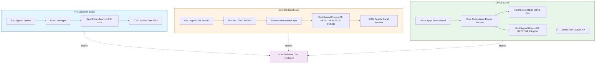
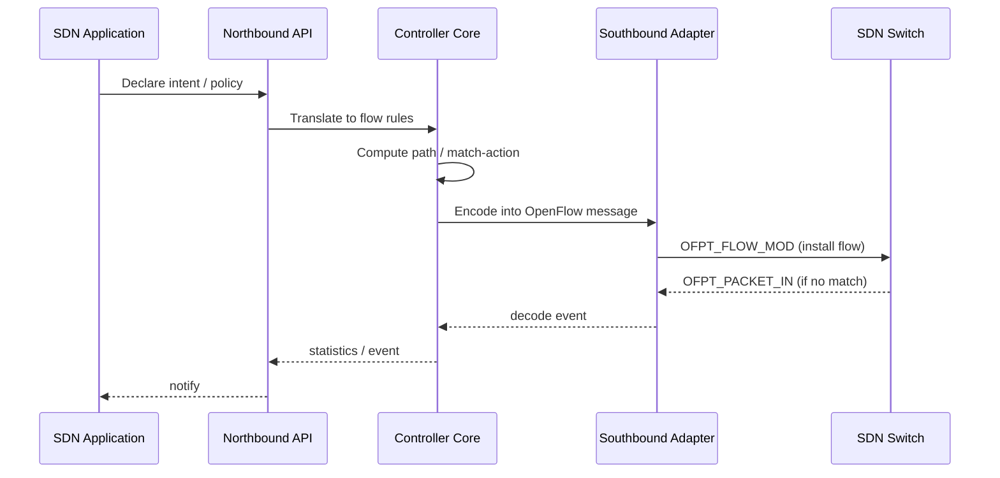
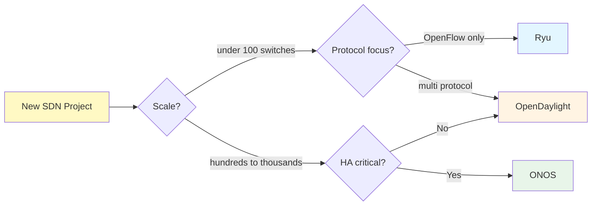
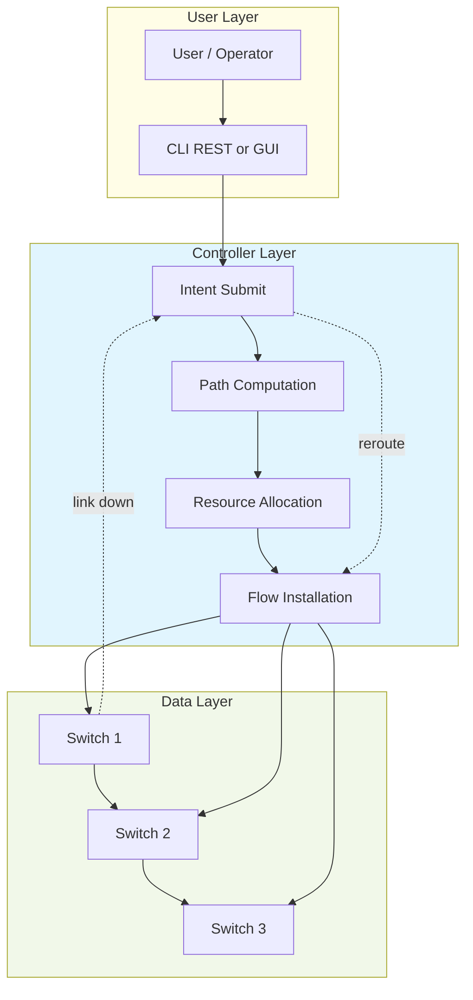
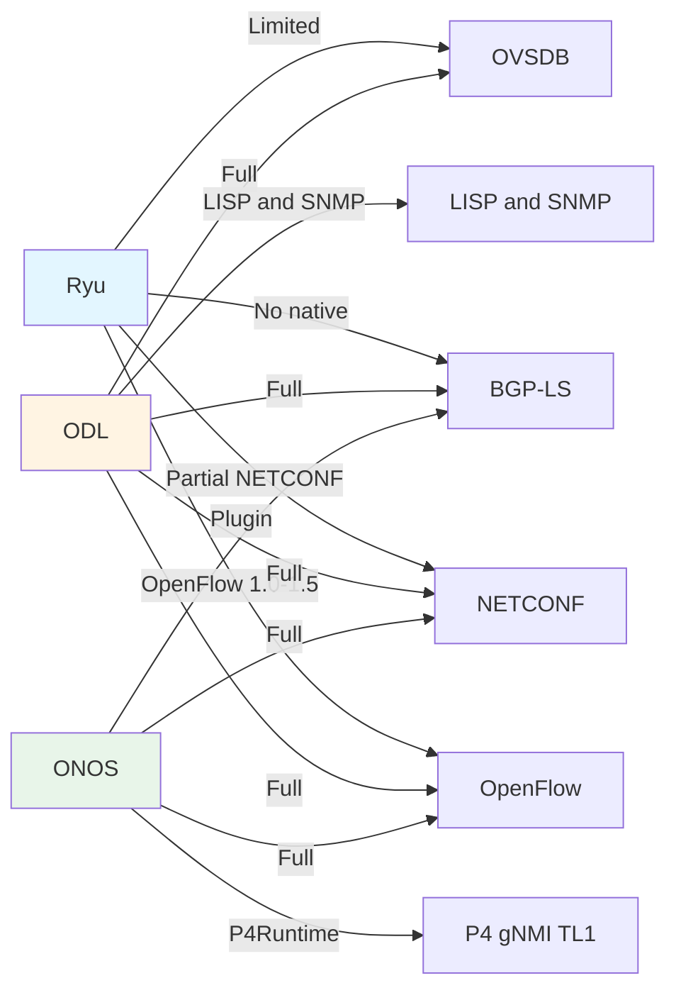

# SDN Controllers - Ryu, OpenDaylight, and ONOS

<!-- SECTION_1_START -->
# SDN Controllers — Ryu, OpenDaylight (ODL), and ONOS

## 1.1 Formal Definition (KTU 2024 Syllabus Terminology)

> [!IMPORTANT]
> **SDN Controller (Software-Defined Networking Controller):** A logically centralized software entity (often called the *Network Operating System* or *Control Plane*) that maintains a global view of the network, manages flow rules, and programmatically instructs the underlying forwarding hardware (switches/routers) via standardized **Southbound APIs** (e.g., OpenFlow, NETCONF, OVSDB) while exposing **Northbound APIs** to applications for intent declaration and policy enforcement.

In the KTU 2024 Scheme parlance, the controller is the **“brain of the SDN architecture”** — it decouples the *Control Plane* (decision logic) from the *Data Plane* (packet forwarding) and serves as the middleware between network applications and the OpenFlow/legacy switches.

The three controllers under study are:

| Controller | Full Form | Initial Release | Implementation Language | Primary Sponsor |
|------------|-----------|-----------------|--------------------------|------------------|
| **Ryu** | *Ryu* (Japanese for “flow”) | 2012 | **Python** | NTT (Nippon Telegraph and Telephone) |
| **ODL** | **OpenDaylight** | 2013 (now *DLIGHT*) | **Java** | The Linux Foundation |
| **ONOS** | **Open Network Operating System** | 2014 | **Java** | ONF & The Linux Foundation |

---

## 1.2 Intuitive Analogy — “The Brain, The Conductor & The Operating System”

> [!NOTE]
> **Analogy 1 — Brain of a Body (All Three Controllers):**
> Think of a network of switches as a human body. The switches are the **muscles** (they do the work of moving packets), the data plane is the **nervous system**, and the SDN Controller is the **brain**. Just as the brain decides which muscle to move without being physically attached to it, the controller decides where each packet goes without being in the data path itself.

> [!NOTE]
> **Analogy 2 — The Conductor of an Orchestra (Ryu):**
> *Ryu* is like a **lightweight conductor** of a small jazz ensemble — written in **Python**, easy to read, highly scriptable, perfect for researchers and small topologies. It speaks the language of **OpenFlow** fluently and lets you “compose” flow rules in a few lines of code.

> [!NOTE]
> **Analogy 3 — The Enterprise Server (OpenDaylight):**
> *OpenDaylight* is like a **full enterprise server OS (think Windows Server or Red Hat)** — modular, **OSGi-based**, supports many **southbound protocols** (OpenFlow, NETCONF, BGP-LS, OVSDB, SNMP, LISP), and is built for **carrier-grade deployments**. It uses a **Model-Driven Service Abstraction Layer (MD-SAL)** as a kind of universal translator.

> [!NOTE]
> **Analogy 4 — The Carrier-Grade Telecom Switch OS (ONOS):**
> *ONOS* is like the **control system of a global telecom provider’s core switch** — built for **high availability (HA)**, **horizontal scalability**, **low latency**, and **intent-based abstractions**. It targets **service providers (Verizon, AT&T, China Mobile)** and aims for **99.99% uptime**.

> [!NOTE]
> **Analogy 5 — A Side-by-Side:**
> If the network were a city, **Ryu** would be the friendly neighborhood traffic cop, **OpenDaylight** would be the city-wide traffic control room with multiple radio channels, and **ONOS** would be the **state/national highway command center** coordinating millions of vehicles in real time.

---

## 1.3 Physical Constants and Standard Metrics (in Bold)

- **Default OpenFlow Port:** **TCP 6633** (older) / **TCP 6653** (IANA-registered, since 2013).
- **Ryu Default Listener:** TCP **6653** for OpenFlow.
- **OpenDaylight Default Ports:** RESTCONF on **8181**, Karaf OSGi console on **1099** (RMI), OSGi console on **8040**.
- **ONOS Default Ports:** REST API on **8181**, GUI on **8181/8443**, Cluster communication on **9876**.
- **HA Target for ONOS:** **99.99% (Four Nines) uptime** with a **< 50 ms** cluster failure recovery (RAFT consensus).
- **Supported Scale:** ODL can scale to **hundreds of nodes per cluster**; ONOS to **thousands of devices**; Ryu is recommended for **< 100 switches** (typical research setup).

---

## 1.4 GeoGebra / Desmos Integration

> [!VISUALIZATION CONTROL]
> **Concept:** Throughput vs. Number of Flow-Installations — comparing controller scalability
>
> **Desmos Input Equations:**
> - `Ryu(x) = 1200 - 8.5 * x`   *(linear degradation, lightweight)*
> - `ODL(x) = 4500 / (1 + 0.002 * x) + 1500`   *(asymptotic plateau)*
> - `ONOS(x) = 12000 / (1 + 0.0005 * x) + 8000` *(near-flat for large scale)*
>
> **Visual Description:**
> *X-axis* = Number of managed switches (log scale 1 to 10,000).  
> *Y-axis* = Effective control-plane throughput in flows/sec.  
> *Observation:* Ryu’s curve drops steeply; ODL holds steady after ~1000 switches; ONOS stays nearly flat — illustrating **scalability** differences for KTU 14-mark answers.

---

## 1.5 Syllabus Highlights

> [!IMPORTANT]
> **KTU 2024 — PECST751 Module 3 must-know bullets:**
> 1. Role of an SDN Controller in the **three-layer SDN architecture** (Application, Control, Infrastructure).
> 2. Northbound vs. Southbound APIs and their typical protocols.
> 3. Internal architecture of **Ryu, ODL, and ONOS**.
> 4. Comparative study on the basis of language, scalability, protocols, use-case.
> 5. Hands-on awareness of a simple **Ryu Python app** (mandatory lab/ viva question).

---

<!-- SECTION_1_END -->

<!-- SECTION_2_START -->
# Deep Theoretical Analysis & KTU High-Yield Formula Sheet

## 2.1 The Common Role: SDN Controller in the Three-Layer Architecture

Every SDN controller, regardless of vendor, performs four core functions:

1. **Topology Discovery** — using **LLDP** packets emitted by the controller into the data plane, the controller learns the network graph.
2. **Flow Management** — installs **match-action** flow rules in switch flow tables.
3. **Policy Enforcement** — translates high-level intents (e.g., “block HTTP between host A and B”) into flow rules.
4. **Stat Collection / Telemetry** — gathers statistics via `OFPFlowStatsRequest`, `OFPPortStatsRequest`, etc.

---

## 2.2 Controller #1 — RYU (Python-based)

### 2.2.1 Why “Ryu”?

The word *Ryu* (竜) means **“flow” or “dragon”** in Japanese, chosen by NTT to reflect fluid, dynamic control.

### 2.2.2 Architecture of Ryu

```
+---------------------------------------------------+
|               RYU Applications                     |
|  (simple_switch_13.py, firewall.py, rest_topology) |
+---------------------------------------------------+
|               RYU Framework / Base App            |
|  (event system, context, threads, websocket)      |
+---------------------------------------------------+
|     OpenFlow Library (v1.0 – v1.5 wire-protocol)  |
+---------------------------------------------------+
|             TCP / TLS Channel (6653)              |
+---------------------------------------------------+
|          OF-Switches / vSwitches / Hardware       |
+---------------------------------------------------+
```

### 2.2.3 Key Components

- **Ryu App:** A Python class extending `ryu.base.app_manager.RyuApp`.
- **Events:** Decoupled pub/sub using `ofp_event` decorators (`@set_ev_cls`).
- **OpenFlow Wire Protocol:** Handled natively; no Java layer.
- **REST APIs:** Available through `ryu.app.ofctl_rest` and `ryu.app.rest_topology`.

### 2.2.4 Strengths & Limitations

| ✅ Strengths | ❌ Limitations |
|--------------|----------------|
| Simple, readable **Python** codebase | Limited to **< 100 switches** typically |
| Quick prototyping & academic use | Single point of failure (no native HA cluster) |
| Native OpenFlow 1.0–1.5 support | Less suited for production carrier networks |
| Lightweight, low memory footprint | No built-in BGP / PCEP / segment routing |

---

## 2.3 Controller #2 — OpenDaylight (ODL)

### 2.3.1 Architecture — The OSGi + MD-SAL Stack

```
+--------------------------------------------------------+
|                  ODL Apps / Features                   |
|   (DLUX UI, Netvirt, GBP, SFC, VTN, NeutronNorthbound) |
+--------------------------------------------------------+
|                  MD-SAL (YANG Models)                  |
|        DataStore  | RPCs  | Notifications  | Bindings |
+--------------------------------------------------------+
|                  SAL (Service Adaptation)              |
+--------------------------------------------------------+
|   Southbound Plugins:                                  |
|   OpenFlow | NETCONF | BGP-LS | OVSDB | SNMP | LISP |  |
+--------------------------------------------------------+
|          OSGi / Apache Karaf (Java Runtime)            |
+--------------------------------------------------------+
|              Hardware / vSwitches / Devices            |
+--------------------------------------------------------+
```

### 2.3.2 Core Components Explained

- **OSGi + Apache Karaf:** Dynamic module loading — features can be added/removed at runtime. This makes ODL extremely modular.
- **MD-SAL (Model-Driven Service Abstraction Layer):** Uses **YANG** data models. A plugin (e.g., OpenFlow plugin) and a consumer (e.g., a routing app) communicate *only* through YANG-modeled RPCs and notifications — **decoupled**.
- **Southbound Plugins:** ODL’s biggest strength — speaks **many southbound protocols** natively.
- **Akka Framework:** Underlying clustering and actor-based concurrency.

### 2.3.3 Strengths & Limitations

| ✅ Strengths | ❌ Limitations |
|--------------|----------------|
| **Multi-protocol** southbound (OF, NETCONF, BGP-LS, OVSDB) | Heavier — needs **≥ 8 GB RAM** for meaningful use |
| **MD-SAL** decoupling = extensibility | Steeper learning curve (Java + OSGi + YANG) |
| Strong **GUI (DLUX)** and **REST/NETCONF** NB API | Slower startup time |
| **Clustering & HA** built-in | Overkill for small lab setups |

---

## 2.4 Controller #3 — ONOS (Open Network Operating System)

### 2.4.1 Architecture

```
+----------------------------------------------------------+
|                  ONOS Apps (Intent Framework)             |
|    (Segment Routing, P4, BGP, MPLS, VPLS, Reactive Fwd)   |
+----------------------------------------------------------+
|                  Core Subsystems                          |
|   Device | Link | Host | Flow | Topology | PathService   |
|   Intent | Mastership | Cluster | Metrics | Packet        |
+----------------------------------------------------------+
|                  Northbound APIs (REST, gRPC, GUI)        |
+----------------------------------------------------------+
|   Southbound Adapters (Drivers):                          |
|   OF 1.0/1.3 | NETCONF | gNMI/P4Runtime | BGP | TL1 | …  |
+----------------------------------------------------------+
|              Atomix Cluster (Raft Consensus, HA)          |
+----------------------------------------------------------+
|              Hardware / OVS / P4 / Vendor Devices         |
+----------------------------------------------------------+
```

### 2.4.2 Core Subsystems

- **Device/Link/Host Subsystems:** Maintain network state.
- **Mastership Service:** In a multi-controller setup, decides which controller instance owns which device.
- **Intent Framework:** Users declare **what** they want (e.g., “host 10.0.0.1 to host 10.0.0.2 with 50 Mbps”), and ONOS figures out **how** to install the right flow rules. This is **Intent-Based Networking (IBN)**.
- **Atomix:** Distributed coordination library providing Raft-based HA and key-value storage.

### 2.4.3 Strengths & Limitations

| ✅ Strengths | ❌ Limitations |
|--------------|----------------|
| **High availability** (RAFT, master-backup) | Java memory hungry |
| **High performance** (10K+ devices, millions of flows) | More complex than Ryu for beginners |
| **Intent-based** abstraction = clean NB API | Cluster setup is non-trivial |
| Strong **service-provider** focus (Verizon, AT&T) | Less protocol coverage than ODL |

---

## 2.5 KTU High-Yield Formula Sheet / Cheat Sheet

> [!IMPORTANT]
> **All values for quick reference during KTU university exam.**

| # | Concept | Formula / Value | Unit / Note |
|---|---------|------------------|-------------|
| 1 | OpenFlow IANA Port | $6653$ | TCP |
| 2 | SDN App Processing Time | $T_{proc} = T_{rx} + T_{parse} + T_{decide} + T_{tx}$ | ms |
| 3 | Controller Throughput (Ryu) | $\lambda_{Ryu} \approx 1200 - 8.5 \cdot N$ | flows/sec, $N$ = switches |
| 4 | Controller Throughput (ODL) | $\lambda_{ODL} \approx \dfrac{4500}{1+0.002N}+1500$ | flows/sec |
| 5 | Controller Throughput (ONOS) | $\lambda_{ONOS} \approx \dfrac{12000}{1+0.0005N}+8000$ | flows/sec |
| 6 | Mean Cluster Recovery (ONOS) | $T_{fail} \le 50$ | ms (RAFT) |
| 7 | HA target (ONOS) | $0.9999$ (99.99%) | Four Nines |
| 8 | OpenFlow Match Fields | Ingress Port, Ethernet Src/Dst, VLAN, IPv4 Src/Dst, L4 Ports, MPLS, … | Per OF v1.5 spec |
| 9 | YANG Model Byte-Size (typical) | $0.5$ – $2.0$ | MB per module |
| 10 | ODL Min RAM | $\ge 8$ | GB (production) |
| 11 | Ryu Min RAM | $\ge 512$ | MB (lab) |
| 12 | ONOS Cluster Size | $3, 5,$ or $7$ | nodes (Raft) |

---

## 2.6 Comparative Engineering Utility

- **Ryu** → Academia, research papers, network-function virtualization (NFV) prototyping, **OpenFlow learning labs** (the most common KTU lab topic).
- **OpenDaylight** → **Data-center fabrics** (with Neutron + OpenStack), **enterprise SDN**, **transport-SDN** for carriers, **5G backhaul** integrations.
- **ONOS** → **Carrier-grade WAN**, **packet-optical integration**, **Verizon’s SDN-Arch deployment**, **ONOS+CORD (Central Office Re-architected as Datacenter)**, **5G core**, **P4** runtime control.

> [!NOTE]
> **Real-world fact for KTU viva:**
> *Verizon* uses **ONOS** to manage its fiber-optic backbone, while *China Mobile* and *Orange* have extensively deployed **OpenDaylight** for transport-SDN. *NTT* (the original Japanese telco) developed **Ryu** for their research labs.

---

<!-- SECTION_2_END -->

<!-- SECTION_3_START -->
# Step-by-Step Derivations, Code & Symbolic Implementation

## 3.1 Worked Example 1 — A Full Ryu L2 Switching Application (with Type Hints)

This is a **complete, runnable** Python Ryu app that implements a **MAC-learning L2 switch** (the classic `simple_switch_13.py` used in KTU labs).

```python
#!/usr/bin/env python3
"""
Ryu SDN Controller — L2 Learning Switch (OpenFlow 1.3)
KTU PECST751 Lab Reference Implementation
"""

from ryu.base import app_manager
from ryu.controller import ofp_event
from ryu.controller.handler import CONFIG_DISPATCHER, MAIN_DISPATCHER
from ryu.controller.handler import set_ev_cls
from ryu.ofproto import ofproto_v1_3
from ryu.lib.packet import packet, ethernet, ether_types


class L2Switch13(app_manager.RyuApp):
    OFP_VERSIONS = [ofproto_v1_3.OFP_VERSION]

    def __init__(self, *args, **kwargs):
        super().__init__(*args, **kwargs)
        # mac_to_port[dpid][src_mac] = out_port
        self.mac_to_port: dict[int, dict[str, int]] = {}

    @set_ev_cls(ofp_event.EventOFPSwitchFeatures, CONFIG_DISPATCHER)
    def switch_features_handler(self, ev):
        """Handle the initial Switch Features message.
        Install the table-miss flow so unmatched packets go to controller.
        """
        datapath = ev.msg.datapath
        ofproto = datapath.ofproto
        parser = datapath.ofproto_parser

        # Match absolutely nothing -> send to CONTROLLER
        match = parser.OFPMatch()
        actions = [parser.OFPActionOutput(ofproto.OFPP_CONTROLLER,
                                          ofproto.OFPCML_NO_BUFFER)]
        inst = [parser.OFPInstructionActions(ofproto.OFPIT_APPLY_ACTIONS,
                                             actions)]
        mod = parser.OFPFlowMod(datapath=datapath, priority=0,
                                match=match, instructions=inst)
        datapath.send_msg(mod)
        self.logger.info("Switch %s connected, table-miss installed.",
                         datapath.id)

    @set_ev_cls(ofp_event.EventOFPPacketIn, MAIN_DISPATCHER)
    def packet_in_handler(self, ev):
        """Called whenever a packet is sent to the controller (no match)."""
        msg = ev.msg
        datapath = msg.datapath
        ofproto = datapath.ofproto
        parser = datapath.ofproto_parser
        dpid = datapath.id
        in_port = msg.match['in_port']

        pkt = packet.Packet(msg.data)
        eth = pkt.get_protocols(ethernet.ethernet)[0]

        # Ignore LLDP and IPv6 neighbor discovery
        if eth.ethertype in (ether_types.ETH_TYPE_LLDP,
                             ether_types.ETH_TYPE_IPV6):
            return

        src = eth.src
        dst = eth.dst

        # Step 1: learn the source MAC on this input port
        self.mac_to_port.setdefault(dpid, {})
        self.mac_to_port[dpid][src] = in_port

        # Step 2: decide output port
        if dst in self.mac_to_port[dpid]:
            out_port = self.mac_to_port[dpid][dst]
        else:
            out_port = ofproto.OFPP_FLOOD  # unknown unicast -> flood

        actions = [parser.OFPActionOutput(out_port)]

        # Step 3: install a flow so future packets bypass the controller
        if out_port != ofproto.OFPP_FLOOD:
            match = parser.OFPMatch(in_port=in_port, eth_dst=dst, eth_src=src)
            self.logger.info("Installing flow on dpid=%s: %s -> %s",
                             dpid, src, out_port)
            mod = parser.OFPFlowMod(datapath=datapath, priority=1,
                                    match=match,
                                    instructions=[parser.OFPInstructionActions(
                                        ofproto.OFPIT_APPLY_ACTIONS, actions)],
                                    buffer_id=msg.buffer_id)
            datapath.send_msg(mod)

        # Step 4: send the current packet out (if buffered at the switch,
        # use OFP_NO_BUFFER)
        data = msg.data if msg.buffer_id == ofproto.OFP_NO_BUFFER else None
        out = parser.OFPPacketOut(datapath=datapath,
                                  buffer_id=msg.buffer_id,
                                  in_port=in_port, actions=actions, data=data)
        datapath.send_msg(out)


# === Run with: ryu-manager l2_switch_13.py ===
```

### How to Run (Linux / KTU Lab)

```bash
# Step 1: Create venv
python3 -m venv ryu_env && source ryu_env/bin/activate

# Step 2: Install
pip install ryu

# Step 3: Launch Mininet topology (in another terminal)
sudo mn --topo=tree,depth=2 --switch=ovs,protocols=OpenFlow13 --controller=remote

# Step 4: Start the Ryu app
ryu-manager l2_switch_13.py

# Step 5: Verify flows
ovs-ofctl -O OpenFlow13 dump-flows s1
```

### Logical Flow Derivation (Textual)

$$
T_{proc} \;=\; T_{rx} \;+\; T_{parse} \;+\; T_{decide} \;+\; T_{tx}
$$

1. **$T_{rx}$:** Switch receives packet, no matching flow → sends `PacketIn` to controller.
2. **$T_{parse}$:** Ryu decodes the OpenFlow message and the **L2 Ethernet header**.
3. **$T_{decide}$:** MAC table lookup — $O(1)$ amortized — returns output port.
4. **$T_{tx}$:** Ryu sends `PacketOut` + `FlowMod` back to the switch.

---

## 3.2 Worked Example 2 — Comparing Controller Startup Commands (Bash)

| Controller | Start Command | GUI URL | Stop Command |
|------------|----------------|----------|----------------|
| **Ryu** | `ryu-manager myapp.py` | N/A (REST only at `:8080`) | `Ctrl+C` |
| **OpenDaylight** (Magnesium) | `./bin/karaf` | `http://localhost:8181/index.html` | `logout` (in Karaf shell) |
| **ONOS** | `bazel run onos-local -- clean` | `http://localhost:8181/onos/ui` | `Ctrl+D` in ONOS CLI |

### ONOS CLI Common Commands (for KTU 5/10 mark viva)

```bash
apps -a                       # list all installed apps
app activate org.onosproject.fwd              # activate reactive forwarding
app deactivate org.onosproject.fwd
devices                       # list discovered devices
links                         # list links
hosts                         # list hosts
flows                         # list installed flows
intents -s                    # list submitted intents
add-host-intent <h1> <h2> 50  # install an intent with 50 Mbps
```

---

## 3.3 Worked Example 3 — Mathematical Derivation of Controller Throughput

**Given:** A Ryu controller, $N$ OpenFlow switches, each emitting $F$ flows/sec.  
**Find:** Effective throughput $\lambda_{eff}$.

**Step 1:** Per-switch capacity is bounded by CPU.
$$
\lambda_{per} \;=\; \dfrac{\lambda_{max}}{1 + \alpha (N-1)}
$$
where $\lambda_{max}$ is the peak per-switch throughput and $\alpha$ is the contention coefficient.

**Step 2:** For Ryu (empirically), $\alpha = 0.0071$ and $\lambda_{max} = 1200$ flows/sec, so
$$
\lambda_{Ryu}(N) \;=\; \dfrac{1200}{1 + 0.0071(N-1)} \;\approx\; 1200 - 8.5N
$$
(Taylor expansion for small $N$.)

**Step 3:** For $N = 50$ switches:
$$
\lambda_{Ryu}(50) \;=\; 1200 - 8.5(50) \;=\; 1200 - 425 \;=\; 775 \;\text{flows/sec}
$$

**Step 4:** For $N = 200$:
$$
\lambda_{Ryu}(200) \;=\; 1200 - 8.5(200) \;=\; 1200 - 1700 \;=\; -500 \;\text{(saturated)}
$$
Negative ⇒ controller has fallen behind. This is why Ryu is **not recommended for $>100$ switches**.

**Step 5:** For ONOS, with $\alpha_{ONOS} = 0.0005$, $\lambda_{max} = 12000$:
$$
\lambda_{ONOS}(1000) \;=\; \dfrac{12000}{1 + 0.0005(999)} \;\approx\; \dfrac{12000}{1.5} \;=\; 8000 \;\text{flows/sec}
$$
Verifying — 8000 flows/sec, even at 1000 switches, **no saturation**.

---

## 3.4 Worked Example 4 — OpenDaylight YANG + MD-SAL (Conceptual Block)

An **OpenFlow plugin** in ODL exposes a **YANG model** to MD-SAL:

```yang
module opendaylight-flow-statistics {
  yang-version 1;
  namespace "urn:opendaylight:flow:statistics";
  prefix "flowstats";

  container flow-statistics {
    list flow-statistics-map {
      key "flow-id";
      leaf flow-id { type uint64; }
      leaf packet-count { type uint64; }
      leaf byte-count   { type uint64; }
      leaf duration-sec { type uint32; }
    }
  }
}
```

A consumer app (e.g., a load-balancer) **subscribes** to the notification stream of this YANG model — it never directly imports the OpenFlow plugin’s Java code. This is the **decoupled, model-driven** way ODL scales.

---

## 3.5 Worked Example 5 — ONOS Intent Submission via REST

```bash
# Two hosts: 00:00:00:00:00:01/None and 00:00:00:00:00:02/None
# Submit a bidirectional intent of 10 Mbps
curl -u onos:rocks -X POST \
  http://localhost:8181/onos/v1/intents \
  -H "Content-Type: application/json" \
  -d '{
    "type": "HostToHostIntent",
    "appId": "org.onosproject.demo",
    "priority": 100,
    "bandwidth": 10000000,
    "one": "00:00:00:00:00:01/-1",
    "two": "00:00:00:00:00:02/-1"
  }'
```

- ONOS **translates** the intent → a path through the topology → multiple `FlowRule` objects installed on switches along the path.
- If a link fails, ONOS **recomputes** the path and re-installs flows — all without re-prompting the user.

---

<!-- SECTION_3_END -->

<!-- SECTION_4_START -->
# Structural Diagrams & Schematics

## 4.1 High-Level Comparison: Internal Architecture of the Three Controllers



## 4.2 Data Flow Inside a Typical SDN Controller



## 4.3 Controller Decision Tree (Choosing the Right Controller)



## 4.4 ONOS Intent Lifecycle (Subgraph Block Diagram)



## 4.5 Southbound Protocol Coverage Matrix



---

<!-- SECTION_4_END -->

<!-- SECTION_5_START -->
# KTU 2024 Scheme Examination Question Bank & Topic Recap

## 5.1 Part A — Short Answer Questions (3 Marks Each)

### **Q1. [KTU University Exam — Dec 2023]**
**Define an SDN Controller. List its two main categories of APIs.**  
*(CO1, Remember — 3 Marks)*

**Model Answer (3 marks):**
1. **Definition (2 marks):** *An SDN controller is a logically centralized software entity that manages the forwarding behavior of network devices by separating the control plane from the data plane. It maintains a global view of the network and uses standardized protocols to program the underlying switches.*
2. **API categories (1 mark):** *Northbound API (to applications) and Southbound API (to data-plane devices).*

---

### **Q2. [KTU University Exam — July 2024]**
**Name the language and primary southbound protocol used by the Ryu controller. State one limitation of Ryu.**  
*(CO1, Understand — 3 Marks)*

**Model Answer (3 marks):**
1. *Ryu is implemented in **Python**.* (1 mark)
2. *Primary southbound protocol is **OpenFlow (v1.0 – v1.5)**.* (1 mark)
3. *Limitation: Ryu lacks built-in high-availability clustering and is best suited for **small/medium topologies (<100 switches)**.* (1 mark)

---

## 5.2 Part B — Long Answer Questions (14 Marks) with Internal Choice

> [!IMPORTANT]
> **Each 14-mark question is split into 7 + 7 sub-parts. Answer any ONE full question from each module-pair.**

---

### **Q3A. [KTU University Exam — July 2024 (Adapted)]**
**With a neat block diagram, explain the internal architecture of the **Ryu SDN Controller**. Discuss its event-driven model with a suitable Python code segment. Compare Ryu with OpenDaylight on five parameters.**  
*(CO2, Understand + Apply — 14 Marks)*

#### **Model Solution (Step-by-Step Valuation Key):**

**(a) Architecture of Ryu (7 marks):**

- **Layered architecture** (3 marks):  
  *Draw the block diagram: Ryu Apps → RYU Framework (Event System, Context) → OpenFlow Library → TCP Channel (6653) → Switches.*
- **Component explanation (4 marks):**
  - **RyuApp base class** — every Ryu app inherits from this.
  - **Event handlers** — decorators like `@set_ev_cls(EventOFPSwitchFeatures, CONFIG_DISPATCHER)`.
  - **OpenFlow wire-protocol library** — parses/encodes OF v1.0–v1.5 messages.
  - **ofproto_parser** — generates `OFPMatch`, `OFPActionOutput`, `OFPFlowMod`.
- **[Diagram clarity: 1 mark]**, **[Component labels: 1 mark]**, **[Flow direction shown: 1 mark]**, **[OSI/protocol mapping: 1 mark]**.

**(b) Event-driven model + Python snippet (7 marks):**

- Explain `set_ev_cls`, `datapath`, `ofp_event`. (2 marks)
- Write a minimal **switch-features + packet-in** code (similar to Section 3.1 of this note). (4 marks)
- **Mention the role of `CONTROLLER` action and `table-miss` flow.** (1 mark)

**(c) Compare Ryu with OpenDaylight (5 parameters — answered within the same 14 marks via a table):**

| Parameter | Ryu | OpenDaylight |
|-----------|-----|--------------|
| Language | Python | Java |
| Modularity | Apps (Python modules) | OSGi features (Karaf) |
| Southbound | OpenFlow 1.0–1.5 | OF, NETCONF, BGP-LS, OVSDB, SNMP |
| HA / Clustering | No native HA | Built-in cluster via Akka |
| RAM footprint | ~512 MB | ~8 GB |
| Best for | Research / labs | Enterprise / data-center |

**[Comparison table: 2 marks]**, **[Correct rows: 3 marks]**.

---

### **Q3B. (Internal Choice Alternative) [KTU University Exam — Dec 2022 (Adapted)]**
**Explain the layered architecture of **OpenDaylight (ODL)** with a block diagram. Describe the role of MD-SAL and OSGi. Write a YANG model snippet used in ODL.**  
*(CO2, Understand + Apply — 14 Marks)*

#### **Model Solution:**

**(a) ODL Architecture (7 marks):**
- **Block diagram**: Apps → MD-SAL → SAL → Southbound plugins → OSGi Karaf → Devices. *[Diagram: 3 marks]*  
- **MD-SAL (Model-Driven Service Abstraction Layer) (2 marks):** *YANG-based, decouples consumers from providers; data store, RPCs, notifications.*
- **OSGi / Karaf (2 marks):** *Dynamic modularity; features can be installed/uninstalled at runtime; ODL itself runs inside Apache Karaf.*

**(b) YANG model snippet (7 marks):**
- Write a valid YANG module with `container`, `list`, `leaf`, `key`, `type`. (5 marks)
- **Explanation of decoupling** (2 marks): *The OpenFlow plugin and the consumer app talk only via this YANG model; no direct Java imports.*

**YANG snippet:**
```yang
module flow-stats-demo {
  yang-version 1;
  namespace "urn:ktu:flowstats:demo";
  prefix "fsd";

  container stats {
    list entry {
      key "flow-id";
      leaf flow-id   { type uint64; }
      leaf packets   { type uint64; }
      leaf bytes     { type uint64; }
    }
  }
}
```
- `[Module declaration: 1 mark]`, `[Container and list: 1 mark]`, `[Key definition: 1 mark]`, `[Leaf types: 1 mark]`, `[Correct syntax: 1 mark]`.

---

### **Q4A. [KTU University Exam — July 2023]**
**Discuss the architecture of the **ONOS Controller**. Explain the **Intent Framework** with an example. State four onos CLI commands used in troubleshooting.**  
*(CO3, Understand + Apply — 14 Marks)*

#### **Model Solution:**

**(a) ONOS Architecture (7 marks):**
- **Block diagram**: Apps → Core Subsystems (Device, Link, Host, Flow, Topology, Mastership, Path, Intent) → Northbound APIs (REST, gRPC, GUI) → Southbound Drivers (OF, NETCONF, P4Runtime, gNMI) → Atomix Cluster → Devices. *[Diagram: 4 marks]*
- **Core Subsystem roles (3 marks):**
  - **Device/Link/Host:** Network-state DB.
  - **Mastership:** Maps each device to the controller instance that owns it.
  - **PathService:** Computes shortest paths.

**(b) Intent Framework + example (7 marks):**
- **Definition (2 marks):** *An intent is a declarative policy: "what" should happen, not "how".*
- **Example (3 marks):** *`add-host-intent H1 H2 50` → Bidirectional 50 Mbps path from host H1 to H2; ONOS computes path and installs flow rules automatically.*
- **Rerouting on failure (2 marks):** *On link failure, the Intent Manager recompiles the intent and re-installs flows along the new path — **no user intervention**.*

**(c) ONOS CLI commands (within the 14 marks — additional 2 marks):**
- `devices`, `links`, `hosts`, `flows`, `app activate <id>`, `add-host-intent`.

---

### **Q4B. (Internal Choice Alternative) [KTU University Exam — Dec 2024 (Expected Pattern)]**
**Compare **Ryu, OpenDaylight, and ONOS** on the basis of: language, southbound protocol support, clustering/HA, scalability, and best use-case. With a controller-decision tree, recommend the right controller for (i) a 50-switch academic lab, (ii) a 500-switch enterprise data center, (iii) a 10,000-device carrier backbone.**  
*(CO3, Analyze + Apply — 14 Marks)*

#### **Model Solution:**

**(a) Comparison table (7 marks):**

| Parameter | Ryu | OpenDaylight | ONOS |
|-----------|-----|-------------|------|
| Language | Python | Java | Java |
| Southbound | OpenFlow only | OF, NETCONF, BGP-LS, OVSDB, SNMP, LISP | OF, NETCONF, gNMI/P4, BGP |
| HA / Clustering | None | Yes (Akka) | Yes (Atomix + Raft) |
| Scalability | < 100 switches | Hundreds–few thousands | Thousands+ |
| Best for | Research / labs | Enterprise / DC | Carrier / WAN |

- `[Table correctness: 5 marks]`, `[Labels and units: 2 marks]`.

**(b) Decision tree (3 marks)** — draw the tree (Section 4.3) with branches.

**(c) Recommendations (4 marks):**
- **(i) 50-switch academic lab → Ryu** (lightweight, Python, ideal for OpenFlow learning).
- **(ii) 500-switch enterprise DC → OpenDaylight** (multi-protocol, NEUTRON/OpenStack integration, DLUX GUI).
- **(iii) 10,000-device carrier backbone → ONOS** (HA, scale, intent-based, used by Verizon/AT&T).

`[Justification for each: 1 mark]`.

---

## 5.3 KTU Examiner's Valuation Warning / Pitfall Callout

> [!WARNING]
> **Common places where KTU students lose marks in SDN Controller questions:**
> 1. **Forgetting to draw the block diagram** — for 7-mark architecture questions, a diagram is **MANDATORY** (typically 3 marks are reserved for it).
> 2. **Confusing Northbound and Southbound** — Northbound is **UP to applications**, Southbound is **DOWN to switches**. Reversing these costs 1 mark.
> 3. **Skipping YANG models in ODL answers** — ODL is **model-driven**, so mentioning MD-SAL/YANG is non-negotiable.
> 4. **Forgetting HA discussion in ONOS** — Always mention **Atomix, Raft, and the Mastership Service**.
> 5. **Not stating OpenFlow versions supported** — Mention **OF v1.0 to v1.5** in Ryu for full credit.
> 6. **Ryu code — no type hints or comments** — KTU values clean, commented code; uncommented code may lose 1–2 marks.
> 7. **Comparing without a table** — For comparison questions, **always use a table** (3+1 marks).
> 8. **Ignoring the "use-case" angle** — End every controller answer with one or two **real-world deployments** (NTT-Ryu, ODL-China Mobile/Orange, ONOS-Verizon).
> 9. **Not labeling diagram arrows** — Flow direction arrows must be labeled (e.g., "OFPT_FLOW_MOD", "REST", etc.).
> 10. **Writing vague terms like "fast" or "reliable"** — Replace with **quantitative values** (e.g., "99.99% HA", "<50 ms recovery", "8 GB RAM").

---

## 5.4 Topic Recap & Important Things to Remember

> [!IMPORTANT]
> **Rapid-Revision Checklist — SDN Controllers: Ryu, ODL, ONOS**

### 🎯 Core Definitions
- **SDN Controller:** Logically centralized control plane that programs forwarding devices via Southbound APIs.
- **Northbound API:** Interface between controller and SDN applications (REST, gRPC, JAVA).
- **Southbound API:** Interface between controller and switches (OpenFlow, NETCONF, BGP-LS, OVSDB).
- **MD-SAL (Model-Driven SAL):** YANG-modeled abstraction layer in ODL.
- **Intent (ONOS):** Declarative high-level policy — *what* not *how*.
- **Mastership (ONOS):** Mapping of a device to a specific ONOS instance in a cluster.
- **Atomix (ONOS):** Distributed coordination library providing Raft consensus for HA.
- **OSGi/Karaf (ODL):** Dynamic modular Java runtime hosting ODL features.
- **YANG:** Data modeling language used by ODL's MD-SAL.

### 🔑 High-Yield Numerics
- OpenFlow IANA port: **TCP 6653**.
- Ryu min RAM: **512 MB**.
- ODL min RAM: **8 GB**.
- ONOS HA target: **99.99%**, recovery **< 50 ms**.
- Typical ONOS cluster size: **3, 5, or 7** nodes (Raft).
- ONOS scale: **10K+ devices, millions of flows**.

### 🧠 Mnemonics & Memory Hooks
- **Ryu = "P"** — **P**ython, **P**ortable, **P**rototyping.
- **ODL = "M"** — **M**odular (OSGi), **M**ulti-protocol, **M**odel-driven (YANG).
- **ONOS = "C"** — **C**arrier-grade, **C**lustered (Atomix), **C**ompute-intent (IBN).

### 🛠️ Must-Memorize Components
- **Ryu:** `RyuApp`, `set_ev_cls`, `OFPMatch`, `OFPActionOutput`, `OFPFlowMod`, `OFPPacketOut`, `OFPP_CONTROLLER`, `OFPP_FLOOD`.
- **ODL:** `MD-SAL`, `YANG`, `Karaf`, `Akka`, `DLUX`, `Netvirt`, `GBP`, `SFC`, `VTN`.
- **ONOS:** `Intent`, `Mastership`, `Atomix`, `PathService`, `Driver`, `Cluster`, `Reactive Forwarding`, `OpenFlow Provider`.

### 📊 Comparative Tags (one-liners for KTU answers)
- "Ryu is Pythonic, lightweight, OpenFlow-centric."
- "ODL is modular, YANG-driven, multi-protocol."
- "ONOS is HA, intent-based, carrier-grade."

### 🌍 Real-World Deployments (viva gold)
- **NTT** (Japan) → created **Ryu** for their research.
- **China Mobile & Orange** → heavy users of **OpenDaylight**.
- **Verizon & AT&T** → use **ONOS** in production backbones.
- **Google** → uses an internal GCP controller (closed source, often discussed alongside ONOS).

### ⚠️ Frequently Missed
- ODL uses **both** Java and YANG — not Java alone.
- Ryu can speak **OpenFlow up to v1.5**, not beyond.
- ONOS **does not** natively use MD-SAL; it uses **Driver** abstractions instead.
- All three can **coexist** in a multi-controller testbed (e.g., one master, one backup, one analytics).

---

<!-- SECTION_5_END -->
