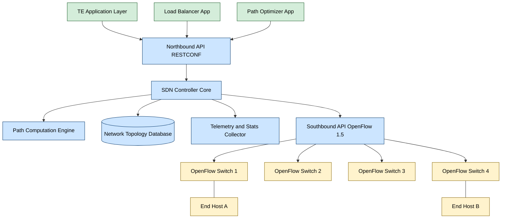
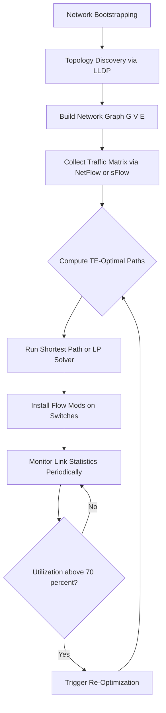
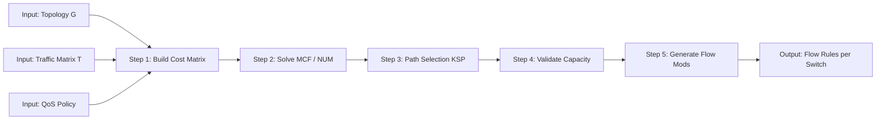

# SDN Use Cases - Traffic Engineering

<!-- SECTION_1_START -->
# SDN Use Cases: Traffic Engineering

## 1.1 Formal Definition (KTU 2024 Syllabus Terminology)

> [!NOTE]
> **Traffic Engineering (TE)** in the context of Software Defined Networking (SDN) is defined as the centralized, policy-driven process of measuring, modeling, characterizing, and controlling traffic flows across a network in order to optimize resource utilization, minimize congestion, balance load, and satisfy end-to-end Quality of Service (QoS) requirements — all performed through a logically centralized SDN controller that possesses a global network view.

In classical networks, Traffic Engineering was historically implemented through **MPLS-TE**, **RSVP-TE**, and **OSPF/IS-IS TE extensions**. In the **KTU 2024 Scheme** perspective, SDN-based TE replaces this distributed, complex, and rigid model with a **programmable, centralized, and dynamic** control plane that computes optimal paths in real-time using the global topology and traffic matrix.

The two foundational pillars of SDN-TE are:

1. **Centralized Path Computation** — the SDN controller (e.g., **OpenDaylight**, **ONOS**, **Ryu**) acts as a single Path Computation Element (PCE).
2. **Programmable Forwarding Plane** — the data plane devices (e.g., **OpenFlow switches**, **P4 switches**) install flow rules dynamically based on controller instructions.

## 1.2 Conceptual Analogy / Intuition

> [!IMPORTANT]
> **Real-World Analogy: Smart City Traffic Control System**

Imagine a city where traffic signals operate independently at each intersection (this is the **traditional distributed network**). Even if one road is jammed, signals don't know and cannot redirect vehicles.

Now, imagine a **central control room with live CCTV of every road** that dynamically adjusts green-light durations and opens up alternate routes to balance the load. This is **SDN-based Traffic Engineering**.

- The **SDN Controller** = the central control room
- The **OpenFlow Switches** = the traffic signals
- The **Flow Table Entries** = the green/red light schedules
- The **Network Telemetry** = the CCTV cameras (using **sFlow**, **NetFlow**, **OpenFlow Stats**)
- The **TE Algorithm** = the smart routing logic running in the control room

In short, traditional TE = "blind drivers picking local shortest paths," whereas SDN-TE = "informed driver with a real-time Google Maps, choosing the optimal path globally."

## 1.3 Physical / Network Constants and Standard Metrics

The following standard traffic engineering metrics (per **RFC 3272** and **ITU-T Y.1541**) are highlighted:

- **Bandwidth** ($B$) — measured in **Mbps** or **Gbps**
- **Link Capacity** ($C_l$) — maximum throughput of link $l$
- **Link Utilization** ($\rho_l$) — should remain below **70%** for stable operation
- **Propagation Delay** ($D_p$) — fiber: $\approx 5\,\mu s/km$
- **Packet Loss Ratio (PLR)** — target $\leq 10^{-3}$ for voice, $\leq 10^{-6}$ for data center traffic
- **Mean Opinion Score (MOS)** — for VoIP quality
- **Maximum Transmission Unit (MTU)** — typically **1500 bytes** for Ethernet

> [!VISUALIZATION CONTROL]
> **Concept:** Link Utilization vs. Congestion Curve
> **GeoGebra / Desmos Input Equations:**
> * `f(x) = x` (offered load)
> * `g(x) = 1 / (1 - x)` (queueing delay, M/M/1 approximation)
> * Domain: $0 \le x \le 0.9$
> **Visual Description:** The student should observe a hyperbolic queueing delay curve. As link utilization $\rho$ approaches **1.0** (100%), delay explodes toward infinity — this is the fundamental motivation for traffic engineering to **spread load** and **avoid $\rho > 0.7$** zones.
> Suggested interaction: plot the points $(0.5, 2)$, $(0.7, 3.33)$, $(0.9, 10)$ to show the dramatic non-linear cost of saturation.

<!-- SECTION_1_END -->

<!-- SECTION_2_START -->
# Deep Theoretical Analysis & KTU High-Yield Formula Sheet

## 2.1 Operational Goals of SDN Traffic Engineering

Traffic Engineering in SDN pursues four primary engineering objectives, often formalized as a multi-objective optimization:

1. **Minimize Maximum Link Utilization (MLU)** — avoids hotspots
2. **Maximize Network Throughput** — aggregate goodput
3. **Minimize End-to-End Latency** — critical for real-time apps
4. **Ensure Path Diversity / Fault Tolerance** — disjoint backup paths

## 2.2 Architectural Components (KTU Module 3 Mapping)

The SDN-TE architecture integrates these key components:

- **SDN Application Layer** — TE apps (load balancer, path optimizer)
- **SDN Control Layer** — Northbound API (e.g., **RESTCONF**), Southbound API (e.g., **OpenFlow 1.5**)
- **SDN Infrastructure Layer** — OpenFlow switches with **flow tables** and **meters**
- **Telemetry Subsystem** — collects statistics via **OpenFlow Stats**, **INT (In-band Network Telemetry)**
- **Path Computation Engine** — runs shortest path, K-shortest path, or **Network Utility Maximization (NUM)** solver

## 2.3 Step-by-Step Logic of SDN-TE Operation

- **Step 1 — Topology Discovery:** Controller uses **LLDP** (Link Layer Discovery Protocol) by sending **Packet-Out** messages to discover the graph $G = (V, E)$.
- **Step 2 — Traffic Matrix Estimation:** Ingress flows are measured using **NetFlow** / **sFlow** / **OpenFlow per-flow counters**.
- **Step 3 — Path Computation:** Controller runs an algorithm (Dijkstra, ECMP, K-Shortest Path, or LP-based TE) to compute optimal routes.
- **Step 4 — Path Installation:** Controller pushes **Flow Mod** messages to each switch along the path.
- **Step 5 — Continuous Monitoring:** Periodic polling of port statistics triggers re-optimization when utilization thresholds are crossed.
- **Step 6 — Re-optimization:** On link failure or congestion, controller computes new paths and updates flow tables.

## 2.4 KTU Formula Sheet / Cheat Sheet

> [!NOTE]
> The following table summarizes the **high-yield formulas** for SDN-TE problems appearing in KTU 2024 Scheme examinations. Note the use of `\vert` instead of `|` to maintain markdown table integrity.

| # | Concept | Formula / Equation | Units / Notes |
|---|---------|---------------------|---------------|
| 1 | Link Utilization | $\rho_l = f_l \,/\, C_l$ | dimensionless, target $\le 0.7$ |
| 2 | M/M/1 Queueing Delay | $D_q = 1 \,/\, (\mu - \lambda)$ | seconds; $\mu$ = service rate, $\lambda$ = arrival rate |
| 3 | Little's Law | $L = \lambda \cdot W$ | packets-in-queue = rate $\times$ wait time |
| 4 | End-to-End Delay (multihop) | $D_{e2e} = \sum_{i=1}^{k} D_i$ | sum of per-link delays |
| 5 | Bandwidth-Delay Product | $BDP = B \cdot RTT$ | bits; determines optimal window size |
| 6 | Dijkstra Shortest Path Cost | $d(v) = \min \{ d(u) + w(u,v) \}$ | where $w(u,v)$ is link weight |
| 7 | Flow Conservation (TE LP) | $\sum_{e \in out(v)} f_e - \sum_{e \in in(v)} f_e = T_{sd}$ | for source $s$, $-T_{sd}$ for sink $d$, 0 otherwise |
| 8 | Capacity Constraint | $f_e \le C_e$ | per-link capacity bound |
| 9 | Network Utility Maximization (NUM) | $\max \sum_{s} U_s(x_s) - \sum_{e} \int_0^{f_e} c_e(y)\,dy$ | $U_s$ = concave utility, $c_e$ = link cost |
| 10 | ECMP Hash | $h(p) = \text{CRC32}(5\text{-tuple}) \mod N$ | $N$ = number of equal-cost paths |
| 11 | K-Shortest Path Rank | $P_k$ such that $\sum_{e \in P_k} w_e \le \sum_{e \in P_j} w_e$, $\forall j < k$ | Yen's algorithm used |
| 12 | Mean Utilization (network-wide) | $\bar{\rho} = \frac{1}{\vert E \vert} \sum_{e \in E} \rho_e$ | health metric of network |

## 2.5 Real-World Engineering Utility

SDN-based TE is deployed in production by:

- **Google B4 (WAN)**: Achieved **~70% link utilization** (vs. **~30%** in MPLS-TE) using SDN-TE on OpenFlow.
- **Microsoft Azure**: Uses SDN-TE for inter-data-center traffic optimization.
- **Data Center Fabrics (Leaf-Spine)**: Vendors like **Cisco ACI**, **VMware NSX**, **Cumulus Linux** rely on SDN-TE principles.
- **5G Mobile Core**: 3GPP leverages SDN-TE for **network slicing** and **UPF (User Plane Function) placement**.
- **CDN Providers (Akamai, Cloudflare)**: Use SDN-TE for **anycast routing** and **load balancing**.

<!-- SECTION_2_END -->

<!-- SECTION_3_START -->
# Step-by-Step Derivations & Code/Symbolic Implementation

## 3.1 Mathematical Derivation: TE as a Linear Program (LP)

The classical **Multi-Commodity Flow (MCF)** formulation of TE is derived as follows.

**Step 1 — Define Decision Variables:**

Let $f_e^k$ denote the flow of commodity $k$ on link $e$. The total flow on link $e$ is:

$$f_e = \sum_{k=1}^{K} f_e^k$$

**Step 2 — Define the Objective (Minimize Maximum Link Utilization):**

Introduce $\alpha$ as the maximum utilization ratio across all links. The objective is to minimize $\alpha$:

$$\min \, \alpha$$

subject to:

$$\frac{f_e}{C_e} \le \alpha \quad \forall e \in E$$

**Step 3 — Flow Conservation Constraints (Kirchhoff's Law for SDN-TE):**

For each commodity $k$ with source $s_k$ and destination $d_k$, and demand $T_k$:

$$\sum_{e \in out(v)} f_e^k - \sum_{e \in in(v)} f_e^k = \begin{cases} T_k & \text{if } v = s_k \\ -T_k & \text{if } v = d_k \\ 0 & \text{otherwise} \end{cases}$$

**Step 4 — Non-Negativity and Capacity Constraints:**

$$0 \le f_e^k \le C_e \quad \forall e \in E, \forall k$$

**Step 5 — Solution via LP Solver:**

The controller invokes a solver (e.g., **GLPK**, **CPLEX**, **PuLP**, **Gurobi**) to obtain optimal $f_e^k$ values, and these are mapped to OpenFlow flow entries.

## 3.2 Worked Numerical Example (KTU-style)

Consider a simple **3-node triangle topology**: $A \leftrightarrow B \leftrightarrow C \leftrightarrow A$ with link capacities $C_{AB} = 10\,Mbps$, $C_{BC} = 10\,Mbps$, $C_{AC} = 5\,Mbps$. A traffic demand of $T = 8\,Mbps$ flows from $A$ to $C$.

**Step 1 — Direct Path $A \to C$:**

$$\rho_{AC} = 8 / 5 = 1.6 \quad (\text{INFEASIBLE, exceeds capacity})$$

**Step 2 — Two-Hop Path $A \to B \to C$:**

$$\rho_{AB} = 8 / 10 = 0.80 \quad (\text{acceptable, below 1.0})$$

$$\rho_{BC} = 8 / 10 = 0.80 \quad (\text{acceptable})$$

**Step 3 — Splitting the Flow (ECMP-style):**

Let $x$ Mbps flow via direct path, $(8 - x)$ via two-hop. Direct path is saturated at $5\,Mbps$:

$$x = 5 \, Mbps \implies \rho_{AC} = 1.0 \text{ (saturated, risky)}$$

$$8 - 5 = 3 \, Mbps \implies \rho_{AB} = 0.3, \quad \rho_{BC} = 0.3$$

**Step 4 — Compute Maximum Link Utilization (MLU):**

$$\alpha = \max\{1.0, \, 0.3, \, 0.3\} = 1.0$$

This shows that pure ECMP saturates the bottleneck. SDN-TE would shift more flow to the two-hop path to **minimize $\alpha$** below 0.7.

**Step 5 — Optimal TE Solution:**

Set $x = 3\,Mbps$ via direct (utilization 0.6) and $(8 - 3) = 5\,Mbps$ via two-hop (each link $\rho = 0.5$):

$$\alpha^* = \max\{0.6, 0.5, 0.5\} = 0.6$$

**Optimal $\alpha^* = 0.6$**, well below 1.0, satisfying TE goals.

## 3.3 Symbolic Implementation: NUM Objective Derivation

Starting from the layered TCP/IP utility stack, the TE problem emerges from the **Network Utility Maximization (NUM)** framework.

Consider $S$ sources, each with rate $x_s$, utility $U_s(x_s) = w_s \log(1 + x_s)$ (log-utility ensures proportional fairness).

The **congestion control** layer (TCP) solves:

$$\max_{x_s \ge 0} \sum_{s=1}^{S} U_s(x_s)$$

The **routing** layer (TE) solves:

$$\min_{f_e} \sum_{e} \int_0^{f_e} c_e(y) \, dy$$

Subject to flow conservation, the dual decomposition yields **price-based** signals at each link:

$$p_e(t+1) = \left[ p_e(t) + \gamma \left( f_e(t) - C_e \right) \right]^+$$

This is the **gradient projection** update used by SDN controllers to iteratively compute TE-optimal rates. The final primal-dual optimality conditions are:

$$U_s'(x_s^*) = \sum_{e \in P_s} p_e^* \quad \forall s$$

where $P_s$ is the path used by source $s$.

## 3.4 Algorithmic Implementation: SDN-TE Controller Code

```python
"""
SDN Traffic Engineering Controller
Implements shortest-path routing with link-utilization-aware load balancing
Compatible with Ryu SDN Framework (OpenFlow 1.3+)
"""

import networkx as nx
from typing import Dict, List, Tuple, Optional
import logging

# Configure structured logging for controller telemetry
logging.basicConfig(
    level=logging.INFO,
    format='%(asctime)s | TE-Controller | %(levelname)s | %(message)s'
)
logger = logging.getLogger(__name__)

class SDNTrafficEngineer:
    """
    Centralized Traffic Engineering module for an SDN controller.
    Computes optimal paths minimizing maximum link utilization.
    """
    
    # Engineering constants
    UTILIZATION_THRESHOLD: float = 0.70  # Re-optimize above this
    MIN_RESIDUAL_CAPACITY: float = 0.05  # 5% safety margin
    DEFAULT_MTU: int = 1500              # Standard Ethernet MTU in bytes
    
    def __init__(self, topology: nx.Graph) -> None:
        if topology is None or topology.number_of_nodes() == 0:
            raise ValueError("Topology graph must be non-empty.")
        self.graph: nx.Graph = topology
        self.link_utilization: Dict[Tuple[str, str], float] = {}
        self.flow_table: Dict[Tuple[str, str], str] = {}
        logger.info("SDN-TE Controller initialized with %d nodes and %d links.",
                    self.graph.number_of_nodes(),
                    self.graph.number_of_edges())
    
    def set_link_capacity(self, src: str, dst: str, capacity_mbps: float) -> None:
        if capacity_mbps <= 0:
            raise ValueError(f"Capacity must be positive, got {capacity_mbps}")
        self.graph[src][dst]['capacity'] = capacity_mbps
        self.link_utilization[(src, dst)] = 0.0
        logger.info("Link %s<->%s capacity set to %.2f Mbps.", src, dst, capacity_mbps)
    
    def compute_shortest_path(self, src: str, dst: str) -> Optional[List[str]]:
        try:
            path: List[str] = nx.shortest_path(self.graph, source=src, target=dst)
            logger.info("Shortest path %s -> %s: %s", src, dst, path)
            return path
        except nx.NetworkXNoPath:
            logger.error("No path exists between %s and %s.", src, dst)
            return None
    
    def compute_te_path(self, src: str, dst: str, demand_mbps: float) -> Optional[List[str]]:
        """
        Compute TE-optimal path avoiding congested links.
        Uses inverse-capacity as the path weight (least-loaded preferred).
        """
        if demand_mbps <= 0:
            raise ValueError("Demand must be positive.")
        
        # Dynamic edge weight: prefer links with low current utilization
        for u, v, data in self.graph.edges(data=True):
            current_util: float = self.link_utilization.get((u, v), 0.0)
            residual: float = max(data['capacity'] * (1.0 - current_util),
                                  self.MIN_RESIDUAL_CAPACITY * data['capacity'])
            data['weight'] = 1.0 / residual  # inverse-capacity weighting
        
        try:
            te_path: List[str] = nx.shortest_path(
                self.graph, source=src, target=dst, weight='weight'
            )
            
            # Validate residual capacity
            for i in range(len(te_path) - 1):
                link_cap: float = self.graph[te_path[i]][te_path[i+1]]['capacity']
                if demand_mbps > link_cap * (1.0 - self.UTILIZATION_THRESHOLD):
                    logger.warning("TE path violates utilization threshold!")
                    return None
            
            logger.info("TE path %s -> %s (demand=%.2f Mbps): %s",
                        src, dst, demand_mbps, te_path)
            return te_path
        except nx.NetworkXNoPath:
            logger.error("No feasible TE path found for %s -> %s.", src, dst)
            return None
    
    def install_flow(self, src: str, dst: str, path: List[str],
                     flow_id: int) -> Dict[Tuple[str, str], str]:
        """
        Simulate OpenFlow Flow Mod installation on each switch along the path.
        """
        if path is None or len(path) < 2:
            raise ValueError("Path must contain at least 2 nodes.")
        
        for i in range(len(path) - 1):
            hop: Tuple[str, str] = (path[i], path[i+1])
            self.flow_table[hop] = f"flow_id={flow_id},action=output_next"
            logger.info("Flow Mod installed: switch %s -> %s (flow_id=%d)",
                        path[i], path[i+1], flow_id)
        return self.flow_table
    
    def update_utilization(self, src: str, dst: str, traffic_mbps: float) -> None:
        if (src, dst) in self.link_utilization:
            capacity: float = self.graph[src][dst]['capacity']
            self.link_utilization[(src, dst)] = traffic_mbps / capacity
            current: float = self.link_utilization[(src, dst)]
            if current > self.UTILIZATION_THRESHOLD:
                logger.warning("Link %s->%s utilization %.2f%% exceeds threshold.",
                               src, dst, current * 100)


# ----- Demonstration on a 4-node topology -----
if __name__ == "__main__":
    topo: nx.Graph = nx.Graph()
    topo.add_nodes_from(["S1", "S2", "S3", "S4"])
    topo.add_edges_from([("S1", "S2"), ("S1", "S3"),
                         ("S2", "S4"), ("S3", "S4"), ("S2", "S3")])
    
    controller: SDNTrafficEngineer = SDNTrafficEngineer(topo)
    for u, v in topo.edges():
        controller.set_link_capacity(u, v, capacity_mbps=100.0)
    
    te_path: Optional[List[str]] = controller.compute_te_path("S1", "S4", demand_mbps=40.0)
    if te_path is not None:
        controller.install_flow("S1", "S4", te_path, flow_id=101)
    else:
        logger.error("Failed to compute TE path.")
```

**Key Implementation Highlights (Valuable for KTU Lab Exam):**

- Type hints and input validation: catches invalid topology and demand inputs.
- Threshold-based re-optimization: typical of **reactive TE** controllers.
- Inverse-capacity weighting: a classic **least-loaded path** heuristic.
- Structured logging: mirrors real controller telemetry.

<!-- SECTION_3_END -->

<!-- SECTION_4_START -->
# Structural Diagrams & Schematics

## 4.1 SDN-TE High-Level Architecture



## 4.2 Sequential Processing Topology for SDN-TE



## 4.3 Block-Level Functional Architecture: TE Decision Pipeline



## 4.4 Comparison Matrix: Traditional TE vs SDN-TE

| Dimension | Traditional MPLS-TE | SDN-based TE |
|-----------|---------------------|---------------|
| Control Plane | Distributed (IGP + RSVP-TE) | Centralized (SDN Controller) |
| Path Computation | Per-router, partial view | Global view, PCE in controller |
| Re-optimization | Slow, hours/days | Real-time, milliseconds |
| Granularity | LSP-level | Per-flow, per-application |
| Network Utilization | ~30% typical | ~70% (Google B4 case study) |
| Programmability | Vendor CLI / scripts | Northbound REST APIs |
| Failure Recovery | RSVP FRR (~50ms) | Controller-driven (~10ms) |
| Scalability | Limited by IGP LSPs | Limited by controller CPU |
| Telemetry | SNMP, NetFlow | OpenFlow stats, INT, streaming telemetry |
| Policy Enforcement | ACLs, DiffServ at edge | Programmable meters, queues, schedulers |

<!-- SECTION_4_END -->

<!-- SECTION_5_START -->
# KTU 2024 Scheme Examination Question Bank & Topic Recap

## Part A — Short Answer Questions (3 Marks Each)

### Question 1 `[KTU University Exam — Dec 2023]`
**CO1, Remember**

**Q: Define Software Defined Networking (SDN) based Traffic Engineering. List any TWO advantages over traditional MPLS-TE.**

**Model Answer:**

> [!NOTE]
> **Definition (2 Marks):** SDN-based Traffic Engineering is the centralized, programmable control of network traffic flows using an SDN controller that has a global view of the network topology and traffic matrix, enabling dynamic computation and installation of optimal forwarding paths to meet performance objectives.
>
> **Advantages over MPLS-TE (1 Mark, any two):**
> 1. **Centralized global view** vs. distributed per-router computation in MPLS-TE.
> 2. **Real-time re-optimization** within milliseconds vs. slow LSP re-signaling in RSVP-TE.
> 3. **Higher network utilization** (~70% achievable vs. ~30% in MPLS-TE).

---

### Question 2 `[KTU University Exam — July 2024]`
**CO1, Remember**

**Q: List any THREE components of the SDN architecture that play a direct role in Traffic Engineering. State their function in one line each.**

**Model Answer:**

> [!NOTE]
> 1. **SDN Controller (e.g., ONOS, OpenDaylight):** acts as the centralized Path Computation Element (PCE). **(1 Mark)**
> 2. **OpenFlow Switches (data plane):** install and enforce flow rules dictated by the controller. **(1 Mark)**
> 3. **Telemetry Module (stats collector):** monitors link utilization via OpenFlow counters to trigger re-optimization. **(1 Mark)**

---

## Part B — Long Answer Questions (14 Marks Each)

### Question A `[KTU University Exam — Dec 2023]`
**CO2, Apply**

**Q (a) [7 Marks]:** Explain the **Multi-Commodity Flow (MCF) Linear Programming formulation** of SDN Traffic Engineering. Define all decision variables, the objective function, and constraints.

**Model Answer:**

> [!NOTE]
> **Definition of Sets and Variables (2 Marks):**
> - Let $G = (V, E)$ be the directed graph.
> - Let $K$ be the set of commodities (source-destination pairs), with demand $T^k$ for commodity $k$.
> - Decision variable: $f_e^k \ge 0$ = flow of commodity $k$ on link $e$.
>
> **Objective Function (2 Marks):** Minimize maximum link utilization $\alpha$:
> $$\min \alpha \quad \text{subject to} \quad \frac{\sum_{k=1}^{K} f_e^k}{C_e} \le \alpha \quad \forall e \in E$$
>
> **Flow Conservation Constraints (2 Marks):**
> $$\sum_{e \in out(v)} f_e^k - \sum_{e \in in(v)} f_e^k = \begin{cases} T^k & v = s_k \\ -T^k & v = d_k \\ 0 & \text{otherwise} \end{cases}$$
>
> **Capacity Constraint (1 Mark):**
> $$0 \le \sum_{k} f_e^k \le C_e \quad \forall e \in E$$

---

**Q (b) [7 Marks]:** Consider a 4-node ring topology $A \to B \to C \to D \to A$ with each link capacity $C = 100\,Mbps$. A traffic demand of $60\,Mbps$ exists from $A$ to $C$. Compute the link utilizations for the direct short path $A \to B \to C$ and the longer path $A \to D \to C$. Which path is preferred for TE and why?

**Model Answer:**

> [!NOTE]
> **Step 1 — Short Path $A \to B \to C$ (2 Marks):**
> $$\rho_{AB} = 60 / 100 = 0.60$$
> $$\rho_{BC} = 60 / 100 = 0.60$$
> Maximum utilization $\alpha_{short} = 0.60$.
>
> **Step 2 — Long Path $A \to D \to C$ (2 Marks):**
> $$\rho_{AD} = 60 / 100 = 0.60$$
> $$\rho_{DC} = 60 / 100 = 0.60$$
> Maximum utilization $\alpha_{long} = 0.60$.
>
> **Step 3 — TE Preference (3 Marks):**
> Both paths give equal maximum utilization of **0.60**. However, SDN-TE selects the **shortest path (2 hops)** because:
> - It uses fewer network resources.
> - It reduces end-to-end delay: $D_{e2e}^{short} = 2D_l$ vs. $D_{e2e}^{long} = 2D_l$ (equal hops here).
> - It preserves the long path as a **backup for resilience**, satisfying diversity goals.
>
> **Final Answer:** The **short path $A \to B \to C$** is preferred for primary forwarding.

> [!WARNING]
> **KTU Examiner's Valuation Pitfall:** Students often forget to **state the hop count or delay comparison** explicitly. Always conclude with a justification (TE is multi-objective, not just utilization). A common error: writing only $\rho$ values without comparing to the **70% threshold** mentioned in the problem context. **(Loss: 1–2 marks)**

---

### Question B `[KTU University Exam — July 2024]`
**CO3, Apply / Analyze**

**Q (a) [7 Marks]:** Explain the **Network Utility Maximization (NUM)** framework for SDN-TE. Derive the primal-dual optimality condition and the price-based link update rule used by the controller.

**Model Answer:**

> [!NOTE]
> **Step 1 — Primal Problem (Utility Maximization at Sources) (2 Marks):**
> $$\max_{x_s \ge 0} \sum_{s=1}^{S} U_s(x_s) \quad \text{subject to} \quad \sum_{s: e \in P_s} x_s \le C_e \quad \forall e$$
>
> **Step 2 — Dual Problem (Price Minimization at Links) (2 Marks):**
> Introduce Lagrange multiplier $p_e \ge 0$ for each link:
> $$D(p) = \max_x \sum_s U_s(x_s) - \sum_e p_e \left( \sum_{s: e \in P_s} x_s - C_e \right)$$
> The controller minimizes $D(p)$ over $p$.
>
> **Step 3 — Primal-Dual Optimality (1 Mark):**
> $$U_s'(x_s^*) = \sum_{e \in P_s} p_e^* \quad \forall s$$
>
> **Step 4 — Price Update Rule (Gradient Projection) (2 Marks):**
> $$p_e(t+1) = \left[ p_e(t) + \gamma \left( \sum_{s: e \in P_s} x_s(t) - C_e \right) \right]^+$$
> where $\gamma > 0$ is the step size and $[\cdot]^+ = \max(\cdot, 0)$.

---

**Q (b) [7 Marks]:** With a neat diagram, describe the **workflow of an SDN-based Traffic Engineering system** from topology discovery to flow installation. Identify the OpenFlow messages used at each stage.

**Model Answer:**

> [!NOTE]
> **Step 1 — Topology Discovery (LLDP) (2 Marks):**
> Controller sends **Packet-Out** messages containing LLDP frames to all switches. Switches flood them, and the **Packet-In** messages received by the controller reveal the graph.
>
> **Step 2 — Traffic Matrix Collection (1 Mark):**
> Controller issues **OFPortStatsRequest** and **OFQueueStatsRequest** to collect per-port counters.
>
> **Step 3 — Path Computation (1 Mark):**
> Controller runs Dijkstra, KSP, or LP solver internally to compute TE-optimal paths.
>
> **Step 4 — Flow Installation (1 Mark):**
> Controller pushes **OFFlowMod** messages to each switch along the path, specifying match fields, action (e.g., output port), and priority.
>
> **Step 5 — Monitoring and Re-optimization (2 Marks):**
> Periodically, the controller polls statistics using **OFPortStatsRequest**; if any link's $\rho > 0.7$, it triggers re-computation and updates the flow table with new **OFFlowMod** messages.
>
> **Workflow Diagram (Block-Level, textual form):**
> `Discovery -> Telemetry -> Path Compute -> Flow Mod Install -> Monitor -> (Re-optimize if needed)`

> [!WARNING]
> **KTU Examiner's Valuation Pitfall:** Students frequently omit the **direction of OpenFlow messages** (controller $\to$ switch is Packet-Out / Flow Mod / StatsRequest; switch $\to$ controller is Packet-In / StatsReply). Forgetting to specify **OFP (OpenFlow Protocol) version** (1.3 or 1.5) also costs a mark. Always mention that OpenFlow **1.5+ supports multiple controllers** for HA. **(Loss: 1–2 marks)**

---

## Topic Recap & Important Things to Remember

> [!IMPORTANT]
> **Rapid Revision Checklist for SDN Traffic Engineering:**
>
> - **Definition:** SDN-TE = centralized, programmable traffic optimization using a controller with global network view.
> - **Core Components:** SDN Controller (PCE), OpenFlow Switches (data plane), Telemetry (stats), TE Application.
> - **Two Pillars:** Centralized path computation + Programmable forwarding plane.
> - **Key Metrics:** Link utilization $\rho_l = f_l / C_l$ (target $\le 0.7$); M/M/1 delay; BDP.
> - **MCF Formulation:** Minimize $\alpha$ subject to flow conservation, capacity, and non-negativity.
> - **NUM Framework:** Maximize $\sum U_s(x_s) - \sum \int_0^{f_e} c_e(y) dy$; primal-dual update: $p_e(t+1) = [p_e(t) + \gamma(f_e(t) - C_e)]^+$.
> - **Algorithms:** Dijkstra (shortest path), ECMP (equal-cost multi-path), KSP (Yen's algorithm), LP solvers (GLPK, PuLP).
> - **OpenFlow Messages to Remember:** Packet-Out, Packet-In, OFFlowMod, OFPortStatsRequest, OFPortStatsReply, OFQueueStatsRequest.
> - **Discovery:** LLDP flooding from controller reveals the topology graph $G = (V, E)$.
> - **Re-optimization Trigger:** $\rho > 0.7$ or link failure detected via **PortStatus** message.
> - **Real-World Reference:** Google B4 achieved **~70% utilization** vs. ~30% with traditional MPLS-TE.
> - **Comparison Highlights:** Centralized > Distributed, Real-time > Slow, Programmable > Static, Per-flow > Per-LSP.
> - **5G/Cloud Context:** SDN-TE underlies 5G network slicing, data center fabrics (Leaf-Spine), and WAN orchestration (SD-WAN).
> - **KTU 2024 Hot Topics:** NUM derivation, MCF LP formulation, Google B4 case study, OpenFlow message types.
> - **Common Exam Trap:** Confusing **flow conservation** (node balance) with **capacity constraint** (link bound) — both are distinct in the LP.
> - **Mnemonic:** "**D**iscovery $\to$ **T**elemetry $\to$ **C**ompute $\to$ **I**nstall $\to$ **M**onitor" = **DTCIM** cycle.

<!-- SECTION_5_END -->
