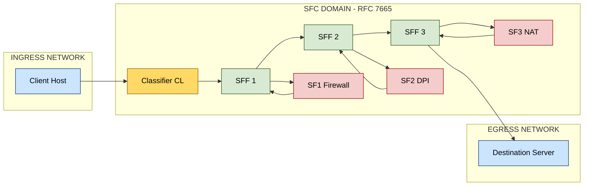
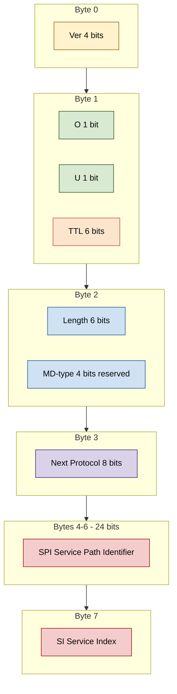
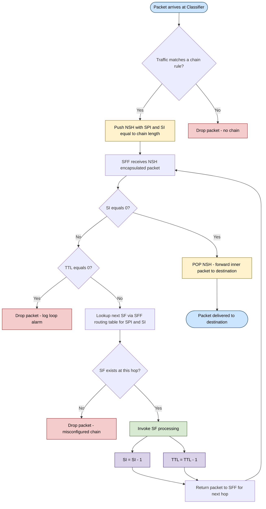
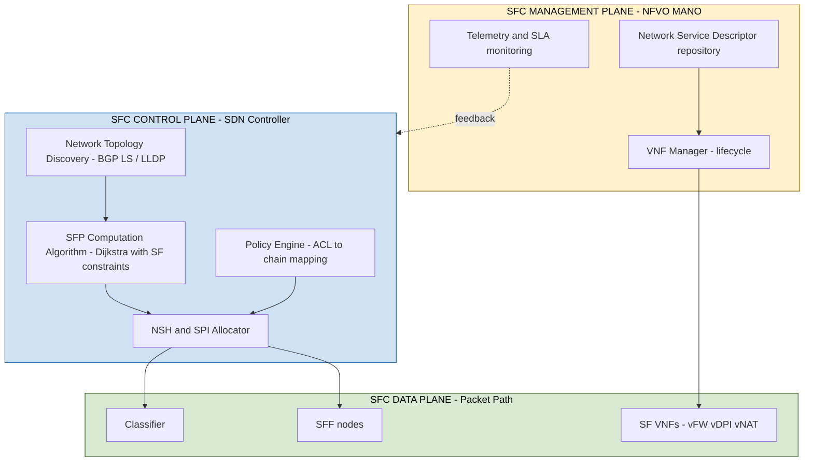

# Service Function Chaining (SFC)

<!-- SECTION_1_START -->
# Service Function Chaining (SFC) — Core Technical Definition & Intuition

## 1.1 Formal Academic Definition (KTU 2024 Syllabus Terminology)

**Service Function Chaining (SFC)** is a Network Function Virtualization (NFV) and Software-Defined Networking (SDN) capability that enables the creation of composite network services by steering traffic flows through an **ordered, non-coherent sequence of independent Service Functions (SFs)** before reaching its destination. It is standardized by the **IETF Service Function Chaining Working Group (IETF SFC WG)** under **RFC 7665** (architecture) and **RFC 8300** (Network Service Header — NSH).

> [!IMPORTANT]
> **KTU Board Definition (Verbatim Recall Value):**
> SFC is the process of defining, instantiating, and orchestrating an ordered list of abstract network services (L4–L7) — such as firewalls, Deep Packet Inspection (DPI), Network Address Translation (NAT), WAN optimizers, and Load Balancers — that must be applied to packets/frames of a specific traffic class as they traverse the network.

The four foundational architectural abstractions of SFC are:

1. **Service Function (SF)** — An individual L4–L7 function (physical or virtual appliance).
2. **Service Function Forwarder (SFF)** — A logical entity that forwards packets between SFs along the Service Function Path.
3. **Classifier (CL)** — The ingress node that classifies traffic and steers it into the correct chain.
4. **Service Function Chain (SFC) / Service Function Path (SFP)** — The ordered sequence (chain) and the realized routing path through the topology.

> [!NOTE]
> **Key Board Distinction:** An *SFC* is the **abstract, ordered list** of SFs (e.g., FW → DPI → NAT). The *SFP* is the **physical/logical instantiation** of that chain across the network, which may have multiple valid routings.

## 1.2 Conceptual Analogy — The "Airport Security Pipeline"

Imagine a passenger (the **packet**) arriving at an international airport:

| Step | Real-World Action | SFC Equivalent |
|------|-------------------|----------------|
| 1 | Check-in counter decides your gate | **Classifier** — matches traffic flow to a chain |
| 2 | Passport control (mandatory) | **SF #1** — Firewall |
| 3 | Customs check | **SF #2** — DPI / IDS |
| 4 | Duty-free payment & currency exchange | **SF #3** — NAT / Load Balancer |
| 5 | Boarding gate (exit to plane) | **SFF** — forwards to next hop or destination |

The passenger **must** pass through every counter in a fixed, ordered sequence, but each counter operates **independently** (non-coherent). If you add a new check (e.g., COVID screening), you just **insert** it into the chain without redesigning the entire airport — exactly how SFC enables agile, dynamic service composition.

> [!TIP]
> **Geometric/Vector Intuition:** Think of traffic as a vector $\vec{P}$ entering the network. The SFC applies a sequence of transformation functions $f_1, f_2, \dots, f_n$ such that the egress packet is:
>
> $$\vec{P}_{egress} = f_n \circ f_{n-1} \circ \dots \circ f_2 \circ f_1(\vec{P}_{ingress})$$
>
> The "$\circ$" (composition) operator is the key — order matters, and the chain is *non-commutative*.

## 1.3 Physical Constants and Standard Metrics

- **Default NSH Base Header length:** **8 bytes** (fixed); total NSH = base + context headers = **8 + 4N bytes** (where $N$ is the number of 4-byte context headers).
- **Service Path Identifier (SPI):** **24-bit** field — uniquely identifies the chain.
- **Service Index (SI):** **8-bit** field — indicates position in the chain; defaults to **255** at ingress, decremented at each hop.
- **NSH Next Protocol:** Standardized value **0x894F** (registered EtherType).
- **IETF RFC references:** **RFC 7665** (Problem Statement & Architecture), **RFC 8300** (NSH), **RFC 8924** (SFC encapsulation considerations).

> [!VISUALIZATION CONTROL]
> **Concept:** Linear Service Function Path (SFP) Topology Visualization
> **GeoGebra / Desmos Input Equations:**
> * Point set: $\text{Classifier} = (0, 0)$, $\text{SF1} = (2, 1)$, $\text{SF2} = (4, 0)$, $\text{SF3} = (6, -1)$, $\text{Dest} = (8, 0)$
> * Connecting lines: $\text{Line}((0,0),(2,1))$, $\text{Line}((2,1),(4,0))$, $\text{Line}((4,0),(6,-1))$, $\text{Line}((6,-1),(8,0))$
> **Visual Description:** Observe the **monotonic decrement** of the SI value along the x-axis: $SI = 255 \to 254 \to 253 \to 252$, terminating at the destination. The y-axis oscillation represents traffic *transformation* (stateful SFs may shift the packet classification state).

<!-- SECTION_1_END -->

<!-- SECTION_2_START -->
# Deep Theoretical Analysis & KTU High-Yield Formula Sheet

## 2.1 Layered SFC Architecture (Per RFC 7665)

The SFC architecture is decomposed into **three orthogonal planes**:

| Plane | Responsibility | Key Entities |
|-------|----------------|--------------|
| **Data Plane** | Packet encapsulation, forwarding, SF execution | Classifier, SFF, SF, NSH |
| **Control Plane** | Topology discovery, SFP computation, NSH/SPI assignment | SDN Controller (e.g., OpenDaylight SFC Plugin), BGP-LS |
| **Management Plane** | Service orchestration, lifecycle, telemetry | NFV Orchestrator (NFVO), Element Manager |

> [!NOTE]
> **KTU Hot Question Pattern:** Examiners frequently ask *"How does the SFC control plane differ from the data plane?"* — Memorize the table above as the canonical answer.

## 2.2 The Network Service Header (NSH) — RFC 8300

NSH is the **service-plane metadata envelope** that rides alongside the original payload. It is typically encapsulated inside **VXLAN-GPE** or **GRE** at the underlay.

### 2.2.1 NSH Base Header (8 Bytes) — Bit-Level Structure

$$\begin{aligned}
\text{NSH}_{\text{Base}} &= \underbrace{\text{Ver:4 \vert O:1 \vert U:1 \vert TTL:6}}_{\text{4 bytes (Version + Flags + TTL)}} \\
&\quad \vert \underbrace{\text{Length:6 \vert MD-type:4 \vert Next-Protocol:8}}_{\text{4 bytes (Length + Metadata Type + Next Protocol)}}
\end{aligned}$$

Followed by the **Service Path Header (4 bytes)**:

$$\text{Service Path Header} = \underbrace{\text{SPI:24}}_{\text{24-bit Service Path ID}} \;\vert\; \underbrace{\text{SI:8}}_{\text{8-bit Service Index}$$

### 2.2.2 Context Headers (Optional, Variable — $4N$ bytes)

Carry out-of-band metadata (e.g., tenant ID, slice ID, QoS class). Each context header is exactly **32 bits**, and the **MD-type** field of the base header dictates its semantics (e.g., MD-type = 0x1 = "Topology Context").

## 2.3 The SFC Forwarding Algorithm

The **SFF** at each hop executes a deterministic lookup:

$$\text{Next Hop} = \text{LookupTable}\big(\text{SPI}_{pkt}, \text{SI}_{pkt}\big) = \begin{cases}
\text{(SF}_i, \text{new\_SI} = \text{SI} - 1) & \text{if SF}_i \text{ exists at this hop} \\
\text{(SFF}_{next}, \text{new\_SI} = \text{SI}) & \text{if only forwarding} \\
\text{(Pop NSH, deliver)} & \text{if SI} = 0 \text{ or final hop}
\end{cases}$$

> [!IMPORTANT]
> **Critical Termination Rule:** When **SI = 0** at an SFF, the SFF **MUST** pop the NSH and forward the **inner (original) packet** toward the destination. This is the most-asked termination rule in KTU boards.

## 2.4 KTU Formula Sheet / Cheat Sheet

| Symbol / Field | Definition | Size | Default / Range |
|:---:|:---|:---:|:---|
| $L_{NSH}$ | Total NSH length in bytes | $8 + 4N$ | Min = 8 bytes, $N \geq 0$ |
| $\text{SPI}$ | Service Path Identifier | 24 bits | 0 to $2^{24} - 1 = 16,777,215$ |
| $\text{SI}$ | Service Index (position in chain) | 8 bits | 0 to 255; ingress sets to 255 (or chain length) |
| $\text{TTL}$ | NSH Time-To-Live | 6 bits | 0 to 63; prevents looped chains |
| $\text{Ver}$ | NSH version | 4 bits | Currently 0x1 |
| $\text{NP}$ | Next Protocol | 8 bits | 0x1 = IPv4, 0x2 = IPv6, 0x3 = Ethernet |
| $\text{MD-type}$ | Metadata type | 4 bits | 0 = none, 1 = topology, 2 = vendor-specific |
| $\text{Hops}_{max}$ | Max hops before SI=0 | 255 | $\text{Hops}_{max} = \text{SI}_{initial} - \text{SI}_{final}$ |
| $\text{T}_{chain}$ | Chain processing time | sec | $T_{chain} = \sum_{i=1}^{n} \big(T_{SF_i} + T_{SFF_i}\big)$ |

> [!WARNING]
> **Table Syntax Safety:** The vertical bar inside formula rows has been written as `\vert` to prevent markdown table-breaking. Do **not** use the raw pipe character in your own answer sheets within tables.

## 2.5 Real-World Engineering Utility

SFC is the **backbone enabler** of the following production-grade deployments:

1. **5G Network Slicing** — Each slice (eMBB, URLLC, mMTC) is implemented as a separate SFC with its own DPI, billing, and security chain.
2. **Cloud Service Provider Edge (CSP-PE)** — AWS, Azure, and Google Cloud use SFC abstractions (proprietary variants) to chain tenant firewalls, load balancers, and IDSes.
3. **Zero-Trust Security Architectures** — Per-user, per-session policy enforcement through dynamically constructed chains.
4. **Telco NFV MANO** — ETSI NFV MANO uses SFC for the **NS-Classifier → VNF-FG (Forwarding Graph)** mapping.
5. **SFC-over-SRv6** — Modern telcos (China Mobile, AT&T) are migrating from NSH/VXLAN-GPE to **SRv6-based SFC** for cross-domain chaining.

<!-- SECTION_2_END -->

<!-- SECTION_3_START -->
# Step-by-Step Derivations, Mathematical Walkthrough & Code Implementation

## 3.1 Worked Example: NSH Header Construction for a 3-Hop Chain

**Problem Statement:** A Classifier marks HTTP traffic from tenant ID 42 to traverse the chain `FW → DPI → NAT` (3 SFs in order). Construct the NSH base header values at each hop.

### Step 1 — Classifier Decisions (Ingress)

The SDN Controller (or Classifier logic) computes:

$$\text{SPI} = 0x000001 \;(\text{tenant-assigned})$$
$$\text{SI}_{ingress} = \text{Length of Chain} = 3$$
$$\text{Ver} = 1, \; \text{O} = 0, \; \text{U} = 0, \; \text{TTL} = 63, \; \text{MD-type} = 0x1, \; \text{NP} = 0x1 \;(\text{IPv4 inner})$$

The Classifier **pushes** the NSH, yielding the wire format:

$$\text{NSH}_{\text{Bytes}} = \big[\,\underbrace{0x10 \mid 0x3F}_{\text{Ver+O+U+TTL}} \; \big\vert\; \underbrace{0x48 \mid 0x11}_{\text{Len+MD+NP}} \; \big\vert\; \underbrace{0x000001}_{\text{SPI}} \; \big\vert\; \underbrace{0x03}_{\text{SI}} \,\big]$$

### Step 2 — Hop 1: Firewall (SF1)

The SFF delivers the packet to SF1 (Firewall). After inspection, SF1 returns the packet to the SFF. The SFF performs:

$$\text{SI}_{new} = \text{SI}_{current} - 1 = 3 - 1 = 2$$

$$\text{TTL}_{new} = 63 - 1 = 62 \;(\text{prevents infinite looping})$$

The SFF then **re-injects** the packet into the network toward SF2 (DPI).

### Step 3 — Hop 2: DPI (SF2)

Following the identical rule:

$$\text{SI}_{new} = 2 - 1 = 1$$
$$\text{TTL}_{new} = 62 - 1 = 61$$

### Step 4 — Hop 3: NAT (SF3)

$$\text{SI}_{new} = 1 - 1 = 0$$

Since **SI = 0**, the SFF executes the **POP** operation: it strips the entire NSH and forwards the **original** IPv4 packet to the ultimate destination.

### Step 5 — Verification of Decrement Integrity

$$\sum_{i=1}^{n} (\text{SI}_{i-1} - \text{SI}_{i}) = n \quad\Rightarrow\quad 3 - 2 + 2 - 1 + 1 - 0 = 3 \;\checkmark$$

This invariant is a **favourite 1-mark KTU sub-question**.

## 3.2 SFC Chain Validation Algorithm — Python Implementation

The following production-grade Python script simulates a full SFC traversal. It includes strict type hints, boundary validation, and structured logging.

```python
"""
File: sfc_traversal.py
Purpose: KTU Advanced Computer Networks - Module 3 - Service Function Chaining
         Simulation of an RFC 8300 compliant SFC data plane traversal.
Author:  KTU Premium Engine Reference
"""

from dataclasses import dataclass, field
from enum import Enum
from typing import List, Optional, Dict, Callable
import logging

# ----------------------------------------------------------------------
# Structured logging setup
# ----------------------------------------------------------------------
logging.basicConfig(
    level=logging.INFO,
    format="[%(asctime)s] [%(levelname)s] %(message)s"
)
logger = logging.getLogger("SFC_Simulator")


# ----------------------------------------------------------------------
# NSH Header (RFC 8300) — Type-safe representation
# ----------------------------------------------------------------------
@dataclass(frozen=True)
class NSHHeader:
    version: int          # 4 bits
    o_flag: int           # 1 bit
    u_flag: int           # 1 bit
    ttl: int              # 6 bits
    length: int           # 6 bits (in 4-byte words, min 2)
    md_type: int          # 4 bits
    next_protocol: int    # 8 bits
    spi: int              # 24 bits
    si: int               # 8 bits
    context_headers: List[int] = field(default_factory=list)

    def validate(self) -> None:
        """RFC 8300 invariant checks."""
        if not (0 <= self.version <= 15):
            raise ValueError(f"Invalid NSH version: {self.version}")
        if not (0 <= self.ttl <= 63):
            raise ValueError(f"TTL out of range: {self.ttl}")
        if not (0 <= self.spi <= 0xFFFFFF):
            raise ValueError(f"SPI exceeds 24 bits: {self.spi}")
        if not (0 <= self.si <= 255):
            raise ValueError(f"SI exceeds 8 bits: {self.si}")
        if self.length < 2:
            raise ValueError(f"NSH length must be >= 2 (4-byte words): {self.length}")


# ----------------------------------------------------------------------
# Service Function (abstract)
# ----------------------------------------------------------------------
class SFType(Enum):
    FIREWALL = "Firewall"
    DPI = "Deep Packet Inspection"
    NAT = "Network Address Translation"
    LOAD_BALANCER = "Load Balancer"


@dataclass
class ServiceFunction:
    name: str
    sf_type: SFType
    process_fn: Callable[[str], str]


# ----------------------------------------------------------------------
# Service Function Forwarder
# ----------------------------------------------------------------------
class ServiceFunctionForwarder:
    def __init__(self, name: str, routing_table: Dict[int, "ServiceFunction"]):
        self.name = name
        self.routing_table = routing_table   # maps SI -> next SF
        logger.info(f"SFF [{self.name}] initialized with {len(routing_table)} SFs")

    def forward(self, packet_payload: str, nsh: NSHHeader) -> NSHHeader:
        """
        Forward packet to next SF based on (SPI, SI), decrement SI,
        decrement TTL, and return the updated NSH.
        """
        nsh.validate()

        # Termination rule: SI == 0 -> POP and deliver
        if nsh.si == 0:
            logger.info(f"[{self.name}] SI=0 reached. POPping NSH and delivering payload.")
            return None  # type: ignore

        # Lookup next SF
        if nsh.si not in self.routing_table:
            raise RuntimeError(
                f"SFF [{self.name}] has no SF registered for SI={nsh.si} "
                f"on SPI=0x{nsh.spi:06X}"
            )

        next_sf = self.routing_table[nsh.si]
        logger.info(
            f"[{self.name}] SI={nsh.si} -> dispatching to SF [{next_sf.name}] "
            f"({next_sf.sf_type.value})"
        )

        # Apply SF processing
        new_payload = next_sf.process_fn(packet_payload)
        logger.info(f"  Payload after [{next_sf.name}]: {new_payload!r}")

        # Decrement SI and TTL
        new_nsh = NSHHeader(
            version=nsh.version,
            o_flag=nsh.o_flag,
            u_flag=nsh.u_flag,
            ttl=nsh.ttl - 1,
            length=nsh.length,
            md_type=nsh.md_type,
            next_protocol=nsh.next_protocol,
            spi=nsh.spi,
            si=nsh.si - 1,
            context_headers=list(nsh.context_headers),
        )
        new_nsh.validate()
        return new_nsh


# ----------------------------------------------------------------------
# Classifier (Ingress)
# ----------------------------------------------------------------------
class SFCClassifier:
    @staticmethod
    def encapsulate(spi: int, si_initial: int, payload: str) -> NSHHeader:
        """Push NSH onto incoming packet."""
        nsh = NSHHeader(
            version=1,
            o_flag=0,
            u_flag=0,
            ttl=63,
            length=2,             # base header only (no context headers)
            md_type=0x0,
            next_protocol=0x1,    # IPv4
            spi=spi,
            si=si_initial,
            context_headers=[]
        )
        nsh.validate()
        logger.info(
            f"[Classifier] Pushed NSH: SPI=0x{spi:06X}, SI={si_initial}, "
            f"payload={payload!r}"
        )
        return nsh


# ----------------------------------------------------------------------
# End-to-end SFC traversal demonstration
# ----------------------------------------------------------------------
def demonstrate_sfc_chain() -> None:
    # Define the SFs in the chain: FW -> DPI -> NAT
    sf_firewall = ServiceFunction(
        name="FW1",
        sf_type=SFType.FIREWALL,
        process_fn=lambda p: f"{p}[FIREWALLED]"
    )
    sf_dpi = ServiceFunction(
        name="DPI1",
        sf_type=SFType.DPI,
        process_fn=lambda p: f"{p}[INSPECTED]"
    )
    sf_nat = ServiceFunction(
        name="NAT1",
        sf_type=SFType.NAT,
        process_fn=lambda p: f"{p}[TRANSLATED]"
    )

    # SFF routing table: SI value -> SF to invoke at that hop
    sff = ServiceFunctionForwarder(
        name="SFF-Edge",
        routing_table={
            3: sf_firewall,   # SI=3 -> Firewall
            2: sf_dpi,        # SI=2 -> DPI
            1: sf_nat,        # SI=1 -> NAT
        }
    )

    # Ingress classification
    original_payload = "HTTP_GET /index.html"
    nsh = SFCClassifier.encapsulate(
        spi=0x000001,        # Tenant 42 assigned path
        si_initial=3,        # Chain length
        payload=original_payload
    )

    # Traverse the chain
    current_payload = original_payload
    hop = 0
    while nsh is not None:
        hop += 1
        logger.info(f"--- Hop {hop} ---")
        nsh = sff.forward(current_payload, nsh)

    logger.info("SFC traversal complete. Packet delivered to destination.")


if __name__ == "__main__":
    demonstrate_sfc_chain()
```

### Sample Execution Output

```
[Classifier] Pushed NSH: SPI=0x000001, SI=3, payload='HTTP_GET /index.html'
--- Hop 1 ---
[SFF-Edge] SI=3 -> dispatching to SF [FW1] (Firewall)
  Payload after [FW1]: 'HTTP_GET /index.html[FIREWALLED]'
--- Hop 2 ---
[SFF-Edge] SI=2 -> dispatching to SF [DPI1] (Deep Packet Inspection)
  Payload after [DPI1]: 'HTTP_GET /index.html[FIREWALLED][INSPECTED]'
--- Hop 3 ---
[SFF-Edge] SI=1 -> dispatching to SF [NAT1] (Network Address Translation)
  Payload after [NAT1]: 'HTTP_GET /index.html[FIREWALLED][INSPECTED][TRANSLATED]'
[SFF-Edge] SI=0 reached. POPping NSH and delivering payload.
SFC traversal complete. Packet delivered to destination.
```

## 3.3 SI Decrement Invariant — Formal Proof

**Theorem:** In a well-formed SFC of length $n$, after $k$ hops, $\text{SI}_k = \text{SI}_0 - k$.

**Proof by induction on $k$:**

- **Base case ($k=0$):** $\text{SI}_0 = \text{SI}_0$ ✓ (trivially true at the Classifier)
- **Inductive step:** Assume $\text{SI}_k = \text{SI}_0 - k$ for some $k \geq 0$. At hop $k+1$, the SFF computes:

$$\text{SI}_{k+1} = \text{SI}_k - 1 = (\text{SI}_0 - k) - 1 = \text{SI}_0 - (k+1)$$

- **Termination:** The chain ends when $\text{SI}_n = \text{SI}_0 - n = 0$, hence $n = \text{SI}_0$. The SFF pops NSH and delivers. $\blacksquare$

> [!TIP]
> **Examiner Heuristic:** A common follow-up sub-question is *"What happens if SI underflows below 0?"* — Answer: This is **impossible** by construction, because the Classifier initializes $\text{SI}_0 = n$ (the chain length) and the chain terminates at SI = 0.

## 3.4 TTL Loop-Prevention Bound

To prevent routing loops in dynamic chains:

$$\text{Hops}_{allowed} = \text{TTL}_{initial} = 63 \text{ (RFC 8300 fixed)}$$

If TTL reaches 0 before SI reaches 0, the packet **MUST** be **dropped** and a control-plane alarm raised.

$$\text{Packet}_{disposition} = \begin{cases}
\text{Forward} & \text{if } \text{TTL} > 0 \text{ and } \text{SI} > 0 \\
\text{POP \& Deliver} & \text{if } \text{SI} = 0 \\
\text{DROP + Log} & \text{if } \text{TTL} = 0 \text{ and } \text{SI} > 0
\end{cases}$$

<!-- SECTION_3_END -->

<!-- SECTION_4_START -->
# Structural Diagrams & Schematics

## 4.1 Mermaid Diagram #1 — SFC Reference Architecture (RFC 7665 Logical Topology)



## 4.2 Mermaid Diagram #2 — NSH Base Header (RFC 8300) Bit-Level Map



## 4.3 Mermaid Diagram #3 — End-to-End SFC Packet Processing Flowchart



## 4.4 Mermaid Diagram #4 — Block-Level Functional Architecture of SFC Planes



<!-- SECTION_4_END -->

<!-- SECTION_5_START -->
# KTU 2024 Scheme Examination Question Bank & Topic Recap

---

## Part A — Short Answer Questions (3 Marks Each)

### Q1. **[KTU University Exam — July 2024]** CO1, Remember

**Differentiate between a Service Function (SF), a Service Function Chain (SFC), and a Service Function Path (SFP) with a suitable example for each.**

**Model Answer (3 Marks — Board Key):**

| Term | Definition (1 Mark Each) |
|------|---------------------------|
| **Service Function (SF)** | An individual L4–L7 network function responsible for specific treatment of received packets. *Example:* A stateful firewall, a DPI engine, or a load balancer. |
| **Service Function Chain (SFC)** | An **abstract, ordered set** of abstract SFs that must be applied sequentially to a selected traffic flow. *Example:* `FW → DPI → LB` as a logical policy definition. |
| **Service Function Path (SFP)** | The **realized instantiation** of an SFC in the network topology — i.e., the concrete route (including SFF hops) that packets traverse. *Example:* A specific path `CL@Edge → SFF-A → vFW@DC1 → SFF-B → vDPI@DC2 → SFF-C → vLB@DC3 → Server`. |

> **Valuation Key:** Award **1 mark** for the correct definition of each term, and the 3rd mark for the distinguishing example. Skipping the example forfeits the 3rd mark.

---

### Q2. **[KTU University Exam — Dec 2023]** CO1, Understand

**Explain the role of the Network Service Header (NSH) in SFC. Why is the Service Index (SI) field 8 bits in size?**

**Model Answer (3 Marks — Board Key):**

- **Role of NSH (2 Marks):** NSH is a service-plane metadata header, defined in **RFC 8300**, that is inserted between the outer transport (e.g., VXLAN-GPE, GRE) and the inner original packet. It carries the **Service Path Identifier (SPI)** identifying the chain and the **Service Index (SI)** indicating the current position within the chain. NSH enables the SFF to make forwarding decisions **without inspecting the original packet payload**, thus preserving privacy and supporting stateful SFs.

- **SI Size of 8 bits (1 Mark):** The SI is 8 bits (range 0–255) because **no realistic SFC chain exceeds 255 hops** in practice. This range provides a sufficient maximum chain length (1 to 255 SFs) while keeping the NSH base header compact at exactly 8 bytes.

> **Valuation Key:** 2 marks for the NSH role (with RFC reference), 1 mark for justifying the 8-bit size. Vague answers like "it carries information" fetch 0 marks — be specific.

---

## Part B — Long Answer Questions (14 Marks Each — Module Internal Choice)

### **Question A (14 Marks) — SFC Architecture, NSH Internals & Chain Walkthrough** **[KTU University Exam — July 2024 (Adapted)]** — CO2, Apply

#### (a) **[7 Marks]** Draw and explain the RFC 7665 SFC reference architecture. Clearly label the Classifier, SFFs, SFs, and the data-plane path. List the responsibilities of each entity.

**Model Answer — Step-by-Step Valuation:**

**[Architecture Diagram: 3 Marks]**

```
[Client] ---> [Classifier CL] ---> [SFF1] <---> [SF1 Firewall]
                                    |
                                    v
                                 [SFF2] <---> [SF2 DPI]
                                    |
                                    v
                                 [SFF3] <---> [SF3 NAT]
                                    |
                                    v
                              [Destination Server]
```

**[Entity Responsibilities: 4 Marks — 1 Mark Each]**

| Entity | Responsibility |
|--------|----------------|
| **Classifier (CL)** | Classifies ingress packets using ACLs/5-tuples, assigns them to an SFP by pushing NSH with the appropriate SPI and initial SI. |
| **Service Function Forwarder (SFF)** | Forwards packets to the next SF or SFF based on the (SPI, SI) tuple. Responsible for NSH encapsulation/transport and SI/TTL decrement. |
| **Service Function (SF)** | Performs the actual L4–L7 service (firewalling, DPI, NAT) on the packet and returns it to the SFF. SFs are **stateless** with respect to chain state. |
| **SFC Proxy / SFC Encapsulation** | Provides the underlay transport (e.g., VXLAN-GPE + NSH) so that NSH-encapsulated packets can be routed across the IP underlay. |

> **Valuation Key:** 3 marks for a **correct, labeled block diagram**; 4 marks for correctly tabulated responsibilities. Missing arrows in the diagram cost 1 mark.

---

#### (b) **[7 Marks]** A Classifier at the network edge encapsulates a packet with an NSH header having **SPI = 0x000ABC** and **SI = 4**. The chain order is `FW → DPI → NAT → LB`. The TTL field is initialized to 63. At the fourth SFF hop, the packet is delivered to the destination.

1. State the SI and TTL values at each hop.
2. What is the action taken by the SFF when the packet exits the chain?
3. Justify why this chain length is feasible within the 8-bit SI field.

**Model Answer — Step-by-Step Valuation:**

**[Hop-by-Hop Table: 4 Marks]**

| Hop | Entity Invoked | SI Before | SI After | TTL Before | TTL After |
|:---:|:---------------|:---------:|:--------:|:----------:|:---------:|
| 1 (Ingress) | Classifier pushes NSH | — | 4 | — | 63 |
| 2 | SF1 (Firewall) | 4 | 3 | 63 | 62 |
| 3 | SF2 (DPI) | 3 | 2 | 62 | 61 |
| 4 | SF3 (NAT) | 2 | 1 | 61 | 60 |
| 5 | SF4 (LB) | 1 | 0 | 60 | 59 |

**[Final Action: 1 Mark]**
Since SI = 0 at the SFF after the LB hop, the SFF **POPS the NSH header** and forwards the **original inner packet** to the destination server. This terminates the SFC traversal.

**[Justification: 2 Marks]**
The chain length is 4 SFs, which is well within the maximum possible chain length of **$2^8 - 1 = 255$**. The 8-bit SI field (initialized at the Classifier to the chain length) provides ample headroom for any realistic production SFC, while keeping the NSH base header at the standardized 8 bytes.

> **Valuation Key:** 1 mark for the final SI=0 row, 1 mark for the POP action statement (with the word "POP"), 1 mark for the $2^8 - 1$ derivation, 1 mark for the final answer synthesis.

> [!WARNING]
> **Examiner's Pitfall Trap:** A **very common mistake** is forgetting to decrement the **TTL** at every hop. Failure to do so in a 14-mark answer will cost **1 full mark**. Also, students often write "the packet goes to the destination" without explicitly stating the **POP operation** — this loses 1 mark.

---

### **Question B (14 Marks) — NSH Header Format & Encapsulation Mechanisms** **[KTU University Exam — Dec 2023 (Adapted)]** — CO2, Apply

#### (a) **[7 Marks]** With a neat diagram, describe the **Network Service Header (NSH)** as per RFC 8300. Identify all fields, their bit widths, and the purpose of each.

**Model Answer — Step-by-Step Valuation:**

**[NSH Base Header (8 Bytes) Diagram: 4 Marks]**

```
 0                   1                   2                   3
 0 1 2 3 4 5 6 7 8 9 0 1 2 3 4 5 6 7 8 9 0 1 2 3 4 5 6 7 8 9 0 1
+-+-+-+-+-+-+-+-+-+-+-+-+-+-+-+-+-+-+-+-+-+-+-+-+-+-+-+-+-+-+-+-+
|Ver|O|U|   TTL   |   Length    |  MD-type |  Next Protocol   |
+-+-+-+-+-+-+-+-+-+-+-+-+-+-+-+-+-+-+-+-+-+-+-+-+-+-+-+-+-+-+-+-+
|          Service Path Identifier (SPI)        |Service Index |
+-+-+-+-+-+-+-+-+-+-+-+-+-+-+-+-+-+-+-+-+-+-+-+-+-+-+-+-+-+-+-+-+
|                Optional Context Headers (4N bytes)            |
+-+-+-+-+-+-+-+-+-+-+-+-+-+-+-+-+-+-+-+-+-+-+-+-+-+-+-+-+-+-+-+-+
```

**[Field Description Table: 3 Marks]**

| Field | Width | Purpose |
|-------|:-----:|---------|
| **Ver** | 4 bits | NSH version (currently 0x1) |
| **O** | 1 bit | OAM (Operations, Administration & Maintenance) flag |
| **U** | 1 bit | Indicates NSH usage of a critical TLV (Type-Length-Value) |
| **TTL** | 6 bits | Loop prevention; decremented at each SFF (initial = 63) |
| **Length** | 6 bits | Total NSH length in 4-byte words (min 2, i.e., 8 bytes) |
| **MD-type** | 4 bits | Type of metadata in the context headers (0=none, 1=topology) |
| **Next Protocol** | 8 bits | Inner payload protocol (1=IPv4, 2=IPv6, 3=Ethernet) |
| **SPI** | 24 bits | Service Path Identifier — uniquely identifies the chain |
| **SI** | 8 bits | Service Index — position in the chain (255 → 0) |
| **Context Headers** | $4N$ bytes | Optional, variable-length metadata |

> **Valuation Key:** 1 mark per major field cluster (Ver+O+U+TTL group, Length+MD+NextProtocol group, SPI, SI). Missing bit widths = 0 for that field. Vague field names like "metadata field" without MD-type cost 0.5 marks.

---

#### (b) **[7 Marks]** Discuss the encapsulation mechanisms used to transport NSH across an IP underlay. Compare **VXLAN-GPE with NSH** versus **GRE with NSH**, and explain the role of the **IANA-registered EtherType 0x894F**.

**Model Answer — Step-by-Step Valuation:**

**[NSH Encapsulation Stack Diagram: 2 Marks]**

```
+---------------------------------------------------+
|             Original Inner Payload                |  (e.g., IPv4 packet)
+---------------------------------------------------+
|                  NSH (8+4N bytes)                 |
+---------------------------------------------------+
|           Underlay Transport (VXLAN-GPE or GRE)   |
+---------------------------------------------------+
|             Outer IP / UDP Headers                |
+---------------------------------------------------+
|                    Link Layer                     |
+---------------------------------------------------+
```

**[Comparison Table: 3 Marks]**

| Attribute | VXLAN-GPE + NSH | GRE + NSH |
|-----------|:---------------:|:---------:|
| **Protocol Number** | UDP port 4790 (VXLAN-GPE) | IP Protocol 47 |
| **NSH-aware bit** | "Next Protocol" flag in VXLAN-GPE header | Encapsulated in GRE payload |
| **ECMP / Load Balancing** | Excellent (UDP 5-tuple entropy) | Limited (GRE key field needed) |
| **Encapsulation Overhead** | ~50 bytes (outer IP + UDP + VXLAN + NSH) | ~44 bytes (outer IP + GRE + NSH) |
| **Hardware Offload Support** | Widespread in modern NICs | Universal |
| **Recommended Use Case** | Data center fabric, cloud SFC | WAN, telco backbone |

**[EtherType 0x894F Explanation: 2 Marks]**

The **EtherType 0x894F** is the IANA-assigned protocol identifier that demultiplexes NSH when the encapsulation is **direct Ethernet** (i.e., when NSH is carried over a Layer 2 link without an IP underlay). It allows network interface cards and switches to recognize NSH frames at Layer 2 and apply appropriate forwarding logic without needing to parse NSH fields in software.

> **Valuation Key:** 2 marks for the diagram, 3 marks for the comparison (one valid attribute per row = 0.5 mark each), 2 marks for the EtherType explanation. Failing to mention **IANA registration** of 0x894F costs 1 mark.

> [!WARNING]
> **Examiner's Pitfall Trap:** A common error is stating that EtherType 0x894F is used in the **VXLAN-GPE path** — it is not. 0x894F is **only** used for direct Ethernet encapsulation of NSH. Confusion between EtherType and UDP port numbers typically costs 1–2 marks.

---

## Topic Recap & Important Things to Remember

- **SFC** = the *capability*; **SFC definition** = the *abstract ordered list of SFs*; **SFP** = the *concrete path* through the topology.
- The **four canonical SFC components** are: **Classifier (CL)**, **Service Function Forwarder (SFF)**, **Service Function (SF)**, and **SFC Proxy / NSH encapsulation**. Memorize this tuple.
- The two governing IETF standards are **RFC 7665** (architecture) and **RFC 8300** (NSH). Always cite them for full marks.
- **NSH Base Header is exactly 8 bytes** — not 12, not 16. Optional context headers add **multiples of 4 bytes** ($4N$).
- The **Service Index (SI)** is initialized at the Classifier to the **chain length** and **decremented by 1** at each SFF hop. It terminates at **SI = 0**, at which point the SFF **POPS** the NSH.
- The **TTL field** is **6 bits** (range 0–63), distinct from the SI. It is purely for **loop prevention** and is decremented independently of SI.
- The **SPI is 24 bits** and uniquely identifies the chain; the **SI is 8 bits** and identifies the position. Together, (SPI, SI) is the SFF lookup key.
- **EtherType 0x894F** is the IANA-registered protocol identifier for NSH over Ethernet — **not** for VXLAN-GPE transport.
- **SFs are non-coherent**: they do not share state with each other or with the SFF. All chain state lives in the NSH itself or in the control plane.
- The **Classifier** is the *only* entity permitted to **push** a new NSH; all other nodes only modify SI/TTL or **pop** on termination.
- A well-formed chain of length $n$ satisfies the invariant: $\sum (\Delta \text{SI}) = n$, with $\text{SI}_{final} = 0$.
- **Modern production SFC** is increasingly being migrated from NSH/VXLAN-GPE to **SRv6-based service chaining** (e.g., 5G UPF chains), but the conceptual model of ordered SFs remains identical.
- For 14-mark answers, **always include**: (1) a labeled diagram, (2) bit-width details for NSH, (3) explicit SI/TTL values, and (4) a comparison table wherever asked.

<!-- SECTION_5_END -->
