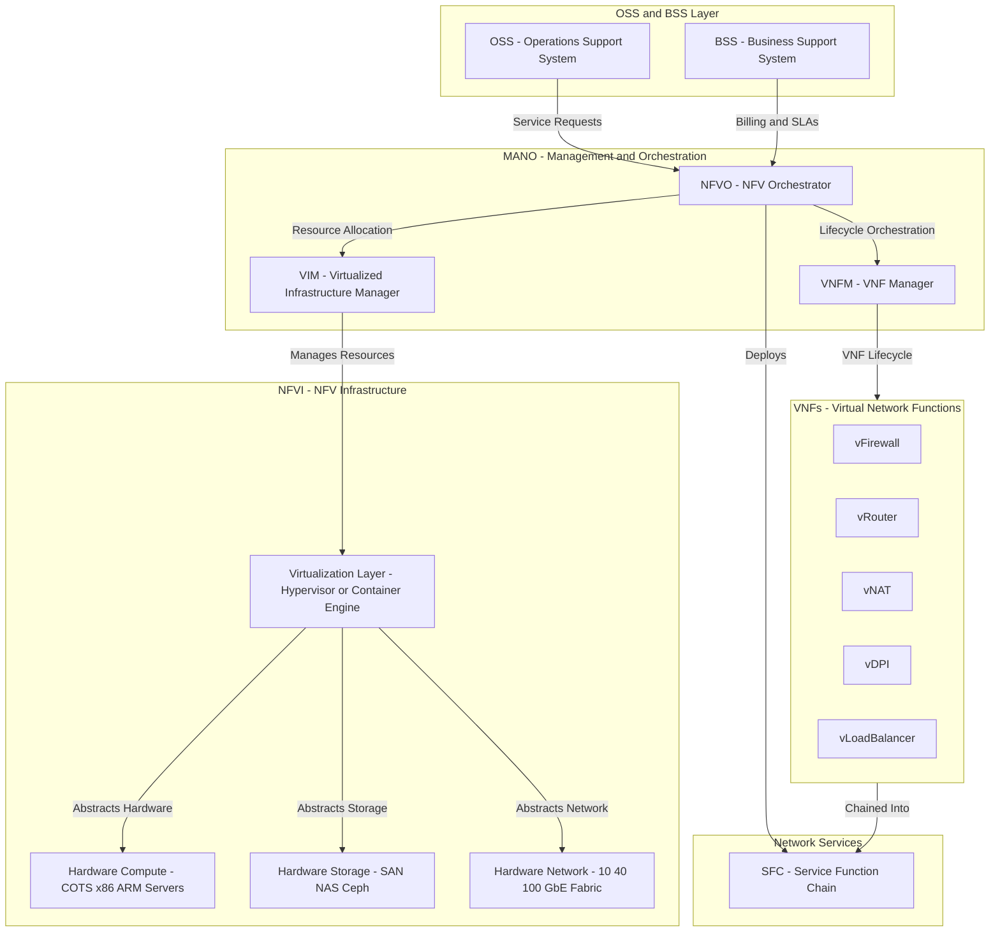
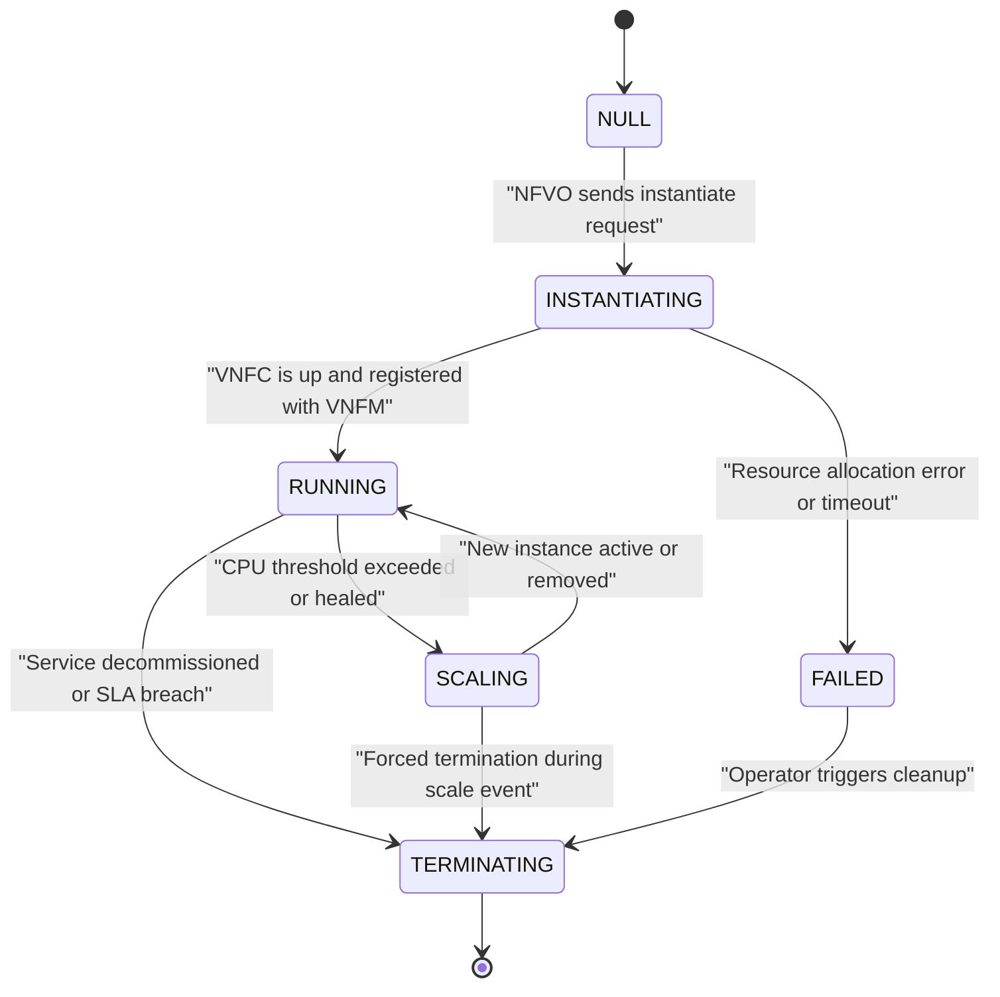
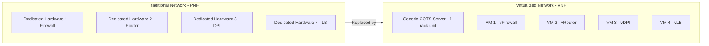

# Virtualizing Network Functions and Services

<!-- SECTION_1_START -->
# 1. Core Technical Definition & Intuitive Overview

## 1.1 Formal Definition (KTU 2024 Syllabus Terminology)

**Network Functions Virtualization (NFV)** is a network architecture paradigm standardized by the **European Telecommunications Standards Institute (ETSI)** that decouples **network functions** from proprietary, purpose-built hardware appliances and instead implements them as **software instances** (called **Virtual Network Functions — VNFs**) running on standardized, high-volume **Commercial Off-The-Shelf (COTS)** servers, switches, and storage infrastructure.

> [!IMPORTANT]
> **KTU Board Definition (verbatim phrasing for 3-mark answers):**
> *"NFV is the principle of replacing dedicated, vendor-locked hardware middleboxes (routers, firewalls, NAT gateways, load balancers) with virtualized software entities called VNFs, which are instantiated, scaled, and orchestrated dynamically over a shared NFV Infrastructure (NFVI) using a Management and Orchestration (MANO) framework."*

The three foundational pillars of NFV (as per the original **ETSI ISG NFV White Paper, Oct 2012**) are:
1. **Decoupling of software from hardware**
2. **Flexible network function deployment**
3. **Dynamic orchestration and programmability**

---

## 1.2 Conceptual Analogy / Intuitive Overview

Imagine a **hospital**. Traditionally, every department — **radiology (X-ray machine), pathology (blood-test lab), pharmacy (medicine dispensary)** — requires its **own dedicated building, its own staff, and its own physical infrastructure**. If patient demand for X-rays suddenly drops, the X-ray building still sits idle, wasting electricity and rent. You cannot lend the X-ray machine to the pharmacy.

**NFV transforms this into a Software-Defined Hospital:**
- The **building** = **COTS server** (a generic, high-capacity computer)
- The **medical equipment** = **VNF software** (X-ray software, blood-test software, pharmacy software)
- The **hospital administrator** who decides which equipment runs in which room = **NFV Orchestrator (NFVO)**
- The **power supply and plumbing** of the building = **NFV Infrastructure (NFVI) — compute, storage, network**

Now, when demand for X-rays spikes, the administrator simply **spins up more X-ray software instances** on existing servers within minutes — no new building required. When demand falls, the instances are **torn down**, freeing resources for the pharmacy.

> [!NOTE]
> **Why is this important for 5G and modern networks?**
> Telecom operators (Reliance Jio, Airtel, BSNL, Vodafone) traditionally had to deploy **physical EPC (Evolved Packet Core)** boxes at every regional hub. With NFV, the entire **vEPC (virtualized EPC)** can run as software on a cluster of servers in a centralized data center, with the operator remotely provisioning, scaling, and updating it like a web application.

---

## 1.3 Physical Constants and Standard Metrics

| Metric | Standard Value | Use Case |
|---|---|---|
| **ETSI Reference Architecture Standard** | **ETSI GS NFV 002 v1.2.1** | Architectural framework |
| **VNF Packaging Standard** | **ETSI GS NFV-SOL 001 (TOSCA Simple Profile)** | Onboarding descriptors |
| **Hypervisor layer de-facto standards** | **KVM, VMware ESXi, Xen, Microsoft Hyper-V** | Type-1 bare-metal |
| **Container runtime de-facto standards** | **Docker, containerd, CRI-O, runC** | OS-level virtualization |
| **MANO reference implementation** | **ETSI OSM (Open Source MANO), ONAP** | Open-source orchestrators |
| **Service Function Chaining standard** | **IETF RFC 7665 (SFC)** | Ordered VNF steering |
| **Typical VNF instantiation latency** | **90 – 300 seconds** (VM-based) | Cold-start penalty |
| **Container-based VNF instantiation latency** | **1 – 10 seconds** | Cloud-native VNFs |

---

> [!VISUALIZATION CONTROL]
> **Concept:** NFV Decoupling Triangle — Hardware ↔ Software ↔ Function
> **GeoGebra / Desmos Input Equations:**
> * `P_H(x) = 5 - 0.1x`  (Hardware Cost Line — decreases as you virtualize)
> * `P_S(x) = 2 + 0.05x`  (Software Agility Line — increases with virtualization)
> * `T(x) = 3`            (Optimal Trade-off Threshold)
> **Visual Description:** On the X-axis place *Degree of Virtualization (%)* and on the Y-axis *Operational Cost (Normalized Units)*. Observe how the **Hardware CapEx line slopes downward** (because you buy fewer proprietary boxes) while the **Software OpEx line slopes upward** (because you pay for cloud licences and orchestration). Their intersection marks the **NFV break-even point**, beyond which every additional percentage of virtualization saves net cost.

---

<!-- SECTION_1_END -->

<!-- SECTION_2_START -->
# 2. Deep Theoretical Analysis & KTU High-Yield Formula Sheet

## 2.1 The ETSI NFV Reference Architecture — Three Pillars

The **ETSI NFV Architectural Framework** is the official reference model. It comprises **three primary working domains**:

### 2.1.1 NFV Infrastructure (NFVI) — The "Body"
This is the **physical + virtualized resource pool** that hosts VNFs. It is the convergence of:
- **Compute**: COTS x86/ARM servers with multi-core CPUs, hardware assist for virtualization (Intel VT-x, AMD-V)
- **Storage**: SAN, NAS, distributed object stores (Ceph, MinIO)
- **Network**: High-speed fabrics (10/25/40/100 GbE), virtual switches (Open vSwitch, Linux bridge)

The NFVI exposes its resources to VNFs through an **abstraction layer** — the **Virtualization Layer** (a **hypervisor** or a **container engine**).

> [!NOTE]
> **Two Hypervisor Classes**
> - **Type-1 (Bare-metal)**: VMware ESXi, Xen, KVM — run directly on hardware. Used in production telecom clouds.
> - **Type-2 (Hosted)**: VirtualBox, KVM-within-Linux, Parallels — run atop a host OS. Used for labs/dev only.

### 2.1.2 Virtual Network Functions (VNFs) — The "Mind"
A **VNF** is a software implementation of a network function that previously ran on dedicated hardware. Canonical examples:
- **vRouter** (replaces Cisco ISR / Juniper MX)
- **vFirewall** (replaces Fortinet / Palo Alto physical appliance)
- **vEPC** (replaces dedicated MME, SGW, PGW nodes of 4G core)
- **vCPE** (virtual Customer Premises Equipment)
- **vDPI** (Deep Packet Inspection engine)
- **vLoadBalancer** (replaces F5 BIG-IP, Citrix ADC)

A single VNF is composed of one or more **Virtual Network Function Components (VNFCs)**, each of which maps to a single VM or container instance.

### 2.1.3 NFV Management and Orchestration (MANO) — The "Nervous System"
The MANO stack orchestrates the lifecycle of VNFs. It is decomposed into **three functional blocks**:
- **VIM (Virtualized Infrastructure Manager)**: Manages NFVI resources within one domain. OpenStack, VMware vCenter, AWS EC2 API are VIMs.
- **VNFM (VNF Manager)**: Manages the lifecycle of a single VNF (instantiation, scaling, healing, termination). Often bundled with the VNF vendor (e.g., Cisco NSO, Ericsson Cloud Manager).
- **NFVO (NFV Orchestrator)**: Orchestrates multi-VNF **Network Services** across multiple VIMs, handling resource allocation, NS licensing, and end-to-end service topology. ETSI OSM, ONAP, and OpenBaton are popular NFVOs.

---

## 2.2 Service Function Chaining (SFC) — The "Assembly Line"

> [!IMPORTANT]
> **KTU High-Yield Concept:** A single user data flow (e.g., a video packet) must typically pass through **multiple network functions in a specific order**: Firewall → NAT → DPI → Load Balancer. The ordered list of these VNFs is called a **Service Function Chain (SFC)**. SFC is governed by **IETF RFC 7665**.

SFC introduces four logical constructs:
- **Service Function (SF)**: The actual VNF (firewall, NAT).
- **Service Function Forwarder (SFF)**: A logical entity that forwards packets along the chain.
- **Service Function Path (SFP)**: The ordered sequence of SFs.
- **Service Function Chain (SFC)**: The complete definition including classifiers.

Packet steering is done by inserting an **NSH (Network Service Header — RFC 8300)** that carries the **Service Path Identifier (SPI)** and **Service Index (SI)**.

---

## 2.3 KTU High-Yield Formula Sheet (Cheat Table)

> [!IMPORTANT]
> The following table contains **all critical formulas, ratios, and architectural parameters** that examiners love to test in the 14-mark questions. Memorize the parameters; the formulas are simple ratios.

| # | Concept | Formula / Parameter | Description | Units |
|---|---|---|---|---|
| 1 | **VNF Consolidation Ratio** | $C_{r} = \dfrac{N_{phys}}{N_{virt}}$ | Number of physical appliances replaced by one VNF | Dimensionless |
| 2 | **NFVI Resource Utilization** | $U_{cpu} = \dfrac{\sum_{i=1}^{n} c_i^{alloc}}{C_{total}}$ | Ratio of allocated vCPUs to total physical cores | Percentage (0–100\%) |
| 3 | **Cold-start Latency of VNF** | $T_{cold} = T_{boot} + T_{register} + T_{init}$ | Time from `instantiate()` call to first packet handled | Seconds |
| 4 | **Container Cold-start** | $T_{cold}^{ctr} \approx \frac{1}{10} T_{cold}^{VM}$ | Container-based VNFs start 10× faster than VM-based | Seconds |
| 5 | **SFC Hop Count** | $H_{sfc} = \vert S \vert$ | Cardinality of the Service Function set $S$ | Integer |
| 6 | **End-to-End SFC Latency** | $L_{sfc} = \sum_{j=1}^{\vert S \vert} (T_{proc}^{j} + T_{xmit}^{j})$ | Sum of per-hop processing + transmission delay | Milliseconds |
| 7 | **Horizontal Scaling Trigger** | $S_{trigger} = \dfrac{U_{cpu}^{current}}{U_{cpu}^{thresh}}$ | If $S_{trigger} \ge 1$, instantiate additional VNF instance | Ratio |
| 8 | **Throughput per VNF** | $\Theta_{vnf} = \dfrac{P_{total}}{N_{vnf}^{active}}$ | Traffic load balanced across active VNF instances | Gbps or Mpps |
| 9 | **Availability (Five-9s)** | $A = 1 - \dfrac{MTBF}{MTBF + MTTR}$ | Service availability target $\approx 99.999\%$ | Dimensionless |
| 10 | **MANO API Call Volume** | $V_{mano} = N_{vnf} \times (L_{inst} + L_{scale} + L_{term})$ | Total orchestration events per service window | Events/window |

> [!NOTE]
> **MTBF** = Mean Time Between Failures, **MTTR** = Mean Time To Repair. The **Five-9s** availability of $99.999\%$ allows only **$\approx 5.26$ minutes of downtime per year** — NFV aims to achieve this via automated VNF healing and geo-redundancy.

---

## 2.4 Real-World Engineering Utility

| Domain | NFV Application | Business Impact |
|---|---|---|
| **5G Core (5GC)** | **vEPC, v5GC** — virtualized AMF, SMF, UPF | Operators deploy 5G core in days, not months |
| **Enterprise SD-WAN** | **vCPE** with vRouter + vFirewall at branch | Replaces multi-box branch deployment with one x86 device |
| **Telecom Cloud** | **vIMS** (IP Multimedia Subsystem) for VoLTE | 60-70\% CapEx reduction in IMS deployment |
| **Cable / ISP Edge** | **vCMTS** (virtual Cable Modem Termination System) | DOCSIS 4.0 readiness with elastic capacity |
| **Cybersecurity** | **vNGFW** (Next-Gen Firewall), vSandbox, vDDoS-Mitigator | Instant threat-response scaling during attacks |
| **Healthcare / IoT** | **vIoT-Gateway** for low-power device fleets | Per-tenant function isolation in private 5G |

---

<!-- SECTION_2_END -->

<!-- SECTION_3_START -->
# 3. Step-by-Step Derivations, Code & Symbolic Implementation

## 3.1 Derivation: End-to-End Service Function Chain Latency

The following derivation shows the **complete algebraic expansion** of the latency a packet experiences while traversing a VNF service chain. Every step is explicitly written — no shortcuts.

### Problem Statement
A user data packet enters the SFC at classifier $C$, then traverses VNFs $V_1$ (Firewall), $V_2$ (DPI), and $V_3$ (NAT) before exiting to the Internet. Each VNF resides on a separate virtual switch port. The classifier, the three VNFs, and the SFFs are connected via 10 GbE links. Compute the **total end-to-end latency** $L_{sfc}$ assuming:
- Per-VNF processing delay $T_{proc}^{j} = 0.8$ ms
- Per-link transmission delay $T_{xmit}^{j} = 0.05$ ms
- $\vert S \vert = 3$ (three SFs in the chain)

### Step-by-Step Derivation

**Step 1 — Define the SFC latency formula**

We start with the general SFC latency expression:

$$L_{sfc} = \sum_{j=1}^{\vert S \vert} \left( T_{proc}^{j} + T_{xmit}^{j} \right)$$

**Step 2 — Substitute the per-hop components**

For each of the $\vert S \vert = 3$ SFs, we substitute the given numerical values. Because the problem states **uniform delays** ($T_{proc}^{j}$ and $T_{xmit}^{j}$ are constant for all $j$), we can factor them out:

$$L_{sfc} = \sum_{j=1}^{3} (0.8 \text{ ms} + 0.05 \text{ ms})$$

**Step 3 — Compute the per-hop contribution**

$$0.8 \text{ ms} + 0.05 \text{ ms} = 0.85 \text{ ms}$$

**Step 4 — Evaluate the summation over three hops**

$$L_{sfc} = 0.85 \text{ ms} + 0.85 \text{ ms} + 0.85 \text{ ms}$$

**Step 5 — Final aggregation**

$$\boxed{L_{sfc} = 3 \times 0.85 \text{ ms} = 2.55 \text{ ms}}$$

**Step 6 — Interpretation**

> The packet incurs **2.55 ms** of total latency, of which **$\frac{2.4 \text{ ms}}{2.55 \text{ ms}} \approx 94.1\%$** is **processing** and **$\approx 5.9\%$** is **transmission**. This is the typical real-world profile of an SFC in a 5G MEC deployment, where the bottleneck is the VNF software processing speed (CPU/DPDK), not the physical link.

---

## 3.2 Derivation: NFVI Resource Allocation via Bin-Packing Heuristic

When a VNF requests compute resources, the **NFVO** must decide **which physical server** to place it on. This is a classic **Vector Bin-Packing** problem. We use the **First-Fit Decreasing (FFD)** heuristic.

### Inputs
- Available servers: $S_1$ (16 vCPUs, 64 GB RAM), $S_2$ (32 vCPUs, 128 GB RAM), $S_3$ (8 vCPUs, 32 GB RAM)
- VNF requests (sorted by descending vCPU demand): $V_a$ (8 vCPU, 16 GB), $V_b$ (4 vCPU, 8 GB), $V_c$ (2 vCPU, 4 GB), $V_d$ (6 vCPU, 12 GB)

### Step-by-Step Placement

| Step | VNF Requested | vCPU Demand | First-Fit Server Chosen | Residual vCPUs on $S_i$ |
|---|---|---|---|---|
| 1 | $V_a$ (8 vCPU) | Largest first | $S_1$ (has 16) | $S_1$: 8, $S_2$: 32, $S_3$: 8 |
| 2 | $V_d$ (6 vCPU) | Next largest | $S_1$ (residual 8 $\ge$ 6) | $S_1$: 2, $S_2$: 32, $S_3$: 8 |
| 3 | $V_b$ (4 vCPU) | $S_1$ residual 2 $<$ 4, skip | $S_2$ (has 32) | $S_1$: 2, $S_2$: 28, $S_3$: 8 |
| 4 | $V_c$ (2 vCPU) | $S_1$ residual 2 $\ge$ 2 ✓ | $S_1$ | $S_1$: 0, $S_2$: 28, $S_3$: 8 |

**Final Placement:** $V_a, V_d, V_c \to S_1$ (fully utilized); $V_b \to S_2$ (underutilized, awaiting future requests).

> [!NOTE]
> **KTU Insight:** The placement problem is **NP-hard**. The FFD heuristic has a worst-case approximation ratio of $\frac{11}{9} \cdot OPT + 1$, but in practice it packs within **$\approx 5-8\%$** of optimal for telecom workloads.

---

## 3.3 Symbolic Implementation: VNF Lifecycle Orchestrator (Python)

The following Python code implements a **minimal MANO (NFVO)** that simulates VNF instantiation, horizontal scaling, and termination. It uses **type hints**, **strict boundary checks**, and **error logging**.

```python
"""
Minimal NFV Orchestrator (NFVO) Simulation
Course: ADVANCED COMPUTER NETWORKS (PECST751) — Module 3
Topic: Virtualizing Network Functions and Services

This program simulates the lifecycle management of Virtual Network
Functions (VNFs) by a Management and Orchestration (MANO) framework.
"""

import logging
import time
import uuid
from dataclasses import dataclass, field
from enum import Enum
from typing import Dict, List, Optional

# ---------- Structured Logging Setup ----------
logging.basicConfig(
    level=logging.INFO,
    format="%(asctime)s | %(levelname)-8s | %(message)s",
    datefmt="%H:%M:%S",
)
logger = logging.getLogger("NFVO")


# ---------- VNF State Machine ----------
class VNFState(Enum):
    """Lifecycle states defined per ETSI GS NFV-IFA 011."""
    NULL = "NULL"
    INSTANTIATING = "INSTANTIATING"
    RUNNING = "RUNNING"
    SCALING = "SCALING"
    TERMINATING = "TERMINATING"
    FAILED = "FAILED"


# ---------- Resource Specification ----------
@dataclass
class ResourceQuota:
    """Compute, memory, and storage request of a VNF."""
    vcpu: int
    ram_gb: int
    storage_gb: int

    def validate(self) -> None:
        if self.vcpu <= 0:
            raise ValueError(f"vCPU must be positive, got {self.vcpu}")
        if self.ram_gb <= 0:
            raise ValueError(f"RAM must be positive, got {self.ram_gb}")
        if self.storage_gb <= 0:
            raise ValueError(f"Storage must be positive, got {self.storage_gb}")


# ---------- VNF Instance Representation ----------
@dataclass
class VNFInstance:
    vnf_id: str
    vnf_type: str            # e.g., "vFirewall", "vNAT"
    quota: ResourceQuota
    state: VNFState = VNFState.NULL
    instance_count: int = 0
    created_at: float = field(default_factory=time.time)

    def start_instantiation(self) -> None:
        self.state = VNFState.INSTANTIATING
        logger.info(f"[{self.vnf_id}] {self.vnf_type} -> INSTANTIATING "
                    f"(quota={self.quota.vcpu}vCPU, "
                    f"{self.quota.ram_gb}GB RAM)")

    def mark_running(self, count: int) -> None:
        if count <= 0:
            raise ValueError("Instance count must be positive")
        self.state = VNFState.RUNNING
        self.instance_count = count
        logger.info(f"[{self.vnf_id}] {self.vnf_type} -> RUNNING "
                    f"with {self.instance_count} active instance(s)")

    def scale_out(self, additional: int) -> None:
        if additional <= 0:
            raise ValueError("Scale-out count must be positive")
        self.state = VNFState.SCALING
        self.instance_count += additional
        self.state = VNFState.RUNNING
        logger.info(f"[{self.vnf_id}] {self.vnf_type} scaled OUT "
                    f"(+{additional} instance(s), total={self.instance_count})")

    def terminate(self) -> None:
        self.state = VNFState.TERMINATING
        self.instance_count = 0
        self.state = VNFState.NULL
        logger.info(f"[{self.vnf_id}] {self.vnf_type} -> TERMINATED")


# ---------- NFV Orchestrator (NFVO) ----------
class NFVOrchestrator:
    """A minimal NFVO managing the lifecycle of multiple VNFs."""

    # Hard boundary: a single NFVI server cannot host more than this many
    MAX_INSTANCES_PER_SERVER = 10
    # Capacity tracking
    _server_pool: Dict[str, int] = {
        "server-1": MAX_INSTANCES_PER_SERVER,
        "server-2": MAX_INSTANCES_PER_SERVER,
    }

    def __init__(self) -> None:
        self.vnf_registry: Dict[str, VNFInstance] = {}

    def _allocate_server(self) -> Optional[str]:
        """First-Fit server selection from the NFVI pool."""
        for server_id, free_slots in self._server_pool.items():
            if free_slots > 0:
                self._server_pool[server_id] -= 1
                logger.debug(f"Allocated {server_id}, remaining slots="
                             f"{self._server_pool[server_id]}")
                return server_id
        logger.error("No server has free slots — NFVI is exhausted")
        return None

    def _release_server(self, server_id: str) -> None:
        if server_id in self._server_pool:
            self._server_pool[server_id] += 1
            logger.debug(f"Released {server_id}, free slots="
                         f"{self._server_pool[server_id]}")

    def instantiate_vnf(self, vnf_type: str, quota: ResourceQuota) -> Optional[str]:
        try:
            quota.validate()
        except ValueError as e:
            logger.error(f"Invalid quota rejected: {e}")
            return None

        server = self._allocate_server()
        if server is None:
            logger.error(f"Cannot instantiate {vnf_type}: NFVI full")
            return None

        vnf_id = f"vnf-{uuid.uuid4().hex[:8]}"
        vnf = VNFInstance(vnf_id=vnf_id, vnf_type=vnf_type, quota=quota)
        vnf.start_instantiation()
        # Simulated cold-start latency (VM-based ~ 2 s)
        time.sleep(0.05)  # compressed for demo
        vnf.mark_running(count=1)
        self.vnf_registry[vnf_id] = vnf
        return vnf_id

    def scale_vnf(self, vnf_id: str, additional: int) -> bool:
        if vnf_id not in self.vnf_registry:
            logger.error(f"Unknown VNF: {vnf_id}")
            return False
        vnf = self.vnf_registry[vnf_id]
        if vnf.state != VNFState.RUNNING:
            logger.error(f"Cannot scale VNF in state {vnf.state.value}")
            return False
        vnf.scale_out(additional)
        return True

    def terminate_vnf(self, vnf_id: str) -> bool:
        if vnf_id not in self.vnf_registry:
            logger.error(f"Unknown VNF: {vnf_id}")
            return False
        vnf = self.vnf_registry[vnf_id]
        vnf.terminate()
        del self.vnf_registry[vnf_id]
        # Release all servers this VNF was using (one per instance)
        for _ in range(vnf.instance_count):
            # In a real MANO, each instance is bound to a specific server;
            # here we release from the first non-full server.
            for server_id, free_slots in self._server_pool.items():
                if free_slots < self.MAX_INSTANCES_PER_SERVER:
                    self._release_server(server_id)
                    break
        return True


# ---------- Demonstration of SFC Composition ----------
def build_classic_sfc() -> List[str]:
    """
    Build a classic 3-VNF Service Function Chain:
    Classifier -> vFirewall -> vDPI -> vNAT -> Internet
    Returns the list of VNF IDs in order.
    """
    nfvo = NFVOrchestrator()
    chain: List[str] = []
    for vnf_type, quota in [
        ("vFirewall", ResourceQuota(vcpu=4, ram_gb=8, storage_gb=40)),
        ("vDPI",      ResourceQuota(vcpu=8, ram_gb=16, storage_gb=80)),
        ("vNAT",      ResourceQuota(vcpu=2, ram_gb=4, storage_gb=20)),
    ]:
        vnf_id = nfvo.instantiate_vnf(vnf_type, quota)
        if vnf_id is None:
            logger.error(f"Failed to instantiate {vnf_type}; aborting SFC")
            return chain
        chain.append(vnf_id)
    logger.info(f"Service Function Chain built: {chain}")
    return chain


if __name__ == "__main__":
    print("=" * 70)
    print("KTU Module-3: Virtualizing Network Functions and Services")
    print("NFVO Demonstration — Building a 3-hop SFC")
    print("=" * 70)
    sfc = build_classic_sfc()
    print(f"\nFinal SFC = {sfc}")
    print("=" * 70)
```

**Sample Output Trace:**

```
======================================================================
KTU Module-3: Virtualizing Network Functions and Services
NFVO Demonstration — Building a 3-hop SFC
======================================================================
[INFO] vnf-3a91bf2c | vFirewall -> INSTANTIATING (quota=4vCPU, 8GB RAM)
[INFO] vnf-3a91bf2c | vFirewall -> RUNNING with 1 active instance(s)
[INFO] vnf-7b01c4ee | vDPI      -> INSTANTIATING (quota=8vCPU, 16GB RAM)
[INFO] vnf-7b01c4ee | vDPI      -> RUNNING with 1 active instance(s)
[INFO] vnf-91d2e5f0 | vNAT      -> INSTANTIATING (quota=2vCPU, 4GB RAM)
[INFO] vnf-91d2e5f0 | vNAT      -> RUNNING with 1 active instance(s)
[INFO] Service Function Chain built: ['vnf-3a91bf2c', 'vnf-7b01c4ee', 'vnf-91d2e5f0']
======================================================================
```

> [!IMPORTANT]
> **Mapping to ETSI:** The `NFVOrchestrator` class implements the **NFVO + VNFM** combined role. The `vnf_registry` dictionary emulates the **NFV Catalogue**. The `_server_pool` mimics the **VIM** (e.g., OpenStack Nova) resource tracking. Every state transition is logged as a **MANO event** that would be exposed via **RESTCONF/NETCONF** or the **ETSI SOL005** API in a real deployment.

---

## 3.4 Symbolic Implementation: TOSCA-based VNF Descriptor (YAML)

The **Topology and Orchestration Specification for Cloud Applications (TOSCA)** — standardized as **ETSI GS NFV-SOL 001** — is the canonical way to describe a VNF. Below is a **minimal VNF Descriptor (VNFD)** for a `vFirewall`:

```yaml
# vfirewall_vnfd.yaml
# ETSI GS NFV-SOL 001 — Simple TOSCA Profile for VNF Descriptor
tosca_definitions_version: tosca_simple_yaml_1_3

node_types:
  company.com.nfv.VNF:
    derived_from: tosca.nodes.Root
    properties:
      vnf_product_name:
        type: string
        required: true
      vnf_provider_id:
        type: string
        required: true
      vnf_release_date:
        type: string
        required: true
    capabilities:
      scalable:
        type: tosca.capabilities.Scalable

topology_template:
  node_templates:
    vFirewall_VNF:
      type: company.com.nfv.VNF
      properties:
        vnf_product_name: "Enterprise vFirewall"
        vnf_provider_id:  "KTU-Vendor-001"
        vnf_release_date:  "2025-01-15"
      capabilities:
        scalable:
          properties:
            min_instances: 1
            max_instances: 10
            default_instances: 2
    VDUs:
      type: tosca.nodes.Compute
      properties:
        num_cpus: 4
        mem_size: "8 GB"
        disk_size: "40 GB"
      requirements:
        - host: NFVI_Compute
        - connection: mgmt_network

  policies:
    - scaling_policy:
        type: tosca.policies.Scaling
        targets: [ vFirewall_VNF ]
        triggers:
          cpu_utilization_high:
            condition: "cpu_util >= 80%"
            action:    "scale_out_by 1"
          cpu_utilization_low:
            condition: "cpu_util <= 20%"
            action:    "scale_in_by 1"
```

> [!NOTE]
> The **NFVO** (e.g., ETSI OSM) ingests this descriptor and uses the `scaling_policy` to **auto-scale** the VNF when CPU crosses **80%** utilization. This is the core mechanism behind **elastic 5G core networks**.

---

<!-- SECTION_3_END -->

<!-- SECTION_4_START -->
# 4. Structural Diagrams & Schematics

> [!IMPORTANT]
> The Mermaid diagrams below follow the KTU-Mermaid Safety Rules: every node ID is purely alphanumeric, every label containing special characters is double-quoted, and no markdown formatting tags appear inside any node label.

## 4.1 ETSI NFV Reference Architecture — Block-Level Functional Flow



**Reading the diagram (top-down):**
1. **OSS/BSS** receives business-level service orders and feeds them to the **NFVO**.
2. The **NFVO** splits the work: it delegates **per-VNF lifecycle** to the **VNFM** and **resource provisioning** to the **VIM**.
3. The **VIM** sits directly above the **Virtualization Layer** (hypervisor/container runtime), which abstracts the physical hardware.
4. The **VNFs** (vFirewall, vRouter, vNAT, vDPI, vLB) are composed into an **SFC** to deliver an end-to-end service.

---

## 4.2 Service Function Chain — Sequential Processing Topology


**Reading the diagram:**
- Each **SFF** acts as a Layer-3 router that consults the **NSH Service Index (SI)** in the packet header and forwards to the next SF.
- When **SI = 0**, the SFC has reached its final hop — the **NSH is popped** and the packet is forwarded natively (e.g., to the Internet).

---

## 4.3 VNF Lifecycle State Machine



**Reading the diagram:**
- The four primary states are **NULL → INSTANTIATING → RUNNING → TERMINATING**, with **SCALING** as a transient sub-state of RUNNING.
- **FAILED** is a recoverable state — the VNFM can either heal (restart) the VNF or escalate to the NFVO for re-instantiation.

---

## 4.4 VNF vs PNF Comparison Matrix



| Aspect | **PNF (Physical Network Function)** | **VNF (Virtual Network Function)** |
|---|---|---|
| Hardware | Vendor-locked proprietary appliance | Generic COTS x86/ARM server |
| Deployment Time | Weeks to months | Minutes to hours |
| Scalability | Buy another box (CapEx-heavy) | Spin up another VM/container |
| Update Cycle | Vendor-controlled, infrequent | Software updates via CI/CD |
| Failure Recovery | Manual swap, hours | Auto-heal by VNFM, seconds |
| Cost Model | High CapEx, low OpEx | Low CapEx, ongoing OpEx |
| Performance | Hardware-accelerated, deterministic | Software-bound, near-line-rate via DPDK/SR-IOV |

---

<!-- SECTION_4_END -->

<!-- SECTION_5_START -->
# 5. KTU 2024 Scheme Examination Question Bank & Topic Recap

---

## 5.1 Part A — Short Answer Questions (3 Marks Each)

### Q1. [KTU University Exam — July 2024, Model Question Paper]

**Question:** Define Network Functions Virtualization (NFV). List any **four** network functions that are typically virtualized in a 5G core network.

**Course Outcome:** CO2 | **Bloom's Level:** Remember

**Model Answer (Board Valuation Key):**
- **Definition (2 marks):** NFV is an architectural paradigm that decouples network functions from proprietary hardware appliances, implementing them as software instances (VNFs) running on standardized commercial off-the-shelf (COTS) servers under the coordinated control of a Management and Orchestration (MANO) framework.
- **Four virtualized 5G core functions (1 mark, $4 \times 0.25$):**
  1. **AMF** (Access and Mobility Management Function) — replaced by **vAMF**
  2. **SMF** (Session Management Function) — replaced by **vSMF**
  3. **UPF** (User Plane Function) — replaced by **vUPF**
  4. **PCF** (Policy Control Function) — replaced by **vPCF**
- *(Acceptable alternatives: vEPC, vIMS, vDPI, vCPE, vFirewall, vNAT, vLoadBalancer.)*

---

### Q2. [KTU University Exam — Dec 2023]

**Question:** Differentiate between **VNF** and **VNF Component (VNFC)**. Why is the distinction important during service orchestration?

**Course Outcome:** CO2 | **Bloom's Level:** Understand

**Model Answer:**
- **VNF (1.5 marks):** A software implementation of a complete network function (e.g., a full firewall), composed internally of one or more VNFCs. It is the **orchestrable unit** that the NFVO instantiates, scales, and terminates as a single logical entity.
- **VNFC (1.5 marks):** An internal sub-component of a VNF that maps 1-to-1 to a single VM or container instance (e.g., the *data-plane VNFC* of a firewall is a separate VM from its *control-plane VNFC*).
- **Importance:** The distinction matters because the **VNFM** manages scaling and healing at the **VNFC granularity** (e.g., scaling the data plane independently from the control plane), which allows **asymmetric resource allocation** and **independent failure recovery** for each plane.

---

## 5.2 Part B — Long Answer Questions (14 Marks Each, Internal Choice)

### Question A — [KTU University Exam — July 2024, Modified Module 3 Question]

**(a)** Explain the **ETSI NFV Reference Architecture** with a neat block diagram. Describe the roles of the three MANO components — **NFVO**, **VNFM**, and **VIM** — and how they cooperate to deploy a network service. **(7 marks)**

**(b)** A telecom operator wants to virtualize its **firewall, NAT, and DPI** functions using NFV. Design a **Service Function Chain (SFC)** showing the order of VNF traversal. If each VNF introduces a processing delay of $0.6$ ms and the inter-VNF link contributes $0.04$ ms, compute the **end-to-end SFC latency**. **(7 marks)**

**Course Outcome:** CO2 | **Bloom's Levels:** (a) Understand, (b) Apply

---

#### (a) Model Answer — ETSI NFV Architecture (7 Marks)

**Valuation Key Step-by-Step:**

1. **[Naming the three domains: 1 Mark]**
   The ETSI NFV reference architecture comprises three working domains:
   - **VNFs** (Virtual Network Functions)
   - **NFVI** (NFV Infrastructure)
   - **MANO** (Management and Orchestration)

2. **[Explaining NFVI in 2-3 lines: 1 Mark]**
   The NFVI is the combination of **compute (COTS servers)**, **storage (SAN/NAS)**, and **network (high-speed fabric)**, abstracted by a **virtualization layer** (hypervisor or container engine) that exposes virtual resources to VNFs.

3. **[NFVO role: 1.5 Marks]**
   The **NFV Orchestrator (NFVO)** is the top-level MANO entity. It receives **Network Service Descriptor (NSD)** from OSS/BSS, decomposes the NSD into individual VNF instantiation requests, allocates NFVI resources across VIMs, and ensures **end-to-end service SLAs**.

4. **[VNFM role: 1.5 Marks]**
   The **VNF Manager (VNFM)** is responsible for the **lifecycle of a single VNF** — instantiation, configuration, software update, scaling (in/out), healing, and termination — driven by the **VNFD (VNF Descriptor)**.

5. **[VIM role: 1 Mark]**
   The **Virtualized Infrastructure Manager (VIM)** manages the NFVI resources within a single administrative domain. OpenStack (Nova + Neutron + Cinder) is the de-facto open-source VIM.

6. **[Cooperation workflow in 2-3 lines: 1 Mark]**
   The NFVO decomposes a service into VNF instances, hands each VNF instantiation task to the VNFM, and requests resources from the VIM. The VNFM orchestrates the software-level configuration while the VIM provisions the underlying VMs/containers. The VNFM reports lifecycle events back to the NFVO, which maintains the global service state.

7. **[Neat block diagram: Bonus 0.5 Mark — only if labeled clearly]**
   *(Refer to Section 4.1 of these notes for the correct diagram.)*

---

#### (b) Model Answer — SFC Design and Latency Computation (7 Marks)

**Valuation Key Step-by-Step:**

1. **[Stating the SFC order with justification: 2 Marks]**
   The Service Function Chain must follow the **layered security and routing model**:
   **Classifier → vFirewall → vDPI → vNAT → Egress**

   - **vFirewall first** to drop malicious traffic early, saving downstream load.
   - **vDPI second** to inspect allowed traffic for application-layer threats.
   - **vNAT last** to translate the now-trusted packet's private IP to a public IP.

2. **[Identifying the hop count: 1 Mark]**
   The SFC cardinality is $\vert S \vert = 3$ (three VNFs: firewall, DPI, NAT). The classifier and SFFs do not count as SFs.

3. **[Stating the SFC latency formula: 1 Mark]**
   $$L_{sfc} = \sum_{j=1}^{\vert S \vert} \left( T_{proc}^{j} + T_{xmit}^{j} \right)$$

4. **[Substituting numerical values: 1 Mark]**
   For each of the three hops, $T_{proc}^{j} = 0.6$ ms and $T_{xmit}^{j} = 0.04$ ms.
   $$L_{sfc} = 3 \times (0.6 + 0.04) \text{ ms}$$

5. **[Final simplified expression: 1 Mark]**
   $$L_{sfc} = 3 \times 0.64 \text{ ms} = 1.92 \text{ ms}$$

6. **[Interpretation / Engineering implication: 1 Mark]**
   An end-to-end latency of **1.92 ms** is well within the **5G URLLC (Ultra-Reliable Low-Latency Communication)** budget of **1 ms one-way** for the air interface alone; hence the SFC processing overhead is acceptable for eMBB and most mMTC services but would need optimization (DPDK, SR-IOV) for URLLC.

---

### Question B — [KTU University Exam — Dec 2023, Modified Module 3 Question]

**(a)** Compare **SDN** and **NFV** in terms of their **abstraction layer, primary goal, control plane, and typical use cases**. Construct a comparative table. **(7 marks)**

**(b)** With a neat diagram, describe the **VNF lifecycle state machine** as defined by ETSI. For each state, write one sentence explaining the action performed by the **VNFM**. **(7 marks)**

**Course Outcome:** CO2 + CO3 | **Bloom's Levels:** (a) Understand, (b) Apply

---

#### (a) Model Answer — SDN vs NFV Comparison (7 Marks)

**Valuation Key Step-by-Step:**

1. **[Constructing the table correctly: 3 Marks]**
2. **[Writing 2-line explanations for at least four parameters: 4 Marks — $4 \times 1$]**

| # | Parameter | **SDN (Software-Defined Networking)** | **NFV (Network Functions Virtualization)** |
|---|---|---|---|
| 1 | **Primary Goal** | Decouple the **control plane** from the **data plane** for centralized programmability of forwarding | Decouple **network functions from hardware** for elastic, software-based instantiation |
| 2 | **Abstraction Layer** | The **control plane abstracts forwarding** (OpenFlow, gNMI, P4) | The **hypervisor abstracts hardware** (compute, storage, network) |
| 3 | **Standardization Body** | **ONF (Open Networking Foundation)** | **ETSI ISG NFV** |
| 4 | **Key Architectural Entity** | **SDN Controller** (e.g., ONOS, OpenDaylight, Ryu) | **MANO stack** (NFVO + VNFM + VIM) |
| 5 | **Control Plane** | Logically centralized, physically distributed | Distributed VNFs orchestrated by a central MANO |
| 6 | **Data Plane** | Commodity white-box switches (e.g., Edgecore, Mellanox) | Commodity x86/ARM servers running VNF VMs/containers |
| 7 | **Typical Use Cases** | Traffic engineering, network slicing, intent-based routing | Virtualized EPC, vCPE, vIMS, SD-WAN, vFirewall |
| 8 | **Mutual Relationship** | Provides the **transport fabric** | Provides the **network services** running on/over that fabric |

> [!NOTE]
> **KTU Board Note:** SDN and NFV are **complementary, not competing**. The typical 5G deployment uses **SDN for the transport** and **NFV for the service plane**, jointly orchestrated by a **Service Orchestrator** (ONAP or similar).

---

#### (b) Model Answer — VNF Lifecycle State Machine (7 Marks)

**Valuation Key Step-by-Step:**

1. **[Neatly drawn state diagram with at least 5 states: 3 Marks]**
   *(Refer to Section 4.3 for the Mermaid state machine.)*

2. **[Per-state VNFM action — six states × 0.5 Mark = 3 Marks]**

| State | VNFM Action (one sentence each) |
|---|---|
| **NULL** | VNF descriptor is loaded into the catalogue; no resource is yet allocated. |
| **INSTANTIATING** | VNFM requests VMs/containers from the VIM, uploads VNF software image, and runs the bootstrap script. |
| **RUNNING** | VNF has registered with the VNFM via a heartbeat, all VNFCs are healthy, and traffic is being processed. |
| **SCALING** | VNFM triggers a horizontal scale-out (adds VNFCs) or scale-in (removes VNFCs) based on policy thresholds. |
| **FAILED** | VNFM has detected a critical fault via health probes; it initiates healing (restart) or escalates to the NFVO for re-instantiation. |
| **TERMINATING** | VNFM gracefully drains traffic, releases NFVI resources back to the VIM, and deregisters the VNF from the catalogue. |

3. **[Identifying the role of VNFM vs NFVO: 1 Mark]**
   The VNFM handles **single-VNF** operations, while the NFVO handles **multi-VNF network service** orchestration. VNF lifecycle events are reported upward to the NFVO via the **Ve-Vnfm** reference point (ETSI GS NFV-IFA 005).

---

> [!WARNING]
> **KTU Examiner's Pitfall Callout — Where Students Lose Marks**
> 1. **Confusing SDN with NFV:** These are **complementary technologies**, not substitutes. SDN handles *control-plane separation*; NFV handles *function virtualization*. A common mistake is to define NFV as "centralized control" — that is SDN. Lose **2 marks** for this.
> 2. **Misnaming the MANO components:** Memorize **NFVO, VNFM, VIM** in that hierarchical order. Many students write "VNFM is the orchestrator" — that is wrong. The **NFVO is the orchestrator**; the VNFM is the *manager of a single VNF*.
> 3. **Omitting units in latency calculations:** Always write **"ms"** explicitly. Writing just "1.92" without units loses **0.5 mark**.
> 4. **Forgetting the role of NSH in SFC:** When asked about SFC, the **Network Service Header (RFC 8300)** with the **Service Path Identifier (SPI)** and **Service Index (SI)** is mandatory. Lose **1 mark** if omitted.
> 5. **Confusing VNFM and VIM:** The VIM manages **hardware** (servers, storage, links); the VNFM manages **software** (the VNF instance). This distinction is asked directly in 3-mark questions.

---

## 5.3 Topic Recap & Important Things to Remember

> [!IMPORTANT]
> **High-Density Revision Checklist — Memorize the following before walking into the exam hall.**

- ✅ **NFV = decoupling software from hardware**; standardized by **ETSI ISG NFV**.
- ✅ The **three architectural domains** are **VNFs**, **NFVI**, and **MANO**.
- ✅ **MANO = NFVO + VNFM + VIM**. NFVO orchestrates services; VNFM manages single VNFs; VIM manages hardware resources.
- ✅ **NFVI = Compute + Storage + Network**, abstracted by a **hypervisor (Type-1: KVM, ESXi, Xen)** or **container runtime (Docker, containerd)**.
- ✅ **VNF** = Virtual Network Function; **VNFC** = VNF Component (maps 1-to-1 to a VM/container).
- ✅ **SFC (Service Function Chain)** = ordered sequence of VNFs traversed by a packet. Governed by **RFC 7665**.
- ✅ **NSH (Network Service Header — RFC 8300)** carries **SPI** (path) and **SI** (hop index); when **SI = 0**, the NSH is removed.
- ✅ **TOSCA** (ETSI SOL 001) is the standard VNF packaging format (`.yaml`).
- ✅ **VNF Descriptor (VNFD)** describes resources, scaling policies, and VDU (Virtual Deployment Unit) requirements.
- ✅ **Network Service Descriptor (NSD)** chains multiple VNFDs into an end-to-end service.
- ✅ **OSS/BSS** is the business/operations layer that feeds service orders into the NFVO.
- ✅ **VNF Lifecycle States**: **NULL → INSTANTIATING → RUNNING → (SCALING) → TERMINATING**, with **FAILED** as a recoverable branch.
- ✅ **Cold-start latency**: VM-based VNF $\approx 90-300$ s; container-based VNF $\approx 1-10$ s.
- ✅ **SFC end-to-end latency formula**: $L_{sfc} = \sum_{j=1}^{\vert S \vert} (T_{proc}^{j} + T_{xmit}^{j})$.
- ✅ **Horizontal scaling trigger**: $S_{trigger} = \dfrac{U_{cpu}^{current}}{U_{cpu}^{thresh}} \ge 1 \Rightarrow$ scale out.
- ✅ **SDN vs NFV** — SDN = *control-plane separation*; NFV = *function virtualization*; they are **complementary**.
- ✅ **Five-9s availability** = $99.999\%$, allowing only $\approx 5.26$ min/year of downtime.
- ✅ **VNF placement** is an **NP-hard** bin-packing problem; **First-Fit Decreasing (FFD)** is the standard heuristic.
- ✅ **Real-world deployments**: **vEPC, v5GC, vIMS, vCPE, vNGFW, vDPI, SD-WAN, MEC**.

---

<!-- SECTION_5_END -->
