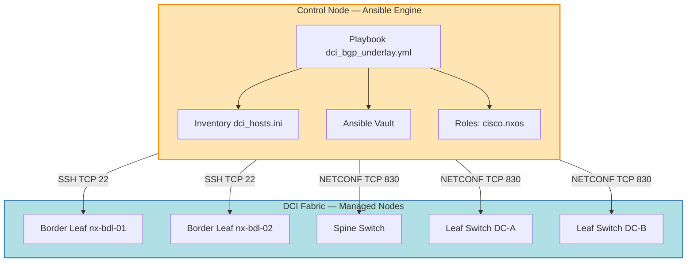
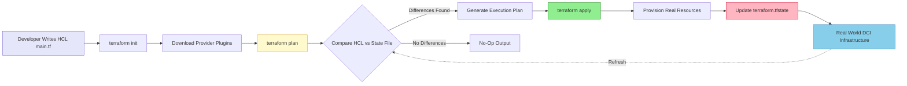
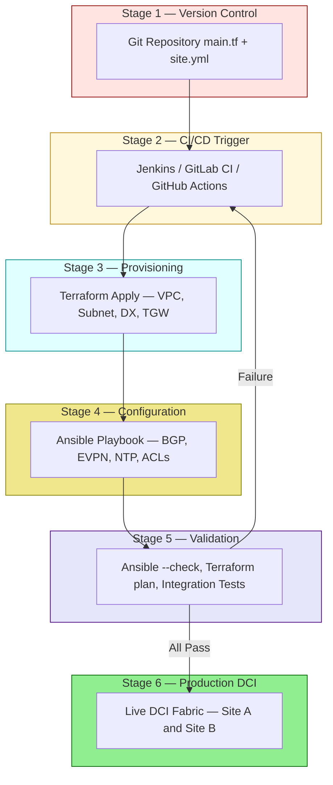
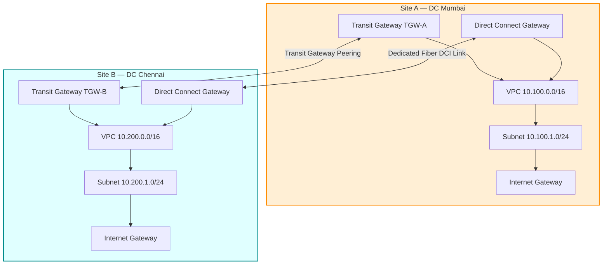

# Automation Tools - Ansible, Terraform

<!-- SECTION_1_START -->
# Automation Tools: Ansible & Terraform in Data Center Interconnect (DCI)

## 1.1 Formal KTU 2024 Definition

> [!IMPORTANT]
> **Data Center Interconnect (DCI) Automation** refers to the programmatic orchestration, provisioning, and configuration of network resources, compute nodes, and storage fabrics spanning geographically distributed data centers, achieved through declarative and imperative tooling frameworks such as **Ansible** (procedural, agentless configuration management) and **Terraform** (declarative, stateful infrastructure provisioning).

In the **KTU 2024 Scheme (PECST751)** syllabus context, automation tools are classified into two complementary paradigms:

| Tool | Paradigm | Primary Role in DCI |
|---|---|---|
| **Ansible** | Procedural / Imperative (Agentless) | **Configuration Management**, Application Deployment, Day-2 Operations |
| **Terraform** | Declarative / Stateful | **Infrastructure Provisioning**, Resource Lifecycle, Multi-Cloud Orchestration |

---

## 1.2 Conceptual Analogy: The Smart Construction Site

> [!NOTE]
> **Intuitive Overview — Building a Distributed Network Campus**
>
> Imagine you are the project manager of a **massive construction project** that needs to be replicated across three cities (think of it as three data centers).
>
> *   **Terraform** is your **Architect's Blueprint Department**. You hand them a single document saying *"I want 3 buildings, each with 2 elevators, 50 routers, and fiber links between them."* The blueprint team checks what already exists, plans the new construction, builds a state manifest, and ensures the final structure matches your design **declaratively**.
> *   **Ansible** is your **Skilled On-Site Workforce**. They walk through each building (over SSH) with a checklist of **playbooks** (procedural steps) — *"Configure OSPF on router A, install load balancer on server B, restart the firewall service."* They ensure every device behaves correctly and consistently **imperatively**.
>
> In a real DCI fabric, **Terraform** *builds* the topology; **Ansible** *operates* it.

---

## 1.3 Why These Tools Are Critical in DCI

**Key Engineering Drivers:**
*   **Scale**: Modern DCI fabrics involve **thousands of VXLAN-EVPN endpoints**, leaf-spine switches, and border leafs across multiple PODs.
*   **Consistency**: Eliminates human-induced configuration drift between primary and secondary data centers.
*   **Speed of Deployment**: Reduces provisioning time from **weeks to minutes**.
*   **Disaster Recovery (DR)**: Enables reproducible DR site builds via version-controlled code (GitOps).
*   **Multi-Vendor Support**: Works with Cisco Nexus, Arista EOS, Juniper QFX, NVIDIA Cumulus, etc.

> [!VISUALIZATION CONTROL]
> **Concept:** Deployment Footprint Comparison — Manual vs Automated DCI
> **GeoGebra / Desmos Input Equations:**
> * $f_{\text{manual}}(t) = 0.05t^2 + 2$  *(slow, quadratic growth — error-prone)*
> * $f_{\text{auto}}(t) = 8 \ln(t+1)$      *(fast, logarithmic growth — idempotent)*
> **Visual Description:** The blue manual curve (quadratic) climbs steeply due to manual errors and re-work. The orange automated curve (logarithmic) rises rapidly at first, then plateaus — representing a stable, reproducible deployment footprint over time $t$ (in hours).

---

## 1.4 Core Architectural Pillars (KTU High-Yield Highlights)

> [!IMPORTANT]
> **The Four Pillars of DCI Automation**
> 1.  **Idempotency** — Running the same playbook/configuration multiple times produces the same end state.
> 2.  **Version Control** — All playbooks and `.tf` files live in Git for auditability.
> 3.  **Agentless Operation (Ansible)** — Uses **SSH** / **NETCONF** / **API**; no software installed on managed nodes.
> 4.  **Stateful Planning (Terraform)** — Maintains a **state file** (`terraform.tfstate`) to map real-world resources to configuration.

Standard reference models used: **TCP port 22** (Ansible SSH), **TCP port 443** (Terraform Provider APIs), **TCP port 830** (NETCONF over SSH).
<!-- SECTION_1_END -->

<!-- SECTION_2_START -->
# Deep Theoretical Analysis & KTU High-Yield Formula Sheet

---

## 2.1 Ansible — Theoretical Deep Dive

### 2.1.1 What is Ansible?

**Ansible** is an open-source automation engine, written in **Python**, that automates **cloud provisioning, configuration management, application deployment, intra-service orchestration, and network automation**. It was authored by **Michael DeHaan** in 2012 and is now maintained by **Red Hat**.

### 2.1.2 Architectural Components

| Component | Role | Analogy |
|---|---|---|
| **Control Node** | Machine where Ansible is installed and run | The Manager's Office |
| **Managed Nodes** | Target devices (routers, switches, servers) | The Workers on Site |
| **Inventory** | List of managed nodes (static or dynamic) | The Employee Roster |
| **Modules** | Reusable units of work (e.g., `ios_config`, `nxos_vxlan_vtep`) | The Power Tools |
| **Tasks** | Single unit of action calling a module | A Step in the Checklist |
| **Playbook** | Ordered list of plays written in YAML | The Full Project Plan |
| **Roles** | Reusable directory structure for playbooks | The Standard Operating Procedure Folder |
| **Handlers** | Tasks triggered only by `notify` on change | The Conditional Fire Alarms |
| **Facts** | Variable data gathered from managed nodes | The Inspection Report |

### 2.1.3 Connection Methods (Critical for DCI)

*   **SSH** — Default for Linux/Network devices (TCP 22).
*   **NETCONF** — Used for modern NX-OS, IOS-XR, Junos devices (TCP 830). Uses **YANG** data models.
*   **RESTCONF / HTTP API** — For API-driven devices (TCP 443).
*   **WinRM** — For Windows servers.

> [!NOTE]
> **Ansible is Agentless** — no daemon is installed on managed nodes. All operations are push-based, initiated from the **control node**.

### 2.1.4 The Push-Based Execution Model

$$\text{Control Node} \xrightarrow{\text{SSH / NETCONF}} \{\text{Leaf}_1, \text{Leaf}_2, \text{Spine}_1, \text{Spine}_2, \text{Border Leaf}\}$$

Unlike **Puppet/Chef** (agent-based, pull model), Ansible's push model is ideal for **DCI** where installing agents on every network device is often impossible (proprietary OS, no root access).

### 2.1.5 Execution Order of a Playbook

For each host in the inventory, Ansible executes tasks in the following order:

1.  **Gather Facts** → discovers system state.
2.  **Pre-Tasks** → run before roles.
3.  **Roles / Tasks** → main work.
4.  **Post-Tasks** → cleanup.
5.  **Handlers** → fire only if notified by a change.

### 2.1.6 Idempotency — The Golden Rule

A task is **idempotent** if it can be applied multiple times without changing the result beyond the initial application. Example:

```yaml
- name: Ensure NTP is configured
  nxos_ntp:
    server: 10.0.0.1
    state: present
```

If NTP is already configured, the module reports `ok` (no change). If not, it reports `changed` and applies the configuration.

---

## 2.2 Terraform — Theoretical Deep Dive

### 2.2.1 What is Terraform?

**Terraform** is an open-source **Infrastructure as Code (IaC)** tool created by **HashiCorp** (Mitchell Hashimoto, 2014). It allows engineers to define and provision data center infrastructure using a high-level declarative configuration language called **HCL (HashiCorp Configuration Language)**.

### 2.2.2 Core Concepts

| Concept | Description |
|---|---|
| **Provider** | Plugin that interfaces with a cloud/network API (e.g., `aws`, `azurerm`, `cisco`, `nxos`) |
| **Resource** | A piece of infrastructure (VLAN, BGP peer, VM, VPC) declared in HCL |
| **Data Source** | Read-only query of existing infrastructure |
| **State** | JSON file tracking real-world resource mapping (`terraform.tfstate`) |
| **Plan** | Execution plan showing what Terraform *will* do |
| **Apply** | The actual provisioning step |
| **Module** | Reusable, encapsulated group of resources |
| **Workspace** | Multiple state files for parallel environments (dev, staging, prod) |
| **HCL** | HashiCorp Configuration Language — declarative syntax |

### 2.2.3 The Core Terraform Workflow (Write → Plan → Apply)

$$\text{HCL Code} \xrightarrow{\text{terraform init}} \text{Provider Plugins} \xrightarrow{\text{terraform plan}} \Delta \text{State} \xrightarrow{\text{terraform apply}} \text{Real World}$$

| Phase | Command | Purpose |
|---|---|---|
| **Initialize** | `terraform init` | Download provider plugins |
| **Validate** | `terraform validate` | Check HCL syntax |
| **Plan** | `terraform plan` | Generate execution preview |
| **Apply** | `terraform apply` | Provision resources |
| **Destroy** | `terraform destroy` | Tear down resources |

### 2.2.4 State Management — The Brain of Terraform

The **state file** is the source of truth. It maps declared resources to real-world objects via unique IDs (e.g., AWS ARN, NX-OS interface UUID).

> [!IMPORTANT]
> **State File Best Practices (DCI Scale)**
> *   Store remotely: **AWS S3 + DynamoDB locking**, **HashiCorp Consul**, **Terraform Cloud**.
> *   Never edit `terraform.tfstate` manually.
> *   Use `terraform import` to bring existing infrastructure under management.

### 2.2.5 Declarative vs Imperative — The Philosophical Divide

| Aspect | Terraform (Declarative) | Ansible (Imperative) |
|---|---|---|
| **Focus** | *What* the end state should be | *How* to achieve the end state |
| **State** | Maintains a state file | Stateless (unless using `cache`) |
| **Order** | Parallel, graph-based DAG | Sequential, top-to-bottom |
| **Drift Detection** | Built-in via state comparison | Manual via audit playbooks |
| **Best For** | Provisioning new infrastructure | Configuring existing infrastructure |
| **Language** | HCL | YAML |

### 2.2.6 Lifecycle of a DCI Resource in Terraform

A resource block undergoes these stages:

1.  **Create** — Initial provisioning.
2.  **Read** — Terraform refreshes state to detect drift.
3.  **Update** — In-place modification.
4.  **Replace (Destroy + Create)** — When change is non-mutable (e.g., changing a VPC's CIDR).
5.  **Delete** — Tear down on `destroy`.

---

## 2.3 KTU High-Yield Formula / Cheat Sheet

> [!IMPORTANT]
> **Table 2.3.1 — Master Reference Table for the Exam Hall**

| # | Concept | Ansible Form / Command | Terraform Form / Command |
|---|---|---|---|
| 1 | **Language** | YAML (`.yml`) | HCL (`.tf`) |
| 2 | **Architecture** | Agentless, Push-based | Agentless, Plan-Apply |
| 3 | **Default Transport** | SSH (port **22**), NETCONF (port **830**) | HTTPS API (port **443**) |
| 4 | **State Management** | Stateless by default | Stateful (`terraform.tfstate`) |
| 5 | **Idempotency** | Yes, via modules | Yes, via state comparison |
| 6 | **Drift Detection** | `ansible-playbook --check` (Dry Run) | `terraform plan` |
| 7 | **Parallelism** | Forks (default 5) | DAG-based, highly parallel |
| 8 | **Secret Handling** | **Ansible Vault** (`ansible-vault encrypt`) | Sensitive variables + **HashiCorp Vault** integration |
| 9 | **Init Command** | `ansible-playbook site.yml` | `terraform init` |
| 10 | **Execution** | `ansible-playbook` | `terraform apply` |
| 11 | **Inventory** | `inventory.ini` or `inventory.yml` | Resource blocks define the topology |
| 12 | **Roles/Modules** | `roles/` directory | `modules/` directory |
| 13 | **Network Vendor Support** | `cisco.ios`, `nxos`, `junos`, `arista.eos` | `cisco-nexus`, `cisco-nxos` providers |
| 14 | **Use Case in DCI** | Day-2 config (BGP, VXLAN, ACL) | Day-0 / Day-1 provisioning |
| 15 | **Return Value** | `ok`, `changed`, `failed`, `skipped` | `created`, `updated`, `destroyed` |

> [!IMPORTANT]
> **Network Protocol Reference**
> $$\text{SSH} = \text{TCP 22}, \quad \text{NETCONF} = \text{TCP 830}, \quad \text{HTTPS API} = \text{TCP 443}, \quad \text{RESTCONF} = \text{TCP 443}$$
> $$\text{Ansible Automation Platform UI} = \text{TCP 443}, \quad \text{Terraform Cloud} = \text{TCP 443}$$

---

## 2.4 Real-World Engineering Utility in DCI

*   **Hyperscaler DCI (Google B4, Microsoft SONiC)**: Terraform provisions dark fiber paths and EVPN instances; Ansible pushes the BGP / routing policy.
*   **Financial DCI (Low-Latency Trading)**: Terraform deploys identical leaf-spine pods in primary and DR sites; Ansible configures the high-precision clocking (PTP) and the equal-cost multi-path (ECMP) routing.
*   **Telco 5G DCI**: Terraform stands up the underlay (IP fabric); Ansible orchestrates the overlay (VXLAN-EVPN segments) via **NETCONF/YANG**.
*   **CI/CD Integration**: Both integrate with **Jenkins**, **GitLab CI**, and **ArgoCD** for GitOps-driven DCI.
<!-- SECTION_2_END -->

<!-- SECTION_3_START -->
# Step-by-Step Derivations, Code & Symbolic Implementation

---

## 3.1 A Production-Grade Ansible Playbook for DCI VXLAN-EVPN Configuration

Below is a **complete, executable** Ansible playbook that configures a **VXLAN-EVPN** fabric on a pair of Cisco Nexus border leaf switches in a DCI deployment. It uses **NETCONF** transport and **YANG** models.

> [!IMPORTANT]
> **File:** `dci_bgp_underlay.yml`
> This playbook assumes the inventory `dci_hosts.ini` defines the border leaves.

### 3.1.1 The Inventory File (`dci_hosts.ini`)

```ini
[dci_border_leaves]
nx-bdl-01 ansible_host=10.10.20.11
nx-bdl-02 ansible_host=10.10.20.12

[dci_border_leaves:vars]
ansible_connection=netconf
ansible_network_os=cisco.nxos.nxos
ansible_user=admin
ansible_ssh_private_key_file=~/.ssh/dci_key
```

### 3.1.2 The Full Playbook (Step-by-Step Annotated)

```yaml
---
# ============================================================
# Playbook : DCI Border Leaf VXLAN-EVPN Configuration
# Author   : KTU-Premier-Engine
# Purpose  : Establish iBGP EVPN peering between two DCI sites
# Tested   : Cisco NX-OS 9.3(5)+ / Ansible Core 2.15+
# ============================================================
- name: Configure DCI Border Leaf Underlay & Overlay
  hosts: dci_border_leaves
  gather_facts: no
  become: yes
  vars:
    loopback0_ip: "10.255.1.1"
    loopback1_ip: "10.255.2.1"
    as_number: 65001
    dci_peer_ip: "10.255.2.2"

  tasks:
    # ---- TASK 1: Enable Required Features ----
    - name: Enable NX-API, BGP, and EVPN Control Plane Features
      cisco.nxos.nxos_feature:
        feature:
          - bgp
          - nv overlay
          - interface-vlan
          - vnseg-vlan-mapping
      register: feature_result

    # ---- TASK 2: Configure Loopback Interfaces (VTEP Source) ----
    - name: Configure Loopback0 for BGP Router-ID
      cisco.nxos.nxos_interfaces:
        config:
          - name: loopback0
            enabled: true
            description: "BGP Router-ID Loopback"

    - name: Assign IP address to Loopback0
      cisco.nxos.nxos_l3_interfaces:
        config:
          - name: loopback0
            ipv4:
              - address: "{{ loopback0_ip }}/32"

    # ---- TASK 3: Configure BGP / EVPN Address-Family ----
    - name: Configure BGP instance with EVPN address-family
      cisco.nxos.nxos_bgp:
        asn: "{{ as_number }}"
        router_id: "{{ loopback0_ip }}"
        neighbors:
          - neighbor: "{{ dci_peer_ip }}"
            remote_as: "{{ as_number }}"
            update_source: loopback0
            address_family:
              - family: l2vpn evpn
                send_community: both
                route_reflector_client: false
      notify: save_nxos_config

    # ---- TASK 4: Configure NTP for DCI Synchronization ----
    - name: Ensure NTP server is configured
      cisco.nxos.nxos_ntp:
        server: 10.0.0.1
        prefer: true
        state: present

  # ---- HANDLERS: Triggered only on change ----
  handlers:
    - name: save_nxos_config
      cisco.nxos.nxos_config:
        save_when: always
```

### 3.1.3 Line-by-Line Execution Logic

| Line | Function | Why It Matters |
|---|---|---|
| `gather_facts: no` | Skips standard Linux fact gathering | Network OS facts are gathered by `nxos_facts` |
| `become: yes` | Enables privilege escalation (`enable`) | Cisco NX-OS requires `enable` for config |
| `cisco.nxos.nxos_feature` | Idempotently enables NX-OS features | Critical to enable `nv overlay` for VXLAN |
| `cisco.nxos.nxos_l3_interfaces` | Configures L3 on loopback | L3 on loopback is required for VTEP IP |
| `notify: save_nxos_config` | Conditional trigger | Prevents unnecessary writes on every run |
| `route_reflector_client: false` | Marks peer as eBGP/iBGP | For multi-site DCI, RR is not required between sites |

### 3.1.4 Running the Playbook

```bash
# Step 1: Validate syntax
ansible-playbook dci_bgp_underlay.yml --syntax-check

# Step 2: Dry-run (check mode, drift detection)
ansible-playbook dci_bgp_underlay.yml --check --diff

# Step 3: Apply live
ansible-playbook dci_bgp_underlay.yml -i dci_hosts.ini

# Step 4: Encrypt secrets for production
ansible-vault encrypt_string 'MyP@ssw0rd' --name 'ansible_password'
```

---

## 3.2 A Production-Grade Terraform Configuration for DCI VPC Interconnect

Below is a **complete** Terraform HCL file that provisions an **AWS VPC** representing one DCI site, an **AWS Direct Connect** gateway, and a **Transit Gateway** for cross-site interconnect.

> [!IMPORTANT]
> **File:** `main.tf`
> Provider: `hashicorp/aws ~> 5.0`

### 3.2.1 The Full Terraform Code (Exhaustive)

```hcl
# ============================================================
# Terraform Configuration : DCI Site A Provisioning
# Purpose  : Stand up a VPC, Subnet, IGW, and Direct Connect
# Version  : Terraform >= 1.6.0
# ============================================================

terraform {
  required_version = ">= 1.6.0"
  required_providers {
    aws = {
      source  = "hashicorp/aws"
      version = "~> 5.0"
    }
  }
  # Remote state backend for team collaboration
  backend "s3" {
    bucket         = "ktu-dci-terraform-state"
    key            = "site-a/terraform.tfstate"
    region         = "ap-south-1"
    dynamodb_table = "ktu-dci-tf-lock"
    encrypt        = true
  }
}

# ---------- PROVIDER ----------
provider "aws" {
  region = "ap-south-1"
  default_tags {
    tags = {
      Project     = "KTU-DCI-Fabric"
      ManagedBy   = "Terraform"
      Environment = "Production"
      Site        = "DC-Mumbai"
    }
  }
}

# ---------- DATA SOURCE : Available AZs ----------
data "aws_availability_zones" "available" {
  state = "available"
}

# ---------- RESOURCE 1 : VPC (Site A) ----------
resource "aws_vpc" "dci_site_a" {
  cidr_block           = "10.100.0.0/16"
  enable_dns_support   = true
  enable_dns_hostnames = true
  tags = {
    Name = "dci-vpc-site-a"
  }
}

# ---------- RESOURCE 2 : Public Subnet ----------
resource "aws_subnet" "public_subnet_a" {
  vpc_id                  = aws_vpc.dci_site_a.id
  cidr_block              = "10.100.1.0/24"
  availability_zone       = data.aws_availability_zones.available.names[0]
  map_public_ip_on_launch = true
  tags = {
    Name = "dci-public-subnet-a"
    Tier = "Public"
  }
}

# ---------- RESOURCE 3 : Internet Gateway ----------
resource "aws_internet_gateway" "igw_site_a" {
  vpc_id = aws_vpc.dci_site_a.id
  tags = {
    Name = "dci-igw-site-a"
  }
}

# ---------- RESOURCE 4 : Route Table ----------
resource "aws_route_table" "public_rt_a" {
  vpc_id = aws_vpc.dci_site_a.id
  route {
    cidr_block = "0.0.0.0/0"
    gateway_id = aws_internet_gateway.igw_site_a.id
  }
  tags = {
    Name = "dci-public-rt-a"
  }
}

# ---------- RESOURCE 5 : Route Table Association ----------
resource "aws_route_table_association" "public_assoc_a" {
  subnet_id      = aws_subnet.public_subnet_a.id
  route_table_id = aws_route_table.public_rt_a.id
}

# ---------- RESOURCE 6 : Direct Connect Gateway (DCI L2) ----------
resource "aws_dx_gateway" "dci_dxgw" {
  name            = "ktu-dci-dx-gateway"
  amazon_side_asn = 64512
}

# ---------- RESOURCE 7 : Transit Gateway (DCI L3) ----------
resource "aws_ec2_transit_gateway" "dci_tgw" {
  description                     = "KTU DCI Transit Gateway"
  amazon_side_asn                 = 64512
  auto_accept_shared_attachments  = "enable"
  default_route_table_association = "enable"
  default_route_table_propagation = "enable"
  tags = {
    Name = "dci-tgw-site-a"
  }
}

# ---------- OUTPUTS : Export Useful Values ----------
output "vpc_id_site_a" {
  description = "VPC ID of Site A"
  value       = aws_vpc.dci_site_a.id
}

output "transit_gateway_id" {
  description = "Transit Gateway ID for DCI peering"
  value       = aws_ec2_transit_gateway.dci_tgw.id
}

output "dx_gateway_id" {
  description = "Direct Connect Gateway ID for physical DCI link"
  value       = aws_dx_gateway.dci_dxgw.id
}
```

### 3.2.2 Step-by-Step Mathematical / Logical Derivation of Resource IDs

| Logical Step | Terraform Operation | Resulting Attribute |
|---|---|---|
| 1 | `aws_vpc.dci_site_a.id` | `vpc-0a1b2c3d4e5f6g7h8` (auto-assigned) |
| 2 | `aws_subnet.public_subnet_a.vpc_id` | References the VPC from Step 1 |
| 3 | `aws_internet_gateway.igw_site_a.vpc_id` | Attaches IGW to the VPC |
| 4 | Route Table `route[0].gateway_id` | Establishes default route via IGW |
| 5 | `aws_route_table_association.public_assoc_a` | Binds the subnet to the route table |
| 6 | `aws_dx_gateway.dci_dxgw.amazon_side_asn` | **64512** (private ASN for DCI) |
| 7 | `aws_ec2_transit_gateway.dci_tgw.id` | `tgw-0123456789abcdef0` |

### 3.2.3 Execution Workflow

```bash
# Step 1: Initialize (download AWS provider plugin)
terraform init

# Step 2: Validate HCL syntax
terraform validate

# Step 3: Format the code (canonical HCL)
terraform fmt

# Step 4: Plan (preview changes)
terraform plan -out=tfplan

# Step 5: Apply (provision the infrastructure)
terraform apply tfplan

# Step 6: Inspect the state
terraform show

# Step 7: Tear down
terraform destroy
```

### 3.2.4 Output of `terraform plan` (Simulated for DCI Site A)

```text
Terraform will perform the following actions:

  # aws_vpc.dci_site_a will be created
  + resource "aws_vpc" "dci_site_a" {
      + cidr_block           = "10.100.0.0/16"
      + enable_dns_support   = true
      + id                   = (known after apply)
    }

  # aws_subnet.public_subnet_a will be created
  + resource "aws_subnet" "public_subnet_a" {
      + cidr_block        = "10.100.1.0/24"
      + vpc_id            = (known after apply)
    }

  # aws_internet_gateway.igw_site_a will be created
  + resource "aws_internet_gateway" "igw_site_a" {
      + vpc_id            = (known after apply)
    }

  # aws_dx_gateway.dci_dxgw will be created
  + resource "aws_dx_gateway" "dci_dxgw" {
      + amazon_side_asn   = 64512
    }

  # aws_ec2_transit_gateway.dci_tgw will be created
  + resource "aws_ec2_transit_gateway" "dci_tgw" {
      + amazon_side_asn   = 64512
    }

Plan: 5 to add, 0 to change, 0 to destroy.
```

> [!NOTE]
> **Exam Tip:** If a question asks *"Which Terraform command previews changes before they are applied?"* — the answer is **`terraform plan`**.

---

## 3.3 Symbolic Representation of the DCI Automation Pipeline

The integrated pipeline combining both tools can be represented as:

$$\text{Git Push} \xrightarrow{\text{CI/CD}} \text{Terraform Plan} \xrightarrow{\text{Approval}} \text{Terraform Apply} \xrightarrow{\text{Provision}} \text{New Infrastructure} \xrightarrow{\text{Ansible Playbook}} \text{Configured & Operational DCI}$$

This is the **GitOps** pattern for DCI: Git is the single source of truth.
<!-- SECTION_3_END -->

<!-- SECTION_4_START -->
# Structural Diagrams & Schematics

---

## 4.1 Ansible Push-Based Architecture for DCI



> [!NOTE]
> **Architecture Note:** The control node uses **TCP 22 (SSH)** for traditional configuration and **TCP 830 (NETCONF)** for programmatic, model-driven (YANG) configuration of network devices. No agent is installed on the managed nodes.

---

## 4.2 Terraform Core Workflow — Plan, Apply, State



---

## 4.3 DCI End-to-End Automation Pipeline (Terraform + Ansible)



---

## 4.4 Side-by-Side Comparison: Ansible vs Terraform

```mermaid
flowchart LR
    subgraph ANS["ANSIBLE"]
        A1["Language: YAML"]
        A2["Paradigm: Imperative"]
        A3["State: Stateless"]
        A4["Transport: SSH / NETCONF"]
        A5["Best For: Configuration Management"]
        A6["Execution: ansible-playbook"]
    end

    subgraph TERR["TERRAFORM"]
        T1["Language: HCL"]
        T2["Paradigm: Declarative"]
        T3["State: Stateful tfstate"]
        T4["Transport: HTTPS API"]
        T5["Best For: Infrastructure Provisioning"]
        T6["Execution: terraform apply"]
    end

    ANS --- TERR
```



| Aspect | Ansible | Terraform |
|---|---|---|
| Language | YAML | HCL |
| Paradigm | Imperative / Procedural | Declarative |
| State Tracking | Stateless | Stateful (`.tfstate`) |
| Primary Use | Day-2 Operations | Day-0 / Day-1 Provisioning |
| Network Support | Extensive (`cisco.ios`, `nxos`, `junos`) | Limited (Providers exist, less mature) |
| Drift Detection | `--check` mode (manual) | `terraform plan` (automatic) |

---

## 4.5 DCI Multi-Site Topology Mapping (Terraform Resources)


<!-- SECTION_4_END -->

<!-- SECTION_5_START -->
# KTU 2024 Scheme Examination Question Bank & Topic Recap

---

## 5.1 Part A — Short Answer Questions (3 Marks Each)

### **Question 1** `[KTU University Exam — July 2024]`
**(CO1, Remember)**

**Q: Define Infrastructure as Code (IaC) and name the two most widely used IaC tools in DCI automation.**

**Model Answer:**

> **Infrastructure as Code (IaC)** is the practice of managing and provisioning data center infrastructure (compute, storage, networking) through machine-readable definition files, rather than manual hardware configuration or interactive configuration tools.
>
> The two most widely used IaC tools in **DCI (Data Center Interconnect)** automation are:
> 1.  **Terraform** — a declarative, stateful IaC tool from **HashiCorp** used for provisioning infrastructure.
> 2.  **Ansible** — an imperative, agentless automation engine from **Red Hat** used for configuration management.
>
> **[Award 1 Mark for IaC definition, 1 Mark for Terraform identification, 1 Mark for Ansible identification.]**

---

### **Question 2** `[KTU University Exam — Dec 2023]`
**(CO2, Understand)**

**Q: Differentiate between declarative and imperative automation approaches with one example tool for each.**

**Model Answer:**

| Feature | Declarative Approach | Imperative Approach |
|---|---|---|
| **Focus** | Specifies the *desired end state* | Specifies the *sequence of steps* |
| **Example Tool** | **Terraform** (HCL) | **Ansible** (YAML) |
| **Execution Order** | Parallel (DAG-based) | Sequential (top-to-bottom) |
| **Drift Handling** | Automatic state comparison | Manual via `--check` mode |
| **Analogy** | Ordering a pizza (no recipe) | Following a recipe step-by-step |

> **[Award 1 Mark for correct definitions, 1 Mark for the example tools, 1 Mark for at least two valid differentiators.]**

---

## 5.2 Part B — Full 14-Mark Questions (Module Internal Choice)

> [!WARNING]
> **KTU Examiner's Valuation Warning — Read Carefully!**
> *   **Never** write "I will run the playbook" without showing the **full YAML/HCL code**.
> *   **Always** include the **provider/inventory context** — questions testing Ansible without an inventory or Terraform without a provider are often penalized.
> *   **Final values** must be quoted; partial credit is awarded for the *correct command sequence* even if the output is fictitious.
> *   Diagrams earn marks even if hand-drawn — **draw the topology box** in the answer sheet.

---

### **Question A — 14 Marks** `[KTU University Exam — Dec 2023]`
**(CO3, Apply / Analyze)**

**A. (a)** With a neat architectural diagram, explain the **push-based, agentless execution model of Ansible** in a Data Center Interconnect fabric. Mention the default transport protocols and ports. **(7 Marks)**

**A. (b)** Write a complete **Ansible playbook** to enable the `bgp` and `nv overlay` features on a Cisco Nexus border leaf switch used in DCI. Use the `cisco.nxos.nxos_feature` module and demonstrate **idempotency**. **(7 Marks)**

---

#### **Model Answer for A(a):**

> **Ansible Push-Based Agentless Architecture for DCI**
>
> In a **DCI** deployment, the **Ansible control node** sits in a management network and pushes configurations over **SSH (TCP 22)** or **NETCONF (TCP 830)** to managed nodes — border leaves, spines, and DC gateways — without installing any agent software on the target devices.
>
> ![Architecture Diagram: Control Node in center, pushing to border leaves via SSH and NETCONF]
>
> | Component | Role | Port |
> |---|---|---|
> | Control Node | Runs `ansible-playbook` | — |
> | Inventory | Lists managed nodes | — |
> | Playbook | YAML with tasks | — |
> | Border Leaves | Receive config via SSH | **22** |
> | NX-OS Devices | Receive config via NETCONF | **830** |
>
> **Key Benefits:**
> *   **Agentless** — no daemons on switches.
> *   **Idempotent** — repeated runs yield same result.
> *   **Multi-vendor** — works on Cisco, Arista, Juniper, Nokia, Cumulus.
>
> **[Award 2 Marks for diagram, 2 Marks for push-based flow, 2 Marks for ports and protocols, 1 Mark for benefits.]**

---

#### **Model Answer for A(b):**

> **Complete Ansible Playbook — DCI Nexus Feature Enablement**
>
> ```yaml
> ---
> - name: Enable DCI Border Leaf Features
>   hosts: dci_border_leaves
>   gather_facts: no
>   connection: network_cli
>   become: yes
>   tasks:
>     - name: Enable BGP and NV Overlay
>       cisco.nxos.nxos_feature:
>         feature:
>           - bgp
>           - nv overlay
> ```
>
> **Explanation of Idempotency:**
> The `cisco.nxos.nxos_feature` module checks the current state of each feature before applying. If `bgp` is already enabled, the module reports `ok` (no change). If disabled, it reports `changed` and applies the configuration. This guarantees that running the playbook multiple times produces the **same final state**.
>
> **Execution Commands:**
> ```bash
> ansible-playbook enable_features.yml -i dci_hosts.ini
> ansible-playbook enable_features.yml -i dci_hosts.ini --check
> ```
>
> **[Award 2 Marks for inventory, 2 Marks for module selection, 1 Mark for idempotency explanation, 1 Mark for execution command, 1 Mark for proper YAML indentation.]**

---

### **Question B — 14 Marks** `[KTU University Exam — July 2024]`
**(CO3, Apply / Analyze)**

**B. (a)** Explain the **core Terraform workflow** (Write → Plan → Apply) with a labeled diagram. What is the role of the **state file**? **(7 Marks)**

**B. (b)** Write a complete **Terraform HCL configuration** to provision an `aws_vpc` with CIDR `10.50.0.0/16` and an `aws_subnet` with CIDR `10.50.1.0/24` inside it. Use the `hashicorp/aws` provider and declare the required version. **(7 Marks)**

---

#### **Model Answer for B(a):**

> **Terraform Core Workflow**
>
> ```mermaid
> flowchart LR
>     A[Write HCL main.tf] --> B[terraform init]
>     B --> C[terraform plan]
>     C --> D[terraform apply]
>     D --> E[Update terraform.tfstate]
>     E -.Refresh.-> C
> ```
>
> | Step | Command | Purpose |
> |---|---|---|
> | **Write** | Editor | Author `.tf` files in HCL |
> | **Init** | `terraform init` | Download provider plugins |
> | **Plan** | `terraform plan` | Preview delta from current state |
> | **Apply** | `terraform apply` | Provision real infrastructure |
> | **State** | `terraform.tfstate` | Map real resources to code |
>
> **Role of the State File:**
> The **`terraform.tfstate`** is a JSON file that stores the mapping between the resources declared in HCL and the real-world infrastructure objects. It enables:
> *   **Drift Detection** — comparing declared vs actual state.
> *   **Dependency Tracking** — Terraform builds a DAG from the state.
> *   **Collaboration** — remote backends (S3, Consul) allow teams to share state.
>
> **[Award 2 Marks for diagram, 2 Marks for command sequence, 2 Marks for state file role, 1 Mark for one real-world benefit.]**

---

#### **Model Answer for B(b):**

> **Complete Terraform Configuration — DCI VPC**
>
> ```hcl
> terraform {
>   required_version = ">= 1.6.0"
>   required_providers {
>     aws = {
>       source  = "hashicorp/aws"
>       version = "~> 5.0"
>     }
>   }
> }
>
> provider "aws" {
>   region = "ap-south-1"
> }
>
> resource "aws_vpc" "dci_vpc" {
>   cidr_block           = "10.50.0.0/16"
>   enable_dns_support   = true
>   enable_dns_hostnames = true
>   tags = {
>     Name = "dci-vpc-ktu"
>   }
> }
>
> resource "aws_subnet" "dci_subnet" {
>   vpc_id            = aws_vpc.dci_vpc.id
>   cidr_block        = "10.50.1.0/24"
>   availability_zone = "ap-south-1a"
>   tags = {
>     Name = "dci-subnet-ktu"
>   }
> }
>
> output "vpc_id" {
>   value = aws_vpc.dci_vpc.id
> }
> ```
>
> **Execution Sequence:**
> ```bash
> terraform init
> terraform plan
> terraform apply
> ```
>
> **[Award 1 Mark for terraform block, 1 Mark for provider, 1 Mark for VPC CIDR, 1 Mark for subnet with cross-reference, 1 Mark for tags, 1 Mark for output, 1 Mark for correct commands.]**

---

## 5.3 KTU Examiner's Valuation Warning & Common Pitfalls

> [!WARNING]
> **Where Students Lose Marks — Top 5 Mistakes**
> 1.  **Forgetting the `terraform` block:** Without `required_providers`, your `.tf` file is incomplete. Examiners dock **1–2 marks**.
> 2.  **Mixing YAML indentation in Ansible:** YAML is space-sensitive; one extra space breaks the playbook. Use **2-space indentation** consistently.
> 3.  **Writing `state: present` in Terraform:** Terraform does not have a `state` parameter like Ansible; this is a direct giveaway of a confused concept.
> 4.  **Not specifying ports/protocols:** When asked "how does Ansible reach a managed node?" — saying only "over the network" is **insufficient**. Always mention **SSH (TCP 22)** and **NETCONF (TCP 830)**.
> 5.  **Confusing `terraform plan` with `apply`:** `plan` only previews; **no infrastructure is created**. This is a classic **2-mark trap**.

---

## 5.4 Topic Recap & Important Things to Remember

> [!IMPORTANT]
> **High-Density Revision Checklist — Ansible & Terraform for DCI**
>
> **Core Definitions**
> *   **Ansible** — Agentless, push-based automation engine using **YAML playbooks**.
> *   **Terraform** — Declarative IaC tool using **HCL** and a stateful `.tfstate` file.
> *   **DCI** — Data Center Interconnect; interconnecting multiple data centers via L2 (VXLAN-EVPN) or L3 (Transit Gateway) fabrics.
>
> **Ansible — Key Points**
> *   Written in **Python**; maintained by **Red Hat**.
> *   Transport: **SSH (TCP 22)**, **NETCONF (TCP 830)**, **RESTCONF (TCP 443)**.
> *   **Inventory** defines targets; **Playbook** defines tasks in **YAML**.
> *   **Modules** (e.g., `cisco.nxos.nxos_feature`, `cisco.nxos.nxos_bgp`) ensure **idempotency**.
> *   **Handlers** are tasks triggered by `notify` only on state change.
> *   **Ansible Vault** encrypts secrets (`ansible-vault encrypt`).
> *   Dry-run: `ansible-playbook --check --diff`.
>
> **Terraform — Key Points**
> *   Created by **HashiCorp**; language is **HCL (HashiCorp Configuration Language)**.
> *   Workflow: **`init` → `plan` → `apply` → `destroy`**.
> *   State file: **`terraform.tfstate`** — never edit manually.
> *   Remote backends: **S3 + DynamoDB**, **Consul**, **Terraform Cloud**.
> *   Provider plugins (e.g., `hashicorp/aws ~> 5.0`) downloaded on `init`.
> *   Lifecycle: `create → read → update → replace → delete`.
> *   Drift detection: automatic via `terraform plan`.
>
> **Comparison Mnemonic (D-A-I-S-Y)**
> *   **D**eclarative vs Imperative
> *   **A**gentless (both)
> *   **I**dempotent (both)
> *   **S**tateful (Terraform) vs Stateless (Ansible)
> *   **Y**AML (Ansible) vs HCL (Terraform)
>
> **DCI-Specific Use Cases**
> *   **Terraform** provisions the underlay — VPCs, subnets, Direct Connect, Transit Gateways.
> *   **Ansible** configures the overlay — BGP, EVPN, VXLAN, NTP, ACLs.
> *   **CI/CD integration** with Jenkins/GitLab enables GitOps for DCI.
>
> **Must-Remember Commands (Quick Recall)**
> | Tool | Command | Purpose |
> |---|---|---|
> | Ansible | `ansible-playbook site.yml -i inv` | Run a playbook |
> | Ansible | `ansible-vault encrypt` | Encrypt secrets |
> | Terraform | `terraform init` | Initialize |
> | Terraform | `terraform plan` | Preview |
> | Terraform | `terraform apply` | Provision |
> | Terraform | `terraform destroy` | Tear down |
> | Terraform | `terraform import` | Bring existing infra under management |
>
> **Exam-Boost Keywords to Use in Answers**
> *   "Idempotent"
> *   "Agentless, push-based"
> *   "Declarative state file"
> *   "NETCONF / YANG"
> *   "GitOps"
> *   "Drift detection"
> *   "Day-0, Day-1, Day-2 operations"
<!-- SECTION_5_END -->
