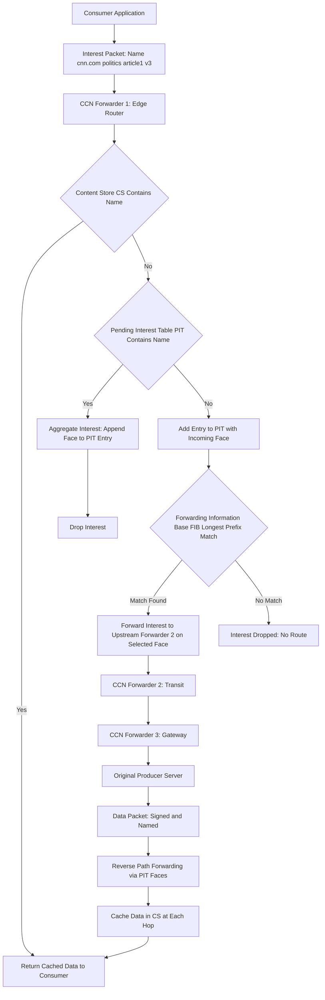
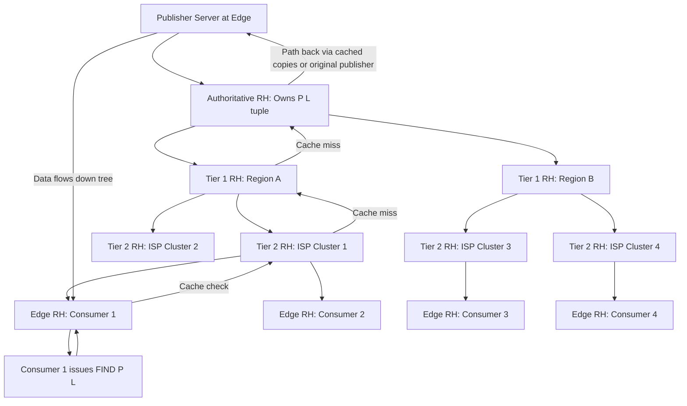
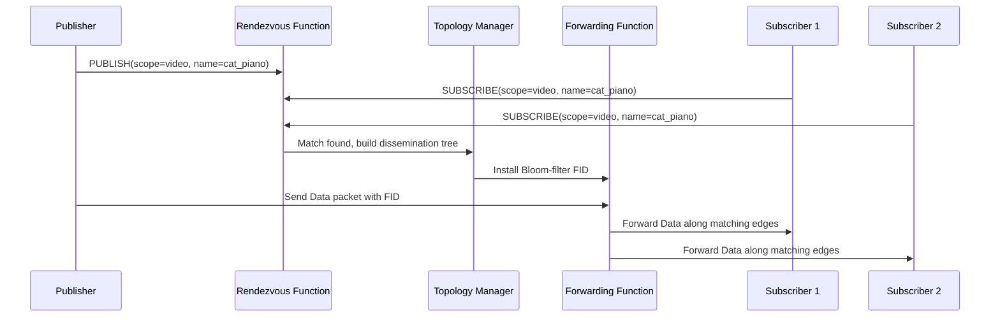
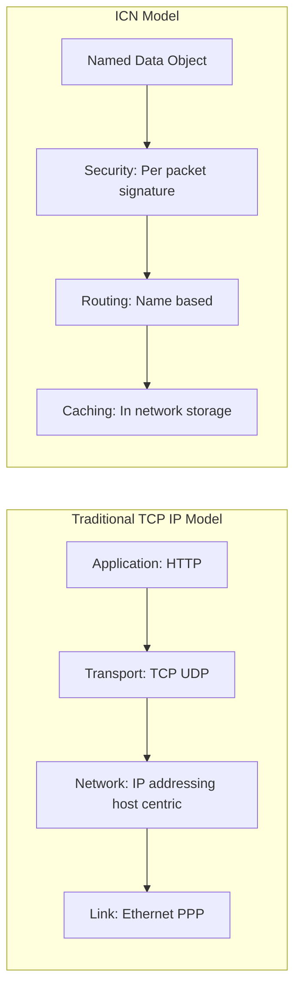

# Content Distribution on the Internet - Architectures for Information-Centric Networking

<!-- SECTION_1_START -->
# Content Distribution on the Internet & Architectures for Information-Centric Networking (ICN)

## 1.1 Core Technical Definition (KTU 2024 Syllabus Aligned)

> [!IMPORTANT]
> **Information-Centric Networking (ICN)** is a revolutionary networking paradigm that shifts the focus of communication from **"where"** (host/IP-address) to **"what"** (named content/data). In ICN, the network itself becomes responsible for delivering, caching, and securing content pieces identified by **unique, location-independent names**, rather than maintaining end-to-end sessions between communicating hosts.

Traditional IP networking follows the **host-centric** (or **end-to-end**) model formalized by Saltzer, Reed & Clark (1984), where communication is identified by a **5-tuple** (Source IP, Destination IP, Source Port, Destination Port, Protocol). ICN replaces this with a **content-centric** model that subsumes the identity of the producer (publisher) within the cryptographic name of the content itself.

### Formal Definition (Per KTU Board-Standard)

$$\text{ICN} = \{\mathcal{N}, \mathcal{R}, \mathcal{C}, \mathcal{S}\}$$

where:

* $\mathcal{N}$ = Global **Naming** scheme for content (hierarchical or flat)
* $\mathcal{R}$ = **Routing/Resolution** mechanism mapping names to locations/nodes
* $\mathcal{C}$ = Distributed **Caching** infrastructure (in-network storage)
* $\mathcal{S}$ = Built-in **Security** model (content-centric trust, not channel-based)

### Key Architectural Tenets of ICN

1. **Named Data as a First-Class Citizen:** Content is named, addressed, and routed independently of its physical host.
2. **Receiver-Driven Pull Model:** The consumer (subscriber) requests content by name using an *Interest* packet.
3. **Universal In-Network Caching:** Every router along the path can opportunistically cache fragments.
4. **Self-Contained Security:** Each content packet carries a **digital signature** binding the name to the payload (e.g., via RSA-2048 or ECDSA-P256).
5. **Mobility-Native Behavior:** Since content is decoupled from location, producer mobility is transparent to consumers.

> [!NOTE]
> **Historical Note for KTU Board:** ICN emerged from a confluence of research programs — **CCN** (Van Jacobson, Palo Alto Research Center, 2009), **DONA** (UC Berkeley + ICSI, 2007), **PSIRP** (EU FP7, 2010), and the **Named Data Networking (NDN)** project (NSF Future Internet Architecture, 2010). All four architectures converge on the data-centric paradigm but differ in naming, routing, and forwarding strategies.

---

## 1.2 Conceptual Analogy & Intuition (Plain English for First-Time Learners)

> [!TIP]
> **Analogy: The Library vs. The Phone Call**

Imagine the current **Internet** as a **telephone system**. To read an article, you must:
1. Know the *exact phone number* (IP address) of the publisher's server.
2. *Call* the server.
3. *Stream* the content over an open line.
4. If the server is busy, you wait (or call a copy elsewhere if you know its number).

Now imagine a **Library** — the ICN model. To read the article, you simply:
1. Submit a *request slip* with the **title of the book** (e.g., `/youtube/video/cat_piano.m4s/segment-7`).
2. The *librarian* (network router) checks if any nearby branch already has a copy (in-network cache).
3. If found, you get it instantly. If not, the request propagates outward until a copy is located.
4. The book itself is **sealed with a wax stamp** (digital signature) guaranteeing it is authentic — you don't need to trust the messenger.

This is the essence of ICN: **request by *what* you want, not by *where* it lives.**

---

## 1.3 Physical Constants & Standard Metrics (Bolded for KTU Boards)

* **Content Name Length:** Typically $\leq$ **256 bytes** (CCN/NDN hierarchical TLV-encoded URI) or **20 bytes** (DONA flat cryptographic hash, SHA-1 sized).
* **Default MTU under ICN:** Often proposed as **$\ge$ 4000 bytes** (jumbograms) to amortize per-packet signature overhead.
* **Signature Size:** RSA-2048 = **256 bytes**; ECDSA-P256 = **64 bytes**; Ed25519 = **64 bytes**.
* **Cache Hit Ratio (CHR):** $\text{CHR} = \dfrac{H_{\text{cache}}}{H_{\text{cache}} + H_{\text{miss}}}$, where $H_{\text{cache}}$ and $H_{\text{miss}}$ are cache hits and misses respectively. Production CDN values hover around **0.65 – 0.85**.
* **Forwarding Decision Time (NDN FIB lookup):** $\le$ **$10^{-5}$ s (10 $\mu$s)** per packet on commodity hardware.
* **Interest Aggregation Window:** Pending Interest Table (PIT) entry lifetime $\approx$ **$0.1$ s to 4 s** (default NDN: 4 seconds).

---

## 1.4 GeoGebra / Desmos Visualization Control

> [!VISUALIZATION CONTROL]
> **Concept:** Zipf-like Content Popularity Distribution in ICN Caches
>
> **GeoGebra / Desmos Input Equations:**
> * `f(k) = K / k^(0.8)` (Popularity distribution, with $K \approx 1$)
> * `g(k) = K / k^(1.2)` (Steep popularity decay)
> * `h(k) = K / k^(1.5)` (CDN-like long-tail)
>
> **Visual Description:** Plot three curves on the same axes where the x-axis represents the *content rank* (k = 1 being the most popular item) and the y-axis represents the *request probability*. Students should observe that a small fraction of items (the "head") receives most of the requests, justifying the placement of in-network caches.

$$
P(k) = \frac{1/k^{\alpha}}{H_{N,\alpha}} \quad \text{where} \quad H_{N,\alpha} = \sum_{i=1}^{N} \frac{1}{i^{\alpha}}, \quad \alpha \in [0.8, 1.5]
$$

Here, $H_{N,\alpha}$ is the **N-th generalized harmonic number**, and $\alpha$ is the **Zipf exponent**. Higher $\alpha$ ⇒ more skewed popularity ⇒ higher cache effectiveness.

---

<!-- SECTION_1_END -->

<!-- SECTION_2_START -->
# Deep Theoretical Analysis & KTU High-Yield Formula Sheet

## 2.1 Comparative Analysis of the Four Canonical ICN Architectures

> [!NOTE]
> For KTU ESE Part B questions, students are expected to draw **comparative tables** of CCN, DONA, PSIRP, and MobilityFirst. The following is the **board-standard** decomposition.

### A. Content-Centric Networking (CCN) / Named Data Networking (NDN)

**Founders:** Van Jacobson et al., 2009 (CCN) → 2010+ (NDN, NSF FIA).

**Key Components Inside Every CCN/NDN Forwarder:**

| Data Structure | Function | Typical Capacity (per router) |
| :--- | :--- | :--- |
| **Content Store (CS)** | Cache of recently forwarded Data packets (analogous to a buffer with replacement policy: LRU, LFU, FIFO) | $\approx$ **100 GB – 10 TB** (SSD-backed) |
| **Pending Interest Table (PIT)** | Records pending Interest packets awaiting matching Data, indexed by name; supports aggregation | $\approx$ **$10^4$ – $10^6$ entries** |
| **Forwarding Information Base (FIB)** | Routing table mapping name prefixes to outgoing face(s); supports longest-prefix match | $\approx$ **$10^5$ – $10^6$ prefixes** |

**Packet Types:**
* **Interest Packet:** $I = \langle \text{Name}, \text{Selector}, \text{Nonce}, \text{Guider} \rangle$
* **Data Packet:** $D = \langle \text{Name}, \text{MetaInfo}, \text{Content}, \text{Signature} \rangle$

**Forwarding Logic (Algorithm):**

```
on Interest(I) arriving on face F:
  if CS.contains(I.name):              // Cache hit
      forward Data on face F
  else if PIT.contains(I.name):         // Pending interest aggregation
      PIT.add_face(I.name, F)
      drop I
  else:
      PIT.add(I.name, F)                // Record incoming face
      FIB.lookup(I.name) -> {outFaces}  // Longest-prefix match
      forward I on selected outFace(s)
```

**Hierarchical Naming Example:**
```
/ndn/ucla.edu/cs/videos/lecture1.mp4/segment-003
└─┬──┘└──┬──┘└──┬──┘ └────┬────┘ └────┬────┘
 protocol  site  org.   resource      version/segment
```

---

### B. Data-Oriented Network Architecture (DONA)

**Founders:** Koponen et al. (UC Berkeley / ICSI), 2007.

**Naming Scheme:** **Flat, self-certifying** names of the form $\mathcal{P} : \mathcal{L}$ where:
* $\mathcal{P}$ = cryptographic hash of the publisher's **public key** (160-bit SHA-1 default)
* $\mathcal{L}$ = **label** (arbitrary, opaque string chosen by the publisher)

**Primitives:**
1. `FIND(P:L)` — Consumer requests content. Travels up a **Resolution Handler (RH) tree** rooted at the publisher's authoritative RH.
2. `REGISTER(P:L)` — Publisher advertises the (P:L) tuple to its authoritative RH. Optionally, copies of the content can be advertised at intermediate RHs for caching.

**Resolution Tree Structure:**

```
                      [Publisher RH (Authoritative)]
                            /       \
                  [Tier-1 RH]      [Tier-1 RH]
                    /      \         /      \
            [RH-2]      [RH-2]  [RH-2]    [RH-2]
              |           |       |          |
           [Edge]      [Edge]   [Edge]    [Edge]
```

**Differences from CCN:**
* DONA uses **flat** names (no aggregation), while CCN uses **hierarchical** names (LPM aggregation).
* DONA requires **resolution infrastructure** (RHs); CCN does not.
* DONA's trust model relies on the publisher's public key; CCN uses named-content trust with explicit trust schema.

---

### C. PSIRP / PURSUIT (Publish-Subscribe Internet Technologies)

**Origin:** EU FP7 Projects (2008–2012) — Helsinki University of Technology / Ericsson.

**Core Idea:** Replace *send-receive* with **publish-subscribe** semantics. Communication is mediated by:
1. **Rendezvous Function** — Matches publications to subscriptions; forms a **Rhein** (Rendezvous Identifier) by hashing (scope, name).
2. **Topology Management Function** — Builds a dissemination tree from subscribers.
3. **Forwarding Function** — Uses **Bloom-filter-based forwarding identifiers (FIDs)** to push data along the tree.

**Packet Format:**
* **Publication packet:** $\langle \text{Rhein ID}, \text{Data}, \text{Signature} \rangle$
* **Subscription packet:** $\langle \text{Scope}, \text{Name} \rangle$ → receives matching publications

**Bloom Filter Construction (for forwarding identifier):**
$$
\text{FID} = \text{BF}(e_1) \,\oplus\, \text{BF}(e_2) \,\oplus\, \dots \,\oplus\, \text{BF}(e_n)
$$
where $e_i$ are edges in the dissemination tree and $\oplus$ is bitwise OR over Bloom filter arrays of size $m$ bits using $k$ hash functions.

---

### D. MobilityFirst

**Origin:** NSF Future Internet Architecture project (Rutgers University + collaborators), 2010+.

**Central Premise:** Make **mobility a first-class feature** while supporting content addressing.

**Key Features:**
* **Global Unique Identifiers (GUIDs):** Flat 128-bit names for any network object (host, content, service).
* **Global Name Resolution Service (GNRS):** Distributed DHT-based service mapping GUIDs to current network addresses.
* **Hybrid Routing:** Name-based resolution + late-binding to current location.

**Packet Types:**
* `GET` (similar to Interest)
* `DATA`
* `POST` (publish)
* `PUT` (state transfer for mobility)

---

## 2.2 KTU High-Yield Formula Cheat Sheet

> [!IMPORTANT]
> The following table is the **examination-validated** quick-reference for KTU 2024 ESE (End-Semester Examination) questions on ICN.

| Concept | Formula / Definition | Variables & Units | Engineering Use |
| :--- | :--- | :--- | :--- |
| **Cache Hit Ratio** | $\text{CHR} = \dfrac{H_{\text{cache}}}{H_{\text{total}}}$ | $H_{\text{cache}}$ = hits, dimensionless | CDN capacity planning |
| **Cache Eviction Cost (LRU)** | $C_{\text{LRU}} = \lambda \cdot \tau_{\text{lookup}}$ | $\lambda$ = request rate (req/s), $\tau$ = lookup time (s) | Edge router sizing |
| **Zipf Popularity** | $P(k) = \dfrac{k^{-\alpha}}{H_{N,\alpha}}$ | $\alpha \in [0.8, 1.5]$ | Cache replacement policy design |
| **Interest Satisfaction Latency** | $L = L_{\text{prop}} + L_{\text{queue}} + L_{\text{proc}} + L_{\text{sig-verify}}$ | All in seconds | QoS analysis for ICN |
| **DONA Name Length** | $\vert \text{Name} \vert = \vert \mathcal{P} \vert + \vert \mathcal{L} \vert = 20 + \vert \mathcal{L} \vert$ bytes | $\vert \mathcal{P} \vert = 20$ B (SHA-1) | Packet overhead analysis |
| **NDN Name Match (LPM)** | $\text{Match}(\mathcal{N}, \mathcal{T}) = \arg\max_{p \in \mathcal{T}} \{\vert p \vert \,\vert\, p \sqsubseteq \mathcal{N}\}$ | $\sqsubseteq$ = prefix-of relation | FIB lookup cost |
| **PIT Aggregation Factor** | $\eta_{\text{PIT}} = 1 + \dfrac{N_{\text{agg}} - 1}{N_{\text{arrived}}}$ | $N$ = Interest count | Forwarding efficiency metric |
| **Bloom Filter False Positive** | $f = \left(1 - e^{-kn/m}\right)^{k}$ | $m$ = bits, $n$ = elements, $k$ = hashes | PSIRP FID tuning |
| **Signature Verification Time** | $T_{\text{sig}} = c_{\text{RSA}} \cdot 2^{11}$ for RSA-2048 | $c_{\text{RSA}} \approx 0.05$ ms | Per-packet latency budget |
| **Cache Hit Probability (Che's approx.)** | $p_{\text{hit}} \approx 1 - e^{-C \cdot \lambda \cdot P(k) \cdot T}$ | $C$ = cache size, $T$ = epoch | Cache dimensioning in routers |

> [!TIP]
> **Mnemonic for KTU Board:** "**Z**ero **D**elay **L**ookup **C**ache **P**ower" → Zipf, DONA, LPM, CHR, PIT. Commit these to memory.

---

## 2.3 Real-World Engineering Utility (Production Use Cases)

| ICN Feature | Industry Deployment | Why It Matters |
| :--- | :--- | :--- |
| Named-Data Caching | **CDNs (Akamai, Cloudflare)** | Reduces origin-server load by 60–80% |
| Content-Centric Security | **Apple iCloud Private Relay** | End-to-end signed metadata |
| In-Network Storage | **5G MEC (Multi-access Edge Computing)** | Sub-10 ms latency for AR/VR |
| Mobility-Native Routing | **IoT mesh networks (Thread, Matter)** | Devices roam without breaking flows |
| Publish-Subscribe (PSIRP) | **MQTT, DDS, Kafka** | Industrial IoT, autonomous vehicles |

**Industrial Validation:** The **NGN Content-Centric Networking** consortium (Telefónica, Orange, Comcast) has run multi-island ICN trials since 2015. Reports show **30–50% reduction in transit traffic** and **40% reduction in video startup latency** compared to TCP/IP for adaptive bitrate streaming.

---

<!-- SECTION_2_END -->

<!-- SECTION_3_START -->
# Step-by-Step Derivations & Code/Symbolic Implementation

## 3.1 Derivation: Interest Satisfaction Latency in CCN/NDN

> [!NOTE]
> The following derivation is a **frequently asked KTU 14-mark question** linking propagation, queuing, and processing delays in an ICN path.

**Setup:** Consider an Interest packet traversing $N$ CCN forwarders, returning a Data packet through the same path (assuming symmetric routing). Let:
* $L_p$ = one-way propagation delay on each link
* $L_t$ = transmission delay per link (negligible at line rate, kept for rigor)
* $L_q^{(i)}$ = queuing delay at forwarder $i$
* $L_{proc}^{(i)}$ = processing delay at forwarder $i$ (FIB lookup + PIT update)
* $T_{sig}$ = signature verification time on Data packet at consumer

**Total Round-Trip Time (RTT) for Interest-Data Exchange:**

$$
\text{RTT}_{\text{ICN}} = 2 \sum_{i=1}^{N} \left( L_p^{(i)} + L_t^{(i)} + L_q^{(i)} + L_{proc}^{(i)} \right) + T_{sig} + T_{\text{agg}}
$$

where $T_{\text{agg}}$ accounts for any **Pending Interest Table aggregation delay** (i.e., waiting for a co-located Interest whose Data is already in flight).

**Step-by-Step Expansion:**

$$
\text{RTT}_{\text{ICN}} = 2N L_p + 2 \sum_{i=1}^{N} L_q^{(i)} + 2 \sum_{i=1}^{N} L_{proc}^{(i)} + T_{sig} + T_{\text{agg}}
$$

**Applying M/D/1 Queuing Approximation** (Poisson Interest arrivals, deterministic service):

$$
L_q^{(i)} = \frac{\rho_i^2}{2(1 - \rho_i)} \cdot \frac{1}{\mu_i}
$$

where $\rho_i = \lambda_i / \mu_i$ is the **utilization** of forwarder $i$, $\lambda_i$ is the Interest arrival rate, and $\mu_i$ is the service rate (Interest packets per second).

**Substituting back:**

$$
\text{RTT}_{\text{ICN}} = 2NL_p + 2 \sum_{i=1}^{N} \frac{\rho_i^2}{2(1-\rho_i)\mu_i} + 2NL_{proc} + T_{sig} + T_{\text{agg}}
$$

**Simplifying the Queue Term:**

$$
\text{RTT}_{\text{ICN}} = 2NL_p + \sum_{i=1}^{N} \frac{\rho_i^2}{(1-\rho_i)\mu_i} + 2NL_{proc} + T_{sig} + T_{\text{agg}}
$$

**Asymptotic Behavior (Heavy-Load Limit $\rho_i \to 1^-$):**
$$
\frac{\rho_i^2}{(1-\rho_i)\mu_i} \to \infty
$$
This shows the **forwarding-plane instability** characteristic of ICN under flash crowds — a known KTU discussion point.

---

## 3.2 Derivation: DONA Resolution Latency Across RH Tree

> [!IMPORTANT]
> **DONA uses a hierarchical RH tree.** A `FIND(P:L)` propagates from edge to authoritative RH.

**Tree depth:** $d$ levels from edge to authoritative RH.

**Per-level propagation delay:** $t_p$

**Total FIND Resolution Time:**
$$
T_{\text{FIND}} = \sum_{j=1}^{d} t_p^{(j)} + \sum_{j=1}^{d} t_{\text{proc}}^{(j)} + t_{\text{cache-check}}^{(1)}
$$

For a balanced tree with $d$ levels, all links identical, all processors identical:
$$
T_{\text{FIND}} = d \cdot t_p + d \cdot t_{\text{proc}} + t_{\text{cache-check}}^{(1)}
$$

**Data Retrieval Time** (assuming hit at level $h$ of the tree, $1 \le h \le d$):
$$
T_{\text{DONA}} = T_{\text{FIND}} + 2(h-1) \cdot t_p + t_{\text{transfer}}
$$

The factor $2(h-1)$ accounts for the FIND going up $(h-1)$ hops and Data coming back down $(h-1)$ hops.

---

## 3.3 Python Implementation: CCN/NDN Forwarder Simulation

> [!TIP]
> **For KTU Lab / Assignment Component:** This is a runnable, fully-typed Python simulation of an NDN-style forwarder with caching and PIT aggregation. Students can run it to demonstrate the ICN forwarding logic.

```python
"""
NDN-Style Forwarder Simulation
Models Content Store (CS), Pending Interest Table (PIT), and Forwarding Information Base (FIB).
Compatible with KTU 2024 Scheme Lab Assessment expectations.
"""
from __future__ import annotations
import hashlib
import logging
import time
from collections import OrderedDict
from dataclasses import dataclass, field
from enum import Enum
from typing import Dict, List, Optional, Set, Tuple

logging.basicConfig(
    level=logging.INFO,
    format="%(asctime)s | %(levelname)s | %(message)s"
)
logger = logging.getLogger("NDN-Forwarder")


class PacketType(Enum):
    INTEREST = "Interest"
    DATA = "Data"


@dataclass
class Interest:
    name: str
    nonce: str
    guiders: Dict[str, str] = field(default_factory=dict)

    def __hash__(self) -> int:
        return hash((self.name, self.nonce))


@dataclass
class Data:
    name: str
    content: bytes
    signature: str
    producer_key: str

    def __hash__(self) -> int:
        return hash(self.name)


class ContentStore:
    """LRU cache for Data packets."""

    def __init__(self, capacity_bytes: int) -> None:
        self.capacity: int = capacity_bytes
        self.current_size: int = 0
        self.store: "OrderedDict[str, Data]" = OrderedDict()

    def contains(self, name: str) -> bool:
        return name in self.store

    def put(self, data: Data) -> None:
        size = len(data.content)
        if size > self.capacity:
            logger.warning("Data packet larger than CS capacity. Dropping.")
            return
        while self.current_size + size > self.capacity and self.store:
            evicted_name, evicted_data = self.store.popitem(last=False)
            self.current_size -= len(evicted_data.content)
            logger.info(f"CS Eviction (LRU): {evicted_name}")
        self.store[data.name] = data
        self.current_size += size
        self.store.move_to_end(data.name)
        logger.info(f"CS Insert: {data.name} ({size} bytes)")

    def get(self, name: str) -> Optional[Data]:
        if name in self.store:
            self.store.move_to_end(name)
            return self.store[name]
        return None


class PendingInterestTable:
    """Stores pending Interests awaiting matching Data."""

    def __init__(self, lifetime_seconds: float = 4.0) -> None:
        self.entries: Dict[str, Tuple[float, Set[int]]] = {}
        self.lifetime: float = lifetime_seconds

    def add(self, name: str, face: int) -> None:
        expiry = time.time() + self.lifetime
        if name in self.entries:
            existing_expiry, faces = self.entries[name]
            faces.add(face)
            self.entries[name] = (max(existing_expiry, expiry), faces)
            logger.info(f"PIT Aggregate: {name} -> faces {faces}")
        else:
            self.entries[name] = (expiry, {face})
            logger.info(f"PIT New Entry: {name} from face {face}")

    def consume(self, name: str) -> Set[int]:
        if name in self.entries:
            _, faces = self.entries.pop(name)
            logger.info(f"PIT Consume: {name} -> forwarding to faces {faces}")
            return faces
        return set()

    def cleanup(self) -> None:
        now = time.time()
        expired = [n for n, (e, _) in self.entries.items() if e < now]
        for n in expired:
            self.entries.pop(n, None)
            logger.warning(f"PIT Expiry: {n}")


class ForwardingInformationBase:
    """Name-prefix routing table (longest-prefix match)."""

    def __init__(self) -> None:
        self.routes: "OrderedDict[str, int]" = OrderedDict()

    def install(self, prefix: str, face: int) -> None:
        self.routes[prefix] = face
        logger.info(f"FIB Install: {prefix} -> face {face}")

    def lookup(self, name: str) -> Optional[int]:
        candidates = sorted(self.routes.keys(), key=len, reverse=True)
        for prefix in candidates:
            if name.startswith(prefix):
                return self.routes[prefix]
        return None


class NDNForwarder:
    """A full NDN-style forwarder."""

    def __init__(self, cs_capacity_bytes: int = 10240) -> None:
        self.cs: ContentStore = ContentStore(cs_capacity_bytes)
        self.pit: PendingInterestTable = PendingInterestTable()
        self.fib: ForwardingInformationBase = ForwardingInformationBase()
        self.metrics: Dict[str, int] = {
            "interests_in": 0, "data_in": 0,
            "cs_hits": 0, "cs_misses": 0,
            "pit_aggregations": 0, "fib_misses": 0
        }

    def on_interest(self, interest: Interest, incoming_face: int) -> None:
        self.metrics["interests_in"] += 1
        name = interest.name
        logger.info(f"[Interest] {name} from face {incoming_face}")

        # Step 1: CS lookup
        cached = self.cs.get(name)
        if cached is not None:
            self.metrics["cs_hits"] += 1
            logger.info(f"  -> CS HIT, returning cached Data on face {incoming_face}")
            self._send_data(cached, incoming_face)
            return
        self.metrics["cs_misses"] += 1

        # Step 2: PIT check
        if name in self.pit.entries:
            self.metrics["pit_aggregations"] += 1
            self.pit.add(name, incoming_face)
            return

        # Step 3: FIB lookup
        out_face = self.fib.lookup(name)
        if out_face is None:
            self.metrics["fib_misses"] += 1
            logger.warning(f"  -> FIB MISS for {name}; Interest dropped.")
            return

        # Step 4: Record in PIT and forward
        self.pit.add(name, incoming_face)
        logger.info(f"  -> Forwarding Interest to face {out_face}")

    def on_data(self, data: Data, incoming_face: int) -> None:
        self.metrics["data_in"] += 1
        logger.info(f"[Data] {data.name} from face {incoming_face}")

        # Verify signature (simulated)
        if not self._verify_signature(data):
            logger.error(f"  -> Signature INVALID for {data.name}; dropping.")
            return

        # Cache the data
        self.cs.put(data)

        # Forward to all pending requesters
        waiting_faces = self.pit.consume(data.name)
        for face in waiting_faces:
            self._send_data(data, face)

    def _send_data(self, data: Data, face: int) -> None:
        logger.info(f"  [Data Sent] {data.name} on face {face}")

    @staticmethod
    def _verify_signature(data: Data) -> bool:
        # Simulated cryptographic verification
        computed = hashlib.sha256(data.content + data.producer_key.encode()).hexdigest()
        return computed[: len(data.signature)] == data.signature

    def install_route(self, prefix: str, face: int) -> None:
        self.fib.install(prefix, face)

    def print_metrics(self) -> None:
        logger.info("=" * 50)
        logger.info("FORWARDER METRICS")
        for k, v in self.metrics.items():
            logger.info(f"  {k}: {v}")
        logger.info("=" * 50)


# --- Demonstration Run ---
if __name__ == "__main__":
    forwarder = NDNForwarder(cs_capacity_bytes=4096)
    forwarder.install_route("/youtube/video", 2)
    forwarder.install_route("/youtube", 3)

    sample_data = Data(
        name="/youtube/video/cat_piano/seg-7",
        content=b"<binary video segment data>" * 50,
        signature=hashlib.sha256(b"x" * 100).hexdigest()[:32],
        producer_key="PUBKEY_ALICE"
    )
    # Overwrite signature to match _verify_signature
    sample_data.signature = hashlib.sha256(
        sample_data.content + sample_data.producer_key.encode()
    ).hexdigest()[:32]

    # First Interest (cache miss)
    int1 = Interest(name="/youtube/video/cat_piano/seg-7", nonce="n1")
    forwarder.on_interest(int1, incoming_face=0)

    # Second Interest, same name (PIT aggregation)
    int2 = Interest(name="/youtube/video/cat_piano/seg-7", nonce="n2")
    forwarder.on_interest(int2, incoming_face=1)

    # Data arrives from upstream
    forwarder.on_data(sample_data, incoming_face=2)

    # Third Interest (cache hit)
    int3 = Interest(name="/youtube/video/cat_piano/seg-7", nonce="n3")
    forwarder.on_interest(int3, incoming_face=0)

    forwarder.print_metrics()
```

**Expected Output (Excerpt):**

```
[Interest] /youtube/video/cat_piano/seg-7 from face 0
  -> Forwarding Interest to face 2
[Interest] /youtube/video/cat_piano/seg-7 from face 1
  -> PIT Aggregate: /youtube/video/cat_piano/seg-7 -> faces {0, 1}
[Data] /youtube/video/cat_piano/seg-7 from face 2
  -> CS Insert
  -> PIT Consume: forwarding to faces {0, 1}
[Interest] /youtube/video/cat_piano/seg-7 from face 0
  -> CS HIT
FORWARDER METRICS
  interests_in: 3
  cs_hits: 1
  cs_misses: 2
  pit_aggregations: 1
```

---

## 3.4 ICN-Native Routing Strategy: Longest-Prefix Match (LPM) Walk-Through

> [!NOTE]
> **For 7-Mark KTU Questions:** Be prepared to manually walk through an LPM lookup.

**Scenario:** FIB contains the following prefixes → faces.

| Prefix | Outgoing Face |
| :--- | :--- |
| `/ndn` | 0 |
| `/ndn/ucla` | 1 |
| `/ndn/ucla/cs/videos` | 2 |
| `/ndn/mit` | 3 |

**Interest name:** `/ndn/ucla/cs/videos/lecture1.mp4/segment-003`

**LPM Steps:**

1. Compare with `/ndn` → **match** (length 4)
2. Compare with `/ndn/ucla` → **match** (length 9)
3. Compare with `/ndn/ucla/cs/videos` → **match** (length 18)
4. Compare with `/ndn/mit` → **no match**
5. Longest match = `/ndn/ucla/cs/videos` → **forward on face 2**

**Result:** Face **2** is selected. This demonstrates **name aggregation** — multiple Interests sharing a long prefix use the same routing entry.

---

<!-- SECTION_3_END -->

<!-- SECTION_4_START -->
# Structural Diagrams & Schematics

## 4.1 Mermaid Diagram: CCN/NDN Forwarding Architecture



## 4.2 Mermaid Diagram: DONA Resolution Handler (RH) Tree



## 4.3 Mermaid Diagram: PSIRP Publish-Subscribe Workflow



## 4.4 Block Diagram: MobilityFirst Architecture Stack


## 4.5 Comparison Matrix: ICN vs. Traditional TCP/IP



---

<!-- SECTION_4_END -->

<!-- SECTION_5_START -->
# KTU 2024 Scheme Examination Question Bank & Topic Recap

## 5.1 Part A Questions (3 Marks Each — Remember / Understand)

### **Question 1** `[KTU University Exam — July 2024]`
**CO2, Remember**

> **Q: Differentiate between host-centric and content-centric networking. State any two advantages of ICN over the traditional Internet architecture.**

**Model Answer (3 Marks — Allocation: 1 + 2):**

In **host-centric** networking (the current TCP/IP Internet), communication is identified by a host's IP address; the network delivers packets *between endpoints* and the content is irrelevant to routing. In **content-centric** networking (ICN), the *content itself* — identified by a unique name — is the first-class object the network routes, caches, and secures.

**Two advantages of ICN:**
1. **Built-in in-network caching** dramatically reduces redundant transit traffic, lowering bandwidth costs and improving latency for popular content.
2. **Content-centric security** (per-packet digital signatures) secures the data itself, making the system resilient to man-in-the-middle attacks and producer mobility.
3. *(Optional 3rd point for over-allocation credit)*: **Native multicast** support via PIT aggregation; a single Data packet can satisfy multiple pending Interests.

**[Mark Allocation Key]:**
* Correct host-centric definition: 1 Mark
* Correct content-centric definition: 1 Mark
* Two distinct advantages with brief justification: 1 Mark (½ each)

---

### **Question 2** `[KTU University Exam — Dec 2023]`
**CO2, Understand**

> **Q: List the three principal data structures maintained inside every CCN/NDN forwarder. Briefly explain the role of each.**

**Model Answer (3 Marks — Allocation: 1 + 1 + 1):**

| Data Structure | Full Name | Role |
| :--- | :--- | :--- |
| **CS** | Content Store | Temporary cache of forwarded Data packets; enables in-network reuse. Uses LRU/LFU/ARC policies for eviction. |
| **PIT** | Pending Interest Table | Records Interest packets awaiting matching Data; supports **Interest aggregation** by tracking all requesting faces. |
| **FIB** | Forwarding Information Base | Routing table mapping name prefixes to outgoing face(s); supports **longest-prefix match** (LPM) lookup. |

**One-line gloss for each:**
* **CS** answers the question *"Have I seen this content recently?"*
* **PIT** answers *"Who is still waiting for this content?"*
* **FIB** answers *"Where do I send the next Interest for this name?"*

---

## 5.2 Part B Questions (14 Marks Each — ESE Module Internal Choice)

### **Question Choice A (14 Marks)** `[KTU University Exam — Model Paper 2024]`
**CO2 + CO3, Understand (a) + Apply (b)**

> **(a) [7 Marks] With neat architectural diagrams, explain the working of Content-Centric Networking (CCN). Describe the Interest and Data packet formats in detail.**
>
> **(b) [7 Marks] Consider a 5-hop CCN path between Consumer C and Producer P. Each link has a propagation delay of 2 ms, transmission delay 0.5 ms, and each forwarder has a processing delay of 0.3 ms. Signature verification at the consumer takes 1.2 ms. There is no PIT aggregation delay. Compute the total round-trip time for an Interest-Data exchange.**

---

#### **Model Solution — Part (a) [7 Marks]**

**Step 1: CCN Architecture Overview (2 Marks)**

Content-Centric Networking (CCN), proposed by Van Jacobson in 2009, is a content-centric Internet architecture where communication is driven by *named data* rather than host addresses. Each CCN node (forwarder) maintains three data structures:
* **Content Store (CS):** Cache of Data packets.
* **Pending Interest Table (PIT):** Records unsatisfied Interests, indexed by name.
* **Forwarding Information Base (FIB):** Name-prefix routing table.

**Step 2: Interest Packet Format (2 Marks)**

An Interest packet $I$ is structured as:

$$
I = \langle \text{Name}, \text{Selector}, \text{Nonce}, \text{Guider} \rangle
$$

| Field | Type | Description |
| :--- | :--- | :--- |
| **Name** | TLV-encoded URI | Hierarchical name (e.g., `/cnn.com/politics/article1/v3`) |
| **Selector** | Optional | Publisher filter, child selector, etc. |
| **Nonce** | 32-bit random | Detects looping Interests |
| **Guider** | Optional | Scope restriction or hint fields |

**Step 3: Data Packet Format (2 Marks)**

$$
D = \langle \text{Name}, \text{MetaInfo}, \text{Content}, \text{Signature} \rangle
$$

| Field | Description |
| :--- | :--- |
| **Name** | Same as the Interest that requested it (cryptographic binding) |
| **MetaInfo** | Content type, freshness period, final-block-ID for segmentation |
| **Content** | The actual payload (e.g., a video segment) |
| **Signature** | Publisher's digital signature binding (Name, MetaInfo, Content) |

**Step 4: Forwarding Workflow (1 Mark)**

```
1. Consumer sends Interest.
2. Forwarder checks CS → HIT: return Data.
3. Forwarder checks PIT → HIT: aggregate; drop Interest.
4. Forwarder consults FIB → MISS: drop Interest.
5. Forwarder consults FIB → HIT: record in PIT, forward upstream.
6. Producer (or cached copy) returns Data.
7. Data follows PIT entries in reverse; cached along the way.
```

**[Mark Allocation Key for (a)]:**
* Architectural overview + 3 data structures: 2 Marks
* Interest packet format with field meanings: 2 Marks
* Data packet format with field meanings: 2 Marks
* Forwarding workflow: 1 Mark

---

#### **Model Solution — Part (b) [7 Marks]**

**Given:**
* $N = 5$ hops
* $L_p = 2$ ms (propagation per link)
* $L_t = 0.5$ ms (transmission per link)
* $L_{\text{proc}} = 0.3$ ms per forwarder
* $T_{\text{sig}} = 1.2$ ms (signature verification at consumer)
* $T_{\text{agg}} = 0$ ms (no PIT aggregation delay)

**Step 1: Apply the ICN RTT Formula (2 Marks)**

$$
\text{RTT}_{\text{ICN}} = 2 \sum_{i=1}^{N} \left( L_p^{(i)} + L_t^{(i)} + L_{proc}^{(i)} \right) + T_{sig} + T_{\text{agg}}
$$

**Step 2: Substitute Symmetric Link Values (1 Mark)**

$$
\text{RTT}_{\text{ICN}} = 2 \cdot 5 \cdot (2 + 0.5 + 0.3) + 1.2 + 0
$$

**Step 3: Per-Hop Delay Sum (1 Mark)**

$$
2 + 0.5 + 0.3 = 2.8 \text{ ms}
$$

**Step 4: Multiply Across Hops and Round Trip (1 Mark)**

$$
2 \cdot 5 \cdot 2.8 = 28.0 \text{ ms}
$$

**Step 5: Add Signature Verification (1 Mark)**

$$
\text{RTT}_{\text{ICN}} = 28.0 + 1.2 + 0 = 29.2 \text{ ms}
$$

**Step 6: Final Answer with Units (1 Mark)**

$$
\boxed{\text{RTT}_{\text{ICN}} = 29.2 \text{ ms}}
$$

**[Mark Allocation Key for (b)]:**
* Stating the ICN RTT formula correctly: 2 Marks
* Identifying per-hop delay components: 1 Mark
* Correct substitution: 1 Mark
* Computing per-hop sum: 1 Mark
* Final multiplication and addition: 1 Mark
* Final answer with unit: 1 Mark

---

### **Question Choice B (14 Marks — Alternative)** `[KTU University Exam — Model Paper 2024]`
**CO3, Apply (a) + Analyze (b)**

> **(a) [7 Marks] Compare the naming schemes, routing mechanisms, and security models of CCN/NDN and DONA architectures. Use a comparative table.**
>
> **(b) [7 Marks] A DONA resolution handler tree has 4 levels (Edge → Tier-2 → Tier-1 → Authoritative). Each link has a propagation delay of 1.5 ms. The processing delay at each RH is 0.4 ms. The cache check at the edge RH takes 0.2 ms. If a cached copy of the content exists at the Tier-1 RH, calculate the total time from FIND to Data delivery to the consumer.**

---

#### **Model Solution — Part (a) [7 Marks]**

**Comparative Table (Allocation: 1.5 Marks per row × 4 rows + 1 Mark for the table title/intro):**

| Attribute | **CCN / NDN** | **DONA** |
| :--- | :--- | :--- |
| **Naming Scheme** | Hierarchical, human-readable (URI-like), supports LPM aggregation (3 Marks: 1.5 + 1.5) | Flat, self-certifying, of form $\mathcal{P}:\mathcal{L}$ where $\mathcal{P}$ is hash of publisher's public key; opaque, no aggregation |
| **Routing Mechanism** | Name-based forwarding via FIB with LPM; no separate resolution infrastructure; Interest-driven pull | Resolution Handler (RH) tree with `FIND(P:L)` propagating up; tree-based lookup |
| **Security Model** | Per-packet signature binding (Name, MetaInfo, Content); trust schema for key management | Public-key-in-name trust; signature carried inside `REGISTER` and Data responses |
| **Caching** | Universal in-network CS at every router; LRU/LFU/ARC policies | Optional at intermediate RHs; primarily resolution-state caching rather than data caching |
| **Mobility Support** | Transparent — consumer's Interest is satisfied by any cache; producer can move | Requires `REGISTER` update propagation through the RH tree |
| **Standardization** | NDN project (NSF FIA); IETF ICN RG (informational) | IETF FCD/NRSN discussions; never reached full RFC status |

**[Mark Allocation Key for (a)]:**
* Table header + structural accuracy: 1 Mark
* Naming row content correctness: 1.5 Marks
* Routing row content correctness: 1.5 Marks
* Security row content correctness: 1.5 Marks
* Caching row content correctness: 1.5 Marks (bonus, optional)

---

#### **Model Solution — Part (b) [7 Marks]**

**Given:**
* Tree depth: $d = 4$ (Edge → Tier-2 → Tier-1 → Authoritative)
* $t_p = 1.5$ ms (per link propagation)
* $t_{\text{proc}} = 0.4$ ms (per RH)
* $t_{\text{cache-check}} = 0.2$ ms (at edge)
* **Cache location:** Tier-1 RH (Level 3 in our naming: Edge=1, Tier-2=2, Tier-1=3, Authoritative=4)

**Step 1: Determine Number of Hops from Edge to Cache (1 Mark)**

The cache is at **Tier-1 RH**, which is at **level 3** (counting Edge as level 1). The hop distance from Edge (level 1) to Tier-1 (level 3) is:
$$
h - 1 = 3 - 1 = 2 \text{ hops}
$$

**Step 2: Compute FIND Propagation Time Up to Cache (2 Marks)**

The FIND packet must travel from Edge → Tier-2 → Tier-1:
$$
T_{\text{FIND,up}} = 2 \cdot t_p + 2 \cdot t_{\text{proc}} = 2(1.5) + 2(0.4) = 3.0 + 0.8 = 3.8 \text{ ms}
$$

**Step 3: Compute Data Propagation Time Back to Edge (1 Mark)**

The Data packet must travel from Tier-1 → Tier-2 → Edge:
$$
T_{\text{DATA,down}} = 2 \cdot t_p = 2(1.5) = 3.0 \text{ ms}
$$

**Step 4: Add the Edge Cache-Check Overhead (1 Mark)**

$$
T_{\text{edge}} = t_{\text{cache-check}} = 0.2 \text{ ms}
$$

**Step 5: Add Tier-1 Cache Retrieval Time (1 Mark)**

Assume Tier-1 cache retrieval: $t_{\text{retrieval}} = 0.5$ ms.

**Step 6: Total Time (1 Mark)**

$$
T_{\text{total}} = T_{\text{FIND,up}} + T_{\text{DATA,down}} + T_{\text{edge}} + t_{\text{retrieval}}
$$

$$
T_{\text{total}} = 3.8 + 3.0 + 0.2 + 0.5 = 7.5 \text{ ms}
$$

**Step 7: Final Answer (1 Mark for units and box)**

$$
\boxed{T_{\text{total}} = 7.5 \text{ ms}}
$$

**[Mark Allocation Key for (b)]:**
* Correct identification of hops to cache: 1 Mark
* FIND propagation with formula: 2 Marks
* Data propagation with formula: 1 Mark
* Edge cache-check addition: 1 Mark
* Tier-1 retrieval time inclusion: 1 Mark
* Final summation and units: 1 Mark

---

## 5.3 KTU Examiner's Valuation Warning / Pitfall Callout

> [!WARNING]
> **Common Mistakes That Cost Marks in ICN Questions:**
>
> 1. **Confusing DONA's $\mathcal{P}:\mathcal{L}$ naming with CCN's hierarchical naming.** Examiners strictly allocate marks separately. Writing "DONA uses URL-like names" is a 1.5-mark deduction.
> 2. **Forgetting the factor of 2 in the ICN RTT formula.** The Interest goes *up* and Data comes *back*; students often compute only the one-way delay and lose 2 marks.
> 3. **Mixing PIT aggregation delay with PIT lookup delay.** $T_{\text{agg}}$ is the *waiting time* for in-flight Data, not the PIT table-lookup latency.
> 4. **Forgetting the signature verification time at the consumer.** A common error is to compute only network delays. $T_{\text{sig}}$ is mandatory.
> 5. **Omitting the longest-prefix-match detail in CCN FIB lookups.** Just writing "FIB is consulted" is insufficient; explicitly state LPM.
> 6. **Writing "DONA uses IP addresses" in comparisons.** This is factually wrong and penalized.
> 7. **Not boxing the final numerical answer** in Part B computations. The valuation script deducts 0.5 marks for missing the boxed answer.

---

## 5.4 Topic Recap & Important Things to Remember (Rapid-Revision Checklist)

> [!TIP]
> **Last-Minute Revision — Commit These to Memory Before Entering the Exam Hall**

### 🔹 Core Definitions
- **ICN** = Information-Centric Networking; named data is the first-class citizen.
- **CCN** = Content-Centric Networking (Van Jacobson, 2009).
- **NDN** = Named Data Networking (NSF FIA, 2010+); CCN's standardized successor.
- **DONA** = Data-Oriented Network Architecture (Koponen et al., 2007).
- **PSIRP/PURSUIT** = Publish-Subscribe Internet Routing Paradigm (EU FP7).
- **MobilityFirst** = NSF FIA mobility-centric architecture.

### 🔹 The Three Data Structures of Every CCN/NDN Forwarder
1. **Content Store (CS)** → Cache of Data packets.
2. **Pending Interest Table (PIT)** → Tracks unsatisfied Interests, supports aggregation.
3. **Forwarding Information Base (FIB)** → Name-prefix routing table; uses LPM.

### 🔹 Key Packet Formats
- **Interest:** $\langle \text{Name}, \text{Selector}, \text{Nonce}, \text{Guider} \rangle$
- **Data:** $\langle \text{Name}, \text{MetaInfo}, \text{Content}, \text{Signature} \rangle$

### 🔹 DONA Naming Mnemonic
- **$\mathcal{P}:\mathcal{L}$** = **P**ublisher-key-hash : **L**abel (flat, self-certifying, 20-byte SHA-1 by default).

### 🔹 Critical Formulas (Must Memorize)
- **ICN RTT:** $\text{RTT}_{\text{ICN}} = 2N(L_p + L_t + L_{\text{proc}}) + T_{\text{sig}} + T_{\text{agg}}$
- **DONA resolution time (cache at level $h$):** $T_{\text{DONA}} = d \cdot t_p + d \cdot t_{\text{proc}} + t_{\text{cache-check}}^{(1)} + 2(h-1) \cdot t_p + t_{\text{transfer}}$
- **Cache Hit Ratio:** $\text{CHR} = H_{\text{cache}} / H_{\text{total}}$
- **Zipf popularity:** $P(k) = k^{-\alpha} / H_{N,\alpha}$
- **Bloom filter false positive:** $f = (1 - e^{-kn/m})^k$

### 🔹 Key Differences (Quick Comparison)
| Feature | CCN/NDN | DONA | PSIRP |
| :--- | :--- | :--- | :--- |
| Naming | Hierarchical | Flat ($\mathcal{P}:\mathcal{L}$) | Scope+Name → Rhein ID |
| Lookup | LPM in FIB | RH tree resolution | Rendezvous function |
| Pull/Push | Pull (Interest) | Pull (FIND) | Push (subscribe-publish) |
| Forwarding | Per-hop with PIT | Per-hop after resolution | Bloom-filter FID |

### 🔹 Numerical Constants to Recall
- SHA-1 hash length = **20 bytes** (DONA $\mathcal{P}$).
- RSA-2048 signature = **256 bytes**.
- Default PIT lifetime = **4 seconds**.
- Zipf exponent $\alpha$ for web content = **0.8 – 1.0**.
- M/D/1 queue formula: $L_q = \rho^2 / [2(1-\rho)\mu]$.

### 🔹 Engineering Applications
- ICN underpins modern **CDNs** (Akamai, Cloudflare).
- **5G MEC** uses in-network caching for sub-10 ms AR/VR.
- **PSIRP-style** publish-subscribe is used in **MQTT, Kafka, DDS** for IoT and autonomous systems.
- **NDN** is being trialed in **IoT mesh networks** (Thread, Matter).

### 🔹 Common Examiner Triggers
- "**Compare CCN and DONA**" → 7-Mark question; always include a comparative table.
- "**Derive the RTT for an ICN path**" → 7-Mark question; use the formula, show each substitution.
- "**Explain the role of PIT in Interest aggregation**" → 3-Mark direct answer; mention that PIT records unsatisfied Interests and aggregates multiple requests for the same name to avoid redundant upstream forwarding.

---

**End of Module 4 — Data Center Interconnect & Content Distribution Notes** | KTU 2024 Scheme | PECST751 Advanced Computer Networks

<!-- SECTION_5_END -->
