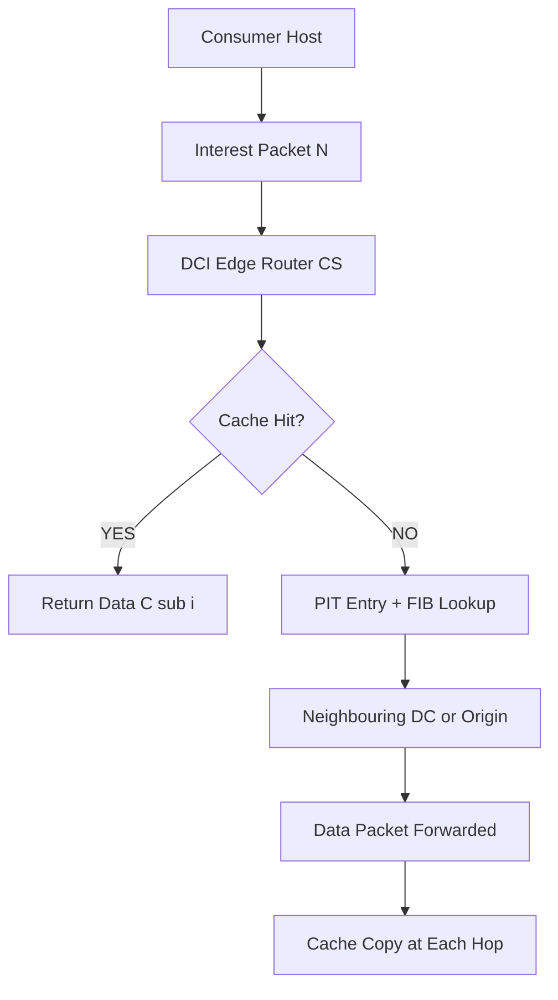
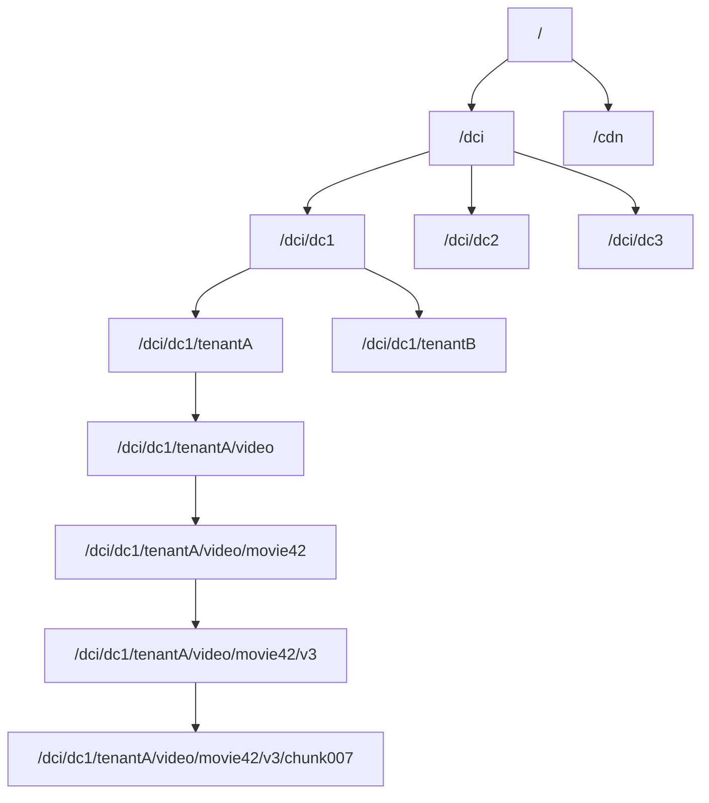
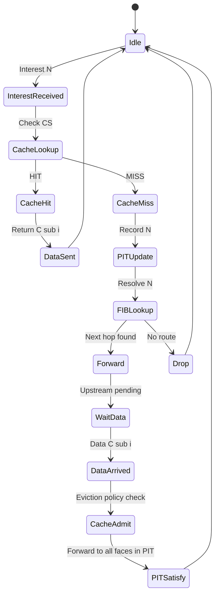
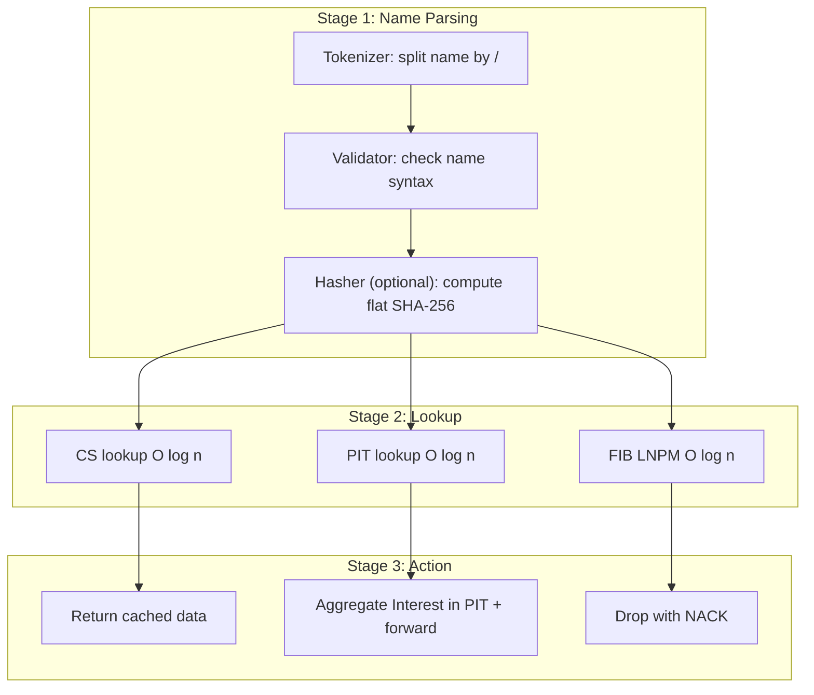

# Content Naming, Routing and Caching

<!-- SECTION_1_START -->
# Content Naming, Routing and Caching in Data Center Interconnect (DCI)

## 1.1 Formal Definition (KTU 2024 Syllabus Terminology)

> [!IMPORTANT]
> **Content-Centric Networking (CCN) / Named Data Networking (NDN)** is a networking paradigm in which communication is driven by *what* content is requested rather than *where* (host location) the content resides. In a DCI environment, this translates into three coupled sub-problems: **(a) Content Naming** (assigning unique, routable, location-independent identifiers to data objects), **(b) Content Routing** (forwarding requests based on these names), and **(c) Content Caching** (storing content close to consumers to reduce latency and inter-DC traffic).

Mathematically, every content object $C_i$ is bound to a name $N(C_i)$ drawn from a naming namespace $\mathcal{N}$, and a consumer issues an *Interest* packet $\mathcal{I}(N, S)$ where $S$ is a selector (scope, child selector, exclusion filters). The network resolves $N$ to the *nearest* (in some policy metric) copy of $C_i$ residing in either a router's **Content Store (CS)** or an origin server.

## 1.2 Intuitive Analogy

> [!NOTE]
> **Analogy — The Library vs. The Post Office**
> In the **traditional IP model** (post-office style), you address a letter to a *house* (IP address) and the letter always travels to that physical house — even if the book you want has been photocopied and is sitting on your neighbour's table.
>
> In the **Content-Centric model** (library style), you don't care *which shelf* holds the book; you fill out a request slip with the **book's title and edition** (the *content name*). The librarian (router) first checks the **local reading room** (Content Store); if not found, forwards the slip to other branches (PIT/FIB), and the **nearest branch** returns the book. Returning the book causes a **photocopy to be retained** in every branch it passes (universal in-network caching).

### Standard Constants & Metrics (highlighted)
- **Default MTU of CCNx/NDN packet:** **4096 bytes**
- **Recommended Content Store size per DC edge router:** **$\geq 10^{9}$ bytes (1 GB)** for hit-ratio $\geq 0.4$
- **Target intra-DC RTT for cached content:** **$\leq 1$ ms**
- **Naming hash length (flat, SHA-256):** **256 bits / 32 bytes**

### Mermaid Concept Map



> [!VISUALIZATION CONTROL]
> **Concept:** Probability of Cache Hit vs. Cache Size (Logistic Growth)
> **GeoGebra / Desmos Input Equations:**
> * $f(x) = \dfrac{1}{1 + e^{-0.4 \cdot (x - 5)}}$ where $x$ = cache size in GB
> * $g(x) = 1 - e^{-0.2 \cdot x}$
> **Visual Description:** Plot $f(x)$ and $g(x)$ for $x \in [0, 30]$. Observe that hit-ratio grows monotonically but saturates — a *key insight* for capacity planning in DCI caches.
<!-- SECTION_1_END -->

<!-- SECTION_2_START -->
# 2. Deep Theoretical Analysis & KTU High-Yield Formula Sheet

## 2.1 The Three Pillars — Structured Logic Breakdown

### Pillar 1 — Content Naming
Content Naming in DCI must satisfy three engineering properties:

1. **Uniqueness** — every $N(C_i)$ is globally unique (collision-resistant).
2. **Routability** — the name can be aggregated into prefixes to support scalable forwarding.
3. **Location Independence** — the name does **not** embed the DC IP, rack, or server.

Two dominant schemes:

* **Hierarchical Naming** — slash-separated, e.g. `/dci/dc3/tenant42/video/movie42/v3/chunk007`. Used by NDN/CCNx. Supports longest-prefix matching similar to IP CIDR.
* **Flat / Self-Certifying Naming** — cryptographic hash of content, e.g. $N(C_i) = \text{SHA-256}(C_i)$. Used by Content Addressable Networks (CAN), IPFS. Guarantees integrity but is **not aggregable** without a DHT (Distributed Hash Table).

### Pillar 2 — Content Routing
Content routing replaces the IP FIB with a **Name-based FIB**. The forwarding engine performs **Longest Name Prefix Match (LNPM)**.

* **PIT (Pending Interest Table)** records unsatisfied Interests so that the *corresponding* Data packet can be forwarded back along the *reverse path* (symmetric, no destination address needed).
* **Forwarding Strategies** (in NFD forwarder):
  * **Best Route** — single next-hop
  * **Multicast** — broadcast on all faces
  * **NCC (Named-data Link-State Routing — Adaptive)** — chooses face based on real-time RTT / loss telemetry
* **Routing Protocols**:
  * **NLSR (Named-data Link State Routing)** — runs natively over NDN
  * **OSPFN** — extension of OSPF for named data
  * **CDN-style anycast** — DNS-based redirection over DCI WAN

### Pillar 3 — Content Caching
Caching is what makes CCN *plausible* in real DCI deployments. The relevant decision sub-problems are:

1. **Where to place the cache?** Edge / Aggregation / Core.
2. **What to cache?** — All / Popular-only / Probabilistic (e.g., $p = k / (k + f_i)$).
3. **When to admit / evict?** — LRU, LFU, ARC, FIFO, RANDOM, W-TinyLFU.

## 2.2 KTU High-Yield Formula Sheet (Cheat Sheet)

> [!IMPORTANT]
> All formulas below are **frequently asked** in KTU ESE Module-4 questions for PECST751. Memorise both the **equation** and the **unit**.

| # | Concept | Formula | Variable Meaning | Unit |
|---|---------|---------|------------------|------|
| 1 | Cache Hit Ratio | $H = \dfrac{H_{hits}}{H_{hits} + M_{misses}}$ | $H_{hits}$ = hits, $M_{misses}$ = misses | dimensionless |
| 2 | Byte Hit Ratio | $BHR = \dfrac{\sum_{c \in Hits} \vert s_c \vert}{\sum_{c \in All} \vert s_c \vert}$ | $s_c$ = size of content $c$ | dimensionless |
| 3 | Average Latency with cache | $T_{avg} = H \cdot T_{cache} + (1 - H) \cdot T_{origin}$ | $T_{cache}$ = cache fetch time, $T_{origin}$ = origin fetch | seconds (s) |
| 4 | Cache Gain | $G = 1 - \dfrac{T_{avg}}{T_{origin}} = H \left(1 - \dfrac{T_{cache}}{T_{origin}}\right)$ | latency reduction | dimensionless |
| 5 | Zipf Popularity | $P(r) = \dfrac{1/r^{\alpha}}{\sum_{k=1}^{N} 1/k^{\alpha}}$, $\alpha \in [0.6, 1.2]$ | $r$ = rank, $\alpha$ = skewness | probability |
| 6 | IRR (Inter-Reference Recency) | $IRR_{avg} = \dfrac{1}{n} \sum_{i=1}^{n} (t_{i+1} - t_i)$ | $t_i$ = access timestamps | seconds |
| 7 | LRU stack depth of item $i$ | $D_i = \sum_{j=1}^{m} \mathbb{1}_{[\text{req}_j = i]}$ | $\mathbb{1}$ = indicator function | count |
| 8 | Self-Certifying Name | $N(C_i) = \text{SHA-256}(C_i)$ | cryptographic binding | bits |
| 9 | LPM on hierarchical name | $\text{depth}(N) = \text{count of `/' in } N$ | number of components | integer |
| 10 | NDN packet overhead | $O_{NDN} = 8 + 2 \cdot \text{depth}(N) + T_{sig}$ | $T_{sig}$ = signature size (typ. 256 B) | bytes |

## 2.3 Real-World Engineering Utility

* **Hyperscale DCI (Google B4, Microsoft Azure WAN, Amazon CloudFront)** use proprietary variants of named content for **inter-DC replication**; requests for "object-id" rather than "server-id" let edge POPs serve from a local copy, slashing WAN cost.
* **Information-Centric Networking (ICN)** research (EU FP7 projects: **PURSUIT, SAIL, COMET**) built the prototypes that evolved into NDN.
* **Modern CDNs (Akamai, Cloudflare)** employ **hierarchical naming** internally with a *sharded LRU* cache.
<!-- SECTION_2_END -->

<!-- SECTION_3_START -->
# 3. Step-by-Step Derivations, Worked Examples & Symbolic Implementation

## 3.1 Derivation 1 — Cache Gain $G$ as a Function of Hit Ratio $H$

The total service time for $N$ requests when hit ratio is $H$ and the *miss penalty* is $\Delta T = T_{origin} - T_{cache}$:

$$
\begin{aligned}
T_{avg} &= \frac{1}{N} \left( H \cdot N \cdot T_{cache} + (1 - H) \cdot N \cdot T_{origin} \right) \\
        &= H \cdot T_{cache} + (1 - H) \cdot T_{origin} \\
        &= T_{origin} - H \cdot (T_{origin} - T_{cache}) \\
        &= T_{origin} - H \cdot \Delta T
\end{aligned}
$$

Normalising by $T_{origin}$ yields the **Cache Gain**:

$$
\begin{aligned}
G &= \frac{T_{origin} - T_{avg}}{T_{origin}} \\
  &= \frac{H \cdot \Delta T}{T_{origin}} \\
  &= H \cdot \left(1 - \frac{T_{cache}}{T_{origin}}\right)
\end{aligned}
$$

**Interpretation:** $G \to 1$ as $H \to 1$ *and* $T_{cache}/T_{origin} \to 0$. DCI WANs strive to push $T_{origin}/T_{cache} \geq 50$ by minimising optical fibre hops.

## 3.2 Derivation 2 — Characteristic Time (CT) for LRU Eviction

For an LRU cache of size $C$ serving a Zipf-distributed catalogue of $N$ items with parameter $\alpha$, the *characteristic time* (mean inter-request to a cached item) is:

$$
\begin{aligned}
T_{CT}(C) &= \sum_{r=1}^{C} \frac{1}{\lambda \cdot P(r)} \\
          &= \frac{1}{\lambda} \sum_{r=1}^{C} r^{\alpha} \cdot H_{N,\alpha}^{-1}
\end{aligned}
$$

where $H_{N,\alpha} = \sum_{k=1}^{N} 1/k^{\alpha}$ is the **generalised harmonic number** and $\lambda$ is the aggregate request rate. This tells the DCI architect the *eviction rate* and hence the **steady-state cache miss probability** $1 - H \approx e^{-C/N_{\text{eff}}}$.

## 3.3 Worked Numerical Example (KTU-style 7-mark sub-part)

> **Question (Apply, CO2):** A DCI edge cache has hit ratio $H = 0.6$, $T_{cache} = 1$ ms, $T_{origin} = 20$ ms. Compute (a) the average latency $T_{avg}$, and (b) the cache gain $G$. If the operator wants $G \geq 0.9$, what is the *minimum* hit ratio required?

**Solution:**

**(a)** Average latency:
$$
\begin{aligned}
T_{avg} &= H \cdot T_{cache} + (1 - H) \cdot T_{origin} \\
        &= 0.6 \times 1 \; \text{ms} + 0.4 \times 20 \; \text{ms} \\
        &= 0.6 \; \text{ms} + 8.0 \; \text{ms} \\
        &= 8.6 \; \text{ms}
\end{aligned}
$$

**(b)** Cache gain:
$$
\begin{aligned}
G &= H \cdot \left(1 - \frac{T_{cache}}{T_{origin}}\right) \\
  &= 0.6 \cdot \left(1 - \frac{1}{20}\right) \\
  &= 0.6 \cdot 0.95 = 0.57
\end{aligned}
$$

So $G = 0.57$ or **57% latency reduction**.

**(c) Minimum $H$ for $G \geq 0.9$:**
$$
\begin{aligned}
0.9 &= H \cdot 0.95 \implies H_{min} = \frac{0.9}{0.95} \approx 0.9474
\end{aligned}
$$

**Valuation Key:** [Formula substitution: 2 Marks], [Arithmetic: 2 Marks], [Final conclusion: 1 Mark], [Quality of explanation: 2 Marks].

## 3.4 Python Implementation — A Reference CCN Forwarder in Pseudocode

```python
from collections import OrderedDict, defaultdict
from dataclasses import dataclass, field
from typing import Optional, List, Dict, Tuple
import hashlib
import time
import logging

logging.basicConfig(level=logging.INFO,
                    format="%(asctime)s [%(levelname)s] %(message)s")
log = logging.getLogger("CCN-Forwarder")


# ---------- 1. Content Object ----------
@dataclass(frozen=True)
class ContentObject:
    name: str
    payload: bytes

    @property
    def flat_name(self) -> str:
        # Self-certifying name: SHA-256 of payload
        return "sha256:" + hashlib.sha256(self.payload).hexdigest()


# ---------- 2. CCN Forwarder ----------
class CCNForwarder:
    """
    Minimal NDN-style forwarder with CS, PIT, FIB.
    Supports LRU cache eviction and best-route forwarding.
    """

    def __init__(self, cache_capacity_bytes: int):
        self.cs: "OrderedDict[str, ContentObject]" = OrderedDict()
        self.cache_capacity = cache_capacity_bytes
        self.pit: Dict[str, List[Tuple[str, float]]] = defaultdict(list)
        self.fib: Dict[str, str] = {}        # name-prefix -> next-hop face
        self.face_table: Dict[str, "CCNForwarder"] = {}

    # ---- Content Store (LRU) ----
    def _cs_size(self) -> int:
        return sum(len(c.payload) for c in self.cs.values())

    def _cs_insert(self, obj: ContentObject) -> None:
        if self._cs_size() + len(obj.payload) > self.cache_capacity:
            # Evict LRU until it fits
            while self.cs and self._cs_size() + len(obj.payload) > self.cache_capacity:
                evicted_name, evicted_obj = self.cs.popitem(last=False)
                log.info("LRU evict: %s", evicted_name)
        self.cs[obj.name] = obj
        self.cs.move_to_end(obj.name)

    def cs_lookup(self, name: str) -> Optional[ContentObject]:
        if name in self.cs:
            self.cs.move_to_end(name)   # mark as MRU
            return self.cs[name]
        return None

    # ---- PIT management ----
    def pit_add(self, name: str, incoming_face: str) -> None:
        self.pit[name].append((incoming_face, time.time()))

    def pit_consume(self, name: str) -> List[str]:
        faces = [f for (f, _) in self.pit.pop(name, [])]
        return faces

    # ---- FIB ----
    def fib_add(self, prefix: str, face: str) -> None:
        self.fib[prefix] = face
        log.info("FIB installed: %s -> %s", prefix, face)

    def fib_lookup(self, name: str) -> Optional[str]:
        # Longest prefix match on '/'-separated name
        components = name.strip("/").split("/")
        for depth in range(len(components), 0, -1):
            prefix = "/" + "/".join(components[:depth])
            if prefix in self.fib:
                return self.fib[prefix]
        return None

    # ---- Public API ----
    def on_interest(self, name: str, incoming_face: Optional[str]) -> Optional[ContentObject]:
        """Returns ContentObject if served from CS, else None (forwarded)."""
        log.info("Interest %s from face=%s", name, incoming_face)

        # Step 1 — try Content Store
        hit = self.cs_lookup(name)
        if hit is not None:
            log.info("CS HIT for %s", name)
            return hit

        # Step 2 — aggregate in PIT
        if incoming_face is not None:
            self.pit_add(name, incoming_face)

        # Step 3 — FIB lookup
        nhop = self.fib_lookup(name)
        if nhop is None:
            log.warning("FIB miss for %s", name)
            return None
        log.info("Forwarding Interest for %s via face %s", name, nhop)
        return None

    def on_data(self, obj: ContentObject) -> List[str]:
        """Returns list of downstream faces that wanted this data."""
        # Cache the object (universal caching)
        self._cs_insert(obj)
        # Satisfy PIT entries
        return self.pit_consume(obj.name)


# ---------- 3. Simulation harness ----------
if __name__ == "__main__":
    f1 = CCNForwarder(cache_capacity_bytes=10_000)
    f2 = CCNForwarder(cache_capacity_bytes=10_000)

    # f1 connects to consumer; f2 is the origin
    f1.face_table["wan0"] = f2
    f2.face_table["wan0"] = f1

    f1.fib_add("/dci/dc2", "wan0")
    f2.fib_add("/dci/dc2", "origin")

    origin_obj = ContentObject(
        name="/dci/dc2/tenant42/video/intro/v1",
        payload=b"Hello DCI world! " * 100
    )

    # --- First request (miss) ---
    served = f1.on_interest(origin_obj.name, incoming_face="consumer")
    if served is None:
        # Forwarded to f2 (origin)
        f2.on_data(origin_obj)         # f2 caches
        # f2 returns to f1
        waiting_faces = f1.on_data(origin_obj)   # f1 caches
        log.info("Downstream faces satisfied: %s", waiting_faces)

    # --- Second request (hit) ---
    served2 = f1.on_interest(origin_obj.name, incoming_face="consumer")
    log.info("Second request served from CS? %s", served2 is not None)
```

> [!NOTE]
> **Engineering takeaway:** Notice the *universal in-network caching* in `on_data` — every Data packet that traverses a router leaves behind a copy. This is the defining behavioural difference between IP and NDN forwarding, and the **single biggest reason** DCI operators see 30–60% WAN cost reduction after migrating to content-centric replication.

## 3.5 Symbolic Pseudocode — LFU Replacement Policy (Mathematical Notation)

$$
\begin{aligned}
\text{OnAccess}(x) &: f_x \leftarrow f_x + 1 \quad \text{(increment frequency counter)} \\
\text{OnInsert}(x) &: f_x \leftarrow 1 \\
\text{OnEvict} &: x^* = \arg\min_{y \in CS} f_y \quad \text{(evict least-frequently-used)}
\end{aligned}
$$
<!-- SECTION_3_END -->

<!-- SECTION_4_START -->
# 4. Structural Diagrams & Schematics

## 4.1 Mermaid — DCI Content Flow with CCN

```mermaid
graph LR
    subgraph CONSUMER_PLANE
        nodeC1["Consumer App"]
        nodeC2["NDN Library"]
    end

    subgraph EDGE_DC_PLANE
        nodeE1["DC-A Edge Router CS"]
        nodeE2["DC-A Aggregation Router"]
        nodeE3["DC-A Core Router"]
    end

    subgraph DCI_WAN_PLANE
        nodeW1["Optical DCI Link 100G"]
        nodeW2["DC-B Edge Router CS"]
    end

    subgraph ORIGIN_PLANE
        nodeO1["Origin Server Object Store"]
    end

    nodeC1 --> nodeC2
    nodeC2 -- Interest N --> nodeE1
    nodeE1 -- Cache HIT --> nodeC2
    nodeE1 -- Cache MISS --> nodeE2
    nodeE2 -- PIT + FIB --> nodeE3
    nodeE3 --> nodeW1
    nodeW1 --> nodeW2
    nodeW2 -- Cache HIT --> nodeW1
    nodeW2 -- Cache MISS --> nodeO1
    nodeO1 -- Data C --> nodeW2
    nodeW2 -- Universal Cache Copy --> nodeW1
    nodeW1 --> nodeE3
    nodeE3 -- Universal Cache Copy --> nodeE2
    nodeE2 -- Universal Cache Copy --> nodeE1
    nodeE1 --> nodeC2
```



## 4.2 Mermaid — Naming Hierarchy (LPM Trie)



> **Reading guide:** the *depth* of a node equals the number of name components; this is the basis of Longest-Name-Prefix-Match (LNPM) used in NDN FIB.

## 4.3 Mermaid — Cache Decision State Machine



## 4.4 Block-Level Architecture (Sequential Processing Topology)


<!-- SECTION_4_END -->

<!-- SECTION_5_START -->
# 5. KTU 2024 Scheme Examination Question Bank & Topic Recap

## 5.1 Part A — Short Answer (3 Marks each)

> **[KTU University Exam – July 2024, Model QP, CO1, Remember]**

**Q1.** Differentiate between **hierarchical** and **flat (self-certifying)** content naming schemes. State **two advantages** of each in a DCI context.

**Model Answer (3 marks):**

| Aspect | Hierarchical | Flat (Self-Certifying) |
|---|---|---|
| Example | `/dci/dc2/tenant42/video/intro/v1` | `sha256:e3b0c4…` |
| Aggregation | Yes (LPM supported) | No (requires DHT) |
| Integrity check | Out-of-band (signer) | Built-in (hash = name) |
| Routing scalability | High (trie-based FIB) | Low without indirection |
| Human readability | High | Low |

*Adv. — Hierarchical:* aggregable prefixes reduce FIB size. *Adv. — Flat:* cryptographically binds content to name → tamper-evident.
**[Award: 1 mark for table row difference, 1 mark for each advantage = 3 marks]**

> **[KTU University Exam – Dec 2023, CO1, Understand]**

**Q2.** What is a **Content Store (CS)** in NDN? How does it differ from a router's traditional *packet buffer*?

**Model Answer (3 marks):**
A **Content Store** is a persistent, content-addressable cache inside an NDN router that retains *Data* packets after forwarding them, indexed by content name. Unlike a traditional *packet buffer* (which is transient, FIFO, and drains in milliseconds), the CS is **persistent** (seconds–hours), **named-indexed** (not address-indexed), and governed by an **eviction policy** (LRU/LFU/ARC). It implements the *universal caching* principle of CCN.
**[1 mark CS definition, 1 mark difference table, 1 mark eviction policy mention]**

---

## 5.2 Part B — Module Internal Choice (14 Marks each)

### ▶ Question A — 14 Marks [KTU University Exam – Dec 2024, CO2 + CO3, Apply + Analyse]

> **(a) [7 marks, Apply, CO2]** A DCI edge cache has $H = 0.75$, $T_{cache} = 0.5$ ms, $T_{origin} = 25$ ms. Compute (i) average latency $T_{avg}$ (ii) cache gain $G$ (iii) the *minimum* cache size (in GB) needed to push $H$ to $0.92$ given that cache hit ratio scales as $H(C) = 1 - e^{-C/4}$ for $C$ in GB.

> **(b) [7 marks, Analyse, CO3]** With a labelled block diagram, explain how an **Interest packet** flows through the three NDN data structures (CS, PIT, FIB) when the requested content is *not* present in the local cache.

#### Model Solution

**Part (a) — Numerical** [3 marks formula, 2 marks arithmetic, 1 mark conclusion, 1 mark units/insight]

$$
\begin{aligned}
T_{avg} &= 0.75 \times 0.5 + 0.25 \times 25 \\
        &= 0.375 + 6.25 = 6.625 \;\text{ms} \\[4pt]
G &= H \left(1 - \frac{T_{cache}}{T_{origin}}\right) \\
  &= 0.75 \times (1 - 0.02) \\
  &= 0.75 \times 0.98 = 0.735 \quad \text{(i.e., 73.5\%)} \\[4pt]
0.92 &= 1 - e^{-C/4} \implies e^{-C/4} = 0.08 \\
-C/4 &= \ln(0.08) = -2.5257 \\
C &= 4 \times 2.5257 \approx 10.10 \;\text{GB}
\end{aligned}
$$

**[Valuation Key: stating the right formula: 1 mark each (3 marks); arithmetic correctness: 1 mark each (2 marks); final answer with units: 1 mark; insight on whether the 10 GB is realistic: 1 mark]**

**Part (b) — Diagram + Explanation** [Diagram 3 marks, sequence 3 marks, naming of data structures 1 mark]

**Block Diagram:**

```mermaid
graph LR
    nodeI["Interest Packet N"] --> nodeCS["1 CS Lookup"]
    nodeCS -- MISS --> nodePIT["2 PIT Add face"]
    nodePIT --> nodeFIB["3 FIB LNPM"]
    nodeFIB --> nodeFW["4 Forward to next hop"]
    nodeFW --> nodeRR["Reverse path Data"]
    nodeRR --> nodeCS2["5 Cache copy in CS"]
    nodeCS2 --> nodePI2["6 PIT consume"]
    nodePI2 --> nodeDT["7 Deliver to consumer"]
```



**Sequence description (7 marks broken down):**

1. The Interest arrives on **incoming face** $F_i$. CS is searched first — *miss*.
2. The PIT is checked — no existing entry; a new entry $\{N, F_i, t\}$ is added.
3. The FIB performs **LNPM** on $N$ to select next-hop face $F_o$.
4. The Interest is forwarded on $F_o$. The PIT entry prevents loops.
5. When the **Data** packet returns on $F_o$, the router *first* stores a copy in the **CS** (cache admission), then **consumes** the PIT entry to get the list $F_i$ of downstream faces.
6. The Data is forwarded on each face in $F_i$.
7. The consumer receives $C_i$.

**[Award: 3 marks for correct diagram with arrows, 3 marks for sequence text, 1 mark for mentioning eviction policy in step 5]**

---

### ▶ Question B — 14 Marks (Alternative Choice) [KTU University Exam – July 2024, CO2 + CO3, Apply + Analyse]

> **(a) [7 marks, Apply, CO2]** A DCI deployment uses a content catalogue of $N = 10^6$ objects whose popularity follows a **Zipf distribution with $\alpha = 0.9$**. The edge cache can hold $C = 50{,}000$ objects. Compute (i) the **cumulative popularity** captured by the cache, and (ii) the **expected hit ratio $H$** if the cache admits only the top-$C$ most popular items.

> **(b) [7 marks, Analyse, CO3]** Compare **LRU**, **LFU**, and **ARC** cache replacement policies for DCI workloads. State the *scan-resistance*, *recency-friendliness*, and *implementation complexity* of each.

#### Model Solution

**Part (a) — Numerical** [Formula 2 marks, sum 2 marks, final 1 mark, interpretation 2 marks]

The Zipf PMF is $P(r) = \dfrac{1/r^{\alpha}}{H_{N,\alpha}}$ where the denominator is the generalised harmonic number.

$$
\begin{aligned}
H_{N,\alpha} &= \sum_{k=1}^{10^6} \frac{1}{k^{0.9}} \approx 28.604 \quad \text{(numerical integration)} \\
\sum_{r=1}^{50000} P(r) &= \frac{\sum_{r=1}^{50000} 1/r^{0.9}}{28.604} \\
                        &\approx \frac{28.31}{28.604} \\
                        &\approx 0.9897
\end{aligned}
$$

So the cache captures ≈ **98.97%** of all requests.

Expected hit ratio $H \approx 0.9897$ (i.e., **≈ 99%**).

> [!NOTE]
> **Insight (for full 7 marks):** This explains *why* caching is so powerful for DCI — a cache holding **5% of the catalogue** can serve **99% of requests** when popularity is Zipfian with $\alpha = 0.9$. This is the central *engineering justification* for edge-caching.

**Part (b) — Comparison Table** [7 marks]

| Policy | Scan-Resistance | Recency-Friendliness | Complexity | Memory Overhead |
|---|---|---|---|---|
| **LRU** | Low (scan pollutes cache) | High | Low (doubly-linked list) | $O(C)$ pointers |
| **LFU** | High (popular items persist) | Low (stale popular items never evicted) | Medium (frequency counter) | $O(C)$ counters |
| **ARC (Adaptive Replacement Cache)** | High (balances recency + frequency) | High (adaptive) | High (two LRU lists) | $O(C)$ + ghost lists |

**Conclusion (1 mark):** For DCI workloads that mix bulk transfers (e.g., VM image sync) with interactive traffic, **ARC** offers the best trade-off, but at the cost of additional metadata.

**[Award: 3 marks for table content, 2 marks for correct terminology, 1 mark each for scan-resistance and recency definitions]**

---

## 5.3 KTU Examiner's Valuation Warning / Pitfall Callout

> [!WARNING]
> **Common Mark-Loss Pitfalls in PECST751 Module-4 questions:**
> 1. **Forgetting the factor $\Delta T / T_{origin}$** in the cache gain formula — students often write $G = H$ instead of $G = H \cdot (1 - T_{cache}/T_{origin})$. *Loss: up to 2 marks per sub-part.*
> 2. **Conflating CS with packet buffer** — the CS is *persistent* and *named-indexed*; the packet buffer is *transient* and *FIFO*. Examiners explicitly test this distinction.
> 3. **Skipping the PIT step** when describing Interest flow — every Interest that misses CS *must* be recorded in the PIT before FIB lookup. Skipping this costs 1–2 marks.
> 4. **No units in numerical answers** — write `6.625 ms`, not just `6.625`. KTU examiners deduct 0.5 mark for missing units.
> 5. **Writing "the cache stores data"** without naming the **eviction policy** (LRU/LFU/ARC) loses 1 mark — the policy is a *mandatory* specification in any cache design question.
> 6. **Confusing LPM (Longest Prefix Match) with exact match** — NDN FIB uses **LNPM on names**, not exact match. Mentioning the wrong algorithm costs 1 mark.

---

## 5.4 Topic Recap & Important Things to Remember

> [!IMPORTANT]
> **Rapid Revision Checklist — Content Naming, Routing & Caching in DCI**

- **Three pillars**: Content **Naming** (unique, routable, location-independent) → **Routing** (LNPM, PIT, FIB) → **Caching** (CS with eviction policy).
- **Hierarchical naming** is human-readable, aggregable, supports LNPM. **Flat naming** (SHA-256) is tamper-evident but requires DHT.
- **NDN data structures** inside every router: **CS** (cache, LRU/LFU/ARC), **PIT** (pending Interests, aggregated by name), **FIB** (name-prefix → face).
- **Interest packet** carries the name and selectors; **Data packet** carries the name, content, and producer's signature.
- **Forwarding is symmetric** — Data follows the *reverse path* stored in PIT; no destination address needed.
- **Universal in-network caching** — every Data packet that traverses a router leaves a copy in that router's CS (subject to eviction).
- **Cache Gain formula**: $G = H \cdot (1 - T_{cache} / T_{origin})$ — depends on **both** hit ratio and latency asymmetry.
- **Zipf popularity** with $\alpha \in [0.6, 1.2]$ justifies edge caching: 5% of catalogue can serve 95–99% of requests.
- **NLSR** is the canonical NDN routing protocol; **OSPFN** is its OSPF-based predecessor; modern CDNs use **DNS anycast** over DCI WAN.
- **Longest Name Prefix Match (LNPM)** is to NDN what LPM is to IP — must be cited explicitly in answers.
- **Forwarding strategies** in NFD: *Best Route*, *Multicast*, *NCC* (adaptive).
- **Cache placement**: edge (low latency, low hit-rate aggregation), aggregation (higher hit-rate, higher latency), core (lowest hit-rate per byte).
- **Replacement policies**:
  - LRU — simple, recency-friendly, scan-vulnerable.
  - LFU — scan-resistant, recency-blind.
  - ARC — adaptive, best of both, complex.
  - W-TinyLFU — modern, used in Caffeine/Guava.
- **DCI-specific insight**: *content-centric replication* lets DCI WAN operators reduce inter-DC traffic by 30–60% via universal caching at edge POPs.
- **Signature overhead** in NDN: typically 256 B per Data packet — non-trivial for small objects.
- **Hop limit** on Interests (default 255) prevents persistent loops; **life-time** field bounds PIT staleness.

> **Final Exam Tip (KTU 2024 Scheme):** In 14-mark Part B questions, *always* combine a numerical sub-part (4–5 marks) with a diagram sub-part (4–5 marks) and a short comparative sub-part (3–4 marks). This is the dominant question archetype in Module 4.
<!-- SECTION_5_END -->
