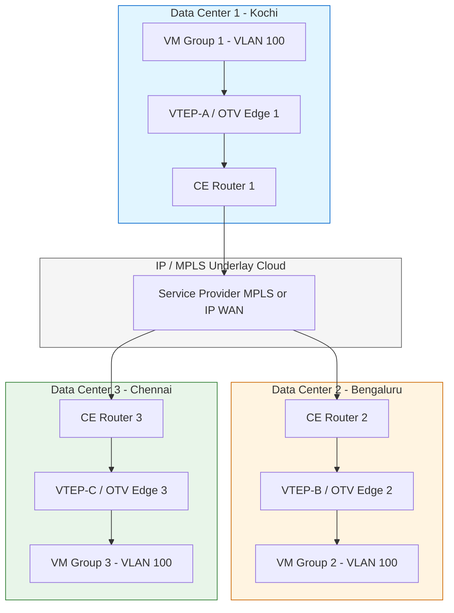
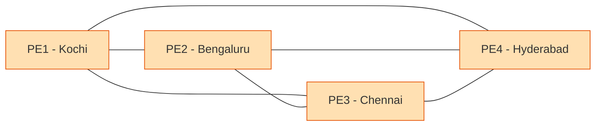
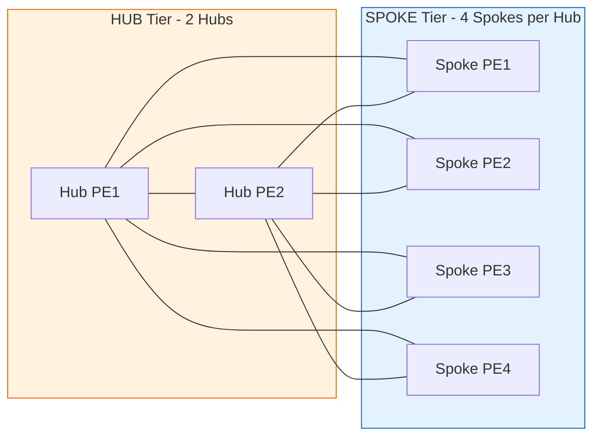
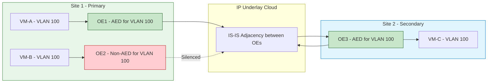
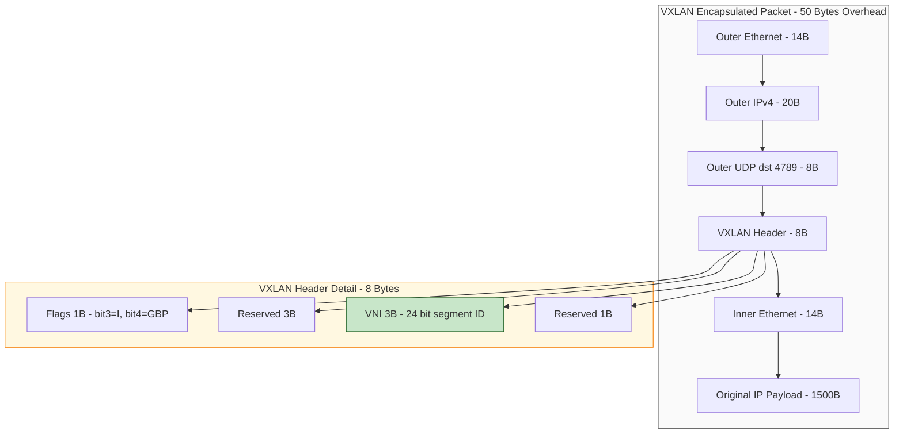
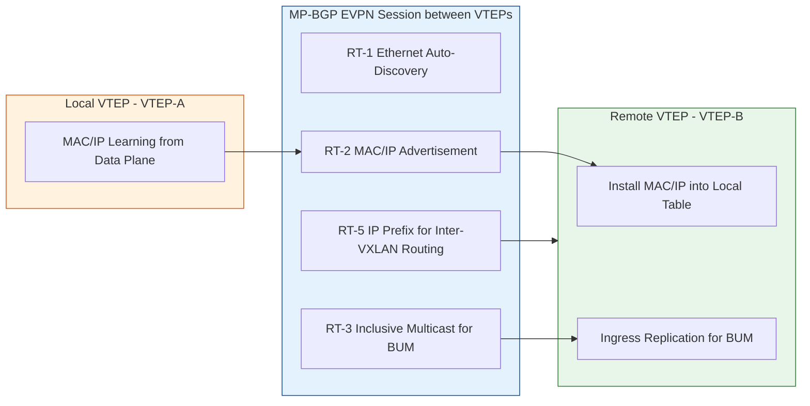
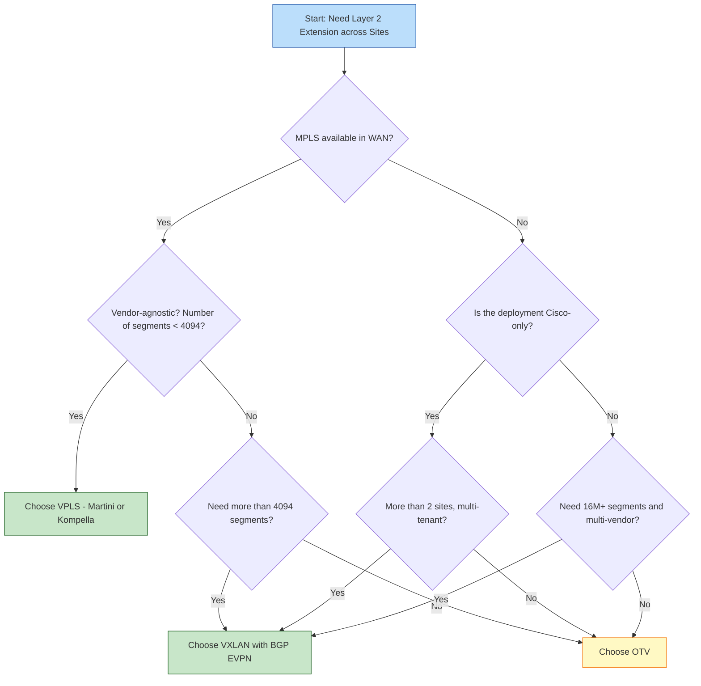

# Data Center Interconnect (DCI) - Technologies for Data Center Interconnection(VPLS, OTV, and VXLAN)

<!-- SECTION_1_START -->

# Data Center Interconnect (DCI) - Technologies for Data Center Interconnection

## 1. Core Technical Definition & Intuitive Overview

### 1.1 Formal Academic Definition (KTU 2024 Syllabus Terminology)

**Data Center Interconnect (DCI)** refers to the set of networking technologies, protocols, and architectural frameworks used to link two or more geographically dispersed data centers so that they behave as a single logical entity for compute, storage, and application workloads. In the KTU 2024 PECST751 syllabus, DCI is positioned as a critical enabler of **active-active disaster recovery, geo-redundancy, workload mobility (live VM migration), and multi-tenant cloud scale-out**.

The three canonical Layer-2-over-Layer-3 DCI overlay technologies mandated in Module 4 are:

1. **VPLS (Virtual Private LAN Service)** – an MPLS-based Layer 2 VPN standardized in RFC 4761 / RFC 4762.
2. **OTV (Overlay Transport Virtualization)** – a Cisco-proprietary MAC-in-IP encapsulation scheme (documented in RFC-datatracker as an informational draft).
3. **VXLAN (Virtual Extensible LAN)** – an IETF standard (RFC 7348) using MAC-in-UDP encapsulation with a 24-bit VNI segment identifier.

> [!IMPORTANT]
> **KTU 2024 Module 4 Highlight:** All three technologies solve the *same* engineering problem — extending a Layer 2 broadcast domain across an IP-routed underlay — but differ in **encapsulation, control plane, scalability, and vendor openness**. Examiners will test the *comparative* aspects heavily.

### 1.2 Conceptual Analogy / Intuition

Imagine three office branches in Kochi, Bengaluru, and Chennai that all need to behave as if they share **one giant switch** in the same building. The actual physical network connecting the three cities is the public internet / a service provider MPLS cloud (a routed Layer 3 world). A Layer 2 extension technology is therefore a *“magic transparent wire”* that tunnels Ethernet frames inside routable IP packets across the routed cloud.

| Technology | The “Magic Wire” Analogy |
|------------|--------------------------|
| VPLS       | A rented, fully managed MPLS leased-line from a telecom provider that emulates an Ethernet switch port at each site. |
| OTV        | A self-built, secure, MAC-addressed “shipping container” that wraps each Ethernet frame inside an IP envelope and ferries it over any IP network. |
| VXLAN      | A modern, cloud-native “pod shipping label” that wraps each frame inside a UDP packet, allowing up to **16 million** virtual networks — perfect for hyperscale data centers. |

### 1.3 Physical Constants, Standards & Identifiers

> [!NOTE]
> **Critical Scalability Numbers (must memorize for KTU):**
> - **VLAN ID space:** 12 bits → **4,094** usable VLANs (1–4094).
> - **VXLAN VNI (VXLAN Network Identifier):** 24 bits → **16,777,216** logical Layer 2 segments.
> - **VPLS Pseudowire ID:** 32 bits → up to **2³²** PWs per PE.
> - **VPLS MTU overhead:** MPLS label stack (typically 8–12 bytes) + Ethernet header → requires MTU ≥ **1,518 + overhead** (usually 1,550–1,600 on underlay).
> - **VXLAN MTU overhead:** 50 bytes (Outer IP 20 + UDP 8 + VXLAN 8 + Outer Ethernet 14) → minimum underlay MTU **1,550** to **1,600**, ideally **9,000** (jumbo) for data-center fabrics.
> - **OTV default UDP port / protocol:** IP protocol 47 (GRE) historically; modern OTV uses **UDP 8472** for IS-IS adjacency.

> [!VISUALIZATION CONTROL]
> **Concept:** VNI Segment ID Space Comparison (VLAN vs VXLAN)
> **GeoGebra / Desmos Input:**
> * Point A = (12, 4094)      // VLAN 12-bit → 4,094 segments
> * Point B = (24, 16777216)  // VXLAN 24-bit → 16,777,216 segments
> **Visual Description:** A two-point scatter plot on a log-scaled y-axis showing the four-order-of-magnitude explosion in segment capacity from VLAN to VXLAN. Students should observe the *vertical jump* of ~10,000×.

### 1.4 Why DCI Exists — The Problem Statement

A modern enterprise typically operates **two or more** data centers for the following reasons:

- **Disaster Recovery (DR):** Survive a site failure (flood, fire, regional power outage).
- **Business Continuity / Active-Active:** Serve users from the nearest site.
- **Workload Mobility (Live VM Migration):** VMware vMotion / live migration requires the VM’s IP and MAC to remain **unchanged** during the move → the L2 domain *must* stretch across sites.
- **Storage Replication:** Many enterprise SAN replication protocols (e.g., FCoE, iSCSI) are L2-sensitive.
- **Geographical Load Distribution:** Global content delivery, regulatory data residency.

The underlay between the sites is, however, almost always **L3 IP/MPLS** (because running dark fiber between cities is prohibitively expensive). This creates the **“L2-over-L3 stretch”** problem that VPLS, OTV, and VXLAN are designed to solve.

<!-- SECTION_1_END -->

<!-- SECTION_2_START -->

# 2. Deep Theoretical Analysis & KTU High-Yield Formula Sheet

## 2.1 Layer 2 vs Layer 3 DCI — Design Trade-offs

| Dimension | L2 DCI (VPLS / OTV / VXLAN) | L3 DCI (BGP / VRF) |
|-----------|------------------------------|---------------------|
| VM mobility across sites | ✅ Native | ❌ Requires re-IP |
| Stretch broadcast domain | ✅ Yes | ❌ No |
| Underlay dependency | Any IP path | Any IP path |
| Spanning Tree extension | Required (VPLS) / Avoided (OTV, VXLAN) | N/A |
| Failure blast radius | Entire stretched VLAN | Per-VRF, isolated |
| MTU complexity | High (encap overhead) | None |
| Recommended use case | East-West inter-DC, DR | North-South internet, inter-VRF routing |

## 2.2 VPLS — Virtual Private LAN Service (RFC 4761 / RFC 4762)

### 2.2.1 Architecture
VPLS is a **MPLS-based Layer 2 VPN** that emulates a virtual Ethernet switch across an MPLS provider network. Customer Edge (CE) devices connect to Provider Edge (PE) routers via Ethernet; PEs appear to the CEs as a single emulated LAN.

### 2.2.2 Logical Components
- **CE (Customer Edge):** Customer router/switch.
- **PE (Provider Edge):** Service-provider edge router running VPLS.
- **P (Provider Core):** MPLS transit routers (label-swap only).
- **PW (Pseudowire):** A bidirectional MPLS LSP emulating a point-to-point Ethernet link.
- **VFI (Virtual Forwarding Instance):** The L2 bridge instance on a PE; one VFI per VPLS instance.
- **Full-mesh of PWs:** Every PE in the same VPLS instance must have a PW to every *other* PE → n(n−1)/2 PWs.

### 2.2.3 Control Plane — Signaling Options
- **Martini Mode (LDP-based):** RFC 4762. Uses targeted LDP (T-LDP) to signal PWs. Type-2 FEC element carries PW ID + PW type (Ethernet 0x0005).
- **Kompella Mode (BGP-based):** RFC 4761. Uses Multi-Protocol BGP (MP-iBGP) with a new AFI/SAFI (25/65) — VPN auto-discovery. Auto-creates the full mesh; more scalable.

### 2.2.4 Data Plane — MAC Learning & Flooding
- **MAC learning:** Performed in the *data plane* (just like a normal switch), based on source MAC of customer frames.
- **Flooding (BUM traffic):** Broadcast, Unknown unicast, and Multicast traffic is replicated to **all PEs** in the VSI by replicating the frame across all PWs in the full mesh (split-horizon forwarding rule: a PE never forwards a frame back out the *same* PW it was received on).

### 2.2.5 VPLS Hierarchical (H-VPLS)
To solve the n² scaling problem, H-VPLS introduces a **Hub-PE** and **Spoke-PEs**. Spoke-PEs connect to the Hub-PE via a single PW; the full mesh exists only between hub PEs. Two tiers:
- **Q-in-Q access:** Spoke-PE terminates dot1q from CE and tunnels it via a single PW to Hub-PE.
- **BGP VPLS as spoke:** Spoke-PE runs BGP-AD to auto-discover Hubs.

## 2.3 OTV — Overlay Transport Virtualization

### 2.3.1 Origin & Standardization
OTV is a **Cisco-proprietary** Layer 2 extension technology introduced in 2011 to address the limitations of VPLS in data-center interconnects (no need for MPLS, no Spanning Tree across the DCI, built-in loop prevention).

### 2.3.2 Architecture
- **OTV Edge Device (OE):** A physical switch or router (Nexus 7000 / ASR 9000) that performs the OTV encapsulation/decapsulation. One OE per site.
- **OTV Internal Interface (Overlay):** Logical interface where the L2 domain is *logically* attached.
- **OTV Join Interface (Underlay):** The physical Layer 3 interface that carries the encapsulated traffic toward the remote site.
- **Overlay Network:** The *set* of OE devices sharing the same VLAN(s) across the IP cloud.
- **Site VLAN:** An internal VLAN used by OTV to communicate between OEs in the *same* site (prevents intra-site loops).

### 2.3.3 Encapsulation
OTV uses **MAC-in-IP** (or more precisely, MAC-in-UDP in modern implementations) encapsulation:

```
+---------------------+
|  Outer IP Header    | 20 bytes (src = local OE IP, dst = remote OE IP / mcast)
+---------------------+
|  UDP Header (8472)  | 8 bytes  (optional, current impl)
+---------------------+
|  OTV Header         | 4 bytes  (VLID, instance ID, flags)
+---------------------+
|  Inner Ethernet     | 14 bytes (original src/dst MAC)
+---------------------+
|  Payload (L2 frame) | 46–1500 bytes
+---------------------+
```

### 2.3.4 Control Plane — IS-IS over the Overlay
OTV runs an **IS-IS** instance *only between the OEs* (not the IGP of the underlay). This adjacency forms across the routed cloud using either:
- **Multicast adjacency mode** (uses the underlay multicast distribution tree — IGMP/PIM), OR
- **Unicast-only adjacency mode** (uses static unicast neighbors; BUM traffic uses head-end replication at the ingress OE).

### 2.3.5 Loop Prevention — The AED Mechanism
The most critical OTV innovation. OTV elects an **Authoritative Edge Device (AED)** per VLAN per site. Only the AED is permitted to forward that VLAN’s traffic *out* of the site. If two sites both try to advertise the same VLAN, only the AED site’s traffic wins — eliminating Layer 2 loops without STP.

> [!NOTE]
> **Loop-prevention rule:** When an OE receives an OTV update claiming a VLAN exists at a *remote* site, the local site’s AED **silences** that VLAN locally. This is the *“First site to advertise wins”* rule.

### 2.3.6 OTV vs VPLS — Why OTV Won for DC
- No MPLS dependency → works on any IP WAN.
- Built-in loop prevention → STP stays *inside* the DC.
- Native multicast support → optimizes east-west video / vMotion traffic.
- Encapsulation overhead is smaller (no MPLS label stack).

## 2.4 VXLAN — Virtual Extensible LAN (RFC 7348)

### 2.4.1 Motivation
Legacy VLAN (12-bit) cannot scale to multi-tenant cloud requirements. VXLAN introduces a **24-bit VNI** giving **16,777,216** logical L2 segments — enough for hyperscale public clouds (AWS, Azure, GCP backbone).

### 2.4.2 Encapsulation — MAC-in-UDP

```
[ Outer IP (20) | UDP (8) | VXLAN (8) | Inner Ethernet (14) | Payload ]
+-------------------------- Overhead = 50 bytes -------------------------+
```

- **Outer UDP port:** 4789 (IANA assigned; later updated to 8472 in some implementations).
- **VXLAN Header fields:**
  - **Flags (8 bits):** bit 3 = **I-bit (Instance)**; bit 4 = **GBP (Group-Based Policy)**.
  - **VNI (24 bits):** The segment identifier.
  - **Reserved (24 bits).**

### 2.4.3 Components (per RFC 7348)
- **VTEP (VXLAN Tunnel Endpoint):** The switch/hypervisor that performs encap/decap. Source/destination IP of the outer header is the VTEP’s IP.
- **VNI (VXLAN Network Identifier):** The 24-bit segment.
- **VXLAN Segment / Overlay Network:** The logical L2 domain identified by the VNI.
- **Underlay Network:** The IP transport — typically an IP-fabric (e.g., BGP-EVPN fabric).

### 2.4.4 Control Plane — Flood-and-Learn vs BGP EVPN
| Aspect | Flood-and-Learn (RFC 7348 native) | BGP EVPN (RFC 8365 / RFC 9136) |
|--------|-----------------------------------|--------------------------------|
| MAC learning | In data plane (flood unknown frames) | Out-of-band via MP-BGP (Type-2 routes) |
| BUM traffic handling | Multicast (PIM BIDIR/ASM) or Ingress replication | Ingress replication (uses BGP Type-3 routes) |
| Scalability | Limited (multicast state explosion) | High (no underlay multicast required) |
| Operational complexity | High (multicast in underlay) | Low (BGP-based) |
| Multi-tenant isolation | VNI only | VNI + VRF + RT/RD |

### 2.4.5 VXLAN BGP EVPN — The Modern Production Stack
In modern data centers (Cisco ACI, Arista VXLAN, Nokia SR Linux, Juniper QFX), VXLAN is deployed with **BGP EVPN** as the control plane. EVPN is a next-generation L2VPN solution originally designed for MPLS (RFC 7432) and extended to VXLAN.

**Key EVPN Route Types used in VXLAN-EVPN:**
- **Type-1:** Ethernet Auto-Discovery (per-ESI).
- **Type-2:** MAC/IP Advertisement (host routes).
- **Type-3:** Inclusive Multicast Ethernet Tag (used for ingress replication setup).
- **Type-5:** IP Prefix Route (inter-VXLAN routing via symmetric IRB).

## 2.5 KTU Formula Sheet / Cheat Sheet

| # | Parameter / Equation | Formula / Value | Units / Notes |
|---|----------------------|------------------|----------------|
| 1 | VLAN ID space | $2^{12} - 2 = 4094$ | segments |
| 2 | VXLAN VNI space | $2^{24} = 16\,777\,216$ | segments |
| 3 | VPLS full-mesh PW count | $N_{pw} = \dfrac{n(n-1)}{2}$ | n = number of PEs |
| 4 | VPLS CE-MAC table (per PE) | $T_{mac} = \sum_{i=1}^{n-1} M_i$ | Sum of MACs from all remote PEs |
| 5 | VXLAN UDP overhead | $H_{vxlan} = 20 + 8 + 8 = 36$ | bytes (without outer Ethernet) |
| 6 | VXLAN total overhead (with outer Ethernet) | $H_{vxlan,total} = 14 + 20 + 8 + 8 = 50$ | bytes |
| 7 | Minimum underlay MTU for VXLAN | $MTU_{min} = 1500 + 50 = 1550$ | bytes |
| 8 | Recommended fabric MTU | $MTU_{fab} = 9000$ | bytes (jumbo) |
| 9 | OTV header overhead | $H_{otv} = 4$ | bytes (plus outer IP 20 / UDP 8 = 32 total) |
| 10 | VPLS MPLS overhead | $H_{mpls} = N_{labels} \times 4$ | bytes; usually 8–12 |
| 11 | H-VPLS spoke-to-hub ratio | $r = \dfrac{n_{spokes}}{n_{hubs}}$ | reduces full-mesh cost |
| 12 | BUM replication factor (VPLS) | $F_{vpls} = n-1$ | copies per BUM frame |
| 13 | BUM replication (VXLAN Ingress-Replication) | $F_{vxlan-ir} = k-1$ | k = VTEPs in the VNI |
| 14 | Underlay multicast groups (VXLAN) | $G_{vxlan} = N_{VNI}$ | one group per VNI in flood-and-learn |
| 15 | EVPN RT/RD size | $RT \in [0, 2^{96} - 1]$ | 8-byte BGP extended community |

> [!NOTE]
> **Engineering utility:** The numbers above drive the *capital cost* of an inter-DC build. For example, if a customer wants 5,000 tenant segments, VLAN fails (4094), VPLS works (with multiple VPLS instances), and VXLAN-EVPN is the natural choice (single fabric, single control plane).

<!-- SECTION_2_END -->

<!-- SECTION_3_START -->

# 3. Step-by-Step Derivations & Configurations

## 3.1 Derivation — VPLS Pseudowire Count vs PE Count

We derive the n² scaling penalty of full-mesh VPLS to motivate H-VPLS and modern overlays.

**Setup:** Let $n$ be the number of Provider Edge routers participating in a single VPLS instance. Each PE must establish a pseudowire (PW) to every *other* PE in the same instance to support multipoint Ethernet semantics. We assume bi-directional PWs and that no PW is self-looped.

**Step 1 — Number of ordered PE pairs.**
The number of ordered pairs $(i, j)$ with $i \neq j$ is $n(n-1)$.

**Step 2 — Convert to unordered pairs (since a PW is bidirectional and a single PW serves both directions).**
Divide by 2:

$$
\begin{aligned}
N_{pw} &= \frac{n(n-1)}{2}
\end{aligned}
$$

**Step 3 — Tabulate for typical deployments.**

| $n$ (PEs) | $N_{pw} = \dfrac{n(n-1)}{2}$ |
|-----------|------------------------------|
| 2         | 1                            |
| 4         | 6                            |
| 8         | 28                           |
| 16        | 120                          |
| 32        | 496                          |
| 64        | 2,016                        |

**Step 4 — Observation.** Growth is **quadratic**. For 64 PEs you manage ~2,000 PWs per PE, which is operationally untenable. **H-VPLS** reduces this by introducing hub PEs; for $h$ hubs and $s$ spokes per hub the total reduces to:

$$
\begin{aligned}
N_{pw}^{H} &= \frac{h(h-1)}{2} + s \cdot h
\end{aligned}
$$

For $h = 4$ hubs and $s = 4$ spokes per hub → $6 + 16 = 22$ PWs (instead of 66). This is the **scaling justification** the KTU paper expects.

## 3.2 Derivation — VXLAN Underlay MTU

A VTEP adds a fixed 50-byte encapsulation (14 outer Ethernet + 20 outer IP + 8 UDP + 8 VXLAN) to every customer frame. To avoid IP fragmentation in the underlay:

$$
\begin{aligned}
MTU_{underlay,\,min} &\geq MTU_{customer} + H_{encap} \\
MTU_{underlay,\,min} &\geq 1500 + 50 = 1550 \text{ bytes}
\end{aligned}
$$

**Step 1 — Customer frame size** is the standard Ethernet MTU: 1,500 bytes (or 9,000 in jumbo data-center deployments).

**Step 2 — VXLAN header fields total** 8 bytes (Flags 1 + Reserved 3 + VNI 3 + Reserved 1 = 8).

**Step 3 — UDP header** = 8 bytes; **Outer IP header** = 20 bytes (no options); **Outer Ethernet** = 14 bytes.

**Step 4 — Total overhead** = $8 + 8 + 20 + 14 = 50$ bytes.

**Step 5 — Minimum underlay MTU** = $1500 + 50 = 1550$ bytes. To stay future-proof and to avoid TCP MSS clamping, modern fabrics (Cisco Nexus, Arista, Juniper QFX) are configured with **jumbo MTU 9,000 bytes end-to-end**.

> [!NOTE]
> **Engineering utility:** Forgetting MTU is the #1 cause of silent inter-DC VXLAN failures — packets are dropped, applications hang, and no error is logged at Layer 3 because the underlay routers just see oversized frames on a silent-drop path.

## 3.3 Worked Example — VXLAN-EVPN Packet Walk

A VM in DC1 (VTEP-A, IP 10.10.10.1) sends an ARP request for VM in DC2 (VTEP-B, IP 10.10.10.2). Both VMs are in VNI 10001.

**Step 1 — VM1 generates ARP Request** with src-MAC $M_A$, dst-MAC = FF:FF:FF:FF:FF:FF, src-IP 10.1.1.1, dst-IP 10.1.1.2.

**Step 2 — VTEP-A receives the frame on its VLAN/VXLAN access port**, tags it with VNI 10001, looks up the VTEP for VNI 10001 via its **BGP EVPN Type-3** inclusive-multicast routes (or via the VTEP membership table built by the control plane).

**Step 3 — VTEP-A encapsulates** the frame:

$$
\begin{aligned}
\text{Outer Ethernet} &: \text{src-MAC}=VTEP_A^{mac},\ \text{dst-MAC}=VTEP_B^{mac} \\
\text{Outer IP} &: \text{src}=10.10.10.1,\ \text{dst}=10.10.10.2 \\
\text{Outer UDP} &: \text{src-port}=Random(HASH),\ \text{dst-port}=4789 \\
\text{VXLAN} &: \text{VNI}=10001,\ \text{I-flag}=1 \\
\text{Payload} &: \text{Original ARP frame}
\end{aligned}
$$

**Step 4 — Underlay routes the packet** to VTEP-B using OSPF/IS-IS/BGP underlay (typically eBGP in modern fabrics).

**Step 5 — VTEP-B decapsulates**, removes the VXLAN header, and floods the original ARP frame on its locally-attached VLAN/VXLAN segment for VNI 10001.

**Step 6 — VM2 replies** with a unicast ARP Reply, which VTEP-B now knows how to forward (because EVPN Type-2 MAC/IP routes have taught both VTEPs the MAC↔VTEP bindings).

## 3.4 Configurations — Cisco IOS-XE VPLS Skeleton (Martini Mode)

```python
# Pseudocode for VPLS configuration (illustrative)
def configure_vpls_martini(router: Router, vfi_name: str, vpls_id: int, peers: list[str], mtu: int) -> None:
    """
    Configure VPLS in Martini mode (LDP-signaled pseudowires).
    
    Args:
        router: the target PE router object.
        vfi_name: name of the Virtual Forwarding Instance (e.g., 'CUST-A-VFI').
        vpls_id: globally unique VPLS instance ID (32-bit).
        peers: list of remote PE loopback IPs.
        mtu: MTU for the VFI (must be uniform across all PEs).
    """
    if vpls_id <= 0 or vpls_id >= 2**32:
        raise ValueError("VPLS ID must be a 32-bit positive integer")
    if mtu < 1500:
        raise ValueError("VFI MTU must be >= 1500; recommend 1550 for MPLS overhead")
    if not peers:
        raise ValueError("At least one remote PE is required for VPLS")

    router.exec(f"l2 vfi {vfi_name} manual")
    router.exec(f" vpn id {vpls_id}")
    for peer in peers:
        if not is_valid_ipv4(peer):
            raise ValueError(f"Invalid peer IP: {peer}")
        router.exec(f" neighbor {peer} pw-class VPLS-PW-CLASS")
    router.exec(f" mtu {mtu}")

    # Bind VFI to an attachment circuit (VLAN)
    router.exec("interface Vlan100")
    router.exec(f" xconnect vfi {vfi_name} multicast")
    log_event(f"VPLS instance {vfi_name} (ID={vpls_id}) configured with {len(peers)} peers")
```

**Verification commands (always include in KTU answers):**
```
show l2vfi name <vfi-name>
show mpls l2transport vc
show vfi
show mac address-table vlan <vlan-id>
```

## 3.5 Configurations — Cisco Nexus OTV Skeleton

```python
def configure_otv_interface(nexus: Switch, overlay_iface: str, join_iface: str, vlan_range: str) -> None:
    """
    Configure OTV edge device on Cisco Nexus (NX-OS).
    
    Args:
        nexus: target Nexus switch object.
        overlay_iface: name of the OTV internal (overlay) interface (e.g., 'Overlay0').
        join_iface: name of the OTV join (underlay) interface (e.g., 'Ethernet1/1').
        vlan_range: VLAN range to extend across DCI (e.g., '100-200, 500').
    """
    # Step 1: Enable the OTV feature
    nexus.exec("feature otv")
    
    # Step 2: Create the OTV overlay interface
    nexus.exec(f"interface {overlay_iface}")
    nexus.exec(" otv control-group 239.1.1.1")     # multicast group for IS-IS + BUM
    nexus.exec(" otv data-group 232.1.1.0/24")     # data multicast group range
    nexus.exec(" no shutdown")
    
    # Step 3: Bind the overlay interface to a VLAN range
    nexus.exec(f" otv extend-vlan {vlan_range}")
    
    # Step 4: Configure the join interface (underlay)
    nexus.exec(f"interface {join_iface}")
    nexus.exec(" ip address 10.20.30.40/24")
    nexus.exec(" ip pim sparse-mode")
    nexus.exec(" no shutdown")
    
    # Step 5: Add an OTV site identifier (loopback)
    nexus.exec("otv site-identifier 0x1")           # local site ID
    log_event(f"OTV configured on {nexus.hostname} for VLANs {vlan_range}")
```

**Verification commands:**
```
show otv
show otv adjacency
show otv route
show otv vlan
show otv isis
show otv multicast-group
```

## 3.6 Configurations — Cisco Nexus VXLAN-EVPN Skeleton (NX-OS)

```python
def configure_vxlan_evpn(nexus: Switch, loopback0_ip: str, nve1_peers: list[str], vni_list: list[int]) -> None:
    """
    Configure VXLAN with BGP EVPN control plane on Cisco Nexus 9k.
    
    Args:
        nexus: target Nexus switch.
        loopback0_ip: underlay loopback IP used as VTEP source.
        nve1_peers: list of remote VTEP IPs.
        vni_list: list of VNIs to instantiate.
    """
    # Step 1: Enable required features
    nexus.exec("feature nv overlay")
    nexus.exec("feature bgp")
    nexus.exec("feature interface-vlan")
    nexus.exec("feature vn-segment-vlan-based")
    
    # Step 2: Configure loopback for VTEP source
    nexus.exec("interface loopback0")
    nexus.exec(f" ip address {loopback0_ip}/32")
    
    # Step 3: Build the NVE (Network Virtualization Edge) interface
    nexus.exec("interface nve1")
    nexus.exec(" no shutdown")
    nexus.exec(" source-interface loopback0")
    for peer in nve1_peers:
        nexus.exec(f" peer {peer}")
    
    # Step 4: Create VLAN-to-VNI mappings
    for vni in vni_list:
        if vni <= 0 or vni >= 2**24:
            raise ValueError(f"VNI out of 24-bit range: {vni}")
        vlan_id = vni  # 1:1 mapping convention
        nexus.exec(f"vlan {vlan_id}")
        nexus.exec(f" vn-segment {vni}")
        nexus.exec(f"interface nve1")
        nexus.exec(f" member vni {vni} ingress-replication")
    
    # Step 5: Configure BGP EVPN address-family
    nexus.exec("router bgp 65001")
    nexus.exec(" address-family l2vpn evpn")
    nexus.exec("  retain route-target all")
    log_event(f"VXLAN-EVPN configured on {nexus.hostname} with {len(vni_list)} VNIs")
```

**Verification commands:**
```
show nve peers
show nve vni
show bgp l2vpn evpn
show mac address-table vni <vni>
show l2route evpn mac evi <evi>
```

## 3.7 Comparative Configuration Decision Table

| Question | VPLS | OTV | VXLAN |
|----------|------|-----|-------|
| Need MPLS in underlay? | ✅ Yes | ❌ No | ❌ No (IP only) |
| Maximum logical segments | 4,094 (VLAN) | 4,094 (VLAN) | 16,777,216 (VNI) |
| Native loop prevention? | ❌ Uses STP | ✅ AED | ✅ BGP EVPN |
| Multi-vendor? | ✅ (any MPLS PE) | ❌ Cisco only | ✅ (RFC 7348) |
| Recommended BUM mechanism | Full-mesh split-horizon | Multicast or HER | Multicast or IR |
| Best for | Carrier MPLS L2VPN | Cisco-only DC interconnect | Modern data-center fabrics |
| Typical deployment | Service-provider E-Line/E-LAN | Enterprise inter-DC | Hyperscale, cloud, NFV |

<!-- SECTION_3_END -->

<!-- SECTION_4_START -->

# 4. Structural Diagrams & Schematics

## 4.1 High-Level DCI Architecture — Three-Site Interconnect



## 4.2 VPLS Full-Mesh Pseudowire Topology (n = 4 PEs)



> **Note:** Each line represents a **bidirectional pseudowire**. Total PWs = $\dfrac{4 \times 3}{2} = 6$. This illustrates the n² scaling limitation.

## 4.3 H-VPLS Topology — Spoke/Hub Reduction



> **PW count:** $\frac{2(2-1)}{2} + 2 \times 4 = 1 + 8 = 9$ PWs (vs 28 in flat full-mesh).

## 4.4 OTV Architecture — AED Loop Prevention



> **Loop prevention rule:** Only the **AED** forwards VLAN 100 traffic to the underlay. Non-AED devices inside the *same* site receive the OTV update and **silence** their egress, preventing the *“same VLAN in two sites advertising back and forth”* loop.

## 4.5 VXLAN Packet Format — Byte-Level Anatomy



## 4.6 VXLAN-EVPN Control Plane — Route Type Flow



## 4.7 Comparative Architecture — VPLS vs OTV vs VXLAN

```mermaid
flowchart TB
    subgraph STACK1[VPLS Stack]
        V1[Customer Frame]
        V2[+ MPLS Labels - 8 to 12B]
        V3[+ Outer Ethernet 14B]
    end

    subgraph STACK2[OTV Stack]
        O1[Customer Frame]
        O2[+ OTV Header 4B]
        O3[+ UDP 8B]
        O4[+ Outer IP 20B]
        O5[+ Outer Ethernet 14B]
    end

    subgraph STACK3[VXLAN Stack]
        X1[Customer Frame]
        X2[+ VXLAN Header 8B]
        X3[+ UDP dst 4789 8B]
        X4[+ Outer IP 20B]
        X5[+ Outer Ethernet 14B]
    end

    V1 --> V2 --> V3
    O1 --> O2 --> O3 --> O4 --> O5
    X1 --> X2 --> X3 --> X4 --> X5

    style STACK1 fill:#ffe0b2,stroke:#e65100
    style STACK2 fill:#fff59d,stroke:#f57f17
    style STACK3 fill:#c8e6c9,stroke:#1b5e20
```



## 4.8 Decision Flow — Which DCI Technology Should I Choose?



<!-- SECTION_4_END -->

<!-- SECTION_5_START -->

# 5. KTU 2024 Scheme Examination Question Bank & Topic Recap

## 5.1 Part A Questions (3 Marks each) — Remember / Understand

### **Q1.** [KTU University Exam — July 2024]  
Define **VPLS**. State any **two** key differences between VPLS and a traditional MPLS L3VPN.

**Model Answer (3 Marks):**

> **VPLS (Virtual Private LAN Service)** is an MPLS-based Layer 2 VPN service, defined in RFC 4761 / RFC 4762, that emulates a virtual Ethernet switch (LAN) across an MPLS provider network, allowing geographically separated customer sites to participate in the same broadcast domain. *[Definition: 1 Mark]*

**Key differences from MPLS L3VPN:** *[2 Marks — 1 Mark each]*

| Aspect | VPLS (L2VPN) | MPLS L3VPN |
|--------|--------------|-------------|
| OSI layer | Layer 2 (Ethernet) | Layer 3 (IP) |
| Customer routing | Customer runs routing; PE is a transparent switch | PE runs VRF and exchanges customer routes via MP-BGP |
| Forwarding plane | Customer MAC frames inside PW | Customer IP packets with VPNv4/v6 labels |

---

### **Q2.** [KTU University Exam — Dec 2023]  
What is the **Authoritative Edge Device (AED)** in OTV? Why is it required?

**Model Answer (3 Marks):**

The **Authoritative Edge Device (AED)** is the OTV-elected edge device within a *site* that is given the exclusive right to **forward a specific VLAN’s traffic into and out of the OTV overlay**. Election is per-VLAN per-site, typically based on the lowest configured *site-identifier* among active OEs. *[Definition: 2 Marks]*

**Why required:** To **prevent Layer 2 loops** when the same VLAN is stretched across two or more data centers connected via an L3 cloud. Without the AED, a broadcast frame from DC1 would reach DC2, be flooded back into DC1, and loop indefinitely. The AED ensures that *only one site* actively exports a VLAN at a time, eliminating the need for Spanning Tree across the WAN. *[Justification: 1 Mark]*

---

## 5.2 Part B Questions (14 Marks) — Internal Choice

### **Question A (14 Marks)**

#### **(a)** *[7 Marks — Understand]*  
Explain the **VPLS architecture** with a neat diagram. Describe the role of **(i)** CE, **(ii)** PE, **(iii)** PW, and **(iv)** VFI. How does VPLS handle **BUM traffic**? **[CO2, Understand]**

**Model Solution:**

**(i) CE (Customer Edge)** — The customer-owned router/switch that hands Ethernet frames to the provider network. The CE does not run MPLS. *[1 Mark]*

**(ii) PE (Provider Edge)** — The service-provider router that terminates the pseudowires, runs the VFI, and performs the L2VPN data-plane functions (MAC learning, frame replication, split-horizon). *[1 Mark]*

**(iii) PW (Pseudowire)** — A point-to-point MPLS-labeled LSP that emulates an Ethernet link between two PEs. Signaled via either targeted LDP (Martini) or MP-iBGP (Kompella). *[1 Mark]*

**(iv) VFI (Virtual Forwarding Instance)** — The bridging table on a PE that contains all the PWs belonging to a single VPLS instance; the PE behaves *as if* each VFI is a virtual Ethernet switch port. *[1 Mark]*

**BUM traffic handling:** When a frame with an unknown unicast, broadcast, or multicast destination MAC is received on an attachment circuit, the PE **replicates** the frame out of *every PW* in the VFI except the one it arrived on (**split-horizon rule**). This guarantees that the frame reaches every remote site exactly once and prevents loops in the full-mesh of PWs. *[2 Marks]*

**Neat diagram — already provided in Section 4.2 above** *[1 Mark]*

> **[Valuation key point: Label CE / PE / PW / VFI on the diagram for 1 Mark; explicit statement of split-horizon rule for 1 Mark.]**

#### **(b)** *[7 Marks — Apply]*  
A service provider is deploying VPLS across **n = 10 PEs** in a single VPLS instance.  
(i) Calculate the number of full-mesh pseudowires required.  
(ii) If the provider migrates to **H-VPLS** with **2 Hub-PEs** and **4 Spoke-PEs per hub**, calculate the new PW count.  
(iii) What is the percentage reduction in PWs achieved by H-VPLS? **[CO3, Apply]**

**Model Solution:**

**(i) Full-mesh PW count:** *[3 Marks]*

$$
\begin{aligned}
N_{pw}^{flat} &= \frac{n(n-1)}{2} \\
&= \frac{10 \times 9}{2} \\
&= 45 \text{ pseudowires}
\end{aligned}
$$

**Step 1 — Substitute $n=10$** into $N_{pw} = \dfrac{n(n-1)}{2}$. *[1 Mark]*
**Step 2 — Compute $n(n-1) = 10 \times 9 = 90$.** *[1 Mark]*
**Step 3 — Divide by 2: $N_{pw}^{flat} = 45$ PWs.** *[1 Mark]*

**(ii) H-VPLS PW count:** *[3 Marks]*

$$
\begin{aligned}
N_{pw}^{H} &= \frac{h(h-1)}{2} + s \cdot h \\
&= \frac{2 \times 1}{2} + 4 \times 2 \\
&= 1 + 8 \\
&= 9 \text{ pseudowires}
\end{aligned}
$$

**Step 1 — Hub-to-hub full mesh:** $\frac{2(2-1)}{2} = 1$ PW. *[1 Mark]*
**Step 2 — Hub-to-spoke:** 2 hubs $\times$ 4 spokes = 8 PWs. *[1 Mark]*
**Step 3 — Total:** $1 + 8 = 9$ PWs. *[1 Mark]*

**(iii) Percentage reduction:** *[1 Mark]*

$$
\begin{aligned}
\text{Reduction \%} &= \frac{45 - 9}{45} \times 100 \\
&= \frac{36}{45} \times 100 \\
&= 80\%
\end{aligned}
$$

**H-VPLS achieves an 80 % reduction in PW count** (from 45 to 9 PWs), dramatically simplifying operations.

> [!WARNING]
> **KTU Examiner’s Pitfall — Common marks lost:**  
> 1. Students forget the **$/ 2$** in the full-mesh formula and write $N_{pw} = n(n-1)$ — losing 1 Mark.  
> 2. In H-VPLS, students often **omit the hub-to-hub PW** (counting only hub-to-spoke), giving 8 PWs instead of 9 — losing 1 Mark.  
> 3. Percentage reduction is asked as a *percentage*; writing the fraction $36/45$ without multiplying by 100 also costs a mark.

---

### **Question B (14 Marks)** — Alternative

#### **(a)** *[7 Marks — Understand]*  
With a neat diagram, explain the **VXLAN packet format** as per RFC 7348. Mention the **VNI field size** and its significance. **[CO2, Understand]**

**Model Solution:**

**VXLAN packet format** (already illustrated in Section 4.5): *[4 Marks — 0.5 per component]*

A VXLAN packet consists of:
1. **Outer Ethernet header** (14 bytes) — addresses of the two VTEPs.
2. **Outer IPv4 header** (20 bytes) — source IP = local VTEP IP, destination IP = remote VTEP IP (or multicast group for BUM).
3. **Outer UDP header** (8 bytes) — destination port **4789** (IANA-assigned VXLAN port).
4. **VXLAN header** (8 bytes) — contains the **VNI (24 bits)**, the I-bit, and the GBP bit.
5. **Original inner Ethernet frame** (14 bytes header + 1500 bytes payload).

**VNI field size and significance:** *[3 Marks]*

- **Size:** **24 bits** (3 bytes) — a 16-fold increase over the 12-bit VLAN ID. *[1 Mark]*
- **Significance — Scalability:** The 24-bit VNI provides $2^{24} = 16\,777\,216$ unique logical Layer 2 segments. This is sufficient for hyperscale multi-tenant clouds, allowing one physical data-center fabric to host millions of isolated tenant networks. *[1 Mark]*
- **Significance — Multi-tenancy:** Each tenant can be assigned a *unique* VNI, providing L2 isolation in shared infrastructure without depending on VLAN-based segregation that is scarce in legacy networks. *[1 Mark]*

> **[Valuation key: Naming the UDP port 4789 fetches 1 Mark; explicit mention of 16,777,216 segments fetches 1 Mark.]**

#### **(b)** *[7 Marks — Apply]*  
**(i)** Calculate the **minimum underlay MTU** required to carry a standard 1500-byte customer frame inside a VXLAN tunnel without fragmentation. Show your derivation. **[3 Marks]**  
**(ii)** Compare the BUM-traffic handling of **VXLAN flood-and-learn** vs **VXLAN with BGP EVPN**. State **two advantages** of the latter. **[4 Marks]** **[CO3, Apply]**

**Model Solution:**

**(i) Minimum underlay MTU:** *[3 Marks]*

$$
\begin{aligned}
H_{vxlan} &= H_{vxlan-hdr} + H_{udp} + H_{ip} + H_{eth-outer} \\
&= 8 + 8 + 20 + 14 \\
&= 50 \text{ bytes}
\end{aligned}
$$

**Step 1 — Identify overhead components and their sizes.** *[1 Mark]*

$$
\begin{aligned}
MTU_{underlay,\,min} &= MTU_{customer} + H_{vxlan} \\
&= 1500 + 50 \\
&= 1550 \text{ bytes}
\end{aligned}
$$

**Step 2 — Add overhead to customer MTU.** *[1 Mark]*

**Step 3 — Final answer: 1550 bytes minimum underlay MTU.** *[1 Mark]*

**(ii) Comparison — Flood-and-Learn vs BGP EVPN:** *[4 Marks]*

| Aspect | VXLAN Flood-and-Learn | VXLAN with BGP EVPN |
|--------|-----------------------|---------------------|
| MAC learning | Data plane (flood unknown frames) | Control plane (BGP Type-2 routes) |
| BUM delivery | Underlay multicast (PIM) | Ingress replication (no multicast in underlay) |
| Underlay multicast requirement | ✅ Yes | ❌ No |
| Convergence | Slow (relies on data-plane timeouts) | Fast (BGP-driven) |

**Two advantages of BGP EVPN:** *[1 Mark each]*

1. **Eliminates the need for underlay multicast**, which is operationally complex and state-bounded in large fabrics. Ingress replication is performed at the ingress VTEP based on BGP Type-3 inclusive-multicast routes.
2. **Faster convergence and consistent MAC/IP information** distributed via BGP, reducing the flood-and-learn latency for new endpoints. Also enables features like **ARP suppression** (Type-2 routes teach MAC↔IP↔VTEP directly, eliminating ARP flooding).

> [!WARNING]
> **KTU Examiner’s Pitfall — Common marks lost:**  
> 1. In part (i), students often **omit the outer Ethernet 14 bytes** in the overhead calculation, giving 1536 instead of 1550. KTU strictly evaluates the *encapsulation layers* in order.  
> 2. In part (ii), students confuse **flood-and-learn** with **ARP flood** — they are different (F&L is unknown-unicast; ARP flood is broadcast). Make the distinction explicit.  
> 3. Forgetting to mention **ingress replication** as the EVPN BUM mechanism costs a mark.  
> 4. Writing advantages as one-liners without tying them to a *Route Type* (RT-2, RT-3) loses the “Apply” level mark.

---

## 5.3 KTU Examiner’s General Valuation Warnings

> [!WARNING]
> **Top 5 DCI topic mistakes in KTU 2024 papers:**
> 1. **VPLS ≠ MPLS L3VPN.** Examiners *will* deduct marks for confusing the two. Always state the OSI layer up front.
> 2. **OTV requires IS-IS between the OEs**, *not* in the underlay routing. Do not say “OTV runs OSPF in the underlay.”
> 3. **VXLAN port 4789**, not 47 (GRE) or 8472 (VXLAN-GPE). KTU expects the IANA-registered value.
> 4. **VPLS MAC learning is in the data plane**; **VXLAN-EVPN MAC learning is in the control plane (BGP)**. Mixing these up is a common 3-mark deduction.
> 5. **MTU math must include outer Ethernet (14B)**, not just IP/UDP/VXLAN. Examiner will reduce 1 mark for the omission.

---

## 5.4 Topic Recap & Important Things to Remember

> **Final Rapid-Revision Checklist — Module 4: DCI Technologies (VPLS, OTV, VXLAN)**

### Core Definitions
- **DCI:** Linking geographically separated data centers to behave as a single logical entity.
- **VPLS (RFC 4761/4762):** MPLS-based L2VPN emulating an Ethernet switch; full-mesh of PWs; $N_{pw} = \frac{n(n-1)}{2}$.
- **H-VPLS:** Two-tier (Hub + Spoke) VPLS that eliminates n² scaling.
- **OTV (Cisco):** MAC-in-IP/UDP overlay; uses IS-IS between OEs; uses AED for loop prevention; does not require MPLS or STP across the DCI.
- **VXLAN (RFC 7348):** MAC-in-UDP overlay with a 24-bit **VNI**; outer UDP port **4789**; encapsulates with **50 bytes** of overhead; scales to **16,777,216** segments.
- **VTEP:** VXLAN Tunnel Endpoint — performs encap/decap.
- **BGP EVPN (RFC 8365):** Modern VXLAN control plane; Type-2 (MAC/IP), Type-3 (BUM), Type-5 (Inter-VXLAN routing).
- **AED (Authoritative Edge Device):** OTV-elected per-VLAN per-site edge that exclusively forwards that VLAN’s traffic; prevents L2 loops across the DCI.

### Key Scalability Numbers
- VLAN space: **4,094**.
- VXLAN VNI space: **$2^{24} = 16,777,216$**.
- VXLAN minimum underlay MTU: **1,550 bytes** (recommended: **9,000 jumbo**).
- VPLS overhead: **8–12 bytes** (MPLS label stack).
- OTV overhead: **32–36 bytes** (IP/UDP/OTV).
- VPLS n² PW scaling: $\frac{n(n-1)}{2}$.

### Important Protocol Mechanisms
- **BUM handling in VPLS:** Split-horizon over full-mesh PWs.
- **BUM handling in OTV:** Multicast (IS-IS PIM) or head-end replication.
- **BUM handling in VXLAN:** Underlay multicast (F&L) or ingress replication (EVPN).
- **MAC learning in VPLS:** Data plane.
- **MAC learning in VXLAN-EVPN:** Control plane (BGP Type-2).
- **Loop prevention in VPLS:** Split-horizon + STP within sites.
- **Loop prevention in OTV:** AED.
- **Loop prevention in VXLAN-EVPN:** BGP-based; no STP required.

### Engineering Trade-offs (Comparison Table — memorize)

| Dimension | VPLS | OTV | VXLAN-EVPN |
|-----------|------|-----|------------|
| Standardization | IETF (RFC) | Cisco proprietary | IETF (RFC 7348 + 8365) |
| MPLS required | Yes | No | No |
| Vendor openness | High | Low (Cisco only) | High |
| Segment scale | 4,094 | 4,094 | 16M+ |
| Control plane | LDP / BGP | IS-IS | MP-BGP EVPN |
| Best for | Carrier E-LAN | Cisco-only inter-DC | Modern multi-vendor DC |

### Formula One-Liners
- VPLS PW count: $N_{pw} = \dfrac{n(n-1)}{2}$
- H-VPLS PW count: $N_{pw}^{H} = \dfrac{h(h-1)}{2} + s \cdot h$
- VXLAN overhead: $H = 50$ bytes
- VXLAN underlay MTU: $MTU \geq 1500 + 50 = 1550$ bytes
- VNI space: $2^{24} = 16\,777\,216$ segments
- VLAN space: $2^{12} - 2 = 4,094$ VLANs

### Typical KTU 14-Mark Question Structure
- **(a) 7 marks — Theory/Diagram:** architecture, components, BUM handling. Always draw a diagram; label CE/PE/PW/VFI (VPLS) or VTEP/NVE/VNI (VXLAN) or OEs/IS-IS/AED (OTV).
- **(b) 7 marks — Numerical/Comparison:** PW count, MTU math, or side-by-side comparison table. Show every algebraic step.

### Three Things Examiners *Always* Look For
1. **Correct terminology** — use the *exact* acronym expansions once (VTEP, VNI, OTV, AED, VFI, PW).
2. **One labeled diagram** per theory sub-question.
3. **Step-by-step working** in numerical sub-questions — no jumps from formula to final answer.

<!-- SECTION_5_END -->
