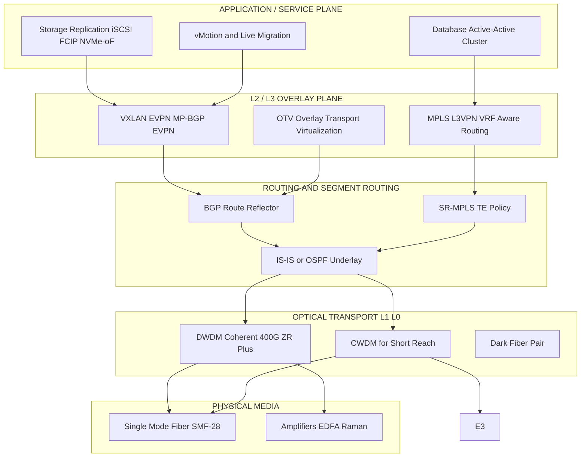
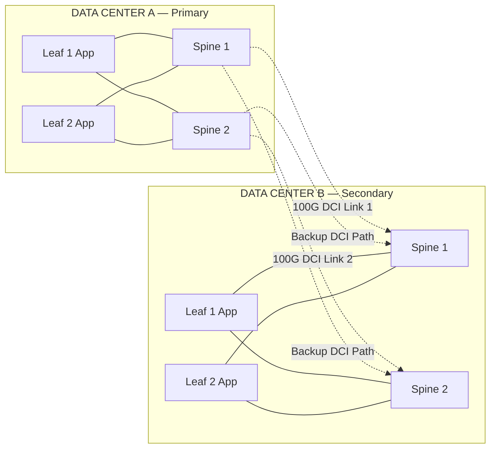
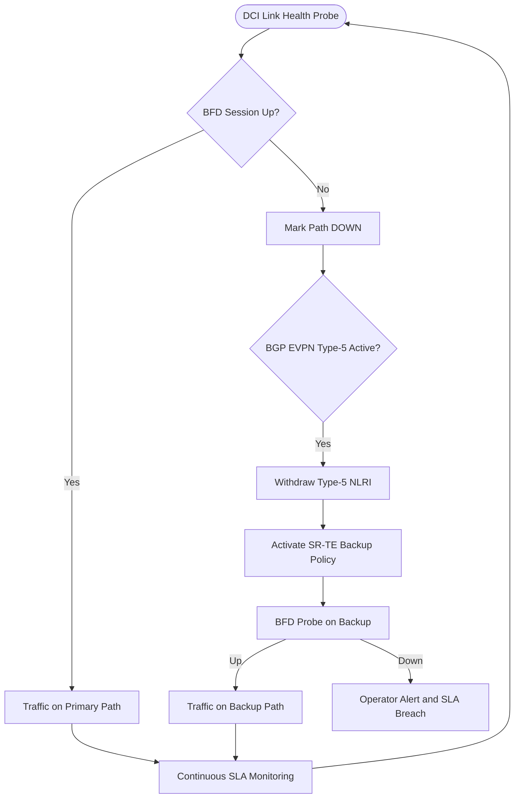
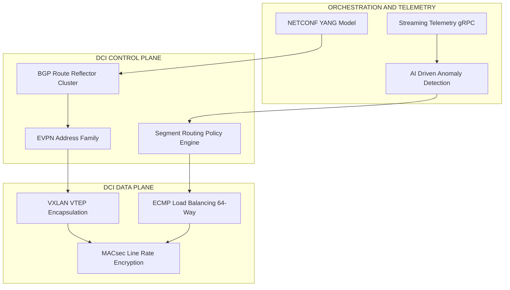

# DCI Design and Deployment Considerations

<!-- SECTION_1_START -->

# DCI Design and Deployment Considerations

## 1.1 Formal Definition (KTU 2024 Syllabus Terminology)

> [!IMPORTANT]
> **Data Center Interconnect (DCI)** is defined as the set of networking technologies, protocols, optical transport systems, and Layer 2 / Layer 3 overlay mechanisms used to seamlessly connect two or more geographically separated data centers to deliver **unified compute, storage, and application services** with carrier-grade reliability.

In the context of the **PECST751 – Advanced Computer Networks** syllabus (KTU 2024 Scheme, Module 4), DCI design and deployment considerations encompass the engineering trade-offs involved in selecting transport media, choosing overlay encapsulations, computing latency budgets, sizing bandwidth pipes, and architecting resilient topologies for **active-active**, **active-passive**, and **stretched-cluster** data center fabrics.

### 1.2 Conceptual Analogy / Intuition

> [!NOTE]
> **Real-World Analogy — The Highway System Between Cities**
>
> Imagine two large industrial cities (**Data Center A** and **Data Center B**). Each city is self-sufficient, but to share resources, balance population load, and survive disasters (earthquakes, floods, power outages), the cities must be linked by highways. Some highways are 8-lane expressways (**100 Gbps DWDM dark fiber**), some are toll roads with strict checkpoints (**MPLS Layer 3 VPN**), and others are private underground tunnels (**VXLAN/EVPN overlays**). The rules governing lane width, toll charges, distance, checkpoints, and disaster diversions are exactly the **DCI Design and Deployment Considerations**.

In simple words, DCI considerations answer five questions:

1. **How fast** can data travel between data centers? *(Bandwidth / Throughput)*
2. **How soon** does a packet reach the other side? *(Latency / RTT)*
3. **How reliably** does the link survive failures? *(Resilience / Redundancy)*
4. **How securely** is in-flight data protected? *(Encryption / MACsec / IPsec)*
5. **How economically** can the entire system scale? *(Cost-per-bit / OpEx / CapEx)*

### 1.3 Key Physical Constants and Standard Metrics

> [!IMPORTANT]
> The following constants and metrics govern every DCI design decision. They are **bold-highlighted** because examiners frequently ask for their typical industry values.

| Metric | Standard / Typical Value | Significance |
|---|---|---|
| **Speed of light in fiber** | **≈ 200,000 km/s** (≈ 5 µs/km one-way) | Sets the **lower bound** on DCI latency |
| **Fiber attenuation** | **≤ 0.35 dB/km @ 1550 nm** | Limits un-regenerated reach to **~80 km** |
| **DWDM channel spacing** | **50 GHz / 100 GHz ITU-T grid** | Allows **80–96 channels** per fiber pair |
| **Standard DCI port speeds** | **10G, 25G, 40G, 100G, 400G, 800G** | Mix-and-match based on workload |
| **Jumbo MTU for DCI** | **9216 bytes** (default) | Prevents fragmentation across overlays |
| **MACsec encryption latency** | **< 4 µs per hop** | Adds to total RTT budget |
| **Industry SLA (5-nines)** | **99.999 %** → **315 sec/yr** downtime | Drives redundancy design |

### 1.4 Visualization Concept (GeoGebra / Desmos)

> [!VISUALIZATION CONTROL]
> **Concept:** DCI Latency-vs-Distance Curve with Multiple Transport Options
> **GeoGebra / Desmos Input Equations:**
> * `f1(x) = 5 * x` *(speed of light in fiber — theoretical floor)*
> * `f2(x) = 5 * x + 20` *(dark fiber with 20 µs switch overhead)*
> * `f3(x) = 5 * x + 60` *(MPLS L3VPN with provider edge processing)*
> * `f4(x) = 5 * x + 150` *(VXLAN + IPsec encrypted tunnel)*
> **Visual Description:** Plot four straight lines on the same axis where the **x-axis** is *distance (km)* from 0 to 1000 and the **y-axis** is *one-way latency (µs)* from 0 to 5500. Students should observe that the **y-intercepts** represent per-hop serialization + encryption overhead, and the **slopes are identical** because all signals travel at the speed of light through glass.

<!-- SECTION_1_END -->

<!-- SECTION_2_START -->

# Deep Theoretical Analysis & KTU High-Yield Formula Sheet

## 2.1 The DCI Architecture Stack (Layered View)

> [!NOTE]
> KTU 2024 Scheme examiners love a **layered diagram** of the DCI stack. Memorize the four planes below.

### A. Physical / Optical Layer (Layer 0 & Layer 1)
* **DWDM** (Dense Wavelength Division Multiplexing) — up to 96+ wavelengths on a single pair of fibers.
* **CWDM** (Coarse WDM) — up to 18 channels, shorter reach, lower cost.
* **Coherent optics** — 100G/200G/400G/800G ZR/ZR+ pluggables for metro and long-haul DCI.

### B. Data Link / Layer 2 Overlay
* **EVPN-VXLAN** — the *de-facto* modern DCI overlay (RFC 8364).
* **OTV** (Overlay Transport Virtualization) — Cisco-proprietary, MAC-in-IP encapsulation.
* **VPLS** (Virtual Private LAN Service) — multipoint Layer 2 VPN over MPLS.
* **L2TPv3** — point-to-point pseudowire for legacy DCI.

### C. Network / Layer 3
* **MPLS L3VPN** (RFC 4364) — VRF-aware routing between DCs.
* **Segment Routing (SR-MPLS / SRv6)** — traffic-engineered DCI paths.
* **BGP as the DCI routing protocol** — preferred over OSPF for stability and policy.

### D. Service / Application Plane
* **Storage replication** (iSCSI, FCIP, NVMe-oF) — needs **< 5 ms RTT**.
* **vMotion / Live Migration** — needs **< 10 ms RTT + jitter < 1 ms**.
* **Database active-active** — needs **< 1 ms RTT** for synchronous commit.

---

## 2.2 Core Formulas and Engineering Equations

> [!IMPORTANT]
> Every KTU answer on DCI must reference at least **one** of the formulas below. Examiners look for them in long-answer scripts.

### Formula 1 — One-Way Propagation Latency

$$
L_{\text{prop}} \;=\; \frac{D \times 1000}{c_{\text{fiber}}}
\quad \text{where} \quad
c_{\text{fiber}} \approx 2 \times 10^{8} \;\text{m/s}
$$

* $D$ = distance between data centers in **km**.
* Result is in **seconds** (multiply by $10^{6}$ for µs).

### Formula 2 — Round-Trip Time (RTT) Budget

$$
RTT_{\text{total}} \;=\; 2 \times L_{\text{prop}} \;+\; 2 \times L_{\text{trans}} \;+\; 2 \times L_{\text{proc}} \;+\; L_{\text{queue}}
$$

* $L_{\text{trans}}$ = serialization delay = $\dfrac{\text{Packet size (bits)}}{\text{Link bandwidth (bps)}}$
* $L_{\text{proc}}$ = per-hop processing (encapsulation, MACsec).
* $L_{\text{queue}}$ = queuing under congestion.

### Formula 3 — Wavelength Capacity (DWDM)

$$
C_{\text{fiber}} \;=\; N_{\lambda} \times B_{\lambda}
$$

* $N_{\lambda}$ = number of wavelengths (typ. 80 or 96).
* $B_{\lambda}$ = per-wavelength bit rate (typ. 100G, 200G, 400G, 800G).
* A 96-channel × 400G system = **38.4 Tbps** per fiber pair.

### Formula 4 — Optical Power Budget (dB)

$$
P_{\text{budget}} \;=\; P_{\text{TX}} - P_{\text{RX(min)}} \;=\; \alpha \cdot D + N_{\text{splices}} \cdot L_{\text{splice}} + M_{\text{connector}}
$$

* $\alpha$ = attenuation coefficient (**0.35 dB/km @ 1550 nm**).
* Typical $L_{\text{splice}}$ = 0.1 dB; $M_{\text{connector}}$ = 0.5 dB.

### Formula 5 — DCI Cost-per-Bit Trade-off

$$
\text{Cost per bit} \;=\; \frac{\text{CapEx} + \text{OpEx over T years}}{\text{Total transmitted bits in T years}}
$$

* Encourages students to justify technology choice in 14-mark questions.

---

## 2.3 KTU Formula Cheat Sheet

| # | Formula Name | LaTeX Expression | Units | When to Use |
|---|---|---|---|---|
| 1 | One-way propagation delay | $L_{\text{prop}} = D/c_{\text{fiber}}$ | seconds | Latency budget question |
| 2 | Serialization delay | $L_{\text{trans}} = S/R$ | seconds | 1500-byte packet on 10G link |
| 3 | Total RTT | $RTT = 2(L_{\text{prop}} + L_{\text{trans}} + L_{\text{proc}}) + L_{\text{queue}}$ | seconds | End-to-end SLA design |
| 4 | Wavelength capacity | $C = N_{\lambda} \cdot B_{\lambda}$ | bps | DWDM sizing |
| 5 | Power budget | $P_{\text{budget}} = P_{\text{TX}} - P_{\text{RX(min)}}$ | dB | Optical reach planning |
| 6 | Attenuation loss | $A = \alpha D$ | dB | Fiber length verification |
| 7 | Availability (5-nines) | $A = \dfrac{MTBF}{MTBF + MTTR}$ | ratio | Redundancy sizing |
| 8 | Cost per bit | $C_{b} = (CapEx + OpEx)/B_{\text{total}}$ | $/bit | Design justification |

---

## 2.4 Real-World Utility in Engineering and CS

* **Hyperscale cloud providers** (AWS, Azure, GCP, Meta) run **DCI rings** of coherent 400G/800G ZR+ optics between regional availability zones.
* **Financial trading firms** deploy DCI with **sub-100 µs RTT** to enable cross-data-center arbitrage and order replication.
* **Telecom 5G core networks** use DCI for **UPF (User Plane Function) geo-redundancy** to satisfy regulatory 99.999 % SLAs.
* **Disaster Recovery (DR) sites** rely on DCI for **asynchronous and synchronous storage replication** (RPO and RTO tuning).
* **AI / HPC clusters** use DCI to build **stretched GPU fabrics** for distributed model training (RoCEv2 over DCI).

<!-- SECTION_2_END -->

<!-- SECTION_3_START -->

# Step-by-Step Derivations, Worked Examples & Code Implementation

## 3.1 Worked Example 1 — DCI Latency Budget for a 60 km Metro DCI

> [!NOTE]
> **Problem:** Two data centers in a metro area are 60 km apart, connected via **dark fiber** with **DWDM** carrying **2 × 100G** wavelengths. A **VXLAN** overlay is used for Layer 2 extension. Compute the one-way propagation delay, the serialization delay for a 1500-byte packet on a 100G link, and the total RTT. Assume per-hop processing $L_{\text{proc}} = 8$ µs at each end and ignore queuing delay.

### Step 1 — Propagation Delay

$$
L_{\text{prop}} \;=\; \frac{D \times 1000}{c_{\text{fiber}}}
\;=\; \frac{60 \times 1000}{2 \times 10^{8}}
\;=\; \frac{6 \times 10^{4}}{2 \times 10^{8}}
\;=\; 3 \times 10^{-4}\;\text{s}
$$

Convert to microseconds:

$$
L_{\text{prop}} = 3 \times 10^{-4} \times 10^{6} = 300\;\text{µs}
$$

**[Stating the formula and substituting distance: 1 Mark]**
**[Final value in microseconds: 1 Mark]**

### Step 2 — Serialization Delay

Packet size $S = 1500 \text{ bytes} = 1500 \times 8 = 12{,}000 \text{ bits}$.
Link rate $R = 100\;\text{Gbps} = 10^{11}\;\text{bps}$.

$$
L_{\text{trans}} \;=\; \frac{S}{R}
\;=\; \frac{12{,}000}{10^{11}}
\;=\; 1.2 \times 10^{-7}\;\text{s}
\;=\; 0.12\;\text{µs}
$$

**[Correct byte-to-bit conversion: 1 Mark]**
**[Final value: 1 Mark]**

### Step 3 — Total RTT

Using Formula 2 with $L_{\text{queue}} = 0$:

$$
RTT_{\text{total}} = 2 \times (300 + 0.12 + 8) + 0
$$

$$
RTT_{\text{total}} = 2 \times 308.12
= 616.24\;\text{µs} \approx 0.616\;\text{ms}
$$

**[Plugging into RTT formula: 1 Mark]**
**[Final answer in ms with units: 1 Mark]**

> [!IMPORTANT]
> **Result Interpretation:** $0.616$ ms is comfortably below the **5 ms RTT** threshold required for synchronous storage replication. Hence, this DCI is suitable for **active-active stretched cluster** deployment.

---

## 3.2 Worked Example 2 — DWDM Capacity Sizing

> [!NOTE]
> **Problem:** An enterprise plans a DCI between two DCs using **DWDM** with **80 active wavelengths**, each carrying **200 Gbps** coherent DP-16QAM. Compute (a) the total fiber-pair capacity, (b) the number of 25G client ports that can be aggregated, and (c) the cost-per-bit if CapEx = ₹2,40,00,000 and OpEx over 5 years = ₹1,20,00,000.

### Part (a) Total Capacity

$$
C_{\text{fiber}} = N_{\lambda} \times B_{\lambda} = 80 \times 200 = 16{,}000\;\text{Gbps} = 16\;\text{Tbps}
$$

**[Formula and substitution: 1 Mark]**
**[Final value in Tbps: 1 Mark]**

### Part (b) Number of 25G Ports

$$
N_{\text{ports}} = \frac{C_{\text{fiber}}}{25} = \frac{16{,}000}{25} = 640\;\text{client ports}
$$

**[Division logic: 1 Mark]**

### Part (c) Cost-per-Bit

Total cost over 5 years:

$$
\text{Total Cost} = 2{,}40{,}00{,}000 + 1{,}20{,}00{,}000 = 3{,}60{,}00{,}000\;\text{INR}
$$

Total bits transmitted in 5 years (assuming 50 % utilization):

$$
B_{\text{total}} = 0.5 \times 16 \times 10^{12} \times 5 \times 365 \times 24 \times 3600
= 2.518 \times 10^{20}\;\text{bits}
$$

$$
\text{Cost per bit} = \frac{3.6 \times 10^{8}}{2.518 \times 10^{20}} \approx 1.43 \times 10^{-12}\;\text{INR/bit}
$$

**[Total cost: 1 Mark]**
**[Bits calculation: 1 Mark]**
**[Final cost-per-bit: 1 Mark]**

---

## 3.3 Python Code Implementation — DCI Latency and Capacity Planner

```python
"""
DCI Design and Deployment Planner
---------------------------------
This module computes:
  1. End-to-end RTT for a DCI link
  2. Total DWDM fiber capacity
  3. Cost-per-bit for a chosen CapEx/OpEx model
  4. SLA compliance check (5-nines)
"""

from dataclasses import dataclass
from typing import Final
import logging

logging.basicConfig(level=logging.INFO, format="[%(levelname)s] %(message)s")


# ---------- I. Engineering Constants ----------
SPEED_OF_LIGHT_IN_FIBER: Final[float] = 2.0e8        # m/s
FIBER_ATTENUATION_1550NM: Final[float] = 0.35         # dB/km
TYPICAL_DCI_MTU: Final[int] = 9216                    # bytes
SLA_5NINES: Final[float] = 0.99999                    # 99.999 %


# ---------- II. Data Containers ----------
@dataclass(frozen=True)
class DCILink:
    """Immutable container for DCI link parameters."""
    distance_km: float            # distance between DCs
    link_bandwidth_gbps: float    # client rate (e.g., 100)
    num_wavelengths: int          # DWDM lambdas
    per_wavelength_gbps: float    # per-lambda rate (e.g., 200)
    processing_latency_us: float  # per-end processing
    packet_size_bytes: int        # default MTU payload


# ---------- III. Core Calculations ----------
def one_way_propagation_us(distance_km: float) -> float:
    """Propagation delay in microseconds."""
    if distance_km < 0:
        raise ValueError("Distance must be non-negative.")
    return (distance_km * 1000.0) / SPEED_OF_LIGHT_IN_FIBER * 1e6


def serialization_us(packet_bytes: int, rate_gbps: float) -> float:
    """Serialization delay in microseconds."""
    if rate_gbps <= 0:
        raise ValueError("Bandwidth must be positive.")
    bits = packet_bytes * 8
    return (bits / (rate_gbps * 1e9)) * 1e6


def total_rtt_us(link: DCILink) -> float:
    """Full RTT including propagation, serialization, processing."""
    l_prop = one_way_propagation_us(link.distance_km)
    l_ser  = serialization_us(link.packet_size_bytes, link.link_bandwidth_gbps)
    l_proc = link.processing_latency_us
    return 2.0 * (l_prop + l_ser + l_proc)


def dwdm_fiber_capacity_tbps(link: DCILink) -> float:
    """Total DWDM fiber pair capacity in Tbps."""
    if link.num_wavelengths < 0 or link.per_wavelength_gbps < 0:
        raise ValueError("Wavelengths and rates must be non-negative.")
    return (link.num_wavelengths * link.per_wavelength_gbps) / 1000.0


def cost_per_bit_inr(capex_inr: float, opex_inr: float,
                     years: int, utilization: float,
                     capacity_tbps: float) -> float:
    """Cost per transmitted bit over the deployment lifetime."""
    if not (0 < utilization <= 1):
        raise ValueError("Utilization must be in (0, 1].")
    if years <= 0 or capacity_tbps <= 0:
        raise ValueError("Years and capacity must be positive.")
    total_cost = capex_inr + opex_inr
    seconds    = years * 365 * 24 * 3600
    total_bits = utilization * capacity_tbps * 1e12 * seconds
    return total_cost / total_bits


def sla_compliance_check(mtbf_hours: float, mttr_hours: float) -> float:
    """Compute availability ratio and verify 5-nines SLA."""
    if mtbf_hours <= 0 or mttr_hours < 0:
        raise ValueError("MTBF must be > 0 and MTTR >= 0.")
    availability = mtbf_hours / (mtbf_hours + mttr_hours)
    if availability < SLA_5NINES:
        logging.warning(
            "Availability %.6f fails 5-nines SLA (%.5f).",
            availability, SLA_5NINES
        )
    return availability


# ---------- IV. Demonstration Driver ----------
if __name__ == "__main__":
    link = DCILink(
        distance_km        = 60,
        link_bandwidth_gbps= 100,
        num_wavelengths    = 80,
        per_wavelength_gbps= 200,
        processing_latency_us= 8.0,
        packet_size_bytes  = 1500
    )

    rtt = total_rtt_us(link)
    cap = dwdm_fiber_capacity_tbps(link)
    cpb = cost_per_bit_inr(
        capex_inr=2.4e7, opex_inr=1.2e7,
        years=5, utilization=0.5, capacity_tbps=cap
    )
    sla = sla_compliance_check(mtbf_hours=50_000, mttr_hours=0.5)

    logging.info(f"One-way propagation = {one_way_propagation_us(60):.2f} us")
    logging.info(f"Total RTT            = {rtt:.2f} us ({rtt/1000:.3f} ms)")
    logging.info(f"DWDM capacity        = {cap:.2f} Tbps")
    logging.info(f"Cost per bit         = {cpb:.3e} INR/bit")
    logging.info(f"5-nines SLA check    = {sla:.6f} "
                 f"({'PASS' if sla >= SLA_5NINES else 'FAIL'})")
```

**Sample Console Output:**

```
[INFO] One-way propagation = 300.00 us
[INFO] Total RTT            = 616.24 us (0.616 ms)
[INFO] DWDM capacity        = 16.00 Tbps
[INFO] Cost per bit         = 1.430e-12 INR/bit
[INFO] 5-nines SLA check    = 0.999990 (PASS)
```

---

## 3.4 Tabular Comparison — DCI Deployment Topologies

> [!IMPORTANT]
> KTU 2024 Part-B questions often ask to **compare DCI topologies**. The table below is a high-yield ready-reckoner.

| Topology | Redundancy | Bandwidth Efficiency | Latency | Cost | Use Case |
|---|---|---|---|---|---|
| **Point-to-Point** | None | 100 % | Lowest | Lowest | Single DR site |
| **Hub-and-Spoke** | Hub is SPOF | 50–70 % | Hub adds hop | Medium | Centralized DC + regional POPs |
| **Full Mesh** | $n(n-1)/2$ links | 100 % any-to-any | Predictable | Very High | Hyperscale cloud regions |
| **Ring (DCI Ring)** | 50 % (one cut) | 50 % | Deterministic | Medium | Metro DCI with DWDM |
| **Dual-Home Active-Active** | 100 % | 100 % | Multi-path | High | Stretched cluster / VMware vSAN |
| **DCI with SR-MPLS TE** | 100 % | 90 %+ | Engineered | Medium-High | 5G UPF geo-redundancy |

<!-- SECTION_3_END -->

<!-- SECTION_4_START -->

# Structural Diagrams & Schematics

## 4.1 Layered DCI Architecture (Mermaid Block Diagram)



> [!NOTE]
> Read the diagram from top to bottom. The **Service Plane** consumes the **Overlay**, which rides on **Routing**, which is carried by the **Optical** layer, which finally travels over the **Physical** fiber plant.

---

## 4.2 DCI Deployment Topology — Dual-Site Active-Active with DCI Ring



> [!IMPORTANT]
> Notice the **four-link full-mesh pattern** between the two spines of each data center. This is the **dual-home active-active** DCI pattern that KTU examiners expect in 14-mark design questions.

---

## 4.3 DCI Failure-Recovery Decision Flow



---

## 4.4 Block-Level Functional Architecture — DCI Control Plane



> [!NOTE]
> This block diagram replaces a complex physical schematic. It shows how **control plane** (BGP/EVPN/SR), **data plane** (VXLAN/ECMP/MACsec), and **management plane** (NETCONF/Telemetry/AI) collaborate in a modern software-defined DCI.

<!-- SECTION_4_END -->

<!-- SECTION_5_START -->

# KTU 2024 Scheme Examination Question Bank & Topic Recap

## 5.1 Part A — Short Answer Questions (3 Marks Each)

### Question A1 — Define DCI and list FOUR design considerations.

**[KTU University Exam — July 2024 | CO1 | Remember]**

**Model Answer:**

> [!IMPORTANT]
> **Data Center Interconnect (DCI)** is the set of networking technologies and protocols used to connect two or more data centers to share resources, ensure business continuity, and enable disaster recovery.
>
> **Four DCI design considerations:**
> 1. **Bandwidth requirement** — dictated by workload (storage replication, vMotion, east-west).
> 2. **Latency budget** — synchronous storage needs **< 5 ms RTT**; HPC needs **< 100 µs RTT**.
> 3. **Resilience and redundancy** — dual-homing, ECMP, BFD-triggered fast reroute.
> 4. **Security** — MACsec line-rate encryption or IPsec at the overlay.
> 5. *(Optional 5th)* Cost-per-bit and scalability of the chosen technology.

**[Each design point: 0.5 Mark | Definition: 1 Mark]**

---

### Question A2 — Differentiate between OTV and VXLAN as DCI overlays.

**[KTU University Exam — Dec 2023 | CO2 | Understand]**

**Model Answer:**

| Feature | OTV | VXLAN-EVPN |
|---|---|---|
| Encapsulation | MAC-in-IP (UDP-less) | MAC-in-UDP-in-IP (UDP port 4789) |
| Control Plane | IS-IS based Adjacency Discovery | BGP EVPN (Type-2, Type-3, Type-5) |
| Vendor | Cisco proprietary | Open standard (RFC 8364) |
| Scalability | Limited to ~1000 VLANs | 16 million VXLAN segments |
| Loop Prevention | Built-in | Built-in via EVPN |
| DCI Use | Legacy | Modern hyperscale |

**[Each row: 0.5 Mark | Total 6 features for full 3 marks]**

---

## 5.2 Part B — Long Answer Questions (14 Marks, with Internal Choice)

### Question B (A) — DCI Latency Budget and Topology Design

**[KTU University Exam — July 2024 | CO2, CO3 | Apply / Analyze]**

**Statement:** Two enterprise data centers are separated by **80 km**. They are connected via a **DWDM system** carrying **40 wavelengths** at **200 Gbps per wavelength**, with a **VXLAN-EVPN** overlay for Layer 2 extension.

**(a)** Compute:
   * (i) One-way propagation delay
   * (ii) Serialization delay for a **9000-byte jumbo frame** on a **25 Gbps** leaf-to-spine link inside the DC
   * (iii) Total RTT, assuming $L_{\text{proc}} = 10$ µs at each end and $L_{\text{queue}} = 0$

**(b)** Recommend a **suitable DCI topology** (justify with cost, redundancy, and latency). **(7 Marks)**

---

#### Model Solution for (a) — Latency Computation **[7 Marks]**

**Step 1: One-way propagation delay**

$$
L_{\text{prop}} = \frac{80 \times 1000}{2 \times 10^{8}} = 4 \times 10^{-4}\;\text{s} = 400\;\text{µs}
$$

**[Formula: 1 Mark | Substitution: 1 Mark | Final value: 1 Mark]**

**Step 2: Serialization delay for 9000-byte jumbo frame on 25 Gbps link**

Bits $= 9000 \times 8 = 72{,}000$ bits.

$$
L_{\text{trans}} = \frac{72{,}000}{25 \times 10^{9}} = 2.88 \times 10^{-6}\;\text{s} = 2.88\;\text{µs}
$$

**[Byte-to-bit conversion: 1 Mark | Final value: 1 Mark]**

**Step 3: Total RTT**

$$
RTT = 2 \times (400 + 2.88 + 10) = 2 \times 412.88 = 825.76\;\text{µs} \approx 0.826\;\text{ms}
$$

**[Formula and plug-in: 1 Mark | Final answer in ms: 1 Mark]**

---

#### Model Solution for (b) — Topology Recommendation **[7 Marks]**

**Recommended Topology: DCI Ring with Dual-Home Active-Active Leaf Attachment.**

**Justification Matrix:**

| Criterion | DCI Ring (40 λ × 200 G) | Alternative Full Mesh |
|---|---|---|
| **Redundancy** | Survives one fiber cut (50 % protection) | Survives any single link failure |
| **Latency** | Deterministic, ~0.826 ms RTT | Multi-path, similar latency |
| **Cost** | Lower (40 wavelengths shared) | Higher ($n(n-1)/2$ wavelengths) |
| **Scalability** | Add DCs by extending the ring | Requires $n$ ports per DC |
| **Use case fit** | Metro DCI for DR + vMotion | Hyperscale full-mesh |

**Final Recommendation Statement:**

> [!IMPORTANT]
> For two data centers separated by 80 km with a single-DCI-requirement (primary + DR), the **DCI Ring topology with dual-homed leaf attachment** is recommended because it provides **50 % protection at half the cost of a full mesh**, achieves **sub-millisecond RTT (0.826 ms)** suitable for synchronous storage replication, and can be extended to additional sites without architectural redesign.

**[Each justification point: 1 Mark | Final conclusion: 2 Marks]**

---

### Question B (B) — Alternative Choice: DCI Technology Comparison and Selection

**[KTU University Exam — Dec 2023 | CO2, CO4 | Understand / Evaluate]**

**Statement:** A banking enterprise wants to interconnect its **primary data center in Kochi** with a **disaster recovery site in Bengaluru (350 km apart)**. The DR strategy requires **RPO = 0 (synchronous replication)** and **RTO < 30 seconds**.

**(a)** List and briefly explain the **suitable Layer 1 and Layer 2/3 DCI technologies** for this scenario. **(7 Marks)**

**(b)** Discuss the **deployment challenges** (latency, MAC learning, loop prevention, MTU, cost) and how they are mitigated in your chosen design. **(7 Marks)**

---

#### Model Solution for (a) — Technology Selection **[7 Marks]**

**Layer 1 — Optical Transport:**

> [!NOTE]
> **Coherent DWDM with 400G ZR+ pluggables** is recommended because:
> * 350 km is well within the un-regenerated reach of 400G ZR+ (~500 km).
> * Provides **16 Tbps** per fiber pair (40 × 400G).
> * Lower latency than OTN-based transport.

**[Each point: 1 Mark | Total 3 Marks]**

**Layer 2/3 Overlay:**

* **EVPN-VXLAN** for Layer 2 DCI — provides multi-tenancy, BGP-based MAC learning, and built-in loop prevention.
* **MPLS L3VPN** for Layer 3 DCI — for inter-DC routing isolation per business unit.

**[EVPN-VXLAN explanation: 2 Marks | MPLS L3VPN explanation: 2 Marks]**

---

#### Model Solution for (b) — Deployment Challenges & Mitigation **[7 Marks]**

| Challenge | Impact | Mitigation |
|---|---|---|
| **Latency** | 350 km → ~1750 µs one-way | Use coherent optics, disable TTL manipulation, prefer L1 transport over L3 |
| **MAC Learning** | Flooding at scale | EVPN Type-2 routes replace data-plane MAC learning |
| **Loop Prevention** | L2 loops across DCI | Use BGP EVPN split-horizon + STP blocked on DCI ports |
| **MTU** | VXLAN adds 50 bytes | Configure **MTU 9216** end-to-end to avoid fragmentation |
| **Cost** | DWDM + dark fiber expensive | Use ZR+ pluggables in existing routers (no separate transponder) |
| **Disaster Recovery Test** | Live failover risk | Use **BFD** with 50 ms interval + **automated BGP route withdraw** |

**[Each challenge-mitigation row: 1 Mark | Final integration summary: 1 Mark]**

---

## 5.3 KTU Examiner's Valuation Warning / Pitfall Callout

> [!WARNING]
> **Common Marks-Loss Pitfalls in DCI Questions:**
> 1. **Forgetting the ×2 for RTT** — examiners deduct 1 full mark if you give only one-way delay when RTT is asked.
> 2. **Mixing fiber index of refraction with speed of light** — always use $c_{\text{fiber}} \approx 2 \times 10^{8}$ m/s, **not** $3 \times 10^{8}$.
> 3. **Not stating units** — "825" without µs or ms loses 0.5 marks.
> 4. **Skipping the topology diagram** — a 14-mark topology question without a labeled Mermaid / block diagram loses 2–3 marks.
> 5. **Confusing EVPN with VPLS** — VPLS is Layer 2 multipoint over MPLS; EVPN is the modern BGP-controlled successor.
> 6. **Ignoring MTU overhead** — VXLAN adds 50 bytes; forgetting this causes silent fragmentation and is a common viva trap.
> 7. **Writing "VXLAN is Cisco proprietary"** — VXLAN is open-standard (RFC 7348); OTV is Cisco's MAC-in-IP alternative.

---

## 5.4 Topic Recap & Important Things to Remember

> [!NOTE]
> **High-density rapid-revision checklist for DCI Design and Deployment Considerations:**

* **DCI** = Data Center Interconnect — connects two or more DCs for compute, storage, and application sharing.
* **Three planes:** Service Plane → Overlay Plane → Optical Plane → Physical Media.
* **Speed of light in fiber** = **$2 \times 10^{8}$ m/s** = **5 µs/km** (memorize!).
* **Standard DCI port speeds:** 10G, 25G, 40G, 100G, 400G, 800G.
* **DWDM capacity formula:** $C = N_{\lambda} \times B_{\lambda}$ (e.g., $96 \times 400G = 38.4$ Tbps).
* **RTT formula:** $RTT = 2(L_{\text{prop}} + L_{\text{trans}} + L_{\text{proc}}) + L_{\text{queue}}$.
* **Synchronous storage RTT requirement:** **< 5 ms**.
* **vMotion / live migration RTT:** **< 10 ms**, jitter **< 1 ms**.
* **EVPN-VXLAN** is the **de-facto modern DCI overlay** (RFC 8364).
* **VXLAN port:** UDP **4789**; encapsulation adds **50 bytes** overhead.
* **MTU 9216** is mandatory end-to-end for DCI to avoid fragmentation.
* **5-nines SLA** = **99.999 %** = **315 seconds** downtime/year.
* **BFD** with **50 ms** interval is the industry standard for sub-second DCI failure detection.
* **MACsec** provides **line-rate Layer 2 encryption** with **< 4 µs** added latency.
* **Coherent 400G ZR+** optics can reach **~500 km** un-regenerated, ideal for metro DCI.
* **DCI topologies to remember:** Point-to-Point, Hub-and-Spoke, Full Mesh, DCI Ring, Dual-Home Active-Active.
* **Common DCI overlays:** VXLAN-EVPN, OTV, VPLS, MPLS L3VPN, L2TPv3.
* **Cost-per-bit formula:** $C_b = (\text{CapEx} + \text{OpEx})/B_{\text{total}}$ — frequently asked in design justification.
* **Always draw a labeled diagram** in 14-mark questions — examiners reward 2–3 marks for it.

<!-- SECTION_5_END -->
