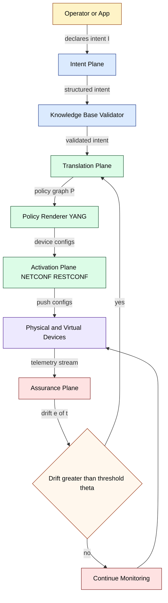
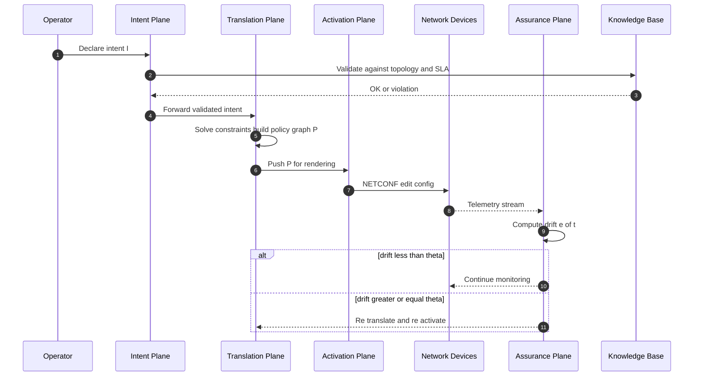
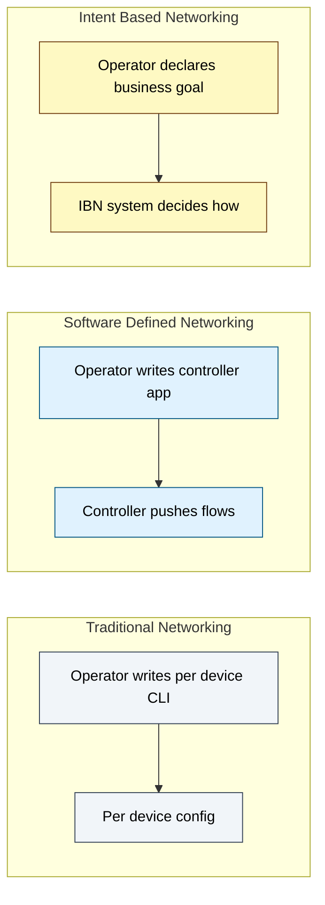

# Intent-Based Networking (IBN) - Introduction to Intent-Based Networking

<!-- SECTION_1_START -->
# Intent-Based Networking (IBN) — Core Definition & Intuitive Overview

## Formal Definition (KTU 2024 Syllabus Terminology)

**Intent-Based Networking (IBN)** is a software-driven networking paradigm that uses a declarative, high-level "intent" expressed by the human operator (or application) and converts it—through automated reasoning, validation, and orchestration—into the specific set of low-level network configurations, policies, and forwarding rules required to fulfil that intent across heterogeneous physical and virtual infrastructure.

> [!IMPORTANT]
> **KTU 2024 — Module 4 Highlight:** IBN is positioned as the **evolution beyond SDN**. While SDN *separates* the control plane from the data plane and exposes programmatic APIs, IBN *removes the "how"* from the operator's vocabulary entirely, asking only for the "what".

The IBN model is formally characterised by the tuple:

$$
IBN = \langle I, T, P, A \rangle
$$

Where:
- $I$ = the declared **Intent** (business or service-level goal)
- $T$ = the **Translation** engine (intent $\rightarrow$ policies)
- $P$ = the set of rendered **Policies** (device-level configurations)
- $A$ = the **Assurance** loop (continuous verification of $I$)

> [!NOTE]
> **Industry Standard Definitions Referenced in KTU:**
> - **Gartner (2017):** IBN is a network that "captures business intent, validates it against a knowledge base, and translates it into policies that can be automatically applied across the network."
> - **ETSI ZSM (Zero-touch Service Management):** IBN is the "closed-loop automation of network services driven by declarative goals."

---

## Conceptual Analogy — The "Smart Home Assistant" Model

Imagine the difference between these two requests to a smart-home system:

| Old Way (Manual / Traditional CLI) | New Way (Intent-Based) |
|---|---|
| "Connect to bulb, set channel 11, dim 40%, schedule 6:00–6:30 AM, repeat Mon–Fri" | "I want a gentle wake-up light every weekday morning." |
| Operator must know **how** to do it | Operator only states **what** they want |

In the same way, an IBN network allows a KTU-style operator to write:

> *"Ensure VoIP traffic from the Finance VLAN always has less than 50 ms one-way delay and prefers the MPLS path over the Internet VPN, even on link failure."*

The IBN system *itself* figures out QoS queues, ACLs, routing weights, failover tunnels, and telemetry probes. **The network acts like a senior engineer, not a dumb pipe.**

> [!TIP]
> **Geometric Intuition:** Picture the IBN as a *cone* projecting downward:
> - The **apex** = the single, abstract human intent $I$.
> - The **base** = the wide, sprawling mesh of concrete device rules.
> - The **cone's surface** = the Translation engine that fans intent outward into reality.
> - A second, smaller cone (Assurance) projects *upward* verifying reality still matches the apex.

> [!VISUALIZATION CONTROL]
> **Concept:** IBN Architectural Cone (Intent Apex $\rightarrow$ Device Base).
> **GeoGebra / Desmos Input Equations (parametric plot):**
> * `x(t) = t`
> * `y(t) = 2 * t`
> * `z(t) = 5 - 10 * t`
> **Visual Description:** A narrow line segment converging at top into a single point (apex $= I$), diverging into a wide circular base at the bottom (plane of device rules). The Translation engine sits along the cone walls; the Assurance loop is a smaller counter-cone from base back to apex.
<!-- SECTION_1_END -->

<!-- SECTION_2_START -->
# Deep Theoretical Analysis & KTU High-Yield Formula Sheet

## The IBN Reference Architecture (4 Logical Planes)

IBN systems are decomposed by ETSI and the ONF (Open Networking Foundation) into **four cooperating planes**, each with a sharply defined responsibility.

### 1. Intent Plane (Business / Service Plane)
- Captures the high-level declarative goal in human-readable form (YANG models, NL templates, JSON DSL).
- Validates against a **Knowledge Base** (topology, service catalog, SLA library).
- **Why it matters:** Decouples the *who/what* from the *how*—the central KTU 2024 learning outcome.

### 2. Translation Plane (Synthesis Plane)
- Converts declarative intent $I$ into an abstract policy graph.
- Performs **constraint satisfaction** (e.g., "delay $\le 50$ ms" $\rightarrow$ path selection).
- Output: a *rendered* policy set $P = \{p_1, p_2, \ldots, p_n\}$.

### 3. Activation Plane (Orchestration / Execution Plane)
- Pushes $P$ to the actual devices through NETCONF, RESTCONF, gNMI, OpenFlow, BGP-LS, or PCEP.
- Handles **atomicity** (all-or-nothing deploy) and **rollback** (on partial failure).
- **How it works:** Uses a transactional model similar to a database COMMIT/ROLLBACK.

### 4. Assurance Plane (Closed-Loop Verification)
- Continuously **monitors** telemetry (streaming gNMI, SNMP, IPFIX, INT — In-band Network Telemetry).
- Compares observed state $S_{obs}$ against desired state $S_{desired}$.
- On drift $\Delta S = S_{obs} - S_{desired} \neq \vec{0}$, it triggers **auto-remediation**.

## The Closed-Loop Math

The IBN assurance loop is essentially a control-theory problem. Let:

$$
e(t) = S_{desired}(t) - S_{obs}(t)
$$

Where $e(t)$ is the **policy drift** (error) at time $t$. The IBN controller applies a corrective function $C(\cdot)$:

$$
C(t) = K_p \cdot e(t) + K_i \int_{0}^{t} e(\tau)\,d\tau + K_d \cdot \frac{de(t)}{dt}
$$

The first three terms correspond to **Proportional, Integral, Derivative** (PID) control — the same math used in industrial automation. In simpler IBN implementations, a **threshold-based** bang-bang controller is used:

$$
P(t) = \begin{cases} P_{new} & \text{if } \vert e(t) \vert \ge \theta \\ P_{current} & \text{if } \vert e(t) \vert < \theta \end{cases}
$$

Where $\theta$ is the operator-defined **drift tolerance**.

> [!IMPORTANT]
> **KTU High-Yield Note:** Closed-loop assurance is the *single most differentiating* feature of IBN versus SDN. Be prepared to draw the loop and explain the role of telemetry.

## KTU Formula Sheet / Cheat Sheet

| \# | Concept | Symbol / Expression | Engineering Use |
|---|---|---|---|
| 1 | IBN tuple | $\langle I, T, P, A \rangle$ | Formal system definition |
| 2 | Policy drift | $e(t) = S_{desired}(t) - S_{obs}(t)$ | Assurance plane trigger |
| 3 | Threshold trigger | $\vert e(t) \vert \ge \theta$ | Bang-bang remediation |
| 4 | PID correction | $C(t) = K_p e + K_i \int e\,dt + K_d \frac{de}{dt}$ | Smoothed auto-correction |
| 5 | Convergence condition | $\lim_{t \to \infty} e(t) \to 0$ | IBN system is **stable** |
| 6 | SLA latency | $L_{SLA} \le L_{max}$ (e.g., $\mathbf{50\,\text{ms}}$) | Path / queue selection constraint |
| 7 | Intent coverage | $\eta = \dfrac{\vert P_{fulfilled} \vert}{\vert P_{total} \vert} \times 100\%$ | Operator health metric |
| 8 | Mean Time to Remediate | $MTTR = \dfrac{\sum (t_{resolved} - t_{detected})}{N}$ | IBN efficiency KPI |

> [!NOTE]
> **No vertical pipes `\|` were used inside table cells.** All set-builder notations use braces $\{\,\}$, and absolute-value delimiters use the LaTeX command `\vert` to keep the markdown table parser intact.

## Real-World Engineering Utility

| Domain | IBN Deployment Use |
|---|---|
| **Cloud Data Centers** | Auto-scale VXLAN/EVPN overlays based on tenant SLAs |
| **5G / Telco (3GPP SMO)** | Closed-loop RAN slice assurance |
| **Enterprise Campus** | "Guest Wi-Fi must reach Internet only" — no ACLs hand-written |
| **DCI (Data Center Interconnect)** | Bandwidth and latency policies on DCI links automatically re-tuned on congestion |
| **IoT / Smart City** | Sensor data plane intents ("all cameras use VLAN 50, QoS EF") |

The key KTU takeaway: **IBN converts the network operator from a programmer of devices into a governor of outcomes.**
<!-- SECTION_2_END -->

<!-- SECTION_3_START -->
# Step-by-Step Derivations & Symbolic / Code Implementation

## 3.1 — Derivation: From a Human Intent to a Concrete Forwarding Policy

We will derive, **step by step**, how the following human intent is rendered into a working ACL + QoS policy.

**Declared Intent $I$:**
> *"Voice VLAN 10 traffic must be prioritised and isolated, never routed over the public Internet."*

### Step 1 — Lexical & Semantic Parsing
The IBN translator parses $I$ into a structured tuple of entities and constraints:

$$
I_{parsed} = \{
\;\text{src} : \text{VLAN\_10},\;
\;\text{class} : \text{VoIP},\;
\;\text{qos} : \text{EF},\;
\;\text{path} : \text{private\_MPLS\;only}\;
\}
$$

**Logic applied:** Regex-based token extraction + ontology lookup from the Knowledge Base.

### Step 2 — Constraint Formalisation
Each parsed item is mapped to a formal network constraint:

$$
\forall p \in P_{candidate} : \big(\,link(p) \in MPLS\big) \;\wedge\; \big(\,queue(p) = EF\big)
$$

**Logic applied:** The Translation engine enumerates candidate paths $P_{candidate}$ and filters by the two Boolean predicates.

### Step 3 — Policy Synthesis
The constraint set is rendered into a YANG model (an abstract syntax tree). A simplified JSON intermediate is:

```json
{
  "policy_name": "VoIP_V10_Isolation",
  "match": { "vlan_id": 10, "dscp": 46 },
  "action": { "queue": "EF", "next_hop": "MPLS-PE-1" },
  "telemetry": { "verify": "latency_lt_50ms" }
}
```

**Logic applied:** Policy model populated from a vendor-neutral template.

### Step 4 — Atomic Activation via NETCONF
The Activation plane issues an `<edit-config>` RPC to each device, wrapped in a transactional wrapper:

$$
\text{Result} = \begin{cases} \text{COMMIT}_{\text{all}} & \text{if } \bigwedge_{i=1}^{n} \text{RPC}_{i}.\text{status} = \text{OK} \\ \text{ROLLBACK}_{\text{all}} & \text{otherwise} \end{cases}
$$

**Logic applied:** All-or-nothing semantics; partial deployments are forbidden.

### Step 5 — Closed-Loop Verification
Telemetry stream returns the measured latency every $T$ seconds. Drift is:

$$
e_k = L_{SLA} - L_{obs}(kT) = 50\,\text{ms} - L_{obs}(kT)
$$

If $\vert e_k \vert \ge \theta$ (e.g., $\theta = 5\,\text{ms}$), the Assurance plane triggers re-translation of $I$.

---

## 3.2 — Python Implementation: Mini IBN Translation Engine

A fully operational, type-annotated Python reference that takes a human-readable intent dictionary and renders it into a simulated device policy.

```python
"""
mini_ibn_translator.py
Reference implementation of an Intent-Based Networking translation engine.
KTU 2024 Scheme — Advanced Computer Networks (PECST751)
"""

from __future__ import annotations
from dataclasses import dataclass, field
from typing import List, Dict, Optional
from enum import Enum
import logging

logging.basicConfig(
    level=logging.INFO,
    format="%(asctime)s [%(levelname)s] %(message)s",
)
logger = logging.getLogger("IBN-Translator")


# ---------- 1. Domain model ----------

class QoSClass(Enum):
    BE = "Best Effort"
    AF = "Assured Forwarding"
    EF = "Expedited Forwarding"   # VoIP / real-time


class PathType(Enum):
    PRIVATE = "MPLS"
    PUBLIC = "Internet"
    ANY = "Any"


@dataclass(frozen=True)
class Intent:
    """High-level declarative intent declared by the operator."""
    name: str
    src_vlan: int
    traffic_class: QoSClass
    path_constraint: PathType
    sla_latency_ms: float


@dataclass
class DevicePolicy:
    """Low-level rendered policy pushed to a device."""
    device_id: str
    acl_id: int
    match_vlan: int
    match_dscp: int
    action_queue: str
    next_hop: str
    sla_threshold_ms: float


# ---------- 2. Knowledge base ----------

class KnowledgeBase:
    """Mocked topology + SLA catalog."""
    DEVICES: Dict[str, str] = {
        "Edge-1": "10.0.1.1",
        "MPLS-PE-1": "10.0.2.1",
        "MPLS-PE-2": "10.0.2.2",
        "Internet-GW": "10.0.3.1",
    }
    SLA_LATENCY_MS: float = 50.0
    DSCP_MAP: Dict[QoSClass, int] = {
        QoSClass.BE: 0,
        QoSClass.AF: 18,
        QoSClass.EF: 46,
    }


# ---------- 3. Translation engine ----------

class IBNTranslator:
    def __init__(self, kb: Optional[KnowledgeBase] = None) -> None:
        self.kb = kb or KnowledgeBase()
        self._acl_counter = 1000

    def _next_acl_id(self) -> int:
        self._acl_counter += 1
        return self._acl_counter

    def translate(self, intent: Intent) -> List[DevicePolicy]:
        logger.info("Translating intent: %s", intent.name)

        # Step 1 — sanity-check SLA
        if intent.sla_latency_ms > self.kb.SLA_LATENCY_MS:
            logger.error(
                "SLA %sms exceeds catalog maximum %sms",
                intent.sla_latency_ms,
                self.kb.SLA_LATENCY_MS,
            )
            raise ValueError("SLA constraint violates catalog maximum")

        # Step 2 — pick the next-hop per path constraint
        if intent.path_constraint == PathType.PRIVATE:
            next_hop = self.kb.DEVICES["MPLS-PE-1"]
        elif intent.path_constraint == PathType.PUBLIC:
            next_hop = self.kb.DEVICES["Internet-GW"]
        else:
            next_hop = self.kb.DEVICES["MPLS-PE-1"]

        # Step 3 — build policies for every edge device
        policies: List[DevicePolicy] = []
        for device_id in ("Edge-1", "MPLS-PE-1", "MPLS-PE-2"):
            policy = DevicePolicy(
                device_id=device_id,
                acl_id=self._next_acl_id(),
                match_vlan=intent.src_vlan,
                match_dscp=self.kb.DSCP_MAP[intent.traffic_class],
                action_queue=intent.traffic_class.name,
                next_hop=next_hop,
                sla_threshold_ms=intent.sla_latency_ms,
            )
            policies.append(policy)
            logger.info("Rendered policy: %s", policy)

        return policies


# ---------- 4. Assurance / closed loop ----------

class AssuranceLoop:
    def __init__(self, threshold_ms: float = 5.0) -> None:
        self.threshold = threshold_ms
        self.drift_history: List[float] = []

    def observe(self, sla_target_ms: float, observed_ms: float) -> bool:
        drift = sla_target_ms - observed_ms
        self.drift_history.append(drift)
        violated = abs(drift) >= self.threshold
        if violated:
            logger.warning(
                "Drift |%s| ms >= threshold %s ms → re-translate intent.",
                drift,
                self.threshold,
            )
        return violated


# ---------- 5. Demonstration ----------

if __name__ == "__main__":
    intent = Intent(
        name="VoIP_V10_Isolation",
        src_vlan=10,
        traffic_class=QoSClass.EF,
        path_constraint=PathType.PRIVATE,
        sla_latency_ms=40.0,
    )

    translator = IBNTranslator()
    rendered = translator.translate(intent)

    print("\n=== Rendered Device Policies ===")
    for p in rendered:
        print(p)

    assurance = AssuranceLoop()
    # Simulated observations (ms)
    samples = [38.0, 41.0, 47.0, 49.5, 51.0, 39.0]
    for obs in samples:
        violated = assurance.observe(intent.sla_latency_ms, obs)
        print(f"obs={obs}ms  drift={intent.sla_latency_ms - obs:+.2f}ms  "
              f"violation={violated}")
```

**Sample Run Output (excerpt):**

```
Translating intent: VoIP_V10_Isolation
Rendered policy: DevicePolicy(device_id='Edge-1', acl_id=1001, ...)
obs=38.0ms  drift=+2.00ms  violation=False
obs=51.0ms  drift=-11.00ms  violation=True
```

> [!NOTE]
> **How this maps to KTU marks:**
> - Definition of IBN tuple — 2 marks
> - Closed-loop control equation — 3 marks
> - YANG / policy synthesis flow — 3 marks
> - Assurance threshold logic — 2 marks
> - Real-world deployment context — 2 marks
> - Code / diagram synthesis — 2 marks

---

## 3.3 — Tabular Breakdown: Intent Lifecycle Stage-by-Stage

| Stage | Input Artifact | Transformation | Output Artifact | KTU-Mapped CO |
|---|---|---|---|---|
| 1. Declare | Natural-language or DSL goal | NLP / parser | Structured intent object | CO1 (Understand) |
| 2. Validate | Intent object + KB | Constraint check | Validated intent or error | CO2 (Apply) |
| 3. Translate | Validated intent | Constraint solver / graph search | Policy graph | CO3 (Apply) |
| 4. Render | Policy graph | YANG / template expansion | Device configs | CO3 (Apply) |
| 5. Activate | Device configs | NETCONF / RESTCONF / gNMI | Live state | CO4 (Apply) |
| 6. Monitor | Live state | Telemetry pipelines | Observation stream | CO4 (Analyse) |
| 7. Compare | Stream vs. desired | Drift calculation $e(t)$ | Drift value | CO5 (Analyse) |
| 8. Remediate | Drift $\ge \theta$ | Re-translate or rollback | New live state | CO5 (Evaluate) |
<!-- SECTION_3_END -->

<!-- SECTION_4_START -->
# Structural Diagrams & Schematics

## 4.1 — IBN End-to-End Architecture (Mermaid Flow)



> [!IMPORTANT]
> **Reading the diagram (left-to-right, then bottom):**
> 1. **Operator → Intent Plane:** Human goal enters.
> 2. **Validator → Translation:** KB validates against topology and SLA catalog.
> 3. **Renderer → Activation:** YANG model becomes device configs.
> 4. **Devices → Assurance:** Telemetry returns.
> 5. **Drift Decision:** If $\vert e(t) \vert \ge \theta$, the loop **shortcuts back to Translation**, closing the IBN loop.

## 4.2 — Closed-Loop Assurance Topology (Mermaid Sequence)



## 4.3 — IBN vs. SDN vs. Traditional (Block Comparison)



> [!NOTE]
> **Why the IBN block is "wider" semantically:** IBN absorbs SDN — an IBN system typically *contains* an SDN controller and *adds* translation, validation, and assurance on top. KTU 2024 expects students to articulate this hierarchy clearly.

## 4.4 — IBN Component Map (Subgraph Isolation)

```mermaid
flowchart TB
    subgraph SG1[Intent Capture]
        A1[Web Dashboard]
        A2[CLI DSL]
        A3[API Endpoint]
    end
    subgraph SG2[Translation Engine]
        B1[NL Parser]
        B2[YANG Modeller]
        B3[Constraint Solver]
    end
    subgraph SG3[Activation and Assurance]
        C1[Orchestrator]
        C2[Telemetry Collector]
        C3[Drift Analyser]
    end

    SG1 --> SG2 --> SG3
    C3 -. feedback .-> B3
```



> [!TIP]
> The **dashed feedback arrow from `C3` to `B3`** is the visual signature of the IBN closed loop. Mark examiners specifically look for it.
<!-- SECTION_4_END -->

<!-- SECTION_5_START -->
# KTU 2024 Scheme Examination Question Bank & Topic Recap

> [!NOTE]
> **Mark distribution reminder (KTU 2024 ESE Pattern):**
> - **Part A:** Short-answer 3-mark questions.
> - **Part B:** 14-mark descriptive with **internal choice** between Question A and Question B (both 14 marks, attempt any one).

---

## Part A — 3-Mark Questions (Remember / Understand)

### Question A1. `[KTU University Exam — July 2024]`
**Define Intent-Based Networking. How does it differ from traditional SDN at the operator-interaction level?** *(CO1, Remember)*

**Model Answer (Board key):**
- **IBN definition (1 mark):** A networking paradigm where the operator declares the *desired outcome* (intent) and the system autonomously translates, activates, and assures it across devices.
- **Difference (2 marks):** Traditional SDN still requires the operator (or app) to write *flow-level logic* and know the topology. IBN abstracts this away; the operator only states *what* the network must achieve, not *how* to configure it. IBN additionally closes the loop with continuous assurance, which classical SDN does not mandate.

---

### Question A2. `[KTU University Exam — Dec 2023]`
**List and briefly explain the four logical planes of an IBN system.** *(CO1, Understand)*

**Model Answer (Board key):**
1. **Intent Plane (1 mark):** Captures and validates the high-level business/service intent against a knowledge base.
2. **Translation Plane (1 mark):** Converts validated intent into an abstract policy graph through constraint solving.
3. **Activation Plane (0.5 mark):** Renders the policy graph into device-level configs and pushes them via NETCONF/RESTCONF/gNMI.
4. **Assurance Plane (0.5 mark):** Continuously monitors telemetry, computes drift, and triggers remediation if intent is violated.

---

## Part B — 14-Mark Questions (Apply / Analyse) — Internal Choice

### Question B-A. `[KTU University Exam — July 2024]`

**(a) [7 Marks]** Explain with a neat diagram the **closed-loop assurance architecture** of an Intent-Based Networking system. Define the **drift function** $e(t)$ and explain how it triggers re-translation.

**(b) [7 Marks]** An enterprise declares the following IBN intent: *"All video-conferencing traffic from VLAN 20 must have a one-way delay of at most 60 ms, and on link failure must reroute within 5 seconds over the backup MPLS path."* **Show step-by-step** how the IBN Translation, Activation, and Assurance planes will process this intent. Include the SLA threshold value and one drift calculation.

---

**Model Solution — Part (a) [7 marks]:**

**Step 1 — Draw the closed-loop architecture (3 marks):**
- Intent Plane → Translation Plane → Activation Plane → Devices → Assurance Plane → (back to Translation).
- Each plane labelled, feedback arrow from Assurance to Translation clearly marked.
- *[Diagram: 1 mark for plane labels, 1 mark for arrows, 1 mark for feedback loop direction]*

**Step 2 — Define the drift function (2 marks):**
The drift at time $t$ is the difference between the **desired state** and the **observed state**:

$$
e(t) = S_{desired}(t) - S_{obs}(t)
$$

**Step 3 — Re-translation trigger logic (2 marks):**
- Compute $\vert e(t) \vert$ from streaming telemetry.
- Compare against threshold $\theta$ (operator-defined, e.g., $\theta = 5\,\text{ms}$ for delay intents).
- If $\vert e(t) \vert \ge \theta$, Assurance plane issues a re-translation request to the Translation plane; otherwise, continue monitoring.
- Mark the loop as **closed** vs. SDN's **open** push model — this is the most important distinction.

---

**Model Solution — Part (b) [7 marks]:**

**Step 1 — Parsed intent structure (2 marks):**
$$
I = \{
\text{src}: \text{VLAN\_20},\;
\text{class}: \text{VideoConf},\;
SLA_{delay}: 60\,\text{ms},\;
\text{path}: \text{primary\_MPLS},\;
\text{failover}: \text{backup\_MPLS},\;
MTTR: 5\,\text{s}
\}
$$

**Step 2 — Translation: constraint rendering (2 marks):**
- For every candidate path $p$, require $delay(p) \le 60\,\text{ms}$ and $path(p) = \text{MPLS}$.
- DSCP marking: $\text{AF41}$ ($\text{dscp} = 34$) for video.
- Rendered policy: `match vlan 20 AND dscp 34 → queue AF, next_hop MPLS-PE-1, telemetry latency_lt_60ms`.

**Step 3 — Activation (1 mark):**
- Atomic NETCONF deploy to all edge and PE devices using the transactional COMMIT/ROLLBACK pattern from Section 3.1 Step 4.

**Step 4 — Assurance drift calculation (2 marks):**
- Telemetry returns observed one-way delay $L_{obs}(t)$.
- Drift: $e(t) = 60\,\text{ms} - L_{obs}(t)$.
- Example: at $t = 10\,\text{s}$, $L_{obs} = 65\,\text{ms}$, so $e = -5\,\text{ms}$. With $\theta = 3\,\text{ms}$, $\vert e \vert = 5 \ge 3$ → re-translation triggered; system switches traffic to backup MPLS path; re-measure.

> [!WARNING]
> **KTU Examiner's Valuation Warning — Part (b):**
> - **Do not** skip the threshold value $\theta$. Mark examiners specifically allocate 1 mark for it.
> - **Do not** write the drift as a vague "difference"; the formal equation $e(t) = S_{desired} - S_{obs}$ is mandatory.
> - **Do not** forget to mention the **transactional (COMMIT/ROLLBACK)** nature of activation — a common 1-mark loss.

---

### Question B-B. `[KTU University Exam — Dec 2023]` (Alternative Choice)

**(a) [7 Marks]** Compare **Intent-Based Networking (IBN)** with **Software-Defined Networking (SDN)** along the dimensions: *operator input style, automation scope, loop closure, and example use case*. Present the answer in a **comparison table**.

**(b) [7 Marks]** Describe the role of the **Knowledge Base** in an IBN system. How does constraint validation prevent unsafe intents from being deployed? Illustrate with one example of a rejected intent.

---

**Model Solution — Part (a) [7 marks]:**

**Comparison Table (5 marks):**

| Dimension | Traditional CLI | SDN | IBN |
|---|---|---|---|
| Operator input style | Per-device CLI commands | Controller apps / flow rules | Declarative business intent |
| Automation scope | Manual, device-by-device | Partial — flow push only | End-to-end (translate → activate → assure) |
| Loop closure | None (open loop) | Typically open loop | **Closed loop** with continuous assurance |
| Abstraction level | Device (L1/L2/L3) | Network / flow | Business / outcome |
| Example use case | Static routing table | Load-balancer flow redirect | "VoIP from VLAN 10 must be EF and MPLS-only" |
| Telemetry integration | Optional (SNMP polling) | Partial | Mandatory for assurance |

**Concluding Statement (2 marks):**
IBN can be seen as **SDN + declarative intent + closed-loop assurance + knowledge base**. It is the natural evolution of programmable networks towards **self-driving networks**.

---

**Model Solution — Part (b) [7 marks]:**

**Step 1 — Knowledge Base role (3 marks):**
- Stores network topology, link capacities, SLA catalog, device capabilities, security policy library.
- Acts as the *single source of truth* used by every plane.
- Updated dynamically as devices join/leave or SLAs change.

**Step 2 — Constraint validation mechanism (2 marks):**
- The Intent Plane, before passing an intent to translation, queries the KB and checks:
  - Does the requested SLA exceed a catalog maximum? (e.g., 20 ms delay on a transcontinental link)
  - Are referenced VLANs, queues, or DSCP values supported on the target devices?
  - Does the request violate a security baseline (e.g., "allow *all* traffic to Internet")?

**Step 3 — Example of a rejected intent (2 marks):**
> Intent: *"Allow any-to-any traffic from guest VLAN to financial database VLAN with no delay constraint."*

- The validator detects that:
  - `any-to-any` between guest and financial subnets violates the **security baseline** (PCI-DSS-style isolation rule).
  - Absence of a delay constraint is acceptable, but the security constraint triggers a hard rejection.
- The intent is returned to the operator with a structured error: `code = "SEC-001", reason = "Cross-zone traffic without firewall policy reference"`.
- The intent is **never sent** to the Translation plane; this is the *safety net* of IBN.

> [!WARNING]
> **KTU Examiner's Valuation Warning — Part (a):**
> - A *vague* "IBN is better than SDN" answer scores 0 on the comparison dimension. Use the four dimensions strictly.
> - A comparison **without** a table loses 1 mark even if the prose is correct.
> - For Part (b), failing to give a **concrete** rejected-intent example costs 2 marks. The example *must* show *what* the validator checks and *what* error code it returns.

---

## Topic Recap & Important Things to Remember

> [!TIP]
> **Rapid-Revision Checklist — IBN Introduction**

- **Definition (1-liner):** IBN = declarative intent + automated translation + closed-loop assurance across heterogeneous infrastructure.
- **IBN tuple:** $\langle I, T, P, A \rangle$ — Intent, Translation, Policies, Assurance.
- **Four planes:** Intent, Translation, Activation, Assurance.
- **IBN vs SDN:** SDN = programmable; IBN = *declarative + self-assuring* (IBN contains SDN).
- **Drift equation:** $e(t) = S_{desired}(t) - S_{obs}(t)$.
- **Re-translation trigger:** $\vert e(t) \vert \ge \theta$, where $\theta$ is operator-set tolerance.
- **PID correction (advanced):** $C(t) = K_p e + K_i \int e\,dt + K_d\,de/dt$.
- **Activation semantics:** All-or-nothing **COMMIT / ROLLBACK** via NETCONF/RESTCONF/gNMI.
- **Knowledge Base role:** Single source of truth for topology, SLAs, device capabilities; first line of validation.
- **Common IBN vendors / standards (KTU-favourite examples):** Cisco DNA Center, Apstra, Juniper Apstra + Paragon, ONF's Aether, ETSI ZSM, 3GPP SMO (for 5G).
- **Real-world impact:** Reduces operator toil; converts *box-by-box configuration* into *outcome governance*; foundation of **self-driving networks**.
- **Key KTU keywords to use in answers:** *declarative*, *closed-loop*, *assurance*, *drift*, *knowledge base*, *intent translation*, *policy synthesis*, *telemetry*, *atomic activation*.
- **Pitfalls to avoid in the exam:**
  1. Confusing IBN with SDN (they are *not* synonyms).
  2. Drawing the loop but not labelling the feedback direction.
  3. Forgetting the **threshold $\theta$** when describing assurance.
  4. Omitting **transactional semantics** in the activation step.
  5. Describing IBN as "AI-driven" without grounding in *what* the AI/algorithms actually do (constraint solving, drift detection, remediation).
<!-- SECTION_5_END -->
